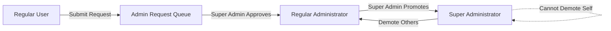
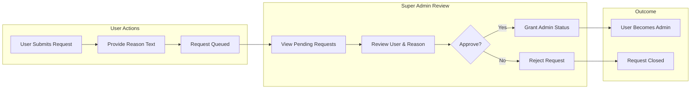
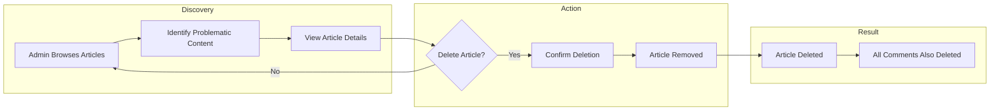
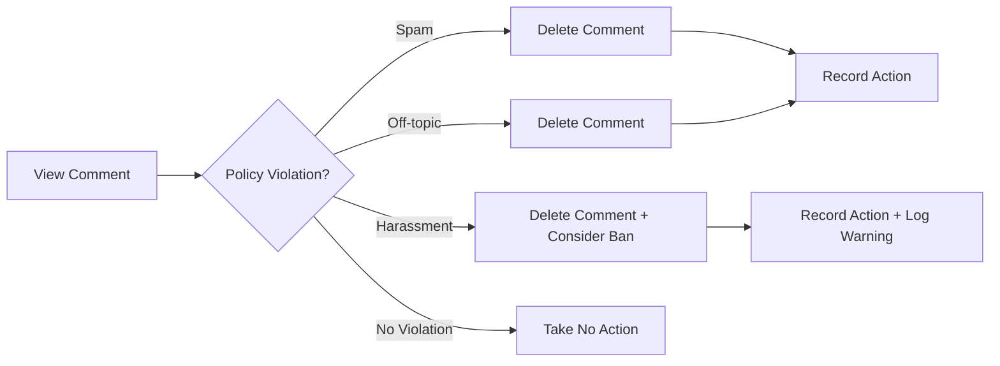
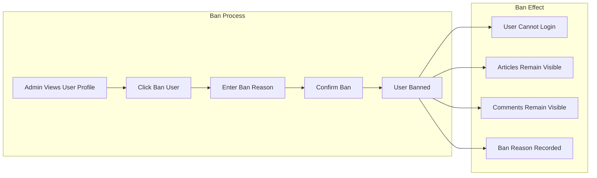
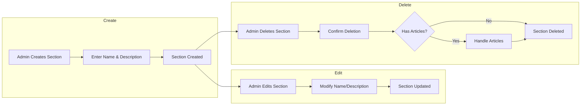
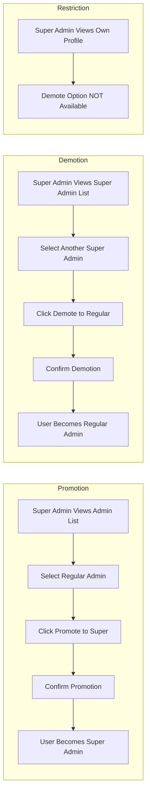

# Administrator Scenarios

## Executive Summary

This document provides comprehensive administrator workflows and scenarios for the Economic/Political Discussion Board platform. Administrators form a two-tier hierarchy responsible for platform governance, content moderation, and user management. All admin actions follow structured workflows with proper authorization checks and audit trails.

## Admin Hierarchy Overview

The platform implements a two-tier administrator system to distribute management responsibilities and maintain system integrity.

### Permission Hierarchy

| Action | Regular Admin | Super Admin |
|--------|---------------|-------------|
| Manage Sections | ✅ | ✅ |
| Delete Any Article | ✅ | ✅ |
| Delete Any Comment | ✅ | ✅ |
| Ban/Unban Users | ✅ | ✅ |
| View Banned Users | ✅ | ✅ |
| Approve Admin Requests | ❌ | ✅ |
| Promote Admins | ❌ | ✅ |
| Demote Super Admins | ❌ | ✅ |
| Write Articles/Comments | ✅ | ✅ |
| Edit Own Profile | ✅ | ✅ |

---

## 1. Admin Request Workflow

### Overview
Any authenticated user can request to become an administrator. This request enters a queue that only super administrators can review.

### Complete Request Flow

### Detailed Scenario Steps

#### Scenario 1.1: User Submits Admin Request

**Actor**: Regular authenticated user
**Precondition**: User is logged in and does not have admin privileges

| Step | Action | System Response |
|------|--------|----------------|
| 1 | User navigates to admin request page | WHEN user accesses admin request page, THE system SHALL display request form |
| 2 | User enters reason for admin request | THE system SHALL accept text input up to reasonable length |
| 3 | User submits request | WHEN user submits request, THE system SHALL create pending admin request record |
| 4 | System confirms submission | THE system SHALL display confirmation message to user |

**EARS Requirements:**
- WHEN a user submits an admin request, THE system SHALL record the user ID, reason text, and submission timestamp
- THE system SHALL prevent duplicate pending requests from the same user
- WHILE a user has a pending admin request, THE system SHALL prevent submission of another request

#### Scenario 1.2: Super Admin Views Pending Requests

**Actor**: Super administrator
**Precondition**: User is logged in as super administrator

| Step | Action | System Response |
|------|--------|----------------|
| 1 | Super admin navigates to admin panel | THE system SHALL display admin management options |
| 2 | Super admin selects "Pending Requests" | WHEN super admin requests pending list, THE system SHALL display all pending admin requests |
| 3 | System shows request list | THE system SHALL display for each request: username, reason, submission date |

**EARS Requirements:**
- WHEN a super administrator views admin requests, THE system SHALL display all requests with status "pending"
- THE system SHALL sort pending requests by submission date, newest first

#### Scenario 1.3: Super Admin Approves Request

**Actor**: Super administrator
**Precondition**: Super admin is viewing pending requests list

| Step | Action | System Response |
|------|--------|----------------|
| 1 | Super admin selects a request | THE system SHALL display full request details |
| 2 | Super admin clicks "Approve" | WHEN super admin approves request, THE system SHALL update user's permission level to "administrator" |
| 3 | System updates user status | THE system SHALL mark request as "approved" with approval timestamp and approver ID |
| 4 | System removes from pending queue | THE system SHALL remove request from pending list |

**EARS Requirements:**
- WHEN a super administrator approves an admin request, THE system SHALL grant the requesting user regular administrator privileges
- THE system SHALL record the approval with timestamp and approving super administrator's ID
- IF the request is approved, THEN THE system SHALL immediately update the user's permission level

#### Scenario 1.4: Super Admin Rejects Request

**Actor**: Super administrator
**Precondition**: Super admin is viewing pending requests list

| Step | Action | System Response |
|------|--------|----------------|
| 1 | Super admin selects a request | THE system SHALL display full request details |
| 2 | Super admin clicks "Reject" | WHEN super admin rejects request, THE system SHALL mark request as "rejected" |
| 3 | System records rejection | THE system SHALL record rejection with timestamp and rejecting admin's ID |
| 4 | System removes from pending queue | THE system SHALL remove request from pending list |

**EARS Requirements:**
- WHEN a super administrator rejects an admin request, THE system SHALL mark the request as "rejected"
- THE user who submitted the request SHALL retain their current permission level
- THE system SHALL allow rejected users to submit new admin requests

---

## 2. Content Moderation Workflow

### Overview
Administrators can moderate all content on the platform, including articles and comments. Moderation actions are typically deletions when content violates platform policies.

### Article Moderation Flow

### Detailed Scenario Steps

#### Scenario 2.1: Admin Deletes Article

**Actor**: Administrator (regular or super)
**Precondition**: Admin is logged in, article exists

| Step | Action | System Response |
|------|--------|----------------|
| 1 | Admin browses to article | THE system SHALL display article with full content |
| 2 | Admin identifies policy violation | Admin determines article violates community guidelines |
| 3 | Admin clicks "Delete Article" | WHEN admin initiates deletion, THE system SHALL prompt for confirmation |
| 4 | Admin confirms deletion | WHEN admin confirms, THE system SHALL permanently delete the article |
| 5 | System processes deletion | THE system SHALL delete article, all associated comments, and file attachments |

**EARS Requirements:**
- WHEN an administrator deletes an article, THE system SHALL remove the article and all associated comments from the platform
- IF an article is deleted by an administrator, THEN THE system SHALL also delete all file and image attachments
- THE system SHALL record the deletion action with administrator ID, timestamp, and article ID for audit purposes

#### Scenario 2.2: Admin Deletes Comment

**Actor**: Administrator (regular or super)
**Precondition**: Admin is logged in, comment exists on an article

| Step | Action | System Response |
|------|--------|----------------|
| 1 | Admin views article with comments | THE system SHALL display article and all comments |
| 2 | Admin identifies problematic comment | Admin determines comment violates community guidelines |
| 3 | Admin clicks "Delete Comment" | WHEN admin initiates deletion, THE system SHALL prompt for confirmation |
| 4 | Admin confirms deletion | WHEN admin confirms, THE system SHALL permanently delete the comment |
| 5 | System processes deletion | THE system SHALL remove comment from article's comment list |

**EARS Requirements:**
- WHEN an administrator deletes a comment, THE system SHALL remove the comment from the article
- THE system SHALL update the article's comment count to reflect the deletion
- THE system SHALL maintain the order of remaining comments

### Comment Moderation Decision Matrix

---

## 3. User Management Workflow

### Overview
Administrators manage user accounts through the banning system. Banned users cannot access the platform, but their content remains visible.

### Banning Flow

### Detailed Scenario Steps

#### Scenario 3.1: Admin Bans User

**Actor**: Administrator (regular or super)
**Precondition**: Admin is logged in, target user exists and is not banned

| Step | Action | System Response |
|------|--------|----------------|
| 1 | Admin navigates to user profile | THE system SHALL display user profile page |
| 2 | Admin clicks "Ban User" option | WHEN admin initiates ban, THE system SHALL display ban form |
| 3 | Admin enters ban reason | THE system SHALL require and accept text reason for ban |
| 4 | Admin confirms ban action | WHEN admin confirms, THE system SHALL set user status to "banned" |
| 5 | System records ban | THE system SHALL record: user ID, admin ID, ban reason, timestamp |

**EARS Requirements:**
- WHEN an administrator bans a user, THE system SHALL set the user's account status to "banned"
- THE system SHALL require a ban reason text before processing the ban
- THE system SHALL record the ban with: banned user ID, banning admin ID, reason, and timestamp
- IF a user is banned, THEN THE system SHALL prevent that user from logging in
- WHEN a banned user attempts to login, THE system SHALL display an appropriate error message

#### Scenario 3.2: Banned User Attempts Login

**Actor**: Banned user
**Precondition**: User account has "banned" status

| Step | Action | System Response |
|------|--------|----------------|
| 1 | User enters login credentials | THE system SHALL validate credentials |
| 2 | System checks account status | WHEN credentials are valid, THE system SHALL check account status |
| 3 | System detects banned status | IF user is banned, THEN THE system SHALL reject the login attempt |
| 4 | System displays error message | THE system SHALL display "Your account has been banned" message |

**EARS Requirements:**
- WHEN a banned user attempts to authenticate, THE system SHALL reject the authentication
- THE system SHALL NOT reveal specific ban reasons during login rejection
- THE system SHALL NOT allow banned users to access any authenticated endpoints

#### Scenario 3.3: Admin Views Banned Users List

**Actor**: Administrator (regular or super)
**Precondition**: Admin is logged in

| Step | Action | System Response |
|------|--------|----------------|
| 1 | Admin navigates to admin panel | THE system SHALL display admin management options |
| 2 | Admin clicks "Banned Users" | WHEN admin requests banned users list, THE system SHALL display all banned users |
| 3 | System shows banned users | THE system SHALL display: username, ban date, ban reason for each banned user |

**EARS Requirements:**
- WHEN an administrator views the banned users list, THE system SHALL display all users with status "banned"
- THE system SHALL include for each banned user: display name, ban date, and ban reason

#### Scenario 3.4: Admin Unbans User

**Actor**: Administrator (regular or super)
**Precondition**: Admin is logged in, target user is currently banned

| Step | Action | System Response |
|------|--------|----------------|
| 1 | Admin views banned users list | THE system SHALL display list of banned users |
| 2 | Admin selects a banned user | THE system SHALL display user details and ban information |
| 3 | Admin clicks "Unban User" | WHEN admin initiates unban, THE system SHALL prompt for confirmation |
| 4 | Admin confirms unban action | WHEN admin confirms, THE system SHALL set user status to "active" |
| 5 | System restores user access | THE system SHALL allow user to login again |

**EARS Requirements:**
- WHEN an administrator unbans a user, THE system SHALL set the user's account status to "active"
- THE system SHALL record the unban action with: unbanned user ID, unbanning admin ID, and timestamp
- WHEN a user is unbanned, THE system SHALL allow that user to authenticate normally

---

## 4. Section Management Workflow

### Overview
Administrators create, edit, and delete discussion sections. Sections organize topics for users to browse and post articles.

### Section Lifecycle

### Detailed Scenario Steps

#### Scenario 4.1: Admin Creates Section

**Actor**: Administrator (regular or super)
**Precondition**: Admin is logged in

| Step | Action | System Response |
|------|--------|----------------|
| 1 | Admin navigates to admin panel | THE system SHALL display admin options |
| 2 | Admin clicks "Manage Sections" | THE system SHALL display section management page |
| 3 | Admin clicks "Create New Section" | THE system SHALL display section creation form |
| 4 | Admin enters section name | THE system SHALL require unique section name |
| 5 | Admin enters section description | THE system SHALL accept description text |
| 6 | Admin submits form | WHEN admin submits, THE system SHALL create new section |
| 7 | System confirms creation | THE system SHALL display new section in section list |

**EARS Requirements:**
- WHEN an administrator creates a section, THE system SHALL accept section name and description
- THE system SHALL ensure section names are unique across the platform
- IF a section name already exists, THEN THE system SHALL reject the creation and display an error

#### Scenario 4.2: Admin Edits Section

**Actor**: Administrator (regular or super)
**Precondition**: Admin is logged in, section exists

| Step | Action | System Response |
|------|--------|----------------|
| 1 | Admin views section list | THE system SHALL display all sections |
| 2 | Admin clicks "Edit" on a section | THE system SHALL display edit form with current values |
| 3 | Admin modifies name or description | THE system SHALL accept changes |
| 4 | Admin saves changes | WHEN admin saves, THE system SHALL update section |
| 5 | System confirms update | THE system SHALL display updated section information |

**EARS Requirements:**
- WHEN an administrator edits a section, THE system SHALL allow modification of name and description
- IF the new name conflicts with another section, THEN THE system SHALL reject the change

#### Scenario 4.3: Admin Deletes Section

**Actor**: Administrator (regular or super)
**Precondition**: Admin is logged in, section exists

| Step | Action | System Response |
|------|--------|----------------|
| 1 | Admin views section list | THE system SHALL display all sections |
| 2 | Admin clicks "Delete" on a section | WHEN admin initiates deletion, THE system SHALL check for existing articles |
| 3 | System checks for articles | IF section contains articles, THE system SHALL warn about deletion impact |
| 4 | Admin confirms deletion | WHEN admin confirms, THE system SHALL delete section |
| 5 | System processes deletion | THE system SHALL remove section and handle associated articles appropriately |

**EARS Requirements:**
- WHEN an administrator deletes a section, THE system SHALL remove the section from the platform
- IF the section contains articles, THEN THE system SHALL either prevent deletion or handle article migration/referencing
- THE system SHALL ensure users cannot post new articles to deleted sections

---

## 5. Admin Hierarchy Management Workflow

### Overview
Super administrators manage the admin hierarchy, including promoting regular administrators to super admin status and demoting super administrators back to regular admin status.

### Hierarchy Management Rules

### Detailed Scenario Steps

#### Scenario 5.1: Super Admin Promotes Regular Admin

**Actor**: Super administrator
**Precondition**: User is logged in as super admin, target user is a regular administrator

| Step | Action | System Response |
|------|--------|----------------|
| 1 | Super admin views administrator list | THE system SHALL display all administrators with their permission levels |
| 2 | Super admin selects a regular admin | THE system SHALL display admin details and management options |
| 3 | Super admin clicks "Promote to Super Admin" | WHEN super admin initiates promotion, THE system SHALL prompt for confirmation |
| 4 | Super admin confirms promotion | WHEN super admin confirms, THE system SHALL update permission level to "super_administrator" |
| 5 | System updates permissions | THE system SHALL grant super admin privileges to the user |

**EARS Requirements:**
- WHEN a super administrator promotes a regular administrator, THE system SHALL update the user's permission level to "super_administrator"
- THE system SHALL grant all super administrator privileges immediately upon promotion
- THE system SHALL record the promotion with: promoted user ID, promoting super admin ID, and timestamp

#### Scenario 5.2: Super Admin Demotes Another Super Admin

**Actor**: Super administrator
**Precondition**: User is logged in as super admin, target user is also a super administrator (different from actor)

| Step | Action | System Response |
|------|--------|----------------|
| 1 | Super admin views administrator list | THE system SHALL display all administrators |
| 2 | Super admin selects another super admin | THE system SHALL display admin details |
| 3 | Super admin clicks "Demote to Regular Admin" | WHEN super admin initiates demotion, THE system SHALL prompt for confirmation |
| 4 | Super admin confirms demotion | WHEN super admin confirms, THE system SHALL update permission level to "administrator" |
| 5 | System updates permissions | THE system SHALL retain only regular admin privileges for the user |

**EARS Requirements:**
- WHEN a super administrator demotes another super administrator, THE system SHALL update the target's permission level to "administrator"
- THE system SHALL immediately revoke super administrator privileges from the demoted user
- THE system SHALL record the demotion with: demoted user ID, demoting super admin ID, and timestamp

#### Scenario 5.3: Self-Demotion Prevention

**Actor**: Super administrator
**Precondition**: User is logged in as super admin

| Step | Action | System Response |
|------|--------|----------------|
| 1 | Super admin views own profile | THE system SHALL display admin details |
| 2 | Super admin looks for demotion option | THE system SHALL NOT display any self-demotion option |
| 3 | Super admin cannot demote self | IF a super admin attempts to demote self, THEN THE system SHALL reject the action |

**EARS Requirements:**
- THE system SHALL NOT allow a super administrator to demote themselves
- IF a super administrator attempts to self-demote, THEN THE system SHALL display an appropriate error message
- WHERE a super administrator views their own profile, THE system SHALL hide or disable any self-demotion controls

### Admin Hierarchy Constraint Matrix

| Actor | Can Promote Regular Admin | Can Demote Super Admin | Can Demote Self |
|-------|---------------------------|------------------------|-----------------|
| Regular Admin | ❌ | ❌ | ❌ |
| Super Admin | ✅ | ✅ | ❌ |
| System (automatic) | ❌ | ❌ | ❌ |

---

## Error Handling in Admin Workflows

### Common Error Scenarios

#### Authentication Errors
- **Scenario**: Non-admin user attempts admin action
- **Response**: THE system SHALL return access denied and log the attempt

#### Authorization Errors
- **Scenario**: Regular admin attempts super admin action
- **Response**: THE system SHALL return permission denied with appropriate message

#### Data Validation Errors
- **Scenario**: Admin submits invalid data (empty section name)
- **Response**: THE system SHALL reject the action and display validation error

#### Resource Not Found Errors
- **Scenario**: Admin attempts to moderate non-existent content
- **Response**: THE system SHALL display "Resource not found" error

### Error Recovery Matrix

| Error Type | User Action | System Response |
|------------|-------------|-----------------|
| Access Denied | Redirect to login or home | Clear message explaining access restriction |
| Permission Denied | Display error, stay on page | List required permission level |
| Validation Error | Stay on form, show errors | Highlight invalid fields with messages |
| Not Found | Redirect to list page | Display "Item no longer exists" message |

---

## Audit Trail Requirements

### Actions Requiring Audit Logging

All administrative actions must be logged for accountability and transparency.

| Action Category | Specific Actions | Log Data Required |
|-----------------|------------------|-------------------|
| Admin Requests | Submit, Approve, Reject | User ID, Admin ID, Timestamp, Action, Reason |
| Content Moderation | Delete Article, Delete Comment | Admin ID, Content ID, Timestamp, Reason |
| User Management | Ban, Unban | Admin ID, Target User ID, Timestamp, Reason |
| Section Management | Create, Edit, Delete | Admin ID, Section ID, Timestamp, Changes |
| Hierarchy Management | Promote, Demote | Super Admin ID, Target ID, Timestamp, Action |

### EARS Requirements for Audit
- WHEN any administrative action is performed, THE system SHALL create an audit log entry
- THE audit log SHALL include: action type, actor ID, target ID (if applicable), timestamp, and any provided reason
- THE system SHALL maintain audit logs for a minimum period as defined by operational requirements

---

## Summary

This document provides complete workflows for all administrative scenarios in the Economic/Political Discussion Board platform. Backend developers should implement these workflows ensuring:

1. **Proper Authorization**: Every admin action must verify the actor's permission level
2. **Complete Audit Trails**: All admin actions must be logged with full context
3. **Two-Tier Hierarchy**: Super administrators have elevated capabilities over regular administrators
4. **Self-Protection**: Super administrators cannot demote themselves
5. **Cascade Handling**: Content deletion must handle associated data (comments, files)
6. **User Impact Awareness**: Banning affects login but preserves content visibility