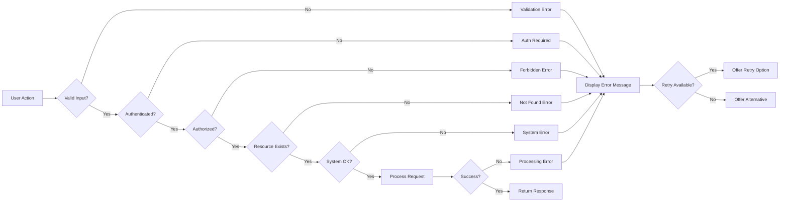
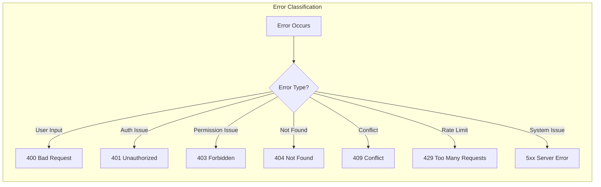

# Exception Handling Requirements

## Overview

This document defines all error scenarios, user-facing error handling, and recovery processes for the Economic/Political Discussion Board platform. Every error condition must provide clear, actionable feedback to users while maintaining system security and data integrity.

### Error Response Format

THE system SHALL return error responses in a consistent format that includes:
- Error code: A unique identifier for the error type
- Error message: A user-friendly description in English
- Error details: Additional context when applicable
- Recovery guidance: Suggested actions for the user

```
Error Response Structure:
- code: string (error identifier)
- message: string (user-friendly description)
- details: object (optional additional context)
- timestamp: ISO 8601 datetime
```

WHEN an error occurs, THE system SHALL include the appropriate HTTP status code in the response.

---

## 1. Authentication Errors

Authentication errors occur when users attempt to access the system but their identity cannot be verified or established.

### 1.1 Registration Errors

#### 1.1.1 Email Already Registered

**Error Code:** `AUTH_EMAIL_EXISTS`

**HTTP Status:** 409 Conflict

WHEN a user attempts to register with an email address that already exists in the system, THE system SHALL reject the registration request and return an error message indicating the email is already registered.

**User-Facing Message:** "An account with this email address already exists. Please try logging in or use a different email address."

**Recovery Options:**
- User can attempt to log in with existing credentials
- User can use "Forgot Password" feature if they own the email
- User can register with a different email address

#### 1.1.2 Invalid Email Format

**Error Code:** `AUTH_INVALID_EMAIL`

**HTTP Status:** 400 Bad Request

WHEN a user submits an email address that does not match the standard email format, THE system SHALL reject the registration and display a validation error.

**User-Facing Message:** "Please enter a valid email address."

**Recovery Options:**
- User corrects the email format and resubmits

#### 1.1.3 Weak Password

**Error Code:** `AUTH_WEAK_PASSWORD`

**HTTP Status:** 400 Bad Request

WHEN a user submits a password that does not meet security requirements, THE system SHALL reject the password and display specific requirements.

**Password Requirements:**
- Minimum 8 characters
- At least one uppercase letter
- At least one lowercase letter
- At least one number
- At least one special character

**User-Facing Message:** "Your password does not meet security requirements. Please ensure your password has at least 8 characters, including uppercase and lowercase letters, numbers, and special characters."

**Recovery Options:**
- User creates a stronger password
- System displays password strength indicator

### 1.2 Login Errors

#### 1.2.1 Invalid Credentials

**Error Code:** `AUTH_INVALID_CREDENTIALS`

**HTTP Status:** 401 Unauthorized

WHEN a user submits incorrect email or password credentials, THE system SHALL reject the login attempt without indicating which field is incorrect.

**User-Facing Message:** "The email or password you entered is incorrect. Please try again."

**Security Note:** THE system SHALL NOT reveal whether the email exists in the database or only the password is wrong, to prevent email enumeration attacks.

**Recovery Options:**
- User can retry with correct credentials
- User can use "Forgot Password" feature

#### 1.2.2 Account Banned

**Error Code:** `AUTH_ACCOUNT_BANNED`

**HTTP Status:** 403 Forbidden

WHEN a banned user attempts to log in, THE system SHALL reject the login and display a message indicating the account is banned.

**User-Facing Message:** "Your account has been suspended. Reason: [ban reason]. Please contact support if you believe this is an error."

**Recovery Options:**
- User can contact administrator for appeal
- User is shown the specific ban reason

#### 1.2.3 Account Deleted

**Error Code:** `AUTH_ACCOUNT_DELETED`

**HTTP Status:** 401 Unauthorized

WHEN a user attempts to log in with credentials for a deleted account, THE system SHALL reject the login with an appropriate message.

**User-Facing Message:** "This account no longer exists. Please register for a new account if you wish to use the platform."

**Recovery Options:**
- User can register a new account

### 1.3 Session Errors

#### 1.3.1 Session Expired

**Error Code:** `AUTH_SESSION_EXPIRED`

**HTTP Status:** 401 Unauthorized

WHEN a user's session has expired, THE system SHALL require re-authentication.

**User-Facing Message:** "Your session has expired. Please log in again to continue."

**Recovery Options:**
- User is redirected to login page
- After successful login, user returns to previous page

#### 1.3.2 Invalid Token

**Error Code:** `AUTH_INVALID_TOKEN`

**HTTP Status:** 401 Unauthorized

WHEN a JWT token is invalid, tampered with, or malformed, THE system SHALL reject the request and clear the session.

**User-Facing Message:** "Your session is invalid. Please log in again."

**Recovery Options:**
- User is redirected to login page

#### 1.3.3 Token Refresh Failed

**Error Code:** `AUTH_REFRESH_FAILED`

**HTTP Status:** 401 Unauthorized

WHEN a refresh token is expired, revoked, or invalid, THE system SHALL require full re-authentication.

**User-Facing Message:** "Your session could not be renewed. Please log in again."

### 1.4 Password Management Errors

#### 1.4.1 Incorrect Current Password

**Error Code:** `AUTH_WRONG_PASSWORD`

**HTTP Status:** 400 Bad Request

WHEN a user submits an incorrect current password while attempting to change password, THE system SHALL reject the request.

**User-Facing Message:** "The current password you entered is incorrect. Please try again."

**Recovery Options:**
- User can retry with correct password
- User can use "Forgot Password" to reset instead

#### 1.4.2 Same as Current Password

**Error Code:** `AUTH_PASSWORD_SAME`

**HTTP Status:** 400 Bad Request

WHEN a user attempts to change their password to the same value as their current password, THE system SHALL reject the request.

**User-Facing Message:** "Your new password must be different from your current password."

### 1.5 Account Deletion Errors

#### 1.5.1 Deletion Confirmation Required

**Error Code:** `AUTH_DELETE_CONFIRMATION`

**HTTP Status:** 400 Bad Request

WHEN a user attempts to delete their account without proper confirmation, THE system SHALL reject the request.

**User-Facing Message:** "Please confirm account deletion by entering your password."

**Recovery Options:**
- User enters password to confirm deletion

---

## 2. Authorization Errors

Authorization errors occur when authenticated users attempt to perform actions beyond their permission level.

### 2.1 General Authorization Errors

#### 2.1.1 Authentication Required

**Error Code:** `AUTH_REQUIRED`

**HTTP Status:** 401 Unauthorized

WHEN an unauthenticated user attempts to access a protected resource, THE system SHALL deny access and prompt for authentication.

**User-Facing Message:** "Please log in to access this feature."

**Recovery Options:**
- User is redirected to login page
- After login, user returns to requested resource

#### 2.1.2 Insufficient Permissions

**Error Code:** `AUTH_FORBIDDEN`

**HTTP Status:** 403 Forbidden

WHEN an authenticated user attempts to perform an action beyond their permission level, THE system SHALL deny the request without revealing sensitive permission details.

**User-Facing Message:** "You do not have permission to perform this action."

### 2.2 Content Ownership Errors

#### 2.2.1 Not Article Owner

**Error Code:** `AUTH_NOT_ARTICLE_OWNER`

**HTTP Status:** 403 Forbidden

WHEN a user attempts to edit or delete an article they did not create, THE system SHALL deny the request.

**User-Facing Message:** "You can only edit or delete your own articles."

**Exception:** Administrators can delete any article (see Administrator Capabilities).

#### 2.2.2 Not Comment Owner

**Error Code:** `AUTH_NOT_COMMENT_OWNER`

**HTTP Status:** 403 Forbidden

WHEN a user attempts to edit or delete a comment they did not create, THE system SHALL deny the request.

**User-Facing Message:** "You can only edit or delete your own comments."

**Exception:** Administrators can delete any comment.

#### 2.2.3 Not Profile Owner

**Error Code:** `AUTH_NOT_PROFILE_OWNER`

**HTTP Status:** 403 Forbidden

WHEN a user attempts to edit another user's profile, THE system SHALL deny the request.

**User-Facing Message:** "You can only edit your own profile."

### 2.3 Administrator Permission Errors

#### 2.3.1 Admin Action Unauthorized

**Error Code:** `AUTH_ADMIN_REQUIRED`

**HTTP Status:** 403 Forbidden

WHEN a non-administrator user attempts to access administrator-only features (section management, content moderation, user banning), THE system SHALL deny the request.

**User-Facing Message:** "This action requires administrator privileges."

**Affected Actions:**
- Creating, editing, or deleting sections
- Deleting any article or comment
- Banning or unbanning users
- Viewing banned user list

#### 2.3.2 Super Admin Action Unauthorized

**Error Code:** `AUTH_SUPER_ADMIN_REQUIRED`

**HTTP Status:** 403 Forbidden

WHEN a regular administrator attempts to access super administrator-only features, THE system SHALL deny the request.

**User-Facing Message:** "This action requires super administrator privileges."

**Affected Actions:**
- Approving or rejecting admin requests
- Promoting administrators to super administrator
- Demoting super administrators

#### 2.3.3 Self Demotion Prohibited

**Error Code:** `AUTH_SELF_DEMOTION`

**HTTP Status:** 400 Bad Request

WHEN a super administrator attempts to demote themselves to regular administrator, THE system SHALL prevent the action.

**User-Facing Message:** "You cannot demote yourself. Please contact another super administrator."

---

## 3. Validation Errors

Validation errors occur when user input does not meet the required format or constraints.

### 3.1 General Validation Errors

#### 3.1.1 Required Field Empty

**Error Code:** `VAL_REQUIRED_FIELD`

**HTTP Status:** 400 Bad Request

WHEN a user submits a form with a required field left empty, THE system SHALL reject the submission and identify the specific field.

**User-Facing Message:** "[Field name] is required. Please fill in this field."

**Affected Fields:**
- Article: title, content, section
- Comment: content
- Profile: display name
- Section: name, description
- Admin request: reason

#### 3.1.2 Field Too Long

**Error Code:** `VAL_FIELD_TOO_LONG`

**HTTP Status:** 400 Bad Request

WHEN a user submits a field that exceeds the maximum character limit, THE system SHALL reject the submission and show the limit.

**User-Facing Message:** "[Field name] is too long. Maximum [X] characters allowed."

**Field Limits (to be defined by development team):**
- Article title: suggested 200 characters
- Article content: suggested 50,000 characters
- Comment content: suggested 5,000 characters
- Display name: suggested 50 characters
- Bio: suggested 500 characters
- Tag: suggested 30 characters per tag

#### 3.1.3 Invalid Characters

**Error Code:** `VAL_INVALID_CHARACTERS`

**HTTP Status:** 400 Bad Request

WHEN a user submits a field containing disallowed characters, THE system SHALL reject the submission.

**User-Facing Message:** "[Field name] contains invalid characters. Please use only [allowed characters]."

### 3.2 Article Validation Errors

#### 3.2.1 Invalid Section Selection

**Error Code:** `VAL_INVALID_SECTION`

**HTTP Status:** 400 Bad Request

WHEN a user creates or edits an article with a section that does not exist or has been deleted, THE system SHALL reject the submission.

**User-Facing Message:** "The selected section is not available. Please choose a valid section."

**Recovery Options:**
- User selects from current list of sections

#### 3.2.2 Too Many Tags

**Error Code:** `VAL_TOO_MANY_TAGS`

**HTTP Status:** 400 Bad Request

WHEN a user adds more than the maximum allowed number of tags to an article, THE system SHALL reject the submission.

**User-Facing Message:** "You can add a maximum of [X] tags per article. Please remove some tags."

**Suggested Limit:** 10 tags per article

#### 3.2.3 Duplicate Tags

**Error Code:** `VAL_DUPLICATE_TAGS`

**HTTP Status:** 400 Bad Request

WHEN a user submits duplicate tags on an article, THE system SHALL automatically deduplicate the tags and accept the submission with a notice.

**User-Facing Message:** "Duplicate tags were removed. Your article has been saved with unique tags."

### 3.3 File and Image Validation Errors

#### 3.3.1 File Too Large

**Error Code:** `VAL_FILE_TOO_LARGE`

**HTTP Status:** 413 Payload Too Large

WHEN a user uploads a file exceeding the maximum size limit, THE system SHALL reject the upload.

**User-Facing Message:** "The file '[filename]' is too large. Maximum file size is [X] MB."

**Suggested Limits:**
- Images: 5 MB per file
- Documents: 10 MB per file
- Total per article: 50 MB

#### 3.3.2 Invalid File Type

**Error Code:** `VAL_INVALID_FILE_TYPE`

**HTTP Status:** 400 Bad Request

WHEN a user uploads a file with an unsupported format, THE system SHALL reject the upload.

**User-Facing Message:** "File type '[extension]' is not supported. Allowed formats: [list of allowed formats]."

**Allowed File Types (suggested):**
- Images: JPG, PNG, GIF, WebP
- Documents: PDF, DOC, DOCX, TXT

#### 3.3.3 Too Many Files

**Error Code:** `VAL_TOO_MANY_FILES`

**HTTP Status:** 400 Bad Request

WHEN a user uploads more than the maximum allowed number of files to an article, THE system SHALL reject the upload.

**User-Facing Message:** "You can attach a maximum of [X] files per article. Please remove some files."

**Suggested Limit:** 10 files per article (combined files and images)

#### 3.3.4 File Upload Failed

**Error Code:** `VAL_FILE_UPLOAD_FAILED`

**HTTP Status:** 500 Internal Server Error

WHEN a file upload fails due to a server-side issue, THE system SHALL notify the user and preserve their work.

**User-Facing Message:** "We couldn't upload your file. Please try again. Your article content has been preserved."

**Recovery Options:**
- User can retry the upload
- Article draft is preserved in the form

### 3.4 Search Validation Errors

#### 3.4.1 Search Query Too Short

**Error Code:** `VAL_SEARCH_TOO_SHORT`

**HTTP Status:** 400 Bad Request

WHEN a user submits a search query shorter than the minimum required characters, THE system SHALL reject the search.

**User-Facing Message:** "Please enter at least [X] characters to search."

**Suggested Minimum:** 2 characters

#### 3.4.2 Invalid Page Number

**Error Code:** `VAL_INVALID_PAGE`

**HTTP Status:** 400 Bad Request

WHEN a user requests a page number that is negative, zero, or non-numeric, THE system SHALL default to page 1.

**User-Facing Message:** No error displayed; system automatically corrects to page 1.

---

## 4. Resource Not Found Errors

Resource not found errors occur when a requested resource does not exist or has been deleted.

### 4.1 Content Not Found

#### 4.1.1 Article Not Found

**Error Code:** `RES_ARTICLE_NOT_FOUND`

**HTTP Status:** 404 Not Found

WHEN a user attempts to view, edit, or interact with an article that does not exist or has been deleted, THE system SHALL display a not found message.

**User-Facing Message:** "This article could not be found. It may have been deleted or moved."

**Recovery Options:**
- User can browse the section for related articles
- User can search for similar content
- User can return to home page

#### 4.1.2 Comment Not Found

**Error Code:** `RES_COMMENT_NOT_FOUND`

**HTTP Status:** 404 Not Found

WHEN a user attempts to edit or delete a comment that does not exist or has been deleted, THE system SHALL display a not found message.

**User-Facing Message:** "This comment could not be found. It may have been deleted."

#### 4.1.3 Section Not Found

**Error Code:** `RES_SECTION_NOT_FOUND`

**HTTP Status:** 404 Not Found

WHEN a user attempts to browse a section that does not exist or has been deleted, THE system SHALL display a not found message.

**User-Facing Message:** "This section could not be found. It may have been removed."

**Recovery Options:**
- User is shown list of available sections
- User can browse other sections

### 4.2 User Not Found

#### 4.2.1 User Profile Not Found

**Error Code:** `RES_USER_NOT_FOUND`

**HTTP Status:** 404 Not Found

WHEN a user attempts to view a profile for a user that does not exist or has been deleted, THE system SHALL display a not found message.

**User-Facing Message:** "This user profile could not be found. The account may have been deleted."

#### 4.2.2 Banned User Not Found

**Error Code:** `RES_BANNED_USER_NOT_FOUND`

**HTTP Status:** 404 Not Found

WHEN an administrator attempts to view ban details for a user who is not currently banned, THE system SHALL display an appropriate message.

**User-Facing Message:** "This user is not currently banned."

### 4.3 Admin Request Not Found

#### 4.3.1 Admin Request Not Found

**Error Code:** `RES_ADMIN_REQUEST_NOT_FOUND`

**HTTP Status:** 404 Not Found

WHEN a super administrator attempts to review an admin request that does not exist or has already been processed, THE system SHALL display a not found message.

**User-Facing Message:** "This admin request could not be found. It may have already been processed."

### 4.4 File Not Found

#### 4.4.1 Attachment Not Found

**Error Code:** `RES_FILE_NOT_FOUND`

**HTTP Status:** 404 Not Found

WHEN a user attempts to download a file attachment that no longer exists, THE system SHALL display a not found message.

**User-Facing Message:** "This file could not be found. It may have been removed."

---

## 5. System Errors

System errors occur due to infrastructure issues, server problems, or unexpected conditions beyond user control.

### 5.1 Server Errors

#### 5.1.1 Internal Server Error

**Error Code:** `SYS_INTERNAL_ERROR`

**HTTP Status:** 500 Internal Server Error

WHEN an unexpected error occurs on the server, THE system SHALL display a generic error message without exposing technical details.

**User-Facing Message:** "Something went wrong on our end. Please try again in a moment."

**Technical Requirements:**
- Error details logged for administrator review
- No stack traces or technical details exposed to users
- Unique error reference generated for support purposes

#### 5.1.2 Service Unavailable

**Error Code:** `SYS_SERVICE_UNAVAILABLE`

**HTTP Status:** 503 Service Unavailable

WHEN the system is under maintenance or experiencing high load, THE system SHALL display a maintenance message.

**User-Facing Message:** "The service is temporarily unavailable. Please try again later."

**Recovery Options:**
- User can retry after waiting
- Estimated recovery time displayed if available

### 5.2 Database Errors

#### 5.2.1 Database Connection Failed

**Error Code:** `SYS_DATABASE_ERROR`

**HTTP Status:** 503 Service Unavailable

WHEN the database connection fails, THE system SHALL gracefully handle the error and notify users.

**User-Facing Message:** "We're experiencing technical difficulties. Please try again in a moment."

**Technical Requirements:**
- System logs detailed error for administrators
- System attempts automatic reconnection
- User data preserved if possible

### 5.3 File Storage Errors

#### 5.3.1 Storage Service Unavailable

**Error Code:** `SYS_STORAGE_ERROR`

**HTTP Status:** 503 Service Unavailable

WHEN the file storage service is unavailable, THE system SHALL prevent file uploads and notify users.

**User-Facing Message:** "File uploads are temporarily unavailable. Please try again later or save your article without attachments."

**Recovery Options:**
- User can save article without attachments
- User can retry upload later

### 5.4 Rate Limiting Errors

#### 5.4.1 Rate Limit Exceeded

**Error Code:** `SYS_RATE_LIMIT`

**HTTP Status:** 429 Too Many Requests

WHEN a user exceeds the rate limit for requests, THE system SHALL temporarily block further requests.

**User-Facing Message:** "You've made too many requests. Please wait [X] seconds before trying again."

**Rate Limits (suggested):**
- Login attempts: 5 per minute
- Article creation: 10 per hour
- Comment creation: 30 per hour
- Search queries: 60 per minute

#### 5.4.2 Login Attempts Exceeded

**Error Code:** `SYS_LOGIN_LOCKOUT`

**HTTP Status:** 429 Too Many Requests

WHEN a user exceeds the maximum failed login attempts, THE system SHALL temporarily lock the account.

**User-Facing Message:** "Your account has been temporarily locked due to too many failed login attempts. Please try again in [X] minutes."

**Security Note:** THE system SHALL implement progressive delays for repeated failed attempts.

---

## 6. Error Recovery

### 6.1 Automatic Recovery

#### 6.1.1 Session Recovery

WHEN a user's session expires while they are working on content, THE system SHALL preserve the user's input.

**Implementation:**
- Form data saved to browser local storage
- After re-authentication, form data restored
- User notified that content was preserved

**User-Facing Message:** "Your session expired. After logging in, your work will be restored."

#### 6.1.2 Draft Auto-Save

WHEN a user is creating or editing content, THE system SHALL automatically save a draft at regular intervals.

**User-Facing Message:** "Draft saved" (displays briefly as notification)

**Recovery:**
- If browser crashes or closes, draft is available when user returns
- User can choose to restore draft or start fresh

### 6.2 User-Initiated Recovery

#### 6.2.1 Retry Action

WHEN an operation fails due to a temporary error, THE system SHALL provide a retry button.

**User-Facing Message:** "Operation failed. [Retry]"

**Applicable Scenarios:**
- File upload failed
- Network timeout
- Temporary server error

#### 6.2.2 Alternative Action

WHEN a primary action fails, THE system SHALL suggest alternative actions where applicable.

**Examples:**
- Article not found → "Browse similar articles" or "Search for related content"
- Section not found → "View all sections"
- File upload failed → "Save article without attachments"

### 6.3 Error Prevention

#### 6.3.1 Form Validation Before Submission

WHEN a user completes a form, THE system SHALL validate all fields before submission.

**Implementation:**
- Real-time validation as user types
- Clear error indicators on invalid fields
- Submit button disabled until all validations pass

#### 6.3.2 Confirmation Dialogs

WHEN a user attempts a destructive action, THE system SHALL require confirmation.

**Applicable Actions:**
- Deleting own account
- Deleting an article
- Deleting a comment
- Banning a user
- Deleting a section

**User-Facing Message:** "Are you sure you want to [action]? This cannot be undone."

### 6.4 Graceful Degradation

#### 6.4.1 Search Unavailable

WHEN the search service is temporarily unavailable, THE system SHALL allow browsing without search.

**User-Facing Message:** "Search is temporarily unavailable. You can still browse articles by section."

#### 6.4.2 File Upload Unavailable

WHEN file upload is unavailable, THE system SHALL allow article creation with text only.

**User-Facing Message:** "File uploads are temporarily unavailable. You can still create articles with text content."

---

## 7. Error Handling Flow

The following diagram illustrates the general error handling flow for user actions:



### 7.1 Error Response Decision Tree



---

## 8. Error Logging Requirements

### 8.1 What to Log

WHEN an error occurs, THE system SHALL log the following information for debugging and monitoring:

**Required Log Fields:**
- Timestamp (ISO 8601 format)
- Error code
- Error message
- User ID (if authenticated)
- Request path and method
- Request parameters (sanitized of sensitive data)
- Stack trace (for system errors only)
- Error reference ID

### 8.2 Sensitive Data Protection

WHEN logging errors, THE system SHALL NEVER log:
- User passwords (plain text or hashed)
- Session tokens or JWT secrets
- Personal identifiable information beyond user ID
- Credit card or payment information
- Private message content

### 8.3 Error Monitoring

THE system SHALL provide administrators with access to error logs for monitoring system health.

**Administrator Capabilities:**
- View recent error summary
- Filter errors by type and time period
- View error details (without sensitive information)
- Mark errors as resolved

---

## 9. Internationalization Support

### 9.1 Error Message Language

THE system SHALL support error messages in the user's preferred language where available.

**Implementation:**
- Error codes remain constant across all languages
- Error messages translated based on user locale
- Technical details remain in English for debugging

### 9.2 Fallback Language

WHEN a translation is not available in the user's preferred language, THE system SHALL display the message in English.

---

## 10. Security Considerations

### 10.1 Information Disclosure Prevention

WHEN returning errors to users, THE system SHALL NOT expose:
- Internal server paths or file structures
- Database schema information
- Technology stack details
- Stack traces or debugging information
- Internal IP addresses or server names

### 10.2 Error Message Consistency

THE system SHALL provide consistent error messages to prevent:
- User enumeration attacks (e.g., "user exists" vs "wrong password")
- Information leakage through timing attacks
- System fingerprinting

### 10.3 Error-Based Attack Prevention

THE system SHALL implement safeguards against:
- SQL injection via error messages
- Path traversal through file error details
- DoS through error flooding

---

## Appendix A: Error Code Reference Table

| Error Code | HTTP Status | Category | Description |
|------------|-------------|----------|-------------|
| AUTH_EMAIL_EXISTS | 409 | Authentication | Email already registered |
| AUTH_INVALID_EMAIL | 400 | Authentication | Invalid email format |
| AUTH_WEAK_PASSWORD | 400 | Authentication | Password does not meet requirements |
| AUTH_INVALID_CREDENTIALS | 401 | Authentication | Wrong email or password |
| AUTH_ACCOUNT_BANNED | 403 | Authentication | Account is suspended |
| AUTH_ACCOUNT_DELETED | 401 | Authentication | Account no longer exists |
| AUTH_SESSION_EXPIRED | 401 | Authentication | Session has expired |
| AUTH_INVALID_TOKEN | 401 | Authentication | Token is invalid or malformed |
| AUTH_REFRESH_FAILED | 401 | Authentication | Token refresh failed |
| AUTH_WRONG_PASSWORD | 400 | Authentication | Current password incorrect |
| AUTH_PASSWORD_SAME | 400 | Authentication | New password same as current |
| AUTH_DELETE_CONFIRMATION | 400 | Authentication | Confirmation required for deletion |
| AUTH_REQUIRED | 401 | Authorization | Authentication required |
| AUTH_FORBIDDEN | 403 | Authorization | Insufficient permissions |
| AUTH_NOT_ARTICLE_OWNER | 403 | Authorization | Not the article author |
| AUTH_NOT_COMMENT_OWNER | 403 | Authorization | Not the comment author |
| AUTH_NOT_PROFILE_OWNER | 403 | Authorization | Not the profile owner |
| AUTH_ADMIN_REQUIRED | 403 | Authorization | Administrator role required |
| AUTH_SUPER_ADMIN_REQUIRED | 403 | Authorization | Super administrator role required |
| AUTH_SELF_DEMOTION | 400 | Authorization | Cannot demote self |
| VAL_REQUIRED_FIELD | 400 | Validation | Required field is empty |
| VAL_FIELD_TOO_LONG | 400 | Validation | Field exceeds character limit |
| VAL_INVALID_CHARACTERS | 400 | Validation | Field contains invalid characters |
| VAL_INVALID_SECTION | 400 | Validation | Section does not exist |
| VAL_TOO_MANY_TAGS | 400 | Validation | Exceeds maximum tags |
| VAL_DUPLICATE_TAGS | 400 | Validation | Duplicate tags provided |
| VAL_FILE_TOO_LARGE | 413 | Validation | File exceeds size limit |
| VAL_INVALID_FILE_TYPE | 400 | Validation | File type not allowed |
| VAL_TOO_MANY_FILES | 400 | Validation | Exceeds maximum files |
| VAL_FILE_UPLOAD_FAILED | 500 | Validation | File upload failed |
| VAL_SEARCH_TOO_SHORT | 400 | Validation | Search query too short |
| VAL_INVALID_PAGE | 400 | Validation | Invalid page number |
| RES_ARTICLE_NOT_FOUND | 404 | Resource | Article does not exist |
| RES_COMMENT_NOT_FOUND | 404 | Resource | Comment does not exist |
| RES_SECTION_NOT_FOUND | 404 | Resource | Section does not exist |
| RES_USER_NOT_FOUND | 404 | Resource | User does not exist |
| RES_BANNED_USER_NOT_FOUND | 404 | Resource | User is not banned |
| RES_ADMIN_REQUEST_NOT_FOUND | 404 | Resource | Admin request not found |
| RES_FILE_NOT_FOUND | 404 | Resource | File does not exist |
| SYS_INTERNAL_ERROR | 500 | System | Unexpected server error |
| SYS_SERVICE_UNAVAILABLE | 503 | System | Service temporarily down |
| SYS_DATABASE_ERROR | 503 | System | Database connection failed |
| SYS_STORAGE_ERROR | 503 | System | File storage unavailable |
| SYS_RATE_LIMIT | 429 | System | Rate limit exceeded |
| SYS_LOGIN_LOCKOUT | 429 | System | Too many failed logins |

---

## Appendix B: HTTP Status Code Usage

| Status Code | Usage Scenario |
|-------------|---------------|
| 200 OK | Successful GET, PUT, PATCH |
| 201 Created | Successful POST creating new resource |
| 204 No Content | Successful DELETE |
| 400 Bad Request | Validation errors, malformed requests |
| 401 Unauthorized | Authentication required or failed |
| 403 Forbidden | Authenticated but not authorized |
| 404 Not Found | Resource does not exist |
| 409 Conflict | Resource already exists, version conflict |
| 413 Payload Too Large | File upload too large |
| 429 Too Many Requests | Rate limit exceeded |
| 500 Internal Server Error | Unexpected server error |
| 503 Service Unavailable | Service temporarily unavailable |

---

*This document defines business requirements for error handling. Technical implementation details such as specific error handling middleware, logging infrastructure, and monitoring systems are at the discretion of the development team.*