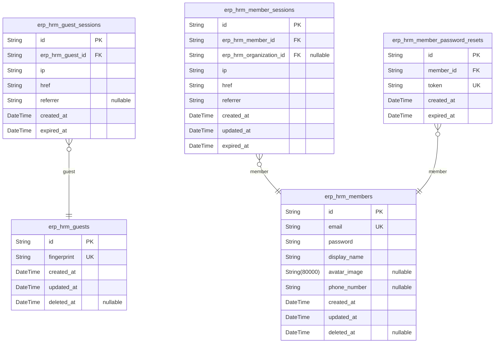
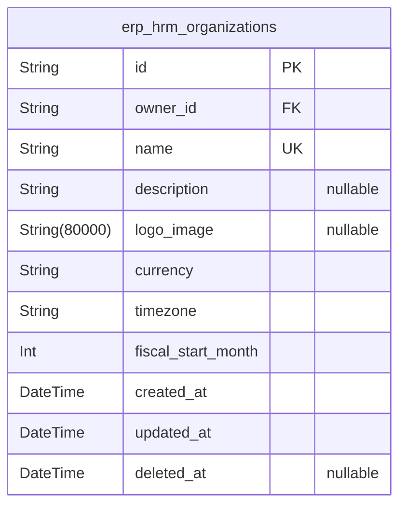
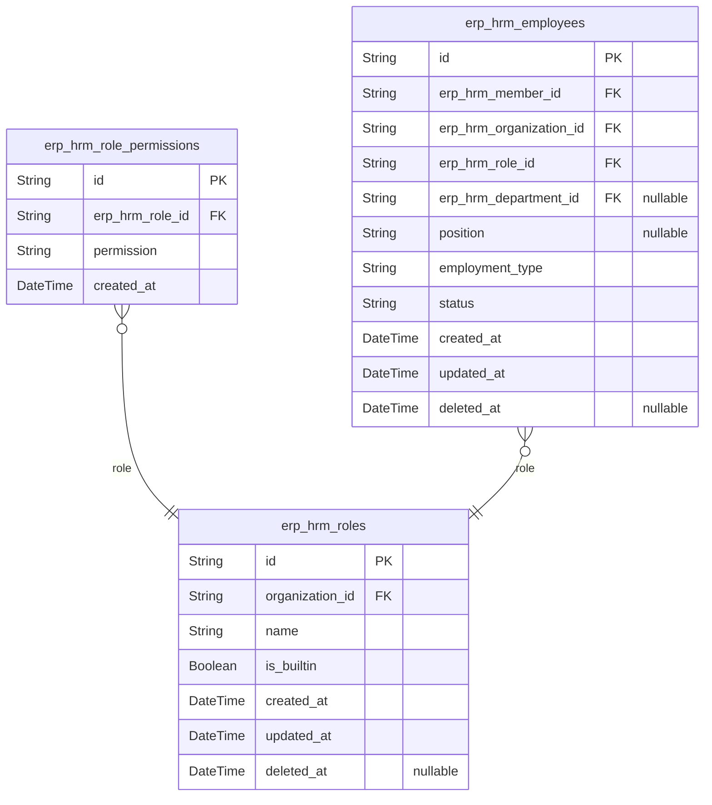
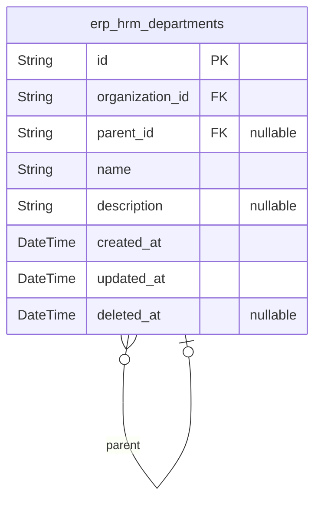
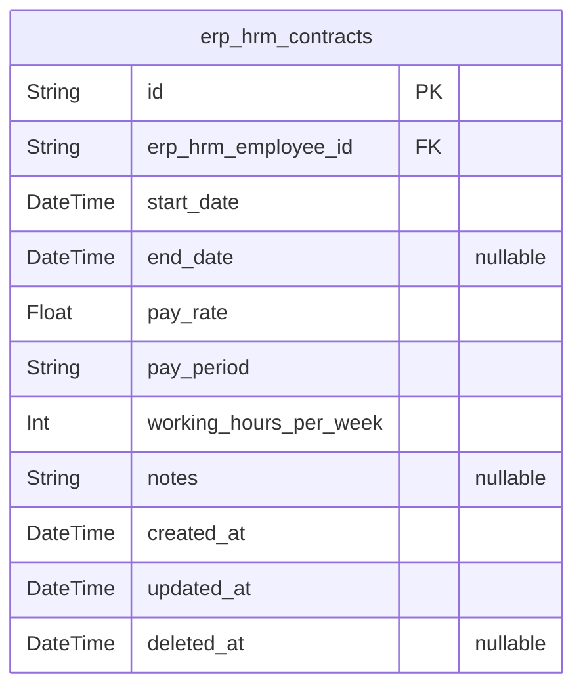
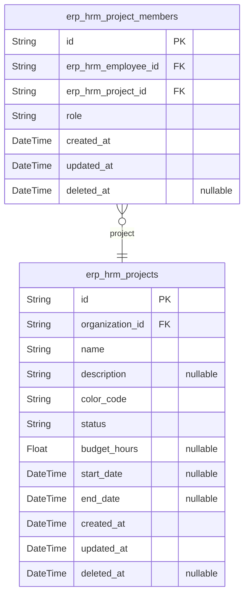
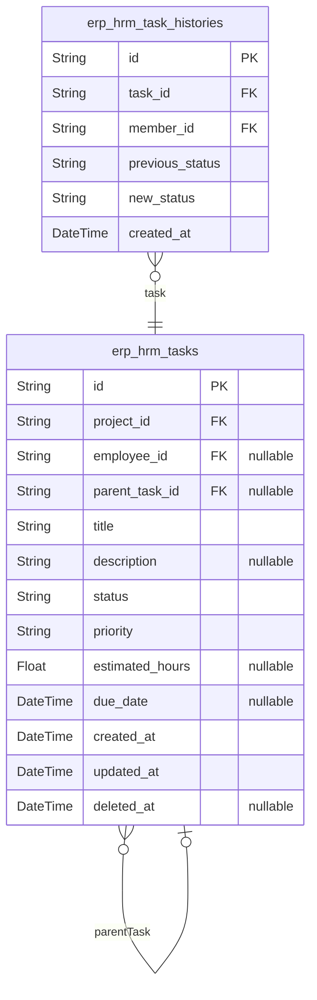
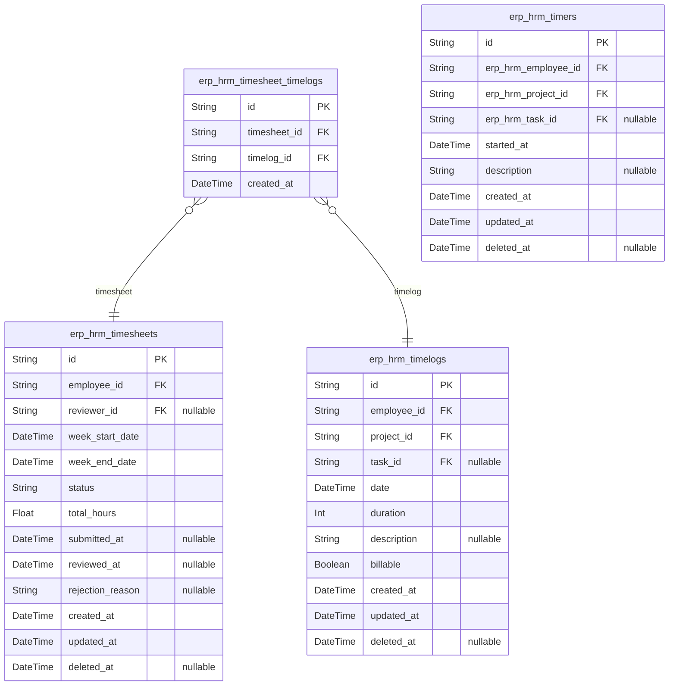
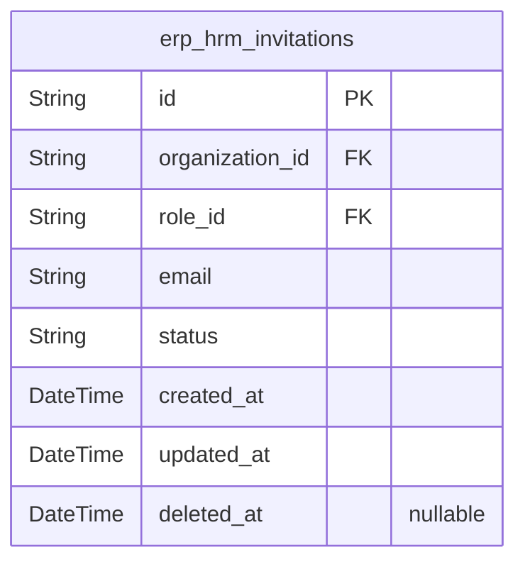
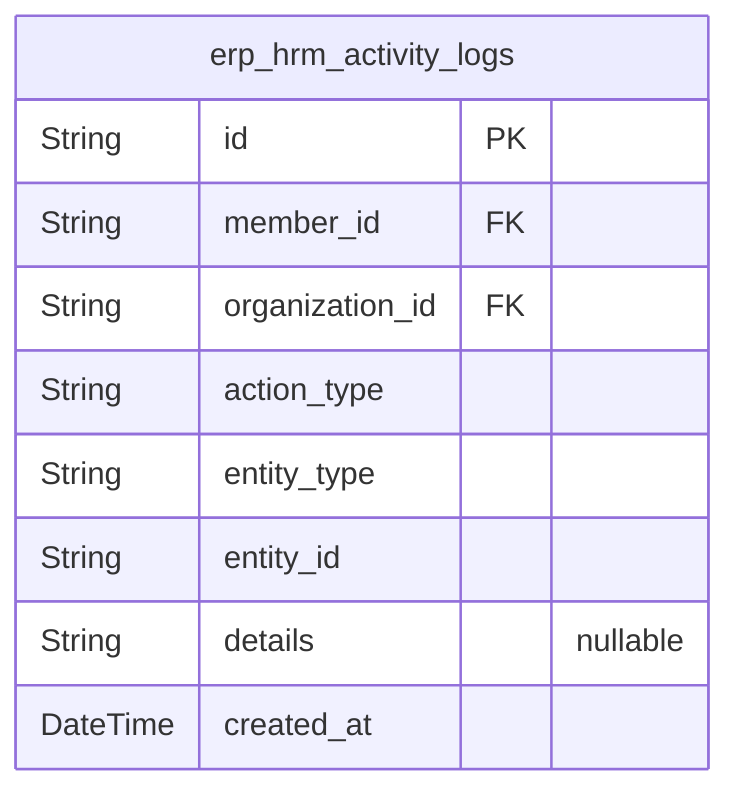

# Prisma Markdown

> Generated by [`prisma-markdown`](https://github.com/samchon/prisma-markdown)

- [Actors](#actors)
- [Organizations](#organizations)
- [Employees](#employees)
- [Departments](#departments)
- [Contracts](#contracts)
- [Projects](#projects)
- [Tasks](#tasks)
- [TimeTracking](#timetracking)
- [Invitations](#invitations)
- [ActivityLogs](#activitylogs)

## Actors

### `erp_hrm_guests`

Temporary guest accounts for tracking pre-authentication visitors
identified by device fingerprint.

Guests represent unauthenticated users who have not yet signed into the
platform or do not have an account. The guest actor represents the
initial state of all users before they complete authentication. Guests
have no identity within the platform until they either create a new
account through sign-up or authenticate with an existing account through
login.

Once authenticated, they transition to the member actor status. This
table provides the foundation for session tracking and enables the
platform to maintain state for browsing visitors.

Properties as follows:

- `id`: Primary Key.
- `fingerprint`
  > Device fingerprint used to identify and track unique visitors before
  > authentication. Provides a consistent identity for session tracking and
  > visitor analytics across page visits.
- `created_at`: Timestamp when the guest record was created.
- `updated_at`: Timestamp when the guest record was last updated.
- `deleted_at`
  > Timestamp when the guest record was soft-deleted. Used for cleanup of
  > expired guest records.

### `erp_hrm_guest_sessions`

Session tracking for guest actor temporary access. Records connection
context (IP, href, referrer) and expiration for pre-authentication
visitors browsing the platform before signup. Each guest can have
multiple concurrent sessions across devices.

Properties as follows:

- `id`: Primary Key.
- `erp_hrm_guest_id`: Guest actor who owns this session. [erp_hrm_guests.id](#erp_hrm_guests).
- `ip`
  > IP address of the client connection. Used for security audit and fraud
  > detection.
- `href`
  > URL path the guest accessed. Records the entry point or current location
  > in the application.
- `referrer`
  > HTTP referrer header indicating where the guest came from. Nullable as
  > referrer may not be present.
- `created_at`
  > Timestamp when the session was created. Marks the beginning of the
  > guest's visit.
- `expired_at`
  > Timestamp when the session expires. Required for security - sessions must
  > have a defined lifetime.

### `erp_hrm_members`

Authenticated user accounts that serve as the primary identity for
accessing the ERP HRM platform. Each member is uniquely identified by
their email address and authenticates using password credentials.

Members maintain a global profile (display name, avatar image, phone
number) that is shared across all organizations they belong to. When
logging in, members select an organization context, and all subsequent
actions are scoped to that organization.

This is the root actor entity - referenced by session tables
(erp_hrm_member_sessions, erp_hrm_member_password_resets) and employee
membership records (erp_hrm_employees) that link members to specific
organizations.

Properties as follows:

- `id`: Primary Key.
- `email`
  > Unique email address serving as the primary identifier for
  > authentication. Must be unique across the entire platform - no two users
  > can share the same email. Used for login and organization invitations.
- `password`
  > Hashed password credential for account authentication. Users create this
  > password during registration and can change it through account settings.
  > Stored securely using industry-standard hashing algorithms.
- `display_name`
  > Human-readable name that identifies the member to others within
  > organizations. Appears in all interactions such as viewing employees,
  > timelogs, or task assignments. Required field shared across all
  > organizational memberships.
- `avatar_image`
  > Optional URL to the member's avatar image for visual identification.
  > Helps team members recognize each other in collaborative contexts. Shared
  > across all organizations the member belongs to.
- `phone_number`
  > Optional contact phone number stored as text. Allows organizations to
  > reach the member if needed. Shared across all organizational memberships.
- `created_at`
  > Timestamp when the member account was created. Records the initial
  > sign-up moment.
- `updated_at`
  > Timestamp when the member account was last updated. Updated on profile
  > changes or password changes.
- `deleted_at`
  > Timestamp when the member account was soft-deleted. Null for active
  > accounts. When deleted, the member can no longer authenticate or access
  > organizations, but their historical data (timelogs, timesheets) is
  > preserved.

### `erp_hrm_member_sessions`

JWT session tokens for authenticated members supporting organization
context switching. Each session tracks the member's authentication state,
connection metadata (IP address, current URL, referrer), and currently
selected organization context. Sessions expire based on the expired_at
timestamp and can be refreshed. The organization_id field allows members
to switch between organizations they belong to without re-authentication.

Properties as follows:

- `id`: Primary Key.
- `erp_hrm_member_id`
  > The authenticated member this session belongs to. {@link
  > erp_hrm_members.id}.
- `erp_hrm_organization_id`
  > The currently selected organization context for this session. Nullable
  > because the member may not have selected an organization yet, or may have
  > been removed from all organizations. Members can switch organizations
  > without logging out by updating this field. {@link
  > erp_hrm_organizations.id}.
- `ip`
  > IP address of the client that initiated this session. Used for security
  > logging and fraud detection.
- `href`
  > The URL path the member was accessing when the session was created or
  > last active. Used for session tracking and security auditing.
- `referrer`
  > The HTTP Referrer header value when the session was created. Used for
  > tracking session origin and security analysis.
- `created_at`: Timestamp when this session was created (login time).
- `updated_at`
  > Timestamp when this session was last updated (e.g., when switching
  > organization context or refreshing tokens).
- `expired_at`
  > Timestamp when this session expires. Sessions must be refreshed before
  > this time to remain valid. Security-critical field - session tokens are
  > invalid after this timestamp.

### `erp_hrm_member_password_resets`

Password reset tokens for member account recovery. Stores temporary
tokens with expiration that allow members to reset their password when
they cannot authenticate. Each token is valid for a limited time and can
only be used once. A member may have multiple reset tokens if they
request multiple resets without completing the recovery flow.

Properties as follows:

- `id`: Primary Key.
- `member_id`: The member who requested the password reset. [erp_hrm_members.id](#erp_hrm_members)
- `token`
  > Hashed password reset token. This is a secure hash of the actual token
  > sent to the user. The token must be unique across all reset requests to
  > prevent collision attacks.
- `created_at`
  > Timestamp when the password reset was requested. Used for audit trail and
  > to calculate token age.
- `expired_at`
  > Expiration timestamp for the reset token. Tokens become invalid after
  > this time for security purposes. Must be set at creation time - there is
  > no indefinite reset token.

## Organizations

### `erp_hrm_organizations`

Primary tenant containers in the multi-tenant ERP platform. Each
organization operates as an independent tenant with complete data
isolation from other organizations.

Organizations store identity attributes (name, description, logo) and
operational configuration (currency, timezone, fiscal start month). The
owner reference tracks the user who created the organization. All
organization-scoped business entities (employees, projects, tasks,
timelogs, etc.) belong to exactly one organization.

Data isolation is enforced at the application layer through organization
context scoping. When users belong to multiple organizations, they select
an active organization context, and all subsequent operations are scoped
to that organization.

Properties as follows:

- `id`: Primary Key.
- `owner_id`
  > The user who created and owns this organization. Has full administrative
  > rights including organization deletion. [erp_hrm_members.id](#erp_hrm_members)
- `name`
  > Organization display name used as the primary identifier throughout the
  > platform interface.
- `description`
  > Optional additional context about the organization's purpose, nature, or
  > business focus.
- `logo_image`
  > Optional URL to the organization's logo image for visual branding.
  > Displayed in the organization interface to help members identify their
  > current organization context.
- `currency`
  > Designated currency for financial operations within the organization.
  > Supported values include USD, EUR, KRW, and other common international
  > currencies. All monetary values associated with the organization use this
  > currency.
- `timezone`
  > Organization's preferred timezone for time tracking and reporting.
  > Affects how dates and times display for all members within that
  > organization context.
- `fiscal_start_month`
  > Month number (1-12) when the organization's fiscal year begins. Impacts
  > financial reporting and budget tracking features, allowing organizations
  > to align reporting periods with fiscal calendars.
- `created_at`: Timestamp when the organization was created.
- `updated_at`: Timestamp when the organization was last updated.
- `deleted_at`
  > Timestamp when the organization was soft-deleted. Null if the
  > organization is active. Soft deletion preserves data for potential
  > recovery while removing the organization from active operations.

## Employees

### `erp_hrm_roles`

Organization-scoped role definitions that determine employee permissions
within an organization. Each role contains a name and a collection of
permissions assigned through the [erp_hrm_role_permissions](#erp_hrm_role_permissions) table.
The three built-in roles (Owner, Manager, Employee) are protected from
deletion via the is_builtin flag and are automatically created when a new
organization is established. Custom roles can be created by organization
owners with the org:manage permission to define custom permission
combinations. Role names must be unique within each organization scope.

Properties as follows:

- `id`: Primary Key.
- `organization_id`
  > The organization that owns this role. All roles belong to a specific
  > organization for multi-tenant data isolation. {@link
  > erp_hrm_organizations.id}
- `name`
  > The display name of the role within the organization. Built-in roles have
  > fixed names (Owner, Manager, Employee) while custom roles can have any
  > name chosen by the organization owner. Must be unique within the same
  > organization.
- `is_builtin`
  > Whether this role is a built-in system role that cannot be deleted.
  > Built-in roles (Owner, Manager, Employee) are created automatically when
  > an organization is established and have predefined permission sets.
  > Custom roles created by users have this set to false.
- `created_at`
  > The timestamp when this role was created. Built-in roles are created at
  > organization creation time.
- `updated_at`
  > The timestamp when this role was last modified. Custom roles can be
  > edited by organization owners.
- `deleted_at`
  > The timestamp when this role was soft-deleted. Built-in roles cannot be
  > deleted. Custom roles can only be deleted if no employees are assigned to
  > them.

### `erp_hrm_role_permissions`

Permission assignments for roles, defining what actions users with a
specific role can perform.

Each permission record grants a specific capability to a role. Built-in
roles (Owner, Manager, Employee) have their permissions populated
automatically, while custom roles have permissions assigned by
organization owners.

Available permissions include:
- org:manage — Edit organization settings
- employee:manage — Add, edit, deactivate employees
- employee:view — View employee list and details
- project:manage — Create, edit, delete projects and tasks
- project:view — View projects and tasks
- time:manage — Edit or delete any employee's timelogs
- time:approve — Approve or reject timesheets
- time:view_all — View all employees' timelogs and timesheets
- report:view — View organization reports

This table is always accessed through the parent [erp_hrm_roles](#erp_hrm_roles)
entity and is not managed independently by users.

Properties as follows:

- `id`: Primary Key.
- `erp_hrm_role_id`: The role that this permission belongs to. [erp_hrm_roles.id](#erp_hrm_roles)
- `permission`
  > The permission code representing a specific capability. Values include:
  > org:manage, employee:manage, employee:view, project:manage, project:view,
  > time:manage, time:approve, time:view_all, report:view.
- `created_at`: Timestamp when this permission was assigned to the role.

### `erp_hrm_employees`

User membership records within organizations, establishing the bridge
between user accounts and organizational access. Each employee represents
a user's employment relationship with a specific organization, including
role assignment for permission control, optional department affiliation,
employment classification, and activation status.

An employee is uniquely identified by the combination of user account and
organization—each user can have at most one employee record per
organization, but may belong to multiple organizations through separate
employee records. The assigned role determines what actions the employee
can perform within the organization.

Key relationships:
- Belongs to [erp_hrm_members](#erp_hrm_members) (user account) - the global user
identity
- Belongs to [erp_hrm_organizations](#erp_hrm_organizations) - the organizational context
- Assigned one [erp_hrm_roles](#erp_hrm_roles) - determines permissions
- Optionally assigned to [erp_hrm_departments](#erp_hrm_departments) - organizational
structure
- Has many [erp_hrm_contracts](#erp_hrm_contracts) - employment history
- Has many [erp_hrm_project_members](#erp_hrm_project_members) - project assignments
- Has one [erp_hrm_timers](#erp_hrm_timers) - active time tracking session
- Has many [erp_hrm_timelogs](#erp_hrm_timelogs) - recorded work sessions
- Has many [erp_hrm_timesheets](#erp_hrm_timesheets) - weekly timesheet submissions

Properties as follows:

- `id`: Primary Key.
- `erp_hrm_member_id`
  > Reference to the user account who owns this employee record. {@link
  > erp_hrm_members.id}
- `erp_hrm_organization_id`
  > Reference to the organization this employee belongs to. All employee data
  > is scoped to this organization. [erp_hrm_organizations.id](#erp_hrm_organizations)
- `erp_hrm_role_id`
  > Reference to the role assigned to this employee, determining their
  > permissions within the organization. Each employee has exactly one role
  > at any time. [erp_hrm_roles.id](#erp_hrm_roles)
- `erp_hrm_department_id`
  > Optional reference to the department this employee is assigned to.
  > Employees without department assignment are considered unassigned for
  > organizational purposes. [erp_hrm_departments.id](#erp_hrm_departments)
- `position`
  > Optional job title or position within the organization, such as 'Software
  > Engineer' or 'Marketing Manager'. This is distinct from the system role
  > and reflects the employee's official designation.
- `employment_type`
  > Employment classification within the organization. Valid values:
  > 'full_time' for standard full-time hours, 'part_time' for reduced hours,
  > 'contractor' for external workers, 'intern' for temporary training
  > positions.
- `status`
  > Activation status of the employee record. Active employees can log time
  > and submit timesheets. Deactivated employees cannot perform these actions
  > but their historical data is preserved. Valid values: 'active',
  > 'deactivated'.
- `created_at`: Timestamp when the employee record was created.
- `updated_at`: Timestamp when the employee record was last modified.
- `deleted_at`
  > Timestamp when the employee record was soft-deleted. Null for active
  > records.

## Departments

### `erp_hrm_departments`

Organizational units within each organization for grouping employees by
function, team, or area of responsibility. Supports single-level
hierarchy through optional parent department reference, where a
department with a parent cannot itself have children. Department names
must be unique within the same organization. When a department is
deleted, employees previously assigned to it have their department
reference cleared.

Departments provide the organizational structure that enables
categorizing employees by their functional areas (e.g., Engineering,
Marketing, Human Resources, Finance). The hierarchy feature allows for
both granular team-level departments (e.g., Backend Development as child
of Engineering) and high-level organizational views in reporting.

Properties as follows:

- `id`: Primary Key.
- `organization_id`
  > The organization this department belongs to. Departments are
  > organization-scoped and data-isolated per tenant. {@link
  > erp_hrm_organizations.id}
- `parent_id`
  > Optional parent department reference for single-level hierarchy. When
  > set, this department is a child team within the parent department. A
  > department with a parent cannot itself have children (enforced by
  > application logic). [erp_hrm_departments.id](#erp_hrm_departments)
- `name`
  > The department name that serves as its primary identifier within the
  > organization. Must be unique across all departments in the same
  > organization. Used in lists, reports, and assignment interfaces.
- `description`
  > Optional additional context about the department's purpose, scope, or the
  > types of work performed by employees assigned to that department.
- `created_at`: Timestamp when the department was created.
- `updated_at`: Timestamp when the department was last modified.
- `deleted_at`
  > Soft delete timestamp. When set, the department is considered deleted but
  > preserved for audit and data integrity. Employees assigned to deleted
  > departments have their reference cleared.

## Contracts

### `erp_hrm_contracts`

Employee employment contracts tracking pay rates, working hours, and
validity periods for historical and active employment records.

Each employee can have multiple contracts maintained as historical
records throughout their tenure, but only one contract can be active at
any given time. An active contract is identified by having a start date
that has passed and either a null end date (ongoing) or an end date in
the future.

Past contracts with end dates in the past are immutable and serve as
permanent historical records for payroll and audit purposes. When a new
contract is created for an employee with an existing active contract, the
system automatically ends the previous contract.

This table supports the contract management workflow where users with
employee management permission can create new contracts and edit active
contracts, while past contracts remain locked for compliance.

Key relationships:
- Each contract belongs to exactly one [erp_hrm_employees](#erp_hrm_employees) via
erp_hrm_employee_id
- Multiple contracts per employee form an employment history chain

Properties as follows:

- `id`: Primary Key.
- `erp_hrm_employee_id`
  > The employee who owns this employment contract. Each employee can have
  > multiple contracts over time as historical records, with at most one
  > contract active at any given time. [erp_hrm_employees.id](#erp_hrm_employees)
- `start_date`
  > The date when employment under this contract begins. This field is
  > required and cannot be changed once set. When a new contract is created
  > for an employee with an existing active contract, the system uses this
  > start date to determine when the previous contract should end.
- `end_date`
  > The date when employment under this contract terminates. When null, the
  > contract is considered ongoing without a predetermined conclusion. When
  > specified and in the future, the contract is active. When specified and
  > in the past, the contract is a historical record that cannot be modified.
- `pay_rate`
  > The employee's compensation amount as a numeric value. The interpretation
  > depends on the pay_period field (e.g., hourly rate for hourly pay period,
  > monthly salary for monthly pay period).
- `pay_period`
  > The payment frequency for this contract. Valid values: 'hourly'
  > (compensation per hour), 'daily' (compensation per day), 'weekly'
  > (compensation per week), 'monthly' (compensation per month). The pay_rate
  > value must be interpreted in conjunction with this field.
- `working_hours_per_week`
  > The expected weekly commitment in hours for this contract. For example, a
  > standard full-time contract might specify 40 hours per week. This value
  > is used for budget tracking and capacity planning.
- `notes`
  > Optional additional context, special terms, or conditions for this
  > contract. Can include information about benefits, allowances, or specific
  > employment arrangements.
- `created_at`
  > Timestamp when the contract record was created. Used for audit trail and
  > historical ordering.
- `updated_at`
  > Timestamp when the contract record was last modified. For past contracts
  > (end_date in the past), this field will not change as edits are
  > prohibited.
- `deleted_at`
  > Timestamp for soft delete. When set, the contract is marked as deleted
  > but retained for historical and audit purposes. Contracts are typically
  > not hard-deleted to preserve employment history.

## Projects

### `erp_hrm_projects`

Work containers within organizations that group tasks and track time.
Projects are created by users with project:manage permission and can be
filtered by status. Active projects can receive timelogs; archived or
completed projects preserve existing timelogs but cannot receive new
ones. Each project has optional budget hours for tracking estimated work
against actual time logged.

Projects serve as the primary organizational unit for work management,
with members assigned through the [erp_hrm_project_members](#erp_hrm_project_members)
junction table. Project leads (members with lead role) can manage tasks
within their assigned projects.

[erp_hrm_organizations](#erp_hrm_organizations) owns projects. [erp_hrm_tasks](#erp_hrm_tasks) belong
to projects. [erp_hrm_project_members](#erp_hrm_project_members) assign employees to
projects.

Properties as follows:

- `id`: Primary Key.
- `organization_id`
  > The organization that owns this project. Projects are strictly isolated
  > by organization. [erp_hrm_organizations.id](#erp_hrm_organizations)
- `name`: Project name. Required for identification and display in project lists.
- `description`
  > Detailed description of the project's purpose and scope. Optional field
  > for additional context.
- `color_code`
  > Hex color code for UI display (e.g., #FF5733). Required for visual
  > identification in dashboards and project lists.
- `status`
  > Project lifecycle status. Active projects can receive new timelogs.
  > Archived or completed projects preserve existing data but cannot receive
  > new timelogs. Valid values: 'active', 'archived', 'completed'.
- `budget_hours`
  > Total estimated hours for the project. Optional field used for budget
  > tracking and utilization reports. Projects without budget hours are
  > excluded from budget utilization reports.
- `start_date`: Optional project start date for scheduling and planning purposes.
- `end_date`: Optional project end date for scheduling and planning purposes.
- `created_at`: Timestamp when the project was created.
- `updated_at`: Timestamp when the project was last updated.
- `deleted_at`
  > Soft delete timestamp. Projects can only be deleted if they have no
  > associated timelogs.

### `erp_hrm_project_members`

Junction table establishing many-to-many relationships between employees
and projects with role differentiation. Each record represents a project
membership with an assigned role (member or project-lead). Project leads
have elevated permissions to manage tasks within their assigned project.
This enables employees to participate in multiple projects with different
roles per project. Managed by users with project:manage permission.
References [erp_hrm_employees](#erp_hrm_employees) for membership and {@link
erp_hrm_projects} for project assignment.

Properties as follows:

- `id`: Primary Key.
- `erp_hrm_employee_id`
  > The employee assigned to this project. Each employee can be assigned to
  > multiple projects. References [erp_hrm_employees.id](#erp_hrm_employees).
- `erp_hrm_project_id`
  > The project this membership belongs to. Each project can have multiple
  > members with various roles. References [erp_hrm_projects.id](#erp_hrm_projects).
- `role`
  > The role assigned to this employee for this project. 'member' is a
  > standard participant who can log time on the project. 'project_lead' has
  > elevated permissions to manage tasks within the project including
  > creating, editing, and assigning tasks.
- `created_at`: Timestamp when the project membership was created.
- `updated_at`: Timestamp when the project membership was last updated.
- `deleted_at`
  > Timestamp when the project membership was soft-deleted. Null if the
  > membership is active.

## Tasks

### `erp_hrm_tasks`

Work items within projects representing specific units of work that can
be tracked, assigned, and monitored.

Each task belongs to a project and has a required title with optional
description. Tasks progress through four status values: open (new and
waiting), in-progress (actively being worked on), completed (work
finished), and closed (no longer actively tracked). Priority levels
indicate urgency: low (deferrable), medium (normal workflow), high
(prompt attention needed), and urgent (critical and immediate action
required).

Tasks support one level of nesting through an optional parent task
reference, allowing larger tasks to be decomposed into subtasks.
Employees assigned to the project can be designated as responsible for
completing the task. Estimated hours capture anticipated effort, and due
dates establish expected completion timelines.

The task lifecycle supports archival closure rather than hard deletion
when timelogs are associated. Task status changes are recorded as
immutable history entries in [erp_hrm_task_histories](#erp_hrm_task_histories) for audit
trail purposes.

Properties as follows:

- `id`: Primary Key.
- `project_id`
  > Project that this task belongs to. Tasks are always associated with a
  > project context. [erp_hrm_projects.id](#erp_hrm_projects)
- `employee_id`
  > Employee assigned to complete this task. Must be a project member.
  > Nullable indicates unassigned tasks. [erp_hrm_employees.id](#erp_hrm_employees)
- `parent_task_id`
  > Parent task for subtask relationships. Supports one level of nesting
  > only. A task with a parent is a subtask; parent tasks cannot themselves
  > be subtasks. [erp_hrm_tasks.id](#erp_hrm_tasks)
- `title`
  > Brief descriptive title of the task indicating the work to be
  > accomplished.
- `description`
  > Detailed description providing additional context and requirements for
  > completing the task.
- `status`
  > Current status of the task: 'open' (new, waiting to be worked on),
  > 'in-progress' (actively being worked on), 'completed' (work finished), or
  > 'closed' (no longer actively tracked).
- `priority`
  > Priority level indicating urgency: 'low' (deferrable), 'medium' (normal
  > workflow), 'high' (prompt attention), or 'urgent' (critical immediate
  > action).
- `estimated_hours`
  > Anticipated effort in hours required to complete the task, used for
  > planning and tracking.
- `due_date`: Expected completion date for the task, establishing the timeline deadline.
- `created_at`: Timestamp when the task was created.
- `updated_at`: Timestamp when the task was last modified.
- `deleted_at`
  > Timestamp when the task was soft-deleted. Tasks with associated timelogs
  > cannot be hard-deleted and are closed instead.

### `erp_hrm_task_histories`

Immutable audit trail of task status transitions recording when and how
tasks progress through their lifecycle. Each entry captures a single
status change event, preserving the previous status, new status, the
timestamp of the change, and the member who performed the action. Task
history entries serve as a transparent record for understanding task
progression and accountability, allowing stakeholders to track how and
when work items moved through stages such as open, in-progress,
completed, and closed.

Properties as follows:

- `id`: Primary Key.
- `task_id`: The task whose status changed. [erp_hrm_tasks.id](#erp_hrm_tasks)
- `member_id`: The member who performed the status change. [erp_hrm_members.id](#erp_hrm_members)
- `previous_status`
  > The task status before this change. Possible values: 'open',
  > 'in-progress', 'completed', 'closed'.
- `new_status`
  > The task status after this change. Possible values: 'open',
  > 'in-progress', 'completed', 'closed'.
- `created_at`: Timestamp when the status change occurred.

## TimeTracking

### `erp_hrm_timelogs`

Individual time entries recording work sessions performed by employees.
Each timelog captures the date when work occurred, duration in minutes,
the project worked on, an optional task assignment, optional description
of work performed, and a billable flag indicating invoicing eligibility.

Timelogs are owned by employees and can be included in weekly timesheets
for approval. Once a timesheet is approved, all included timelogs become
locked and cannot be modified or deleted. Timelogs can be filtered by
date range, project, task, and billable status.

Related entities: [erp_hrm_employees](#erp_hrm_employees) (owner), {@link
erp_hrm_projects} (required assignment), [erp_hrm_tasks](#erp_hrm_tasks)
(optional), [erp_hrm_timesheet_timelogs](#erp_hrm_timesheet_timelogs) (junction for timesheet
inclusion).

Properties as follows:

- `id`: Primary Key.
- `employee_id`
  > The employee who logged this time entry. Each employee can only create
  > timelogs for themselves. [erp_hrm_employees.id](#erp_hrm_employees)
- `project_id`
  > The project this time was logged against. The employee must be assigned
  > to this project before logging time. [erp_hrm_projects.id](#erp_hrm_projects)
- `task_id`
  > The optional task this time was logged against. If specified, the task
  > must belong to the selected project. [erp_hrm_tasks.id](#erp_hrm_tasks)
- `date`
  > The date when the work was performed. Required for all timelogs and used
  > for weekly timesheet aggregation and date range filtering.
- `duration`
  > The total time spent in minutes. Records how long the work session
  > lasted. Required for all timelogs.
- `description`
  > Optional notes documenting what work was performed during the recorded
  > time. Allows employees to provide context for their time entries.
- `billable`
  > Whether this time entry should be considered billable for invoicing
  > purposes. Defaults to true for new timelogs. Non-billable timelogs
  > represent internal work or administrative tasks.
- `created_at`: Timestamp when the timelog was created.
- `updated_at`: Timestamp when the timelog was last updated.
- `deleted_at`: Timestamp when the timelog was soft-deleted. Null for active timelogs.

### `erp_hrm_timesheets`

Weekly timesheet aggregations (Monday to Sunday) for approval workflow.
Each timesheet represents a collection of timelogs for a specific week,
owned by an employee, and progresses through
draft/submitted/approved/rejected status states. Submitted timesheets
require manager approval and become locked upon approval. Rejected
timesheets return to draft status for revision. Supports filtering by
status and date range with pagination.

Properties as follows:

- `id`: Primary Key.
- `employee_id`
  > Employee who owns this timesheet and whose timelogs are aggregated.
  > [erp_hrm_employees.id](#erp_hrm_employees)
- `reviewer_id`
  > User who reviewed (approved or rejected) this timesheet. Set when status
  > transitions to approved or rejected. [erp_hrm_members.id](#erp_hrm_members)
- `week_start_date`
  > Start date of the timesheet week (Monday). This defines the beginning of
  > the weekly period being aggregated.
- `week_end_date`
  > End date of the timesheet week (Sunday). This defines the end of the
  > weekly period being aggregated.
- `status`
  > Current workflow status of the timesheet. Valid values: 'draft' (editable
  > by employee), 'submitted' (awaiting approval), 'approved' (locked, cannot
  > be modified), 'rejected' (returned to draft for revision).
- `total_hours`
  > Total hours calculated from all included timelogs. Sum of
  > duration_minutes/60 for all linked timelogs.
- `submitted_at`
  > Timestamp when the timesheet was submitted for approval. Set when status
  > transitions from draft to submitted.
- `reviewed_at`
  > Timestamp when the timesheet was reviewed (approved or rejected). Set
  > when status transitions to approved or rejected.
- `rejection_reason`
  > Explanation for why the timesheet was rejected. Required when status is
  > 'rejected' and a manager provides feedback for the employee to address.
- `created_at`: Timestamp when the timesheet was created.
- `updated_at`: Timestamp when the timesheet was last updated.
- `deleted_at`
  > Soft deletion timestamp. Set when the timesheet is deleted but preserved
  > for audit purposes.

### `erp_hrm_timesheet_timelogs`

Junction table connecting timesheets to their included timelogs, enabling
the many-to-many relationship between weekly timesheet aggregations and
individual time entries. This table supports draft management where
employees can add or remove timelogs from a draft timesheet before
submission. Once a timesheet is approved, the timelog associations become
locked and cannot be modified, preventing edits to the underlying
timelogs.

Each association represents one timelog entry that is included in a
specific timesheet for a particular week. The relationship is managed
through the timesheet lifecycle: draft timesheets allow modifications,
while approved timesheets enforce immutability for both the timesheet and
its associated timelogs.

**Related Entities:**
- [erp_hrm_timesheets](#erp_hrm_timesheets) — Parent timesheet aggregations
- [erp_hrm_timelogs](#erp_hrm_timelogs) — Individual time entry records

Properties as follows:

- `id`: Primary Key.
- `timesheet_id`
  > Reference to the timesheet that includes this timelog. Part of the
  > timesheet-timelog association for weekly time aggregation. {@link
  > erp_hrm_timesheets.id}
- `timelog_id`
  > Reference to the timelog entry included in this timesheet. Each timelog
  > can be included in at most one timesheet per week. {@link
  > erp_hrm_timelogs.id}
- `created_at`
  > Timestamp when this timesheet-timelog association was created. Records
  > when the timelog was added to the timesheet.

### `erp_hrm_timers`

Real-time tracking sessions for employees to record work time as it
happens. Each timer captures the start timestamp when tracking begins,
the project being worked on, and optional task and description. An
employee can have at most one active timer at any time - this constraint
is enforced at the application layer. When stopped, the timer duration is
calculated and converted to a timelog entry. Timers can also be discarded
without creating a timelog. Historical timer records are preserved
through soft deletion.

The timer enables real-time productivity tracking and automatic duration
calculation, supporting flexible work recording without requiring
employees to remember exact start/end times.

Properties as follows:

- `id`: Primary Key.
- `erp_hrm_employee_id`
  > The employee who owns and started this timer. Each employee can have at
  > most one active timer at any given time. [erp_hrm_employees.id](#erp_hrm_employees)
- `erp_hrm_project_id`
  > The project being tracked by this timer. Must be a project the employee
  > is assigned to as a project member. [erp_hrm_projects.id](#erp_hrm_projects)
- `erp_hrm_task_id`
  > Optional task within the project being tracked. If specified, must belong
  > to the same project and the employee must be a project member. {@link
  > erp_hrm_tasks.id}
- `started_at`
  > The timestamp when the timer was started. This marks the beginning of the
  > work session and is used to calculate duration when the timer is stopped.
- `description`
  > Optional notes describing what work is being performed during this
  > tracking session. Can be edited while the timer is running.
- `created_at`
  > Timestamp when the timer record was created. Coincides with started_at
  > for new timers.
- `updated_at`
  > Timestamp when the timer record was last modified, such as when editing
  > the description or project/task assignment.
- `deleted_at`
  > Timestamp when the timer was stopped or discarded. A null value indicates
  > the timer is currently active. Stopped timers convert to timelog entries,
  > while discarded timers simply end without creating a timelog.

## Invitations

### `erp_hrm_invitations`

Pending invitations to join an organization, tracking the invited email
address, assigned role, and invitation status. When an existing user's
email is invited, they are immediately added to the organization. When a
new user's email is invited, a pending invitation is created that
activates when the user signs up with that email address. Authorized
users with employee:manage permission can create and cancel invitations.

Each invitation establishes a connection between an email address and an
organization, with an assigned role that will be granted upon acceptance.
The invitation lifecycle flows from pending to either accepted (when the
user joins) or cancelled (when revoked by an administrator).

Properties as follows:

- `id`: Primary Key.
- `organization_id`
  > The organization to which the recipient is being invited. {@link
  > erp_hrm_organizations.id}
- `role_id`
  > The role that will be assigned to the employee upon acceptance. {@link
  > erp_hrm_roles.id}
- `email`
  > The email address of the invited person. Must be a valid email format.
  > When a user signs up with this email, any matching pending invitations
  > trigger automatic organization membership.
- `status`
  > Current status of the invitation. 'pending' indicates awaiting user
  > registration, 'accepted' indicates the user has been added to the
  > organization, 'cancelled' indicates the invitation was revoked by an
  > authorized user.
- `created_at`: Timestamp when the invitation was created.
- `updated_at`
  > Timestamp when the invitation was last modified, such as when status
  > changed.
- `deleted_at`
  > Timestamp when the invitation was soft-deleted (cancelled). Null for
  > active invitations.

## ActivityLogs

### `erp_hrm_activity_logs`

Immutable audit trail entries capturing significant organizational
actions for compliance and accountability. Each entry records the
timestamp, user performer, action type, target entity, organization
context, and optional details.

Activity logs are append-only records that cannot be modified after
creation. They support filtering by action type, user, and date range for
audit and reporting purposes. Users with org:manage permission can view
the full activity log within their organization.

The polymorphic entity reference (entity_type + entity_id) allows
tracking actions across different entity types including employees,
contracts, projects, tasks, timesheets, and roles without creating
circular foreign key references.

Properties as follows:

- `id`: Primary Key.
- `member_id`: The user who performed the action. [erp_hrm_members.id](#erp_hrm_members)
- `organization_id`
  > The organization context in which the action occurred. All activity logs
  > are organization-scoped for data isolation. {@link
  > erp_hrm_organizations.id}
- `action_type`
  > The type of action performed. Valid values include: employee_invited,
  > employee_deactivated, employee_reactivated, contract_created,
  > contract_edited, project_created, project_archived, project_completed,
  > project_deleted, task_status_changed, timesheet_submitted,
  > timesheet_approved, timesheet_rejected, role_assigned, role_changed.
- `entity_type`
  > The type of entity that was the target of the action. Valid values:
  > employee, contract, project, task, timesheet, role.
- `entity_id`
  > The unique identifier of the target entity. Combined with entity_type to
  > form a polymorphic reference.
- `details`
  > Additional context about the action, such as old and new values for
  > status changes or rejection reasons. Stored as text for flexibility.
- `created_at`
  > Timestamp when the action was performed. Activity logs are immutable
  > after creation.
