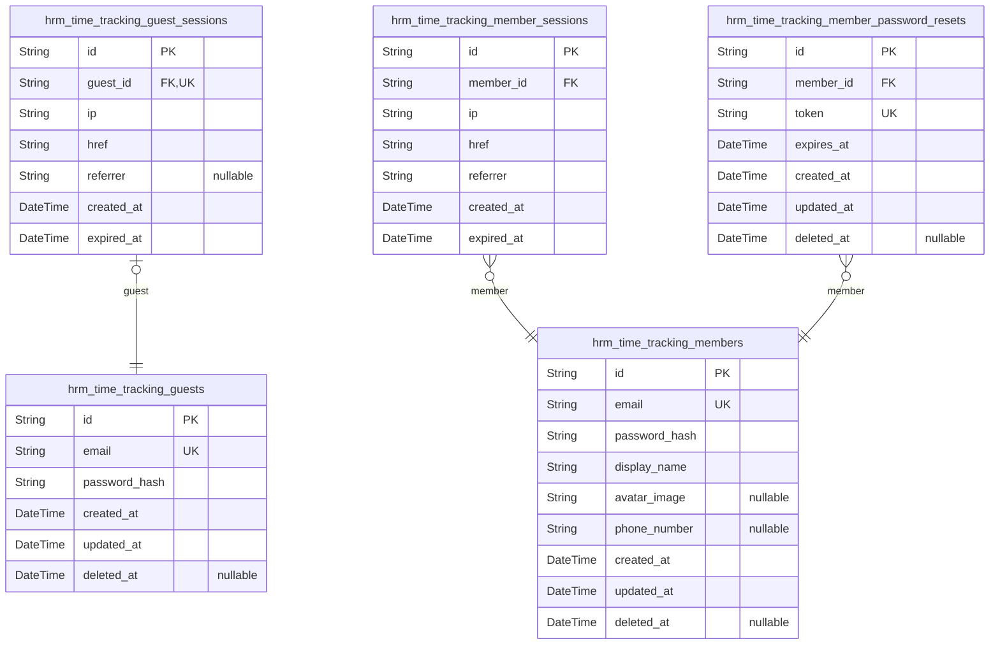
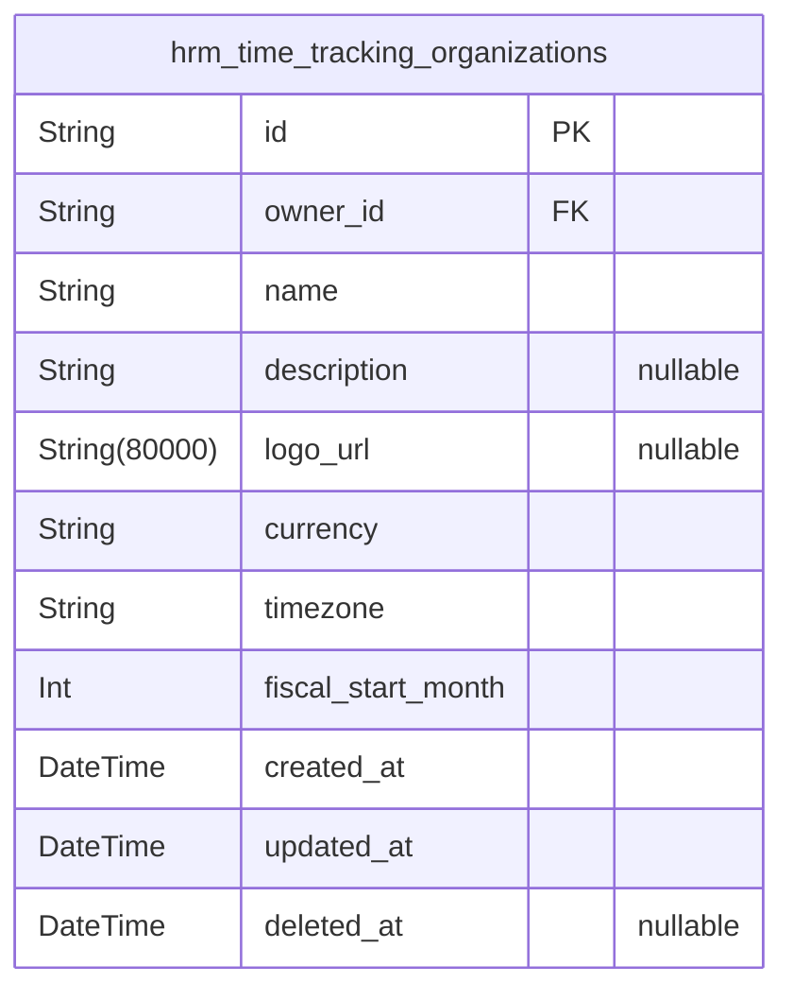
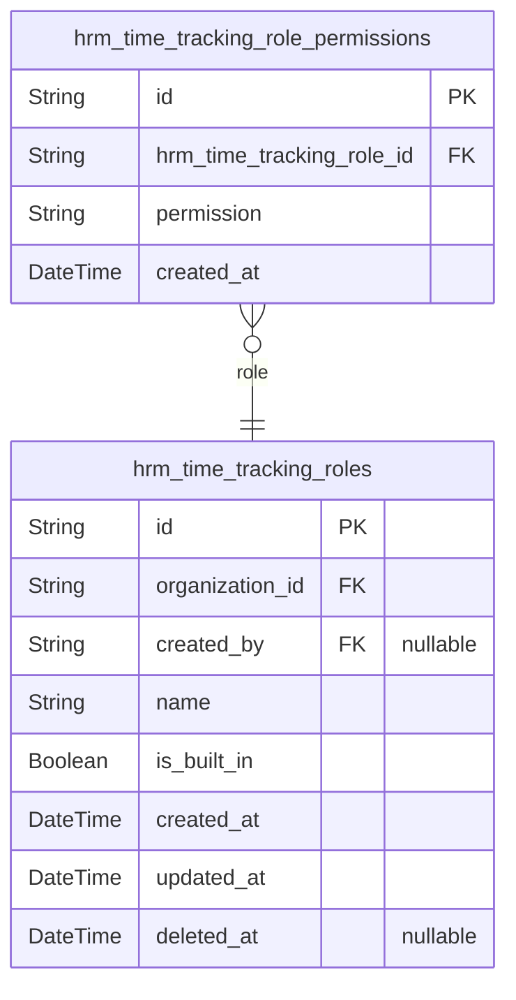
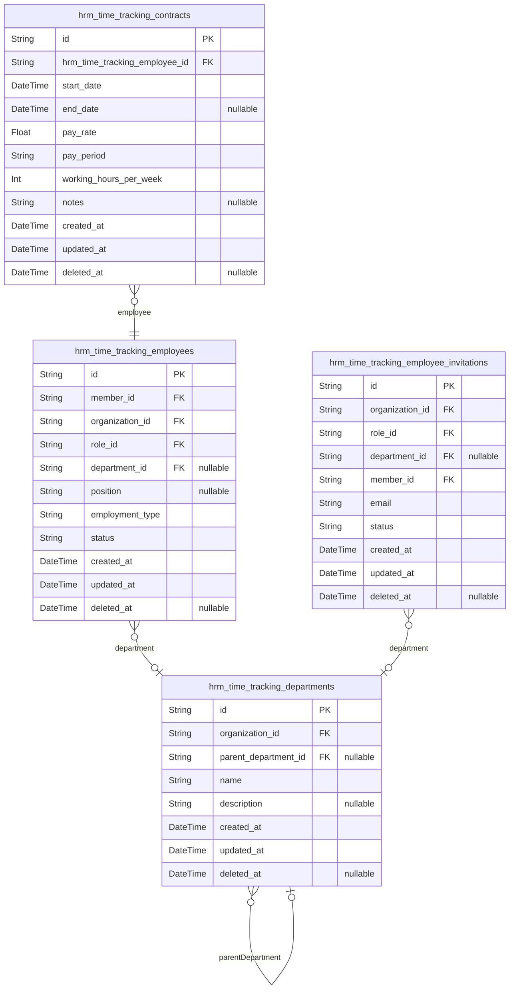
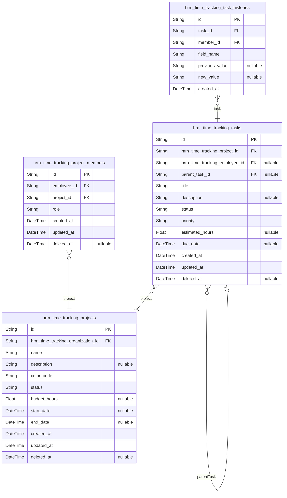
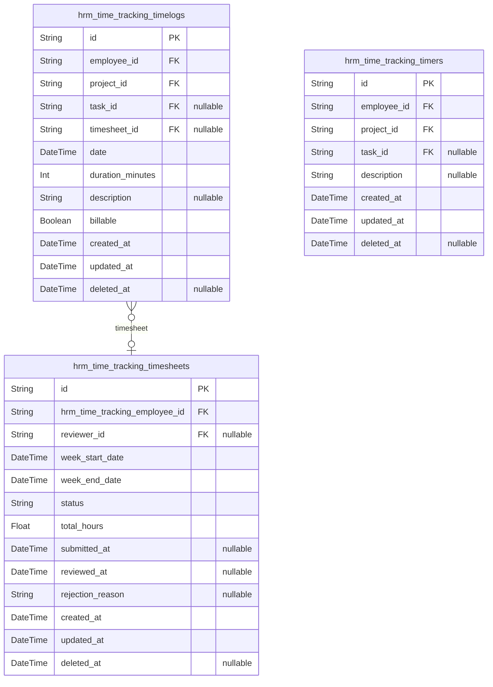
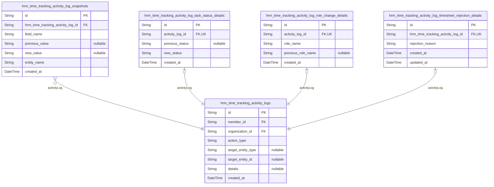

# Prisma Markdown

> Generated by [`prisma-markdown`](https://github.com/samchon/prisma-markdown)

- [Actors](#actors)
- [Systematic](#systematic)
- [RBAC](#rbac)
- [People](#people)
- [Projects](#projects)
- [Time](#time)
- [Activity](#activity)

## Actors

### `hrm_time_tracking_guests`

Temporary guest accounts for unauthenticated visitors performing
authentication operations.

Guests exist exclusively during the authentication lifecycle: signing up
for new accounts, logging in to existing accounts, or accepting
invitations to join organizations. Once authenticated, guests transition
to members and operate within an organization context.

The email address must be unique across the entire platform, ensuring no
duplicate accounts exist. Guests have no access to organization-specific
data or features until they become authenticated members.

Properties as follows:

- `id`: Primary Key.
- `email`
  > Email address for authentication. Must be unique across the entire
  > platform. Used for both sign-up and login operations.
- `password_hash`
  > Hashed password for authentication. Required for account creation during
  > sign-up and verification during login.
- `created_at`: Timestamp when the guest account was created.
- `updated_at`: Timestamp when the guest account was last updated.
- `deleted_at`
  > Timestamp when the guest account was soft-deleted. Null if the account is
  > active.

### `hrm_time_tracking_guest_sessions`

Temporary session tokens for guest access during signup, login, and
invitation acceptance flows.

Each guest session tracks the connection context (IP address, current
URL, referrer) and maintains temporal boundaries through creation and
expiration timestamps. Sessions are created when an unauthenticated
visitor interacts with authentication flows and expire after a defined
period for security purposes.

Related to [hrm_time_tracking_guests](#hrm_time_tracking_guests) as the actor whose session is
being tracked.

Properties as follows:

- `id`: Primary Key.
- `guest_id`: The guest actor who owns this session. [hrm_time_tracking_guests.id](#hrm_time_tracking_guests)
- `ip`: IP address of the client connection initiating the guest session.
- `href`
  > Current URL path where the guest session was initiated, useful for
  > redirecting after authentication.
- `referrer`
  > Referrer URL indicating where the guest came from before initiating the
  > session.
- `created_at`: Timestamp when the guest session was created.
- `expired_at`
  > Timestamp when the guest session expires. Sessions must have a defined
  > expiration for security.

### `hrm_time_tracking_members`

Registered user accounts representing individual persons who access the
ERP platform.

Each member authenticates with a globally unique email address and
password. Members can belong to multiple organizations simultaneously,
with their global profile (display name, avatar, phone) shared across all
organizations.

When logging in, members select an organization context, after which all
actions are scoped to that organization. Members can switch between
organizations without logging out.

Related entities:
- [hrm_time_tracking_member_sessions](#hrm_time_tracking_member_sessions) - Session tokens for
authentication
- [hrm_time_tracking_member_password_resets](#hrm_time_tracking_member_password_resets) - Password recovery
tokens
- [hrm_time_tracking_employees](#hrm_time_tracking_employees) - Organization memberships linking
users to organizations

Properties as follows:

- `id`: Primary Key.
- `email`
  > Unique email address serving as the primary identifier for
  > authentication. Must be unique across the entire platform; no two users
  > can share the same email address.
- `password_hash`
  > Hashed password for authentication. The password can be changed by the
  > user at any time after logging in.
- `display_name`
  > The name shown to other users within organizations. This is how the user
  > is identified in collaborative features such as task assignments,
  > timesheet reviews, and team views. Shared across all organizations the
  > user belongs to.
- `avatar_image`
  > Optional URL to the user's profile picture that appears alongside their
  > display name throughout the platform interface. Changes are immediately
  > reflected across all organizations.
- `phone_number`: Optional contact number that can be shared with organization members.
- `created_at`: Timestamp when the user account was created during initial sign-up.
- `updated_at`
  > Timestamp when the user account was last modified, including profile
  > updates and password changes.
- `deleted_at`
  > Timestamp when the user account was soft-deleted. Null for active
  > accounts. When set, the user can no longer authenticate.

### `hrm_time_tracking_member_sessions`

JWT session tokens for authenticated members tracking login sessions with
connection metadata for security auditing. Each session belongs to a
member and records IP address, current URL, referrer, creation timestamp,
and expiration time. Organization context for multi-tenancy is managed at
the application layer through the member's organization membership.
Sessions are automatically invalidated when expired_at is reached.

Properties as follows:

- `id`: Primary Key.
- `member_id`
  > The authenticated member this session belongs to. {@link
  > hrm_time_tracking_members.id}
- `ip`
  > IP address from which the member logged in, used for security auditing
  > and session validation.
- `href`
  > The URL the member was accessing when the session was created, typically
  > the login redirect target.
- `referrer`
  > HTTP referrer header from the login request, useful for tracking session
  > origin and security analysis.
- `created_at`
  > Timestamp when the session was created, marking the beginning of the
  > authenticated session.
- `expired_at`
  > Timestamp when the session expires. Always set to enforce session
  > security and prevent indefinite sessions.

### `hrm_time_tracking_member_password_resets`

Password reset tokens with expiration for members who need to recover or
change their password.

This table stores temporary, single-use tokens that allow members to
securely reset their passwords. Each token has a limited validity period
defined by the expires_at timestamp, after which it becomes invalid.
Members can have multiple reset tokens (e.g., if they request multiple
resets), but typically only the most recent valid token is used.

The table supports both password recovery (forgotten password) and
password change workflows. Tokens are cryptographically random strings
that should be included in password reset links sent via email.

Properties as follows:

- `id`: Primary Key.
- `member_id`
  > The member account for which this password reset token was created.
  > [hrm_time_tracking_members.id](#hrm_time_tracking_members).
- `token`
  > Unique, cryptographically random token string used to identify and
  > validate the password reset request. This token should be included in the
  > password reset link sent to the member's email address.
- `expires_at`
  > Timestamp when this password reset token expires. After this time, the
  > token is no longer valid and cannot be used to reset the password.
  > Typical expiration is 1-24 hours from creation.
- `created_at`: Timestamp when the password reset token was created.
- `updated_at`: Timestamp when the password reset token record was last updated.
- `deleted_at`
  > Timestamp when the password reset token was soft-deleted (used or
  > invalidated). Nullable field for audit trail purposes.

## Systematic

### `hrm_time_tracking_organizations`

Multi-tenant organization entities that serve as the foundation for data
isolation. Each organization owns all business data including employees,
projects, tasks, timelogs, and timesheets. Contains organizational
settings: name, description, logo image, currency (USD/EUR/KRW),
timezone, and fiscal start month. The owner reference links to the {@link
hrm_time_tracking_members} who created the organization. Organization
deletion cascades to all related data when constraints (no active
contracts, all timesheets resolved) are met.

Properties as follows:

- `id`: Primary Key.
- `owner_id`: Reference to the organization owner. [hrm_time_tracking_members.id](#hrm_time_tracking_members)
- `name`
  > Organization display name used throughout the application for
  > identification and display purposes.
- `description`
  > Optional description providing additional context about the
  > organization's purpose, business focus, or other relevant information.
- `logo_url`
  > URL to the organization's logo image file for branding and visual
  > identification in the application.
- `currency`
  > Organization's base currency code for financial calculations. Supported
  > values: USD (US Dollar), EUR (Euro), KRW (Korean Won).
- `timezone`
  > Organization's default timezone for date/time display and calculations.
  > Standard IANA timezone identifier (e.g., 'America/New_York',
  > 'Asia/Seoul', 'Europe/London').
- `fiscal_start_month`
  > Month number (1-12) when the organization's fiscal year begins. January =
  > 1, December = 12. Used for reporting and budget calculations.
- `created_at`: Timestamp when the organization was created.
- `updated_at`: Timestamp when the organization was last modified.
- `deleted_at`
  > Timestamp when the organization was deleted (soft delete). Null if the
  > organization is active.

## RBAC

### `hrm_time_tracking_roles`

Role definitions within organizations governing employee permissions and
access control.

Each organization maintains its own set of roles including three built-in
roles (Owner, Manager, Employee) that are created automatically and
cannot be deleted. Organization owners can create custom roles with
specific permission sets tailored to their operational needs.

Roles are assigned to employees within the organization, determining
their capabilities for employee management, project management, time
tracking, timesheet approval, and report access. Built-in roles have
predefined permission sets, while custom roles can be configured with any
combination of available permissions.

Related entities:
- [hrm_time_tracking_organizations](#hrm_time_tracking_organizations) - Organization that owns this role
- [hrm_time_tracking_members](#hrm_time_tracking_members) - Member who created this role (for
custom roles)
- [hrm_time_tracking_role_permissions](#hrm_time_tracking_role_permissions) - Permission assignments for
this role
- [hrm_time_tracking_employees](#hrm_time_tracking_employees) - Employees assigned to this role

Properties as follows:

- `id`: Primary Key.
- `organization_id`
  > The organization this role belongs to. Roles are organization-specific
  > and isolated per tenant. [hrm_time_tracking_organizations.id](#hrm_time_tracking_organizations)
- `created_by`
  > The member who created this role. Only populated for custom roles;
  > built-in roles have this field as null since they are auto-generated.
  > [hrm_time_tracking_members.id](#hrm_time_tracking_members)
- `name`
  > The name of the role. Built-in roles use 'Owner', 'Manager', and
  > 'Employee'. Custom roles can have organization-specific names. Must be
  > unique within the organization.
- `is_built_in`
  > Whether this is a built-in role (Owner, Manager, Employee) that cannot be
  > deleted. Built-in roles are created automatically when an organization is
  > created and have predefined permission sets.
- `created_at`
  > Timestamp when the role was created. For built-in roles, this matches the
  > organization creation time.
- `updated_at`
  > Timestamp when the role was last modified. Built-in roles may have
  > limited update capabilities.
- `deleted_at`
  > Timestamp when the role was soft-deleted. Built-in roles cannot be
  > deleted. Custom roles can only be deleted when no employees are assigned.

### `hrm_time_tracking_role_permissions`

Permission assignments for roles within organizations, storing granular
permission codes that define what actions employees with the assigned
role can perform.

Each role can have multiple permissions from the available set including:
org:manage (edit organization settings), employee:manage (add, edit,
deactivate employees), employee:view (view employee list and details),
project:manage (create, edit, delete projects and tasks), project:view
(view projects and tasks), time:manage (edit or delete any employee's
timelogs), time:approve (approve or reject timesheets), time:view_all
(view all employees' timelogs and timesheets), and report:view (view
organization reports).

Permission changes take effect immediately for all employees assigned to
the role. Built-in roles have predefined permission sets that cannot be
modified, while custom roles allow flexible permission assignment by
organization owners.

Related entities:
- [hrm_time_tracking_roles](#hrm_time_tracking_roles) - The role to which this permission is
assigned
- [hrm_time_tracking_organizations](#hrm_time_tracking_organizations) - Organization that owns the
role (via role FK)

Properties as follows:

- `id`: Primary Key.
- `hrm_time_tracking_role_id`
  > The role to which this permission is assigned. {@link
  > hrm_time_tracking_roles.id}
- `permission`
  > The permission code assigned to the role. Valid values include:
  > org:manage, employee:manage, employee:view, project:manage, project:view,
  > time:manage, time:approve, time:view_all, report:view. Each permission
  > grants specific capabilities within the organization.
- `created_at`
  > Timestamp when the permission was assigned to the role. Used for audit
  > trail to track when permissions were granted.

## People

### `hrm_time_tracking_employees`

Employee records linking authenticated users to organizations with role
assignment, optional department membership, position title, employment
type classification, and activation status.

Each employee represents a user's membership in a specific organization
with an assigned role that determines their permissions. An employee
belongs to exactly one organization and has exactly one role within that
organization at any given time. Employees may optionally be assigned to a
department for organizational grouping.

The employment type field categorizes the worker relationship (full-time,
part-time, contractor, intern) for reporting and payroll purposes. The
status field tracks whether the employee is active and can log time, or
deactivated with preserved historical data.

Users with employee management permission can create, edit, and
deactivate employee records. Employees can view their own profile and
other employees in their organization based on their role permissions.
All employee data is strictly isolated by organization boundary.

Key relationships:
- [hrm_time_tracking_members](#hrm_time_tracking_members) - The user account this employee
record belongs to
- [hrm_time_tracking_organizations](#hrm_time_tracking_organizations) - The organization this
employee works in
- [hrm_time_tracking_roles](#hrm_time_tracking_roles) - The role assigned to this employee
determining permissions
- [hrm_time_tracking_departments](#hrm_time_tracking_departments) - Optional department this
employee belongs to

Properties as follows:

- `id`: Primary Key.
- `member_id`
  > The user account this employee record belongs to. Each user can have one
  > employee record per organization. [hrm_time_tracking_members.id](#hrm_time_tracking_members).
- `organization_id`
  > The organization this employee belongs to. All employee data is scoped to
  > this organization. [hrm_time_tracking_organizations.id](#hrm_time_tracking_organizations).
- `role_id`
  > The role assigned to this employee, determining their permissions within
  > the organization. Each employee has exactly one role at any given time.
  > [hrm_time_tracking_roles.id](#hrm_time_tracking_roles).
- `department_id`
  > Optional department this employee belongs to for organizational grouping.
  > Department membership is optional and can be changed. {@link
  > hrm_time_tracking_departments.id}.
- `position`
  > Job position or title for this employee within the organization, such as
  > 'Software Engineer' or 'Project Manager'. Optional field that can be
  > updated by users with employee management permission.
- `employment_type`
  > Employment type classification for payroll and reporting purposes. Valid
  > values: 'full-time', 'part-time', 'contractor', 'intern'. This field is
  > required and determines how the employee's time and compensation are
  > tracked.
- `status`
  > Current status of the employee record. Valid values: 'active',
  > 'deactivated'. Active employees can log time and submit timesheets.
  > Deactivated employees cannot log time but their historical data is
  > preserved. Can be reactivated by users with employee management
  > permission.
- `created_at`
  > Timestamp when the employee record was created. Set automatically when an
  > employee is added to the organization.
- `updated_at`
  > Timestamp when the employee record was last modified. Updated
  > automatically when any field is changed.
- `deleted_at`
  > Timestamp when the employee was soft-deleted. Null if the employee is
  > active or deactivated. Soft delete preserves historical timelog and
  > timesheet data for auditing purposes.

### `hrm_time_tracking_employee_invitations`

Pending invitations for new employees sent by email before account creation.

When a user with employee management permission invites someone by email,
this table tracks the invitation if the email has no existing account.
The invitation stores the assigned role and optional department that will
be applied when the invited user signs up. Once the user creates an
account with the invited email, they are automatically added to the
organization with the specified role, and the invitation status
transitions to 'accepted'.

Related entities:
- [hrm_time_tracking_organizations](#hrm_time_tracking_organizations) - Organization the invitation
belongs to
- [hrm_time_tracking_roles](#hrm_time_tracking_roles) - Role to assign when employee is created
- [hrm_time_tracking_departments](#hrm_time_tracking_departments) - Optional department assignment
- [hrm_time_tracking_members](#hrm_time_tracking_members) - Member who sent the invitation

Properties as follows:

- `id`: Primary Key.
- `organization_id`
  > The organization to which the invited employee will belong. {@link
  > hrm_time_tracking_organizations.id}.
- `role_id`
  > The role that will be assigned to the employee when they accept the
  > invitation. [hrm_time_tracking_roles.id](#hrm_time_tracking_roles).
- `department_id`
  > Optional department that will be assigned to the employee upon joining.
  > [hrm_time_tracking_departments.id](#hrm_time_tracking_departments).
- `member_id`: The member who sent the invitation. [hrm_time_tracking_members.id](#hrm_time_tracking_members).
- `email`
  > Email address of the invited person. When they sign up with this email,
  > the invitation will be automatically accepted.
- `status`
  > Current status of the invitation: 'pending' (awaiting signup), 'accepted'
  > (user has signed up and joined), 'expired' (invitation no longer valid).
- `created_at`: Timestamp when the invitation was created and sent.
- `updated_at`: Timestamp when the invitation was last modified.
- `deleted_at`: Timestamp when the invitation was soft deleted. Null if not deleted.

### `hrm_time_tracking_contracts`

Employment contracts tracking pay rate, pay period, working hours, and
duration for each employee.

Each contract represents the formal employment terms between an
organization and an employee for a defined period. Contracts serve as
historical records of compensation agreements and expected work
commitments. An employee can have multiple contracts over time, but only
one contract can be active at any given time.

Past contracts (those with end_date in the past) are immutable historical
records and cannot be modified. Only the current active contract can be
edited by users with appropriate permissions.

Relationships:
- Belongs to [hrm_time_tracking_employees](#hrm_time_tracking_employees) (required)
- Supports historical employment tracking through start_date and end_date
fields

Properties as follows:

- `id`: Primary Key.
- `hrm_time_tracking_employee_id`
  > The employee who holds this contract. Each contract belongs to exactly
  > one employee. [hrm_time_tracking_employees.id](#hrm_time_tracking_employees)
- `start_date`
  > The date when the employment terms take effect. Required field indicating
  > when the contract period begins.
- `end_date`
  > The date when the employment terms expire. When not specified (null), the
  > contract represents an ongoing employment arrangement with no
  > predetermined conclusion. When specified, it marks when the employment
  > terms end.
- `pay_rate`
  > The numeric compensation amount as specified in the contract. The actual
  > meaning (hourly rate, daily rate, etc.) is determined by the pay_period
  > field.
- `pay_period`
  > How frequently compensation is calculated and paid. Allowed values:
  > 'hourly' (compensation calculated per hour worked), 'daily' (compensation
  > calculated per day worked), 'weekly' (compensation calculated per week),
  > 'monthly' (compensation calculated per month).
- `working_hours_per_week`
  > The expected working hours per week as specified in the contract.
  > Establishes the standard time commitment for the employee (e.g., 40
  > hours).
- `notes`
  > Optional additional information about the employment terms, special
  > conditions, or other relevant details.
- `created_at`: Timestamp when the contract record was created.
- `updated_at`: Timestamp when the contract record was last modified.
- `deleted_at`
  > Timestamp when the contract was soft-deleted. Null if the contract is
  > active.

### `hrm_time_tracking_departments`

Organizational departments within multi-tenant organizations that group
employees by functional area.

Each department belongs to exactly one organization and supports one
level of nesting through an optional parent department reference. This
allows for hierarchical department structures like Engineering > Backend
Team.

Departments are managed by users with org:manage permission. When a
department is deleted, employees assigned to that department have their
department reference cleared (set to null) but are not deleted
themselves.

Related entities: [hrm_time_tracking_employees](#hrm_time_tracking_employees) can optionally
belong to a department.

Properties as follows:

- `id`: Primary Key.
- `organization_id`
  > The organization this department belongs to. Departments are strictly
  > isolated per organization. [hrm_time_tracking_organizations.id](#hrm_time_tracking_organizations)
- `parent_department_id`
  > Optional parent department for one-level nesting hierarchy. Enables
  > structures like 'Engineering > Backend Team'. Null for top-level
  > departments. [hrm_time_tracking_departments.id](#hrm_time_tracking_departments)
- `name`
  > Department name, unique within the organization. Examples: 'Engineering',
  > 'Marketing', 'Human Resources'.
- `description`: Optional description of the department's purpose and responsibilities.
- `created_at`: Timestamp when the department was created.
- `updated_at`: Timestamp when the department was last modified.
- `deleted_at`
  > Timestamp when the department was soft-deleted. Null if the department is
  > active.

## Projects

### `hrm_time_tracking_projects`

Projects representing distinct bodies of work or initiatives within an
organization, serving as containers for tasks and time tracking.

Each project has a name, optional description, color code for visual
identification, status tracking through active/archived/completed
lifecycle, optional budget hours for estimation, and optional date range
for scheduling. Projects belong to organizations and serve as the primary
organizational unit for task management and time tracking.

Projects can be archived or completed to prevent new timelogs while
preserving historical data. Project deletion is only allowed when no
timelogs are associated. Projects have members assigned through {@link
hrm_time_tracking_project_members} and tasks created within them through
[hrm_time_tracking_tasks](#hrm_time_tracking_tasks).

Properties as follows:

- `id`: Primary Key.
- `hrm_time_tracking_organization_id`
  > The organization this project belongs to. {@link
  > hrm_time_tracking_organizations.id}
- `name`
  > Project name, unique within the organization. Used for identification and
  > display purposes.
- `description`
  > Optional detailed description of the project's purpose, scope, and
  > objectives.
- `color_code`
  > Hexadecimal color code for UI display and visual identification (e.g.,
  > '#FF5733'). Required for visual differentiation in project lists and
  > reports.
- `status`
  > Project status indicating current lifecycle state. Valid values: 'active'
  > (ongoing work), 'archived' (temporarily suspended), 'completed'
  > (finished). Archived and completed projects cannot receive new timelogs.
- `budget_hours`
  > Total estimated hours for the project budget. Used for tracking budget
  > utilization in reports. Optional - projects without budget are excluded
  > from budget reports.
- `start_date`
  > Project start date for scheduling and timeline tracking. Optional field
  > for project planning.
- `end_date`
  > Project end date for scheduling and timeline tracking. Optional field for
  > project planning and deadline management.
- `created_at`: Timestamp when the project was created.
- `updated_at`: Timestamp when the project was last modified.
- `deleted_at`
  > Timestamp when the project was soft-deleted. Null if project is active.
  > Soft delete preserves historical timelog data.

### `hrm_time_tracking_project_members`

Project memberships linking employees to projects with assigned roles,
enabling role-based task management permissions within projects.

Each membership represents an employee's participation in a project with
a specific role that determines their access level. Project leads can
manage tasks within their assigned project, while members have standard
project participation access.

The unique constraint on employee and project prevents duplicate
membership assignments. Employees can be members of multiple projects
simultaneously, and each project can have multiple members with varying
roles.

Related entities: [hrm_time_tracking_employees](#hrm_time_tracking_employees) (the employee
assigned to the project), [hrm_time_tracking_projects](#hrm_time_tracking_projects) (the project
the employee is assigned to).

Properties as follows:

- `id`: Primary Key.
- `employee_id`
  > The employee assigned to the project. Must be an active employee within
  > the same organization as the project. {@link
  > hrm_time_tracking_employees.id}.
- `project_id`
  > The project the employee is assigned to. Determines the project context
  > for the membership role. [hrm_time_tracking_projects.id](#hrm_time_tracking_projects).
- `role`
  > The assigned role within the project. Either 'member' for standard
  > project participation access, or 'project_lead' for task management
  > permissions within the project.
- `created_at`: Timestamp when the project membership was created.
- `updated_at`: Timestamp when the project membership was last modified.
- `deleted_at`
  > Timestamp when the project membership was removed (soft delete). Null if
  > the membership is active.

### `hrm_time_tracking_tasks`

Work items within projects representing specific units of work that can
be tracked, assigned, and monitored.

Each task has a required title describing the work to be performed and an
optional description providing additional context. Tasks support planning
through optional estimated hours for effort planning and due date for
deadline tracking.

Tasks progress through four status values: open (awaiting work),
in-progress (being worked on), completed (finished), and closed (no
longer active). Priority levels (low, medium, high, urgent) indicate task
urgency for work prioritization.

Tasks support single-level nesting through parent task relationships,
enabling hierarchical organization of work as subtasks. A subtask cannot
itself have subtasks. Tasks can be assigned to employees who are members
of the containing project.

All task status changes are recorded in {@link
hrm_time_tracking_task_histories} for audit trail purposes. Time spent on
tasks is tracked through [hrm_time_tracking_timelogs](#hrm_time_tracking_timelogs).

Properties as follows:

- `id`: Primary Key.
- `hrm_time_tracking_project_id`
  > The project this task belongs to. Tasks are always associated with a
  > specific project. [hrm_time_tracking_projects.id](#hrm_time_tracking_projects)
- `hrm_time_tracking_employee_id`
  > The employee assigned to this task, who must be a member of the
  > containing project. Optional assignment for workload distribution and
  > accountability. [hrm_time_tracking_employees.id](#hrm_time_tracking_employees)
- `parent_task_id`
  > The parent task for subtask relationships. Only one level of nesting is
  > supported - a subtask cannot have its own subtasks. Null for top-level
  > tasks. [hrm_time_tracking_tasks.id](#hrm_time_tracking_tasks)
- `title`: The title of the task, concisely describing the work to be performed.
- `description`
  > Detailed description providing additional context, instructions, or
  > details about the work to be performed.
- `status`
  > The current status of the task. Valid values: 'open' (newly created
  > awaiting work), 'in-progress' (currently being worked on), 'completed'
  > (finished), 'closed' (no longer active).
- `priority`
  > The urgency level of the task for work prioritization. Valid values:
  > 'low', 'medium', 'high', 'urgent'.
- `estimated_hours`
  > The anticipated time required to complete the task, in hours. Used for
  > effort planning and progress tracking.
- `due_date`
  > The deadline by which the task should be completed. Used for deadline
  > tracking and prioritization.
- `created_at`: The timestamp when the task was created.
- `updated_at`: The timestamp when the task was last updated.
- `deleted_at`
  > The timestamp when the task was soft-deleted. Null if the task is still
  > active.

### `hrm_time_tracking_task_histories`

Audit trail capturing task modifications within projects, recording each
field change with timestamp, previous value, new value, and the member
who performed the change.

This table serves as an immutable historical record of task lifecycle
transitions including status changes, priority updates, assignment
modifications, and field edits. Each entry represents a single field
modification on a task, providing complete traceability for compliance
and debugging purposes.

The history entries are append-only and cannot be modified or deleted
once created, ensuring audit integrity. Entries are linked to the task
being modified and the member who performed the action.

Properties as follows:

- `id`: Primary Key.
- `task_id`: The task that was modified. [hrm_time_tracking_tasks.id](#hrm_time_tracking_tasks).
- `member_id`
  > The member who performed the modification. {@link
  > hrm_time_tracking_members.id}.
- `field_name`
  > The name of the task field that was modified (e.g., 'status', 'priority',
  > 'title', 'assigned_employee_id', 'due_date').
- `previous_value`
  > The value of the field before the modification. Null when a field is
  > being set for the first time.
- `new_value`
  > The value of the field after the modification. Null when a field is being
  > cleared or unset.
- `created_at`
  > Timestamp when the modification was recorded. Captures the exact moment
  > of the change for audit trail purposes.

## Time

### `hrm_time_tracking_timelogs`

Individual time entries recording work performed by employees on specific
dates.

Each timelog captures the date of work, duration in minutes, and optional
description of work performed. Timelogs must be associated with a project
the employee is assigned to, and optionally with a specific task within
that project.

The billable flag indicates whether the time should be considered for
billing purposes (defaults to true). Employees can designate time as
non-billable for internal work.

Timelogs can be included in timesheets for approval. Once part of an
approved timesheet, timelogs become locked and cannot be modified or
deleted, ensuring integrity of approved time records.

Relationships:
- [hrm_time_tracking_employees](#hrm_time_tracking_employees) - The employee who logged the time
- [hrm_time_tracking_projects](#hrm_time_tracking_projects) - The project the time was logged
against
- [hrm_time_tracking_tasks](#hrm_time_tracking_tasks) - Optional task the time was logged
against
- [hrm_time_tracking_timesheets](#hrm_time_tracking_timesheets) - Optional timesheet containing
this timelog (when submitted)

Properties as follows:

- `id`: Primary Key.
- `employee_id`
  > The employee who logged this time entry. Employees can only create
  > timelogs for themselves. [hrm_time_tracking_employees.id](#hrm_time_tracking_employees)
- `project_id`
  > The project this time was logged against. The employee must be a project
  > member to log time on this project. [hrm_time_tracking_projects.id](#hrm_time_tracking_projects)
- `task_id`
  > Optional task this time was logged against. When specified, the task must
  > belong to the same project. [hrm_time_tracking_tasks.id](#hrm_time_tracking_tasks)
- `timesheet_id`
  > Optional timesheet this timelog belongs to. Set when the timelog is
  > included in a submitted timesheet. When the timesheet is approved, this
  > timelog becomes locked. [hrm_time_tracking_timesheets.id](#hrm_time_tracking_timesheets)
- `date`
  > The date when the work was performed. Used for timesheet week grouping
  > and date-range filtering.
- `duration_minutes`
  > Duration of work in minutes. Provides granular time tracking for billing
  > and reporting purposes.
- `description`
  > Optional description of what work was performed. Provides context for the
  > time entry.
- `billable`
  > Whether this time should be considered for billing purposes. Defaults to
  > true. Set to false for internal or non-billable work.
- `created_at`: Timestamp when the timelog was created.
- `updated_at`: Timestamp when the timelog was last modified.
- `deleted_at`
  > Timestamp when the timelog was soft-deleted. Preserved for historical
  > records and recovery.

### `hrm_time_tracking_timesheets`

Weekly timesheet collections aggregating employee timelogs from Monday to
Sunday for approval workflow management.

Each timesheet represents a complete work week for an employee, serving
as the submission unit for time tracking approval. Timesheets progress
through a defined workflow: draft (editable) → submitted (awaiting
approval) → approved (finalized, locks timelogs) or rejected (returns to
draft with reason).

Timesheets enforce one-per-employee-per-week constraints and aggregate
total hours from included timelogs. Approved timesheets lock all
associated timelogs, preventing further modifications to ensure data
integrity for payroll and reporting purposes.

Key relationships:
- Belongs to [hrm_time_tracking_employees](#hrm_time_tracking_employees) as the timesheet owner
- Reviewed by [hrm_time_tracking_members](#hrm_time_tracking_members) when approved or rejected
- Contains multiple [hrm_time_tracking_timelogs](#hrm_time_tracking_timelogs) entries within the
week date range

Properties as follows:

- `id`: Primary Key.
- `hrm_time_tracking_employee_id`
  > The employee who owns this timesheet. References {@link
  > hrm_time_tracking_employees.id}. Each employee can have one timesheet per
  > week.
- `reviewer_id`
  > The member who reviewed (approved or rejected) this timesheet. References
  > [hrm_time_tracking_members.id](#hrm_time_tracking_members). Populated when timesheet
  > transitions from submitted to approved or rejected status.
- `week_start_date`
  > The start date of the timesheet week, always a Monday. Defines the
  > beginning of the seven-day period covered by this timesheet.
- `week_end_date`
  > The end date of the timesheet week, always a Sunday. Defines the end of
  > the seven-day period covered by this timesheet.
- `status`
  > The current status of the timesheet in the approval workflow. Valid
  > values: 'draft' (editable), 'submitted' (awaiting approval), 'approved'
  > (finalized), 'rejected' (returned to draft with reason). Transitions:
  > draft→submitted→approved, or submitted→rejected→draft.
- `total_hours`
  > The total hours calculated from all included timelogs. Automatically
  > recalculated when timelogs are added or removed from the timesheet.
- `submitted_at`
  > The timestamp when the timesheet was submitted for approval. Populated
  > when status transitions from draft to submitted.
- `reviewed_at`
  > The timestamp when the timesheet was reviewed (approved or rejected).
  > Populated when status transitions from submitted to approved or rejected.
- `rejection_reason`
  > The reason provided when rejecting a timesheet. Required when a reviewer
  > rejects a submitted timesheet. Visible to the employee for correction
  > guidance.
- `created_at`
  > The timestamp when the timesheet was created. Automatically set upon
  > creation.
- `updated_at`
  > The timestamp when the timesheet was last modified. Automatically updated
  > on any change.
- `deleted_at`
  > The timestamp when the timesheet was soft-deleted. Null for active
  > timesheets. Enables data recovery and audit trail preservation.

### `hrm_time_tracking_timers`

Real-time tracking sessions for employees that record work in progress.

Each timer represents an active time tracking session that an employee
has started. The timer captures the start timestamp, the project being
worked on, an optional specific task, and an optional description of the
work being performed. When an employee stops the timer, the elapsed
duration (rounded to nearest minute) is used to create a timelog entry.
Alternatively, employees may discard timers to cancel tracking without
creating any timelog record.

Employees can have at most one active timer at any time. This constraint
is enforced at the application layer. Timers continue running
indefinitely until the employee manually intervenes - there is no
automatic stop mechanism. Employees can edit the project, task, and
description of a running timer.

Soft delete is supported via deleted_at field to maintain audit trail and
align with data retention policies.

Relationships:
- Belongs to [hrm_time_tracking_employees](#hrm_time_tracking_employees) (the employee tracking
time)
- References [hrm_time_tracking_projects](#hrm_time_tracking_projects) (required - where work is
performed)
- Optionally references [hrm_time_tracking_tasks](#hrm_time_tracking_tasks) (specific task if
applicable)

Properties as follows:

- `id`: Primary Key.
- `employee_id`
  > The employee who owns this timer session. {@link
  > hrm_time_tracking_employees.id}
- `project_id`
  > The project this timer is tracking time against. Required as time must be
  > associated with a project. [hrm_time_tracking_projects.id](#hrm_time_tracking_projects)
- `task_id`
  > The optional specific task being worked on during this timer session.
  > [hrm_time_tracking_tasks.id](#hrm_time_tracking_tasks)
- `description`
  > Optional description of the work being performed during this timer
  > session. Can be edited while the timer is running.
- `created_at`
  > Timestamp when the timer was started. This is the start time used for
  > calculating duration when the timer is stopped.
- `updated_at`
  > Timestamp when the timer was last modified (e.g., description or
  > project/task changed).
- `deleted_at`
  > Timestamp when the timer was discarded or soft-deleted. When null, the
  > timer is active or was stopped (converted to timelog). When set, the
  > timer was discarded without creating a timelog.

## Activity

### `hrm_time_tracking_activity_logs`

Main audit trail entries recording all significant organizational actions
including employee management, project lifecycle, contract changes, task
status changes, timesheet events, and role assignments. Each entry
captures the timestamp, the member who performed the action, the action
type, optional target entity reference, organization context, and
optional details.

Action types include: employee_invited, employee_deactivated,
employee_reactivated, contract_created, contract_edited, project_created,
project_archived, project_completed, project_deleted,
task_status_changed, timesheet_submitted, timesheet_approved,
timesheet_rejected, role_assigned, role_changed.

Users with org:manage permission can view and filter the activity log by
action type, user, and date range. Activity log entries are permanent
audit records and cannot be modified or deleted.

Properties as follows:

- `id`: Primary Key.
- `member_id`: The member who performed the action. [hrm_time_tracking_members.id](#hrm_time_tracking_members)
- `organization_id`
  > The organization context for this activity. Enforces multi-tenant data
  > isolation. [hrm_time_tracking_organizations.id](#hrm_time_tracking_organizations)
- `action_type`
  > The type of action performed. Allowed values: employee_invited,
  > employee_deactivated, employee_reactivated, contract_created,
  > contract_edited, project_created, project_archived, project_completed,
  > project_deleted, task_status_changed, timesheet_submitted,
  > timesheet_approved, timesheet_rejected, role_assigned, role_changed.
- `target_entity_type`
  > The type of entity that was affected by the action. Examples: employee,
  > contract, project, task, timesheet, role. Used with target_entity_id for
  > polymorphic entity reference.
- `target_entity_id`
  > The UUID of the entity that was affected by the action. Combined with
  > target_entity_type to form a polymorphic reference to any entity in the
  > system.
- `details`
  > Optional JSON-encoded details about the action. For task_status_changed:
  > includes old_status and new_status. For role_assigned/role_changed:
  > includes role name. For timesheet_rejected: includes rejection reason.
  > NOTE: This field is deprecated in favor of normalized child tables
  > (activity_log_task_status_details, activity_log_role_change_details,
  > activity_log_timesheet_rejection_details).
- `created_at`
  > Timestamp when the activity was recorded. Activity logs are append-only
  > and immutable.

### `hrm_time_tracking_activity_log_snapshots`

Entity state snapshots captured at the time of activity log creation,
storing contextual data such as previous/new values for role changes,
entity names, and other action-specific metadata for enhanced audit trail
detail.

Each snapshot represents a single field change within an activity log
entry. When multiple properties of an entity change simultaneously (e.g.,
a task status change from 'open' to 'in-progress'), each field change is
recorded as a separate snapshot record linked to the same parent activity
log.

This design supports the comprehensive audit requirements for actions
including: employee lifecycle events (invited, deactivated, reactivated),
contract modifications, project lifecycle transitions (created, archived,
completed, deleted), task status progression, timesheet workflow
decisions (submitted, approved, rejected), and role assignment changes.

The entity_name field captures the human-readable name of the target
entity at the moment of the action, preserving historical context even if
the underlying entity is subsequently renamed or deleted.

As a subsidiary entity of [hrm_time_tracking_activity_logs](#hrm_time_tracking_activity_logs), this
table is not directly exposed through user-facing APIs. Snapshots are
created automatically during activity log creation and remain immutable
for the lifetime of the audit record.

Properties as follows:

- `id`: Primary Key.
- `hrm_time_tracking_activity_log_id`
  > The parent activity log entry this snapshot belongs to. References {@link
  > hrm_time_tracking_activity_logs.id}.
- `field_name`
  > The name of the field that changed (e.g., 'status', 'role',
  > 'employment_type', 'pay_rate'). Used to identify what aspect of the
  > entity was modified in this snapshot.
- `previous_value`
  > The value before the change. Nullable for creation events where no
  > previous value exists (e.g., 'Employee invited' has no prior state).
  > Stored as string for flexibility across different field types.
- `new_value`
  > The value after the change. Nullable for deletion events where no
  > subsequent value exists. Stored as string for flexibility across
  > different field types.
- `entity_name`
  > Display name of the target entity at the time of the action (e.g.,
  > employee name, project name, task title). Captured for historical
  > reference even if the entity is later renamed or deleted.
- `created_at`
  > Timestamp when this snapshot was created. Aligns with the parent activity
  > log timestamp for consistent audit trail ordering.

### `hrm_time_tracking_activity_log_task_status_details`

Normalized detail records for task_status_changed activity log entries,
storing the previous and new task status values as separate atomic fields
for First Normal Form (1NF) compliance.

Each record provides the specific status transition data for task status
change events in the audit trail. The previous_status field is nullable
to accommodate initial task creation events where no prior status
existed. This table maintains a one-to-one relationship with {@link
hrm_time_tracking_activity_logs} - each task status change activity log
has exactly one corresponding detail record with the transition
specifics.

Task status values follow the project management workflow: open (awaiting
work), in-progress (being worked on), completed (finished), and closed
(no longer active). These detail records are immutable and serve as the
authoritative source for understanding task lifecycle transitions in the
organization's audit trail.

Properties as follows:

- `id`: Primary Key.
- `activity_log_id`
  > Reference to the parent activity log entry. Each task status change
  > activity log has exactly one detail record. {@link
  > hrm_time_tracking_activity_logs.id}.
- `previous_status`
  > The task status before this change. Nullable for initial task creation
  > events where no previous status exists. Valid values: open, in-progress,
  > completed, closed.
- `new_status`
  > The task status after this change. Always has a value since every status
  > change produces a new current status. Valid values: open, in-progress,
  > completed, closed.
- `created_at`
  > Timestamp when this detail record was created, coinciding with the task
  > status change event.

### `hrm_time_tracking_activity_log_role_change_details`

Normalized detail records for role_assigned and role_changed activity log
entries, storing the new role name and previous role name as separate
atomic fields for First Normal Form (1NF) compliance.

Each record has a one-to-one relationship with a parent activity log
entry of type 'role_assigned' or 'role_changed'. For initial role
assignments, the previous_role_name field is null. For role changes, both
fields contain values to support before/after comparisons in audit
reports.

This normalization pattern avoids storing structured data in a generic
'details' field and enables efficient querying of role change history.

Properties as follows:

- `id`: Primary Key.
- `activity_log_id`
  > Reference to the parent activity log entry. {@link
  > hrm_time_tracking_activity_logs.id}
- `role_name`: The name of the newly assigned role at the time of the activity log entry.
- `previous_role_name`
  > The name of the previously assigned role before this change. Null for
  > initial role assignments when the employee had no prior role.
- `created_at`
  > Timestamp when this detail record was created, synchronized with the
  > parent activity log entry.

### `hrm_time_tracking_activity_log_timesheet_rejection_details`

Normalized details for timesheet_rejected activity logs, storing the
rejection reason as an atomic field for 1NF compliance.

This subsidiary table maintains a 1:1 relationship with activity_logs
entries where the action type is 'timesheet_rejected'. When a manager
rejects a submitted timesheet, the rejection reason is captured here to
explain why the timesheet was not approved. This separation ensures clean
data normalization and allows the main activity_logs table to remain
general-purpose while still capturing all necessary contextual
information.

The rejection reason supports the timesheet rejection workflow by
providing employees with actionable feedback to modify and resubmit their
timesheets.

Properties as follows:

- `id`: Primary Key.
- `hrm_time_tracking_activity_log_id`
  > The activity log entry for timesheet rejection. Each activity log has at
  > most one timesheet rejection detail record. {@link
  > hrm_time_tracking_activity_logs.id}
- `rejection_reason`
  > The reason provided when a timesheet was rejected, explaining why the
  > submission was not approved. This feedback helps employees understand
  > what needs to be corrected before resubmission.
- `created_at`: Timestamp when this timesheet rejection detail record was created.
- `updated_at`: Timestamp when this timesheet rejection detail record was last updated.
