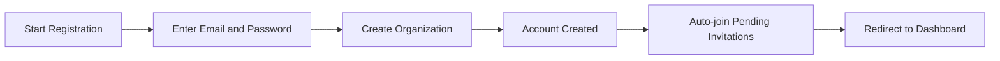
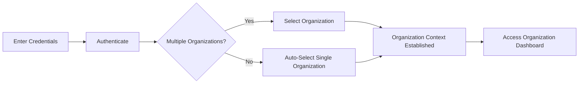

**hrmTimeTracking — Actor definitions, permission matrix, authentication, session, account lifecycle**

Actor definitions, permission matrix, authentication, session, account lifecycle

# Actor Definitions

Define all user actor types with their identity, permissions, and access boundaries.

## guest Actor

A guest is an unauthenticated visitor who has not yet signed into the platform. Guests can register for a new account by providing an email address and password during the sign-up process. During registration, the guest is required to create an organization, which becomes their primary workspace within the multi-tenant platform. Guests who already possess an existing account can authenticate by logging in with their registered email and password. Upon successful authentication, guests transition to authenticated members and must select an organization context to work within. If the user belongs to multiple organizations, they choose which organization to access at that moment. Guest permissions are strictly limited to account creation and authentication functions, with no access to organization data or member features until authentication is complete.

### Guest Identity

Guests are limited exclusively to authentication flows. They can initiate the sign-up process by providing an email address and password to create a new account. During sign-up, the guest must create an organization, which becomes their primary workspace in the multi-tenant platform. Guests who already have an existing account can authenticate by logging in with their registered email and password. After authentication, guests must select an organization context to work within. If the authenticated user belongs to multiple organizations, they choose which organization to access. Guests cannot access any organization-specific features, view any data, or perform any actions beyond account creation and authentication until they become authenticated members.

## member Actor

A member is an authenticated user who has logged in and selected an organization context to work within. Each member is assigned exactly one role within their current organization, which determines their permissions and the features they can access. The platform provides three built-in roles: Owner with full access to all organization features, Manager with permissions to manage employees, projects, and approve timesheets, and Employee with permissions to track time, submit timesheets, and view their own data. Organization owners can create custom roles with specific permission combinations tailored to their needs. Available permissions include organization management, employee management and viewing, project management and viewing, time entry management, timesheet approval, viewing all time data, and viewing reports. Members can belong to multiple organizations and switch between them without logging out. Each member has a global profile containing their display name, avatar image, and phone number, which is shared across all organizations they belong to. A member's access boundaries are strictly limited to their currently selected organization, with no visibility into data from other organizations they may belong to.

### Member Actor Definition

A member is an authenticated user who has successfully logged in and selected an organization context to work within. Upon authentication, the member chooses which organization to work in from all organizations they belong to. All subsequent actions performed by the member are scoped to the currently selected organization context. The member's identity and access rights are determined by their role assignment within the selected organization. A member remains in the selected organization context until they explicitly switch to another organization or log out. The organization context is enforced on every request, ensuring that members can only interact with data and features within their currently selected organization.

### Role Assignment Per Organization

Each member is assigned exactly one role within each organization they belong to. When a member switches organizations, their permissions and feature access change according to the role assigned in the new organization context. A member can hold different roles across different organizations—for example, they may be an Owner in one organization and an Employee in another. Role assignments are managed by users with employee management permission within each organization. The assigned role determines which features the member can access and which operations they can perform within that organization.

### Built-in Roles

The platform provides three built-in roles that cannot be deleted:

**Owner**: Has full access to all organization features. Owners can manage organization settings, manage roles and members, approve timesheets, view all reports, and perform any action available in the system. The Owner role includes all available permissions.

**Manager**: Can manage employees and projects, approve timesheets, and view reports. Managers have permissions for employee management and viewing, project management and viewing, timesheet approval, viewing all employees' time data, and viewing organization reports.

**Employee**: Can track time, submit timesheets, and view their own data. Employees have permissions to create and manage their own timelogs, submit and manage their own timesheets, view projects they are assigned to, and view their own employee record and contracts.

### Custom Roles

Organization owners can create custom roles with specific permission combinations tailored to their organizational needs. Each custom role has a name and a set of permissions selected from the available permission list. Available permissions include: organization management (edit organization settings), employee management (add, edit, deactivate employees), employee viewing (view employee list and details), project management (create, edit, delete projects and tasks), project viewing (view projects and tasks), time entry management (edit or delete any employee's timelogs), timesheet approval (approve or reject timesheets), viewing all time data (view all employees' timelogs and timesheets), and viewing reports (view organization reports). Organization owners can edit custom roles to modify their name or permissions. Custom roles can be deleted only if no employees are currently assigned to them.

### Organization Switching

Members who belong to multiple organizations can switch between organizations without logging out. When a member switches organizations, their organization context changes to the newly selected organization. After switching, all subsequent actions are scoped to the new organization. The member's role and permissions automatically adjust based on their role assignment in the new organization. Organization switching preserves the member's authentication session—no re-authentication is required. The member's global profile remains unchanged when switching organizations.

### Global Profile

Each member has a global profile that is shared across all organizations they belong to. The global profile contains the member's display name, avatar image, and phone number. Members can edit their global profile at any time. Changes to the global profile are reflected across all organizations the member belongs to. Other members in any organization see the same profile information for the member. The global profile is separate from organization-specific employee records, which contain role assignment, department, position, and employment type.

### Permission-Based Feature Access

A member's access to features is determined by the permissions granted through their assigned role. If a member's role does not include a specific permission, the corresponding features are not accessible or visible to them. For example, a member without report viewing permission cannot access organization reports. A member without timesheet approval permission cannot approve or reject timesheets. Permission checks are enforced throughout the system to ensure members can only perform actions authorized by their role.

### Data Access Boundaries

All data is strictly isolated per organization. A member can only access data within their currently selected organization context. Members cannot see employees, projects, tasks, timelogs, timesheets, or any other data from organizations they are not currently working in, even if they belong to those organizations. When a member switches organizations, their data access immediately changes to the new organization's data. The data isolation boundary is enforced on every request, ensuring complete separation of organization data. This isolation applies to all members regardless of their role or permission level.

# Authentication Flows

Registration, login, logout, and session management from a user perspective.

## Registration and Login

Define user registration and login flows including validation and error handling.

### User Registration

Users sign up with an email address and password.

The email address must be unique across the platform. If the email is already registered, the registration request is rejected.

The password is required for account creation.

During the initial sign-up process, the user creates their first organization. The user provides the organization name, which is required. The user may optionally provide a description, logo image, currency (such as USD, EUR, or KRW), timezone, and fiscal start month.

Upon successful registration, the user becomes the owner of the created organization with full access to all features.

If the user's email already exists in pending invitations for other organizations, the user is automatically added to those organizations upon completing registration.

### User Login

Users log in with their email address and password.

If the email does not exist or the password is incorrect, the login request is rejected.

After successful authentication, if the user belongs to only one organization, the user is automatically placed in that organization's context.

After successful authentication, if the user belongs to multiple organizations, the user must select which organization to work in. This establishes the organization context for the session.

All subsequent actions are scoped to the selected organization. Users cannot access data from other organizations while in the current organization context.

Users can switch to a different organization without logging out. Switching organizations changes the organization context and grants access to that organization's data.

### Authentication Context

Authentication establishes both the user's identity and the organization context.

The organization context determines which organization's data the user can access. All operations within the system require an active organization context.

Users who belong to multiple organizations maintain separate access rights and roles in each organization. The user's role and permissions in one organization do not affect their role and permissions in another organization.

When a user's role or access changes in an organization, the changes take effect immediately upon the next action within that organization context.

If a user is deactivated in an organization, the user cannot access that organization's data but retains access to other organizations where they remain active.

## Session and Logout

Define session behavior and logout from a user perspective.

### Session and Organization Context

After a user successfully logs in, they must select which organization to work in if they belong to multiple organizations.

If the user belongs to only one organization, that organization is automatically selected as the working context.

All subsequent user actions are scoped to the currently selected organization.

Users can only view and interact with data belonging to their currently selected organization.

Employees in one organization cannot see data from another organization within the same session.

The selected organization context persists until the user switches to a different organization or logs out.

### Organization Switching

Users who belong to multiple organizations can switch their organization context without logging out.

Switching organizations does not require re-authentication.

When a user switches organizations, the context changes immediately to the newly selected organization.

After switching, all actions are scoped to the newly selected organization.

The user loses access to the previous organization's data and gains access to the newly selected organization's data.

The session remains active during and after organization switching.

### Logout

Users can log out to end their session.

When a user logs out, their organization context is cleared.

After logging out, the user must authenticate again to access any organization.

If a timer is running when the user logs out, the timer remains active and the user can stop it after logging back in.

### Session Security

All user actions within a session require the user to be authenticated.

Organization context is enforced on every request to ensure data isolation between organizations.

Users cannot access data from organizations they do not belong to, even within the same session.

Switching organizations does not create a new authentication session—the original authentication remains valid.

# Account Lifecycle

Account creation, deletion, and password management.

## Account Management

Define how users create accounts, delete accounts, and change passwords.

### Account Creation

A guest creates an account by providing an email address and password.

When creating an account, the guest must also create their first organization. The organization requires a name, currency, timezone, and fiscal start month. A description and logo image are optional.

If the email address used during sign-up has pending invitations from organizations, the user is automatically added to those organizations upon account creation.

The email address must be unique across the platform. If the email is already registered, account creation is rejected.

The newly created user becomes the owner of their first organization with full access to all features.

### Account Deletion

A user can delete their account to permanently remove themselves from the platform.

Before deleting their account, the user must resolve any organization ownership:

- If the user is the sole owner of an organization, they must either transfer ownership to another employee or delete the organization first
- If the user deletes an organization they own, all pending timesheets must be resolved (approved or rejected), and there must be no active employee contracts

When an account is deleted:

- The user's employee records in other organizations are marked as "deactivated"
- Deactivated employees cannot log time or submit timesheets
- Historical data (timelogs, timesheets) belonging to the deactivated employee is preserved
- The user's global profile is removed

Account deletion cannot be undone.

### Password Change

A user can change their password at any time while logged in.

To change the password, the user provides their current password and a new password.

If the current password is incorrect, the change is rejected.

The new password takes effect immediately, and the user remains logged in.

All active sessions for the user remain valid after a password change.