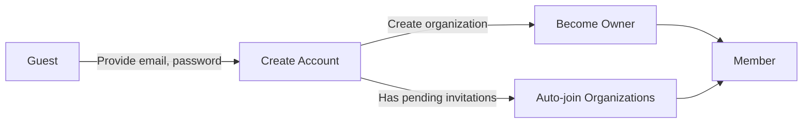
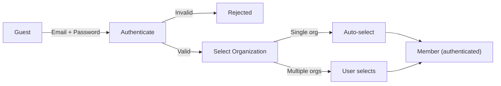
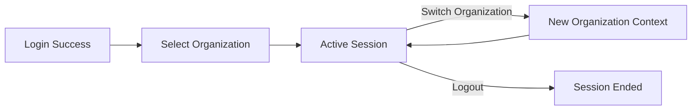
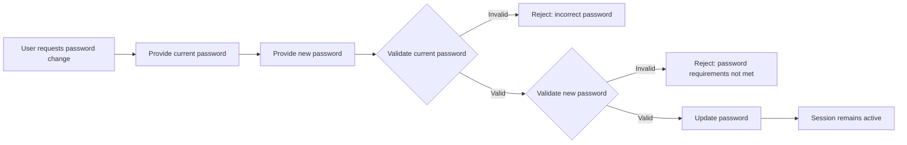
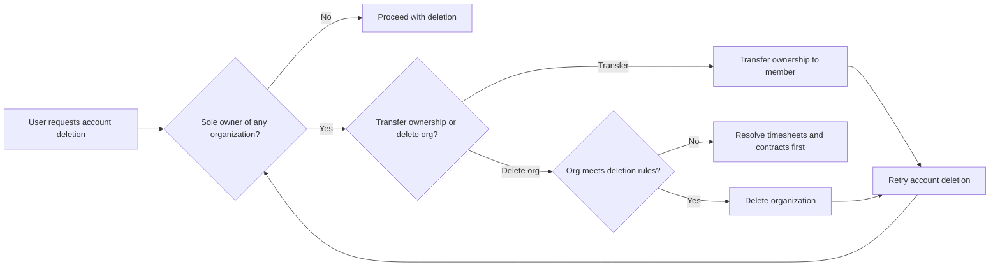
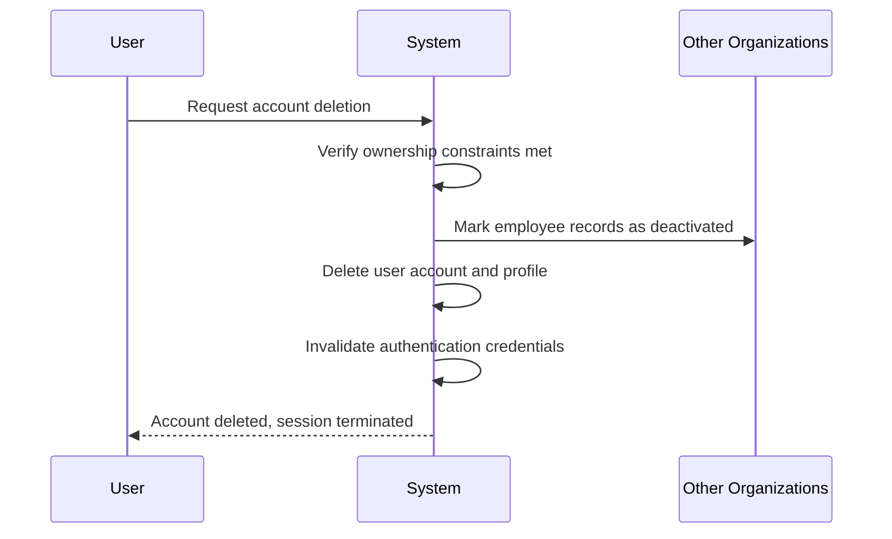

**erpHrm — Actor definitions, permission matrix, authentication, session, account lifecycle**

Actor definitions, permission matrix, authentication, session, account lifecycle

# Actor Definitions

Define all user actor types with their identity, permissions, and access boundaries.

## guest Actor

A guest is an unauthenticated user who has not yet signed up or logged into the platform. Guests can create a new account by providing an email address and password. During initial sign-up, guests create their first organization along with their account. Guests can initiate the login process using their email and password to access an existing account. Before authentication, guests cannot access any organization-specific features or data. The platform does not expose any organization information to guests until they successfully authenticate. Guest access is limited to authentication-related actions only, including sign-up and login.

### Guest Identity Definition

A guest is an unauthenticated visitor who has not yet signed into the platform or does not have an account. Guests do not possess any user profile, organization membership, or access credentials within the system. The guest actor represents the initial state of all users before they complete authentication. Guests have no identity within the platform until they either create a new account through sign-up or authenticate with an existing account through login.

Once a guest successfully authenticates, they transition to the member actor status. This transition is permanent for the duration of the active session. Guests cannot perform any actions that require organization context, user identification, or role-based permissions.

The platform distinguishes guests from members through authentication status only. A user who has an account but is not currently logged in is considered a guest until they complete the login process.

### Pre-Authentication Access Restrictions

Before successful authentication, guests cannot access any organization-specific features or data. This includes, but is not limited to:

- Viewing or searching employee lists
- Accessing project information or task details
- Viewing timelogs, timesheets, or time tracking data
- Seeing reports, dashboards, or activity logs
- Accessing any organizational settings or configuration
- Viewing department structures or role definitions

The platform does not expose any organization names, member lists, or any identifying information about existing organizations to guests. No data is visible or queryable until authentication is complete. All API endpoints and system features require authentication, returning an authentication-required error for unauthenticated requests.

Guests can only access public-facing authentication-related screens and functions, such as the sign-up page, login page, and password recovery (if applicable).

### Authentication as the Gateway

Authentication is required for all platform features beyond the initial sign-up and login functions. The platform enforces authentication checks on every request, ensuring that only authenticated members can access organization data.

The guest actor has only two available paths to interact with the system:

1. **Sign-up path**: Create a new account with email and password. During sign-up, the guest must also create their first organization, immediately becoming an authenticated member with owner role for that organization.

2. **Login path**: Provide email and password to authenticate an existing account. Upon successful authentication, the user selects which organization to work in (if they belong to multiple organizations), and becomes an authenticated member within that organization context.

There is no third path. Guests cannot access any feature, view any data, or perform any action without first completing one of these authentication paths.

## member Actor

A member is an authenticated user who has successfully logged into the platform. Each member has a global profile containing their display name, avatar image, and phone number, which is shared across all organizations they belong to. A member can belong to multiple organizations and selects which organization to work in after logging in. The organization context determines which data and features are available to the member at any given time. Members can switch between organizations without logging out. Within each organization, a member is assigned exactly one role that determines their permissions. Built-in roles include Owner with full access, Manager with management capabilities, and Employee with limited permissions. Organization owners can also create custom roles with specific permission sets.

### Member Actor Identity

A member is an authenticated user who has successfully logged into the platform with valid credentials. Authentication requires a valid email address and password combination. Once authenticated, the member gains access to features based on their role assignments within the selected organization context. The member's session remains active until they explicitly log out or the session expires. Each member is uniquely identified by their email address across the entire platform. Members can change their password while authenticated to maintain account security.

The member actor represents any user who has completed the authentication process and exists within an organization context. Members cannot access any organization features until they have selected an organization to work in. All member actions are scoped to the currently selected organization, ensuring data isolation between organizations.

### Global Profile

Each member has a global profile containing their display name, avatar image, and phone number. This profile is shared across all organizations the member belongs to, meaning the same profile information is visible in every organization context. When a member updates their profile, changes take effect immediately across all organizations.

The display name is required and represents how the member appears to other users within organizations. The avatar image is optional and provides visual identification. The phone number is optional and can be used for contact purposes. Members can edit their own profile at any time, including updating their display name, changing their avatar image, and adding or modifying their phone number.

The global profile serves as the member's consistent identity representation regardless of which organization context they are working in. Other members within an organization see this same profile information when viewing or interacting with the member.

### Multiple Organization Membership

A member can belong to multiple organizations simultaneously. Each organization membership is independent, with its own role assignment and permissions. A member's data and access in one organization are completely separate from their data and access in another organization.

After successful login, if the member belongs to multiple organizations, they must select which organization to work in. This selection establishes the organization context that governs all subsequent actions during that session. If a member belongs to only one organization, that organization is automatically selected without requiring explicit selection.

Members can switch between organizations without logging out or re-authenticating. When switching organizations, all available data and features immediately change to reflect the new organization context. The member loses access to the previous organization's data and gains access to the new organization's data. This switching capability allows members to participate in multiple organizations efficiently without managing separate login sessions.

### Role Assignment Per Organization

Within each organization, a member is assigned exactly one role. This role determines which features and data the member can access within that organization context. Role assignments are specific to each organization, allowing a member to have different roles across different organizations. For example, a member might be an Owner in one organization and an Employee in another.

Permission-based access control governs all member actions within an organization. Each role defines a set of permissions that grant access to specific capabilities. When a member attempts an action, the system checks whether their assigned role includes the required permission. If the permission is not granted, the action is denied.

Users with employee management permissions can change a member's role assignment within that organization. When a member's role is changed, their permissions are immediately updated to reflect the new role's capabilities. Role changes take effect instantly without requiring the member to log out or refresh their session.

### Owner Role

The Owner role is a built-in role that cannot be deleted. Owners have full access to all organization features and settings. This role is automatically assigned to the user who creates the organization. An organization must have at least one Owner at all times.

Owners can manage roles and members, including creating, editing, and deleting custom roles; assigning and changing member roles; and inviting new employees to the organization. Owners can edit all organization settings including name, description, logo image, currency, timezone, and fiscal start month.

Owners can delete their organization subject to specific conditions: all pending timesheets must be resolved (approved or rejected), and there must be no active employee contracts. When an organization is deleted, all associated data is permanently removed, but the owner's user account remains intact.

Owners inherit all permissions available in the system, effectively bypassing any permission checks. This includes all management capabilities for employees, projects, time tracking, timesheets, reports, and organization settings.

### Manager Role

The Manager role is a built-in role that cannot be deleted. Managers have broad management capabilities within the organization but cannot modify organization-wide configuration or manage roles.

Managers can manage employees, including inviting new employees, editing employee records, and deactivating or reactivating employees. Managers can manage projects, including creating, editing, archiving, completing, and deleting projects, as well as managing project memberships and creating tasks within projects.

Managers can approve or reject timesheets submitted by employees. When approving a timesheet, the included timelogs become locked and cannot be modified. When rejecting a timesheet, managers must provide a reason. Managers can view all employees' timelogs and timesheets, not just their own.

Managers can access organization reports including time reports, project budget reports, and weekly summary reports. Managers can view the full activity log for audit purposes.

Managers cannot edit organization settings, create or manage roles, or delete the organization. The Manager role is suitable for team leads and supervisors who need oversight capabilities.

### Employee Role

The Employee role is a built-in role that cannot be deleted. Employees have limited permissions focused on personal time tracking and task management within their assigned projects.

Employees can track their own time by creating, editing, and deleting their own timelogs. Employees can only edit or delete timelogs that are not part of an approved timesheet. Employees can create draft timesheets, add or remove their own timelogs from draft timesheets, and submit timesheets for approval.

Employees can view their own data including their timelogs, timesheets, contracts, and tasks assigned to them. Employees can view projects and tasks in projects they are assigned to as project members. Employees can view the list of departments within the organization.

Employees can edit their own global profile, including their display name, avatar image, and phone number. Employees can change their own password.

Employees cannot manage other employees, invite new employees, or change employee records. Employees cannot create, edit, or delete projects or manage project memberships. Employees cannot approve or reject timesheets, view other employees' timelogs or timesheets, or access organization reports. Employees cannot edit organization settings or manage roles. The Employee role is suitable for individual contributors.

### Custom Roles

Organization Owners can create custom roles with specific permission sets tailored to their organizational needs. Each custom role has a name and a defined set of permissions selected from the available permission types.

Available permissions that can be assigned to custom roles include:

- Organization management permission allows editing organization settings.
- Employee management permission allows adding, editing, and deactivating employees.
- Employee viewing permission allows viewing the employee list and details.
- Project management permission allows creating, editing, and deleting projects and tasks.
- Project viewing permission allows viewing projects and tasks.
- Time management permission allows editing or deleting any employee's timelogs.
- Time approval permission allows approving or rejecting timesheets.
- Time viewing permission allows viewing all employees' timelogs and timesheets.
- Report viewing permission allows viewing organization reports.

Organization Owners can edit custom roles to modify their name or permission set. Changes to a role's permissions immediately affect all employees assigned to that role.

Organization Owners can delete custom roles only if no employees are currently assigned to them. If employees are assigned to a custom role that needs to be deleted, those employees must first be reassigned to a different role. Custom roles provide flexibility to define precisely scoped responsibilities beyond the built-in Owner, Manager, and Employee roles.

# Authentication Flows

Registration, login, logout, and session management from a user perspective.

## Registration and Login

Define user registration and login flows including validation and error handling.

### User Registration

Guests can register a new account by providing an email address and password.

The email address must be unique across all registered users. If the email is already in use, the registration request is rejected.

The password is required and must meet minimum security requirements.

Upon successful registration, a user account is created with the provided email and password.

When a guest registers, they must also create an organization as part of the initial sign-up process. The organization requires: name (required), description (optional), logo image (optional), currency (required, e.g., USD, EUR, KRW), timezone (required), and fiscal start month (required).

The newly registered user becomes the owner of the created organization and is automatically assigned the Owner role within that organization.

If the email used for registration has pending invitations from existing organizations, the user is automatically added to those organizations upon account creation.

A default user profile is created with: display name (required), avatar image (optional), and phone number (optional). The profile is shared across all organizations the user belongs to.

### User Login

Registered users can log in by providing their email address and password.

If the email does not match any registered account, the login request is rejected.

If the password does not match the stored password for the email, the login request is rejected.

Upon successful authentication, the user becomes a member and gains access to their authorized organizations.

If the user belongs to multiple organizations, they must select which organization to work in after logging in. This establishes the organization context for all subsequent actions.

If the user belongs to only one organization, that organization is automatically selected as the context.

After login, all data and operations are scoped to the selected organization. Users cannot access data from other organizations.

Members can switch between organizations without logging out. Switching organizations changes the organization context and makes data from the new organization available.

## Session and Logout

Define session behavior and logout from a user perspective.

### Session and Organization Context

After a user successfully logs in, they must select an organization to work in. This establishes the organization context for the session.

All subsequent actions during the session are scoped to the selected organization. Users who belong to multiple organizations can switch between their organizations without logging out.

When switching organizations, the user remains authenticated and the session continues with the newly selected organization as the active context.

Data from other organizations remains inaccessible during the session, regardless of the user's membership in those organizations. The organization context applies to every action the user performs while authenticated.

### Logout

A user can log out of the platform at any time. Logging out ends the current session.

After logging out, the user must log in again to access any organization or perform any authenticated action.

Logging out affects all organization contexts. A user cannot log out of a single organization while remaining logged into another—they log out of the platform entirely.

### Password Change

An authenticated user can change their password. The user must provide their current password and a new password to complete the change.

Changing the password does not end the current session. The user remains logged in after changing their password.

The new password applies to the user account globally, affecting login for all organizations the user belongs to.

# Account Lifecycle

Account creation, deletion, and password management.

## Account Management

Define how users create accounts, delete accounts, and change passwords.

### Password Change

Users can change their password at any time while logged in.

The user must provide their current password to authorize the change.
The user must provide a new password.
The new password must meet the platform's password requirements.
If the current password provided is incorrect, the password change is rejected.
If the new password does not meet requirements, the password change is rejected.

Upon successful password change, the user's session remains active.
The new password takes effect immediately for all subsequent logins.

### Account Deletion Prerequisites

Users can delete their own account, subject to ownership constraints.

If the user is the sole owner of any organization, they must first either:
- Transfer ownership to another member of that organization, or
- Delete the organization

The user cannot delete their account while they remain the sole owner of any organization.

Transferring organization ownership requires:
- The user to have `org:manage` permission (inherent for owners)
- A valid member exists in the organization to receive ownership
- The receiving member accepts or is assigned the owner role

Deleting an organization before account deletion is subject to the organization deletion rules:
- All pending timesheets must be resolved (approved or rejected)
- There must be no active employee contracts

### Account Deletion Effects

When a user deletes their account, the following effects occur:

**User Account:**
- The user account is permanently deleted
- The user's global profile (display name, avatar image, phone number) is deleted
- The user's authentication credentials are invalidated
- The user is immediately logged out

**Employee Records:**
- All employee records associated with the user in other organizations are marked as "deactivated"
- Historical data (timelogs, timesheets) from deactivated employees is preserved
- Deactivated employee records cannot log time or submit timesheets

**Organization Ownership:**
- If the user owned organizations, ownership must have been transferred or organizations deleted before account deletion
- The account deletion does not affect organizations where ownership was previously transferred

**Data Retention:**
- No data is retained for the deleted user account
- Employee records in other organizations are preserved as deactivated with their historical data

