**hrmTimeTracking — Business concepts, relationships, and states from user perspective**

Business concepts, relationships, and states from user perspective

# Domain Concepts

Describe what each concept means in the business domain and its key attributes.

## Organization Concept

An Organization represents a distinct company or business entity within the multi-tenant ERP platform. Each organization operates independently with complete data isolation, maintaining its own employees, projects, tasks, timelogs, and timesheets separate from all other organizations. The organization serves as the primary container for all business data and defines the operational context in which users perform their work. Key identifying information includes the organization name, an optional description, and a logo image for visual branding. Organizations define operational parameters including currency for financial calculations, timezone for date and time display, and fiscal start month for reporting periods. Organizations are created during the initial sign-up process and can have owners who manage organization settings.

### Organization Identity and Multi-Tenancy

An Organization represents a distinct company or business entity within the multi-tenant ERP platform. Each organization functions as an independent business unit, completely separate from all other organizations on the platform.

Data isolation is strictly enforced at the organization level. Employees in one organization cannot access or view any data from another organization, including employee records, projects, tasks, timelogs, timesheets, and reports. Users who belong to multiple organizations can only see data for their currently selected organization context.

Each organization has a unique name that identifies it within the platform and an optional description that provides additional context about the business. A logo image can be uploaded for visual branding purposes, appearing in the organization's interface and communications.

Organizations are created during the initial user sign-up process, establishing the user as the organization owner. This ensures every organization begins with at least one designated owner who can manage organization settings and member roles.

### Organization Configuration and Ownership

Organizations define operational parameters that affect how the platform functions for their members.

The currency setting determines the monetary unit used for financial calculations throughout the organization, such as pay rates in employee contracts. Supported currencies include USD, EUR, KRW, and others.

The timezone configuration controls how dates and times are displayed to organization members, ensuring that timestamps align with the organization's local business hours.

The fiscal start month defines when the organization's fiscal year begins, which affects reporting periods and financial summaries.

Organization owners have full authority over organization settings and can modify these parameters as needed. The owner role is the highest permission level within an organization, enabling complete control over all features, member management, and role assignments.

## User Concept

A User represents an individual person who accesses the ERP platform. Users authenticate using their email address and password credentials, and each user account is uniquely identified by their email. A single user can belong to multiple organizations, allowing them to participate in different business contexts within the same platform. Users maintain a global profile that includes a display name, avatar image, and phone number, which is shared across all organizations they belong to. When logging in, users select which organization context to work in, and all subsequent actions are scoped to that selected organization. Users can switch between organizations without logging out, enabling seamless transitions between different work environments.

### User Identity and Authentication

A User represents an individual person who accesses the ERP platform. Each user account is uniquely identified by their email address, which serves as the primary identifier across all organizations within the platform.

Users authenticate to the platform using their email address and password combination. This authentication is global—users log in once to access their account, after which they select which organization context to work in. The email address must be unique across the entire platform; no two users can share the same email address.

When a user creates an account, they provide their email address and set a password. The password can be changed by the user at any time after logging in.

A user account exists independently of any organization. A user may belong to zero or more organizations. When a user has no organization membership, their account remains active but they cannot perform any organization-scoped actions until they create or join an organization.

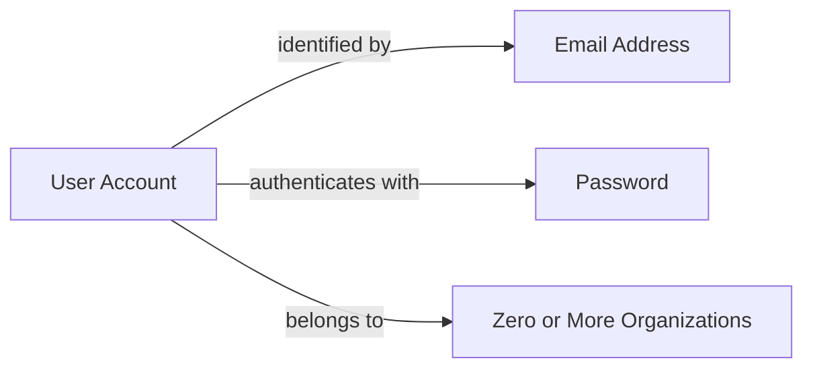

### Global Profile and Organization Membership

Each user maintains a single global profile that is shared across all organizations they belong to. The global profile consists of:

- **Display Name**: The name shown to other users within organizations. This is how the user is identified in collaborative features such as task assignments, timesheet reviews, and team views.
- **Avatar Image**: An optional profile picture that appears alongside the user's display name throughout the platform interface.
- **Phone Number**: An optional contact number that can be shared with organization members.

Changes to the global profile are immediately reflected across all organizations. A user cannot maintain different display names or avatar images for different organizations.

A single user can belong to multiple organizations simultaneously. This allows individuals who work with multiple companies or teams to access all their work contexts from a single account. When logging in, users select which organization to work in, establishing an organization context. All subsequent actions—viewing projects, logging time, managing employees—are scoped to the selected organization.

Users can switch between organizations without logging out. This enables seamless transitions between different work environments. The platform enforces strict data isolation between organizations; a user can only see data belonging to their currently selected organization, even if they belong to multiple organizations.

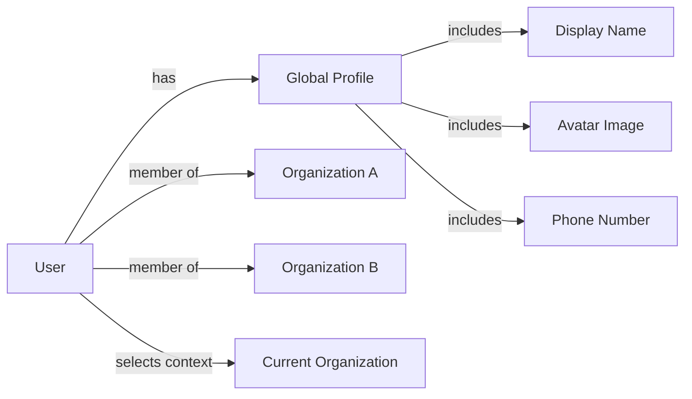

## Role Concept

A Role defines a collection of permissions that determine what actions an employee can perform within an organization. Each organization maintains its own set of roles, providing flexibility in access control tailored to the organization's needs. Three built-in roles exist by default: Owner with full access to all features and member management capabilities, Manager with abilities to manage employees, projects, approve timesheets, and view reports, and Employee with capabilities to track time, submit timesheets, and view their own data. These built-in roles cannot be deleted from the system. Organizations can create custom roles with specific names and combinations of permissions. Available permissions include managing organization settings, managing or viewing employees, managing or viewing projects, managing timelogs, approving timesheets, viewing all time data, and viewing reports. Each employee is assigned exactly one role within an organization.

### Role Definition

A Role represents a named collection of permissions that governs what actions an employee can perform within an organization. Roles serve as the primary mechanism for access control, allowing organizations to grant appropriate capabilities to employees based on their responsibilities. Each role has a name and an associated set of permissions. The permissions determine which operations the assigned employee can execute within the organization's context. Role definitions are organization-specific, meaning each organization maintains its own independent set of roles tailored to its operational needs.

### Built-in Roles

Every organization has three built-in roles that are created automatically and cannot be deleted. The Owner role provides full access to all features, including the ability to manage roles and organization members. Owners can edit organization settings, manage all employees, manage all projects, approve timesheets, view all time data, and access reports. The Manager role enables employees to manage other employees, create and manage projects, approve timesheets, and view organization reports. Managers cannot modify organization settings or manage roles. The Employee role is the most restrictive, allowing only time tracking, timesheet submission, and viewing of personal data. Employees with this role cannot access other employees' information or perform management functions. These built-in roles provide a baseline access control structure suitable for most organizational hierarchies.

### Custom Roles

Organizations can create custom roles to accommodate specific access control requirements not met by the built-in roles. Each custom role consists of a name and a selection of permissions chosen from the available set. The available permissions cover organization management (editing settings), employee management (adding, editing, deactivating employees), employee viewing (accessing employee lists and details), project management (creating, editing, deleting projects and tasks), project viewing (accessing project and task information), time management (editing or deleting any employee's timelogs), timesheet approval (approving or rejecting submitted timesheets), viewing all time data (accessing all employees' timelogs and timesheets), and viewing organization reports. Custom roles can be created by organization owners and edited as needed. A custom role can be deleted only when no employees are currently assigned to it.

### Role Assignment

Each employee in an organization is assigned exactly one role at any given time. The assigned role determines the employee's capabilities within that organization. Role assignments can be changed by users who have employee management permission. When a user belongs to multiple organizations, they may have different roles in each organization, but within a single organization, the user operates under a single assigned role. The role assignment creates a clear access boundary for each employee, ensuring that permissions are consistently applied based on organizational responsibilities.

### Role Immutability

Built-in roles cannot be deleted from an organization, ensuring that the foundational access control structure remains intact. The permission sets for built-in roles are predefined and cannot be modified. Custom roles offer more flexibility: they can be edited by organization owners to adjust the permission set, and they can be deleted when no longer needed. However, deletion of a custom role is permitted only when no employees are assigned to it, preventing disruption to active access control configurations. If a custom role must be deleted while employees are assigned, those employees must first be reassigned to a different role.

## Employee Concept

An Employee represents a user's participation and employment within a specific organization. Each employee record links a user account to an organization with specific role assignment and employment details. Employees have organizational attributes including an optional department assignment, an optional position or job title, and a required employment type classification. Employment types categorize workers as full-time, part-time, contractor, or intern. Employees have a status indicating whether they are active or deactivated within the organization. Active employees can log time and submit timesheets, while deactivated employees retain their historical data but lose access to time tracking features. An employee can be assigned to multiple projects within their organization and can have multiple contracts over time reflecting changes in employment terms.

### Employee Definition and Identity

An Employee represents a user's participation within a specific organization. Each employee record creates a link between a user account and an organization, establishing the user's employment relationship with that organization. A single user can have multiple employee records across different organizations, one for each organization they belong to.

Each employee is assigned exactly one role within their organization. The role determines what permissions the employee has for accessing features and performing actions. Role assignment can be changed by users with appropriate permission.

The employee record captures employment-specific information that is unique to each organization, separate from the user's global profile. While a user's display name and avatar are shared across all organizations, the employee record contains organizational attributes like department, position, and employment type that are specific to that organization.

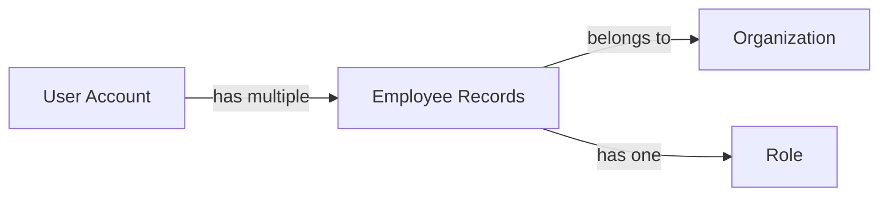

### Employment Classification

Each employee is classified by an employment type that categorizes their working relationship with the organization. The employment type is required for every employee record.

The following employment types are available:

**Full-time employees** work standard full-time hours as defined by their contract. They typically have ongoing employment with the organization.

**Part-time employees** work fewer hours than full-time employees. Their working hours per week are specified in their contract.

**Contractors** are engaged under a contract arrangement for specific work or duration. They may have different pay arrangements and working hour expectations compared to permanent employees.

**Interns** are typically temporary employees participating in an internship program. They may have learning objectives and limited duration contracts.

The employment type influences contract terms, pay calculations, and may affect how working hours and overtime are tracked. All employment types can log time, submit timesheets, and be assigned to projects.

### Employee Status and Organizational Assignment

Each employee has a status indicating whether they are active or deactivated within the organization.

**Active employees** can log time, submit timesheets, be assigned to projects, and access organization features according to their role permissions.

**Deactivated employees** cannot log time or submit timesheets. They lose access to time tracking features but remain in the organization's employee list for historical purposes. Deactivated employees can be reactivated by users with appropriate permission.

Employees may be assigned to an optional department within the organization, which groups employees by functional area. Department assignment helps with organization and reporting.

Employees may have an optional position or job title that describes their role within the organization, such as "Software Engineer" or "Marketing Manager".

**Historical data preservation**: When an employee is deactivated, all their historical data is retained. This includes timelogs, timesheets, and project assignments. Historical data remains accessible for reporting and audit purposes. The employee record itself is preserved, allowing reactivation if needed.

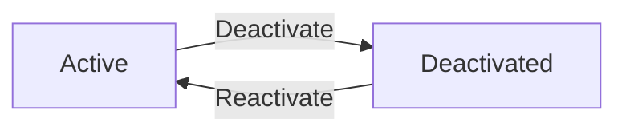

## Contract Concept

A Contract represents the terms of employment between an organization and an employee for a specific period. Each employee can have multiple contracts over time, creating a historical record of employment terms, but only one contract can be active at any given time. A contract defines the start date marking when the employment terms take effect, and an optional end date indicating when the terms expire. Contracts without an end date represent ongoing employment arrangements. The contract specifies the pay rate as a numeric value and the pay period indicating how frequently compensation is calculated, with options including hourly, daily, weekly, or monthly periods. Contracts also define the expected working hours per week. Additional notes can be included for supplementary information. Past contracts serve as immutable historical records that cannot be modified after their period has ended.

### Contract Lifecycle and Constraints

A Contract represents the formal employment terms between an organization and an employee for a defined period. It serves as a record of compensation agreements and expected work commitments.

Each contract has a start date indicating when the employment terms take effect, which is required. The end date is optional; when not specified, the contract represents an ongoing employment arrangement with no predetermined conclusion. When specified, the end date marks when the employment terms expire.

The contract specifies the pay rate as a numeric value representing the compensation amount. The pay period defines how frequently compensation is calculated and paid. The available pay period types are: hourly (compensation calculated per hour worked), daily (compensation calculated per day worked), weekly (compensation calculated per week), and monthly (compensation calculated per month).

Each contract defines the expected working hours per week, establishing the standard time commitment for the employee. Contracts may include optional notes for additional information about the employment terms.

A contract is associated with exactly one employee, and an employee can have multiple contracts over time to maintain a historical record of their employment terms.

### Contract Lifecycle and Constraints

An employee can have multiple contracts over time, but only one contract can be active at any given time. This single active contract constraint ensures there is no ambiguity about which terms currently apply to an employee.

When a new contract is created for an employee who already has an active contract, the previous contract automatically ends on the day before the new contract starts. This transition creates a continuous employment history without gaps or overlaps.

Past contracts serve as immutable historical records. Once a contract period has ended (its end date has passed), the contract cannot be modified. This preserves the accuracy of historical employment data for auditing and reference purposes.

The current active contract can be edited by users with appropriate permissions, allowing adjustments to ongoing employment terms while maintaining the integrity of past records.

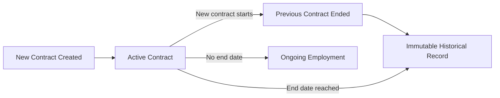

## Department Concept

A Department represents an organizational unit or functional area within an organization. Departments help group employees by their area of work, specialization, or business function. Each department has a name for identification and an optional description providing additional context about the department's purpose or scope. Departments can optionally have a parent department, enabling a single level of hierarchical nesting to represent broader organizational structures. For example, a marketing department might be a parent to separate digital marketing and content marketing departments. Employees can be assigned to a department as part of their employee record, though this assignment is optional. When a department is removed, employees previously assigned to it simply lose that department association without affecting their employment status.

### Department Removal Effects

When a department is deleted from the organization, employees who were assigned to that department lose their department association. Their department field is cleared, but no other changes are made to their employee record. Employment status, role, position, and all other employee data remain unchanged. The deletion affects only the department grouping, not the employees' continued participation in the organization.

This approach ensures that department restructuring can occur without unintended consequences to employee records. Employees can be reassigned to other departments or remain without a department until a suitable assignment is made.

## Project Concept

A Project represents a distinct body of work or initiative within an organization that employees can track time against. Projects serve as containers for organizing tasks and aggregating time entries. Each project has a required name for identification and an optional description explaining the project's purpose and scope. A color code is assigned to each project for visual differentiation in user interfaces. Projects have a status indicating their current state: active for ongoing work, archived for projects that are temporarily closed but preserved, and completed for projects that have reached their objectives. Projects can optionally define budget hours representing the total estimated effort allocation. Start and end dates can be specified to define the project's timeline. Active projects can receive new timelogs, while archived and completed projects cannot accept new time entries. Projects can only be deleted if no timelogs have been recorded against them.

### Project Definition and Purpose

A Project represents a distinct body of work or initiative within an organization. Projects serve as the primary organizational unit for tracking employee time and effort. Each project acts as a container that aggregates related tasks and time entries, providing context for understanding how work time is allocated across the organization's various initiatives. Projects belong to a single organization and can have multiple employees assigned to them as project members. Project members log their working time against projects, enabling the organization to measure effort expenditure and progress on each initiative.

### Project Lifecycle States

Projects progress through three lifecycle states that control their availability for time tracking. Active status indicates the project is ongoing and can receive new timelogs from assigned employees. Archived status indicates the project has been temporarily closed for administrative purposes but is preserved for historical reference. Archived projects cannot receive new timelogs. Completed status indicates the project has reached its objectives and is finished. Completed projects cannot receive new timelogs. Existing timelogs recorded against archived or completed projects remain preserved. Projects can only be deleted if no timelogs have been recorded against them, ensuring historical time tracking data is never lost through project deletion.

## ProjectMember Concept

A ProjectMember represents the assignment of an employee to a specific project, enabling the employee to log time against that project. Project membership creates the connection between employees and projects they are authorized to work on. An employee can be assigned to multiple projects simultaneously, and a project can have multiple assigned employees. Each project membership includes the employee reference, the project reference, and an assigned role within the project context. Project member roles include either regular member or project-lead designation. Project leads have enhanced responsibilities within their assigned project, including the ability to manage tasks within that project. Membership assignments determine which projects an employee sees and can record time against. Employees can view the list of projects they are assigned to.

### Project Member Roles and Authority

A ProjectMember represents the assignment of an employee to a specific project, creating the authorization link between an employee and a project they can work on. This membership link enables the employee to log time against the assigned project.

An employee can be assigned to multiple projects simultaneously, and a project can have multiple assigned employees. This many-to-many relationship allows organizations to allocate employees across different work initiatives as needed.

Project membership determines project access authorization — only employees assigned to a project can view that project's details and record time against it. Employees can see the list of projects they are assigned to, providing visibility into their active work assignments.

Time logging eligibility is directly tied to project membership. An employee can only create timelogs for projects they are assigned to. If an employee is removed from a project, they can no longer log new time against that project, though their historical timelogs remain preserved.

Each project membership includes a reference to the employee and a reference to the project, establishing the bidirectional connection between the two entities.

## Task Concept

A Task represents a specific unit of work within a project that can be tracked, assigned, and monitored. Tasks provide granular organization of project work and can be associated with timelogs for detailed time tracking. Each task has a required title describing the work and an optional description providing additional details. Tasks have a status tracking their progress: open for newly created tasks, in-progress for tasks currently being worked on, completed for finished tasks, and closed for tasks that are no longer active. Priority levels indicate task urgency with options including low, medium, high, and urgent. Tasks can optionally specify estimated hours for planning purposes and a due date for deadline tracking. Tasks can be assigned to a specific employee who must be a project member. Tasks support a single level of nesting through parent task relationships, enabling subtasks to be organized under main tasks.

### Task Definition and Attributes

A Task represents a specific unit of work within a project that can be tracked, assigned, and monitored. Tasks provide granular organization of project work and serve as the basis for detailed time tracking through associated timelogs.

Each task has a required title that concisely describes the work to be performed. A task may optionally include a description providing additional context, instructions, or details about the work.

Tasks support planning through two optional attributes: estimated hours for effort planning and a due date for deadline tracking. The estimated hours represent the anticipated time required to complete the task, while the due date indicates when the work should be finished.

A task can be assigned to a specific employee who must be a member of the project containing the task. Task assignment enables workload distribution and accountability tracking within project teams.

### Task Status, Priority, and Hierarchy

Tasks progress through four status values: open for newly created tasks awaiting work, in-progress for tasks currently being worked on, completed for finished tasks, and closed for tasks that are no longer active. Each status change is recorded in the task history with the timestamp, previous status, new status, and the user who made the change.

Priority levels indicate task urgency and help with work prioritization. The available priority levels are low, medium, high, and urgent. Priority assists team members in determining which tasks require immediate attention.

Tasks support a single level of nesting through parent task relationships. A task can be designated as a subtask of another task within the same project, enabling hierarchical organization of work. Only one level of nesting is supported, meaning a subtask cannot itself have subtasks.

## TaskHistory Concept

A TaskHistory represents an audit record capturing each status change that occurs to a task throughout its lifecycle. Task history entries provide a chronological trail of task progress and state transitions. Each history entry records the timestamp when the status change occurred, the previous status value before the change, and the new status value after the change. The entry also identifies which user performed the status change, enabling accountability and tracking of task progression. Task history creates an immutable log that preserves the complete story of how a task evolved from creation to completion. Multiple history entries can exist for a single task, documenting each status transition as the task moves through its workflow. This historical record supports reporting, auditing, and understanding of work patterns.

### Task History Entry

A task history entry captures each status transition that occurs throughout a task's lifecycle. Each entry records the exact timestamp when the status change occurred, the previous status value before the transition, and the new status value after the transition. The entry identifies which user performed the status change, establishing accountability for all task progression decisions.

Task history entries are immutable once created, forming a permanent and unalterable audit trail. Multiple history entries can exist for a single task, documenting each status transition as the task moves through its workflow from creation to completion. The chronological sequence of entries preserves the complete story of how a task evolved over time.

### Task Audit Trail Purpose

Task history provides a comprehensive audit trail for tasks, enabling organizations to understand work patterns and verify task progression. The chronological record of status transitions supports reporting on how long tasks remain in each status and how quickly work moves through the workflow.

The audit trail enables accountability tracking by identifying which user made each status change, supporting compliance requirements and performance analysis. Historical task data can reveal work pattern analysis, helping teams understand bottlenecks and optimize their processes. The immutable nature of history entries ensures data integrity for auditing and retrospective analysis.

## Timelog Concept

A Timelog represents a single time entry recording work performed by an employee on a specific date. Timelogs are the fundamental unit of time tracking, capturing when work occurred and how long it lasted. Each timelog records the date of the work and the duration in minutes. A required project association indicates which project the time was spent on, and the employee must be assigned to that project to log time against it. An optional task association can link the time to a specific task within the project. A description field allows employees to document what work was performed. Each timelog has a billable flag indicating whether the time should be considered for billing purposes, defaulting to billable. Timelogs can be included in timesheets for approval, and once approved, the timelog becomes locked and cannot be modified or deleted.

### Timelog Definition and Core Attributes

A Timelog represents a single time entry recording work performed by an employee on a specific date. It is the fundamental unit of time tracking within the system.

Each timelog captures the **date of work** — when the work was performed. The **duration in minutes** records how long the work lasted, providing granular time tracking.

A **work description** field allows employees to document what work was performed. This field is optional and provides context for the time entry.

Employees can only create timelogs for themselves (employee self-logging). They cannot log time on behalf of other employees.

### Timelog Associations and Assignment Constraints

Each timelog must be associated with a **project**, which is a required association. The employee logging time must be assigned to that project as a project member before they can log time against it (project assignment requirement).

A **task association** is optional and can link the timelog to a specific task within the selected project. When specified, the task must belong to the same project.

This association structure ensures all tracked time is contextualized within the organization's project work.

### Timelog Billing Designation and Lifecycle

Each timelog has a **billable time flag** indicating whether the time should be considered for billing purposes. By default, timelogs are marked as billable. Employees can designate time as **non-billable** when the work should not be charged to clients.

Timelogs can be included in timesheets for approval. Once a timelog is part of an **approved timesheet**, it becomes locked and cannot be modified or deleted (**approved timelog immutability**). This ensures the integrity of approved time records for billing and reporting purposes.

## Timesheet Concept

A Timesheet represents a weekly collection of timelogs submitted by an employee for approval. Timesheets organize work time into standardized weekly periods running from Monday through Sunday. Each timesheet is owned by a specific employee and covers a defined week with a start date and end date. Timesheets progress through status states: draft for timesheets being prepared, submitted for timesheets awaiting approval, approved for timesheets that have been reviewed and accepted, and rejected for timesheets that require revision. The total hours on a timesheet is calculated from all included timelogs. Submitted timesheets record when they were submitted. Reviewed timesheets capture when and by whom the review occurred. Rejected timesheets must include a reason explaining why approval was denied. Approved timesheets lock all included timelogs, preventing further modification. Rejected timesheets return to draft status for revision and resubmission.

### Weekly Time Collection

A timesheet aggregates an employee's timelogs into a standardized weekly period running from Monday to Sunday. Each timesheet is owned by a specific employee and represents all work time recorded during that week. The week is defined by a start date (Monday) and end date (Sunday), establishing the time boundaries for the collected timelogs. Timelogs that fall within this weekly period are included in the timesheet when it is created. The total hours on a timesheet is a calculated value derived from the sum of all included timelog durations, providing an aggregated view of the employee's work time for that week.

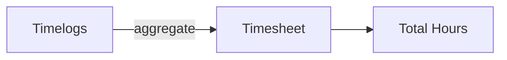

### Timesheet Status Lifecycle

A timesheet progresses through four status states that reflect its position in the approval workflow.

**Draft** status indicates a timesheet being prepared by the employee. Timelogs can be added to or removed from a draft timesheet, and the total hours calculation updates as timelogs are modified.

**Submitted** status indicates a timesheet awaiting manager review. A submitted timesheet captures when the submission occurred through a submission timestamp. Only one timesheet per employee per week can be in submitted or approved status at any time.

**Approved** status indicates a timesheet that has been reviewed and accepted by a manager. Approved timesheets lock all included timelogs, preventing any further modification or deletion of those time entries.

**Rejected** status indicates a timesheet that was not approved and requires revision. Rejected timesheets return to draft status, allowing the employee to modify and resubmit. A rejection reason is required when a timesheet is rejected, explaining why approval was denied.

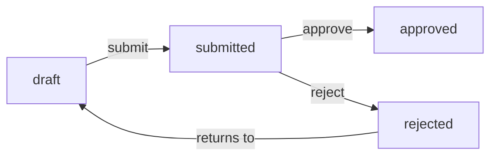

### Review and Locking

When a timesheet is submitted for approval, the system records when the submission occurred. Upon review, the timesheet captures when the review took place and which user performed the review. This reviewer identification provides accountability for approval decisions.

Approved timesheets enforce a locking mechanism on all included timelogs. Once a timesheet is approved, the associated timelogs become immutable—they cannot be edited or deleted. This ensures the integrity of approved work time records for reporting and payroll purposes.

Rejected timesheets require a rejection reason explaining why approval was denied. This reason provides the employee with context for what needs to be corrected before resubmission. After rejection, the timesheet returns to draft status where the employee can address the issues and submit again.

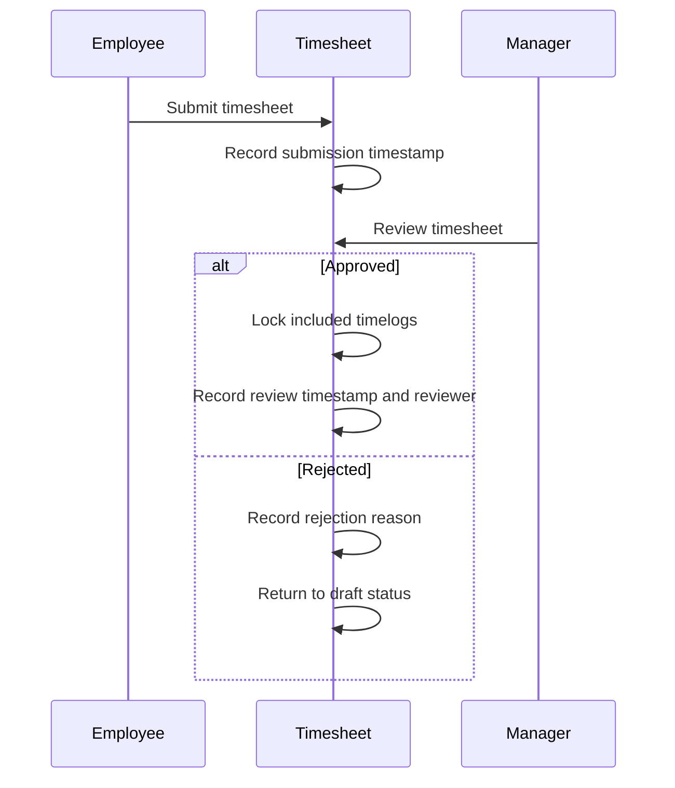

## Timer Concept

A Timer represents an active real-time time tracking session for an employee. Timers enable employees to capture work duration as it occurs rather than entering time retrospectively. Each employee can have at most one active timer at any given time. A timer records the start timestamp when time tracking begins and requires selection of a project for the work being performed. An optional task can be specified if the work relates to a particular task within the project. A description field allows the employee to note what work is being performed during the timed session. Timers continue running without automatic stop, meaning they track elapsed time continuously until manually stopped or discarded. When a timer is stopped, the elapsed duration is calculated and converted to a timelog entry. Timers can also be discarded without creating a timelog entry.

### Timer Definition

A Timer represents an active, real-time time tracking session for an employee. Unlike retrospective time entry through timelogs, a timer captures work duration as it occurs in the present moment. The timer serves as the employee's current timing session, running continuously to measure elapsed time for ongoing work activities.

Each employee may have at most one active timer at any given time. This single timer constraint ensures that an employee can only track time for one work activity simultaneously, preventing overlapping or conflicting time entries. When an employee has an active timer running, they cannot start another timer until the current one is stopped or discarded.

The timer is inherently tied to the employee who starts it, creating a direct relationship between the timer session and the employee's time tracking activities within the organization.

### Timer Attributes

A timer records the start timestamp, which marks the exact moment when time tracking began for the current work session. This timestamp is captured automatically when the timer is started and serves as the basis for calculating total elapsed time.

The timer requires selection of a project before it can be started. The project identifies which work initiative the tracked time relates to, ensuring that all timer-generated time entries are properly attributed to organizational projects. The selected project must be one that the employee is assigned to as a project member.

A task association is optional for the timer. If the work being tracked relates to a specific task within the selected project, the employee may specify which task the timer is tracking. The task must belong to the selected project if one is chosen.

A description field allows the employee to record notes about what work is being performed during the timing session. This description captures context about the activity being tracked and can be added or modified while the timer is running.

### Timer Lifecycle

A timer operates through continuous time tracking without any automatic stop mechanism. Once started, the timer continues running indefinitely until the employee manually intervenes, regardless of how much time has elapsed. This design places control entirely in the employee's hands, allowing them to determine when the work session actually concludes.

Manual timer control provides the employee with two distinct options for ending a timer session. The employee may stop the timer, which concludes the tracking session and automatically creates a timelog entry based on the timer's recorded data. The duration is calculated from the elapsed time between the start timestamp and the stop moment, rounded to the nearest minute. The resulting timelog inherits the project, optional task, and description from the timer.

Alternatively, the employee may discard the timer, which terminates the timing session without creating any timelog entry. This discard option allows employees to cancel time tracking when the session was started in error or when the tracked time should not be recorded for any reason.

## ActivityLog Concept

An ActivityLog represents a recorded entry of significant actions performed within an organization. Activity logs provide an audit trail of important events and changes that occur in the system. Each activity log entry captures when the action occurred through a timestamp, and identifies which user performed the action. The action type categorizes the nature of the activity, such as employee invitations, deactivations, reactivations, contract changes, project lifecycle events, task status changes, timesheet decisions, and role assignments. The target entity identifies what the action was performed on, providing context for the log entry. Additional details can be recorded to capture specific information relevant to the action. Activity logs serve as a historical record for accountability, compliance, and understanding of organizational activities. The log can be filtered by action type, user, and date range for focused review.

### Action Types Recorded

The system records various categories of significant actions in the activity log.

**Employee Lifecycle Actions:**
- Employee invited to join the organization
- Employee deactivated (access revoked)
- Employee reactivated (access restored)

**Contract Actions:**
- Contract created for an employee
- Contract edited

**Project Lifecycle Actions:**
- Project created
- Project archived
- Project completed
- Project deleted

**Task Actions:**
- Task status changed (with old and new status recorded)

**Timesheet Actions:**
- Timesheet submitted for approval
- Timesheet approved
- Timesheet rejected

**Role and Permission Actions:**
- Role assigned to an employee
- Role changed for an employee

Each action type provides meaningful context about what occurred within the organization, supporting audit requirements and historical accountability.

# Domain Relationships

Describe how concepts relate to each other from a business perspective.

## Conceptual Relationships

Describe how concepts relate to each other in business terms.

### Multi-Tenancy and Data Ownership

The platform operates on a multi-tenant architecture where each Organization represents an independent business unit. All business data belongs to and is isolated within a specific Organization.

An Organization owns its Employees, Projects, Departments, and Roles. This ownership means that when an Organization is deleted, all associated data is permanently removed, while User accounts remain independent.

Users can belong to multiple Organizations through their Employee records, but each Employee record is owned by exactly one Organization. This relationship establishes the boundary for data visibility — an Employee can only access data within their owning Organization.

The Organization ownership relationship ensures complete data isolation between tenants, preventing any cross-organization data access.

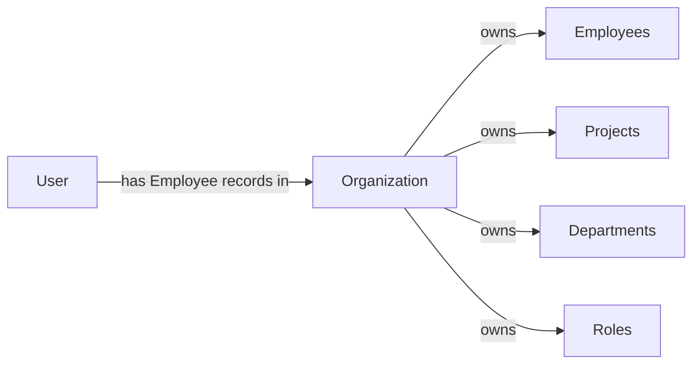

### Organizational Membership Relationships

Users participate in Organizations through Employee records, which serve as the membership link between a User account and an Organization.

Each Employee belongs to exactly one User and exactly one Organization, creating a bridge that associates the user's global identity with their organizational presence. An Employee is assigned exactly one Role within that Organization, defining their permissions.

Employees have multiple associations within their Organization:
- They can have multiple Contracts (historical employment terms), with only one active at any time
- They can be members of multiple Projects through ProjectMember associations
- They own their Timelogs and Timesheets
- They can be assigned to Tasks within projects they are members of
- They can have one active Timer at any time

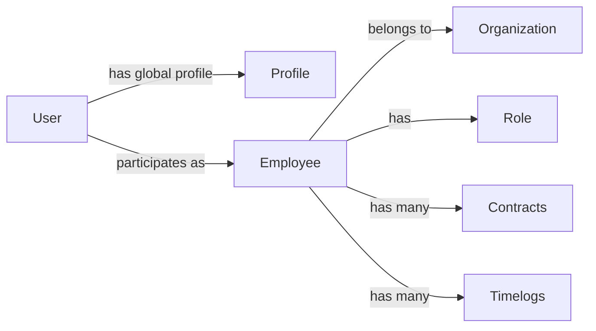

### Project and Task Assignment Relationships

Projects serve as containers for work and time tracking within an Organization. Projects own their Tasks and define the scope for ProjectMember assignments.

ProjectMember is the association entity that links an Employee to a Project, establishing the employee's participation in that project. Each ProjectMember has a role (member or project-lead) within the specific project. Through this membership, employees can:
- Log time (Timelogs) against the project
- Be assigned to Tasks within the project
- Track time using a Timer for that project

Tasks belong to Projects and can be assigned to Employees who are project members. Tasks can have one level of subtask nesting through parent-child relationships. Each Task status change is recorded in TaskHistory entries, creating an audit trail.

Timelogs are associated with both a Project (required) and optionally a Task, and when submitted through a Timesheet, they become part of that Timesheet's collection.

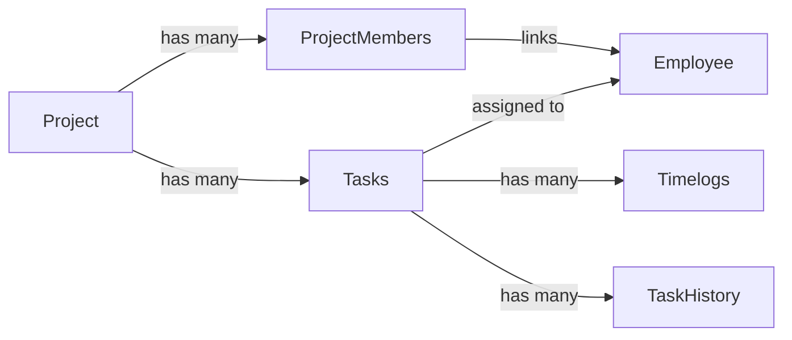

### Time Tracking Aggregation Relationships

Timesheets aggregate Timelogs into weekly collections for approval workflows. A Timesheet belongs to an Employee and contains multiple Timelogs for a specific week (Monday to Sunday).

When an Employee creates a Timesheet for a week, all their Timelogs for that week become associated with the Timesheet. This association locks the Timelogs once the Timesheet is approved — approved Timelogs cannot be edited or deleted.

The Timesheet approval process involves:
- The Employee who owns and submits the Timesheet
- A User with approval permissions who reviews and either approves or rejects the Timesheet
- The rejection reason when applicable

Timers represent real-time tracking sessions that belong to an Employee. When stopped, a Timer's recorded time is converted into a Timelog. Each Employee can have at most one active Timer at any time.

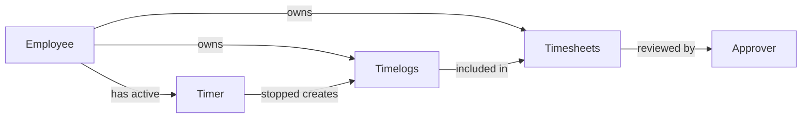

### Hierarchical and Audit Relationships

Several entities support hierarchical relationships within the Organization structure.

Departments can have one level of parent-child relationships, allowing sub-departments within a parent Department. Employees are assigned to Departments (optional), and when a Department is deleted, employees' department assignment is cleared rather than cascading.

Tasks support one level of subtask nesting through parent-child relationships, allowing work breakdown structures within a Project.

The ActivityLog records significant actions throughout the Organization, creating an audit trail. Each ActivityLog entry belongs to:
- The User who performed the action
- The Organization where the action occurred
- Optionally, the target entity affected by the action

This relationship structure enables comprehensive activity tracking across all organizational operations.

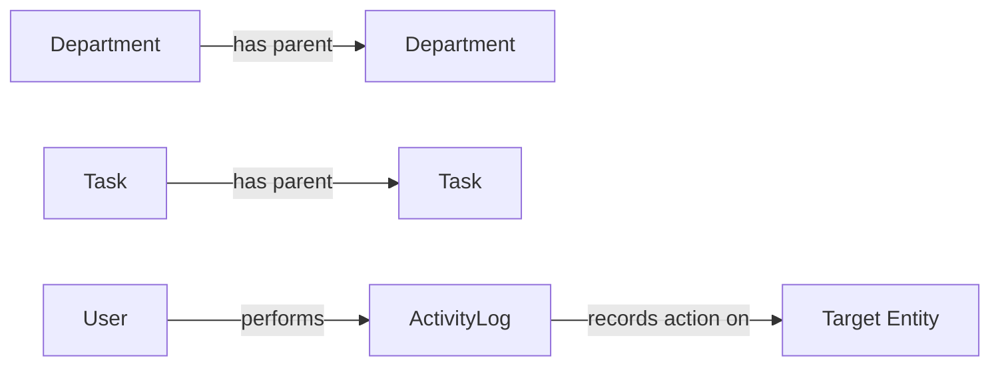

## Lifecycle and Retention

Describe concept lifecycle states and transitions only. Detailed retention/recovery policies belong in 05-non-functional. Operation details belong in 03-functional-requirements.

### Organization Lifecycle

An organization begins when a user creates it during initial sign-up. The organization operates independently with its own employees, projects, and data, isolated from other organizations.

An organization can be deleted by its owner only when specific conditions are met: all pending timesheets must be resolved (approved or rejected), and there must be no active employee contracts.

When an organization is deleted, all associated employees, projects, tasks, timelogs, and timesheets are permanently removed. The owner's user account remains but is no longer associated with the deleted organization.

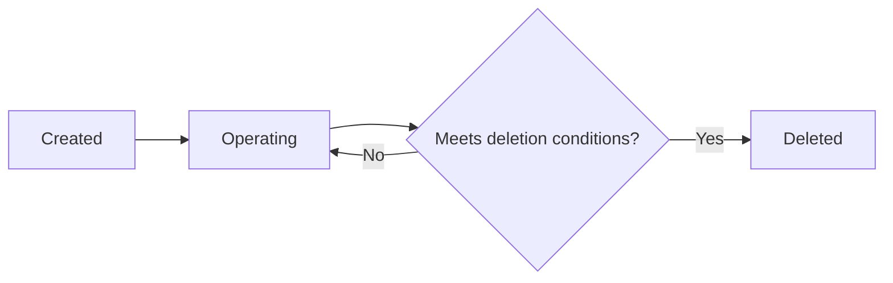

### Employee Lifecycle

An employee record is created when a user is added to an organization, either through invitation or by signing up with an invited email address.

An employee can be in one of two statuses:
- **Active**: The employee can log time, submit timesheets, and participate in projects
- **Deactivated**: The employee cannot log time or submit timesheets, but all historical data (timelogs, timesheets) is preserved

Deactivated employees can be reactivated. Deactivation does not remove the employee record or their historical contributions.

When a user deletes their account, their employee records in other organizations are marked as deactivated rather than deleted.

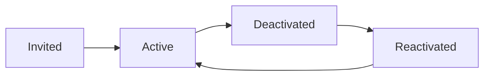

### Contract Lifecycle

An employee can have multiple contracts over time, creating a historical record of employment terms. Only one contract can be active at any given time.

When a new contract is created, the previous active contract automatically ends (its end date is set to the day before the new contract starts).

Past contracts are immutable historical records and cannot be edited. Only the current active contract can be modified.

A contract without an end date represents an ongoing employment arrangement.

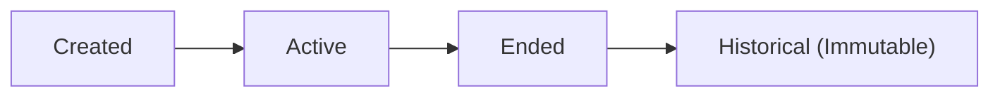

### Project Lifecycle

A project progresses through three statuses:
- **Active**: The project is ongoing and can receive new timelogs
- **Archived**: The project is inactive and cannot receive new timelogs; existing timelogs are preserved
- **Completed**: The project is finished and cannot receive new timelogs; existing timelogs are preserved

A project can only be deleted if it has no timelogs associated with it. This ensures historical time tracking data is never orphaned.

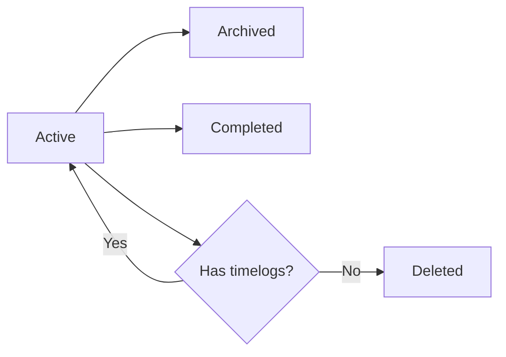

### Task Lifecycle

A task progresses through four statuses:
- **Open**: The task has been created but work has not started
- **In-Progress**: Work is actively being done on the task
- **Completed**: The work on the task is finished
- **Closed**: The task is closed and no further action is needed

Every status change is recorded in the task history, capturing: the timestamp, the previous status, the new status, and who made the change. This creates an audit trail for all task progression.

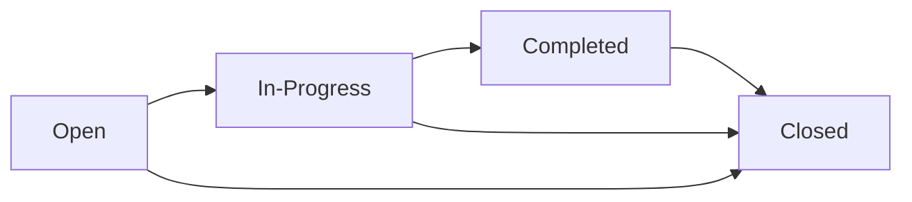

### Timesheet Lifecycle

A timesheet progresses through four statuses:
- **Draft**: The timesheet is being prepared; timelogs can be added or removed
- **Submitted**: The timesheet awaits approval; included timelogs cannot be deleted
- **Approved**: The timesheet is approved; all included timelogs are locked and cannot be edited or deleted
- **Rejected**: The timesheet is returned to draft status with a reason; the employee can modify and resubmit

A timesheet cannot be submitted if it has no timelogs or if another timesheet for the same week is already submitted or approved.

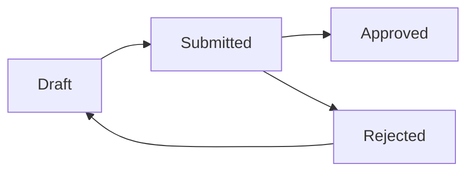

### Entity Deletion Policies

Different entities have different deletion constraints to protect data integrity:

**Organization**: Requires all pending timesheets to be resolved and no active employee contracts. Deletes all associated data permanently.

**Employee**: Cannot be deleted; deactivated instead to preserve historical data.

**Project**: Can only be deleted if no timelogs are associated with it.

**Custom Role**: Can only be deleted if no employees are assigned to it.

**Timelog**: Can be deleted by the employee only if not part of any submitted or approved timesheet.

**Timesheet**: No explicit deletion mentioned; drafts can be modified and rejected timesheets can be resubmitted.

These policies ensure that historical records and audit trails are preserved while allowing cleanup of unused entities.

# Business Categories and State Flows

Business category classifications and state flow definitions.

## Business Category Definitions

Define all business category classifications with their allowed values and descriptions.

### Employment Categories

### Employment Type

The employment type classification defines the nature of an employee's engagement with the organization. This affects payroll calculations, benefits eligibility, and reporting.

**Allowed Values:**
- **Full-time**: Employee works standard full-time hours (typically 35-40 hours per week) with full benefits eligibility
- **Part-time**: Employee works reduced hours with proportional benefits
- **Contractor**: External worker engaged under a contract arrangement, typically paid by deliverable or hourly rate without standard employee benefits
- **Intern**: Temporary employee in a training or learning position, often with limited duration and reduced compensation

### Employee Status

The employee status indicates whether an employee can actively participate in the organization's time tracking and operations.

**Allowed Values:**
- **Active**: Employee can log in, track time, submit timesheets, and perform all role-permitted actions
- **Deactivated**: Employee cannot log time or submit timesheets; historical data (timelogs, timesheets, contracts) is preserved for reporting and compliance purposes

### Project and Task Categories

### Project Status

The project status indicates the current operational state of a project. Status determines whether new time can be logged against the project.

**Allowed Values:**
- **Active**: Project is ongoing and accepts new timelogs from assigned project members
- **Archived**: Project is inactive but retained for historical reference; no new timelogs can be created
- **Completed**: Project has finished all planned work; no new timelogs can be created

### Project Member Role

The project member role defines an employee's level of responsibility within a specific project context.

**Allowed Values:**
- **Member**: Standard project participant who can log time to the project and view project details
- **Project Lead**: Has elevated permissions within the project, including the ability to create and edit tasks for that project

### Task Status

The task status tracks the progression of work from creation to completion. All status changes are recorded in the task history for audit purposes.

**Allowed Values:**
- **Open**: Task has been created but work has not yet started
- **In Progress**: Work on the task has begun
- **Completed**: Task work is finished but may require review or follow-up
- **Closed**: Task is fully resolved and no further action is required

### Task Priority

The task priority indicates the relative urgency and importance of a task, helping employees and managers prioritize work.

**Allowed Values:**
- **Low**: Task can be addressed when higher priority work is complete
- **Medium**: Standard priority for normal operational tasks
- **High**: Task requires attention soon and should be prioritized over medium and low priority items
- **Urgent**: Task requires immediate attention; critical to operations or deadlines

### Time Management Categories

### Timesheet Status

The timesheet status tracks the approval workflow for weekly time submissions. Status changes control whether timelogs can be modified.

**Allowed Values:**
- **Draft**: Timesheet is being prepared; timelogs can be added or removed; not yet submitted for approval
- **Submitted**: Timesheet has been submitted for manager review; awaiting approval or rejection
- **Approved**: Timesheet has been reviewed and approved; all included timelogs are locked and cannot be edited or deleted
- **Rejected**: Timesheet was not approved; returns to draft status allowing the employee to modify and resubmit

### Billable Status

The billable status indicates whether time logged on a task can be charged to a client or is considered internal work.

**Allowed Values:**
- **Billable**: Time can be invoiced to a client; included in billable hours calculations in reports
- **Non-billable**: Time is for internal purposes only; excluded from billable hours but included in total hours

### Pay Period

The pay period defines how frequently an employee is compensated, affecting how pay rates are applied to time worked.

**Allowed Values:**
- **Hourly**: Employee is paid based on hours worked; pay rate represents amount per hour
- **Daily**: Employee is paid a fixed amount per day worked; pay rate represents daily compensation
- **Weekly**: Employee is paid a fixed amount per week regardless of hours worked
- **Monthly**: Employee is paid a fixed amount per month regardless of hours worked

## State Transitions

Define valid state transition paths for stateful concepts.

### Employee Status Transitions

An employee record has two possible states: active and deactivated.

**Active State**
An active employee can log time, submit timesheets, and participate in projects. All new employees start in the active state upon joining the organization.

**Deactivated State**
A deactivated employee cannot log time or submit timesheets. Historical data including timelogs and timesheets is preserved when an employee is deactivated.

**Transition Rules**
- Users with employee management permission can deactivate an active employee
- Users with employee management permission can reactivate a deactivated employee
- Reactivation restores full employee capabilities
- Deactivation does not remove project memberships or role assignments

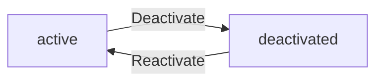

### Contract Lifecycle Transitions

Each employee can have multiple contracts over time, but only one contract can be active at any given moment.

**Active Contract**
A contract without an end date, or with an end date in the future, is considered active. Only one active contract is allowed per employee.

**Ended Contract**
A contract becomes ended when its end date is set, either manually or automatically when a new contract is created.

**Transition Rules**
- When a new contract is created, the previous active contract automatically ends (end date is set to the day before the new contract starts)
- Past contracts cannot be edited and serve as immutable historical records
- An employee can have a gap between contracts (no active contract)
- The active contract can be edited by users with employee management permission

```mermaid
flowchart LR
    A["Previous Active Contract"] -->|"New contract created"| B["Ended Contract"]
    C["No Active Contract"] -->|"Contract created"| D["New Active Contract"]
```

### Project Status Transitions

A project transitions through three statuses: active, archived, and completed.

**Active State**
An active project can receive new timelogs from assigned project members. New projects start in the active state.

**Archived State**
An archived project cannot receive new timelogs. Existing timelogs are preserved. Archiving is a reversible action.

**Completed State**
A completed project cannot receive new timelogs. Existing timelogs are preserved. Completion represents successful project conclusion.

**Transition Rules**
- Users with project management permission can archive or complete an active project
- Archived and completed projects preserve all historical timelogs
- Projects with existing timelogs cannot be deleted, only archived or completed
- Projects without timelogs can be deleted permanently

```mermaid
flowchart LR
    A["active"] -->|"Archive"| B["archived"]
    A -->|"Complete"| C["completed"]
```

### Task Status Transitions

A task progresses through four statuses: open, in-progress, completed, and closed.

**Open State**
A newly created task starts in the open state, indicating work has not yet begun.

**In-Progress State**
When work begins on a task, it transitions to in-progress. This indicates active work is underway.

**Completed State**
When the work defined by the task is finished, it transitions to completed.

**Closed State**
A closed task indicates the task is resolved and no further action is needed. This may occur after completion verification or if the task becomes obsolete.

**Transition Rules**
- Project leads can change task status for tasks in their assigned projects
- Users with project management permission can change any task status
- All status changes are recorded in task history with timestamp, previous status, new status, and who made the change
- There are no restrictions on which status can transition to which (any valid status can be set)

```mermaid
flowchart LR
    A["open"] -->|"Start work"| B["in-progress"]
    B -->|"Finish work"| C["completed"]
    C -->|"Verify and close"| D["closed"]
    A -->|"Direct close"| D
    B -->|"Direct close"| D
```

### Timesheet Approval Workflow

A timesheet transitions through four statuses as part of the approval workflow: draft, submitted, approved, and rejected.

**Draft State**
A draft timesheet is a work in progress. The employee can add or remove timelogs, and can modify the selection. A draft has no restrictions on included timelogs.

**Submitted State**
A submitted timesheet is awaiting manager review. It cannot be modified by the employee. Only one timesheet per employee per week can be in submitted or approved status.

**Approved State**
An approved timesheet has been reviewed and accepted by a user with timesheet approval permission. All timelogs in an approved timesheet are locked and cannot be edited or deleted.

**Rejected State**
A rejected timesheet returns to draft status, allowing the employee to modify and resubmit. The rejection includes a required reason explaining why it was rejected.

**Transition Rules**
- An employee can submit a draft timesheet only if it contains at least one timelog
- An employee cannot submit a timesheet if another timesheet for the same week is already submitted or approved
- Users with timesheet approval permission can approve or reject submitted timesheets
- Approved timesheets lock all included timelogs
- Rejected timesheets return to draft status for revision

```mermaid
flowchart LR
    A["draft"] -->|"Submit"| B["submitted"]
    B -->|"Approve"| C["approved"]
    B -->|"Reject with reason"| D["rejected"]
    D -->|"Returns to draft"| A
```