**erpHrm — Business concepts, relationships, and states from user perspective**

Business concepts, relationships, and states from user perspective

# Domain Concepts

Describe what each concept means in the business domain and its key attributes.

## User Concept

A User represents an individual person who can access the ERP platform. Users authenticate using their email address as a unique identifier along with a password. Each user has a global profile that includes a display name, an optional avatar image, and an optional phone number. The profile information is shared across all organizations the user belongs to, providing a consistent identity across different workspaces. A single user account can be associated with multiple organizations, enabling seamless work across different company contexts without needing separate accounts. When users interact with the platform, they select an organization context, and all their actions are scoped to that organization. Users maintain their own account credentials and can manage their password independently.

### User Identity and Authentication

A User represents an individual person who accesses the ERP platform. Each user is uniquely identified by their email address, which serves as the primary identifier for all interactions within the system. The email address must be unique across the entire platform — no two users can share the same email.

Users authenticate by providing their email address and password combination. The password is a required credential that the user creates during account registration and manages independently. Users can change their password at any time through their account settings. The authentication mechanism ensures that only the legitimate owner of an account can access it.

Account credentials (email and password) are personal to each user and are not shared across organizations. When a user creates an account, they establish these credentials once, and they remain consistent regardless of how many organizations the user joins.

### Global User Profile

Each user maintains a global profile that represents their identity across the entire platform. The profile includes:

- **Display Name**: A human-readable name that identifies the user to others. This name appears in all interactions within organizations, such as when viewing employees, timelogs, or task assignments.
- **Avatar Image**: An optional visual representation of the user, provided as an image URL. The avatar helps team members recognize each other in collaborative contexts.
- **Phone Number**: An optional contact number stored as text, allowing organizations to reach the user if needed.

The profile is shared across all organizations the user belongs to. A single set of profile information follows the user to every workspace, ensuring consistent identity presentation. When a user updates their display name, avatar, or phone number, the change reflects immediately across all organizations they are part of.

This shared profile model means users do not need to maintain separate identities per organization — one profile serves all their organizational memberships.

### Multi-Organization Membership

A single user account can be associated with multiple organizations. This allows individuals who work across different companies or teams to use one account for all their work, rather than maintaining separate credentials for each organization.

When a user logs into the platform, they select an organization context — choosing which organization they want to work in for that session. All subsequent actions during that session are scoped to the selected organization. The user sees only the data, employees, projects, and tasks belonging to that organization.

Users can switch between organizations without logging out. This allows seamless transition between different work contexts while maintaining a single authenticated session. The organization context determines which set of data and features are available at any given time.

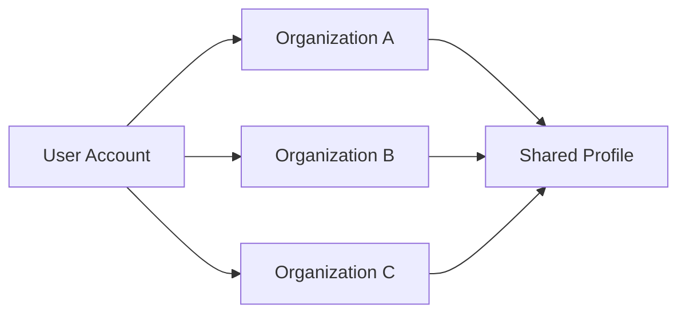

## Organization Concept

An Organization represents a company or business entity using the ERP platform, implementing a multi-tenancy architecture where each organization operates independently with complete data isolation. Each organization has a required name and an optional description for identification purposes. Organizations can upload a logo image for visual branding in the interface. Financial operations within an organization use a designated currency such as USD, EUR, or KRW. Organizations configure their timezone to ensure accurate time tracking and reporting. The fiscal start month defines when the organization's financial year begins for reporting purposes. All employees, projects, tasks, timelogs, and timesheets belong exclusively to one organization and cannot be accessed by members of other organizations.

### Organization Identity and Purpose

An Organization represents a company or business entity using the ERP platform. The platform implements a multi-tenancy architecture where each organization operates as an independent tenant with complete separation from other organizations.

Every organization requires a name for identification purposes. The name serves as the primary display identifier throughout the platform interface. An organization may optionally include a description providing additional context about the company's purpose or nature.

Organizations can upload a logo image for visual branding. The logo appears in the organization's interface and helps members quickly identify their current organization context when users belong to multiple organizations.

### Organization Configuration

Each organization configures its operational settings independently.

Organizations designate a currency for financial operations within the platform. Supported currencies include USD, EUR, KRW, and other common international currencies. All monetary values associated with the organization use this designated currency.

The timezone configuration ensures accurate time tracking and reporting. Organizations specify their preferred timezone, which affects how dates and times display for all members within that organization context.

The fiscal start month defines when the organization's financial year begins. This setting impacts financial reporting and budget tracking features, allowing organizations to align their reporting periods with their actual fiscal calendars.

### Multi-Tenancy and Data Isolation

Each organization operates independently with complete data isolation from other organizations. Members of one organization cannot access data belonging to another organization, ensuring security and privacy across the multi-tenant platform.

All employees within an organization belong exclusively to that organization. An organization maintains complete ownership of its employee records, including their roles, departments, positions, and employment types.

Projects and tasks created within an organization belong entirely to that organization. No project, task, timelog, timesheet, or related data can be shared across organizational boundaries. When an organization is deleted, all associated employees, projects, tasks, timelogs, and timesheets are permanently removed, while user accounts remain independent of organizational lifecycle.

## Employee Concept

An Employee represents a user's membership and employment relationship within a specific organization. Each employee record links a user account to an organization with exactly one assigned role that determines their access permissions. Employees can be assigned to an optional department for organizational structure purposes. A position or job title can be specified to indicate the employee's role within the company. The employment type categorizes workers as full-time, part-time, contractor, or intern. An employee's status can be either active or deactivated, where deactivated employees retain their historical data but can no longer log time or submit timesheets. An employee can be assigned to multiple projects within their organization.

### Employee Definition

An Employee represents a user's membership and employment relationship within a specific organization. Each employee record serves as the bridge between a user account and an organization, establishing the user's presence and access rights within that organization. An employee is uniquely identified by the combination of the user account and the organization—each user can have at most one employee record per organization, but may belong to multiple organizations through separate employee records.

Every employee is assigned exactly one role within the organization. This role determines what actions the employee can perform, such as managing organization settings, viewing reports, or approving timesheets. The role assignment can be changed by users with appropriate permissions, but an employee must always have exactly one role at any given time.

An employee has a status that indicates whether they can actively participate in the organization. An active employee can log time, submit timesheets, and perform actions according to their assigned role. A deactivated employee cannot log time or submit timesheets, but all their historical data—including timelogs, timesheets, and task assignments—is preserved. Deactivated employees can be reactivated if needed.

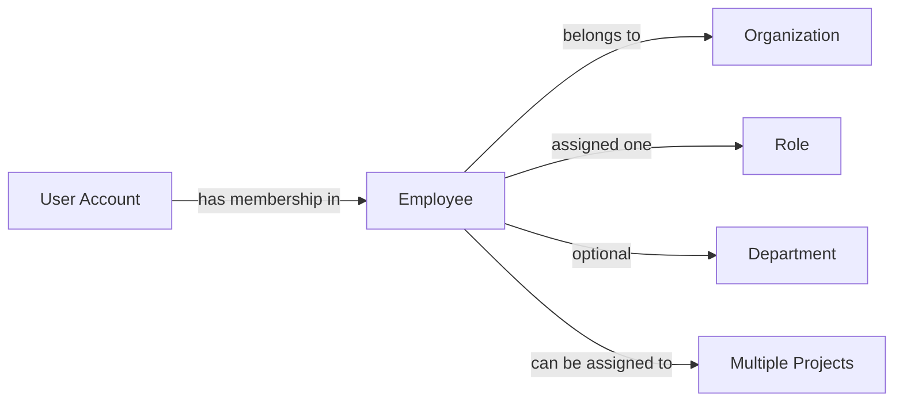

### Employment Classification and Attributes

Each employee has an employment type that categorizes their working arrangement within the organization. The employment type is one of: full-time, part-time, contractor, or intern. Full-time employees work standard full-time hours as defined by their employment contract. Part-time employees work reduced hours compared to full-time staff. Contractors are external workers engaged for specific projects or time periods, typically with different employment terms than permanent staff. Interns are temporary workers, often students or recent graduates, participating in a training or learning program.

An employee may optionally be assigned to a department within the organization. Departments provide organizational structure and help group employees by function or team. When an employee is not assigned to any department, they are considered unassigned for organizational purposes. Department assignments can be changed as employees move between teams.

An employee can have an optional position or job title that describes their role within the organization. This title is distinct from the system role and typically reflects the employee's official job designation, such as "Software Engineer" or "Marketing Manager."

An employee can be assigned to multiple projects within their organization simultaneously. Project assignments are managed separately from the employee record and determine which projects the employee can log time against. Each project assignment may designate the employee as either a regular member or a project lead, with project leads having additional task management capabilities within that project.

## Role Concept

A Role represents a collection of permissions that define what actions an employee can perform within an organization. Each role has a name and a set of permission strings that grant specific capabilities. Three built-in roles exist in every organization: Owner with full access to all features, Manager who can manage employees and projects and approve timesheets, and Employee who can track time and submit timesheets for themselves. Custom roles can be created by organization owners with specific combinations of permissions tailored to organizational needs. Available permissions include organization management, employee management and viewing, project management and viewing, time management and approval, viewing all time data, and viewing reports. Each employee is assigned exactly one role at any given time.

### Role Definition

A Role represents a named collection of permissions that determines what actions an employee can perform within an organization. Each role consists of a role name and a permission set assignment that grants specific capabilities to employees assigned to that role. The permission collection defines the boundaries of access and functionality available to role holders, ensuring that employees can only perform actions appropriate to their organizational responsibilities.

Roles serve as the primary mechanism for access control, allowing organizations to standardize how permissions are distributed across their workforce. Rather than assigning individual permissions to each employee, organizations define roles that encapsulate common permission combinations, simplifying user management and ensuring consistency in access patterns.

### Built-in Roles

Every organization starts with three built-in roles that cannot be deleted or renamed, providing a foundation for organizational access control.

The built-in Owner role grants full access to all features and capabilities within the organization. Owners can manage organization settings, members, roles, and all other organizational resources without restriction. This role is automatically assigned to the user who creates the organization and can be transferred to another employee.

The built-in Manager role provides access to manage employees and projects, approve timesheets, and view organization reports. Managers can oversee day-to-day operations, assign work, and review employee time submissions without having full administrative control over the organization.

The built-in Employee role represents the standard access level for staff members. Employees can track their own time, submit their own timesheets, view projects they are assigned to, and manage their personal profile information. This role provides self-service capabilities without access to manage other employees or organizational settings.

### Custom Roles

Organization owners can create custom roles to address specific organizational needs that the built-in roles do not cover. Each custom role requires a unique name and a defined set of permissions tailored to particular job functions or responsibilities.

Custom roles enable organizations to implement granular access control patterns, such as creating a role for team leads who need project management capabilities but not employee management permissions, or a role for finance staff who need report viewing access but not time tracking capabilities. This flexibility allows organizations to align system access with their unique organizational structures and workflows.

Custom roles can be modified to adjust their permission sets as organizational needs evolve, and they can be deleted when no longer needed, provided no employees are currently assigned to them.

### Permission Categories

Permissions are organized into functional categories that correspond to major system capabilities. Organization management permission grants the ability to edit organization settings including name, description, logo, currency, timezone, and fiscal year settings. This permission is exclusive to the Owner role.

Employee management permission enables adding new employees, editing employee records, and deactivating employees. A separate employee viewing permission allows listing and viewing employee details without modification rights.

Project management permission provides full control over projects and tasks, including creation, editing, archiving, and deletion. Project viewing permission allows read-only access to project information for employees who need visibility into project structures without modification capabilities.

Time approval permission grants the authority to approve or reject employee timesheets, a capability typically reserved for managers and supervisors. Time management permission allows editing or deleting any employee's timelogs, useful for administrators who need to correct time entries.

Report viewing permission provides access to organization-wide reports including time summaries, project budgets, and weekly activity reports. This permission enables oversight and analysis without granting operational control over other resources.

### Role Assignment

Each employee in an organization is assigned exactly one role at any given time, establishing a clear and unambiguous permission set for that employee. Single role assignment prevents permission conflicts and simplifies access management by ensuring that an employee's capabilities are fully defined by their assigned role.

When an employee's responsibilities change, their role assignment can be updated to a different role. The new role's permission set immediately replaces the previous permissions, providing instant adjustment to the employee's access level. Role changes are tracked in the activity log for audit purposes.

Role assignment is performed by users who have employee management permission, typically organization owners or managers. This control ensures that access levels are only modified by authorized personnel who understand the security implications of permission changes.

## Department Concept

A Department represents an organizational unit within a company that groups employees by function, team, or area of responsibility. Each department has a required name for identification and an optional description providing additional context about the department's purpose. Departments can be organized hierarchically with one level of nesting, allowing a department to have an optional parent department. Employees can be assigned to departments to indicate their organizational placement. When a department is deleted, employees previously assigned to it have their department cleared rather than being removed from the organization. Departments help structure reporting and filtering capabilities within the platform.

### Department Definition and Purpose

A Department represents an organizational unit within a company that groups employees by function, team, or area of responsibility. Departments provide the organizational structure that defines how employees are categorized within the company, such as Engineering, Marketing, Human Resources, or Finance. This employee grouping enables structured reporting capabilities and allows for filtering employees by their assigned department. Each department serves as a logical container that indicates where employees belong within the company's functional organization.

### Department Attributes

Each department has a required name that serves as its primary identifier within the organization. The department name distinguishes it in lists, reports, and assignment interfaces, allowing users to identify and select the appropriate department. An optional description provides additional context about the department's purpose, scope, or the types of work performed by employees assigned to that department.

### Department Hierarchy

Departments support a hierarchical reporting structure with exactly one level of nesting. A department may optionally specify a parent department, establishing a parent-child relationship that reflects the organizational structure. For example, "Backend Development" could be a child department with "Engineering" as its parent. Only one level of nesting is permitted—a department that already has a parent cannot itself become a parent to another department. This hierarchy allows for both granular and aggregated views of employee groupings in organizational reports. When a department is deleted, employees previously assigned to that department have their department assignment cleared rather than being removed from the organization.

## Contract Concept

A Contract represents the employment terms between an employee and the organization for a specific period. Each contract has a required start date indicating when the employment terms become effective. The end date is optional, where a null value indicates an ongoing or indefinite contract. The pay rate specifies the compensation amount as a numeric value. Pay period defines how frequently compensation is calculated, either hourly, daily, weekly, or monthly. Working hours per week indicate the expected time commitment, such as 40 hours for full-time employees. Optional notes can provide additional context about specific contract terms. An employee can have multiple contracts over time as a historical record, but only one contract can be active at any given time.

### Contract

A Contract represents the formal employment terms between an employee and the organization for a specific period. It serves as an employment terms record that documents the compensation structure and work expectations agreed upon between the employee and the organization.

Each employee can have multiple contracts over time, creating a historical contract record that tracks how employment terms have changed throughout the employee's tenure. However, the system enforces a single active contract constraint—only one contract per employee can be active at any given time. When a new contract is created, the previously active contract is automatically ended by setting its end date to the day before the new contract begins.

Contracts are immutable once they become historical records. Past contracts cannot be edited, ensuring the integrity of employment history for auditing and compliance purposes. Only the current active contract can be modified to reflect changes in employment terms.

```mermaid
flowchart LR
    A["New Contract Created"] --> B["Previous Active Contract Ended"]
    B --> C["New Contract Active"]
    C --> D["Contract Becomes Historical"]
    D --> E["Immutable Record"]
    ```

### Contract Dates and Duration

Each contract has a contract start date that indicates when the employment terms become effective. This date is required and marks the beginning of the contract period.

The contract end date is optional. When the end date is null, it represents an ongoing indefinite contract with no predetermined expiration. When an end date is specified, it marks the scheduled conclusion of those employment terms.

An employee cannot have overlapping active contracts. The system ensures that the new contract's start date always follows the previous contract's end date, maintaining a continuous but non-overlapping employment timeline.

```mermaid
flowchart LR
    A["Contract Start Date"] --> B{"End Date Specified?"}
    B -->|Yes| C["Fixed Term Contract"]
    B -->|No| D["Ongoing Indefinite Contract"]
    ```

### Contract Compensation and Terms

The pay rate amount specifies the compensation value as a numeric figure. The interpretation of this amount depends on the pay period frequency selected for the contract.

The pay period defines how frequently compensation is calculated and paid. Available options include:

- **Hourly pay period** — Compensation is calculated based on hours worked, suitable for part-time employees and contractors
- **Daily pay period** — Compensation is calculated per day worked
- **Weekly pay period** — Compensation is provided on a weekly basis
- **Monthly pay period** — Compensation is provided on a monthly basis, common for salaried full-time employees

The working hours per week specifies the expected time commitment, such as 40 hours for standard full-time employment. This value is required and helps distinguish between full-time, part-time, and other employment arrangements.

Optional contract notes can provide additional context about specific terms, special conditions, or any other relevant information about the employment arrangement.

## Project Concept

A Project represents a work initiative within an organization that groups related tasks and timelogs. Each project has a required name for identification and an optional description explaining the project's scope. A color code is required for visual identification in the user interface. Projects have a status indicating their current state: active for ongoing work, archived for historical reference, or completed for finished work. Budget hours can be optionally specified to track estimated total effort against actual logged time. Optional start and end dates define the project timeline. Once archived or completed, a project cannot receive new timelogs, though existing timelogs are preserved. Projects without any timelogs can be deleted from the system.

### Project Definition and Attributes

A Project represents a work initiative within an organization that serves as a container for grouping related tasks and timelogs. Each project has a name which is required for identification purposes, allowing employees to reference and select the project when logging time or creating tasks. A description is optional and provides additional context about the project's scope and objectives.

A color code is required for each project and serves as a visual identifier in the user interface, helping users quickly distinguish between different projects in lists and reports.

Budget hours can be optionally specified as a total estimated effort value, enabling comparison between planned and actual time logged against the project.

Start and end dates are optional and define the project's timeline. The start date indicates when work on the project is expected to begin, while the end date indicates the target completion date.

```mermaid
flowchart LR
    A["Project"] --> B["name\n(required)"]
    A --> C["description\n(optional)"]
    A --> D["color code\n(required)"]
    A --> E["budget hours\n(optional)"]
    A --> F["start date\n(optional)"]
    A --> G["end date\n(optional)"]
```

### Project Lifecycle and Status

Projects progress through three status states: active, archived, and completed. An active status indicates the project is ongoing and currently accepting work. An archived status indicates the project has been set aside for historical reference but is no longer actively worked on. A completed status indicates the project has finished and all work has been concluded.

Once a project reaches archived or completed status, it cannot receive new timelogs. This restriction ensures that closed projects maintain their final state. However, any existing timelogs already associated with the project are preserved for historical and reporting purposes.

Projects that have no timelogs associated with them can be deleted from the system entirely. This allows removal of projects that were created but never used.

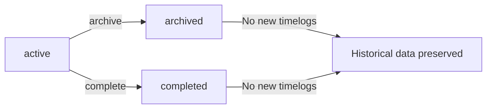

## ProjectMember Concept

A ProjectMember represents an employee's assignment to a specific project within their organization. Each project membership links an employee to a project with an assigned role that determines their capabilities within that project. The role can be either member for standard participation or project-lead for elevated permissions. Project leads have the ability to manage tasks within their assigned project, including creating and editing tasks. An employee can be assigned to multiple projects simultaneously, appearing as separate project membership records. Project memberships enable employees to log time against the projects they are assigned to.

### Project Membership

A project membership represents the assignment of an employee to a specific project within their organization. Each membership creates a relationship between an employee and a project, granting the employee the ability to participate in that project's work. Being assigned to a project is a prerequisite for logging time entries against that project. The system tracks which projects each employee can access through these membership records. A project membership always belongs to exactly one project and exactly one employee, creating a unique pairing that cannot be duplicated.

### Membership Roles

Project membership includes an assigned role that determines the employee's capabilities within the project. The two available roles are:

**Member**: Standard participation role that allows the employee to log time against the project and view project details.

**Project Lead**: Elevated role that includes all member capabilities plus the authority to create, edit, and manage tasks within the project. Project leads have task management authority that allows them to organize and assign work items to other project members.

The membership role is assigned when an employee is added to a project and can be changed by users with project management permissions.

### Multi-Project Assignment

An employee can be assigned to multiple projects simultaneously, appearing as separate membership records for each project. Each membership is independent, and an employee can hold different roles across different projects. For example, an employee may be a project lead on one project while being a regular member on another.

An employee's timelog eligibility is determined by their project memberships: they can only log time entries against projects they are assigned to. This ensures that time tracking reflects actual project involvement and prevents employees from logging time to projects they are not participating in.

## Task Concept

A Task represents a specific unit of work within a project that can be tracked and assigned. Each task has a required title describing the work to be done and an optional description providing additional details. Tasks have a status tracking progress: open for new tasks, in-progress for work underway, completed for finished work, and closed for tasks no longer being worked on. Priority levels indicate urgency: low, medium, high, or urgent. Estimated hours can be specified to track effort expectations. A due date establishes the expected completion timeline. Tasks can be assigned to an employee who is a member of the project. Tasks support one level of nesting through an optional parent task reference for subtask organization.

### Task

A Task represents a specific unit of work within a project that can be tracked, assigned, and monitored. Each task has a required title that briefly describes the work to be accomplished, and an optional description that provides additional context or details about the task requirements.

Tasks progress through four status values: **open** indicates the task is new and waiting to be worked on; **in-progress** indicates work is actively underway; **completed** indicates the work has been finished; and **closed** indicates the task is no longer being actively tracked or worked on.

Priority levels indicate the urgency and importance of the task: **low** priority for tasks that can be deferred; **medium** priority for normal workflow tasks; **high** priority for tasks requiring prompt attention; and **urgent** priority for critical tasks demanding immediate action.

Estimated hours capture the anticipated effort required to complete the task, providing a basis for planning and tracking. A due date establishes the expected completion timeline for the task.

Tasks can be assigned to an employee who is a member of the project, designating responsibility for the work. Tasks support one level of nesting through an optional parent task reference, allowing a task to be designated as a subtask of another task. This enables breaking down larger tasks into smaller, manageable components while maintaining a clear hierarchical relationship.

## TaskHistory Concept

A TaskHistory entry records a status change event for a task, providing an audit trail of task progression. Each history entry captures the timestamp when the status change occurred. The old status preserves the previous state before the change. The new status indicates the state after the change. The entry identifies which user made the status change. Task history provides transparency into how work items progress through different stages over time. Multiple history entries can exist for a single task, documenting each status transition from creation through completion.

### Task History Entry

A task history entry records a single status change event for a task, creating an audit trail of how work items progress through different stages. Each entry captures the moment when a task's status transitions from one state to another.

The change timestamp records exactly when the status change occurred. The previous task status preserves the state before the transition, while the new task status indicates the state after the change. This pairing of old and new status values provides complete visibility into each transition.

The change performer identifies which user made the status modification. This accountability enables tracking of who advanced, completed, or reopened specific tasks.

Task history entries serve as an immutable record of task progression. They provide transparency into the lifecycle of work items, allowing stakeholders to understand how and when tasks moved through stages such as open, in-progress, completed, and closed.

### Status Transition History

Multiple history entries can exist for a single task, documenting its complete journey through various stages. Each time a task's status changes, a new history entry is created and appended to the task's transition history.

The status transition history forms a chronological sequence showing task progression tracking from creation through completion. For example, a task might have entries showing it moved from open to in-progress, then to completed, and later reopened to in-progress again if additional work was needed.

This historical record enables analysis of work patterns, identification of bottlenecks, and understanding of how long tasks spend in each status. The complete history provides context for current task state and supports retrospective review of project execution.

## Timelog Concept

A Timelog represents a recorded time entry for work performed by an employee on a specific date. Each timelog captures the date when the work occurred. The duration specifies the amount of time spent, recorded in minutes. A project is required and must be one the employee is assigned to. An optional task can be specified, which must belong to the selected project. A description field allows employees to note what work was performed. The billable flag indicates whether the time should be considered billable, defaulting to billable. Timelogs can be included in timesheets for approval. Once a timelog is part of an approved timesheet, it becomes locked and cannot be edited.

### Timelog Structure and Attributes

A Timelog represents a discrete record of work time performed by an employee on a specific date. Each timelog captures the date when the work occurred, providing the temporal context for the time entry. The duration specifies the total time spent, recorded in minutes as an integer value.

A project is required for every timelog, and the employee must be assigned to that project. A task may optionally be associated with the timelog, but if specified, the task must belong to the selected project. A description field allows employees to document what work was performed during the recorded time.

The billable flag indicates whether the time entry should be considered billable for invoicing purposes. By default, new timelogs are marked as billable. Non-billable timelogs represent internal work, administrative tasks, or other time that should not be charged to clients.

Timelogs are owned by the employee who created them and are scoped to the organization context. An employee can only create timelogs for themselves, ensuring accountability for recorded time.

### Timelog State and Timesheet Relationship

A timelog can be included in a timesheet, which is a weekly collection of time entries submitted for approval. Timelogs that are not yet included in any timesheet exist in an editable state, where the employee can modify or delete them.

When a timelog is included in an approved timesheet, it enters a locked state. Locked timelogs cannot be edited or deleted by the employee. This restriction ensures the integrity of approved time records for payroll and billing purposes.

Timelogs included in submitted timesheets (awaiting approval) also cannot be deleted, as they are part of a pending approval workflow. If a submitted timesheet is rejected, the included timelogs return to an editable state, allowing the employee to make corrections before resubmission.

Users with time management permissions can edit or delete timelogs regardless of their locked state, providing an override mechanism for administrative corrections.

## Timesheet Concept

A Timesheet represents a weekly collection of timelogs submitted by an employee for approval. Each timesheet is defined by a week start date on Monday and a week end date on Sunday, covering exactly one week. The status tracks the approval workflow: draft for work in progress, submitted for pending approval, approved for accepted timesheets, and rejected for timesheets requiring revision. Total hours are calculated automatically from all included timelogs. A submission timestamp records when the timesheet was sent for approval. A review timestamp captures when approval or rejection occurred. The reviewer field identifies who approved or rejected the timesheet. A rejection reason must be provided when rejecting a timesheet. Only one timesheet can exist per employee per week.

### Timesheet Definition

A Timesheet represents a formal weekly record of work time submitted by an employee for managerial approval. It serves as the primary mechanism for consolidating time entries into a structured, reviewable document.

Each timesheet spans exactly one calendar week, beginning on Monday and ending on Sunday. The week start date and week end date define this period precisely. An employee can have only one timesheet per week, ensuring no overlapping or duplicate submissions exist.

A timesheet aggregates multiple timelog entries recorded by the employee during the covered week. The collection of timelogs determines the total work hours, which is calculated automatically as the sum of all included durations in minutes, converted to hours.

The timesheet acts as the approval unit for work time: employees submit their weekly timelogs as a single package, and reviewers approve or reject the entire collection rather than individual entries.

### Timesheet Status States

A timesheet progresses through four distinct status states during its lifecycle.

**Draft** status indicates the timesheet is being prepared by the employee. Timelogs can be added or removed while in this state. The timesheet remains a work in progress until explicitly submitted.

**Submitted** status indicates the employee has sent the timesheet for approval. The timesheet is now pending review and cannot be modified by the employee. A submission timestamp records the exact moment of submission.

**Approved** status indicates a reviewer has accepted the timesheet. All included timelogs become locked and cannot be edited or deleted. A review timestamp captures when approval occurred.

**Rejected** status indicates a reviewer has declined the timesheet. The timesheet returns to draft status, allowing the employee to make corrections. A rejection reason explaining the decision is required when rejecting. The review timestamp and rejection reason are recorded together.

### Timesheet Review Records

When a timesheet undergoes review, the system captures key audit information.

The submission timestamp records when the employee sent the timesheet for approval. This timestamp is set at the moment of submission and remains unchanged.

The review timestamp records when a reviewer approved or rejected the timesheet. This timestamp is set only when a decision is made.

The reviewer identification captures which user performed the approval or rejection. This creates an audit trail of who made each decision.

The rejection reason is a required text explanation when a reviewer rejects a timesheet. It informs the employee why the timesheet was not accepted and what may need correction.

The total hours value is automatically calculated from all timelogs included in the timesheet. It represents the sum of all durations and updates whenever timelogs are added or removed from a draft timesheet.

## Timer Concept

A Timer represents an active time tracking session running in real-time for an employee. The start timestamp marks when the timer was initiated. A project selection is required and must be one the employee is assigned to. An optional task can be associated with the timer. A description field allows the employee to note what work is being performed. Each employee can have at most one active timer at any time. When a timer is stopped, a timelog is automatically created with the calculated duration rounded to the nearest minute. The timer continues running indefinitely until manually stopped or discarded by the employee.

### Timer Definition

A Timer represents a live time tracking session that an employee uses to record work time in real-time. The timer captures the moment work begins through a start timestamp, which marks when the employee initiated the tracking session. Employees can provide an optional description noting what work is being performed during the tracked session. The timer continues running indefinitely until the employee manually stops or discards it — there is no automatic stop mechanism. Each employee can have at most one active timer at any given time, ensuring that time tracking remains focused on a single work activity.

### Timer Project and Task Association

When starting a timer, the employee must select a project to associate with the time being tracked. The selected project must be one the employee is assigned to as a project member. An optional task can be associated with the timer, providing more specific context for the work being performed. When a task is selected, it must belong to the same project chosen for the timer. Both the project and task selections can be modified while the timer is still running.

### Timer Completion and Duration

When an employee stops their timer, the system automatically creates a timelog record with the calculated duration. The duration is computed from the elapsed time between the start timestamp and the stop moment, rounded to the nearest minute. Alternatively, an employee can discard the timer without creating any timelog, abandoning the recorded time entirely. The description and project/task assignments of a running timer can be edited at any time before the timer is stopped or discarded.

## Invitation Concept

An Invitation represents a pending request for a person to join an organization via their email address. Each invitation is associated with a specific email address that will receive the invitation. The status indicates whether the invitation is pending acceptance or has been accepted. If the invited email already has an account, the user is immediately added to the organization. If the email has no existing account, a pending invitation is created that will be fulfilled when the user signs up with that email address. Pending invitations provide a mechanism for onboarding new users to the organization through the invitation flow.

### Invitation Definition

An Invitation represents a formal request for a person to join an organization through their email address. Each invitation is uniquely identified by the email address that will receive the invitation to join. The invitation serves as the mechanism through which new members are onboarded into an organization, establishing the connection between an email address and the organization they are being invited to join. Every invitation belongs to exactly one organization, creating a direct association between the prospective member and the organization they will become part of upon acceptance.

### Invitation Status and Acceptance Flow

Each invitation has a status that indicates its current state in the invitation lifecycle. The pending status indicates that the invitation has been sent but has not yet been accepted by the recipient. The accepted status indicates that the invitation has been fulfilled and the person has successfully joined the organization. When an invitation is created, the system checks whether the invited email address already has an existing user account. If the email corresponds to an existing account, the user is immediately added to the organization without requiring additional signup steps. If the email does not have an existing account, a pending invitation is created and stored in the system. This pending invitation is automatically fulfilled when a new user signs up with that email address, at which point they are added to the organization and the invitation status transitions to accepted. This dual-path resolution ensures that both existing users and new users can seamlessly join the organization through the same invitation mechanism.

## ActivityLog Concept

An ActivityLog entry represents a record of a significant action performed within the organization for audit purposes. Each entry captures the timestamp of when the action occurred. The user field identifies who performed the action. The action type categorizes the kind of action taken, such as employee invited, deactivated, or reactivated. The target entity identifies what object was affected by the action. Optional details provide additional context about the action. Logged actions include employee management events like invitations and status changes, contract creation and edits, project lifecycle events like creation, archival, and completion, task status changes, timesheet submission and review events, and role assignments. Activity logs maintain an audit trail for organizational transparency and compliance.

### ActivityLog Definition and Core Attributes

An ActivityLog entry represents an immutable audit trail record that captures significant actions performed within an organization. Each entry serves as a permanent historical record for compliance, transparency, and accountability purposes.

**Core Attributes:**

- **Action Timestamp**: The exact date and time when the action occurred, providing a chronological anchor for the audit trail.

- **Action Performer**: The user who executed the action. This field identifies the individual responsible for the change, enabling accountability and traceability.

- **Action Type Category**: A classification that categorizes the kind of action taken. This enables filtering and analysis of audit records by action category.

- **Target Entity Reference**: Identifies the specific object or record that was affected by the action. This creates a link between the audit entry and the business entity it relates to.

- **Action Details**: Optional supplementary information that provides additional context about the action. This field captures any relevant details that help explain the nature or reason for the action.

ActivityLog entries are organization-scoped, meaning each entry belongs to a specific organization and maintains data isolation between tenants. The entries form a comprehensive audit trail that supports organizational governance and regulatory compliance requirements.

### Action Type Categories

The ActivityLog captures the following categories of significant actions performed within an organization:

**Employee Management Actions:**
- **Employee Invitation Action**: Records when a new employee is invited to join the organization via email.
- **Employee Deactivation Action**: Records when an employee's access is revoked or their status is changed to inactive.
- **Employee Reactivation Action**: Records when a previously deactivated employee is restored to active status.

**Contract Management Actions:**
- **Contract Creation Action**: Records when a new employment contract is created for an employee.
- **Contract Edit Action**: Records when an existing contract is modified.

**Project Lifecycle Actions:**
- **Project Creation Action**: Records when a new project is created within the organization.
- **Project Archival Action**: Records when a project is archived and no longer accepts new activity.
- **Project Completion Action**: Records when a project is marked as completed.
- **Project Deletion Action**: Records when a project is permanently removed from the organization.

**Task Management Actions:**
- **Task Status Change Action**: Records when a task's status transitions between states (e.g., open to in-progress, in-progress to completed).

**Timesheet Workflow Actions:**
- **Timesheet Submission Action**: Records when an employee submits a timesheet for approval.
- **Timesheet Approval Action**: Records when a timesheet is approved by an authorized reviewer.
- **Timesheet Rejection Action**: Records when a timesheet is rejected, including the reason for rejection.

**Role Management Actions:**
- **Role Assignment Action**: Records when a role is assigned to an employee.
- **Role Change Action**: Records when an employee's assigned role is changed to a different role.

These action categories provide comprehensive coverage of significant organizational events that require audit tracking for compliance and operational visibility.

# Domain Relationships

Describe how concepts relate to each other from a business perspective.

## Conceptual Relationships

Describe how concepts relate to each other in business terms.

### Entity Ownership and Creation

Each organization maintains exclusive ownership of its employees, departments, projects, roles, and invitations. When a user creates an organization, that user becomes the organization owner and is automatically assigned the Owner role within that organization.

Organizations own their activity logs, which record significant actions performed within the organization context. Each activity log entry references both the user who performed the action and the organization where the action occurred.

Users create projects, tasks, timelogs, timesheets, and contracts. The creator reference is maintained for audit purposes. When a user creates an employee record within an organization, the employee is permanently associated with that organization and cannot be transferred to another organization.

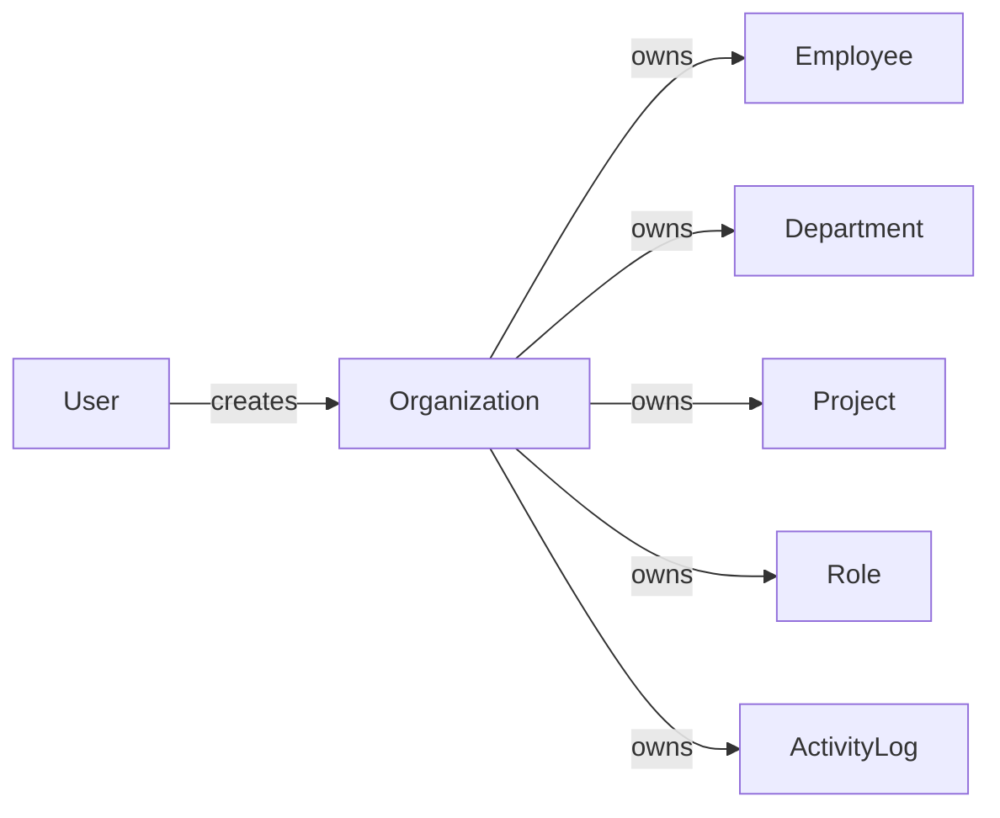

### Hierarchical Associations

Departments support a single level of hierarchy where a department may have an optional parent department. This allows organizational structures such as "Engineering" containing sub-departments like "Frontend" and "Backend". Child departments cannot themselves have children, limiting nesting to one level.

Tasks support parent-child relationships for creating subtasks. A task may reference an optional parent task, enabling breakdown of work into smaller units. Subtasks can themselves have subtasks, allowing multiple levels of task decomposition.

Organizations exist independently of each other. There is no parent-child relationship between organizations—each operates as a completely separate tenant with its own data isolation.

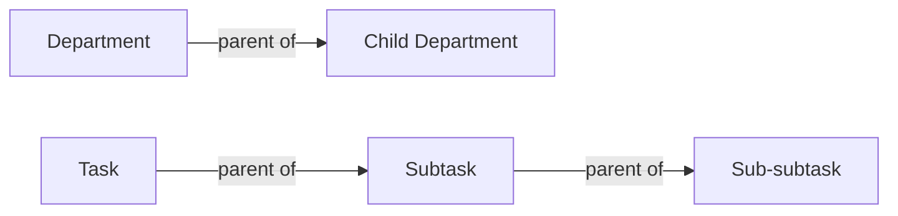

### Collection Relationships

A user can belong to multiple organizations through employee records. Each employee record represents the user's membership in one specific organization, with exactly one assigned role. A user creates many timelogs, timesheets, and tasks across the organizations they belong to.

An organization contains many employees, each representing a user's membership in that organization. An organization has many departments, projects, roles, and activity logs. Projects contain many tasks and project members. Each project member represents an employee assigned to work on that project.

An employee has many timelogs recording their work time, many timesheets for weekly time submissions, and belongs to one department (optional) and one role (required). An employee has many contracts over time, with at most one contract active at any given time. An employee has at most one active timer for live time tracking.

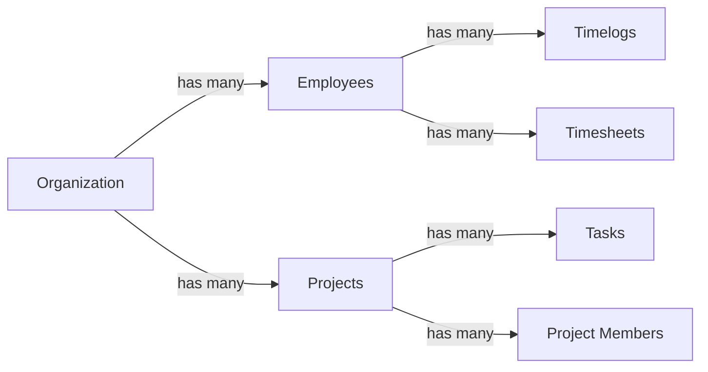

### Peer and Cross-Entity Associations

Project members bridge employees and projects. An employee can be assigned to multiple projects, and a project can have multiple assigned employees. Each project membership includes a role (member or project-lead) that determines what actions the employee can perform within that project.

Timelogs associate work time with a project and optionally a task. The employee logging time must be assigned to the project selected for the timelog. When a timelog references a task, that task must belong to the same project as the timelog.

Timesheets aggregate timelogs by employee and week. Each timesheet belongs to one employee and covers a specific Monday-to-Sunday period. The timesheet references the timelogs recorded during that week.

Invitations link email addresses to organizations. When an invitation is accepted, an employee record is created linking the user to the organization. If the invited email already has an account, the existing user is added to the organization; otherwise, a pending invitation awaits account creation.

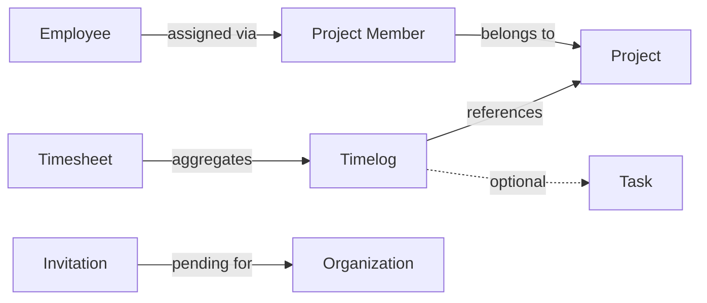

## Lifecycle and Retention

Describe concept lifecycle states and transitions only. Detailed retention/recovery policies belong in 05-non-functional. Operation details belong in 03-functional-requirements.

### Entity Lifecycle States

Each business concept in the platform has defined lifecycle states that govern its behavior and availability.

**Organization Lifecycle**: An organization exists in either an active or deleted state. Active organizations can have employees, projects, tasks, timelogs, and timesheets. When deleted, all associated data is permanently removed.

**Employee Lifecycle**: An employee record has two states: active and deactivated. Active employees can log time, submit timesheets, and participate in projects. Deactivated employees cannot log time or submit timesheets, but their historical data (timelogs, timesheets) is preserved. Deactivated employees can be reactivated.

**Contract Lifecycle**: Employee contracts track employment history. Only one contract can be active at a time for an employee. When a new contract is created, the previous active contract automatically ends. Past contracts are immutable and serve as historical records.

**Project Lifecycle**: Projects progress through three states: active, archived, and completed. Active projects accept new timelogs. Archived and completed projects do not accept new timelogs, but existing timelogs remain accessible. Projects can only be deleted if no timelogs are associated with them.

**Task Lifecycle**: Tasks transition through four states: open, in-progress, completed, and closed. Each status change is recorded in the task history for audit purposes. Task status changes are performed by project leads or users with appropriate permissions.

**Timesheet Lifecycle**: Timesheets move through four states: draft, submitted, approved, and rejected. Draft timesheets can be modified. Once submitted, timesheets await approval. Approved timesheets lock their included timelogs, preventing further modification. Rejected timesheets return to a modifiable state with documented rejection reasons.

### Archival and Soft Deletion

Certain entities support archival or deactivation rather than permanent deletion, preserving historical data while restricting future operations.

**Project Archival**: Projects can be archived or marked as completed. Archived projects and completed projects cannot receive new timelogs. This allows organizations to close projects while retaining historical time tracking data. The project list can be filtered to show or hide archived projects.

**Employee Deactivation**: Employees can be deactivated instead of deleted. Deactivated employees cannot log time, submit timesheets, or be assigned to new tasks. Their historical timelogs and timesheets remain accessible for reporting and audit purposes. Deactivated employees can be reactivated, restoring full access.

**Contract Preservation**: Past contracts cannot be edited or deleted. They serve as immutable historical records of employment terms. This ensures accurate historical reporting on pay rates and employment periods.

**Task Closure**: Tasks can be closed when work is complete. Closed tasks remain visible for reference and reporting but are typically filtered out of active task lists.

### Deletion Policies and Constraints

Permanent deletion is governed by specific conditions to prevent data loss and maintain referential integrity.

**Organization Deletion**: An organization can only be deleted if all pending timesheets are resolved (approved or rejected) and there are no active employee contracts. When an organization is deleted, all employees, projects, tasks, timelogs, and timesheets are permanently deleted. The owner's user account remains but is no longer associated with the organization.

**Project Deletion**: A project can only be deleted if it has no timelogs associated with it. This prevents deletion of projects that contain historical work records. Projects with timelogs must be archived instead.

**Timesheet Deletion**: A timesheet can only be deleted if it has not been submitted. Once submitted, a timesheet cannot be deleted. This ensures audit integrity of approved work records.

**Timelog Deletion**: A timelog can only be deleted or edited if it is not part of an approved timesheet. Timelogs in approved timesheets are locked and cannot be modified. Timelogs that are part of a submitted (but not yet approved) timesheet can only be edited or deleted by users with time management permissions.

**Task Deletion**: Tasks can be deleted only if no timelogs are associated with them. Tasks with timelogs must be closed rather than deleted to preserve the historical record of work performed.

### Recovery and Reactivation

Certain entities support reactivation or recovery after deactivation, restoring them to an active state.

**Employee Reactivation**: Deactivated employees can be reactivated by users with employee management permissions. Reactivation restores the employee's ability to log time, submit timesheets, and be assigned to tasks. Historical data remains intact during deactivation and is immediately accessible upon reactivation.

**Project Unarchiving**: Archived projects can potentially be restored to active status, allowing new timelogs to be added. Completed projects can also be reopened if business needs change. The project status transitions back to active, restoring full functionality.

**Draft Timesheet Recovery**: Rejected timesheets can be modified and resubmitted. The rejection reason is preserved for reference, allowing employees to address the reviewer's concerns and submit a corrected timesheet.

**Timer Continuation**: Active timers continue running indefinitely if not stopped. Employees can view their running timer and stop it at any time to create the corresponding timelog. There is no automatic expiration of running timers.

**Data Retention Reference**: Detailed policies on data retention periods, backup schedules, and disaster recovery procedures are documented in the non-functional requirements. Lifecycle and retention focuses on business state transitions, while technical data retention policies specify storage duration and recovery procedures.

### Lifecycle State Diagram

The following diagram illustrates the primary lifecycle states and transitions for key business entities:

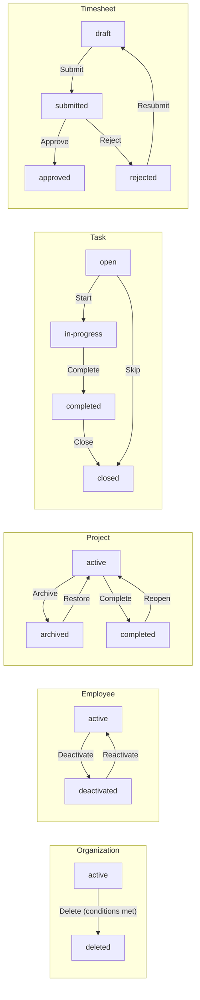

# Business Categories and State Flows

Business category classifications and state flow definitions.

## Business Category Definitions

Define all business category classifications with their allowed values and descriptions.

### Employment and Employee Classifications

The platform defines several business categories to classify employees and their employment terms.

**Employment Type** categorizes how an employee is engaged with the organization:
- **Full-time**: Standard permanent employment with regular working hours
- **Part-time**: Reduced working hours compared to full-time employees
- **Contractor**: External worker engaged under a contract for specific work or duration
- **Intern**: Temporary position typically for learning or training purposes

**Employee Status** indicates the current state of an employee's access to the organization:
- **Active**: Employee can log time, submit timesheets, and participate in projects
- **Deactivated**: Employee cannot log time or submit timesheets, but historical data is preserved

**Pay Period** defines how frequently an employee is compensated under a contract:
- **Hourly**: Compensation calculated based on hours worked
- **Daily**: Fixed compensation per working day
- **Weekly**: Fixed compensation per week
- **Monthly**: Fixed compensation per month

### Project and Task Classifications

Projects and tasks use specific business categories to track their state and priority.

**Project Status** indicates the lifecycle stage of a project:
- **Active**: Project is ongoing and can receive new timelogs
- **Archived**: Project is no longer active; cannot receive new timelogs but existing data is preserved
- **Completed**: Project has finished; cannot receive new timelogs but existing data is preserved

**Task Status** tracks the progress of individual work items:
- **Open**: Task has been created but work has not started
- **In-progress**: Work is actively being done on the task
- **Completed**: Work on the task has been finished
- **Closed**: Task is no longer relevant or has been cancelled

**Task Priority** indicates the urgency of a task:
- **Low**: Task can be addressed when convenient
- **Medium**: Standard priority for normal workflow
- **High**: Task should be addressed soon
- **Urgent**: Task requires immediate attention

**Project Member Role** defines the level of authority within a project:
- **Member**: Can view and log time on the project
- **Project-lead**: Can manage tasks within the project in addition to member privileges

### Timesheet and Time Tracking Classifications

Time tracking uses specific status types to manage the approval workflow.

**Timesheet Status** tracks the state of weekly time submissions:
- **Draft**: Timesheet is being prepared; timelogs can be added or removed
- **Submitted**: Timesheet has been sent for approval; timelogs are locked from editing
- **Approved**: Timesheet has been accepted by a reviewer; all included timelogs are permanently locked
- **Rejected**: Timesheet was not accepted; returns to draft status for modification and resubmission

**Invitation Status** tracks the state of employee invitations:
- **Pending**: Invitation has been sent but the recipient has not yet joined
- **Accepted**: The invited user has joined the organization

**Billable Flag** on timelogs indicates whether the time entry can be charged to clients:
- **Billable**: Time can be invoiced to a client
- **Non-billable**: Time is for internal purposes and cannot be invoiced

### Activity Log Action Types

The activity log records organizational actions using the following action type classifications:

**Employee Management Actions**:
- **Employee invited**: A new employee invitation was sent
- **Employee deactivated**: An employee was deactivated from the organization
- **Employee reactivated**: A deactivated employee was restored to active status

**Contract Actions**:
- **Contract created**: A new employment contract was established
- **Contract edited**: An active contract was modified

**Project Actions**:
- **Project created**: A new project was added to the organization
- **Project archived**: A project was moved to archived status
- **Project completed**: A project was marked as completed
- **Project deleted**: A project was permanently removed

**Task Actions**:
- **Task status changed**: A task's status was updated

**Timesheet Actions**:
- **Timesheet submitted**: An employee submitted a timesheet for approval
- **Timesheet approved**: A submitted timesheet was approved
- **Timesheet rejected**: A submitted timesheet was rejected

**Role Actions**:
- **Role assigned**: An employee was assigned a role
- **Role changed**: An employee's role was changed to a different role

## State Transitions

Define valid state transition paths for stateful concepts.

### Employee Status Lifecycle

An employee in an organization can exist in one of two statuses: active or deactivated.

When an employee is first added to an organization (either through invitation acceptance or direct addition), their status is set to active. Active employees can log time, submit timesheets, and perform all actions permitted by their assigned role.

An employee can be deactivated by users with the employee management permission. Deactivation changes the employee status from active to deactivated. A deactivated employee cannot log time or submit timesheets, but their historical data (timelogs and timesheets) is preserved.

A deactivated employee can be reactivated, returning their status to active. Upon reactivation, the employee regains full access to perform actions according to their assigned role.

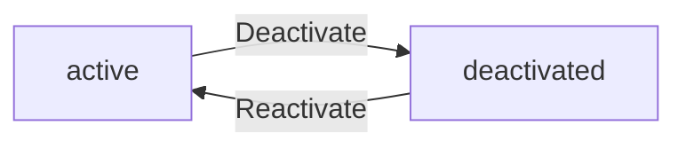

The status change from active to deactivated is recorded in the activity log with the action type "employee_deactivated". Reactivation is recorded as "employee_reactivated".

### Project Status Lifecycle

A project can exist in one of three statuses: active, archived, or completed.

When a project is first created, its status is set to active. Active projects can receive new timelogs from employees assigned to the project.

A project can be archived or marked as completed by users with the project management permission. Both archival and completion change the project status from active to the respective terminal state. Archived and completed projects cannot receive new timelogs, but existing timelogs associated with the project are preserved.

A project can be deleted only if it has no timelogs associated with it. Deletion permanently removes the project and is only possible from any status.

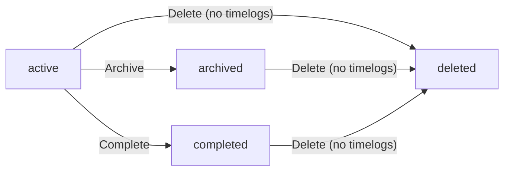

Project creation, archival, completion, and deletion are all recorded in the activity log.

### Task Status Lifecycle

A task can exist in one of four statuses: open, in-progress, completed, or closed.

When a task is first created, its status is set to open. An open task represents work that has been identified but not yet started.

A task can have an optional parent task, creating a subtask relationship. Subtasks cannot have their own subtasks—nesting is limited to exactly one level.

A task can transition from open to in-progress when work begins. The in-progress status indicates that someone is actively working on the task.

An in-progress task can transition to completed when the work is finished. A completed task represents work that has been successfully finished.

Any task (open, in-progress, or completed) can be closed. Closed tasks represent work items that are no longer being pursued, regardless of whether they were completed.

Each status change is recorded in the task history, capturing the timestamp, previous status, new status, and the user who made the change.

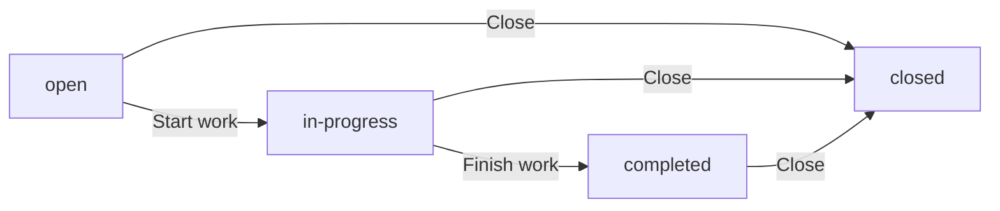

Task status changes are recorded in the activity log with the action type "task_status_changed".

### Timesheet Status Lifecycle

A timesheet can exist in one of four statuses: draft, submitted, approved, or rejected.

When an employee creates a timesheet for a specific week, its status is set to draft. A draft timesheet can be modified by adding or removing timelogs.

A draft timesheet can be submitted for approval. Submission changes the status from draft to submitted. A timesheet cannot be submitted if it has no timelogs, or if another timesheet for the same week is already submitted or approved.

A submitted timesheet can be approved by users with the timesheet approval permission. Approval changes the status from submitted to approved. Once approved, all timelogs included in the timesheet are locked and cannot be edited or deleted.

A submitted timesheet can be rejected with a required reason. Rejection changes the status from submitted back to draft. The employee can then modify the timesheet and resubmit it.

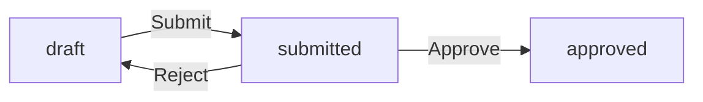

Timesheet submission, approval, and rejection are all recorded in the activity log.

### Invitation Status Lifecycle

An invitation to join an organization can exist in one of two statuses: pending or accepted.

When a user with employee management permission invites someone by email, and that email does not have an existing account, a pending invitation is created.

When the invited person signs up with that email address, they are automatically added to the organization and the invitation status changes from pending to accepted.

If the invited email already has an existing account, no invitation record is created. Instead, the user is immediately added to the organization.

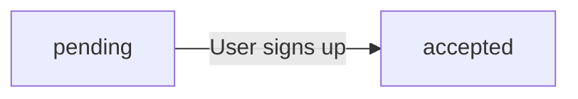

Pending invitations remain until the recipient signs up or the invitation is manually revoked.