**hrmTimeTracking — What operations users can perform, use cases, business workflows**

What operations users can perform, use cases, business workflows

# Core Business Operations

What the system must do for each business concept.

## Organization Operations

Users create an organization when they first sign up for the platform. Each organization requires a name, currency setting, timezone, and fiscal start month, with optional description and logo image. Organization owners can modify these settings at any time to reflect changes in their business. To delete an organization, all pending timesheets must be approved or rejected, and there must be no active employee contracts. When an organization is deleted, all associated data including employees, projects, tasks, timelogs, and timesheets are permanently removed. The organization owner's account remains but loses association with the deleted organization. Each organization operates independently with its own data and settings. Multiple organizations can exist on the platform, and users can belong to multiple organizations.

### Organization Creation During Signup

When a user signs up for the platform, THE system SHALL require the user to create an organization.

THE system SHALL support multiple organizations operating independently on the platform.

When a user creates an organization, THE system SHALL require the following information:
- Name
- Currency (e.g., USD, EUR, KRW)
- Timezone
- Fiscal start month

When a user creates an organization, THE system SHALL allow optional description and logo image.

When an organization is created, THE system SHALL assign the creating user as the organization owner.

THE system SHALL isolate all data per organization so that employees in one organization cannot see data from another organization.

### Organization Settings Management

Organization owners SHALL have full access to manage organization settings.

When an organization owner modifies organization settings, THE system SHALL allow changes to:
- Name
- Description
- Logo image
- Currency
- Timezone
- Fiscal start month

When an organization owner updates settings, THE system SHALL save the changes and apply them immediately to the organization.

### Currency and Timezone Configuration

When an organization is created or settings are modified, THE system SHALL require a currency setting (e.g., USD, EUR, KRW).

When an organization is created or settings are modified, THE system SHALL require a timezone setting.

THE system SHALL use the configured currency for financial calculations within the organization.

THE system SHALL use the configured timezone for date and time displays within the organization.

### Logo Image Upload

When an organization owner uploads a logo image, THE system SHALL associate the image with the organization.

When a logo image is updated, THE system SHALL replace the previous logo image.

When a logo image is removed, THE system SHALL display the organization without a logo image.

### Fiscal Start Month Setting

When an organization is created or settings are modified, THE system SHALL require a fiscal start month.

THE system SHALL use the fiscal start month for financial reporting and budget tracking within the organization.

### Organization Deletion

When an organization owner requests to delete an organization, THE system SHALL verify that all pending timesheets are resolved (approved or rejected).

If any pending timesheets exist, THE system SHALL reject the deletion request.

When an organization owner requests to delete an organization, THE system SHALL verify that there are no active employee contracts.

If any active employee contracts exist, THE system SHALL reject the deletion request.

When an organization deletion is approved, THE system SHALL permanently delete all employees, projects, tasks, timelogs, and timesheets associated with the organization.

When an organization is deleted, THE system SHALL retain the owner's user account but remove the association with the deleted organization.

## User Operations

Users sign up with their email address and password to create an account on the platform. After logging in with their credentials, users select which organization they want to work in. Users can change their password at any time through their account settings. A single user can belong to multiple organizations and switch between them without logging out. Users can delete their account, but if they are the sole owner of an organization, they must transfer ownership or delete the organization first. When a user deletes their account, their employee records in other organizations are marked as deactivated rather than removed. Each user has a global profile containing their display name, avatar image, and phone number. Users can edit their profile information, and the profile is shared across all organizations they belong to.

### User Registration

Users can create a new account on the platform to access organization features.

THE SYSTEM SHALL allow users to sign up by providing an email address and a password.
THE SYSTEM SHALL require the email address to be unique across all registered users.
IF a user attempts to sign up with an email that is already registered, THE SYSTEM SHALL reject the registration request.
WHEN a user successfully creates an account, THE SYSTEM SHALL store the user's credentials and create a user profile.

### Organization Creation During Signup

Users create their first organization during the initial sign-up process.

WHEN a user signs up for the first time, THE SYSTEM SHALL require the user to create an organization.
THE SYSTEM SHALL prompt the user to provide organization details including name, currency, and timezone.
THE SYSTEM SHALL assign the user as the owner of the newly created organization.

### Pending Invitation Processing

Users who sign up with an email that has pending invitations are automatically added to those organizations.

WHEN a user signs up with an email address that has pending organization invitations, THE SYSTEM SHALL automatically add the user to those organizations as an employee.
THE SYSTEM SHALL assign the role specified in the invitation to the newly created employee record.

### User Authentication

Users can log in to access their account and work within an organization.

THE SYSTEM SHALL authenticate users by verifying their email address and password combination.
IF the provided credentials are invalid, THE SYSTEM SHALL reject the login attempt.
WHEN a user successfully logs in, THE SYSTEM SHALL display a list of organizations the user belongs to.
THE SYSTEM SHALL require the user to select an organization to work in before proceeding.
WHEN a user selects an organization, THE SYSTEM SHALL establish that organization as the working context for all subsequent actions.

### Organization Context

All user actions are scoped to the currently selected organization.

THE SYSTEM SHALL restrict all data access and operations to the currently selected organization.
THE SYSTEM SHALL prevent users from accessing data belonging to other organizations they are not currently working in.
WHEN a user performs any action, THE SYSTEM SHALL apply the action within the context of the selected organization.

### Organization Switching

Users who belong to multiple organizations can switch between them without logging out.

THE SYSTEM SHALL allow authenticated users to switch from one organization to another without ending their session.
THE SYSTEM SHALL display the list of organizations the user belongs to when the user requests to switch.
WHEN a user switches to a different organization, THE SYSTEM SHALL change the working context to the newly selected organization.
THE SYSTEM SHALL immediately apply the permissions and access rights of the user's role in the new organization.
THE SYSTEM SHALL restrict all subsequent actions to the new organization's data.

### Password Management

Users can change their password to maintain account security.

THE SYSTEM SHALL allow authenticated users to change their password.
THE SYSTEM SHALL require users to provide their current password when requesting a password change.
THE SYSTEM SHALL verify the current password before accepting a new password.
IF the provided current password is incorrect, THE SYSTEM SHALL reject the password change request.
THE SYSTEM SHALL accept a new password that meets the platform's security requirements.
WHEN a password is successfully changed, THE SYSTEM SHALL update the user's credentials.

### Account Deletion

Users can permanently delete their account from the platform.

THE SYSTEM SHALL allow users to request deletion of their account.
IF a user is the sole owner of any organization, THE SYSTEM SHALL prevent account deletion until ownership is transferred or the organization is deleted.
WHEN a user deletes their account, THE SYSTEM SHALL permanently remove the user's login credentials and global profile.
WHEN a user deletes their account, THE SYSTEM SHALL mark all employee records associated with that user as deactivated in all organizations.
THE SYSTEM SHALL preserve historical data such as timelogs and timesheets associated with the deactivated employee records.
THE SYSTEM SHALL prevent deactivated employee records from being reactivated after account deletion.

### Ownership Transfer Requirement

Users who are sole owners of organizations must resolve ownership before deleting their account.

IF a user requests account deletion and is the only owner of an organization, THE SYSTEM SHALL require the user to either transfer ownership to another employee or delete the organization.
THE SYSTEM SHALL block account deletion while the user remains the sole owner of any organization.

### User Profile Management

Each user has a global profile that is shared across all organizations they belong to.

THE SYSTEM SHALL provide each user with a global profile containing a display name, avatar image, and phone number.
THE SYSTEM SHALL share the user's profile information across all organizations the user is a member of.
THE SYSTEM SHALL allow users to edit their profile information including display name and phone number.
WHEN a user updates their profile, THE SYSTEM SHALL reflect the changes across all organizations the user belongs to.

### Avatar Image Upload

Users can upload an avatar image to personalize their profile.

THE SYSTEM SHALL allow users to upload an image file to use as their avatar.
THE SYSTEM SHALL accept image files in standard formats for avatar upload.
THE SYSTEM SHALL display the uploaded avatar image in the user's profile across all organizations.
THE SYSTEM SHALL allow users to replace their existing avatar image with a new one.
THE SYSTEM SHALL allow users to remove their avatar image, reverting to a default representation.

## Role Operations

Each organization has its own set of roles that define what members can do. Three built-in roles exist by default: Owner has full access to all features, Manager can manage employees and approve timesheets, and Employee can track time and view their own data. Organization owners can create custom roles with specific names and sets of permissions. Available permissions include managing organization settings, managing or viewing employees, managing or viewing projects, managing time entries, approving timesheets, viewing all time data, and viewing reports. Organization owners can edit custom roles to change their permissions. Custom roles can be deleted only if no employees are currently assigned to them. Each employee in an organization is assigned exactly one role. Users with employee management permission can change role assignments for employees.

### Built-in Roles

The system SHALL provide three built-in roles for each organization that cannot be deleted.

THE system SHALL create the Owner role automatically when an organization is created.
THE Owner role SHALL have full access to all organization features and management capabilities.
THE Owner role SHALL include permission to manage organization settings, employees, projects, time entries, timesheet approvals, and reports.

THE system SHALL create the Manager role automatically when an organization is created.
THE Manager role SHALL include permission to manage employees, manage projects, approve timesheets, view all time data, and view reports.
THE Manager role SHALL NOT include permission to manage organization settings by default.

THE system SHALL create the Employee role automatically when an organization is created.
THE Employee role SHALL include permission to track time, submit timesheets, and view the employee's own data.
THE Employee role SHALL NOT include permission to manage other employees, approve timesheets, or view reports by default.

THE system SHALL mark built-in roles as immutable, preventing deletion and modification of their permission sets.

Users assigned the Owner role SHALL be able to perform all operations within the organization regardless of specific permission checks.

### Custom Role Management

Organization owners SHALL be able to create custom roles within their organization.

WHEN creating a custom role, THE system SHALL require a role name and at least one permission.
THE system SHALL allow selection from the following permissions during role creation:
- Organization management permission to edit organization settings
- Employee management permission to add, edit, and deactivate employees
- Employee viewing permission to view employee list and details
- Project management permission to create, edit, and delete projects and tasks
- Project viewing permission to view projects and tasks
- Time management permission to edit or delete any employee's timelogs
- Time approval permission to approve or reject timesheets
- All time viewing permission to view all employees' timelogs and timesheets
- Report viewing permission to view organization reports

THE system SHALL allow organization owners to edit custom role names and permission sets.
WHEN a custom role's permissions are modified, THE system SHALL apply the changes immediately to all employees assigned that role.

Organization owners SHALL be able to delete custom roles.
THE system SHALL reject deletion of a custom role if any employee is currently assigned to that role.
WHEN a custom role is deleted, THE system SHALL remove the role from the organization's role list without affecting any other data.

### Role Assignment

THE system SHALL assign exactly one role to each employee within an organization.

Users with employee management permission SHALL be able to assign a role to a new employee during the invitation process.
Users with employee management permission SHALL be able to change an existing employee's role.

WHEN a role is assigned or changed, THE system SHALL immediately apply the new role's permissions to the employee's access rights.
THE system SHALL NOT allow an employee to have zero roles assigned.
THE system SHALL NOT allow an employee to have multiple roles within the same organization.

THE system SHALL preserve role assignment history in the activity log when a role is assigned or changed.

Users without employee management permission SHALL NOT be able to view or modify role assignments for other employees.

### Permission Definitions

The system SHALL provide the following permissions for assignment to roles:

**Organization Management Permission**
Users with this permission SHALL be able to edit organization settings including name, description, logo, currency, timezone, and fiscal start month.
Users with this permission SHALL be able to create, edit, and delete departments.
Users with this permission SHALL be able to view the full organization activity log.

**Employee Management Permission**
Users with this permission SHALL be able to invite new employees to the organization.
Users with this permission SHALL be able to edit employee records including department, position, and employment type.
Users with this permission SHALL be able to deactivate and reactivate employees.
Users with this permission SHALL be able to change role assignments for employees.
Users with this permission SHALL be able to create and edit contracts for employees.

**Employee Viewing Permission**
Users with this permission SHALL be able to view the employee list.
Users with this permission SHALL be able to view employee details.
Users with this permission SHALL be able to view any employee's contracts.

**Project Management Permission**
Users with this permission SHALL be able to create, edit, archive, complete, and delete projects.
Users with this permission SHALL be able to create and edit any task within a project.
Users with this permission SHALL be able to assign employees to projects.
Users with this permission SHALL be able to remove employees from projects.

**Project Viewing Permission**
Users with this permission SHALL be able to view all projects and their details.
Users with this permission SHALL be able to view all tasks within accessible projects.

**Time Management Permission**
Users with this permission SHALL be able to edit or delete any employee's timelogs.
Users with this permission SHALL be able to override timelog restrictions that apply to regular employees.

**Time Approval Permission**
Users with this permission SHALL be able to view all submitted timesheets.
Users with this permission SHALL be able to approve submitted timesheets.
Users with this permission SHALL be able to reject submitted timesheets with a required reason.

**All Time Viewing Permission**
Users with this permission SHALL be able to view all employees' timelogs.
Users with this permission SHALL be able to view all employees' timesheets.

**Report Viewing Permission**
Users with this permission SHALL be able to access organization reports.
Users with this permission SHALL be able to view the organization dashboard with aggregated metrics.
Users with this permission SHALL be able to filter and export report data.

## Employee Operations

Users with employee management permission can invite new employees to the organization by email. If the invited email already has an account, the user is added to the organization immediately. If the email has no account, a pending invitation is created that will be activated when the user signs up with that email. Each employee record includes their role, optional department, optional position or title, employment type, and status. Employment types include full-time, part-time, contractor, and intern. Employee status is either active or deactivated. Users with employee management permission can edit employee records to update department, position, and employment type. Employees can be deactivated, which prevents them from logging time or submitting timesheets while preserving their historical data. Deactivated employees can be reactivated. Users with employee viewing permission can see the employee list. The list supports pagination, filtering by department, employment type, and status, and searching by name.

### Employee Invitation

Users with employee management permission SHALL be able to invite new employees to the organization by email.

When an invitation email already has an existing user account, THE SYSTEM SHALL add the user to the organization immediately.

When an invitation email has no existing user account, THE SYSTEM SHALL create a pending invitation.

When a user signs up with an email that has pending invitations, THE SYSTEM SHALL automatically add the user to those organizations.

Each employee in an organization SHALL be assigned exactly one role.

Users with employee management permission SHALL be able to change an employee's role assignment.

The invitation process SHALL establish the employee's initial role in the organization.

### Employee Role and Assignment

Each employee SHALL have a role assigned within the organization.

Users with employee management permission SHALL be able to assign a department to an employee.

Department assignment is optional and MAY be left unspecified.

Users with employee management permission SHALL be able to set or update an employee's position or title.

Position and title are optional fields and MAY be left unspecified.

When a department is deleted, THE SYSTEM SHALL set the department of affected employees to null without deleting the employees.

Role assignment changes SHALL be recorded and tracked for audit purposes.

### Employee Employment Type

Each employee SHALL have an employment type classification.

The employment type SHALL be one of: full-time, part-time, contractor, or intern.

Users with employee management permission SHALL be able to set or modify an employee's employment type.

Employment type SHALL be a required field when creating or managing employee records.

Employment type classification SHALL be used for filtering the employee list.

### Employee Status Management

Each employee SHALL have a status of either active or deactivated.

Users with employee management permission SHALL be able to deactivate an employee.

When an employee is deactivated, THE SYSTEM SHALL prevent the employee from logging time.

When an employee is deactivated, THE SYSTEM SHALL prevent the employee from submitting timesheets.

When an employee is deactivated, THE SYSTEM SHALL preserve all historical data including timelogs and timesheets.

Users with employee management permission SHALL be able to reactivate a deactivated employee.

When an employee is reactivated, THE SYSTEM SHALL restore their ability to log time and submit timesheets.

Active employees SHALL have full access to time tracking and timesheet submission features.

### Employee List and Search

Users with employee viewing permission SHALL be able to view the employee list.

The employee list SHALL be paginated.

Users SHALL be able to filter the employee list by department.

Users SHALL be able to filter the employee list by employment type.

Users SHALL be able to filter the employee list by status (active or deactivated).

Users SHALL be able to search the employee list by employee name.

The employee list SHALL display within the context of the currently selected organization.

Multiple filters MAY be combined to narrow the employee list results.

### Employee Record Editing

Users with employee management permission SHALL be able to edit employee records.

Employee records that can be edited SHALL include department, position, and employment type.

Employees SHALL be able to view their own employee record.

Users with employee viewing permission SHALL be able to view any employee's record details.

Employee record edits SHALL be applied immediately and reflected in the employee list.

When editing an employee record, THE SYSTEM SHALL preserve any existing data not being modified.

## Contract Operations

Each employee can have multiple contracts over time, but only one contract can be active at any given time. Contracts track the employment terms including start date, optional end date, pay rate, pay period, working hours per week, and optional notes. Pay periods can be hourly, daily, weekly, or monthly. Users with employee management permission can create new contracts for employees. When a new contract is created, any existing active contract automatically ends the day before the new contract starts. Users with employee management permission can edit the current active contract to update its terms. Past contracts cannot be edited and serve as immutable historical records. Employees can view their own contracts. Users with employee viewing permission can view any employee's contract history.

### Contract Viewing and History Access

Employees SHALL be able to view their own contracts, including both the active contract and past contract history.

Users with employee viewing permission SHALL be able to view any employee's contracts within the organization.

THE SYSTEM SHALL display the contract history in chronological order, showing all contracts for an employee from oldest to newest.

WHEN viewing contract history, THE SYSTEM SHALL display for each contract: start date, end date (or indicate ongoing), pay rate, pay period, working hours per week, and notes if any.

THE SYSTEM SHALL clearly indicate which contract is currently active when displaying contract history.

Users without employee viewing permission SHALL only be able to view their own contracts and SHALL NOT access other employees' contract information.

## Department Operations

Each organization can create departments to group employees. Departments have a name, optional description, and can optionally have a parent department for one level of nesting. Users with organization management permission can create new departments, edit existing department names and descriptions, and delete departments. When a department is deleted, employees who were assigned to that department have their department field cleared, but the employees themselves are not affected. All employees can view the list of departments in their organization. Departments help organize employees and can be used for filtering and reporting purposes.

### Department Creation

Users with the organization management permission SHALL create new departments within their organization.

THE system SHALL require a department name when creating a department.

THE system SHALL allow an optional description to be provided during department creation.

THE system SHALL allow an optional parent department to be specified during creation.

WHEN a parent department is specified, THE system SHALL enforce the one-level nesting limit.

IF the parent department has its own parent, THEN THE system SHALL reject the creation request.

THE system SHALL associate the new department with the current organization.

WHEN a department is created, THE system SHALL record the creation in the activity log.

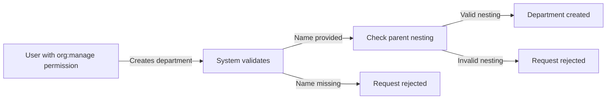

### Parent Department Hierarchy

THE system SHALL support a parent-child relationship between departments.

THE system SHALL limit department nesting to one level only.

IF a department already has a parent, THEN THE system SHALL not allow it to be set as a parent for another department.

THE system SHALL allow the parent department to be changed after creation.

WHEN changing a parent department, THE system SHALL enforce the one-level nesting limit.

THE system SHALL prevent circular parent relationships.

THE system SHALL allow departments to exist without a parent department (top-level departments).

WHEN viewing departments, THE system SHALL display the parent-child relationships.

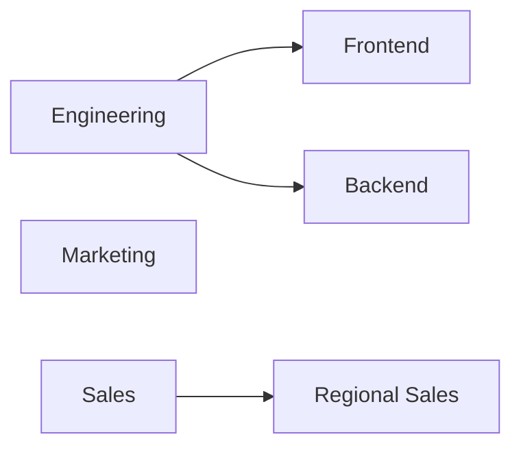

### Department Editing

Users with the organization management permission SHALL edit existing department names and descriptions.

THE system SHALL allow the department name to be changed.

THE system SHALL allow the department description to be changed.

THE system SHALL allow the parent department to be changed or removed.

WHEN editing a parent department, THE system SHALL enforce the one-level nesting limit.

IF the new parent relationship would violate the nesting limit, THEN THE system SHALL reject the edit.

THE system SHALL preserve all employee assignments to the department after editing.

WHEN a department is edited, THE system SHALL record the change in the activity log.

### Department Deletion

Users with the organization management permission SHALL delete departments.

WHEN a department is deleted, THE system SHALL clear the department field for all employees assigned to that department.

THE system SHALL NOT delete employees when their department is deleted.

THE system SHALL preserve all employee records and their historical data.

WHEN a department with child departments is deleted, THE system SHALL clear the parent reference from child departments.

Child departments SHALL become top-level departments (no parent) when their parent is deleted.

THE system SHALL allow deletion regardless of whether employees are assigned to the department.

WHEN a department is deleted, THE system SHALL record the deletion in the activity log.

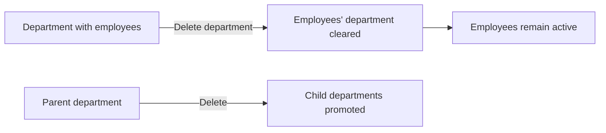

### Department Viewing and Employee Grouping

All employees within an organization SHALL view the list of departments.

THE system SHALL display the department name and description for each department.

THE system SHALL display the parent department relationship when viewing departments.

Employees SHALL use departments to group themselves for organizational purposes.

THE system SHALL allow employees to filter reports and lists by department.

THE system SHALL display the number of employees in each department.

THE system SHALL only show departments within the current organization context.

Departments SHALL be used for reporting aggregation and employee organization.

## Project Operations

Users with project management permission can create projects for the organization. Each project requires a name and color code for visual identification, with optional description, budget hours, start date, and end date. Projects have a status that can be active, archived, or completed. Users with project management permission can edit project details and change project status. When a project is archived or completed, no new timelogs can be added to it, but existing timelogs are preserved. Projects can only be deleted if they have no associated timelogs. Users with project viewing permission can see all projects. The project list is paginated and can be filtered by status to help users find relevant projects.

### Project Creation

WHEN a user with project management permission creates a project, THE system SHALL record the project with the organization.

THE system SHALL require a name for each project.

THE system SHALL require a color code for visual identification of each project.

THE system SHALL allow an optional description to be provided for the project.

THE system SHALL allow optional budget hours to be set, representing total estimated hours for the project.

THE system SHALL allow optional start date and end date to be specified for the project.

THE system SHALL set the initial project status to active upon creation.

If the end date is provided and precedes the start date, THE system SHALL reject the project creation.

If the user does not have project management permission, THE system SHALL reject the project creation request.

### Project Editing

WHEN a user with project management permission edits a project, THE system SHALL allow modification of the project name, description, color code, budget hours, start date, and end date.

THE system SHALL preserve all existing timelogs and task data when project details are edited.

If the user does not have project management permission, THE system SHALL reject the edit request.

If the end date is modified to precede the start date, THE system SHALL reject the change.

### Project Status Management

THE system SHALL maintain project status as one of: active, archived, or completed.

WHEN a user with project management permission changes a project status to archived or completed, THE system SHALL record the status change.

WHEN a project status is changed to archived, THE system SHALL prevent any new timelogs from being added to that project.

WHEN a project status is changed to completed, THE system SHALL prevent any new timelogs from being added to that project.

THE system SHALL preserve all existing timelogs on archived or completed projects.

If the user does not have project management permission, THE system SHALL reject the status change.

THE system SHALL allow status to be changed from archived back to active.

THE system SHALL allow status to be changed from completed back to active.

### Project Deletion

WHEN a user with project management permission requests deletion of a project, THE system SHALL check for associated timelogs.

If the project has no associated timelogs, THE system SHALL delete the project.

If the project has associated timelogs, THE system SHALL reject the deletion and prevent project removal.

If the user does not have project management permission, THE system SHALL reject the deletion request.

WHEN a project is deleted, THE system SHALL remove all associated tasks and project member assignments.

### Project Viewing and Listing

WHEN a user with project viewing permission accesses the project list, THE system SHALL display all projects in the organization.

THE system SHALL provide the project list in a paginated format.

THE system SHALL allow filtering of projects by status (active, archived, completed).

THE system SHALL display the project name, color code, status, and other details for each project in the list.

Employees SHALL be able to view projects they are assigned to, as defined in ProjectMember Operations.

If the user does not have project viewing permission and is not assigned to any projects, THE system SHALL not display any projects.

## ProjectMember Operations

Users with project management permission can assign employees to projects. Each project membership links an employee to a project with an assigned role of either member or project lead. An employee can be assigned to multiple projects simultaneously. Project leads have the ability to manage tasks within their assigned project. Users with project management permission can remove employees from projects when they are no longer needed. Employees can view which projects they are assigned to. The membership role determines what level of access the employee has within that specific project context.

### Project Membership Assignment

Users with project management permission SHALL be able to assign employees to projects within their organization.

When assigning an employee to a project, THE system SHALL record the employee, the project, and an assigned role.

THE assigned role SHALL be either "member" or "project lead".

An employee SHALL be able to be assigned to multiple projects simultaneously.

When assigning an employee to a project, THE system SHALL prevent duplicate membership (the same employee assigned to the same project more than once).

THE membership role determines the level of access the employee has within that specific project context:
- A project lead can manage tasks within their assigned project
- A member has standard project participation access

Users with project management permission SHALL be able to specify which role to assign when adding an employee to a project.

The assigned employee MUST be an active employee within the same organization as the project.

### Removing Project Members

Users with project management permission SHALL be able to remove employees from projects.

When an employee is removed from a project, THE system SHALL delete the project membership record.

Removing an employee from a project SHALL NOT delete or modify any tasks that were previously assigned to that employee within the project.

Removing an employee from a project SHALL NOT delete or modify any timelogs that the employee had logged against that project.

An employee who has been removed from a project SHALL no longer be able to create new timelogs for that project.

An employee who has been removed from a project SHALL no longer be able to start timers for that project.

### Viewing Assigned Projects

Employees SHALL be able to view a list of all projects they are assigned to.

The list of assigned projects SHALL display for each project: the project name, the employee's membership role (member or project lead), and the project status.

Employees SHALL be able to see their role within each assigned project to understand their access level.

Users with project management permission SHALL be able to view all project memberships for any project, including which employees are assigned and their roles.

## Task Operations

Project leads or users with project management permission can create tasks within a project. Each task has a title and can optionally include a description, estimated hours, due date, and an assigned employee who must be a project member. Tasks have a status that progresses through open, in-progress, completed, and closed. Tasks also have a priority level of low, medium, high, or urgent. Tasks can have a parent task to create one level of subtask nesting. Project leads can edit tasks within their project, and users with project management permission can edit any task. When task status changes, the system records the change with the timestamp, old status, new status, and who made the change. Employees can view tasks in projects they are assigned to. Tasks can be filtered by status, priority, and assigned employee, and sorted by due date, priority, or creation date.

### Task Creation

Project leads or users with project management permission can create tasks within a project.

THE SYSTEM SHALL allow project leads to create tasks within projects they are assigned to as project leads.

THE SYSTEM SHALL allow users with project management permission to create tasks in any project.

When creating a task, the title is required.
THE SYSTEM SHALL require a task title when creating a task.

THE SYSTEM SHALL allow an optional description to be provided when creating a task.

THE SYSTEM SHALL allow optional estimated hours to be specified when creating a task.

THE SYSTEM SHALL allow an optional due date to be set when creating a task.

THE SYSTEM SHALL require a priority level to be selected when creating a task, with options of low, medium, high, or urgent.

THE SYSTEM SHALL set the initial status of a newly created task to "open".

THE SYSTEM SHALL allow an optional assigned employee to be designated when creating a task, provided the employee is a member of the project.

If an employee is assigned during task creation and the employee is not a project member, THE SYSTEM SHALL reject the task creation.

THE SYSTEM SHALL allow an optional parent task to be specified when creating a task, creating a subtask relationship limited to one level of nesting.

### Task Assignment

Tasks can be assigned to employees who are members of the project.

THE SYSTEM SHALL allow a task to be assigned to an employee only if the employee is a member of the project containing the task.

THE SYSTEM SHALL allow the assigned employee on a task to be changed to a different project member.

THE SYSTEM SHALL allow a task to remain unassigned if no employee is designated.

When reassigning a task from one employee to another, THE SYSTEM SHALL verify that the new assignee is a project member.

If a task is reassigned to an employee who is not a project member, THE SYSTEM SHALL reject the assignment change.

### Task Status Progression

Tasks progress through defined status states as work is performed.

THE SYSTEM SHALL support four task statuses: open, in-progress, completed, and closed.

THE SYSTEM SHALL allow the task status to be changed from "open" to "in-progress".

THE SYSTEM SHALL allow the task status to be changed from "in-progress" to "completed".

THE SYSTEM SHALL allow the task status to be changed from "completed" to "closed".

THE SYSTEM SHALL allow task status transitions that skip intermediate states, such as moving directly from "open" to "completed".

When a task status is changed, THE SYSTEM SHALL record the change in the task history (see TaskHistory Operations for recording details).

### Task Priority Management

Tasks have priority levels that indicate their importance or urgency.

THE SYSTEM SHALL support four priority levels for tasks: low, medium, high, and urgent.

THE SYSTEM SHALL allow the priority of a task to be changed after creation.

THE SYSTEM SHALL allow project leads to change the priority of tasks within their projects.

THE SYSTEM SHALL allow users with project management permission to change the priority of any task.

### Subtask Management

Tasks can have subtasks to break down work into smaller components.

THE SYSTEM SHALL allow a task to be designated as a subtask by specifying a parent task.

THE SYSTEM SHALL limit subtask nesting to one level only—a subtask cannot have its own subtasks.

THE SYSTEM SHALL require that a subtask and its parent task belong to the same project.

If a subtask's parent task is specified and belongs to a different project, THE SYSTEM SHALL reject the subtask creation.

THE SYSTEM SHALL allow the parent task relationship to be removed, converting a subtask into a standalone task.

### Task Editing

Tasks can be modified after creation by authorized users.

THE SYSTEM SHALL allow project leads to edit tasks within projects where they serve as project leads.

THE SYSTEM SHALL allow users with project management permission to edit any task.

Editable task attributes include: title, description, status, priority, estimated hours, due date, and assigned employee.

THE SYSTEM SHALL allow employees to view tasks assigned to them, but editing is restricted to project leads and users with project management permission.

When a task's status is edited, THE SYSTEM SHALL record the status change in task history (see TaskHistory Operations).

### Task Viewing and Navigation

Employees can access and navigate tasks within their assigned projects.

THE SYSTEM SHALL allow employees to view tasks in projects they are assigned to.

THE SYSTEM SHALL display tasks with their title, description, status, priority, estimated hours, due date, and assigned employee.

THE SYSTEM SHALL provide pagination for task lists.

THE SYSTEM SHALL allow tasks to be filtered by status.

THE SYSTEM SHALL allow tasks to be filtered by priority.

THE SYSTEM SHALL allow tasks to be filtered by assigned employee.

THE SYSTEM SHALL allow tasks to be sorted by due date.

THE SYSTEM SHALL allow tasks to be sorted by priority.

THE SYSTEM SHALL allow tasks to be sorted by creation date.

THE SYSTEM SHALL allow multiple filters to be combined, such as filtering by both status and priority.

THE SYSTEM SHALL allow employees to see which tasks are assigned to them specifically.

## TaskHistory Operations

The system automatically records task status changes as history entries. Each history entry captures when the change occurred, the previous status, the new status, and which user made the change. Task history provides an audit trail for tracking task progress and understanding how tasks have evolved. History entries are created automatically when users with appropriate permissions change task status. Users can view the history to see the complete progression of a task through different statuses. Task history cannot be edited or deleted as it serves as an immutable record of task activity.

### Automatic Status Change Recording

WHEN a user with appropriate permissions changes the status of a task, THE system SHALL automatically create a task history entry.

The system SHALL create history entries without requiring any action from the user beyond the status change itself.

WHEN a task status is changed, THE system SHALL NOT allow the user to opt out of history recording.

THE system SHALL NOT support manual creation of task history entries; entries are created only through automatic status change recording.

### Task History Entry Details

WHEN a task history entry is created, THE system SHALL record the timestamp of when the status change occurred.

WHEN a task history entry is created, THE system SHALL record the previous status (old status) of the task.

WHEN a task history entry is created, THE system SHALL record the new status of the task.

WHEN a task history entry is created, THE system SHALL record the user who performed the status change.

Each task history entry SHALL contain exactly one timestamp, one old status, one new status, and one reference to the user who made the change.

### Viewing Task History

WHEN an employee views a task in a project they are assigned to, THE system SHALL allow them to view the complete task history.

THE system SHALL display task history entries in chronological order.

WHEN a user views task history, THE system SHALL show all recorded status transitions for that task.

Users with project management permissions SHALL be able to view task history for any task within projects they manage.

Project leads SHALL be able to view task history for tasks within their assigned projects.

### Immutable History Records

THE system SHALL NOT allow any user to edit a task history entry after it has been created.

THE system SHALL NOT allow any user to delete a task history entry.

Task history entries SHALL remain permanently associated with the task for which they were created.

Task history entries SHALL serve as an immutable audit trail of all status changes.

THE system SHALL preserve task history entries regardless of subsequent task modifications or deletions.

### Task Progress Tracking

The task history SHALL provide a complete audit trail showing how a task has progressed through different statuses.

Users SHALL be able to understand the complete status progression of a task by reviewing its history.

THE system SHALL record all status transitions including the initial status assignment when a task is created.

The task history SHALL enable identification of when specific status changes occurred and who authorized them.

## Timelog Operations

Employees can create timelogs to record time spent on work. Each timelog requires a date, duration in minutes, and a project that the employee is assigned to. Tasks are optional and must belong to the selected project. Timelogs can include an optional description of work done and a billable flag that defaults to true. Employees can only create timelogs for themselves. Employees can edit their own timelogs only while they are not part of an approved timesheet. Employees can delete their own timelogs only while they are not part of any submitted or approved timesheet. Users with time management permission can edit or delete any employee's timelogs. Users with view all time permission can see all employees' timelogs. Employees can view their own timelogs in a paginated list that can be filtered by date range, project, task, and billable status.

### Timelog Creation

THE system SHALL allow employees to create timelogs for recording time spent on work.

WHEN an employee creates a timelog, THE system SHALL require the employee to provide a date and a duration in minutes.

THE system SHALL require the employee to select a project for each timelog, and THE system SHALL validate that the employee is assigned to the selected project.

THE system SHALL allow the employee to optionally select a task for the timelog, WHERE a task is provided, THE system SHALL validate that the task belongs to the selected project.

THE system SHALL allow the employee to optionally provide a description of work performed.

THE system SHALL set the billable flag to true by default for each new timelog, and THE system SHALL allow the employee to change the billable flag to false.

THE system SHALL only allow employees to create timelogs for themselves, and THE system SHALL prevent employees from creating timelogs for other employees.

THE system SHALL associate each timelog with the employee who created it.

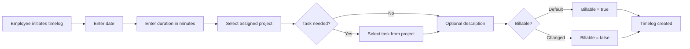

### Timelog Editing

THE system SHALL allow employees to edit their own timelogs.

IF a timelog is part of an approved timesheet, THEN THE system SHALL prevent the employee from editing that timelog.

IF a timelog is not part of an approved timesheet, THEN THE system SHALL allow the employee to modify the date, duration, project, task, description, and billable flag.

WHEN an employee edits a timelog's project, THE system SHALL validate that the employee is assigned to the new project.

WHEN an employee edits a timelog's task, THE system SHALL validate that the new task belongs to the selected project.

IF a user has the time management permission, THEN THE system SHALL allow that user to edit any employee's timelogs regardless of timesheet status.

WHEN a user with time management permission edits another employee's timelog, THE system SHALL allow modification of all timelog attributes including date, duration, project, task, description, and billable flag.

### Timelog Deletion

THE system SHALL allow employees to delete their own timelogs.

IF a timelog is part of a submitted timesheet, THEN THE system SHALL prevent the employee from deleting that timelog.

IF a timelog is part of an approved timesheet, THEN THE system SHALL prevent the employee from deleting that timelog.

IF a timelog is not part of any submitted or approved timesheet, THEN THE system SHALL allow the employee to delete the timelog.

IF a user has the time management permission, THEN THE system SHALL allow that user to delete any employee's timelogs regardless of timesheet status.

WHEN a timelog is deleted, THE system SHALL remove it from any draft timesheets that contain it.

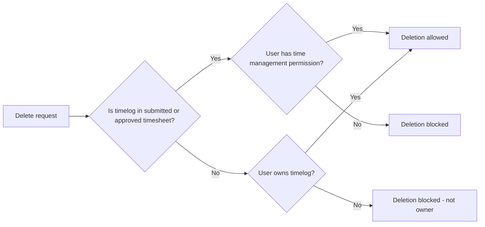

### Timelog Viewing

THE system SHALL allow employees to view their own timelogs.

IF a user has the view all time permission, THEN THE system SHALL allow that user to view all employees' timelogs within the organization.

THE system SHALL display timelogs in a paginated list.

THE system SHALL allow filtering timelogs by date range, showing only timelogs whose date falls within the specified start and end dates.

THE system SHALL allow filtering timelogs by project, showing only timelogs associated with the selected project.

THE system SHALL allow filtering timelogs by task, showing only timelogs associated with the selected task.

THE system SHALL allow filtering timelogs by billable status, showing only billable or only non-billable timelogs.

THE system SHALL allow combining multiple filters to narrow results.

THE system SHALL allow employees without the view all time permission to only see their own timelogs in filtered results.

### Manager Timelog Operations

IF a user has the time management permission, THEN THE system SHALL allow that user to edit any employee's timelogs.

IF a user has the time management permission, THEN THE system SHALL allow that user to delete any employee's timelogs.

WHEN a user with time management permission modifies another employee's timelog, THE system SHALL preserve the association with the original employee.

IF a user has the view all time permission, THEN THE system SHALL allow that user to view all timelogs across all employees in the organization.

WHEN a user with view all time permission views timelogs, THE system SHALL display the employee associated with each timelog.

THE system SHALL enforce that users without time management permission cannot edit or delete other employees' timelogs.

THE system SHALL enforce that users without view all time permission cannot view other employees' timelogs.

## Timesheet Operations

A timesheet collects timelogs for a specific week from Monday to Sunday. Employees create draft timesheets for a specific week, which automatically includes all their timelogs for that period. Employees can add or remove timelogs from a draft timesheet. To submit a timesheet for approval, it must contain at least one timelog and no other timesheet for the same week can already be submitted or approved. Users with time approval permission can view all submitted timesheets and approve or reject them. When a timesheet is approved, all included timelogs are locked and cannot be edited or deleted. When a timesheet is rejected, a reason must be provided, the timesheet returns to draft status, and the employee can modify and resubmit it. Employees can view their own timesheets. Timesheets can be filtered by status and date range.

### Weekly Timesheet Creation

An employee can create a draft timesheet for a specific week.

THE system SHALL create timesheets covering a seven-day period from Monday to Sunday.

When an employee creates a draft timesheet for a week, THE system SHALL automatically include all existing timelogs for that employee within that week's date range.

When an employee creates a timesheet for a specific week, THE system SHALL set the week start date to Monday and the week end date to Sunday.

Each timesheet SHALL belong to exactly one employee.

Each timesheet SHALL track its total hours as the sum of all included timelog durations.

When a draft timesheet is created, THE system SHALL set its status to draft.

When an employee creates a timesheet, THE system SHALL store the employee reference as the timesheet owner.

### Draft Timesheet Timelog Management

Employees can modify which timelogs are included in a draft timesheet.

WHILE a timesheet has draft status, THE system SHALL allow the employee to add timelogs to the timesheet.

WHILE a timesheet has draft status, THE system SHALL allow the employee to remove timelogs from the timesheet.

When a timelog is added to or removed from a timesheet, THE system SHALL recalculate the total hours based on the currently included timelogs.

When a timelog is added to a timesheet, THE system SHALL verify that the timelog belongs to the same employee and falls within the timesheet's week date range.

IF an employee attempts to add a timelog from outside the timesheet's week, THEN THE system SHALL reject the operation.

IF an employee attempts to add a timelog belonging to another employee, THEN THE system SHALL reject the operation.

### Timesheet Submission Requirements

Employees can submit draft timesheets for approval.

WHEN an employee submits a timesheet, THE system SHALL verify that the timesheet contains at least one timelog.

IF a timesheet has no timelogs, THEN THE system SHALL reject the submission.

WHEN an employee submits a timesheet, THE system SHALL verify that no other timesheet for the same employee and same week already has submitted or approved status.

IF another timesheet for the same week is already submitted or approved, THEN THE system SHALL reject the submission.

WHEN a timesheet is successfully submitted, THE system SHALL change the status to submitted.

WHEN a timesheet is successfully submitted, THE system SHALL record the submission timestamp.

THE system SHALL preserve the submitted timestamp to track when approval was requested.

### Timesheet Approval Process

Users with timesheet approval permission can review and approve submitted timesheets.

WHEN a user with time approval permission views timesheets, THE system SHALL display all submitted timesheets across the organization.

WHEN a user with time approval permission approves a timesheet, THE system SHALL change the timesheet status to approved.

WHEN a timesheet is approved, THE system SHALL record the reviewer who performed the approval.

WHEN a timesheet is approved, THE system SHALL record the review timestamp.

WHEN a timesheet is approved, THE system SHALL lock all timelogs included in that timesheet.

WHILE a timelog is locked due to approved timesheet inclusion, THE system SHALL prevent any edits to that timelog.

WHILE a timelog is locked due to approved timesheet inclusion, THE system SHALL prevent deletion of that timelog.

The approved timesheet with locked timelogs represents finalized time records that cannot be modified by employees.

### Timesheet Rejection and Resubmission

Users with timesheet approval permission can reject submitted timesheets.

WHEN a user with time approval permission rejects a timesheet, THE system SHALL require a rejection reason to be provided.

IF no rejection reason is provided, THEN THE system SHALL reject the rejection operation.

WHEN a timesheet is rejected, THE system SHALL change the timesheet status back to draft.

WHEN a timesheet is rejected, THE system SHALL store the rejection reason.

WHEN a timesheet is rejected, THE system SHALL record the reviewer who performed the rejection.

WHEN a timesheet is rejected, THE system SHALL record the review timestamp.

The rejection reason SHALL be visible to the employee who owns the timesheet.

WHEN a rejected timesheet returns to draft status, THE system SHALL allow the employee to modify the included timelogs.

WHEN a rejected timesheet returns to draft status, THE system SHALL allow the employee to resubmit the timesheet after making corrections.

The employee can address the rejection reason and submit the updated timesheet following the standard submission requirements.

### Timesheet Status Workflow

Timesheets progress through a defined status workflow.

THE system SHALL support the following timesheet statuses: draft, submitted, approved, and rejected.

A newly created timesheet SHALL have draft status.

WHEN a draft timesheet is submitted, THE system SHALL transition the status to submitted.

WHEN a submitted timesheet is approved, THE system SHALL transition the status to approved.

WHEN a submitted timesheet is rejected, THE system SHALL transition the status back to draft.

WHILE a timesheet has draft status, THE system SHALL allow modifications to included timelogs.

WHILE a timesheet has submitted status, THE system SHALL prevent modifications to included timelogs by the employee.

WHILE a timesheet has approved status, THE system SHALL prevent all modifications to included timelogs.

The status transitions ensure proper approval workflow and data integrity for finalized time records.

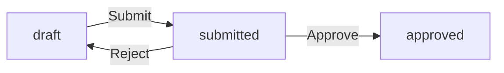

### Timesheet Viewing and Filtering

Employees can view their own timesheets.

THE system SHALL display a list of timesheets belonging to the logged-in employee.

THE system SHALL support pagination for the timesheet list.

THE system SHALL allow filtering timesheets by status.

THE system SHALL allow filtering timesheets by date range.

When filtering by date range, THE system SHALL show timesheets whose week falls within or overlaps the specified range.

Users with timesheet viewing permission for all employees can view timesheets across the organization.

THE system SHALL display key information for each timesheet including the week start date, week end date, status, total hours, and submission date if applicable.

For approved or rejected timesheets, THE system SHALL display the reviewer information and review date.

For rejected timesheets, THE system SHALL display the rejection reason.

## Timer Operations

Employees can start a timer to track work time in real-time. Starting a timer requires selecting a project, with task selection being optional. Each employee can have only one active timer at a time. While a timer is running, employees can edit the description and change the project or task. When an employee stops their timer, the system creates a timelog with the calculated duration rounded to the nearest minute. Employees can discard their timer without creating a timelog. Employees can view their currently running timer. Timers do not stop automatically and will continue running until the employee stops or discards them. The timer records the start timestamp, project, task, and description for the time tracking session.

### Starting Timer

### Timer Start Operation

THE system SHALL allow employees to start a timer for real-time time tracking.

WHEN an employee starts a timer, THE system SHALL require the employee to select a project.

WHEN an employee starts a timer, THE system SHALL allow optional task selection within the chosen project.

WHEN an employee starts a timer, THE system SHALL allow the employee to enter an optional description of the work being tracked.

THE system SHALL permit only one active timer per employee at any given time.

IF an employee already has an active timer and attempts to start a new timer, THE system SHALL reject the request.

WHEN a timer is successfully started, THE system SHALL record the start timestamp, selected project, optional task, and optional description.

WHEN an employee starts a timer, THE system SHALL only allow selection of projects to which the employee is assigned as a project member.

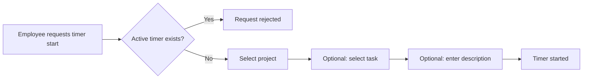

### Viewing Active Timer

### Timer Visibility

THE system SHALL allow employees to view their currently running timer.

WHEN an employee views their active timer, THE system SHALL display the start timestamp, project, task (if selected), and description (if entered).

WHEN an employee has no active timer, THE system SHALL indicate that no timer is currently running.

IF an employee attempts to view another employee's timer, THE system SHALL reject the request.

THE system SHALL display the elapsed time since the timer was started.

### Editing Running Timer

### Timer Modification

THE system SHALL allow employees to edit the description of a running timer.

THE system SHALL allow employees to change the project of a running timer.

WHEN an employee changes the project of a running timer, THE system SHALL allow the employee to select any project to which they are assigned.

WHEN an employee changes the project of a running timer, THE system SHALL clear the previously selected task if the new project does not contain that task.

THE system SHALL allow employees to change or add the task of a running timer.

THE system SHALL allow employees to remove the task from a running timer.

WHEN an employee edits a running timer, THE system SHALL preserve the original start timestamp.

IF an employee attempts to edit a timer they did not start, THE system SHALL reject the request.

### Stopping Timer

### Timer Stop Operation

THE system SHALL allow employees to stop their running timer.

WHEN an employee stops their timer, THE system SHALL create a timelog with the calculated duration.

THE system SHALL calculate the timer duration as the difference between the stop timestamp and the start timestamp.

THE system SHALL round the calculated duration to the nearest minute when creating the timelog.

WHEN a timer is stopped, THE system SHALL associate the newly created timelog with the project that was selected on the timer.

WHEN a timer is stopped and a task was selected, THE system SHALL associate the newly created timelog with that task.

WHEN a timer is stopped, THE system SHALL copy the timer description to the timelog description.

WHEN a timer is stopped, THE system SHALL set the timelog date to the date when the timer was started.

THE system SHALL set the billable flag on the newly created timelog to the default value of true.

WHEN a timer is stopped, THE system SHALL no longer consider the timer as active.

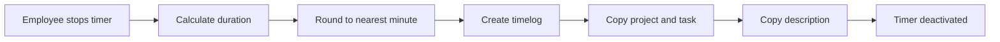

### Discarding Timer

### Timer Discard Operation

THE system SHALL allow employees to discard their running timer.

WHEN an employee discards their timer, THE system SHALL NOT create a timelog.

WHEN a timer is discarded, THE system SHALL permanently remove the timer record.

WHEN a timer is discarded, THE system SHALL no longer consider the timer as active.

THE system SHALL allow an employee to discard a timer regardless of how long it has been running.

IF an employee attempts to discard a timer they did not start, THE system SHALL reject the request.

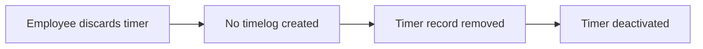

### Timer Duration Behavior

### Timer Continuation Rules

THE system SHALL NOT automatically stop a timer after any duration.

THE system SHALL allow a timer to continue running indefinitely until the employee stops or discards it.

WHEN an employee forgets to stop their timer, THE system SHALL NOT automatically stop or discard the timer.

THE system SHALL not impose any maximum duration limit on a running timer.

THE system SHALL continue tracking time accurately regardless of how long the timer has been running.

## ActivityLog Operations

The system automatically records significant actions as activity log entries. Each entry includes when the action occurred, which user performed it, what type of action was taken, and what entity was affected. The system logs actions such as employees being invited, deactivated, or reactivated, contracts being created or edited, projects being created, archived, completed, or deleted, task status changes, timesheets being submitted, approved, or rejected, and role assignments or changes. Users with organization management permission can view the full activity log. The activity log is paginated and can be filtered by action type, user, and date range to help find specific events. Activity logs cannot be edited or deleted as they serve as permanent audit records.

### Automatic Action Logging

THE SYSTEM SHALL automatically create an activity log entry when a significant action occurs within the organization.

Each activity log entry SHALL include a timestamp recording when the action occurred.

Each activity log entry SHALL include the user who performed the action.

Each activity log entry SHALL include the action type indicating what kind of action was taken.

Each activity log entry SHALL include the target entity reference identifying what was affected by the action.

Each activity log entry SHALL include optional details providing additional context about the action.

Activity log entries SHALL be automatically created by the system without user intervention.

Activity log entries SHALL be scoped to the organization in which the action occurred.

### Employee Management Activity Logging

WHEN an employee is invited to the organization, THE SYSTEM SHALL create an activity log entry recording the employee invitation action.

WHEN an employee is deactivated, THE SYSTEM SHALL create an activity log entry recording the deactivation action.

WHEN an employee is reactivated, THE SYSTEM SHALL create an activity log entry recording the reactivation action.

Each employee management log entry SHALL capture the affected employee and the user who performed the action.

### Contract Activity Logging

WHEN a contract is created for an employee, THE SYSTEM SHALL create an activity log entry recording the contract creation action.

WHEN a contract is edited, THE SYSTEM SHALL create an activity log entry recording the contract modification action.

Each contract log entry SHALL identify the affected employee and contract, and capture the user who performed the action.

### Project Lifecycle Activity Logging

WHEN a project is created, THE SYSTEM SHALL create an activity log entry recording the project creation action.

WHEN a project is archived, THE SYSTEM SHALL create an activity log entry recording the archival action.

WHEN a project is completed, THE SYSTEM SHALL create an activity log entry recording the completion action.

WHEN a project is deleted, THE SYSTEM SHALL create an activity log entry recording the deletion action.

Each project lifecycle log entry SHALL identify the affected project and capture the user who performed the action.

### Task Status Activity Logging

WHEN a task status is changed, THE SYSTEM SHALL create an activity log entry recording the status transition action.

Each task status change log entry SHALL capture the old status value, the new status value, the affected task, and the user who made the change.

### Timesheet Decision Activity Logging

WHEN a timesheet is submitted, THE SYSTEM SHALL create an activity log entry recording the submission action.

WHEN a timesheet is approved, THE SYSTEM SHALL create an activity log entry recording the approval decision.

WHEN a timesheet is rejected, THE SYSTEM SHALL create an activity log entry recording the rejection decision.

Each timesheet decision log entry SHALL identify the affected timesheet, the employee who owns the timesheet, and the user who performed the action.

### Role Assignment Activity Logging

WHEN a role is assigned to an employee, THE SYSTEM SHALL create an activity log entry recording the role assignment action.

WHEN an employee's role is changed, THE SYSTEM SHALL create an activity log entry recording the role change action.

Each role assignment log entry SHALL capture the affected employee, the previous role (if applicable), the new role, and the user who performed the action.

### Activity Log Viewing and Filtering

Users with the organization management permission SHALL be able to view the full activity log for their organization.

THE SYSTEM SHALL present the activity log in a paginated format.

THE SYSTEM SHALL allow filtering the activity log by action type to show only entries of a specific action category.

THE SYSTEM SHALL allow filtering the activity log by user to show only entries performed by a specific user.

THE SYSTEM SHALL allow filtering the activity log by date range to show only entries within a specific time period.

Multiple filters MAY be combined to narrow down the activity log results.

Users without the organization management permission SHALL NOT be able to view the organization's activity log.

### Permanent Audit Records

THE SYSTEM SHALL store activity log entries as permanent audit records.

Activity log entries SHALL NOT be editable after creation.

Activity log entries SHALL NOT be deletable by any user.

Activity log entries SHALL be preserved indefinitely to maintain a complete audit trail of organizational actions.

# Error Scenarios and Edge Cases

Business-level error scenarios, edge case coverage, and expected system behaviors for exceptional conditions.

## Organization Error Scenarios

Organization owners cannot delete an organization if there are pending timesheets awaiting approval or rejection, as all timesheets must be resolved before deletion. An organization cannot be deleted while there are active employee contracts, ensuring all employment relationships are properly terminated first. When an organization owner attempts to delete their organization, the system checks for these blocking conditions and prevents the action with a clear explanation. If a user is the sole owner of an organization, they must either transfer ownership to another member or delete the organization before they can delete their user account. Users who belong to multiple organizations can only work within one organization context at a time, and all data access is strictly scoped to the currently selected organization. Organization settings cannot be modified by users without the org:manage permission.

### Organization Deletion Blockers

### Pending Timesheets Block Deletion

IF there are timesheets with status "submitted" awaiting approval or rejection, THEN THE SYSTEM SHALL prevent organization deletion and inform the organization owner that all timesheets must be resolved first.

### Active Employee Contracts Block Deletion

IF there are any employee contracts with no end date or with an end date in the future, THEN THE SYSTEM SHALL prevent organization deletion and inform the organization owner that all employee contracts must be ended before deletion.

### Deletion Pre-Check Process

WHEN an organization owner requests to delete their organization, THE SYSTEM SHALL check for pending timesheets and active contracts before processing the deletion request.

IF blocking conditions exist, THE SYSTEM SHALL display a clear message indicating which conditions prevent deletion and what actions must be taken to resolve them.

### Resolving Blocking Conditions

To proceed with organization deletion, the organization owner SHALL first approve or reject all submitted timesheets.

To proceed with organization deletion, the organization owner SHALL end all active employee contracts by setting appropriate end dates.

### Sole Owner Account Deletion Restriction

### Sole Owner Cannot Delete Account

IF a user attempts to delete their account while they are the sole owner of an organization, THEN THE SYSTEM SHALL prevent the account deletion.

### Required Actions Before Account Deletion

WHEN a sole owner attempts to delete their account, THE SYSTEM SHALL require the user to either transfer ownership to another organization member or delete the organization before proceeding.

### Ownership Transfer Prerequisites

WHEN transferring organization ownership, THE SYSTEM SHALL require that the new owner is an existing member of the organization.

IF there are no other members in the organization to transfer ownership to, THEN THE SYSTEM SHALL require the user to delete the organization first.

### Account Deletion with Multiple Organizations

IF a user belongs to multiple organizations and is the sole owner of at least one, THEN THE SYSTEM SHALL prevent account deletion until all sole ownership situations are resolved.

The user SHALL resolve sole ownership for each affected organization before their account can be deleted.

### Organization Settings Permission Errors

### Unauthorized Settings Access

IF a user without the "org:manage" permission attempts to modify organization settings, THEN THE SYSTEM SHALL reject the request.

### Settings Modification Requirements

WHEN a user attempts to modify organization settings, THE SYSTEM SHALL verify that the user has the "org:manage" permission before allowing changes.

### Unauthorized Currency or Timezone Changes

IF a user without "org:manage" permission attempts to change the organization's currency or timezone, THEN THE SYSTEM SHALL reject the request.

### Unauthorized Logo Changes

IF a user without "org:manage" permission attempts to upload or change the organization's logo, THEN THE SYSTEM SHALL reject the request.

### View vs Edit Distinction

While employees can view organization information, THE SYSTEM SHALL restrict all modification capabilities to users with the "org:manage" permission.

### Organization Deletion Cascade Effects

### Employee Data Deletion

WHEN an organization is successfully deleted, THE SYSTEM SHALL permanently delete all employee records associated with that organization.

### Project and Task Deletion

WHEN an organization is deleted, THE SYSTEM SHALL permanently delete all projects, tasks, and task history entries associated with that organization.

### Time Data Deletion

WHEN an organization is deleted, THE SYSTEM SHALL permanently delete all timelogs, timesheets, and timer records associated with that organization.

### Department Deletion

WHEN an organization is deleted, THE SYSTEM SHALL permanently delete all department records associated with that organization.

### Role Deletion

WHEN an organization is deleted, THE SYSTEM SHALL permanently delete all custom roles defined within that organization.

### Owner Account Preservation

WHEN an organization is deleted, THE owner's user account SHALL remain active but SHALL no longer be associated with the deleted organization.

### Activity Log Deletion

WHEN an organization is deleted, THE SYSTEM SHALL permanently delete all activity log entries associated with that organization.

### Organization Data Isolation Requirements

### Cross-Organization Data Access Prevention

IF a user attempts to access data from an organization they are not currently selected in, THEN THE SYSTEM SHALL reject the request.

### Organization Context Enforcement

THE SYSTEM SHALL scope all data access operations to the user's currently selected organization context.

### Multi-Organization User Restrictions

WHEN a user belongs to multiple organizations, THE SYSTEM SHALL only allow the user to work within one organization context at a time.

### Data Leakage Prevention

THE SYSTEM SHALL ensure that employees in one organization cannot see any data from another organization, including employee lists, projects, tasks, or time records.

### API Context Validation

Every request to the system SHALL include the organization context, and THE SYSTEM SHALL validate that the authenticated user belongs to that organization before processing any data operation.

### Organization Configuration Validation Errors

### Organization Name Required

IF an organization is created or updated without a name, THEN THE SYSTEM SHALL reject the request with a validation error.

### Currency Selection Required

IF an organization is created without specifying a currency, THEN THE SYSTEM SHALL reject the request with a validation error.

### Timezone Selection Required

IF an organization is created without specifying a timezone, THEN THE SYSTEM SHALL reject the request with a validation error.

### Fiscal Start Month Required

IF an organization is created without specifying a fiscal start month, THEN THE SYSTEM SHALL reject the request with a validation error.

### Invalid Currency Value

IF an invalid currency code is provided during organization creation or settings update, THEN THE SYSTEM SHALL reject the request with an appropriate error message.

### Invalid Timezone Value

IF an invalid timezone identifier is provided during organization creation or settings update, THEN THE SYSTEM SHALL reject the request with an appropriate error message.

### Organization Logo Upload Errors

### Invalid File Format

IF a user attempts to upload a logo file in an unsupported format, THEN THE SYSTEM SHALL reject the upload and inform the user of the accepted file formats.

### File Size Restrictions

IF a user attempts to upload a logo file that exceeds the maximum allowed file size, THEN THE SYSTEM SHALL reject the upload and inform the user of the size limit.

### Permission Required for Logo Upload

IF a user without "org:manage" permission attempts to upload a logo, THEN THE SYSTEM SHALL reject the request.

### Logo Upload During Organization Creation

WHEN a user creates a new organization, THE logo image is optional.

IF a logo upload fails during organization creation, THE SYSTEM SHALL still allow the organization to be created without a logo and inform the user of the upload failure.

## User Error Scenarios

Users cannot sign up with an email address that is already registered in the system, and must either log in with existing credentials or use a different email. When a user deletes their account, the system prevents the action if they are the sole owner of any organization, requiring them to transfer ownership or delete the organization first. If a deleted user had employee records in other organizations, those records are marked as deactivated rather than deleted, preserving historical data. Users cannot change their password without providing their current password for verification. When a user belongs to multiple organizations, they must select which organization to work in after logging in, and cannot proceed without making a selection. Profile updates are global and affect the user's presence across all organizations they belong to.

### Email Already Registered

When a user attempts to sign up with an email address that is already registered in the system, THE SYSTEM SHALL reject the registration request.

THE SYSTEM SHALL display an error message indicating that the email is already in use.

THE SYSTEM SHALL not reveal whether the email belongs to an active account or a deleted account.

THE USER SHALL be prompted to either log in with existing credentials or use a different email address.

This prevents duplicate accounts and ensures each email is associated with exactly one user account.

### Sole Owner Account Deletion Restriction

When a user who is the sole owner of an organization attempts to delete their account, THE SYSTEM SHALL reject the deletion request.

THE SYSTEM SHALL prevent the account deletion until the user takes one of the following actions:
- Transfer ownership of the organization to another employee
- Delete the organization entirely

THE SYSTEM SHALL display a clear error message listing the organizations where the user is the sole owner.

THE SYSTEM SHALL provide guidance on how to transfer ownership or delete the organization.

This restriction ensures organizations are not left without an owner who can manage settings and members.

### Employee Record Deactivation on Account Deletion

When a user deletes their account and has employee records in organizations where they are not the sole owner, THE SYSTEM SHALL mark those employee records as deactivated.

THE SYSTEM SHALL preserve all historical data associated with the deactivated employee, including timelogs, timesheets, and task assignments.

THE SYSTEM SHALL NOT delete the employee records from the organization's data.

Deactivated employees cannot log time or submit timesheets.

Organization administrators can view the deactivated employee's historical data for reporting and auditing purposes.

### Password Change Requires Current Password

When a user requests to change their password, THE SYSTEM SHALL require the user to provide their current password for verification.

THE SYSTEM SHALL reject the password change if the current password provided is incorrect.

THE SYSTEM SHALL display an error message indicating that the current password is invalid.

THE USER SHALL be required to provide a new password that meets the system's security requirements.

THE SYSTEM SHALL NOT allow password changes without current password verification, even for users with administrative permissions.

This verification ensures that only the authenticated account owner can change the password, preventing unauthorized password resets.

### Organization Selection Required After Login

When a user who belongs to multiple organizations logs in, THE SYSTEM SHALL require the user to select which organization to work in.

THE SYSTEM SHALL display a list of all organizations the user belongs to.

THE USER SHALL not be able to proceed with any organization-scoped operations until an organization is selected.

THE SYSTEM SHALL establish the selected organization as the current working context for all subsequent operations.

This ensures all data access and operations are properly scoped to a single organization.

### Global Profile Update Effects

When a user updates their profile information (display name, avatar image, or phone number), THE SYSTEM SHALL apply the changes globally across all organizations the user belongs to.

THE SYSTEM SHALL update the user's profile in all organizations simultaneously.

Other users in any organization where the user is a member SHALL see the updated profile information.

THE SYSTEM SHALL NOT allow profile changes to be scoped to individual organizations.

This ensures a consistent user identity across all organizations, reducing confusion when the same person appears in multiple organizations.

## Role Error Scenarios

Built-in roles (Owner, Manager, Employee) cannot be deleted as they are system-defined and essential for organization operation. Custom roles cannot be deleted if any employees are currently assigned to that role, requiring role reassignment before deletion. Organization owners cannot remove the org:manage permission from the Owner role or modify built-in role permissions. Each employee must have exactly one role assigned, preventing multiple role assignments or missing role scenarios. When a custom role is edited, all employees assigned to that role immediately receive the updated permissions. Role names must be unique within an organization to prevent confusion. The permission system validates that users have appropriate permissions before allowing sensitive operations.

### Built-in Role Deletion Prevention

The system SHALL prevent deletion of built-in roles (Owner, Manager, Employee).

When a user attempts to delete a built-in role, the system SHALL reject the request and display an error indicating that built-in roles cannot be deleted.

Built-in roles are essential for organization operation and are defined at organization creation, making them permanent system roles.

This constraint applies regardless of the user's permission level, including organization owners with full management access.

### Custom Role Deletion Blocked by Active Assignments

The system SHALL prevent deletion of a custom role when any employees are currently assigned to that role.

When a user attempts to delete a custom role with assigned employees, the system SHALL reject the request and display an error indicating that the role cannot be deleted while employees are assigned.

The user must first reassign all affected employees to other roles before the custom role can be deleted.

This prevents employees from being left without a valid role assignment, which would violate the requirement that each employee must have exactly one role.

### Built-in Role Permission Immutability

The system SHALL prevent modification of permissions for built-in roles (Owner, Manager, Employee).

When a user attempts to edit the permissions of a built-in role, the system SHALL reject the request and display an error indicating that built-in role permissions cannot be modified.

Organization owners cannot remove the org:manage permission from the Owner role.

Built-in roles have predefined permission sets that ensure consistent functionality across all organizations, and these cannot be altered to maintain system integrity.

### Single Role Assignment Requirement

THE system SHALL ensure each employee has exactly one role assigned at all times.

When a role assignment is attempted that would leave an employee without a role, the system SHALL reject the request.

When a role assignment is attempted that would assign multiple roles to a single employee, the system SHALL reject the request.

Role changes must be performed as a reassignment operation, replacing the current role with a new role in a single transaction.

This constraint prevents scenarios where employees have no access permissions or conflicting permission sets from multiple roles.

### Role Assignment Validation

The system SHALL validate that a role exists and belongs to the current organization before assigning it to an employee.

When assigning a role to an employee, the system SHALL verify that the role is available in the current organization context.

If an invalid or non-existent role is specified during assignment, the system SHALL reject the request with an appropriate error message.

This validation prevents cross-organization role assignment and ensures data isolation between organizations.

### Custom Role Name Uniqueness

The system SHALL require unique role names within each organization.

When a user attempts to create a custom role with a name that already exists in the organization, the system SHALL reject the request.

When a user attempts to rename a custom role to a name that already exists, the system SHALL reject the request.

This uniqueness constraint prevents confusion when managing and assigning roles, ensuring each role can be clearly identified by its name.

### Permission Validation Before Operations

THE system SHALL validate that the current user has appropriate permissions before allowing sensitive operations.

When a user attempts an operation requiring specific permissions, the system SHALL check the user's assigned role permissions.

If the user lacks the required permission, the system SHALL reject the request and display an error indicating insufficient permissions.

This validation applies to all permission-protected operations including organization management, employee management, project management, time management, timesheet approval, and report viewing.

### Immediate Effect of Role Permission Changes

When a custom role's permissions are edited, THE system SHALL immediately apply the updated permissions to all employees assigned to that role.

All affected employees SHALL receive the new permission set without requiring individual updates.

This immediate propagation ensures consistency and prevents scenarios where employees with the same role have different access levels.

The change takes effect for the current session of all affected employees, modifying their access rights in real-time.

### Owner Role Assignment Constraints

The system SHALL ensure that at least one employee in each organization always has the Owner role.

When an attempt is made to remove the Owner role from the sole owner of an organization, the system SHALL reject the request.

Before an owner can transfer ownership, another employee must first be assigned the Owner role.

This constraint prevents organizations from being left without an owner who can manage the organization and its members.

### Manager Role Permission Boundaries

The Manager role SHALL have permissions for employee management, project management, timesheet approval, and report viewing.

Managers SHALL NOT have permission to manage organization settings (org:manage permission).

Managers SHALL NOT have permission to manage roles or modify role assignments beyond what employee:manage permission allows.

These boundaries ensure that managers can perform operational duties without accessing organization-level configuration or security settings.

### Employee Role Minimum Permissions

The Employee role SHALL include permissions for personal time tracking, timesheet submission, and viewing own data.

Employees SHALL NOT have permissions to manage other employees, approve timesheets, view all employees' data, or manage organization settings.

Employees can only create and edit their own timelogs and timesheets.

These minimum permissions ensure that basic employees have access to essential time tracking functions without accessing management features.

### Custom Role Permission Assignment Validation

The system SHALL validate that permissions assigned to a custom role are from the defined permission set.

When creating or editing a custom role, the system SHALL only accept valid permission values: org:manage, employee:manage, employee:view, project:manage, project:view, time:manage, time:approve, time:view_all, and report:view.

If an invalid or unrecognized permission is specified, the system SHALL reject the request.

This validation ensures that custom roles only grant permissions that the system can interpret and enforce.

## Employee Error Scenarios

When inviting an employee by email, if the email already has a pending invitation, the system prevents duplicate invitations. Deactivated employees cannot log time, submit timesheets, or access project assignments, though their historical data remains preserved. Reactivating a deactivated employee restores their ability to track time and submit timesheets. When a department is deleted, employees previously assigned to that department have their department field cleared rather than being deleted. Employees cannot be invited to projects they are not members of for task assignments. The employee list pagination handles edge cases where employees are deactivated mid-search, maintaining consistent result counts. Users without employee:manage permission cannot invite, edit, or deactivate employees.

### Duplicate Invitation Prevention

WHEN a user with employee:manage permission invites an employee by email that already has a pending invitation to the organization, THE system SHALL reject the invitation request and display an error message indicating that an invitation is already pending for that email address.

THE system SHALL maintain only one pending invitation per email address per organization at any time.

IF a user attempts to create a duplicate invitation, THEN THE system SHALL not create a new invitation record.

THE system SHALL allow a new invitation to be sent after the pending invitation expires or is cancelled.

### Deactivated Employee Restrictions

WHILE an employee has deactivated status, THE system SHALL prevent the employee from creating timelogs.

WHILE an employee has deactivated status, THE system SHALL prevent the employee from starting a timer.

WHILE an employee has deactivated status, THE system SHALL prevent the employee from creating or submitting timesheets.

WHILE an employee has deactivated status, THE system SHALL prevent the employee from editing existing timelogs.

WHEN a deactivated employee attempts to access time tracking features, THE system SHALL display an error message indicating that their account is deactivated and they cannot perform this action.

THE system SHALL preserve all historical timelogs, timesheets, and project assignments for deactivated employees without modification.

### Employee Reactivation

WHEN a user with employee:manage permission reactivates a deactivated employee, THE system SHALL change the employee status to active.

WHEN an employee is reactivated, THE system SHALL restore their ability to create timelogs, start timers, and submit timesheets.

WHEN an employee is reactivated, THE system SHALL not automatically restore any previous project assignments that may have been removed during deactivation.

THE system SHALL allow the reactivated employee to immediately access all features available to their role without additional verification steps.

### Department Deletion Effects on Employees

WHEN a department is deleted, THE system SHALL set the department reference to null for all employees previously assigned to that department.

THE system SHALL not delete or deactivate any employees when their department is deleted.

WHEN an employee's department is cleared due to department deletion, THE system SHALL preserve all other employee data including position, employment type, and status.

THE system SHALL not require employees to be reassigned to another department after their department is deleted.

### Task Assignment Requirements

WHEN a user assigns an employee to a task, THE system SHALL verify that the employee is a member of the project to which the task belongs.

IF an employee is not a member of the project, THEN THE system SHALL reject the task assignment and display an error message.

THE system SHALL only allow project members to be assigned to tasks within that project.

WHEN an employee is removed from a project, THE system SHALL not automatically unassign them from tasks in that project, but they will no longer be able to log time against those tasks.

### Invitation Flow Scenarios

WHEN an invitation is sent to an email address that already has a user account, THE system SHALL immediately add the user to the organization as an employee with the specified role.

WHEN an invitation is sent to an email address that does not have a user account, THE system SHALL create a pending invitation record.

WHEN a user signs up with an email address that has pending invitations, THE system SHALL automatically add the user to all organizations with pending invitations for that email.

THE system SHALL display the newly created employee in the organization's employee list with active status when the invited user already has an account.

THE system SHALL display pending invitations separately from the active employee list.

### Employment Type Validation

WHEN a user with employee:manage permission creates or edits an employee record, THE system SHALL require an employment type to be specified.

IF an employment type is not provided when creating or editing an employee, THEN THE system SHALL reject the request.

THE system SHALL accept only the following employment types: full-time, part-time, contractor, or intern.

THE system SHALL allow the employment type to be changed for active employees.

### Employee Status Management

THE system SHALL only allow an employee to have one status at a time: active or deactivated.

WHEN an employee is deactivated, THE system SHALL preserve their complete employee record including department, position, employment type, and role.

WHEN an employee is reactivated, THE system SHALL restore their previous role, department, position, and employment type unless explicitly changed.

THE system SHALL not allow multiple status transitions within a single operation.

WHEN viewing the employee list, THE system SHALL display all employees including both active and deactivated statuses, allowing filtering by status.

## Contract Error Scenarios

An employee can only have one active contract at any given time, and creating a new contract automatically ends the previous active contract by setting its end date. Past contracts cannot be edited as they serve as immutable historical records of employment terms. Contract end dates must be on or after the start date, preventing invalid date ranges. When a new contract is created, the system automatically sets the previous contract's end date to the day before the new contract starts to prevent gaps or overlaps. Users without employee:manage permission cannot create or edit contracts for other employees. Working hours per week must be a positive number. The pay rate must be specified and cannot be zero or negative.

### Single Active Contract Enforcement

IF an employee already has an active contract, THE system SHALL automatically end the previous active contract when creating a new contract.

IF a user attempts to create a new active contract for an employee without providing a start date, THE system SHALL reject the request.

An employee SHALL have exactly one active contract at any given time.

WHEN a new contract is created for an employee with an existing active contract, THE system SHALL ensure no overlap exists between contract periods.

### Automatic Previous Contract Termination

WHEN a new contract is created for an employee who already has an active contract, THE system SHALL automatically set the previous contract's end date to the day before the new contract's start date.

IF the new contract's start date is set, THE system SHALL calculate the previous contract's end date as one day prior to ensure continuous employment records without gaps.

WHEN the automatic termination occurs, THE system SHALL preserve all details of the previous contract as an immutable historical record.

### Past Contract Immutability

IF a user attempts to edit a contract that has an end date in the past, THE system SHALL reject the request.

IF a user attempts to edit a contract that is not the current active contract for the employee, THE system SHALL reject the request.

Past contracts SHALL serve as immutable historical records and cannot be modified after their end date has passed.

WHEN a contract becomes past (end date reached), THE system SHALL prevent any further modifications to the contract details.

### Contract Date Validation

WHEN a contract is created with an end date, THE system SHALL validate that the end date is on or after the start date.

IF a contract's end date is specified before the start date, THE system SHALL reject the request.

WHEN an ongoing contract is created without an end date, THE system SHALL accept null as the end date value.

IF a contract start date is not provided, THE system SHALL reject the request.

WHEN calculating automatic contract termination dates, THE system SHALL ensure no gap or overlap exists between consecutive contracts for the same employee.

### Contract Field Requirements

WHEN a contract is created, THE system SHALL require a pay rate that is a positive numeric value.

IF the pay rate is zero or negative, THE system SHALL reject the request.

WHEN a contract is created, THE system SHALL require working hours per week to be a positive integer.

IF working hours per week is zero or negative, THE system SHALL reject the request.

The notes field SHALL be optional and may be left empty during contract creation or editing.

IF no notes are provided, THE system SHALL accept the contract without requiring notes content.

### Contract Permission Requirements

IF a user without employee management permission attempts to create a contract for an employee, THE system SHALL reject the request.

IF a user without employee management permission attempts to edit a contract, THE system SHALL reject the request.

WHEN a user with employee management permission edits a contract, THE system SHALL only allow modifications to the current active contract.

Employees SHALL be able to view their own contracts regardless of permission settings.

## Department Error Scenarios

Departments support only one level of nesting, preventing a child department from having its own sub-departments. When a parent department is deleted, any child departments become top-level departments rather than being deleted themselves. Deleting a department does not delete employees assigned to it; instead, their department assignment is cleared. Users without org:manage permission cannot create, edit, or delete departments. Department names should be unique within the organization to prevent confusion, though the system allows duplicates. A department cannot be its own parent, preventing circular references. The department list handles cases where departments have no employees assigned.

### Department Nesting Limit Enforcement

THE system SHALL enforce a maximum of one level of nesting for department hierarchies.

IF a user attempts to set a parent department that already has its own parent, THEN THE system SHALL reject the request.

WHEN creating a child department, THE system SHALL validate that the selected parent department has no existing parent.

THE system SHALL allow a child department to exist at the second level only, with no further sub-departments beneath it.

IF a user attempts to create a department under a child department, THEN THE system SHALL reject the operation with an appropriate message.

### Parent Department Deletion Behavior

WHEN a parent department is deleted, THE system SHALL promote any child departments to top-level status.

THE system SHALL NOT delete child departments when their parent department is deleted.

WHEN a parent department is deleted, THE system SHALL clear the parent reference from all child departments, making them top-level departments.

THE system SHALL preserve all child department data including name, description, and employee assignments during parent department deletion.

IF a department has child departments, THE system SHALL still allow the deletion and automatically promote the children.

### Department Deletion and Employee Assignment

WHEN a department is deleted, THE system SHALL NOT delete employees assigned to that department.

THE system SHALL set the department assignment to null for all employees previously assigned to the deleted department.

WHEN a department is deleted, THE system SHALL preserve all employee records and their associated data.

THE system SHALL allow employees without a department assignment to continue using the system normally.

IF an employee's department is deleted, THE system SHALL allow the employee to be reassigned to another department or remain without a department.

### Department Management Permission Requirements

IF a user does not have the org:manage permission, THEN THE system SHALL reject any attempt to create a department.

IF a user does not have the org:manage permission, THEN THE system SHALL reject any attempt to edit a department.

IF a user does not have the org:manage permission, THEN THE system SHALL reject any attempt to delete a department.

THE system SHALL allow all employees to view the list of departments regardless of permissions.

WHEN a user without org:manage permission attempts department management actions, THE system SHALL return an authorization error.

### Department Name Uniqueness

THE system SHALL allow multiple departments within an organization to have the same name.

THE system SHOULD warn users when creating a department with a name that already exists in the organization.

THE system SHALL distinguish departments by their unique identifier regardless of name duplication.

WHEN displaying department lists, THE system SHALL show all departments including those with duplicate names.

THE system SHALL NOT prevent department creation based on name conflicts within the organization.

### Circular Parent Reference Prevention

IF a user attempts to set a department as its own parent, THEN THE system SHALL reject the request.

THE system SHALL prevent a department from being assigned as a parent to itself.

WHEN editing a department's parent, THE system SHALL validate that the department being edited is not selected as its own parent.

IF a circular reference would be created by a parent assignment, THEN THE system SHALL reject the operation.

THE system SHALL validate parent department assignments to ensure no circular hierarchical relationships.

### Empty Department Handling

THE system SHALL display departments in the department list even when no employees are assigned.

WHEN viewing the department list, THE system SHALL show the count of employees for each department, including zero for empty departments.

THE system SHALL allow departments to exist without any assigned employees.

WHEN an employee is removed from a department or their assignment is cleared, THE system SHALL continue to display the department if no other employees remain.

THE system SHALL NOT delete a department automatically when all employees are removed from it.

### Department Creation and Hierarchy Validation

WHEN creating a top-level department, THE system SHALL accept the department without requiring a parent department.

THE system SHALL make the description field optional during department creation.

IF a parent department is specified during creation, THE system SHALL validate that the parent exists in the same organization.

THE system SHALL require a department name during creation.

WHEN assigning a parent department, THE system SHALL validate that the parent department belongs to the same organization.

THE system SHALL display departments in a hierarchical structure showing parent-child relationships.

WHEN displaying the department hierarchy, THE system SHALL show child departments indented or nested under their parent departments.

THE system SHALL display top-level departments without indentation or as root nodes in the hierarchy view.

## Project Error Scenarios

Projects with existing timelogs cannot be deleted, as historical time tracking data must be preserved. Archived or completed projects cannot receive new timelogs, preventing time from being logged against inactive projects. Budget hours must be a positive number if specified. Project end dates must be on or after the start date when both are provided. Users without project:manage permission cannot create, edit, archive, complete, or delete projects. A project cannot have its status changed back to active once archived or completed. The project list pagination handles projects changing status mid-browse. Color codes are required for visual identification in the interface. Projects without budget hours are excluded from budget utilization reports.

### Project Deletion Restrictions

WHEN a user attempts to delete a project, IF the project has any associated timelogs, THEN THE SYSTEM SHALL reject the deletion request with an error indicating that projects with time tracking history cannot be deleted.

IF a project has no timelogs associated with it, THEN THE SYSTEM SHALL allow the deletion to proceed.

WHEN a project deletion is rejected due to existing timelogs, THE SYSTEM SHALL preserve all project data and timelogs unchanged.

The system SHALL NOT provide an option to force delete a project that has timelogs, as historical time tracking data must be retained for reporting and compliance purposes.

### Inactive Project Time Entry Restrictions

WHEN a user attempts to log time to a project, IF the project status is archived or completed, THEN THE SYSTEM SHALL reject the timelog creation with an error indicating that time cannot be logged against inactive projects.

WHEN a user attempts to start a timer for a project, IF the project status is archived or completed, THEN THE SYSTEM SHALL reject the timer start with an error indicating that the project is no longer accepting time entries.

THE SYSTEM SHALL preserve all existing timelogs associated with archived or completed projects without modification.

The restriction on new time entries applies to all users regardless of their permission level, ensuring data consistency for inactive projects.

### Project Data Validation Rules

WHEN a user creates or edits a project, IF the project name is not provided, THEN THE SYSTEM SHALL reject the request with an error indicating that the project name is required.

WHEN a user creates or edits a project, IF the color code is not provided, THEN THE SYSTEM SHALL reject the request with an error indicating that a color code is required for visual identification.

WHEN a user creates or edits a project, IF budget hours are specified and the value is zero or negative, THEN THE SYSTEM SHALL reject the request with an error indicating that budget hours must be a positive number.

WHEN a user creates or edits a project, IF both start date and end date are provided and the end date precedes the start date, THEN THE SYSTEM SHALL reject the request with an error indicating that the end date must be on or after the start date.

### Project Management Permission Requirements

WHEN a user without the project:manage permission attempts to create a project, THEN THE SYSTEM SHALL reject the request with a permission denied error.

WHEN a user without the project:manage permission attempts to edit a project's details, THEN THE SYSTEM SHALL reject the request with a permission denied error.

WHEN a user without the project:manage permission attempts to change a project's status to archived or completed, THEN THE SYSTEM SHALL reject the request with a permission denied error.

WHEN a user without the project:manage permission attempts to delete a project, THEN THE SYSTEM SHALL reject the request with a permission denied error.

Users with the project:view permission can only view project details and lists but cannot make any modifications to project data.

### Project Status Transition Rules

WHEN a user attempts to change a project's status from archived or completed back to active, THEN THE SYSTEM SHALL reject the request with an error indicating that inactive projects cannot be reactivated.

The system SHALL maintain the following valid status transitions:
- From active to archived
- From active to completed

The system SHALL NOT allow reverse transitions from archived or completed status back to active.

This restriction ensures data integrity for reports and prevents confusion about project state in historical time tracking data.

### Project Report Exclusion Rules

WHEN generating a project budget report, THE SYSTEM SHALL exclude projects that do not have budget hours specified.

IF a project has no budget hours defined, THEN THE SYSTEM SHALL not include it in the budget utilization comparison.

The system SHALL only show projects in budget reports where budget hours have been set, allowing meaningful comparison between estimated and actual hours logged.

Projects without budget hours can still appear in other report types such as time reports and weekly summaries where budget tracking is not relevant.

### Project Data Preservation on Archival

WHEN a project status is changed to archived or completed, THE SYSTEM SHALL preserve all existing timelogs, task data, and project member assignments without deletion.

The system SHALL retain all historical associations between employees and the archived project for reporting purposes.

Task history entries for tasks within archived projects SHALL remain accessible for audit trail purposes.

The preserved data SHALL remain viewable by users with appropriate permissions but SHALL not accept new time entries or modifications.

### Project List Behavior During Status Changes

WHEN a user is browsing the project list with pagination applied, IF a project's status changes while the user is viewing the list, THE SYSTEM SHALL display the current status of each project at the time of rendering.

WHEN a project status filter is applied, IF a project's status changes to no longer match the filter criteria, THE SYSTEM SHALL update the list on the next page load or refresh to reflect current project statuses.

The system SHALL NOT dynamically remove projects from the current page view mid-session; changes are reflected when the user navigates to a new page or refreshes the list.

IF a project is deleted while a user is viewing the project list, THE SYSTEM SHALL handle the missing project gracefully when the user attempts to view details, displaying an appropriate message that the project no longer exists.

## ProjectMember Error Scenarios

An employee can only be assigned to the same project once, preventing duplicate memberships. When removing an employee from a project, any tasks assigned to that employee remain assigned but may need reassignment. Employees who are deactivated cannot be assigned to new projects. Users without project:manage permission cannot add or remove project members. Project leads can only manage tasks within projects they lead, not in all projects they are members of. An employee must exist in the organization before being added to a project. The project member role must be either member or project-lead, no other values are accepted.

### Duplicate Project Membership Prevention

WHEN an employee is being assigned to a project, THE SYSTEM SHALL check if the employee already has a membership in that project.

IF an employee already has an active membership in the project being assigned, THEN THE SYSTEM SHALL reject the assignment request.

When viewing the project member list, the system ensures each employee appears at most once per project.

The duplicate membership prevention applies regardless of the assigned role (member or project lead).

This restriction does not prevent an employee from being assigned to multiple different projects.

### Task Assignment Persistence After Member Removal

WHEN an employee is removed from a project, THE SYSTEM SHALL preserve any tasks currently assigned to that employee within the project.

IF a removed project member had tasks assigned to them, THEN those tasks SHALL remain assigned to the employee.

The task status, priority, and other attributes are unchanged when the project member is removed.

Project managers may need to reassign tasks from removed members to other project members.

Task history and timelog records associated with the removed member are preserved.

### Deactivated Employee Project Assignment Restriction

IF an employee has a deactivated status, THEN THE SYSTEM SHALL reject any attempt to assign the employee to a project.

WHEN attempting to add a deactivated employee to a project, THE SYSTEM SHALL return an error indicating the employee is not eligible for project assignment.

Deactivated employees remain visible in existing project memberships but cannot be assigned to new projects.

Only active employees can be added as new project members.

Reactivating an employee restores their eligibility for new project assignments.

### Project Member Management Authorization

IF a user attempts to add an employee to a project without the project:manage permission, THEN THE SYSTEM SHALL reject the request.

IF a user attempts to remove an employee from a project without the project:manage permission, THEN THE SYSTEM SHALL reject the request.

WHEN a user with project:manage permission performs project member operations, THE SYSTEM SHALL allow the action subject to other business rules.

Project leads cannot add or remove members from projects, including projects they lead.

Regular project members cannot modify the project membership roster.

### Project Lead Task Management Scope

IF a project lead attempts to manage tasks in a project where they are only a member (not project lead), THEN THE SYSTEM SHALL reject the action.

WHEN a project lead manages tasks, THE SYSTEM SHALL only allow operations within projects where they hold the project lead role.

A project lead can create, edit, and manage tasks in projects where they have the project lead role.

Project leads cannot manage tasks in other projects they are merely members of.

Users with project:manage permission can manage tasks in any project regardless of their membership role.

### Employee Existence and Organization Membership

WHEN assigning an employee to a project, THE SYSTEM SHALL verify the employee exists within the same organization as the project.

IF the employee does not exist in the organization, THEN THE SYSTEM SHALL reject the project membership assignment.

IF the employee exists but belongs to a different organization, THEN THE SYSTEM SHALL reject the assignment.

Project member assignments are scoped to employees within the same organization as the project.

Cross-organization project membership is not permitted.

### Project Member Role Validation

WHEN assigning an employee to a project, THE SYSTEM SHALL require selection of a member role.

IF the provided role is not "member" or "project lead", THEN THE SYSTEM SHALL reject the assignment.

When creating a project membership, the role must be explicitly specified as either member or project lead.

A project membership cannot be created without a valid role value.

The role can be changed between member and project lead by users with appropriate permissions.

### Multiple Project Membership

WHEN an employee is assigned to multiple projects, THE SYSTEM SHALL allow each assignment independently.

An employee can simultaneously hold memberships in multiple projects within the same organization.

An employee can hold different roles in different projects (member in one, project lead in another).

The number of concurrent project memberships per employee is not limited.

Each project membership is managed independently regarding role and removal.

### Project Membership Visibility

WHEN an employee views projects they are assigned to, THE SYSTEM SHALL display all their project memberships.

Users with project:view permission can view project member lists for all projects in the organization.

Regular project members can view the member list of projects they belong to.

Project membership information includes the employee name and their role (member or project lead).

Project membership lists are visible within the organization's data isolation boundary.

### Project Member Removal Notification

WHEN an employee is removed from a project, THE SYSTEM SHALL update the project's member list to reflect the removal.

Removed project members can no longer view the project in their assigned project list.

Project managers and project leads receive indication of membership changes in project details.

Historical timelogs and task assignments from the removed member remain visible in the project.

## Task Error Scenarios

Tasks can only be assigned to employees who are members of the project the task belongs to. Subtasks support only one level of nesting, preventing a subtask from having its own subtasks. A parent task and its subtask must belong to the same project. Due dates should be in the future when creating new tasks, though past dates are accepted for backdated entries. Project leads can only edit tasks within their assigned projects, not all projects in the organization. Users without project:manage permission or project lead role cannot edit tasks. Task title is required and cannot be empty. When filtering tasks by multiple criteria, results show tasks matching all conditions. The task history records all status changes with timestamps and the user who made the change.

### Task Assignment Validation

### Assignee Project Membership Requirement

WHEN a task is being assigned to an employee, THE SYSTEM SHALL verify that the employee is a member of the project the task belongs to.

If the assigned employee is not a project member, THE SYSTEM SHALL reject the assignment with an error indicating the employee must be assigned to the project first.

### Self-Assignment Permission

WHEN an employee attempts to assign a task to themselves, THE SYSTEM SHALL allow the assignment only if the employee is a member of the project.

### Assignment to Inactive Employee

WHEN a task is being assigned to a deactivated employee, THE SYSTEM SHALL reject the assignment.

### Assignment During Task Creation

WHEN a task is created with an assigned employee specified, THE SYSTEM SHALL validate that the employee is a project member before creating the task.

If validation fails, THE SYSTEM SHALL reject the task creation and not create the task.

### Subtask Nesting Limitations

### Single-Level Nesting Enforcement

WHEN a task is being designated as a subtask by setting a parent task, THE SYSTEM SHALL verify that the parent task does not already have a parent of its own.

If the parent task is itself a subtask, THE SYSTEM SHALL reject the creation and return an error indicating that only one level of subtask nesting is permitted.

### Parent and Subtask Project Consistency

WHEN a subtask relationship is being established, THE SYSTEM SHALL verify that both the parent task and the subtask belong to the same project.

If the parent task and subtask belong to different projects, THE SYSTEM SHALL reject the relationship.

### Subtask Reassignment Restriction

WHEN a task with subtasks is being moved to a different project, THE SYSTEM SHALL either reject the operation or require that all subtasks be moved to the same project simultaneously.

### Parent Task Deletion

WHEN a parent task is deleted, THE SYSTEM SHALL promote its subtasks to top-level tasks within the same project.

The subtasks retain their other attributes but lose their parent reference.

### Task Field Validation Errors

### Required Title Field

WHEN a task is being created or updated, THE SYSTEM SHALL require a non-empty title.

If the title is missing or contains only whitespace, THE SYSTEM SHALL reject the request.

### Priority Value Validation

WHEN a task priority is being set, THE SYSTEM SHALL accept only the following values: low, medium, high, or urgent.

If an invalid priority value is provided, THE SYSTEM SHALL reject the request.

### Estimated Hours Validation

WHEN estimated hours are specified for a task, THE SYSTEM SHALL verify the value is a positive number.

If estimated hours is zero, negative, or non-numeric, THE SYSTEM SHALL reject the request.

### Due Date Validation

WHEN a due date is specified for a new task, THE SYSTEM SHALL accept the value regardless of whether it is in the past or future.

For task updates, THE SYSTEM SHALL allow due dates to be set to past dates to support backdated entries.

### Color Code for Projects

Tasks inherit the project's color code for display purposes. The system does not validate separate color codes for individual tasks.

### Task Permission Restrictions

### Task Management Permission Requirement

WHEN a user attempts to create, edit, or delete a task, THE SYSTEM SHALL verify that the user has either the project:manage permission or is a project lead for the project containing the task.

If the user lacks both the permission and project lead role, THE SYSTEM SHALL reject the request.

### Project Lead Edit Scope

WHEN a project lead attempts to edit a task, THE SYSTEM SHALL verify that the task belongs to a project where the user holds the project lead role.

If the task belongs to a project where the user is only a member (not a project lead), THE SYSTEM SHALL reject the edit request.

### Employee Self-Service Limitations

WHEN an employee without project:manage permission or project lead role attempts to create or edit tasks, THE SYSTEM SHALL reject the request.

Employees may only view tasks in projects they are assigned to.

### Task Assignment by Non-Managers

WHEN a project lead creates or edits a task, THE SYSTEM SHALL allow them to assign the task to any project member within their project.

Project leads cannot assign tasks to employees who are not members of their project.

### Task Status and Modification Rules

### Closed Task Modification Restriction

WHEN a user attempts to modify a task with status "closed", THE SYSTEM SHALL reject the modification.

To make changes to a closed task, the task status must first be changed to an open status (open, in-progress, or completed).

### Task Status Change Recording

WHEN a task status is changed, THE SYSTEM SHALL automatically create a history entry recording the timestamp, old status, new status, and the user who made the change.

This recording occurs automatically and cannot be disabled or bypassed.

### Status Transition Validation

WHEN a task status is being changed, THE SYSTEM SHALL accept any transition between valid statuses (open, in-progress, completed, closed).

There are no restrictions on which status transitions are allowed.

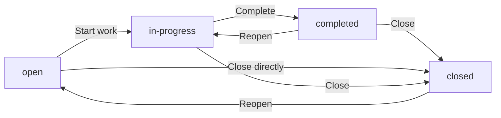

### Completed Task Modification

WHEN a user attempts to modify a task with status "completed", THE SYSTEM SHALL allow the modification.

Completed tasks can be edited and their status can be changed.

### Task Filtering and Query Behavior

### Multiple Criteria Filtering

WHEN tasks are filtered using multiple criteria (status, priority, assigned employee), THE SYSTEM SHALL return only tasks that match ALL specified criteria.

Each additional filter criterion narrows the result set.

### Empty Filter Results

WHEN a task filter returns no matching tasks, THE SYSTEM SHALL display an empty result set with a clear indication that no tasks match the criteria.

### Invalid Filter Values

WHEN a filter criterion contains an invalid value (e.g., non-existent employee ID, invalid status), THE SYSTEM SHALL treat it as no match and return an empty result set.

### Sorting Behavior

WHEN tasks are sorted by a specific field, THE SYSTEM SHALL apply the sort after all filter criteria have been applied.

Tasks without values for the sort field (e.g., no due date) SHALL appear at the end of the sorted list.

### Combining Assignment and Status Filters

WHEN tasks are filtered by both assigned employee and status, THE SYSTEM SHALL return tasks that are assigned to the specified employee AND have the specified status.

Unassigned tasks are excluded when filtering by assigned employee.

## TaskHistory Error Scenarios

Task history entries are immutable and cannot be edited or deleted once created, ensuring an accurate audit trail. The system automatically records task status changes, capturing the timestamp, previous status, new status, and the user who made the change. Task history is preserved even when tasks are deleted or archived. Users cannot manually create or modify task history entries. The history captures transitions between open, in-progress, completed, and closed statuses. Each history entry is associated with the specific task and cannot be transferred to another task. History entries are displayed in chronological order with the most recent changes first.

### Task History Immutability

Task history entries are immutable once created and cannot be edited or deleted by any user, including users with project management permissions or organization owners.

If a user attempts to modify a task history entry, THE SYSTEM SHALL reject the request and preserve the original entry unchanged.

If a user attempts to delete a task history entry, THE SYSTEM SHALL reject the request and retain the entry in the task's history.

This immutability applies to all fields within a history entry, including the timestamp, old status, new status, and the user attribution.

Task history entries serve as a permanent audit trail and must remain accurate for the lifetime of the task and beyond.

### Manual History Entry Creation Blocked

Users cannot manually create task history entries through any interface or operation.

If a user attempts to directly create a task history entry without a corresponding task status change, THE SYSTEM SHALL reject the request.

History entries are exclusively created by the system as an automatic consequence of task status transitions.

This restriction applies to all users regardless of their permission level, including organization owners and users with project management permissions.

The system ensures that every history entry represents an actual status change that occurred in the system.

### Automatic Status Change Recording Failures

When a task status is changed, the system must automatically create a corresponding history entry.

If the system fails to record a task status change due to a technical error, THE SYSTEM SHALL not persist the status change to the task.

The timestamp is automatically generated by the system at the moment the status change occurs.

If a user or process attempts to set a custom timestamp for a history entry, THE SYSTEM SHALL reject the request and use the system-generated timestamp.

The history entry must include the old status value and the new status value.

If the old status and new status are identical (no actual change), THE SYSTEM SHALL not create a history entry.

User attribution is required for every history entry.

If the user performing the status change cannot be determined, THE SYSTEM SHALL not persist the status change until attribution is established.

### History Entry Task Association Permanence

Each history entry is permanently associated with the specific task for which it was created.

If a user or process attempts to transfer a history entry from one task to another, THE SYSTEM SHALL reject the request.

History entries cannot be re-assigned or moved between tasks, even by users with full management permissions.

This permanent association ensures the integrity of the audit trail for each individual task.

When a task is viewed, its history entries are displayed exclusively for that task.

### History Preservation on Task Deletion

Task history entries are preserved even when the associated task is deleted or archived.

If a task is deleted, THE SYSTEM SHALL retain all history entries associated with that task for audit purposes.

If a task is archived, THE SYSTEM SHALL preserve the complete history and make it available when the task is viewed.

Historical records remain accessible to users with appropriate view permissions even after the task's lifecycle has ended.

This preservation ensures that audit trails remain complete regardless of task lifecycle events.

### Task History View Permissions

Users who can view a task can also view the task's history entries.

This includes employees assigned to the project containing the task, project leads, and users with project view or project manage permissions.

If a user without task view permission attempts to access a task's history, THE SYSTEM SHALL deny access.

The activity log provides a centralized view of status changes across all tasks for users with activity log view permissions.

History entries are displayed in chronological order with the most recent changes appearing first.

If a user requests history entries in a non-chronological order, THE SYSTEM SHALL return them in chronological order by default.

## Timelog Error Scenarios

Employees can only create timelogs for projects they are assigned to, preventing time logging on unauthorized projects. Timelogs that are part of an approved timesheet cannot be edited, as approved timesheets lock all included time entries. Timelogs that are part of a submitted or approved timesheet cannot be deleted. The duration must be specified in minutes and should be a positive value. Users with time:manage permission can edit or delete any employee's timelogs regardless of timesheet status. Employees can only create timelogs for themselves, not for other employees. The billable flag defaults to true if not specified. When a timelog is created, the project must be active (not archived or completed). Timelogs can only be associated with tasks that belong to the selected project.

### Project Membership Required for Timelog Creation

When an employee creates a timelog, THE SYSTEM SHALL verify that the employee is assigned to the selected project.
If the employee is not a member of the selected project, THE SYSTEM SHALL reject the timelog creation request.
The project membership check prevents employees from logging time on projects they are not authorized to work on.

When a user with time:manage permission creates a timelog on behalf of another employee, THE SYSTEM SHALL verify that the target employee is assigned to the selected project.
If the target employee is not a project member, THE SYSTEM SHALL reject the timelog creation regardless of the creator's permissions.

### Timesheet Lock Constraints

When an employee attempts to edit a timelog that is part of an approved timesheet, THE SYSTEM SHALL reject the edit request.
Approved timesheets lock all included timelogs to prevent modifications after approval.

When an employee attempts to delete a timelog that is part of a submitted or approved timesheet, THE SYSTEM SHALL reject the deletion request.
Timelogs included in submitted timesheets cannot be deleted to maintain timesheet integrity during the approval process.
Timelogs included in approved timesheets cannot be deleted to preserve the approved time record.

When a timesheet is rejected and returns to draft status, THE SYSTEM SHALL unlock the included timelogs for editing and deletion by the employee.

### Duration and Date Validation

When an employee creates or edits a timelog, THE SYSTEM SHALL require a duration value.
If the duration is not specified, THE SYSTEM SHALL reject the request.

When an employee creates or edits a timelog, THE SYSTEM SHALL verify that the duration is a positive value in minutes.
If the duration is zero or negative, THE SYSTEM SHALL reject the request.
The duration must represent actual time worked and cannot be zero or negative.

When an employee creates or edits a timelog, THE SYSTEM SHALL require a date value.
If the date is not specified, THE SYSTEM SHALL reject the request.
The date indicates when the work was performed.

### Permission Override for Timelog Management

Users with time:manage permission can edit any employee's timelogs regardless of timesheet status.
When a user with time:manage permission edits a timelog in an approved timesheet, THE SYSTEM SHALL allow the edit operation.

Users with time:manage permission can delete any employee's timelogs regardless of timesheet status.
When a user with time:manage permission deletes a timelog in a submitted or approved timesheet, THE SYSTEM SHALL allow the deletion operation.

This permission override allows administrators to correct errors in locked timesheets when necessary.

### Self-Service Time Logging Restriction

When an employee creates a timelog, THE SYSTEM SHALL automatically associate the timelog with the creating employee.
Employees cannot create timelogs for other employees.

When an employee edits or deletes a timelog, THE SYSTEM SHALL verify that the timelog belongs to the employee.
If the timelog belongs to another employee, THE SYSTEM SHALL reject the request.

Users with time:manage permission are exempt from the self-service restriction and can create, edit, or delete timelogs for any employee.

### Default Values and Active Project Requirement

When an employee creates a timelog without specifying the billable flag, THE SYSTEM SHALL set the billable flag to true by default.
The default billable status indicates the time is chargeable to the client.

When an employee creates a timelog, THE SYSTEM SHALL verify that the selected project is active.
If the selected project has status archived or completed, THE SYSTEM SHALL reject the timelog creation.
Archived and completed projects cannot receive new timelogs to preserve their final state.

When an employee attempts to edit an existing timelog to change the project to an archived or completed project, THE SYSTEM SHALL reject the edit request.

### Task Assignment Validation

When an employee creates or edits a timelog and selects a task, THE SYSTEM SHALL verify that the task belongs to the selected project.
If the task does not belong to the selected project, THE SYSTEM SHALL reject the request.

When an employee creates a timelog without selecting a task, THE SYSTEM SHALL allow the creation with no task association.
Task selection is optional for timelog creation.

When an employee edits a timelog to change the project, THE SYSTEM SHALL clear any previously selected task that does not belong to the new project.

### Timelog Filtering and Pagination

Employees can view their own timelogs with filtering options.
When an employee requests timelogs, THE SYSTEM SHALL provide filtering by date range, project, task, and billable status.
Multiple filters can be combined to narrow results.

Users with time:view_all permission can view all employees' timelogs with the same filtering options.
When a user with time:view_all permission requests timelogs, THE SYSTEM SHALL include timelogs from all employees in the organization.

When the number of timelogs exceeds the page limit, THE SYSTEM SHALL return results in paginated form.
The pagination continues to function correctly when status changes occur on timelogs (such as inclusion in submitted or approved timesheets) without affecting the filter results.

## Timesheet Error Scenarios

A timesheet cannot be submitted if it contains no timelogs, ensuring submitted timesheets have actual work recorded. Only one timesheet per employee per week can be submitted or approved, preventing duplicate submissions. When a timesheet is approved, all included timelogs become locked and cannot be edited or deleted. Rejected timesheets return to draft status, allowing the employee to modify and resubmit. When rejecting a timesheet, the reviewer must provide a rejection reason. Users with time:approve permission can view all submitted timesheets but cannot approve their own timesheets. Week start date must be a Monday, and week end date must be the following Sunday. Timesheets can only be created for past or current weeks, not future weeks.

### Empty Timesheet Submission Prevention

IF an employee attempts to submit a timesheet that contains no timelogs, THEN THE system SHALL reject the submission and notify the employee that at least one timelog is required.

IF a timesheet has no timelogs associated with it, THEN THE system SHALL prevent the submission action from being available.

IF a draft timesheet has all timelogs removed, THEN THE system SHALL prevent submission until at least one timelog is added.

The purpose of this requirement is to ensure that submitted timesheets always represent actual work performed, preventing approval workflow initiation for empty timesheets.

### Duplicate Timesheet Prevention Per Week

IF an employee attempts to create or submit a timesheet for a week that already has a submitted or approved timesheet, THEN THE system SHALL reject the request.

WHEN an employee has an existing submitted or approved timesheet for a specific week, THE system SHALL prevent creation of any additional timesheet for that same week.

IF an employee has a draft timesheet for a week and attempts to create another timesheet for the same week, THEN THE system SHALL reject the creation and direct them to the existing draft.

Only one timesheet per employee per week can exist in any status at any time, ensuring a single source of truth for weekly work records.

### Timelog Locking Upon Timesheet Approval

WHEN a timesheet is approved, THE system SHALL automatically lock all timelogs included in that timesheet.

IF a timelog is part of an approved timesheet, THEN THE system SHALL prevent any modification or deletion of that timelog.

IF a timelog is part of an approved timesheet and an employee attempts to edit or delete it, THEN THE system SHALL reject the request and notify the employee that the timelog is locked.

WHEN a timesheet transitions to approved status, THE system SHALL apply the lock to all associated timelogs immediately and irrevocably.

Users with time management permission cannot override this lock, ensuring approved work records remain immutable for audit and compliance purposes.

### Timesheet Rejection Workflow

WHEN a reviewer rejects a submitted timesheet, THE system SHALL require the reviewer to provide a rejection reason before the rejection can be processed.

IF a reviewer attempts to reject a timesheet without providing a reason, THEN THE system SHALL reject the rejection request and prompt for a reason.

WHEN a timesheet is rejected, THE system SHALL change the timesheet status from submitted to draft.

IF a timesheet is rejected, THEN THE system SHALL preserve all associated timelogs and allow the employee to modify the timesheet content.

WHEN a timesheet is rejected and returned to draft status, THE employee SHALL be able to add, remove, or modify timelogs and resubmit the timesheet.

IF a timesheet is rejected, THEN THE system SHALL notify the employee of the rejection with the provided reason.

### Approver Self-Approval Prevention

IF a user with timesheet approval permission attempts to approve their own timesheet, THEN THE system SHALL reject the approval request.

WHEN a user views the list of submitted timesheets awaiting approval, THE system SHALL exclude their own timesheets from the list they can approve.

IF a user with timesheet approval permission submits their own timesheet, THEN THE system SHALL require another user with approval permission to review and approve it.

This ensures separation of duties where employees cannot self-approve their own work records, maintaining integrity of the time tracking and approval process.

### Week Date Validation Rules

IF a timesheet is created with a week start date that is not a Monday, THEN THE system SHALL reject the creation.

IF a timesheet is created with a week end date that is not the Sunday following the week start date, THEN THE system SHALL reject the creation.

IF an employee attempts to create a timesheet for a future week, THEN THE system SHALL reject the creation.

THE system SHALL allow timesheet creation only for past weeks and the current week.

IF an employee attempts to create a timesheet with a week start date that is more than one week after the week end date, THEN THE system SHALL reject the creation as an invalid week range.

Week start date and week end date must always form a valid Monday-to-Sunday week sequence.

### Timesheet Metadata Recording

WHEN an employee submits a timesheet, THE system SHALL record the submission timestamp.

IF a timesheet is submitted, THEN THE system SHALL capture the date and time when the submission occurred.

WHEN a timesheet is approved or rejected, THE system SHALL record the user who performed the review action.

IF a timesheet transitions to approved or rejected status, THEN THE system SHALL capture which user with approval permission performed the action.

WHEN a timesheet is approved or rejected, THE system SHALL record the review timestamp.

THE system SHALL automatically calculate total hours for a timesheet based on the sum of all included timelogs' durations.

IF timelogs are added to or removed from a draft timesheet, THEN THE system SHALL recalculate the total hours accordingly.

## Timer Error Scenarios

Each employee can have at most one active timer at any given time, and starting a new timer while one is running is not allowed. The timer must be stopped before the employee can log time manually for the same project. When stopping a timer, the duration is calculated and rounded to the nearest minute for the resulting timelog. Employees can only start timers for projects they are assigned to. If an employee forgets to stop their timer, it continues running indefinitely with no automatic stop mechanism. Discarding a timer does not create a timelog, while stopping creates one automatically. The project and task on a running timer can be edited, but this does not affect previously logged time. An employee cannot have both a timer and manual timelogs for the same time period without proper management.

### Single Active Timer Constraint

IF an employee attempts to start a new timer while they already have an active timer running, THEN THE system SHALL reject the request and display an error indicating that an active timer already exists.

IF an employee has an active timer running, THEN THE system SHALL require the employee to stop or discard the current timer before starting a new timer.

THE system SHALL enforce that each employee can have at most one active timer at any given time.

IF an employee attempts to start a timer without first resolving their existing active timer, THEN THE system SHALL not create a new timer record.

The error message SHALL inform the employee that they must stop or discard their current timer before starting a new one.

### Timer Project Assignment Requirement

IF an employee attempts to start a timer for a project they are not assigned to, THEN THE system SHALL reject the request with an error indicating the project assignment requirement.

THE system SHALL only allow employees to start timers for projects where they are listed as a project member.

IF an employee's project membership is removed while they have an active timer for that project, THEN THE system SHALL allow the timer to continue running but SHALL prevent the employee from starting new timers for that project.

WHEN an employee starts a timer, THE system SHALL validate that the selected project is one to which the employee is currently assigned.

IF the project assignment validation fails, THEN THE system SHALL not create the timer and SHALL display an appropriate error message.

### Timer Duration Calculation

WHEN an employee stops a running timer, THE system SHALL calculate the duration as the difference between the current timestamp and the timer's start timestamp.

THE system SHALL round the calculated duration to the nearest minute when creating the resulting timelog.

IF the calculated duration is less than 30 seconds, THE system SHALL round the duration to 0 minutes.

IF the calculated duration is 30 seconds or more but less than 90 seconds, THE system SHALL round the duration to 1 minute.

THE system SHALL apply standard rounding rules where durations of X minutes and 30 seconds or more round up to X+1 minutes, and durations of X minutes and less than 30 seconds round down to X minutes.

### Timer Without Auto-Stop

IF an employee forgets to stop their timer, THE system SHALL allow the timer to continue running indefinitely without any automatic stop mechanism.

THE system SHALL not impose any maximum duration limit on an active timer.

IF a timer has been running for an extended period, THE system SHALL continue to track the elapsed time accurately.

THE system SHALL not automatically stop, pause, or discard a timer based on elapsed time or any other automatic trigger.

The employee remains solely responsible for manually stopping or discarding their timer to create or abandon the time entry.

### Timer Stop and Discard Behavior

IF an employee stops their running timer, THE system SHALL automatically create a timelog with the calculated and rounded duration.

WHEN a timelog is created from a stopped timer, THE system SHALL populate the timelog with the project, task, and description from the timer.

IF an employee discards their running timer, THE system SHALL delete the timer record without creating any timelog.

THE system SHALL clearly distinguish between stop and discard actions, where stop creates a timelog and discard does not.

IF an employee discards a timer, THE system SHALL not retain any record of the elapsed time for that timer.

### Running Timer Editability

THE system SHALL allow employees to edit the project on a running timer.

THE system SHALL allow employees to edit the task on a running timer.

THE system SHALL allow employees to edit the description on a running timer.

IF an employee edits the project on a running timer, THE system SHALL validate that the new project is one to which the employee is assigned.

IF an employee edits the task on a running timer, THE system SHALL validate that the new task belongs to the selected project.

WHEN an employee edits a running timer's project or task, THE system SHALL not affect any previously logged time entries.

THE system SHALL not allow employees to edit the start timestamp of a running timer.

### Timer Start Requirements

IF an employee attempts to start a timer without selecting a project, THEN THE system SHALL reject the request and require project selection.

THE system SHALL require project selection as a mandatory field when starting a timer.

THE system SHALL allow employees to start a timer without selecting a task, making task assignment optional.

IF a task is selected when starting a timer, THE system SHALL validate that the task belongs to the selected project.

THE system SHALL allow employees to start a timer without entering a description, making the description optional.

### Timer Session Continuity

IF an employee starts a timer and then logs out or closes their session, THE system SHALL continue running the timer.

WHEN an employee logs back in after having an active timer, THE system SHALL display the currently running timer with its elapsed time.

THE system SHALL maintain the timer state across session boundaries, ensuring the timer continues to track elapsed time accurately.

IF an employee has an active timer in one organization and switches to another organization, THE system SHALL continue running the timer in the original organization context.

WHEN an employee returns to the organization where they have an active timer, THE system SHALL display the timer with the correct elapsed time calculated from the original start timestamp.

## ActivityLog Error Scenarios

Activity log entries are immutable and cannot be edited or deleted, maintaining a permanent audit trail. Users without org:manage permission cannot view the full activity log. The system automatically logs specific action types such as employee invitations, deactivations, contract changes, project lifecycle events, task status changes, timesheet decisions, and role assignments. Each log entry captures the user who performed the action, the action type, the target entity, and relevant details. Activity logs are scoped to the organization and cannot be viewed across organizational boundaries. When filtering by multiple criteria, results show entries matching all conditions. The log handles high-volume scenarios where many actions occur in quick succession.

### Activity Log Entry Immutability

THE system SHALL prevent any modification or deletion of activity log entries after they are created.

IF a user attempts to edit an activity log entry, THE system SHALL reject the request.

IF a user attempts to delete an activity log entry, THE system SHALL reject the request.

THE system SHALL maintain all activity log entries as a permanent audit trail.

This immutability applies to all fields within a log entry including timestamp, user reference, action type, target entity, and details.

The immutability requirement ensures historical accuracy for compliance and audit purposes.

### Activity Log View Permission Requirement

WHEN a user requests to view the activity log, THE system SHALL verify the user has the org:manage permission.

IF a user without org:manage permission attempts to view the activity log, THE system SHALL reject the request.

THE system SHALL display only the activity log entries for the currently selected organization context.

IF a user belongs to multiple organizations, THE system SHALL restrict activity log visibility to the organization they are currently working in.

Users without org:manage permission cannot access any activity log data, even for actions they performed themselves.

### Automatic Action Logging Requirements

THE system SHALL automatically create an activity log entry when any of the following actions occur:
- Employee invited to the organization
- Employee deactivated
- Employee reactivated
- Contract created for an employee
- Contract edited
- Project created, archived, completed, or deleted
- Task status changed
- Timesheet submitted, approved, or rejected
- Role assigned or changed for an employee

WHEN any logged action occurs, THE system SHALL record the following in the activity log entry:
- Timestamp of when the action occurred (automatically captured)
- The user who performed the action
- The action type from the defined set of action types
- The target entity affected by the action
- Relevant details about the action

THE system SHALL NOT allow manual creation of activity log entries by any user.

THE system SHALL validate that the action type is one of the predefined action types before creating a log entry.

### Organization Scoped Activity Log

THE system SHALL isolate activity log entries strictly by organization.

WHEN displaying the activity log, THE system SHALL show only entries for the currently selected organization.

IF a user switches organizations, THE system SHALL display activity log entries for the newly selected organization only.

THE system SHALL prevent any cross-organization visibility of activity log data.

Activity log entries created in one organization SHALL NOT be visible or accessible to users working in a different organization context, even if the same user belongs to both organizations.

All activity log queries SHALL be automatically scoped to the organization context of the current session.

### Activity Log Filtering with Multiple Criteria

THE system SHALL support filtering the activity log by the following criteria:
- Action type
- User who performed the action
- Date range

WHEN multiple filter criteria are applied, THE system SHALL return only entries that match ALL specified criteria.

IF no filter criteria are specified, THE system SHALL return all activity log entries for the organization in reverse chronological order.

IF a filter results in no matching entries, THE system SHALL return an empty result set.

WHEN filtering by date range, THE system SHALL include entries where the timestamp falls within the specified start and end dates inclusive.

### Target Entity and Structured Details in Log Entries

THE system SHALL capture the target entity for each activity log entry, identifying what was affected by the action.

Examples of target entities include:
- An employee record (for invitations, deactivations, reactivations)
- A contract (for contract creation or edits)
- A project (for project lifecycle events)
- A task (for status changes)
- A timesheet (for submission, approval, rejection)
- A role assignment (for role changes)

THE system SHALL store details as structured data that captures relevant context for each action type.

THE system SHALL include appropriate details for each action type, such as:
- For employee invitations: the invited email address
- For timesheet decisions: the week being approved or rejected
- For role changes: the old role and new role
- For project status changes: the previous and new status

THE system SHALL ensure details are captured in a format that supports filtering and reporting.

### High-Volume Action Logging Handling

THE system SHALL record activity log entries accurately when multiple actions occur in rapid succession.

WHEN multiple logged actions occur simultaneously or near-simultaneously, THE system SHALL create a separate log entry for each action.

THE system SHALL preserve the correct chronological order of log entries even when created within the same second.

THE system SHALL ensure no activity log entries are lost during high-volume periods.

THE system SHALL maintain consistent response times for activity log queries regardless of the total number of entries in the log.

WHEN viewing the activity log during high-volume periods, THE system SHALL display entries in reverse chronological order by timestamp.

### Activity Log Pagination for Large Volumes

THE system SHALL provide paginated access to the activity log.

THE system SHALL NOT return the entire activity log in a single response.

WHEN a user views the activity log, THE system SHALL return a defined number of entries per page.

THE system SHALL support navigation between pages of activity log entries.

THE system SHALL maintain consistent pagination behavior regardless of the total number of log entries in the organization.

WHEN filters are applied, THE system SHALL apply pagination to the filtered result set.

### Action Type Validation Requirements

THE system SHALL validate that each activity log entry has an action type from the following predefined set:
- employee_invited
- employee_deactivated
- employee_reactivated
- contract_created
- contract_edited
- project_created
- project_archived
- project_completed
- project_deleted
- task_status_changed
- timesheet_submitted
- timesheet_approved
- timesheet_rejected
- role_assigned
- role_changed

IF an action type is not in the predefined set, THE system SHALL reject the activity log entry creation.

THE system SHALL NOT allow custom or undefined action types to be logged.

THE system SHALL ensure action type values are stored consistently to support filtering by action type.

# End-to-End User Scenarios

Cross-domain user scenarios that span multiple concepts, describing complete user journeys.

## Cross-Domain User Scenarios

Define end-to-end user scenarios that span multiple concepts, describing complete user journeys from start to finish.

### Organization Onboarding Journey

### Complete Onboarding Flow

When a new user signs up for the platform, THE SYSTEM SHALL guide them through creating their first organization. The user provides an organization name (required), description (optional), logo image (optional), currency, timezone, and fiscal start month.

After organization creation, THE SYSTEM SHALL automatically assign the user the Owner role within the new organization.

### Initial Setup Workflow

When the organization is created, THE OWNER SHALL be able to proceed with initial setup in the following order:

1. Create departments to organize employees
2. Create custom roles with specific permissions (optional)
3. Invite employees to join the organization
4. Create projects for work tracking
5. Assign employees to projects

When the owner creates the first department, THE SYSTEM SHALL record the department as a top-level department with no parent.

When the owner invites the first employee by email, THE SYSTEM SHALL send an invitation. If the email has no existing account, THE SYSTEM SHALL create a pending invitation that is fulfilled when the user signs up with that email.

When the owner creates the first project, THE SYSTEM SHALL set the project status to active by default and require a name and color code.

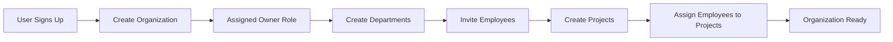

### Weekly Time Tracking Journey

### Time Entry Creation Phase

When an employee needs to track their work time, THE EMPLOYEE SHALL be able to create timelogs by specifying a date, duration in minutes, project (required), task (optional), description, and billable flag.

Alternatively, THE EMPLOYEE SHALL be able to start a timer by selecting a project (task optional). When the timer is running, THE EMPLOYEE SHALL be able to edit the description and project/task. When the employee stops the timer, THE SYSTEM SHALL create a timelog with the calculated duration rounded to the nearest minute.

### Timesheet Submission Phase

When the employee has created timelogs for a week, THE EMPLOYEE SHALL be able to create a draft timesheet for that week. THE SYSTEM SHALL automatically include all timelogs for that employee in that week.

When the employee wants to modify the draft, THE EMPLOYEE SHALL be able to add or remove timelogs from the draft timesheet.

When the employee submits the timesheet for approval, THE SYSTEM SHALL validate that the timesheet contains at least one timelog and that no other timesheet for the same week is already submitted or approved.

### Manager Approval Phase

When a timesheet is submitted, THE MANAGER (or any user with time:approve permission) SHALL be able to view the submitted timesheet in the approval queue.

When the manager approves the timesheet, THE SYSTEM SHALL lock all included timelogs, preventing further editing or deletion.

When the manager rejects the timesheet, THE MANAGER SHALL be required to provide a rejection reason. THE SYSTEM SHALL return the timesheet to draft status, allowing the employee to modify and resubmit.

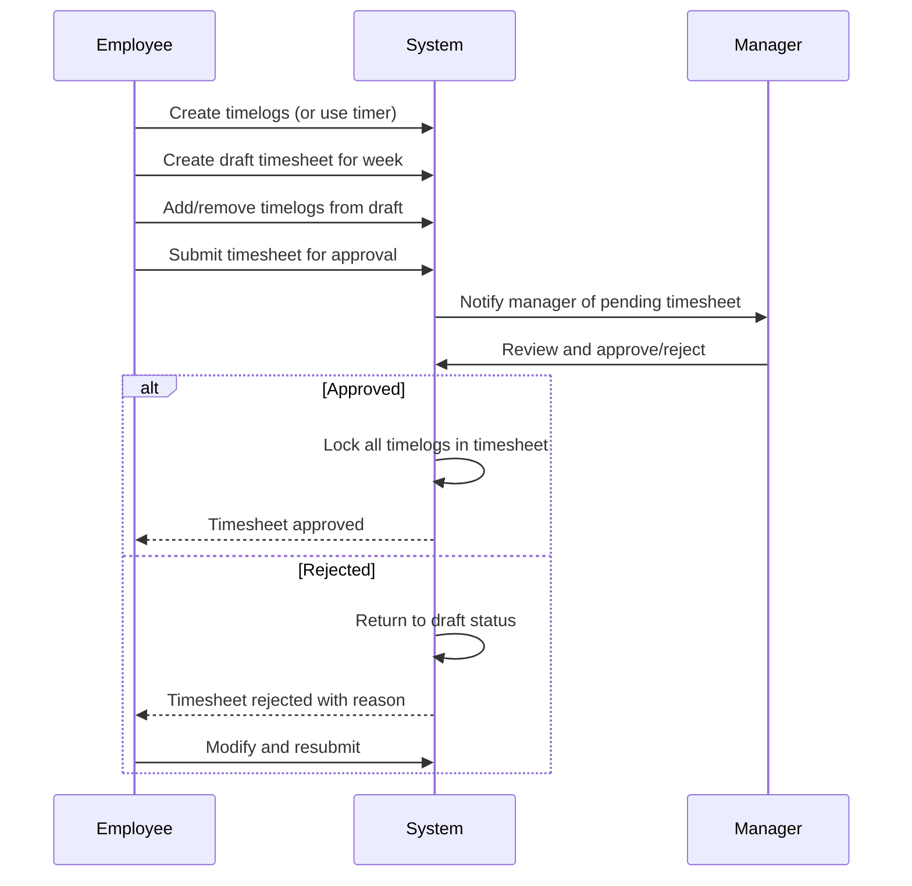

### Project Lifecycle Management Journey

### Project Creation and Setup

When a user with project:manage permission creates a project, THE SYSTEM SHALL require a name and color code. THE USER SHALL be able to optionally provide a description, budget hours, start date, and end date.

After project creation, THE USER WITH PROJECT:MANAGE PERMISSION SHALL be able to assign employees to the project. Each project membership specifies whether the employee is a member or project lead.

### Task Management Phase

When a project lead or user with project:manage permission creates a task, THE SYSTEM SHALL require a title and set default values for status (open) and priority (medium). THE USER SHALL be able to specify a description, estimated hours, due date, assignee (must be a project member), and parent task for subtasks.

When a task status is changed, THE SYSTEM SHALL automatically record the change in task history with the timestamp, old status, new status, and who made the change.

### Project Tracking Phase

When the project has budget hours defined, THE SYSTEM SHALL track actual hours logged against the project for budget utilization reporting.

When employees log time to project tasks, THE SYSTEM SHALL accumulate hours for project reports and budget tracking.

### Project Completion Phase

When the project work is finished, THE USER WITH PROJECT:MANAGE PERMISSION SHALL be able to archive or complete the project. THE SYSTEM SHALL prevent new timelogs from being added to archived or completed projects while preserving existing timelogs.

When the user attempts to delete a project, THE SYSTEM SHALL allow deletion only if no timelogs are associated with the project.

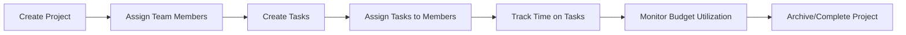

### Employee Onboarding Journey

### Invitation Phase

When an organization owner or user with employee:manage permission invites a new employee by email, THE SYSTEM SHALL check if an account exists for that email.

When the email has an existing account, THE SYSTEM SHALL add the user to the organization as an employee with the specified role.

When the email has no existing account, THE SYSTEM SHALL create a pending invitation. When a user signs up with that email, THE SYSTEM SHALL automatically add them to the pending organizations.

### First-Time Employee Setup

When a new employee accepts an invitation or creates an account with a pending invitation, THE EMPLOYEE SHALL be able to log in and select the organization context.

When the employee views their dashboard, THE SYSTEM SHALL display their assigned projects, tasks in progress, and prompt for weekly timesheet submission.

### Contract Setup Phase

When the organization has defined contracts for the employee, THE EMPLOYEE SHALL be able to view their active contract showing start date, pay rate, pay period, and working hours per week.

When the employee's contract changes, THE SYSTEM SHALL automatically end the previous contract and create a new active contract.

### Productive Work Phase

When the employee is ready to track time, THE EMPLOYEE SHALL be able to start a timer or create timelogs against projects they are assigned to.

When the employee views tasks assigned to them, THE EMPLOYEE SHALL be able to see task details, due dates, and update task status.

When the employee views their personal dashboard, THE SYSTEM SHALL display hours logged today, hours logged this week, active timer status, recent timelogs, pending timesheet status, and assigned tasks.

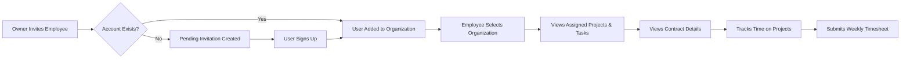

# Real-time Events

WebSocket/SSE event definitions and subscription specifications.

## Organization Events

Organization events notify all members when organization-level changes occur. When organization settings are updated such as name, description, logo, currency, timezone, or fiscal start month, all members receive a notification to stay informed of the changes. When an organization is deleted, all members receive a notification indicating the organization has been permanently removed. These events ensure that all organization members are aware of structural changes that affect their work environment. Subscription to organization events is automatic for all members within the organization. No members outside the organization can subscribe to or receive these events due to data isolation requirements.

### Organization Settings Update Events

When an organization's settings are modified, all members of the organization receive a real-time notification event. This includes changes to the organization name, description, logo image, currency setting, timezone, or fiscal start month.

Each settings update event contains the following information:
- The type of setting that was changed
- The previous value (for reference)
- The new value
- The timestamp when the change occurred
- The user who made the change

The organization name changed event is triggered whenever the display name of the organization is updated by an owner.

The logo updated event is triggered when a new logo image is uploaded or the existing logo is removed. The event includes a reference to the new logo image.

The currency setting updated event is triggered when the organization's default currency is changed. All members are notified so they are aware that future financial calculations and displays will use the new currency.

The timezone change notification is triggered when the organization's timezone is updated. This affects how dates and times are displayed for all members, so immediate notification ensures everyone is aware of the change.

The fiscal start month modified event is triggered when the organization's fiscal year start month is changed. This affects reporting periods and budget calculations.

All members notification ensures that every active member currently connected to the organization receives the event simultaneously. There is no delay or batching of these notifications.

### Organization Deletion Event

When an organization is deleted, an organization deletion broadcast event is sent to all members of that organization.

This event contains:
- A notification that the organization has been permanently deleted
- The timestamp of deletion
- The name of the deleted organization (for the member's reference)

The deletion event is sent immediately before the organization data is permanently removed from the system. Members receiving this event understand that they no longer have access to the organization and must switch to another organization context or leave the system.

The deletion event is the final communication from the organization to its members. After this event is sent, no further events or data from this organization are accessible to any member.

Organization-wide broadcast ensures that all members receive this critical notification, including owners, managers, and employees, regardless of their role or permissions within the organization.

### Organization Event Subscription and Data Isolation

Subscription to organization events is automatic and mandatory for all active members within an organization. Members do not need to explicitly subscribe or opt-in to receive organization events.

Data isolation enforcement ensures that:
- Only members of an organization can receive events related to that organization
- Members from other organizations cannot subscribe to or receive any events from an organization they do not belong to
- Even users who belong to multiple organizations only receive events from their currently selected organization context

When a member connects to the real-time event system, they are automatically subscribed to all organization events based on their current organization context. If the member switches organizations, their event subscription immediately changes to the new organization context, and they stop receiving events from the previous organization.

When a member is deactivated or removed from an organization, their subscription to that organization's events is immediately terminated. They no longer receive any events, including the organization deletion event if they were removed before deletion.

The system enforces organization context on every event connection and delivery. Events are never delivered to users outside the organization, regardless of their permissions or role in other organizations.

## User Events

User events notify relevant parties when user account or profile changes occur. When a user updates their display name, avatar image, or phone number, the updated profile information is reflected across all organizations the user belongs to. When a user changes their password, a security notification is sent to the user's email. When a user deletes their account, organizations where the user was a member receive notification that the employee record has been deactivated. These events ensure profile consistency across organizations and maintain security awareness. Users subscribe to their own profile events automatically, while organization administrators receive notifications about member account status changes.

### User Profile Updated Event

WHEN a user updates their display name, avatar image, or phone number, THE system SHALL emit a real-time event containing the updated profile information.

THE event SHALL include the user identifier and the updated profile fields (display name, avatar image URL, or phone number).

THE system SHALL broadcast the profile update event to all organizations where the user is a member.

WHEN a profile update event is received, THE system SHALL update the cached profile data for all organization contexts where the user has membership.

THE system SHALL ensure profile changes are immediately visible to other users in all organizations within the same session.

THE profile update event SHALL be delivered to all active sessions where the user is currently viewing the updated user's profile or relevant lists.

WHEN the display name is changed, THE system SHALL reflect the new name across all employee records, timelogs, timesheets, and activity logs that reference the user.

THE profile update event SHALL not require page refresh for subscribed clients to receive the update.

WHEN an avatar image is updated, THE system SHALL invalidate any cached avatar thumbnails and emit the new avatar URL in the event payload.

### Password Change Security Notification

WHEN a user successfully changes their password, THE system SHALL send a security notification to the user's registered email address.

THE security notification SHALL indicate that a password change has occurred and include the timestamp of the change.

THE security notification SHALL NOT include the new password or any sensitive credential information.

IF the user did not initiate the password change, THE system SHALL provide instructions in the notification for securing the account.

THE system SHALL NOT emit real-time WebSocket events for password changes to prevent credential exposure.

THE security notification SHALL be sent immediately after the password change transaction is committed.

WHEN a password change notification cannot be delivered, THE system SHALL retry sending according to standard email retry policies.

THE security notification SHALL be sent even if the user has no organization memberships.

### Account Deletion Event

WHEN a user deletes their account, THE system SHALL emit an account deletion event to all organizations where the user was a member.

THE account deletion event SHALL include the user identifier and the timestamp of deletion.

WHEN an organization receives an account deletion event, THE system SHALL mark the corresponding employee record as "deactivated" status.

THE system SHALL preserve the deactivated employee's historical data including timelogs, timesheets, and task assignments.

THE account deletion event SHALL notify organization owners and users with employee management permissions within that organization.

WHEN a deactivated employee's data is referenced, THE system SHALL display the employee's previous display name with an indication of deactivated status.

THE system SHALL NOT allow deactivated employees to log time, submit timesheets, or access organization features.

WHEN a sole owner deletes their account, THE system SHALL block the deletion until ownership is transferred or the organization is deleted.

THE account deletion event SHALL trigger cleanup of any pending invitations sent to the deleted user's email.

### Profile Synchronization Across Organizations

WHEN a user belongs to multiple organizations and updates their profile, THE system SHALL synchronize the profile changes across all organizations simultaneously.

THE system SHALL maintain a single global profile per user that is shared across all organization memberships.

WHEN a profile update occurs, THE system SHALL publish the update event to each organization's event channel.

THE system SHALL ensure profile updates are transactional across all organizations to prevent partial synchronization failures.

IF a user's membership in an organization is added after a profile update, THE system SHALL provide the current profile state to that organization.

WHEN a user switches organization context, THE system SHALL display the same profile information without requiring profile reload.

THE synchronized profile SHALL include: display name, avatar image, and phone number.

THE system SHALL NOT synchronize organization-specific data such as employee role, department, or position across organizations.

### Employee Deactivation Status Change Event

WHEN an employee record is deactivated (either through account deletion or manual deactivation by an administrator), THE system SHALL emit an employee status change event.

THE employee status change event SHALL include: employee identifier, previous status, new status, timestamp, and the user who performed the action.

WHEN an employee is deactivated, THE system SHALL notify project leads of projects where the deactivated employee was assigned.

THE system SHALL stop any running timers belonging to the deactivated employee and discard them without creating timelogs.

WHEN an employee is reactivated, THE system SHALL emit a status change event with status changing from "deactivated" to "active".

THE reactivated employee SHALL regain access to time tracking and timesheet submission functionality.

THE employee status change event SHALL be recorded in the organization's activity log.

WHEN an employee is deactivated, THE system SHALL remove the employee from all project member lists and task assignments while preserving historical references.

## Role Events

Role events notify relevant administrators when roles or permissions are modified within an organization. When an organization owner creates a custom role with specific permissions, managers with employee management permissions are notified of the new role availability. When a custom role is edited, users assigned to that role receive notification of permission changes. When a custom role is deleted, administrators are notified and employees previously assigned to that role are notified of their role reassignment needs. Role assignment changes trigger notifications to the affected employee about their new permissions. These events ensure transparency in permission management and help employees understand their current access levels.

### Custom Role Creation Notification

WHEN an organization owner creates a custom role with specific permissions, THE SYSTEM SHALL send a notification to all managers with employee management permissions informing them of the new role availability.

The notification SHALL include the role name and the list of permissions assigned to the new role.

The notification SHALL be delivered in real-time to users currently logged into the organization.

Users with employee management permissions SHALL be able to immediately assign the new custom role to employees after receiving the notification.

Built-in roles (Owner, Manager, Employee) are created automatically with the organization and SHALL NOT trigger creation notifications.

The event SHALL be scoped to the organization context, ensuring users from other organizations do not receive the notification.

### Role Permissions Modified Event

WHEN a custom role's permissions are modified by an organization owner, THE SYSTEM SHALL send a notification to all employees currently assigned to that role.

The notification SHALL inform affected employees that their access level has changed.

The notification SHALL include which permissions were added or removed from their role.

THE SYSTEM SHALL deliver the notification in real-time to affected employees who are currently logged in.

Permission modification events SHALL NOT be triggered for built-in roles, as their permissions are immutable.

The event SHALL ensure transparency by recording the change in the organization's activity log.

### Custom Role Deletion Notification

WHEN an organization owner deletes a custom role, THE SYSTEM SHALL send notifications to two recipient groups:

1. All users with organization management permissions SHALL receive an administrative notification confirming the role deletion
2. All employees previously assigned to the deleted role SHALL receive a notification that their role has been removed and reassignment is required

The deletion notification SHALL include the name of the deleted role.

THE SYSTEM SHALL only allow role deletion when no employees are currently assigned to that role, as defined in the role management constraints.

Built-in roles SHALL NOT be subject to deletion notifications as they cannot be deleted.

The event SHALL ensure affected employees understand they need a new role assignment to maintain proper access.

### Role Assignment Change Event

WHEN an employee's role assignment is changed by a user with employee management permissions, THE SYSTEM SHALL send a notification to the affected employee.

The notification SHALL inform the employee of their new role name and associated permissions.

The notification SHALL be delivered in real-time if the employee is currently logged into the organization.

The event SHALL provide transparency by allowing the employee to understand their current access level.

WHEN a role assignment is changed, THE SYSTEM SHALL record the change in the activity log including who made the change and the previous role.

Employees SHALL be able to view their updated permissions immediately after receiving the notification.

### Permission Management Transparency Events

THE SYSTEM SHALL provide real-time transparency for all role and permission management activities through a comprehensive event system.

All role events (creation, modification, deletion, assignment changes) SHALL be scoped to the organization context, ensuring data isolation between organizations.

Users who belong to multiple organizations SHALL only receive role event notifications for their currently selected organization context.

THE SYSTEM SHALL ensure that permission update notifications help employees understand their current access levels without requiring them to navigate to separate permission management screens.

Role events SHALL support the overall goal of permission management transparency by ensuring that:
- Managers are aware of new roles they can assign
- Employees are immediately notified of changes to their access
- Administrators have visibility into role lifecycle changes
- All stakeholders understand when and how their permissions change

Built-in role types (Owner, Manager, Employee) SHALL serve as reference points in notifications, helping users understand the relative access level of custom roles compared to standard role types.

## Employee Events

Employee events notify relevant parties when employee records are created, modified, or their status changes. When an employee is invited to join an organization, the invited user receives a notification if they have an existing account, or the invitation is tracked for new users. When an employee record is deactivated, the affected user receives notification that they can no longer log time or submit timesheets. When an employee is reactivated, they receive notification that their access has been restored. When employee details such as department, position, or employment type are updated, the affected employee receives notification of the changes. Users with employee management permissions receive notifications about all employee changes within the organization.

### Employee Invitation Events

When a user with employee management permission invites a new employee to the organization, THE SYSTEM SHALL send an invitation notification to the invited email address.

When the invited email address already has an existing user account, THE SYSTEM SHALL immediately add the user to the organization and send a notification about their new membership.

When the invited email address does not have an existing user account, THE SYSTEM SHALL create a pending invitation and track it for when the user signs up.

When a user signs up with an email address that has pending invitations, THE SYSTEM SHALL automatically add the user to those organizations and notify them of their memberships.

When a pending invitation is created, THE SYSTEM SHALL notify users with employee management permission about the pending invitation status.

When an employee record is created through invitation acceptance, THE SYSTEM SHALL notify the newly added employee of their role assignment and organization membership.

The invitation notification SHALL include the organization name and the role assigned to the invited employee.

### Employee Status Change Events

When an employee is deactivated, THE SYSTEM SHALL send a notification to the affected user stating they can no longer log time or submit timesheets.

When an employee is deactivated, THE SYSTEM SHALL notify all users with employee management permission about the deactivation.

When an employee is reactivated, THE SYSTEM SHALL send a notification to the affected user that their access has been restored.

When an employee is reactivated, THE SYSTEM SHALL notify all users with employee management permission about the reactivation.

When an employee's status changes from active to deactivated or from deactivated to active, THE SYSTEM SHALL broadcast the status change to users with employee view permission within the organization.

The status change notification SHALL include the employee name, previous status, and new status.

When a deactivated employee attempts to log time or submit a timesheet, THE SYSTEM SHALL display a message indicating their account is deactivated.

### Employee Detail Modification Events

When an employee's department assignment is changed, THE SYSTEM SHALL send a notification to the affected employee about their new department assignment.

When an employee's department assignment is removed (set to null), THE SYSTEM SHALL send a notification to the affected employee about the department removal.

When an employee's position or title is updated, THE SYSTEM SHALL send a notification to the affected employee about their new position.

When an employee's employment type is modified (full-time, part-time, contractor, intern), THE SYSTEM SHALL send a notification to the affected employee about the change.

When any employee detail is modified, THE SYSTEM SHALL notify users with employee management permission about the specific change made.

The modification notification SHALL include which field was changed, the previous value, and the new value.

When an employee views their own employee record after a modification, THE SYSTEM SHALL display the updated information immediately.

### Manager Notification for Employee Changes

When any employee record is created, modified, or has a status change, THE SYSTEM SHALL notify all users with employee management permission within the organization.

When multiple employee changes occur within a short time period, THE SYSTEM MAY consolidate notifications to avoid overwhelming managers.

The manager notification SHALL include the type of change, the affected employee name, who made the change, and when the change occurred.

When a manager views employee-related notifications, THE SYSTEM SHALL provide quick access to the affected employee's record.

Users with employee management permission SHALL be able to view a history of employee changes through the activity log.

When an employee is invited, deactivated, or reactivated, THE SYSTEM SHALL record the action in the activity log with the user who performed the action and the timestamp.

## Contract Events

Contract events notify relevant parties when employee contracts are created or modified. When a new contract is created for an employee, the employee receives notification about their new contract details including start date, pay rate, pay period, and working hours. When a new contract automatically ends the previous active contract, the employee is informed of the transition. When the current active contract is edited, the employee receives notification of the changes made. Employees can only subscribe to events for their own contracts. Users with employee management permissions can subscribe to contract events for all employees they manage, ensuring they stay informed about contract modifications.

### Contract Created Notification

WHEN a new contract is created for an employee, THE SYSTEM SHALL send a real-time notification to the employee containing the contract details.

The notification SHALL include the start date, pay rate, pay period, and working hours per week of the new contract.

WHEN a new contract is created for an employee, THE SYSTEM SHALL broadcast the contract creation event to users with employee management permissions.

THE SYSTEM SHALL record the timestamp of when the contract creation event was triggered.

The notification payload SHALL reference the employee and the newly created contract.

WHEN a contract is created with a start date in the future, THE SYSTEM SHALL notify the employee immediately rather than waiting for the start date to arrive.

### Contract Modification Events

WHEN the pay rate of an active contract is modified, THE SYSTEM SHALL send a notification to the employee informing them of the pay rate change.

WHEN the working hours per week of an active contract is modified, THE SYSTEM SHALL notify the employee of the updated working hours.

WHEN the pay period of an active contract is changed (hourly, daily, weekly, monthly), THE SYSTEM SHALL send a notification to the employee about the pay period modification.

WHEN any modification is made to an active contract, THE SYSTEM SHALL broadcast the change event to users with employee management permissions.

THE SYSTEM SHALL include in each modification notification which field was changed and the previous and new values where applicable.

THE SYSTEM SHALL record the timestamp of each contract modification event.

### Active Contract Transition Notification

WHEN a new contract is created for an employee who has an existing active contract, THE SYSTEM SHALL send a notification to the employee about the transition from the previous contract to the new contract.

THE SYSTEM SHALL inform the employee that the previous contract has been automatically ended with its end date set to the day before the new contract's start date.

WHEN the previous contract is automatically ended, THE SYSTEM SHALL include the end date of the previous contract in the notification.

THE SYSTEM SHALL provide the employee with details of both the ending contract and the new contract in the transition notification.

WHEN an active contract transition occurs, THE SYSTEM SHALL notify users with employee management permissions about the contract change.

### Contract Event Subscriptions

WHEN an employee subscribes to contract events, THE SYSTEM SHALL only deliver events related to that employee's own contracts.

THE SYSTEM SHALL prevent employees from subscribing to contract events of other employees.

WHEN a user with employee management permissions subscribes to contract events, THE SYSTEM SHALL deliver contract events for all employees they manage.

THE SYSTEM SHALL enforce permission checks before allowing a user to subscribe to contract events beyond their own.

WHEN an active contract is edited, THE SYSTEM SHALL send an edit notification to the employee who owns the contract.

WHEN an active contract is edited, THE SYSTEM SHALL broadcast the edit event to users with employee management permissions who have subscribed to contract events.

## Department Events

Department events notify organization members when departmental structure changes occur. When a new department is created with a name and optional description, all organization members receive notification of the new department. When a department's name or description is edited, employees assigned to that department and users with organization management permissions are notified. When a department is deleted, employees previously assigned to that department are notified that their department assignment has been cleared. When parent department relationships are established or modified, relevant stakeholders are informed. These events help employees stay aware of organizational structure changes that may affect their work context.

### Department Created Notification

When a department is created within an organization, the system shall send a notification to all organization members.

The notification shall include the department name, the optional description if provided, the timestamp of creation, and the identity of the user who created the department.

The system shall deliver this notification in real-time to all members currently active in the organization.

The purpose of this notification is to inform organization members of new departmental structure additions.

### Department Name Changed Event

When a department's name is modified, the system shall send a notification to all employees assigned to that department.

Users with organization management permission shall also receive the department name change notification.

The notification shall include the previous department name, the new department name, the timestamp of the change, and the identity of the user who made the modification.

This notification ensures affected employees are aware of changes to their departmental context.

### Department Description Modified Event

When a department's description is modified, the system shall send a notification to all employees assigned to that department.

Users with organization management permission shall also receive the department description modification notification.

The notification shall include the department name, the updated description, the timestamp of the change, and the identity of the user who made the modification.

This notification keeps department members informed about updates to departmental information.

### Department Deleted Notification

When a department is deleted, the system shall send a notification to users with organization management permission.

The notification shall include the deleted department's name, the timestamp of deletion, and the identity of the user who performed the deletion.

This notification informs organization administrators of departmental structure removals.

### Employee Department Cleared Event

When a department is deleted and an employee's department assignment is cleared, the system shall send a notification to that employee.

The notification shall include the previous department name that was cleared, the timestamp when the assignment was removed, and an indication that their department field is now empty.

This notification ensures affected employees are aware their department assignment has been removed due to department deletion.

### Parent Department Relationship Changed Event

When a parent department relationship is established or modified for a department, the system shall send a notification to employees in the affected child department.

The notification shall include the child department name, the new parent department name if one is assigned or an indication if the parent relationship was removed, the timestamp of the change, and the identity of the user who modified the relationship.

This notification keeps department members informed of hierarchical structure changes that may affect their organizational context.

### Organizational Structure Update Distribution

All department-related events shall be distributed in real-time to ensure organization members have current awareness of departmental structure.

The system shall ensure notifications are delivered only to members within the organization where the department change occurred.

Notifications shall not be sent to members of other organizations, maintaining strict data isolation between organizations.

## Project Events

Project events notify relevant employees when project information or status changes. When a new project is created, employees who can be assigned to projects receive notification of the new project availability. When project details such as name, description, color code, budget hours, start date, or end date are modified, all project members receive notification of the changes. When a project is archived or completed, project members are notified that the project can no longer receive new timelogs. When a project is deleted, affected project members receive notification about the removal. Project members subscribe to events for projects they are assigned to, while users with project management permissions receive notifications for all project changes.

### Project Created Event

WHEN a user with project management permission creates a new project, THE SYSTEM SHALL broadcast a project created event to all employees in the organization who can be assigned to projects.

THE SYSTEM SHALL include the following information in the project created event payload: project identifier, project name, project description (if provided), color code, budget hours (if set), start date (if set), end date (if set), and the user who created the project.

THE SYSTEM SHALL allow employees to subscribe to project created events when they log into the organization context.

WHEN an employee receives a project created notification, THE SYSTEM SHALL display the project name and indicate that a new project is available for potential assignment.

THE SYSTEM SHALL send project created events in real-time via WebSocket or Server-Sent Events connection.

### Project Details Modified Event

WHEN project details are modified by a user with project management permission, THE SYSTEM SHALL broadcast a project details modified event to all project members.

THE SYSTEM SHALL generate a project details modified event WHEN any of the following project attributes are changed: project name, project description, color code, budget hours, start date, or end date.

WHEN the project name is modified, THE SYSTEM SHALL include both the previous name and the new name in the event payload.

WHEN the project description is modified, THE SYSTEM SHALL include the updated description in the event payload.

WHEN the project color code is modified, THE SYSTEM SHALL include the new color code in the event payload to allow project members to update their UI display.

WHEN the project budget hours are updated, THE SYSTEM SHALL include the new budget hours value in the event payload.

WHEN the project start date or end date is modified, THE SYSTEM SHALL include the updated date value in the event payload.

THE SYSTEM SHALL include in every project details modified event: project identifier, which attribute was modified, the new value, the timestamp of the modification, and the user who made the modification.

### Project Status Change Events

WHEN a project status changes from active to archived, THE SYSTEM SHALL broadcast a project archived event to all project members.

WHEN a project status changes from active to completed, THE SYSTEM SHALL broadcast a project completed event to all project members.

THE SYSTEM SHALL include in the project status change event payload: project identifier, previous status, new status, timestamp of the status change, and the user who performed the status change.

WHEN a project is archived or completed, THE SYSTEM SHALL include a notification that the project can no longer receive new timelogs.

THE SYSTEM SHALL display an alert to project members indicating that timelog entry is no longer allowed for archived or completed projects.

WHEN a project transitions to archived or completed status, THE SYSTEM SHALL preserve all existing timelogs associated with the project.

THE SYSTEM SHALL prevent creation of new timelogs for archived or completed projects, and project members SHALL be notified of this restriction through the status change event.

### Project Deleted Event

WHEN a user with project management permission deletes a project, THE SYSTEM SHALL broadcast a project deleted event to all affected project members.

THE SYSTEM SHALL only allow project deletion WHEN the project has no associated timelogs.

THE SYSTEM SHALL include in the project deleted event payload: project identifier (for reference), project name, timestamp of deletion, and the user who deleted the project.

WHEN a project is deleted, THE SYSTEM SHALL notify all former project members about the removal.

THE SYSTEM SHALL send the project deleted notification immediately upon successful deletion.

WHEN a project member receives a project deleted notification, THE SYSTEM SHALL indicate that the project and all associated data have been permanently removed.

### Project Event Subscription Rules

THE SYSTEM SHALL allow project members to subscribe to events for all projects they are assigned to.

THE SYSTEM SHALL allow users with project management permission to receive notifications for all project changes within the organization.

WHEN an employee is assigned to a project, THE SYSTEM SHALL automatically subscribe them to project events for that project.

WHEN an employee is removed from a project, THE SYSTEM SHALL automatically unsubscribe them from project events for that project.

THE SYSTEM SHALL deliver project events only to users within the same organization context.

THE SYSTEM SHALL ensure that project event subscriptions are scoped to the currently selected organization.

WHEN a user switches organization context, THE SYSTEM SHALL update their project event subscriptions to reflect projects in the new organization.

THE SYSTEM SHALL maintain real-time event connections via WebSocket or Server-Sent Events while the user session is active.

## ProjectMember Events

Project member events notify relevant parties when employees are assigned to or removed from projects. When an employee is assigned to a project, the employee receives notification about their new project assignment and their role as member or project lead. When an employee's project role is changed from member to project lead or vice versa, the employee receives notification of their updated responsibilities. When an employee is removed from a project, they receive notification that they no longer have access to that project. Project leads receive notifications when new members are added to their projects. These events ensure clear communication about project team composition and individual responsibilities.

### Project Assignment Notification

WHEN an employee is assigned to a project, THE SYSTEM SHALL send a notification to the assigned employee containing the project name and their assigned role (member or project lead).

WHEN an employee is assigned to a project as a project lead, THE SYSTEM SHALL include in the notification an indication that they have project lead responsibilities for task management.

WHEN an employee is assigned to a project, THE SYSTEM SHALL send the notification in real-time to the employee's active session.

WHEN an employee is assigned to multiple projects simultaneously, THE SYSTEM SHALL send a separate notification for each project assignment.

THE SYSTEM SHALL deliver project assignment notifications immediately upon the assignment being created.

THE notification content SHALL include the project name, the employee's role in the project, and the date of assignment.

### Project Role Change Notification

WHEN an employee's project role is changed from member to project lead, THE SYSTEM SHALL send a notification to the employee indicating their promotion and new task management responsibilities.

WHEN an employee's project role is changed from project lead to member, THE SYSTEM SHALL send a notification to the employee indicating their role change.

WHEN a project role change occurs, THE SYSTEM SHALL send the notification to the affected employee in real-time.

THE SYSTEM SHALL deliver role change notifications immediately upon the role being updated.

THE notification content for role changes SHALL include the project name, the previous role, the new role, and the effective date.

WHEN an employee is promoted to project lead, THE SYSTEM SHALL include information about their new task management permissions within that project.

### Project Removal Notification

WHEN an employee is removed from a project, THE SYSTEM SHALL send a notification to the removed employee indicating they no longer have access to that project.

WHEN an employee is removed from a project, THE SYSTEM SHALL send the notification in real-time before access is revoked.

THE notification content for project removal SHALL include the project name and the date of removal.

THE SYSTEM SHALL deliver project removal notifications immediately upon the removal being processed.

WHEN an employee is removed from a project where they were assigned tasks, THE SYSTEM SHALL NOT include task reassignment details in the removal notification (task reassignment is a separate process).

WHEN an employee is removed from multiple projects simultaneously, THE SYSTEM SHALL send a separate notification for each project removal.

### Team Composition Update

WHEN a new member is added to a project, THE SYSTEM SHALL send a notification to all project leads of that project about the new team member.

THE notification to project leads SHALL include the new member's name and their assigned role (member or project lead).

WHEN a member is removed from a project, THE SYSTEM SHALL send a notification to all project leads of that project about the team composition change.

THE notification for team composition changes SHALL be delivered in real-time to all active project leads.

THE SYSTEM SHALL deliver team composition update notifications immediately upon the membership change being processed.

WHEN a project has no project leads assigned, THE SYSTEM SHALL NOT send team composition update notifications for that project.

THE notification content for team composition updates SHALL include the affected employee's name, the project name, and the type of change (added or removed).

## Task Events

Task events notify relevant project members when task information changes. When a new task is created within a project, all project members receive notification of the new task. When task details such as title, description, priority, estimated hours, or due date are modified, the assigned employee and project leads receive notification. When a task is assigned to an employee, the employee receives notification about their new assignment. When a task is reassigned to a different employee, both the previous and new assignees receive notification. When task priority changes to urgent, the assigned employee receives immediate notification. Project members subscribe to task events for projects they are assigned to.

### Task Created Notification

When a new task is created within a project, THE system SHALL send a notification to all project members assigned to that project.

When a new task is created, THE system SHALL include the task title, project name, priority, and assigned employee (if any) in the notification payload.

When a project member receives a task creation notification, THE system SHALL allow the member to view the task details directly from the notification.

Project members subscribe to task creation events for all projects they are assigned to.

When a task is created without an assigned employee, THE system SHALL still notify all project members of the new task availability.

### Task Assignment Events

When a task is assigned to an employee, THE system SHALL send a notification to that employee about their new assignment.

When a task assignment notification is sent, THE system SHALL include the task title, project name, priority, and due date (if set) in the notification.

When a task is reassigned from one employee to another, THE system SHALL send a notification to both the previous assignee and the new assignee.

When the previous assignee receives a reassignment notification, THE system SHALL indicate that the task has been reassigned to another employee.

When the new assignee receives a reassignment notification, THE system SHALL indicate that the task has been assigned to them.

When a task assignment changes, THE system SHALL notify project leads of the assignment change for tasks within their projects.

### Task Priority Change Events

When a task priority is changed, THE system SHALL send a notification to the assigned employee.

When a task priority changes to urgent, THE system SHALL send an immediate notification to the assigned employee.

When an urgent priority notification is sent, THE system SHALL highlight the urgency in the notification payload.

When a task priority is downgraded, THE system SHALL notify the assigned employee of the priority change.

Project leads receive notifications when task priority changes for tasks within their assigned projects.

When a task priority changes, THE system SHALL include the old priority, new priority, and task title in the notification.

### Task Detail Modification Events

When task details such as description, estimated hours, or due date are modified, THE system SHALL send a notification to the assigned employee and project leads.

When a task due date is modified, THE system SHALL include the old due date, new due date, and task title in the notification.

When a task description is updated, THE system SHALL notify the assigned employee of the change.

When estimated hours for a task are changed, THE system SHALL send a notification to the assigned employee.

When estimated hours change, THE system SHALL include the old estimated hours, new estimated hours, and task title in the notification.

When multiple task details are modified in a single update, THE system SHALL send a single consolidated notification containing all changes.

### Task Status Transition Events

When a task status transitions from one state to another, THE system SHALL record the transition in task history and notify relevant parties.

When a task status changes to in-progress, THE system SHALL notify project leads of the progress update.

When a task status changes to completed, THE system SHALL notify project leads and the assigned employee.

When a task status changes to closed, THE system SHALL notify project leads.

When a task status transition occurs, THE system SHALL include the old status, new status, task title, and who made the change in the notification.

Project members subscribe to task status events for projects they are assigned to.

## TaskHistory Events

Task history events notify relevant parties when task status changes are recorded. When a task status changes from open to in-progress, in-progress to completed, or any other status transition, the task history entry is created and relevant parties are notified. Project leads and the assigned employee receive notifications about status changes that affect workflow coordination. When a task is closed, project leads are notified that the task workflow has concluded. These events support workflow transparency and help project leads track task progress across their projects. Task history events are always associated with the parent task and follow the same subscription rules as task events.

### Task Status Changed Event

When a task status changes, the system SHALL emit a task status changed event to notify relevant parties. The event SHALL include the task identifier, the old status, the new status, the timestamp when the status change occurred, and the user who made the status change. The event SHALL be emitted for all status transitions: open to in-progress, in-progress to completed, completed to closed, and any other valid status transition. The event SHALL be sent to the project lead(s) of the project containing the task. If the task is assigned to an employee, the event SHALL also be sent to the assigned employee. The event SHALL be scoped to the organization and not visible to users outside the organization.

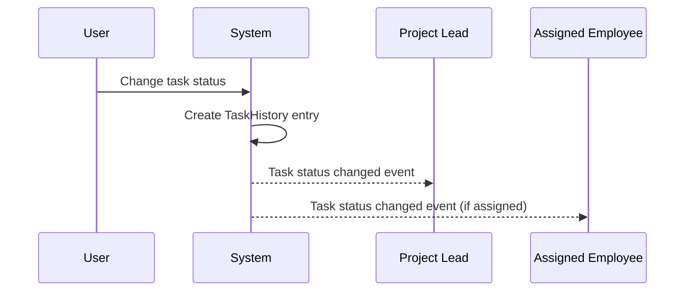

### Status Transition Notifications

When a task status transitions from open to in-progress, the system SHALL emit an open to in-progress notification event. This event SHALL notify the project lead that work has begun on the task. The event SHALL include the task title, the assigned employee who started working, and the timestamp of the transition.

When a task status transitions from in-progress to completed, the system SHALL emit an in-progress to completed event. This event SHALL notify the project lead that the task work is finished and ready for review or closure. The event SHALL include the task title, the employee who completed the task, and the timestamp.

When a task is closed, the system SHALL emit a task closed notification. This event SHALL notify the project lead that the task workflow has concluded. The event SHALL include the task title, who closed the task, and the timestamp. These workflow coordination events SHALL help project leads track task progress across their projects without manual check-ins.

### Event Payload and Subscription Rules

Each task history event SHALL include the following information in the event payload: the task identifier and title, the project identifier, the old status value, the new status value, the timestamp when the status change was recorded, and the identifier and display name of the user who changed the status.

Task history events SHALL follow the same subscription rules as task events. Users SHALL subscribe to task events at the project level to receive task history notifications for all tasks within a project. Project leads SHALL be automatically subscribed to task history events for projects they lead. Employees assigned to a task SHALL be automatically subscribed to status change events for that specific task.

Users without project view permission SHALL NOT receive task history events for that project. Task history events SHALL be real-time and delivered immediately when the status change is recorded.

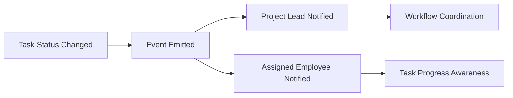

### Workflow Update Notifications

Task history events SHALL serve as workflow update notifications to support project coordination. When multiple status changes occur in rapid succession, each status change SHALL generate a separate event to preserve the complete workflow history.

The system SHALL include the status change timestamp in each event to enable recipients to reconstruct the sequence of status changes. The system SHALL include who changed the status in each event to support accountability and follow-up communication.

When a task is reassigned along with a status change, the task status changed event SHALL be accompanied by relevant task assignment event information. Project leads receiving these events SHALL be able to understand both the status progression and responsibility changes for tasks in their projects.

## Timelog Events

Timelog events notify relevant parties when time entries are created, modified, or deleted. When an employee creates a timelog entry, they receive confirmation of the logged time. When an employee edits their own timelog that is not part of an approved timesheet, the modification is reflected in their records. When a timelog is deleted, the employee receives notification of the removal. Users with time management permissions receive notifications about timelog changes for employees they oversee. Users with view all timelogs permission can subscribe to timelog events across the organization. These events support accurate time tracking visibility and help managers monitor team productivity.

### Timelog Created Event

WHEN an employee creates a timelog entry, THE system SHALL emit a timelog created event containing the date, duration, project, and task if assigned.

WHEN a timelog created event is emitted, THE system SHALL send the event to the employee who created the timelog as confirmation of the time entry.

WHEN a timelog created event is emitted, THE system SHALL update the employee's personal dashboard to reflect the newly logged hours for today and this week.

WHEN a timelog is created with the billable flag set, THE system SHALL include the billable status in the timelog created event.

WHEN an employee creates a timelog entry, THE system SHALL update the project time tracking totals for the selected project.

### Timelog Modified Event

WHEN an employee edits their own timelog that is not part of an approved timesheet, THE system SHALL emit a timelog modified event to the employee.

WHEN a timelog's duration is changed, THE system SHALL include the old duration and new duration in the timelog modified event.

WHEN a timelog's billable flag is changed, THE system SHALL include the previous and new billable status in the timelog modified event.

WHEN a timelog's project assignment is changed, THE system SHALL emit the timelog modified event and update time tracking totals for both the old and new projects.

WHEN a user with time management permission edits any employee's timelog, THE system SHALL emit a timelog modified event to both the timelog owner and the user who made the change.

### Timelog Deleted Event

WHEN an employee deletes their own timelog that is not part of any submitted or approved timesheet, THE system SHALL emit a timelog deleted event to the employee.

WHEN a timelog deleted event is emitted, THE system SHALL update the employee's personal dashboard to reflect the removed hours from today and this week totals.

WHEN a timelog is deleted, THE system SHALL update the project time tracking totals for the associated project.

WHEN a user with time management permission deletes any employee's timelog, THE system SHALL emit a timelog deleted event to both the timelog owner and the user who performed the deletion.

WHEN a timelog is removed from a draft timesheet, THE system SHALL update the timesheet's total hours calculation.

### Manager Timelog Notification

WHEN a timelog created, modified, or deleted event is emitted, THE system SHALL send the event to users with time view all permission who are subscribed to organization-wide timelog events.

WHEN a user with time management permission modifies or deletes another employee's timelog, THE system SHALL notify the timelog owner of the change.

WHEN a manager views timelog events, THE system SHALL include the employee name associated with each timelog event.

WHEN users with time management permission subscribe to timelog events, THE system SHALL allow filtering by employee, project, or date range.

### Approved Timesheet Lock Event

WHEN a timesheet is approved, THE system SHALL emit an approved timesheet lock event for each timelog included in the timesheet.

WHEN an approved timesheet lock event is emitted, THE system SHALL notify the employee that their timelogs for that week are now locked and cannot be edited or deleted.

WHEN an approved timesheet lock event is emitted, THE system SHALL mark the timelogs as locked in the project time tracking records.

WHEN a user with time management permission attempts to edit a locked timelog, THE system SHALL reject the request and return an error indicating the timelog is locked due to an approved timesheet.

## Timesheet Events

Timesheet events notify relevant parties when timesheet status changes occur. When an employee submits a timesheet for approval, users with timesheet approval permission receive notification that a new timesheet is awaiting review. When a timesheet is approved, the employee receives notification that their timesheet has been accepted and their timelogs are now locked. When a timesheet is rejected, the employee receives notification including the rejection reason and instructions that they can modify and resubmit. When a rejected timesheet is resubmitted, approvers receive notification again. These events ensure timely communication in the approval workflow and help employees track their timesheet status.

### Timesheet Submission Notification

WHEN an employee submits a timesheet for approval, THE system SHALL send a real-time notification to all users with timesheet approval permission in the organization.

The notification SHALL include the employee's name, the week start date (Monday), and the total hours submitted.

The notification SHALL indicate that a new timesheet is awaiting review.

Users with time:approve permission SHALL receive the notification immediately upon timesheet submission.

The notification SHALL be scoped to the current organization context.

If multiple users have timesheet approval permission, all of them SHALL receive the notification.

### Timesheet Approved Event

WHEN a timesheet is approved by a user with timesheet approval permission, THE system SHALL send a real-time notification to the employee who owns the timesheet.

The notification SHALL confirm that the timesheet has been approved.

The notification SHALL include the week start date and week end date of the approved timesheet.

WHEN a timesheet is approved, THE system SHALL send a notification to the employee that all timelogs in the approved timesheet are now locked.

The notification SHALL indicate that locked timelogs cannot be edited or deleted.

The approved event SHALL include the name of the user who approved the timesheet.

The timestamp of when the approval occurred SHALL be included in the event.

### Timesheet Rejected Notification

WHEN a timesheet is rejected by a user with timesheet approval permission, THE system SHALL send a real-time notification to the employee who owns the timesheet.

The notification SHALL include the rejection reason provided by the approver.

The notification SHALL indicate that the timesheet has been returned to draft status.

The notification SHALL inform the employee that they can modify the timesheet and resubmit it for approval.

The rejected notification SHALL include the name of the user who rejected the timesheet.

The timestamp of when the rejection occurred SHALL be included in the notification.

The week start date of the rejected timesheet SHALL be included in the notification.

### Timesheet Resubmitted Alert

WHEN an employee resubmits a previously rejected timesheet, THE system SHALL send a real-time notification to all users with timesheet approval permission.

The notification SHALL indicate that the timesheet has been resubmitted after rejection.

The notification SHALL include the employee's name and the week start date.

The notification SHALL include the total hours in the resubmitted timesheet.

All users with time:approve permission SHALL receive the resubmission alert regardless of whether they previously reviewed the timesheet.

The notification SHALL be distinguishable from a new timesheet submission notification.

### Timesheet Status Change Notifications

WHEN a timesheet status changes from draft to submitted, THE system SHALL send a notification to approvers indicating a pending timesheet awaits review.

WHEN a timesheet status changes from submitted to approved, THE system SHALL send a notification to the employee confirming approval and timelog locking.

WHEN a timesheet status changes from submitted to rejected, THE system SHALL send a notification to the employee with the rejection reason.

WHEN a timesheet status changes from rejected back to submitted (resubmission), THE system SHALL send a notification to approvers indicating a new pending review.

Each status change event SHALL include the previous status and the new status.

Each status change event SHALL include a timestamp of when the change occurred.

Each status change event SHALL identify the user who triggered the status change (except for automatic system changes).

## Timer Events

Timer events notify the employee when their timer state changes. When an employee starts a timer for a project and optional task, they receive confirmation that time tracking is active. When a timer is stopped, the employee receives notification that a timelog has been created with the calculated duration. When a timer is discarded, the employee receives confirmation that no timelog was created. When timer details such as description or project assignment are modified during an active timer, the employee receives confirmation of the changes. Each employee subscribes only to their own timer events, ensuring privacy for individual time tracking activities.

### Timer Started Event

WHEN an employee starts a timer, THE system SHALL emit a timer started event to the employee.

The timer started event SHALL include the start timestamp, selected project, optional task, and description.
WHEN a timer is successfully started, THE system SHALL send an active timer confirmation to the employee.

IF an employee already has an active timer, THEN THE system SHALL reject the timer start request and emit an error event.

THE system SHALL enforce single active timer per employee at all times.
WHEN a timer start is rejected due to existing active timer, THE system SHALL include the existing timer's details in the error event.

### Timer Stopped Event

WHEN an employee stops their timer, THE system SHALL emit a timer stopped event to the employee.

The timer stopped event SHALL include the calculated duration rounded to the nearest minute.
WHEN a timer is stopped, THE system SHALL automatically create a timelog with the calculated duration.

The timer stopped event SHALL include the created timelog details including date, project, task, description, and billable flag.
WHEN a timelog is created from a stopped timer, THE system SHALL emit a timelog created event.

The duration calculation SHALL be based on the elapsed time from the start timestamp to the stop timestamp.

### Timer Discarded Event

WHEN an employee discards their timer, THE system SHALL emit a timer discarded event to the employee.

The timer discarded event SHALL confirm that no timelog was created.
WHEN a timer is discarded, THE system SHALL NOT create any timelog entry.

The timer discarded event SHALL include the original timer details (start timestamp, project, task, description) for reference.

### Timer Modified Events

WHEN an employee modifies the description of a running timer, THE system SHALL emit a timer description modified event to the employee.

The timer description modified event SHALL include the updated description.
WHEN an employee changes the project assignment of a running timer, THE system SHALL emit a timer project changed event to the employee.

The timer project changed event SHALL include the new project and optional task.
IF the new project is not one the employee is assigned to, THEN THE system SHALL reject the project change and emit an error event.

### Personal Timer Subscription

THE system SHALL allow each employee to subscribe only to their own timer events.

WHEN an employee subscribes to timer events, THE system SHALL deliver only events related to that employee's timers.

THE system SHALL NOT deliver timer events from one employee to another employee.
WHEN an employee's timer state changes, THE system SHALL deliver the event only to that employee's active subscription.

The personal timer subscription SHALL ensure privacy for individual time tracking activities.

### Active Timer Duration Tracking

WHILE a timer is active, THE system SHALL calculate and display the running duration to the employee.

The duration SHALL update in real-time while the timer is running.
WHEN an employee views their currently running timer, THE system SHALL provide the current elapsed duration.

IF an employee forgets to stop their timer, THE system SHALL allow the timer to continue running indefinitely without automatic stop.

## ActivityLog Events

Activity log events notify users with organization management permission when significant actions are recorded in the system. When employee-related actions occur such as invitation, deactivation, reactivation, or role changes, activity log events are triggered for organization managers. When project-related actions occur such as creation, archival, completion, or deletion, managers are notified. When timesheet-related actions occur such as submission, approval, or rejection, relevant managers receive notifications. These events provide real-time visibility into organizational activities and help managers maintain awareness of important changes. Only users with organization management permission can subscribe to activity log events.

### Activity Log Entry Created Event

When a significant action is recorded in the system, THE SYSTEM SHALL broadcast an activity log created event to all users with organization management permission.

The activity log created event SHALL include the timestamp of when the action occurred.
The activity log created event SHALL include the user who performed the action.
The activity log created event SHALL include the action type that was recorded.
The activity log created event SHALL include the target entity affected by the action.
The activity log created event SHALL include additional details about the action in a structured format.

Users with organization management permission SHALL be able to subscribe to activity log events.
Users without organization management permission SHALL NOT receive activity log events.

The system SHALL broadcast activity log events in real-time to all connected subscribers within the organization.
Activity log events SHALL be scoped to the organization context and SHALL NOT cross organization boundaries.

### Employee Activity Events

When an employee is invited to the organization, THE SYSTEM SHALL broadcast an employee invited activity event.
The employee invited activity event SHALL include the email address of the invited person.
The employee invited activity event SHALL include the user who sent the invitation.

When an employee is deactivated, THE SYSTEM SHALL broadcast an employee deactivated activity event.
The employee deactivated activity event SHALL include the deactivated employee's name.
The employee deactivated activity event SHALL include the user who performed the deactivation.

When a deactivated employee is reactivated, THE SYSTEM SHALL broadcast an employee reactivated activity event.
The employee reactivated activity event SHALL include the reactivated employee's name.
The employee reactivated activity event SHALL include the user who performed the reactivation.

When an employee's role is changed, THE SYSTEM SHALL broadcast a role changed activity event.
The role changed activity event SHALL include the employee's name.
The role changed activity event SHALL include the previous role.
The role changed activity event SHALL include the new role.
The role changed activity event SHALL include the user who changed the role.

All employee activity events SHALL be broadcast to users with organization management permission in real-time.

### Project Activity Events

When a project is created, THE SYSTEM SHALL broadcast a project created activity event.
The project created activity event SHALL include the project name.
The project created activity event SHALL include the user who created the project.

When a project is archived, THE SYSTEM SHALL broadcast a project archived activity notification.
The project archived activity notification SHALL include the project name.
The project archived activity notification SHALL include the user who archived the project.

When a project is marked as completed, THE SYSTEM SHALL broadcast a project completed activity event.
The project completed activity event SHALL include the project name.
The project completed activity event SHALL include the user who completed the project.

When a project is deleted, THE SYSTEM SHALL broadcast a project deleted activity event.
The project deleted activity event SHALL include the project name.
The project deleted activity event SHALL include the user who deleted the project.

All project activity events SHALL be broadcast to users with organization management permission in real-time.
Project activity events provide managers with real-time visibility into project lifecycle changes.

### Timesheet Activity Events

When a timesheet is submitted for approval, THE SYSTEM SHALL broadcast a timesheet submitted activity event.
The timesheet submitted activity event SHALL include the employee who submitted the timesheet.
The timesheet submitted activity event SHALL include the week start date of the timesheet.

When a timesheet is approved, THE SYSTEM SHALL broadcast a timesheet approved activity event.
The timesheet approved activity event SHALL include the employee whose timesheet was approved.
The timesheet approved activity event SHALL include the user who approved the timesheet.
The timesheet approved activity event SHALL include the week start date of the timesheet.

When a timesheet is rejected, THE SYSTEM SHALL broadcast a timesheet rejected activity event.
The timesheet rejected activity event SHALL include the employee whose timesheet was rejected.
The timesheet rejected activity event SHALL include the user who rejected the timesheet.
The timesheet rejected activity event SHALL include the rejection reason.
The timesheet rejected activity event SHALL include the week start date of the timesheet.

All timesheet activity events SHALL be broadcast to users with organization management permission in real-time.
Timesheet activity events enable managers to maintain awareness of timesheet workflow changes as they occur.

# File Storage

File upload capabilities, media processing, and storage requirements.

## File Upload and Management

Define file upload capabilities, supported formats, processing requirements, and access control for stored files.

### Organization Logo Management

Organization owners can upload a logo image for their organization during organization creation or when editing organization settings.

The logo image serves as the visual identity of the organization.

Organization owners can replace the existing logo image with a new one.

Organization owners can remove the logo image, leaving the organization without a logo.

When an organization is deleted, the associated logo image is deleted.

Only organization owners can manage the organization logo.

Employees can view the organization logo.

### User Avatar Management

Users can upload an avatar image for their global profile.

The avatar image is shared across all organizations the user belongs to.

Users can replace their existing avatar image with a new one.

Users can remove their avatar image, leaving their profile without an avatar.

When a user account is deleted, the associated avatar image is deleted.

Only the user themselves can manage their avatar image.

Users can view other users' avatar images in shared organizational contexts.