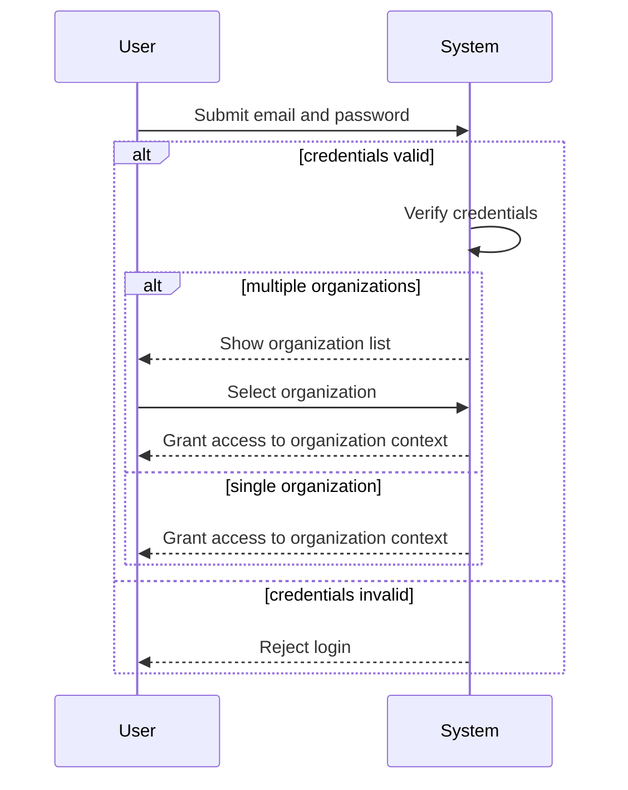
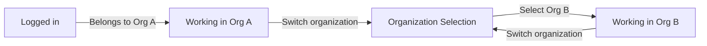
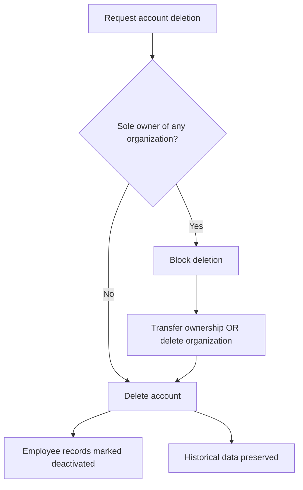
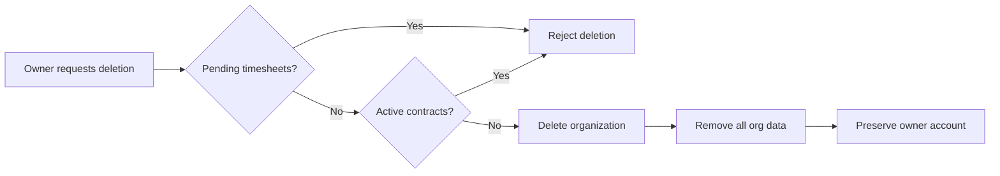
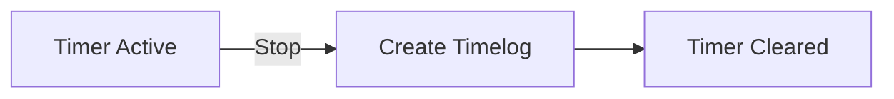
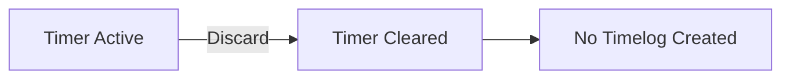
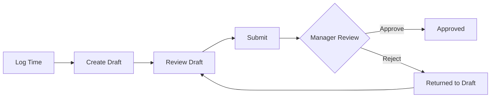
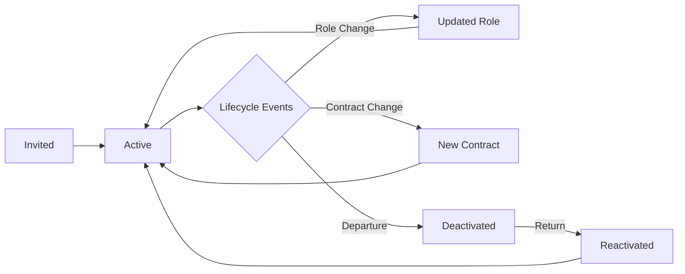

**erpHrm — What operations users can perform, use cases, business workflows**

What operations users can perform, use cases, business workflows

# Core Business Operations

What the system must do for each business concept.

## User Operations

Users sign up for an account using their email address and password, creating a global profile that includes a display name, optional avatar image, and optional phone number. After signing up, users can log in with their email and password credentials. Users can change their password at any time through their account settings. A single user account can belong to multiple organizations, allowing them to participate in different company workspaces. When logging in, users select which organization context they want to work in, and all subsequent actions are scoped to that selected organization. Users can switch between organizations they belong to without logging out. Users can edit their profile information, which is shared across all organizations they are associated with. Users can delete their account, but this action has constraints: if they are the sole owner of an organization, they must either transfer ownership or delete the organization first before their account can be deleted. When a user account is deleted, their employee records in other organizations are marked as deactivated rather than removed.

### Account Registration

Users can sign up for a new account using their email address and a password. The email address serves as the unique identifier for the account. The password is required and must be provided during sign-up. If the email address is already registered, the sign-up request is rejected. Upon successful sign-up, a global user profile is created for the user. If the user signs up with an email that has pending organization invitations, they are automatically added to those organizations as employees. The new account has no organization associations unless invited.

### Authentication and Organization Selection

Users can log in to the system using their registered email address and password. If the credentials do not match, the login request is rejected. If a user belongs to multiple organizations, the system requires them to select which organization context to work in after successful login. All subsequent actions within the session are scoped to the selected organization. If a user belongs to only one organization, that organization is automatically selected as the working context. Users can view the list of organizations they belong to during the organization selection step.

### Password Management

Authenticated users can change their password through their account settings. The user must provide their current password to authorize the password change. If the current password is incorrect, the password change request is rejected. The new password must meet the system's password requirements. After successfully changing the password, the user can continue using the system with the new password for future logins.

### User Profile

Each user account has a global profile that is shared across all organizations the user belongs to. The user profile includes a display name, which is required and shown to other users within organizations. The profile can include an avatar image, which is optional and displayed in the user interface. The profile can include a phone number, which is optional and available for contact purposes.

Users can edit their profile information at any time. Changes to the profile (display name, avatar image, phone number) are immediately visible across all organizations the user belongs to. There is no approval process for profile changes; users have full control over their own profile information. The profile does not include organization-specific information such as role, department, or position.

### Multi-Organization Access

A single user account can belong to multiple organizations. This allows users to participate in different company workspaces using the same account credentials. Each organization operates independently, and the user may have different roles and permissions in each organization.

Users can switch between organizations they belong to without logging out. When switching organizations, the user's context changes to the newly selected organization, and all subsequent actions are scoped to that organization. Data from one organization is not visible when working in another organization's context. The organization switch is immediate and does not require re-authentication.

### Account Deletion

Users can delete their account through account settings. When a user requests account deletion, the system checks whether the user is the sole owner of any organization. If the user is the sole owner of one or more organizations, the account deletion is blocked until the user resolves the ownership situation.

To delete an account when the user is a sole owner, the user must either:
- Transfer ownership of the organization to another employee, or
- Delete the organization entirely

Transferring ownership requires the organization to have at least one other employee who can become the owner. Deleting an organization has additional constraints (see Organization Deletion section).

When a user account is deleted successfully:
- The user's account and profile are permanently removed
- The user's employee records in all other organizations are marked as "deactivated" (not deleted)
- Deactivated employees' historical data (timelogs, timesheets) is preserved
- Deactivated employees cannot log time or submit timesheets

If the user had no sole ownership constraints, the deletion proceeds immediately after confirmation.

## Organization Operations

Users create a new organization during the initial sign-up process, establishing an independent workspace with its own employees, projects, and data. Each organization operates in isolation from others through multi-tenancy architecture. An organization has a name, optional description, optional logo image, currency setting such as USD or EUR or KRW, timezone configuration, and fiscal start month for accounting purposes. Organization owners can edit organization settings including name, description, logo, currency, timezone, and fiscal month. Organization owners can delete their organization, but only when all pending timesheets have been resolved (approved or rejected) and there are no active employee contracts. When an organization is deleted, all associated employees, projects, tasks, timelogs, and timesheets are permanently removed, while the owner's user account remains intact but no longer associated with any organization. All data within an organization is strictly isolated from other organizations, ensuring complete separation of business information.

### Organization Creation During Sign-Up

### Organization Creation During Sign-Up

When a new user signs up for the platform, THE SYSTEM SHALL require the creation of an organization as part of the sign-up process.

The user creating the organization SHALL become the organization owner with full administrative access.

When creating an organization during sign-up, THE SYSTEM SHALL require the following fields:
- Organization name (required)
- Currency (required, e.g., USD, EUR, KRW)
- Timezone (required)
- Fiscal start month (required)

When creating an organization during sign-up, THE SYSTEM SHALL allow the following optional fields:
- Organization description (optional)
- Logo image (optional)

Upon successful organization creation, THE SYSTEM SHALL automatically assign the Owner role to the user who created the organization.

The newly created organization SHALL operate as an independent workspace with its own employees, projects, and data completely separate from other organizations.

### Multi-Tenancy and Data Isolation

### Multi-Tenancy and Data Isolation

THE SYSTEM SHALL support multiple organizations operating independently within the same platform.

Each organization SHALL have its own isolated data including employees, projects, tasks, timelogs, and timesheets.

When a user belongs to multiple organizations, THE SYSTEM SHALL require the user to select an organization context after logging in.

All subsequent actions performed by a user SHALL be scoped to the currently selected organization context.

Users SHALL be able to switch between organizations without logging out.

THE SYSTEM SHALL prevent employees in one organization from accessing any data belonging to another organization.

When a user switches organizations, THE SYSTEM SHALL immediately change the data context to reflect only the newly selected organization's data.

The organization context SHALL be enforced on every request to ensure complete data isolation between organizations.

Each organization operates as an independent workspace where users can manage their own employees, projects, and time tracking without visibility into other organizations' operations.

### Organization Settings and Configuration

### Organization Settings and Configuration

Each organization SHALL have the following configurable settings:

**Required Fields:**
- Organization name — the display name of the organization
- Currency — the default currency used for financial operations (e.g., USD, EUR, KRW)
- Timezone — the timezone setting for date and time calculations
- Fiscal start month — the month that begins the fiscal year

**Optional Fields:**
- Organization description — a text description of the organization
- Logo image — an image URL representing the organization's logo

When a new organization is created, THE SYSTEM SHALL store all provided configuration values.

The currency setting SHALL be used for pay rate calculations and financial reporting within the organization.

The timezone setting SHALL affect how dates and times are displayed and calculated for organization-specific operations.

The fiscal start month SHALL determine the start of fiscal periods for reporting purposes.

Organization settings are specific to each organization and do not affect other organizations on the platform.

### Editing Organization Settings

### Editing Organization Settings

Only users with the Owner role SHALL have permission to edit organization settings.

When an owner edits organization settings, THE SYSTEM SHALL allow modification of all organization fields:
- Organization name
- Organization description
- Logo image
- Currency
- Timezone
- Fiscal start month

THE SYSTEM SHALL validate that required fields (name, currency, timezone, fiscal start month) are not empty when saving changes.

When an owner updates organization settings, THE SYSTEM SHALL persist the changes immediately and apply them to all organization operations.

Changes to organization settings SHALL NOT affect historical data or previously recorded timelogs and timesheets.

Only the organization owner can modify organization configuration; users with other roles including Manager cannot edit organization settings.

### Organization Deletion

### Organization Deletion

When an organization owner requests to delete their organization, THE SYSTEM SHALL enforce the following preconditions:

**Condition 1: Timesheet Resolution**
- All pending timesheets within the organization MUST be resolved (approved or rejected)
- THE SYSTEM SHALL reject the deletion request if any timesheets have status "submitted" or "draft"

**Condition 2: Active Contracts**
- There MUST be no active employee contracts in the organization
- THE SYSTEM SHALL reject the deletion request if any employee has an active contract (contract with null end date)

If all preconditions are met, THE SYSTEM SHALL proceed with organization deletion.

When an organization is deleted, THE SYSTEM SHALL permanently remove the following data:
- All employee records within the organization
- All projects and their associated tasks
- All timelogs ever recorded
- All timesheets (approved, rejected, and resolved)
- All departments
- All roles (including custom roles)
- All activity logs for the organization
- All pending invitations

When an organization is deleted, THE SYSTEM SHALL preserve the owner's user account but remove the association with the deleted organization.

The owner SHALL be able to create a new organization or join other organizations after deletion.

Organization deletion is irreversible; once deleted, the data cannot be recovered.

## Employee Operations

Users with employee management permission can invite new employees to the organization by sending an invitation via email address. If the invited email already has an existing user account, that user is immediately added to the organization. If the invited email has no account, a pending invitation is created and the user is automatically added to the organization when they sign up with that email address. Each employee record contains a reference to the user account, an assigned role within the organization, an optional department assignment, an optional position or title, an employment type classification as full-time or part-time or contractor or intern, and a status of active or deactivated. Users with employee management permission can edit employee records to update department, position, and employment type. Users with employee management permission can deactivate employees, which prevents them from logging time or submitting timesheets while preserving their historical data such as timelogs and timesheets. Deactivated employees can be reactivated to restore their access. Users with employee view permission can view the employee list. The employee list supports pagination and can be filtered by department, employment type, and status, as well as searched by employee name.

### Employee Record Structure

Each employee record within an organization contains a reference to the user account, an assigned role, an optional department assignment, an optional position or title, an employment type classification, and a current status.

The employment type must be one of the following values: full-time, part-time, contractor, or intern.

The status must be one of the following values: active or deactivated.

New employees added to an organization are assigned the status of active by default.

The department assignment is optional and may be left unassigned.

The position or title is optional and may be left unspecified.

### Employee Role Assignment

Each employee in an organization is assigned exactly one role.

Users with the employee management permission can assign a role to a new employee during the invitation process.

Users with the employee management permission can change the role assigned to an existing employee.

When a role is changed, the employee immediately gains the permissions associated with the new role.

An employee cannot be left without a role assignment.

The role assigned to an employee must be a role that exists within the same organization.

### Employee Record Editing

Users with the employee management permission can edit employee records.

The fields that can be edited are: department assignment, position or title, and employment type.

The role assignment can be changed as a separate operation.

Editing an employee record does not change the employee's status.

Changes to employee records are recorded in the activity log.

### Employee Deactivation

Users with the employee management permission can deactivate an active employee.

When an employee is deactivated, their status changes from active to deactivated.

A deactivated employee cannot log time entries or submit timesheets.

A deactivated employee cannot start or manage timers.

All historical data belonging to a deactivated employee is preserved, including timelogs, timesheets, and task assignments.

Deactivated employees remain visible in the employee list with their status shown as deactivated.

Deactivation is a reversible action; a deactivated employee can be reactivated.

### Employee Reactivation

Users with the employee management permission can reactivate a deactivated employee.

When an employee is reactivated, their status changes from deactivated to active.

A reactivated employee regains the ability to log time entries and submit timesheets.

A reactivated employee can start and manage timers.

All historical data from before deactivation remains available.

The employee's previously assigned role is restored upon reactivation.

### Employee List Viewing

Users with the employee view permission can view the employee list.

Users with the employee management permission can also view the employee list.

The employee list displays all employees within the organization.

Each employee entry in the list shows their display name, role, department, employment type, and status.

The employee list is paginated, displaying a fixed number of employees per page.

Users can navigate through pages to view all employees.

The employee list supports filtering by department, employment type, and status.

The employee list supports searching by employee name to find specific employees.

Multiple filters can be combined to narrow the results.

The search by name matches against the display name of the user associated with each employee record.

## Role Operations

Each organization maintains its own independent set of roles for managing member permissions. Three built-in roles exist in every organization and cannot be deleted: Owner has full access to all features and can manage roles and members, Manager can manage employees and projects, approve timesheets, and view reports, and Employee can track time, submit timesheets, and view their own data. Organization owners can create custom roles with a unique name and a specific set of permissions. Available permissions include organization management, employee management and viewing, project management and viewing, time management, approval, and viewing all timelogs, and report viewing. Organization owners can edit custom roles to modify their name or permissions. Organization owners can delete custom roles only when no employees are currently assigned to that role, ensuring role assignments remain valid. Each employee in an organization is assigned exactly one role that defines their access level. Role assignments can be changed by users who have employee management permission.

### Built-in Roles

Each organization has three built-in roles that are automatically created when the organization is formed. These roles cannot be deleted.

The Owner role provides full access to all features within the organization. Users with the Owner role can manage organization settings, manage employees, manage projects, manage timelogs, approve timesheets, view all reports, and manage roles including creating, editing, and deleting custom roles.

The Manager role allows users to manage employees, manage projects, approve timesheets, and view reports. Managers can add, edit, and deactivate employees, create and edit projects, approve or reject timesheets, and access organization-wide reports.

The Employee role provides the most limited access. Users with the Employee role can track their own time by creating timelogs, submit their own timesheets for approval, and view their own data. Employees cannot manage other employees, projects, or approve timesheets.

### Custom Role Creation

Organization owners can create custom roles to define specific access levels tailored to their organization's needs.

Each custom role must have a unique name within the organization. The role name identifies the role and should clearly indicate its purpose or access level.

Each custom role includes a set of permissions that define what actions users assigned to that role can perform. Permissions are selected from the available permission list. A custom role can have any combination of permissions, allowing for flexible access control.

When creating a custom role, the organization owner specifies the role name and selects which permissions to grant. At least one permission must be assigned to create a custom role.

### Permission Definitions

The system provides the following permissions that can be assigned to roles:

Organization management permission (org:manage) allows the user to edit organization settings including name, description, logo, currency, timezone, and fiscal start month. This permission also grants access to view the full activity log.

Employee management permission (employee:manage) allows the user to invite new employees, edit employee records including department, position, and employment type, deactivate and reactivate employees, and change role assignments for employees.

Employee viewing permission (employee:view) allows the user to view the employee list and individual employee details including their contracts.

Project management permission (project:manage) allows the user to create, edit, archive, complete, and delete projects, create and edit tasks within any project, and assign or remove employees from projects.

Project viewing permission (project:view) allows the user to view all projects and their associated tasks.

Time management permission (time:manage) allows the user to edit or delete any employee's timelogs, regardless of who created them.

Time approval permission (time:approve) allows the user to view all submitted timesheets and approve or reject them.

All time viewing permission (time:view_all) allows the user to view all employees' timelogs and timesheets across the organization.

Report viewing permission (report:view) allows the user to access organization reports including time reports, project budget reports, weekly summary reports, and the organization dashboard.

### Custom Role Modification

Organization owners can edit custom roles to modify their name or permissions.

When editing a custom role, the owner can change the role name to a new unique name within the organization. The new name must not conflict with existing role names.

The owner can add or remove permissions from a custom role. Removing a permission from a role immediately affects all employees assigned to that role. They will no longer be able to perform actions that require that permission.

Adding a permission to a role immediately grants that access to all employees currently assigned to that role.

Built-in roles cannot be modified. Their name and permissions are fixed and cannot be changed.

### Custom Role Deletion

Organization owners can delete custom roles, but only under specific conditions.

A custom role can be deleted only when no employees are currently assigned to that role. This ensures that no employee is left without a valid role assignment.

If any employee is assigned to a custom role, the owner must first reassign those employees to a different role before the custom role can be deleted.

The deletion of a custom role is permanent. Once deleted, the role cannot be restored. If a similar role is needed again, it must be recreated from scratch.

Built-in roles cannot be deleted under any circumstances. The Owner, Manager, and Employee roles are permanent fixtures in every organization.

### Role Assignment

Each employee in an organization is assigned exactly one role. This role defines what actions the employee can perform within the organization.

A new employee is assigned a role during the invitation process. The inviter selects which role the new employee will have.

Users with the employee management permission (employee:manage) can change the role assignment for any employee. This includes changing an employee from the Employee role to the Manager role, or from any role to another role.

When changing a role assignment, the new role takes effect immediately. The employee gains all permissions associated with the new role and loses all permissions that were exclusive to the previous role.

An employee cannot be left without a role assignment. When changing roles, the new role must be specified before the change is saved.

Role assignments can be changed multiple times as needed to adjust employee access levels based on their responsibilities.

## Department Operations

Each organization can define departments to group employees by functional areas. Each department has a required name, an optional description, and an optional parent department allowing for one level of hierarchical nesting. Users with organization management permission can create new departments, edit existing department names and descriptions, and delete departments. When a department is deleted, employees who were assigned to that department have their department reference cleared to null, but the employees themselves are not deleted. Employees can view the list of departments within their organization. Department assignments help organize the employee roster and can be used for filtering employee lists.

### Department Creation

Users with organization management permission can create departments within their organization to group employees by functional areas. Each department must have a name, which is required. A department can optionally have a description providing additional context about the department's purpose or responsibilities. The user creating the department must possess the org:manage permission; otherwise, the request is rejected.

If the department name is not provided, the request is rejected. Department names should be unique within the organization to avoid confusion when assigning employees or filtering lists.

Optionally, a parent department can be specified to create a hierarchical relationship. The parent department must already exist within the same organization. Nesting is limited to one level—a department cannot be a parent of another department if it already has a parent itself. If a parent department is specified that does not exist or would exceed the one-level nesting limit, the request is rejected.

### Department Hierarchy

Departments can be organized in a simple two-level hierarchy using parent department relationships. Each department can have at most one parent department, creating a one-level nesting structure. A department that has a parent cannot itself become a parent of another department. This constraint ensures the organizational structure remains flat and manageable.

The hierarchy allows organizations to represent broad functional areas (e.g., "Engineering") with sub-departments (e.g., "Frontend Team", "Backend Team") beneath them. Employees assigned to a sub-department are still considered part of the broader parent department for organizational purposes.

If an attempt is made to create a department with more than one level of nesting, the request is rejected. If an attempt is made to set a department as a parent when that department already has a parent, the request is rejected.

### Department Modification

Users with organization management permission can edit existing department information. Editable fields include the department name and description. The parent department relationship cannot be changed after a department is created; to restructure the hierarchy, the department must be deleted and recreated.

When editing a department name, the new name must follow the same requirements as during creation: it is required and should be unique within the organization. If the new name is not provided or would create a duplicate, the request is rejected.

Only users with the org:manage permission can modify departments. Employees without this permission cannot edit department information.

### Department Deletion

Users with organization management permission can delete departments from the organization. When a department is deleted, employees who were assigned to that department have their department reference cleared to null. The employees themselves are not deleted and remain active in the organization.

Historical data such as timelogs and timesheets created by employees while they were assigned to the deleted department are preserved unchanged. The department assignment at the time of the timelog is not retroactively modified.

Only users with the org:manage permission can delete departments. If an employee without this permission attempts to delete a department, the request is rejected.

### Viewing Departments

Employees can view the list of departments within their organization. This allows employees to understand the organizational structure and see which departments exist. The department list displays each department's name and description.

For departments with a parent department, the parent relationship is shown in the list view. This helps employees understand the hierarchical structure of departments within the organization.

Viewing departments does not require special permissions; all employees within an organization can access this information.

### Employee Department Assignment

Department assignments help organize the employee roster and enable filtering of employees by functional area. Employees can be assigned to a department when their employee record is created or edited by users with employee management permission.

When viewing the employee list, employees can filter the list by department to see only those employees assigned to a specific department. This is useful for managers reviewing team composition or employees identifying colleagues in their functional area.

Department assignment is optional—an employee can exist without being assigned to any department. When a department is deleted, employees previously assigned to it become unassigned (department reference set to null) but can later be reassigned to another department.

Filtering by department is available in the employee list view. Selecting a department shows only employees currently assigned to that department. Selecting "no department" or an unassigned filter option shows employees without a department assignment.

## Contract Operations

Each employee can have multiple employment contracts maintained as historical records, but only one contract can be active at any given time. Each contract includes a required start date, an optional end date where null indicates an ongoing contract, a required pay rate as a numeric value, a pay period type as hourly or daily or weekly or monthly, required working hours per week such as 40 hours, and optional notes. Users with employee management permission can create new contracts for employees. Creating a new contract automatically ends the previous active contract by setting its end date to the day before the new contract starts. Users with employee management permission can edit the current active contract to modify its details. Past contracts with end dates in the past cannot be edited, preserving them as immutable historical records. Employees can view their own contracts. Users with employee view permission can view any employee's contracts.

### Contract Creation

Users with employee management permission can create new contracts for employees in the organization.

Each contract requires a start date that indicates when the employment under this contract begins. The start date is a mandatory field.

The end date is optional. When the end date is null, the contract is considered ongoing without a predetermined conclusion. When specified, the end date indicates when the employment under this contract terminates.

Each contract requires a pay rate as a numeric value representing the employee's compensation amount.

Each contract requires a pay period that defines the payment frequency. The pay period can be hourly, daily, weekly, or monthly.

Each contract requires working hours per week, such as 40 hours, indicating the expected weekly commitment.

Each contract can include optional notes for additional context or special terms.

When a new contract is created for an employee who already has an active contract, the system automatically ends the previous active contract by setting its end date to the day before the new contract's start date. This ensures only one contract can be active at any given time for each employee.

An employee can have multiple contracts maintained as historical records over their employment period.

If the user lacks employee management permission, the contract creation request is rejected.

If the start date is not provided, the request is rejected.

If the pay rate is not provided, the request is rejected.

If the pay period is not provided, the request is rejected.

If the working hours per week is not provided, the request is rejected.

### Contract Management

Each employee can have multiple employment contracts maintained as historical records throughout their tenure with the organization.

Only one contract can be active at any given time for each employee. The active contract is identified by having a start date that has passed and either a null end date or an end date in the future.

Users with employee management permission can edit the current active contract to modify its details including pay rate, pay period, working hours per week, and notes. The start date of an active contract cannot be changed.

Past contracts, defined as contracts with an end date in the past, are immutable. They cannot be edited and serve as permanent historical records of the employee's employment terms during that period.

When a contract's end date is set to a date in the past, the contract immediately becomes a past contract and is locked from further edits.

A contract with a null end date remains active until a new contract is created for the same employee, at which point the system automatically assigns an end date.

If a user attempts to edit a past contract, the request is rejected.

If a user without employee management permission attempts to edit a contract, the request is rejected.

### Contract Viewing

Employees can view their own contracts, including both active and past contracts, to review their employment terms and history.

Users with employee view permission can view any employee's contracts within the organization, including the full contract history with all details.

The contract list displays all contracts for a given employee, sorted by start date with the most recent contract shown first.

Each contract view includes the start date, end date if applicable, pay rate, pay period, working hours per week, and any notes.

When viewing contracts, employees can identify which contract is currently active.

Users without employee view permission can only view their own contracts and cannot access other employees' contract information.

If a user attempts to view another employee's contracts without the required permission, the request is rejected.

## Project Operations

Users with project management permission can create new projects to organize work. Each project has a required name, an optional description, a required color code for visual identification in the user interface, a status of active or archived or completed, optional budget hours representing the total estimated hours, an optional start date, and an optional end date. Users with project management permission can edit project details including name, description, color, status, budget hours, and dates. Users with project management permission can archive or complete projects to change their status. Archived or completed projects cannot receive new timelogs, but existing timelogs recorded on those projects are preserved. Users with project management permission can delete projects only when no timelogs have been recorded against the project. Users with project view permission can view all projects in the organization. The project list supports pagination and can be filtered by project status to show active, archived, or completed projects.

### Project Creation

Users with project management permission can create new projects within the organization. Each project requires a name for identification and a color code for visual display in the user interface. The project description is optional and can provide additional context about the project's purpose. When created, the project status is set to active by default.

Projects can optionally include budget hours representing the total estimated effort for the project. A start date and end date may be specified to indicate the planned project timeline, though both are optional.

Only users with project management permission can create projects. If the user lacks this permission, the project creation request is rejected. If the project name is not provided, the request is rejected.

### Project Editing

Users with project management permission can modify project details after creation. Editable fields include the project name, description, color code, budget hours, start date, and end date.

The project status can also be changed through editing, subject to business rules governing status transitions.

Only users with project management permission can edit projects. If the user lacks this permission, the edit request is rejected.

### Project Status Management

Users with project management permission can change a project's status to archived or completed to indicate the project is no longer actively receiving work.

When a project is archived or completed, the project can no longer receive new timelogs. Employees cannot log time against archived or completed projects. However, all existing timelogs previously recorded on the project are preserved and remain accessible.

Archived or completed projects can be returned to active status by users with project management permission if work needs to resume.

Only users with project management permission can archive or complete projects. If the user lacks this permission, the status change request is rejected.

### Project Deletion

Users with project management permission can delete projects from the organization, but only under specific conditions.

A project can only be deleted if no timelogs have been recorded against it. If the project has any associated timelogs, the deletion request is rejected. This constraint ensures historical time tracking data remains intact.

When a project is successfully deleted, all associated project member assignments and tasks are also removed. The deletion is permanent and cannot be undone.

Only users with project management permission can delete projects. If the user lacks this permission, the deletion request is rejected.

### Project Viewing and Listing

Users with project view permission can view all projects within the organization. This includes viewing project details such as name, description, color code, status, budget hours, and dates.

The project list supports pagination to handle organizations with many projects. Users can navigate through pages of projects to find specific items.

Projects can be filtered by status to show only active projects, only archived projects, or only completed projects. This helps users focus on relevant projects based on their current work needs.

Users without project view permission cannot access the project list or view individual project details.

## ProjectMember Operations

Users with project management permission can assign employees to projects as project members. An employee can be assigned to multiple projects simultaneously. Each project membership defines the relationship between an employee and a project with an assigned role of either member or project-lead. Project leads have additional permissions to manage tasks within their assigned project. Users with project management permission can remove employees from projects, ending their project membership. Employees can view which projects they are assigned to, seeing all their project memberships. Project membership is required for employees to log time against a project, ensuring only assigned team members can record work.

### Project Member Assignment

Users with project management permission can assign employees to projects.

THE system SHALL allow users with project management permission to assign employees to projects.

WHEN a user with project management permission assigns an employee to a project, THE system SHALL create a project membership record linking the employee to the project.

THE system SHALL require selection of a project member role (member or project-lead) when assigning an employee to a project.

IF the user does not have project management permission, THEN THE system SHALL reject the project member assignment.

IF the employee is already assigned to the specified project, THEN THE system SHALL reject the duplicate assignment.

IF the employee is not part of the organization, THEN THE system SHALL reject the project member assignment.

### Multiple Project Assignment

Employees can be assigned to multiple projects simultaneously.

THE system SHALL allow an employee to be assigned to multiple projects within the same organization.

WHEN an employee is assigned to multiple projects, THE system SHALL maintain separate project membership records for each project.

THE system SHALL allow an employee to have different project member roles across different projects (member in some, project-lead in others).

THE system SHALL NOT limit the number of projects an employee can be assigned to.

### Project Member Role

Each project membership has an assigned role of either member or project-lead.

THE system SHALL support two project member roles: member and project-lead.

WHEN a project membership is created, THE system SHALL record the assigned role as either member or project-lead.

THE system SHALL allow users with project management permission to change a project member's role between member and project-lead.

WHERE the project member role is project-lead, THE system SHALL grant additional task management permissions within that project.

WHERE the project member role is member, THE system SHALL NOT grant task management permissions beyond standard employee capabilities.

### Project Lead Task Management

Project leads can manage tasks within their assigned project.

WHERE an employee has the project-lead role for a project, THE system SHALL allow the employee to create tasks within that project.

WHERE an employee has the project-lead role for a project, THE system SHALL allow the employee to edit any task within that project.

WHERE an employee has the project-lead role for a project, THE system SHALL allow the employee to manage task assignments within that project.

IF an employee attempts to manage tasks in a project where they are not a project-lead, THEN THE system SHALL reject the operation unless the employee has project management permission.

WHILE an employee has the project-lead role for a project, THE system SHALL NOT grant permissions for tasks in other projects where they are not a project-lead.

### Project Member Removal

Users with project management permission can remove employees from projects.

THE system SHALL allow users with project management permission to remove employees from projects.

WHEN a project member is removed from a project, THE system SHALL delete the project membership record.

THE system SHALL preserve any existing timelogs created by the removed employee for that project.

THE system SHALL NOT delete task assignments when a project member is removed from a project.

IF the user does not have project management permission, THEN THE system SHALL reject the project member removal.

### View Assigned Projects

Employees can view which projects they are assigned to.

THE system SHALL allow employees to view all projects they are assigned to.

WHEN an employee views their assigned projects, THE system SHALL display each project with their role (member or project-lead).

THE system SHALL only show projects within the employee's current organization context.

THE system SHALL NOT show projects from other organizations the employee may belong to through different memberships.

### Project Membership for Timelogs

Project membership is required for employees to log time against a project.

WHEN an employee creates a timelog, THE system SHALL require the employee to be a project member of the selected project.

IF an employee attempts to create a timelog for a project they are not assigned to, THEN THE system SHALL reject the timelog creation.

WHEN an employee edits a timelog, THE system SHALL allow changes to the project only if the employee is a project member of the new project.

THE system SHALL NOT allow timelog creation for projects where the employee has no membership, regardless of the employee's organizational role or permissions.

## Task Operations

Project leads or users with project management permission can create tasks within a project to track specific work items. Each task has a required title, an optional description, a status of open or in-progress or completed or closed, a priority of low or medium or high or urgent, optional estimated hours for planning, an optional due date, an optional assigned employee who must be a project member, and an optional parent task allowing for one level of subtask nesting. Project leads can edit tasks within their assigned project, modifying any task field. Users with project management permission can edit any task across all projects. When task status changes, the system automatically records the change in task history including the timestamp, previous status, new status, and who made the change. Employees can view tasks in projects they are assigned to. Tasks can be filtered by status, priority, and assigned employee. Tasks can be sorted by due date, priority, or creation date.

### Task Creation

Project leads or users with project management permission can create tasks within a project. Each task must have a title, which is required. A task may have an optional description providing additional context about the work to be done. Tasks can include estimated hours for planning purposes, which is optional. A due date may be set for the task, indicating when the work should be completed. The due date is optional and may be left unspecified for tasks without specific deadlines.

The task is automatically associated with the project in which it was created. If the title is missing, the request is rejected. Only project leads assigned to the project or users with project management permission can create tasks in that project.

### Task Status

Each task has a status indicating its current state in the workflow. The available statuses are: open (the task has been created but work has not started), in-progress (work is actively being done on the task), completed (the work has been finished), and closed (the task is no longer relevant or has been resolved without completion).

When a task status changes, the system automatically records the change in the task history, including the timestamp, the previous status, the new status, and which user made the change. This provides a complete audit trail of all status transitions for the task.

### Task Priority

Each task has a priority level indicating its relative importance. The available priority levels are: low, medium, high, and urgent. Priority helps team members understand which tasks should be addressed first when multiple tasks are pending. The priority is set when the task is created and can be modified when editing the task.

### Task Assignment

A task can be assigned to a specific employee who will be responsible for completing the work. Task assignment is optional. When assigning a task, the assigned employee must be a member of the project to which the task belongs. If an attempt is made to assign a task to an employee who is not a project member, the request is rejected. A task may remain unassigned until a suitable team member is identified.

### Subtask Structure

Tasks can have a parent task, allowing for one level of subtask nesting. This enables breaking down larger tasks into smaller, manageable subtasks. A task can be a parent to multiple subtasks, but subtasks cannot have their own subtasks (only one level of nesting is supported). When a task is designated as a subtask, it references its parent task. The parent task reference is optional.

### Task Editing Permissions

Project leads can edit tasks within projects they are assigned to as project leads. They can modify any task field including title, description, status, priority, estimated hours, due date, and assignment. Users with project management permission can edit any task across all projects in the organization, regardless of whether they are assigned to the project. When editing a task, all applicable validation rules apply. If the task title is removed during editing, the request is rejected. If the task is reassigned to an employee who is not a project member, the request is rejected.

### Task Viewing and Filtering

Employees can view tasks in projects they are assigned to. They can see all task details including title, description, status, priority, estimated hours, due date, assignment, and whether the task is a subtask. The task list is paginated for efficient browsing.

Tasks can be filtered by status (open, in-progress, completed, closed), by priority (low, medium, high, urgent), and by assigned employee. This allows users to focus on relevant subsets of tasks based on their current needs.

Tasks can be sorted by due date (earliest or latest first), by priority (highest or lowest first), or by creation date (newest or oldest first). The default sort order shows tasks sorted by creation date with the most recent first.

## TaskHistory Operations

The system automatically records task status changes in the task history log. Each task history entry captures the timestamp when the change occurred, the previous status value before the change, the new status value after the change, and the user who performed the status change. Task history provides a complete audit trail of status transitions for each task. Task history entries are created automatically by the system when task status changes and cannot be modified or deleted. Users who can view a task can also view its complete status change history. The history helps track task progress and provides accountability for status transitions.

### Automatic Task History Creation

The system automatically creates a history entry whenever a task's status changes. No user action is required to create history entries; the system generates them as a side effect of status transitions. History entries are created for all status changes including changes from open to in-progress, in-progress to completed, completed to closed, and any other valid status transitions. The system creates exactly one history entry per status change event. History entries cannot be created manually by users; they are exclusively system-generated when status changes occur.

Each history entry captures the exact moment when the status change took place by recording the timestamp. The timestamp reflects when the status transition was completed and committed to the system.

History entries cannot be manually created through any user interface or operation. Attempting to manually create a history entry is not supported by the system. All history entries originate from actual task status change events performed by users with appropriate permissions.

The automatic creation process occurs immediately upon status change confirmation. There is no delay between the status change and the creation of the corresponding history entry. This ensures the audit trail remains synchronized with actual task state changes.

### Task History Entry Contents

Each task history entry records the previous status value before the change was made. The previous status (old status) preserves the task's state prior to the transition, allowing viewers to understand what changed.

Each history entry records the new status value after the change was applied. The new status reflects the task's current state following the transition.

Each history entry identifies the user who performed the status change. This provides accountability by showing which user initiated each status transition. The recorded user is the authenticated user who submitted the status change request.

Each history entry includes the timestamp indicating exactly when the status change occurred. The timestamp provides precise timing information for audit and tracking purposes.

The combination of old status, new status, user, and timestamp in each history entry creates a complete record of who changed what and when. This information supports accountability, progress tracking, and historical analysis of task lifecycle.

History entries do not contain additional editable fields beyond the automatically captured data. The system does not support adding notes, comments, or custom metadata to history entries.

### Viewing Task History

Users who have permission to view a task can also view its complete status change history. The ability to view task history is tied to task visibility permissions.

When viewing a task, users can access the full history of all status changes made to that task since its creation. The history presents entries in chronological order, showing the progression of the task through various statuses over time.

The task history provides a complete audit trail of all status transitions. No status changes are omitted from the history; every transition is captured and preserved. Users can review the entire lifecycle of a task from creation to its current state.

Viewing history does not require separate permissions beyond the ability to view the task itself. If a user can see a task, they can see its history.

The history view shows all recorded information for each entry: the timestamp, the old status, the new status, and the user who made the change. This allows users to understand the full context of each status transition.

Users can use the history to track task progress over time and understand how the task evolved. The history provides transparency into who made changes and when those changes occurred.

Project leads can view the history of tasks within their assigned projects. Users with project management permission can view the history of any task in the organization. Employees can view the history of tasks assigned to them. Users with time approval or employee viewing permissions can view task history if they have access to view the task.

### Task History Immutability

Task history entries cannot be modified after they are created. Once a history entry is generated by the system, its contents are permanent and unchangeable. Users cannot edit the timestamp, old status, new status, or user information in any history entry.

Task history entries cannot be deleted. History entries are retained permanently as part of the task's audit record. Users with any permission level, including organization owners, cannot remove history entries.

The immutable nature of task history ensures the integrity of the audit trail. No user can alter historical records to conceal or misrepresent past status changes. This immutability supports accountability and prevents tampering with task progress records.

When a task is deleted, its history entries are also deleted as they are dependent records. However, history entries cannot be deleted independently of their associated task.

The system does not provide any functionality to modify or delete individual history entries. All history-related operations are read-only for users. The only write operation is the automatic creation performed by the system during status changes.

This immutability supports accountability for status transitions by ensuring that all changes are permanently recorded and cannot be erased or altered after the fact. Users understand that their status change actions are permanently logged and attributable to them.

## Timelog Operations

Employees can log time entries called timelogs to record work performed. Each timelog has a required date when the work occurred, a required duration in minutes, a required project that the employee is assigned to, an optional task from the same project, an optional description of what was done, and a billable flag that defaults to true. Employees can only create timelogs for themselves, recording their own work time. Employees can edit their own timelogs only if the timelog is not part of an approved timesheet, as approved timesheets lock included timelogs from modification. Employees can delete their own timelogs only if the timelog is not part of any submitted or approved timesheet. Users with time management permission can edit or delete any employee's timelogs regardless of timesheet status. Users with time view all permission can view all employees' timelogs across the organization. Employees can view their own timelogs. Timelogs support pagination for large result sets. Timelogs can be filtered by date range, project, task, and billable status.

### Timelog Creation

Employees can log time entries called timelogs to record work performed. Each timelog requires a date indicating when the work occurred. The duration must be specified in minutes representing how long the work took. The project must be specified and the employee must be assigned to that project before they can log time to it. The task is optional but if specified, it must belong to the selected project. The description is optional and can contain notes about what work was performed. The billable flag indicates whether the time is billable to a client and defaults to true. Employees can only create timelogs for themselves and cannot log time on behalf of other employees.

### Timelog Editing

Employees can edit their own timelogs only if the timelog is not part of an approved timesheet. Approved timesheets lock all included timelogs, preventing any modification. Users with the time management permission can edit any employee's timelogs regardless of whether the timelog is part of an approved timesheet. Edits can include changing the date, duration, project, task, description, or billable status. If the project is changed, the employee must be assigned to the new project. If the task is changed, it must belong to the new project.

### Timelog Deletion

Employees can delete their own timelogs only if the timelog is not part of any submitted or approved timesheet. Timelogs that have been included in a submitted timesheet awaiting approval cannot be deleted by the employee. Timelogs that have been included in an approved timesheet are permanently locked and cannot be deleted by the employee. Users with the time management permission can delete any employee's timelogs regardless of timesheet status.

### Timelog Viewing

Employees can view their own timelogs. Users with the time view all permission can view all employees' timelogs across the organization. This permission allows managers and administrators to see time tracking data for all employees in their organization context.

### Timelog Listing and Filtering

Timelogs are displayed in a paginated list to handle large result sets efficiently. Employees can filter their timelogs by date range to view time entries for a specific period. Timelogs can be filtered by project to see time spent on specific projects. Timelogs can be filtered by task to see time spent on specific tasks. Timelogs can be filtered by billable status to distinguish between billable and non-billable work. Users with the time view all permission can apply these same filters across all employees' timelogs in the organization.

## Timesheet Operations

A timesheet is a collection of timelogs representing work for a specific week from Monday to Sunday. Each timesheet has an employee owner, a week start date as Monday, a week end date as Sunday, a status of draft or submitted or approved or rejected, total hours calculated from included timelogs, a submitted at timestamp, a reviewed at timestamp for when it was approved or rejected, the user who reviewed it, and a rejection reason text required when rejecting. Employees can create a draft timesheet for a specific week, which automatically includes all timelogs for that employee during that week. Employees can add or remove timelogs from a draft timesheet to customize which entries are included. Employees can submit a draft timesheet for approval, but only if it contains at least one timelog and no other timesheet for the same week is already submitted or approved. Users with time approval permission can view all submitted timesheets awaiting review. Users with time approval permission can approve submitted timesheets, which locks all included timelogs from editing or deletion. Users with time approval permission can reject submitted timesheets with a required reason, returning the timesheet to draft status so the employee can modify and resubmit it. Employees can view their own timesheets. Timesheets support pagination and can be filtered by status and date range.

### Timesheet Structure and Week Definition

A timesheet is a collection of timelogs representing work performed during a specific week. Each timesheet covers exactly one week, starting on Monday and ending on Sunday. The timesheet records the week start date as Monday and the week end date as Sunday to define the time period it covers.

Each timesheet has a status that indicates its current state in the workflow. The status can be draft, submitted, approved, or rejected. A draft timesheet is being prepared by the employee. A submitted timesheet is awaiting manager review. An approved timesheet has been accepted by a manager. A rejected timesheet has been declined by a manager and returned to the employee for revision.

The total hours displayed on a timesheet is automatically calculated from all timelogs included in that timesheet. This sum is updated whenever timelogs are added to or removed from the timesheet. Each timesheet is owned by one employee who creates and manages it.

Each timesheet records the timestamp when it was submitted for approval. When a manager reviews the timesheet, the system records the timestamp of the review and which user performed the approval or rejection. If the timesheet is rejected, a rejection reason must be provided explaining why it was declined.

### Draft Timesheet Creation

An employee can create a draft timesheet for a specific week by selecting the week start date, which must be a Monday. When a draft timesheet is created, the system automatically includes all timelogs that belong to the employee and fall within that week, from Monday through Sunday.

This automatic inclusion means the employee does not need to manually add each timelog to the timesheet. The draft initially contains all work logged during that week. The employee can then customize which timelogs are included by adding or removing entries as needed.

Only one draft timesheet can exist for a given week per employee. If the employee wants to change which timelogs are included, they edit the existing draft rather than creating a new one. The draft status allows the employee to prepare and adjust the timesheet before submitting it for approval.

### Draft Timesheet Modification

An employee can modify a draft timesheet by adding or removing timelogs. Timelogs that were automatically included can be removed if the employee decides they should not be part of this timesheet. Timelogs that were not automatically included, such as entries added after the timesheet was created, can be manually added.

When timelogs are added to a draft timesheet, they must belong to the same employee and fall within the week covered by that timesheet. When timelogs are removed from a draft timesheet, they remain in the system and can be added to a different timesheet or no timesheet at all.

The total hours on the timesheet is recalculated whenever timelogs are added or removed. This ensures the displayed total always reflects the current contents of the timesheet. An employee can only modify their own draft timesheets.

### Timesheet Submission

An employee can submit a draft timesheet for approval when they are ready for a manager to review it. Submitting a timesheet changes its status from draft to submitted and records the timestamp of submission.

A timesheet cannot be submitted if it contains no timelogs. The timesheet must include at least one timelog to be submitted for approval. This ensures that approved timesheets represent actual work performed.

A timesheet cannot be submitted if another timesheet for the same week already has a status of submitted or approved. Only one timesheet per employee per week can be in the submitted or approved state. This prevents duplicate submissions for the same work period.

If an employee needs to submit a timesheet for a week that already has a submitted or approved timesheet, they must wait until the existing timesheet is rejected before creating and submitting a new one.

### Timesheet Approval

A user with the time approval permission can view all submitted timesheets awaiting review. They can approve a submitted timesheet to indicate that the work it represents has been reviewed and accepted.

Approving a timesheet changes its status from submitted to approved. The system records the timestamp when the approval occurred and which user performed the approval.

When a timesheet is approved, all timelogs included in that timesheet become locked. Locked timelogs cannot be edited or deleted by the employee. This ensures that approved work records remain unchanged and accurately reflect what was reviewed and approved. The timelog locking applies to all users, including those with time management permission, to preserve the integrity of approved timesheets.

An employee can view their approved timesheets but cannot modify them. Any changes to approved work must be handled through a separate process, such as creating a new timelog to correct an error.

### Timesheet Rejection

A user with the time approval permission can reject a submitted timesheet. When rejecting a timesheet, the reviewer must provide a rejection reason explaining why the timesheet was not accepted. This reason is required and helps the employee understand what needs to be corrected.

Rejecting a timesheet changes its status from submitted back to draft. The employee who owns the timesheet can see the rejection reason and understand what issues need to be addressed.

After a timesheet is rejected, the employee can modify it to address the issues raised in the rejection reason. They can add, remove, or edit timelogs in the draft timesheet. The employee can then resubmit the corrected timesheet for approval.

The rejection and resubmission process can repeat as many times as necessary until the timesheet is approved. Each rejection requires a new reason to be provided by the reviewer.

### Viewing and Filtering Timesheets

An employee can view their own timesheets. The timesheet list shows all timesheets created by the employee across different weeks. Each entry in the list displays key information including the week covered, status, total hours, and relevant timestamps.

Timesheets are displayed in pages with a fixed number of entries per page. The employee can navigate through pages to view additional timesheets.

The timesheet list can be filtered to show only timesheets matching specific criteria. An employee can filter by status to see only draft, submitted, approved, or rejected timesheets. An employee can filter by date range to see timesheets for specific weeks within a given time period.

Filters can be combined to narrow the list further. For example, an employee can view all rejected timesheets from the past month by applying both the status filter and the date range filter.

### Timesheet Review Permission

Viewing and acting on submitted timesheets requires the time approval permission. Users without this permission cannot see timesheets submitted by other employees or perform approval or rejection actions.

Users with the time approval permission can view a list of all submitted timesheets from employees in the organization. This list shows timesheets awaiting review with information about the employee, the week covered, total hours, and submission timestamp.

The time approval permission allows a user to approve or reject any submitted timesheet in the organization. This includes the ability to provide rejection reasons when declining a timesheet.

Users with the time approval permission can also view all timesheets, not just those in submitted status. The time view all permission provides additional visibility into timesheet data across the organization for reporting and oversight purposes.

## Timer Operations

Employees can start a live timer to track time in real-time during work. Each employee can have at most one active timer running at any time. Starting a timer requires selecting a project the employee is assigned to, with an optional task selection, and an optional description of the work being performed. The timer records the start timestamp, selected project, task, and description. Employees can stop their running timer, which automatically creates a timelog entry with the calculated duration rounded to the nearest minute. Employees can discard their running timer without creating any timelog entry. Employees can view their currently running timer to check its status and details. If an employee forgets to stop their timer, it continues running indefinitely with no automatic stop mechanism. Employees can edit the description, project, or task of a running timer while it is active.

### Timer Start Operation

Employees can start a live timer to track time in real-time during work activities. Starting a timer requires the employee to select a project they are assigned to. The project selection is mandatory. The employee may optionally select a task from the chosen project. A description of the work being performed may be added optionally. Each employee can have at most one active timer running at any given time. If an employee attempts to start a new timer while another timer is already running, the request is rejected. The timer records the start timestamp, the selected project, the optional task, and the optional description.

### Timer Stop Operation

Employees can stop their running timer at any time. When the timer is stopped, the system automatically creates a timelog entry. The timelog is created with the following attributes: the date is set to the timer start date, the duration is calculated as the elapsed time from start timestamp to stop timestamp rounded to the nearest minute, the project and task are inherited from the timer configuration, and the description is inherited from the timer description. The billable flag defaults to true for timer-generated timelogs. The newly created timelog is not associated with any timesheet until the employee manually adds it to one.

### Timer Discard Operation

Employees can discard their running timer without creating any timelog entry. When a timer is discarded, all recorded information (start timestamp, project, task, description) is deleted. No timelog is created. The discard action is irreversible. After discarding, the employee can start a new timer if needed.

### Timer View Operation

Employees can view their currently running timer to check its status and details. The timer view displays: whether a timer is currently active, the elapsed time since the timer started, the selected project, the selected task if any, and the description if any. If no timer is running, the view indicates that no active timer exists. Employees can only view their own timer, not timers of other employees.

### Timer Edit Operation

Employees can edit the description, project, or task of their running timer while it remains active. Changing the project requires that the employee is assigned to the new project. If changing the task, the new task must belong to the newly selected project. The start timestamp and elapsed time are not affected by edits to the timer details. Edits can be made multiple times while the timer is running.

### Timer Duration Behavior

If an employee forgets to stop their timer, it continues running indefinitely with no automatic stop mechanism. The timer does not have a maximum duration limit. The timer will remain active until the employee explicitly stops or discards it. The elapsed time continues to accumulate as long as the timer remains active. When such a timer is eventually stopped, the timelog will be created with the full accumulated duration, regardless of how long the timer has been running.

## Invitation Operations

Users with employee management permission can invite new employees to the organization by specifying an email address. The invitation is sent to the provided email address. If the invited email address already has an existing user account, that user is immediately added to the organization as an employee. If the invited email address does not have an existing user account, a pending invitation record is created in the system. When a new user signs up with an email address that has a pending invitation, they are automatically added to the organization associated with that invitation. This invitation workflow allows organizations to onboard both existing platform users and new users seamlessly. The invitation process ensures that invited users gain appropriate access to the organization once they have an account.

### Employee Invitation by Email

Users with the employee management permission can invite new employees to join their organization by specifying an email address. The invitation is sent to the provided email address to notify the recipient about the invitation to join the organization. The system validates that the inviting user has the employee management permission before processing the invitation request. The email address provided must be a valid email format. The system records each invitation with the target email address and the organization to which the recipient is being invited. An invitation can only be created for a specific organization, and the inviting user must belong to that organization.

If a duplicate invitation is attempted for an email address that already has a pending invitation to the same organization, the request is rejected. The system prevents multiple pending invitations to the same organization for the same email address.

### Existing User Invitation Handling

When an invitation is sent to an email address that already has an existing user account on the platform, the user is immediately added to the organization as an employee. The system checks whether the provided email address matches an existing user account. If a match is found, the user is automatically associated with the organization without requiring additional confirmation from the user. The newly added employee is assigned a default role as specified by the inviting user or the organization's default role for new employees. The user gains immediate access to the organization upon being added. No pending invitation record is created when the invited email belongs to an existing user.

### Pending Invitation for New Users

When an invitation is sent to an email address that does not have an existing user account on the platform, the system creates a pending invitation record. The pending invitation stores the email address, the organization, and the timestamp when the invitation was created. The pending invitation remains in the system until the user signs up with that email address or the invitation is cancelled by an authorized user. The invited user receives a notification at the provided email address informing them about the invitation and providing instructions to create an account. The pending invitation status indicates that the invitation is awaiting user registration.

### Auto-Add on Sign-Up

When a new user signs up with an email address that has pending invitations, the user is automatically added to all organizations associated with those pending invitations. The system checks for pending invitations matching the email address during the sign-up process. For each matching pending invitation, the user is added to the corresponding organization as an employee. The pending invitation is then marked as accepted or removed from the pending invitations list. The user receives confirmation of being added to each organization upon successful sign-up. The user can immediately access all organizations they were invited to after completing the sign-up process.

### Seamless Onboarding Experience

The invitation workflow supports seamless onboarding for both existing platform users and new users. Existing users are added to organizations immediately upon invitation without additional steps. New users are guided through the sign-up process and automatically added to invited organizations upon account creation. The system handles both scenarios transparently from the inviting user's perspective, requiring only the email address to initiate the invitation. The inviting user does not need to know whether the target email belongs to an existing user or not. Both existing and new users gain appropriate access to the organization through a unified invitation process. The invitation mechanism ensures that organizations can efficiently onboard employees regardless of their current platform membership status.

## ActivityLog Operations

The system automatically records significant actions as activity log entries to maintain an audit trail of organizational changes. Each activity log entry includes the timestamp when the action occurred, the user who performed the action, the action type, the target entity affected, and optional details about the action. The types of actions logged include employee lifecycle events such as invited, deactivated, and reactivated, contract management events such as created and edited, project management events such as created, archived, completed, and deleted, task status changes, timesheet lifecycle events such as submitted, approved, and rejected, and role assignment events. Users with organization management permission can view the complete activity log for the organization. The activity log supports pagination for browsing large numbers of entries. The activity log can be filtered by action type, the user who performed the action, and date range. Activity log entries are created by the system and cannot be modified or deleted, ensuring the integrity of the audit trail.

### Automatic Action Logging

The system automatically records significant actions performed by users as activity log entries. Each activity log entry captures the timestamp when the action occurred and the user who performed the action. The action type is recorded to categorize the nature of the action. The target entity affected by the action is recorded to identify what was impacted. Optional details may be included to provide additional context about the action. Activity log entries are created by the system in response to user actions and cannot be created manually by users.

### Employee Lifecycle Event Logging

The system logs employee lifecycle events to maintain an audit trail of workforce changes. When an employee is invited to the organization, the system creates an activity log entry recording the invitation action. When an employee is deactivated, the system logs the deactivation event including who performed the action and when. When a deactivated employee is reactivated, the system records the reactivation action with the timestamp and the user who performed the reactivation.

### Contract Management Event Logging

The system logs contract management events to track employment contract changes. When a new contract is created for an employee, the system creates an activity log entry recording the contract creation action. When an existing contract is edited, the system logs the modification action including the timestamp and the user who made the change.

### Project Management Event Logging

The system logs project management events to maintain visibility into project lifecycle changes. When a project is created, the system records the project creation action. When a project is archived, the system logs the archival action. When a project is marked as completed, the system records the completion action. When a project is deleted, the system logs the deletion action. Each project management log entry includes the timestamp, the user who performed the action, and the affected project.

### Task Status Change Logging

The system logs task status changes to maintain a complete history of task progression. When a task status is changed from one state to another, the system creates an activity log entry recording the status change action. The log entry captures the timestamp, the user who changed the status, and the affected task.

### Timesheet Event Logging

The system logs timesheet lifecycle events to track the timesheet approval workflow. When an employee submits a timesheet for approval, the system records the submission action. When a timesheet is approved, the system logs the approval action including who approved it and when. When a timesheet is rejected, the system records the rejection action with the timestamp and the user who performed the rejection.

### Role Assignment Event Logging

The system logs role assignment events to track permission changes within the organization. When a role is assigned to an employee, the system creates an activity log entry recording the role assignment action. When an employee's role is changed to a different role, the system logs the role change action. Each role-related log entry includes the timestamp, the user who performed the assignment or change, and the affected employee.

### View Activity Log

Users with the organization management permission (org:manage) can view the complete activity log for their organization. The activity log is paginated to support browsing large numbers of entries. Users can filter the activity log by action type to view specific categories of actions. Users can filter the activity log by the user who performed the action. Users can filter the activity log by date range to view actions within a specific time period.

### Activity Log Immutability

Activity log entries are immutable and cannot be modified after creation. Activity log entries cannot be deleted by any user. The immutability of activity log entries ensures the integrity of the audit trail for compliance and accountability purposes. The system maintains a complete and accurate record of all logged actions without the possibility of tampering or removal.

# Error Scenarios and Edge Cases

Business-level error scenarios, edge case coverage, and expected system behaviors for exceptional conditions.

## User Error Scenarios

Users cannot delete their account if they are the sole owner of any organization; they must either transfer ownership to another member or delete the organization first. During sign-up, if an email already has an account, the user should be prompted to log in instead. When logging in, users who belong to multiple organizations must select an organization context before proceeding. Users cannot change their password without providing the correct current password. A user who has no organization association after account deletion retains their account but has no access to any organization data. Profile updates apply globally across all organizations the user belongs to. When switching organizations, the user's context changes immediately without requiring re-authentication.

### Account Deletion Blocked for Sole Owner

IF a user attempts to delete their account while being the sole owner of any organization, THEN THE system SHALL reject the request and require the user to either transfer ownership to another member or delete the organization first.

IF a user is the sole owner of an organization and attempts account deletion, THEN THE system SHALL display a message indicating that ownership must be transferred or the organization deleted before proceeding.

The system SHALL prevent account deletion when the user has unresolved sole ownership of any organization.

IF a user has transferred all ownerships or deleted all organizations they owned, THEN THE system SHALL allow the account deletion to proceed.

The ownership transfer or organization deletion must be completed before the account deletion request can be accepted.

### Email Already Registered During Sign-up

WHEN a user attempts to sign up with an email address that already has an existing account, THEN THE system SHALL reject the registration and prompt the user to log in instead.

IF an email is already registered in the system, THEN THE system SHALL NOT create a duplicate account.

The system SHALL display a message informing the user that the email is already in use and suggest logging in with existing credentials.

This validation applies to the email field during the sign-up process to prevent duplicate accounts.

### Organization Selection for Multi-Organization Users

WHEN a user who belongs to multiple organizations logs in, THEN THE system SHALL require the user to select an organization context before proceeding.

IF a user has access to more than one organization, THEN THE system SHALL present a list of organizations the user belongs to and require selection.

The selected organization context determines the scope of all subsequent actions within that session.

IF a user belongs to only one organization, THEN THE system SHALL automatically set that organization as the context without requiring selection.

The organization context selection screen appears immediately after successful authentication for multi-organization users.

### Password Change Requires Current Password

WHEN a user requests to change their password, THEN THE system SHALL require the user to provide their current password before allowing the change.

IF the current password provided does not match the stored password, THEN THE system SHALL reject the password change request.

The system SHALL NOT allow password changes without verification of the current password.

IF the current password is verified correctly, THEN THE system SHALL allow the user to set a new password.

This requirement applies to all users regardless of their role or organization membership.

### Account Retention After Organization Deletion

WHEN an organization is deleted, THEN THE system SHALL preserve the user account of the organization owner.

IF an organization is deleted, THEN THE system SHALL remove the association between the user and that organization.

The user account SHALL remain accessible but SHALL have no access to data from the deleted organization.

IF a user's only organization is deleted, THEN THE user SHALL retain their account but have no organization context until they create or join a new organization.

User profile data SHALL persist independently of organization associations.

### Profile Shared Across Organizations

A user profile SHALL be global and shared across all organizations the user belongs to.

WHEN a user updates their profile information, THEN THE system SHALL apply the changes globally to all organizations where the user is a member.

The profile attributes including display name, avatar image, and phone number SHALL be identical across all organizations.

IF a user belongs to multiple organizations, THEN each organization SHALL display the same profile information for that user.

Profile updates do not require per-organization modification; a single update affects all organization contexts.

### Organization Context Switching

WHEN a user switches from one organization to another, THEN THE system SHALL change the organization context immediately without requiring re-authentication.

The system SHALL allow users to switch organizations without logging out and logging back in.

IF a user switches organizations, THEN THE system SHALL apply data isolation rules to ensure only data from the newly selected organization is accessible.

All subsequent operations after switching SHALL be scoped to the newly selected organization.

The switching process SHALL preserve the user's authenticated session without requiring credential verification.

## Organization Error Scenarios

Organization deletion is blocked when there are pending timesheets that have not been approved or rejected. Organization deletion is also blocked when there are active employee contracts; all contracts must be ended before deletion can proceed. When an organization is deleted, all associated employees, projects, tasks, timelogs, and timesheets are permanently removed, but the owner's user account remains. Only organization owners can edit organization settings such as name, description, logo, currency, timezone, and fiscal start month. Users who are not owners cannot modify organization settings even if they have management permissions. The fiscal start month must be a valid month value between 1 and 12.

### Organization Deletion with Pending Timesheets

IF an organization owner attempts to delete an organization that has timesheets with status "submitted" or "draft", THEN THE system SHALL reject the deletion request and display an error message indicating that all timesheets must be resolved before deletion can proceed.

IF an organization has pending timesheets awaiting approval or rejection, THEN THE system SHALL prevent organization deletion until all timesheets are either approved or rejected.

WHEN all pending timesheets have been approved or rejected, THE system SHALL allow the organization deletion to proceed if no other blocking conditions exist.

The system SHALL provide a list of pending timesheets that must be resolved when a deletion attempt is blocked due to unresolved timesheets.

### Organization Deletion with Active Contracts

IF an organization owner attempts to delete an organization that has employee contracts with no end date (active ongoing contracts), THEN THE system SHALL reject the deletion request and display an error message indicating that all employee contracts must be terminated before deletion.

IF an organization has any active employee contracts, THEN THE system SHALL prevent organization deletion until all contracts have been ended by setting an end date.

WHEN all employee contracts in the organization have been terminated, THE system SHALL allow the organization deletion to proceed if no other blocking conditions exist.

The system SHALL display which employees have active contracts when a deletion attempt is blocked due to active contracts.

An organization owner must manually end each active contract before the organization can be deleted.

### Permanent Data Deletion on Organization Removal

WHEN an organization is deleted, THE system SHALL permanently remove all employees associated with that organization.

WHEN an organization is deleted, THE system SHALL permanently remove all projects belonging to that organization.

WHEN an organization is deleted, THE system SHALL permanently remove all tasks within those projects.

WHEN an organization is deleted, THE system SHALL permanently remove all timelogs recorded by employees of that organization.

WHEN an organization is deleted, THE system SHALL permanently remove all timesheets submitted by employees of that organization.

WHEN an organization is deleted, THE system SHALL permanently remove all departments, roles, and invitations associated with that organization.

The data deletion is irreversible and cannot be recovered after the organization is deleted.

The system SHALL warn the organization owner about permanent data deletion before allowing the deletion to proceed.

### Owner Account Retention After Organization Deletion

WHEN an organization is deleted, THE system SHALL retain the owner's user account and profile information.

The former organization owner SHALL remain able to log in to the platform after their organization is deleted.

IF the deleted organization was the owner's only organization, THEN THE system SHALL redirect them to create a new organization or join an existing one upon login.

IF the owner belongs to other organizations, THEN THE system SHALL allow them to select from their remaining organizations after the deletion.

The owner's global profile (display name, avatar image, phone number) SHALL NOT be affected by organization deletion.

### Organization Settings Modification Authorization

IF a user who is not the organization owner attempts to modify organization settings, THEN THE system SHALL reject the request with an error indicating that only the organization owner can modify these settings.

THE system SHALL allow only the organization owner to edit the organization name.

THE system SHALL allow only the organization owner to edit the organization description.

THE system SHALL allow only the organization owner to edit the organization logo image.

THE system SHALL allow only the organization owner to change the organization currency.

THE system SHALL allow only the organization owner to change the organization timezone.

THE system SHALL allow only the organization owner to change the fiscal start month.

Users with the organization management permission but who are not the owner SHALL NOT be able to modify organization settings.

### Fiscal Start Month Validation

IF the fiscal start month value provided is not a valid month number between 1 and 12, THEN THE system SHALL reject the organization settings update.

The fiscal start month SHALL be an integer value representing a calendar month.

Month value 1 represents January, and month value 12 represents December.

WHEN creating a new organization, THE system SHALL validate that the fiscal start month is within the valid range.

## Employee Error Scenarios

When inviting an employee by email, if the email already has an account, the user is added directly to the organization without creating a new invitation. If the email has no account, a pending invitation is created and the user must sign up with that exact email to be added. Deactivated employees cannot log time or submit timesheets, but their historical timelogs and timesheets are preserved. Reactivating a deactivated employee restores their ability to log time and submit timesheets. Employees without management permission cannot view the full employee list, only their own information. The employee list pagination may return no results if filters (department, employment type, status) match no employees. Searching by name returns only employees within the current organization context.

### Employee Invitation Handling

When inviting an employee by email, the system must handle two distinct scenarios:

If the invited email address already has a registered user account, the user is added directly to the organization without creating a pending invitation. The user immediately gains access to the organization with the assigned role and can begin using the system.

If the invited email address does not have a registered user account, the system creates a pending invitation record. The invitation remains in pending status until a user signs up with that exact email address. The email address provided during sign-up must match the invitation email exactly, including case sensitivity. Once the user signs up with the matching email, they are automatically added to the pending organization and the invitation status changes to accepted.

Users without the employee management permission cannot send invitations. If such a user attempts to invite an employee, the request is rejected.

A user cannot be invited to the same organization twice. If an invitation is sent to an email address that already has an employee record (active or deactivated) in the organization, the request is rejected.

### Deactivated Employee Restrictions

When an employee is deactivated, they lose the ability to perform time-tracking operations within the organization.

A deactivated employee cannot create new timelogs. Any attempt to log time is rejected by the system.

A deactivated employee cannot submit timesheets. Any attempt to submit a timesheet is rejected.

A deactivated employee cannot start, stop, or modify their timer. Any timer-related operation is rejected.

The deactivated employee's historical data is fully preserved. All previously created timelogs remain in the system with their original values. All previously submitted timesheets (approved or rejected) remain accessible. The employee's contract history is preserved unchanged.

Deactivation does not delete or modify any historical records. The employee record itself is marked with deactivated status but all related data remains intact.

A deactivated employee can still view their own historical timelogs and timesheets, but cannot create, edit, or delete them.

### Employee Reactivation

When a deactivated employee is reactivated, their permissions are restored to the level defined by their assigned role.

A reactivated employee can immediately begin creating timelogs again.

A reactivated employee can submit timesheets for weeks that do not already have an approved timesheet.

A reactivated employee can start and manage their timer.

Reactivation does not restore any timelogs or timesheets that may have been deleted while the employee was deactivated (if deletion occurred). Reactivation simply restores the employee's active status and associated permissions.

The employee's role remains unchanged from their pre-deactivation assignment. If the role needs to be changed, this must be done as a separate action by a user with employee management permission.

Reactivation requires the employee management permission. Users without this permission cannot reactivate employees.

### Employee List Access Control

Access to the employee list is controlled by permissions. An employee without the employee view permission cannot access the full employee list; they can only view their own employee information.

If an employee without the employee view permission attempts to access the employee list endpoint, the request is rejected.

Users with employee view permission can access the complete employee list for the current organization.

The employee list is strictly scoped to the current organization context. All search and filter operations only return employees within the currently selected organization. Employees from other organizations are never visible, even if the user belongs to multiple organizations.

Searching by name only returns employees within the current organization. The search does not span across organizations, even for users who belong to multiple organizations.

Filtering by department only returns employees in departments within the current organization.

Filtering by employment type or status is also limited to the current organization scope.

### Empty Filter Results

When filtering the employee list, the filters may match no employees. This is a valid state, not an error condition.

If the department filter is applied and no employees are assigned to the selected department, the employee list returns no results.

If the employment type filter is applied and no employees match the selected type within the current organization, the employee list returns no results.

If the status filter is set to a value that no employees currently have (for example, filtering for deactivated employees when all employees are active), the employee list returns no results.

If a name search is performed and no employee names match the search term, the employee list returns no results.

When multiple filters are combined, if the intersection of all filter criteria matches no employees, the employee list returns no results.

An empty result set is returned as a valid paginated response with zero items and appropriate pagination metadata indicating no results.

The system does not generate an error when filters produce no results; it simply returns an empty list.

## Role Error Scenarios

Built-in roles (Owner, Manager, Employee) cannot be deleted under any circumstances as they are fundamental to the organization structure. Custom roles can only be deleted if no employees are currently assigned to them; if employees are assigned, the role must remain. Changing a role assignment requires the user to have employee management permission. Users cannot assign permissions they do not possess themselves. Each employee must have exactly one role assigned at all times within an organization. The Owner role automatically has all permissions and cannot have its permission set modified. Custom role names must be unique within an organization.

### Built-in Role Deletion Prevention

The system SHALL prevent deletion of built-in roles under all circumstances.

The built-in roles are Owner, Manager, and Employee. These roles are fundamental to the organization structure and cannot be removed.

IF a user attempts to delete a built-in role, THEN THE system SHALL reject the request with an error indicating that built-in roles cannot be deleted.

This protection applies to all users, including organization owners. The deletion restriction is permanent and cannot be overridden.

Built-in roles can have their display names customized, but the underlying role identity and default permission assignments remain protected from deletion.

### Custom Role Deletion with Assigned Employees

The system SHALL prevent deletion of custom roles that have employees currently assigned to them.

WHEN a user attempts to delete a custom role, THE system SHALL check if any employees are assigned to that role.

IF employees are assigned to the custom role, THEN THE system SHALL reject the deletion request and require that employees be reassigned to a different role before deletion can proceed.

The system SHALL provide a clear error message indicating how many employees are currently assigned to the role and that reassignment is required before deletion.

WHEN all employees have been reassigned from a custom role, THE system SHALL allow deletion of that role.

This rule ensures that no employee is left without a role assignment at any time.

### Role Assignment Permission Requirement

The system SHALL require employee management permission for role assignment changes.

WHEN a user attempts to assign or change an employee's role, THE system SHALL verify that the user has the employee management permission.

IF the user lacks the employee management permission, THEN THE system SHALL reject the request with an error indicating insufficient permissions.

This permission requirement applies to:
- Assigning a role to a newly invited employee
- Changing an existing employee's role assignment
- Reassigning employees when their current role is being deleted

Only organization owners and managers with employee management permission can modify role assignments.

### Permission Assignment Constraint

The system SHALL prevent users from assigning permissions they do not possess.

WHEN a user creates or edits a custom role, THE system SHALL only allow assignment of permissions that the editing user currently possesses.

IF a user attempts to assign a permission they do not have, THEN THE system SHALL reject the request with an error indicating that the permission cannot be assigned.

This constraint ensures that users cannot elevate privileges beyond their own access level through role configuration.

The exception is the Owner role, which automatically possesses all permissions regardless of explicit assignment.

### Single Role Assignment Requirement

The system SHALL ensure each employee has exactly one role assigned at all times within an organization.

WHEN an employee is added to an organization, THE system SHALL require assignment of exactly one role.

IF a role assignment change is requested, THE system SHALL process the change atomically, ensuring the employee always has exactly one role without any gap.

The system SHALL NOT allow removal of an employee's current role without simultaneously assigning a new role.

This rule prevents employees from having zero roles or multiple roles simultaneously within a single organization.

### Owner Role Permission Properties

The system SHALL automatically grant all permissions to the Owner role.

The Owner role SHALL possess every available permission in the system, including all current permissions and any permissions added in the future.

The system SHALL NOT allow modification of the Owner role's permission set.

IF a user attempts to remove permissions from the Owner role, THEN THE system SHALL reject the request with an error indicating that Owner role permissions cannot be modified.

This automatic and complete permission assignment ensures that organization owners always retain full control over their organization.

### Custom Role Name Uniqueness

The system SHALL enforce unique names for custom roles within an organization.

WHEN a user creates or renames a custom role, THE system SHALL check for existing roles with the same name within that organization.

IF a role with the same name already exists in the organization, THEN THE system SHALL reject the request with an error indicating that the role name must be unique.

This uniqueness requirement applies to:
- Creating new custom roles
- Renaming existing custom roles
- Name comparison SHALL be case-insensitive

The uniqueness constraint does not apply across different organizations; roles in separate organizations may share names.

### Role Deletion Reassignment Workflow

The system SHALL require reassignment of all affected employees before custom role deletion can proceed.

WHEN a user requests deletion of a custom role, THE system SHALL identify all employees currently assigned to that role.

IF no employees are assigned, THE system SHALL proceed with deletion immediately.

IF employees are assigned, THE system SHALL present the list of affected employees and require the user to specify a replacement role for each employee before deletion.

The system SHALL process the reassignments and role deletion as a single atomic operation to prevent employees from being left without a role.

IF the reassignment fails for any employee, THEN THE system SHALL abort the entire operation and no changes shall be applied.

### Built-in Role Modification Restrictions

The system SHALL prevent deletion of built-in roles but allow limited modification.

Built-in roles (Owner, Manager, Employee) SHALL have the following protection rules:

Deletion: The system SHALL permanently block deletion attempts for all built-in roles.

Permission modification: The Owner role's permissions SHALL be immutable and cannot be changed. The Manager and Employee built-in roles SHALL have their default permissions preserved but may have additional permissions granted beyond the defaults.

Name modification: The display name of built-in roles MAY be customized for display purposes, but the underlying role identifier SHALL remain unchanged.

IF a user attempts any prohibited modification, THEN THE system SHALL reject the request with an appropriate error message explaining the restriction.

## Department Error Scenarios

Departments can only have one level of nesting; a department cannot have a parent that itself has a parent. When a department is deleted, all employees previously assigned to that department have their department field set to null rather than being deleted. Only users with organization management permission can create, edit, or delete departments. Department names must be unique within an organization to prevent confusion. A department cannot be its own parent. Employees can view the department list regardless of whether they have management permissions. Setting a department's parent to itself is not permitted.

### Department Nesting Limit Violation

Departments support only one level of nesting. A department may have a parent department, but that parent cannot itself have a parent. IF a user attempts to set a parent department that already has its own parent, THEN the system SHALL reject the request. IF a user attempts to create a circular reference by setting a department as its own parent, THEN the system SHALL reject the request. IF a user attempts to create a circular reference chain (Department A parent of B, B parent of C, C parent of A), THEN the system SHALL reject the request. The system validates the nesting hierarchy before saving any parent department assignment.

### Department Deletion Effects

When a department is deleted, all employees previously assigned to that department have their department field set to null. Employees are never deleted when their department is deleted. Their historical data, timelogs, and timesheets remain intact. The system preserves the employee record with the department reference removed. IF a user deletes a department, THEN the system SHALL set the department field to null for all employees previously assigned to it. The deletion operation does not cascade to employee records. The system does not prompt for employee reassignment to another department.

### Department Management Permission Requirements

Only users with the organization management permission (org:manage) can create, edit, or delete departments. IF a user without the org:manage permission attempts to create a department, THEN the system SHALL reject the request. IF a user without the org:manage permission attempts to edit a department, THEN the system SHALL reject the request. IF a user without the org:manage permission attempts to delete a department, THEN the system SHALL reject the request. Any employee can view the department list regardless of their permissions. Viewing the department list requires only authentication within the organization context.

### Department Name Uniqueness

Department names must be unique within an organization to prevent confusion. IF a user attempts to create a department with a name that already exists in the organization, THEN the system SHALL reject the request. IF a user attempts to rename a department to a name already used by another department in the same organization, THEN the system SHALL reject the request. The uniqueness check is case-insensitive. Department names from other organizations do not affect the uniqueness constraint within the current organization.

### Parent Department Validation

A department cannot be set as its own parent. IF a user attempts to set a department's parent to itself, THEN the system SHALL reject the request. The parent department must exist within the same organization. IF a user attempts to set a parent department that does not exist, THEN the system SHALL reject the request. IF a user attempts to set a parent department from a different organization, THEN the system SHALL reject the request. The system validates the parent department reference before saving the assignment.

## Contract Error Scenarios

Only one contract can be active at a time for each employee; creating a new contract automatically ends the previous active contract by setting its end date to the day before the new contract starts. Past contracts cannot be edited as they serve as immutable historical records. The start date is required for all contracts, while the end date is optional with null indicating an ongoing contract. Contract pay rate must be a positive numeric value. Working hours per week must be specified when creating a contract. Users without employee management permission cannot create or edit contracts. Employees can view their own contracts but cannot modify them.

### Contract Permission Errors

IF a user without employee management permission attempts to create a contract for an employee, THEN THE system SHALL reject the request.

IF a user without employee management permission attempts to edit a contract, THEN THE system SHALL reject the request.

IF an employee attempts to modify their own contract, THEN THE system SHALL reject the request even though the employee can view their contracts.

WHEN an employee views contracts, THE system SHALL only display contracts belonging to that employee.

WHEN a user with employee view permission views contracts, THE system SHALL display all contracts for the requested employee.

### Contract Validation Errors

IF a contract is created without a start date, THEN THE system SHALL reject the request.

IF a contract is created with an empty or null start date, THEN THE system SHALL reject the request.

IF a contract pay rate is zero or negative, THEN THE system SHALL reject the request.

IF a contract pay rate is not a valid numeric value, THEN THE system SHALL reject the request.

IF a contract is created without specifying working hours per week, THEN THE system SHALL reject the request.

IF working hours per week is zero or negative, THEN THE system SHALL reject the request.

### Active Contract Limit Errors

IF an employee already has an active contract and a new contract is created, THEN THE system SHALL automatically end the previous active contract by setting its end date to the day before the new contract's start date.

IF the new contract's start date is the same as or before the current active contract's start date, THEN THE system SHALL reject the request.

WHEN creating a new contract for an employee with an existing active contract, THE system SHALL ensure only one contract remains active after the operation.

### Past Contract Immutability Errors

IF a user attempts to edit a past contract with a non-null end date that is earlier than the current date, THEN THE system SHALL reject the request.

IF a user attempts to delete a past contract, THEN THE system SHALL reject the request.

WHILE viewing contract history, THE system SHALL preserve all past contract data without modification.

Past contracts SHALL serve as immutable historical records for audit and payroll purposes.

### Ongoing Contract End Date Handling

IF a contract end date is null, THEN THE system SHALL treat the contract as ongoing with no predetermined end date.

IF a contract end date is provided, THEN THE system SHALL validate that the end date is after the start date.

IF a contract end date equals the start date, THEN THE system SHALL reject the request.

WHEN an ongoing contract needs to be ended, THE system SHALL require setting an explicit end date through contract modification.

## Project Error Scenarios

Projects cannot be deleted if they have any timelogs associated with them; the timelogs must be removed first. Archived or completed projects cannot receive new timelogs, though existing timelogs on those projects are preserved. Users without project management permission cannot create, edit, archive, or delete projects. Project name is required while description is optional. The color code field is required for UI display purposes. Budget hours, start date, and end date are all optional fields. Filtering projects by status may return an empty list if no projects match the selected status. Projects with budget hours exceeding actual logged hours appear in budget reports, while projects without budget hours are excluded from budget utilization calculations.

### Project Deletion Constraints

IF a project has any timelogs associated with it, THEN THE system SHALL reject the deletion request and display an error message indicating that timelogs must be removed first.

WHEN a user attempts to delete a project, THE system SHALL check for existing timelogs before allowing deletion.

IF no timelogs are associated with the project, THEN THE system SHALL allow the project to be deleted.

The deletion constraint ensures historical time tracking data is not lost when a project is removed. Users must explicitly remove or reassign all timelogs before a project can be deleted.

### Project Status and Timelog Restrictions

WHEN a project status is archived, THE system SHALL reject any attempt to create new timelogs for that project.

WHEN a project status is completed, THE system SHALL reject any attempt to create new timelogs for that project.

IF a user attempts to log time to an archived or completed project, THEN THE system SHALL display an error message indicating the project is not available for time tracking.

WHEN a project is archived or completed, THE system SHALL preserve all existing timelogs previously recorded for that project.

Existing timelogs on archived or completed projects remain accessible for viewing, reporting, and timesheet purposes. Only new timelog creation is blocked.

### Project Management Permission Requirements

IF a user does not have the project:manage permission, THEN THE system SHALL reject any attempt to create, edit, archive, or delete a project.

WHEN a user without project:manage permission attempts to modify project settings, THE system SHALL display an error message indicating insufficient permissions.

Project creation requires project:manage permission.

Project editing (name, description, color code, budget hours, dates, status) requires project:manage permission.

Project archiving or marking as completed requires project:manage permission.

Project deletion requires project:manage permission in addition to having no associated timelogs.

### Project Field Validation Rules

IF a project name is not provided during creation or editing, THEN THE system SHALL reject the request and display an error message indicating that project name is required.

IF a color code is not provided during project creation or editing, THEN THE system SHALL reject the request and display an error message indicating that color code is required for UI display.

WHEN a project is created or edited, THE system SHALL accept budget hours as an optional field.

WHEN a project is created or edited, THE system SHALL accept start date as an optional field.

WHEN a project is created or edited, THE system SHALL accept end date as an optional field.

The project name and color code are mandatory fields. Budget hours, start date, and end date may be left unspecified without causing validation errors.

### Project Filtering and Reporting Edge Cases

WHEN filtering projects by status, THE system SHALL return an empty list if no projects match the selected status criteria.

IF filtering returns no results, THE system SHALL display an appropriate message indicating no projects found for the selected filter.

Empty filter results are a valid state and do not indicate an error condition.

IF a project has no budget hours defined, THEN THE system SHALL exclude that project from budget utilization reports.

WHEN generating a project budget report, THE system SHALL only include projects that have budget hours specified.

Projects without budget hours are not considered over-budget or under-budget; they are simply not included in budget-related calculations and comparisons.

## ProjectMember Error Scenarios

An employee must be assigned to a project before they can be assigned tasks within that project. Project leads can manage tasks within their assigned project but cannot manage other project members unless they have project management permission. Removing an employee from a project does not delete their existing timelogs on that project. An employee can be assigned to multiple projects simultaneously. The project member role (member or project-lead) determines what actions they can perform within the project. Users without project management permission cannot assign or remove project members. Assigning an employee to a project requires that the employee exists and is active in the organization.

### Task Assignment Without Project Membership

An employee cannot be assigned to a task unless they are a member of the project that contains the task. If a user attempts to assign a task to an employee who is not a project member, the request is rejected. The system validates that the assigned employee exists in the project member list before allowing the task assignment. Project leads and users with project management permission can only assign tasks to employees who have been explicitly added to the project. If the assigned employee field is set to someone outside the project membership, the system prevents the task creation or update and returns an error indicating the employee must first be added to the project.

### Project Lead Permission Boundaries

A project lead can manage tasks within their assigned project but cannot manage other project members unless they have the project management permission. If a project lead attempts to add or remove project members, the request is rejected. Project leads can edit task details, change task status, and assign tasks to other project members within their project. However, project leads cannot modify the project member list, change member roles, or remove members from the project. Only users with the project management permission can perform member management operations regardless of the user's project lead status.

### Member Removal and Timelog Preservation

When an employee is removed from a project, all existing timelogs created by that employee on the project are preserved and remain accessible. The removal operation does not cascade delete or modify historical time tracking data. If a user with project management permission removes an employee from a project, the employee's previously logged time entries remain in the system for reporting and audit purposes. The removed employee can no longer create new timelogs for that project. The removed employee's task assignments within the project are not automatically unassigned; tasks remain assigned unless explicitly changed by a project lead or user with project management permission.

### Multiple Project Assignment

An employee can be assigned to multiple projects simultaneously within the same organization. There is no limit on the number of projects an employee can belong to. If an employee is assigned to multiple projects, they can log time to any of their assigned projects. An employee can hold different member roles (member or project lead) across different projects. Removing an employee from one project does not affect their membership in other projects. When viewing their assigned projects, employees see all projects they are members of, regardless of their role in each project.

### Project Member Role Permission Scope

The project member role (member or project lead) determines what actions the employee can perform within that specific project. A member can view project details, view tasks, and log time to the project. A project lead has additional permissions to create, edit, and delete tasks within the project, and can assign tasks to any project member. The project member role is specific to each project and does not grant organization-wide permissions. An employee who is a project lead in one project may be a regular member in another project. The project member role does not allow management of project settings, project members, or project deletion; these require the project management permission.

### Active Employee Requirement for Assignment

An employee must have an active status in the organization to be assigned to a project. If a user attempts to assign a deactivated employee to a project, the request is rejected. The system validates the employee's status before allowing project membership creation. Deactivated employees remain in project member lists but cannot perform any actions within the project. If an employee is deactivated while assigned to projects, their project memberships are preserved but they cannot log time or access project features. Reactivating an employee restores their ability to use their existing project memberships without requiring re-assignment.

### Project Member Management Authorization

Only users with the project management permission can add employees to projects, remove employees from projects, or change project member roles. If a user without project management permission attempts to perform any member management operation, the request is rejected. Project leads cannot manage project members even within projects where they hold the project lead role. The project management permission is required regardless of the user's project membership or project lead status. Organization owners and managers who have been granted the project management permission can manage project members for any project in the organization.

## Task Error Scenarios

Tasks can only have one level of nesting for subtasks; a task cannot have a parent that itself has a parent. Assigning a task to an employee requires that the employee is a member of the project. Project leads can only edit tasks within their project, not tasks in other projects. Users with project management permission can edit any task. Task title is required while description is optional. When filtering tasks by status, priority, or assigned employee, the result may be empty if no tasks match. Sorting tasks by due date will place tasks without due dates according to implementation-defined behavior. Task status changes are automatically recorded in task history and cannot be manually deleted.

### Subtask Nesting Constraint

IF a user attempts to create a subtask by specifying a parent task, THE system SHALL verify that the parent task does not itself have a parent.

IF the parent task already has its own parent, THE system SHALL reject the subtask creation and notify the user that subtask nesting is limited to one level.

IF a user attempts to set a parent task that is already a subtask, THE system SHALL prevent the operation and display an error message indicating the nesting limit.

The system SHALL enforce the rule that tasks can only be nested one level deep: a task may have subtasks, but those subtasks cannot have their own subtasks.

### Task Assignment Authorization

IF a user attempts to assign a task to an employee, THE system SHALL verify that the employee is a member of the project containing the task.

IF the employee is not a project member, THE system SHALL reject the assignment and notify the user that only project members can be assigned to tasks.

IF a project lead attempts to edit a task outside their assigned project, THE system SHALL reject the edit and notify the user that project leads can only manage tasks within their own project.

IF a user without project management permission attempts to edit a task in a project where they are not a project lead, THE system SHALL reject the edit.

The system SHALL allow users with project management permission to edit any task across all projects.

### Task Creation Requirements

IF a user attempts to create a task without providing a title, THE system SHALL reject the creation and notify the user that the title is required.

The system SHALL accept task creation when a title is provided, even if all other optional fields (description, estimated hours, due date, assigned employee, parent task) are omitted.

IF a user attempts to create a task with an invalid priority value outside the defined set, THE system SHALL reject the creation and notify the user of the valid priority levels: low, medium, high, urgent.

IF a user attempts to create a task with an invalid status value, THE system SHALL reject the creation and notify the user of the valid status values: open, in-progress, completed, closed.

### Task Filtering Results

IF a user filters tasks by status, THE system SHALL return all tasks matching the selected status or an empty list if no tasks match.

IF a user filters tasks by priority, THE system SHALL return all tasks matching the selected priority or an empty list if no tasks match.

IF a user filters tasks by assigned employee, THE system SHALL return all tasks assigned to that employee or an empty list if no tasks are assigned to that employee.

IF a user applies multiple filters simultaneously, THE system SHALL return tasks matching all filter criteria or an empty list if no tasks match the combined criteria.

The system SHALL display an appropriate message when filter results are empty, indicating that no tasks match the selected criteria.

### Task Sorting Behavior

IF a user sorts tasks by due date, THE system SHALL order tasks with due dates in ascending or descending order as specified.

IF tasks without due dates exist, THE system SHALL place them at the end of the sorted list when sorting by due date ascending.

IF tasks without due dates exist, THE system SHALL place them at the beginning of the sorted list when sorting by due date descending.

The system SHALL maintain consistent ordering for tasks with the same due date by using a secondary sort criteria such as creation date.

IF a user sorts tasks by priority, THE system SHALL order tasks by priority level from urgent to low (descending) or low to urgent (ascending).

IF a user sorts tasks by creation date, THE system SHALL order tasks chronologically based on when they were created.

### Task Status Change Recording

IF a task status is changed, THE system SHALL automatically create a task history entry recording the change.

The system SHALL capture the following information for each status change: timestamp of the change, the old status, the new status, and the user who made the change.

IF a task status change occurs, THE system SHALL NOT allow the corresponding history entry to be manually deleted.

The system SHALL preserve all task history entries as an immutable audit trail.

IF a user attempts to delete or modify a task history entry, THE system SHALL reject the operation and notify the user that history entries cannot be altered.

The system SHALL maintain task history entries even when the associated task is deleted.

### Task Priority Levels

The system SHALL support exactly four priority levels for tasks: low, medium, high, and urgent.

IF a user attempts to set a priority value outside these four levels, THE system SHALL reject the operation.

When displaying tasks, the system SHALL indicate the priority level for each task using the defined values: low, medium, high, urgent.

IF multiple tasks share the same priority and are being sorted by priority, THE system SHALL apply a secondary sort criteria to ensure consistent ordering.

The default priority for new tasks SHALL be medium unless explicitly specified otherwise by the user.

## TaskHistory Error Scenarios

Task history entries are automatically created when task status changes and cannot be created, edited, or deleted manually. Each history entry records the timestamp, old status, new status, and who made the change. History entries provide an immutable audit trail for task status transitions. Users cannot modify task history even with management permissions. The system automatically populates all fields in a history entry based on the actual status change. History entries remain even if the task is deleted from other views. Filtering task history may return an empty list if no status changes have occurred.

### Task History Read-Only Enforcement

Task history entries are read-only and cannot be modified by any user.

If a user attempts to manually create a task history entry, THE SYSTEM SHALL reject the request with an error indicating that history entries are created automatically only.

If a user attempts to edit an existing task history entry, THE SYSTEM SHALL reject the request with an error indicating that history entries cannot be modified.

If a user attempts to delete a task history entry, THE SYSTEM SHALL reject the request with an error indicating that history entries cannot be deleted.

Users with project management permission cannot edit or delete task history entries.

Users with organization management permission cannot edit or delete task history entries.

The read-only restriction applies to all history entries regardless of age or task status.

### Automatic History Creation Rules

Task history entries are created automatically by the system when task status changes occur.

WHEN a task status is changed from one status to another, THE SYSTEM SHALL automatically create a new history entry without requiring user action.

If a user attempts to create a history entry without a status change occurring, THE SYSTEM SHALL reject the request.

The system automatically populates the timestamp field with the current date and time when the status change occurs.

The system automatically records the user who performed the status change in the history entry.

Users cannot override or modify the automatically recorded timestamp.

Users cannot override or modify the automatically recorded user reference.

### History Entry Status Fields

Each task history entry captures the status transition that occurred.

WHEN a task history entry is created, THE SYSTEM SHALL record the old status value (the status before the change).

WHEN a task history entry is created, THE SYSTEM SHALL record the new status value (the status after the change).

If the old status and new status are identical, THE SYSTEM SHALL not create a history entry.

History entries provide a complete record of all status transitions from task creation to current state.

The old status and new status fields are populated automatically based on the actual status change operation.

### History Preservation After Task Changes

Task history entries are preserved to maintain a complete audit trail.

WHEN a task is deleted from the project view, THE SYSTEM SHALL preserve all associated history entries in the audit trail.

WHEN a task is closed or completed, THE SYSTEM SHALL preserve all associated history entries.

History entries cannot be removed even when the parent task is no longer visible in active task lists.

Users with any permission level cannot remove history entries associated with deleted or closed tasks.

The audit trail remains complete and unbroken for compliance and historical reference purposes.

### Empty History Scenario

Newly created tasks have no history entries until the first status change occurs.

WHEN a task is first created, THE SYSTEM SHALL not create an initial history entry.

WHEN a user views the history for a newly created task that has not had any status changes, THE SYSTEM SHALL return an empty list.

An empty history list does not indicate an error condition.

The first history entry is created when the task status is changed from its initial status to a different status.

## Timelog Error Scenarios

Employees can only create timelogs for themselves and cannot log time for other employees. A timelog cannot be edited if it is part of an approved timesheet; it becomes locked after approval. A timelog cannot be deleted if it is part of a submitted or approved timesheet. Employees can only log time on projects they are assigned to; selecting a non-assigned project is not permitted. The project field is required for every timelog, while the task field is optional. Duration must be specified in minutes and is required. Users with time management permission can edit or delete any employee's timelogs, including those in approved timesheets. Filtering timelogs by date range, project, task, or billable status may return empty results.

### Timelog Modification After Timesheet Approval

WHEN a timesheet containing a timelog has been approved, THEN THE system SHALL prevent any modification to that timelog by the employee who created it.

The timelog becomes locked upon timesheet approval and cannot be edited. This includes changes to the date, duration, project, task, description, or billable flag.

IF an employee attempts to edit a timelog that is part of an approved timesheet, THEN THE system SHALL reject the request and display a message indicating the timelog is locked due to timesheet approval.

Users with the time management permission can override this restriction and edit any timelog, including those in approved timesheets.

### Timelog Deletion Restrictions

WHEN a timelog is part of a submitted or approved timesheet, THEN THE system SHALL prevent deletion of that timelog by the employee who created it.

IF an employee attempts to delete a timelog that is part of any submitted or approved timesheet, THEN THE system SHALL reject the request and display a message indicating the timelog cannot be deleted due to timesheet status.

Timelogs that are part of a draft timesheet or not associated with any timesheet can be deleted by the employee who created them.

Users with the time management permission can delete any timelog, including those in submitted or approved timesheets.

### Employee Time Logging Authorization

THE system SHALL restrict timelog creation to the employee's own time entries.

WHEN an employee creates a timelog, THE system SHALL associate the timelog with that employee automatically.

IF an employee attempts to create a timelog for another employee, THEN THE system SHALL reject the request.

Employees can only view, edit, and delete their own timelogs unless they have the time management permission or time view all permission.

### Project Assignment Requirement

WHEN an employee creates a timelog, THE system SHALL require selection of a project to which the employee is assigned.

IF an employee attempts to create a timelog with a project they are not assigned to, THEN THE system SHALL reject the request and display a message indicating the employee must be assigned to the project.

The project field is required for every timelog entry.

Users with time management permission can create timelogs for any employee on any project, subject to the project being active.

### Task and Project Selection Rules

WHEN an employee creates a timelog, THE system SHALL require a project selection while the task selection is optional.

IF a task is selected for a timelog, THEN THE system SHALL verify that the task belongs to the selected project.

IF an employee selects a task from a different project than the one selected, THEN THE system SHALL reject the request and display a message indicating the task must belong to the selected project.

The task field remains optional throughout the timelog creation and editing process.

### Timelog Duration Requirement

WHEN an employee creates or edits a timelog, THE system SHALL require the duration to be specified in minutes.

IF a timelog is submitted without a duration value, THEN THE system SHALL reject the request and display a message indicating duration is required.

IF a timelog is submitted with a duration value that is not a positive number of minutes, THEN THE system SHALL reject the request and display a message indicating duration must be a positive number of minutes.

The duration must be specified as an integer representing whole minutes.

### Time Management Permission Override

WHERE a user has the time management permission, THE system SHALL allow that user to edit or delete any employee's timelogs within their organization.

This includes timelogs that are part of submitted or approved timesheets.

WHEN a user with time management permission edits or deletes a timelog in an approved timesheet, THE system SHALL perform the action without restriction.

Users with time management permission can modify timelogs for any employee regardless of project assignment.

### Timelog Filtering Results

WHEN an employee filters timelogs by date range, project, task, or billable status, THE system SHALL return only the timelogs matching all specified criteria.

IF no timelogs match the specified filter criteria, THEN THE system SHALL return an empty result set.

The system SHALL display a message indicating no timelogs were found when the filter returns no results.

Filtering by a project the employee is not assigned to will return an empty result set for employees without time view all permission.

## Timesheet Error Scenarios

A timesheet cannot be submitted if it contains no timelogs; at least one timelog is required. An employee cannot submit a timesheet for a week that already has a submitted or approved timesheet; only one timesheet per week per employee is allowed. Approved timesheets cannot be modified; all included timelogs are locked. When a timesheet is rejected, it returns to draft status and the employee can modify and resubmit it. A rejection reason is required when rejecting a timesheet; the reviewer cannot leave it blank. Timesheets are scoped to Monday-through-Sunday weeks; partial week submissions follow the same Monday-to-Sunday structure. Filtering timesheets by status or date range may return empty results if no timesheets match.

### Timesheet Submission Validation

### Empty Timesheet Submission Prevention

WHEN an employee attempts to submit a timesheet, THE system SHALL verify that the timesheet contains at least one timelog.

IF a timesheet has no timelogs, THEN THE system SHALL reject the submission and display an error message indicating that at least one timelog is required.

### Single Timesheet Per Week Enforcement

WHEN an employee attempts to submit a timesheet for a specific week, THE system SHALL check for any existing submitted or approved timesheets for the same employee and the same week.

IF another timesheet for the same week already exists with status "submitted" or "approved", THEN THE system SHALL reject the submission and display an error message indicating that only one timesheet per week per employee is allowed.

### Draft Timesheet Creation

WHEN an employee creates a draft timesheet for a specific week, THE system SHALL allow creation regardless of whether other draft timesheets exist for the same week, but only one timesheet may progress to submitted or approved status per week.

### Duplicate Week Submission Prevention

### Concurrent Week Timesheet Blocking

WHEN an employee submits a timesheet for a week, THE system SHALL enforce that only one timesheet per week per employee can have a status of "submitted" or "approved".

IF an employee attempts to submit a second timesheet for a week that already has a submitted or approved timesheet, THEN THE system SHALL reject the submission.

### Draft Timesheet Overlap

WHEN an employee creates multiple draft timesheets for the same week, THE system SHALL allow multiple drafts to coexist, but SHALL prevent more than one from being submitted.

IF an employee has a submitted or approved timesheet for a week, THEN THE system SHALL prevent creation of any new timesheet for that week.

### Timesheet Approval Locking

### Timelog Locking on Approval

WHEN a timesheet is approved, THE system SHALL lock all timelogs included in that timesheet.

WHILE a timelog is locked due to timesheet approval, THE system SHALL prevent any editing or deletion of that timelog by any user, including the employee who created it and users with the time:manage permission.

### Lock Scope

WHEN a timesheet is approved, THE system SHALL lock only the timelogs explicitly included in that timesheet.

Timelogs from other weeks or timelogs not included in the approved timesheet SHALL remain editable according to standard permissions.

### Approval Irreversibility

WHEN a timesheet transitions from submitted to approved status, THE system SHALL make the approval permanent.

IF a manager needs to modify approved hours, THEN they must reject the timesheet first to return it to draft status, allowing the employee to make corrections.

### Timesheet Rejection Workflow

### Rejection Reason Requirement

WHEN a user with time:approve permission rejects a timesheet, THE system SHALL require the reviewer to provide a rejection reason.

IF the rejection reason field is empty or blank, THEN THE system SHALL reject the rejection action and display an error message requiring a reason.

### Status Transition on Rejection

WHEN a timesheet is rejected, THE system SHALL change the timesheet status from "submitted" to "draft".

WHILE the timesheet is in draft status after rejection, THE employee SHALL be able to modify the included timelogs and add or remove timelogs from the timesheet.

### Resubmission After Rejection

WHEN a timesheet has been rejected and returned to draft status, THE employee SHALL be able to modify the timesheet and submit it again for approval.

WHEN the employee resubmits a previously rejected timesheet, THE system SHALL process it as a new submission with the same validation rules as any initial submission.

### Week Structure Requirements

### Monday-to-Sunday Week Definition

WHEN an employee creates a timesheet, THE system SHALL define the week as starting on Monday and ending on Sunday.

WHEN an employee specifies a week start date, THE system SHALL validate that the date is a Monday.

IF the provided week start date is not a Monday, THEN THE system SHALL reject the creation and display an error message.

### Automatic Week End Calculation

WHEN a timesheet is created with a valid Monday start date, THE system SHALL automatically calculate and set the week end date to the following Sunday.

### Partial Week Handling

WHEN an employee creates a timesheet for a week that spans across month boundaries or includes dates outside the current calendar month, THE system SHALL still treat the week as Monday through Sunday without modification.

Timesheets SHALL follow the same Monday-to-Sunday structure regardless of calendar month boundaries.

### Submitted Timesheet Immutability

### Submitted Status Lock

WHEN a timesheet has status "submitted", THE system SHALL prevent the employee from modifying the timesheet contents.

WHILE a timesheet is in submitted status, THE system SHALL prevent adding timelogs to the timesheet, removing timelogs from the timesheet, and modifying any timelog that is included in the timesheet.

### Manager Modification Restrictions

WHEN a timesheet has status "submitted", THE system SHALL prevent users with time:manage permission from modifying any timelogs included in that timesheet.

Users with time:approve permission SHALL be limited to approving or rejecting the timesheet without modifying its contents.

### Modification Path for Submitted Timesheets

WHEN a submitted timesheet needs modification, THE reviewer must first reject the timesheet.

WHEN the timesheet returns to draft status, THEN the employee can modify the contents and resubmit.

### Timesheet Filtering Behavior

### Empty Result Handling

WHEN an employee or manager filters timesheets by status or date range, THE system SHALL return an empty result set if no timesheets match the specified criteria.

IF filtering returns no results, THE system SHALL display a clear message indicating that no timesheets match the selected filters.

### Filter Combinations

WHEN multiple filter criteria are applied (status and date range together), THE system SHALL return only timesheets that match all specified criteria.

IF any individual filter criterion eliminates all results, THEN THE system SHALL return an empty result set.

### Pagination with Empty Results

WHEN filtering timesheets returns no results, THE system SHALL return an empty paginated list with zero total items.

The pagination metadata SHALL indicate zero total pages and zero total items to clearly communicate the empty state.

## Timer Error Scenarios

An employee can have only one active timer at a time; starting a new timer when one is already running is not permitted without first stopping or discarding the existing timer. The project field is required when starting a timer, while the task field is optional. If an employee forgets to stop their timer, it continues running indefinitely with no automatic stop mechanism. Editing a running timer allows changing the description and project or task, but does not affect the start timestamp. Discarding a timer removes it without creating any timelog. Stopping a timer creates a timelog with the duration rounded to the nearest minute. An employee cannot start a timer on a project they are not assigned to.

### Active Timer Limit Enforcement

An employee can have only one active timer at any given time. If an employee attempts to start a new timer while an existing timer is still running, the request is rejected. The employee must first stop or discard the existing timer before starting a new one. The system does not automatically stop or replace the existing timer when a new timer start is attempted. When an employee starts a timer, the system checks whether an active timer already exists for that employee. If an active timer exists, the start request is denied and the employee is informed that they must first resolve their existing timer.

This limit applies per employee within the organization context. An employee's timer in one organization does not affect their ability to start a timer in another organization they belong to.

### Timer Project Assignment Requirement

Starting a timer requires selecting a project. If no project is selected, the timer start request is rejected. The selected project must be one the employee is assigned to. If the employee attempts to start a timer on a project they are not a member of, the request is rejected. The project field cannot be left empty or null when starting a timer. The system validates project membership before allowing the timer to start. If the project does not exist or the employee is not assigned to it, the start request fails.

Project membership is determined by the ProjectMember relationship. An employee must have an active membership record linking them to the project. Memberships where the employee's status is deactivated do not count as valid project assignments.

### Timer Task Optional Field Handling

The task field is optional when starting a timer. An employee can start a timer with only a project selected and no task. If a task is selected, it must belong to the same project as the timer's project. If the employee selects a task from a different project than the timer's project, the request is rejected. The system validates that the task exists and belongs to the selected project before allowing the timer to start. An employee can also select a task from any status, including tasks that are open, in-progress, completed, or closed.

### Timer Continuation Without Automatic Stop

If an employee forgets to stop their timer, the timer continues running indefinitely. The system does not automatically stop timers after any time period has elapsed. There is no maximum duration limit enforced on a running timer. The timer will continue accumulating time until the employee manually stops or discards it. The employee remains responsible for monitoring and stopping their own timer. When the employee eventually stops the timer, the full elapsed duration is calculated and a timelog is created with that duration. No warnings or notifications are automatically generated for timers that have been running for extended periods.

### Timer Editing Restrictions

An employee can edit a running timer's description, project, and task. However, the start timestamp cannot be modified. If the employee changes the project, the new project must be one they are assigned to. If the employee changes the task, the new task must belong to the newly selected project. Editing a timer does not reset or pause the timer. The timer continues running during and after the edit. The edit takes effect immediately but does not retroactively change any recorded time. If the employee is not assigned to the project they attempt to set, the edit request is rejected.

### Timer Stop and Timelog Creation

When an employee stops their timer, a timelog is automatically created. The timelog's date is set to the date when the timer was started. The duration is calculated as the elapsed time from the start timestamp to the stop action, rounded to the nearest minute. The rounding follows standard rounding rules: 30 seconds or more rounds up to the next minute, less than 30 seconds rounds down. The resulting timelog includes the project, task (if selected), and description from the timer. The billable flag defaults to true on the created timelog. Once stopped, the timer is cleared and the employee can start a new timer.

### Timer Discard Behavior

An employee can discard their running timer. Discarding a timer removes it completely without creating any timelog. No time record is preserved when a timer is discarded. The elapsed time is lost and cannot be recovered. Discarding is useful when an employee started a timer by mistake or on the wrong project. After discarding, the employee can start a new timer immediately. The discard action is final and cannot be undone. The system does not prompt for confirmation before discarding, so employees should use caution when using this action.

### Timer Operations by Deactivated Employees

A deactivated employee cannot start, stop, edit, or discard a timer. If a deactivated employee attempts any timer operation, the request is rejected. Any existing running timer belonging to an employee at the time of deactivation remains in the system but the employee cannot interact with it. The timer continues running but the employee cannot stop or discard it. An administrator with time management permission would need to handle the timer in this scenario. When an employee is reactivated, they regain full access to their timer and can stop, edit, or discard it.

## Invitation Error Scenarios

If an invited email already has an account, the user is added directly to the organization without creating a pending invitation. A pending invitation is created only when the invited email has no existing account. When the user signs up with an email that has pending invitations, they are automatically added to those organizations. Invitations can only be sent by users with employee management permission. The same email cannot receive multiple pending invitations to the same organization. If an invited user never signs up, the pending invitation remains indefinitely until manually removed or the user signs up. There is no expiration mechanism for pending invitations in the requirements.

### Existing Account Direct Addition

WHEN an invitation is sent to an email address that already has a registered user account, THE system SHALL add the user to the organization immediately without creating a pending invitation. The user becomes an employee in the organization with the assigned role, and no invitation token or confirmation is required since the email ownership is already verified through the existing account. The user can immediately access the organization upon their next login by selecting it from their organization list.

### Pending Invitation Creation for New Emails

WHEN an invitation is sent to an email address that does not have a registered user account, THE system SHALL create a pending invitation record associated with that email and the organization. The invitation remains in pending status until the user signs up with that exact email address. A pending invitation is created only when the invited email has no existing account; otherwise the user is added directly as described in the existing account scenario.

### Auto-Add on Signup with Pending Invitations

WHEN a user signs up with an email address that has one or more pending invitations, THE system SHALL automatically add the user to each organization that has a pending invitation for that email. The user becomes an employee in each organization with the role specified in the invitation. The pending invitations are marked as accepted. The user can immediately access all these organizations by selecting them from their organization list after login.

### Employee Management Permission Required

WHEN a user attempts to send an invitation to join an organization, THE system SHALL reject the request if the user does not have the employee management permission. Only users with the `employee:manage` permission can invite new employees to the organization. The system returns an error indicating insufficient permissions for the invitation operation.

### Duplicate Invitation Prevention

WHEN a user attempts to send an invitation to an email that already has a pending invitation to the same organization, THE system SHALL reject the request. Only one pending invitation per email per organization is allowed at any time. If the email has an existing account already in the organization, the system rejects the request as the user is already a member. If the email has an existing account not in the organization, the system adds them directly rather than creating a duplicate invitation.

### Pending Invitation Indefinite Retention

WHILE a pending invitation exists for an email address, THE system SHALL maintain the invitation indefinitely until the user signs up or the invitation is manually removed. There is no automatic expiration time limit for pending invitations. The invitation remains active and waiting regardless of how much time has passed since it was created.

### No Automatic Invitation Expiration

THE system SHALL NOT automatically expire or delete pending invitations based on time elapsed since creation. Invitations remain valid until the invited user signs up with the matching email address or until an authorized user manually removes the pending invitation. This policy applies to all pending invitations regardless of organization settings or other factors.

### Exact Email Match for Pending Invitation Resolution

WHEN a user signs up, THE system SHALL only match the signup email to pending invitations using exact case-insensitive email comparison. The email provided during signup must match the invited email address exactly (ignoring case) for the automatic organization addition to occur. Partial matches, similar addresses, or alias variations do not trigger the pending invitation resolution.

### Invitation Permission Validation

IF a user without the `employee:manage` permission attempts to access invitation functionality, THE system SHALL deny access to the invitation sending operation. The permission check occurs before any invitation processing begins. The system does not proceed with invitation creation or direct user addition if the inviting user lacks the required permission.

## ActivityLog Error Scenarios

Activity log entries are automatically created by the system and cannot be created, modified, or deleted by any user. Only users with organization management permission can view the full activity log. Each entry records the timestamp, user who performed the action, action type, target entity, and optional details. Activity logs capture significant actions such as employee invitations, deactivations, contract changes, project lifecycle events, task status changes, timesheet events, and role assignments. Filtering the activity log by action type, user, or date range may return empty results if no matching entries exist. Activity log entries are permanently retained and serve as an audit trail for compliance purposes.

### Activity Log Manual Creation Restriction

Activity log entries are system-generated only and cannot be manually created by any user.

If a user attempts to create an activity log entry, the request is rejected.

The system automatically generates activity log entries for significant actions such as employee invitations, deactivations, reactivations, contract creation and editing, project lifecycle events (created, archived, completed, deleted), task status changes, timesheet events (submitted, approved, rejected), and role assignments or changes.

No user interface option is available for manual activity log creation.

### Activity Log Modification Restriction

Activity log entries cannot be edited or modified by any user.

If a user attempts to modify an activity log entry, the request is rejected.

Activity log entries serve as an immutable audit trail for compliance purposes, and their integrity must be preserved.

Each entry's timestamp, user who performed the action, action type, target entity, and optional details are permanently recorded and cannot be altered after creation.

### Activity Log Deletion Restriction

Activity log entries cannot be deleted by any user.

If a user attempts to delete an activity log entry, the request is rejected.

Activity log entries are permanently retained for the lifetime of the organization.

Permanent retention ensures a complete audit trail for compliance, auditing, and historical reference purposes.

### Activity Log Viewing Permission

Only users with the organization management permission can view the full activity log.

If a user without the organization management permission attempts to view the activity log, the request is rejected.

The organization management permission is the built-in Owner role or any custom role that includes the `org:manage` permission.

Users without this permission cannot access any activity log entries, regardless of the action type or target entity.

### Activity Log Filtering Empty Results

When filtering the activity log by action type, user, or date range, the system may return empty results if no matching entries exist.

If a filter criteria combination yields no matching activity log entries, an empty result set is returned.

This is expected behavior and does not indicate an error condition.

Empty results may occur when:
- Filtering by a user who has not performed any logged actions
- Filtering by an action type that has not occurred in the organization
- Filtering by a date range outside the organization's activity history
- Combining multiple filter criteria that have no overlapping matches

### Activity Log Automatic Data Recording

The system automatically records the timestamp and the user who performed each logged action.

When a significant action occurs, the system creates an activity log entry with the current timestamp and the authenticated user who triggered the action.

The action type and target entity are automatically determined by the system based on the action performed.

No user input is required or accepted for these fields during automatic log creation.

### Activity Log Audit Trail Purpose

Activity log entries serve as an audit trail for compliance purposes.

The permanent retention and immutability of activity log entries ensures:
- Complete historical record of significant organizational actions
- Accountability through user attribution for each action
- Tamper-proof audit trail that cannot be modified or deleted
- Compliance support for organizations requiring action history documentation

The activity log provides traceability for actions such as employee invitations, deactivations, contract changes, role assignments, project lifecycle events, task status changes, and timesheet decisions.

# End-to-End User Scenarios

Cross-domain user scenarios that span multiple concepts, describing complete user journeys.

## Cross-Domain User Scenarios

Define end-to-end user scenarios that span multiple concepts, describing complete user journeys from start to finish.

### New Employee Onboarding Journey

This end-to-end user scenario describes the complete journey of a new employee joining an organization.

**Scenario Overview**
A user receives an invitation email to join an organization. The journey covers multiple steps from invitation acceptance to becoming an active team member capable of tracking time.

**Step 1: Invitation Receipt**
An organization manager or owner invites a new employee by entering their email address. The system sends an invitation email to the provided address. The invited user receives the email containing a link to join the organization.

**Step 2: Account Creation (New User) or Login (Existing User)**
If the invited email has no existing account, the user follows the invitation link and creates a new account by providing their email and password. Upon successful account creation, the user is automatically added to the organization that invited them.

If the invited email already has an existing account, the user logs in with their existing credentials. Upon login, they are prompted to accept the invitation to join the organization.

**Step 3: Organization Context Selection**
For users who belong to multiple organizations, they must select which organization to work in after logging in. All subsequent actions are scoped to the selected organization context.

**Step 4: Profile Setup**
The new employee completes their user profile by setting their display name and optionally adding an avatar image and phone number. The profile is shared across all organizations the user belongs to.

**Step 5: Role and Department Assignment**
An organization manager assigns the employee to a role that determines their permissions within the organization. The employee may be assigned to an optional department and given a position title and employment type.

**Step 6: Contract Creation**
A manager creates an employment contract for the new employee, specifying the start date, pay rate, pay period, and working hours per week. The contract becomes the active contract for the employee.

**Step 7: Project Assignment**
Managers or users with project management permission assign the employee to one or more projects. Each project membership specifies whether the employee is a regular member or a project lead.

**Step 8: Task Assignment**
Project leads or users with project management permission assign tasks to the employee. Tasks include estimated hours, priority, and due dates.

**Step 9: Time Tracking Readiness**
The employee is now ready to log time entries using either manual timelog entry or the live timer feature. The employee can create, edit, and submit timesheets for approval.

**Outcome**
The employee has successfully completed the onboarding journey and can fully participate in the organization's time tracking and project activities.

### Weekly Time Tracking and Approval Workflow

This multi-step user journey describes the complete weekly cycle of time tracking, timesheet submission, and approval.

**Scenario Overview**
An employee tracks work time throughout the week, compiles timelogs into a timesheet, submits for approval, and receives feedback from a manager. This scenario spans time tracking, timesheet management, and approval processes.

**Step 1: Weekly Time Logging**
Throughout the work week (Monday through Sunday), the employee logs time entries for work performed. The employee can use either manual timelog entry or the live timer feature.

When using the live timer, the employee starts the timer by selecting a project (task is optional) and optionally adding a description. When work is complete, the employee stops the timer, which automatically creates a timelog with the calculated duration rounded to the nearest minute.

For manual entry, the employee creates individual timelogs by specifying the date, duration in minutes, project, optional task, optional description, and billable status.

**Step 2: Dashboard Monitoring**
The employee monitors their progress on the personal dashboard, which displays hours logged today, hours logged this week, active timer status, and recent timelogs.

**Step 3: Draft Timesheet Creation**
At the end of the week or when ready, the employee creates a draft timesheet for the specific week. The system automatically includes all timelogs for that employee within the week's date range (Monday to Sunday). The total hours are calculated from the included timelogs.

**Step 4: Timesheet Review and Adjustment**
The employee reviews the draft timesheet. The employee can add additional timelogs to the draft or remove timelogs from it. The employee verifies that all work time is accurately captured.

**Step 5: Timesheet Submission**
When satisfied with the timesheet content, the employee submits the timesheet for approval. The submission is rejected if the timesheet contains no timelogs. The submission is rejected if another timesheet for the same week is already submitted or approved.

Upon successful submission, the timesheet status changes from draft to submitted. The submitted timestamp is recorded.

**Step 6: Manager Review**
A user with time approval permission views all submitted timesheets and reviews the employee's submitted timesheet. The manager checks the total hours, project distribution, and billable versus non-billable time.

**Step 7a: Approval Path**
If the timesheet is accurate, the manager approves it. The timesheet status changes to approved. All timelogs included in the approved timesheet become locked and cannot be edited or deleted. The reviewed timestamp and reviewer are recorded.

**Step 7b: Rejection Path**
If the timesheet requires changes, the manager rejects it with a required rejection reason explaining the issues. The timesheet status returns to draft. The employee can modify the timesheet by adding, removing, or editing timelogs (if not locked), and resubmit for approval.

**Step 8: Completion**
The workflow concludes when the timesheet is approved. The approved time data becomes final and is available for reporting and payroll purposes.

### Project Lifecycle with Time Tracking

This end-to-end scenario describes the complete lifecycle of a project from creation through completion, including time tracking and budget monitoring.

**Scenario Overview**
A manager creates a new project, assigns team members, defines tasks, tracks progress through time entries, monitors budget utilization, and eventually completes or archives the project.

**Step 1: Project Creation**
A user with project management permission creates a new project by providing a name (required), optional description, color code for UI display, optional budget hours, optional start date, and optional end date. The project status is initially set to active.

**Step 2: Team Assignment**
The project manager assigns employees to the project. Each project membership specifies the employee and their project role (member or project lead). An employee can be assigned to multiple projects simultaneously.

**Step 3: Task Definition**
Project leads or users with project management permission create tasks within the project. Each task includes a title, optional description, status (initially open), priority level, optional estimated hours, and optional due date. Tasks can be organized with one level of subtask nesting.

**Step 4: Task Assignment**
Tasks are assigned to project members. Only employees who are project members can be assigned to tasks within that project. Assigned employees see their tasks on their personal dashboard.

**Step 5: Time Tracking Phase**
Team members log time entries against the project and specific tasks. Time can be tracked using the live timer or manual timelog entry. Each timelog records the date, duration, project, optional task, description, and billable status.

**Step 6: Progress Monitoring**
The project manager monitors progress through reports:
- Time Report shows hours logged per employee, grouped by project or task
- Project Budget Report compares budget hours to actual hours logged
- Tasks show status changes recorded in task history

**Step 7: Task Completion**
As work progresses, assigned employees update task status from open to in-progress, and eventually to completed or closed. Each status change is automatically recorded in the task history with timestamp, old status, new status, and who made the change.

**Step 8: Budget Review**
Throughout the project, managers monitor budget utilization. The Project Budget Report shows percentage of budget consumed. Projects exceeding 80% budget utilization appear on the organization dashboard for managers with report viewing permission.

**Step 9: Project Closure**
When project work is complete, a user with project management permission changes the project status to completed or archived. Archived or completed projects cannot receive new timelogs. Existing timelogs on the project are preserved for historical records and reporting.

**Step 10: Final Reporting**
Managers generate final reports showing total hours logged, budget variance, and task completion metrics. This data is preserved for historical analysis.

**Project Deletion (Alternative Path)**
If a project was created in error or is no longer needed, it can only be deleted if no timelogs are associated with it. Projects with existing timelogs cannot be deleted and must be archived instead.

### Organization Setup for New Owner

This comprehensive user journey describes how a new user creates an account, establishes an organization, and configures it for team use.

**Scenario Overview**
A new user signs up for the platform, creates their organization during initial setup, configures organization settings, sets up structure (departments, roles), and invites initial team members.

**Step 1: User Registration**
The new user provides their email address and password to create an account. The system validates the email is not already registered and accepts the password.

**Step 2: Organization Creation**
During the sign-up process, the user creates their first organization. The user provides the organization name (required), optional description, optional logo image, currency (e.g., USD, EUR, KRW), timezone, and fiscal start month. The user becomes the organization owner with full access to all features.

**Step 3: Profile Completion**
The user completes their personal profile by setting their display name and optionally adding an avatar image and phone number.

**Step 4: Organization Settings Configuration**
The owner reviews and confirms organization settings including currency for payroll, timezone for time tracking alignment, and fiscal start month for reporting periods.

**Step 5: Department Structure Setup**
The owner creates departments to organize the team. Each department has a name, optional description, and optional parent department (one level of nesting allowed). Common departments might include Engineering, Marketing, Sales, Operations.

**Step 6: Custom Role Configuration**
If the built-in roles (Owner, Manager, Employee) do not meet all needs, the owner creates custom roles. Each custom role has a name and a specific set of permissions selected from available permissions such as org:manage, employee:manage, project:manage, time:approve, and report:view.

**Step 7: Employee Invitation**
The owner invites team members by entering their email addresses. For each invitation:
- If the email has an existing account, the user is immediately added to the organization
- If the email has no account, a pending invitation is created; the user will be added when they sign up with that email

**Step 8: Employee Configuration**
For each invited employee who accepts, the owner or manager:
- Assigns the employee to a role (built-in or custom)
- Optionally assigns the employee to a department
- Sets the employee's position/title and employment type (full-time, part-time, contractor, intern)
- Creates an employment contract with start date, pay rate, pay period, and working hours per week

**Step 9: Initial Project Setup**
The owner or a user with project management permission creates initial projects for the team. Each project is configured with name, description, color code, optional budget hours, and status set to active.

**Step 10: Team Assignment to Projects**
Employees are assigned to projects as either regular members or project leads. Project leads can manage tasks within their assigned projects.

**Step 11: Initial Task Creation**
For active projects, project leads or users with project management permission create initial tasks, set priorities, assign to team members, and define estimated hours and due dates.

**Outcome**
The organization is fully configured and ready for team members to begin tracking time, submitting timesheets, and managing projects. The owner can monitor activity through the organization dashboard and activity log.

### Employee Lifecycle Management Journey

This end-to-end scenario describes the complete employee lifecycle from hiring through potential offboarding.

**Scenario Overview**
This journey covers an employee's entire tenure: invitation, activation, role changes, contract updates, project assignments, and eventual deactivation. It spans employee management, contracts, projects, and time tracking domains.

**Step 1: Invitation Phase**
A manager or owner invites a candidate by email. The invitation status is set to pending. If the candidate has an existing account, they are immediately added to the organization. If not, the pending invitation awaits account creation.

**Step 2: Onboarding Phase**
Once the employee accepts the invitation and creates or logs into their account:
- The employee profile is created or linked
- The employee is assigned a role with appropriate permissions
- A department assignment is made (optional)
- Position title and employment type are set
- The initial employment contract is created with start date, pay rate, pay period, and working hours per week
- The employee status is set to active

**Step 3: Project Integration**
The employee is assigned to relevant projects. For each project membership, the role is set (member or project lead). Tasks are assigned to the employee within their assigned projects.

**Step 4: Active Employment Period**
During active employment:
- The employee logs time entries for work performed
- The employee submits weekly timesheets for approval
- The employee updates task statuses as work progresses
- Managers review and approve timesheets
- Activity is logged in the organization's activity log

**Step 5: Role Change Event**
If the employee's responsibilities change, a manager with employee management permission can:
- Change the employee's assigned role to a different role with different permissions
- The role change is recorded in the activity log

**Step 6: Contract Update Event**
When employment terms change (promotion, pay raise, hours change), a manager:
- Creates a new contract for the employee
- The previous active contract is automatically ended (end date set to the day before the new contract starts)
- The new contract becomes the active contract
- Past contracts remain as immutable historical records
- The contract change is recorded in the activity log

**Step 7: Department Transfer Event**
If the employee moves to a different department, a manager:
- Updates the employee's department assignment
- The employee's position title may also be updated

**Step 8: Deactivation Phase**
When employment ends, a manager with employee management permission deactivates the employee:
- The employee status changes to deactivated
- The deactivated employee cannot log time or submit timesheets
- The employee's historical data (timelogs, timesheets, task assignments) is preserved
- The deactivation is recorded in the activity log

**Step 9: Reactivation (If Applicable)**
If a former employee returns, a manager can reactivate the employee:
- The employee status returns to active
- A new employment contract may be created
- The employee can resume time tracking and timesheet submission
- The reactivation is recorded in the activity log

**Data Preservation Throughout Lifecycle**
Throughout the employee lifecycle, historical data is preserved:
- All timelogs remain accessible for reporting
- All timesheets (draft, approved, rejected) are retained
- Contract history provides complete employment terms record
- Task history shows all status changes
- Activity log entries provide audit trail of all lifecycle events

