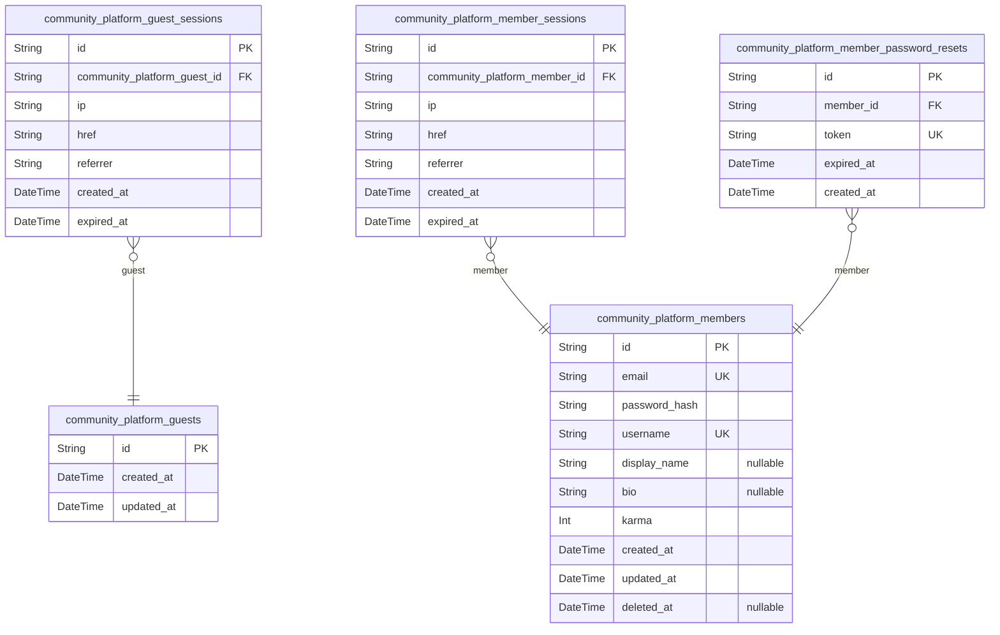
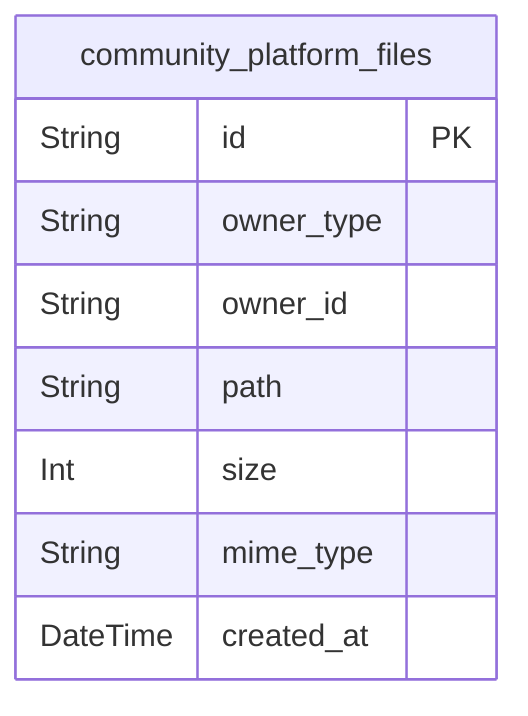
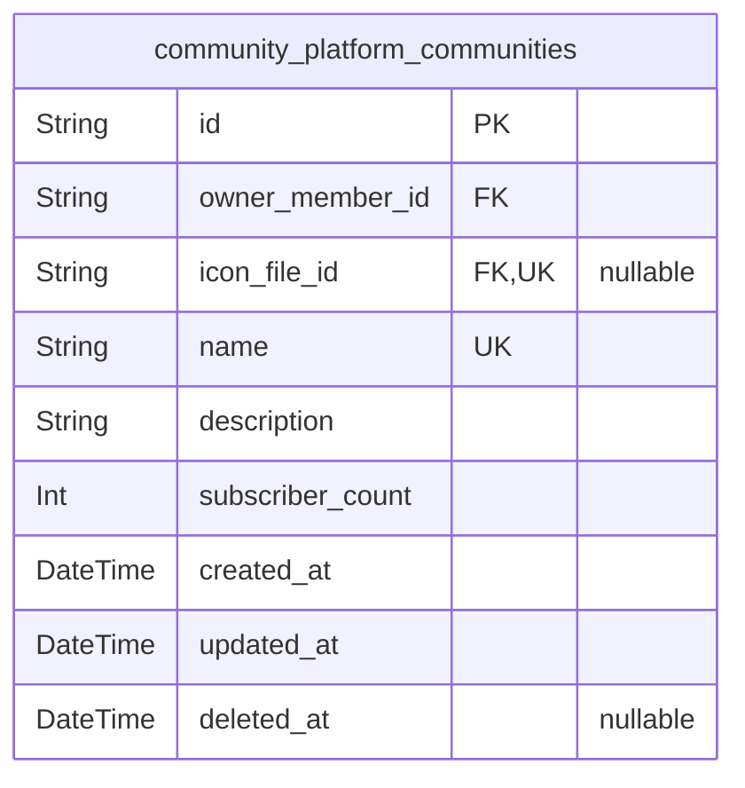
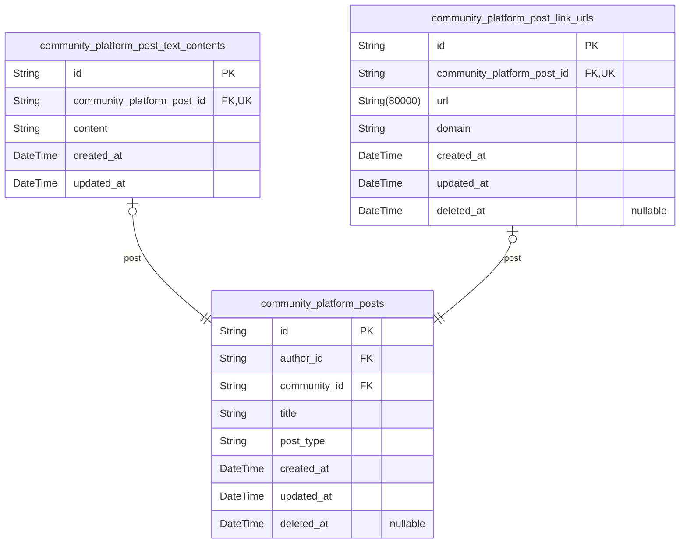
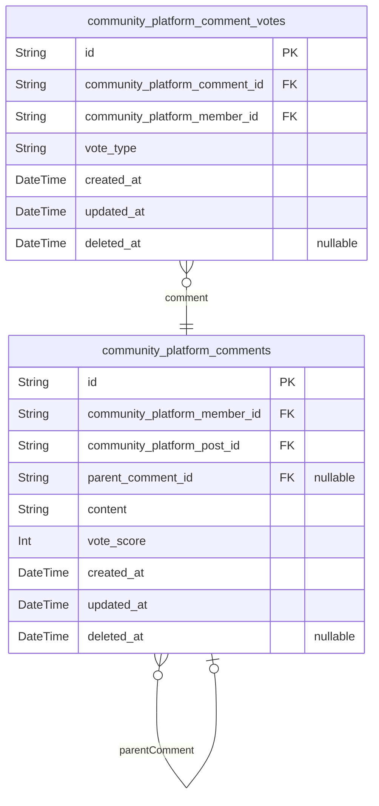
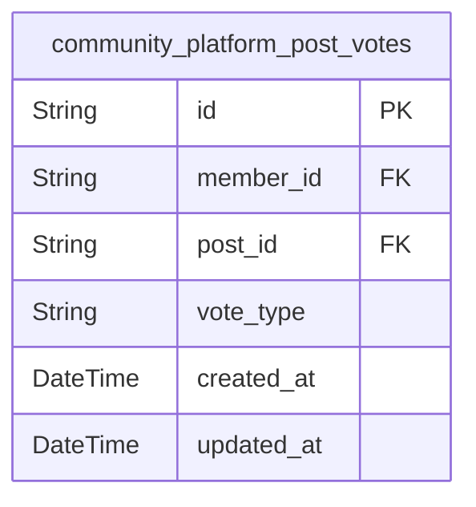
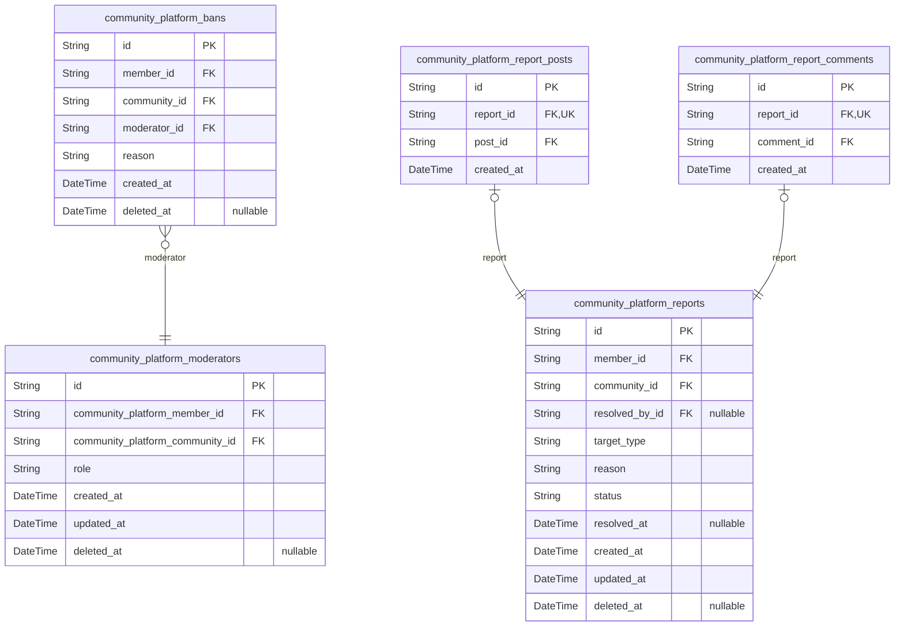

# Prisma Markdown

> Generated by [`prisma-markdown`](https://github.com/samchon/prisma-markdown)

- [Actors](#actors)
- [Files](#files)
- [Communities](#communities)
- [Posts](#posts)
- [Comments](#comments)
- [Votes](#votes)
- [Moderation](#moderation)

## Actors

### `community_platform_guests`

Temporary guest accounts for unauthenticated visitors who browse content
without creating posts, comments, or votes.

Guests are transient visitors tracked by session identifiers rather than
authentication credentials. They can view popular feeds, community feeds,
posts, and comments but cannot interact with content creation, voting, or
subscription features.

Each guest account links to one or more {@link
community_platform_guest_sessions} records that track browsing activity
including IP addresses, referrer information, and session expiration.

Properties as follows:

- `id`
  > Primary Key. Unique identifier for the guest visitor, used to track
  > browsing sessions and activity.
- `created_at`
  > Timestamp when the guest account was created, marking the start of the
  > browsing session.
- `updated_at`: Timestamp when the guest account was last updated.

### `community_platform_guest_sessions`

Temporary session records for unauthenticated guest visitors, tracking
their browsing activity including IP address, current page, and referrer
information. Each session belongs to a guest account and expires after a
defined period, enabling anonymous content discovery without
authentication.

Sessions are append-only audit records that track guest browsing patterns
for analytics and rate limiting. Unlike authenticated member sessions,
guest sessions do not provide identity or permission context.

Properties as follows:

- `id`: Primary Key.
- `community_platform_guest_id`
  > The guest account this session belongs to. References {@link
  > community_platform_guests.id}.
- `ip`
  > IP address of the guest's connection, used for analytics and rate
  > limiting.
- `href`
  > URL the guest is currently viewing, tracking browsing path through the
  > platform.
- `referrer`
  > Referrer URL indicating where the guest came from before visiting the
  > platform.
- `created_at`
  > Timestamp when this session was created, marking the start of guest
  > browsing activity.
- `expired_at`
  > Timestamp when this session expires, used for session cleanup and timeout
  > enforcement.

### `community_platform_members`

Authenticated member accounts with email/password credentials, unique
username, profile information, and karma score.

This is the primary actor entity representing registered users who can
create communities, posts, and comments, vote on content, subscribe to
communities, and participate in moderation. Each member has a unique
email and username for identification, a hashed password for
authentication, and a karma score reflecting community reception of their
content.

Related entities:
- [community_platform_member_sessions](#community_platform_member_sessions) - Authentication sessions
for this member
- [community_platform_member_password_resets](#community_platform_member_password_resets) - Password reset
tokens for this member
- [community_platform_files](#community_platform_files) - Avatar image (if uploaded)

Members can be community owners or moderators through {@link
community_platform_moderators}, and can be banned from communities
through [community_platform_bans](#community_platform_bans).

Properties as follows:

- `id`: Primary Key.
- `email`
  > Unique email address used for login and account identification. Must be
  > unique across all members.
- `password_hash`: Hashed password for authentication. Never stored in plain text.
- `username`
  > Unique username chosen during registration, visible to other users and
  > used for profile URLs.
- `display_name`
  > Display name shown on profile and alongside posts/comments. Can be
  > changed by the member.
- `bio`: Biography text displayed on member's profile page.
- `karma`
  > Karma score reflecting community reception. Increases by 1 for each
  > upvote on member's content, decreases by 1 for each downvote. Can be
  > negative.
- `created_at`: Timestamp when the member account was created.
- `updated_at`: Timestamp when the member profile was last updated.
- `deleted_at`
  > Timestamp when the member account was deleted. NULL if account is active.
  > When set, all user's posts and comments are also deleted.

### `community_platform_member_sessions`

JWT session tokens for authenticated member access, tracking login
sessions with connection metadata (IP, href, referrer) and temporal
bounds. Each session belongs to exactly one member and provides audit
trail for authentication events. Sessions expire based on expired_at
timestamp for security purposes.

Properties as follows:

- `id`: Primary Key.
- `community_platform_member_id`: The member who owns this session. [community_platform_members.id](#community_platform_members)
- `ip`
  > IP address of the client that initiated the login session, captured for
  > security auditing and session tracking.
- `href`
  > The URL path or endpoint accessed during session creation, recording the
  > initial navigation context.
- `referrer`
  > The HTTP Referer header value from the login request, capturing the
  > source that directed the user to authenticate.
- `created_at`: Timestamp when the session was created, marking the login event.
- `expired_at`
  > Timestamp when the session expires. Set at creation time to enforce
  > session lifetime limits. NOT NULL for security - all sessions must have
  > an expiration.

### `community_platform_member_password_resets`

Password reset tokens for member password recovery and change functionality.

Stores unique reset tokens that allow members to securely change their
password through a recovery workflow. Each token has an expiration time
for security and is linked to the member who requested the password
reset.

A member can have multiple password reset requests (e.g., if they request
multiple times before using one), but each token is unique and can only
be used once. Tokens are typically created when a member requests a
password reset and are deleted after successful password change or after
expiration.

Related to [community_platform_members](#community_platform_members) through the member_id
foreign key.

Properties as follows:

- `id`: Primary Key.
- `member_id`
  > The member who requested this password reset. {@link
  > community_platform_members.id}.
- `token`
  > Unique password reset token used to identify and validate the reset
  > request. This token is included in the password reset link sent to the
  > member's email and must be unique across all reset requests for security.
- `expired_at`
  > Expiration timestamp for the password reset token. After this time, the
  > token is no longer valid and cannot be used to reset the password. This
  > security measure limits the window of opportunity for password reset
  > attacks.
- `created_at`
  > Timestamp when the password reset request was created. Used for audit
  > purposes and rate limiting to prevent abuse of the password reset
  > functionality.

## Files

### `community_platform_files`

Central file storage for uploaded images supporting user avatars,
community icons, and post images. Uses owner_type discriminator to
identify the owning entity (user_avatar, community_icon, post_image) with
owner_id as a polymorphic reference. Each owner can have at most one file
of each type, enforced by unique constraint. Files are managed through
their parent entities during profile updates, community creation, or post
submission.

Properties as follows:

- `id`: Primary Key.
- `owner_type`
  > Discriminator identifying the owning entity type. Allowed values:
  > 'user_avatar' for member profile images, 'community_icon' for community
  > icons, 'post_image' for image post content.
- `owner_id`
  > Polymorphic reference to the owning entity's ID. The actual target table
  > is determined by owner_type (user_avatar→community_platform_members,
  > community_icon→community_platform_communities,
  > post_image→community_platform_posts).
- `path`
  > Storage path or URL where the file is located. Used for retrieval and
  > serving the uploaded file.
- `size`: File size in bytes. Used for storage capacity tracking and validation.
- `mime_type`
  > MIME type of the uploaded file (e.g., 'image/jpeg', 'image/png',
  > 'image/gif'). Used for content type validation and proper serving.
- `created_at`
  > Timestamp when the file was uploaded. Records upload time for auditing
  > and retention policies.

## Communities

### `community_platform_communities`

Community entities that serve as organizational containers for
user-created content.

Each community has a unique name for discovery, optional description text
and icon image, and is owned by the member who created it. The subscriber
count is cached for efficient display in community lists and search
results. Communities can be browsed, searched by name, and users must
subscribe before creating posts within them.

Properties as follows:

- `id`: Primary Key.
- `owner_member_id`
  > The member who created and owns this community. The owner has highest
  > moderation authority. [community_platform_members.id](#community_platform_members)
- `icon_file_id`
  > Optional icon image file for the community's visual representation.
  > [community_platform_files.id](#community_platform_files)
- `name`
  > Unique name of the community used for discovery and search. Must be
  > unique across all communities.
- `description`: Text description of the community's purpose and content themes.
- `subscriber_count`
  > Cached count of members subscribed to this community. Updated when
  > subscriptions are added or removed for efficient list display.
- `created_at`: Timestamp when the community was created.
- `updated_at`: Timestamp when the community was last updated.
- `deleted_at`
  > Timestamp when the community was soft-deleted. Null if the community is
  > active.

## Posts

### `community_platform_posts`

Main post entity representing user-created content in communities.

Posts are the primary content type in the platform, supporting three
variants: text posts (written content), link posts (external URLs), and
image posts (uploaded images). Each post has a title, belongs to a
community, is authored by a member.

The post_type field determines which type-specific table contains the
additional content:
- 'text': [community_platform_post_text_contents](#community_platform_post_text_contents) stores the text body
- 'link': [community_platform_post_link_urls](#community_platform_post_link_urls) stores the external URL
- 'image': File reference stored separately in the Files component

Vote scores and comment counts are computed on-demand through aggregation
queries for data consistency.

Properties as follows:

- `id`: Primary Key.
- `author_id`: The member who created this post. [community_platform_members.id](#community_platform_members)
- `community_id`
  > The community this post belongs to. {@link
  > community_platform_communities.id}
- `title`
  > The post title, required for all post types. Displayed in feeds and post
  > listings.
- `post_type`
  > Discriminator indicating the post content type: 'text' for text posts
  > with body content, 'link' for URL posts, 'image' for uploaded image
  > posts.
- `created_at`: Timestamp when the post was created.
- `updated_at`: Timestamp when the post was last updated.
- `deleted_at`: Timestamp when the post was soft-deleted. Null if the post is active.

### `community_platform_post_text_contents`

Text content storage for text-type posts in the community platform.

Each text post has exactly one text content record containing the post
body. This subsidiary table maintains a strict 1:1 relationship with
[community_platform_posts](#community_platform_posts), where only posts with type='text' have
corresponding records here.

The content field stores the full text body of the post, supporting plain
text or markdown formatting for rich text display. Content is created,
updated, and deleted only through the parent post entity operations.

Relationship: References [community_platform_posts](#community_platform_posts) via
community_platform_post_id with unique constraint enforcing 1:1
cardinality.

Properties as follows:

- `id`: Primary Key.
- `community_platform_post_id`
  > The text post this content belongs to. References {@link
  > community_platform_posts.id} with unique constraint enforcing 1:1
  > relationship.
- `content`
  > The text content/body of the text post. Contains the full post body which
  > may include markdown formatting for rich text display. Required for all
  > text posts.
- `created_at`
  > Timestamp when this text content was created, coinciding with the parent
  > post creation.
- `updated_at`
  > Timestamp when this text content was last updated, tracking post content
  > edits.

### `community_platform_post_link_urls`

External URL content for link-type posts.

This subsidiary table stores the external URL and extracted domain for
link posts, supporting the main posts entity with type-specific content.
Each link post has exactly one URL entry in this table.

The domain field is pre-extracted from the URL for efficient feed
display, allowing readers to see where the external link leads without
parsing the URL at query time.

Relationship: 1:1 with [community_platform_posts](#community_platform_posts) where type='link'.

Properties as follows:

- `id`: Primary Key.
- `community_platform_post_id`: The link post this URL belongs to. [community_platform_posts.id](#community_platform_posts)
- `url`
  > The external URL that this link post points to. Users will be directed to
  > this URL when they click the post.
- `domain`
  > The domain name extracted from the URL (e.g., 'example.com' from
  > 'https://example.com/path'). Pre-computed for efficient feed display
  > showing where the external link leads.
- `created_at`: Timestamp when this link URL was created.
- `updated_at`: Timestamp when this link URL was last updated.
- `deleted_at`: Timestamp when this link URL was soft-deleted. Null if not deleted.

## Comments

### `community_platform_comments`

Threaded discussion comments on posts with unlimited reply depth via
self-referential parent_comment_id.

Each comment contains text content written by a member, belongs to a
specific post, and can optionally be a reply to another comment creating
a nested discussion thread. Comments support voting (score stored for
performance), soft deletion, and full-text search.

Key relationships:
- Author: [community_platform_members](#community_platform_members) (member who wrote the comment)
- Post: [community_platform_posts](#community_platform_posts) (post being discussed)
- Parent Comment: Self-referential for threaded replies (null for
top-level comments)
- Child Comments: Replies to this comment via inverse relation
- Votes: [community_platform_comment_votes](#community_platform_comment_votes) (tracked in separate
table)

Voting is managed through community_platform_comment_votes table with one
vote per user per comment. Vote score is denormalized here for sorting
performance (Top, Best, New, Controversial).

Properties as follows:

- `id`: Primary Key.
- `community_platform_member_id`: Author of the comment. References [community_platform_members.id](#community_platform_members).
- `community_platform_post_id`
  > Post this comment belongs to. References {@link
  > community_platform_posts.id}.
- `parent_comment_id`
  > Parent comment for threaded replies. Null for top-level comments.
  > Self-referential [community_platform_comments.id](#community_platform_comments).
- `content`: The text body of the comment. Can be edited by the author.
- `vote_score`
  > Current vote score (upvotes minus downvotes). Denormalized for sorting
  > performance. Updated when votes are added, changed, or removed.
- `created_at`: Timestamp when the comment was created.
- `updated_at`: Timestamp when the comment was last edited.
- `deleted_at`: Timestamp when the comment was soft-deleted. Null if not deleted.

### `community_platform_comment_votes`

User votes on comments tracking upvote or downvote type with one vote per
user per comment constraint.

Each member can cast exactly one vote per comment - either an upvote
(adds 1 to comment score) or a downvote (subtracts 1 from comment score).
Members can change their vote type at any time, which updates the
updated_at timestamp. When a vote is removed, the row is deleted and the
karma effect is reversed.

The unique constraint on [comment_id, member_id] enforces the
one-vote-per-user-per-comment business rule. Vote data enables comment
score calculation and supports Best/New/Controversial sorting algorithms.

Relationships:
- Belongs to [community_platform_comments](#community_platform_comments) (the comment being voted
on)
- Belongs to [community_platform_members](#community_platform_members) (the voter)

Properties as follows:

- `id`: Primary Key.
- `community_platform_comment_id`: The comment being voted on. [community_platform_comments.id](#community_platform_comments)
- `community_platform_member_id`: The member who cast this vote. [community_platform_members.id](#community_platform_members)
- `vote_type`
  > Vote type indicating the member's evaluation of the comment. Value
  > 'upvote' adds 1 to the comment's vote score and increases the comment
  > author's karma by 1. Value 'downvote' subtracts 1 from the comment's vote
  > score and decreases the comment author's karma by 1. Only these two
  > values are allowed.
- `created_at`: Timestamp when the vote was initially cast.
- `updated_at`
  > Timestamp when the vote type was last changed. Equals created_at if the
  > vote has never been modified.
- `deleted_at`
  > Timestamp when the vote was removed. Null if vote is active. When a vote
  > is removed, the karma effect on the comment author is reversed (upvote
  > removal: -1 karma, downvote removal: +1 karma). Note: Votes are typically
  > hard-deleted rather than soft-deleted.

## Votes

### `community_platform_post_votes`

User votes on posts expressing approval (upvote) or disapproval (downvote).

Each member can cast exactly one vote per post, stored as either upvote
or downvote type. The vote type can be changed by updating the record,
and votes can be removed entirely through hard deletion. Vote records
contribute to post score calculation (upvotes - downvotes) and member
karma tracking.

Relationships:
- References [community_platform_members.id](#community_platform_members) as the voter
- References [community_platform_posts.id](#community_platform_posts) as the target post

Properties as follows:

- `id`: Primary Key.
- `member_id`: The member who cast this vote. [community_platform_members.id](#community_platform_members)
- `post_id`: The post this vote targets. [community_platform_posts.id](#community_platform_posts)
- `vote_type`
  > The type of vote cast: 'upvote' for approval (adds +1 to score) or
  > 'downvote' for disapproval (adds -1 to score). Can be changed by updating
  > this field.
- `created_at`: Timestamp when the vote was originally cast.
- `updated_at`: Timestamp when the vote type was last changed.

## Moderation

### `community_platform_moderators`

Moderator role assignments linking members to communities with owner or
moderator authority.

This table tracks all moderation privileges within communities. Each row
represents a member's role in a specific community, either as the 'owner'
(the community creator with highest authority) or as a 'moderator'
(appointed by owner or other moderators).

Key constraints:
- Each community has exactly one owner (enforced at application level)
- Each member can have only one role per community (enforced by unique
constraint)
- Owners cannot be removed by moderators; only the owner can manage
moderator team
- Moderators can add other moderators but cannot remove each other

Relationships:
- References [community_platform_members](#community_platform_members) for the moderator's identity
- References [community_platform_communities](#community_platform_communities) for the community
being moderated

Properties as follows:

- `id`: Primary Key.
- `community_platform_member_id`
  > The member who has moderation privileges. {@link
  > community_platform_members.id}
- `community_platform_community_id`
  > The community where this member has moderation privileges. {@link
  > community_platform_communities.id}
- `role`
  > The moderation role type. 'owner' indicates the community creator with
  > highest authority (unique per community). 'moderator' indicates an
  > appointed moderator with standard moderation privileges.
- `created_at`
  > Timestamp when the moderation role was assigned. For owners, this matches
  > the community creation time.
- `updated_at`
  > Timestamp when the moderation role was last modified. Updated when role
  > changes or metadata is updated.
- `deleted_at`
  > Timestamp when the moderation role was removed (soft delete). Null if the
  > role is still active.

### `community_platform_bans`

User participation bans within communities, restricting posting and
commenting privileges while preserving content viewing access.

Each ban links a member to a community with a recorded reason and
timestamp, issued by a moderator. Active bans (where deleted_at is null)
prevent the member from creating posts or comments in that community,
though viewing remains unrestricted.

Bans support soft-delete for unbanning, preserving historical records. A
user can be banned multiple times across different instances if they
violate rules again after a previous ban was lifted. Moderators manage
bans through create, list, and remove operations with full audit trail.

Properties as follows:

- `id`: Primary Key.
- `member_id`: The banned member's identifier. [community_platform_members.id](#community_platform_members)
- `community_id`
  > The community where the ban applies. {@link
  > community_platform_communities.id}
- `moderator_id`: The moderator who issued the ban. [community_platform_moderators.id](#community_platform_moderators)
- `reason`
  > The explanation for why the ban was imposed, provided by the moderator at
  > ban creation.
- `created_at`: Timestamp when the ban was applied to the member.
- `deleted_at`
  > Timestamp when the ban was removed (unbanned). Null indicates an active
  > ban; a non-null value indicates the member has been unbanned and can
  > post/comment again.

### `community_platform_reports`

User-submitted content reports targeting posts or comments within
communities, tracking status through a pending → approved/dismissed
workflow for moderator review.

Reports enable community members to flag content that may violate
community rules or platform policies. Each report captures the reason for
the flag, identifies the reporter and reported content, and progresses
through a moderator review process.

The report workflow begins when a user submits a report with a required
reason text. The report enters 'pending' status and appears in the
community's moderator queue. Moderators can approve the report (deleting
the offending content) or dismiss it (keeping the content visible). Both
approved and dismissed are terminal states - a resolved report cannot be
reopened.

Reports target either a post (stored in {@link
community_platform_report_posts}) or a comment (stored in {@link
community_platform_report_comments}) using the polymorphic target pattern
with a target_type discriminator. This design avoids nullable foreign key
anti-patterns while maintaining referential integrity.

Multiple reports on the same content are permitted, allowing different
users to provide independent assessments of content violations.

Properties as follows:

- `id`: Primary Key.
- `member_id`: The member who submitted the report. [community_platform_members.id](#community_platform_members)
- `community_id`
  > The community where the reported content was posted. {@link
  > community_platform_communities.id}
- `resolved_by_id`
  > The moderator who approved or dismissed the report. Null while report is
  > pending. [community_platform_members.id](#community_platform_members)
- `target_type`
  > Discriminator indicating whether this report targets a post ('post') or a
  > comment ('comment'). Used to determine which subtype table contains the
  > target reference.
- `reason`
  > Required explanation provided by the reporter describing why the content
  > violates community rules or platform policies. Must be non-empty text.
- `status`
  > Current status of the report in the moderation workflow. Valid values:
  > 'pending' (awaiting moderator action), 'approved' (content deleted by
  > moderator), 'dismissed' (content kept by moderator). Both approved and
  > dismissed are terminal states.
- `resolved_at`
  > Timestamp when a moderator approved or dismissed the report. Null while
  > the report remains in pending status.
- `created_at`: Timestamp when the report was submitted by the user.
- `updated_at`: Timestamp when the report was last modified (status change, resolution).
- `deleted_at`
  > Timestamp for soft deletion of the report. Null if the report has not
  > been deleted.

### `community_platform_report_posts`

Junction table linking reports to their target posts for the polymorphic
report target pattern.

Each report can target either a post or a comment, but not both. When a
report targets a post, this table stores that relationship. The unique
constraint on report_id ensures each report has at most one post target,
enforcing the either/or polymorphic pattern.

This table is part of the content moderation system, allowing moderators
to review and take action on reported posts. When a report is approved,
the referenced post is deleted from the platform.

Properties as follows:

- `id`: Primary Key.
- `report_id`
  > The report that targets this post. Each report can have at most one post
  > target. [community_platform_reports.id](#community_platform_reports)
- `post_id`
  > The post being reported for moderation review. A post can be the target
  > of multiple reports. [community_platform_posts.id](#community_platform_posts)
- `created_at`
  > Timestamp when this report-post link was created, establishing when the
  > post was reported.

### `community_platform_report_comments`

Junction table linking reports to their target comments for the
polymorphic report target pattern.

Each report targeting a comment has exactly one entry here, establishing
a 1:1 relationship between the report and the reported comment. This
table exists to support the polymorphic targeting pattern where reports
can target either posts or comments, avoiding the prohibited pattern of
multiple nullable foreign keys in the main reports table.

When a moderator approves a report targeting a comment, the comment is
deleted but the report record and this junction entry remain for audit
purposes. The unique constraint on report_id ensures each report can
reference at most one comment, enforcing the 1:1 relationship.

Referenced by: [community_platform_reports](#community_platform_reports).
References: [community_platform_comments](#community_platform_comments).

Properties as follows:

- `id`: Primary Key.
- `report_id`
  > The report that targets this comment. Each report can reference at most
  > one comment, enforced by unique constraint. {@link
  > community_platform_reports.id}.
- `comment_id`: The comment being reported. [community_platform_comments.id](#community_platform_comments).
- `created_at`: Timestamp when this report-comment link was created.
