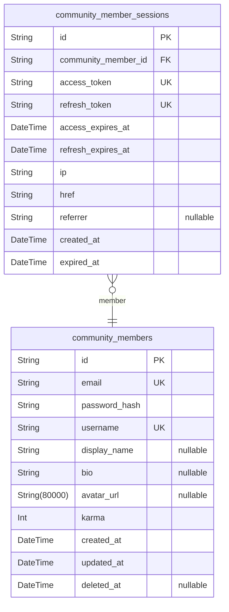
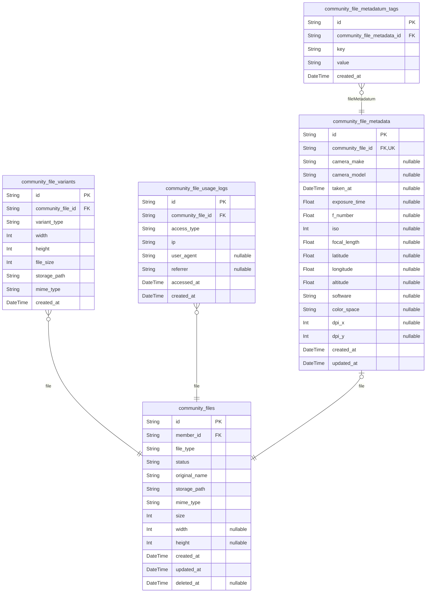
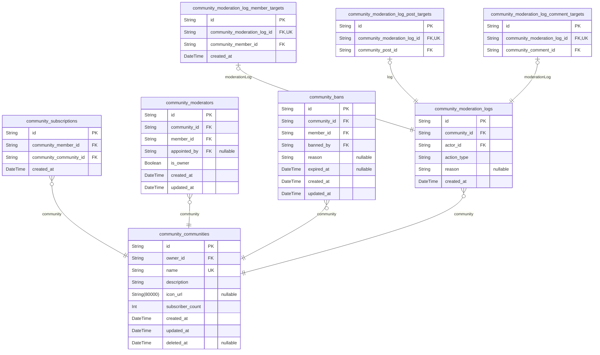
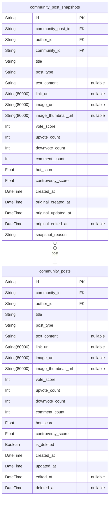
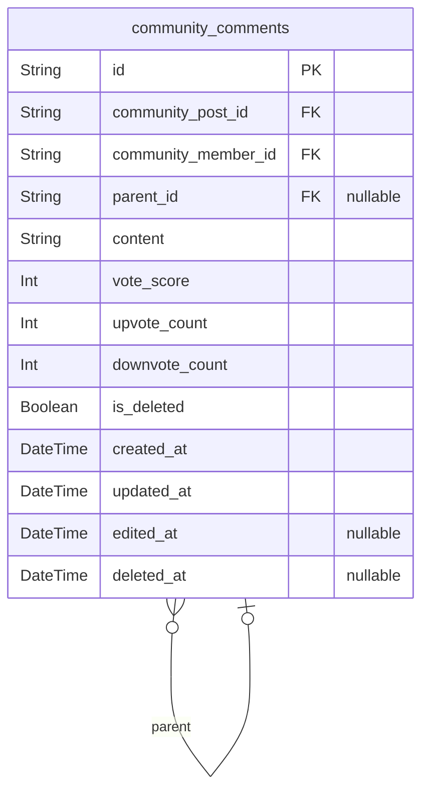
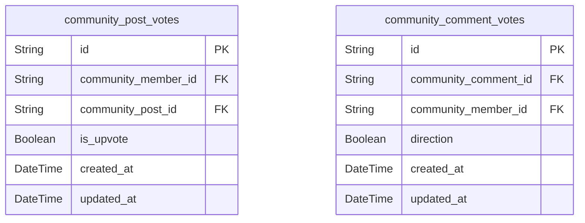
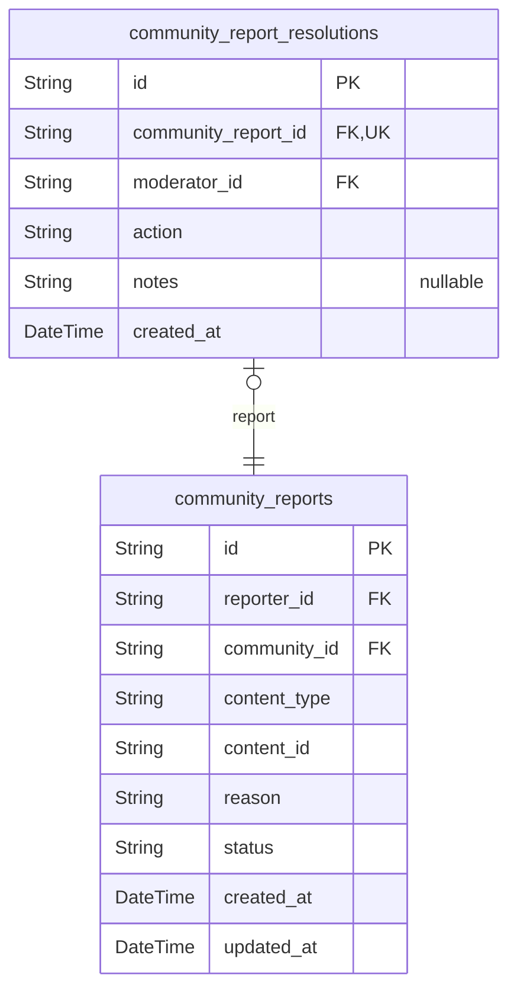

# Prisma Markdown

> Generated by [`prisma-markdown`](https://github.com/samchon/prisma-markdown)

- [Actors](#actors)
- [Systematic](#systematic)
- [Communities](#communities)
- [Posts](#posts)
- [Comments](#comments)
- [Voting](#voting)
- [Reporting](#reporting)

## Actors

### `community_members`

Registered member accounts with email/password authentication credentials
for the community platform.

Each member has a unique username (3-20 characters, alphanumeric and
underscores only) and email address for authentication. The account
stores hashed password credentials using bcrypt, Argon2, or PBKDF2
algorithms with unique salt per password.

Profile information includes display name (1-50 characters, can be
changed anytime), optional bio text (max 500 characters), and optional
avatar image URL. The karma score represents community reputation based
on votes received on posts and comments, initialized to 0 and can be
negative.

This actor table serves as the canonical identity record used across the
system. Sessions are tracked in the separate {@link
community_member_sessions} table. Related entities include posts ({@link
community_posts}), comments ([community_comments](#community_comments)), and votes
([community_post_votes](#community_post_votes), [community_comment_votes](#community_comment_votes)).

Properties as follows:

- `id`: Primary Key.
- `email`
  > Member's email address used for authentication. Must be valid email
  > format, unique across all members, and case-insensitive for uniqueness
  > check.
- `password_hash`
  > Hashed password using bcrypt, Argon2, or PBKDF2 algorithm with minimum
  > cost factor of 12 for bcrypt. Plain text storage is strictly prohibited.
- `username`
  > Unique permanent identifier chosen during registration. Must be 3-20
  > characters, alphanumeric and underscores only, case-insensitive for
  > uniqueness. Immutable after account creation.
- `display_name`
  > Public display name shown on profile and content. Must be 1-50 characters
  > when set, supports Unicode characters for international names. Can be
  > changed anytime, no uniqueness requirement.
- `bio`
  > User-provided description or introduction displayed on profile. Maximum
  > 500 characters, plain text only (no markdown or rich text). Optional
  > field.
- `avatar_url`
  > URL to the member's avatar image. Points to uploaded image in file
  > storage system (JPEG/PNG/GIF, max 2MB). If not set, platform displays
  > default placeholder image.
- `karma`
  > Reputation score calculated from votes received on posts and comments.
  > Upvotes add +1, downvotes subtract -1. Initialized to 0, can be negative.
  > Automatically calculated, cannot be manually edited.
- `created_at`
  > Timestamp when the member account was created. Auto-generated on
  > registration, immutable thereafter.
- `updated_at`
  > Timestamp when the member record was last updated. Automatically updated
  > on profile changes, password changes, and other account modifications.
- `deleted_at`
  > Timestamp when the member account was soft-deleted. Null for active
  > accounts. When set, the account is considered deleted but data is
  > retained before permanent removal.

### `community_member_sessions`

JWT session tokens for member authentication, storing access tokens
(30-minute lifetime) and refresh tokens (14-day lifetime) along with
connection metadata for session management, token renewal, and security
auditing.

Each session record represents an authenticated member login, tracking
both the access token for API requests and the refresh token for session
renewal. The session maintains connection context (IP, href, referrer)
for security auditing and anomaly detection.

**Token Management**:
- Access tokens expire after 30 minutes and require renewal via refresh
token
- Refresh tokens expire after 14 days, after which the user must
re-authenticate
- Sessions can be invalidated by deleting the record (logout)

**Relationships**:
- Each session belongs to exactly one [member](#community_members)
- A member can have multiple concurrent sessions (different devices)

**Security Considerations**:
- Access tokens should be validated on every request
- Refresh tokens should be single-use (rotated on renewal)
- IP and referrer tracking enables anomaly detection

Properties as follows:

- `id`: Primary Key.
- `community_member_id`
  > The member who owns this session. References {@link
  > community_members.id}. A member can have multiple concurrent sessions
  > across different devices.
- `access_token`
  > JWT access token string for API authentication. Short-lived token
  > (30-minute expiration) used for authenticating API requests. Should be
  > validated on every request and can be renewed using the refresh token.
- `refresh_token`
  > JWT refresh token string for session renewal. Long-lived token (14-day
  > expiration) used to obtain new access tokens. Should be rotated on each
  > renewal for security (single-use pattern).
- `access_expires_at`
  > Timestamp when the access token expires. Set to 30 minutes after session
  > creation or renewal. Used for token validation without decoding the JWT.
- `refresh_expires_at`
  > Timestamp when the refresh token expires. Set to 14 days after session
  > creation. After this time, the user must re-authenticate. This represents
  > the maximum session lifetime.
- `ip`
  > IP address from which the login request originated. Used for security
  > auditing, session management, and anomaly detection (e.g., login from
  > unusual location).
- `href`
  > The URL (href) the user was accessing at the time of login. Provides
  > context for the authentication request and helps identify suspicious
  > login patterns.
- `referrer`
  > HTTP Referrer header from the login request. Provides additional context
  > about how the user arrived at the login page. May be empty if the user
  > navigated directly.
- `created_at`
  > Timestamp when the session was created (login time). Used for session age
  > tracking and audit trails. Sessions older than refresh_expires_at are
  > considered expired.
- `expired_at`
  > Timestamp when the session expires. Synchronized with refresh_expires_at
  > (14 days after creation). Sessions past this time are invalid and must be
  > removed. NOT NULL for security - expired sessions should never persist
  > indefinitely.

## Systematic

### `community_files`

Core file storage table for all uploaded media including user avatars,
community icons, and post images. Tracks file metadata (original name,
MIME type, size, dimensions), ownership via uploader reference, and
lifecycle status. Files are uploaded independently and then linked to
parent entities through URL references stored in those entities. Supports
temporary file cleanup for abandoned uploads and soft deletion for audit
trail preservation.

Properties as follows:

- `id`: Primary Key.
- `member_id`
  > Reference to the member who uploaded this file. {@link
  > community_members.id}
- `file_type`
  > Category of file usage. Values: 'AVATAR' (user profile pictures),
  > 'COMMUNITY_ICON' (community icons), 'POST_IMAGE' (images attached to
  > posts). Determines upload size limits and processing rules.
- `status`
  > File lifecycle status. 'TEMPORARY' indicates file uploaded but not yet
  > linked to parent entity (subject to cleanup after 24 hours). 'ACTIVE'
  > indicates file is permanently associated with a parent entity.
- `original_name`
  > Original filename as provided by the uploader. Preserved for display and
  > download purposes. May contain user-provided characters but sanitized for
  > storage safety.
- `storage_path`
  > Relative path or identifier for the stored file in the storage backend
  > (e.g., S3 key, local filesystem path). Unique and system-generated to
  > prevent collisions.
- `mime_type`
  > MIME type of the uploaded file. Supported types: 'image/jpeg',
  > 'image/png', 'image/gif', 'image/webp'. Used for content-type headers and
  > image processing decisions.
- `size`
  > File size in bytes. Used for storage quota tracking and validation.
  > Avatars and community icons limited to 2MB (2097152 bytes), post images
  > limited to 20MB (20971520 bytes).
- `width`
  > Image width in pixels. Only applicable to image files. Nullable for
  > non-image files. Used for responsive image selection and dimension
  > validation.
- `height`
  > Image height in pixels. Only applicable to image files. Nullable for
  > non-image files. Used for responsive image selection and dimension
  > validation.
- `created_at`
  > Timestamp when the file was uploaded. Used for temporary file cleanup
  > scheduling and audit trails.
- `updated_at`
  > Timestamp when file metadata was last modified. Updated when status
  > changes or dimensions are calculated.
- `deleted_at`
  > Timestamp when file was soft-deleted. Nullable indicates active file.
  > Soft delete preserves audit trail and allows for potential recovery
  > before permanent removal from storage.

### `community_file_variants`

Generated image variants for responsive display across the platform.

This table stores multiple size variants of uploaded images, enabling
efficient delivery of appropriately-sized images for different device
contexts. Each variant is derived from an original file in {@link
community_files} and maintains its own storage path and dimensions.

Supported variant types include:
- thumbnail: Small preview images (typically 150x150)
- medium: Medium-sized images for list views (typically 640x640)
- large: Full-size images for detail views (typically 1920x1920)

These variants are used for user avatars (per 03-user-profile-karma.md),
community icons (per 04-community-system.md), and post images (per
05-post-system.md).

Properties as follows:

- `id`: Primary Key.
- `community_file_id`
  > Reference to the original file this variant was generated from. {@link
  > community_files.id}
- `variant_type`
  > Type identifier for the variant size (e.g., 'thumbnail', 'medium',
  > 'large'). Used to select appropriate variant for display context.
- `width`: Width of the variant image in pixels.
- `height`: Height of the variant image in pixels.
- `file_size`: Size of the variant file in bytes.
- `storage_path`
  > Relative path or URL where the variant file is stored in the storage
  > system.
- `mime_type`
  > MIME type of the variant file (e.g., 'image/jpeg', 'image/png',
  > 'image/webp').
- `created_at`: Timestamp when the variant was generated.

### `community_file_usage_logs`

Access and usage tracking records for files, capturing each access event
with metadata.

This table enables platform analytics by recording when files are
accessed, how they're accessed, and from where. The accumulated data
supports three key operational capabilities:

1. **Analytics & Insights**: Track which files are most popular, identify
trending content, and understand user engagement patterns with uploaded
media.

2. **Hot/Cold Storage Optimization**: Based on access frequency patterns,
determine which files should remain in fast hot storage versus being
moved to cheaper cold storage. Files accessed frequently stay hot; rarely
accessed files can be archived.

3. **Orphan File Cleanup**: Identify files that haven't been accessed for
extended periods, supporting automated cleanup processes to remove
unreferenced or abandoned uploads.

Each log entry captures the accessor's IP address and user agent for
security auditing, the access type (view, download, thumbnail generation,
etc.), and timestamp for temporal analysis.

This table has a many-to-one relationship with [community_files](#community_files) -
each file can have many usage log entries over its lifetime.

Properties as follows:

- `id`: Primary Key.
- `community_file_id`: The file that was accessed. References [community_files.id](#community_files).
- `access_type`
  > Type of access operation performed on the file. Examples: 'view'
  > (displayed in browser), 'download' (direct download), 'thumbnail'
  > (variant generation), 'embed' (embedded in post/comment). This
  > categorization enables different retention policies and analytics for
  > different access patterns.
- `ip`
  > IP address of the client that accessed the file. Used for security
  > auditing, rate limiting, and geographic analytics. Stored as string to
  > support both IPv4 and IPv6 addresses.
- `user_agent`
  > User-Agent header from the client's HTTP request. Identifies the browser,
  > device, or application that accessed the file. Used for device analytics,
  > compatibility tracking, and security forensics.
- `referrer`
  > HTTP Referer header indicating the page or endpoint from which the file
  > was accessed. Helps identify traffic sources, whether from posts,
  > profiles, community pages, or external sites. Null if direct access or
  > referrer not provided.
- `accessed_at`
  > Timestamp when the file access occurred. This is the primary temporal
  > field used for analytics queries, trend analysis, and time-based
  > retention policies.
- `created_at`
  > Timestamp when this usage log record was created. Automatically set on
  > insertion. Used for record lifecycle management and audit trails.

### `community_file_metadata`

Extended file metadata storing EXIF data, custom tags, and file-specific
attributes for advanced file management.

This table provides a 1:1 extension to the [community_files](#community_files) table,
capturing detailed metadata extracted from uploaded files. For image
uploads, this includes camera information, GPS coordinates, and technical
photography settings (ISO, aperture, exposure). For other file types,
this table can store format-specific metadata.

The table supports:
- **EXIF extraction**: Camera make/model, capture timestamp, GPS
location, photography settings
- **Custom tagging**: User-defined tags stored in a separate junction
table for search and categorization
- **Extended attributes**: Software used, color space, DPI, and other
format-specific metadata

This subsidiary table is managed automatically during file upload
processing - users do not interact with it directly.

Properties as follows:

- `id`: Primary Key.
- `community_file_id`
  > Reference to the associated file record. Each file has exactly one
  > metadata record. [community_files.id](#community_files)
- `camera_make`
  > Camera manufacturer extracted from EXIF data (e.g., 'Canon', 'Nikon',
  > 'Apple'). Null for non-image files or files without EXIF.
- `camera_model`
  > Camera model extracted from EXIF data (e.g., 'EOS R5', 'iPhone 15 Pro').
  > Null for non-image files or files without EXIF.
- `taken_at`
  > Date and time when the photo was captured, extracted from EXIF. May
  > differ from file upload time. Null for non-image files.
- `exposure_time`
  > Exposure time in seconds extracted from EXIF (e.g., 0.008 for 1/125).
  > Used for photography analytics. Null for non-image files.
- `f_number`
  > F-number (aperture) extracted from EXIF (e.g., 2.8, 4.0). Indicates depth
  > of field and lens settings. Null for non-image files.
- `iso`
  > ISO sensitivity value extracted from EXIF (e.g., 100, 400, 1600). Higher
  > values indicate low-light conditions. Null for non-image files.
- `focal_length`
  > Focal length in millimeters extracted from EXIF (e.g., 50, 85, 200).
  > Indicates lens zoom level. Null for non-image files.
- `latitude`
  > GPS latitude coordinate extracted from EXIF (decimal degrees, -90 to 90).
  > Null if location data not available or stripped for privacy.
- `longitude`
  > GPS longitude coordinate extracted from EXIF (decimal degrees, -180 to
  > 180). Null if location data not available or stripped for privacy.
- `altitude`
  > GPS altitude in meters extracted from EXIF. Null if altitude data not
  > available in the image metadata.
- `software`
  > Software or application name extracted from metadata (e.g., 'Adobe
  > Photoshop 2024', 'GIMP 2.10'). Indicates editing tool used.
- `color_space`
  > Color space identifier (e.g., 'sRGB', 'Adobe RGB', 'ProPhoto RGB').
  > Important for color-accurate rendering.
- `dpi_x`
  > Resolution in dots per inch for the X axis. Used for print quality
  > determination. Null if not applicable.
- `dpi_y`
  > Resolution in dots per inch for the Y axis. Used for print quality
  > determination. Null if not applicable.
- `created_at`
  > Timestamp when this metadata record was created, typically during file
  > upload processing.
- `updated_at`
  > Timestamp when this metadata record was last updated, such as when tags
  > are modified or metadata is re-extracted.

### `community_file_metadatum_tags`

Junction table for custom tags associated with file metadata records.

This table enables flexible categorization and search of files by storing
user-defined
labels as key-value pairs. Each tag consists of a key (category name) and
value
(the actual tag), allowing for organized metadata classification.

**Tag Structure:**
- Key: The category or namespace for the tag (e.g., "category", "status",
"source")
- Value: The specific tag value within that category (e.g., "avatar",
"approved", "upload")

**Use Cases:**
- Categorizing files by type (key: "type", value: "profile", "banner",
"thumbnail")
- Tracking processing status (key: "status", value: "pending",
"processed", "failed")
- Marking file sources (key: "source", value: "upload", "import",
"migration")

**Relationships:**
- Belongs to [community_file_metadata](#community_file_metadata) for the parent metadata record
- Each metadata record can have multiple tags with unique key-value
combinations

Properties as follows:

- `id`: Primary Key.
- `community_file_metadata_id`
  > Reference to the parent file metadata record. Each tag belongs to exactly
  > one metadata entry. [community_file_metadata.id](#community_file_metadata)
- `key`
  > The category or namespace for the tag. Used to group related tags
  > together. Examples: "category", "status", "source", "type". Maximum 50
  > characters.
- `value`
  > The specific tag value within the key category. Examples: for
  > key="category": "avatar", "icon", "post-image"; for key="status":
  > "pending", "approved". Maximum 100 characters.
- `created_at`: Timestamp when the tag was created.

## Communities

### `community_communities`

Core community entities representing user-created groups for organizing
content and discussions.

Communities are the primary organizational unit of the platform where
members gather around shared interests. Each community has a unique name
(3-21 alphanumeric+underscore characters), description (10-500
characters), and optional icon image. The community owner is the member
who created it and has permanent moderation authority.

Key relationships:
- Owner: [community_members](#community_members) who created the community
- Subscriptions: Members subscribe via [community_subscriptions](#community_subscriptions)
- Moderators: Managed through [community_moderators](#community_moderators)
- Content: Posts, comments, and votes exist in separate components

Communities support soft deletion to preserve referential integrity for
historical content and audit trails.

Properties as follows:

- `id`: Primary Key.
- `owner_id`
  > The member who created and owns this community. Owner has permanent
  > moderation authority and cannot be removed as moderator. References
  > [community_members.id](#community_members).
- `name`
  > Unique community name used in URLs and display. Must be 3-21 characters,
  > alphanumeric and underscores only. Case-insensitive uniqueness enforced.
- `description`
  > Community description shown on community page and search results. Must be
  > 10-500 characters.
- `icon_url`
  > URL of the community icon image. Optional; displays default icon if not
  > provided. Recommended 256x256 pixels, max 2MB for JPEG/PNG/GIF formats.
- `subscriber_count`
  > Cached count of members subscribed to this community. Updated when
  > subscriptions are added or removed. Used for display and sorting in
  > discovery features.
- `created_at`: Timestamp when the community was created. Set automatically on creation.
- `updated_at`
  > Timestamp when the community was last updated (name, description, or icon
  > changes).
- `deleted_at`
  > Timestamp when the community was soft-deleted. Null if active. Soft
  > deletion preserves referential integrity for existing content and audit
  > trails.

### `community_subscriptions`

Junction table tracking member subscriptions to communities, enabling
home feed generation and posting privilege validation. Each record
represents a single subscription relationship between a member and a
community.

Members subscribe to communities to receive posts in their home feed and
gain posting privileges within that community. The subscription is a
prerequisite for content creation - members must be subscribed to a
community before they can create posts or comments.

Home feed queries use this table to filter posts from subscribed
communities. The unique constraint on member-community pair prevents
duplicate subscriptions, ensuring each member has exactly one
subscription record per community.

Related entities:
- [community_members](#community_members) - The subscribing member
- [community_communities](#community_communities) - The community being subscribed to

Properties as follows:

- `id`: Primary Key.
- `community_member_id`
  > Reference to the subscribing member. Each member can subscribe to
  > multiple communities. [community_members.id](#community_members)
- `community_community_id`
  > Reference to the community being subscribed to. Each community can have
  > multiple subscribers. [community_communities.id](#community_communities)
- `created_at`
  > Timestamp when the subscription was created. Records the moment a member
  > joined a community.

### `community_moderators`

Moderator assignments for communities, tracking both community owners
(is_owner=true, permanent role) and appointed moderators
(is_owner=false).

Each community has exactly one owner (the creator) who holds permanent
moderation authority with exclusive ability to remove other moderators.
Additional moderators can be appointed by the owner or existing
moderators to help manage community content and user behavior.

Moderators can delete posts and comments, ban and unban users, and
appoint new moderators within their assigned community. Moderation
authority is strictly community-scoped and does not transfer between
communities.

Key constraints enforced at application level:
- Exactly one owner per community
- Moderators must be subscribers before appointment
- Only the owner can remove moderators; moderators cannot remove other
moderators
- Owner cannot be banned or removed from moderator position

Related entities: [community_communities](#community_communities) (the moderated
community), [community_members](#community_members) (the moderator user), {@link
community_bans} (ban records managed by moderators), {@link
community_moderation_logs} (audit trail for moderator lifecycle events).

Properties as follows:

- `id`: Primary Key.
- `community_id`
  > The community this moderator record belongs to. Each moderator operates
  > within a single community scope. [community_communities.id](#community_communities).
- `member_id`
  > The member serving as a moderator. A member can moderate multiple
  > communities independently. [community_members.id](#community_members).
- `appointed_by`
  > The member who appointed this moderator (owner or existing moderator).
  > Null for community owners who are designated automatically upon community
  > creation. [community_members.id](#community_members).
- `is_owner`
  > Whether this moderator is the community owner. Owners have permanent
  > status that cannot be removed by any moderator, and have exclusive
  > authority to remove other moderators. Exactly one owner exists per
  > community.
- `created_at`
  > Timestamp when this moderator record was created. For owners, this
  > matches the community creation time. For appointed moderators, this
  > records the appointment time.
- `updated_at`: Timestamp of the last modification to this moderator record.

### `community_bans`

Community-scoped user ban records that prevent banned members from
creating posts or comments while retaining view and subscribe privileges.

Each ban is scoped to a specific community, establishing a unique
constraint on the community-member pair to ensure a member can only be
banned once per community. The ban records which moderator performed the
action and includes an optional reason for transparency and
accountability.

Bans can be permanent (null expired_at) or temporary (with specific
expiration datetime). Moderators use this table to enforce community
rules and maintain healthy discussion environments.

Properties as follows:

- `id`: Primary Key.
- `community_id`
  > The community where the ban is applied. References {@link
  > community_communities.id}.
- `member_id`
  > The member who is banned from the community. References {@link
  > community_members.id}.
- `banned_by`
  > The moderator who issued the ban. References [community_members.id](#community_members)
  > to preserve historical accuracy even if moderator status changes.
- `reason`
  > Optional reason for the ban, providing context for the banned member and
  > other moderators.
- `expired_at`
  > Expiration timestamp for temporary bans. Null indicates a permanent ban
  > with no automatic expiration.
- `created_at`: Timestamp when the ban was created.
- `updated_at`
  > Timestamp when the ban was last modified, such as expiration date
  > adjustments.

### `community_moderation_logs`

Immutable audit trail for all moderation actions within communities,
providing accountability and transparency for governance decisions.

This table records every moderation action including moderator
appointments and removals, user bans and unbans, and content deletions.
Each log entry captures the actor (moderator who performed the action),
the action type, an optional reason, and timestamps. Records are retained
for a minimum of 90 days for compliance and dispute resolution purposes.

Target references are stored in subtype tables to maintain proper
normalization:
- [community_moderation_log_member_targets](#community_moderation_log_member_targets) - For MODERATOR_ADDED,
MODERATOR_REMOVED, USER_BANNED, USER_UNBANNED actions
- [community_moderation_log_post_targets](#community_moderation_log_post_targets) - For POST_DELETED actions
- [community_moderation_log_comment_targets](#community_moderation_log_comment_targets) - For COMMENT_DELETED
actions

Related entities:
- [community_communities](#community_communities) - Community where action occurred
- [community_members](#community_members) - Actor (moderator) who performed the action

Properties as follows:

- `id`: Primary Key.
- `community_id`
  > The community where the moderation action occurred. {@link
  > community_communities.id}.
- `actor_id`
  > The moderator who performed this moderation action. {@link
  > community_members.id}.
- `action_type`
  > Type of moderation action performed. Valid values: MODERATOR_ADDED,
  > MODERATOR_REMOVED, USER_BANNED, USER_UNBANNED, POST_DELETED,
  > COMMENT_DELETED. Determines which subtype target table contains the
  > reference.
- `reason`
  > Optional reason or explanation for the moderation action. Typically
  > provided for user bans and content deletions for internal tracking and
  > potential dispute resolution.
- `created_at`
  > Timestamp when the moderation action was recorded. Used for chronological
  > ordering and retention policy enforcement (90+ days retention).

### `community_moderation_log_member_targets`

Target member references for moderation actions that involve members:
MODERATOR_ADDED, MODERATOR_REMOVED, USER_BANNED, and USER_UNBANNED.

This table implements a 1:1 relationship with parent moderation log
entries, storing the specific member who was affected by the moderation
action. Each log entry can have at most one member target, enforced by
the unique constraint on community_moderation_log_id. This design allows
efficient querying of member-related moderation history while maintaining
clear separation from post and comment target references.

References [community_moderation_logs](#community_moderation_logs) for the parent audit record
and [community_members](#community_members) for the affected member.

Properties as follows:

- `id`: Primary Key.
- `community_moderation_log_id`
  > Parent moderation log entry. References {@link
  > community_moderation_logs.id}. The unique constraint ensures each log
  > entry has at most one member target.
- `community_member_id`
  > The member who was affected by the moderation action (added as moderator,
  > removed as moderator, banned, or unbanned). References {@link
  > community_members.id}.
- `created_at`
  > Timestamp when this member target record was created. Synchronized with
  > the parent moderation log entry.

### `community_moderation_log_post_targets`

Target post references for POST_DELETED moderation actions.

This subsidiary table implements the 1:1 relationship pattern between
moderation log entries and post references. When a moderator performs the
POST_DELETED action, this table preserves the reference to the deleted
post for audit trail and historical purposes.

The unique constraint on community_moderation_log_id ensures each log
entry can have at most one post target, maintaining referential integrity
in the moderation audit system.

Properties as follows:

- `id`: Primary Key.
- `community_moderation_log_id`
  > The moderation log entry that this post target belongs to. Each
  > POST_DELETED log entry has exactly one post target reference. {@link
  > community_moderation_logs.id}
- `community_post_id`
  > The post that was deleted by the moderation action. References the
  > original post for audit trail and potential content recovery purposes.
  > [community_posts.id](#community_posts)

### `community_moderation_log_comment_targets`

Junction table storing comment references for COMMENT_DELETED moderation
actions.

This subsidiary entity establishes a 1:1 relationship with parent
moderation log entries, capturing which comment was affected when
moderators delete comments. Part of the moderation audit trail
infrastructure, enabling retrieval of deleted comment details for
accountability and dispute resolution.

The unique constraint on community_moderation_log_id ensures each log
entry can reference at most one comment target, enforcing the
one-action-one-target pattern for comment deletion records.

Properties as follows:

- `id`: Primary Key.
- `community_moderation_log_id`
  > Parent moderation log entry for this comment target. Each log entry can
  > have at most one comment target via the unique constraint. {@link
  > community_moderation_logs.id}
- `community_comment_id`
  > The comment that was deleted in this moderation action. References the
  > original comment record for audit trail purposes. {@link
  > community_comments.id}

## Posts

### `community_posts`

Primary content entity for the community platform, supporting three post
types (TEXT, LINK, IMAGE) with unified title, community and author
references, type-specific content storage, denormalized vote metrics for
performance, calculated sorting scores (hot and controversy), and full
lifecycle management including creation, editing, soft deletion, and feed
integration.

Each post belongs to exactly one [community_communities](#community_communities) and is
authored by one [community_members](#community_members). Posts receive votes through
[community_post_votes](#community_post_votes) which update the denormalized vote metrics.
Comments on posts are stored in [community_comments](#community_comments) with the
comment_count tracking total replies. Historical snapshots for audit
trails are preserved in [community_post_snapshots](#community_post_snapshots).

The post_type field determines which content field is populated: TEXT
posts use text_content, LINK posts use link_url, and IMAGE posts use
image_url with optional image_thumbnail_url. Vote scores and sorting
metrics are updated asynchronously as votes are cast, enabling efficient
feed queries without joins.

Properties as follows:

- `id`: Primary Key.
- `community_id`
  > The community this post belongs to. Posts must be created within a
  > community context. References [community_communities.id](#community_communities).
- `author_id`
  > The member who authored this post. Only members with subscription to the
  > community can create posts. References [community_members.id](#community_members).
- `title`
  > The post title, required for all post types. Used in feed displays and
  > search indexing. Maximum 300 characters.
- `post_type`
  > Discriminator for post content type. Valid values: 'TEXT' (text_content),
  > 'LINK' (link_url), 'IMAGE' (image_url with optional thumbnail).
- `text_content`
  > Full text content for TEXT posts. Supports markdown formatting. Maximum
  > 40,000 characters. Null for LINK and IMAGE posts.
- `link_url`
  > External URL for LINK posts. Must be valid HTTP/HTTPS URL. Null for TEXT
  > and IMAGE posts.
- `image_url`
  > Primary image URL for IMAGE posts. References uploaded file in storage
  > system. Null for TEXT and LINK posts.
- `image_thumbnail_url`
  > Thumbnail URL for IMAGE posts, auto-generated from uploaded image. Used
  > in feed previews and compact views. Null for TEXT and LINK posts.
- `vote_score`
  > Net vote score calculated as upvote_count minus downvote_count. Can be
  > negative. Updated asynchronously as votes are cast.
- `upvote_count`
  > Total number of upvotes received. Denormalized from community_post_votes
  > for performance. Updated asynchronously.
- `downvote_count`
  > Total number of downvotes received. Denormalized from
  > community_post_votes for performance. Updated asynchronously.
- `comment_count`
  > Total number of comments on this post including nested replies.
  > Denormalized from community_comments for performance.
- `hot_score`
  > Calculated score for Hot sorting algorithm, combining recency and vote
  > engagement. Higher values indicate trending content. Updated
  > periodically.
- `controversy_score`
  > Calculated score for Controversial sorting algorithm, indicating high
  > engagement with mixed upvote/downvote ratios. Higher values indicate more
  > controversial content.
- `is_deleted`
  > Soft delete flag. When true, post is hidden from feeds but preserved for
  > audit and moderation records. Deleted posts remain in snapshots.
- `created_at`
  > Timestamp when the post was created. Used for New sorting and feed
  > pagination.
- `updated_at`
  > Timestamp when the post record was last modified. Updated on any field
  > change including vote metrics.
- `edited_at`
  > Timestamp when the post content was last edited by the author. Null if
  > never edited. Used to display 'edited' indicator.
- `deleted_at`
  > Timestamp when the post was soft-deleted. Null for active posts. Used for
  > moderation audit and content recovery.

### `community_post_snapshots`

Point-in-time snapshots of community posts for audit trail, historical
tracking, and compliance purposes.

Each snapshot captures the complete state of a [community_posts](#community_posts)
record at a specific moment, including title, content (text, link, or
image), vote metrics, sorting scores, and timestamps. Snapshots are
created when posts are deleted (soft delete preservation), moderated, or
edited to maintain a complete historical record.

The snapshot maintains references to the original post, author ({@link
community_members.id}), and community ([community_communities.id](#community_communities))
even if the original post is later permanently deleted, ensuring
referential integrity for audit and compliance requirements.

Properties as follows:

- `id`: Primary Key.
- `community_post_id`
  > The original post this snapshot captures. References {@link
  > community_posts.id}.
- `author_id`
  > The author of the original post at the time of snapshot. References
  > [community_members.id](#community_members).
- `community_id`
  > The community the original post belonged to at the time of snapshot.
  > References [community_communities.id](#community_communities).
- `title`: Title of the post (maximum 300 characters).
- `post_type`: Type of post content: TEXT, LINK, or IMAGE.
- `text_content`
  > Text content for TEXT posts (maximum 40,000 characters). Null for LINK
  > and IMAGE posts.
- `link_url`
  > URL for LINK posts (maximum 2,048 characters). Null for TEXT and IMAGE
  > posts.
- `image_url`: Full-size image URL for IMAGE posts. Null for TEXT and LINK posts.
- `image_thumbnail_url`
  > Thumbnail image URL for IMAGE posts used in list displays. Null for TEXT
  > and LINK posts.
- `vote_score`: Net vote score (upvotes minus downvotes) at the time of snapshot.
- `upvote_count`: Total upvote count at the time of snapshot.
- `downvote_count`: Total downvote count at the time of snapshot.
- `comment_count`: Total comment count at the time of snapshot.
- `hot_score`: Calculated hot score for Hot sorting algorithm at the time of snapshot.
- `controversy_score`
  > Calculated controversy score for Controversial sorting algorithm at the
  > time of snapshot.
- `created_at`: Timestamp when this snapshot was created.
- `original_created_at`: Original creation timestamp of the post.
- `original_updated_at`: Original last updated timestamp of the post.
- `original_edited_at`: Original edited timestamp if the post was edited. Null if never edited.
- `snapshot_reason`
  > Reason for creating this snapshot: 'deletion' (post deleted by author),
  > 'moderation' (post removed by moderator), 'edit' (pre-edit state
  > preservation), or 'scheduled' (automated periodic snapshot).

## Comments

### `community_comments`

Hierarchical comments on posts with unlimited nesting depth via parent_id
self-reference. Stores comment content, vote metrics, and supports soft
deletion to preserve thread structure.

Top-level comments have null parent_id; replies reference their parent
comment. Each comment belongs to a post and has an author (member). Vote
scores are denormalized for performance.

**Key Features:**
- Unlimited nesting depth through self-referential parent_id
- Soft deletion preserves thread integrity
- Edit tracking via edited_at timestamp
- Vote metrics denormalized for efficient queries

**Relationships:**
- Belongs to [community_posts](#community_posts) (required)
- Authored by [community_members](#community_members) (required)
- May have parent [community_comments](#community_comments) (for replies)
- Has child [community_comment_votes](#community_comment_votes) (in Voting domain)

Properties as follows:

- `id`: Primary Key.
- `community_post_id`: The post this comment belongs to. [community_posts.id](#community_posts)
- `community_member_id`: The author (member) who created this comment. [community_members.id](#community_members)
- `parent_id`
  > Parent comment for nested replies. Null for top-level comments. {@link
  > community_comments.id}
- `content`: Comment content text, maximum 10,000 characters.
- `vote_score`
  > Net vote score (upvotes minus downvotes). Can be negative. Denormalized
  > for query performance.
- `upvote_count`: Total number of upvotes received. Denormalized for query performance.
- `downvote_count`: Total number of downvotes received. Denormalized for query performance.
- `is_deleted`
  > Soft delete flag. When true, comment is hidden but preserved to maintain
  > thread structure.
- `created_at`: Timestamp when the comment was created.
- `updated_at`: Timestamp when the comment was last updated.
- `edited_at`: Timestamp when the comment was last edited. Null if never edited.
- `deleted_at`: Timestamp when the comment was soft-deleted. Null if not deleted.

## Voting

### `community_post_votes`

Records individual member votes on posts, capturing the voter, target
post, and vote direction (upvote or downvote). Each member can cast
exactly one vote per post, enforced by a unique constraint on the
member-post pair.

Votes support full lifecycle management: creation (initial vote),
modification (changing from upvote to downvote or vice versa), and
removal (deleting the vote record entirely). The timestamps enable rate
limiting enforcement (30 votes/minute, 500 votes/hour per requirements)
and provide audit trails for voting activity.

This table feeds into the karma calculation system: when a vote is cast
on a post, the post author's karma is affected. The denormalized vote
counts in [community_posts](#community_posts) are updated in response to vote
changes.

Properties as follows:

- `id`: Primary Key.
- `community_member_id`: The member who cast this vote. References [community_members.id](#community_members).
- `community_post_id`: The post this vote is cast on. References [community_posts.id](#community_posts).
- `is_upvote`
  > Vote direction: true for upvote (+1), false for downvote (-1). Users can
  > change their vote by updating this field, which triggers recalculation of
  > the post's vote score.
- `created_at`: Timestamp when the vote was first cast.
- `updated_at`
  > Timestamp when the vote was last modified. Equal to created_at if the
  > vote has never been changed.

### `community_comment_votes`

Records member votes on comments in the community platform, storing the
voter, target comment, vote direction (upvote or downvote), and
timestamps. Enforces the one-vote-per-member-per-comment constraint
through a unique index. Supports vote creation, vote direction changes,
and vote removal. Each vote contributes to the comment's vote score and
the comment author's karma.

This table is a subsidiary entity that exists to support the comment
voting feature. Vote records are created, modified, or deleted through
user interactions with comments, not managed independently.

Properties as follows:

- `id`: Primary Key.
- `community_comment_id`
  > The comment that received this vote. References {@link
  > community_comments.id}.
- `community_member_id`: The member who cast this vote. References [community_members.id](#community_members).
- `direction`
  > Vote direction where true represents an upvote (+1 to score) and false
  > represents a downvote (-1 to score). When a vote is changed, this field
  > is updated to reflect the new direction.
- `created_at`
  > Timestamp when the vote was initially cast. Immutable after creation to
  > preserve voting history for analytics and rate limiting.
- `updated_at`
  > Timestamp when the vote was last modified. Updated when a member changes
  > their vote direction. Equals created_at if the vote has never been
  > changed.

## Reporting

### `community_reports`

Content reports submitted by members to flag inappropriate posts or
comments for moderator review.

Each report captures the reported content (post or comment), the
reporter's identity, the reason for reporting, and tracks the report
lifecycle through pending, approved (content deleted), or dismissed
states. Reports are scoped to communities for moderator queue access.

**Report Lifecycle:**
1. Member submits report with reason (status: PENDING)
2. Moderator views report in community queue
3. Moderator resolves: approve (content deleted) or dismiss (no action)
4. Resolution recorded in [community_report_resolutions](#community_report_resolutions)

**Polymorphic Content Reference:** Uses `content_type` discriminator with
`content_id` to reference either [community_posts.id](#community_posts) or {@link
community_comments.id}. This enables unified reporting across content
types while maintaining query efficiency.

Properties as follows:

- `id`: Primary Key.
- `reporter_id`
  > The member who submitted the report. References {@link
  > community_members.id}.
- `community_id`
  > The community where the reported content belongs. Enables moderator queue
  > filtering by community scope. References {@link
  > community_communities.id}.
- `content_type`
  > Type of content being reported. POST indicates the report targets a post,
  > COMMENT indicates a comment. Used with content_id to form polymorphic
  > reference.
- `content_id`
  > UUID of the reported content. References either community_posts.id or
  > community_comments.id based on content_type. Application layer enforces
  > referential integrity.
- `reason`
  > Reason provided by the reporter for flagging the content. Enables
  > full-text search for moderators to find similar reports.
- `status`
  > Current status of the report. PENDING: awaiting moderator review.
  > APPROVED: moderator approved, content deleted. DISMISSED: moderator
  > dismissed, no action taken.
- `created_at`: Timestamp when the report was submitted.
- `updated_at`: Timestamp when the report was last updated, typically when status changed.

### `community_report_resolutions`

Audit trail of report resolutions by moderators, capturing the complete
resolution context for accountability and dispute resolution.

Each record represents a single resolution action taken by a community
moderator on a content report. When a moderator approves a report, the
reported content is deleted; when dismissed, the content is preserved.
This table maintains an immutable record of all moderation decisions
within the community.

**Relationships:**
- References [community_reports](#community_reports) (the resolved report, 1:1
relationship)
- References [community_members](#community_members) (the moderator who took action)

**Business Context:**
- Used for moderator accountability and audit trails
- Accessible to community owners for reviewing moderator actions
- Preserved for dispute resolution and historical tracking
- Immutable once created (no updates or deletions allowed)

Properties as follows:

- `id`: Primary Key.
- `community_report_id`
  > The report that was resolved. Each report can have exactly one
  > resolution. [community_reports.id](#community_reports)
- `moderator_id`
  > The community moderator who resolved the report. {@link
  > community_members.id}
- `action`
  > The resolution action taken by the moderator. 'APPROVE' results in
  > content deletion; 'DISMISS' preserves the content.
- `notes`
  > Optional internal notes provided by the moderator explaining the
  > resolution decision. Used for internal record-keeping and dispute
  > resolution.
- `created_at`
  > Timestamp when the report was resolved. Used for audit trail
  > chronological ordering.
