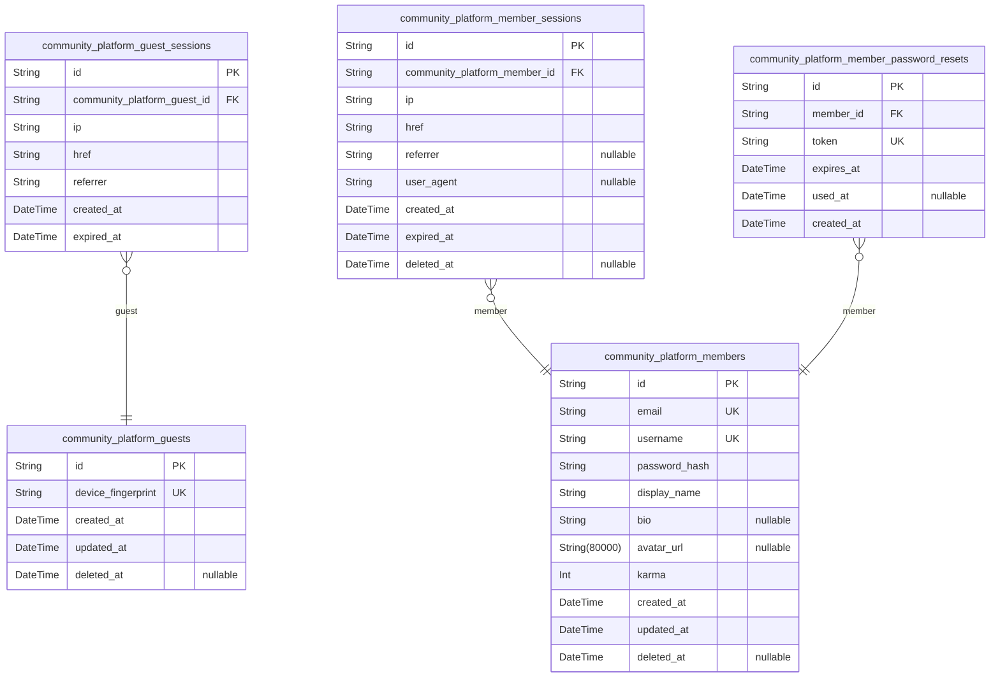
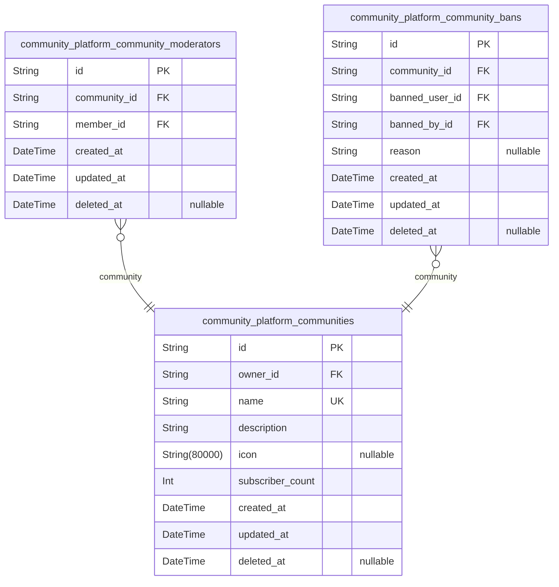
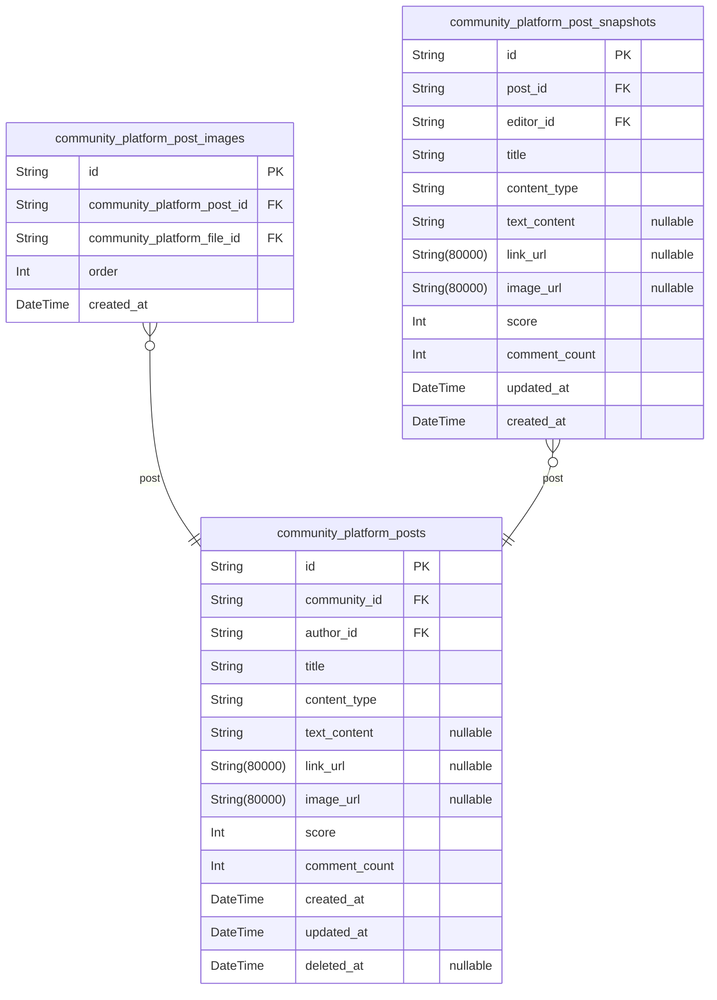
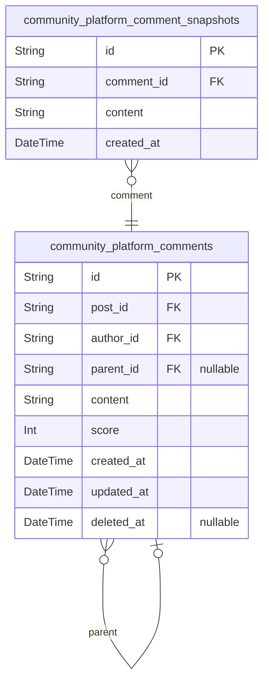
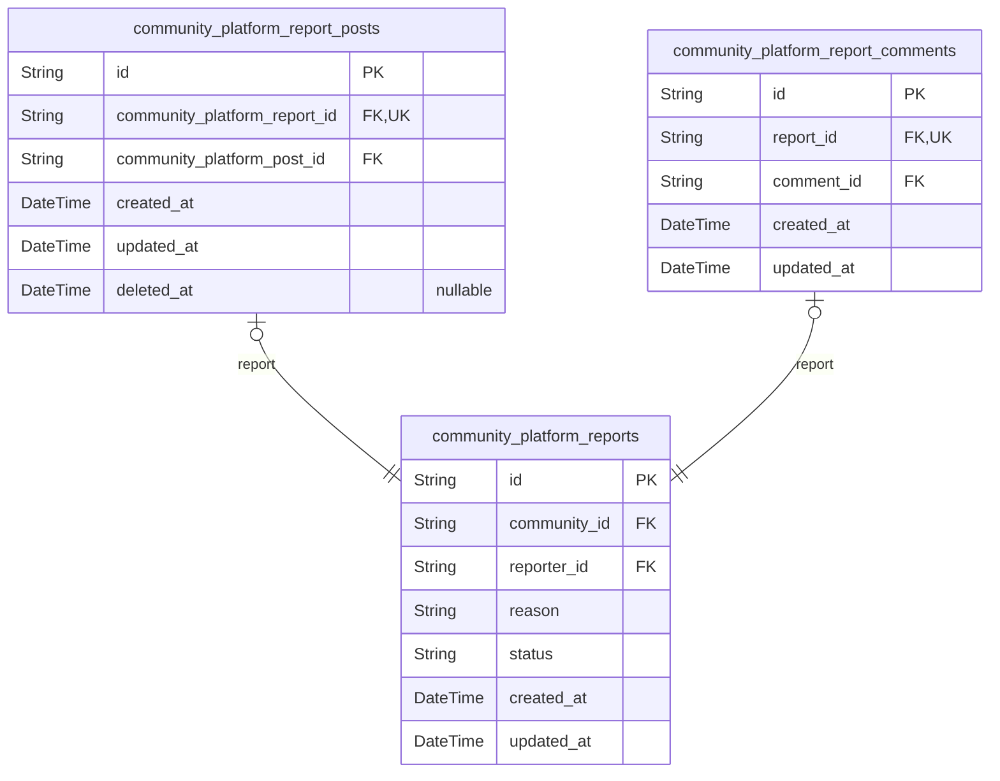
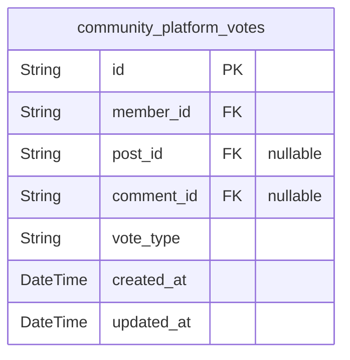
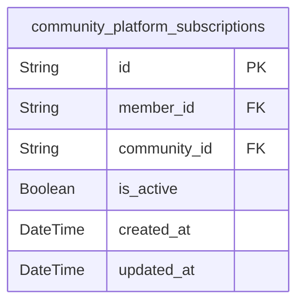
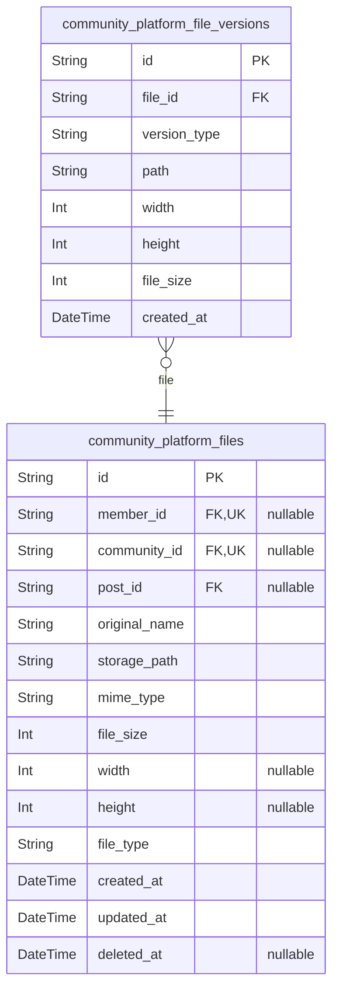

# Prisma Markdown

> Generated by [`prisma-markdown`](https://github.com/samchon/prisma-markdown)

- [Actors](#actors)
- [Communities](#communities)
- [Posts](#posts)
- [Comments](#comments)
- [Moderation](#moderation)
- [Votes](#votes)
- [Subscriptions](#subscriptions)
- [Files](#files)

## Actors

### `community_platform_guests`

Temporary guest accounts for unauthenticated users identified by device
fingerprint. Used to track browsing sessions and enforce rate limiting
for users who have not registered or logged in. Guests can browse public
feeds, view user profiles, and search for communities but cannot create
content, vote, or subscribe to communities. Each guest account is
uniquely identified by their device fingerprint rather than
email/password credentials.

Properties as follows:

- `id`: Primary Key.
- `device_fingerprint`
  > Unique device fingerprint hash used to identify and track guest users
  > across sessions without requiring authentication credentials. Generated
  > from browser and device characteristics.
- `created_at`: Timestamp when the guest account was first created.
- `updated_at`: Timestamp when the guest account was last updated.
- `deleted_at`
  > Timestamp when the guest account was soft deleted. Null if the account is
  > still active.

### `community_platform_guest_sessions`

Temporary session tokens for guest users accessing public content without
authentication.

Tracks unauthenticated visitor sessions for rate limiting, analytics, and
security purposes. Each session is associated with a guest account
identified by device fingerprint. Sessions capture connection metadata
including IP address, current page URL, and referrer for audit trails and
abuse prevention.

Sessions have a defined expiration time and are cleaned up after expiry.
Multiple concurrent sessions per guest are supported to accommodate
multi-device access patterns.

Properties as follows:

- `id`: Primary Key.
- `community_platform_guest_id`
  > The guest account that owns this session. References {@link
  > community_platform_guests.id}.
- `ip`
  > IP address of the client initiating the session connection, used for
  > security monitoring and rate limiting.
- `href`
  > The URL path or page the guest was viewing when the session was created
  > or last active.
- `referrer`
  > The referring URL from which the guest navigated to the platform,
  > captured for traffic source analysis.
- `created_at`
  > Timestamp when the session was created, marking the start of the guest's
  > visit.
- `expired_at`
  > Timestamp when the session expires. Sessions are invalidated after this
  > time for security purposes.

### `community_platform_members`

Registered member accounts with email/password authentication
credentials, profile information, and karma score.

This is the primary actor entity for authenticated users in the community
platform. Each member has a unique email address used for authentication
and a unique username that serves as their public identifier visible to
other users across the platform.

Members can create and manage posts and comments, vote on content,
subscribe to communities, create and moderate communities they own, and
manage their user profile. They accumulate karma from upvotes on their
content, which can also become negative from downvotes.

Related entities:
- [community_platform_member_sessions](#community_platform_member_sessions) - Login sessions for
authentication state
- [community_platform_member_password_resets](#community_platform_member_password_resets) - Password reset
tokens for account recovery
- [community_platform_posts](#community_platform_posts) - Posts created by this member
- [community_platform_comments](#community_platform_comments) - Comments written by this member
- [community_platform_votes](#community_platform_votes) - Votes cast by this member
- [community_platform_subscriptions](#community_platform_subscriptions) - Community subscriptions
- [community_platform_communities](#community_platform_communities) - Communities owned by this member

Properties as follows:

- `id`: Primary Key.
- `email`
  > Unique email address used as the primary identifier for account
  > authentication. Stored in lowercase format and must not already be
  > registered in the system.
- `username`
  > Unique public identifier visible to other users across the platform.
  > Contains only alphanumeric characters (a-z, A-Z, 0-9) and underscores.
  > Case-insensitive for uniqueness comparison. Cannot be changed after
  > account creation.
- `password_hash`
  > Securely hashed password for account authentication. Passwords must meet
  > complexity requirements including minimum length, uppercase, lowercase,
  > numeric, and special character requirements.
- `display_name`
  > Public display name shown on the user's profile and alongside their
  > content. Can contain letters, numbers, spaces, and common punctuation.
  > Not required to be unique and can be changed at any time.
- `bio`
  > Biography text describing the user on their profile. Optional field that
  > can be left empty or cleared entirely. Subject to maximum character
  > length for readability.
- `avatar_url`
  > URL to the user's avatar image representing them visually across the
  > platform. Accepts standard image formats (JPEG, PNG, GIF) with size
  > constraints. Optional profile customization.
- `karma`
  > Cumulative karma score reflecting community reception of the member's
  > contributions. Increased by upvotes and decreased by downvotes on their
  > posts and comments. Can become negative with more downvotes than upvotes.
  > Members cannot earn karma from their own votes on their own content.
- `created_at`: Timestamp when the member account was registered.
- `updated_at`: Timestamp when the member profile was last updated.
- `deleted_at`
  > Timestamp when the member account was soft-deleted. Null if the account
  > is active.

### `community_platform_member_sessions`

JWT session tokens with access and refresh token support for member
authentication with device tracking.

This table tracks login sessions for authenticated members, storing
connection metadata (IP, href, referrer, user agent) for security
auditing and multi-device management. Each session belongs to exactly one
member (community_platform_members) and supports session lifecycle
management including creation, expiration, and invalidation.

Sessions enable the token refresh mechanism where members can obtain new
access tokens using valid refresh tokens. The expired_at field determines
session validity, while deleted_at supports soft deletion for logout
operations without losing audit history.

Properties as follows:

- `id`
  > Primary Key. Unique session identifier used for session lifecycle
  > management and token association.
- `community_platform_member_id`
  > The member who owns this session. References {@link
  > community_platform_members.id}.
- `ip`
  > IP address from which the session was created. Used for security auditing
  > and suspicious activity detection.
- `href`
  > The URL or page location at the time of session creation. Represents the
  > entry point for the authentication flow.
- `referrer`
  > HTTP referrer header value at session creation. Used for tracking session
  > origin and security analysis.
- `user_agent`
  > Browser and device user agent string. Used for device identification in
  > multi-device session management and security alerts.
- `created_at`
  > Timestamp when the session was created. Used for session age tracking and
  > audit trails.
- `expired_at`
  > Timestamp when the session expires. Sessions beyond this time require
  > re-authentication or token refresh.
- `deleted_at`
  > Timestamp when the session was invalidated (logout). Supports soft
  > deletion for audit trail preservation.

### `community_platform_member_password_resets`

Password reset tokens for member account recovery. Each token is uniquely
generated and associated with a specific member account, with an
expiration time for security. Tokens are consumed when the member
successfully resets their password.

This table supports the password recovery workflow, allowing members to
securely reset forgotten passwords via email-based token verification.

Properties as follows:

- `id`: Primary Key.
- `member_id`
  > The member account requesting the password reset. {@link
  > community_platform_members.id}
- `token`
  > Unique password reset token used for secure verification. This token is
  > sent to the member's email and must be presented to complete the password
  > reset.
- `expires_at`
  > Timestamp when the reset token expires. After this time, the token
  > becomes invalid and a new reset request must be made.
- `used_at`
  > Timestamp when the token was consumed during a successful password reset.
  > Null if the token has not been used yet.
- `created_at`: Timestamp when the password reset token was created.

## Communities

### `community_platform_communities`

Primary community entity representing a topic-focused gathering space
where users can create posts, participate in discussions, and subscribe
for personalized content delivery.

Each community has a unique name for identification and search, a
description explaining its purpose, an optional icon for visual
recognition, and an owner who created the community. The subscriber count
is denormalized for efficient display in lists and feeds, maintained in
sync with the subscriptions table.

Communities serve as containers for posts and discussions, with ownership
and moderation hierarchies managed through related tables. Owners have
the highest authority within their communities and can appoint
moderators. Members must subscribe to a community before posting content.

[community_platform_members](#community_platform_members) - Owner relationship
[community_platform_community_moderators](#community_platform_community_moderators) - Moderator assignments
[community_platform_community_bans](#community_platform_community_bans) - Community-scoped bans
[community_platform_subscriptions](#community_platform_subscriptions) - Member subscriptions

Properties as follows:

- `id`: Primary Key.
- `owner_id`
  > The user who created and owns this community. The owner has the highest
  > authority within the community and cannot be removed by moderators.
  > [community_platform_members.id](#community_platform_members)
- `name`
  > Unique community name used as identifier and in URLs. Must contain only
  > alphanumeric characters, underscores, and hyphens. Cannot start or end
  > with special characters. Case-insensitive for uniqueness validation.
- `description`
  > Required text description explaining the community's purpose and topic
  > focus. Visible to all users when viewing the community. Helps users
  > understand the community's theme and decide whether to subscribe.
- `icon`
  > Optional URL to the community's icon image for visual identification.
  > Displayed alongside the community name in lists and feeds. If not
  > provided, the system uses a default placeholder icon.
- `subscriber_count`
  > Denormalized count of active subscribers for display performance in
  > community lists and search results. Kept in sync with the subscriptions
  > table through application-level updates.
- `created_at`
  > Timestamp when the community was created. Used for sorting communities
  > chronologically and displaying creation time.
- `updated_at`
  > Timestamp when the community was last updated (e.g., name change,
  > description edit, icon update). Maintained automatically for audit
  > purposes.
- `deleted_at`
  > Timestamp when the community was soft-deleted. If set, the community is
  > no longer visible in searches or feeds but data is preserved. Null for
  > active communities.

### `community_platform_community_moderators`

Junction table representing the many-to-many relationship between members
and communities for moderator privileges.

This table tracks which members serve as moderators for which
communities, supporting the two-level moderation hierarchy (owner >
moderator). Moderators can delete posts and comments, ban/unban users,
manage reports, and appoint new moderators within their community. Only
the community owner can remove moderators.

The unique constraint on (community_id, member_id) ensures a member can
only be a moderator once per community. The appointment timestamp enables
audit trails for moderator lifecycle management.

Related entities: [community_platform_communities](#community_platform_communities) (the moderated
community), [community_platform_members](#community_platform_members) (the moderator user).

Properties as follows:

- `id`: Primary Key.
- `community_id`
  > The community where this member has moderator privileges. {@link
  > community_platform_communities.id}.
- `member_id`
  > The member who serves as a moderator. {@link
  > community_platform_members.id}.
- `created_at`: Timestamp when the member was appointed as moderator of the community.
- `updated_at`: Timestamp when the moderator record was last updated.
- `deleted_at`
  > Timestamp when the moderator was removed (soft delete). Null if moderator
  > is still active.

### `community_platform_community_bans`

Community-specific ban records that restrict user participation while
preserving read access.

Each ban applies to exactly one user-community pair, preventing the
banned user from creating posts and comments in that community while
allowing continued content viewing. Bans are enacted by moderators or
community owners and can be removed (unbanned) by any moderator.

The table maintains a complete audit trail of all ban actions, including
who applied each ban, when it was applied, and the optional reason.
Unbans are handled via soft deletion (deleted_at field), preserving the
historical record for moderation accountability.

Related entities:
- [community_platform_communities](#community_platform_communities) - The community where the ban
applies
- [community_platform_members](#community_platform_members) - Both the banned user and the
moderator who applied the ban

Properties as follows:

- `id`: Primary Key.
- `community_id`
  > The community from which the user is banned. Participation restrictions
  > apply only within this specific community. {@link
  > community_platform_communities.id}
- `banned_user_id`
  > The member who has been banned from participating in the community. The
  > user retains read access but cannot create posts or comments. {@link
  > community_platform_members.id}
- `banned_by_id`
  > The moderator who applied the ban. Must be a moderator or owner of the
  > community at the time of ban creation. {@link
  > community_platform_members.id}
- `reason`
  > Optional explanation for why the ban was applied. Provides transparency
  > and context for moderation decisions. May be null if the moderator chose
  > not to provide a reason.
- `created_at`
  > Timestamp when the ban was enacted. Records the exact moment the ban
  > takes effect, stored in ISO 8601 format. Immutable once recorded.
- `updated_at`
  > Timestamp when the ban record was last modified. Updated when ban details
  > are changed.
- `deleted_at`
  > Timestamp when the ban was removed (unbanned). When set, indicates the
  > user's participation rights have been restored. Null for active bans.
  > Preserves audit trail after unban.

## Posts

### `community_platform_posts`

Primary content entity created by members within communities, supporting
three content types (text, link, image). Posts are the main discussion
units that receive votes, comments, and can be reported. Each post has a
vote score (upvotes minus downvotes), comment count, and belongs to
exactly one community. Authors must be subscribed to the community to
create posts. Posts support soft deletion to preserve thread context and
audit trails.

Properties as follows:

- `id`: Primary Key.
- `community_id`
  > Community where the post was created. Author must have an active
  > subscription to this community. {@link
  > community_platform_communities.id}.
- `author_id`
  > Member who created the post. The author's karma is affected by votes on
  > this post. [community_platform_members.id](#community_platform_members).
- `title`
  > Post title, required for all content types. Displayed in feeds and as the
  > primary identifier for the post.
- `content_type`
  > Content type determining which content field is populated: 'text'
  > (text_content), 'link' (link_url), or 'image' (image_url). Immutable
  > after creation.
- `text_content`
  > Text content for text-type posts. Null for link and image posts. Can be
  > edited by the author.
- `link_url`
  > URL for link-type posts. Null for text and image posts. Domain name is
  > displayed in feed summaries.
- `image_url`
  > Primary image URL for image-type posts. Null for text and link posts.
  > Multiple images are stored via post_images table.
- `score`
  > Vote score calculated as upvotes minus downvotes. Can be negative.
  > Updated in real-time as votes are cast, changed, or removed.
- `comment_count`
  > Total count of comments and nested replies on this post. Updated as
  > comments are added or deleted.
- `created_at`
  > Timestamp when the post was created. Used for sorting (New) and relative
  > time display.
- `updated_at`
  > Timestamp when the post was last edited. Same as created_at if never
  > edited.
- `deleted_at`
  > Timestamp when the post was soft-deleted. Null if the post is active.
  > Soft deletion preserves thread context and enables karma adjustment.

### `community_platform_post_images`

Stores multiple images associated with a single post, enabling ordered
image galleries for image-type posts. Each image references a file in the
Files component for metadata tracking. Images are displayed in ascending
order based on the order field. This table is a subsidiary entity managed
through the parent post - users add or remove images when creating or
editing posts, not through independent operations.

Relationships:
- Each image belongs to exactly one [community_platform_posts](#community_platform_posts)
- Each image references exactly one [community_platform_files](#community_platform_files) for
storage metadata

Usage: When displaying an image post, query images ordered by the order
field to show the gallery in the intended sequence.

Properties as follows:

- `id`: Primary Key.
- `community_platform_post_id`
  > The post this image belongs to. Each post can have multiple images
  > displayed as a gallery. [community_platform_posts.id](#community_platform_posts)
- `community_platform_file_id`
  > The file record containing storage metadata for this image. References
  > the centralized file storage system. [community_platform_files.id](#community_platform_files)
- `order`
  > Display order of this image within the post's gallery. Images are shown
  > in ascending order (0, 1, 2...). Lower numbers appear first.
- `created_at`
  > Timestamp when this image was added to the post. Used for audit trail and
  > chronological tracking.

### `community_platform_post_snapshots`

Point-in-time snapshots of post content capturing the state after each
edit for audit trail and edit history. Each snapshot represents a version
of the post at a specific moment in time, preserving the content as it
existed after a modification was made. The snapshot captures all editable
fields including title, content type, type-specific content fields,
score, comment count, and tracks the editor who made the change.
Snapshots are append-only and maintain a complete history of all
modifications to a post, enabling users and moderators to track content
changes and attribute edits to specific users. References the parent
[community_platform_posts.id](#community_platform_posts) and the editor {@link
community_platform_members.id} for complete audit trail.

Properties as follows:

- `id`: Primary Key. Unique identifier for the post snapshot record.
- `post_id`
  > Reference to the post that was snapshotted. Links this historical version
  > to the parent [community_platform_posts.id](#community_platform_posts).
- `editor_id`
  > Reference to the member who made the edit that triggered this snapshot.
  > Enables audit trail attribution of changes to specific users. Links to
  > [community_platform_members.id](#community_platform_members).
- `title`
  > The title of the post at this point in time, as stored in the snapshot
  > for edit history.
- `content_type`
  > The content type of the post (text, link, or image) at this point in
  > time. Content type cannot be changed during edits, so this reflects the
  > original type.
- `text_content`
  > The text content for text-type posts at this point in time. Null for
  > non-text posts.
- `link_url`
  > The URL for link-type posts at this point in time. Null for non-link
  > posts.
- `image_url`
  > The image URL for image-type posts at this point in time. Null for
  > non-image posts.
- `score`
  > The vote score (upvotes minus downvotes) of the post at the time this
  > snapshot was created, preserved for historical record.
- `comment_count`
  > The number of comments on the post at the time this snapshot was created,
  > preserved for historical record.
- `updated_at`
  > Timestamp when the parent post was last updated at the time of this
  > snapshot, serving as the version timestamp for this edit.
- `created_at`
  > Timestamp when this snapshot was created, marking the moment the post
  > state was captured for edit history.

## Comments

### `community_platform_comments`

User comments on posts supporting unlimited nested reply depth through
parent_id self-reference. Comments belong to posts and are authored by
members. The score field is denormalized from votes for sorting
performance (best/new/controversial). Supports soft deletion via
deleted_at to preserve thread context when comments are removed. Comments
can be edited by authors and removed by moderators. Voting on comments
affects both comment score and author karma. Reports targeting comments
are handled by the separate [community_platform_report_comments](#community_platform_report_comments)
subtype table.

Key features:
- Unlimited nesting depth via parent_id chain
- Score tracking for sorting (best/new/controversial)
- Soft deletion preserves reply thread context
- Edit history tracked via snapshots table
- Voting managed through polymorphic votes table

Properties as follows:

- `id`: Primary Key.
- `post_id`
  > The post this comment belongs to. References {@link
  > community_platform_posts.id}. Comments cannot exist without a parent
  > post. If the post is deleted, all associated comments are removed.
- `author_id`
  > The member who authored this comment. References {@link
  > community_platform_members.id}. Author attribution is preserved even
  > after edits. Karma changes from votes affect this member.
- `parent_id`
  > The parent comment for nested replies. References {@link
  > community_platform_comments.id}. Null for top-level comments directly on
  > posts. Enables unlimited nesting depth. When a parent comment is deleted,
  > child replies are preserved with a placeholder indicating the deleted
  > parent.
- `content`
  > The comment content text. Required to be non-empty with maximum length of
  > 10,000 characters. Original formatting including line breaks is
  > preserved.
- `score`
  > The current vote score (total upvotes minus total downvotes).
  > Denormalized from votes for sorting performance. Can be negative if
  > downvotes exceed upvotes. Initialized to zero on creation. Updated in
  > real-time when votes are cast, changed, or removed.
- `created_at`
  > Timestamp when the comment was created. Used for chronological sorting
  > (new) and display of elapsed time.
- `updated_at`
  > Timestamp when the comment was last edited. Initially equal to
  > created_at, updated on each edit. Used for edit tracking and audit trail.
- `deleted_at`
  > Timestamp when the comment was soft-deleted. Null for active comments.
  > When set, the comment content is hidden but the record is preserved to
  > maintain reply thread context. Set when author or moderator removes the
  > comment.

### `community_platform_comment_snapshots`

Point-in-time snapshots of comment content for audit trail and edit history.

Captures the previous state of a comment before edits are applied,
maintaining a complete history of content changes. Each snapshot
represents one version of a comment's content, enabling audit trails and
historical review of how comments evolved over time.

Relationships:
- Belongs to [community_platform_comments](#community_platform_comments) (each comment can have
multiple snapshots)
- References the parent comment for edit history retrieval

Behavior:
- Append-only: new snapshots are created when comments are edited
- Never updated or deleted once created
- Used for audit purposes and change tracking

Properties as follows:

- `id`: Primary Key.
- `comment_id`
  > Reference to the comment being snapshotted. {@link
  > community_platform_comments.id}
- `content`
  > The comment content text at the time of this snapshot. Stores the
  > complete text (up to 10,000 characters) before an edit was applied,
  > preserving the historical state for audit trail purposes.
- `created_at`
  > Timestamp when this snapshot was created. Marks when the previous content
  > was preserved before an edit was applied.

## Moderation

### `community_platform_reports`

Content reports filed by users against posts or comments within a
community. Reports follow a status workflow (pending →
approved/dismissed) and are routed to community moderators for review.
Each report captures the reporter identity, reason text, and community
context. Content targeting is handled by subtype tables
(community_platform_report_posts, community_platform_report_comments)
using the polymorphic ownership pattern to ensure exactly one target per
report.

Reports enable community self-policing by allowing users to flag
problematic content. Moderators can approve reports (deleting the
content) or dismiss them (preserving the content). Reports retain full
audit trail including timestamps for lifecycle tracking.

Uniqueness is enforced at the subtype level: each user can report
multiple content items within the same community, but only once per
specific content item.

Properties as follows:

- `id`: Primary Key.
- `community_id`
  > The community where the reported content exists. Reports are routed to
  > moderators of this community for review. {@link
  > community_platform_communities.id}
- `reporter_id`
  > The user who submitted the report. Each user can submit exactly one
  > report per content item (enforced at subtype table level). {@link
  > community_platform_members.id}
- `reason`
  > Text explanation provided by the reporter describing why the content
  > violates community standards. Must be between 10 and 1000 characters.
  > Required for all reports.
- `status`
  > Current status of the report in the moderation workflow. Valid values:
  > 'pending' (awaiting review), 'approved' (moderator approved, content
  > deleted), 'dismissed' (moderator dismissed, content preserved). Status
  > cannot change after being approved or dismissed.
- `created_at`
  > Timestamp when the report was submitted. Used for ordering the moderation
  > queue (newest first) and audit trail.
- `updated_at`
  > Timestamp of the last status change. Tracks when the report was approved
  > or dismissed for audit purposes.

### `community_platform_report_posts`

Subtype table for reports targeting posts, implementing the polymorphic
ownership pattern. Contains the post reference to enforce
one-target-per-report constraint. Each report can target exactly one
content type (post OR comment), and this table stores the post-specific
reference when reports flag post content. Managed through parent report
operations, not directly exposed to users.

Properties as follows:

- `id`: Primary Key.
- `community_platform_report_id`
  > Reference to the parent report record. Enforces 1:1 relationship between
  > reports and their post target subtype. {@link
  > community_platform_reports.id}
- `community_platform_post_id`
  > Reference to the post being reported. Links the report to the specific
  > post content flagged by the reporting user. {@link
  > community_platform_posts.id}
- `created_at`: Timestamp when this report-post association was created.
- `updated_at`: Timestamp when this report-post association was last updated.
- `deleted_at`
  > Soft deletion timestamp. When set, indicates the association has been
  > removed while preserving audit trail.

### `community_platform_report_comments`

Subtype table for reports targeting comments, implementing the
polymorphic ownership pattern. Each report has exactly one entry in
either this table or community_platform_report_posts (never both). The
unique constraint on report_id enforces the one-target-per-report
constraint. References the specific comment being reported while the main
reports table holds reporter identity, reason, status, and community
association.

This table supports community self-policing by enabling users to flag
problematic comments for moderator review. Moderators view reported
content through the main reports entity and take action (approve/dismiss)
on the report.

Properties as follows:

- `id`: Primary Key.
- `report_id`
  > Reference to the parent report. Unique constraint enforces 1:1
  > relationship - each report can only target one content item (either a
  > post OR a comment, never both). [community_platform_reports.id](#community_platform_reports)
- `comment_id`
  > The comment being reported. References the specific comment that a user
  > flagged for moderator review. [community_platform_comments.id](#community_platform_comments)
- `created_at`
  > Timestamp when this report-comment link was created. Inherits audit
  > timing from the parent report.
- `updated_at`
  > Timestamp when this record was last modified. Updated when the link is
  > created or modified.

## Votes

### `community_platform_votes`

User votes on posts or comments representing approval (upvote) or
disapproval (downvote). Uses polymorphic content targeting where exactly
one of post_id or comment_id must be set, not both. Enforces single vote
per user per content through unique constraints. Maintains timestamps for
vote lifecycle tracking. Vote scores are denormalized on content tables
(posts.score, comments.score) and karma impact is managed on the member
table. Supports vote state transitions: no vote → upvote/downvote, upvote
↔ downvote, upvote/downvote → no vote (removal). Self-voting prevention
and banned user restrictions are application-level validations. Vote
anonymity is preserved - voter identity is never revealed to other users.

Properties as follows:

- `id`: Primary Key.
- `member_id`
  > The member who cast this vote. References {@link
  > community_platform_members.id}.
- `post_id`
  > The post this vote targets (if voting on a post). Must be null when
  > comment_id is set. Polymorphic content targeting. References {@link
  > community_platform_posts.id}.
- `comment_id`
  > The comment this vote targets (if voting on a comment). Must be null when
  > post_id is set. Polymorphic content targeting. References {@link
  > community_platform_comments.id}.
- `vote_type`
  > The type of vote cast. Either 'upvote' for approval/agreement or
  > 'downvote' for disapproval/disagreement. Valid values: 'upvote',
  > 'downvote'.
- `created_at`
  > Timestamp when the vote was first cast. Recorded in ISO 8601 format with
  > timezone.
- `updated_at`
  > Timestamp when the vote was last modified (vote type changed). Same as
  > created_at if never modified.

## Subscriptions

### `community_platform_subscriptions`

Junction table tracking user-community membership with active/inactive
state management. Records the subscription relationship between members
and communities, supporting resubscribe workflows by retaining historical
records even after unsubscription. Used for posting permission validation
(only subscribed users can post in a community) and home feed
personalization (members see posts from their subscribed communities).
Each member-community pair has exactly one subscription record that
transitions between active and inactive states rather than being deleted.

Properties as follows:

- `id`: Primary Key.
- `member_id`
  > The member who subscribed to the community. {@link
  > community_platform_members.id}
- `community_id`
  > The community that the member has subscribed to. {@link
  > community_platform_communities.id}
- `is_active`
  > Whether the subscription is currently active. When true, the member has
  > posting permissions in the community and sees the community's posts in
  > their home feed. When false (unsubscribed), historical record is
  > preserved for potential resubscription.
- `created_at`
  > Timestamp when the subscription was first created. Preserved even after
  > unsubscription to maintain historical record.
- `updated_at`
  > Timestamp when the subscription was last updated, including state changes
  > (subscribe/unsubscribe/resubscribe). Updated on resubscription to reflect
  > reactivation time.

## Files

### `community_platform_files`

Central file storage entity tracking all uploaded media including user
avatars, community icons, and post images.

Stores file metadata including original name, storage path, MIME type,
file size, and image dimensions. Uses file_type enum to classify file
purpose and determine ownership association: avatar files link to
members, icon files link to communities, and post_image files link to
posts.

Supports soft deletion for retention policies and cascading deletion when
parent entities are removed. Files are validated for format (JPEG, PNG,
GIF, WebP), size constraints (avatar/icon: 2MB max, post_image: 20MB
max), and virus scanned before acceptance.

Related display versions (thumbnails, optimized sizes) are stored in
[community_platform_file_versions](#community_platform_file_versions).

Properties as follows:

- `id`: Primary Key.
- `member_id`
  > Owning member for avatar files. References {@link
  > community_platform_members.id}. Only populated when file_type is
  > 'avatar'. Enforces one active avatar per member.
- `community_id`
  > Owning community for icon files. References {@link
  > community_platform_communities.id}. Only populated when file_type is
  > 'icon'. Enforces one active icon per community.
- `post_id`
  > Owning post for post image files. References {@link
  > community_platform_posts.id}. Only populated when file_type is
  > 'post_image'. Multiple images allowed per post.
- `original_name`
  > Original filename provided by the user during upload. Sanitized to remove
  > special characters but preserves the original name for display purposes.
- `storage_path`
  > Unique storage path where the file is persisted. Uses generated unique
  > identifier to prevent path collisions and security issues.
- `mime_type`
  > MIME type of the file content. Validated against allowed formats:
  > image/jpeg, image/png, image/gif, image/webp. Also verified to match
  > actual file content.
- `file_size`
  > File size in bytes. Used for validation against type-specific limits
  > (avatar/icon: 2MB, post_image: 20MB) and storage quota tracking.
- `width`
  > Image width in pixels. Used for dimension validation (avatar: 64-4096px,
  > icon: 64-4096px, post_image: 1-8192px) and display version generation.
- `height`
  > Image height in pixels. Used for dimension validation and display version
  > generation. Null for non-image files.
- `file_type`
  > Classification of file purpose: 'avatar' for user profile images, 'icon'
  > for community icons, 'post_image' for post attachments. Determines
  > ownership relationship and validation rules.
- `created_at`
  > Timestamp when the file was uploaded. Used for retention policies,
  > cleanup jobs, and audit trails.
- `updated_at`
  > Timestamp when file metadata was last modified. Updated when file is
  > replaced or metadata changes.
- `deleted_at`
  > Soft deletion timestamp. Set when file is marked for deletion. Enables
  > retention policy (delete within 24 hours) and cascade cleanup when parent
  > entities are removed.

### `community_platform_file_versions`

Display versions of uploaded files for responsive image serving across
different UI contexts.

This table stores multiple renderings of the same source file at
different sizes (thumbnail, medium, large, original) to enable efficient
content delivery. When a file is uploaded, the system generates these
versions automatically.

Each file can have up to four versions, one of each type. Thumbnails are
used in feed previews and listings, medium sizes for embedded display,
large for detail views, and original preserves the full-resolution
source.

Relationship: Each version belongs to exactly one {@link
community_platform_files} entry via the file_id foreign key. The unique
constraint on [file_id, version_type] ensures no duplicate version types
per file.

Properties as follows:

- `id`: Primary Key.
- `file_id`
  > Reference to the parent file. Each file can have multiple display
  > versions for different UI contexts. [community_platform_files.id](#community_platform_files)
- `version_type`
  > Display version type: 'thumbnail' for feed previews (small, ~150x150),
  > 'medium' for embedded display (~400x400), 'large' for detail views
  > (~800x800), 'original' for full-resolution source.
- `path`
  > Storage path or URL where this version is accessible. Used to serve the
  > file to clients.
- `width`
  > Image width in pixels for this version. Used by clients for responsive
  > image selection and layout calculations.
- `height`
  > Image height in pixels for this version. Used by clients for responsive
  > image selection and layout calculations.
- `file_size`
  > File size in bytes for this version. Used for bandwidth optimization and
  > loading priority decisions.
- `created_at`
  > Timestamp when this version was generated. Versions are created at upload
  > time and are immutable thereafter.
