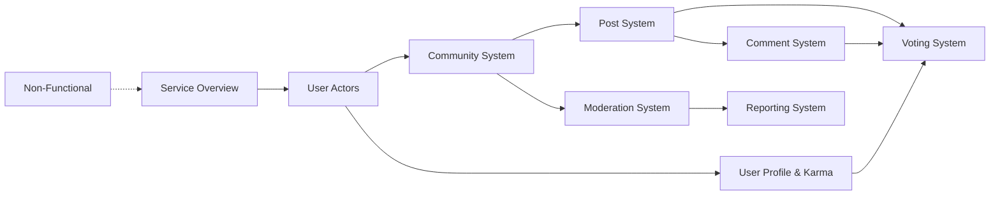

# Community Platform - Requirements Documentation

## Document Overview

This documentation set provides comprehensive business requirements for a **Reddit-like community platform**. The platform enables users to create communities, share posts, engage in discussions through nested comments, and build reputation through a karma system.

### Purpose of This Documentation

This documentation serves as the single source of truth for backend developers implementing the community platform. Each document focuses on specific business domains, providing:

- **Business requirements in natural language** - Clear descriptions of what the system should do
- **User workflows and scenarios** - How users interact with the system
- **Business rules and constraints** - Validation and logic requirements
- **Permission requirements** - Who can perform what actions

### What This Documentation Does NOT Contain

- Technical architecture specifications
- API endpoint definitions
- Database schemas or ERD diagrams
- Frontend UI/UX requirements
- Implementation details

All technical implementation decisions belong to the development team.

---

## Document Organization

The documentation follows a **progressive elaboration** structure, starting from high-level concepts and moving to detailed functional requirements.

### Reading Order Recommendation

For first-time readers, we recommend the following order:

1. **Start Here**: [Service Overview](./01-service-overview.md) - Understand the platform vision
2. **Foundation**: [User Actors](./02-user-actors.md) - Learn about authentication and permissions
3. **Core Features**: [User Profile & Karma](./03-user-profile-karma.md) → [Community System](./04-community-system.md) → [Post System](./05-post-system.md)
4. **Engagement**: [Comment System](./06-comment-system.md) → [Voting System](./07-voting-system.md)
5. **Governance**: [Moderation System](./08-moderation-system.md) → [Reporting System](./09-reporting-system.md)
6. **Quality**: [Non-Functional Requirements](./10-non-functional.md)

### Document Dependency Map

---

## Table of Contents

### 01. Service Overview

**Document**: [Service Overview](./01-service-overview.md)

**Purpose**: Establish the platform vision, business model, target users, and core value proposition.

**Key Topics**:
- Platform vision and mission
- Target user personas and demographics
- Core value proposition and competitive differentiation
- Business model and revenue strategy
- Key features overview
- Success metrics and KPIs

**Audience**: All stakeholders - provides essential context for understanding the entire platform.

---

### 02. User Actors

**Document**: [User Actors and Authentication](./02-user-actors.md)

**Purpose**: Define user actors, authentication flows, and account management requirements.

**Key Topics**:
- User actor definitions and permissions
- Account registration with email and password
- Login and session management
- Password management (change, reset)
- Account deletion and data cleanup
- JWT token management
- Complete permission matrix

**Audience**: Backend developers implementing authentication and authorization.

**Prerequisites**: Service Overview recommended.

---

### 03. User Profile & Karma

**Document**: [User Profile and Karma System](./03-user-profile-karma.md)

**Purpose**: Specify user profile features and karma system for user identity and reputation.

**Key Topics**:
- Profile components (display name, bio, avatar)
- Profile management and editing
- Profile viewing permissions
- Karma system mechanics
- Karma calculation rules (upvotes, downvotes, vote removal)
- Activity history display (posts, comments)

**Audience**: Backend developers implementing user identity and reputation features.

**Prerequisites**: User Actors document required.

---

### 04. Community System

**Document**: [Community System](./04-community-system.md)

**Purpose**: Define community creation, discovery, subscription, and management features.

**Key Topics**:
- Community creation and ownership
- Community information display (name, description, icon)
- Subscription management (subscribe, unsubscribe)
- Community discovery and search
- Subscriber count display
- Community listing features

**Audience**: Backend developers implementing community features.

**Prerequisites**: User Actors document required.

---

### 05. Post System

**Document**: [Post System](./05-post-system.md)

**Purpose**: Specify post types, creation, management, feeds, and sorting algorithms.

**Key Topics**:
- Post types (text, link, image posts)
- Post creation and editing requirements
- Post deletion and cleanup
- Post feeds (Home, Popular, Community)
- Sorting algorithms (Hot, New, Top, Controversial)
- Post display requirements for lists and detail views
- Pagination requirements

**Audience**: Backend developers implementing content management and feed algorithms.

**Prerequisites**: Community System and User Actors documents required.

---

### 06. Comment System

**Document**: [Comment System](./06-comment-system.md)

**Purpose**: Define nested comment system with creation, management, and sorting.

**Key Topics**:
- Comment creation on posts
- Nested reply system (unlimited depth)
- Comment editing and deletion
- Comment sorting options (Best, New, Controversial)
- Comment display requirements
- Thread visualization

**Audience**: Backend developers implementing discussion features.

**Prerequisites**: Post System document recommended.

---

### 07. Voting System

**Document**: [Voting System](./07-voting-system.md)

**Purpose**: Specify voting mechanics for posts and comments including score calculation.

**Key Topics**:
- Voting mechanics (upvote, downvote)
- Vote management (change vote, remove vote)
- Score calculation rules
- One-vote-per-user constraint
- Vote impact on karma system
- Voting permissions

**Audience**: Backend developers implementing rating and reputation features.

**Prerequisites**: User Profile & Karma, Post System, and Comment System documents recommended.

---

### 08. Moderation System

**Document**: [Moderation System](./08-moderation-system.md)

**Purpose**: Define community moderation hierarchy, permissions, and moderation actions.

**Key Topics**:
- Moderator roles (Owner, Moderator)
- Moderator hierarchy and permission levels
- Moderator management (add, remove moderators)
- Banning system (ban, unban users)
- Content moderation actions (delete posts, delete comments)
- Banned user list management

**Audience**: Backend developers implementing governance and moderation features.

**Prerequisites**: Community System document required.

---

### 09. Reporting System

**Document**: [Reporting System](./09-reporting-system.md)

**Purpose**: Specify reporting system for content moderation by community moderators.

**Key Topics**:
- Report creation (posts and comments)
- Report reason requirements
- Report information display
- Report management by moderators
- Report resolution (approve/dismiss)
- Report workflow and status tracking

**Audience**: Backend developers implementing content reporting and moderation workflows.

**Prerequisites**: Moderation System document required.

---

### 10. Non-Functional Requirements

**Document**: [Non-Functional Requirements](./10-non-functional.md)

**Purpose**: Define non-functional requirements including performance, security, and scalability.

**Key Topics**:
- Performance requirements and response time expectations
- Scalability considerations
- Security requirements
- Data privacy and protection
- Accessibility standards
- Reliability and availability targets

**Audience**: All backend developers - applies across all features.

**Prerequisites**: All functional requirement documents recommended for context.

---

## Quick Reference

### Core User Journey Documents

| Journey Phase | Relevant Documents |
|--------------|-------------------|
| **Account Setup** | [User Actors](./02-user-actors.md), [User Profile & Karma](./03-user-profile-karma.md) |
| **Community Participation** | [Community System](./04-community-system.md), [Post System](./05-post-system.md) |
| **Content Engagement** | [Comment System](./06-comment-system.md), [Voting System](./07-voting-system.md) |
| **Community Governance** | [Moderation System](./08-moderation-system.md), [Reporting System](./09-reporting-system.md) |

### Feature Permission Matrix Reference

For detailed permission requirements, refer to these documents:

- **Account Permissions**: [User Actors Document](./02-user-actors.md)
- **Community Permissions**: [Community System Document](./04-community-system.md)
- **Moderation Permissions**: [Moderation System Document](./08-moderation-system.md)

---

## Platform Feature Summary

The community platform consists of the following major feature areas:

### User Management
- **Authentication**: Email/password registration and login
- **Profiles**: Display name, bio, and avatar management
- **Karma**: Reputation score based on community votes

### Community Features
- **Community Creation**: Any user can create communities
- **Subscription**: Users subscribe to communities to participate
- **Discovery**: Search and browse available communities

### Content System
- **Posts**: Three types - text, link, and image posts
- **Comments**: Nested, unlimited-depth comment threads
- **Voting**: Upvote/downvote system for posts and comments

### Feeds and Discovery
- **Home Feed**: Posts from subscribed communities
- **Popular Feed**: Posts from all communities
- **Community Feed**: Posts from a single community
- **Sorting**: Hot, New, Top, Controversial algorithms

### Governance
- **Moderation**: Owner and moderator role hierarchy
- **Banning**: Community-level user bans
- **Reporting**: Content reporting and resolution system

---

## Documentation Conventions

### EARS Format
Requirements throughout this documentation use **EARS (Easy Approach to Requirements Syntax)** format for clarity and testability:

- **Ubiquitous**: "THE system SHALL <function>."
- **Event-driven**: "WHEN <trigger>, THE system SHALL <function>."
- **State-driven**: "WHILE <state>, THE system SHALL <function>."
- **Unwanted Behavior**: "IF <condition>, THEN THE system SHALL <function>."
- **Optional Features**: "WHERE <feature>, THE system SHALL <function>."

### Actor Definitions
The platform has a single actor type:

- **Member**: Registered users with authentication capabilities who can participate in all platform activities

Members can have additional roles within specific communities:
- **Community Owner**: Creator of a community with highest moderation authority
- **Community Moderator**: Appointed by owners with limited moderation authority

---

## Version Information

- **Documentation Version**: 1.0
- **Last Updated**: Initial release
- **Platform Scope**: Complete community platform with user management, communities, posts, comments, voting, and moderation

---

> *Developer Note: This document defines **business requirements only**. All technical implementations (architecture, APIs, database design, etc.) are at the discretion of the development team.*