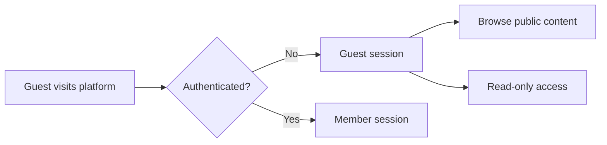
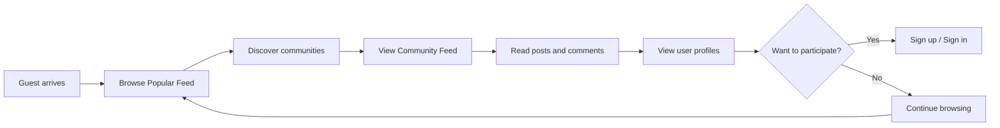
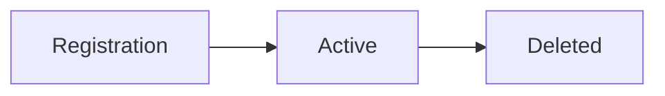

**communityPlatform — Actor definitions, permission matrix, authentication, session, account lifecycle**

Actor definitions, permission matrix, authentication, session, account lifecycle

# Actor Definitions

Define all user actor types with their roles and what they can do.

## guest Actor

A guest is any visitor who accesses the platform without signing in. Guests can browse the Popular Feed to discover trending content from all communities across the platform. They can view any community's feed to see posts within that specific community. Guests can read any post's full content including title, text, links, or images along with all comments and replies. They can view any user's profile to see display name, bio, avatar, karma score, and post history. Guests cannot subscribe to communities, create posts, write comments, or cast votes on any content. They cannot report posts or comments for moderation review. The guest experience is designed to encourage exploration and discovery before committing to account creation.

### Guest Actor Definition

THE system SHALL identify any visitor who has not signed in as a guest.

THE system SHALL maintain the guest status until the visitor completes authentication.

THE system SHALL allow guests to access the platform without requiring account creation.

WHEN a guest accesses the platform, THE system SHALL provide a discovery experience that showcases public content.

THE system SHALL treat every unauthenticated visitor identically with respect to access permissions.

## Guest Access State

### Public Feed Access

THE system SHALL provide guests access to the Popular Feed showing posts from all communities across the platform.

THE system SHALL allow guests to view any specific community's feed to see posts within that community.

WHEN a guest views any feed, THE system SHALL display posts with the same sorting options available to members: Hot, New, Top, and Controversial.

THE system SHALL apply pagination to all feeds displayed to guests.

THE system SHALL allow guests to switch between sorting options without restriction.

THE system SHALL NOT require authentication to access the Popular Feed or any Community Feed.

## Feed Access Comparison

| Feed Type | Guest Access | Content Scope |
|-----------|--------------|---------------|
| Popular Feed | Yes | All communities |
| Community Feed | Yes | Single community |
| Home Feed | No | Requires subscription |

THE system SHALL display the subscriber count for each community visible to guests.

THE system SHALL allow guests to search for communities by name.

### Content Viewing Permissions

THE system SHALL allow guests to read the full content of any post including title, text content, link URLs, and images.

THE system SHALL display the author username, community name, vote score, comment count, and posting time for each post visible to guests.

THE system SHALL allow guests to view all comments and nested replies on any post.

THE system SHALL display comment content, author, vote score, and time since posting for each comment visible to guests.

THE system SHALL provide guests with read-only access to all public posts and comments.

WHEN a guest views a post list, THE system SHALL display:
- Post title
- Author username
- Community name
- Vote score
- Comment count
- Time since posted
- Content preview appropriate to post type (text excerpt, image thumbnail, or link domain)

THE system SHALL NOT restrict guests from viewing any post based on content type.

THE system SHALL apply the same comment sorting options to guest view as member view: Best, New, and Controversial.

### User Profile Access

THE system SHALL allow guests to view any user's profile.

WHEN a guest views a user profile, THE system SHALL display:
- Display name
- Bio text
- Avatar image
- Total karma score
- List of all posts created by the user
- List of all comments written by the user

THE system SHALL NOT restrict guest access to any user's profile information.

THE system SHALL allow guests to browse a user's post history from their profile.

THE system SHALL allow guests to browse a user's comment history from their profile.

THE system SHALL display the same profile information to guests as to members.

### Guest Restrictions

THE system SHALL NOT allow guests to subscribe to any community.

THE system SHALL NOT allow guests to create posts in any community.

THE system SHALL NOT allow guests to write comments or replies on any post.

THE system SHALL NOT allow guests to upvote or downvote any post or comment.

THE system SHALL NOT allow guests to report posts or comments for moderation review.

THE system SHALL NOT allow guests to edit any content.

THE system SHALL NOT allow guests to delete any content.

IF a guest attempts any action requiring authentication, THE system SHALL prompt the user to sign in or create an account.

## Guest Permission Matrix

| Action | Guest Permission |
|--------|------------------|
| View Popular Feed | Allowed |
| View Community Feed | Allowed |
| View User Profiles | Allowed |
| Read Posts | Allowed |
| Read Comments | Allowed |
| Subscribe to Community | Denied |
| Create Posts | Denied |
| Write Comments | Denied |
| Vote on Content | Denied |
| Report Content | Denied |

### Discovery Experience

THE system SHALL design the guest experience to encourage exploration of platform content.

THE system SHALL provide guests visibility into community activity without requiring subscription.

THE system SHALL display community information including name, description, and icon to guests browsing communities.

WHEN a guest views content, THE system SHALL provide clear pathways to account creation.

THE system SHALL allow guests to discover trending content through the Popular Feed without authentication.

THE system SHALL allow guests to explore specific topics through Community Feeds without authentication.

THE system SHALL maintain guest access to encourage discovery before account commitment.

THE system SHALL NOT gate content discovery behind authentication to preserve the open community nature of the platform.

## Guest Discovery Flow

## member Actor

A member is any authenticated user who has created an account and signed in. Members have full access to all public content that guests can view. Members can subscribe to any community to join and follow its content. They can create posts in any community they are subscribed to, choosing from text, link, or image post types. Members can write comments on any post and reply to any comment with unlimited nesting depth. They can upvote or downvote posts and comments, with one vote per item that can be changed or removed. Members can edit and delete their own posts and comments at any time. They can report posts or comments that violate community guidelines. Members can create new communities and automatically become the owner of communities they create. They can view a personalized Home Feed showing content only from their subscribed communities. Members can view the list of all communities they are subscribed to.

### Member Definition and Authentication Status

### Member Actor Definition

A member is an authenticated user who has completed registration and successfully signed in to the platform.

THE system SHALL recognize a user as a member when they have a valid, active authentication session.

THE system SHALL grant members full read-write access to platform features that require authentication.

THE system SHALL allow members to perform all actions available to guests without restriction.

### Authentication-Based Access

WHEN a user is recognized as a member, THE system SHALL permit access to features restricted to authenticated users, including:
1. Subscribing to communities
2. Creating posts
3. Writing comments
4. Voting on content
5. Reporting content
6. Creating new communities
7. Viewing the Home Feed

WHEN a user is recognized as a member, THE system SHALL associate all their actions with their user account.

IF a user's authentication session is invalid or expired, THE system SHALL treat them as a guest and restrict access to member-only features.

### Community Subscription

### Subscribing to Communities

WHEN a member subscribes to a community, THE system SHALL:
1. Record the subscription relationship between the member and the community
2. Increment the community's subscriber count by 1
3. Include posts from that community in the member's Home Feed

THE system SHALL allow a member to subscribe to any community on the platform.

THE system SHALL NOT impose a limit on the number of communities a member can subscribe to.

### Unsubscribing from Communities

WHEN a member unsubscribes from a community, THE system SHALL:
1. Mark the subscription as inactive
2. Decrement the community's subscriber count by 1
3. Remove posts from that community from the member's Home Feed

THE system SHALL allow a member to unsubscribe from any community they are subscribed to.

### Viewing Subscribed Communities

WHEN a member requests to view their subscribed communities, THE system SHALL display a list of all communities they are currently subscribed to.

### Subscription Requirement for Posting

IF a member attempts to create a post in a community they are not subscribed to, THE system SHALL reject the request and prompt the member to subscribe first.

### Post Creation

### Creating Posts

WHEN a member creates a post in a community they are subscribed to, THE system SHALL:
1. Require a title
2. Require the member to specify one of three content types: text, link, or image
3. For text posts: require text content
4. For link posts: require a valid URL
5. For image posts: require an uploaded image
6. Associate the post with the member's account
7. Associate the post with the specified community
8. Set the initial vote score to 0
9. Set the initial comment count to 0

THE system SHALL allow a member to create posts only in communities they are subscribed to.

### Post Creation Validation

IF the title is missing, THE system SHALL reject the post creation request.

IF the content type is not one of text, link, or image, THE system SHALL reject the post creation request.

IF a text post has no text content, THE system SHALL reject the post creation request.

IF a link post has no URL or an invalid URL, THE system SHALL reject the post creation request.

IF an image post has no uploaded image, THE system SHALL reject the post creation request.

### Comment Writing

### Writing Comments on Posts

WHEN a member writes a comment on a post, THE system SHALL:
1. Require comment content
2. Associate the comment with the member's account
3. Associate the comment with the post
4. Set the initial vote score to 0
5. Increment the post's comment count by 1

THE system SHALL allow a member to comment on any post they can view.

### Replying to Comments

WHEN a member replies to an existing comment, THE system SHALL:
1. Require reply content
2. Associate the reply with the member's account
3. Nest the reply under the parent comment
4. Set the initial vote score to 0

THE system SHALL allow unlimited nesting depth for comment replies.

THE system SHALL NOT impose a limit on the number of comments a member can write.

### Comment Validation

IF comment content is missing, THE system SHALL reject the comment submission.

### Content Voting

### Voting on Posts

WHEN a member upvotes a post, THE system SHALL:
1. Record the member's upvote for that post
2. Increase the post's vote score by 1
3. Increase the post author's karma by 1

WHEN a member downvotes a post, THE system SHALL:
1. Record the member's downvote for that post
2. Decrease the post's vote score by 1
3. Decrease the post author's karma by 1

### Voting on Comments

WHEN a member upvotes a comment, THE system SHALL:
1. Record the member's upvote for that comment
2. Increase the comment's vote score by 1
3. Increase the comment author's karma by 1

WHEN a member downvotes a comment, THE system SHALL:
1. Record the member's downvote for that comment
2. Decrease the comment's vote score by 1
3. Decrease the comment author's karma by 1

### Vote Constraints

THE system SHALL allow each member to cast at most one vote per post or comment.

WHEN a member changes their vote from upvote to downvote, THE system SHALL:
1. Update the vote record
2. Decrease the content's vote score by 2
3. Decrease the content author's karma by 2

WHEN a member changes their vote from downvote to upvote, THE system SHALL:
1. Update the vote record
2. Increase the content's vote score by 2
3. Increase the content author's karma by 2

WHEN a member removes their vote, THE system SHALL:
1. Remove the vote record
2. Reverse the effect on the content's vote score
3. Reverse the effect on the content author's karma

### Content Editing

### Editing Own Posts

WHEN a member edits their own post, THE system SHALL:
1. Allow modification of the title
2. Allow modification of the content based on post type
3. Record the time of the edit
4. Maintain all existing associations and votes

THE system SHALL allow a member to edit only posts they created.

THE system SHALL NOT impose a time limit on when a member can edit their post.

### Editing Own Comments

WHEN a member edits their own comment, THE system SHALL:
1. Allow modification of the comment content
2. Record the time of the edit
3. Maintain all existing associations and votes

THE system SHALL allow a member to edit only comments they wrote.

THE system SHALL NOT impose a time limit on when a member can edit their comment.

### Edit Validation

IF a member attempts to edit a post or comment they did not create, THE system SHALL reject the request.

### Content Deletion

### Deleting Own Posts

WHEN a member deletes their own post, THE system SHALL:
1. Remove the post from all feeds
2. Remove all comments associated with the post
3. Remove all votes associated with the post
4. Reverse any karma effects from votes on the post

THE system SHALL allow a member to delete only posts they created.

THE system SHALL NOT allow deleted posts to be recovered.

### Deleting Own Comments

WHEN a member deletes their own comment, THE system SHALL:
1. Remove the comment from the post
2. Remove all nested replies to that comment
3. Remove all votes associated with the comment
4. Reverse any karma effects from votes on the comment
5. Decrement the post's comment count accordingly

THE system SHALL allow a member to delete only comments they wrote.

THE system SHALL NOT allow deleted comments to be recovered.

### Deletion Validation

IF a member attempts to delete a post or comment they did not create, THE system SHALL reject the request.

### Content Reporting

### Reporting Posts

WHEN a member reports a post, THE system SHALL:
1. Require the member to provide a reason for the report
2. Record the report with pending status
3. Associate the report with the member who submitted it
4. Associate the report with the reported post
5. Make the report visible to moderators of the community containing the post

THE system SHALL allow a member to report any post they can view.

### Reporting Comments

WHEN a member reports a comment, THE system SHALL:
1. Require the member to provide a reason for the report
2. Record the report with pending status
3. Associate the report with the member who submitted it
4. Associate the report with the reported comment
5. Make the report visible to moderators of the community containing the comment

THE system SHALL allow a member to report any comment they can view.

### Report Validation

IF a report reason is not provided, THE system SHALL reject the report submission.

### Community Creation

### Creating New Communities

WHEN a member creates a new community, THE system SHALL:
1. Require a unique community name
2. Require a community description
3. Allow an optional community icon image
4. Set the member as the community owner
5. Set the initial subscriber count to 0
6. Automatically subscribe the creator to the community
7. Increment the subscriber count to 1

THE system SHALL NOT impose a limit on the number of communities a member can create.

### Community Creation Validation

IF the community name is missing, THE system SHALL reject the community creation request.

IF the community name is already taken by another community, THE system SHALL reject the community creation request.

IF the community description is missing, THE system SHALL reject the community creation request.

### Community Ownership

THE system SHALL grant the community creator full owner privileges for that community.

THE system SHALL allow the community owner to perform all moderation actions in their community.

### Home Feed Access

### Home Feed Availability

THE system SHALL provide a Home Feed exclusively to members.

WHEN a member views their Home Feed, THE system SHALL display posts only from communities the member is subscribed to.

THE system SHALL NOT make the Home Feed available to guests.

### Home Feed Sorting

WHEN a member views their Home Feed, THE system SHALL support the following sort options:
1. Hot: recent posts with many upvotes appear first
2. New: most recently created posts appear first
3. Top: highest vote score first with time filters (today, this week, this month, this year, all time)
4. Controversial: posts with many votes but score close to zero appear first

### Home Feed Pagination

THE system SHALL paginate the Home Feed results.

### Home Feed Content Display

WHEN displaying posts in the Home Feed, THE system SHALL show for each post:
1. Title
2. Author username
3. Community name
4. Vote score
5. Comment count
6. Time since posted
7. For text posts: first 200 characters of content
8. For image posts: thumbnail of the image
9. For link posts: the domain name of the URL

### Community Participation Summary

### Full Read-Write Access

THE system SHALL grant members full read-write access to participate in community activities, including:
1. Viewing all public content (posts, comments, profiles)
2. Subscribing to and unsubscribing from communities
3. Creating posts in subscribed communities
4. Writing comments and replies on any post
5. Voting on any post or comment
6. Editing and deleting their own content
7. Reporting content that violates guidelines
8. Creating new communities
9. Viewing personalized Home Feed

### Member Profile Features

WHEN a member views another user's profile, THE system SHALL display:
1. Display name
2. Bio text
3. Avatar image
4. Total karma score
5. List of all posts created by that user
6. List of all comments written by that user

WHEN a member views their own profile, THE system SHALL allow them to edit:
1. Display name
2. Bio text
3. Avatar image

### Participation Constraints

IF a member is banned from a community, THE system SHALL prevent them from:
1. Creating posts in that community
2. Writing comments in that community

THE system SHALL allow banned members to continue viewing content in the community from which they are banned.

# Authentication Flows

Registration, login, session management, and token policies.

## Registration and Login

Define user registration and login flows including validation and error handling.

### User Registration

### Registration Request

WHEN a guest submits a registration request, THE system SHALL require an email address, a password, and a username.

THE system SHALL reject the registration request IF the email field is missing.

THE system SHALL reject the registration request IF the password field is missing.

THE system SHALL reject the registration request IF the username field is missing.

### Email Validation

THE system SHALL reject the registration request IF the email address is not in a valid email format.

THE system SHALL reject the registration request IF the email address is already registered to an existing user.

### Password Validation

THE system SHALL reject the registration request IF the password does not meet the minimum length requirement.

THE system SHALL accept the password IF it meets the security requirements defined by the platform.

### Username Validation

THE system SHALL reject the registration request IF the username is already taken by another user.

THE system SHALL reject the registration request IF the username contains prohibited characters or patterns.

THE system SHALL accept the username IF it is unique and conforms to the username format requirements.

### Account Creation

WHEN all registration fields pass validation, THE system SHALL create a new user account.

THE system SHALL store the email address as the unique identifier for the user.

THE system SHALL store the username as the unique display identifier for the user.

THE system SHALL store the password in a securely hashed form.

THE system SHALL initialize the user's karma score to zero.

WHEN account creation completes successfully, THE system SHALL authenticate the user and establish a session.

### Registration Error Response

IF the registration request fails validation, THE system SHALL return an error message indicating which field(s) failed validation.

THE system SHALL NOT reveal whether an email address already exists IF the username also fails validation, to prevent email enumeration.

THE system SHALL allow the user to retry registration after correcting validation errors.

### User Login

### Login Request

WHEN a guest submits a login request, THE system SHALL require an email address and a password.

THE system SHALL reject the login request IF the email field is missing.

THE system SHALL reject the login request IF the password field is missing.

### Credential Authentication

WHEN a guest submits login credentials, THE system SHALL verify the email address exists in the system.

THE system SHALL verify the submitted password matches the stored password hash for the user.

THE system SHALL reject the login request IF the email address is not registered.

THE system SHALL reject the login request IF the password does not match the stored credentials.

### Session Establishment

WHEN login credentials are verified successfully, THE system SHALL authenticate the user as a member.

THE system SHALL create a session for the authenticated user.

THE system SHALL grant the user access to member-only features including: subscribing to communities, creating posts, writing comments, and voting on content.

### Login Error Response

IF login fails due to invalid credentials, THE system SHALL return a generic error message that does not reveal whether the email or password was incorrect.

THE system SHALL NOT indicate whether an email address exists in the system during login attempts.

THE system SHALL allow the user to retry login after a failed attempt.

THE system MAY implement rate limiting on failed login attempts to prevent brute force attacks.

### Authentication State

### Unauthenticated State

WHEN a user is not logged in, THE system SHALL treat the user as a guest.

THE system SHALL allow guests to browse public content including the Popular Feed and Community Feeds.

THE system SHALL allow guests to view individual posts and comments.

THE system SHALL NOT allow guests to create posts, write comments, vote on content, subscribe to communities, or report content.

### Authenticated State

WHEN a user successfully logs in, THE system SHALL recognize the user as a member.

THE system SHALL allow the member to access all member-only features.

THE system SHALL associate all member actions (posts, comments, votes) with the authenticated user account.

### Authentication Verification

WHEN a member attempts any member-only action, THE system SHALL verify the user's authentication state.

IF the user's session is no longer valid or has expired, THE system SHALL reject the action and require re-authentication.

### Logout

WHEN a member requests to log out, THE system SHALL terminate the user's session.

THE system SHALL remove the authentication state from the user's client.

THE system SHALL treat the user as a guest after logout.

### Password Management

### Password Change Request

WHEN a member requests to change their password, THE system SHALL require the current password for verification.

THE system SHALL require a new password that meets the password security requirements.

THE system SHALL reject the password change IF the current password provided does not match the stored credentials.

THE system SHALL reject the password change IF the new password does not meet the minimum requirements.

### Password Update

WHEN a password change request passes validation, THE system SHALL replace the stored password hash with a hash of the new password.

THE system SHALL maintain the user's authentication session after a successful password change.

THE system SHALL notify the user that their password has been changed.

### Password Security

THE system SHALL store all passwords in a securely hashed format.

THE system SHALL NOT store passwords in plaintext.

THE system SHALL NOT allow the retrieval of the original password.

### Account Deletion

### Account Deletion Request

WHEN a member requests to delete their account, THE system SHALL require explicit confirmation of the deletion action.

THE system SHALL warn the user that account deletion is permanent and irreversible.

THE system SHALL warn the user that all their posts and comments will be deleted.

### Account Deletion Execution

WHEN account deletion is confirmed, THE system SHALL permanently remove the user's account.

THE system SHALL delete all posts created by the user.

THE system SHALL delete all comments written by the user.

THE system SHALL remove all votes cast by the user from posts and comments.

THE system SHALL update the karma scores of other users to remove the contribution of the deleted user's votes.

THE system SHALL remove the user's subscriptions to all communities.

THE system SHALL remove any moderator roles held by the user.

THE system SHALL transfer ownership of any communities owned by the user according to the ownership transfer policy.

### Post-Deletion State

AFTER account deletion completes, THE system SHALL no longer recognize the user's credentials.

THE system SHALL release the user's email address and username for potential reuse.

THE system SHALL treat any subsequent login attempts with the deleted credentials as invalid.

## Session and Token Policy

Define session duration, token refresh, and expiration policies.

### Session Lifecycle

WHEN a user successfully authenticates, THE system SHALL create a new session for that user.

THE system SHALL assign a unique session identifier to each session.

THE system SHALL record the creation timestamp for each session.

WHEN a session is created, THE system SHALL issue both an access token and a refresh token to the user.

WHEN a user explicitly requests to log out, THE system SHALL invalidate the current session.

WHEN a session is invalidated, THE system SHALL revoke all tokens associated with that session.

THE system SHALL allow a user to have multiple active sessions simultaneously.

WHEN a user views their active sessions, THE system SHALL display each session with its creation time.

WHEN a user requests to terminate a specific session, THE system SHALL invalidate that session and revoke its associated tokens.

### JWT Token Structure

THE system SHALL use JSON Web Tokens (JWT) for access tokens.

THE system SHALL include the following claims in each access token: user identifier, username, issued-at timestamp, and expiration timestamp.

THE system SHALL sign all JWTs using a secure signing algorithm.

THE system SHALL validate the signature of all incoming JWTs before accepting them as authentic.

IF a JWT signature is invalid, THE system SHALL reject the token and deny the associated request.

IF a JWT is malformed or missing required claims, THE system SHALL reject the token.

THE system SHALL NOT include sensitive information (such as passwords) in JWT payload claims.

### Token Refresh Mechanism

WHEN an access token expires, THE system SHALL allow the user to obtain a new access token using a valid refresh token.

THE system SHALL reject refresh tokens that have been revoked.

THE system SHALL reject refresh tokens that have expired.

WHEN a refresh token is successfully used, THE system SHALL issue a new access token.

WHEN a new access token is issued via refresh, THE system SHALL issue a new refresh token and invalidate the previous refresh token (refresh token rotation).

IF a refresh token is used after it has been invalidated by rotation, THE system SHALL reject the token and MAY terminate all sessions for security purposes.

THE system SHALL require re-authentication if the refresh token is invalid or expired.

### Token Expiration Policies

THE system SHALL set an expiration time for access tokens.

THE system SHALL set an expiration time for refresh tokens that is longer than the access token expiration.

WHEN an access token expires, THE system SHALL require either a valid refresh token or re-authentication to continue access.

WHEN a refresh token expires, THE system SHALL require the user to re-authenticate.

IF an expired token is presented, THE system SHALL reject the token.

THE system SHALL include the expiration timestamp in each JWT payload.

THE system SHALL verify the expiration claim when validating any JWT.

### Session Security

WHEN a session is created, THE system SHALL associate the session with device and browser information.

THE system SHALL limit the maximum number of concurrent active sessions per user.

IF the maximum number of concurrent sessions is exceeded, THE system SHALL invalidate the oldest session before creating a new one.

THE system SHALL detect suspicious session activity patterns.

IF suspicious activity is detected, THE system SHALL require re-authentication for the affected session.

WHEN a user changes their password, THE system SHALL invalidate all sessions except the current session.

WHEN a user account is deleted, THE system SHALL invalidate all sessions associated with that account.

# Account Lifecycle

Account state transitions and lifecycle management.

## Account States and Transitions

Define account states (active, suspended, deleted) and valid transitions.

### Account States

### Supported Account States

THE system SHALL support the following account states for member actors:

1. **Active**: THE account is fully operational with all member capabilities enabled.
2. **Deleted**: THE account has been permanently removed from the system.

### Active State Characteristics

WHILE a member account is in the active state, THE system SHALL:

1. Allow the member to authenticate using their registered email and password.
2. Permit the member to perform all operations available to member actors.
3. Retain all member-created content including posts, comments, and votes.
4. Display the member's profile information to other users.
5. Allow the member to modify their own profile data.

### State Identification

THE system SHALL identify each account's current state to determine access rights and visibility.

THE system SHALL prevent deleted accounts from appearing in any user-visible listings or searches.

### Account Lifecycle

### Lifecycle Progression

THE account lifecycle SHALL follow this progression:

### Lifecycle Stage Definitions

**Registration Stage**: WHEN a guest completes the registration process, THE system SHALL create a new member account in the active state.

**Active Stage**: WHILE a member account remains active, THE system SHALL maintain all member data and permit full access to member capabilities.

**Deleted Stage**: WHEN a member deletes their account, THE system SHALL transition the account to the deleted state and perform cascading deletion of all associated content.

### State Transition Constraints

THE system SHALL NOT allow transitions from the deleted state back to the active state.

THE system SHALL ensure that deleted accounts cannot be reactivated or restored.

THE system SHALL only allow the following valid state transitions:

1. Registration directly creates an active account.
2. Active accounts may transition to deleted state through member-initiated deletion.

### Account Suspension

### Suspension Feature Availability

THE system SHALL NOT support account suspension as an account state.

THE system SHALL NOT provide functionality for temporarily disabling member accounts while retaining their content.

### Current Account State Options

IF a member wishes to temporarily stop using their account, THE system SHALL NOT offer a suspension mechanism.

THE system SHALL only support permanent account deletion as the method for account removal.

### Administrative Suspension

THE system SHALL NOT provide administrative account suspension capabilities.

Note: Account suspension is not a supported feature in the current platform scope. Members seeking to stop using the platform must choose between retaining an active account or permanently deleting it.

### Account Deletion

### Member-Initiated Deletion

WHEN a member requests account deletion, THE system SHALL:

1. Verify the member's identity through authentication.
2. Permanently remove the member's account from the system.
3. Delete all posts created by the member.
4. Delete all comments written by the member.
5. Remove the member's profile information.
6. Transition the account state to deleted.

### Cascading Deletion

WHEN the system deletes a member account, THE system SHALL:

1. Remove all posts authored by the deleted member from all community feeds.
2. Remove all comments authored by the deleted member from all posts.
3. Remove the member's votes from all posts and comments.
4. Recalculate vote scores for all affected posts and comments.
5. Adjust karma scores for all users who received votes from the deleted member.
6. Remove the member's subscriptions from all communities.
7. Remove the member's moderator status from any communities.
8. Remove the member's ownership of any communities.

### Community Ownership Transfer

IF the deleted member owns one or more communities, THE system SHALL handle ownership transfer or community deletion according to community-specific rules defined in [Community Moderation].

### Deletion Irreversibility

THE system SHALL NOT provide any mechanism to restore a deleted account.

THE system SHALL NOT allow recovery of any content associated with a deleted account.

IF a deleted member attempts to register again, THE system SHALL treat this as a new registration with no connection to the previous account.

### Deletion Verification

WHEN a member initiates account deletion, THE system SHALL require explicit confirmation before proceeding with the irreversible deletion process.

### Account Deactivation

### Deactivation Feature Availability

THE system SHALL NOT support account deactivation as a distinct account state.

THE system SHALL NOT provide functionality for temporarily disabling member accounts with the ability to reactivate them later.

### Distinction from Deletion

Account deactivation differs from account deletion in the following ways:

- **Deactivation (NOT SUPPORTED)**: Temporary account disablement with content preservation and reactivation capability.
- **Deletion (SUPPORTED)**: Permanent account removal with cascading content deletion and no reactivation possibility.

### Available Account Removal Method

IF a member wishes to remove their presence from the platform, THE system SHALL only provide the permanent deletion option.

THE system SHALL NOT offer an intermediate option to temporarily disable an account.

### Content Visibility for Removed Accounts

WHEN an account is deleted (the only supported removal method), THE system SHALL:

1. Remove all content permanently from the platform.
2. Ensure the content is no longer visible to any users.
3. Ensure the content cannot be recovered or referenced.

Note: Account deactivation is not supported. Members who wish to leave the platform must use the permanent account deletion feature, which removes all their content irreversibly.