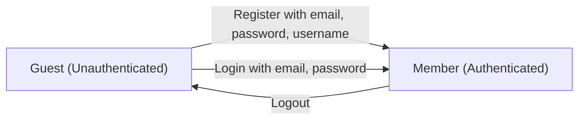

**communityPlatform — Actor definitions, permission matrix, authentication, session, account lifecycle**

Actor definitions, permission matrix, authentication, session, account lifecycle

# Actor Definitions

Define all user actor types with their identity, permissions, and access boundaries.

## guest Actor

A guest is any visitor who accesses the platform without logging in or creating an account. Guests have read-only access to public content across the platform and cannot perform any actions that modify data or require authentication. They can browse the Popular Feed to see posts from all communities, and they can view the Community Feed for any specific community. Guests can view individual posts with full content, comments, and vote scores, but they cannot cast votes themselves. They can browse the list of all communities and search for communities by name to discover content. Guests can also view any user's profile page to see display name, bio, avatar, karma score, posts, and comments. However, guests cannot access the Home Feed, which is reserved for logged-in users and shows posts only from their subscribed communities. Guests cannot create posts, write comments, vote on any content, subscribe to communities, report posts or comments, or create new communities.

### Action Restrictions

Guests cannot vote on posts or comments. Guests cannot create posts or write comments. Guests cannot subscribe to communities. Guests cannot report posts or comments. Guests cannot access the Home Feed, which is reserved for authenticated users and displays posts only from communities they are subscribed to.

## member Actor

A member is any user who has created an account and is currently logged in with valid credentials. Members have full interactive access to the platform and can perform all actions available to authenticated users. They can create new communities, becoming the owner of any community they create. Members can subscribe to any community to join it, and they must be subscribed to a community before they can create posts there. They can create posts in three formats: text posts, link posts with URLs, and image posts with uploaded images. Members can write comments on any post and reply to any comment with unlimited nesting depth. They can upvote or downvote posts and comments, with one vote per item and the ability to change or remove their vote. Members can edit and delete their own posts and comments at any time. They can report posts and comments that violate community rules. Members can edit their own profile including display name, bio text, and avatar image. They can view a personalized Home Feed showing posts from their subscribed communities, in addition to the Popular Feed and Community Feeds. Members can change their password and can delete their account, which removes all their posts and comments permanently.

### Member Identity

A member is any authenticated user who has completed the registration process and successfully logged into the platform with valid credentials. The member actor represents the primary interactive user type in the system, with full access to create, modify, and engage with content across all communities.

Members are identified by their unique username and email address established during registration. Once authenticated, a member's session grants them interactive privileges that distinguish them from guest users who have read-only access.

A member retains their authenticated status until they log out or their session expires. All actions performed by a member are attributed to their account, establishing ownership and audit trail for their contributions.

### Member Permissions

Members have comprehensive permissions across the platform, organized into the following capability areas:

**Community Permissions**
- Create new communities (becomes the community owner)
- Subscribe to any community
- Unsubscribe from any community
- View list of their subscribed communities

**Post Permissions**
- Create posts in any community they are subscribed to (title required; content type: text, link, or image)
- Edit their own posts
- Delete their own posts
- Upvote any post (one vote per post)
- Downvote any post (one vote per post)
- Change or remove their vote on any post

**Comment Permissions**
- Write comments on any post
- Reply to any comment (unlimited nesting depth)
- Edit their own comments
- Delete their own comments
- Upvote any comment (one vote per comment)
- Downvote any comment (one vote per comment)
- Change or remove their vote on any comment

**Profile Permissions**
- Edit their own display name
- Edit their own bio text
- Upload and change their own avatar image
- View any other member's profile

**Reporting Permissions**
- Report any post with a reason
- Report any comment with a reason

**Account Permissions**
- Change their own password
- Delete their own account (removes all their posts and comments)

**Feed Access**
- Access personalized Home Feed (posts from subscribed communities only)
- Access Popular Feed (all communities)
- Access Community Feeds (specific community)

Members cannot moderate communities they do not own or have not been granted moderator role in. Members cannot edit or delete content created by other members.

### Content Ownership

A member owns all content they create on the platform, including:

- **Communities**: The member who creates a community becomes its owner with full moderation authority
- **Posts**: All posts created by a member belong to them; they can edit or delete these posts at any time
- **Comments**: All comments and replies written by a member belong to them; they can edit or delete these at any time
- **Profile**: Each member owns their profile information including display name, bio, and avatar image
- **Votes**: A member's votes on posts and comments are attributed to their account (one vote per item)
- **Reports**: Reports submitted by a member are attributed to their account

When a member deletes their account, all content they own is permanently removed, including all their posts and comments across all communities. This cascading deletion does not affect communities they created (ownership transfer or community deletion is not specified in requirements).

Ownership establishes the right to modify and delete content. Members cannot modify or delete content owned by other members, except when they have moderator privileges in a community.

### Feed Access

Members have access to three distinct feed types for viewing posts:

**Home Feed (Members Only)**
The Home Feed is exclusively available to authenticated members. It displays posts only from communities the member has subscribed to, providing a personalized content experience. This feed is not available to guests.

**Popular Feed (All Users)**
Members can access the Popular Feed, which shows posts from all communities across the platform. This feed is also available to unauthenticated guests.

**Community Feed (All Users)**
Members can view posts from any specific community through its Community Feed. This feed is also available to unauthenticated guests.

All three feeds support the same sorting options: Hot (recent posts with many upvotes), New (most recently created), Top (highest vote score with time filters), and Controversial (many votes but score near zero). All feeds are paginated.

### Karma Participation

Each member has a single karma score that reflects their contribution standing in the community. The karma score is a single numeric value that can be positive, zero, or negative.

**Karma Accumulation**
A member's karma score changes based on votes received on their content:
- When another user upvotes the member's post or comment, their karma increases by 1
- When another user downvotes the member's post or comment, their karma decreases by 1
- When a user removes their vote, the member's karma adjusts accordingly (reverses the previous change)

The karma score is visible on the member's profile page alongside their display name, bio, avatar, and list of posts and comments.

All members can participate in the karma system both as receivers (gaining or losing karma from votes on their content) and as givers (voting on other members' content).

# Authentication Flows

Registration, login, logout, and session management from a user perspective.

## Registration and Login

Define user registration and login flows including validation and error handling.

### User Registration

Users can create a new account by providing an email address, a password, and a username.

The email address must be unique across all users.
The username must be unique across all users.
The email address, password, and username are all required fields.

If the email address is already registered, the registration is rejected.
If the username is already taken, the registration is rejected.
If any required field is missing, the registration is rejected.

Upon successful registration, the user account is created and the user is authenticated.

Upon successful registration, a new user profile is automatically created with default display name, empty bio, and no avatar.

### User Login

Registered users can log in by providing their email address and password.

The email address and password are both required fields.

If the email address is not registered, the login is rejected.
If the password does not match the email address on file, the login is rejected.
If any required field is missing, the login is rejected.

Upon successful login, the user is authenticated and a session is established.

### Authentication Flow

The system supports two primary authentication flows: registration and login.

**Registration Flow**
Unauthenticated users (guests) can register a new account by providing credentials. Upon successful registration, they become authenticated users (members).

**Login Flow**
Users who have previously registered can authenticate by providing their email and password. Upon successful login, they become authenticated users (members).

A user can only perform one authentication action at a time.
A user must be unauthenticated to register or log in.

## Session and Logout

Define session behavior and logout from a user perspective.

### Session Management

A session is established when a user successfully logs in with their email and password. The session identifies the authenticated user and enables them to perform actions requiring authentication, such as creating communities, subscribing to communities, creating posts in subscribed communities, writing comments, and voting on posts and comments.

While a session is active, the user remains logged in and can access all member-only features. The session allows the system to recognize the user across different interactions without requiring them to log in again for each action.

Sessions end when the user explicitly logs out. When a session ends, the user can no longer perform authenticated actions until they log in again.

Guest users (users without an active session) can still view public content including the Popular Feed, Community Feeds, and all communities.

### Logout

A logged-in user can log out to end their session. Logging out terminates the current session and returns the user to a guest state.

After logging out, the user can no longer perform authenticated actions such as creating posts, writing comments, voting, or subscribing to communities. The user can still view all public content available to guests.

Logging out does not delete the user's account or any of their content. The user can log in again at any time to resume authenticated access.

### Account Security

Users can change their password at any time while logged in. Changing the password allows users to maintain the security of their account if they suspect their credentials have been compromised.

Users can delete their account entirely. Account deletion is permanent and removes all of the user's data from the platform. When an account is deleted, all posts and comments created by that user are also deleted.

Users are responsible for keeping their login credentials (email and password) secure. The system authenticates users based on the email and password they provide during login.

# Account Lifecycle

Account creation, deletion, and password management.

## Account Management

Define how users create accounts, delete accounts, and change passwords.

### Account Creation

New users can create an account by providing an email address, a password, and a username.

The email address must be unique across all accounts in the system. If the provided email is already associated with an existing account, the registration request is rejected.

The username must be unique across all accounts in the system. If the provided username is already taken by another user, the registration request is rejected.

The password is required and must be provided during account creation.

Upon successful account creation, the user becomes a member and can log in with their email and password.

The newly created account is assigned a default karma score of zero and an empty profile (no display name, no bio, no avatar).

### Account Deletion

Users can delete their own account at any time.

When a user deletes their account, all posts created by that user are permanently deleted from all communities.

When a user deletes their account, all comments written by that user are permanently deleted from all posts.

When a user deletes their account, the user's profile information is removed.

Account deletion is irreversible and cannot be undone.

If the user owns any communities, the system must handle ownership transfer or community deletion (behavior not specified in requirements).

### Password Management

Users can change their own password.

To change the password, the user must be logged in to their account.

The new password replaces the existing password and is used for all future login attempts.

After changing the password, the user can continue using their account without interruption.

If a user forgets their password, the system behavior is not defined in the requirements (no password reset mechanism specified).