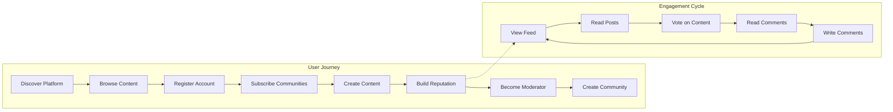
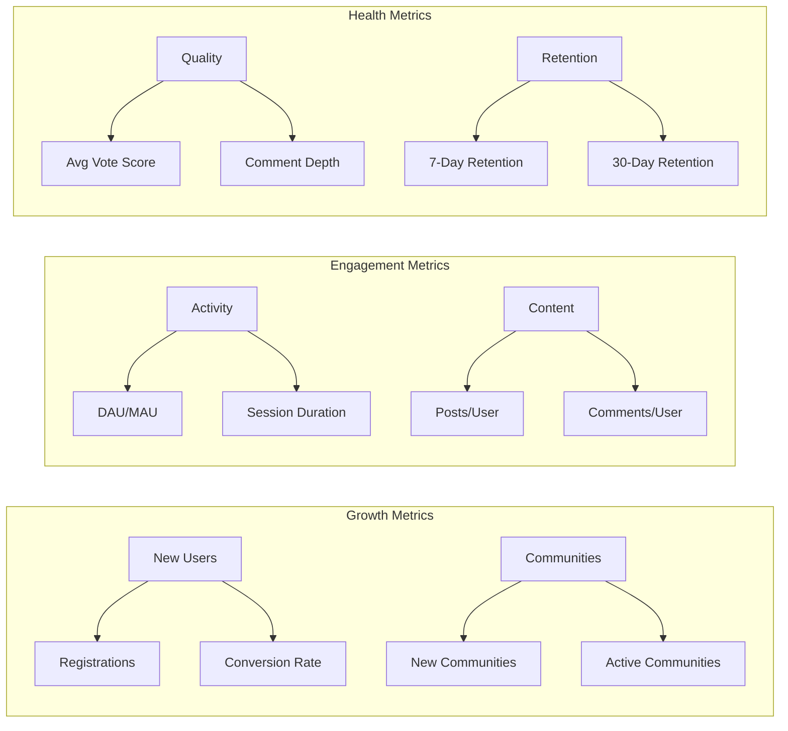
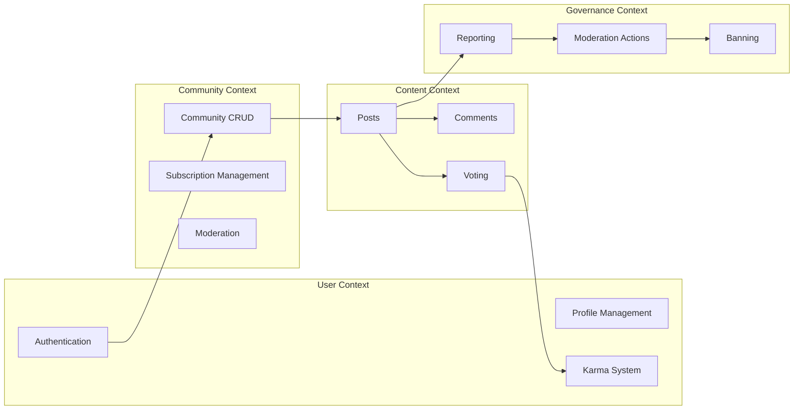

# Community Platform - Service Overview

## Platform Vision

### Mission
THE community platform SHALL provide a space where people can connect around shared interests, engage in meaningful discussions, and build vibrant communities through democratic content discovery.

This platform is a community-driven content aggregation and discussion platform where users create, share, and discuss content within specialized communities. The platform enables users to discover content based on community subscriptions and platform-wide popularity, with a democratic voting system that surfaces the most valued content to the top.

### Core Philosophy

The platform is built on three foundational principles:

1. **Community-First Design**: Every feature revolves around communities as the primary organizational unit. Users join communities that match their interests, and content is primarily consumed within these communities.

2. **Democratic Content Discovery**: THE platform SHALL empower users to collectively determine content quality through an open voting system. Every user can upvote or downvote content, ensuring that the community decides what rises to prominence.

3. **Reputation-Based Identity**: THE platform SHALL track user contributions through a karma system that reflects the community's appreciation of their content. Karma serves as a visible reputation score that motivates quality participation.

### Platform Positioning

The platform positions itself as:
- A destination for interest-based community formation
- A content discovery engine powered by community voting
- A discussion platform supporting rich, nested conversations
- A self-moderating ecosystem with community-driven governance

---

## Target Users

### Primary User Personas

#### Content Creators
Users who actively contribute to the platform by creating posts and comments.

**Characteristics:**
- Seek to share knowledge, opinions, or interesting content
- Value recognition through karma and engagement
- Participate regularly in communities of interest
- Range from casual contributors to dedicated content creators

**Needs:**
- Easy content creation across multiple formats (text, link, image)
- Clear feedback on content performance (votes, comments)
- Recognition for quality contributions
- Ability to build reputation over time

#### Content Consumers
Users who primarily browse and engage with existing content.

**Characteristics:**
- Visit the platform to discover interesting content
- May vote but contribute less frequently
- Subscribe to communities matching their interests
- Value well-organized, high-quality content feeds

**Needs:**
- Efficient content discovery through feeds
- Multiple ways to find content (subscriptions, popular, search)
- Sorting options to find the best content
- Seamless browsing experience

#### Community Moderators
Users who take responsibility for maintaining community quality.

**Characteristics:**
- Deeply invested in specific communities
- Willing to dedicate time to community governance
- Understand community norms and standards
- Act as stewards of community culture

**Needs:**
- Tools to manage community content
- Ability to handle inappropriate content quickly
- Clear authority and permissions
- Support for scaling moderation efforts

#### Community Owners
Users who create and lead communities.

**Characteristics:**
- Identify gaps in existing communities
- Passionate about specific topics
- Take initiative to build new communities
- Responsible for community direction and moderation team

**Needs:**
- Full control over community settings
- Ability to appoint and manage moderators
- Tools to grow community membership
- Metrics to understand community health

### User Behavior Patterns

### User Lifecycle Stages

1. **Discovery Stage**: Users discover the platform and browse public content without authentication
2. **Registration Stage**: Users create accounts to personalize their experience and participate
3. **Engagement Stage**: Users subscribe to communities, vote on content, and begin contributing
4. **Contribution Stage**: Users regularly create posts and comments, building karma
5. **Leadership Stage**: Users become moderators or create their own communities

---

## Core Value Proposition

### For Content Creators

**Recognition and Reputation**
- THE platform SHALL provide visible karma scores that reflect community appreciation
- THE platform SHALL display content creators' contribution history on their profiles
- WHEN users receive upvotes, THE system SHALL immediately update their karma score

**Creative Expression**
- THE platform SHALL support multiple post formats (text, link, image) for diverse content types
- THE platform SHALL allow unlimited nested comments for complex discussions
- THE platform SHALL preserve full edit history through user-controlled editing

**Community Connection**
- THE platform SHALL enable users to create and grow their own communities
- THE platform SHALL connect creators with audiences interested in their topics
- THE platform SHALL facilitate discussions between creators and their audience

### For Content Consumers

**Personalized Discovery**
- THE platform SHALL provide customized feeds based on community subscriptions
- THE platform SHALL offer multiple sorting algorithms to find desired content
- THE platform SHALL present both subscription-based and platform-wide content options

**Quality Filtering**
- THE platform SHALL surface high-quality content through community voting
- THE platform SHALL provide clear vote scores indicating community sentiment
- THE platform SHALL enable users to easily identify popular and controversial content

**Engagement Opportunities**
- THE platform SHALL allow users to participate in discussions without creating original posts
- THE platform SHALL enable users to influence content visibility through voting
- THE platform SHALL support anonymous browsing for users who prefer to observe

### For Community Leaders

**Community Governance**
- THE platform SHALL provide hierarchical moderation roles (owner, moderator)
- THE platform SHALL enable moderators to remove inappropriate content
- THE platform SHALL support community-level banning for problematic users

**Community Growth**
- THE platform SHALL make communities discoverable through browsing and search
- THE platform SHALL display subscriber counts indicating community size
- THE platform SHALL provide clear community information (name, description, icon)

**Content Quality Control**
- THE platform SHALL provide a reporting system for community members to flag content
- THE platform SHALL enable moderators to efficiently review and act on reports
- THE platform SHALL support both approval and dismissal of reported content

---

## Business Model

### Why This Platform Exists

#### Market Opportunity

Online community platforms have become essential infrastructure for modern digital life. People seek spaces to:
- Connect with others who share specific interests
- Discuss topics in depth with knowledgeable communities
- Discover and share content relevant to their passions
- Build reputation based on contributions

Existing platforms often struggle with:
- Balancing free expression with content quality
- Providing effective moderation tools
- Maintaining community health at scale
- Offering transparent reputation systems

#### Problem Statement

Users need a platform that:
- **Empowers communities**: Communities should have autonomy over their rules and moderation
- **Values quality**: Democratic voting should surface the best content
- **Rewards contributions**: Users should see tangible recognition for their efforts
- **Supports diverse content**: Different types of content (discussions, links, images) should be first-class citizens
- **Scales gracefully**: Moderation should work for both small and large communities

#### Solution

This platform addresses these needs through:
- A robust community system with clear ownership and moderation hierarchies
- A transparent voting system that determines content visibility
- A karma system that provides visible reputation scores
- Multiple post formats supporting various content types
- A comprehensive reporting and moderation system

### How: Revenue Generation and Growth Strategy

#### Revenue Model

**Phase 1: User Acquisition (Primary Focus)**
- Focus on building user base and community engagement
- Establish platform as a destination for quality community discussions
- Optimize for user retention and session frequency

**Phase 2: Monetization Introduction**
- **Premium Memberships**: Offer enhanced features for paying users
  - Ad-free experience
  - Exclusive profile customization
  - Advanced analytics for content creators
  - Priority support
- **Community Badges/Awards**: Allow users to purchase awards to give to exceptional content

**Phase 3: Expanded Revenue Streams**
- **Targeted Advertising**: Non-intrusive, community-relevant advertising
- **Community Subscriptions**: Premium features for community owners
  - Enhanced moderation tools
  - Analytics dashboard
  - Custom community themes
- **API Access**: Third-party applications and tools

#### Growth Strategy

**Organic Growth Drivers**
- Viral content sharing brings new users to specific posts
- Community invites and word-of-mouth recommendations
- Cross-platform content discovery (links shared elsewhere)

**Retention Mechanisms**
- Karma system creates investment in platform reputation
- Community subscriptions create habitual visiting patterns
- Reply notifications bring users back for discussions
- Profile completeness drives identity attachment

**Network Effects**
- More communities attract diverse user interests
- More users increase content volume and quality
- Better content attracts more users
- Larger communities attract more contributors

### What: Value Delivery Mechanisms

#### Core Platform Features

```mermaid
graph LR
    subgraph "Content Creation"
        A["Create Post"]
        B["Write Comment"]
        C["Upload Image"]
        D["Share Link"]
    end
    
    subgraph "Content Discovery"
        E["Home Feed"]
        F["Popular Feed"]
        G["Community Feed"]
        H["Search"]
    end
    
    subgraph "Engagement"
        I["Vote"]
        J["Reply"]
        K["Report"]
        L["Subscribe"]
    end
    
    subgraph "Community"
        M["Create Community"]
        N["Moderate"]
        O["Ban Users"]
        P["Manage Reports"]
    end
```

#### Value Chain

1. **Community Formation**: Users create communities around specific interests
2. **Content Creation**: Community members contribute posts and comments
3. **Democratic Curation**: The community votes to surface quality content
4. **Reputation Building**: Contributors earn karma based on community appreciation
5. **Community Governance**: Moderators maintain quality and enforce norms
6. **Platform Growth**: Successful communities attract new users

---

## Key Features Overview

### User Account Management

**Registration and Authentication**
- THE platform SHALL allow users to register with email, password, and unique username
- THE platform SHALL authenticate users via email and password login
- THE platform SHALL enable users to change their password securely
- THE platform SHALL allow users to delete their accounts with cascading removal of all content

**Account Security**
- THE platform SHALL maintain secure session management
- THE platform SHALL protect user credentials through industry-standard practices
- WHEN users delete their accounts, THE system SHALL remove all associated posts and comments

### User Profile and Karma System

**Profile Components**
- THE platform SHALL provide each user with a profile containing display name, bio, and avatar
- THE platform SHALL display user's total karma score on their profile
- THE platform SHALL list all posts created by the user on their profile
- THE platform SHALL list all comments written by the user on their profile

**Profile Management**
- THE platform SHALL allow users to edit their own display name, bio, and avatar
- THE platform SHALL enable viewing of any user's profile by any other user

**Karma System**
- THE platform SHALL maintain a single karma score per user
- WHEN someone upvotes a user's post or comment, THE system SHALL increase the user's karma by 1
- WHEN someone downvotes a user's post or comment, THE system SHALL decrease the user's karma by 1
- THE platform SHALL allow karma to be negative
- WHEN votes are removed, THE system SHALL adjust karma accordingly

### Community System

**Community Creation**
- THE platform SHALL allow any user to create a community
- THE platform SHALL require each community to have a unique name, description, and icon
- THE platform SHALL designate the community creator as its owner

**Community Discovery**
- THE platform SHALL provide a browsable list of all communities
- THE platform SHALL enable search for communities by name
- THE platform SHALL display subscriber count for each community

**Subscription Management**
- THE platform SHALL allow users to subscribe to any community
- THE platform SHALL allow users to unsubscribe from any community
- THE platform SHALL show users a list of their subscribed communities
- THE platform SHALL require subscription before users can create posts in a community

### Post System

**Post Types and Creation**
- THE platform SHALL support three post types: text posts, link posts, and image posts
- THE platform SHALL require all posts to have a title
- Text posts SHALL contain text content
- Link posts SHALL contain a URL
- Image posts SHALL contain an uploaded image
- THE platform SHALL restrict post creation to subscribed community members

**Post Management**
- THE platform SHALL allow users to edit their own posts
- THE platform SHALL allow users to delete their own posts

**Post Feeds**
- THE platform SHALL provide a Home Feed showing posts from subscribed communities
- THE platform SHALL provide a Popular Feed showing posts from all communities
- THE platform SHALL provide Community Feeds showing posts from specific communities
- Home Feed SHALL be available only to logged-in users
- Popular and Community Feeds SHALL be available to all users

**Sorting Algorithms**
- THE platform SHALL support Hot sorting (recent posts with many upvotes first)
- THE platform SHALL support New sorting (most recently created first)
- THE platform SHALL support Top sorting (highest vote score) with time filters
- THE platform SHALL support Controversial sorting (many votes but score near zero)
- Time filters SHALL include: today, this week, this month, this year, all time

**Post Display**
- THE platform SHALL display in lists: title, author, community, vote score, comment count, time since posted
- Text posts SHALL show first 200 characters of content
- Image posts SHALL show a thumbnail
- Link posts SHALL show the domain name of the URL
- Full post view SHALL show: title, full content, author, community, vote score, comment count, timestamp

### Comment System

**Comment Creation and Management**
- THE platform SHALL allow users to write comments on any post
- THE platform SHALL allow users to reply to any comment
- THE platform SHALL support unlimited nesting depth for replies
- THE platform SHALL allow users to edit their own comments
- THE platform SHALL allow users to delete their own comments

**Comment Display**
- THE platform SHALL display comments with: author, content, vote score, time since posted, nested replies

**Comment Sorting**
- THE platform SHALL support Best sorting (highest vote score first)
- THE platform SHALL support New sorting (most recent first)
- THE platform SHALL support Controversial sorting (many votes, score near zero)

### Voting System

**Voting Mechanics**
- THE platform SHALL allow users to upvote posts and comments
- THE platform SHALL allow users to downvote posts and comments
- THE platform SHALL allow only one vote per user per content item
- THE platform SHALL calculate vote score as total upvotes minus total downvotes

**Vote Management**
- THE platform SHALL allow users to change their vote from upvote to downvote or vice versa
- THE platform SHALL allow users to remove their vote entirely
- WHEN votes change, THE system SHALL update karma scores accordingly

### Moderation System

**Moderator Roles**
- THE platform SHALL designate community creators as owners with highest authority
- THE platform SHALL allow owners to add moderators
- THE platform SHALL allow owners to remove moderators
- THE platform SHALL allow moderators to add other moderators
- THE platform SHALL prevent moderators from removing owners
- THE platform SHALL prevent moderators from removing each other

**Moderation Actions**
- THE platform SHALL allow moderators to delete any post in their community
- THE platform SHALL allow moderators to delete any comment in their community
- THE platform SHALL allow moderators to ban users from their community
- THE platform SHALL allow moderators to unban users
- THE platform SHALL allow moderators to view banned users list
- Banned users SHALL NOT create posts or comments in the community but can still view content

### Reporting System

**Report Creation**
- THE platform SHALL allow users to report any post or comment
- THE platform SHALL require a text reason when reporting

**Report Management**
- THE platform SHALL allow moderators to view all reports for their community
- THE platform SHALL display for each report: reported content, reporter, reason
- THE platform SHALL allow moderators to approve reports (deletes content)
- THE platform SHALL allow moderators to dismiss reports (keeps content)
- Dismissed reports SHALL be removed from the report list

---

## Success Metrics

### User Engagement Metrics

**Active Participation**
- **Daily Active Users (DAU)**: Number of unique users engaging with the platform daily
- **Monthly Active Users (MAU)**: Number of unique users engaging monthly
- **DAU/MAU Ratio**: Indicator of user stickiness and habit formation
- **Target**: DAU/MAU ratio above 30% indicates strong engagement

**Content Creation**
- **Posts per DAU**: Average posts created per daily active user
- **Comments per DAU**: Average comments written per daily active user
- **Vote Participation Rate**: Percentage of viewed content that receives votes
- **Target**: Active users should vote on at least 10% of viewed content

**Session Metrics**
- **Average Session Duration**: Time spent per visit
- **Sessions per User**: Frequency of return visits
- **Pages per Session**: Depth of engagement per visit
- **Target**: Average session duration above 8 minutes indicates engaged users

### Platform Growth Metrics

**User Acquisition**
- **New User Registrations**: Daily/weekly/monthly registration counts
- **Registration Conversion Rate**: Percentage of visitors who register
- **Organic vs. Referred Traffic**: Source of new users
- **Target**: Month-over-month registration growth of 10%

**Community Growth**
- **New Communities Created**: Rate of community formation
- **Active Communities**: Communities with posts in the last 7 days
- **Average Community Size**: Mean subscriber count across communities
- **Target**: 20% of communities should be active monthly

**Content Volume**
- **Total Posts Created**: Cumulative and rate-based post creation
- **Total Comments Written**: Cumulative and rate-based comment creation
- **Content Growth Rate**: Week-over-week increase in content volume
- **Target**: Content volume should grow faster than user base

### Community Health Indicators

**Engagement Quality**
- **Average Vote Score**: Mean score of posts and comments
- **Upvote/Downvote Ratio**: Balance of positive and negative sentiment
- **Comment Depth**: Average nesting level of conversations
- **Target**: Average post score above 5 indicates quality content

**Moderation Effectiveness**
- **Reports Resolution Time**: Average time to resolve reports
- **Moderator Coverage**: Communities with active moderators
- **Ban Rate**: Percentage of users banned from communities
- **Target**: 90% of reports resolved within 24 hours

**Retention and Loyalty**
- **7-Day Retention**: Percentage of new users returning after one week
- **30-Day Retention**: Percentage of new users returning after one month
- **Community Subscription Retention**: Stability of community memberships
- **Target**: 40% 7-day retention for new registered users

### Key Performance Indicators Summary

| Metric Category | Key Metric | Target | Measurement Frequency |
|----------------|-----------|--------|---------------------|
| Growth | MAU Growth Rate | 15% MoM | Weekly |
| Engagement | DAU/MAU Ratio | >30% | Daily |
| Content | Posts per DAU | >0.5 | Daily |
| Retention | 30-Day Retention | >25% | Weekly |
| Community | Active Communities | >20% | Weekly |
| Moderation | Report Resolution | <24 hours | Daily |

---

## Platform Architecture Overview

### System Boundaries

The community platform consists of the following bounded contexts:

### User Context
**Purpose**: Manages user identity, authentication, and reputation

**Key Responsibilities**:
- User registration and authentication
- Profile management (display name, bio, avatar)
- Karma score tracking and updates
- Account deletion and data cleanup

### Community Context
**Purpose**: Manages community lifecycle and membership

**Key Responsibilities**:
- Community creation, discovery, and search
- Subscription management
- Moderator role assignment and permissions
- Community-level settings

### Content Context
**Purpose**: Manages all user-generated content

**Key Responsibilities**:
- Post creation, editing, and deletion
- Comment creation with unlimited nesting
- Vote submission and score calculation
- Feed generation and sorting

### Governance Context
**Purpose**: Manages content moderation and community safety

**Key Responsibilities**:
- Report submission and tracking
- Report resolution workflow
- User banning at community level
- Moderator action logging

---

## Platform Differentiators

### vs. Traditional Forums
- **Democratic Curation**: Content visibility determined by community votes, not just chronology
- **Nested Discussions**: Unlimited comment depth enables complex conversations
- **Unified Reputation**: Karma system provides cross-community reputation
- **Flexible Content**: Multiple post types (text, link, image) in one platform

### vs. Social Networks
- **Interest-Based Organization**: Communities around topics, not social connections
- **Pseudonymous Identity**: Usernames without real-name requirements
- **Content-First Design**: Focus on content quality, not social relationships
- **Community Autonomy**: Moderation controlled by community members

### vs. Link Aggregators
- **Discussion Depth**: Rich, nested comment discussions
- **Multiple Content Types**: Original content beyond just links
- **Community Structure**: Organized by communities, not platform-wide categories
- **User Reputation**: Visible karma scores encourage quality contributions

---

## Future Considerations

### Potential Feature Expansions

**Short-Term Enhancements**:
- Post flair and tagging system
- Enhanced notification preferences
- Community-specific post types
- User blocking functionality

**Medium-Term Expansions**:
- Awards and achievements system
- Community analytics for moderators
- Multi-media content support (video, polls)
- Cross-platform content embedding

**Long-Term Vision**:
- Federated communities across instances
- Advanced recommendation algorithms
- Creator monetization options
- Third-party application ecosystem

### Scalability Considerations

**Technical Scaling**:
- Content caching for high-traffic posts
- Feed pre-computation for common sorts
- Search indexing for fast community discovery
- Background job processing for karma updates

**Moderation Scaling**:
- Automated content filtering for spam
- Moderator tool enhancements for large communities
- Community-specific rule enforcement
- Appeal process for moderation decisions

---

## Conclusion

This community platform provides a comprehensive solution for interest-based community formation, content sharing, and discussion. By combining democratic content curation through voting, transparent reputation building through karma, and community-driven moderation through hierarchical roles, the platform creates a self-sustaining ecosystem where quality content rises to prominence and communities maintain their own standards.

The platform's success depends on:
1. **User Engagement**: Active participation through content creation, voting, and discussion
2. **Community Health**: Effective moderation maintaining quality while encouraging participation
3. **Growth Mechanics**: Viral loops through content sharing and community invites
4. **Value Delivery**: Clear benefits for all user personas (creators, consumers, moderators)

With strong fundamentals in community management, content curation, and reputation systems, the platform is positioned to become a leading destination for online community interactions.

---

> *Developer Note: This document defines business requirements only. All technical implementations (architecture, APIs, database design, etc.) are at the discretion of the development team.*