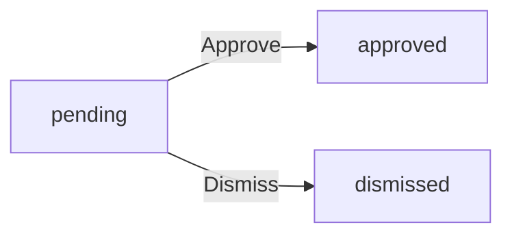
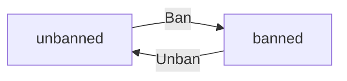
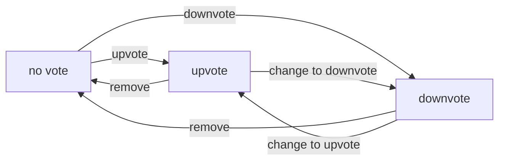
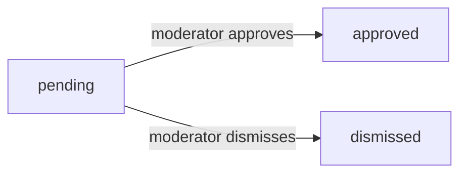
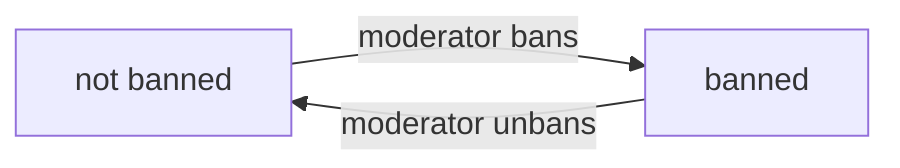
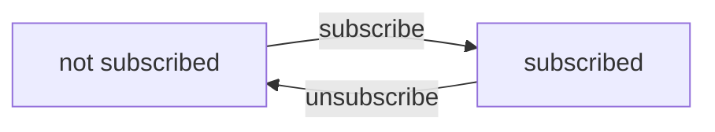
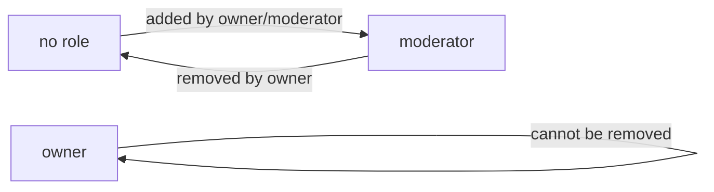

**communityPlatform — Business concepts, relationships, and states from user perspective**

Business concepts, relationships, and states from user perspective

# Domain Concepts

Describe what each concept means in the business domain and its key attributes.

## User Concept

A User represents an individual who participates in the community platform. Each user establishes their identity through a unique email address and a unique username that distinguishes them from other members. The user's password provides secure access to their account. Beyond these identifiers, users can personalize their presence with a display name, a biography text, and an avatar image that others can see. Every user accumulates a karma score that reflects the community's reception of their contributions. This single numerical value rises when others upvote their posts or comments and falls when downvotes occur. A user's karma can become negative if their contributions receive more downvotes than upvotes. The profile serves as the public face of a user, displaying their personal details, karma total, and history of posts and comments they have authored.

### User Identity and Authentication

A user establishes their identity on the platform through a unique email address and a unique username. No two users can share the same email address or the same username. The email address serves as the primary identifier for account registration and login. The username provides a distinctive handle that identifies the user throughout the platform and appears alongside their posts and comments. A password secures the user's account, allowing only the account holder to access and manage their profile and content.

### User Profile and Karma

Each user has a profile that serves as their public presence on the platform. The profile includes a display name for personalization, a biography text for self-description, and an avatar image for visual identity. Users can customize these elements to express their personality. Every user has a single karma score that reflects the community's reception of their contributions. This score is a single numerical value that spans the entire platform—it is not separated by community. The karma score increases by 1 when someone upvotes the user's post or comment, and decreases by 1 when someone downvotes it. Karma can become negative if a user receives more downvotes than upvotes across their content. A user's profile displays their total karma along with a complete list of all posts they have created and all comments they have written, linking their content history to their public identity.

## Community Concept

A Community represents a dedicated space within the platform where users gather around shared interests or topics. Each community is identified by a unique name that distinguishes it from all others. A description text explains the purpose and focus of the community to potential subscribers. An icon image provides visual recognition for the community across the platform. Every community tracks how many users have subscribed to it, reflecting its popularity and reach. The user who creates a community becomes its owner and holds the highest authority within that space. Communities serve as containers for posts where members can share content and engage in discussions. Users discover communities through browsing or searching by name. The subscriber count provides visibility into the size of each community's audience.

### Community Discovery and Structure

Users can discover communities through browsing a complete list of all communities available on the platform. This browsable list allows users to explore and find communities that match their interests.

Users can also search for communities by name, enabling quick discovery when a user knows the specific community they are looking for or wants to find communities with certain keywords in their name.

Each community displays its subscriber count, showing how many users have subscribed to that community. This number indicates the popularity and reach of the community, helping users gauge the size of the audience they would be engaging with.

Communities serve as containers for posts created by subscribed members. All posts related to the community's topic are organized within that community's space.

The user who creates a community automatically becomes its owner, holding the highest authority within that community. This ownership is established at the moment of creation and cannot be transferred to another user.

## Post Concept

A Post represents a piece of content that a user shares within a specific community. Every post requires a title that summarizes or introduces the content. Posts exist in three distinct forms: text posts contain written content, link posts direct users to an external URL, and image posts display an uploaded picture. The author of a post is the user who created it, and the post belongs to exactly one community. Each post accumulates a vote score calculated as the total upvotes minus total downvotes received from other users. The comment count tracks how many responses a post has generated. The creation timestamp records when the post was shared. When displayed in feeds, posts show their title, author, community, vote score, comment count, and time elapsed since posting. Text posts preview their first portion, image posts show a thumbnail, and link posts display the domain of the linked URL.

### Post Definition and Core Attributes

A Post represents a piece of content that a user shares within a specific community. Every post requires a title that summarizes or introduces the content being shared. The title is mandatory and cannot be omitted.

Each post is authored by exactly one user, who is the content creator. A post belongs to exactly one community where it is shared. Posts cannot exist independently of both an author and a community.

Posts accumulate engagement metrics over time. The vote score represents the aggregate assessment from the community, calculated as the total number of upvotes minus the total number of downvotes. This score can be positive, negative, or zero, reflecting the community's reception of the content. The comment count tracks how many comments and replies the post has received, indicating the level of discussion it has generated.

A creation timestamp records when the post was shared, allowing the system to display relative time information such as "3 hours ago" to readers.

### Post Types

Posts exist in three distinct forms, each carrying different kinds of content:

**Text Post**: Contains written content composed by the author. The text can be of any length and expresses the author's thoughts, questions, stories, or discussions. Text posts are the most flexible format for community conversation.

**Link Post**: Contains a URL pointing to an external resource outside the platform. The author shares a link to an article, video, image, or other web content that they want the community to see. When displayed, link posts show the domain name of the URL (such as "youtube.com") to indicate where the link leads.

**Image Post**: Contains an uploaded picture displayed directly within the post. The author shares a visual element such as a photograph, diagram, artwork, or screenshot. Image posts show a thumbnail preview when appearing in feed listings.

Each post has exactly one type—text, link, or image—and the type is determined at the time of creation based on what content the author provides.

### Post Display in Feeds

When posts appear in feed listings (Home, Popular, or Community feeds), they present a compact preview that allows readers to quickly assess the content before viewing the full post.

Every post in a feed shows its title, the author's username, the community name where it was posted, the current vote score, the comment count, and the time elapsed since posting.

The preview of post content varies by post type:
- **Text posts** display the first 200 characters of the written content, giving readers a sample of the discussion topic.
- **Image posts** display a thumbnail of the uploaded picture, providing a visual preview of the content.
- **Link posts** display the domain name extracted from the URL, showing readers where the external link will take them.

This differentiated preview approach allows readers to quickly understand the nature of each post and make informed decisions about which posts to view in full.

## Comment Concept

A Comment represents a user's written response to either a post or another comment. Every comment contains text content that expresses the user's thoughts or reactions. Comments form a hierarchical structure where replies can nest within replies at unlimited depth, enabling threaded discussions. The author of a comment is the user who wrote it. Each comment has a vote score that reflects how other users have received it, starting at zero and changing as upvotes and downvotes accumulate. The creation timestamp captures when the comment was submitted. Comments display their author, content, vote score, time since posting, and any nested replies beneath them. The nesting structure allows conversations to branch naturally as users respond to specific points within a discussion thread.

### Comment Vote Score

Each comment has a vote score that reflects how the community has received it. The score starts at zero when the comment is created and changes as users upvote or downvote it. The vote score represents the total number of upvotes minus the total number of downvotes the comment has received. This score is visible alongside the comment content and helps users gauge community reception of different contributions within a discussion thread. Comments with higher scores typically indicate contributions that the community found valuable or relevant to the conversation.

## Vote Concept

A Vote represents a user's evaluation of either a post or a comment. Each vote expresses either a positive assessment as an upvote or a negative assessment as a downvote. A user can cast only one vote per piece of content, though they may later change their vote to the opposite type or remove it entirely. The vote type determines whether it adds or subtracts from the content's overall vote score. Votes also affect the karma of the content's author, increasing it for upvotes and decreasing it for downvotes. The creation timestamp records when the vote was cast. The target type indicates whether the vote applies to a post or a comment. When a vote is removed or changed, the associated vote score and author karma adjust accordingly.

### Vote Nature

A vote represents a single user's evaluation of content, expressing approval or disapproval. Each vote is cast on either a post or a comment, as indicated by the target type.

A vote has one of two types:
- **Upvote**: A positive assessment that signals approval of the content
- **Downvote**: A negative assessment that signals disapproval of the content

Each user can cast only one vote per piece of content. If a user attempts to vote on the same content again, their existing vote is updated rather than a new vote being created. The creation timestamp records when the vote was originally cast, enabling chronological tracking of voting activity.

### Vote Effects and Mutability

Every vote contributes to two measurable outcomes:

**Content Vote Score**: Each upvote adds 1 to the content's vote score, while each downvote subtracts 1. The vote score is calculated as the total number of upvotes minus the total number of downvotes.

**Author Karma**: When a user receives an upvote on their post or comment, their karma increases by 1. When they receive a downvote, their karma decreases by 1. Karma can become negative if a user receives more downvotes than upvotes.

**Vote Changes and Removal**: Users can change their vote from upvote to downvote or vice versa at any time. When a vote changes, the content's vote score and the author's karma both adjust accordingly. Users can also remove their vote entirely, which reverses the vote's contribution to both the content score and author karma.

## Subscription Concept

A Subscription represents a user's decision to join and follow a specific community. The subscription establishes a connection between a user and a community, granting the user permission to create posts within that community. The timestamp of when the subscription occurred is recorded. A subscription can be marked as pinned, indicating the user wants quick access to that community. Users maintain their personal collection of subscribed communities. The subscription enables posts from that community to appear in the user's personalized home feed. Subscribing is a prerequisite for contributing content to a community, while viewing content remains available to all users regardless of subscription status.

### Subscription Purpose and Effects

Subscription is a prerequisite for creating posts within a community. Users must subscribe to a community before they can contribute content to it. This ensures that content creators have an established relationship with the communities they participate in.

Posts from subscribed communities appear in the user's personalized home feed, allowing users to see content from the communities they care about most. However, viewing content in any community does not require subscription — all users can browse and read posts in any community regardless of their subscription status.

Unsubscribing from a community removes the connection between the user and that community. The user loses the ability to create new posts in that community, and posts from that community no longer appear in their home feed. The community's subscriber count decreases by one when a user unsubscribes.

## Moderator Concept

A Moderator represents a user who has been granted elevated authority within a specific community. The moderator role can be either owner or regular moderator, with the owner holding the highest level of authority. The community creator automatically becomes the owner and holds ultimate control over moderator appointments. Regular moderators can add other moderators but cannot remove the owner or each other. Only the owner can remove moderators from their position. The timestamp of when a moderator was added is recorded. Moderators have the power to manage content within their community by removing posts and comments. They can also ban users from participating in the community while still allowing those users to view content.

### Moderator Role and Authority

When a user is granted moderator status, the timestamp of when they were added is recorded. This timestamp represents when the moderator relationship was established between the user and the community. For the community creator who becomes the owner, the timestamp reflects the community creation time. For subsequent moderators added by the owner or existing moderators, the timestamp records the moment of their appointment. The added timestamp provides an audit trail of when each moderator assumed their role within the community.

## Ban Concept

A Ban represents a restriction placed on a user within a specific community. The ban prevents the affected user from creating posts or comments in that community while still permitting them to view content. Each ban includes a reason text explaining why the restriction was imposed. The timestamp of when the ban took effect is recorded. Bans are issued by moderators or owners of a community and apply only within that specific community. A banned user's ability to participate in other communities remains unaffected. The ban remains in effect until a moderator or owner decides to remove it. Communities maintain a list of their banned users for reference.

### Ban Definition and Purpose

A Ban represents a participation restriction placed on a user within a specific community. The banned user cannot create posts or comments in that community. The user can still view content within the community despite being banned. Each ban includes a reason text explaining why the restriction was imposed. The timestamp of when the ban took effect is recorded. Bans are issued by moderators or the community owner. A ban applies only to one specific community and does not affect the user's ability to participate in other communities.

### Ban Management

Each community maintains a list of its banned users for reference. A ban remains in effect until a moderator or owner decides to remove it. When a ban is removed, the user regains the ability to create posts and comments in that community. A user can be banned multiple times if they violate community rules again after a previous ban was removed.

## Report Concept

A Report represents a formal complaint submitted by a user about a specific post or comment. The report includes a reason text that explains why the user believes the content violates community standards or rules. Each report has a status that indicates whether it is pending review, has been approved leading to content removal, or has been dismissed keeping the content. The timestamp of when the report was submitted is recorded. Reports are reviewed by moderators of the community where the reported content exists. Each report identifies the user who submitted it, the content being reported, and the explanation provided. Approved reports result in the content being deleted, while dismissed reports are removed from the moderator's review queue.

### Report Definition

A Report represents a formal complaint submitted by a user about specific content they believe violates community standards or rules. The report captures who submitted the complaint, identifying the reporter. The report identifies which post or comment is being reported, enabling moderators to locate and review the content in question.

Each report includes a reason text where the reporting user explains why they believe the content violates community standards. This reason provides context for moderators to understand the nature of the complaint. The submission timestamp records when the report was filed, establishing a chronological record for review prioritization.

Reports are associated with the community where the reported content exists, ensuring the correct moderators receive the complaint for review.

### Report Status and Review Outcome

Every report has a status that indicates its current state in the review process. The status determines what action has been taken and whether the reported content remains visible.

**Pending Status**: The report is awaiting review by moderators. The content remains visible to users while the report sits in the moderator's review queue.

**Approved Status**: A moderator has reviewed the report and determined the content violates community standards. The reported content is deleted from the platform as a result of approval.

**Dismissed Status**: A moderator has reviewed the report and determined the content does not violate community standards. The reported content remains visible, and the dismissed report is removed from the moderator's review queue.

Moderators of the community where the reported content exists are responsible for reviewing reports and changing their status from pending to either approved or dismissed.

# Domain Relationships

Describe how concepts relate to each other from a business perspective.

## Conceptual Relationships

Describe how concepts relate to each other in business terms.

### Ownership Relationships

### User Owns Community

When a user creates a community, they become its owner. Ownership is permanent and cannot be transferred. The owner has the highest authority within the community, including the ability to add and remove moderators.

### User Owns Content

Every post and comment is owned by the user who created it. Ownership grants editing and deletion rights. When a user deletes their account, all posts and comments they own are also deleted.

### Community Ownership vs Moderation

The community owner has authority over moderators. Moderators can add other moderators but cannot remove each other. Only the owner can remove moderators from the community.

### Membership Relationships

### User Subscribes to Community

A subscription connects a user to a community. Users can subscribe to any community on the platform. Subscribing is required before a user can create posts in that community.

### Subscriber Count

Each community displays its subscriber count, representing the total number of users currently subscribed.

### Viewing Subscriptions

Users can view a list of all communities they are subscribed to. This list helps users track and access their favorite communities.

### Content Containment

### Community Contains Posts

Every post belongs to exactly one community. The community determines where the post appears in feeds and which moderators can manage it.

### Post Contains Comments

Comments belong to a specific post. The post provides the context and topic for all its comments.

### Nested Comments

Comments can reply to other comments, creating a threaded structure. A comment can have many replies, and replies can themselves have replies, with no depth limit. This creates a tree-like discussion structure where each branch represents a conversation thread.

```mermaid
flowchart LR
    A["Community"] -->"contains" B["Post"]
    B -->"has" C["Comment"]
    C -->"has reply" D["Reply Comment"]
    D -->"has reply" E["Nested Reply"]
```

### Voting and Reporting Relationships

### User Votes on Content

A vote connects a user to either a post or a comment. Each user can cast only one vote per post or comment. The vote can be an upvote or downvote, and can be changed or removed.

### Vote Affects Author Karma

When a user votes on content, the karma score of the content's author is affected. An upvote increases the author's karma by one, while a downvote decreases it by one. Removing a vote reverses the effect.

### User Reports Content

A report connects a user (the reporter) to a post or comment. The report is associated with the community where the reported content exists. Moderators of that community can view and act on reports.

```mermaid
flowchart LR
    A["User"] -->"casts" B["Vote"]
    B -->"targets" C["Post or Comment"]
    C -->"affects karma of" D["Author"]
    A -->"creates" E["Report"]
    E -->"targets" C
```

### Moderation Relationships

### User Moderates Community

A moderator relationship connects a user to a community with an assigned role (owner or moderator). The community creator automatically becomes the owner.

### User is Banned from Community

A ban connects a user to a community with a recorded reason and timestamp. Banned users cannot create posts or comments in that community but can still view content. Bans can be removed by moderators.

## Lifecycle and Retention

Describe concept lifecycle states and transitions only. Detailed retention/recovery policies belong in 05-non-functional. Operation details belong in 03-functional-requirements.

### Report Lifecycle

A report progresses through three states: pending, approved, and dismissed.

**Pending State**: When a user reports a post or comment, the report enters the pending state. It remains pending until a moderator reviews it.

**Approved State**: When a moderator approves a pending report, the report transitions to approved status. The reported content is deleted as a result of approval.

**Dismissed State**: When a moderator dismisses a pending report, the report transitions to dismissed status. The reported content remains in the system. Dismissed reports are removed from the report list.



### Ban Lifecycle

A user can be banned from a community by a moderator. When banned, the user cannot create posts or comments in that community but can still view content.

Moderators can unban users, restoring their ability to create posts and comments in that community.

**Banned State**: User is prohibited from creating posts and comments in the specific community. The user can still view content.

**Unbanned State**: User can participate normally in the community, including creating posts (if subscribed) and comments.



# Business Categories and State Flows

Business category classifications and state flow definitions.

## Business Category Definitions

Define all business category classifications with their allowed values and descriptions.

### Post Content Type Classification

The post content type classification defines the kind of content a post contains. Every post must be exactly one of three types.

**Allowed Values:**

- **Text Post**: Contains written text content. The user composes a message or discussion in plain text.

- **Link Post**: Contains a URL pointing to an external resource. The user shares a link to content elsewhere on the internet.

- **Image Post**: Contains an uploaded image file. The user shares a picture directly within the platform.

This classification determines how the post content is stored and displayed to other users.

### Vote Type Classification

The vote type classification defines the direction of a user's vote on a post or comment. Each user can cast exactly one vote per item.

**Allowed Values:**

- **Upvote**: Indicates positive evaluation. Adds 1 to the content's vote score and increases the author's karma by 1.

- **Downvote**: Indicates negative evaluation. Subtracts 1 from the content's vote score and decreases the author's karma by 1.

Users may change their vote from upvote to downvote or vice versa at any time. Users may also remove their vote entirely, which adjusts the content's score and author's karma accordingly.

### Moderator Role Classification

The moderator role classification defines the level of authority a user has within a community's moderation team.

**Allowed Values:**

- **Owner**: The highest authority in a community. The user who creates a community automatically becomes its owner. The owner can add and remove any moderator, including other owners. This role cannot be removed by any other moderator.

- **Moderator**: A regular moderation role with authority to manage content and users within the community. Moderators can add other moderators, delete posts and comments, and ban users. Moderators cannot remove the owner or remove each other—only the owner can remove moderators.

The role determines what moderation actions a user can perform within their community.

### Report Status Classification

The report status classification tracks the lifecycle of a user-submitted report on a post or comment.

**Allowed Values:**

- **Pending**: The report has been submitted and is awaiting moderator review. The reported content remains visible. All new reports start in this status.

- **Approved**: The moderator has reviewed and approved the report. This action deletes the reported content. The report is resolved.

- **Dismissed**: The moderator has reviewed and dismissed the report. The reported content remains visible. The report is removed from the pending report list.

This classification enables moderators to track which reports require attention and which have been resolved.

### Feed Type Classification

The feed type classification defines the source and scope of posts displayed to a user.

**Allowed Values:**

- **Home Feed**: Shows posts only from communities the user has subscribed to. Available only to logged-in users.

- **Popular Feed**: Shows posts from all communities across the entire platform. Available to everyone, including logged-out users.

- **Community Feed**: Shows posts from one specific community. Available to everyone.

Each feed type determines which posts are included in the list and who can access it.

### Sort Type Classification

The sort type classification defines the order in which posts appear in any feed.

**Allowed Values:**

- **Hot**: Recent posts with many upvotes appear first. This surfaces trending content.

- **New**: Most recently created posts appear first. This shows the latest content.

- **Top**: Posts with the highest vote score appear first. Can be filtered by time period (today, this week, this month, this year, all time).

- **Controversial**: Posts with many total votes but a score close to zero appear first. This surfaces content with significant disagreement.

All feed types support all sort options.

### Time Filter Classification

The time filter classification restricts the Top sort to a specific time period.

**Allowed Values:**

- **Today**: Only posts created within the current day.

- **This Week**: Only posts created within the current week.

- **This Month**: Only posts created within the current month.

- **This Year**: Only posts created within the current year.

- **All Time**: Posts from any time period, with no time restriction.

This filter is only applicable when sorting by Top.

### Comment Sort Classification

The comment sort classification defines the order in which comments appear under a post.

**Allowed Values:**

- **Best**: Comments with the highest vote score appear first.

- **New**: Most recently created comments appear first.

- **Controversial**: Comments with many total votes but a score close to zero appear first.

This classification applies only to the display of comments on a post.

## State Transitions

Define valid state transition paths for stateful concepts.

### Vote State Transitions

A vote represents a user's evaluation of a post or comment. The vote can exist in one of three states relative to each user-content pair: no vote, upvote, or downvote.

**Initial State**: When content is created, no votes exist. Each user starts with "no vote" state for that content.

**Valid Transitions**:
- From "no vote" → "upvote": User chooses to upvote
- From "no vote" → "downvote": User chooses to downvote
- From "upvote" → "no vote": User removes their upvote
- From "downvote" → "no vote": User removes their downvote
- From "upvote" → "downvote": User changes their vote
- From "downvote" → "upvote": User changes their vote

**Constraints**:
- Each user can only have one vote state per content item
- A vote can be changed or removed at any time
- Vote score reflects the aggregate of all votes (upvotes minus downvotes)



### Report Status Transitions

A report represents a formal complaint about a post or comment. Reports progress through a defined workflow from creation to resolution.

**Initial State**: When a user reports content, the report is created with "pending" status.

**Valid Transitions**:
- From "pending" → "approved": Moderator approves the report (content is deleted)
- From "pending" → "dismissed": Moderator dismisses the report (content remains)

**Terminal States**: Both "approved" and "dismissed" are terminal states—a resolved report cannot be reopened or changed.

**Constraints**:
- Only moderators of the community can change report status
- Approved reports result in content deletion
- Dismissed reports are removed from the report list



### User Ban State Transitions

A ban represents a restriction on a user's ability to participate in a specific community. The ban state applies per community.

**Initial State**: Users begin in "not banned" state for all communities.

**Valid Transitions**:
- From "not banned" → "banned": Moderator bans the user from the community
- From "banned" → "not banned": Moderator unbans the user

**Constraints**:
- Banned users cannot create posts in that community
- Banned users cannot create comments in that community
- Banned users can still view content in that community
- Ban state is independent per community (banned in one does not affect others)



### Subscription State Transitions

A subscription represents a user's connection to a community. Subscription state determines posting privileges.

**Initial State**: Users begin in "not subscribed" state for all communities.

**Valid Transitions**:
- From "not subscribed" → "subscribed": User subscribes to the community
- From "subscribed" → "not subscribed": User unsubscribes from the community

**Constraints**:
- Users must be subscribed to create posts in a community
- Unsubscribing does not remove existing posts or comments
- Users can re-subscribe at any time
- Subscription state affects which posts appear in the user's home feed



### Moderator Role Transitions

Moderator roles define a user's authority level within a community. The role hierarchy determines who can perform moderation actions.

**Initial State**: When a user creates a community, they automatically become the owner. All other users have no moderator role in that community.

**Valid Transitions**:
- From "no role" → "moderator": Owner or existing moderator adds the user as moderator
- From "moderator" → "no role": Owner removes the moderator
- The owner role cannot be removed (only transferred by deleting the community or account)

**Role Hierarchy**:
- Owner: highest authority, can add and remove any moderator
- Moderator: can add other moderators, cannot remove owner or other moderators

**Constraints**:
- Moderators cannot remove other moderators (only owner can)
- Moderators cannot remove the owner
- A user can only have one role per community

