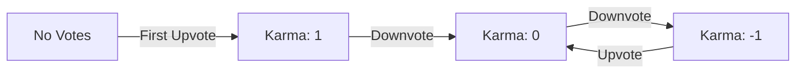
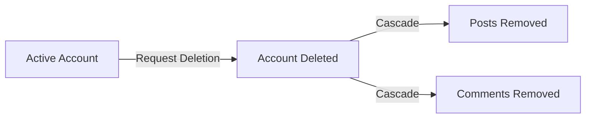
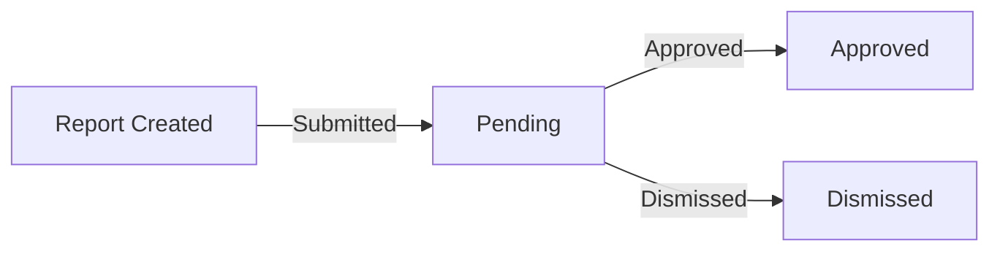
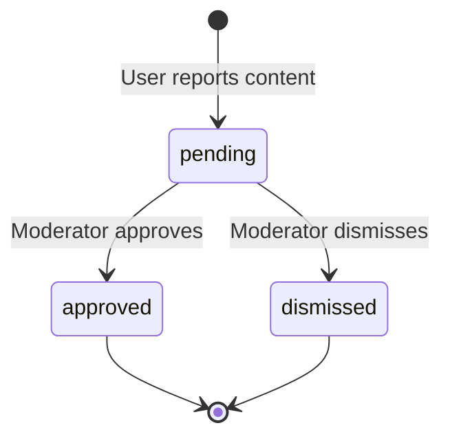
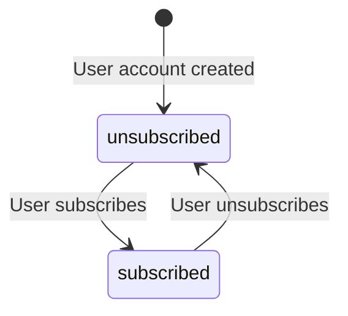
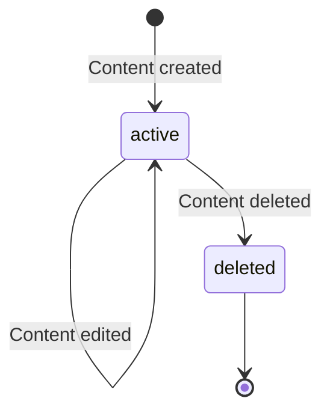
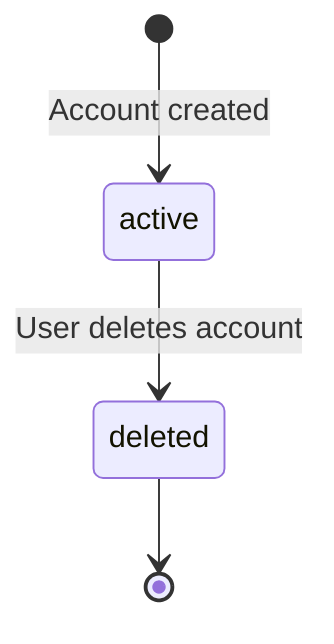

**communityPlatform — Business concepts, relationships, and states from user perspective**

Business concepts, relationships, and states from user perspective

# Domain Concepts

Describe what each concept means to users and why it exists.

## User Concept

Users are the fundamental actors in the community platform, representing individual accounts that participate across all communities. Each user establishes their identity through a unique email address and username during registration. Users interact with the platform by subscribing to communities, creating posts, writing comments, and casting votes on content. Every user accumulates a karma score that reflects how the community has received their contributions over time. Users maintain personal profiles containing their display name, biography text, and avatar image that others can view. The platform preserves a history of each user's posts and comments, making their contributions discoverable through their profile. Users can manage their own account credentials, including the ability to change passwords. Account deletion removes all traces of a user's presence, including their posts and comments, from the platform.

### User Identity and Registration

### User Identity and Registration

THE system SHALL represent each user as a unique account identified by their email address and username.

WHEN a person registers for the platform, THE system SHALL require:
1. An email address that is not already registered in the system
2. A username that is not already taken by another user
3. A password for account security

THE system SHALL treat the email address as the primary identifier for account authentication.

THE system SHALL treat the username as the public identifier visible to other users across the platform.

IF a registration attempt uses an email already registered, THE system SHALL reject the registration.

IF a registration attempt uses a username already taken, THE system SHALL reject the registration.

THE system SHALL associate every post, comment, vote, and subscription with the user who created it.

### User Profile Display

### User Profile Display

THE system SHALL provide each user with a profile that displays their public identity to other users.

THE system SHALL allow each user to configure a display name that appears on their profile.

THE system SHALL allow each user to write a biography text that describes themselves on their profile.

THE system SHALL allow each user to upload an avatar image that represents them visually across the platform.

WHEN a user views another user's profile, THE system SHALL display:
1. The target user's display name
2. The target user's biography text
3. The target user's avatar image
4. The target user's total karma score
5. A list of all posts created by the target user
6. A list of all comments written by the target user

THE system SHALL permit users to view any other user's profile without restrictions.

### Karma Score Accumulation

### Karma Score Accumulation

THE system SHALL maintain a single karma score for each user that reflects community reception of their contributions.

WHEN another user upvotes a post or comment created by a user, THE system SHALL increase that user's karma score by 1.

WHEN another user downvotes a post or comment created by a user, THE system SHALL decrease that user's karma score by 1.

WHEN a user removes their vote on a post or comment, THE system SHALL adjust the author's karma score accordingly.

THE system SHALL allow karma scores to become negative when a user receives more downvotes than upvotes.

THE karma score SHALL reflect the cumulative total of all votes received on all of a user's posts and comments.



THE system SHALL NOT allow users to earn karma from their own votes on their own content.

### Account Management

### Account Management

THE system SHALL allow users to change their password while logged into their account.

WHEN a user changes their password, THE system SHALL require verification of the new password.

THE system SHALL allow users to update their display name, biography text, and avatar image at any time.

THE system SHALL preserve the user's current authentication session after a password change.

WHEN a user updates their profile information, THE system SHALL make the changes visible to other users immediately.

### Content Creation History

### Content Creation History

THE system SHALL maintain a complete record of all posts created by each user.

THE system SHALL maintain a complete record of all comments written by each user.

WHEN a user views their own profile or another user's profile, THE system SHALL display the list of posts created by that user.

WHEN a user views their own profile or another user's profile, THE system SHALL display the list of comments written by that user.

THE system SHALL show the content creation history as part of the user's public profile, allowing other users to discover their contributions.

THE system SHALL include both posts and comments in the content creation history regardless of their vote scores.

### Account Deletion Process

### Account Deletion Process

THE system SHALL allow users to delete their own account.

WHEN a user deletes their account, THE system SHALL permanently remove the user's account from the platform.

WHEN a user deletes their account, THE system SHALL delete all posts created by that user.

WHEN a user deletes their account, THE system SHALL delete all comments written by that user.

THE system SHALL NOT require any approval or waiting period for account deletion.

WHEN a user deletes their account, THE system SHALL NOT retain any posts or comments associated with that account.

THE account deletion SHALL be irreversible once completed.



### User Participation Activities

### User Participation Activities

THE system SHALL enable registered users to participate in community activities across the platform.

A user SHALL be able to subscribe to communities to join and follow their content.

A user SHALL be able to create posts in communities where they are subscribed.

A user SHALL be able to write comments on any post in the platform.

A user SHALL be able to reply to any comment to create nested discussion threads.

A user SHALL be able to cast votes on posts and comments created by other users.

A user SHALL be able to create new communities and become their owner.

A user SHALL be able to report posts and comments that violate community standards.

A user SHALL be able to moderate communities where they have moderator privileges.

## Community Concept

Communities are dedicated spaces where users gather around shared interests to share and discuss content. Each community has a unique name and descriptive text that helps users understand its purpose and topic focus. The creator of a community becomes its owner and assumes responsibility for its governance. Communities display their subscriber count, giving users a sense of their activity level and popularity. Users can browse and search for communities to discover spaces that match their interests. Joining a community through subscription is required before a user can create posts within it. Communities serve as containers that organize posts and discussions around specific themes. Every post belongs to exactly one community, providing context for where content belongs.

### Community Creation and Ownership

### Creation Eligibility

WHEN a user creates a community, THE system SHALL allow any registered user to do so.

### Ownership Assignment

WHEN a user creates a community, THE system SHALL designate that user as the community owner.

THE system SHALL ensure each community has exactly one owner.

### Owner Authority

THE owner SHALL have the highest authority within the community.

THE owner SHALL be able to add and remove moderators.

THE owner SHALL NOT be removable by any moderator.

### Ownership Persistence

THE system SHALL retain the owner designation until the owner account is deleted.

IF the owner deletes their account, THE system SHALL delete the community along with all its posts and comments.

### Creation Requirements

WHEN creating a community, THE system SHALL require a unique name, a description text, and an icon image.

IF any required field is missing, THE system SHALL reject the community creation request.

### Community Identity and Purpose

### Unique Name Requirement

THE system SHALL ensure each community has a unique name across the platform.

IF a user attempts to create a community with a name that already exists, THE system SHALL reject the request.

### Name Purpose

THE community name SHALL serve as a unique identifier that users can reference and search for.

THE system SHALL use the community name in URLs and display it prominently in all community-related views.

### Description Purpose

THE community description SHALL help users understand the community's purpose and topic focus.

THE description SHALL be visible to all users when viewing a community.

### Icon Purpose

THE community icon SHALL provide visual identification for the community in lists and feeds.

THE icon SHALL be displayed alongside the community name in all community-related displays.

### Topic-Focused Gathering

A community SHALL represent a dedicated space where users gather around shared interests.

THE system SHALL organize all content within a community around its specific topic or theme.

Each community SHALL serve as a container for posts and discussions related to its defined purpose.

### Community Discovery and Visibility

### Browse All Communities

THE system SHALL provide a list of all communities on the platform.

THE system SHALL make this list available to all users, including guests.

### Search Functionality

THE system SHALL allow users to search for communities by name.

WHEN a user performs a search, THE system SHALL display communities whose names match or contain the search term.

### Subscriber Count Visibility

THE system SHALL display the subscriber count for each community.

THE subscriber count SHALL be visible in community lists and on individual community pages.

THE subscriber count SHALL indicate the community's activity level and popularity to users.

### Community Information Display

WHEN viewing a community, THE system SHALL display its name, description, icon, and subscriber count.

THE system SHALL provide sufficient information for users to decide whether to subscribe.

### Community Membership and Participation

### Subscription Requirement for Posting

WHEN a user attempts to create a post in a community, THE system SHALL verify that the user is subscribed to that community.

IF the user is not subscribed, THE system SHALL reject the post creation request.

### Viewing Access

THE system SHALL allow all users, including non-subscribers and guests, to view community content.

THE subscription requirement SHALL apply only to content creation, not content viewing.

### Content Organization by Topic

THE system SHALL associate every post with exactly one community.

THE system SHALL organize posts by their community to provide context for where content belongs.

WHEN users browse a specific community, THE system SHALL display only posts belonging to that community.

### Subscriber Count Updates

WHEN a user subscribes to a community, THE system SHALL increment the community's subscriber count.

WHEN a user unsubscribes from a community, THE system SHALL decrement the community's subscriber count.

### Community Governance Structure

### Governance Hierarchy

THE community SHALL have a governance structure with the owner at the highest level.

THE owner SHALL have authority over all moderation decisions.

### Moderator Role

THE system SHALL allow the owner and existing moderators to add new moderators.

THE system SHALL allow only the owner to remove moderators.

Moderators SHALL NOT be able to remove other moderators.

Moderators SHALL NOT be able to remove the owner.

### Moderator Authority

Moderators SHALL be able to delete posts and comments within the community.

Moderators SHALL be able to ban users from the community.

Moderators SHALL be able to view and manage reports for the community.

### Content Moderation Scope

THE governance structure SHALL apply to all content within the community.

Moderation actions SHALL affect posts, comments, and user participation rights within that specific community only.

## Post Concept

Posts are the primary content units that users create within communities to share ideas, information, or media. Every post requires a title and must be one of three types: text content, an external link, or an uploaded image. Users can create posts in any community they have subscribed to, establishing membership before contributing. Post authors can edit or delete their own posts at any time after creation. When viewing a post, users see the title, full content, author, community, vote score, comment count, and creation timestamp. Posts appear in various feeds with summary information including truncated text, image thumbnails, or link domain names. The vote score on posts contributes to the author's karma, increasing with upvotes and decreasing with downvotes. Posts are displayed in feeds sorted by recency, popularity, or controversial engagement patterns.

### Post Creation and Community Membership

### Post Creation

WHEN a user creates a post, THE system SHALL require the user to be subscribed to the target community.

IF a user is not subscribed to a community, THE system SHALL prevent post creation in that community.

WHEN a user creates a post, THE system SHALL associate the post with exactly one community.

WHEN a user creates a post, THE system SHALL associate the post with the creating user as the author.

THE system SHALL record the creation timestamp for every post.

WHEN a post is created, THE system SHALL initialize the post's vote score to zero.

WHEN a post is created, THE system SHALL initialize the post's comment count to zero.

### Post as Primary Content Unit

THE system SHALL treat posts as the primary content units within communities.

WHEN a user creates a post, THE system SHALL store the post for display in the community feed, home feed (for subscribers), and popular feed (platform-wide).

THE system SHALL allow users to view posts from communities they are not subscribed to, with the exception of creation restrictions.

### Post Title and Content Types

### Post Title Requirement

THE system SHALL require a title for every post.

IF a post is submitted without a title, THE system SHALL reject the creation request.

THE system SHALL store the post title as a non-empty text string.

### Post Content Type Selection

THE system SHALL support exactly three post content types: text, link, and image.

WHEN a user creates a post, THE system SHALL require selection of exactly one content type.

### Text Post

WHEN a user creates a text post, THE system SHALL store the text content provided by the user.

THE system SHALL allow text content of any length supported by the platform.

### Link Post

WHEN a user creates a link post, THE system SHALL store the URL provided by the user.

IF a link post is created, THE system SHALL display the domain name of the URL in feed summaries.

### Image Post

WHEN a user creates an image post, THE system SHALL store the uploaded image.

IF an image post is created, THE system SHALL display a thumbnail of the image in feed summaries.

### Content Type Immutability

THE system SHALL NOT allow changing a post's content type after creation.

IF a user edits a post, THE system SHALL preserve the original content type (text, link, or image).

### Post Author Attribution

### Author Association

THE system SHALL associate every post with exactly one author (a registered user).

THE system SHALL display the author's username when showing any post.

THE system SHALL NOT allow anonymous post creation.

### Author Attribution Persistence

WHEN a user views a post, THE system SHALL display the author's username regardless of whether the viewer is subscribed to the same community.

THE system SHALL maintain the author association throughout the post's lifetime.

### Author Content Display in Profile

THE system SHALL list all posts created by a user on that user's profile page.

WHEN viewing a user's profile, THE system SHALL display their posts as a list showing title, community, and creation time.

### Deletion and Attribution

IF a user deletes their account, THE system SHALL delete all posts authored by that user.

IF a post is deleted, THE system SHALL remove the post from the author's profile post list.

### Post Editing and Deletion

### Post Editing Rights

THE system SHALL allow post authors to edit their own posts.

THE system SHALL NOT allow users to edit posts authored by other users.

WHEN a post is edited, THE system SHALL update the post's content while preserving its identity, community association, and author.

THE system SHALL NOT create a new post when content is edited.

### Post Deletion Rights

THE system SHALL allow post authors to delete their own posts.

THE system SHALL NOT allow users to delete posts authored by other users (except community moderators within their community).

WHEN a post is deleted, THE system SHALL remove the post from all feeds and the community.

### Deletion Cascade Effects

WHEN a post is deleted, THE system SHALL remove all comments associated with that post.

WHEN a post is deleted, THE system SHALL remove all votes associated with that post.

WHEN a post is deleted, THE system SHALL adjust the author's karma to remove votes previously received on that post.

### Post Vote Score Display

### Vote Score Calculation

THE system SHALL calculate a post's vote score as the total number of upvotes minus the total number of downvotes.

THE system SHALL display the vote score as an integer that may be positive, zero, or negative.

### Vote Score Visibility

THE system SHALL display the vote score on every post shown in feeds and on the post detail page.

THE system SHALL update the displayed vote score in real-time as votes are cast, changed, or removed.

### Vote Score in Feed Summaries

WHEN displaying a post in a feed list, THE system SHALL include the post's vote score alongside the title and other summary information.

### Karma Contribution (Reference)

THE system SHALL contribute each post's vote score to the author's karma as defined in the Karma concept.

WHEN a post receives an upvote, THE system SHALL increase the author's karma by 1.

WHEN a post receives a downvote, THE system SHALL decrease the author's karma by 1.

WHEN a vote is changed or removed, THE system SHALL adjust the author's karma accordingly.

### Post Comment Count Tracking

### Comment Count Maintenance

THE system SHALL maintain a comment count for every post.

THE system SHALL initialize a post's comment count to zero upon creation.

WHEN a comment is created on a post, THE system SHALL increment that post's comment count by 1.

WHEN a comment is deleted, THE system SHALL decrement that post's comment count by 1.

WHEN a reply is added to any comment thread on a post, THE system SHALL increment that post's comment count by 1.

WHEN a reply is deleted, THE system SHALL decrement that post's comment count by 1.

### Comment Count Display

THE system SHALL display the comment count on every post shown in feeds and on the post detail page.

THE system SHALL display the comment count as a non-negative integer.

THE system SHALL update the displayed comment count as comments and replies are added or removed.

### Comment Count Scope

THE comment count SHALL represent all comments and nested replies on a post, regardless of depth.

IF a post has zero comments, THE system SHALL display the comment count as 0.

### Post Feed Display Summaries

### Feed Post Display Elements

WHEN displaying a post in any feed list, THE system SHALL include: title, author username, community name, vote score, comment count, and time since posted.

THE system SHALL format the time since posted as a relative time expression (e.g., "3 hours ago").

### Content Summary by Type

WHEN displaying a text post in a feed, THE system SHALL show the first 200 characters of the text content as a preview.

WHEN displaying an image post in a feed, THE system SHALL show a thumbnail of the uploaded image.

WHEN displaying a link post in a feed, THE system SHALL show the domain name extracted from the URL.

### Post Detail View

WHEN viewing a single post, THE system SHALL display: title, full content, author, community, vote score, comment count, and creation timestamp.

THE system SHALL display the full content according to the post type (full text, image, or link URL).

### Post Sorting Options

### Available Sorting Methods

THE system SHALL provide four sorting methods for posts in all feeds: Hot, New, Top, and Controversial.

### Hot Sorting

WHEN sorting by Hot, THE system SHALL prioritize recent posts with many upvotes, placing them first in the feed.

THE system SHALL consider both recency and vote activity when determining Hot ranking.

### New Sorting

WHEN sorting by New, THE system SHALL order posts by creation timestamp, with the most recently created posts appearing first.

### Top Sorting

WHEN sorting by Top, THE system SHALL order posts by vote score from highest to lowest.

THE system SHALL provide time filters for Top sorting: today, this week, this month, this year, and all time.

IF a time filter is applied, THE system SHALL only consider posts created within the specified time period for Top ranking.

### Controversial Sorting

WHEN sorting by Controversial, THE system SHALL prioritize posts with many votes (both upvotes and downvotes) but a vote score close to zero.

THE system SHALL consider the total vote count and the proximity of the score to zero when determining Controversial ranking.

### Sorting Application Scope

THE system SHALL apply the selected sorting method consistently across Home Feed, Popular Feed, and Community Feed.

THE system SHALL maintain the selected sorting method when navigating between pages of paginated results.

## Comment Concept

Comments allow users to engage in discussions beneath posts, enabling conversation and exchange of ideas. Users can write comments on any post and reply to existing comments, creating nested conversation threads with unlimited depth. Each comment displays its author, content text, vote score, and time elapsed since creation. Authors can edit or delete their own comments, maintaining control over their contributions. Comments receive votes from other users, affecting the comment author's karma score. Nested replies are shown indented beneath their parent comments, creating clear conversation structure. Comment threads can be sorted by highest score, most recent, or controversial engagement. Comments form the backbone of community interaction, turning posts into active discussions.

### Comment Creation

### Comment Creation

WHEN a user creates a comment on a post, THE system SHALL:
1. Record the comment author as the authenticated user
2. Associate the comment with the specified post
3. Record the creation timestamp
4. Set the initial vote score to zero
5. Store the comment content text provided by the user

THE system SHALL require the user to be authenticated to create a comment.

THE system SHALL require the comment content to be non-empty.

IF the user is banned from the community containing the post, THE system SHALL reject the comment creation.

### Author Attribution

WHEN a comment is displayed, THE system SHALL show:
1. The author's username
2. The author's display name
3. The author's avatar image

THE system SHALL preserve author attribution even after the comment is edited.

WHEN a comment author deletes their account, THE system SHALL remove the author attribution from all their comments.

### Nested Reply Structure

### Reply Threading

WHEN a user creates a reply to an existing comment, THE system SHALL:
1. Nest the reply beneath the parent comment
2. Record the reply's parent-comment relationship
3. Display the reply indented relative to its parent

THE system SHALL support replies to replies with unlimited nesting depth.

THE system SHALL display nested replies in their hierarchical structure, showing parent-child relationships through visual indentation.

### Conversation Structure

WHEN displaying a comment thread, THE system SHALL:
1. Show all top-level comments directly under the post
2. Display replies indented beneath their parent comments
3. Preserve the chronological or sorted order within each nesting level

THE system SHALL maintain the conversation structure regardless of sorting method applied.

WHEN a parent comment is deleted, THE system SHALL:
1. Remove the parent comment's content
2. Optionally retain the reply thread structure with a placeholder indicating deleted parent
2. Continue displaying child replies if they exist

### Comment Voting and Score

### Vote Score Calculation

THE system SHALL calculate each comment's vote score as the total upvotes minus total downvotes.

WHEN a vote is cast on a comment, THE system SHALL update the comment's vote score immediately.

WHEN a vote is changed from upvote to downvote, THE system SHALL decrease the comment's score by 2.

WHEN a vote is changed from downvote to upvote, THE system SHALL increase the comment's score by 2.

WHEN a vote is removed, THE system SHALL adjust the comment's score by reversing the previous vote's effect.

### Karma Impact

WHEN a comment receives an upvote, THE system SHALL increase the comment author's karma by 1.

WHEN a comment receives a downvote, THE system SHALL decrease the comment author's karma by 1.

WHEN a vote on a comment is removed, THE system SHALL reverse the karma change to the author.

THE system SHALL allow a comment author's karma to become negative.

Note: Karma accumulation rules for users are defined in the User Concept.

### Comment Content Management

### Comment Editing

WHEN a user edits their own comment, THE system SHALL:
1. Update the comment content with the new text
2. Preserve the comment's author attribution
3. Preserve the comment's vote score
4. Preserve the comment's reply structure

THE system SHALL only allow the comment author to edit the comment.

THE system SHALL require edited comment content to be non-empty.

### Comment Deletion

WHEN a user deletes their own comment, THE system SHALL:
1. Remove the comment content from display
2. Optionally retain a placeholder indicating a comment was deleted
3. Preserve any child replies if they exist

THE system SHALL only allow the comment author to delete the comment.

IF a deleted comment has replies, THE system SHALL continue displaying those replies with an indication that their parent was deleted.

### Comment Sorting

### Sorting Options

WHEN viewing comments on a post, THE system SHALL provide the following sorting options:
1. Best: Comments sorted by highest vote score descending
2. New: Comments sorted by most recent creation time first
3. Controversial: Comments with many votes but vote score close to zero appear first

THE system SHALL apply the selected sort order to all comment levels in the thread.

### Sorted Display

WHEN sorting by "Best", THE system SHALL:
1. Calculate each comment's vote score
2. Sort comments from highest to lowest score
3. Apply this ordering within each nesting level

WHEN sorting by "New", THE system SHALL:
1. Sort comments by creation timestamp descending
2. Display most recently created comments first

WHEN sorting by "Controversial", THE system SHALL:
1. Identify comments with high total vote counts (upvotes plus downvotes)
2. Prioritize comments where the vote score is close to zero
3. Display these comments before those with clearly positive or negative scores

## Vote Concept

Votes are expressions of opinion that users cast on posts and comments to signal approval or disapproval. Each user can cast exactly one vote on any post or comment, choosing between an upvote or downvote. Users can change their vote from upvote to downvote or vice versa at any time. Votes can also be removed entirely, returning the user's stance to neutral. The vote score displayed on content equals the total upvotes minus total downvotes. When content receives an upvote, its author's karma increases by one point. When content receives a downvote, its author's karma decreases by one point. Votes serve as the primary quality signal, helping surface well-received content and diminish poorly received content.

### Vote Types and Casting

A Vote represents a user's expressed opinion on a post or comment within the platform.

WHEN a user casts a vote, THE system SHALL record exactly one of two vote types:
1. Upvote: indicating approval or agreement
2. Downvote: indicating disapproval or disagreement

THE system SHALL ensure each vote is associated with:
1. The user who cast the vote
2. The content being voted on (either a post or comment)
3. The vote type (upvote or downvote)
4. The timestamp when the vote was cast

IF a user has not yet voted on a piece of content, THE system SHALL consider that user as having no expressed opinion on that content.

THE system SHALL allow any logged-in user to cast votes on any post or comment.

### Single Vote Per Content

Each user can cast exactly one vote per post or comment.

THE system SHALL enforce that no user can have more than one active vote on the same piece of content.

WHEN a user attempts to cast a vote on content they have already voted on, THE system SHALL update their existing vote rather than creating a new one.

THE system SHALL NOT allow a user to have both an upvote and a downvote on the same content simultaneously.

THE system SHALL track the relationship between each user and each piece of content to ensure vote uniqueness.

### Vote Modification and Neutrality

Users can change or remove their votes at any time.

WHEN a user changes their vote from upvote to downvote (or vice versa), THE system SHALL:
1. Update the existing vote record with the new vote type
2. Update the content's vote score accordingly
3. Update the author's karma score accordingly

WHEN a user removes their vote entirely, THE system SHALL:
1. Delete the vote record
2. Adjust the content's vote score as if the vote never existed
3. Adjust the author's karma score accordingly

THE system SHALL allow users to return to a neutral state where they have no vote on a piece of content.

IF a user removes their vote, THE system SHALL treat that user as having no expressed opinion, enabling them to cast a fresh vote later.

### Vote Score Calculation

The vote score displayed on each post and comment represents the aggregate opinion of all users.

THE system SHALL calculate the vote score as: total upvotes minus total downvotes.

THE system SHALL update the vote score in real-time whenever a vote is cast, changed, or removed.

THE vote score SHALL be visible to all users (including logged-out guests) viewing the content.

IF the number of downvotes exceeds the number of upvotes, THE system SHALL display a negative vote score.

THE system SHALL NOT limit how negative a vote score can become.

THE system SHALL display the vote score prominently on each post and comment in all feeds and detail views.

### Karma Impact

Votes directly affect the karma score of content authors.

WHEN a user receives an upvote on their post or comment, THE system SHALL increase that author's karma score by one point.

WHEN a user receives a downvote on their post or comment, THE system SHALL decrease that author's karma score by one point.

WHEN a vote is removed entirely, THE system SHALL adjust the author's karma score as if the vote never occurred.

THE system SHALL maintain a single aggregate karma score per user, accumulating all upvotes and downvotes received across all their posts and comments.

IF a user's karma score would become negative from downvotes, THE system SHALL allow negative karma values.

THE karma score SHALL be visible on the user's profile page.

THE karma score represents the community's cumulative assessment of a user's contribution quality.

### Quality Signal and Visibility Influence

Votes serve as the primary mechanism for signaling content quality to the community.

THE system SHALL use vote scores to influence content ordering in feeds:
1. Hot sorting: favoring recent content with many upvotes
2. Top sorting: ordering by highest vote score
3. Controversial sorting: favoring content with many votes but scores near zero

Content with higher vote scores SHALL be more visible and prominent in community feeds.

Content with lower (or negative) vote scores SHALL be less visible but still accessible.

THE system SHALL NOT hide or remove content based solely on low vote scores.

THE vote score provides a quality signal that helps users identify valuable content without requiring technical expertise or moderator intervention.

Users SHALL be able to use vote scores as a quick assessment of community opinion before engaging with content.

## Subscription Concept

Subscriptions represent the connection between users and communities, enabling personalized content experiences. Users can subscribe to any community to join it and show interest in its topic. Subscribing to a community is a prerequisite for creating posts within that community. Users can unsubscribe from communities at any time, ending their membership. Each user can view a list of all communities they are currently subscribed to. The home feed shows posts only from communities the user has subscribed to. Community subscriber counts reflect how many users have active subscriptions. Subscriptions create the personalized experience where users see content from communities they care about.

### Community Subscription Joining

### Subscription Creation

WHEN a user subscribes to a community, THE system SHALL create an active subscription record linking the user to that community.

WHEN a user subscribes to a community, THE system SHALL increment that community's subscriber count by 1.

IF a user attempts to subscribe to a community they are already subscribed to, THE system SHALL reject the request.

### Subscription State

THE system SHALL track each subscription with a timestamp indicating when the user joined the community.

THE system SHALL maintain each subscription with an active status by default upon creation.

### Access Grant

WHEN a user successfully subscribes to a community, THE system SHALL grant that user permission to create posts in that community.

WHEN a user subscribes to a community, THE system SHALL make that community appear in the user's subscribed communities list immediately.

### Posting Permission Requirement

### Subscription Prerequisite for Posting

WHEN a user attempts to create a post in a community, THE system SHALL verify that the user has an active subscription to that community.

IF a user does not have an active subscription to a community, THE system SHALL prevent that user from creating posts in that community.

THE system SHALL allow only subscribed users to contribute new posts within a community.

### Community-Specific Permissions

WHEN a user subscribes to multiple communities, THE system SHALL grant posting permission separately for each subscribed community.

IF a user unsubscribes from a community, THE system SHALL revoke that user's posting permission for that community immediately.

THE system SHALL enforce the posting permission requirement independently for each community.

### Subscription Management

### Viewing Subscribed Communities

THE system SHALL provide each user with a list of all communities they are currently subscribed to.

WHEN a user views their subscribed communities list, THE system SHALL display each community's name and subscriber count.

THE system SHALL allow users to browse their subscribed communities regardless of how many communities they belong to.

### Subscription Status Tracking

THE system SHALL track whether each subscription is active or inactive.

WHEN a user views their subscription status, THE system SHALL show the date they joined each community.

THE system SHALL maintain a complete history of subscription timestamps for each user-community relationship.

### Unsubscribing from Communities

### Unsubscription Process

WHEN a user unsubscribes from a community, THE system SHALL mark that subscription as inactive.

WHEN a user unsubscribes from a community, THE system SHALL decrement that community's subscriber count by 1.

IF a user attempts to unsubscribe from a community they are not subscribed to, THE system SHALL reject the request.

### Effect of Unsubscription

WHEN a user unsubscribes from a community, THE system SHALL revoke that user's permission to create new posts in that community.

THE system SHALL preserve any posts and comments the user created in that community before unsubscribing.

WHEN a user unsubscribes from a community, THE system SHALL remove that community's posts from the user's home feed immediately.

### Resubscription

IF a user who previously unsubscribed from a community subscribes again, THE system SHALL reactivate the existing subscription record.

WHEN a user resubscribes to a previously abandoned community, THE system SHALL restore their posting permission immediately.

### Home Feed Filtering

### Subscription-Based Feed

WHEN a logged-in user views the home feed, THE system SHALL display posts only from communities that the user has an active subscription to.

THE system SHALL exclude posts from communities where the user's subscription is inactive.

THE system SHALL exclude posts from communities where the user has never subscribed.

### Feed Personalization

WHEN a logged-in user has no subscriptions, THE system SHALL display an empty home feed with guidance to subscribe to communities.

IF a user subscribes to or unsubscribes from communities, THE system SHALL update their home feed content immediately to reflect the change.

WHEN a user subscribes to a community, THE system SHALL include that community's posts in their home feed starting from the moment of subscription.

### Guest User Behavior

IF a guest user attempts to view the home feed, THE system SHALL redirect them to the popular feed instead.

THE system SHALL restrict home feed access to logged-in users only, as subscriptions require authenticated user identity.

### Subscriber Count Display

### Community Subscriber Count

THE system SHALL display each community's subscriber count on the community listing page.

WHEN a user browses the list of all communities, THE system SHALL show the subscriber count for each community.

WHEN a user views a community's detail page, THE system SHALL display the current subscriber count.

### Count Accuracy

THE system SHALL calculate the subscriber count based on active subscriptions only.

THE system SHALL exclude inactive subscriptions from the subscriber count.

WHEN a user subscribes to a community, THE system SHALL increment the subscriber count by exactly 1.

WHEN a user unsubscribes from a community, THE system SHALL decrement the subscriber count by exactly 1.

### Count Visibility

THE system SHALL make subscriber counts visible to all users, including guests.

THE system SHALL display subscriber counts as a single number without requiring user authentication.

### Personalized Content Experience

### Purpose of Subscriptions

THE system SHALL use subscriptions to create a personalized content experience where users see posts from communities they have chosen to follow.

WHEN a user subscribes to communities aligned with their interests, THE system SHALL curate their home feed to show relevant content.

THE system SHALL enable users to shape their own content consumption by choosing which communities to subscribe to.

### Content Curation

THE system SHALL separate the home feed (personalized based on subscriptions) from the popular feed (all communities) to serve different user needs.

WHEN a user subscribes to a new community, THE system SHALL immediately begin surfacing that community's posts in their personalized experience.

THE system SHALL allow users to refine their content experience by subscribing or unsubscribing at any time.

### Community Membership Tracking

### Membership State Management

THE system SHALL track the membership state of each user-community relationship as either subscribed (active) or unsubscribed (inactive).

THE system SHALL record the timestamp when each subscription was created.

THE system SHALL record the timestamp when each unsubscription occurred.

### Querying Membership

WHEN the system needs to determine if a user can post in a community, THE system SHALL query the subscription state for that user-community pair.

WHEN the system needs to populate a user's home feed, THE system SHALL query all active subscriptions for that user.

WHEN the system needs to display a community's subscriber count, THE system SHALL query the count of active subscriptions for that community.

### Historical Record

THE system SHALL retain subscription records even after a user unsubscribes, maintaining the historical record of the membership.

WHEN a user resubscribes to a community, THE system SHALL update the existing subscription record rather than creating a duplicate.

THE system SHALL prevent users from having multiple concurrent subscriptions to the same community.

## Report Concept

Reports allow users to flag posts and comments that may violate community standards or rules. When reporting content, users must provide a text reason explaining why the content is problematic. Reports are submitted to community moderators who review flagged content within their community. Each report shows the reported content, the reporting user, and the reason provided. Moderators can approve a report to remove the content from the community. Moderators can dismiss a report to keep the content and remove the report from the queue. Dismissed reports disappear from the moderation queue after review. The reporting system enables community self-policing and helps moderators identify problematic content.

### Content Flagging Process

### Report Creation

WHEN a user reports a post or comment, THE system SHALL create a report record for moderation review.

WHEN a user reports a post, THE system SHALL associate the report with that specific post.

WHEN a user reports a comment, THE system SHALL associate the report with that specific comment.

THE system SHALL allow any logged-in user to report content in any community.

WHEN a user submits a report, THE system SHALL set the report status to "pending".

### Community Association

WHEN a report is created, THE system SHALL associate it with the community where the reported content exists.

THE system SHALL route reports to the moderators of the community containing the flagged content.

### Self-Policing Enablement

THE reporting system SHALL enable community self-policing by allowing users to flag content that may violate community standards.

THE system SHALL allow users to participate in maintaining community quality by submitting reports for problematic content.

### Report Reason Requirement

### Mandatory Reason

WHEN a user submits a report, THE system SHALL require the user to provide a text reason explaining why the content is problematic.

IF a report is submitted without a reason, THE system SHALL reject the report submission.

### Reason Purpose

THE reason field SHALL help moderators understand why the reporting user believes the content violates community standards.

THE reason text SHALL be included in the report details visible to moderators during review.

### Moderator Review Workflow

### Report Visibility

THE system SHALL allow community moderators to view all reports for their community.

THE system SHALL display only pending reports in the moderation queue.

THE system SHALL exclude approved and dismissed reports from the active moderation queue.

### Report Information Display

WHEN a moderator views a report, THE system SHALL display the reported content.

WHEN a moderator views a report, THE system SHALL display the identity of the user who submitted the report.

WHEN a moderator views a report, THE system SHALL display the reason text provided by the reporter.

WHEN a moderator views a report, THE system SHALL display when the report was created.

### Problematic Content Identification

THE report system SHALL help moderators identify problematic content that may violate community standards or rules.

THE system SHALL aggregate user reports to surface content that multiple users have flagged as problematic.

### Report Approval and Dismissal

### Report Approval

WHEN a moderator approves a report, THE system SHALL delete the reported content from the community.

WHEN a moderator approves a report, THE system SHALL update the report status to "approved".

WHEN a moderator approves a report, THE system SHALL remove the report from the pending moderation queue.

### Report Dismissal

WHEN a moderator dismisses a report, THE system SHALL keep the reported content in the community.

WHEN a moderator dismisses a report, THE system SHALL update the report status to "dismissed".

WHEN a moderator dismisses a report, THE system SHALL remove the report from the moderation queue.

### Dismissed Report Handling

THE system SHALL not display dismissed reports in the active moderation queue.

Dismissed reports SHALL disappear from the moderation queue after the moderator completes the review.

### Moderation Queue Management

### Queue Contents

THE moderation queue SHALL contain only reports with "pending" status.

WHEN a report status changes from pending to approved or dismissed, THE system SHALL remove it from the moderation queue.

### Report Lifecycle States



THE system SHALL maintain the report status throughout its lifecycle.

THE system SHALL allow moderators to process reports in any order from the queue.

### Reporter Identification

### Reporter Attribution

THE system SHALL record which user submitted each report.

WHEN a moderator views a report, THE system SHALL identify the user who submitted the report.

THE system SHALL include the reporter's identity as part of the report information visible to moderators.

### Report Ownership

Each report SHALL be associated with exactly one reporting user.

THE system SHALL prevent anonymous reports to ensure moderator visibility into who flagged content.

## Ban Concept

Bans are disciplinary actions that prevent specific users from participating in a particular community. Community moderators can ban users who violate community rules or engage in problematic behavior. Banned users cannot create new posts or comments in that community, though they can still view existing content. Each ban records when it was applied and may include a reason for the action. Moderators can view a list of all currently banned users within their community. Bans can be lifted by moderators to restore a user's ability to participate. The ban mechanism serves as a tool for community moderators to maintain order and enforce standards. Bans are community-specific, so a user banned from one community can still participate in others.

### Ban Definition and Purpose

A ban represents a community-specific disciplinary action that restricts a user's ability to participate in that community.

THE system SHALL treat each ban as a separate record that applies to exactly one community.

THE system SHALL allow a banned user to continue viewing all content within the community.

THE system SHALL prevent a banned user from creating new posts or comments within the affected community.

THE system SHALL preserve all existing content created by a banned user before the ban was applied.

Bans serve as a moderation tool to maintain order and enforce community standards without removing the banned user's ability to observe community activity.

### Ban Application

WHEN a moderator bans a user from a community, THE system SHALL create a ban record containing the banned user, the community, the banning moderator, and a timestamp.

WHEN a moderator bans a user from a community, THE system SHALL allow the moderator to optionally provide a reason for the ban.

IF a user is already banned from a community, THE system SHALL prevent duplicate ban records for the same user-community combination.

THE system SHALL apply the ban immediately upon creation, restricting the user's participation rights without delay.

THE system SHALL NOT affect the user's standing in other communities when a ban is applied in one community.

### Participation Restrictions

WHILE a user is banned from a community, THE system SHALL prevent that user from creating posts in that community.

WHILE a user is banned from a community, THE system SHALL prevent that user from creating comments in that community.

WHILE a user is banned from a community, THE system SHALL prevent that user from replying to existing comments in that community.

WHILE a user is banned from a community, THE system SHALL still allow that user to view posts, comments, and all other content within that community.

WHILE a user is banned from a community, THE system SHALL still allow that user to vote on content in that community.

THE system SHALL display appropriate error messages when a banned user attempts to create posts or comments, explaining that they have been banned from that community.

### Ban Reason Documentation

THE system SHALL record the timestamp when each ban was applied.

THE system SHALL allow moderators to provide a text reason explaining why the ban was applied.

THE system SHALL store the reason text as part of the ban record for future reference.

THE system SHALL record which moderator applied each ban.

This documentation enables moderators to maintain consistent enforcement records and provides transparency in community management decisions.

### Banned Users List

THE system SHALL maintain a list of all currently banned users for each community.

WHEN a moderator views the banned users list for their community, THE system SHALL display each banned user's username.

WHEN a moderator views the banned users list for their community, THE system SHALL display when each ban was applied.

WHEN a moderator views the banned users list for their community, THE system SHALL display the reason provided for each ban, if one was recorded.

WHEN a moderator views the banned users list for their community, THE system SHALL display which moderator applied each ban.

THE system SHALL only allow moderators of a community to view that community's banned users list.

### Ban Removal Process

WHEN a moderator removes a ban, THE system SHALL delete the ban record and restore the user's full participation rights in that community.

WHEN a ban is removed, THE system SHALL allow the user to immediately create posts and comments in that community.

THE system SHALL allow any moderator of a community to remove bans applied by other moderators.

THE system SHALL allow the community owner to remove any ban.

THE system SHALL NOT automatically restore the user's subscription to the community when a ban is removed.

### Community-Specific Enforcement

THE system SHALL enforce bans only within the specific community where they were applied.

THE system SHALL NOT restrict a banned user's participation in other communities where they are not banned.

THE system SHALL NOT restrict a banned user's ability to view content in the community from which they are banned.

THE system SHALL allow a user to be banned from multiple communities simultaneously.

THE system SHALL allow a user to be banned from some communities while remaining active in others.

This community-specific approach ensures that problematic behavior in one community does not unfairly impact a user's experience across the entire platform.

### Content Visibility Preservation

THE system SHALL preserve all posts created by a user before they were banned.

THE system SHALL preserve all comments created by a user before they were banned.

THE system SHALL continue to display the banned user's username on their previously created content.

THE system SHALL continue to allow other users to view, vote on, and reply to content created by a banned user.

THE system SHALL NOT hide or remove content solely because its author has been banned.

This preservation ensures that historical discussions remain intact and that banning affects only future participation, not past contributions.

# Domain Relationships

Describe how concepts relate to each other from a business perspective.

## Conceptual Relationships

Describe how concepts relate to each other in business terms.

### User Ownership Relationships

### Entity Ownership

THE system SHALL associate every post with exactly one author user.

THE system SHALL associate every comment with exactly one author user.

THE system SHALL associate every community with exactly one owner user.

WHEN a user creates a post, THE system SHALL establish an ownership relationship between the user and the post.

WHEN a user creates a comment, THE system SHALL establish an ownership relationship between the user and the comment.

WHEN a user creates a community, THE system SHALL establish an ownership relationship between the user and the community.

### Ownership Cardinality

THE system SHALL allow one user to own multiple posts.

THE system SHALL allow one user to own multiple comments.

THE system SHALL allow one user to own multiple communities.

THE system SHALL allow one community to have exactly one owner.

### Ownership Transfer

THE system SHALL NOT support ownership transfer for posts.

THE system SHALL NOT support ownership transfer for comments.

### Ownership Termination

WHEN a user deletes their account, THE system SHALL terminate all ownership relationships for that user.

WHEN a user deletes a post they own, THE system SHALL terminate the ownership relationship for that post.

### Community Membership Relationships

### Subscription Relationship

THE system SHALL establish a subscription relationship between a user and a community when the user subscribes.

THE system SHALL allow one user to have subscription relationships with multiple communities.

THE system SHALL allow one community to have subscription relationships with multiple users.

WHEN a user subscribes to a community, THE system SHALL record the subscription timestamp.

WHEN a user unsubscribes from a community, THE system SHALL mark the subscription relationship as inactive.

### Moderator Relationship

THE system SHALL establish a moderator relationship between a user and a community when the user is appointed as moderator.

THE system SHALL allow one user to have moderator relationships with multiple communities.

THE system SHALL allow one community to have moderator relationships with multiple users.

THE system SHALL maintain a distinction between the owner role and moderator role within a community.

### Community Role Hierarchy

THE system SHALL recognize the owner as having the highest authority in a community.

THE system SHALL recognize moderators as having authority below the owner in a community.

THE system SHALL allow the owner to add and remove moderator relationships.

THE system SHALL NOT allow moderators to remove other moderator relationships.

### Content Hierarchy Relationships

### Post-Community Relationship

THE system SHALL associate every post with exactly one community.

THE system SHALL allow one community to contain multiple posts.

WHEN a user creates a post, THE system SHALL require the post to belong to an existing community.

THE system SHALL NOT allow a post to exist without a community association.

### Comment-Post Relationship

THE system SHALL associate every comment with exactly one post.

THE system SHALL allow one post to contain multiple comments.

WHEN a user creates a comment, THE system SHALL require the comment to belong to an existing post.

THE system SHALL NOT allow a comment to exist without a post association.

### Nested Reply Relationship

THE system SHALL allow a comment to have a parent comment relationship.

THE system SHALL allow one comment to have multiple reply comments.

THE system SHALL NOT impose a maximum depth on nested reply relationships.

THE system SHALL maintain the full ancestry chain for each nested comment.

### Hierarchy Termination

WHEN a community is deleted, THE system SHALL remove all post relationships to that community.

WHEN a post is deleted, THE system SHALL remove all comment relationships to that post.

WHEN a comment is deleted, THE system SHALL remove all nested reply relationships to that comment.

### Voting Association Relationships

### User-Vote Relationship

THE system SHALL associate every vote with exactly one user who cast the vote.

THE system SHALL allow one user to cast votes on multiple posts and comments.

### Vote-Content Relationship

THE system SHALL associate every vote with exactly one piece of content (post or comment).

THE system SHALL NOT allow a vote to exist without a content association.

THE system SHALL NOT allow a vote to be associated with both a post and a comment simultaneously.

### Vote Uniqueness Relationship

THE system SHALL enforce that one user can have at most one active vote relationship per content item.

WHEN a user casts a vote on content they have already voted on, THE system SHALL update the existing vote relationship rather than create a new one.

WHEN a user removes their vote, THE system SHALL terminate the vote relationship between the user and the content.

### Vote-Karma Relationship

THE system SHALL maintain a relationship between each vote and the karma score of the content author.

WHEN an upvote relationship is established, THE system SHALL increment the author's karma by 1.

WHEN a downvote relationship is established, THE system SHALL decrement the author's karma by 1.

WHEN a vote relationship is removed, THE system SHALL adjust the author's karma accordingly.

### Moderation Association Relationships

### Report Relationship

THE system SHALL associate every report with exactly one reporter user.

THE system SHALL associate every report with exactly one piece of content (post or comment).

THE system SHALL associate every report with exactly one community.

THE system SHALL NOT allow a report to exist without a content association.

THE system SHALL NOT allow a report to exist without a community association.

### Report-Community Relationship

THE system SHALL associate reports with the community containing the reported content.

THE system SHALL allow one community to receive reports on multiple posts and comments.

THE system SHALL allow moderators of a community to access all reports associated with that community.

### Ban Relationship

THE system SHALL establish a ban relationship between a user and a community when a moderator bans the user.

THE system SHALL allow one user to have ban relationships with multiple communities.

THE system SHALL allow one community to have ban relationships with multiple users.

THE system SHALL associate every ban with exactly one moderator who performed the ban.

THE system SHALL record a reason for each ban relationship.

### Ban Effect on Relationships

WHEN a ban relationship exists between a user and a community, THE system SHALL prevent the user from establishing new post ownership relationships in that community.

WHEN a ban relationship exists between a user and a community, THE system SHALL prevent the user from establishing new comment ownership relationships in that community.

WHEN a ban relationship exists between a user and a community, THE system SHALL NOT prevent the user from viewing content in that community.

WHEN a ban relationship is removed, THE system SHALL allow the user to resume creating posts and comments in that community.

## Lifecycle and Retention

Describe business rules for concept lifecycle and data retention from a user perspective.

### User Account Lifecycle

### Account Creation

WHEN a user creates an account, THE system SHALL:
1. Record the email, username, and password
2. Initialize karma score to zero
3. Create a profile with empty display name, bio, and no avatar

### Account Deletion

WHEN a user deletes their account, THE system SHALL:
1. Remove all posts created by that user
2. Remove all comments written by that user
3. Remove the user's profile information
4. Remove the user's subscriptions
5. Remove the user's votes on all content
6. Remove any reports submitted by the user

IF a user owns a community, THE system SHALL transfer ownership to the first moderator before deletion.
IF a user owns a community with no moderators, THE system SHALL delete the community.

### Account Data Retention

THE system SHALL permanently remove all user data upon account deletion.
THE system SHALL NOT retain user account information after deletion.

### Content Lifecycle

### Post Creation

WHEN a user creates a post, THE system SHALL:
1. Associate the post with the creating user as author
2. Associate the post with the specified community
3. Record the creation timestamp
4. Initialize the vote score to zero
5. Initialize the comment count to zero

### Post Modification

WHEN a user edits their own post, THE system SHALL:
1. Verify the user is the author
2. Update the post content
3. Preserve the original creation timestamp

IF a user attempts to edit another user's post, THE system SHALL reject the request.

### Post Deletion

WHEN a user deletes their own post, THE system SHALL:
1. Remove the post content
2. Remove all comments on that post
3. Remove all votes on that post
4. Remove all reports on that post

THE system SHALL NOT allow deletion of posts by non-authors except through moderator actions.

### Comment Creation

WHEN a user writes a comment, THE system SHALL:
1. Associate the comment with the creating user
2. Associate the comment with the specified post
3. Record the creation timestamp
4. Initialize the vote score to zero

### Comment Modification

WHEN a user edits their own comment, THE system SHALL:
1. Verify the user is the author
2. Update the comment content
3. Preserve the original creation timestamp

IF a user attempts to edit another user's comment, THE system SHALL reject the request.

### Comment Deletion

WHEN a user deletes their own comment, THE system SHALL:
1. Remove the comment content
2. Remove all replies to that comment
3. Remove all votes on that comment
4. Remove all reports on that comment

THE system SHALL NOT allow deletion of comments by non-authors except through moderator actions.

### Content Retention

THE system SHALL retain all posts and comments until explicitly deleted by the author or a moderator.
THE system SHALL NOT automatically delete content based on age or inactivity.

### Vote Lifecycle

### Vote Creation

WHEN a user casts a vote on a post or comment, THE system SHALL:
1. Record the vote type (upvote or downvote)
2. Associate the vote with the user
3. Update the content's vote score
4. Update the content author's karma

### Vote Modification

WHEN a user changes their vote, THE system SHALL:
1. Remove the previous vote effect from the content score
2. Remove the previous vote effect from the author's karma
3. Apply the new vote effect

IF a user changes from upvote to downvote, THE system SHALL decrease the score by 2.
IF a user changes from downvote to upvote, THE system SHALL increase the score by 2.

### Vote Removal

WHEN a user removes their vote, THE system SHALL:
1. Remove the vote record
2. Reverse the vote's effect on the content score
3. Reverse the vote's effect on the author's karma

### Vote Retention

THE system SHALL retain vote records while the user account exists and the content exists.
THE system SHALL remove votes when the user account is deleted.
THE system SHALL remove votes when the voted content is deleted.

### Subscription Lifecycle

### Subscription Creation

WHEN a user subscribes to a community, THE system SHALL:
1. Create a subscription record associating the user with the community
2. Record the subscription timestamp
3. Increment the community's subscriber count

### Subscription Removal

WHEN a user unsubscribes from a community, THE system SHALL:
1. Mark the subscription as inactive or remove it
2. Decrement the community's subscriber count

### Subscription Retention

THE system SHALL retain subscription records to preserve subscription history.
THE system SHALL allow users to view all communities they are currently subscribed to.

### Subscription Effect on Posting

WHILE a user is subscribed to a community, THE system SHALL allow the user to create posts in that community.
WHILE a user is NOT subscribed to a community, THE system SHALL prevent the user from creating posts in that community.

### Moderation Action Lifecycle

### Report Creation

WHEN a user reports a post or comment, THE system SHALL:
1. Create a report record with pending status
2. Record the reporter, the reported content, and the reason
3. Record the creation timestamp
4. Associate the report with the community where the content exists

### Report Resolution

WHEN a moderator approves a report, THE system SHALL:
1. Delete the reported content
2. Delete all associated comments, votes, and nested content
3. Mark the report as approved

WHEN a moderator dismisses a report, THE system SHALL:
1. Keep the reported content
2. Remove the report from the pending reports list
3. Mark the report as dismissed

### Ban Creation

WHEN a moderator bans a user from a community, THE system SHALL:
1. Create a ban record
2. Record the banned user, the banning moderator, and the reason
3. Record the ban timestamp

### Ban Effect

WHILE a user is banned from a community, THE system SHALL:
1. Prevent the user from creating posts in that community
2. Prevent the user from creating comments in that community
3. Allow the user to view content in that community

### Ban Removal

WHEN a moderator unbans a user, THE system SHALL:
1. Remove the ban record or mark it as inactive
2. Restore the user's ability to participate in that community

### Moderation Record Retention

THE system SHALL retain ban records for reference.
THE system SHALL allow moderators to view the list of currently banned users.
THE system SHALL retain dismissed reports for historical reference.

### Community Lifecycle

### Community Creation

WHEN a user creates a community, THE system SHALL:
1. Create a community with a unique name
2. Set the creating user as the owner
3. Initialize the subscriber count to zero
4. Record the creation timestamp

### Community Ownership Transfer

WHEN an owner adds a moderator, THE system SHALL record the moderator association.
WHEN an owner removes a moderator, THE system SHALL remove the moderator association.

IF the owner account is deleted and moderators exist, THE system SHALL transfer ownership to the first moderator.
IF the owner account is deleted and no moderators exist, THE system SHALL delete the community.

### Community Retention

THE system SHALL retain communities indefinitely.
THE system SHALL NOT automatically delete communities based on inactivity or subscriber count.

### Content Visibility After Ban

WHILE a user is banned from a community, THE system SHALL:
1. Preserve all existing posts and comments created by that user before the ban
2. Preserve all existing votes on that user's content
3. Allow other users to view the banned user's existing content

# Enums and State Machines

Enum type definitions and state transitions.

## Enum Definitions

Define all enum types with their allowed values and descriptions.

### Post Content Type Enumeration

THE system SHALL define a PostContentType enumeration with the following allowed values:

1. **text** - THE system SHALL accept "text" as a content type for posts containing written text content.

2. **link** - THE system SHALL accept "link" as a content type for posts containing a URL to external content.

3. **image** - THE system SHALL accept "image" as a content type for posts containing an uploaded image.

WHEN a user creates a post, THE system SHALL require exactly one contentType value from this enumeration.

IF a post has contentType "text", THE system SHALL require textContent to be provided.

IF a post has contentType "link", THE system SHALL require linkUrl to be provided.

IF a post has contentType "image", THE system SHALL require imageUrl to be provided.

THE system SHALL NOT accept any value outside the defined enumeration values for post contentType.

### Vote Type Enumeration

THE system SHALL define a VoteType enumeration with the following allowed values:

1. **upvote** - THE system SHALL accept "upvote" as a vote type that adds 1 to the content's vote score.

2. **downvote** - THE system SHALL accept "downvote" as a vote type that subtracts 1 from the content's vote score.

WHEN a user casts a vote on a post or comment, THE system SHALL require exactly one voteType value from this enumeration.

THE system SHALL NOT accept any value outside the defined enumeration values for voteType.

IF a user changes their vote, THE system SHALL only accept the opposite voteType value from this enumeration.

### Report Status Enumeration

THE system SHALL define a ReportStatus enumeration with the following allowed values:

1. **pending** - THE system SHALL set "pending" as the default status for newly created reports, indicating the report awaits moderator review.

2. **approved** - THE system SHALL set "approved" as the status when a moderator approves a report, resulting in content deletion.

3. **dismissed** - THE system SHALL set "dismissed" as the status when a moderator dismisses a report, keeping the content intact.

WHEN a user reports a post or comment, THE system SHALL initialize the report status as "pending".

THE system SHALL NOT accept any value outside the defined enumeration values for report status.

IF a report is approved, THE system SHALL NOT allow the status to be changed back to pending or dismissed.

IF a report is dismissed, THE system SHALL remove it from the active reports list and SHALL NOT allow the status to be changed.

### Feed Sort Type Enumeration

THE system SHALL define a FeedSortType enumeration with the following allowed values:

1. **hot** - THE system SHALL accept "hot" as a sort type where recent posts with many upvotes appear first.

2. **new** - THE system SHALL accept "new" as a sort type where most recently created posts appear first.

3. **top** - THE system SHALL accept "top" as a sort type where posts with the highest vote score appear first.

4. **controversial** - THE system SHALL accept "controversial" as a sort type where posts with many votes but a score close to zero appear first.

WHEN a user views any feed (home, popular, or community), THE system SHALL allow sorting by any value from this enumeration.

THE system SHALL NOT accept any value outside the defined enumeration values for feed sort type.

### Time Filter Enumeration

THE system SHALL define a TimeFilter enumeration with the following allowed values:

1. **today** - THE system SHALL accept "today" as a time filter limiting results to posts created within the current day.

2. **this_week** - THE system SHALL accept "this_week" as a time filter limiting results to posts created within the current week.

3. **this_month** - THE system SHALL accept "this_month" as a time filter limiting results to posts created within the current month.

4. **this_year** - THE system SHALL accept "this_year" as a time filter limiting results to posts created within the current year.

5. **all_time** - THE system SHALL accept "all_time" as a time filter including all posts regardless of creation date.

WHEN a user sorts by "top", THE system SHALL require a time filter value from this enumeration.

THE system SHALL NOT accept any value outside the defined enumeration values for time filter.

IF no time filter is specified for "top" sorting, THE system SHALL default to "all_time".

### Comment Sort Type Enumeration

THE system SHALL define a CommentSortType enumeration with the following allowed values:

1. **best** - THE system SHALL accept "best" as a sort type where comments with the highest vote score appear first.

2. **new** - THE system SHALL accept "new" as a sort type where most recently created comments appear first.

3. **controversial** - THE system SHALL accept "controversial" as a sort type where comments with many votes but a score close to zero appear first.

WHEN a user views comments on a post, THE system SHALL allow sorting by any value from this enumeration.

THE system SHALL NOT accept any value outside the defined enumeration values for comment sort type.

THE system SHALL apply the same sort order to all nested reply levels within the comment thread.

## State Transitions

Define valid state transition paths for stateful concepts.

### Report Status Transitions

THE system SHALL define the following report statuses: pending, approved, and dismissed.

WHEN a user reports a post or comment, THE system SHALL create the report with status "pending".

WHEN a moderator approves a pending report, THE system SHALL transition the report status from "pending" to "approved".

WHEN a moderator dismisses a pending report, THE system SHALL transition the report status from "pending" to "dismissed".

IF an approved or dismissed report is submitted for status change, THE system SHALL reject the request.

WHEN a report is approved, THE system SHALL delete the reported content from the community.

WHEN a report is dismissed, THE system SHALL preserve the reported content and remove the report from the pending review list.

WHILE a report remains in "pending" status, THE system SHALL display it in the community's moderation queue.



### Subscription State Transitions

THE system SHALL define the following subscription states: subscribed and unsubscribed.

WHEN a user subscribes to a community, THE system SHALL transition the subscription state to "subscribed".

WHEN a user unsubscribes from a community, THE system SHALL transition the subscription state to "unsubscribed".

IF a user subscribes to a community they are already subscribed to, THE system SHALL maintain the "subscribed" state without creating a duplicate subscription.

IF a user unsubscribes from a community they are not subscribed to, THE system SHALL reject the request.

WHILE a user is in "subscribed" state for a community, THE system SHALL grant the user permission to create posts and comments in that community.

WHILE a user is in "unsubscribed" state for a community, THE system SHALL NOT allow the user to create posts or comments in that community.

WHEN a user's subscription state changes to "subscribed", THE system SHALL increment the community's subscriber count by one.

WHEN a user's subscription state changes to "unsubscribed", THE system SHALL decrement the community's subscriber count by one.



### Ban Status Transitions

THE system SHALL define the following ban statuses for users within a community: not-banned and banned.

WHEN a moderator bans a user from a community, THE system SHALL transition the user's ban status to "banned" and record the ban reason.

WHEN a moderator unbans a user from a community, THE system SHALL transition the user's ban status to "not-banned".

IF a user with "banned" status attempts to create a post or comment in that community, THE system SHALL reject the request.

WHILE a user remains in "banned" status, THE system SHALL allow the user to view content in that community.

IF a moderator attempts to ban a user who is already banned from the community, THE system SHALL maintain the "banned" status.

IF a moderator attempts to unban a user who is not currently banned, THE system SHALL reject the request.

THE system SHALL maintain a list of banned users for each community accessible to moderators.

```mermaid
stateDiagram-v2
    [*] --> not-banned: User joins platform
    not-banned --> banned: Moderator bans user
    banned --> not-banned: Moderator unbans user
```

### Content Lifecycle Transitions

THE system SHALL define the following content lifecycle states: active and deleted.

WHEN a user creates a post or comment, THE system SHALL initialize the content with "active" status.

WHEN a user or moderator deletes a post or comment, THE system SHALL transition the content to "deleted" status.

IF an edit is applied to content in "deleted" status, THE system SHALL reject the request.

IF content transitions to "deleted" status, THE system SHALL remove it from all public feeds and listings.

WHEN content transitions to "deleted" status, THE system SHALL decrement the author's karma by any votes previously attributed to that content.

THE system SHALL NOT allow content in "deleted" status to transition back to "active" status.



### Account Status Transitions

THE system SHALL define the following account statuses: active and deleted.

WHEN a user successfully registers, THE system SHALL initialize the account with "active" status.

WHEN a user deletes their account, THE system SHALL transition the account to "deleted" status.

WHEN an account transitions to "deleted" status, THE system SHALL delete all posts and comments created by that user.

WHEN an account transitions to "deleted" status, THE system SHALL remove all votes cast by that user and adjust karma scores accordingly.

IF a deleted account attempts to authenticate, THE system SHALL reject the authentication request.

THE system SHALL NOT allow an account in "deleted" status to transition back to "active" status.

THE system SHALL make the username and email of a deleted account available for new registrations.



### Moderator Role State Machine

THE system SHALL define the following moderator roles within a community: owner, moderator, and non-moderator.

WHEN a user creates a community, THE system SHALL assign that user the "owner" role for that community.

WHEN the owner adds a moderator to a community, THE system SHALL transition the user's role from "non-moderator" to "moderator".

WHEN the owner removes a moderator from a community, THE system SHALL transition that user's role from "moderator" to "non-moderator".

IF a moderator attempts to remove the owner from moderation, THE system SHALL reject the request.

IF a moderator attempts to remove another moderator, THE system SHALL reject the request.

THE system SHALL NOT allow any role transition to change the owner's role to "moderator" or "non-moderator".

WHILE a user holds the "moderator" role, THE system SHALL grant that user permissions to delete content and ban users within that community.

WHILE a user holds the "owner" role, THE system SHALL grant that user full moderation control including adding and removing moderators.

```mermaid
stateDiagram-v2
    [*] --> non-moderator: User joins platform
    non-moderator --> owner: User creates community
    non-moderator --> moderator: Owner adds as moderator
    moderator --> non-moderator: Owner removes moderator
```