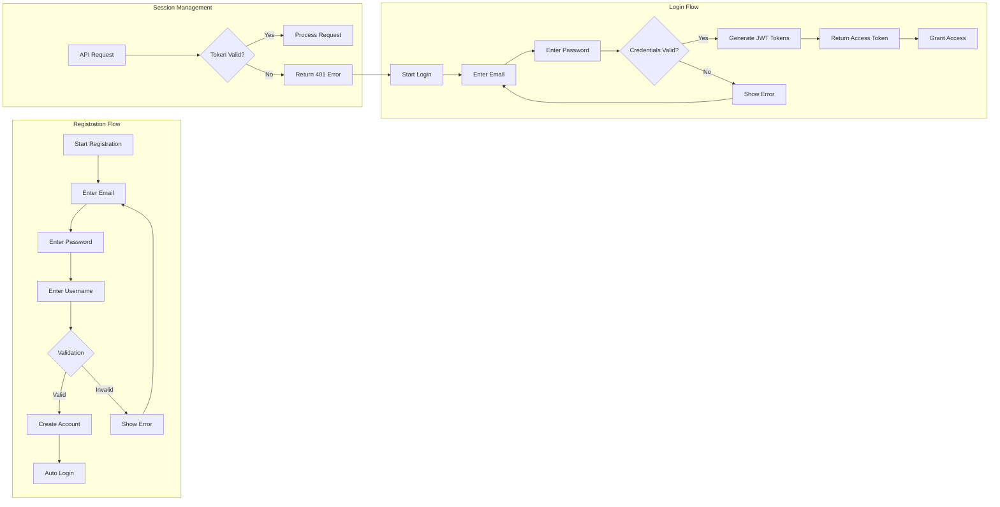
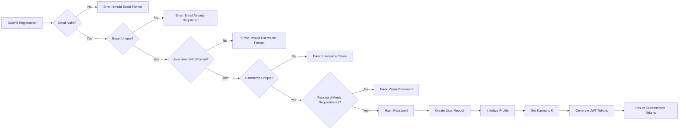
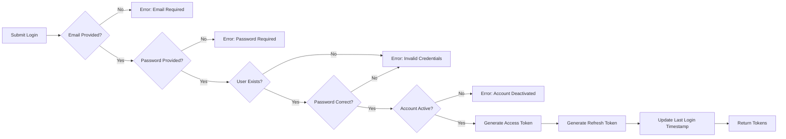
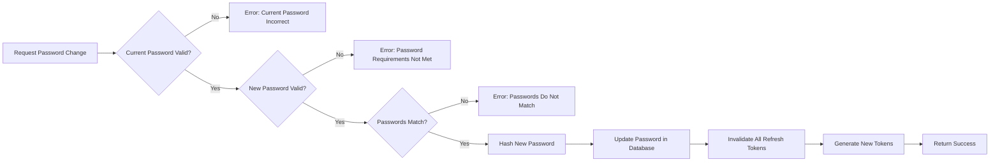
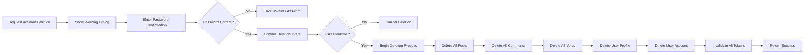
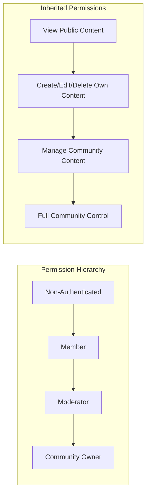

# User Actors and Authentication Requirements

## 1. User Actors Overview

The community platform operates with a single primary actor type with context-dependent role escalation. This design allows for flexible permission management while maintaining a simple authentication model.

### 1.1 Member (Base Actor)

**Definition**: A Member is any registered user who has completed the account registration process and successfully authenticated with the system.

**Base Capabilities**:
- Create and manage posts in subscribed communities
- Write comments and replies on any post
- Vote on posts and comments (upvote/downvote)
- Subscribe to and unsubscribe from communities
- Create new communities (automatically becomes community owner)
- Manage their own user profile (display name, bio, avatar)
- Report inappropriate content (posts and comments)
- View their own karma score and activity history
- Change their account password
- Delete their own account

**Authentication Method**: Email and password combination with unique username identifier.

### 1.2 Community Owner Role

**Definition**: A Member who has created a community automatically assumes the Community Owner role for that specific community.

**Additional Capabilities (within owned community)**:
- Add moderators to the community
- Remove any moderator from the community
- Delete any post in the community
- Delete any comment in the community
- Ban users from the community
- Unban users from the community
- View the list of banned users
- View and manage reports

**Constraints**:
- Community Owner role is scoped to communities they created
- Cannot be removed as owner by moderators
- Only one owner per community

### 1.3 Moderator Role

**Definition**: A Member who has been appointed as a moderator by a Community Owner or another Moderator for a specific community.

**Additional Capabilities (within moderated community)**:
- Add other moderators to the community
- Delete any post in the community
- Delete any comment in the community
- Ban users from the community
- Unban users from the community
- View the list of banned users
- View and manage reports

**Constraints**:
- Moderator role is scoped to specific communities
- Cannot remove the Community Owner
- Cannot remove other moderators (only Community Owner can remove moderators)
- Can only moderate communities where they have been appointed

### 1.4 Non-Authenticated User (Guest)

**Definition**: A visitor who has not logged in or registered an account.

**Capabilities**:
- View the Popular Feed (posts from all communities)
- View Community Feeds (posts from specific communities)
- View individual posts and comments
- View user profiles
- View community information
- Browse and search communities

**Restrictions**:
- Cannot create posts or comments
- Cannot vote on content
- Cannot subscribe to communities
- Cannot create communities
- Cannot report content
- Cannot access the Home Feed (requires authentication)

## 2. Authentication Requirements

### 2.1 Core Authentication Functions

THE system SHALL provide the following authentication capabilities:

1. **Registration**: Allow new users to create an account with email, password, and unique username
2. **Login**: Authenticate users with email and password combination
3. **Logout**: Terminate user session and invalidate authentication tokens
4. **Session Management**: Maintain user authentication state across requests
5. **Password Change**: Allow authenticated users to change their password
6. **Account Deletion**: Allow authenticated users to permanently delete their account

### 2.2 Authentication Flow

### 2.3 JWT Token Specification

THE system SHALL use JSON Web Tokens (JWT) for authentication with the following specifications:

| Property | Specification | Description |
|----------|--------------|-------------|
| Access Token Lifetime | 30 minutes | Short-lived token for API access |
| Refresh Token Lifetime | 14 days | Long-lived token for token renewal |
| Token Storage | Client-side (localStorage or httpOnly cookie) | Secure storage mechanism |
| Algorithm | HS256 or RS256 | JWT signing algorithm |

**JWT Payload Structure**:

THE system SHALL include the following claims in the JWT payload:

- `sub` (Subject): Unique user identifier (user ID)
- `iat` (Issued At): Token creation timestamp
- `exp` (Expiration): Token expiration timestamp
- `username`: User's unique username
- `email`: User's registered email address

### 2.4 Session Security Requirements

WHEN a user logs in, THE system SHALL:
1. Generate a new access token and refresh token pair
2. Invalidate any previous refresh tokens for security (single session mode)
3. Return tokens through secure HTTP-only cookies or secure response body
4. Log the login event with timestamp and IP address (for audit purposes)

WHEN a user's access token expires, THE system SHALL:
1. Accept the refresh token for renewal
2. Validate the refresh token is not expired or revoked
3. Generate a new access token
4. Optionally generate a new refresh token (token rotation)

WHEN a user logs out, THE system SHALL:
1. Invalidate the current refresh token
2. Clear authentication cookies (if used)
3. Prevent further API access with the old access token

## 3. Account Registration

### 3.1 Registration Process

WHEN a new user attempts to register, THE system SHALL require:

1. **Email Address**: 
   - Valid email format
   - Not already registered in the system
   - Case-insensitive uniqueness check

2. **Username**:
   - Unique across all users
   - Minimum 3 characters, maximum 20 characters
   - Alphanumeric characters and underscores only
   - Case-insensitive uniqueness check

3. **Password**:
   - Minimum 8 characters
   - Maximum 128 characters
   - At least one uppercase letter
   - At least one lowercase letter
   - At least one number
   - At least one special character (!@#$%^&*()_+-=[]{}|;:,.<>?)

### 3.2 Registration Workflow

### 3.3 Validation Error Responses

IF registration validation fails, THEN THE system SHALL return appropriate error messages:

| Error Condition | Error Code | Error Message |
|----------------|------------|---------------|
| Invalid email format | INVALID_EMAIL | "Please provide a valid email address" |
| Email already registered | EMAIL_EXISTS | "An account with this email already exists" |
| Username too short | USERNAME_TOO_SHORT | "Username must be at least 3 characters" |
| Username too long | USERNAME_TOO_LONG | "Username cannot exceed 20 characters" |
| Username invalid characters | USERNAME_INVALID | "Username can only contain letters, numbers, and underscores" |
| Username already taken | USERNAME_EXISTS | "This username is already taken" |
| Password too short | PASSWORD_TOO_SHORT | "Password must be at least 8 characters" |
| Password missing requirements | PASSWORD_WEAK | "Password must include uppercase, lowercase, number, and special character" |

### 3.4 Initial Account State

WHEN a new account is successfully created, THE system SHALL initialize:

- **User Record**: Email, hashed password, username, creation timestamp
- **User Profile**: Empty display name (null or empty string), empty bio, default avatar placeholder
- **Karma Score**: Initialized to 0 (zero)
- **Subscription List**: Empty (no communities subscribed)
- **Created Communities**: Empty
- **Posts and Comments**: Empty
- **Votes**: Empty

## 4. Login and Session Management

### 4.1 Login Process

WHEN a user attempts to log in, THE system SHALL:

1. Accept email and password credentials
2. Validate that both fields are provided (non-empty)
3. Look up the user by email address (case-insensitive)
4. Compare the provided password with the stored hashed password
5. Generate JWT tokens upon successful authentication
6. Return the tokens to the client

### 4.2 Login Workflow

### 4.3 Login Error Responses

IF login fails, THEN THE system SHALL return appropriate error messages:

| Error Condition | Error Code | HTTP Status | Error Message |
|----------------|------------|-------------|---------------|
| Email not provided | EMAIL_REQUIRED | 400 | "Email is required" |
| Password not provided | PASSWORD_REQUIRED | 400 | "Password is required" |
| Invalid email or password | INVALID_CREDENTIALS | 401 | "Invalid email or password" |
| Account not found | INVALID_CREDENTIALS | 401 | "Invalid email or password" (same as invalid password for security) |

**Security Note**: THE system SHALL NOT reveal whether the email exists or the password is incorrect in error messages to prevent account enumeration attacks.

### 4.4 Token Refresh Process

WHEN an access token expires, THE system SHALL:

1. Accept the refresh token from the client
2. Validate the refresh token signature and expiration
3. Check if the refresh token has been revoked
4. Retrieve the associated user account
5. Generate a new access token
6. Optionally generate a new refresh token (token rotation for enhanced security)
7. Return the new tokens

IF the refresh token is invalid or expired, THEN THE system SHALL:
- Return HTTP 401 Unauthorized
- Require the user to log in again

### 4.5 Logout Process

WHEN a user logs out, THE system SHALL:

1. Accept the current refresh token
2. Mark the refresh token as revoked in the database
3. Clear any authentication cookies (if using cookies)
4. Return a success response

THE system SHALL ensure that:
- The access token cannot be immediately revoked (stateless JWT), but will expire naturally
- Subsequent API calls with the old access token will fail once the token expires
- Users can force-logout from all devices by revoking all refresh tokens

## 5. Password Management

### 5.1 Password Change Process

WHEN an authenticated user requests to change their password, THE system SHALL require:

1. **Current Password**: Verification of the user's identity
2. **New Password**: Must meet all password requirements defined in registration
3. **Password Confirmation**: Must match the new password

### 5.2 Password Change Workflow

### 5.3 Password Change Error Responses

IF password change fails, THEN THE system SHALL return appropriate error messages:

| Error Condition | Error Code | Error Message |
|----------------|------------|---------------|
| Current password incorrect | CURRENT_PASSWORD_INVALID | "Current password is incorrect" |
| New password too weak | PASSWORD_WEAK | "Password must be at least 8 characters with uppercase, lowercase, number, and special character" |
| Passwords don't match | PASSWORD_MISMATCH | "New password and confirmation do not match" |
| New password same as current | PASSWORD_SAME | "New password must be different from current password" |

### 5.4 Security Measures for Password Changes

WHEN a password is successfully changed, THE system SHALL:

1. Invalidate all existing refresh tokens for the user (forcing re-login on all devices)
2. Generate new access and refresh tokens for the current session
3. Optionally send an email notification to the user about the password change
4. Log the password change event with timestamp

### 5.5 Password Storage Requirements

THE system SHALL store passwords using secure hashing:

- **Algorithm**: bcrypt, Argon2, or PBKDF2
- **Salt**: Randomly generated unique salt per password
- **Work Factor**: Minimum cost factor of 12 for bcrypt, or equivalent for other algorithms
- **Plain Text Storage**: STRICTLY PROHIBITED

## 6. Account Deletion

### 6.1 Deletion Process

WHEN an authenticated user requests to delete their account, THE system SHALL:

1. Require password confirmation for security
2. Display a clear warning about permanent deletion
3. Require explicit confirmation (e.g., typing "DELETE" or checking a confirmation box)
4. Upon confirmation, permanently delete all user data

### 6.2 Account Deletion Workflow

### 6.3 Cascading Deletion Effects

WHEN an account is deleted, THE system SHALL permanently remove:

| Data Type | Deletion Behavior |
|-----------|-------------------|
| User Account | Completely removed from database |
| User Profile | Completely removed |
| User's Posts | All posts deleted (including votes on those posts) |
| User's Comments | All comments deleted (including votes on those comments) |
| User's Votes | All votes removed (affects other users' karma) |
| Community Ownership | **Special Handling Required** (see 6.4) |
| Moderator Positions | Removed from all moderated communities |
| Subscriptions | All subscriptions removed |
| Reports Created | User's reports removed from report queues |
| Karma Impact | Other users' karma scores adjusted (votes removed) |

### 6.4 Community Ownership Transfer

IF the user being deleted owns one or more communities, THEN THE system SHALL:

1. **First Moderator**: Transfer ownership to the first appointed moderator (if any exist)
2. **No Moderators**: Delete the community entirely (or mark for deletion review)
3. **Display Warning**: Before deletion, warn the user about communities they own

**Recommended User Experience**:
- Prompt the user to transfer ownership before allowing account deletion
- Show list of communities they own
- Require manual ownership transfer for communities with moderators

### 6.5 Karma Adjustment on Deletion

WHEN a user's account is deleted, THE system SHALL adjust karma scores:

- All upvotes given by the deleted user are removed (decreases karma of content authors by 1 each)
- All downvotes given by the deleted user are removed (increases karma of content authors by 1 each)
- All votes received on the deleted user's posts and comments are removed (no longer applicable)

### 6.6 Deletion Error Responses

IF account deletion fails, THEN THE system SHALL return appropriate error messages:

| Error Condition | Error Code | Error Message |
|----------------|------------|---------------|
| Password incorrect | PASSWORD_INVALID | "Password is incorrect" |
| User not authenticated | UNAUTHORIZED | "You must be logged in to delete your account" |
| Community ownership conflict | COMMUNITY_OWNERSHIP | "Please transfer ownership of your communities before deleting your account" |

### 6.7 Data Retention and Recovery

THE system SHALL NOT provide account recovery after deletion:

- **No Soft Delete**: Account deletion is permanent and irreversible
- **No Recovery Window**: No grace period for account recovery
- **No Backup Restoration**: Deleted data cannot be restored from backups for privacy compliance

## 7. Permission Matrix

### 7.1 Base Member Permissions

| Action | Permission | Notes |
|--------|------------|-------|
| View Popular Feed | ✅ Allowed | Available to non-authenticated users |
| View Community Feed | ✅ Allowed | Available to non-authenticated users |
| View Individual Posts | ✅ Allowed | Available to non-authenticated users |
| View Comments | ✅ Allowed | Available to non-authenticated users |
| View User Profiles | ✅ Allowed | Available to non-authenticated users |
| View Home Feed | ✅ Allowed | Requires authentication (subscribed communities only) |
| Create Post | ✅ Allowed | Requires subscription to community |
| Edit Own Post | ✅ Allowed | Own content only |
| Delete Own Post | ✅ Allowed | Own content only |
| Create Comment | ✅ Allowed | Requires subscription to community |
| Edit Own Comment | ✅ Allowed | Own content only |
| Delete Own Comment | ✅ Allowed | Own content only |
| Reply to Comment | ✅ Allowed | Unlimited nesting depth |
| Vote on Posts | ✅ Allowed | One vote per post |
| Vote on Comments | ✅ Allowed | One vote per comment |
| Subscribe to Community | ✅ Allowed | - |
| Unsubscribe from Community | ✅ Allowed | - |
| Create Community | ✅ Allowed | Becomes community owner |
| Report Content | ✅ Allowed | Must provide reason |
| Edit Own Profile | ✅ Allowed | Display name, bio, avatar |
| Change Password | ✅ Allowed | Requires current password |
| Delete Account | ✅ Allowed | Permanent deletion |

### 7.2 Community Owner Permissions

| Action | Permission | Scope |
|--------|------------|-------|
| All Member Permissions | ✅ Allowed | Platform-wide |
| Delete Any Post | ✅ Allowed | Owned communities only |
| Delete Any Comment | ✅ Allowed | Owned communities only |
| Ban Users | ✅ Allowed | Owned communities only |
| Unban Users | ✅ Allowed | Owned communities only |
| View Banned Users | ✅ Allowed | Owned communities only |
| Add Moderators | ✅ Allowed | Owned communities only |
| Remove Moderators | ✅ Allowed | Owned communities only (including self) |
| View Reports | ✅ Allowed | Owned communities only |
| Approve Reports | ✅ Allowed | Owned communities only (deletes content) |
| Dismiss Reports | ✅ Allowed | Owned communities only |
| Edit Community Info | ✅ Allowed | Owned communities only |
| Delete Community | ✅ Allowed | Owned communities only |

### 7.3 Moderator Permissions

| Action | Permission | Scope |
|--------|------------|-------|
| All Member Permissions | ✅ Allowed | Platform-wide |
| Delete Any Post | ✅ Allowed | Moderated communities only |
| Delete Any Comment | ✅ Allowed | Moderated communities only |
| Ban Users | ✅ Allowed | Moderated communities only |
| Unban Users | ✅ Allowed | Moderated communities only |
| View Banned Users | ✅ Allowed | Moderated communities only |
| Add Moderators | ✅ Allowed | Moderated communities only |
| Remove Moderators | ❌ Forbidden | Only Owner can remove |
| Remove Owner | ❌ Forbidden | Cannot remove owner |
| View Reports | ✅ Allowed | Moderated communities only |
| Approve Reports | ✅ Allowed | Moderated communities only |
| Dismiss Reports | ✅ Allowed | Moderated communities only |
| Edit Community Info | ❌ Forbidden | Owner only |
| Delete Community | ❌ Forbidden | Owner only |

### 7.4 Non-Authenticated User Permissions

| Action | Permission | Notes |
|--------|------------|-------|
| View Popular Feed | ✅ Allowed | All posts from all communities |
| View Community Feed | ✅ Allowed | Posts from specific community |
| View Individual Posts | ✅ Allowed | Full content display |
| View Comments | ✅ Allowed | All comments with nesting |
| View User Profiles | ✅ Allowed | Public information only |
| View Community Info | ✅ Allowed | Name, description, subscriber count |
| Search Communities | ✅ Allowed | - |
| View Home Feed | ❌ Forbidden | Requires authentication |
| Create Post | ❌ Forbidden | Requires authentication |
| Create Comment | ❌ Forbidden | Requires authentication |
| Vote | ❌ Forbidden | Requires authentication |
| Subscribe | ❌ Forbidden | Requires authentication |
| Create Community | ❌ Forbidden | Requires authentication |
| Report Content | ❌ Forbidden | Requires authentication |
| Edit Profile | ❌ Forbidden | Requires authentication |
| Change Password | ❌ Forbidden | Requires authentication |
| Delete Account | ❌ Forbidden | Requires authentication |

### 7.5 Permission Inheritance Model

### 7.6 Role Assignment Rules

| Role | Assignment Method | Revocation Method |
|------|------------------|-------------------|
| Member | Self-registration | Account deletion |
| Community Owner | Create new community | Transfer ownership or community deletion |
| Moderator | Appointed by Owner or Moderator | Removed by Owner only |

### 7.7 Cross-Community Permissions

**Important Design Principle**: Moderation and ownership permissions are **scoped to specific communities** and do not transfer across communities.

- A user who is a moderator in Community A has no special privileges in Community B
- A user who owns Community A has no special privileges in Community B
- A user can be a moderator in multiple communities simultaneously
- A user can own multiple communities simultaneously
- A user can be a moderator in some communities and owner in others

## 8. Security Considerations

### 8.1 Authentication Security

THE system SHALL implement the following security measures:

1. **Rate Limiting**: Limit login attempts to prevent brute force attacks
   - Maximum 5 failed attempts per 15 minutes per IP
   - Account lockout after 10 consecutive failed attempts (15-minute lockout)

2. **Secure Transmission**: All authentication data transmitted over HTTPS only

3. **Token Security**:
   - JWT tokens signed with strong secret key
   - Tokens never exposed in URLs
   - Secure cookie flags (HttpOnly, Secure, SameSite)

4. **Password Requirements**: Enforce strong password policy as defined in Section 3.1

5. **Session Invalidation**: Proper token revocation on logout and password change

### 8.2 Authorization Security

THE system SHALL enforce authorization at multiple levels:

1. **Authentication Check**: Verify JWT token for all authenticated endpoints
2. **Permission Check**: Verify user has required role/permission for action
3. **Resource Ownership**: Verify user owns the resource being modified
4. **Community Membership**: Verify user is subscribed to community for posting
5. **Ban Check**: Verify user is not banned from community before allowing actions

### 8.3 Error Handling Security

THE system SHALL:
- Use generic error messages for authentication failures (prevent account enumeration)
- Log all authentication attempts for security monitoring
- Never expose internal system details in error responses
- Use appropriate HTTP status codes (401 for unauthorized, 403 for forbidden)