**communityPlatform — What operations users can perform, use cases, business workflows**

What operations users can perform, use cases, business workflows

# Core Business Operations

What the system must do for each business concept.

## User Operations

Users create accounts by providing an email address, a password, and choosing a unique username that identifies them across the platform. The email must not already be registered in the system to prevent duplicate accounts. Password changes are available to logged-in users who can authenticate their identity and provide a new password. Account deletion permanently removes a user and all their content, including all posts and comments they have created throughout the platform. Users can view their own profile or any other user's profile, which displays the user's display name, bio text, avatar image, total karma score, and lists of their posts and comments. Profile editing allows users to change their display name, bio text, and avatar image at any time. User authentication requires an email and password combination that matches an existing account. The system tracks each user's karma score as a single number that reflects the cumulative upvotes and downvotes received on all their content.

### Account Registration

### Account Registration

WHEN a user registers for an account, THE system SHALL require the user to provide an email address, a password, and a username.

WHEN a user submits a registration request, THE system SHALL verify that the provided email address is not already registered in the system.

IF the email address is already registered, THE system SHALL reject the registration request.

WHEN a user submits a registration request, THE system SHALL verify that the requested username is not already taken by another user.

IF the username is already taken, THE system SHALL reject the registration request.

WHEN a registration request passes all validations, THE system SHALL create a new user account with the provided email, username, and password.

THE system SHALL create each user account with a default karma score of zero.

THE system SHALL allow the new user to immediately log in after successful registration.

WHEN a new account is created, THE system SHALL initialize an empty profile with placeholder values for display name, bio, and avatar.

IF any required field is missing from the registration request, THE system SHALL reject the registration request.

### User Authentication

### User Authentication

WHEN a user attempts to log in, THE system SHALL require the user to provide an email address and password.

WHEN a user submits login credentials, THE system SHALL verify that the email address corresponds to an existing account.

IF the email address does not correspond to an existing account, THE system SHALL reject the login attempt.

WHEN a user submits login credentials, THE system SHALL verify that the provided password matches the password stored for that account.

IF the password does not match, THE system SHALL reject the login attempt.

WHEN valid login credentials are provided, THE system SHALL authenticate the user and establish an active session.

THE system SHALL allow only one active session per user account at a time.

WHEN a user is successfully authenticated, THE system SHALL grant the user access to all features available to their account type.

IF a user attempts to access features requiring authentication without an active session, THE system SHALL deny access and prompt for login.

### Password Management

### Password Management

WHEN a logged-in user requests to change their password, THE system SHALL require the user to provide their current password.

WHEN a user submits a password change request, THE system SHALL verify that the provided current password matches the password stored for that account.

IF the current password does not match, THE system SHALL reject the password change request.

WHEN the current password is verified, THE system SHALL require the user to provide a new password.

WHEN a valid new password is provided, THE system SHALL update the account with the new password.

THE system SHALL allow the user to log in with the new password immediately after the change.

THE system SHALL maintain the user's active session after a successful password change.

### Account Deletion

### Account Deletion

WHEN a user requests to delete their account, THE system SHALL permanently remove the user account from the system.

WHEN an account is deleted, THE system SHALL delete all posts created by that user.

WHEN an account is deleted, THE system SHALL delete all comments written by that user.

WHEN an account is deleted, THE system SHALL remove all votes cast by that user.

WHEN an account is deleted, THE system SHALL remove all subscriptions belonging to that user.

WHEN an account is deleted, THE system SHALL transfer ownership of any communities owned by that user to another user or mark them as ownerless.

THE system SHALL NOT allow recovery of a deleted account or its content.

WHEN a user's content is deleted as part of account deletion, THE system SHALL adjust the karma scores of other users who received votes from the deleted account.

WHEN an account is deleted, THE system SHALL remove any moderator roles held by that user in communities.

### Profile Viewing

### Profile Viewing

THE system SHALL allow any user to view any other user's profile.

WHEN a user views a profile, THE system SHALL display the profile owner's display name.

WHEN a user views a profile, THE system SHALL display the profile owner's bio text.

WHEN a user views a profile, THE system SHALL display the profile owner's avatar image.

WHEN a user views a profile, THE system SHALL display the profile owner's total karma score.

WHEN a user views a profile, THE system SHALL display a list of all posts created by the profile owner.

WHEN a user views a profile, THE system SHALL display a list of all comments written by the profile owner.

THE system SHALL allow guests to view user profiles without being logged in.

WHEN viewing a user's post history on their profile, THE system SHALL display each post's title, community, vote score, and time since posted.

WHEN viewing a user's comment history on their profile, THE system SHALL display each comment's content, associated post, vote score, and time since posted.

### Profile Editing

### Profile Editing

THE system SHALL allow a user to edit their own display name.

THE system SHALL allow a user to edit their own bio text.

THE system SHALL allow a user to update their own avatar image.

WHEN a user updates their display name, THE system SHALL save the new display name and display it on their profile immediately.

WHEN a user updates their bio text, THE system SHALL save the new bio text and display it on their profile immediately.

WHEN a user uploads a new avatar image, THE system SHALL save the new avatar and display it on their profile immediately.

THE system SHALL NOT allow a user to edit another user's profile.

THE system SHALL allow profile fields to be updated independently of each other.

IF a user leaves a profile field blank, THE system SHALL display a placeholder or empty value for that field.

### Karma Score Tracking

### Karma Score Tracking

THE system SHALL maintain a single karma score for each user.

THE system SHALL initialize each user's karma score to zero upon account creation.

WHEN another user upvotes a user's post, THE system SHALL increase that user's karma score by one.

WHEN another user downvotes a user's post, THE system SHALL decrease that user's karma score by one.

WHEN another user upvotes a user's comment, THE system SHALL increase that user's karma score by one.

WHEN another user downvotes a user's comment, THE system SHALL decrease that user's karma score by one.

WHEN a user removes their upvote from content, THE system SHALL decrease the content author's karma score by one.

WHEN a user removes their downvote from content, THE system SHALL increase the content author's karma score by one.

WHEN a user changes their vote from upvote to downvote, THE system SHALL decrease the content author's karma score by two.

WHEN a user changes their vote from downvote to upvote, THE system SHALL increase the content author's karma score by two.

THE system SHALL allow karma scores to become negative.

THE system SHALL display the karma score on the user's profile page.

### User Content History

### User Content History

THE system SHALL maintain a complete history of all posts created by each user.

THE system SHALL maintain a complete history of all comments written by each user.

WHEN viewing a user's content history, THE system SHALL display posts in reverse chronological order by creation time.

WHEN viewing a user's content history, THE system SHALL display comments in reverse chronological order by creation time.

WHEN a user deletes a post, THE system SHALL remove that post from the user's content history.

WHEN a user deletes a comment, THE system SHALL remove that comment from the user's content history.

WHEN viewing a user's post history, THE system SHALL indicate the community each post belongs to.

WHEN viewing a user's comment history, THE system SHALL indicate the post each comment belongs to.

IF a post or comment has been deleted from its original community, THE system SHALL indicate that the content is no longer available when viewing the user's history.

## Community Operations

Any registered user can create a new community by providing a unique name, a description text, and an optional icon image. The user who creates a community automatically becomes its owner with full authority over moderation and management. Communities are visible to all users including those not logged in, allowing anyone to browse and discover them. Users can search for communities by name to find specific topics or interests. Each community displays its subscriber count to indicate its popularity and reach. The community list shows all available communities that users can explore and potentially join. Community information includes the name, description, icon, and subscriber count that help users decide whether to subscribe. The creator of a community holds the owner role which cannot be transferred to another user. Communities serve as containers for posts where members can share and discuss content related to the community's topic.

### Community Creation Process

WHEN a user creates a new community, THE system SHALL:
1. Require a unique community name
2. Require a description text
3. Allow an optional icon image
4. Automatically assign the creating user as the community owner

IF a community name is already taken by another community, THE system SHALL reject the creation request with an error indicating the name is unavailable.

WHEN a user provides a community description, THE system SHALL accept descriptive text explaining the community's purpose and topic.

WHEN a user uploads a community icon image, THE system SHALL accept the image file and associate it with the community.

IF no icon image is provided during creation, THE system SHALL allow the community to be created without an icon.

WHEN a community is successfully created, THE system SHALL grant the creator the owner role with full moderation and management authority over the community.

THE system SHALL ensure the owner role cannot be transferred to another user.

THE system SHALL allow any registered user to create a community regardless of their existing community ownership or membership.

### Community Browsing and Search

THE system SHALL provide a browsable list of all communities that is visible to all users including those not logged in.

WHEN a user views the community list, THE system SHALL display all available communities in the platform.

WHEN a user searches for communities by name, THE system SHALL return matching communities based on the search term.

THE system SHALL allow community search functionality for all users including guests.

IF no communities match the search term, THE system SHALL return an empty result list.

THE system SHALL allow users to view community information without requiring login or subscription.

WHEN a user browses or searches for communities, THE system SHALL display each community's name, description, icon, and subscriber count.

THE system SHALL enable users to discover communities by browsing the full list or using search to find specific topics.

### Community Information Display

WHEN a user views a community, THE system SHALL display:
1. The community name
2. The community description
3. The community icon if one exists
4. The subscriber count

THE system SHALL show the subscriber count to indicate the community's popularity and reach.

THE system SHALL make community information accessible to all users regardless of login status.

WHEN a community has no icon, THE system SHALL display the community information without requiring an icon to be present.

THE system SHALL allow users to view community details before deciding whether to subscribe.

## Post Operations

Users create posts within communities they are subscribed to, providing a required title and one of three content types: text content, a URL link, or an uploaded image. Text posts contain written content, link posts reference external websites, and image posts display uploaded pictures. Users can edit their own posts to modify the title or content after creation. Users can delete their own posts which removes them from the community and all feeds. Each post displays its title, full content, author username, community name, vote score, comment count, and the time it was posted. Post lists in feeds show a preview including the title, author, community, vote score, comment count, time since posting, and either the first 200 characters of text, a thumbnail for images, or the domain name for links. Three types of feeds display posts: the home feed shows posts from subscribed communities, the popular feed shows posts from all communities, and the community feed shows posts from a single specific community. All feeds support sorting by hot (recent posts with many upvotes), new (most recent first), top (highest vote score with time filters), and controversial (many votes but score near zero). Feeds are paginated to handle large numbers of posts efficiently.

### Post Creation Requirements

### Post Creation Requirements

WHEN a user creates a post, THE system SHALL require the user to be subscribed to the target community.

WHEN a user creates a post, THE system SHALL require a title for the post.

WHEN a user creates a post, THE system SHALL require the user to specify one of three content types: text, link, or image.

IF the user is not subscribed to the community, THE system SHALL reject the post creation request.

WHEN a user creates a post, THE system SHALL associate the post with the creating user as the author.

WHEN a user creates a post, THE system SHALL associate the post with the specified community.

WHEN a user creates a post, THE system SHALL record the timestamp of creation.

WHEN a user creates a post, THE system SHALL initialize the vote score to zero.

WHEN a user creates a post, THE system SHALL initialize the comment count to zero.

IF the user is banned from the community, THE system SHALL reject the post creation request.

WHEN a post is created, THE system SHALL make the post visible in the community feed immediately.

### Post Content Types

### Post Content Types

WHEN a user creates a text post, THE system SHALL allow the user to enter text content of any length.

WHEN a user creates a link post, THE system SHALL require a valid URL.

WHEN a user creates an image post, THE system SHALL require an uploaded image file.

IF a user attempts to create a post without specifying a content type, THE system SHALL reject the request.

IF a text post is created, THE system SHALL store the text content as the post body.

IF a link post is created, THE system SHALL store the URL as the post content.

IF an image post is created, THE system SHALL store the image and generate a reference to the uploaded file.

WHEN a post type is specified, THE system SHALL require content appropriate for that type.

IF a link post URL is invalid or malformed, THE system SHALL reject the post creation.

### Post Editing Permissions

### Post Editing Permissions

WHEN a user edits a post, THE system SHALL verify that the user is the author of the post.

IF the user is not the author of the post, THE system SHALL reject the edit request.

WHEN a user edits their own post, THE system SHALL allow modification of the title.

WHEN a user edits their own post, THE system SHALL allow modification of the content based on the post type.

WHEN a user edits a text post, THE system SHALL allow modification of the text content.

WHEN a user edits a link post, THE system SHALL allow modification of the URL.

WHEN a user edits an image post, THE system SHALL allow replacement of the image file.

WHEN a post is edited, THE system SHALL preserve all other post attributes including vote score, comment count, and author.

IF a post has been deleted, THE system SHALL reject any edit attempts.

### Post Deletion Process

### Post Deletion Process

WHEN a user deletes their own post, THE system SHALL remove the post from the community.

WHEN a user deletes their own post, THE system SHALL remove the post from all feeds.

WHEN a user deletes their own post, THE system SHALL mark the post as deleted.

WHEN a post is deleted, THE system SHALL preserve all comments associated with the post.

IF the user is not the author of the post, THE system SHALL reject the deletion request.

WHEN a post is deleted, THE system SHALL adjust the author's karma based on any votes the post had received.

WHEN a post is deleted, THE system SHALL remove the post from subscribers' home feeds.

WHEN a post is deleted, THE system SHALL remove the post from the popular feed.

### Post Display Information

### Post Display Information

WHEN a user views a single post, THE system SHALL display the post title.

WHEN a user views a single post, THE system SHALL display the full content based on the post type.

WHEN a user views a single post, THE system SHALL display the author's username.

WHEN a user views a single post, THE system SHALL display the community name where the post was created.

WHEN a user views a single post, THE system SHALL display the vote score.

WHEN a user views a single post, THE system SHALL display the comment count.

WHEN a user views a single post, THE system SHALL display the timestamp of when the post was created.

WHEN a user views a text post, THE system SHALL display the complete text content.

WHEN a user views a link post, THE system SHALL display the URL as a clickable link.

WHEN a user views an image post, THE system SHALL display the full uploaded image.

### Post List Preview

### Post List Preview

WHEN a post appears in a feed list, THE system SHALL display the post title.

WHEN a post appears in a feed list, THE system SHALL display the author's username.

WHEN a post appears in a feed list, THE system SHALL display the community name.

WHEN a post appears in a feed list, THE system SHALL display the vote score.

WHEN a post appears in a feed list, THE system SHALL display the comment count.

WHEN a post appears in a feed list, THE system SHALL display the time elapsed since posting.

WHEN a text post appears in a feed list, THE system SHALL display the first 200 characters of the text content as a preview.

WHEN a link post appears in a feed list, THE system SHALL display the domain name extracted from the URL.

WHEN an image post appears in a feed list, THE system SHALL display a thumbnail of the uploaded image.

IF a text post has fewer than 200 characters, THE system SHALL display the complete text content as the preview.

### Home Feed Filtering

### Home Feed Filtering

WHEN a logged-in user views the home feed, THE system SHALL display posts only from communities the user has subscribed to.

IF the user is not logged in, THE system SHALL not allow access to the home feed.

WHEN the home feed is displayed, THE system SHALL include posts from all subscribed communities.

WHEN a user subscribes to a new community, THE system SHALL include posts from that community in the home feed immediately.

WHEN a user unsubscribes from a community, THE system SHALL remove posts from that community from the home feed.

IF a user has no subscriptions, THE system SHALL display an empty home feed.

WHEN the home feed is displayed, THE system SHALL apply the user's selected sorting option.

### Popular Feed Access

### Popular Feed Access

WHEN any user views the popular feed, THE system SHALL display posts from all communities.

WHEN a logged-out user views the popular feed, THE system SHALL provide full access to all posts.

WHEN a logged-in user views the popular feed, THE system SHALL display posts from all communities regardless of subscription status.

WHEN the popular feed is displayed, THE system SHALL include posts from every community on the platform.

WHEN the popular feed is displayed, THE system SHALL apply the user's selected sorting option.

### Community Feed Viewing

### Community Feed Viewing

WHEN a user views a community feed, THE system SHALL display posts from that specific community only.

WHEN a logged-out user views a community feed, THE system SHALL provide full access to view posts.

WHEN a logged-in user views a community feed, THE system SHALL display posts regardless of subscription status.

WHEN a community feed is displayed, THE system SHALL include all posts created in that community.

WHEN a community feed is displayed, THE system SHALL apply the user's selected sorting option.

IF a community does not exist, THE system SHALL not display a feed.

### Post Sorting Options

### Post Sorting Options

WHEN a user views any feed, THE system SHALL provide the following sorting options: hot, new, top, and controversial.

WHEN a user selects the hot sorting option, THE system SHALL display posts that are recent and have many upvotes first.

WHEN a user selects the new sorting option, THE system SHALL display posts in order of most recently created first.

WHEN a user selects the top sorting option, THE system SHALL display posts with the highest vote score first.

WHEN a user selects the controversial sorting option, THE system SHALL display posts with many votes but a score close to zero first.

WHEN a sorting option is applied, THE system SHALL maintain the sorting across all feed types.

### Hot Sorting Algorithm

### Hot Sorting Algorithm

WHEN hot sorting is selected, THE system SHALL prioritize posts that are both recent and highly upvoted.

WHEN calculating hot ranking, THE system SHALL consider the time since the post was created.

WHEN calculating hot ranking, THE system SHALL consider the vote score of the post.

WHEN hot sorting is applied, THE system SHALL display posts with higher hot scores before posts with lower hot scores.

WHEN two posts have similar vote scores, THE system SHALL rank the more recent post higher in hot sorting.

WHEN two posts have similar creation times, THE system SHALL rank the post with more upvotes higher in hot sorting.

### New Sorting Order

### New Sorting Order

WHEN new sorting is selected, THE system SHALL display posts in descending order by creation timestamp.

WHEN new sorting is applied, THE system SHALL show the most recently created post first.

WHEN new sorting is applied, THE system SHALL not consider vote scores in the ordering.

WHEN multiple posts have the same creation timestamp, THE system SHALL order them arbitrarily.

### Top Sorting with Time Filters

### Top Sorting with Time Filters

WHEN top sorting is selected, THE system SHALL provide time filter options: today, this week, this month, this year, and all time.

WHEN the today filter is applied, THE system SHALL display posts created within the current day ordered by vote score.

WHEN the this week filter is applied, THE system SHALL display posts created within the current week ordered by vote score.

WHEN the this month filter is applied, THE system SHALL display posts created within the current month ordered by vote score.

WHEN the this year filter is applied, THE system SHALL display posts created within the current year ordered by vote score.

WHEN the all time filter is applied, THE system SHALL display all posts ordered by vote score.

WHEN top sorting is applied, THE system SHALL display posts with higher vote scores before posts with lower vote scores.

### Controversial Sorting

### Controversial Sorting

WHEN controversial sorting is selected, THE system SHALL display posts with many total votes but a vote score close to zero.

WHEN calculating controversial ranking, THE system SHALL consider the total number of votes (upvotes plus downvotes).

WHEN calculating controversial ranking, THE system SHALL consider the absolute value of the vote score.

WHEN controversial sorting is applied, THE system SHALL display posts with a high vote count and low score magnitude first.

WHEN two posts have similar vote counts, THE system SHALL rank the post with a score closer to zero higher in controversial sorting.

WHEN a post has zero total votes, THE system SHALL not consider it controversial.

### Feed Pagination

### Feed Pagination

WHEN a feed contains more posts than can be displayed at once, THE system SHALL paginate the results.

WHEN a user requests a feed, THE system SHALL return a fixed number of posts per page.

WHEN a user reaches the end of a page, THE system SHALL provide a way to load the next page of results.

WHEN pagination is applied, THE system SHALL maintain the selected sorting order across pages.

WHEN a user navigates between pages, THE system SHALL preserve the feed type and sorting selection.

IF a feed has no posts, THE system SHALL display an empty state.

WHEN a user requests a page beyond the available posts, THE system SHALL return an empty result set.

## Comment Operations

Users can write comments on any post in any community, expressing their thoughts or reactions to the post content. Comments can be added as direct replies to the post or as replies to other comments, creating nested conversation threads with unlimited depth. Each comment displays the author's username, the comment content, its vote score, and the time since it was posted. Users can edit their own comments to correct or update their content after posting. Users can delete their own comments which removes them from the conversation thread. Comment threads display nested replies underneath each parent comment, allowing readers to follow conversations at different depths. Comments on a post can be sorted by best (highest vote score first), new (most recent first), or controversial (many votes but score near zero). All users can view comments on any post regardless of their subscription status to the community.

### Comment Creation

### Comment Creation Requirements

WHEN a user creates a comment on a post, THE system SHALL:
1. Require the user to be logged in as a member
2. Allow the comment to be created on any post in any community
3. Require the comment content to be provided
4. Associate the comment with the post being commented on
5. Associate the comment with the author who created it
6. Record the timestamp when the comment was created
7. Initialize the comment vote score to zero

IF the user is not logged in, THE system SHALL reject the comment creation request.

IF the comment content is empty, THE system SHALL reject the comment creation request.

WHEN a user is banned from a community, THE system SHALL reject the comment creation request for posts in that community.

### Post Reply Comments

### Post Reply Comment Requirements

WHEN a user creates a direct reply to a post, THE system SHALL:
1. Create the comment as a top-level reply to the post
2. Display the comment directly under the post content
3. Associate the comment with the post as a parent
4. Allow unlimited top-level comments per post

WHEN a user views comments on a post, THE system SHALL display all top-level comments as direct replies to the post.

IF a post has no comments, THE system SHALL display an indication that no comments exist.

### Nested Reply Structure

### Nested Reply Requirements

WHEN a user creates a reply to another comment, THE system SHALL:
1. Create the reply as a child of the parent comment
2. Associate the reply with its parent comment
3. Display the reply indented under its parent comment
4. Support unlimited depth of nested replies

WHEN a user views a comment with replies, THE system SHALL:
1. Display all direct replies indented under the parent comment
2. Display nested replies at increasing indentation levels
3. Show the complete reply chain from parent to deepest child

THE system SHALL NOT impose any maximum depth limit on comment reply chains.

WHEN a parent comment has replies, THE system SHALL display the full thread of nested replies in a hierarchical structure.

### Comment Editing

### Comment Editing Requirements

WHEN a user edits their own comment, THE system SHALL:
1. Verify the user is the author of the comment
2. Allow the comment content to be modified
3. Preserve the original association with the post
4. Preserve the original association with the parent comment if it is a reply
5. Update the comment content with the new content provided

IF the user attempting to edit is not the author of the comment, THE system SHALL reject the edit request.

IF the edited comment content is empty, THE system SHALL reject the edit request.

### Comment Deletion

### Comment Deletion Requirements

WHEN a user deletes their own comment, THE system SHALL:
1. Verify the user is the author of the comment
2. Remove the comment from the post
3. Remove all nested replies under the deleted comment

IF the user attempting to delete is not the author of the comment, THE system SHALL reject the deletion request.

WHEN a moderator deletes a comment in their community, THE system SHALL:
1. Verify the user is a moderator of the community containing the post
2. Remove the comment from the post
3. Remove all nested replies under the deleted comment

WHEN a comment is deleted, THE system SHALL NOT allow any user to view the deleted comment content.

### Comment Display

### Comment Display Requirements

WHEN a user views a comment, THE system SHALL display:
1. The author's username who wrote the comment
2. The comment content text
3. The current vote score of the comment
4. The time elapsed since the comment was created
5. All nested replies to the comment in a threaded structure

WHEN a comment has nested replies, THE system SHALL display each reply indented under its parent comment.

WHEN the vote score of a comment is requested for display, THE system SHALL:
1. Calculate the score as total upvotes minus total downvotes
2. Display the calculated net score
3. Allow the score to be negative if downvotes exceed upvotes
4. Update the displayed score whenever votes are added or removed

### Comment Visibility

### Comment Visibility Requirements

THE system SHALL allow all users to view comments on any post in any community.

WHEN a guest (non-logged-in user) views a post, THE system SHALL:
1. Display all comments on the post
2. Display the threaded reply structure
3. Display comment author, content, vote score, and timestamp

WHEN a member views a post, THE system SHALL:
1. Display all comments on the post
2. Display the threaded reply structure
3. Display comment author, content, vote score, and timestamp
4. Indicate which comments the member has voted on

THE system SHALL NOT require community subscription to view comments on posts.

THE system SHALL NOT require login to view comments on posts.

### Comment Sorting Options

### Comment Sorting Requirements

WHEN a user views comments on a post, THE system SHALL provide the following sorting options:
1. Best: comments sorted by highest vote score first
2. New: comments sorted by most recent creation time first
3. Controversial: comments sorted by vote count proximity to zero score

THE system SHALL apply the selected sorting method to all comments on the post, including nested replies.

IF the user has not selected a sorting option, THE system SHALL default to sorting by best (highest vote score).

WHEN the user changes the sorting option, THE system SHALL immediately re-sort and re-display all comments.

WHEN comments are sorted by best, THE system SHALL:
1. Order comments by vote score from highest to lowest
2. Apply the same sorting to nested replies at each level
3. Display comments with equal scores in chronological order

WHEN comments are sorted by new, THE system SHALL:
1. Order comments by creation timestamp from most recent to oldest
2. Apply the same sorting to nested replies at each level

WHEN comments are sorted by controversial, THE system SHALL:
1. Calculate the total vote count (upvotes plus downvotes) for each comment
2. Identify comments where the total vote count is high but the net score is close to zero
3. Order comments to prioritize those with the highest controversy ratio
4. Apply the same sorting to nested replies at each level

## Vote Operations

Users can cast a single vote on any post or comment, choosing either an upvote which adds one to the score or a downvote which subtracts one from the score. Each user can only have one active vote per post or comment, preventing multiple votes on the same content. Users can change their existing vote from upvote to downvote or vice versa at any time, with the score adjusting accordingly. Users can remove their vote entirely which returns the content's score to its previous state before the vote was cast. The vote score displayed on posts and comments represents the total number of upvotes minus the total number of downvotes received. When a user receives an upvote on their post or comment, their karma score increases by one. When a user receives a downvote on their post or comment, their karma score decreases by one. When a vote is removed or changed, the affected user's karma adjusts to reflect the change. Karma scores can be negative if a user receives more downvotes than upvotes across their content.

### Upvoting Content

### Upvoting Posts

WHEN a member casts an upvote on a post, THE system SHALL:
1. Record the upvote associated with the member and the post
2. Increase the post's vote score by 1
3. Increase the post author's karma score by 1

### Upvoting Comments

WHEN a member casts an upvote on a comment, THE system SHALL:
1. Record the upvote associated with the member and the comment
2. Increase the comment's vote score by 1
3. Increase the comment author's karma score by 1

### Upvote Requirements

THE system SHALL allow members to upvote any post or comment.

THE system SHALL require a member to be logged in to cast an upvote.

### Downvoting Content

### Downvoting Posts

WHEN a member casts a downvote on a post, THE system SHALL:
1. Record the downvote associated with the member and the post
2. Decrease the post's vote score by 1
3. Decrease the post author's karma score by 1

### Downvoting Comments

WHEN a member casts a downvote on a comment, THE system SHALL:
1. Record the downvote associated with the member and the comment
2. Decrease the comment's vote score by 1
3. Decrease the comment author's karma score by 1

### Downvote Requirements

THE system SHALL allow members to downvote any post or comment.

THE system SHALL require a member to be logged in to cast a downvote.

### Single Vote Enforcement

### Vote Exclusivity

THE system SHALL allow each member to have at most one vote on any given post or comment.

IF a member has not yet voted on a post or comment, THE system SHALL allow the member to cast either an upvote or a downvote.

IF a member has already voted on a post or comment, THE system SHALL NOT allow the member to cast a second vote on the same content.

### Vote State

THE system SHALL track each member's vote state for each post and comment as one of: no vote, upvote, or downvote.

THE system SHALL allow a member to change their existing vote or remove their vote entirely.

### Self-Voting

THE system SHALL allow a member to vote on their own posts and comments.

### Vote Modification

### Changing from Upvote to Downvote

WHEN a member changes their vote from upvote to downvote on content, THE system SHALL:
1. Update the vote record from upvote to downvote
2. Decrease the content's vote score by 2
3. Decrease the content author's karma score by 2

### Changing from Downvote to Upvote

WHEN a member changes their vote from downvote to upvote on content, THE system SHALL:
1. Update the vote record from downvote to upvote
2. Increase the content's vote score by 2
3. Increase the content author's karma score by 2

### Vote Modification Effect

WHEN a member modifies their vote, THE system SHALL adjust both the content's vote score and the author's karma score to reflect the net change.

THE system SHALL maintain the vote modification timestamp for audit purposes.

### Vote Removal

### Removing an Upvote

WHEN a member removes their upvote from a post or comment, THE system SHALL:
1. Delete the vote record
2. Decrease the content's vote score by 1
3. Decrease the content author's karma score by 1

### Removing a Downvote

WHEN a member removes their downvote from a post or comment, THE system SHALL:
1. Delete the vote record
2. Increase the content's vote score by 1
3. Increase the content author's karma score by 1

### Post-Removal State

WHEN a member removes their vote, THE system SHALL return the member's vote state for that content to "no vote".

THE system SHALL allow a member to cast a new vote after removing their previous vote.

### Vote Score Calculation

### Content Vote Score

THE system SHALL calculate each post's vote score as the total number of upvotes minus the total number of downvotes.

THE system SHALL calculate each comment's vote score as the total number of upvotes minus the total number of downvotes.

### Vote Score Properties

THE system SHALL allow vote scores to be negative when a content receives more downvotes than upvotes.

THE system SHALL allow vote scores to be zero when upvotes equal downvotes.

THE system SHALL update the vote score in real-time as votes are cast, changed, or removed.

### Score Calculation Method

THE system SHALL compute vote scores using the formula:

vote_score = upvote_count - downvote_count

Where:
- upvote_count is the total number of members who have cast an upvote on the content
- downvote_count is the total number of members who have cast a downvote on the content

### Karma Score Management

### User Karma Score

THE system SHALL calculate each user's karma score as the sum of all votes received on their content.

THE system SHALL include votes received on both posts and comments in the karma calculation.

### Karma Calculation Method

THE system SHALL compute karma scores using the formula:

karma_score = (total_upvotes_received - total_downvotes_received)

Where:
- total_upvotes_received is the sum of upvotes across all posts and comments created by the user
- total_downvotes_received is the sum of downvotes across all posts and comments created by the user

### Karma Score Properties

THE system SHALL allow karma scores to be negative when a user has received more downvotes than upvotes.

THE system SHALL update the karma score in real-time as votes are cast, changed, or removed on the user's content.

THE system SHALL maintain a single karma score per user that reflects all votes received across all communities.

### Karma Ownership

THE system SHALL attribute karma changes to the author of the voted content, not the community where the content was posted.

THE system SHALL persist karma scores independently of individual votes, ensuring the score accurately reflects the cumulative vote history.

### Vote Score Display

### Post Vote Score Display

THE system SHALL display the vote score on each post in the post list view.

THE system SHALL display the vote score on each post in the single post view.

THE system SHALL display the vote score as an integer representing upvotes minus downvotes.

### Comment Vote Score Display

THE system SHALL display the vote score on each comment in the comment list view.

THE system SHALL display the vote score on nested replies within comment threads.

### Karma Score Display

THE system SHALL display each user's total karma score on their profile page.

THE system SHALL display the karma score as an integer that may be positive, zero, or negative.

### Vote State Indication

THE system SHALL indicate to a member whether they have upvoted, downvoted, or not voted on each post and comment they view.

THE system SHALL display this indication on both the post list view and the single post view.

THE system SHALL display this indication on comments within comment threads.

## Subscription Operations

Users subscribe to communities to join them and gain the ability to create posts within those communities. Subscription is required before a user can create posts in a community, ensuring only members contribute content. Users can view a list of all communities they are subscribed to, helping them manage their community memberships. Users can unsubscribe from any community at any time, removing their ability to create posts in that community. The home feed displays posts exclusively from communities the user is subscribed to, providing a personalized content experience. Each community displays its total subscriber count to show how many users have joined. Subscriptions create a relationship between users and communities that enables posting permissions and personalized feeds. Users maintain their subscription status until they actively unsubscribe from a community.

### Community Subscription Flow

WHEN a user subscribes to a community, THE system SHALL:
1. Create a subscription relationship between the user and the community
2. Increment the community's subscriber count by one
3. Enable the user to create posts in that community

WHEN a user attempts to subscribe to a community they are already subscribed to, THE system SHALL reject the request.

IF the community does not exist, THE system SHALL reject the subscription request.

WHEN a subscription is successfully created, THE system SHALL record the timestamp of when the subscription occurred.

### Subscription for Posting

IF a user is not subscribed to a community, THE system SHALL prevent the user from creating posts in that community.

WHEN a user attempts to create a post in a community they are not subscribed to, THE system SHALL reject the request and indicate that subscription is required.

WHILE a user is subscribed to a community, THE system SHALL allow the user to create posts in that community.

IF a user unsubscribes from a community, THE system SHALL remove their ability to create new posts in that community.

WHEN a user who was previously banned from a community attempts to subscribe, THE system SHALL allow the subscription but the user SHALL remain unable to create posts or comments (as defined in Ban Operations).

### Subscribed Community List

WHEN a user requests to view their subscribed communities, THE system SHALL display a list of all communities the user is currently subscribed to.

THE system SHALL display the community name and description for each subscribed community in the list.

IF a user has no subscriptions, THE system SHALL display an empty list.

WHEN a user views their subscribed community list, THE system SHALL show only communities where the subscription relationship is currently active.

THE system SHALL allow users to unsubscribe from communities directly from the subscribed community list.

### Unsubscription Process

WHEN a user unsubscribes from a community, THE system SHALL:
1. Remove the subscription relationship between the user and the community
2. Decrement the community's subscriber count by one
3. Remove the user's ability to create new posts in that community

IF the user is not currently subscribed to the community they attempt to unsubscribe from, THE system SHALL reject the request.

WHEN a user unsubscribes from a community, THE system SHALL NOT delete any posts or comments the user has previously created in that community.

WHEN a user unsubscribes from a community, THE system SHALL NOT affect the user's ability to view content in that community.

### Home Feed Personalization

WHEN a logged-in user views the home feed, THE system SHALL display posts exclusively from communities the user is subscribed to.

IF a logged-in user has no subscriptions, THE home feed SHALL display no posts.

WHEN a logged-in user subscribes to a new community, THE system SHALL include posts from that community in the user's home feed.

WHEN a logged-in user unsubscribes from a community, THE system SHALL remove posts from that community from the user's home feed.

THE home feed SHALL NOT be available to guests or users who are not logged in.

WHEN displaying the home feed, THE system SHALL apply the user's selected sorting option (hot, new, top, or controversial) to posts from their subscribed communities.

### Subscriber Count Display

WHEN a user views a community, THE system SHALL display the total number of users currently subscribed to that community.

THE subscriber count SHALL be a single integer representing the total number of active subscriptions to the community.

WHEN a user subscribes to a community, THE system SHALL increase the displayed subscriber count by one.

WHEN a user unsubscribes from a community, THE system SHALL decrease the displayed subscriber count by one.

WHEN displaying a community in a list or search result, THE system SHALL include the subscriber count alongside the community name.

THE subscriber count SHALL be visible to all users, including guests and users who are not subscribed to the community.

### Posting Permission Requirement

THE system SHALL require an active subscription to a community before allowing any user to create posts in that community.

WHEN a user's subscription to a community is active, THE system SHALL grant posting permission for that community.

WHEN a user's subscription to a community is removed (through unsubscription), THE system SHALL revoke posting permission for that community.

IF a user's subscription status changes from active to inactive, THE system SHALL immediately prevent the creation of new posts in the affected community.

THE system SHALL NOT retroactively remove or hide posts created before a user unsubscribed from a community.

WHEN a banned user has an active subscription to a community, THE system SHALL still prevent them from creating posts (as defined in Ban Operations).

### Subscription Management

WHEN a user manages their subscriptions, THE system SHALL allow the user to:
1. View a list of all communities they are subscribed to
2. Subscribe to additional communities
3. Unsubscribe from any community they are currently subscribed to

THE system SHALL allow users to subscribe to any number of communities without restriction.

WHEN a user views a community they are not subscribed to, THE system SHALL display an option to subscribe to that community.

WHEN a user views a community they are already subscribed to, THE system SHALL display an option to unsubscribe from that community.

IF a community is deleted (as defined in Community Operations), THE system SHALL remove all subscriptions to that community and update all affected users' subscription lists.

### Community Membership Status

THE system SHALL track the membership status of each user for each community as either "subscribed" or "not subscribed".

WHEN a user views a community they are subscribed to, THE system SHALL indicate their subscribed status.

WHEN a user views a community they are not subscribed to, THE system SHALL indicate their non-member status.

WHEN a user subscribes to a community, THE system SHALL change their membership status for that community from "not subscribed" to "subscribed".

WHEN a user unsubscribes from a community, THE system SHALL change their membership status for that community from "subscribed" to "not subscribed".

THE membership status SHALL determine whether the user can create posts in the community.

IF a user is banned from a community but has subscribed status, THE system SHALL consider them a member for feed purposes but SHALL NOT allow posting or commenting.

## Report Operations

Users can report any post or comment that violates community guidelines or rules by providing a text reason explaining the violation. Each report captures the reported content, the user who submitted the report, and the reason text provided. Moderators can view all reports submitted for content within their community to review potential violations. Reports remain in a pending status until a moderator takes action on them. Moderators can approve a report which results in the deletion of the reported content from the community. Moderators can dismiss a report which removes it from the report list while keeping the content visible. Dismissed reports are completely removed from the system and do not affect future moderation decisions. The report system allows users to flag inappropriate content for moderator review without directly removing content themselves. Moderators see the full context of each report including the content, reporter, and reason to make informed decisions.

### Report Creation

WHEN a user reports a post or comment, THE system SHALL require the user to provide a text reason explaining the violation.

WHEN a user submits a report, THE system SHALL capture the specific post or comment being reported.

WHEN a user submits a report, THE system SHALL record the identity of the user who created the report.

WHEN a user submits a report, THE system SHALL associate the report with the community where the reported content exists.

WHEN a user creates a report, THE system SHALL set the report status to pending.

WHEN a user attempts to report content without providing a reason, THE system SHALL reject the report submission.

WHEN a user attempts to report content that has already been deleted, THE system SHALL reject the report submission.

IF a user submits a report on a post, THE system SHALL capture the post title, content, and author information.

IF a user submits a report on a comment, THE system SHALL capture the comment content, author, and the post it belongs to.

WHEN a report is successfully created, THE system SHALL store the timestamp of when the report was submitted.

THE system SHALL allow any logged-in user to report any post or comment within any community.

IF a user attempts to report the same content multiple times, THE system SHALL handle the duplicate report appropriately.

WHEN a user reports content for violating community guidelines, THE system SHALL flag the content for moderator review without removing the content.

### Report Status Management

WHEN a report is created, THE system SHALL initialize its status as pending.

WHILE a report remains in pending status, THE system SHALL keep the reported content visible to all users.

THE system SHALL maintain all pending reports until a moderator takes action on them.

WHEN viewing a report, THE system SHALL display its current status (pending, approved, or dismissed).

IF a report has no status, THE system SHALL treat it as pending.

WHILE a report is pending, THE system SHALL make it available in the moderator report queue.

THE system SHALL preserve all pending reports regardless of content age or engagement.

IF the reported content is deleted by its author before the report is resolved, THE system SHALL update the report status accordingly.

WHEN a pending report is resolved, THE system SHALL change its status from pending to either approved or dismissed.

### Moderator Report Access

WHEN a moderator views reports for their community, THE system SHALL display all pending reports.

WHEN a moderator views a report, THE system SHALL show the reported content including full text or media.

WHEN a moderator views a report, THE system SHALL show the username of the user who submitted the report.

WHEN a moderator views a report, THE system SHALL show the reason text provided by the reporter.

WHEN a moderator views a report, THE system SHALL show when the report was submitted.

THE system SHALL only allow moderators of a community to view reports for that community.

IF a user who is not a moderator attempts to view reports for a community, THE system SHALL deny access.

WHEN a moderator views reports, THE system SHALL display them in chronological order with the most recent first.

THE system SHALL provide moderators with context about where the reported content appears within the community.

WHEN a moderator reviews a report, THE system SHALL allow the moderator to see the full context of the reported content including surrounding comments if applicable.

### Report Approval Action

WHEN a moderator approves a report, THE system SHALL delete the reported content from the community.

WHEN a moderator approves a report on a post, THE system SHALL remove the post and all its associated comments.

WHEN a moderator approves a report on a comment, THE system SHALL remove only that comment and its nested replies.

WHEN a report is approved, THE system SHALL update the report status to approved.

WHEN content is deleted through report approval, THE system SHALL remove it from all feeds and search results.

IF a moderator attempts to approve a report for content that has already been deleted, THE system SHALL inform the moderator of the existing state.

WHEN a moderator approves a report, THE system SHALL record which moderator approved it and when.

THE system SHALL allow moderators to approve reports only for content within their own community.

IF a moderator from one community attempts to approve a report for another community's content, THE system SHALL reject the action.

WHEN a post is deleted via report approval, THE system SHALL update any cached vote scores or comment counts that referenced the post.

### Report Dismissal Process

WHEN a moderator dismisses a report, THE system SHALL keep the reported content visible in the community.

WHEN a moderator dismisses a report, THE system SHALL remove the report from the moderator report queue.

WHEN a report is dismissed, THE system SHALL permanently delete the report record from the system.

THE system SHALL NOT notify the user who submitted the report when it is dismissed.

THE system SHALL NOT create any record of dismissed reports for future reference.

WHEN a report is dismissed, THE system SHALL allow the same content to be reported again by any user.

IF a moderator dismisses a report, THE system SHALL NOT take any action against the user who submitted the report.

THE system SHALL allow moderators to dismiss reports only for content within their own community.

WHEN a report is dismissed, THE system SHALL update the report status to dismissed before removing it entirely.

IF the same content is reported again after a report was dismissed, THE system SHALL treat it as a new report with no history of the previous dismissed report.

## Ban Operations

Community moderators can ban users from their community, preventing those users from creating posts or comments within that community. Banning requires a reason text that explains why the user was banned from the community. Banned users can still view content in the community but cannot participate by creating posts or comments. Moderators can unban previously banned users to restore their ability to post and comment in the community. Moderators can view the list of all banned users for their community to manage ban statuses. The community owner has the highest authority and can add or remove moderators. Moderators can add other moderators to help manage the community. Only the owner can remove moderators from their role, preventing moderators from removing each other. Banned users cannot create posts in the community but retain the ability to view all content. The ban system protects communities from problematic users while maintaining public visibility of community content.

### User Ban Process

WHEN a moderator bans a user from a community, THE system SHALL:
1. Record the banned user's identity
2. Record the moderator who performed the ban action
3. Record the timestamp when the ban was issued
4. Require a reason text explaining why the user was banned

IF the ban reason text is not provided, THE system SHALL reject the ban request.

IF the ban reason text is empty, THE system SHALL reject the ban request.

THE system SHALL apply the ban immediately upon successful creation.

THE system SHALL prevent the user from creating any new posts in the community after the ban takes effect.

THE system SHALL prevent the user from creating any new comments in the community after the ban takes effect.

THE system SHALL preserve all existing posts and comments created by the user before the ban.

WHEN a ban is successfully created, THE system SHALL add the user to the community's banned user list.

THE system SHALL notify the banned user that they have been banned from the community.

### Banned User Restrictions

WHILE a user is banned from a community, THE system SHALL:
1. Prevent the user from creating new posts in that community
2. Prevent the user from creating new comments in that community
3. Prevent the user from replying to existing comments in that community
4. Allow the user to view all posts in that community
5. Allow the user to view all comments in that community
6. Allow the user to view the community's subscriber list

IF a banned user attempts to create a post in the community, THE system SHALL reject the request and display a ban restriction message.

IF a banned user attempts to create a comment in the community, THE system SHALL reject the request and display a ban restriction message.

IF a banned user attempts to reply to a comment in the community, THE system SHALL reject the request and display a ban restriction message.

THE system SHALL allow banned users to view the community's description and icon.

THE system SHALL allow banned users to view the subscriber count of the community.

THE system SHALL allow banned users to upvote or downvote content in the community.

THE system SHALL allow banned users to report content in the community.

THE system SHALL NOT remove or hide the banned user's existing posts and comments from public view.

THE system SHALL maintain the banned user's subscription status to the community.

### Unban Process

WHEN a moderator unbans a user from a community, THE system SHALL:
1. Remove the user from the active banned user list
2. Record the moderator who performed the unban action
3. Record the timestamp when the unban was issued
4. Restore the user's ability to create posts in the community
5. Restore the user's ability to create comments in the community

IF the user is not currently banned from the community, THE system SHALL reject the unban request.

THE system SHALL allow the unban action without requiring a reason.

THE system SHALL apply the unban immediately upon successful processing.

THE system SHALL notify the unbanned user that their ban has been removed.

THE system SHALL retain a historical record of the ban for audit purposes.

THE system SHALL allow the unbanned user to immediately create new posts in the community.

THE system SHALL allow the unbanned user to immediately create new comments in the community.

THE system SHALL preserve all content the user created before and during the ban period.

### Banned User List

WHEN a moderator or owner requests the banned user list for their community, THE system SHALL display each entry containing:
1. The banned user's username
2. The reason text for the ban
3. The date and time the ban was issued
4. The username of the moderator who issued the ban

THE system SHALL only allow community moderators and the community owner to view the banned user list.

THE system SHALL NOT allow regular members to view the banned user list.

THE system SHALL NOT allow guests to view the banned user list.

THE system SHALL display banned users in reverse chronological order by ban date.

THE system SHALL support searching the banned user list by username.

THE system SHALL support paginated display of the banned user list.

IF the banned user list is empty, THE system SHALL display an appropriate empty state message.

THE system SHALL show the total count of banned users in the community.

THE system SHALL allow moderators to access the banned user list from the community moderation interface.

### Moderator Authority Levels

THE community owner SHALL have the highest authority level over all moderation actions in their community.

THE system SHALL allow the owner to ban any user from their community including moderators.

THE system SHALL allow the owner to unban any user from their community.

THE system SHALL allow moderators to ban regular members from the community.

THE system SHALL allow moderators to unban regular members from the community.

THE system SHALL prevent moderators from banning the community owner.

THE system SHALL prevent moderators from banning other moderators.

THE system SHALL prevent moderators from unbanning the community owner.

IF a moderator attempts to ban the community owner, THE system SHALL reject the request.

IF a moderator attempts to ban another moderator, THE system SHALL reject the request.

THE system SHALL enforce all ban restrictions equally regardless of the user's role outside the community.

THE community protection system SHALL apply ban restrictions to all users including those with high karma scores.

THE system SHALL allow the community owner to override any moderation action performed by moderators.

### Moderator Role Management

WHEN the community owner adds a moderator to the community, THE system SHALL:
1. Grant full moderation privileges to the specified user
2. Record the date of moderator appointment
3. Record the owner who appointed the moderator
4. Allow the new moderator to perform all moderation actions

THE system SHALL allow existing moderators to add new moderators to the community.

THE system SHALL require that the user being added as a moderator is a member of the platform.

IF the user is already a moderator of the community, THE system SHALL reject the add moderator request.

WHEN removing a moderator from the community, THE system SHALL:
1. Revoke all moderation privileges from the user
2. Record the date of moderator removal
3. Preserve all content and actions the removed moderator created

THE system SHALL only allow the community owner to remove moderators.

THE system SHALL prevent moderators from removing other moderators.

IF a moderator attempts to remove another moderator, THE system SHALL reject the request.

THE system SHALL prevent the community owner from removing themselves as the owner.

THE system SHALL allow a removed moderator to remain a regular member of the community.

THE system SHALL allow a removed moderator to continue viewing the community content.

THE system SHALL NOT remove a moderator's existing posts and comments when they are removed from the moderator role.

# Business Actions and Workflows

Business actions and workflows beyond basic CRUD.

## User Actions

Users begin their journey by signing up with an email address and password, selecting a unique username during registration. After completing signup, users log in using their email and password combination to access their account. The authentication workflow validates credentials and establishes a session for the user. Users can change their password at any time through their account settings, requiring verification of their current password before setting a new one. Account deletion permanently removes a user's presence from the platform, including all posts and comments they have created throughout their membership. The deletion workflow cascades to remove all user-generated content, ensuring no orphaned data remains. Users can view their own profile displaying their display name, bio text, avatar image, total karma score, and their post and comment history. Users may also view any other user's profile to see the same public information. Profile updates allow users to modify their display name, bio text, and avatar image at any time.

### User Registration Workflow

### Registration Process

WHEN a guest submits a registration request, THE system SHALL require:
1. A valid email address
2. A password meeting security requirements
3. A unique username

WHEN a user completes registration, THE system SHALL create a new member account.

IF the submitted email already exists in the system, THE system SHALL reject the registration request.

IF the submitted username already exists in the system, THE system SHALL reject the registration request.

### Email and Password Signup

WHEN a user provides an email during registration, THE system SHALL validate the email format.

WHEN a user provides a password during registration, THE system SHALL accept the password for account creation.

### Unique Username Selection

WHEN a user provides a username during registration, THE system SHALL verify the username is not already taken.

IF the username is available, THE system SHALL associate the username with the new account.

IF the username is already in use, THE system SHALL prompt the user to choose a different username.

### User Login Process

### Authentication Workflow

WHEN a user submits login credentials, THE system SHALL validate the email and password combination.

IF the credentials are valid, THE system SHALL establish an authenticated session for the user.

IF the credentials are invalid, THE system SHALL reject the login attempt.

### Session Establishment

WHEN a user successfully logs in, THE system SHALL grant access to member-only features.

WHEN a user successfully logs in, THE system SHALL recognize the user as a member for the duration of the session.

### Password Change Workflow

### Password Update Process

WHEN a user requests a password change, THE system SHALL require verification of the current password.

IF the current password is correct, THE system SHALL allow the user to enter a new password.

IF the current password is incorrect, THE system SHALL reject the password change request.

WHEN a user submits a new password, THE system SHALL update the account credentials.

### Security Requirements

WHEN a password is changed, THE system SHALL invalidate the previous password for future authentication attempts.

IF the new password does not meet security requirements, THE system SHALL reject the password change.

### Account Deletion Cascade

### Account Removal Process

WHEN a user requests account deletion, THE system SHALL permanently remove the user account.

WHEN a user account is deleted, THE system SHALL delete all posts created by that user.

WHEN a user account is deleted, THE system SHALL delete all comments written by that user.

### Data Cleanup

WHEN a user account is deleted, THE system SHALL remove all user-generated content from the platform.

IF a user confirms account deletion, THE system SHALL not retain any recoverable user data.

### Deletion Confirmation

WHEN a user initiates account deletion, THE system SHALL require explicit confirmation before proceeding.

IF the user cancels the deletion request, THE system SHALL preserve the account and all associated content.

### Profile Viewing Permissions

### Own Profile Access

WHEN a user views their own profile, THE system SHALL display:
1. Their display name
2. Their bio text
3. Their avatar image
4. Their total karma score
5. A list of all posts they have created
6. A list of all comments they have written

### Other User Profile Access

WHEN a user views another user's profile, THE system SHALL display:
1. That user's display name
2. That user's bio text
3. That user's avatar image
4. That user's total karma score
5. A list of all posts that user has created
6. A list of all comments that user has written

### Guest Profile Access

WHEN a guest views a user's profile, THE system SHALL display the same public profile information available to members.

IF a requested user profile does not exist, THE system SHALL display an appropriate message.

### Profile Editing Capabilities

### Editable Profile Fields

WHEN a user edits their profile, THE system SHALL allow modification of:
1. Display name
2. Bio text
3. Avatar image

### Edit Authorization

WHEN a user submits profile changes, THE system SHALL verify the user is editing their own profile.

IF a user attempts to edit another user's profile, THE system SHALL reject the request.

### Profile Update Process

WHEN a user saves profile changes, THE system SHALL persist the updated information immediately.

WHEN a user updates their avatar image, THE system SHALL display the new avatar on all content associated with that user.

### Karma Score Display

### Karma Visibility

WHEN a user's profile is viewed, THE system SHALL display the total karma score.

WHEN a karma score is displayed, THE system SHALL show the current cumulative value including negative values.

### Karma Calculation

WHEN an upvote is received on user content, THE system SHALL increase the content author's karma by 1.

WHEN a downvote is received on user content, THE system SHALL decrease the content author's karma by 1.

WHEN a vote is removed, THE system SHALL adjust the content author's karma accordingly.

### Negative Karma Display

IF a user has negative karma, THE system SHALL display the negative value without modification.

### User Post History Access

### Post History Display

WHEN a user's profile is viewed, THE system SHALL display a list of all posts created by that user.

WHEN viewing a post history list, THE system SHALL show for each post:
1. The post title
2. The community where the post was created
3. The vote score
4. The comment count
5. The time since posted

### Post History Pagination

WHEN a user has created many posts, THE system SHALL paginate the post history list.

WHEN a user navigates through post history pages, THE system SHALL load additional posts as requested.

### User Comment History Access

### Comment History Display

WHEN a user's profile is viewed, THE system SHALL display a list of all comments written by that user.

WHEN viewing a comment history list, THE system SHALL show for each comment:
1. The comment content
2. The post the comment belongs to
3. The vote score
4. The time since posted

### Comment History Navigation

WHEN a user clicks on a comment from their history, THE system SHALL navigate to the original post with the comment highlighted.

WHEN a user has written many comments, THE system SHALL paginate the comment history list.

### Avatar Image Management

### Avatar Upload

WHEN a user uploads an avatar image, THE system SHALL associate the image with the user's profile.

WHEN an avatar is uploaded, THE system SHALL replace any previously existing avatar.

### Avatar Display

WHEN a user posts content, THE system SHALL display the user's avatar alongside the post.

WHEN a user writes a comment, THE system SHALL display the user's avatar alongside the comment.

WHEN a user's profile is viewed, THE system SHALL display the avatar image in the profile header.

### Avatar Removal

IF a user removes their avatar, THE system SHALL display a default placeholder image.

### Account Settings Navigation

### Settings Access

WHEN a logged-in user requests account settings, THE system SHALL provide access to:
1. Password change functionality
2. Profile editing functionality
3. Account deletion functionality

### Settings Authorization

WHEN a user accesses account settings, THE system SHALL verify the user is logged in.

IF a guest attempts to access account settings, THE system SHALL redirect to the login page.

### Settings Organization

WHEN a user views account settings, THE system SHALL group related settings logically:
1. Security settings (password management)
2. Profile settings (display name, bio, avatar)
3. Account management (account deletion)

## Community Actions

Any user can create a new community by providing a unique name, description text, and an optional icon image. The creator of a community automatically becomes its owner with full authority over moderation and management. Users browse all communities through a comprehensive list view showing each community's name, description, and subscriber count. A search function allows users to find specific communities by name, enabling discovery of relevant interest groups. Community owners can appoint moderators to help manage content and enforce community rules. Owners retain the ability to remove moderators, while regular moderators cannot remove other moderators or the owner. The moderator hierarchy ensures clear chain of authority with the owner at the top. Moderators can manage banned user lists within their community, preventing specific users from creating posts or comments. Community information remains visible to all users, including those who are not subscribers.

### Community Creation Process

### Community Creation Workflow

WHEN a member creates a new community, THE system SHALL require a unique community name.

WHEN a member creates a new community, THE system SHALL require a description text.

WHEN a member creates a new community, THE system SHALL allow an optional icon image.

IF the community name is not unique, THE system SHALL reject the creation request.

IF the community name is unique, THE system SHALL create the community.

WHEN a community is created, THE system SHALL automatically assign the creating user as the owner.

WHEN a community is created, THE system SHALL initialize the subscriber count to zero.

WHEN a community is created, THE system SHALL make the community visible to all users.

### Community Information Capture

WHEN a member creates a community, THE system SHALL store the community name.

WHEN a member creates a community, THE system SHALL store the community description.

WHEN a member provides an icon image, THE system SHALL store the icon URL.

### Community Owner Role

### Owner Assignment

WHEN a community is created, THE system SHALL assign the creating user as the community owner.

THE system SHALL maintain exactly one owner per community.

### Owner Authority

THE owner SHALL have full moderation authority over the community.

THE owner SHALL have authority to appoint moderators.

THE owner SHALL have authority to remove moderators.

THE owner SHALL have authority to delete any post within the community.

THE owner SHALL have authority to delete any comment within the community.

THE owner SHALL have authority to ban users from the community.

THE owner SHALL have authority to unban users from the community.

THE owner SHALL have authority to view the list of banned users.

### Owner Protection

IF a moderator attempts to remove the owner, THE system SHALL reject the action.

IF a moderator attempts to remove another moderator, THE system SHALL reject the action.

### Community Browsing List

### List Display

WHEN a user views the community list, THE system SHALL display all communities.

WHEN a user views the community list, THE system SHALL display each community's name.

WHEN a user views the community list, THE system SHALL display each community's description.

WHEN a user views the community list, THE system SHALL display each community's subscriber count.

WHEN a user views the community list, THE system SHALL display each community's icon if available.

### List Access

THE system SHALL allow guests to view the community list.

THE system SHALL allow members to view the community list.

### List Pagination

WHEN the community list exceeds display capacity, THE system SHALL paginate the results.

WHEN a user requests the next page, THE system SHALL provide the next set of communities.

### Community Search by Name

### Search Functionality

WHEN a user searches for communities by name, THE system SHALL return communities matching the search term.

WHEN a user searches for communities, THE system SHALL perform case-insensitive matching.

WHEN a user searches for communities, THE system SHALL return partial matches.

### Search Access

THE system SHALL allow guests to search for communities.

THE system SHALL allow members to search for communities.

### Search Results

WHEN a search returns results, THE system SHALL display each matching community's name.

WHEN a search returns results, THE system SHALL display each matching community's description.

WHEN a search returns results, THE system SHALL display each matching community's subscriber count.

IF no communities match the search term, THE system SHALL display an empty result set.

### Subscriber Count Display

### Count Visibility

THE system SHALL display the subscriber count on each community in the community list.

THE system SHALL display the subscriber count on each community's detail page.

THE system SHALL display the subscriber count to all users including guests.

### Count Updates

WHEN a user subscribes to a community, THE system SHALL increment the subscriber count by one.

WHEN a user unsubscribes from a community, THE system SHALL decrement the subscriber count by one.

### Count Accuracy

THE subscriber count SHALL reflect the current number of active subscriptions.

THE subscriber count SHALL be non-negative.

### Moderator Appointment Workflow

### Appointment Authority

WHEN an owner appoints a moderator, THE system SHALL add the specified user as a moderator.

WHEN a moderator appoints another moderator, THE system SHALL add the specified user as a moderator.

### Appointment Process

WHEN appointing a moderator, THE system SHALL verify the appointer has authority.

IF the appointer lacks authority, THE system SHALL reject the appointment.

WHEN a moderator is appointed, THE system SHALL grant moderation privileges.

WHEN a moderator is appointed, THE system SHALL record the appointment timestamp.

### Multiple Moderators

THE system SHALL allow multiple moderators per community.

THE system SHALL allow the owner to appoint any member as moderator.

THE system SHALL allow existing moderators to appoint any member as moderator.

### Moderator Removal Authority

### Owner Removal Authority

WHEN the owner removes a moderator, THE system SHALL revoke that user's moderator privileges.

WHEN the owner removes a moderator, THE system SHALL remove that user from the moderator list.

### Moderator Removal Restrictions

IF a moderator attempts to remove the owner, THE system SHALL reject the removal.

IF a moderator attempts to remove another moderator, THE system SHALL reject the removal.

IF a moderator attempts to remove themselves, THE system SHALL allow the removal.

### Removal Process

WHEN a moderator is removed, THE system SHALL revoke their ability to delete posts.

WHEN a moderator is removed, THE system SHALL revoke their ability to delete comments.

WHEN a moderator is removed, THE system SHALL revoke their ability to ban users.

WHEN a moderator is removed, THE system SHALL revoke their ability to unban users.

### Community Icon Management

### Icon Upload

WHEN an owner uploads a community icon, THE system SHALL store the icon image.

WHEN an owner uploads a community icon, THE system SHALL associate the icon with the community.

### Icon Display

WHEN a community has an icon, THE system SHALL display the icon in the community list.

WHEN a community has an icon, THE system SHALL display the icon on the community detail page.

### Icon Modification

WHEN an owner replaces the community icon, THE system SHALL store the new icon image.

WHEN an owner removes the community icon, THE system SHALL remove the icon association.

WHEN a community has no icon, THE system SHALL display a default placeholder.

### Community Description Editing

### Edit Authority

THE owner SHALL have authority to edit the community description.

Moderators SHALL have authority to edit the community description.

### Edit Process

WHEN an authorized user edits the description, THE system SHALL store the updated description.

WHEN an authorized user edits the description, THE system SHALL preserve the community name and icon.

### Edit Validation

IF an unauthorized user attempts to edit the description, THE system SHALL reject the edit.

IF the description is empty, THE system SHALL reject the edit.

### Moderator Hierarchy Structure

### Hierarchy Levels

THE system SHALL maintain a two-level moderator hierarchy: owner and moderator.

THE owner SHALL be the highest authority in the hierarchy.

Moderators SHALL have moderation authority below the owner.

### Hierarchy Enforcement

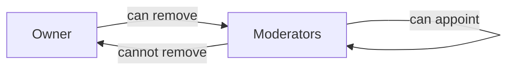

### Authority Delegation

The owner SHALL retain ultimate authority over all community management.

Moderators SHALL not have authority over other moderators.

Moderators SHALL not have authority over the owner.

All moderators SHALL have equal authority within their moderation scope.

### Community Visibility Rules

### Public Visibility

THE system SHALL make all community information visible to all users.

THE system SHALL allow guests to view community names.

THE system SHALL allow guests to view community descriptions.

THE system SHALL allow guests to view community icons.

THE system SHALL allow guests to view subscriber counts.

### Content Visibility

THE system SHALL allow guests to view posts within any community.

THE system SHALL allow guests to view comments within any community.

THE system SHALL allow guests to search for communities.

### Subscription Independence

THE system SHALL not require subscription to view community content.

IF a user is not subscribed, THE system SHALL still allow viewing the community.

IF a user is banned from a community, THE system SHALL still allow viewing the community content.

## Post Actions

Users create posts within communities they are subscribed to, starting by selecting the target community for their content. Every post requires a title, and the user must choose one of three content types: text, link, or image. Text posts contain written content that users compose directly in the platform. Link posts require a valid URL that points to external content the user wishes to share. Image posts allow users to upload and attach a picture to their post. Users can edit their own posts after creation, modifying the title or content as needed. Post deletion removes the content entirely, making it inaccessible to all users. The home feed displays posts exclusively from communities the logged-in user has subscribed to. The popular feed shows posts from all communities across the platform, available to all users including those not logged in. Community feeds present posts from a single specific community, visible to everyone regardless of subscription status. All feeds support pagination to handle large volumes of content efficiently. Post list views show condensed information including title, author, community, score, comment count, and time elapsed since posting.

### Post Creation Requirements

### Prerequisites

WHEN a user attempts to create a post, THE system SHALL verify the user is logged in as a member.

WHEN a user attempts to create a post, THE system SHALL verify the user is subscribed to the target community.

IF the user is not subscribed to the community, THE system SHALL reject the post creation request.

### Title Requirements

WHEN a user creates a post, THE system SHALL require a title.

IF the title is empty or missing, THE system SHALL reject the post creation request.

### Community Selection

WHEN a user initiates post creation, THE system SHALL allow the user to select a community from their subscribed communities.

WHEN a user creates a post, THE system SHALL associate the post with the selected community.

### Content Type Selection

WHEN a user creates a post, THE system SHALL require the user to select one of three content types: text, link, or image.

IF no content type is selected, THE system SHALL reject the post creation request.

THE system SHALL allow exactly one content type per post.

### Author Assignment

WHEN a post is successfully created, THE system SHALL record the creating user as the author.

WHEN a post is created, THE system SHALL record the timestamp of creation.

### Initial Score

WHEN a post is created, THE system SHALL initialize the vote score to zero.

WHEN a post is created, THE system SHALL initialize the comment count to zero.

### Text Post Composition

### Content Requirements

WHEN a user creates a text post, THE system SHALL allow the user to enter written content.

WHEN a text post is submitted, THE system SHALL store the text content associated with the post.

THE system SHALL preserve the original formatting of text content as entered by the user.

### Text Post Display

WHEN a text post is viewed in a feed list, THE system SHALL display the first 200 characters of the content as a preview.

IF the text content is shorter than 200 characters, THE system SHALL display the entire content as the preview.

### Validation

IF a text post is submitted without content, THE system SHALL accept the post with empty content.

THE system SHALL allow text posts with empty content but non-empty title.

### Link Post URL Entry

### URL Requirements

WHEN a user creates a link post, THE system SHALL require a valid URL.

IF the URL field is empty, THE system SHALL reject the post creation request.

IF the URL is not in a valid format, THE system SHALL reject the post creation request.

### URL Display

WHEN a link post is viewed in a feed list, THE system SHALL display the domain name extracted from the URL.

THE system SHALL parse the URL to extract and display the domain name.

### Link Behavior

WHEN a user views a link post detail page, THE system SHALL display the full URL.

THE system SHALL not automatically redirect users to the linked URL.

### Image Post Upload

### Image Upload Process

WHEN a user creates an image post, THE system SHALL allow the user to upload an image file.

IF no image is uploaded for an image post, THE system SHALL reject the post creation request.

### Thumbnail Generation

WHEN an image post is created, THE system SHALL generate a thumbnail of the uploaded image.

WHEN an image post is viewed in a feed list, THE system SHALL display the generated thumbnail.

### Image Storage

WHEN an image is uploaded, THE system SHALL store the image and associate it with the post.

THE system SHALL support common image formats for upload.

### Preview Display

WHEN a user views an image post detail page, THE system SHALL display the full-size image.

### Post Editing Permissions

### Edit Authorization

WHEN a user attempts to edit a post, THE system SHALL verify the user is the author of the post.

IF the user is not the author of the post, THE system SHALL reject the edit request.

### Editable Content

WHEN a user edits their own post, THE system SHALL allow modification of the title.

WHEN a user edits their own text post, THE system SHALL allow modification of the text content.

WHEN a user edits their own link post, THE system SHALL allow modification of the URL.

WHEN a user edits their own image post, THE system SHALL allow replacement of the image.

### Edit Restrictions

WHEN a user edits a post, THE system SHALL not allow changing the post type (text, link, or image).

WHEN a user edits a post, THE system SHALL not allow changing the community association.

### Edit Timestamp

WHEN a post is successfully edited, THE system SHALL record the timestamp of the last modification.

WHEN a post has been edited, THE system SHALL display an indicator that the post has been modified.

### Post Deletion Workflow

### Delete Authorization

WHEN a user attempts to delete a post, THE system SHALL verify the user is the author of the post.

IF the user is not the author of the post, THE system SHALL reject the deletion request.

### Deletion Effects

WHEN a post is deleted, THE system SHALL remove the post and make it inaccessible to all users.

WHEN a post is deleted, THE system SHALL delete all comments associated with the post.

WHEN a post is deleted, THE system SHALL delete all votes associated with the post.

WHEN a post is deleted, THE system SHALL remove it from all feeds.

### Karma Impact

WHEN a post is deleted, THE system SHALL adjust the author's karma by removing the contribution from deleted upvotes and downvotes.

### User Confirmation

WHEN a user requests to delete a post, THE system SHALL require confirmation before proceeding with deletion.

### Home Feed Filtering

### Home Feed Scope

WHEN a member views the home feed, THE system SHALL display posts exclusively from communities the user is subscribed to.

IF the user is not logged in, THE system SHALL not provide access to the home feed.

### Home Feed Exclusivity

WHEN the home feed is generated, THE system SHALL exclude posts from communities the user is not subscribed to.

IF the user is not subscribed to any communities, THE system SHALL display an empty home feed with appropriate guidance.

### Home Feed Availability

THE home feed SHALL be available only to logged-in members.

Guest users SHALL not have access to the home feed.

### Popular Feed Access

### Popular Feed Scope

WHEN the popular feed is viewed, THE system SHALL display posts from all communities across the platform.

THE popular feed SHALL be available to all users including guests who are not logged in.

### Popular Feed Content

WHEN the popular feed is generated, THE system SHALL include posts from all communities regardless of subscription status.

THE system SHALL not filter the popular feed based on user subscriptions.

### Guest Access

WHEN a guest views the popular feed, THE system SHALL display the same content as logged-in users see.

THE system SHALL provide full popular feed access without requiring authentication.

### Community Feed Display

### Community Feed Scope

WHEN a user views a community feed, THE system SHALL display posts from the specified community only.

THE community feed SHALL be available to all users including guests.

### Community Feed Content

WHEN the community feed is generated, THE system SHALL include all posts from the specified community.

THE system SHALL not require subscription to view a community's feed.

### Non-Existent Community

IF the specified community does not exist, THE system SHALL display an appropriate error message.

### Community Identification

WHEN a community feed is requested, THE system SHALL identify the community by its unique name.

### Feed Sorting Options

### Hot Sorting

WHEN a user selects Hot sorting, THE system SHALL display posts ordered by recent activity combined with upvote count, showing posts with many recent upvotes first.

### New Sorting

WHEN a user selects New sorting, THE system SHALL display posts ordered by creation timestamp, showing the most recently created posts first.

### Top Sorting

WHEN a user selects Top sorting, THE system SHALL display posts ordered by vote score, showing posts with the highest scores first.

WHEN Top sorting is selected, THE system SHALL allow filtering by time period: today, this week, this month, this year, or all time.

### Controversial Sorting

WHEN a user selects Controversial sorting, THE system SHALL display posts with many total votes but scores close to zero first.

THE system SHALL calculate controversy based on high vote count combined with similar upvote and downvote counts.

### Default Sorting

THE system SHALL provide Hot as the default sorting option for all feeds.

### Post List Information

### Required Display Elements

WHEN a post appears in any feed list, THE system SHALL display the post title.

WHEN a post appears in any feed list, THE system SHALL display the author username.

WHEN a post appears in any feed list, THE system SHALL display the community name.

WHEN a post appears in any feed list, THE system SHALL display the vote score.

WHEN a post appears in any feed list, THE system SHALL display the comment count.

WHEN a post appears in any feed list, THE system SHALL display the time elapsed since posting.

### Time Display Format

WHEN displaying time elapsed, THE system SHALL present the time in a human-readable format such as "3 hours ago" or "2 days ago".

### Content Preview

WHEN a text post appears in a feed list, THE system SHALL display the first 200 characters of the text content as a preview.

WHEN a link post appears in a feed list, THE system SHALL display the domain name extracted from the URL.

WHEN an image post appears in a feed list, THE system SHALL display a thumbnail of the image.

### Pagination Implementation

### Pagination Support

THE system SHALL provide pagination for all feeds: home feed, popular feed, and community feeds.

WHEN a user reaches the end of a feed page, THE system SHALL provide navigation to the next page of posts.

### Page Size

THE system SHALL display a consistent number of posts per page across all feeds.

### Pagination State

WHEN a user navigates between feed pages, THE system SHALL maintain the selected sorting option.

WHEN a user navigates between feed pages, THE system SHALL maintain the selected time filter for Top sorting.

### Pagination and Filtering

WHEN a user applies a sorting option, THE system SHALL apply the sorting before paginating the results.

### Empty Results

IF no posts match the feed criteria, THE system SHALL display an appropriate empty state message.

### Post Content Preview

### Text Post Preview

WHEN a text post is displayed in a feed list, THE system SHALL show the first 200 characters of the content.

IF the text content exceeds 200 characters, THE system SHALL truncate the preview and may indicate continuation.

IF the text content is 200 characters or fewer, THE system SHALL display the full content as the preview.

### Link Post Preview

WHEN a link post is displayed in a feed list, THE system SHALL show the domain name extracted from the URL.

THE system SHALL parse the URL to extract the domain component.

### Image Post Preview

WHEN an image post is displayed in a feed list, THE system SHALL show a generated thumbnail of the image.

THE system SHALL display thumbnails at a consistent size appropriate for the feed list layout.

### Thumbnail Display Rules

### Thumbnail Generation

WHEN an image post is created, THE system SHALL generate a thumbnail version of the uploaded image.

THE system SHALL maintain the aspect ratio of the original image when generating thumbnails.

### Thumbnail in Feed Lists

WHEN an image post appears in any feed list, THE system SHALL display the generated thumbnail.

THE system SHALL display the thumbnail in a consistent size across all feed types.

### Thumbnail for Non-Image Posts

Text posts and link posts SHALL not display thumbnails in feed lists.

### Thumbnail Click Behavior

WHEN a user clicks on a post with a thumbnail, THE system SHALL navigate to the post detail page.

THE thumbnail SHALL not link directly to the full-size image.

### Post Detail View

### Post Detail Content

WHEN a user views a single post detail page, THE system SHALL display the complete title.

WHEN a user views a single post detail page, THE system SHALL display the full content (text, link URL, or full image).

WHEN a user views a single post detail page, THE system SHALL display the author username.

WHEN a user views a single post detail page, THE system SHALL display the community name.

WHEN a user views a single post detail page, THE system SHALL display the current vote score.

WHEN a user views a single post detail page, THE system SHALL display the total comment count.

WHEN a user views a single post detail page, THE system SHALL display the timestamp when the post was created.

### Post Detail Access

THE system SHALL allow any user including guests to view a post detail page.

The system SHALL not require subscription to the post's community to view the post detail.

## Comment Actions

Users write comments on any post to share their thoughts or engage in discussion. Comments support unlimited nesting, allowing users to reply to existing comments at any depth level. The reply chain creates threaded conversations where each comment can spawn additional replies. Users edit their own comments to correct mistakes or update their thoughts after posting. Comment deletion removes the content permanently from the discussion thread. Each comment displays the author's username, the comment text, its vote score, and the time elapsed since creation. Nested replies appear indented beneath their parent comments, creating a clear visual hierarchy of the conversation. Comment sorting options help users navigate large discussion threads efficiently. The 'Best' sort shows comments with highest vote scores first. The 'New' sort displays most recent comments at the top. The 'Controversial' sort highlights comments with many votes but scores near zero, indicating divisive discussions.

### Comment Creation Workflow

WHEN a user creates a comment on a post, THE system SHALL:
1. Require the user to be logged in as a member
2. Require the user to not be banned from the community
3. Require the post to exist and not be deleted
4. Require non-empty comment content
5. Associate the comment with the post
6. Associate the comment with the author
7. Set the initial vote score to zero
8. Record the creation timestamp

IF the user is not logged in, THE system SHALL reject the comment creation.

IF the user is banned from the community, THE system SHALL reject the comment creation.

IF the post has been deleted, THE system SHALL reject the comment creation.

IF the comment content is empty, THE system SHALL reject the comment creation.

### Nested Reply Structure

WHEN a user creates a reply to an existing comment, THE system SHALL:
1. Allow replies at any depth level without limit
2. Associate the reply with its parent comment
3. Associate the reply with the same post as the parent comment
4. Maintain the reply chain hierarchy
5. Display replies indented beneath their parent comment

THE system SHALL support unlimited nesting depth for comment replies.

THE system SHALL preserve the parent-child relationship between comments.

THE system SHALL allow a comment to have multiple replies.

THE system SHALL allow the same user to reply to multiple comments in the same thread.

### Threaded Conversation Display

THE system SHALL display comments in a threaded hierarchical structure.

WHEN displaying a comment thread, THE system SHALL:
1. Show parent comments at the top level
2. Show replies indented beneath their parent comments
3. Show nested replies with additional indentation based on depth
4. Maintain visual hierarchy representing the reply chain
5. Display the full reply chain from original comment to deepest reply

THE system SHALL preserve the chronological or sorted order within each reply level.

THE system SHALL indicate when a comment has replies.

THE system SHALL allow users to collapse or expand reply threads.

THE system SHALL display the total number of replies for each comment.

### Comment Editing Permissions

WHEN a user attempts to edit a comment, THE system SHALL:
1. Verify the user is logged in as a member
2. Verify the user is the author of the comment
3. Allow editing of the comment content
4. Preserve the comment's existing associations and metadata
5. Update the modification timestamp

IF the user is not the author of the comment, THE system SHALL reject the edit request.

IF the comment has been deleted, THE system SHALL reject the edit request.

THE system SHALL allow the author to edit their comment unlimited times.

THE system SHALL maintain the edit history visibility indicating a comment was edited.

### Comment Deletion Process

WHEN a user deletes their own comment, THE system SHALL:
1. Verify the user is the author of the comment
2. Remove the comment content permanently
3. Remove all votes associated with the comment
4. Adjust the author's karma by removing the votes from the deleted comment
5. Preserve the comment position if it has replies

IF the deleted comment has replies, THE system SHALL:
1. Maintain the reply chain structure
2. Mark the parent comment as deleted
3. Continue displaying nested replies beneath the deleted comment marker

IF the user is not the author of the comment, THE system SHALL reject the deletion request.

THE system SHALL allow moderators to delete any comment in their community.

### Comment Author Display

WHEN displaying a comment, THE system SHALL:
1. Show the author's username
2. Show the author's display name if set
3. Link to the author's profile page
4. Distinguish the comment author from other users

IF the comment author has been deleted, THE system SHALL display a placeholder indicating the author no longer exists.

THE system SHALL display the same author information consistently across all comments by the same user.

THE system SHALL allow users to click the author's username to view their profile.

THE system SHALL display author information prominently at the top of each comment.

### Comment Score Visibility

THE system SHALL display the vote score for each comment.

THE system SHALL calculate the score as total upvotes minus total downvotes.

THE system SHALL allow scores to be negative.

WHEN displaying a comment, THE system SHALL:
1. Show the current vote score prominently
2. Show the upvote count separately if expanded
3. Show the downvote count separately if expanded
4. Update the score in real-time as votes are cast

IF the user has voted on the comment, THE system SHALL indicate their vote direction.

THE system SHALL display the score in a format indicating positive or negative values.

### Time Elapsed Formatting

THE system SHALL display the time elapsed since comment creation for each comment.

WHEN formatting time elapsed, THE system SHALL:
1. Show minutes ago for comments less than 1 hour old
2. Show hours ago for comments less than 24 hours old
3. Show days ago for comments less than 7 days old
4. Show weeks ago for comments less than 4 weeks old
5. Show the full date for comments older than 4 weeks

THE system SHALL use the viewing user's timezone for time calculations.

THE system SHALL update the elapsed time display as time passes.

IF a comment has been edited, THE system SHALL indicate that it was edited.

THE system SHALL display creation time and edit time distinctly when applicable.

### Reply Depth Handling

THE system SHALL support unlimited depth for nested comment replies.

WHEN displaying deeply nested replies, THE system SHALL:
1. Continue displaying replies at any depth level
2. Maintain consistent visual hierarchy for all depth levels
3. Allow navigation to parent comments at any level
4. Maintain reply threading integrity regardless of depth

THE system SHALL NOT impose a maximum depth limit on comment replies.

THE system SHALL preserve the complete reply chain from root comment to deepest reply.

THE system SHALL handle deep reply chains without performance degradation.

THE system SHALL allow users to reply to comments at any depth level.

### Comment Sorting Options

THE system SHALL provide multiple sorting options for comments within a post.

WHEN a user views comments on a post, THE system SHALL allow sorting by:
1. Best - highest vote score first
2. New - most recent comments first
3. Controversial - many votes but score near zero

THE system SHALL remember the user's last selected sort preference.

THE system SHALL apply the selected sort to all comment threads within the post.

THE system SHALL apply sorting within each reply level independently.

THE system SHALL maintain sort order when new comments are added.

THE system SHALL allow users to change the sort method at any time.

THE system SHALL preserve the sort selection for the current browsing session.

### Best Sort Algorithm

WHEN a user selects 'Best' sort for comments, THE system SHALL:
1. Order comments by vote score from highest to lowest
2. Apply this ordering to all comment threads within the post
3. Recalculate ordering when vote scores change
4. Handle tied scores by creation time

THE system SHALL display comments with higher scores before comments with lower scores.

IF two comments have the same score, THE system SHALL display the older comment first.

THE system SHALL apply Best sort to nested replies at each level.

THE system SHALL update the sort order when votes are cast or removed.

### New Sort Ordering

WHEN a user selects 'New' sort for comments, THE system SHALL:
1. Order comments by creation timestamp from most recent to oldest
2. Apply this ordering to all comment threads within the post
3. Handle replies within each parent comment by creation time

THE system SHALL display the most recently created comments first.

THE system SHALL apply New sort to each level of nested replies.

THE system SHALL maintain chronological ordering within reply threads.

THE system SHALL update the display when new comments are added.

THE system SHALL treat edited comments as their original creation time for sorting purposes.

### Controversial Sort Criteria

WHEN a user selects 'Controversial' sort for comments, THE system SHALL:
1. Identify comments with high total votes but scores near zero
2. Calculate a controversial score based on vote distribution
3. Order comments by controversial score from highest to lowest
4. Prioritize comments with more total engagement

THE system SHALL define controversial comments as those with:
1. Many total votes (upvotes plus downvotes)
2. Vote score close to zero (similar upvote and downvote counts)

THE system SHALL apply Controversial sort to each level of nested replies.

THE system SHALL recalculate controversial ordering as votes change.

THE system SHALL display comments that spark the most divided opinions first.

THE system SHALL handle comments with zero score based on total vote count.

## Vote Actions

Users upvote posts and comments to express approval, adding one point to the content's vote score. Users downvote posts and comments to express disapproval, subtracting one point from the score. Each user can cast only one vote per piece of content, ensuring voting fairness. Users may change their vote at any time, switching from upvote to downvote or vice versa. The voting workflow handles vote changes by removing the previous vote effect before applying the new one. Users can remove their vote entirely, leaving no vote on the content and adjusting the score accordingly. The vote score for any content equals the total number of upvotes minus the total number of downvotes. Voting contributes to user karma scores, increasing the author's karma on upvotes and decreasing it on downvotes. Removing a vote reverses its karma effect on the content author. Both posts and comments follow identical voting rules and mechanics. Users cannot vote on their own content, preventing karma manipulation through self-voting.

### Upvote Workflow

WHEN a user upvotes a post or comment, THE system SHALL record the upvote with the user's identity and the content reference.

WHEN an upvote is recorded, THE system SHALL increment the content's vote score by 1.

WHEN an upvote is recorded, THE system SHALL increase the content author's karma by 1.

IF the user has no existing vote on the content, THE system SHALL create a new vote record with upvote type.

IF the user has an existing downvote on the content, THE system SHALL change the vote type to upvote and adjust the score by 2 (removing the -1 from downvote and adding +1 for upvote).

IF the user has an existing upvote on the content, THE system SHALL reject the duplicate upvote request.

WHEN an upvote is successfully recorded, THE system SHALL mark the user's vote state as "upvoted" for that content.

IF the content has been deleted, THE system SHALL reject the upvote request.

IF the user is the author of the content, THE system SHALL reject the upvote request to prevent self-voting.

### Downvote Workflow

WHEN a user downvotes a post or comment, THE system SHALL record the downvote with the user's identity and the content reference.

WHEN a downvote is recorded, THE system SHALL decrement the content's vote score by 1.

WHEN a downvote is recorded, THE system SHALL decrease the content author's karma by 1.

IF the user has no existing vote on the content, THE system SHALL create a new vote record with downvote type.

IF the user has an existing upvote on the content, THE system SHALL change the vote type to downvote and adjust the score by -2 (removing the +1 from upvote and adding -1 for downvote).

IF the user has an existing downvote on the content, THE system SHALL reject the duplicate downvote request.

WHEN a downvote is successfully recorded, THE system SHALL mark the user's vote state as "downvoted" for that content.

IF the content has been deleted, THE system SHALL reject the downvote request.

IF the user is the author of the content, THE system SHALL reject the downvote request to prevent self-voting.

### Single Vote Per Content Enforcement

THE system SHALL enforce a one-vote-per-user-per-content constraint for all posts and comments.

WHEN a user attempts to cast a second vote on content they have already voted on, THE system SHALL process this as a vote change operation rather than creating a duplicate vote.

IF a user has an existing vote on a post, THE system SHALL NOT allow creating a new vote record for that same post by the same user.

IF a user has an existing vote on a comment, THE system SHALL NOT allow creating a new vote record for that same comment by the same user.

WHEN checking vote eligibility, THE system SHALL verify that no existing vote record exists for the user-content combination.

THE system SHALL ensure vote uniqueness by maintaining a unique constraint on the user-content pair for all votes.

### Vote Change Process

WHEN a user changes their vote from upvote to downvote, THE system SHALL remove the +1 effect of the upvote and apply the -1 effect of the downvote.

WHEN a user changes their vote from downvote to upvote, THE system SHALL remove the -1 effect of the downvote and apply the +1 effect of the upvote.

WHEN a vote is changed, THE system SHALL update the existing vote record with the new vote type and timestamp.

WHEN a vote is changed from upvote to downvote, THE system SHALL decrease the author's karma by 2 (removing the +1 from the previous upvote and adding the -1 from the new downvote).

WHEN a vote is changed from downvote to upvote, THE system SHALL increase the author's karma by 2 (removing the -1 from the previous downvote and adding the +1 from the new upvote).

THE system SHALL update the content's vote score atomically during the vote change operation.

THE system SHALL NOT create separate vote records when a vote is changed, but SHALL update the existing record.

WHEN a vote change is completed, THE system SHALL update the user's vote state to reflect the new vote type.

### Vote Removal Action

WHEN a user removes their vote from a post or comment, THE system SHALL delete the vote record and clear the user's vote state for that content.

WHEN an upvote is removed, THE system SHALL decrease the content's vote score by 1.

WHEN a downvote is removed, THE system SHALL increase the content's vote score by 1.

WHEN an upvote is removed, THE system SHALL decrease the content author's karma by 1.

WHEN a downvote is removed, THE system SHALL increase the content author's karma by 1.

IF the user has no existing vote on the content, THE system SHALL reject the vote removal request.

WHEN a vote is successfully removed, THE system SHALL mark the user's vote state as "none" for that content.

THE system SHALL allow users to remove their vote and subsequently cast a new vote on the same content.

WHEN a vote is removed, THE system SHALL NOT retain any record of the previous vote type.

### Vote Score Calculation

THE system SHALL calculate the vote score for each post as the total number of upvotes minus the total number of downvotes.

THE system SHALL calculate the vote score for each comment as the total number of upvotes minus the total number of downvotes.

WHEN displaying a vote score, THE system SHALL show the net result which may be positive, zero, or negative.

IF the number of downvotes exceeds the number of upvotes, THE system SHALL display the vote score as a negative number.

THE system SHALL update the vote score in real-time whenever a vote is added, changed, or removed.

THE system SHALL maintain vote score consistency across all operations affecting votes.

WHEN calculating vote scores, THE system SHALL only count votes from users who have not deleted their accounts.

THE system SHALL NOT allow vote scores to affect content visibility beyond sorting algorithms (as defined in the Post Feeds requirements).

### Karma Impact from Votes

WHEN a post or comment receives an upvote, THE system SHALL increase the content author's karma by 1.

WHEN a post or comment receives a downvote, THE system SHALL decrease the content author's karma by 1.

WHEN an upvote is removed from content, THE system SHALL decrease the author's karma by 1.

WHEN a downvote is removed from content, THE system SHALL increase the author's karma by 1.

THE system SHALL maintain a single karma score per user representing the aggregate of all votes received on their posts and comments.

THE system SHALL allow user karma to be negative when total downvotes exceed total upvotes received.

WHEN a vote is changed from upvote to downvote, THE system SHALL decrease the author's karma by 2.

WHEN a vote is changed from downvote to upvote, THE system SHALL increase the author's karma by 2.

IF a user deletes their account, THE system SHALL NOT retroactively adjust other users' karma scores for votes that user had cast.

IF a post or comment is deleted, THE system SHALL remove the karma contribution from that content from the author's total karma.

### Post Voting Rules

THE system SHALL allow any logged-in user to vote on posts in any community.

THE system SHALL NOT require community subscription for voting on posts.

THE system SHALL NOT allow guests to vote on posts.

THE system SHALL NOT allow users to vote on their own posts.

THE system SHALL allow voting on posts regardless of the user's ban status in the community.

WHEN a user votes on a post, THE system SHALL apply all vote rules (single vote, karma impact, score update) consistently.

IF a post is deleted, THE system SHALL NOT allow new votes on that post.

THE system SHALL maintain the vote score of a deleted post for historical accuracy if the post is soft-deleted.

THE system SHALL allow users to view vote counts on posts even if they cannot vote (e.g., guests viewing popular feed).

### Comment Voting Rules

THE system SHALL allow any logged-in user to vote on comments in any community.

THE system SHALL NOT require community subscription for voting on comments.

THE system SHALL NOT allow guests to vote on comments.

THE system SHALL NOT allow users to vote on their own comments.

THE system SHALL allow voting on comments regardless of the user's ban status in the community.

WHEN a user votes on a comment, THE system SHALL apply all vote rules (single vote, karma impact, score update) consistently.

IF a comment is deleted, THE system SHALL NOT allow new votes on that comment.

THE system SHALL maintain the vote score of a deleted comment for historical accuracy if the comment is soft-deleted.

THE system SHALL apply the same voting mechanics to top-level comments and nested replies.

THE system SHALL display vote scores on comments alongside their content and author information.

### Self-Voting Prevention

THE system SHALL NOT allow users to upvote their own posts.

THE system SHALL NOT allow users to downvote their own posts.

THE system SHALL NOT allow users to upvote their own comments.

THE system SHALL NOT allow users to downvote their own comments.

WHEN a user attempts to vote on their own content, THE system SHALL reject the request and return an error indicating self-voting is not permitted.

THE system SHALL identify self-voting attempts by comparing the voting user's identity with the content author's identity.

IF a user's account is deleted, THE system SHALL preserve votes received from other users on that user's content.

THE system SHALL NOT allow any workaround for self-voting through account manipulation or vote timing.

THE system SHALL apply self-voting prevention equally to posts and comments across all communities.

### Vote State Management

THE system SHALL maintain a vote state for each user-content pair, tracking whether the user has upvoted, downvoted, or has no vote on the content.

WHEN a user views content they have voted on, THE system SHALL display the content with visual indication of their current vote state.

THE system SHALL track three possible vote states per user per content: "upvoted", "downvoted", and "none".

WHEN a user votes on content for the first time, THE system SHALL transition their vote state from "none" to either "upvoted" or "downvoted".

WHEN a user changes their vote, THE system SHALL transition their vote state from "upvoted" to "downvoted" or vice versa.

WHEN a user removes their vote, THE system SHALL transition their vote state to "none".

THE system SHALL persist vote state records to enable users to see their voting history on content.

THE system SHALL update vote state atomically with vote score and karma changes to maintain consistency.

WHEN a user's vote state changes, THE system SHALL reflect this change in subsequent content views without requiring page refresh.

## Subscription Actions

Users subscribe to communities to join and express interest in their content. Subscribing to a community is required before a user can create posts within that community. The subscription workflow connects the user to the community, adding them to the subscriber count. Users unsubscribe from communities when they no longer wish to see content from that group in their home feed. Unsubscribing removes the user from the community's subscriber list and decreases the subscriber count. Users view a list of all communities they are currently subscribed to through their subscription management area. The home feed exclusively displays posts from subscribed communities, making subscription central to content discovery. Subscribing does not grant moderation privileges, only the ability to post and receive content in the home feed. Users can subscribe to any community regardless of whether they created it or not. Subscription status is visible only to the user themselves, not publicly displayed on their profile.

### Community Subscription Workflow

### Subscribe to Community

WHEN a logged-in user subscribes to a community, THE system SHALL:
1. Create a subscription relationship between the user and the community
2. Record the timestamp of subscription
3. Set the subscription status to active
4. Increment the community's subscriber count by 1

IF the community does not exist, THE system SHALL reject the subscription request.

IF the user is already subscribed to the community, THE system SHALL reject the duplicate subscription.

### Subscription Availability

THE system SHALL allow users to subscribe to any existing community.

THE system SHALL NOT restrict subscription based on community ownership.

THE system SHALL allow users to subscribe to communities they did not create.

### Posting Permission Requirement

### Subscription Prerequisite for Posting

WHEN a user attempts to create a post in a community, THE system SHALL verify the user is subscribed to that community.

IF the user is not subscribed to the community, THE system SHALL reject the post creation request.

THE system SHALL enforce subscription requirement for all post types (text, link, and image).

### Permission Enforcement Timing

THE system SHALL check subscription status at the time of post submission.

IF a user was subscribed at the time of post creation but later unsubscribes, THE system SHALL preserve the previously created post.

### Subscriber Count Update

### Count Increment on Subscription

WHEN a user successfully subscribes to a community, THE system SHALL increase the community's subscriber count by exactly 1.

### Count Decrement on Unsubscription

WHEN a user unsubscribes from a community, THE system SHALL decrease the community's subscriber count by exactly 1.

### Count Consistency

THE system SHALL maintain an accurate subscriber count reflecting the current number of active subscriptions.

THE system SHALL display the subscriber count on the community's information page.

IF the subscriber count would fall below zero, THE system SHALL prevent the operation and maintain the count at zero.

### Unsubscription Process

### Unsubscribe Action

WHEN a logged-in user unsubscribes from a community, THE system SHALL:
1. Set the subscription status to inactive
2. Decrease the community's subscriber count by 1
3. Remove the community's posts from the user's home feed

IF the user is not currently subscribed to the community, THE system SHALL reject the unsubscription request.

### Unsubscription Effects

WHEN a user unsubscribes from a community, THE system SHALL preserve any posts and comments the user previously created in that community.

THE system SHALL allow the unsubscribed user to continue viewing all content in that community.

THE system SHALL allow an unsubscribed user to re-subscribe to the same community at any time.

### Subscription List Viewing

### View Subscribed Communities

WHEN a logged-in user requests their subscription list, THE system SHALL display all communities to which the user is currently subscribed.

THE system SHALL display each subscribed community with:
1. Community name
2. Community icon
3. Subscriber count

### List Accessibility

THE system SHALL allow users to view only their own subscription list.

THE system SHALL NOT display a user's subscription list to other users.

### Empty Subscription List

IF a user has no active subscriptions, THE system SHALL display an empty subscription list.

### Home Feed Filtering by Subscription

### Home Feed Content Source

WHEN a logged-in user views their home feed, THE system SHALL display posts exclusively from communities to which the user is subscribed.

THE system SHALL NOT display posts from unsubscribed communities in the home feed.

### Guest User Restrictions

THE system SHALL NOT provide a home feed to guests (logged-out users).

Guests SHALL access the popular feed instead of the home feed.

### Feed Updates on Subscription Change

WHEN a user subscribes to a new community, THE system SHALL immediately include that community's posts in the user's home feed.

WHEN a user unsubscribes from a community, THE system SHALL immediately exclude that community's posts from the user's home feed.

### Subscription Privacy

### Private Subscription Status

THE system SHALL NOT publicly display a user's subscription list on their profile.

THE system SHALL NOT display which users are subscribed to a particular community.

THE system SHALL allow only the individual user to view their own subscription status.

### Subscription Visibility Scope

THE system SHALL make subscription information visible only to:
1. The subscribed user themselves
2. The system for enforcing posting permissions
3. The system for generating the home feed

THE system SHALL NOT expose subscription data to community owners or moderators.

### Multiple Community Subscription

### Multi-Community Subscription

THE system SHALL allow a user to subscribe to multiple communities simultaneously.

THE system SHALL NOT impose a maximum limit on the number of communities a user can subscribe to.

### Home Feed Aggregation

WHEN a user is subscribed to multiple communities, THE system SHALL aggregate posts from all subscribed communities into the home feed.

THE system SHALL apply the selected sorting algorithm across all posts from all subscribed communities.

### Subscription Management Area

### Access to Subscription Management

THE system SHALL provide a dedicated subscription management area accessible to logged-in users.

THE system SHALL allow users to view, subscribe, and unsubscribe from communities within this management area.

### Management Area Features

WHEN a user accesses the subscription management area, THE system SHALL provide:
1. List of all available communities with subscription status
2. Ability to subscribe to communities not currently subscribed
3. Ability to unsubscribe from currently subscribed communities
4. Search functionality to find communities by name

### Subscription Status Indication

THE system SHALL clearly indicate whether the user is currently subscribed to each community in the management area.

THE system SHALL provide immediate visual feedback when a subscription status changes.

## Report Actions

Users report posts or comments that violate community rules or platform policies by submitting a report with a required reason. The report reason must include text explaining why the content is problematic. Reports are sent to the moderators of the community where the content was posted. Moderators view all pending reports for their community through a moderation interface. Each report displays the reported content, the user who submitted the report, and the reason provided. Moderators approve a report when they determine the content violates rules, which removes the content from the platform. Approved reports result in the deletion of the reported post or comment. Moderators dismiss a report when they determine the content does not violate rules, keeping the content visible. Dismissed reports are removed from the report list and no longer appear for moderators. Multiple users can report the same content, generating separate report entries for moderator review. The report status tracks whether each report is pending, approved, or dismissed.

### Report Submission

WHEN a user reports a post or comment, THE system SHALL require the user to provide a reason explaining why the content violates community rules or platform policies.

WHEN a user submits a report, THE system SHALL capture the content being reported, the user who submitted the report, and the reason provided.

IF a user attempts to report content without providing a reason, THE system SHALL reject the report submission.

WHEN a report is submitted, THE system SHALL set the report status to pending.

WHEN a user reports content within a community, THE system SHALL associate the report with that community for moderator access.

THE system SHALL allow multiple users to report the same post or comment, creating separate report entries for each submission.

### Moderator Report Queue

WHEN a moderator accesses the report queue, THE system SHALL display all pending reports for communities where the user has moderator privileges.

WHEN a moderator views the report queue, THE system SHALL only display reports associated with communities the moderator belongs to.

THE system SHALL restrict report viewing to moderators of the community where the reported content was posted.

WHEN a moderator views the report queue, THE system SHALL organize reports by community, allowing moderators to focus on reports from their assigned communities.

### Report Content Display

WHEN a moderator views a report, THE system SHALL display the reported content including the post or comment text, title, and any associated media.

WHEN a moderator views a report, THE system SHALL display the username of the user who submitted the report.

WHEN a moderator views a report, THE system SHALL display the reason text provided by the reporter.

WHEN a moderator views a report, THE system SHALL display the date and time the report was submitted.

WHEN a moderator views a report about a post, THE system SHALL display the post title, content, author, and community.

WHEN a moderator views a report about a comment, THE system SHALL display the comment content, author, associated post, and community.

### Report Approval Action

WHEN a moderator approves a report, THE system SHALL change the report status from pending to approved.

WHEN a moderator approves a report on a post, THE system SHALL delete the post from the platform.

WHEN a moderator approves a report on a comment, THE system SHALL delete the comment from the platform.

WHEN content is deleted due to an approved report, THE system SHALL remove the content from all feeds and community listings.

IF a moderator attempts to approve a report for content that has already been deleted, THE system SHALL update the report status and notify the moderator.

WHEN a report is approved, THE system SHALL retain the report record with the approved status for audit purposes.

### Report Dismissal Action

WHEN a moderator dismisses a report, THE system SHALL change the report status from pending to dismissed.

WHEN a moderator dismisses a report, THE system SHALL keep the reported content visible and available on the platform.

WHEN a moderator dismisses a report, THE system SHALL remove the report from the pending report queue.

THE system SHALL NOT notify the reporter when their report is dismissed.

WHEN a report is dismissed, THE system SHALL retain the report record with the dismissed status for audit purposes.

### Report Status Tracking

THE system SHALL track the status of each report as pending, approved, or dismissed.

WHEN a report is created, THE system SHALL initialize its status as pending.

THE system SHALL allow moderators to view the current status of all reports in their community.

WHEN the same content has multiple reports, THE system SHALL track each report independently with its own status.

IF one report on content is approved and the content is deleted, THE system SHALL mark other pending reports on the same content as no longer applicable.

WHEN a moderator takes action on a report, THE system SHALL record the moderator who took the action and the timestamp.

THE system SHALL maintain a history of all report status changes for audit and accountability purposes.

## Ban Actions

Moderators ban users from their community to prevent problematic individuals from creating posts and comments. The ban workflow adds the user to the community's banned users list, restricting their ability to contribute. Banned users cannot create posts or comments within the community where they are banned. Banned users retain the ability to view content within the community, only losing creation privileges. Moderators unbans users to restore their posting and commenting permissions within the community. The unban workflow removes the user from the banned list, allowing full participation again. Moderators view the complete list of banned users for their community to manage restrictions. Each ban record includes the timestamp when the ban was applied. The ban affects only a specific community, not the user's platform-wide access. A user banned from one community can still participate normally in other communities. Multiple moderators can manage bans within the same community. The community owner has final authority over ban decisions and can override moderator decisions.

### User Ban Creation

### Ban Request

WHEN a moderator submits a ban request, THE system SHALL require the following information:
1. The user to be banned
2. The community from which the user will be banned
3. A reason for the ban

### Ban Authorization

IF the moderator does not have moderation privileges for the community, THE system SHALL reject the ban request.

WHEN a moderator attempts to ban the community owner, THE system SHALL reject the request.

IF a moderator attempts to ban another moderator of the same community, THE system SHALL reject the request.

### Ban Execution

WHEN the ban request is authorized, THE system SHALL add the user to the community's banned users list.

WHEN the ban is created, THE system SHALL record the timestamp of the ban action.

WHEN the ban is created, THE system SHALL store the reason provided by the moderator.

WHEN the ban is created, THE system SHALL record which moderator created the ban.

WHEN the ban is successfully created, THE system SHALL prevent the banned user from creating new posts in that community.

WHEN the ban is successfully created, THE system SHALL prevent the banned user from creating new comments in that community.

### Ban Confirmation

WHEN a ban is successfully created, THE system SHALL notify the moderator who created the ban.

THE system SHALL NOT notify the banned user of the ban action.

### Posting Restriction Enforcement

### Post Creation Check

WHEN a user attempts to create a post in a community, THE system SHALL check if the user is banned from that community.

IF the user is banned from the community, THE system SHALL reject the post creation request.

WHEN rejecting a post from a banned user, THE system SHALL indicate that the user is banned from the community.

### Existing Posts

WHEN a user is banned from a community, THE system SHALL NOT delete or modify the user's existing posts in that community.

THE system SHALL retain all posts created by the user prior to the ban.

### Ban Scope for Posts

THE system SHALL enforce the posting restriction only for the specific community from which the user is banned.

WHEN a banned user attempts to create a post in a different community where they are not banned, THE system SHALL allow the post creation.

### Ban State Check

WHEN displaying the post creation interface for a community, THE system SHALL check the user's ban status for that community.

IF the user is banned, THE system SHALL disable or hide the post creation option for that community.

### Commenting Restriction Enforcement

### Comment Creation Check

WHEN a user attempts to create a comment in a community, THE system SHALL check if the user is banned from that community.

IF the user is banned from the community, THE system SHALL reject the comment creation request.

WHEN rejecting a comment from a banned user, THE system SHALL indicate that the user is banned from the community.

### Reply Restriction

WHEN a banned user attempts to reply to any comment in the community, THE system SHALL reject the reply request.

THE system SHALL apply the commenting restriction to all levels of nested replies within the banned community.

### Existing Comments

WHEN a user is banned from a community, THE system SHALL NOT delete or modify the user's existing comments in that community.

THE system SHALL retain all comments created by the user prior to the ban.

### Ban Scope for Comments

THE system SHALL enforce the commenting restriction only for the specific community from which the user is banned.

WHEN a banned user attempts to comment in a different community where they are not banned, THE system SHALL allow the comment creation.

### Content Viewing Allowance

### View Access Preservation

WHEN a user is banned from a community, THE system SHALL allow the user to view all posts in that community.

WHEN a user is banned from a community, THE system SHALL allow the user to view all comments in that community.

THE system SHALL NOT restrict read access for banned users.

### Feed Access

WHEN a banned user views the community feed for a community they are banned from, THE system SHALL display all posts normally.

WHEN a banned user views the popular feed, THE system SHALL include posts from the community where they are banned.

WHEN a banned user views their home feed, THE system SHALL include posts from the banned community if they remain subscribed.

### Post Detail Access

WHEN a banned user accesses a specific post in the banned community, THE system SHALL display the full post content.

WHEN a banned user accesses comments on a post in the banned community, THE system SHALL display all comments normally.

### Interaction Restrictions

WHEN a banned user views content in the banned community, THE system SHALL prevent the user from upvoting or downvoting that content.

WHEN a banned user views content in the banned community, THE system SHALL prevent the user from reporting that content.

THE system SHALL clearly indicate which actions are unavailable to the banned user while viewing content.

### Unban Process

### Unban Authorization

WHEN a moderator submits an unban request, THE system SHALL verify that the moderator has moderation privileges for the community.

IF the moderator does not have privileges for the community, THE system SHALL reject the unban request.

WHEN a moderator attempts to unban a user who is not currently banned, THE system SHALL reject the request with an appropriate indication.

### Unban Execution

WHEN the unban request is authorized, THE system SHALL remove the user from the community's banned users list.

WHEN the unban is processed, THE system SHALL record the timestamp of the unban action.

WHEN the unban is processed, THE system SHALL record which moderator performed the unban.

### Access Restoration

WHEN the unban is successfully processed, THE system SHALL restore the user's ability to create posts in the community.

WHEN the unban is successfully processed, THE system SHALL restore the user's ability to create comments in the community.

THE system SHALL restore posting and commenting privileges immediately upon unban.

### Unban Confirmation

WHEN an unban is successfully processed, THE system SHALL notify the moderator who performed the unban.

THE system SHALL NOT notify the unbanned user of the unban action.

### Banned Users List Viewing

### List Access Authorization

WHEN a moderator requests to view the banned users list for a community, THE system SHALL verify that the moderator has moderation privileges for that community.

IF the moderator does not have privileges for the community, THE system SHALL reject the request.

### List Content

WHEN displaying the banned users list, THE system SHALL show each banned user's username.

WHEN displaying the banned users list, THE system SHALL show the timestamp when each user was banned.

WHEN displaying the banned users list, THE system SHALL show the reason provided for each ban.

WHEN displaying the banned users list, THE system SHALL show the username of the moderator who created each ban.

### List Ordering

THE system SHALL order the banned users list by ban timestamp, showing the most recent bans first.

### List Pagination

THE system SHALL paginate the banned users list for communities with many banned users.

WHEN a moderator navigates through the banned users list, THE system SHALL load additional pages as requested.

### Search and Filter

WHEN a moderator searches the banned users list, THE system SHALL allow filtering by username.

WHEN a moderator searches the banned users list, THE system SHALL allow filtering by ban date range.

### Community-Specific Ban Scope

### Ban Isolation

THE system SHALL isolate each ban to a single community.

WHEN a user is banned from one community, THE system SHALL NOT affect the user's access to any other community.

### Multiple Community Bans

THE system SHALL allow a user to be banned from multiple communities independently.

WHEN a user is banned from one community, THE system SHALL continue to allow posting and commenting in other communities where the user is not banned.

WHEN a user is banned from multiple communities, THE system SHALL track each ban separately with its own timestamp, reason, and banning moderator.

### Cross-Community Independence

WHEN a user is banned from a community, THE system SHALL NOT remove the user's subscription to that community.

THE system SHALL maintain the user's subscription status independently from their ban status.

WHEN a user is unbanned from a community, THE system SHALL NOT automatically restore any previously removed posting or commenting capabilities, as these are restored by the unban process itself.

### Platform-Wide Access

WHEN a user is banned from any number of communities, THE system SHALL preserve the user's ability to log into their account.

WHEN a user is banned from any number of communities, THE system SHALL preserve the user's ability to create posts and comments in communities where they are not banned.

WHEN a user is banned from any number of communities, THE system SHALL preserve the user's ability to create new communities.

### Owner and Moderator Ban Authority

### Owner Ban Authority

THE community owner SHALL have the highest authority for ban decisions within their community.

WHEN the community owner attempts to ban a user, THE system SHALL allow the ban regardless of other moderators' opinions.

WHEN the community owner attempts to ban a moderator, THE system SHALL allow the ban and remove the moderator from their position.

THE community owner SHALL NOT be banned from their own community.

### Moderator Ban Authority

WHEN a moderator attempts to ban a regular community member, THE system SHALL allow the ban.

WHEN a moderator attempts to ban another moderator of the same community, THE system SHALL reject the request.

IF a moderator attempts to ban the community owner, THE system SHALL reject the request.

### Moderator Hierarchy

THE system SHALL NOT enforce a ranking hierarchy among moderators.

All moderators SHALL have equal ban authority over regular community members.

WHEN multiple moderators manage bans, THE system SHALL allow each moderator to perform independent ban and unban actions.

### Owner Override

WHEN the community owner unbans a user that a moderator banned, THE system SHALL process the unban.

WHEN the community owner bans a user that a moderator unbanned, THE system SHALL process the ban.

### Ban Record Attribution

WHEN any moderator or owner creates a ban, THE system SHALL record the identity of the specific moderator or owner who created the ban.

WHEN viewing the banned users list, THE system SHALL show which specific moderator or owner created each ban record.

# Error Scenarios and Edge Cases

Business-level error scenarios, edge case coverage, and expected system behaviors for exceptional conditions.

## User Error Scenarios

When a user attempts to register with an email address already associated with an active account, the system rejects the registration and prompts the user to log in instead. Similarly, username uniqueness is enforced at registration; if a requested username is already taken, the user must choose a different one. During login, if credentials are incorrect or the account does not exist, the system displays a generic authentication failure message without revealing which field was invalid for security reasons. Users attempting to change their password must provide their current password; if the current password is incorrect, the change is rejected. When a user deletes their account, all associated content including posts and comments is permanently removed; the system warns users about this irreversible action before proceeding. Profile updates must comply with display name length requirements and acceptable avatar image formats. Users viewing other profiles cannot modify them; access is limited to viewing public information only. If a user attempts to access a profile that does not exist, the system displays an appropriate not-found message. Karma calculations handle edge cases such as vote removal and negative scores gracefully; users can have negative karma without system restriction.

### Registration Error Scenarios

### Duplicate Email Registration

IF a user attempts to register with an email address already associated with an existing account, THE system SHALL reject the registration request.

IF the email is already registered, THE system SHALL display a message indicating that the email is already in use.

IF the email is already registered, THE system SHALL suggest the user log in instead of registering.

THE system SHALL NOT reveal whether the email exists in the system during registration attempts for security purposes when communicating error details.

### Username Already Taken

IF a user attempts to register with a username that is already taken by another user, THE system SHALL reject the registration request.

IF the username is unavailable, THE system SHALL display a message indicating that the username is already taken.

IF the username is unavailable, THE system SHALL require the user to choose a different username before proceeding.

THE system SHALL enforce username uniqueness across all registered users.

### Authentication Error Scenarios

### Invalid Login Credentials

IF a user attempts to log in with credentials that do not match any existing account, THE system SHALL reject the login attempt.

IF a user attempts to log in with an incorrect password, THE system SHALL reject the login attempt.

IF a user attempts to log in with a non-existent email address, THE system SHALL reject the login attempt.

### Authentication Failure Message

IF login credentials are invalid, THE system SHALL display a generic authentication failure message.

THE system SHALL NOT reveal which specific field (email or password) was incorrect in the error message.

THE system SHALL display the same generic error message for both incorrect password and non-existent email to prevent account enumeration.

IF authentication fails, THE system SHALL allow the user to retry logging in.

THE system SHALL NOT lock the account after failed authentication attempts.

### Password Change Error Scenarios

### Password Change Verification

IF a user attempts to change their password without providing the correct current password, THE system SHALL reject the password change request.

IF the current password verification fails, THE system SHALL display an error message indicating that the current password is incorrect.

IF the current password verification fails, THE system SHALL NOT allow the password to be changed.

THE system SHALL require the user to enter their current password before allowing a password change for security purposes.

IF the new password does not meet password requirements, THE system SHALL reject the password change request.

IF the new password is the same as the current password, THE system SHALL reject the password change request and display an appropriate message.

### Account Deletion Error Scenarios

### Account Deletion Cascade

IF a user requests account deletion, THE system SHALL warn the user that all their posts and comments will be permanently deleted.

IF a user confirms account deletion, THE system SHALL delete all posts created by that user.

IF a user confirms account deletion, THE system SHALL delete all comments written by that user.

IF a user confirms account deletion, THE system SHALL delete all votes cast by that user.

IF a user confirms account deletion, THE system SHALL remove the user from all community subscriptions.

IF a user confirms account deletion, THE system SHALL permanently delete the user account.

THE system SHALL NOT allow recovery of deleted accounts or their associated content.

IF a user attempts to access a deleted account, THE system SHALL reject the access attempt.

### Irreversible Deletion Warning

WHEN a user initiates account deletion, THE system SHALL display a warning that the action is irreversible.

THE system SHALL require explicit confirmation before proceeding with account deletion.

IF a user cancels the deletion request, THE system SHALL preserve the account and all associated content unchanged.

### Profile Access Error Scenarios

### Non-Existent User Profile

IF a user attempts to view a profile that does not exist, THE system SHALL display an appropriate not-found message.

IF a profile cannot be found, THE system SHALL NOT reveal whether the user existed previously or never existed.

IF a profile is not found, THE system SHALL return the user to the previous page or a default landing page.

### Profile Edit Restrictions

IF a user attempts to edit another user's profile, THE system SHALL reject the edit request.

IF a user attempts to modify another user's display name, THE system SHALL reject the modification.

IF a user attempts to modify another user's bio, THE system SHALL reject the modification.

IF a user attempts to modify another user's avatar, THE system SHALL reject the modification.

### Self-Profile Access Only

THE system SHALL allow users to edit only their own profile information.

IF a user attempts to access profile editing functionality for another user, THE system SHALL deny access and display an error message.

WHEN viewing another user's profile, THE system SHALL display only public information including display name, bio, avatar, karma score, posts, and comments.

WHEN viewing another user's profile, THE system SHALL NOT display any account management or editing options.

### Karma Edge Cases

### Negative Karma Handling

THE system SHALL allow a user's karma score to become negative.

IF a user receives more downvotes than upvotes on their content, THE system SHALL calculate and display a negative karma score.

THE system SHALL NOT impose a minimum limit on karma scores.

THE system SHALL continue to allow users with negative karma to perform all standard operations available to their account type.

IF a vote is removed from content, THE system SHALL recalculate the author's karma accordingly.

IF a vote is changed from upvote to downvote, THE system SHALL decrease the author's karma by two points.

IF a vote is changed from downvote to upvote, THE system SHALL increase the author's karma by two points.

IF content is deleted, THE system SHALL remove the karma impact of all votes on that content from the author's total karma.

## Community Error Scenarios

When a user attempts to create a community with a name that already exists, the system rejects the creation and prompts for a different name. Community names must meet uniqueness requirements across the entire platform. Users attempting to view a deleted or non-existent community receive an appropriate error message. Only community owners can remove moderators; regular moderators attempting this action are denied access. Moderators cannot remove other moderators or the owner; only the owner has authority to remove moderators. When a moderator attempts to ban a user who is already banned, the system indicates the user is already banned. Users who are not moderators cannot access the moderation panel or perform moderation actions such as deleting posts or banning users. Community descriptions and icons have format requirements; invalid submissions are rejected with appropriate guidance. When a community has no posts, the feed displays an empty state message rather than an error. Subscriber counts accurately reflect active subscriptions; if a user subscribes multiple times, only one subscription is recorded.

### Community Creation Error Conditions

### Duplicate Community Name

WHEN a user attempts to create a community with a name that already exists, THE system SHALL reject the creation request.

IF a community name is already taken, THE system SHALL prompt the user to choose a different name.

THE system SHALL enforce community name uniqueness across the entire platform.

### Community Creation Validation

WHEN a user creates a community, THE system SHALL require a unique community name.

WHEN a user creates a community, THE system SHALL require a description text.

IF the community name format is invalid, THE system SHALL reject the submission with guidance on valid name formats.

IF the community description exceeds length limits, THE system SHALL reject the submission.

IF the community icon image format is unsupported, THE system SHALL reject the upload with appropriate guidance.

WHEN community creation fails validation, THE system SHALL preserve other valid input fields for user correction.

### Community Access Error Conditions

### Non-Existent Community Access

WHEN a user attempts to view a community that does not exist, THE system SHALL display an appropriate error message.

WHEN a user attempts to access a deleted community, THE system SHALL display an appropriate error message.

IF a user searches for a community that does not exist, THE system SHALL return an empty result set without error.

THE system SHALL distinguish between non-existent communities and communities the user cannot access.

### Empty Community Feed

WHEN a user views a community feed that has no posts, THE system SHALL display an empty state message.

THE system SHALL NOT display an error when a community has zero posts.

IF a community contains only deleted posts visible to moderators, THE system SHALL still display an empty state to regular users.

### Moderator Permission Error Conditions

### Unauthorized Moderation

IF a user who is not a moderator attempts to access the moderation panel, THE system SHALL deny access.

IF a user who is not a moderator attempts to delete any post in a community, THE system SHALL reject the request.

IF a user who is not a moderator attempts to delete any comment in a community, THE system SHALL reject the request.

IF a user who is not a moderator attempts to ban a user from a community, THE system SHALL reject the request.

IF a user who is not a moderator attempts to view the banned users list, THE system SHALL reject the request.

### Moderator Hierarchy Enforcement

THE system SHALL enforce a strict hierarchy where the owner has highest authority.

IF a moderator attempts to remove the community owner from the moderator role, THE system SHALL reject the request.

IF a moderator attempts to remove another moderator from the moderator role, THE system SHALL reject the request.

IF a moderator attempts to perform owner-only actions, THE system SHALL deny the request with an appropriate error.

### Owner-Only Actions

WHEN an owner removes a moderator, THE system SHALL allow the action.

IF a non-owner moderator attempts to remove another moderator, THE system SHALL reject the request.

IF a non-owner moderator attempts to perform owner-only administrative actions, THE system SHALL deny access.

THE system SHALL prevent moderators from removing each other; only the owner SHALL have this authority.

### Ban Operation Error Conditions

### Already Banned User

IF a moderator attempts to ban a user who is already banned from the community, THE system SHALL indicate that the user is already banned.

THE system SHALL NOT create duplicate ban records for the same user in the same community.

WHEN a banned user attempts to create a post in the community, THE system SHALL reject the request.

WHEN a banned user attempts to create a comment in the community, THE system SHALL reject the request.

THE system SHALL allow banned users to view community content without restriction.

### Ban Authorization Errors

IF a user who is not a moderator attempts to ban another user, THE system SHALL reject the request.

IF a moderator attempts to ban the community owner, THE system SHALL reject the request.

### Community Deletion Cascade Effects

### Community Deletion Impact

THE system SHALL NOT provide functionality for deleting communities.

IF a community owner account is deleted, THE system SHALL handle orphaned community ownership appropriately.

IF the owner account is deleted, THE system SHALL NOT automatically delete the community.

### Subscriber Count Accuracy

THE system SHALL maintain accurate subscriber counts reflecting active subscriptions.

WHEN a user subscribes to a community multiple times, THE system SHALL record only one active subscription.

WHEN a user unsubscribes from a community, THE system SHALL decrement the subscriber count by exactly one.

THE system SHALL ensure subscriber counts are consistent across all community views.

## Post Error Scenarios

Users who are not subscribed to a community cannot create posts in that community; the system prompts them to subscribe first. When creating a post, the title is required and cannot be empty; posts without titles are rejected. Each post must have exactly one content type: text, link, or image. A text post requires text content, a link post requires a valid URL, and an image post requires an uploaded image file. Users cannot edit or delete posts created by other users; attempting to do so results in an authorization error. When viewing a post that has been deleted, users see an indication that the content is no longer available. Users cannot create posts in communities from which they have been banned; the system displays a message explaining the restriction. Posts in feeds from deleted communities are removed from all feeds. When a user deletes their account, all their posts are permanently removed and no longer visible in any feed. Posts with zero votes still appear in feeds sorted by various criteria; sorting algorithms handle posts with identical scores appropriately.

### Post Creation Authorization Errors

### Subscription Requirement for Posting

WHEN a user attempts to create a post in a community they are not subscribed to, THE system SHALL reject the request and display a message prompting the user to subscribe to the community first.

IF a user has unsubscribed from a community, THE system SHALL prevent them from creating new posts in that community until they re-subscribe.

WHEN a subscribed user attempts to create a post, THE system SHALL verify their active subscription status before allowing the post creation to proceed.

### Banned User Posting Denial

IF a user has been banned from a community, THE system SHALL reject any attempt by that user to create a post in that community.

WHEN a banned user attempts to create a post, THE system SHALL display a message explaining that they are restricted from posting in that community due to a ban.

THE system SHALL allow banned users to view content in communities from which they are banned but SHALL NOT allow them to create posts.

IF a user was banned after subscribing to a community, THE system SHALL prevent them from posting while the ban is active, regardless of their subscription status.

WHEN a user's ban is lifted, THE system SHALL restore their ability to create posts if they remain subscribed to the community.

### Post Content Validation Errors

### Post Title Requirement

WHEN a user creates a post without providing a title, THE system SHALL reject the request.

IF the post title contains only whitespace characters, THE system SHALL treat it as empty and reject the request.

THE system SHALL require a title for all post types, including text posts, link posts, and image posts.

### Content Type Validation

WHEN a user creates a post, THE system SHALL require exactly one content type to be specified: text, link, or image.

IF a user attempts to create a post with multiple content types simultaneously, THE system SHALL reject the request.

IF a user attempts to create a post without specifying a content type, THE system SHALL reject the request.

WHEN a user creates a text post, THE system SHALL require text content to be provided.

IF a text post is submitted without any text content, THE system SHALL reject the request.

WHEN a user creates a link post, THE system SHALL require a valid URL to be provided.

IF a link post is submitted with an invalid or malformed URL, THE system SHALL reject the request.

WHEN a user creates an image post, THE system SHALL require an image file to be uploaded.

IF an image post is submitted without an uploaded image, THE system SHALL reject the request.

### Empty Content Rejection

IF a text post contains only whitespace characters in its content, THE system SHALL treat it as empty and reject the request.

IF a link post URL resolves to an empty or inaccessible page, THE system SHALL still accept the post as the URL itself is the content.

THE system SHALL validate that uploaded images for image posts contain valid image data before accepting the post.

### Post Modification Authorization Errors

### Unauthorized Post Editing

WHEN a user attempts to edit a post created by another user, THE system SHALL reject the request with an authorization error.

THE system SHALL allow only the author of a post to edit that post.

IF a user who is not the post author attempts to modify the post title, THE system SHALL reject the request.

IF a user who is not the post author attempts to modify the post content, THE system SHALL reject the request.

WHEN a community moderator attempts to edit a post they did not create, THE system SHALL reject the request, as moderators can delete but not edit posts.

### Unauthorized Post Deletion

WHEN a user attempts to delete a post created by another user, THE system SHALL reject the request with an authorization error.

THE system SHALL allow only the author of a post to delete their own post, except for community moderators acting within their community.

IF a moderator attempts to delete a post in a community they do not moderate, THE system SHALL reject the request.

THE system SHALL allow community moderators to delete any post within their community regardless of authorship.

### Post Access and Visibility Errors

### Non-Existent Post Access

WHEN a user attempts to view a post that does not exist, THE system SHALL display a message indicating that the post cannot be found.

IF a user attempts to interact with a non-existent post through voting or commenting, THE system SHALL reject the request.

WHEN a user attempts to edit or delete a non-existent post, THE system SHALL reject the request and display an appropriate error message.

THE system SHALL handle references to non-existent posts from feeds, comments, and notifications by displaying appropriate placeholder content or removing the references.

### Deleted Post Visibility

WHEN a user attempts to view a post that has been deleted by its author, THE system SHALL display an indication that the content is no longer available.

IF a post has been deleted, THE system SHALL NOT display its title or content to users attempting to access it directly.

WHEN a post appears in a feed but has been deleted, THE system SHALL remove that post from the feed display.

THE system SHALL preserve the comment count and vote score references for deleted posts in notifications or other indirect references as historical data.

IF a user attempts to access a deleted post via a direct link or bookmark, THE system SHALL display a message indicating the content has been removed.

### Post Cascade Deletion Scenarios

### Community Deletion Impact on Posts

WHEN a community is deleted, THE system SHALL remove all posts belonging to that community from all feeds.

IF a community is deleted, THE system SHALL prevent users from accessing any posts that were contained in that community.

THE system SHALL NOT display posts from deleted communities in search results or user profiles.

WHEN a community deletion occurs, THE system SHALL handle any pending notifications or references to posts in that community appropriately.

### Account Deletion Post Removal

WHEN a user deletes their account, THE system SHALL permanently remove all posts created by that user.

IF a user account is deleted, THE system SHALL remove all their posts from all community feeds, home feeds, and popular feeds.

THE system SHALL NOT preserve any posts after account deletion, regardless of community or subscription status.

WHEN a post is removed due to account deletion, THE system SHALL also remove associated votes and comments.

THE system SHALL update karma scores for other users whose votes were on deleted posts, adjusting by removing the vote contributions.

### Moderator-Initiated Post Deletion

WHEN a moderator deletes a post for policy violations, THE system SHALL remove the post from all feeds and views.

IF a moderator deletes a post, THE system SHALL retain the report record for audit purposes but mark the post as deleted.

THE system SHALL NOT restore posts deleted by moderators unless explicitly reversed by appropriate authority.

### Vote Score Edge Cases

WHEN a post has zero votes (no upvotes or downvotes), THE system SHALL display the post normally with a vote score of zero.

IF multiple posts have the same vote score, THE system SHALL apply appropriate tie-breaking logic for sorting, such as using creation timestamp.

WHEN sorting posts by Top, THE system SHALL include posts with zero scores in the results.

WHEN sorting posts by Controversial, THE system SHALL correctly identify posts with many votes but scores close to zero.

IF a post has more downvotes than upvotes resulting in a negative score, THE system SHALL display the negative score accurately.

THE system SHALL handle vote score calculations correctly when users change votes from upvote to downvote or vice versa.

WHEN a user removes their vote entirely, THE system SHALL recalculate the post score and the author's karma accordingly.

## Comment Error Scenarios

Users cannot comment on posts that have been deleted; the system prevents comment creation on non-existent content. When a parent comment is deleted, existing replies to it remain visible but indicate the parent was removed. Users cannot edit or delete comments written by others; unauthorized modification attempts are rejected. Nested replies have no depth limit, allowing extensive comment threads. Comments must have content; empty comment submissions are rejected. Banned users cannot write comments in communities where they are banned, but can still view existing comments. When a post author deletes their post, all associated comments are removed as well. Users viewing a comment thread see all comments regardless of sorting order; sorting affects display order, not visibility. Comments on a user's own content can receive replies even after the author edits the original comment. If a comment receives votes while being edited, the vote count remains accurate and reflects all valid votes.

### Commenting on Deleted Posts

WHEN a user attempts to create a comment on a post that has been deleted, THE system SHALL reject the request and display an error indicating the post no longer exists.

IF the post is deleted while a user is composing a comment, WHEN the user submits the comment, THE system SHALL reject the submission and notify the user that the post has been removed.

WHEN a user attempts to reply to an existing comment on a deleted post, THE system SHALL reject the reply and display an error indicating the post no longer exists.

THE system SHALL prevent the comment creation form from being displayed for deleted posts.

IF a user navigates directly to a deleted post URL to comment, THE system SHALL display the post removal notice instead of the comment creation interface.

### Replying to Deleted Comments

WHEN a parent comment is deleted, THE system SHALL preserve all existing replies to that comment.

WHEN a user views a comment thread containing replies to a deleted parent comment, THE system SHALL display a placeholder indicating the parent comment was removed.

THE system SHALL continue to display nested replies to deleted comments with their full content, author information, and vote scores.

IF a user attempts to reply directly to a deleted comment through a direct link or API call, THE system SHALL reject the reply attempt.

WHEN viewing replies to a deleted comment, THE system SHALL maintain the visual thread structure to preserve conversation context.

THE system SHALL NOT display the author information or content of deleted parent comments, only indicating that the comment was removed.

### Unauthorized Comment Editing

WHEN a user attempts to edit a comment written by another user, THE system SHALL reject the request and display an error indicating the user does not have permission.

IF a user tries to modify another user's comment through direct submission, THE system SHALL verify the comment author matches the requesting user and reject unauthorized attempts.

THE system SHALL allow only the original comment author to edit their own comments.

WHEN a moderator views comments in their community, THE system SHALL NOT provide edit functionality for comments authored by other users.

IF an unauthorized edit attempt is made, THE system SHALL log the attempt and preserve the original comment content unchanged.

THE system SHALL maintain comment integrity by preventing any modification by users other than the original author.

### Unlimited Comment Depth

THE system SHALL allow nested replies to comments without any depth limit.

WHEN a user replies to a comment at any nesting level, THE system SHALL accept and store the reply regardless of the thread depth.

THE system SHALL maintain the parent-child relationship for all nested replies regardless of depth.

WHEN displaying deeply nested comment threads, THE system SHALL preserve the complete reply hierarchy.

THE system SHALL NOT impose any maximum depth constraint on comment replies.

IF a user attempts to add another level of nesting to an existing deep thread, THE system SHALL accept the reply and properly associate it with its parent comment.

### Empty Comment Rejection

WHEN a user submits a comment without any content, THE system SHALL reject the request and require the user to provide comment text.

IF a comment submission contains only whitespace characters, THE system SHALL reject the submission as empty.

THE system SHALL require non-empty content for all comment submissions, including replies to existing comments.

WHEN a user attempts to submit an empty comment, THE system SHALL display an error message indicating that comment content is required.

THE system SHALL NOT create comment records for empty submissions.

IF a user edits a comment to remove all content, THE system SHALL either reject the edit or require non-empty content, depending on whether deletion is the intended action.

### Banned User Commenting Restrictions

WHEN a banned user attempts to create a comment in a community where they are banned, THE system SHALL reject the request and display an error indicating the user is banned from that community.

THE system SHALL allow banned users to view existing comments in communities where they are banned.

IF a banned user attempts to reply to any comment in a community where they are banned, THE system SHALL reject the reply and notify the user of their ban status.

WHEN a banned user views a post in a community where they are banned, THE system SHALL NOT display the comment creation form.

THE system SHALL preserve the ban status across all comment-related operations within the affected community.

IF a user is banned while composing a comment, WHEN they submit the comment, THE system SHALL reject it based on the current ban status.

### Comment Removal Cascade

WHEN a post author deletes their post, THE system SHALL remove all comments associated with that post.

THE system SHALL NOT preserve comments when their parent post is deleted.

IF a post deletion occurs, THE system SHALL cascade the deletion to all nested comments regardless of depth.

WHEN a moderator deletes a post, THE system SHALL remove all comments on that post.

THE system SHALL process post deletion and comment removal as a single atomic operation.

IF a user had comments on a deleted post, THE system SHALL NOT provide any recovery mechanism for those comments.

WHEN a comment is deleted by its author, THE system SHALL preserve the parent post and sibling comments, only removing the specific comment and its nested replies.

### Comment Sorting and Visibility

WHEN a user views comments on a post, THE system SHALL display all comments regardless of the selected sorting order.

THE system SHALL support three sorting options for comments: Best (highest vote score first), New (most recent first), and Controversial (many votes but score close to zero).

IF a user changes the comment sorting option, THE system SHALL reorganize the display order while maintaining visibility of all comments.

THE system SHALL NOT hide or filter comments based on sorting selection.

WHEN sorting by Best, THE system SHALL arrange comments with the highest vote scores at the top.

WHEN sorting by New, THE system SHALL display the most recently created comments first.

WHEN sorting by Controversial, THE system SHALL display comments with high vote counts but scores near zero first.

THE system SHALL apply sorting consistently to all nested reply levels within comment threads.

### Concurrent Editing and Voting

WHEN a comment receives votes while being edited, THE system SHALL maintain an accurate vote count reflecting all valid votes.

IF a user edits their comment, THE system SHALL preserve all existing votes cast on that comment.

THE system SHALL allow users to continue voting on a comment while an edit is in progress.

WHEN an edit is saved, THE system SHALL display the updated content with the correct total vote count.

IF multiple votes are cast during an editing session, THE system SHALL accumulate all votes and display the final accurate score.

THE system SHALL NOT lose or duplicate votes due to concurrent editing and voting operations.

WHEN displaying a comment that was recently edited, THE system SHALL show the current vote score reflecting all votes cast before, during, and after the edit.

### Comment Visibility Rules

THE system SHALL display all non-deleted comments to all users regardless of their authentication status.

WHEN a guest views a post, THE system SHALL display all comments in the thread without restriction.

THE system SHALL NOT filter comments based on user subscription status or community membership.

IF a comment has been deleted, THE system SHALL NOT display it in the comment list but MAY show a placeholder if it has replies.

WHEN viewing nested comment threads, THE system SHALL display all reply levels to all users.

THE system SHALL maintain consistent comment visibility across different sorting options.

IF a user is banned from a community, THE system SHALL still allow them to view all existing comments in that community.

### Parent Comment Deletion Impact

WHEN a parent comment is deleted by its author, THE system SHALL preserve all replies to that comment.

THE system SHALL continue to display child comments with a visual indication that their parent was removed.

IF a parent comment is deleted, THE system SHALL NOT cascade the deletion to its replies.

WHEN viewing a reply to a deleted parent comment, THE system SHALL indicate that the parent comment was removed while keeping the reply accessible.

THE system SHALL maintain the reply's association with the deleted parent for thread structure purposes.

IF a user attempts to navigate to a deleted parent comment directly, THE system SHALL display an indication that the comment was removed while still showing its replies.

WHEN a moderator deletes a parent comment, THE system SHALL preserve all nested replies and display them with the parent removal indicator.

## Vote Error Scenarios

Each user can vote only once per post or comment; attempting to vote multiple times on the same content updates the existing vote rather than creating a duplicate. When a user attempts to upvote content they have already upvoted, the system can remove the vote entirely or prompt for a vote change. Users voting on their own posts or comments may be restricted or have those votes not count toward karma. If content is deleted after a vote is cast, the vote no longer affects any karma calculations. Users can change their vote from upvote to downvote or vice versa at any time; the system recalculates the score appropriately. When a user removes their vote, the score adjusts by subtracting the vote's contribution, potentially affecting the author's karma. Votes on banned user content remain visible but may not contribute to karma in certain configurations. Downvoting can result in negative scores for posts and comments; the system allows negative vote totals. When viewing content, users see the current vote score reflecting all valid votes including their own if applicable. Vote manipulation through rapid upvote-downvote cycles is handled by updating rather than duplicating votes.

### Single Vote Enforcement

WHEN a user attempts to vote on a post or comment they have already voted on, THE system SHALL update the existing vote record rather than create a new vote.

WHEN a user casts their first vote on content, THE system SHALL create exactly one vote record for that user-content pair.

IF a user attempts to create multiple votes on the same content through any means, THE system SHALL reject the request and preserve only the user's current vote choice.

WHEN determining vote validity, THE system SHALL check whether the user has any existing vote on that specific post or comment.

IF the system detects an attempt to bypass the single-vote restriction, THE system SHALL NOT create duplicate votes and SHALL maintain vote data integrity.

### Duplicate Vote Request Handling

WHEN a user submits a vote request that matches their existing vote (e.g., upvoting content already upvoted), THE system SHALL either remove the vote entirely or prompt the user to change their vote.

IF a user upvotes content they have already upvoted, THE system SHALL treat the action as a vote removal request.

IF a user downvotes content they have already downvoted, THE system SHALL treat the action as a vote removal request.

WHEN the same vote action is submitted multiple times in rapid succession, THE system SHALL process the request once and ignore duplicate submissions.

IF duplicate vote requests are detected, THE system SHALL ensure the final state reflects a single valid vote or no vote, depending on the user's action.

### Self-Voting Restrictions

IF a user attempts to vote on their own post or comment, THE system SHALL reject the vote request.

WHEN a user views their own content, THE system SHALL NOT display voting options for that content OR SHALL indicate that self-voting is not permitted.

IF self-voting is attempted, THE system SHALL NOT count any vote toward the author's karma score.

WHEN calculating karma scores, THE system SHALL exclude any votes cast by users on their own content from karma calculations.

IF a self-vote attempt is made through any interface or method, THE system SHALL prevent the vote from being recorded.

### Vote on Deleted Content

IF a user attempts to vote on a post or comment that has been deleted, THE system SHALL reject the vote request.

WHEN content is deleted after a vote has been cast, THE system SHALL ensure the vote no longer affects any karma calculations.

IF a vote exists on content that becomes deleted, THE system SHALL update the author's karma to remove the contribution from that vote.

WHEN viewing deleted content with existing votes, THE system SHALL NOT allow new votes while preserving historical vote records for data integrity.

IF a vote request targets non-existent or deleted content, THE system SHALL return an appropriate error response and NOT record the vote.

### Vote Change Mechanics

WHEN a user changes their vote from upvote to downvote on the same content, THE system SHALL update the existing vote record with the new vote type.

WHEN a user changes their vote from downvote to upvote on the same content, THE system SHALL update the existing vote record with the new vote type.

IF a user changes their vote, THE system SHALL recalculate the content's vote score to reflect the change.

WHEN a vote changes from upvote to downvote, THE system SHALL decrease the author's karma by 2 points (removing the +1 from the upvote and applying the -1 from the downvote).

WHEN a vote changes from downvote to upvote, THE system SHALL increase the author's karma by 2 points (removing the -1 from the downvote and applying the +1 from the upvote).

IF vote change operations fail, THE system SHALL preserve the original vote and NOT leave the vote state inconsistent.

### Vote Removal and Karma Adjustment

WHEN a user removes their vote from content, THE system SHALL delete the vote record and adjust the author's karma accordingly.

IF an upvote is removed, THE system SHALL decrease the author's karma by 1 point.

IF a downvote is removed, THE system SHALL increase the author's karma by 1 point.

WHEN vote removal occurs, THE system SHALL recalculate the content's vote score to exclude the removed vote.

IF karma would drop below zero due to vote removal, THE system SHALL allow the negative karma value.

WHEN vote removal is processed, THE system SHALL ensure the content's vote score accurately reflects all remaining valid votes.

### Negative Vote Scores

WHEN calculating vote scores, THE system SHALL allow negative total scores when downvotes exceed upvotes.

IF a post or comment receives more downvotes than upvotes, THE system SHALL display the resulting negative score.

WHEN content has a negative vote score, THE system SHALL continue to display the content and allow interactions (comments, additional votes).

IF a user's karma reaches negative values, THE system SHALL maintain the account without restriction based on karma value.

WHEN displaying vote scores, THE system SHALL show the accurate mathematical total including negative values, NOT clamped to zero.

### Vote Score Recalculation

WHEN any vote action occurs (new vote, vote change, vote removal), THE system SHALL recalculate the content's vote score as total upvotes minus total downvotes.

IF vote score recalculation is requested, THE system SHALL count all valid, non-deleted votes on that content.

WHEN displaying vote scores to users, THE system SHALL show the current accurate score after recalculation.

IF recalculation detects inconsistencies between stored score and actual vote counts, THE system SHALL correct the score to match the actual vote counts.

WHEN votes are processed in sequence, THE system SHALL ensure each operation updates the score atomically to maintain accuracy.

### Vote Manipulation Prevention

WHEN a user performs rapid upvote-downvote cycles on the same content, THE system SHALL update the existing vote rather than create duplicate votes.

IF vote manipulation is detected through unusual voting patterns, THE system SHALL maintain vote integrity by processing votes as updates to existing records.

WHEN a user repeatedly changes votes on the same content, THE system SHALL handle each change as an update and correctly recalculate scores.

IF a user attempts to inflate karma through coordinated voting, THE system SHALL process each vote individually with proper karma adjustments.

WHEN vote manipulation patterns are detected, THE system SHALL NOT create duplicate vote records and SHALL ensure accurate vote counts.

### Concurrent Vote Updates

WHEN multiple users vote on the same content simultaneously, THE system SHALL process all votes and produce an accurate final vote score.

IF two or more users attempt to vote on the same post or comment at the same time, THE system SHALL accept all valid votes and update the score accordingly.

WHEN concurrent vote operations occur, THE system SHALL ensure no votes are lost or duplicated.

IF concurrent updates cause a temporary inconsistency, THE system SHALL resolve to a consistent state reflecting all processed votes.

WHEN displaying vote scores during high activity, THE system SHALL show the most recent accurate count after all concurrent operations are processed.

## Subscription Error Scenarios

Users cannot subscribe to communities that do not exist; attempting to subscribe to a deleted or invalid community results in an error. If a user is already subscribed to a community and attempts to subscribe again, the system maintains the existing subscription without duplication. When a user unsubscribes from a community, they lose the ability to create new posts in that community until they resubscribe. Unsubscribing does not remove existing posts or comments the user has already created in that community. Users can view their subscription list at any time; if they have no subscriptions, an empty list is displayed. When a community is deleted, all subscriptions to that community are removed and users' subscription lists update accordingly. Banned users remain subscribed to communities where they are banned but cannot create content; their subscription status does not change due to the ban. Users can view communities without being subscribed; subscription is only required for content creation. The home feed for users with no subscriptions displays a prompt suggesting communities to join rather than an empty feed. Subscription actions are reversible; users can unsubscribe and resubscribe multiple times without restriction.

### Non-Existent Community Subscription

### Error Conditions

IF a user attempts to subscribe to a community that does not exist, THE system SHALL reject the request.

IF a user attempts to subscribe to a community that has been deleted, THE system SHALL reject the request.

IF a community identifier provided during subscription is invalid, THE system SHALL reject the request.

IF a user attempts to unsubscribe from a community that does not exist, THE system SHALL reject the request.

IF a user attempts to view a subscription list entry for a community that has been deleted, THE system SHALL exclude the deleted community from the list.

### System Behavior

WHEN a subscription request is rejected due to non-existent community, THE system SHALL display an appropriate error message.

WHEN a user attempts any subscription action on a non-existent community, THE system SHALL NOT create any subscription record.

### Duplicate Subscription Handling

### Subscription Creation

IF a user is already subscribed to a community and attempts to subscribe again, THE system SHALL maintain the existing subscription without creating a duplicate.

WHEN a duplicate subscription attempt is made, THE system SHALL preserve the original subscription timestamp.

WHEN a user re-subscribes to a community they were previously subscribed to, THE system SHALL update the subscription timestamp to the current time.

### Edge Cases

IF a user has an inactive subscription and attempts to subscribe again, THE system SHALL reactivate the existing subscription.

WHEN a subscription is reactivated after being inactive, THE system SHALL update the subscription status to active.

IF multiple subscription requests are made simultaneously for the same user-community pair, THE system SHALL ensure only one active subscription exists.

### Unsubscribed Posting Denial

### Posting Permission Errors

IF a user attempts to create a post in a community they are not subscribed to, THE system SHALL reject the request.

WHEN a user who is not subscribed attempts to post, THE system SHALL display a message indicating subscription is required for posting.

IF a user unsubscribes from a community and attempts to create a post, THE system SHALL reject the post creation request.

IF a user's subscription is removed due to community deletion and they attempt to post, THE system SHALL reject the request.

### Banned User Restrictions

WHILE a user is banned from a community, THE system SHALL prevent the user from creating posts regardless of subscription status.

IF a banned user attempts to create a post in the community where they are banned, THE system SHALL reject the request and display an appropriate message.

WHEN a previously banned user is unbanned, THE system SHALL allow post creation if the user remains subscribed to the community.

### Subscription and Existing Content

### Content Preservation

WHEN a user unsubscribes from a community, THE system SHALL preserve all posts and comments previously created by that user in the community.

IF a user unsubscribes from a community, THE system SHALL NOT delete or hide the user's existing content from other users.

WHEN a user unsubscribes from a community, THE system SHALL retain the user's vote history on posts and comments in that community.

WHEN a user resubscribes to a community after unsubscribing, THE system SHALL restore the user's ability to create new content while preserving existing content.

### Karma Impact

WHEN a user unsubscribes from a community, THE system SHALL maintain the karma earned from posts and comments in that community.

IF a user's content continues to receive votes after unsubscription, THE system SHALL continue to update the user's karma accordingly.

### Empty Subscription List

### Empty List Display

WHEN a user with no subscriptions views their subscription list, THE system SHALL display an empty list.

IF a user's subscription list is empty, THE system SHALL NOT display an error.

WHEN a guest user attempts to view a subscription list, THE system SHALL redirect to the login page or display an appropriate message.

### Guidance for Empty Lists

WHEN a user with no subscriptions views their home feed, THE system SHALL display a prompt suggesting communities to join.

IF a logged-in user has no subscriptions, THE system SHALL NOT display an empty feed but instead show community recommendations.

WHEN a new user registers and has no subscriptions, THE system SHALL provide guidance on finding and subscribing to communities.

### Community Deletion Subscription Removal

### Automatic Subscription Removal

WHEN a community is deleted, THE system SHALL remove all subscriptions associated with that community from all users' subscription lists.

IF a community is deleted while users are subscribed, THE system SHALL update each subscriber's subscription list to exclude the deleted community.

WHEN a community deletion occurs, THE system SHALL NOT notify users of the removal.

### Home Feed Impact

WHEN a community is deleted, THE system SHALL remove posts from that community from all users' home feeds.

IF a user's only subscribed community is deleted, THE system SHALL display the empty home feed prompt with community recommendations.

### Content Preservation

WHEN a community is deleted, THE system SHALL remove all posts and comments from that community.

IF a community is deleted, THE system SHALL preserve users' karma earned from content in that community.

### Banned User Subscription Status

### Subscription Persistence

WHILE a user is banned from a community, THE system SHALL maintain the user's subscription to that community.

IF a user is banned from a community, THE system SHALL NOT automatically unsubscribe them.

WHEN a banned user views their subscription list, THE system SHALL display the community they are banned from as subscribed.

### Content Access After Ban

WHILE a user is banned from a community, THE system SHALL allow the user to view content in that community.

IF a banned user attempts to create a post or comment, THE system SHALL reject the request.

WHEN a banned user views content in the community, THE system SHALL display all posts and comments normally.

### Unban Restoration

WHEN a user is unbanned from a community, THE system SHALL restore their ability to create posts and comments if they remain subscribed.

IF a user was banned and subsequently unbanned, THE system SHALL NOT require the user to resubscribe.

### Subscription Reversibility

### Unsubscribe and Resubscribe

WHEN a user unsubscribes from a community, THE system SHALL allow the user to resubscribe at any time.

IF a user unsubscribes and resubscribes, THE system SHALL create a new subscription record.

WHEN a user resubscribes after unsubscribing, THE system SHALL NOT restore the previous subscription timestamp.

### Multiple Subscription Cycles

IF a user repeatedly subscribes and unsubscribes from the same community, THE system SHALL process each request without restriction.

WHEN a user unsubscribes, THE system SHALL NOT impose a waiting period before allowing resubscription.

IF a user resubscribes after unsubscribing, THE system SHALL restore full access to create posts and comments.

### Edge Cases

IF a user attempts to subscribe, unsubscribe, and resubscribe in rapid succession, THE system SHALL process each request in order.

WHEN a user resubscribes to a community from which they were previously banned and subsequently unbanned, THE system SHALL grant full access regardless of the ban history.

### Home Feed Without Subscriptions

### Empty Home Feed Handling

WHEN a logged-in user with no subscriptions views their home feed, THE system SHALL display a prompt suggesting communities to join.

IF a user has subscriptions but none of the subscribed communities have posts, THE system SHALL display an appropriate message.

WHEN a logged-in user with subscriptions views their home feed, THE system SHALL show posts only from communities they are subscribed to.

### Guest User Handling

IF a guest user attempts to view a home feed, THE system SHALL redirect to the login page or display the popular feed.

WHEN a guest user views the popular feed, THE system SHALL display posts from all communities without requiring a subscription.

### Subscription Requirement Clarification

IF a user has no subscriptions, THE system SHALL NOT display an empty or error state for the home feed.

WHEN a new user views their home feed for the first time, THE system SHALL prominently feature community discovery options.

## Report Error Scenarios

Users cannot report content that has already been deleted; the system prevents reports on non-existent posts or comments. When reporting, users must provide a reason; empty reports without explanation are rejected by the system. Users can report the same content only once; duplicate reports from the same user on the same content are not recorded. Moderators can only view reports for communities they moderate; attempting to access reports for other communities results in an authorization error. When a moderator approves a report, the reported content is deleted; this action cannot be undone. Dismissed reports are removed from the moderation queue and the content remains visible to users. If a user attempts to report their own content, the system may allow this but moderators reviewing reports can see that the reporter is the content author. Reports on content from banned users remain in the moderation queue for moderator review. When a post or comment is deleted by its author after being reported, the report remains in the queue but indicates the content was removed. Moderators viewing reports see all relevant details including who submitted the report and when, enabling informed moderation decisions.

### Reporting Deleted Content

### Error Condition: Reporting Deleted Posts

IF a user attempts to report a post that has been deleted, THE system SHALL reject the report request.

THE system SHALL display an error message indicating that the post no longer exists.

### Error Condition: Reporting Deleted Comments

IF a user attempts to report a comment that has been deleted, THE system SHALL reject the report request.

THE system SHALL display an error message indicating that the comment no longer exists.

### Pre-Submission Validation

WHEN a user initiates a report action, THE system SHALL verify the content exists before presenting the report form.

IF the content has been deleted between the page load and report initiation, THE system SHALL prevent the report form from displaying and show an appropriate error message.

### Report Reason Validation

### Required Reason Field

WHEN a user submits a report, THE system SHALL require a reason to be provided.

IF the reason field is empty or contains only whitespace, THE system SHALL reject the report submission.

THE system SHALL display an error message indicating that a reason is required.

### Reason Length Requirements

WHEN a user submits a report, THE system SHALL accept reason text up to a reasonable length.

IF the reason exceeds the maximum allowed length, THE system SHALL reject the submission and display an error indicating the length limit.

### Meaningful Reason Validation

IF a user submits a report with a reason that does not provide meaningful explanation (such as a single character or nonsense text), THE system MAY warn the user to provide more detail but SHALL NOT block the submission.

### Duplicate Report Prevention

### Single Report Per User Per Content

IF a user has already submitted a report for a specific post, THE system SHALL NOT allow the same user to submit another report for the same post.

IF a user has already submitted a report for a specific comment, THE system SHALL NOT allow the same user to submit another report for the same comment.

### Duplicate Report Handling

WHEN a user attempts to report content they have already reported, THE system SHALL display an error message indicating that they have already reported this content.

THE system SHALL preserve the original report and its reason.

### Multiple Users Reporting Same Content

IF multiple different users report the same content, THE system SHALL accept all unique reports.

THE system SHALL store each report separately with its own reason and submission timestamp.

THE system SHALL display all reports for the same content to moderators for independent review.

### Moderator Report Access Control

### Authorization Requirement

IF a user is not a moderator of a community, THE system SHALL NOT allow that user to view reports for that community.

### Community-Specific Access

WHEN a moderator views reports, THE system SHALL only display reports from communities where they hold moderator status.

IF a moderator attempts to access reports for a community they do not moderate, THE system SHALL reject the request and display an authorization error.

### Owner Access

WHEN the community owner views reports, THE system SHALL grant full access to all reports within that community.

### Report Visibility Details

WHEN moderators view reports in their queue, THE system SHALL display: the reported content, the identity of the reporter, the reason provided, and the submission timestamp.

THE system SHALL allow moderators to filter and sort reports within their assigned communities.

### Approved Report Content Deletion

### Approval Action Effect

WHEN a moderator approves a report, THE system SHALL delete the reported content from the platform.

### Irreversibility of Approval

IF a moderator approves a report, THE system SHALL NOT provide an undo mechanism.

THE system SHALL require moderator confirmation before executing the content deletion.

### Post Deletion on Approval

IF a moderator approves a report on a post, THE system SHALL remove the post and all associated comments from public view.

### Comment Deletion on Approval

IF a moderator approves a report on a comment, THE system SHALL remove that comment and any nested replies from public view.

### Karma Impact After Approval

WHEN reported content is deleted due to report approval, THE system SHALL NOT restore karma that was gained or lost from votes on that content.

### Dismissed Report Handling

### Dismissal Action Effect

WHEN a moderator dismisses a report, THE system SHALL remove the report from the moderation queue.

THE system SHALL NOT delete the reported content.

THE reported content SHALL remain visible to all users as if no report was submitted.

### Report Queue Removal

IF a moderator dismisses a report, THE system SHALL no longer display that report in the active moderation queue.

THE system MAY retain a record of the dismissed report for audit purposes.

### User Notification

WHEN a report is dismissed, THE system SHALL NOT notify the reporter of the dismissal.

### Re-Reporting After Dismissal

IF a user attempts to report the same content after a previous report was dismissed, THE system SHALL accept the new report as a valid submission.

THE system SHALL treat it as a new report independent of the previously dismissed one.

### Self-Reporting Content

### Self-Report Acceptance

IF a user reports their own post or comment, THE system SHALL accept the report and add it to the moderation queue.

### Reporter Identification

WHEN moderators view a report submitted by the content author, THE system SHALL display that the reporter is the same person as the content author.

THE system SHALL clearly indicate self-reports to enable informed moderation decisions.

### Self-Report Considerations

WHEN a user reports their own content, THE system SHALL process the report using the same workflow as any other report.

Moderators reviewing self-reports SHALL have the same options to approve or dismiss as with external reports.

### Reports on Banned User Content

### Report Acceptance for Banned User Content

IF content was created by a user who is now banned from the community, THE system SHALL still accept new reports on that content.

### Report Queue Inclusion

THE system SHALL include reports on content from banned users in the moderator's report queue.

Moderators SHALL be able to approve or dismiss these reports using the standard workflow.

### Ban Status Visibility

WHEN moderators view reports on content from banned users, THE system MAY indicate the author's ban status to provide context for the moderation decision.

### Content Deleted After Report Submission

### Report Retention After Content Deletion

IF a post or comment is deleted by its author after a report was submitted, THE system SHALL retain the report in the moderation queue.

### Content Status Indication

WHEN moderators view a report where the content has been deleted, THE system SHALL indicate that the content was removed by its author.

### Moderator Options for Deleted Reported Content

IF the reported content has already been deleted by its author, THE system SHALL allow moderators to dismiss the report.

THE system SHALL NOT allow approval action on already-deleted content as no deletion is needed.

### Vote Karma Preservation

IF reported content is deleted by the author before moderator action, THE system SHALL NOT restore karma from votes on that content.

## Ban Error Scenarios

Only moderators and owners can ban users from a community; regular members attempting to ban others receive an authorization error. Community owners cannot be banned from their own community; the system prevents this action. Moderators cannot ban other moderators or the owner; the hierarchy is enforced at all times. When attempting to ban a user who is already banned from that community, the system indicates the ban is already in effect. Banned users cannot create posts or comments in the community where they are banned, but can still view all content. When a user is unbanned, they regain full posting and commenting privileges in that community immediately. Users banned from a community remain subscribed if they were subscribed before the ban; the ban affects only content creation. Moderators can view the list of banned users with reasons for each ban; unbanned users are removed from this list. If a banned user deletes their account and creates a new one, they can potentially participate in the community again unless additional restrictions apply. Bans are specific to individual communities; being banned from one community does not affect participation in others.

### Unauthorized Ban Attempts

WHEN a regular member attempts to ban a user from a community, THE system SHALL reject the request with an authorization error.

WHEN a user who is not a moderator or owner attempts to access the ban functionality, THE system SHALL prevent access to ban operations.

IF a non-moderator tries to submit a ban request through any interface, THE system SHALL return an error indicating insufficient permissions.

### Owner Ban Protection

IF a moderator attempts to ban the community owner, THE system SHALL reject the ban request.

THE system SHALL prevent any ban action against the community owner regardless of who initiates the request.

WHEN a ban request targets the community owner, THE system SHALL display an error message indicating that owners cannot be banned from their own community.

### Moderator Hierarchy Enforcement

IF a moderator attempts to ban another moderator, THE system SHALL reject the request with a hierarchy violation error.

WHEN a moderator tries to ban a user with equal or higher moderation authority, THE system SHALL deny the action.

THE system SHALL enforce that moderators cannot ban other moderators within the same community.

THE system SHALL enforce that only the owner can remove moderators from their moderator role.

### Already Banned User Handling

WHEN a moderator attempts to ban a user who is already banned from the community, THE system SHALL inform the moderator that the ban is already in effect.

IF a ban request is submitted for an already-banned user, THE system SHALL prevent duplicate ban records from being created.

THE system SHALL display the existing ban details when a moderator attempts to re-ban an already banned user.

### Banned User Content Restrictions

IF a banned user attempts to create a post in the community where they are banned, THE system SHALL reject the request with a ban restriction error.

WHEN a banned user attempts to submit a comment in a community where they are banned, THE system SHALL prevent the comment creation.

THE system SHALL apply content creation restrictions consistently regardless of ban reason.

IF a banned user attempts to edit existing posts or comments within the banned community, THE system SHALL reject the edit request while allowing viewing.

### Banned User Viewing Permissions

WHEN a banned user accesses the community where they are banned, THE system SHALL allow full viewing of all posts and comments.

THE system SHALL NOT restrict a banned user's ability to read content in the community where they are banned.

IF a banned user attempts to view the community feed, THE system SHALL display all content normally without restrictions.

THE system SHALL allow banned users to view individual posts and comment threads within the banned community.

### Unban and Privilege Restoration

WHEN a banned user is unbanned from a community, THE system SHALL immediately restore their posting and commenting privileges.

IF a user's ban is removed, THE system SHALL allow the user to create posts and comments in that community without delay.

THE system SHALL update the user's permissions instantly upon successful unban action.

WHEN an unban is processed, THE system SHALL remove the user from the banned users list and restore all community participation rights.

### Ban and Subscription Independence

WHEN a user is banned from a community, THE system SHALL maintain their subscription status if previously subscribed.

IF a user was subscribed to a community before being banned, THE system SHALL preserve the subscription record.

THE system SHALL NOT automatically unsubscribe users when a ban is applied.

THE system SHALL allow banned users to view their subscriptions including communities where they are banned.

### Banned Users List Management

WHEN a moderator views the banned users list for a community, THE system SHALL display all currently banned users with ban reasons.

THE system SHALL provide a comprehensive list showing each banned user's identity and the reason for their ban.

IF a user is unbanned, THE system SHALL immediately remove them from the banned users list.

THE system SHALL maintain the banned users list showing only active bans.

### Community-Specific Ban Scope

IF a user is banned from one community, THE system SHALL NOT restrict their participation in other communities.

THE system SHALL enforce bans only within the specific community where the ban was applied.

WHEN a user attempts to participate in an unbanned community, THE system SHALL treat them as a regular member with full privileges.

THE system SHALL isolate ban effects to the originating community without affecting cross-community participation.

### Account Recreation After Ban

IF a banned user deletes their account and creates a new one, THE system SHALL treat the new account as a separate user for ban purposes.

THE system SHALL NOT automatically transfer bans from deleted accounts to newly created accounts.

WHEN a user creates a new account after their previous account was banned, THE system SHALL allow participation in communities where the previous account was banned.

THE system SHALL apply standard participation rules to new accounts regardless of any previous account's ban status.

# End-to-End User Scenarios

Cross-domain user scenarios, multi-step business flows, and end-to-end use cases.

## User User Scenarios

A new user begins their journey by registering with an email and password, choosing a unique username. Upon successful registration, the user can immediately log in and is prompted to set up their profile with a display name, bio, and avatar image. The user can then browse communities, subscribe to ones of interest, and begin creating posts and comments. At any point, the user can change their password through account settings. When viewing another user's profile, the user sees that person's display name, bio, avatar, total karma score, all posts created, and all comments written. A user who decides to leave the platform can delete their account, which triggers a cascade deletion of all their posts and comments, removing their contributions from all communities and decreasing subscriber counts where applicable. The complete user lifecycle spans registration, profile setup, active participation, and optional account termination.

### Registration to First Post Flow

### Complete User Journey from Registration to Posting

WHEN a new user completes registration, THE system SHALL immediately enable the user to log in with their registered credentials.

WHEN a newly registered user logs in for the first time, THE system SHALL guide the user to set up their profile with display name, bio, and avatar.

WHEN a new user attempts to create a post, THE system SHALL check whether the user is subscribed to at least one community.

IF the user is not subscribed to any community, THE system SHALL prompt the user to browse and subscribe to communities before posting.

WHEN the user subscribes to a community, THE system SHALL immediately grant the user permission to create posts in that community.

WHEN the user creates their first post, THE system SHALL associate the post with the chosen community and display it in the community feed.

### End-to-End Registration Flow

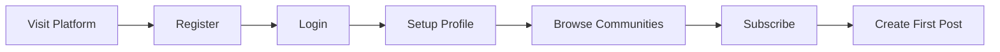

### Profile Setup After Registration

### New User Profile Configuration

WHEN a user completes registration and logs in for the first time, THE system SHALL prompt the user to configure their profile.

WHEN the user configures their profile, THE system SHALL allow the user to set a display name, write a bio, and upload an avatar image.

THE system SHALL allow the user to skip profile setup and complete it later.

WHEN the user skips profile setup, THE system SHALL use the username as the default display name until the user changes it.

WHEN the user saves their profile configuration, THE system SHALL immediately display the updated information on the user's profile page.

### Profile Setup Journey

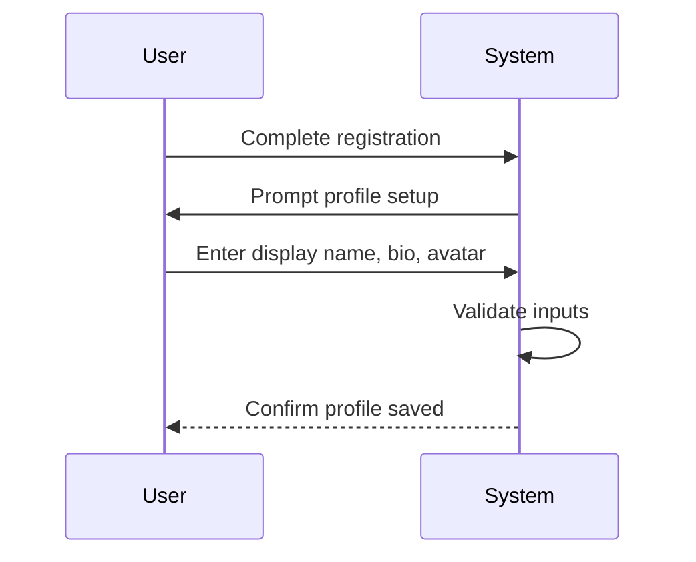

### Account Deletion Cascade

### Account Termination Process

WHEN a user requests account deletion, THE system SHALL delete the user account along with all associated data.

WHEN a user account is deleted, THE system SHALL cascade delete all posts created by that user.

WHEN a user account is deleted, THE system SHALL cascade delete all comments written by that user.

WHEN posts are deleted due to account deletion, THE system SHALL remove those posts from all community feeds and search results.

WHEN comments are deleted due to account deletion, THE system SHALL remove those comments from all comment threads.

WHEN a user account is deleted, THE system SHALL adjust karma scores for other users whose votes contributed to the deleted content.

### Deletion Cascade Flow

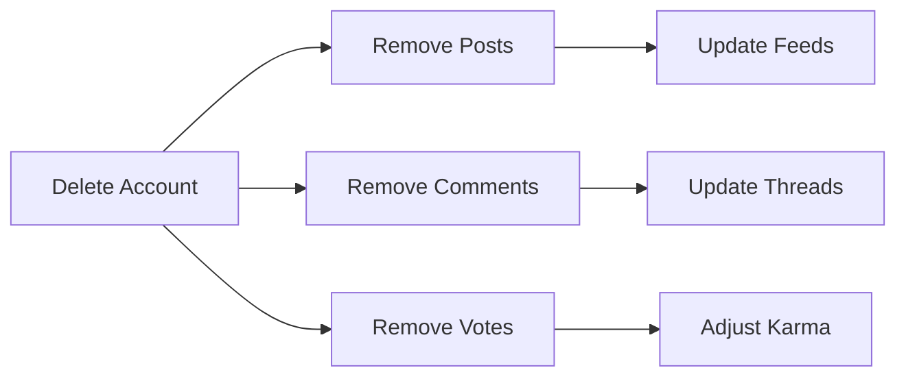

### User Profile Viewing Journey

### Viewing Another User's Profile

WHEN a user views another user's profile, THE system SHALL display the profile owner's display name, bio, and avatar.

WHEN a user views another user's profile, THE system SHALL display the profile owner's total karma score.

WHEN a user views another user's profile, THE system SHALL display a list of all posts created by the profile owner.

WHEN a user views another user's profile, THE system SHALL display a list of all comments written by the profile owner.

WHEN a guest views any user's profile, THE system SHALL display the same profile information available to logged-in users.

### Profile Information Display

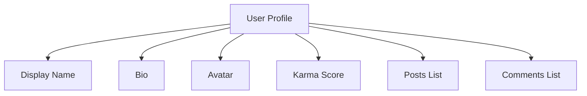

### Password Change Workflow

### Password Update Process

WHEN a user initiates a password change, THE system SHALL require the user to provide their current password for verification.

WHEN the user provides an incorrect current password, THE system SHALL reject the password change request.

WHEN the user provides the correct current password and a valid new password, THE system SHALL update the user's password.

WHEN a password is successfully changed, THE system SHALL maintain the user's logged-in session.

IF the new password does not meet security requirements, THE system SHALL reject the password change and provide feedback.

### Password Change Flow

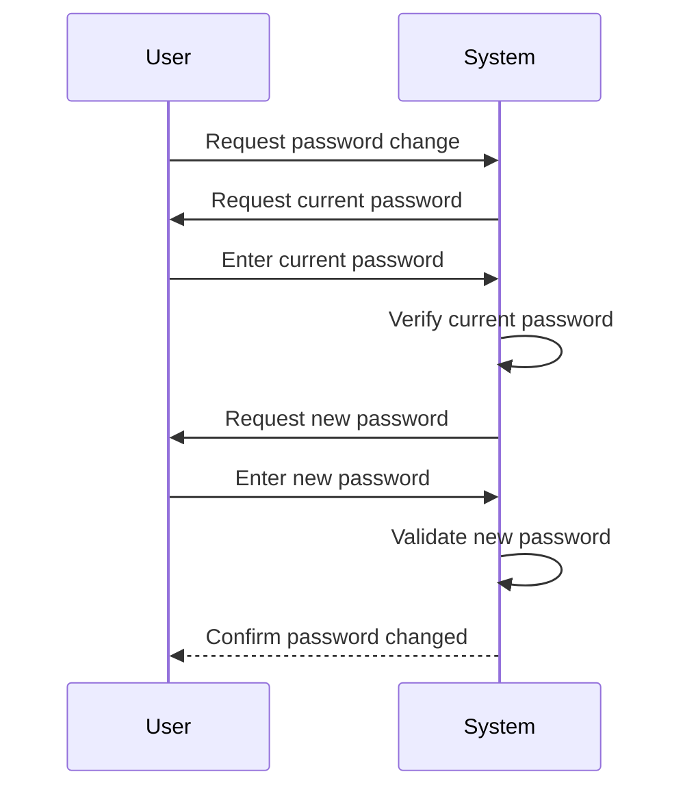

### New User Onboarding Sequence

### Onboarding Journey Steps

WHEN a new user first accesses the platform, THE system SHALL present the registration interface.

WHEN registration is complete, THE system SHALL direct the user to the login interface.

WHEN first login is complete, THE system SHALL prompt the user to configure their profile.

WHEN profile configuration is complete or skipped, THE system SHALL present the home feed or community browse interface.

WHEN the user browses communities, THE system SHALL display communities with subscriber counts.

WHEN the user subscribes to communities, THE system SHALL populate the user's home feed with posts from those communities.

### Onboarding Sequence

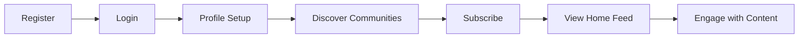

### Account Lifecycle Management

### User Account States

WHEN a user creates an account, THE system SHALL establish the account in an active state.

WHILE an account is active, THE user SHALL be able to log in, post content, comment, vote, and subscribe to communities.

WHEN a user deletes their account, THE system SHALL transition the account to a terminated state.

WHEN an account is terminated, THE system SHALL permanently remove all user data and revoke all access.

THE system SHALL NOT provide a way to restore a deleted account.

### Account Lifecycle

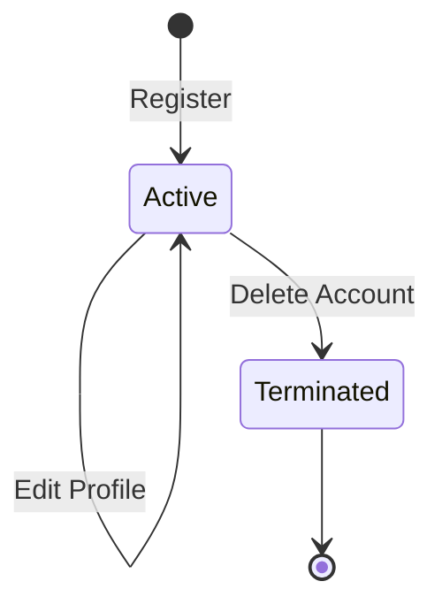

### Karma Display on Profile

### Karma Score Visibility

WHEN a user views any profile, THE system SHALL display the profile owner's total karma score.

THE system SHALL calculate the total karma score as the sum of all upvotes received minus the sum of all downvotes received on all posts and comments.

WHEN a user's content receives an upvote, THE system SHALL increase the user's karma score by one.

WHEN a user's content receives a downvote, THE system SHALL decrease the user's karma score by one.

WHEN a vote is removed from a user's content, THE system SHALL adjust the karma score accordingly.

THE system SHALL allow karma scores to display as negative numbers.

### Karma Calculation

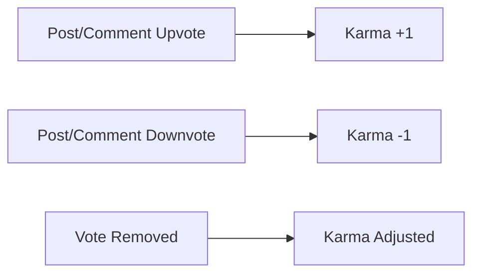

### User Contribution History Viewing

### Viewing User's Posts and Comments

WHEN a user views another user's profile, THE system SHALL display a list of all posts created by that user.

WHEN a user views another user's profile, THE system SHALL display a list of all comments written by that user.

WHEN viewing a user's post list, THE system SHALL display each post's title, community, vote score, and comment count.

WHEN viewing a user's comment list, THE system SHALL display each comment's content, associated post, vote score, and creation time.

WHEN viewing contribution history, THE system SHALL order posts and comments by creation time with most recent first.

### Contribution History Display

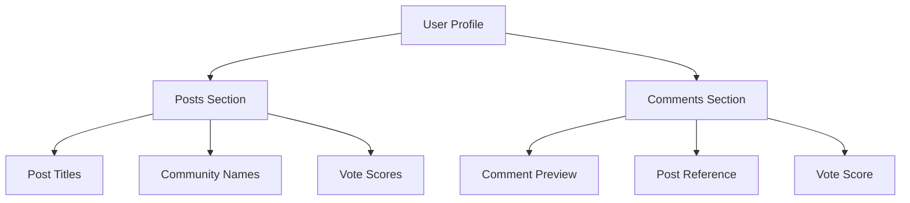

### Account Settings Navigation

### Settings Access and Navigation

WHEN a logged-in user accesses account settings, THE system SHALL provide options for password change and profile editing.

WHEN a user selects password change from settings, THE system SHALL present the password change workflow.

WHEN a user selects profile editing from settings, THE system SHALL allow modification of display name, bio, and avatar.

WHEN a user requests account deletion from settings, THE system SHALL present a confirmation before proceeding.

IF account deletion is confirmed, THE system SHALL execute the complete account deletion cascade.

### Settings Menu Structure

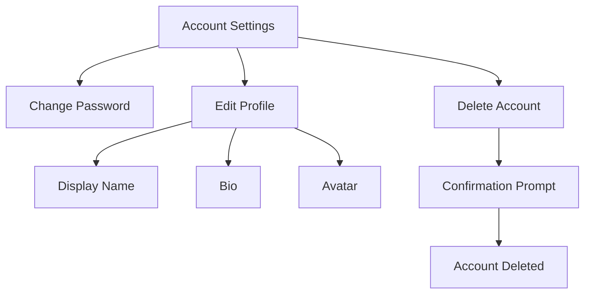

## Community User Scenarios

A user creates a new community by providing a unique name, description text, and optional icon image, automatically becoming the community owner. The owner can then add moderators to help manage the community. Other users discover communities by browsing the full community list or searching by name, viewing each community's description and subscriber count. When a user finds a community of interest, they subscribe to it, which enables them to create posts in that community. The subscriber count increases with each new subscription. A user browses their subscribed communities through the home feed, seeing posts from all communities they follow. A community owner managing their community can add and remove moderators, view banned users, and handle reports. When a community becomes inactive or problematic, moderators can be removed by the owner, ensuring only trusted users have moderation powers. The full community lifecycle spans creation, growth through subscriptions, moderation setup, content management, and ongoing community maintenance.

### Community Creation Flow

### End-to-End Community Creation

WHEN a user creates a new community, THE system SHALL:
1. Prompt for a unique community name
2. Prompt for description text
3. Allow optional icon image upload
4. Validate the community name is not already taken
5. Automatically assign the creating user as the community owner
6. Initialize the subscriber count to zero
7. Create the community and make it discoverable to all users

IF the community name is already taken, THE system SHALL reject the creation request and prompt for a different name.

IF the description text is missing, THE system SHALL reject the creation request.

WHEN the community is successfully created, THE system SHALL:
1. Display the community in the community list
2. Allow the owner to immediately perform moderation actions
3. Allow other users to discover and subscribe to the community

### Owner Role Assignment

WHEN a user successfully creates a community, THE system SHALL automatically assign that user the owner role for that community.

THE owner SHALL have the highest authority level within the community, including the ability to add and remove moderators.

WHILE a user is the community owner, THE system SHALL display the owner badge on their profile within that community context.

### Community Discovery and Search

### Community Browsing

WHEN a user views the community list, THE system SHALL display all communities in the platform.

EACH community entry in the list SHALL show:
1. Community name
2. Description text
3. Subscriber count
4. Icon image (if uploaded)

THE system SHALL support pagination for the community list.

### Community Search

WHEN a user searches for communities by name, THE system SHALL:
1. Return communities matching or partially matching the search term
2. Display results with the same information as the browse list
3. Support partial name matches
4. Maintain pagination for search results

IF no communities match the search term, THE system SHALL display an empty result set with an appropriate message.

### Community Detail View

WHEN a user selects a community from search or browse results, THE system SHALL display:
1. Full community name and description
2. Subscriber count
3. Icon image (if available)
4. Owner identification
5. List of posts within the community

### Subscription to Posting Flow

### Subscribe Before Posting

WHEN a user attempts to create a post in a community they are not subscribed to, THE system SHALL reject the request.

WHEN a user subscribes to a community, THE system SHALL:
1. Add the user to the community's subscriber list
2. Increment the community's subscriber count
3. Enable the user to create posts in that community
4. Include the community's posts in the user's home feed

### Posting After Subscription

WHEN a subscribed user creates a post, THE system SHALL:
1. Associate the post with the community
2. Display the post in the community feed
3. Include the post in the home feeds of users subscribed to the community
4. Include the post in the popular feed

### Unsubscription Effect

WHEN a user unsubscribes from a community, THE system SHALL:
1. Remove the user from the subscriber list
2. Decrement the community's subscriber count
3. Prevent the user from creating new posts in that community
4. Remove the community's posts from the user's home feed
5. Preserve all existing posts and comments created before unsubscription

IF a user attempts to post in a community after unsubscribing, THE system SHALL reject the request and prompt the user to subscribe first.

### Moderator Appointment Process

### Owner Adding Moderators

WHEN the community owner adds a moderator, THE system SHALL:
1. Verify the owner's authority
2. Add the specified user as a moderator
3. Grant moderation privileges for that community
4. Display the moderator status on the user's profile within that community context

IF a non-owner user attempts to add a moderator, THE system SHALL reject the request.

### Moderator Adding Other Moderators

WHEN a moderator adds another moderator, THE system SHALL:
1. Verify the adding user has moderator status
2. Add the specified user as a moderator
3. Grant moderation privileges for that community

### Moderator Privileges Upon Appointment

WHEN a user becomes a moderator, THE system SHALL grant the following capabilities within that community:
1. Delete any post
2. Delete any comment
3. Ban users from the community
4. Unban users from the community
5. View the list of banned users
6. View and handle reports
7. Add other moderators

WHILE a user serves as a moderator, THE system SHALL allow them to perform all moderation actions except removing the owner or other moderators.

### Owner Moderation Management

### Owner Authority Overview

THE community owner SHALL have complete control over the community, including all moderator privileges plus the exclusive ability to remove moderators.

### Owner Removing Moderators

WHEN the community owner removes a moderator, THE system SHALL:
1. Verify the requesting user is the community owner
2. Remove moderator status from the target user
3. Revoke all moderation privileges for that community
4. Prevent the removed moderator from performing moderation actions

IF a moderator attempts to remove another moderator, THE system SHALL reject the request.

IF a moderator attempts to remove the owner, THE system SHALL reject the request.

### Owner Protection

THE system SHALL prevent the community owner from being removed from the owner role by any other user.

THE system SHALL prevent moderators from removing the owner.

THE system SHALL prevent moderators from removing each other (only the owner can remove moderators).

### Content Moderation

WHEN the owner performs moderation actions (deleting posts, deleting comments, banning users), THE system SHALL apply the same rules as moderator actions.

THE owner SHALL have access to all moderation features available to moderators.

### Community Subscriber Growth

### Subscriber Count Tracking

THE system SHALL maintain an accurate count of subscribers for each community.

WHEN a user subscribes to a community, THE system SHALL increment the subscriber count by 1.

WHEN a user unsubscribes from a community, THE system SHALL decrement the subscriber count by 1.

THE subscriber count SHALL be visible on the community detail view and community list entries.

### Growth Through Discovery

WHEN users browse the community list, THE system SHALL display subscriber counts to help users identify popular communities.

WHEN users search for communities, THE system SHALL include subscriber counts in search results.

### Subscription Persistence

WHEN a user's account is deleted, THE system SHALL:
1. Remove the user from all community subscriber lists
2. Decrement subscriber counts for all communities the user was subscribed to

### Subscriber List Management

THE system SHALL maintain a list of all users subscribed to each community.

THE subscriber count SHALL accurately reflect the number of users in the subscriber list.

### Home Feed from Subscriptions

### Home Feed Composition

WHEN a logged-in user views their home feed, THE system SHALL display posts exclusively from communities the user is subscribed to.

THE home feed SHALL NOT be available to guests or logged-out users.

### Feed Update Dynamics

WHEN a user subscribes to a new community, THE system SHALL immediately include that community's posts in the user's home feed.

WHEN a user unsubscribes from a community, THE system SHALL immediately remove that community's posts from the user's home feed.

### Post Visibility in Home Feed

WHEN a subscribed community has new posts created, THE system SHALL include those posts in the home feeds of all subscribers.

WHEN a post is deleted, THE system SHALL remove it from all home feeds where it appeared.

### Sorting and Pagination

THE home feed SHALL support the same sorting options as other feeds: Hot, New, Top, and Controversial.

THE home feed SHALL be paginated.

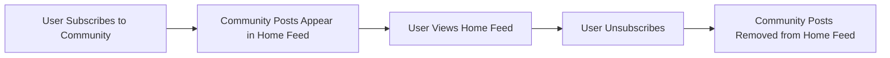

### Community Browsing Experience

### Community Feed Access

WHEN any user (including guests) views a specific community, THE system SHALL display the community feed containing all posts in that community.

THE community feed SHALL be accessible to all users regardless of subscription status.

### Community Information Display

WHEN a user views a community, THE system SHALL display:
1. Community name
2. Community description
3. Icon image (if uploaded)
4. Subscriber count
5. Owner identification

### Post List in Community Feed

WHEN viewing a community feed, THE system SHALL display each post with:
1. Title
2. Author username
3. Vote score
4. Comment count
5. Time since posted
6. Content preview (text excerpt, image thumbnail, or link domain)

### Sorting and Navigation

THE community feed SHALL support sorting by Hot, New, Top, and Controversial.

THE community feed SHALL be paginated.

### Subscription Status Indication

WHEN a logged-in user views a community they are not subscribed to, THE system SHALL provide an option to subscribe.

WHEN a logged-in user views a community they are already subscribed to, THE system SHALL provide an option to unsubscribe.

### Community Ownership Transfer

### Owner Role Characteristics

THE community owner role is assigned upon community creation and cannot be transferred to another user through the standard interface.

THE owner SHALL retain complete authority over the community for its entire lifecycle.

### Owner Authority Limitations

THE owner SHALL NOT be able to remove themselves from the owner role.

THE owner SHALL NOT be able to transfer ownership to another user.

IF an owner wishes to relinquish control, THE system SHALL NOT provide an ownership transfer mechanism.

### Owner Account Deletion

WHEN the community owner deletes their account, THE system SHALL:
1. Delete all posts and comments created by the owner
2. Delete the community itself (as defined in account deletion requirements)

### Ownership Persistence

WHILE the community owner account remains active, THE system SHALL maintain their ownership status regardless of activity level.

THE owner SHALL retain all moderation capabilities even during periods of inactivity.

### Moderator Removal by Owner

### Owner Exclusivity for Moderator Removal

THE system SHALL allow ONLY the community owner to remove moderators.

WHEN a moderator attempts to remove another moderator, THE system SHALL reject the request with an authorization error.

WHEN the owner attempts to remove themselves (if they are also a moderator), THE system SHALL reject the request as the owner cannot be removed.

### Moderator Removal Process

WHEN the community owner removes a moderator, THE system SHALL:
1. Remove the moderator role from the target user
2. Revoke all moderation privileges for that community
3. Prevent the removed user from performing any moderation actions
4. Preserve any content the moderator had previously moderated

### Removal Effect on Existing Actions

WHEN a moderator is removed, THE system SHALL NOT undo any moderation actions they had previously performed (deleted posts, banned users, handled reports).

### Owner Cannot Be Removed

THE system SHALL prevent removal of the community owner from any moderation role.

IF the owner attempts to remove the owner, THE system SHALL reject the request.

IF a moderator attempts to remove the owner, THE system SHALL reject the request.

### Self-Removal Not Applicable

THE system SHALL NOT provide a mechanism for moderators to remove themselves.

A moderator who no longer wishes to moderate must request removal by the owner.

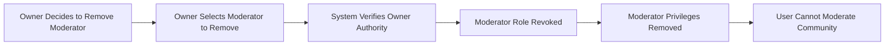

## Post User Scenarios

A user begins creating a post by first subscribing to a community, then selecting that community and choosing a post type: text, link, or image. For text posts, the user enters a title and content; for link posts, a title and URL; for image posts, a title and uploaded image file. After submission, the post appears in the community feed and the author's profile. Other users viewing the post see the title, full content, author username, community name, vote score, comment count, and timestamp. The author can edit their post to modify content or delete it entirely, which removes it from all feeds. Users browse posts through three feed types: home feed shows posts from subscribed communities, popular feed shows posts from all communities, and community feed shows posts from a specific community. Each feed supports sorting by hot, new, top, or controversial criteria with pagination. The post lifecycle spans creation, discovery through feeds, voting and commenting by other users, potential editing by the author, and eventual deletion by the author or moderators.

### Post Creation After Subscription

### User Journey: Subscription to Post Creation

WHEN a user attempts to create a post in a community, THE system SHALL verify the user is subscribed to that community.

IF the user is not subscribed to the community, THE system SHALL reject the post creation request.

WHEN a user subscribes to a community, THE system SHALL grant the user permission to create posts in that community.

### First-Time Post Author Experience

WHEN a subscribed user creates their first post in a community, THE system SHALL:
1. Accept the post title and content
2. Associate the post with the user's account
3. Associate the post with the selected community
4. Initialize the post with zero votes
5. Initialize the post with zero comments
6. Display the post in the community feed

IF a user attempts to create a post after subscribing, THE system SHALL process the post immediately without additional waiting periods.

### Subscription State Validation

WHEN a user navigates to a community they are subscribed to, THE system SHALL enable the post creation interface.

WHEN a user navigates to a community they are not subscribed to, THE system SHALL hide or disable the post creation interface.

IF a user's subscription is removed or inactive, THE system SHALL prevent the user from creating new posts in that community.

### Transition from Subscriber to Contributor

WHEN a user completes post creation in a community for the first time, THE system SHALL:
1. Update the user's profile to include the new post
2. Make the post visible in the community feed
3. Make the post visible in the home feeds of users subscribed to the community
4. Allow the post to appear in the popular feed

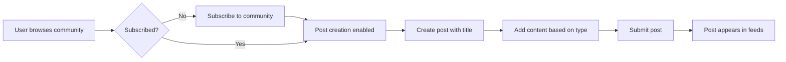

### Text, Link, and Image Post Flow

### Post Type Selection

WHEN a subscribed user initiates post creation, THE system SHALL present three post type options: text, link, and image.

THE system SHALL require the user to select exactly one post type before accepting post content.

### Text Post Flow

WHEN a user selects the text post type, THE system SHALL:
1. Present a title input field (required)
2. Present a text content input field
3. Allow rich text formatting in the content

WHEN a user submits a text post, THE system SHALL require both a title and text content.

IF a text post is submitted without text content, THE system SHALL reject the post.

### Link Post Flow

WHEN a user selects the link post type, THE system SHALL:
1. Present a title input field (required)
2. Present a URL input field
3. Validate the URL format before submission

WHEN a user submits a link post, THE system SHALL require both a title and a valid URL.

IF a link post is submitted with an invalid URL format, THE system SHALL reject the post.

IF a link post URL cannot be resolved, THE system SHALL accept the post and store the URL as provided.

### Image Post Flow

WHEN a user selects the image post type, THE system SHALL:
1. Present a title input field (required)
2. Present an image upload interface
3. Accept uploaded image files
4. Validate the image format and size

WHEN a user submits an image post, THE system SHALL require both a title and a successfully uploaded image.

IF an image post is submitted without an uploaded image, THE system SHALL reject the post.

### Post Type Validation

WHEN a user switches between post types during creation, THE system SHALL:
1. Preserve the entered title
2. Clear content specific to the previous post type
3. Present input fields appropriate to the newly selected type

IF a user attempts to submit a post with mismatched content type, THE system SHALL reject the submission.

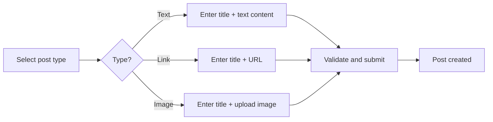

### Post Submission and Feed Integration

### Post Submission Process

WHEN a user submits a post, THE system SHALL:
1. Validate all required fields for the selected post type
2. Associate the post with the creating user
3. Associate the post with the selected community
4. Record the creation timestamp
5. Initialize the vote score to zero
6. Initialize the comment count to zero

### Immediate Feed Visibility

WHEN a post is successfully created, THE system SHALL:
1. Display the post in the community feed immediately
2. Display the post in the home feed of users subscribed to the community
3. Make the post eligible for the popular feed

IF a post is created in a community with no other subscribers, THE system SHALL still display the post in the community feed.

### Post Display in List Views

WHEN a post appears in any feed list, THE system SHALL display:
1. The post title
2. The author's username
3. The community name
4. The current vote score
5. The current comment count
6. The time elapsed since creation

IF the post is a text post, THE system SHALL display the first 200 characters of content as a preview.

IF the post is an image post, THE system SHALL display a thumbnail of the image.

IF the post is a link post, THE system SHALL display the domain name extracted from the URL.

### Author's Immediate View

WHEN a post is successfully submitted, THE system SHALL redirect the user to the newly created post's detail view.

WHEN the author views their newly created post, THE system SHALL display all post content along with editing and deletion options.

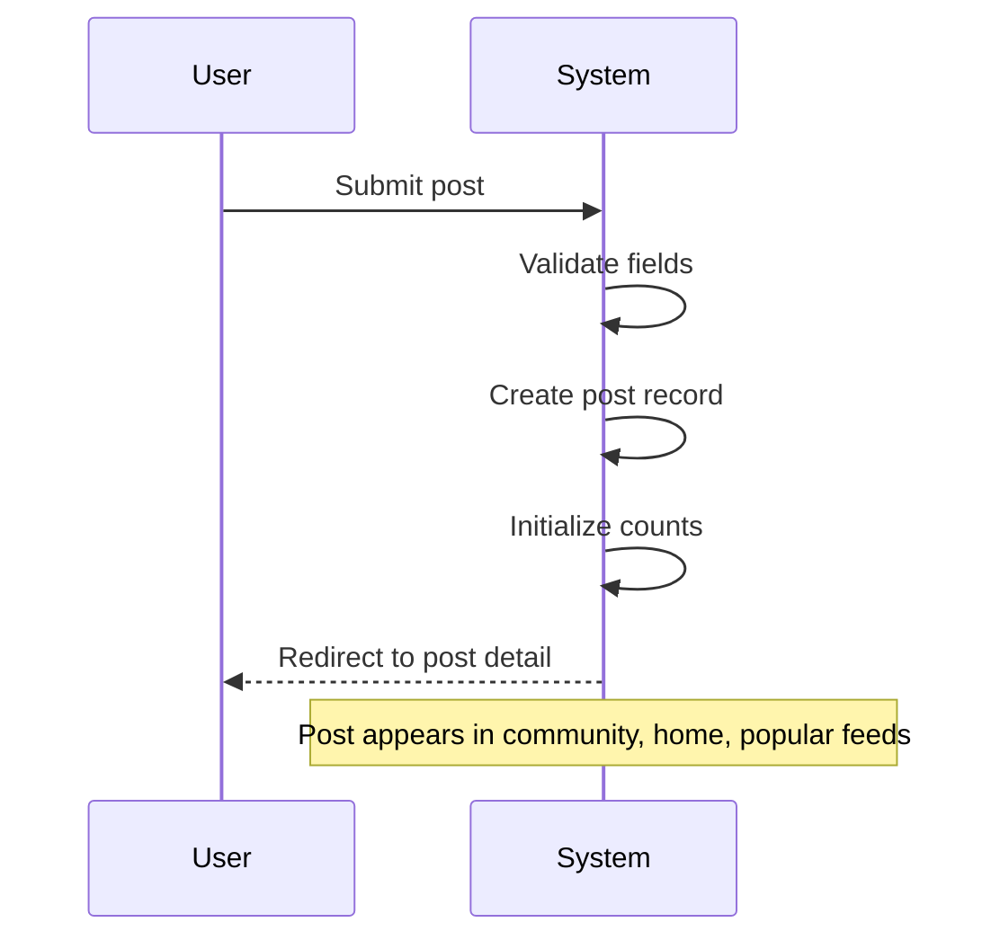

### Feed Browsing and Sorting

### Feed Navigation

WHEN a user accesses the platform, THE system SHALL present navigation options for:
1. Home feed (logged-in users only)
2. Popular feed (all users)
3. Community-specific feed (all users)

### Hot Sorting

WHEN a user selects "hot" sorting for any feed, THE system SHALL order posts by a combination of:
1. Recency of creation
2. Number of upvotes received
3. Rate of upvote accumulation

THE system SHALL display recent posts with high engagement prominently in hot sorting.

### New Sorting

WHEN a user selects "new" sorting for any feed, THE system SHALL order posts by creation timestamp in descending order.

THE system SHALL display the most recently created posts first.

### Top Sorting with Time Filters

WHEN a user selects "top" sorting for any feed, THE system SHALL order posts by total vote score in descending order.

WHEN a user applies a time filter to top sorting, THE system SHALL only include posts created within the selected timeframe:
1. Today
2. This week
3. This month
4. This year
5. All time

IF no posts exist within the selected timeframe, THE system SHALL display an empty feed message.

### Controversial Sorting

WHEN a user selects "controversial" sorting for any feed, THE system SHALL order posts by:
1. High total vote count (upvotes plus downvotes)
2. Vote score close to zero

THE system SHALL display posts with significant engagement but divided opinions first.

### Pagination Across Feeds

WHEN a user scrolls through any feed, THE system SHALL load additional posts using pagination.

WHEN a user reaches the end of available posts, THE system SHALL display an end-of-feed indicator.

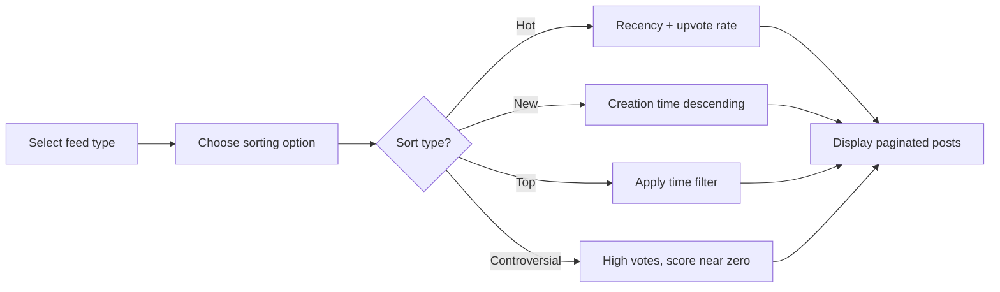

### Post Editing by Author

### Edit Access Control

WHEN the post author views their own post, THE system SHALL display an edit option.

WHEN any user other than the author views a post, THE system SHALL NOT display the edit option.

IF a user attempts to edit another user's post, THE system SHALL reject the request.

### Edit Process

WHEN the author initiates post editing, THE system SHALL:
1. Display the current title and content
2. Allow modification of the title
3. Allow modification of the content based on post type
4. Preserve the post type (text, link, or image cannot be changed)

WHEN the author modifies a link post's URL, THE system SHALL validate the new URL format.

WHEN the author modifies an image post, THE system SHALL allow replacement of the image file.

### Edit Validation

IF the author attempts to save edits with an empty title, THE system SHALL reject the edit.

IF the author attempts to save edits with invalid content for the post type, THE system SHALL reject the edit.

### Post-Publication Edits

WHEN an author edits a published post, THE system SHALL:
1. Update the post content immediately
2. Preserve the post's existing vote score
3. Preserve the post's existing comments
4. Update the post's last modified timestamp

WHEN a post has been edited, THE system SHALL indicate the post has been modified.

### Author Journey: Viewing to Editing

WHEN the author navigates to their post detail view, THE system SHALL show all post content.

WHEN the author selects edit, THE system SHALL switch to edit mode with editable fields.

WHEN the author saves changes, THE system SHALL update the post and return to view mode.

WHEN the author cancels editing, THE system SHALL discard all unsaved changes.

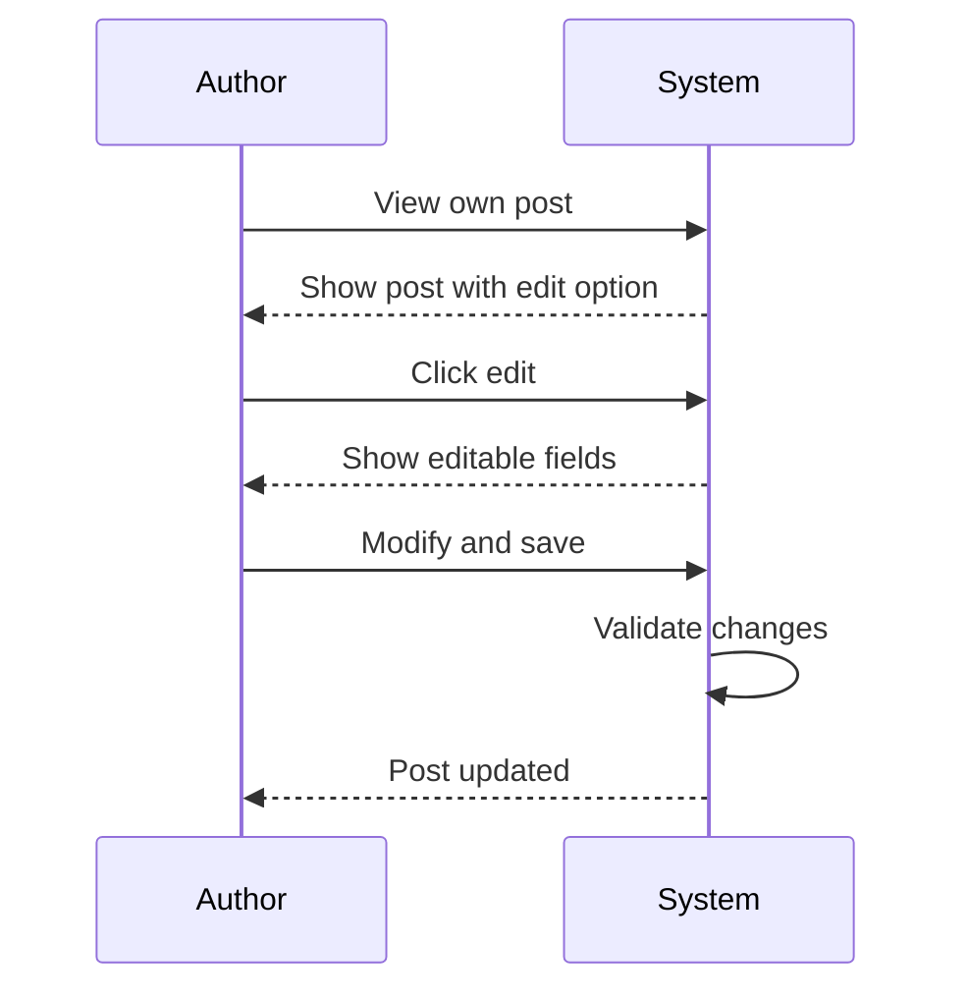

### Post Deletion Cascade

### Deletion Access Control

WHEN the post author views their own post, THE system SHALL display a delete option.

WHEN any user other than the author views a post, THE system SHALL NOT display the delete option.

WHEN a community moderator views any post in their community, THE system SHALL display a delete option.

IF a user attempts to delete another user's post without moderator privileges, THE system SHALL reject the request.

### Deletion Confirmation

WHEN a user initiates post deletion, THE system SHALL require confirmation before proceeding.

IF the user cancels deletion, THE system SHALL preserve the post unchanged.

### Content Removal on Deletion

WHEN a post is deleted, THE system SHALL:
1. Remove the post from all feeds
2. Remove the post from the author's profile
3. Remove all comments associated with the post
4. Remove all votes associated with the post
5. Remove all reports associated with the post

### Karma Impact

WHEN a post is deleted, THE system SHALL remove all karma effects from votes on that post.

THE system SHALL recalculate the author's karma as if the post's votes never occurred.

### References After Deletion

IF a user attempts to access a deleted post via direct link, THE system SHALL display a post-not-found message.

IF a comment was made on a deleted post, THE system SHALL remove the comment from the commenter's profile.

WHEN a post is deleted, THE system SHALL NOT notify users who commented on the post.

### Cascade Summary

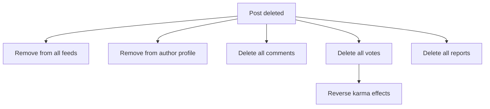

### Home, Popular, and Community Feeds

### Home Feed

WHEN a logged-in user accesses the home feed, THE system SHALL display posts from all communities the user is subscribed to.

WHEN a guest user attempts to access the home feed, THE system SHALL redirect to login or display an access message.

THE system SHALL combine posts from all subscribed communities, ordered by the selected sorting method.

### Popular Feed

WHEN any user accesses the popular feed, THE system SHALL display posts from all communities across the platform.

THE system SHALL NOT require authentication to view the popular feed.

THE system SHALL order posts by the selected sorting method across all communities.

### Community Feed

WHEN a user accesses a specific community, THE system SHALL display posts only from that community.

THE system SHALL allow both logged-in and guest users to view community feeds.

IF a community has no posts, THE system SHALL display an empty community message.

### Feed Comparison

| Feed Type | Access | Content Scope | Personalization |
|-----------|--------|---------------|----------------|
| Home | Logged-in only | Subscribed communities | Personalized to user |
| Popular | Everyone | All communities | Not personalized |
| Community | Everyone | Single community | Not personalized |

### Sorting Consistency

WHEN a user switches between feed types, THE system SHALL preserve the user's selected sorting preference.

WHEN a user changes sorting in one feed, THE system SHALL apply the same sorting to other feeds during that session.

### Feed Navigation Journey

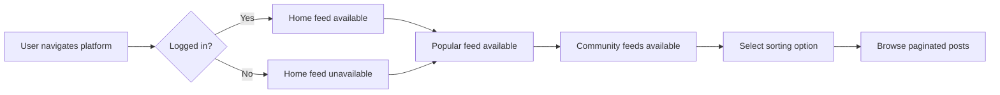

### Post Discovery Journey

### Discovery Through Popular Feed

WHEN a guest user visits the platform, THE system SHALL allow access to the popular feed for post discovery.

WHEN a logged-in user browses the popular feed, THE system SHALL present posts from communities they may not be subscribed to.

### Discovery Through Community Browsing

WHEN a user searches for communities by name, THE system SHALL display matching communities with subscriber counts.

WHEN a user selects a community from search results, THE system SHALL display the community's post feed.

WHEN a user browses the list of all communities, THE system SHALL display each community's name, description, icon, and subscriber count.

### Discovery Through Home Feed

WHEN a logged-in user views their home feed, THE system SHALL display posts exclusively from their subscribed communities.

WHEN a user sees an interesting post in the home feed, THE system SHALL allow clicking to view the full post.

### Post Preview Information

WHEN a user sees a post in any feed, THE system SHALL display:
1. Post title (clickable to view full post)
2. Author username (clickable to view profile)
3. Community name (clickable to view community feed)
4. Vote score
5. Comment count
6. Time since posted
7. Content preview based on post type

### Content-Specific Previews

IF a post is a text post, THE system SHALL display the first 200 characters as a preview.

IF a post is an image post, THE system SHALL display a thumbnail image.

IF a post is a link post, THE system SHALL display the domain name extracted from the URL.

### From Discovery to Engagement

WHEN a user clicks a post title, THE system SHALL navigate to the full post detail view.

WHEN a user clicks the author username, THE system SHALL navigate to the author's profile.

WHEN a user clicks the community name, THE system SHALL navigate to the community feed.

```mermaid
flowchart LR
    A["Guest arrives"] --> B["Browse popular feed"]
    B --> C["Discover community"]
    C --> D["View community feed"]
    D --> E["See interesting post"]
    E --> F["View post detail"]
    F --> G["Interact with content"]
```

### Post Voting and Commenting Flow

### Viewing Post Detail

WHEN a user views a post's detail page, THE system SHALL display:
1. The post title
2. The full content based on post type
3. The author username
4. The community name
5. The vote score
6. The comment count
7. The timestamp

### Voting on Posts

WHEN a logged-in user views a post, THE system SHALL display upvote and downvote options.

WHEN a guest user views a post, THE system SHALL display voting options but require login to vote.

IF a user has not voted on a post, THE system SHALL allow either an upvote or downvote.

IF a user has already upvoted a post, THE system SHALL allow:
1. Removing the upvote
2. Changing to a downvote

IF a user has already downvoted a post, THE system SHALL allow:
1. Removing the downvote
2. Changing to an upvote

### Vote Score Display

WHEN a post receives votes, THE system SHALL calculate the vote score as total upvotes minus total downvotes.

THE system SHALL display the current vote score on the post.

IF a vote score is negative, THE system SHALL display it with a negative indicator.

### Commenting Flow

WHEN a logged-in user views a post, THE system SHALL display a comment input field.

WHEN a guest user views a post, THE system SHALL require login before commenting.

WHEN a user submits a comment, THE system SHALL:
1. Associate the comment with the post
2. Associate the comment with the author
3. Record the creation timestamp
4. Initialize the comment vote score to zero
5. Update the post's comment count

### Viewing Comments

WHEN a user views a post's comments, THE system SHALL display:
1. Each comment's author
2. Each comment's content
3. Each comment's vote score
4. Each comment's timestamp
5. Nested replies in a threaded structure

### Comment Sorting

WHEN a user views a post's comments, THE system SHALL provide sorting options:
1. Best (highest vote score)
2. New (most recent)
3. Controversial (high engagement, score near zero)

### Interaction Journey

```mermaid
sequenceDiagram
    participant U as User
    participant S as System
    U->>S: View post detail
    S-->>U: Show post with voting options
    U->>S: Upvote post
    S->>S: Update vote score
    S-->>U: Show updated score
    U->>S: Write comment
    S->>S: Create comment
    S-->>U: Show comment in thread
```

### Post Visibility in Profile

### Author's Profile Post Display

WHEN a user views their own profile, THE system SHALL display a list of all posts they have created.

WHEN a user views another user's profile, THE system SHALL display that user's post list.

### Post List Information in Profile

WHEN a profile displays a user's posts, THE system SHALL show for each post:
1. The post title
2. The community the post belongs to
3. The vote score
4. The comment count
5. The time since posted
6. A content preview based on post type

### Profile Post Navigation

WHEN a user clicks a post in a profile, THE system SHALL navigate to the full post detail.

IF a post has been deleted, THE system SHALL NOT display it in the profile.

### Post Count Display

WHEN a user views a profile, THE system SHALL display the total number of posts created by that user.

### Visibility After Post Actions

WHEN an author edits a post, THE system SHALL reflect the changes in the profile post list.

WHEN an author deletes a post, THE system SHALL immediately remove the post from the profile.

WHEN a post is deleted by a moderator, THE system SHALL remove the post from the author's profile.

### Combined Profile Display

WHEN a user views a profile, THE system SHALL display:
1. The user's display name
2. The user's bio
3. The user's avatar
4. The user's total karma score
5. The list of posts created by the user
6. The list of comments written by the user

### Author Attribution Journey

```mermaid
flowchart LR
    A["User views post in feed"] --> B["Click author username"]
    B --> C["View author profile"]
    C --> D["See author's post list"]
    D --> E["Click specific post"]
    E --> F["View full post detail"]
    
    G["User views own profile"] --> H["See all own posts"]
    H --> I["Click post to manage"]
    I --> J["Edit or delete post"]
```

## Comment User Scenarios

A user viewing a post can write a top-level comment, which appears below the post content with the author, content, vote score, and timestamp. Other users can reply to any comment, creating nested reply chains with no depth limit. Each reply maintains its own vote score and can spawn further replies. Users view comments sorted by best, new, or controversial criteria, with nested replies displayed in a threaded structure. A comment author can edit their comment to fix errors or add clarifications, and can delete their comment, which removes it and all its replies from the thread. Moderators can also delete comments in their community, removing inappropriate content. When viewing a user's profile, all comments written by that user are listed chronologically. The comment lifecycle spans creation as a top-level or reply, potential editing, voting by other users, potential deletion, and display in threads and user profiles. Comments contribute to the user's karma score when receiving votes, visible in the author's profile.

### Comment Creation on Post

### Top-Level Comment Creation

WHEN a member views a post, THE system SHALL display a comment input area below the post content.

WHEN a member submits a top-level comment, THE system SHALL require the member to be subscribed to the post's community.

WHEN a member creates a top-level comment, THE system SHALL require non-empty comment content.

WHEN a member creates a top-level comment, THE system SHALL associate the comment with the post and the author.

WHEN a member creates a top-level comment, THE system SHALL record the creation timestamp.

WHEN a member creates a top-level comment, THE system SHALL initialize the comment's vote score to zero.

WHEN a member creates a top-level comment, THE system SHALL display the comment immediately below the post content with author, content, vote score, and timestamp.

IF the member is banned from the post's community, THE system SHALL reject the comment creation.

IF the post has been deleted, THE system SHALL reject new comment creation.

### Comment Visibility

WHEN a comment is created, THE system SHALL make it visible to all users who can view the post.

WHEN a guest views a post, THE system SHALL display all comments including the newly created comment.

### Nested Reply Chain Flow

### Reply Creation

WHEN a member views any comment, THE system SHALL display a reply option for that comment.

WHEN a member submits a reply to a comment, THE system SHALL require the member to be subscribed to the post's community.

WHEN a member creates a reply, THE system SHALL require non-empty reply content.

WHEN a member creates a reply, THE system SHALL associate the reply with the parent comment and the author.

WHEN a member creates a reply, THE system SHALL record the creation timestamp.

WHEN a member creates a reply, THE system SHALL initialize the reply's vote score to zero.

IF the member is banned from the post's community, THE system SHALL reject the reply creation.

IF the parent comment has been deleted, THE system SHALL reject the reply creation.

### Reply Chain Structure

WHEN a reply is created, THE system SHALL nest the reply under its parent comment.

WHEN a reply is created, THE system SHALL allow unlimited reply depth with no maximum nesting level.

WHEN a reply is created, THE system SHALL display the reply in its proper position within the threaded structure.

WHEN a member replies to a reply, THE system SHALL create a new comment nested one level deeper than its parent.

### Threaded Comment Viewing

### Thread Structure Display

WHEN a user views a post, THE system SHALL display all top-level comments below the post content.

WHEN a user views a post, THE system SHALL display nested replies indented under their parent comments.

WHEN a user views a post, THE system SHALL show each comment's author username, content, vote score, and time since posting.

WHEN a user views a post, THE system SHALL preserve the parent-child relationships in the visual display.

WHEN a user views a comment thread, THE system SHALL display the full content of each comment without truncation.

WHEN a user views a comment thread, THE system SHALL indicate which comments are replies to other comments.

### Comment Information Display

WHEN a user views any comment, THE system SHALL display the author's username.

WHEN a user views any comment, THE system SHALL display the comment's content.

WHEN a user views any comment, THE system SHALL display the comment's vote score.

WHEN a user views any comment, THE system SHALL display the time elapsed since the comment was posted.

WHEN a user views any comment, THE system SHALL display any nested replies beneath it.

### Comment Sorting Options

### Sorting Availability

WHEN a user views comments on a post, THE system SHALL offer sorting by Best, New, and Controversial options.

WHEN a user views comments on a post, THE system SHALL apply the selected sort order to all visible comments.

### Best Sorting

WHEN a user selects Best sorting, THE system SHALL display comments in descending order by vote score.

WHEN a user selects Best sorting, THE system SHALL display comments with higher vote scores before comments with lower vote scores.

WHEN a user selects Best sorting, THE system SHALL maintain the nested reply structure within each comment thread.

### New Sorting

WHEN a user selects New sorting, THE system SHALL display comments in descending order by creation timestamp.

WHEN a user selects New sorting, THE system SHALL display the most recently created comments first.

WHEN a user selects New sorting, THE system SHALL maintain the nested reply structure within each comment thread.

### Controversial Sorting

WHEN a user selects Controversial sorting, THE system SHALL display comments with many total votes but vote scores close to zero first.

WHEN a user selects Controversial sorting, THE system SHALL prioritize comments that have received significant voting activity but balanced upvotes and downvotes.

WHEN a user selects Controversial sorting, THE system SHALL maintain the nested reply structure within each comment thread.

### Sorting Consistency

WHEN a user changes the sort option, THE system SHALL immediately re-render the comments in the new order.

WHEN a user views a post, THE system SHALL preserve the user's previously selected sort preference if applicable.

### Comment Editing by Author

### Edit Permission

WHEN a member attempts to edit a comment, THE system SHALL verify that the member is the author of that comment.

IF the member is not the comment's author, THE system SHALL reject the edit request.

### Edit Process

WHEN a comment author edits their comment, THE system SHALL allow modification of the comment content.

WHEN a comment author edits their comment, THE system SHALL require non-empty content.

WHEN a comment author edits their comment, THE system SHALL preserve all existing votes on the comment.

WHEN a comment author edits their comment, THE system SHALL preserve all nested replies to the comment.

WHEN a comment author edits their comment, THE system SHALL record the edit timestamp.

WHEN a comment author saves an edit, THE system SHALL update the displayed content immediately.

### Edit Visibility

WHEN a comment is edited, THE system SHALL display the updated content to all users viewing the post.

WHEN a comment is edited, THE system SHALL maintain the comment's position within the threaded structure.

WHEN a comment is edited, THE system SHALL not affect the vote score or reply count.

### Edit Restrictions

IF the comment has been deleted, THE system SHALL reject edit attempts.

IF the post has been deleted, THE system SHALL reject edit attempts.

### Comment Deletion with Replies

### Delete Permission

WHEN a member attempts to delete a comment, THE system SHALL verify that the member is the author of that comment.

IF the member is not the comment's author, THE system SHALL reject the deletion request.

### Deletion Cascade

WHEN a comment author deletes their comment, THE system SHALL remove the comment and all of its nested replies.

WHEN a comment author deletes their comment, THE system SHALL remove the entire reply chain beneath that comment.

WHEN a comment author deletes their comment, THE system SHALL not affect other top-level comments or their reply chains.

WHEN a comment author deletes a reply, THE system SHALL remove that reply and all replies nested under it.

WHEN a comment is deleted, THE system SHALL not display the comment content or author to users.

### Deletion Impact

WHEN a comment is deleted, THE system SHALL preserve the vote scores on unrelated comments.

WHEN a comment is deleted, THE system SHALL update the comment count for the associated post.

WHEN a comment with replies is deleted, THE system SHALL remove all child replies from visibility.

### Deletion Restrictions

IF a parent comment is deleted, THE system SHALL prevent editing or deleting its child replies independently.

WHEN a comment is deleted, THE system SHALL remove any associated votes from the total karma calculation.

### Moderator Comment Removal

### Removal Authority

WHEN a moderator views a comment in their community, THE system SHALL provide a removal option.

WHEN a moderator removes a comment, THE system SHALL remove the comment and all of its nested replies.

WHEN a moderator removes a comment, THE system SHALL not require the moderator to be the comment's author.

WHEN a moderator removes a comment, THE system SHALL record that the removal was performed by a moderator.

### Removal Scope

WHEN a moderator removes a top-level comment, THE system SHALL remove the entire comment thread including all replies.

WHEN a moderator removes a nested reply, THE system SHALL remove that reply and all replies beneath it.

WHEN a moderator removes a comment, THE system SHALL not affect other top-level comments in the same post.

### Removal Permissions

IF the moderator attempting removal is not assigned to the comment's community, THE system SHALL reject the removal.

IF the moderator attempts to remove a comment in a community they do not moderate, THE system SHALL reject the removal.

### Removal Impact

WHEN a moderator removes a comment, THE system SHALL not display the comment to users.

WHEN a moderator removes a comment, THE system SHALL update the post's comment count.

WHEN a moderator removes a comment, THE system SHALL adjust the author's karma by removing votes associated with the removed content.

### Comment Display in Profile

### Profile Comment List

WHEN a user views a member's profile, THE system SHALL display a list of all comments written by that member.

WHEN a user views a member's profile, THE system SHALL display each comment's content, associated post title, and the community where it was posted.

WHEN a user views a member's profile, THE system SHALL display each comment's vote score and time since posting.

WHEN a user views a member's profile, THE system SHALL list comments in chronological order with the most recent first.

### Deleted Comments

WHEN a member deletes a comment, THE system SHALL remove that comment from the member's profile comment list.

WHEN a moderator removes a comment, THE system SHALL remove that comment from the author's profile comment list.

### Profile Comment Visibility

WHEN a guest views a member's profile, THE system SHALL display all comments that have not been deleted.

WHEN a member views their own profile, THE system SHALL display all comments that have not been deleted.

WHEN a user views a member's profile, THE system SHALL display comments from communities where the member was not banned at the time of comment creation.

### Comment Context

WHEN a user selects a comment from a member's profile, THE system SHALL navigate to the post containing that comment.

WHEN a user navigates to a comment from a profile, THE system SHALL highlight or position the view at the specific comment within the thread.

### Comment Voting Impact

### Vote Creation Impact

WHEN a member upvotes a comment, THE system SHALL increase the comment's vote score by 1.

WHEN a member downvotes a comment, THE system SHALL decrease the comment's vote score by 1.

WHEN a member casts a vote on a comment, THE system SHALL update the comment author's total karma score.

WHEN a member upvotes a comment, THE system SHALL increase the comment author's karma by 1.

WHEN a member downvotes a comment, THE system SHALL decrease the comment author's karma by 1.

### Vote Modification Impact

WHEN a member changes their vote from upvote to downvote, THE system SHALL decrease the comment's vote score by 2.

WHEN a member changes their vote from downvote to upvote, THE system SHALL increase the comment's vote score by 2.

WHEN a member changes their vote, THE system SHALL update the comment author's karma accordingly.

### Vote Removal Impact

WHEN a member removes an upvote from a comment, THE system SHALL decrease the comment's vote score by 1.

WHEN a member removes a downvote from a comment, THE system SHALL increase the comment's vote score by 1.

WHEN a member removes their vote from a comment, THE system SHALL adjust the comment author's karma accordingly.

### Karma Aggregation

WHEN a comment receives votes, THE system SHALL aggregate the karma contribution with the author's total karma from posts.

WHEN a comment is deleted, THE system SHALL remove the vote contributions from the author's karma.

IF a comment's vote score becomes negative, THE system SHALL allow the author's karma to decrease below zero.

### Deep Reply Threads

### Unlimited Depth Support

WHEN a member creates a reply to a deeply nested comment, THE system SHALL accept the reply regardless of nesting depth.

WHEN a user views a comment thread, THE system SHALL display replies at any depth level within the thread.

WHEN a user views a deeply nested reply, THE system SHALL provide the option to reply to that comment.

THE system SHALL not impose a maximum depth limit on nested replies.

### Deep Thread Navigation

WHEN a user views a post with deeply nested replies, THE system SHALL render all visible reply levels.

WHEN a user views a deeply nested reply, THE system SHALL display the complete chain of parent comments leading to that reply.

WHEN a user navigates to a deeply nested reply, THE system SHALL maintain the threading context showing parent-child relationships.

### Deep Thread Performance

WHEN a user views a thread with many reply levels, THE system SHALL maintain display clarity for the comment structure.

WHEN a user views a deeply nested reply, THE system SHALL display the reply content, author, vote score, and timestamp.

### Deep Thread Interactions

WHEN a member votes on a deeply nested reply, THE system SHALL apply standard voting rules regardless of depth.

WHEN a member edits a deeply nested reply, THE system SHALL apply standard editing rules regardless of depth.

WHEN a member deletes a deeply nested reply, THE system SHALL remove that reply and all replies beneath it.

WHEN a moderator removes a deeply nested reply, THE system SHALL remove that reply and all replies beneath it regardless of depth.

## Vote User Scenarios

A user viewing a post or comment can cast a single vote: upvote adds one point to the content score and increases the author's karma, while downvote subtracts one point and decreases karma. If the user has already voted, they can change their vote from upvote to downvote or vice versa, which adjusts the score by two points and updates the author's karma accordingly. The user can also remove their vote entirely, restoring the score and karma to its previous state. Each user can only have one active vote per post or comment, ensuring fair voting. When viewing feeds, users see vote scores for all posts, helping them identify popular content. A user's karma accumulates across all votes received on their posts and comments, displayed prominently on their profile. Negative karma is possible when downvotes exceed upvotes. The voting lifecycle spans initial vote, potential vote changes, potential vote removal, and cumulative karma tracking across the user's entire contribution history.

### Initial Vote Casting

### Upvote Action

WHEN a member casts an upvote on a post or comment, THE system SHALL:
1. Record the vote as an upvote
2. Increase the content's vote score by one
3. Increase the author's karma by one

### Downvote Action

WHEN a member casts a downvote on a post or comment, THE system SHALL:
1. Record the vote as a downvote
2. Decrease the content's vote score by one
3. Decrease the author's karma by one

### Single Vote Per Content

WHEN a member attempts to vote on content they have already voted on, THE system SHALL:
1. Reject the duplicate vote
2. Prompt the member to change their existing vote instead

IF the member has not previously voted on the content, THE system SHALL allow the vote to be cast.

### Vote on Post

WHEN a member votes on a post, THE system SHALL:
1. Update the post's vote score
2. Update the post author's karma
3. Display the updated score to other users viewing the post

### Vote on Comment

WHEN a member votes on a comment, THE system SHALL:
1. Update the comment's vote score
2. Update the comment author's karma
3. Maintain the vote score for nested replies independently

### Toggle Between Upvote and Downvote

WHEN a member changes their vote from upvote to downvote on the same content, THE system SHALL:
1. Decrease the content's score by two (removing the upvote and adding the downvote)
2. Decrease the author's karma by two

WHEN a member changes their vote from downvote to upvote on the same content, THE system SHALL:
1. Increase the content's score by two (removing the downvote and adding the upvote)
2. Increase the author's karma by two

### Vote Score Update Process

### Content Score Calculation

THE system SHALL calculate the vote score for each post and comment as the total number of upvotes minus the total number of downvotes.

WHEN a vote is cast, THE system SHALL immediately update the content's displayed vote score.

### Score Visibility

THE system SHALL display the vote score alongside each post and comment to all users, including guests viewing the platform.

### Score Update for Posts

WHEN an upvote is added to a post, THE system SHALL increment the post's vote score by one.
WHEN a downvote is added to a post, THE system SHALL decrement the post's vote score by one.

### Score Update for Comments

WHEN an upvote is added to a comment, THE system SHALL increment the comment's vote score by one.
WHEN a downvote is added to a comment, THE system SHALL decrement the comment's vote score by one.

### Feed Score Display

WHEN a member views any feed (home, popular, or community), THE system SHALL display each post's current vote score in the post list.

### Single Post Score Display

WHEN a member views a single post, THE system SHALL display:
1. The post's current vote score
2. Each comment's vote score
3. The total vote score for the post and all comments

### Real-Time Score Updates

WHEN multiple votes are cast on the same content, THE system SHALL maintain an accurate cumulative score reflecting all votes.

### Vote Change Workflow

### Vote Change Eligibility

WHEN a member who has already voted on content requests to change their vote, THE system SHALL:
1. Verify the member has an existing vote on that content
2. Allow the vote to be changed to the opposite type

### Upvote to Downvote Change

WHEN a member changes their vote from upvote to downvote, THE system SHALL:
1. Remove the previous upvote record
2. Create a new downvote record
3. Decrease the content's vote score by two
4. Decrease the author's karma by two

### Downvote to Upvote Change

WHEN a member changes their vote from downvote to upvote, THE system SHALL:
1. Remove the previous downvote record
2. Create a new upvote record
3. Increase the content's vote score by two
4. Increase the author's karma by two

### Vote Change Impact on Feeds

WHEN a vote is changed, THE system SHALL:
1. Update the content's score immediately
2. Recalculate the content's position in sorted feeds if affected
3. Adjust the author's cumulative karma

### Sequential Vote Changes

WHEN a member changes their vote multiple times on the same content, THE system SHALL only retain the most recent vote type and reflect only that vote's impact on the score and karma.

### Vote Removal Process

### Vote Removal Action

WHEN a member removes their vote from content, THE system SHALL:
1. Delete the vote record
2. Revert the content's vote score by the vote's value
3. Revert the author's karma by the vote's value

### Upvote Removal Effect

WHEN a member removes an upvote, THE system SHALL:
1. Decrease the content's vote score by one
2. Decrease the author's karma by one

### Downvote Removal Effect

WHEN a member removes a downvote, THE system SHALL:
1. Increase the content's vote score by one
2. Increase the author's karma by one

### Vote Removal State

WHEN a member removes their vote, THE system SHALL return the content to a state where the member can cast a new vote as if they had never voted before.

### No Vote State

IF the member has no active vote on the content, THE system SHALL allow them to cast a new upvote or downvote.

### Removal and Re-vote

WHEN a member removes their vote and subsequently casts a new vote on the same content, THE system SHALL process the new vote as an initial vote with the appropriate score and karma adjustments.

### Karma Accumulation Flow

### Karma Definition

THE system SHALL maintain a single karma score for each user representing the net total of all upvotes minus downvotes received on their posts and comments.

### Karma from Post Votes

WHEN any member votes on a post, THE system SHALL update the post author's karma:
1. Increase karma by one for each upvote received
2. Decrease karma by one for each downvote received

### Karma from Comment Votes

WHEN any member votes on a comment, THE system SHALL update the comment author's karma:
1. Increase karma by one for each upvote received
2. Decrease karma by one for each downvote received

### Cumulative Karma Tracking

THE system SHALL accumulate karma across all of a user's posts and comments:
1. Sum all upvotes received across all content
2. Subtract all downvotes received across all content
3. Maintain a single karma value per user

### Karma Update Timing

WHEN a vote is cast, changed, or removed, THE system SHALL immediately update the author's karma to reflect the change.

### Cross-Content Karma

THE system SHALL track karma contributions from:
1. All posts created by the user
2. All comments written by the user
3. Nested replies at any depth

### Vote Impact on Author Karma

WHEN a vote affects any content authored by a user, THE system SHALL:
1. Calculate the karma delta based on the vote type and action
2. Apply the delta to the author's cumulative karma
3. Reflect the updated karma on the author's profile

### Negative Karma Scenario

### Negative Karma Possibility

THE system SHALL allow a user's karma to become negative when total downvotes exceed total upvotes on their content.

### Negative Karma Display

WHEN a user has negative karma, THE system SHALL display the karma as a negative number on their profile.

### Downvote Impact on Karma

WHEN a user receives more downvotes than upvotes on their content, THE system SHALL:
1. Calculate the difference as a negative value
2. Display the negative karma value without restriction
3. Continue to track subsequent votes accurately

### Karma Recovery from Negative

WHEN a user with negative karma receives additional upvotes, THE system SHALL:
1. Add the upvote value to the current karma
2. Move the karma toward zero or positive values as appropriate

### No Karma Floor

THE system SHALL NOT impose a minimum karma value, allowing karma to decrease without lower bound based on downvotes received.

### Content Score Negative Values

THE system SHALL allow individual post and comment scores to become negative when downvotes exceed upvotes, displaying the negative score to all viewers.

### Profile Karma Display

### Karma Display Location

THE system SHALL display a user's karma score prominently on their profile page.

### Karma Score Presentation

WHEN viewing any user's profile, THE system SHALL display:
1. The user's total karma score
2. The karma as a single numerical value
3. No breakdown by individual posts or comments

### Profile Karma Visibility

THE system SHALL make the karma score visible to:
1. The profile owner when viewing their own profile
2. Any other user viewing the profile
3. Guests viewing public profiles

### Karma on Own Profile

WHEN a member views their own profile, THE system SHALL display their current karma score reflecting all votes received on their content.

### Karma on Others' Profiles

WHEN a member views another user's profile, THE system SHALL display that user's karma score, allowing comparison of contribution quality across users.

### Karma Persistence

THE system SHALL persist a user's karma score across sessions and shall not reset except through:
1. Votes received on content
2. Vote changes by voters
3. Vote removals by voters
4. Account deletion

### Karma Accuracy

THE system SHALL ensure the displayed karma score accurately reflects the current state of all votes on all content authored by the user.

## Subscription User Scenarios

A user browsing communities can subscribe to any community, adding it to their subscription list and enabling post creation in that community. The community's subscriber count increases by one with each new subscription. The user can view all their subscribed communities in a dedicated list, making it easy to manage and navigate their interests. Posts from subscribed communities appear in the user's home feed, providing a personalized content experience. When a user unsubscribes from a community, it is removed from their subscription list, their home feed no longer shows posts from that community, and they can no longer create posts in that community. The subscriber count decreases by one. A user who wants to post in a community must first subscribe, creating a prerequisite workflow: discover community, subscribe, then create post. This ensures only engaged users can contribute content. Subscription changes are immediate and reversible, allowing users to freely explore and manage their community memberships.

### Subscribe-Before-Posting Workflow

### End-to-End Flow

WHEN a user discovers a community and wants to create a post, THE system SHALL enforce the subscription prerequisite flow:

1. User browses or searches for communities
2. User views community details (name, description, subscriber count)
3. User subscribes to the community
4. Community's subscriber count increases by one
5. User becomes eligible to create posts in that community

### Subscription Prerequisite Enforcement

WHEN a user attempts to create a post in a community they are not subscribed to, THE system SHALL reject the request.

THE system SHALL display a clear message indicating that subscription to the community is required before posting.

### Immediate Posting After Subscription

WHEN a user subscribes to a community, THE system SHALL immediately grant posting rights in that community.

THE system SHALL NOT require any waiting period between subscription and first post creation.

### First Post Journey

WHEN a subscribed user creates their first post in a community, THE system SHALL:

1. Verify subscription status exists and is active
2. Accept the post content
3. Associate the post with the community
4. Display the post in the community feed
5. Display the post in the subscriber's home feed

### Home Feed Personalization Flow

### Home Feed Content Source

WHEN a logged-in member views their home feed, THE system SHALL display posts exclusively from communities the member has subscribed to.

THE system SHALL NOT display posts from unsubscribed communities in the home feed.

### Guest Access Restriction

THE home feed SHALL be available only to logged-in members.

Guests (logged-out users) SHALL NOT have access to a personalized home feed.

### Dynamic Feed Updates

WHEN a member subscribes to a new community, THE system SHALL immediately include posts from that community in their home feed.

WHEN a member unsubscribes from a community, THE system SHALL immediately remove posts from that community from their home feed.

### Personalized Content Experience

WHEN a member views their home feed, THE system SHALL aggregate posts from all subscribed communities into a single unified feed.

THE system SHALL support the same sorting options for the home feed as for other feeds: Hot, New, Top, and Controversial.

### Empty Home Feed State

IF a member has no subscriptions, THE system SHALL display an empty home feed with guidance to explore and subscribe to communities.

### Subscription List Management

### Subscription List Viewing

WHEN a member requests to view their subscription list, THE system SHALL display all communities the member is currently subscribed to.

THE system SHALL include for each subscribed community: name, description, icon, and subscriber count.

### Subscription List Ordering

THE system SHALL support sorting the subscription list by:

1. Recently subscribed (most recent first)
2. Alphabetically by community name
3. By subscriber count (highest first)

### Subscription List Navigation

WHEN a member clicks on a community in their subscription list, THE system SHALL navigate to that community's feed.

### Quick Subscription Status

WHEN a member views a community's detail page, THE system SHALL clearly indicate whether the member is currently subscribed to that community.

### Subscription List Access

THE system SHALL allow members to access their subscription list at any time.

THE system SHALL NOT allow guests to have a subscription list (guests cannot subscribe).

### Community Join-Leave Lifecycle

### Complete Join Flow

WHEN a user joins a community (subscribes), THE system SHALL execute the following steps:

```mermaid
flowchart LR
    A["Discover Community"] --> B["View Community Details"]
    B --> C["Click Subscribe"]
    C --> D["Subscription Created"]
    D --> E["Subscriber Count +1"]
    E --> F["Added to Subscription List"]
    F --> G["Home Feed Updated"]
    G --> H["Posting Rights Granted"]
```

### Complete Leave Flow

WHEN a user leaves a community (unsubscribes), THE system SHALL execute the following steps:

```mermaid
flowchart LR
    A["Click Unsubscribe"] --> B["Subscription Deactivated"]
    B --> C["Subscriber Count -1"]
    C --> D["Removed from Subscription List"]
    D --> E["Home Feed Updated"]
    E --> F["Posting Rights Revoked"]
```

### Subscription Reversibility

WHEN a user unsubscribes from a community, THE system SHALL allow the user to immediately re-subscribe.

THE system SHALL NOT impose any cooldown period or waiting time before re-subscription is allowed.

### Historical Content Access

WHEN a user unsubscribes from a community, THE system SHALL NOT delete any posts or comments the user previously created in that community.

THE system SHALL preserve all user-generated content from unsubscribed communities.

### Re-subscription State Restoration

WHEN a user re-subscribes to a previously subscribed community, THE system SHALL restore the subscription status immediately.

THE system SHALL NOT restore any previous subscription history or metadata.

### Unsubscribe and Access Removal

### Access Removal Upon Unsubscription

WHEN a user unsubscribes from a community, THE system SHALL immediately revoke the following access rights:

1. Ability to create new posts in that community
2. Ability to create new comments on posts in that community

### Read Access Preservation

WHEN a user unsubscribes from a community, THE system SHALL preserve read access to:

1. The community's post feed
2. Individual posts and their comments
3. Community details (name, description, subscriber count)

### Existing Content Ownership

WHEN a user unsubscribes from a community, THE system SHALL preserve the user's ownership of:

1. Posts previously created in that community
2. Comments previously created on posts in that community

THE user SHALL retain the ability to edit and delete their own existing content in unsubscribed communities.

### Home Feed Removal Timing

WHEN a user unsubscribes from a community, THE system SHALL immediately stop showing new posts from that community in the user's home feed.

THE system SHALL NOT remove posts that were previously visible in the home feed history.

### Re-subscription Access Restoration

WHEN a previously unsubscribed user re-subscribes to a community, THE system SHALL immediately restore all subscription privileges without requiring any additional action.

### Subscriber Count Synchronization

### Count Update on Subscription

WHEN a user subscribes to a community, THE system SHALL increment the community's subscriber count by exactly one.

THE system SHALL update the count atomically to ensure accuracy.

### Count Update on Unsubscription

WHEN a user unsubscribes from a community, THE system SHALL decrement the community's subscriber count by exactly one.

THE system SHALL prevent the subscriber count from going below zero.

### Count Consistency

THE system SHALL maintain subscriber count consistency such that:

1. The count equals the number of active subscriptions for that community
2. Each user is counted only once per community
3. Re-subscriptions after unsubscription increment the count again

### Display Synchronization

WHEN the subscriber count is updated, THE system SHALL reflect the new count in all locations where it is displayed:

1. Community detail page
2. Community browse list
3. Search results showing community
4. Subscription list (member's view)

### Count Update Timing

THE system SHALL update the subscriber count within the same transaction as the subscription change.

THE system SHALL NOT delay count updates for later batch processing.

## Report User Scenarios

A user encountering inappropriate content reports a post or comment by providing a reason in text. The report enters a pending state and appears in the community's moderator report queue. Moderators view all pending reports for their community, seeing the reported content, the reporter's identity, and the provided reason. The moderator reviews the report and decides whether the content violates community standards. If the moderator approves the report, the content is deleted and the report is marked as approved. If the moderator dismisses the report, the content remains visible and the report is removed from the queue. The reporter is not notified of the outcome. Moderators can view a history of handled reports if needed for reference. The report lifecycle spans user submission, moderator review, approval or dismissal, and content deletion or preservation. Reports help maintain community quality while providing a formal process for content moderation.

### User Report Submission Scenario

### Complete Report Submission Flow

WHEN a member encounters inappropriate content in a post or comment, THE system SHALL allow the member to initiate a report submission.

WHEN a member submits a report, THE system SHALL require the member to provide a text reason explaining why the content is inappropriate.

WHEN a member submits a report with a reason, THE system SHALL create a new report record with status set to pending.

WHEN a report is created, THE system SHALL capture the identity of the reporter, the reported content, and the reason provided.

WHEN a report is successfully submitted, THE system SHALL associate the report with the community where the content was posted.

IF a member attempts to submit a report without providing a reason, THE system SHALL reject the submission and prompt for required information.

WHEN a report is submitted, THE system SHALL NOT notify the original content author about the report.

### Reporter Experience After Submission

WHEN a member successfully submits a report, THE system SHALL confirm the submission to the reporter.

AFTER a report is submitted, THE system SHALL NOT provide the reporter with updates about the report's status or outcome.

WHILE a report remains in pending status, THE system SHALL keep the reported content visible to all users who can normally view it.

### Moderator Report Queue Scenario

### Accessing the Report Queue

WHEN a moderator of a community accesses their moderation tools, THE system SHALL display the report queue containing all pending reports for that community.

WHEN a moderator views the report queue, THE system SHALL show each pending report with the following information: the reported content, the identity of the reporter, and the reason provided for the report.

WHEN multiple reports exist in the queue, THE system SHALL list them for the moderator to review individually.

WHEN an owner views the report queue, THE system SHALL display all pending reports for their community, identical to what moderators see.

### Report Queue Information Display

WHEN a moderator views a specific report, THE system SHALL display the full content of the reported post or comment.

WHEN a moderator views a specific report, THE system SHALL show the username of the member who submitted the report.

WHEN a moderator views a specific report, THE system SHALL display the exact reason text provided by the reporter.

WHEN a moderator views a specific report, THE system SHALL show when the report was submitted.

IF no pending reports exist for a community, THE system SHALL display an empty queue message to the moderator.

### Report Review and Approval Scenario

### Moderator Review Process

WHEN a moderator reviews a pending report, THE system SHALL provide options to approve or dismiss the report.

WHEN a moderator determines that content violates community standards, THE moderator SHALL approve the report.

### Report Approval Flow

WHEN a moderator approves a report, THE system SHALL delete the reported content from the community.

WHEN a moderator approves a report, THE system SHALL change the report status from pending to approved.

WHEN the reported content is a post, THE system SHALL remove the post from all feeds and the community.

WHEN the reported content is a comment, THE system SHALL remove the comment from the post and the comment thread.

AFTER a report is approved, THE system SHALL remove the report from the pending report queue.

### Community Standards Enforcement Outcome

WHEN a moderator approves a report, THE system SHALL NOT notify the original content author of the removal reason.

WHEN a moderator approves a report, THE system SHALL NOT notify the reporter of the approval decision.

WHEN content is deleted due to an approved report, THE system SHALL prevent further voting or commenting on that content.

IF the reported content has already been deleted, THE system SHALL handle the report appropriately without causing an error.

### Report Dismissal Scenario

### Moderator Dismissal Flow

WHEN a moderator determines that content does not violate community standards, THE moderator SHALL dismiss the report.

WHEN a moderator dismisses a report, THE system SHALL keep the reported content visible and unchanged.

WHEN a moderator dismisses a report, THE system SHALL change the report status from pending to dismissed.

AFTER a report is dismissed, THE system SHALL remove the report from the pending report queue.

### Dismissal Outcome

WHEN a report is dismissed, THE system SHALL NOT notify the original content author.

WHEN a report is dismissed, THE system SHALL NOT notify the reporter that their report was dismissed.

WHEN a report is dismissed, THE system SHALL allow all normal interactions (voting, commenting) to continue on the content.

IF a moderator dismisses a report, THE system SHALL NOT prevent the same content from being reported again by other members.

WHEN a report is dismissed, THE system SHALL maintain the moderator's decision as final for that specific report.

### Complete Report Lifecycle Scenario

### Full Report Lifecycle Flow

```mermaid
flowchart LR
    A["Member encounters content"] --> B["Submit report with reason"]
    B --> C["Report status: pending"]
    C --> D["Report appears in moderator queue"]
    D --> E{"Moderator reviews"}
    E -->|"Violates standards"| F["Approve report"]
    E -->|"Does not violate"| G["Dismiss report"]
    F --> H["Content deleted"]
    H --> I["Report status: approved"]
    G --> J["Content remains visible"]
    J --> K["Report status: dismissed"]
```

### Status Transitions

WHEN a report is first submitted, THE system SHALL set its initial status to pending.

WHEN a moderator approves a pending report, THE system SHALL transition the status to approved.

WHEN a moderator dismisses a pending report, THE system SHALL transition the status to dismissed.

### Resolution Finality

WHEN a report status transitions to approved or dismissed, THE system SHALL NOT allow moderators to reopen or modify the decision.

WHEN a report is resolved (approved or dismissed), THE system SHALL NOT allow further actions on that specific report.

WHEN a moderator needs to reference a previously handled report, THE system SHALL allow moderators to view a history of resolved reports for their community.

### Content Moderation Workflow Integration

### Moderator Authority in Report Handling

WHILE a member is banned from a community, THE system SHALL still allow that member to view content and submit reports for content in that community.

WHEN a moderator reviews reports, THE system SHALL NOT show whether the reporter is banned from the community.

WHEN a moderator takes action on a report, THE system SHALL record which moderator made the decision.

### Community Standards Enforcement Pattern

WHEN multiple reports exist for the same content, THE system SHALL present each report separately in the moderator queue.

WHEN a moderator approves one report for content, THE system SHALL delete the content and leave other pending reports for that content in the queue.

WHEN a moderator views remaining reports for already-deleted content, THE system SHALL allow the moderator to dismiss those reports.

### Reporter Protection

WHEN a member submits a report, THE system SHALL keep the reporter's identity visible only to moderators of that community.

WHEN a moderator views a report, THE system SHALL NOT allow the moderator to take action against the reporter for submitting the report.

THE system SHALL NOT display reporter information to the original content author or to other community members.

## Ban User Scenarios

A community moderator identifies a problematic user and bans them from the community by recording the ban with an optional reason. The banned user can still view community content but cannot create posts or comments in that community. The moderator can view a list of all banned users for the community, including ban dates and reasons. If the moderator decides to restore a user's access, they unban the user, allowing them to post and comment again. A user banned from multiple communities remains unaffected in communities where they are not banned. Moderators cannot ban community owners, ensuring protection for the highest authority. The ban lifecycle spans moderator identification of problem user, ban creation, restricted posting and commenting, potential unban, and restored access. Bans are community-specific, not platform-wide, allowing users to participate elsewhere while restricted from specific communities. Moderators maintain ban lists to track who is restricted and why, providing accountability and reference for future decisions.

### Moderator Ban Creation Flow

WHEN a moderator identifies a problematic user within their community, THE system SHALL allow the moderator to initiate a ban action against that user.

WHEN a moderator creates a ban, THE system SHALL require a reason for the ban to be recorded.

WHEN a moderator submits a ban request, THE system SHALL record the ban date, the banned user, the banning moderator, and the reason.

IF the user being banned is a community owner, THE system SHALL reject the ban request.

IF the ban is successfully created, THE system SHALL immediately apply restrictions to the banned user's ability to create content in that community.

WHEN a ban is created, THE system SHALL preserve all existing content created by the banned user before the ban took effect.

### Ban Effect on Posting

WHEN a banned user attempts to create a post in a community where they are banned, THE system SHALL reject the post creation request.

IF a user is banned from a specific community, THE system SHALL allow that user to create posts in other communities where they are not banned.

WHEN a banned user tries to access the post creation interface for a banned community, THE system SHALL display a message indicating the user is banned from posting in that community.

IF a user is banned after drafting but before submitting a post, THE system SHALL reject the submission with a ban notification.

WHEN a post is submitted by a banned user, THE system SHALL NOT delete the post but SHALL prevent it from being published.

### Ban Effect on Commenting

WHEN a banned user attempts to create a comment on any post within a community where they are banned, THE system SHALL reject the comment creation request.

IF a user is banned from a specific community, THE system SHALL allow that user to create comments in other communities where they are not banned.

WHEN a banned user tries to reply to an existing comment in a banned community, THE system SHALL reject the reply with a notification about the ban.

IF a user is banned while editing a comment, THE system SHALL reject the edit submission upon attempt to save.

WHEN a banned user attempts to comment, THE system SHALL preserve any comment they attempt to submit but SHALL NOT publish it to the community.

### View-Only Access After Ban

WHEN a user is banned from a community, THE system SHALL allow that user to continue viewing all posts and comments within that community.

IF a banned user accesses a community they are banned from, THE system SHALL display all content visible to non-banned members.

WHEN a banned user views a community feed, THE system SHALL show the same sorting and filtering options available to non-banned users.

IF a banned user attempts to vote on content in a banned community, THE system SHALL reject the vote action.

WHEN a banned user views posts in a community they are banned from, THE system SHALL display read-only content without interactive posting or commenting options.

### Unban and Access Restoration

WHEN a moderator unbans a previously banned user, THE system SHALL restore that user's ability to create posts and comments in the community.

IF a user is unbanned, THE system SHALL immediately allow the user to create new posts in that community.

WHEN a user is unbanned, THE system SHALL immediately allow the user to create new comments on posts in that community.

IF an unbanned user attempts to create content, THE system SHALL process the request as if the user had never been banned.

WHEN an unban is processed, THE system SHALL remove the ban record from the active banned users list.

IF a user was banned from multiple communities, THE system SHALL only restore access to the community where the unban was applied, maintaining bans in other communities.

### Banned User List

WHEN a moderator views the moderation panel for their community, THE system SHALL provide access to a list of all currently banned users.

WHEN the banned user list is displayed, THE system SHALL show for each banned user: their username, the ban date, the reason for the ban, and the moderator who created the ban.

IF the banned user list is empty, THE system SHALL display a message indicating no users are currently banned.

WHEN a moderator searches the banned user list, THE system SHALL allow filtering by username or ban date range.

IF a moderator views a banned user's details, THE system SHALL display the complete ban information including any recorded reason.

### Community-Specific Ban Scope

WHEN a user is banned from one community, THE system SHALL NOT affect their access or permissions in any other community.

IF a user is banned from Community A, THE system SHALL allow that user to post, comment, and vote normally in Community B.

WHEN a banned user participates in communities where they are not banned, THE system SHALL treat them as a regular member with full posting and commenting privileges.

IF a user is banned from multiple communities, THE system SHALL maintain separate ban records for each community.

WHEN a user's ban status is checked, THE system SHALL only consider bans specific to the community being accessed.

### Owner Protection from Ban

IF a moderator attempts to ban the owner of the community, THE system SHALL reject the ban request.

WHEN a ban request targets a community owner, THE system SHALL display an error message indicating that community owners cannot be banned.

IF a user is both a community owner and a moderator, THE system SHALL protect that user from being banned by any other moderator.

WHEN the owner role is transferred to another user, THE system SHALL automatically protect the new owner from bans.

IF an attempt is made to ban the owner, THE system SHALL NOT record any ban against the owner.

### Ban Reason Recording

WHEN a moderator creates a ban, THE system SHALL require a reason to be provided and recorded.

IF a moderator submits a ban without providing a reason, THE system SHALL reject the ban request.

WHEN a ban reason is recorded, THE system SHALL store the reason as text content provided by the moderator.

IF a moderator views the banned user list, THE system SHALL display the recorded reason for each ban.

WHEN an unban is performed, THE system SHALL preserve the historical record of the original ban including its reason.

IF a ban reason needs to be referenced for moderation decisions, THE system SHALL make the reason available to other moderators in the same community.

### Moderation Authority Limits

WHEN a moderator attempts to ban a user, THE system SHALL verify that the moderator has authority in the specific community where the ban is being applied.

IF a moderator attempts to ban a user in a community they do not moderate, THE system SHALL reject the request.

WHEN a moderator attempts to remove a ban created by another moderator, THE system SHALL allow the action but SHALL record which moderator performed the unban.

IF a moderator attempts to ban another moderator of the same community, THE system SHALL reject the request.

WHEN the community owner performs moderation actions, THE system SHALL allow the owner to ban or unban any non-owner user including other moderators.

IF a moderator attempts actions beyond their authority, THE system SHALL display an appropriate error message indicating the limitation.

# File Storage

File upload capabilities, media processing, and storage requirements.

## File Upload and Management

Define file upload capabilities, supported formats, processing requirements, and access control for stored files.

### Avatar Image Upload

WHEN a member uploads an avatar image, THE system SHALL:
1. Accept the uploaded image file
2. Validate the file is an image format
3. Process the image for profile display
4. Associate the uploaded image with the member's profile
5. Replace any previously uploaded avatar

IF the uploaded file is not a valid image, THE system SHALL reject the upload.

IF the uploaded file exceeds the maximum allowed size, THE system SHALL reject the upload.

WHILE a member has an uploaded avatar, THE system SHALL display the avatar on their profile page and next to their content.

WHEN a member uploads a new avatar, THE system SHALL replace the existing avatar with the new image.

### Community Icon Upload

WHEN a user creates a community, THE system SHALL allow the user to upload a community icon image.

WHEN a community owner uploads a community icon, THE system SHALL:
1. Accept the uploaded image file
2. Validate the file is an image format
3. Process the image for community display
4. Associate the uploaded image with the community
5. Replace any previously uploaded icon

IF the uploaded file is not a valid image, THE system SHALL reject the upload.

IF the uploaded file exceeds the maximum allowed size, THE system SHALL reject the upload.

WHILE a community has an uploaded icon, THE system SHALL display the icon in community listings and on the community page.

THE system SHALL allow the community owner to change the community icon at any time.

### Image Post Upload

WHEN a member creates an image-type post, THE system SHALL:
1. Accept the uploaded image file
2. Validate the file is an image format
3. Process the image for post display
4. Associate the uploaded image with the post
5. Display the image when viewing the post

IF the member is not subscribed to the community, THE system SHALL reject the post creation.

IF the uploaded file is not a valid image, THE system SHALL reject the upload.

IF the uploaded file exceeds the maximum allowed size, THE system SHALL reject the upload.

WHEN viewing an image post in a feed, THE system SHALL display a thumbnail preview of the uploaded image.

WHEN viewing the full post, THE system SHALL display the complete uploaded image.

### Supported Media Formats

THE system SHALL accept image files in standard web-compatible formats.

WHEN a user uploads an image file, THE system SHALL validate the file format against supported image types.

IF the file format is not supported, THE system SHALL reject the upload with an appropriate error.

THE system SHALL process uploaded images to ensure compatibility with web display.

WHEN processing uploaded images, THE system SHALL preserve the image quality for display purposes.

THE system SHALL generate appropriate display versions of uploaded images for different viewing contexts (thumbnail, full-size).

### File Size and Storage Constraints

THE system SHALL enforce maximum file size limits for all uploaded images.

IF an uploaded file exceeds the maximum allowed size, THE system SHALL reject the upload.

WHEN a file is uploaded, THE system SHALL store the file in persistent storage.

THE system SHALL generate a unique identifier for each uploaded file.

THE system SHALL maintain the association between uploaded files and their owning entities (user profile, community, post).

WHEN a member deletes their account, THE system SHALL delete all files associated with that member's profile and posts.

WHEN a community is deleted, THE system SHALL delete the community icon file.

WHEN a post is deleted, THE system SHALL delete any image file associated with that post.

### File Access and Security

WHEN a file is uploaded, THE system SHALL generate a URL for accessing the file.

THE system SHALL allow public access to uploaded avatar images for profile viewing.

THE system SHALL allow public access to uploaded community icons for community browsing.

THE system SHALL allow public access to uploaded post images for content viewing.

WHEN serving uploaded files, THE system SHALL validate the file exists in storage.

IF a requested file does not exist, THE system SHALL return an appropriate error.

THE system SHALL prevent unauthorized modification or deletion of uploaded files.

THE system SHALL allow only the file owner to replace or delete their uploaded files.