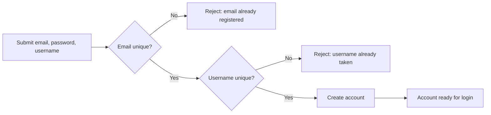
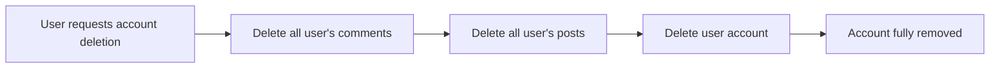
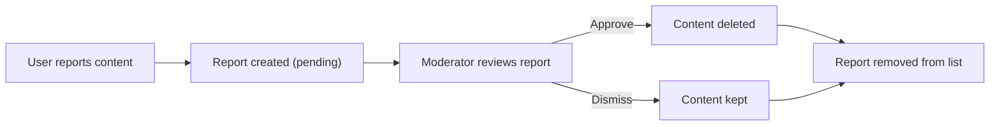
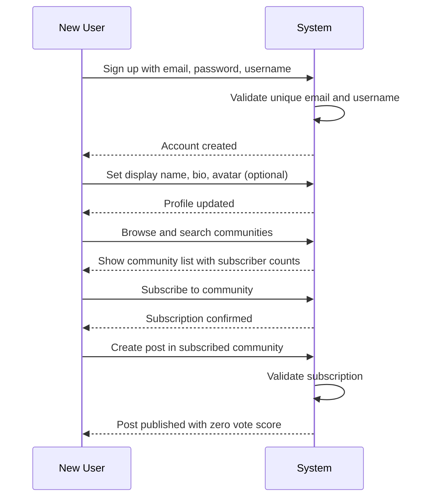
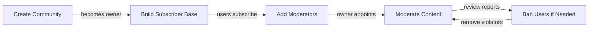
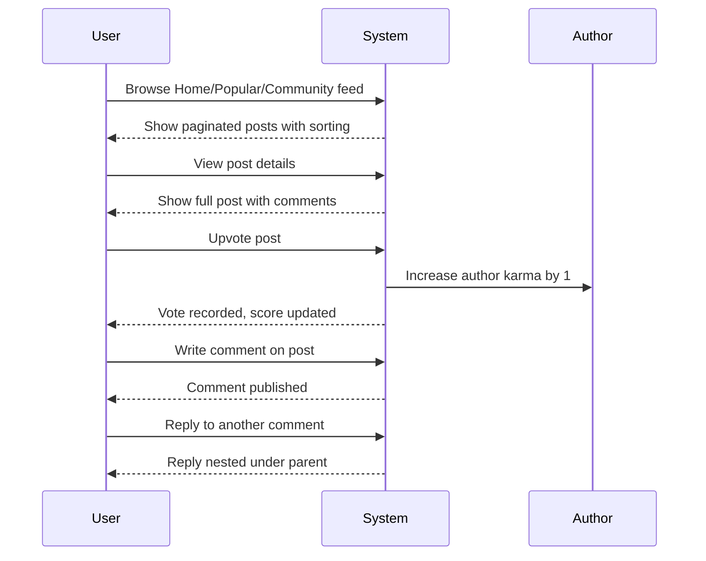
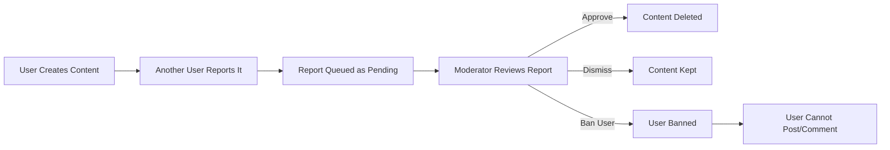
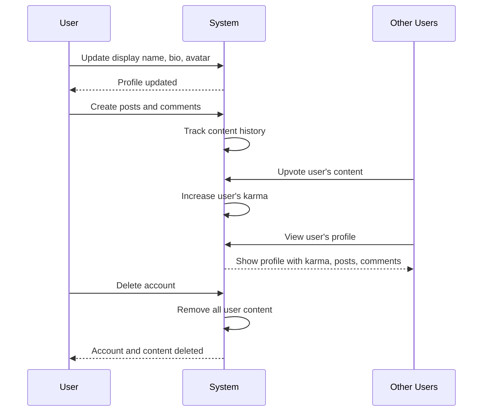

**communityPlatform — What operations users can perform, use cases, business workflows**

What operations users can perform, use cases, business workflows

# Core Business Operations

What the system must do for each business concept.

## User Operations

Users can create an account by providing an email address, password, and choosing a unique username. The email must not already be registered in the system, and the username must be unique across all users. After signing up, users can log in using their email and password to access their account. Users can change their password at any time while logged in. Users can delete their account entirely, which removes all of their posts and comments from the platform. Each user has a profile containing a display name, bio text, and avatar image, all of which they can edit. Users can view any other user's profile to see their display name, bio, avatar, total karma score, and a list of all posts and comments they have created.

### Account Creation

WHEN a user submits an email address, password, and username for registration, THE system SHALL create a new user account.

THE system SHALL require each new account to provide an email address, a password, and a username.

THE system SHALL reject the registration if the submitted email address is already registered to another user.

THE system SHALL reject the registration if the submitted username is already taken by another user.

IF the registration is successful, THEN THE system SHALL enable the user to log in with the provided credentials.

### Login

WHEN a user submits an email address and password, THE system SHALL authenticate the user.

THE system SHALL validate the submitted credentials against the registered account.

IF the credentials match a registered account, THEN THE system SHALL grant the user access to their account.

IF the credentials do not match any registered account, THEN THE system SHALL reject the login attempt.

### Password Management

WHEN a logged-in user submits a password change request, THE system SHALL update the user's password.

THE system SHALL allow users to change their password while logged in.

### Account Deletion

WHEN a user requests to delete their account, THE system SHALL permanently remove the user's account.

THE system SHALL delete all posts created by the user when the account is deleted.

THE system SHALL delete all comments written by the user when the account is deleted.

### Profile Management

THE system SHALL provide each user with a profile containing a display name, bio text, and avatar image.

WHEN a user edits their display name, THE system SHALL update the display name on the user's profile.

WHEN a user edits their bio text, THE system SHALL update the bio on the user's profile.

WHEN a user uploads a new avatar image, THE system SHALL update the avatar on the user's profile.

### Profile Viewing

THE system SHALL allow any user to view any other user's profile.

WHEN viewing a user's profile, THE system SHALL display the user's display name, bio, and avatar.

WHEN viewing a user's profile, THE system SHALL display the user's total karma score.

WHEN viewing a user's profile, THE system SHALL display a list of all posts created by that user.

WHEN viewing a user's profile, THE system SHALL display a list of all comments written by that user.

## Community Operations

Any user can create a new community by providing a unique name, description text, and an icon image. The community name must be unique across the platform. The user who creates a community automatically becomes its owner with full authority over the community. Users can browse all communities in a list view to discover new communities. Users can search for communities by name to find specific ones. Each community displays its subscriber count to show how many users have subscribed. Communities can be viewed by any user, including those who are not logged in or not subscribed.

### Community Creation

THE system SHALL allow any user to create a new community.

WHEN a user creates a community, THE system SHALL require the user to provide a community name and description text.

THE system SHALL require the community name to be unique across all communities in the platform.

IF a user attempts to create a community with a name that already exists, THE system SHALL reject the creation request.

WHEN a community is successfully created, THE system SHALL designate the creating user as the community owner with full authority over the community.

THE system SHALL store the community name, description text, and icon image upon creation.

THE system SHALL initialize the subscriber count to zero when a community is created.

### Community Icon Upload

THE system SHALL allow users to upload an image as the community icon during community creation.

THE system SHALL accept and store the uploaded icon image associated with the community.

THE system SHALL display the community icon when the community is shown in lists and detail views.

### Community Browsing and Search

THE system SHALL provide a list view displaying all communities in the platform.

THE system SHALL allow any user, including those who are not logged in, to browse the list of all communities.

THE system SHALL allow users to search for communities by name.

WHEN a user performs a community search, THE system SHALL return communities whose names match or contain the search term.

THE system SHALL enable users to discover and explore communities through browsing and searching without requiring login or subscription.

IF a search returns no matching communities, THE system SHALL display an empty result message.

### Community Information Visibility

THE system SHALL display the subscriber count for each community.

THE system SHALL allow any user to view a community's information, including its name, description, icon, and subscriber count.

THE system SHALL permit viewing of community information without requiring the viewer to be logged in.

THE system SHALL permit viewing of community information without requiring the viewer to be subscribed to that community.

THE system SHALL update the displayed subscriber count when users subscribe to or unsubscribe from a community.

## Post Operations

Users can create a post in any community they are subscribed to. Every post requires a title, and must be one of three types: a text post with text content, a link post with a URL, or an image post with an uploaded image. Users can edit their own posts after creation. Users can delete their own posts at any time. When viewing a single post, users see the title, full content, author username, community name, vote score, comment count, and when it was posted. Posts appear in feeds with a preview showing title, author, community, vote score, comment count, time since posting, and either text preview, image thumbnail, or link domain. Posts can be viewed in the Home Feed from subscribed communities, the Popular Feed from all communities, or a specific Community Feed. All feeds can be sorted by hot, new, top, or controversial ordering, and are paginated for browsing.

### Post Creation

WHEN a user attempts to create a post in a community they are subscribed to, THE system SHALL accept the post creation request.

WHEN a user attempts to create a post in a community they are not subscribed to, THE system SHALL reject the request.

WHEN a user creates a post, THE system SHALL require a title.

WHEN a user creates a post without a title, THE system SHALL reject the request.

WHEN a user creates a post, THE system SHALL require the post to be designated as one of three types: a text post, a link post, or an image post.

WHEN a user creates a text post, THE system SHALL require text content.

WHEN a user creates a link post, THE system SHALL require a URL.

WHEN a user creates an image post, THE system SHALL require an uploaded image.

WHEN a post is successfully created, THE system SHALL associate the post with the creating user as the author.

WHEN a post is successfully created, THE system SHALL associate the post with the specified community.

WHEN a post is successfully created, THE system SHALL record the time of creation.

### Post Editing

WHEN a user edits their own post, THE system SHALL allow modification of the title and content.

WHEN a user edits a text post, THE system SHALL allow modification of the text content.

WHEN a user edits a link post, THE system SHALL allow modification of the URL.

WHEN a user edits an image post, THE system SHALL allow replacement of the image.

WHEN a user attempts to edit a post they did not create, THE system SHALL reject the request.

WHEN a user successfully edits a post, THE system SHALL preserve the original author and community associations.

### Post Deletion

WHEN a user deletes their own post, THE system SHALL remove the post from view.

WHEN a user deletes their own post, THE system SHALL also remove all comments associated with that post.

WHEN a user attempts to delete a post they did not create, THE system SHALL reject the request.

WHEN a post is deleted, THE system SHALL remove it from all feeds and community listings.

### Viewing a Single Post

WHEN a user views a single post, THE system SHALL display the title.

WHEN a user views a single post, THE system SHALL display the full content appropriate to the post type.

WHEN a user views a single post, THE system SHALL display the author's username.

WHEN a user views a single post, THE system SHALL display the community name where the post was created.

WHEN a user views a single post, THE system SHALL display the vote score.

WHEN a user views a single post, THE system SHALL display the comment count.

WHEN a user views a single post, THE system SHALL display when the post was created.

### Post List Previews

WHEN a post appears in any feed list, THE system SHALL display the title.

WHEN a post appears in any feed list, THE system SHALL display the author's username.

WHEN a post appears in any feed list, THE system SHALL display the community name.

WHEN a post appears in any feed list, THE system SHALL display the vote score.

WHEN a post appears in any feed list, THE system SHALL display the comment count.

WHEN a post appears in any feed list, THE system SHALL display the time elapsed since the post was created.

WHEN a text post appears in any feed list, THE system SHALL display the first 200 characters of the text content as a preview.

WHEN an image post appears in any feed list, THE system SHALL display a thumbnail of the image.

WHEN a link post appears in any feed list, THE system SHALL display the domain name extracted from the URL.

### Home Feed

WHEN a logged-in user views the Home Feed, THE system SHALL display posts only from communities the user is subscribed to.

WHEN a user who is not logged in attempts to view the Home Feed, THE system SHALL not allow access.

THE Home Feed SHALL support sorting by hot, new, top, and controversial ordering.

THE Home Feed SHALL be paginated for browsing.

### Popular Feed

WHEN any user views the Popular Feed, THE system SHALL display posts from all communities across the platform.

WHEN a user who is not logged in views the Popular Feed, THE system SHALL allow access.

THE Popular Feed SHALL support sorting by hot, new, top, and controversial ordering.

THE Popular Feed SHALL be paginated for browsing.

### Community Feed

WHEN any user views a specific community's feed, THE system SHALL display posts only from that community.

WHEN a user who is not logged in views a community feed, THE system SHALL allow access.

THE Community Feed SHALL support sorting by hot, new, top, and controversial ordering.

THE Community Feed SHALL be paginated for browsing.

### Feed Sorting Options

WHEN a user selects hot sorting, THE system SHALL display recent posts with many upvotes first.

WHEN a user selects new sorting, THE system SHALL display the most recently created posts first.

WHEN a user selects top sorting, THE system SHALL display posts with the highest vote score first.

WHEN a user selects top sorting, THE system SHALL provide time filter options: today, this week, this month, this year, and all time.

WHEN a user selects controversial sorting, THE system SHALL display posts with many votes but a score close to zero first.

## Comment Operations

Users can write a comment on any post regardless of subscription status. Users can reply to any existing comment, creating threaded discussions. Replies can be nested with no depth limit, allowing for extended conversation threads. Users can edit their own comments after posting them. Users can delete their own comments at any time. Each comment displays the author username, comment content, vote score, and time since it was posted. Comments show their nested replies underneath in a threaded structure. Comments on a post can be sorted by best (highest vote score), new (most recent), or controversial (many votes but score close to zero).

### Comment Creation

THE system SHALL allow users to create a comment on any post regardless of subscription status to the post's community.

THE system SHALL require users to provide comment content text when creating a comment.

THE system SHALL associate each comment with the author who created it.

THE system SHALL record the creation timestamp for each comment.

THE system SHALL initialize each comment with a vote score of zero.

WHEN a user creates a comment, THE system SHALL link the comment to the post being commented on.

### Comment Reply

THE system SHALL allow users to reply to any existing comment.

WHEN a user replies to a comment, THE system SHALL create a nested comment linked to the parent comment.

THE system SHALL allow reply threads to be nested with no depth limit.

THE system SHALL display nested replies in a threaded structure beneath their parent comments.

WHEN viewing comments, THE system SHALL show replies indented or visually nested under their parent comments.

### Comment Editing

THE system SHALL allow users to edit their own comments after creation.

WHEN a user edits a comment, THE system SHALL update the comment content.

THE system SHALL record the time when a comment was last edited.

### Comment Deletion

THE system SHALL allow users to delete their own comments at any time.

WHEN a user deletes a comment, THE system SHALL remove the comment from display.

WHEN a comment is deleted, THE system SHALL remove any replies to that comment as well.

### Comment Display

THE system SHALL display the author username for each comment.

THE system SHALL display the vote score for each comment.

THE system SHALL display the time elapsed since the comment was posted, such as "3 hours ago".

THE system SHALL display nested replies beneath each comment in a threaded structure.

### Comment Sorting

THE system SHALL allow users to sort comments on a post by three methods: best, new, and controversial.

WHEN sorting by best, THE system SHALL display comments with the highest vote score first.

WHEN sorting by new, THE system SHALL display the most recently created comments first.

WHEN sorting by controversial, THE system SHALL display comments with many votes but a vote score close to zero first.

## Vote Operations

Users can upvote any post or comment to add one point to its score. Users can downvote any post or comment to subtract one point from its score. Each user can only cast one vote per post or comment. Users can change their existing vote from upvote to downvote or vice versa. Users can remove their vote entirely, which adjusts the score accordingly. The vote score for any post or comment is calculated as total upvotes minus total downvotes. When a user receives an upvote on their post or comment, their karma score increases by one. When a user receives a downvote on their post or comment, their karma score decreases by one. Karma scores can be negative if a user receives more downvotes than upvotes.

### Casting Votes on Posts and Comments

THE system SHALL allow users to upvote any post or comment, adding one point to its vote score.

THE system SHALL allow users to downvote any post or comment, subtracting one point from its vote score.

THE system SHALL permit only one vote per user per post or comment.

WHEN a user casts a vote on a post or comment, THE system SHALL record whether the vote is an upvote or a downvote.

IF a user attempts to cast a second vote on the same post or comment, THE system SHALL reject the request.

The vote type (upvote or downvote) determines whether the score increases or decreases.

### Changing Votes

THE system SHALL allow users to change their existing vote from an upvote to a downvote.

THE system SHALL allow users to change their existing vote from a downvote to an upvote.

WHEN a user changes their vote from upvote to downvote, THE system SHALL subtract two points from the vote score (removing the previous upvote and applying the downvote).

WHEN a user changes their vote from downvote to upvote, THE system SHALL add two points to the vote score (removing the previous downvote and applying the upvote).

THE system SHALL update the vote record to reflect the new vote type when a user changes their vote.

### Removing Votes

THE system SHALL allow users to remove their vote entirely from any post or comment.

WHEN a user removes an upvote, THE system SHALL subtract one point from the vote score.

WHEN a user removes a downvote, THE system SHALL add one point to the vote score.

THE system SHALL delete the vote record when a user removes their vote, allowing the user to cast a new vote on the same item in the future.

### Vote Score Calculation

THE system SHALL calculate the vote score for any post or comment as the total number of upvotes minus the total number of downvotes.

THE system SHALL display the vote score alongside each post and comment.

THE system SHALL update the vote score in real-time when votes are cast, changed, or removed.

The vote score can be positive, zero, or negative depending on the ratio of upvotes to downvotes.

### Karma Impact from Votes

WHEN a user receives an upvote on their post or comment, THE system SHALL increase their karma score by one.

WHEN a user receives a downvote on their post or comment, THE system SHALL decrease their karma score by one.

THE system SHALL allow karma scores to be negative when a user receives more downvotes than upvotes across their posts and comments.

WHEN a vote is removed from a post or comment, THE system SHALL adjust the author's karma accordingly (subtracting one if an upvote was removed, adding one if a downvote was removed).

WHEN a vote is changed from upvote to downvote, THE system SHALL decrease the author's karma by two (removing the upvote benefit and applying the downvote penalty).

WHEN a vote is changed from downvote to upvote, THE system SHALL increase the author's karma by two (removing the downvote penalty and applying the upvote benefit).

THE system SHALL maintain a single karma score per user that reflects the net total of all votes received on their posts and comments.

## Subscription Operations

Users can subscribe to any community on the platform. Users can unsubscribe from any community they are subscribed to. Users can view a list of all communities they are subscribed to. Subscribing to a community is required before a user can create posts in that community. The subscription status does not affect a user's ability to view community content, comment on posts, or vote on posts and comments. Users can subscribe to multiple communities and manage their subscription list.

### Subscribe to Community

THE system SHALL allow a logged-in user to subscribe to any community on the platform.

THE system SHALL record the subscription with a timestamp indicating when the user subscribed.

THE system SHALL increment the community's subscriber count by one when a user subscribes.

THE system SHALL allow a user to subscribe to multiple communities.

THE system SHALL allow a user to subscribe to a community regardless of whether they have previously subscribed and unsubscribed from that community.

WHEN a user subscribes to a community, THE system SHALL add that community to the user's subscription list.

THE system SHALL NOT limit the number of communities a user can subscribe to.

### Unsubscribe from Community

THE system SHALL allow a logged-in user to unsubscribe from any community they are currently subscribed to.

THE system SHALL remove the community from the user's subscription list when unsubscribed.

THE system SHALL decrement the community's subscriber count by one when a user unsubscribes.

IF a user unsubscribes from a community, THEN THE system SHALL preserve any posts and comments the user has previously created in that community.

IF a user unsubscribes from a community, THEN THE system SHALL prevent the user from creating new posts in that community until they subscribe again.

### View Subscribed Communities

THE system SHALL allow a logged-in user to view a list of all communities they are subscribed to.

THE system SHALL display each subscribed community's name and icon in the subscription list.

THE system SHALL display each subscribed community's subscriber count in the subscription list.

THE system SHALL allow the user to navigate directly to any community from their subscription list.

THE system SHALL allow the user to unsubscribe from any community directly from the subscription list view.

### Subscription Access Rules

THE system SHALL require a user to be subscribed to a community before allowing them to create a post in that community.

THE system SHALL allow any user, regardless of subscription status, to view content within a community.

THE system SHALL allow any user, regardless of subscription status, to comment on posts within a community.

THE system SHALL allow any user, regardless of subscription status, to vote on posts and comments within a community.

IF a user attempts to create a post in a community they are not subscribed to, THEN THE system SHALL reject the request.

WHILE a user is not subscribed to a community, THE system SHALL still allow the user to view the community feed, read posts, write comments, and cast votes.

## Moderator Operations

The user who creates a community automatically becomes its owner with the highest authority. Owners can add moderators to their community. Owners can remove moderators from their community. Moderators can add other moderators to the community. Moderators cannot remove the owner from the moderator role. Moderators cannot remove each other; only the owner can remove moderators. Moderators can delete any post within their community. Moderators can delete any comment within their community. Moderators can ban users from their community. Moderators can unban users who were previously banned. Moderators can view the list of all banned users in their community.

### Community Ownership

When a user creates a community, THE system SHALL automatically designate that user as the owner of the community.

The owner has the highest authority within the community and can perform all moderation actions plus manage the moderator team.

There is only one owner per community at any given time.

The owner role cannot be removed by moderators; only the owner can manage the moderator team composition.

### Moderator Team Management

The owner can add moderators to their community.

The owner can remove moderators from their community.

Moderators can add other moderators to the community.

Moderators cannot remove the owner from the moderator role.

Moderators cannot remove each other; only the owner can remove moderators.

When a moderator is removed, they lose all moderator privileges in that community immediately.

### Post Deletion by Moderators

Moderators can delete any post within their community, including posts created by other users.

When a moderator deletes a post, THE system SHALL remove the post from the community and it will no longer be visible to any users.

Deleted posts and their associated comments are removed from all feeds.

The deletion is logged and visible to other moderators.

### Comment Deletion by Moderators

Moderators can delete any comment within their community, including comments created by other users.

When a moderator deletes a comment, THE system SHALL remove the comment from the post.

Deleting a comment does not delete its replies; replies remain visible unless separately deleted.

The deletion is logged and visible to other moderators.

### User Unbanning

Moderators can unban users who were previously banned from the community.

When a user is unbanned, THE system SHALL restore their ability to create posts and comments in that community.

The unbanned user can immediately participate in the community again.

### Banned User List

Moderators can view the list of all banned users in their community.

The banned users list shows each banned user and the reason for their ban.

Only moderators can access the banned users list.

## Ban Operations

Moderators can ban users from their community, preventing them from participating. When banning a user, moderators must provide a reason for the ban. Banned users cannot create posts in that community. Banned users cannot write comments in that community. Banned users can still view content within the community they are banned from. Moderators can unban users to restore their ability to post and comment. Moderators can view a list of all banned users in their community to manage bans.

### Banning a User from Community

Moderators can ban any user from their community.

WHEN a moderator bans a user from a community, THE SYSTEM SHALL record the ban with a reason provided by the moderator.

WHEN a moderator bans a user from a community, THE SYSTEM SHALL require the moderator to provide a reason for the ban.

IF a moderator attempts to ban a user without providing a reason, THEN THE SYSTEM SHALL reject the ban request.

WHEN a moderator bans a user from a community, THE SYSTEM SHALL record the date and time when the ban was applied.

WHEN a moderator bans a user from a community, THE SYSTEM SHALL associate the ban with the specific community.

### Banned User Restrictions

Banned users have restricted abilities within the community they are banned from.

WHILE a user is banned from a community, THE SYSTEM SHALL prevent that user from creating posts in that community.

WHILE a user is banned from a community, THE SYSTEM SHALL prevent that user from writing comments in that community.

WHILE a user is banned from a community, THE SYSTEM SHALL allow that user to view all content within that community.

IF a banned user attempts to create a post in the community they are banned from, THEN THE SYSTEM SHALL reject the request.

IF a banned user attempts to write a comment in the community they are banned from, THEN THE SYSTEM SHALL reject the request.

### Unbanning a User

Moderators can remove bans to restore user access.

Moderators can unban any user who has been banned from their community.

WHEN a moderator unbans a user from a community, THE SYSTEM SHALL restore that user's ability to create posts in that community.

WHEN a moderator unbans a user from a community, THE SYSTEM SHALL restore that user's ability to write comments in that community.

WHEN a moderator unbans a user from a community, THE SYSTEM SHALL remove the ban record from the active bans list.

AFTER a user has been unbanned from a community, THE SYSTEM SHALL treat that user as a regular member with full posting and commenting privileges.

### Viewing and Managing Banned Users

Moderators can view and manage all banned users in their community.

Moderators can view a list of all users who have been banned from their community.

WHEN a moderator views the banned users list, THE SYSTEM SHALL display each banned user along with the reason for their ban.

WHEN a moderator views the banned users list, THE SYSTEM SHALL display the date and time each ban was applied.

The banned users list enables moderators to manage community bans and make informed decisions about unbanning users.

## Report Operations

Users can report any post or comment that violates community rules or platform policies. When submitting a report, users must provide a text reason explaining why the content is being reported. Moderators can view all reports submitted for their community. Each report displays the reported content, the user who submitted the report, and the reason provided. Moderators can approve a report, which removes the reported content from the community. Moderators can dismiss a report, which keeps the content visible and removes the report from the pending list. Dismissed reports no longer appear in the report list for moderators to review.

### Report Content Submission

Users can report any post or comment that they believe violates community rules or platform policies.

THE system SHALL allow users to submit a report on any post or comment.

WHEN a user submits a report, THE system SHALL require the user to provide a reason in text explaining why the content is being reported.

IF a user attempts to submit a report without providing a reason, THEN THE system SHALL reject the report submission.

WHEN a report is successfully submitted, THE system SHALL associate the report with the reported content, the user who submitted the report, the reason text provided, and the community where the content was posted.

THE system SHALL set the initial status of each report to pending.

THE system SHALL record the timestamp when the report was submitted.

Users can report the same content multiple times if they believe additional reports are warranted.

### Moderator Report View

Moderators can view all reports submitted for their community.

THE system SHALL display a list of all pending reports to moderators of the community.

WHEN a moderator views a report, THE system SHALL display the reported content (the full post or comment).

WHEN a moderator views a report, THE system SHALL display the username of the user who submitted the report.

WHEN a moderator views a report, THE system SHALL display the reason text provided by the reporter.

THE system SHALL display the timestamp when the report was submitted.

The report list shows all pending reports that have not yet been approved or dismissed by a moderator.

### Report Approval

Moderators can approve reports to remove content that violates community rules.

THE system SHALL allow moderators to approve any pending report in their community.

WHEN a moderator approves a report, THE system SHALL delete the reported content from the community.

WHEN a reported post is deleted through report approval, THE system SHALL also delete all comments on that post.

WHEN a report is approved, THE system SHALL remove the report from the pending reports list.

THE system SHALL record the moderator who approved the report and when the approval occurred.

Approval is irreversible—once content is deleted through report approval, it cannot be restored.

### Report Dismissal

Moderators can dismiss reports when the content does not violate community rules.

THE system SHALL allow moderators to dismiss any pending report in their community.

WHEN a moderator dismisses a report, THE system SHALL keep the reported content visible in the community.

WHEN a report is dismissed, THE system SHALL remove the report from the pending reports list.

Dismissed reports no longer appear in the report list for moderators to review.

THE system SHALL record the moderator who dismissed the report and when the dismissal occurred.

Dismissal does not penalize the user who submitted the report or the author of the reported content.

### Content Moderation Workflow

The content moderation workflow enables moderators to review and act on user-reported content.

THE system SHALL maintain reports in pending status until a moderator takes action.

WHEN a moderator views the pending reports list, THE system SHALL display all reports awaiting moderator action.

Moderators can act on reports in any order they choose.

Multiple reports may exist for the same content, and each report is handled independently by moderators.

Once a report is approved or dismissed, it is removed from the pending reports list and no longer requires moderator action.

# Error Scenarios and Edge Cases

Business-level error scenarios, edge case coverage, and expected system behaviors for exceptional conditions.

## User Error Scenarios

When a user attempts to sign up with an email address that is already registered, the system prevents the registration and informs the user that the email is already in use. Similarly, if a user chooses a username that has already been taken by another user, the system rejects the signup request and prompts the user to select a different username. During login, if a user enters an incorrect password or an email that does not exist in the system, the login attempt fails and the user is notified of invalid credentials. When a user deletes their account, all of their posts and comments are permanently removed from the platform, which may affect discussions in communities they participated in. Users attempting to change their password must provide their current password correctly before the change is allowed.

### Account Deletion Cascade

When a user deletes their account, the system SHALL permanently remove all posts created by that user from all communities.

When a user deletes their account, the system SHALL permanently remove all comments written by that user from all posts.

The removal of posts and comments as a result of account deletion is permanent and cannot be undone. Other users' discussions in threads where the deleted user participated may appear with missing replies.

When a deleted user's posts are removed, any votes on those posts remain accounted for in other users' karma scores from the time when the votes were cast. However, the deleted user's own votes on other users' content SHALL be removed, and those karma scores SHALL be adjusted accordingly.

Account deletion removes the user's profile, authentication credentials, and all associated content in a single operation. The user cannot selectively preserve some content while deleting their account.

## Community Error Scenarios

When a user attempts to create a community with a name that already exists on the platform, the system prevents the creation and informs the user to choose a different name. Community names must be unique across the entire platform, so even slight variations may be rejected if they conflict with existing communities. If a user searches for communities using terms that yield no results, the system displays an empty result list rather than throwing an error. When viewing communities, the subscriber count is always displayed even if it is zero, accurately reflecting the community's membership status. The community creator is automatically assigned the owner role and cannot be removed from this position by any moderator action.

### Community Creator Role Assignment

WHEN a user successfully creates a community, THE system SHALL automatically assign the creator the owner role.

THE community creator SHALL hold the highest authority role (owner) and cannot be removed from this position by any moderator action.

IF a community is created, THEN THE system SHALL ensure the creator has the owner role before any other users can be added as moderators.

WHEN a community is created, THE system SHALL not allow the owner role to be transferred to another user.

THE owner role SHALL grant the ability to add and remove moderators within the community.

## Post Error Scenarios

Users who are not subscribed to a community cannot create posts in that community, and the system must block any attempt to post without a subscription. Every post must have a title, and the system rejects any submission attempt that lacks one. A post must be exactly one of three types: text, link, or image. If a user attempts to create a post without specifying one of these types with its required content, the system rejects the post. Users can only edit and delete their own posts. If a user attempts to modify or remove a post created by another user, the system denies the action. When a post is deleted, its associated votes and comments are also removed from the platform. Banned users cannot create posts in communities where they have been banned, though they can still view the content.

### Subscription Requirement for Posting

IF a user attempts to create a post in a community they are not subscribed to, THEN THE SYSTEM SHALL reject the request.

Users must have an active subscription to a community before they can create posts in that community. The subscription requirement ensures that only engaged community members can contribute content.

IF a user who is not subscribed attempts to submit a post, THEN THE SYSTEM SHALL display an appropriate message indicating that subscription is required for posting in that community.

### Post Title Requirement

IF a user attempts to create a post without providing a title, THEN THE SYSTEM SHALL reject the request.

THE SYSTEM SHALL require every post to have a title, regardless of post type (text, link, or image). A post with an empty or missing title cannot be submitted.

IF a post submission lacks a title, THEN THE SYSTEM SHALL notify the user that a title is required to proceed with post creation.

### Post Type Requirements

IF a user creates a post, THEN THE SYSTEM SHALL require exactly one of three post types: text, link, or image.

IF a user creates a text post, THEN THE SYSTEM SHALL require text content to be provided.

IF a user creates a link post, THEN THE SYSTEM SHALL require a URL to be provided.

IF a user creates an image post, THEN THE SYSTEM SHALL require an uploaded image file.

IF a user attempts to create a post without specifying one of these three types with its required content, THEN THE SYSTEM SHALL reject the request.

IF a user attempts to submit a post with multiple content types simultaneously, THEN THE SYSTEM SHALL reject the request and require selection of a single post type.

### Post Editing Authorization

IF a user attempts to edit a post they did not create, THEN THE SYSTEM SHALL deny the action.

Users can only edit their own posts. The system verifies post ownership before allowing any modification.

IF a non-owner attempts to modify a post created by another user, THEN THE SYSTEM SHALL display an appropriate message indicating that editing is restricted to the post author.

Community moderators have separate privileges for content removal, which is distinct from post editing.

### Post Deletion Authorization

IF a user attempts to delete a post they did not create, THEN THE SYSTEM SHALL deny the action.

Users can only delete their own posts. The system verifies post ownership before allowing deletion.

IF a non-owner attempts to delete a post created by another user, THEN THE SYSTEM SHALL display an appropriate message indicating that deletion is restricted to the post author.

Community moderators can delete posts within their community as a separate moderation function, but this is not available to regular members.

### Banned User Posting Restriction

IF a user has been banned from a community, THEN THE SYSTEM SHALL reject any attempt by that user to create a post in that community.

Banned users retain the ability to view content within the community but cannot contribute new posts.

IF a banned user attempts to submit a post in a community where they are banned, THEN THE SYSTEM SHALL display an appropriate message indicating that the user is banned from posting in that community.

The posting restriction applies regardless of whether the banned user has an active subscription to the community.

### Post Deletion Cascade Effects

WHEN a post is deleted, THE SYSTEM SHALL remove all votes associated with that post from the platform.

WHEN a post is deleted, THE SYSTEM SHALL remove all comments associated with that post from the platform.

The deletion cascade includes all nested replies to any comments on the deleted post, with no depth limit.

The removal of votes affects the karma score of the post author, adjusting their total karma by removing the votes that were previously attributed to the deleted post.

WHEN a post is deleted as a result of a report being approved by a moderator, THE SYSTEM SHALL apply the same cascade effects, removing all associated comments and votes.

## Comment Error Scenarios

Users can only edit and delete their own comments. Attempts to modify or remove comments written by other users are denied by the system. When a comment is deleted, any replies nested beneath it remain visible but the deleted comment may be marked as removed or its content hidden. There is no maximum depth limit for nested replies, so the system must handle deeply threaded conversations gracefully. Banned users cannot write comments in communities where they have been banned, but they can still view existing comments and posts. Comments must contain content, and empty comment submissions are rejected. Users can reply to any comment regardless of who wrote it, as long as they are not banned from that community.

### Comment Ownership Validation

THE system SHALL associate each comment with the user who created it.

WHEN a user attempts to edit or delete a comment, THE system SHALL verify that the current user is the author of that comment.

IF a user attempts to modify a comment they did not author, THEN THE system SHALL reject the request.

THE system SHALL allow users to reply to any comment regardless of who authored it, provided the user is not banned from that community.

Comment authorship is established at the time of comment creation and cannot be transferred to another user.

### Editing Others' Comments Denied

IF a user attempts to edit a comment written by another user, THEN THE system SHALL reject the edit request.

WHEN an edit is rejected due to ownership mismatch, THE system SHALL NOT modify the comment content.

THE system SHALL only permit the original author to edit a comment's content.

This restriction applies to all users regardless of their role, except for community moderators who have separate deletion privileges as defined in Community Moderation.

### Deleting Others' Comments Denied

IF a user attempts to delete a comment written by another user, THEN THE system SHALL reject the deletion request.

WHEN a deletion is rejected due to ownership mismatch, THE system SHALL preserve the comment.

THE system SHALL only permit the original author to delete their own comment.

Community moderators may delete comments in their community through separate moderator privileges, but standard users cannot delete comments authored by others.

### Banned User Commenting Blocked

IF a user has been banned from a community, THEN THE system SHALL prevent that user from creating comments in that community.

WHEN a banned user attempts to submit a comment in a community where they are banned, THE system SHALL reject the comment submission.

WHILE a user is banned from a community, THE system SHALL allow that user to view existing comments and posts in that community.

WHEN a user's ban is removed, THE system SHALL restore their ability to create comments in that community.

### Empty Comment Rejection

IF a user submits a comment without any content, THEN THE system SHALL reject the submission.

WHEN a comment submission is rejected due to missing content, THE system SHALL NOT create an empty comment record.

THE system SHALL require all comments to contain text content.

WHITESPACE-ONLY content SHALL be treated as empty and rejected.

### Unlimited Reply Depth

THE system SHALL support nested comment replies with no maximum depth limit.

WHEN a user replies to a comment that is itself a reply, THE system SHALL create the new reply at the next depth level.

THE system SHALL display nested replies in a threaded structure that shows the parent-child relationship between comments.

The system must handle deeply threaded conversations without imposing a maximum nesting level.

### Nested Reply Handling

WHEN a parent comment is deleted, THE system SHALL preserve all replies nested beneath it.

THE system SHALL continue to display nested replies even after their parent comment has been deleted.

WHEN displaying replies to a deleted comment, THE system SHALL indicate that the parent comment has been removed.

THE system SHALL maintain the threading structure of nested replies regardless of parent comment deletion status.

### Deleted Comment Display Behavior

WHEN a comment is deleted by its author, THE system SHALL mark the comment as deleted rather than completely removing it from the database.

WHEN displaying a deleted comment, THE system SHALL hide the original content and indicate that the comment has been removed.

THE system SHALL continue to display the existence of a deleted comment in the thread structure to preserve conversation context.

Replies to a deleted comment SHALL remain visible and accessible to users.

## Vote Error Scenarios

Each user can only cast one vote per post or comment. If a user attempts to vote multiple times on the same item, the system updates their existing vote rather than creating a duplicate. When a user changes their vote from upvote to downvote or vice versa, the vote score adjusts by two points: removing the original vote value and adding the new one. If a user removes their vote entirely, the vote score returns to its state before that user voted. Karma scores can become negative if a user receives more downvotes than upvotes across their posts and comments. The vote score displayed on any post or comment is always calculated as total upvotes minus total downvotes, which can result in negative scores for unpopular content.

### Single Vote Enforcement

THE communityPlatform SHALL allow each user to cast only one vote on any single post or comment.

IF a user attempts to vote on a post or comment they have already voted on, THEN THE communityPlatform SHALL update their existing vote rather than creating a duplicate.

THE communityPlatform SHALL ensure that vote counts accurately reflect one vote per user, regardless of how many times a user attempts to vote on the same item.

WHEN a user votes on a post or comment for the first time, THE communityPlatform SHALL create a new vote record.

WHEN a user votes on a post or comment they have already voted on, THE communityPlatform SHALL replace their previous vote with the new vote selection.

### Vote Change Score Adjustment

WHEN a user changes their vote from an upvote to a downvote, THE communityPlatform SHALL adjust the vote score by two points downward.

WHEN a user changes their vote from a downvote to an upvote, THE communityPlatform SHALL adjust the vote score by two points upward.

THE communityPlatform SHALL apply a two-point score adjustment when a vote changes type because the original vote value is removed and the new vote value is added.

IF a user changes their vote on a post, THEN THE communityPlatform SHALL update both the post's vote score and the author's karma accordingly.

IF a user changes their vote on a comment, THEN THE communityPlatform SHALL update both the comment's vote score and the author's karma accordingly.

THE communityPlatform SHALL ensure vote score adjustments are atomic—both the removal of the old vote and the addition of the new vote occur together.

### Vote Removal Behavior

IF a user removes their vote entirely from a post or comment, THEN THE communityPlatform SHALL adjust the vote score by one point in the opposite direction of their original vote.

WHEN a user removes an upvote, THE communityPlatform SHALL decrease the vote score by one.

WHEN a user removes a downvote, THE communityPlatform SHALL increase the vote score by one.

IF a user removes their vote, THEN THE communityPlatform SHALL return the vote score to the state it would have been in had that user never voted.

WHEN a user removes their vote from a post or comment, THE communityPlatform SHALL update the author's karma accordingly—decreasing karma if the removed vote was an upvote, or increasing karma if the removed vote was a downvote.

THE communityPlatform SHALL allow users to remove their votes without restriction, regardless of when the vote was originally cast.

### Negative Karma Handling

THE communityPlatform SHALL allow karma scores to become negative when a user receives more downvotes than upvotes across their posts and comments.

IF a user's total received downvotes exceeds their total received upvotes, THEN THE communityPlatform SHALL display their karma as a negative number.

THE communityPlatform SHALL calculate a user's karma as the sum of all upvotes received minus the sum of all downvotes received on all their posts and comments.

WHEN an upvote is cast on a user's post or comment, THE communityPlatform SHALL increase that user's karma by one.

WHEN a downvote is cast on a user's post or comment, THE communityPlatform SHALL decrease that user's karma by one.

WHEN a vote is removed from a user's post or comment, THE communityPlatform SHALL adjust that user's karma in the opposite direction of the removed vote.

IF a user changes their vote on a post or comment, THEN THE communityPlatform SHALL adjust the author's karma to reflect both the removal of the original vote and the addition of the new vote.

THE communityPlatform SHALL NOT impose a minimum karma threshold—karma can decrease without lower bound based on received downvotes.

### Vote Score Calculation and Display

THE communityPlatform SHALL calculate the vote score of any post or comment as the total number of upvotes minus the total number of downvotes.

IF the total downvotes on a post or comment exceeds the total upvotes, THEN THE communityPlatform SHALL display the vote score as a negative number.

THE communityPlatform SHALL display vote scores consistently across all views where posts and comments appear.

THE communityPlatform SHALL recalculate vote scores in real time as votes are added, changed, or removed.

THE communityPlatform SHALL apply the same vote score calculation method to both posts and comments.

IF a post or comment has received no votes, THEN THE communityPlatform SHALL display a vote score of zero.

## Subscription Error Scenarios

Users cannot create posts in a community they are not subscribed to, and the system enforces this requirement before allowing any post creation. Users can subscribe to any community that exists on the platform, but attempting to subscribe to a non-existent community is not possible. Users can unsubscribe from communities at any time, which immediately removes their ability to create new posts in that community. If a user views their subscription list and they have not subscribed to any communities, the list displays as empty. Users who are not logged in cannot access the home feed since it only shows posts from subscribed communities, and they must use the popular feed or specific community feeds instead. Attempting to access the home feed without authentication redirects or shows an appropriate message.

### Posting Without Subscription

THE system SHALL require users to be subscribed to a community before allowing them to create posts in that community.

IF a user attempts to create a post in a community they are not subscribed to, THEN THE system SHALL reject the request and display an error message indicating that subscription is required.

IF a user is subscribed to a community and attempts to create a post, THEN THE system SHALL allow the post creation.

WHEN a user's subscription to a community is removed or the user unsubscribes, THE system SHALL immediately prevent the user from creating new posts in that community.

THE system SHALL not retroactively delete existing posts when a user unsubscribes from a community.

IF a user views a community they are not subscribed to, THEN THE system SHALL display the community content but SHALL NOT display the post creation interface.

### Unauthenticated Home Feed Access

IF a user is not logged in and attempts to access the home feed, THEN THE system SHALL redirect the user or display an appropriate message indicating that login is required.

THE home feed SHALL only display posts from communities the authenticated user is subscribed to.

IF a guest user attempts to access the home feed, THEN THE system SHALL NOT allow access and SHALL suggest using the popular feed or browsing specific communities instead.

WHILE a user is not authenticated, THE system SHALL prevent access to the home feed.

THE popular feed and community feeds SHALL be available to all users regardless of authentication status.

### Empty Subscription List Display

IF a user views their list of subscribed communities and they have not subscribed to any communities, THEN THE system SHALL display an empty list state.

WHEN the subscription list is empty, THE system SHALL display a message indicating that the user has not subscribed to any communities.

THE system SHALL display the empty subscription list state even when the user is authenticated.

IF a user has no subscriptions, THEN THE system SHALL still allow access to the home feed but SHALL display a message indicating there are no posts to show.

### Unsubscribe Immediate Effect

WHEN a user unsubscribes from a community, THE system SHALL immediately remove the user's ability to create new posts in that community.

THE system SHALL immediately update the community's subscriber count when a user unsubscribes.

WHEN a user unsubscribes from a community, THE system SHALL immediately remove that community's posts from the user's home feed.

THE system SHALL allow users to re-subscribe to a community they previously unsubscribed from at any time.

WHEN a user re-subscribes to a community, THE system SHALL immediately restore their ability to create posts in that community.

### Community Access Without Subscription

THE system SHALL allow users to view community content without being subscribed to that community.

IF a user is not subscribed to a community, THEN THE system SHALL still allow the user to view the community feed and all posts within that community.

THE system SHALL allow users to view individual posts, comments, and vote scores in communities they are not subscribed to.

IF a user is not subscribed to a community, THEN THE system SHALL NOT allow the user to create posts or comments in that community.

THE system SHALL display the subscriber count for each community regardless of whether the viewing user is subscribed.

IF a user views a community they are not subscribed to, THEN THE system SHALL display an option to subscribe to that community.

## Moderator Error Scenarios

Moderators cannot remove the owner of a community from their position, as the owner has the highest authority and permanent role. Moderators also cannot remove other moderators from their positions; only the owner has the authority to remove moderators. If a moderator attempts to perform these restricted removal actions, the system denies the request. The owner can add and remove moderators at their discretion, but cannot be removed themselves by anyone. When a moderator is removed by the owner, they lose all moderation privileges in that community immediately. Moderators can add other moderators to help manage the community, expanding the moderation team as needed. Any moderator can delete posts and comments within their community, including content created by other moderators.

### Owner Removal Protection

IF a moderator attempts to remove the community owner from their position, THE SYSTEM SHALL reject the request and preserve the owner's role. The owner holds the highest authority in the community and cannot be removed from their position by any moderator action. IF any removal action targets the owner, THE SYSTEM SHALL deny the request regardless of which moderator initiated it. The owner's role is permanent and cannot be revoked through moderation actions.

IF a removal request identifies the target as the community owner, THE SYSTEM SHALL reject the request immediately without performing any role changes. The system displays an error message indicating that the owner cannot be removed. The owner retains all privileges and authority after any attempted removal action is rejected.

### Moderator Removal Restrictions

IF a moderator attempts to remove another moderator from the community, THE SYSTEM SHALL reject the request. Only the community owner has the authority to remove moderators from their positions. IF a moderator initiates a removal action targeting another moderator, THE SYSTEM SHALL deny the request and preserve the target moderator's role and privileges.

WHEN a moderator removal is attempted by anyone other than the owner, THE SYSTEM SHALL return an error indicating insufficient permissions. The target moderator retains all moderation privileges after the rejected removal attempt. Moderators cannot remove each other, preventing mutual conflicts within the moderation team.

### Moderator Privilege Boundary Enforcement

THE SYSTEM SHALL enforce distinct privilege boundaries between owners and moderators. The owner can add moderators, remove moderators, and exercise all moderation powers. Moderators can add other moderators and perform content moderation but cannot remove any moderators including each other.

IF a moderator attempts any action reserved for the owner, THE SYSTEM SHALL reject the request. Reserved owner actions include: removing the owner, removing any moderator, and transferring ownership. WHEN such restricted actions are attempted by a moderator, THE SYSTEM SHALL deny access and maintain the current state without changes.

### Moderator Content Deletion Rights

THE SYSTEM SHALL allow any moderator to delete posts and comments within their community. Moderators can delete content created by any user, including content created by other moderators. IF a moderator initiates a content deletion action within their community, THE SYSTEM SHALL process the deletion regardless of who created the content.

WHEN a moderator deletes content, THE SYSTEM SHALL remove the content from public view. The deleted content is no longer visible to any users. Moderators have equal authority over content moderation decisions, and no moderator's content is protected from deletion by other moderators.

### Moderator Addition Rights

THE SYSTEM SHALL allow any moderator to add new moderators to the community. Both owners and existing moderators can expand the moderation team by adding new moderators. IF a moderator initiates an action to add a new moderator, THE SYSTEM SHALL process the addition and grant moderation privileges to the new moderator.

WHEN a new moderator is added, THE SYSTEM SHALL record the addition with a timestamp and grant full moderation privileges. The newly added moderator immediately gains the ability to moderate content and add other moderators, but cannot remove any existing moderators.

### Owner Exclusive Actions

THE SYSTEM SHALL restrict certain actions exclusively to the community owner. Owner-exclusive actions include: removing any moderator from the community. IF a non-owner user attempts any owner-exclusive action, THE SYSTEM SHALL reject the request.

WHEN an owner-exclusive action is attempted without owner authority, THE SYSTEM SHALL deny the request and display an error indicating that only the owner can perform this action. The owner's exclusive authority ensures a clear hierarchy and prevents unauthorized changes to the moderation structure.

## Ban Error Scenarios

When a user is banned from a community, they cannot create new posts or comments in that community, but they retain the ability to view all content including posts and comments. Moderators can ban users from their community, and banned users receive an error or notification when attempting to create content in that community. If a moderator attempts to ban a user who is already banned, the system either prevents the duplicate ban or updates the ban reason. Moderators can view a list of all banned users for their community, which shows each banned user and the reason for their ban. Users can be unbanned by moderators, which immediately restores their ability to create posts and comments in that community. The owner and moderators cannot be banned from their own community, as this would prevent them from performing moderation duties.

### Banned User Content Creation Restrictions

WHEN a banned user attempts to create a post in a community from which they are banned, THE system SHALL reject the request and prevent post creation.

WHEN a banned user attempts to write a comment in a community from which they are banned, THE system SHALL reject the request and prevent comment creation.

When a banned user attempts to create content, the system shall inform the user that they are banned from that community and cannot create posts or comments.

A banned user retains full read access to all content in the community, including posts, comments, and community information, despite being unable to create new content.

### Duplicate Ban Handling

IF a moderator attempts to ban a user who is already banned from the community, THE system SHALL prevent the creation of a duplicate ban record.

When a duplicate ban attempt occurs, the system may optionally update the ban reason with the new reason provided by the moderator.

The system shall inform the moderator that the user is already banned when a duplicate ban attempt is made.

### Unban Access Restoration

WHEN a moderator unbans a user from a community, THE system SHALL immediately restore the user's ability to create posts and comments in that community.

The unban action shall take effect immediately without requiring the user to log out or refresh their session.

If a user is unbanned while attempting to create content, the system shall allow the content creation once the unban is processed.

The system shall remove the user from the community's banned users list upon successful unban.

### Banned Users List Display

WHEN a moderator or owner views the banned users list for a community, THE system SHALL display each banned user along with the reason provided for their ban.

The banned users list shall show the username of each banned user.

The banned users list shall show the date and time when each user was banned.

The banned users list shall support pagination for communities with many banned users.

### Moderation Role Ban Protection

IF a moderator attempts to ban the community owner, THE system SHALL reject the request and prevent the owner from being banned.

The system shall inform the moderator that the owner cannot be banned from their own community.

IF a moderator attempts to ban another moderator in the same community, THE system SHALL reject the request and prevent the moderator from being banned.

Only the community owner has the authority to ban moderators from the community.

The owner cannot be banned from their own community under any circumstances, as this would prevent them from performing owner duties.

Moderators cannot be banned by other moderators, ensuring continuity of moderation capabilities.

### Ban Notification to User

WHEN a user is banned from a community, THE system SHALL notify the user that they have been banned.

The ban notification shall include the name of the community from which the user was banned.

The ban notification shall include the reason provided for the ban.

The user shall receive the ban notification even if they are not currently active on the platform, allowing them to see it upon their next login or activity.

## Report Error Scenarios

When a user reports a post or comment, they must provide a reason in text form. Reports without a reason are rejected by the system. Multiple users can report the same post or comment, generating multiple separate reports that moderators can review independently. When a moderator approves a report, the reported content is deleted from the community. When a moderator dismisses a report, the content remains visible and the report is removed from the pending reports list. Moderators can only view and act on reports for their own communities and cannot access reports from communities they do not moderate. If a moderator dismisses a report, the content remains, but the report disappears from their queue. Users can report any post or comment regardless of whether they are subscribed to that community.

### Report Reason Requirement

THE system SHALL require users to provide a reason when reporting a post or comment.

THE system SHALL reject any report submission that does not include a reason.

WHEN a user submits a report without providing reason text, THE system SHALL reject the submission and display an error message.

THE system SHALL allow users to enter free-form text as the report reason.

THE system SHALL not impose a maximum length limit on the report reason text unless specified by the user.

THE system SHALL preserve the report reason text for moderator review.

### Multiple Reports on Same Content

THE system SHALL allow multiple users to report the same post or comment.

WHEN multiple users report the same content, THE system SHALL create a separate report record for each user.

THE system SHALL store each report independently with its own reporter, reason, and timestamp.

THE system SHALL display each report separately to moderators for independent review.

WHEN a moderator acts on one report, THE system SHALL not automatically resolve other reports on the same content.

THE system SHALL allow moderators to address each report individually.

### Report Approval Actions

WHEN a moderator approves a report, THE system SHALL delete the reported content from the community.

IF a moderator approves a report on a post, THEN THE system SHALL remove the post and all its comments from the community.

IF a moderator approves a report on a comment, THEN THE system SHALL remove that comment and any nested replies.

WHEN content is deleted through report approval, THE system SHALL update the author's karma by reversing any votes received on that content.

THE system SHALL record that the content was deleted due to a report approval.

WHEN a report is approved, THE system SHALL change the report status from pending to approved.

### Report Dismissal Actions

WHEN a moderator dismisses a report, THE system SHALL keep the reported content visible in the community.

THE system SHALL not modify or remove the content when a report is dismissed.

WHEN a report is dismissed, THE system SHALL remove the report from the moderator's pending reports list.

THE system SHALL change the report status from pending to dismissed upon dismissal.

THE system SHALL not notify the reporter when their report is dismissed.

THE system SHALL not prevent users from submitting new reports on content that had a previous report dismissed.

### Moderator Report Access Boundaries

THE system SHALL allow moderators to view only reports for communities they moderate.

WHEN a moderator accesses the report list, THE system SHALL display only reports from their assigned communities.

IF a moderator attempts to view reports from a community they do not moderate, THEN THE system SHALL deny access.

THE system SHALL not allow moderators to act on reports from communities where they have no moderation privileges.

WHEN a user is a moderator of multiple communities, THE system SHALL allow them to view and act on reports from all their communities.

THE system SHALL filter reports by community to prevent cross-community visibility.

### User Report Permissions

THE system SHALL allow any logged-in user to report any post or comment.

THE system SHALL not require users to be subscribed to a community to report content in that community.

THE system SHALL allow users to report content regardless of community membership or subscription status.

WHEN a banned user attempts to report content in the community where they are banned, THE system SHALL allow the report submission.

THE system SHALL not restrict reporting based on the user's relationship to the community.

THE system SHALL require users to be logged in to submit a report.

### Report Status Tracking

THE system SHALL track each report with a status of pending, approved, or dismissed.

WHEN a user submits a report, THE system SHALL set the initial status to pending.

THE system SHALL maintain the pending status until a moderator takes action.

WHEN a moderator approves a report, THE system SHALL update the status to approved.

WHEN a moderator dismisses a report, THE system SHALL update the status to dismissed.

THE system SHALL record the timestamp when the report status changes.

THE system SHALL preserve the report record after status change for audit purposes.

# End-to-End User Scenarios

Cross-domain user scenarios that span multiple concepts, describing complete user journeys.

## Cross-Domain User Scenarios

Define end-to-end user scenarios that span multiple concepts, describing complete user journeys from start to finish.

### New Member Onboarding Journey

This scenario describes the complete journey of a new user from registration to creating their first post.

**Step 1: Account Creation**
WHEN a new user signs up with email and password, THE SYSTEM SHALL create a user account with a unique username.
THE SYSTEM SHALL reject the registration IF the email is already registered.
THE SYSTEM SHALL reject the registration IF the username is already taken.

**Step 2: Profile Setup**
After account creation, THE SYSTEM SHALL allow the user to set their display name, bio text, and avatar image.
THE SYSTEM SHALL allow these profile fields to be optional during initial setup.
THE SYSTEM SHALL allow the user to update their profile at any time.

**Step 3: Community Discovery**
THE SYSTEM SHALL display a list of all communities to the new user.
WHEN the user searches for communities by name, THE SYSTEM SHALL show matching results.
THE SYSTEM SHALL display the subscriber count for each community in the list.

**Step 4: Subscription**
WHEN the user subscribes to a community, THE SYSTEM SHALL add the community to the user's subscription list.
THE SYSTEM SHALL allow the user to subscribe to multiple communities.
THE SYSTEM SHALL enable posting capability in subscribed communities.

**Step 5: First Post Creation**
WHEN the user creates a post in a subscribed community, THE SYSTEM SHALL require a title.
THE SYSTEM SHALL accept one of three post types: text post with content, link post with a URL, or image post with an uploaded image.
THE SYSTEM SHALL associate the post with the author and the community.
THE SYSTEM SHALL set the initial vote score to zero.

### Community Creator Journey

This scenario describes a user creating and managing their own community from start to ongoing moderation.

**Step 1: Community Creation**
WHEN a user creates a community, THE SYSTEM SHALL require a unique name and description.
THE SYSTEM SHALL allow an optional icon image for the community.
THE SYSTEM SHALL assign the creator as the community owner.
THE SYSTEM SHALL set the initial subscriber count to zero.

**Step 2: Initial Community Building**
THE SYSTEM SHALL allow other users to discover the community through browsing and search.
WHEN users subscribe to the community, THE SYSTEM SHALL increment the subscriber count.
THE SYSTEM SHALL allow subscribed users to create posts in the community.

**Step 3: Moderator Recruitment**
THE SYSTEM SHALL allow the owner to add moderators to the community.
THE SYSTEM SHALL allow moderators to add other moderators.
THE SYSTEM SHALL prevent moderators from removing the owner.
THE SYSTEM SHALL allow only the owner to remove moderators.

**Step 4: Content Moderation**
THE SYSTEM SHALL allow moderators to view all reports for their community.
WHEN a moderator views reports, THE SYSTEM SHALL display the reported content, reporter, and reason.
THE SYSTEM SHALL allow moderators to approve a report, which deletes the reported content.
THE SYSTEM SHALL allow moderators to dismiss a report, which keeps the reported content.
THE SYSTEM SHALL allow moderators to ban users from the community.
THE SYSTEM SHALL prevent banned users from creating posts or comments while allowing them to view content.

### Content Engagement Journey

This scenario describes a user discovering content, engaging with posts and comments, and building karma over time.

**Step 1: Content Discovery**
THE SYSTEM SHALL provide a Home Feed showing posts from subscribed communities for logged-in users.
THE SYSTEM SHALL provide a Popular Feed showing posts from all communities for all users.
THE SYSTEM SHALL provide a Community Feed showing posts from a specific community for all users.
THE SYSTEM SHALL support sorting by hot, new, top, and controversial in all feeds.
THE SYSTEM SHALL paginate all feed results.

**Step 2: Viewing Posts**
WHEN viewing a post, THE SYSTEM SHALL display the title, full content, author, community, vote score, comment count, and posting time.
THE SYSTEM SHALL display the first 200 characters of content for text posts in feed listings.
THE SYSTEM SHALL display a thumbnail for image posts in feed listings.
THE SYSTEM SHALL display the domain name for link posts in feed listings.

**Step 3: Voting**
WHEN a user upvotes a post or comment, THE SYSTEM SHALL add one to the vote score.
WHEN a user downvotes a post or comment, THE SYSTEM SHALL subtract one from the vote score.
THE SYSTEM SHALL allow one vote per user per item.
THE SYSTEM SHALL allow users to change their vote or remove it entirely.
THE SYSTEM SHALL update the author's karma when votes are added, changed, or removed.

**Step 4: Commenting**
THE SYSTEM SHALL allow users to comment on any post.
THE SYSTEM SHALL allow users to reply to any comment with unlimited depth.
THE SYSTEM SHALL display each comment with author, content, vote score, time, and nested replies.
THE SYSTEM SHALL allow sorting comments by best, new, and controversial.

**Step 5: Karma Accumulation**
THE SYSTEM SHALL maintain a single karma score for each user.
WHEN someone upvotes the user's post or comment, THE SYSTEM SHALL increase the user's karma by one.
WHEN someone downvotes the user's post or comment, THE SYSTEM SHALL decrease the user's karma by one.
THE SYSTEM SHALL allow karma to be negative.

### Content Moderation Workflow

This scenario describes the end-to-end flow from content creation through user reporting to moderator action.

**Step 1: Content Creation**
THE SYSTEM SHALL allow subscribed users to create posts in communities.
THE SYSTEM SHALL allow any logged-in user to comment on any post.
THE SYSTEM SHALL associate all content with its author.

**Step 2: Report Submission**
THE SYSTEM SHALL allow users to report any post or comment.
WHEN a user reports content, THE SYSTEM SHALL require a reason in text form.
THE SYSTEM SHALL associate the report with the reporter, the reported content, and the community.
THE SYSTEM SHALL set the report status to pending.

**Step 3: Report Review**
THE SYSTEM SHALL allow moderators to view all pending reports for their community.
WHEN viewing reports, THE SYSTEM SHALL display the reported content, reporter information, and reason.

**Step 4: Moderator Action**
WHEN a moderator approves a report, THE SYSTEM SHALL delete the reported content.
WHEN a moderator dismisses a report, THE SYSTEM SHALL keep the content and remove the report from the pending list.
THE SYSTEM SHALL allow moderators to ban the reported user from the community.

**Step 5: Ban Enforcement**
THE SYSTEM SHALL prevent banned users from creating posts in the community.
THE SYSTEM SHALL prevent banned users from creating comments in the community.
THE SYSTEM SHALL allow banned users to view content in the community.
THE SYSTEM SHALL allow moderators to unban users and restore their ability to post and comment.

### User Profile Building Journey

This scenario describes a user building their profile and reputation through ongoing engagement.

**Step 1: Profile Customization**
THE SYSTEM SHALL allow users to set and edit their display name.
THE SYSTEM SHALL allow users to set and edit their bio text.
THE SYSTEM SHALL allow users to upload and change their avatar image.
THE SYSTEM SHALL allow users to change their password.

**Step 2: Content Creation History**
THE SYSTEM SHALL track all posts created by each user.
THE SYSTEM SHALL track all comments written by each user.
THE SYSTEM SHALL display a list of the user's posts on their profile page.
THE SYSTEM SHALL display a list of the user's comments on their profile page.

**Step 3: Karma Building**
THE SYSTEM SHALL display the user's total karma score on their profile.
THE SYSTEM SHALL calculate karma as the sum of all upvotes minus downvotes received on posts and comments.
THE SYSTEM SHALL update karma in real-time as votes are cast.

**Step 4: Public Profile Access**
THE SYSTEM SHALL allow any user to view any other user's profile.
WHEN viewing a profile, THE SYSTEM SHALL display the display name, bio, avatar, karma score, posts, and comments.
THE SYSTEM SHALL not display private account information such as email or password.

**Step 5: Account Management**
THE SYSTEM SHALL allow users to delete their account.
WHEN a user deletes their account, THE SYSTEM SHALL delete all their posts and comments.
THE SYSTEM SHALL handle the cascade deletion of user content automatically.

# File Storage

File upload capabilities, media processing, and storage requirements.

## File Upload and Management

Define file upload capabilities, supported formats, processing requirements, and access control for stored files.

### Avatar Image Upload

THE system SHALL allow users to upload an avatar image for their profile.

WHEN a user uploads an avatar image, THE system SHALL store the image and associate it with the user's profile.

THE system SHALL allow users to replace their existing avatar image with a new one.

WHEN a user uploads a new avatar image, THE system SHALL replace the previous avatar image.

THE system SHALL display the user's avatar image on their profile page.

THE system SHALL display the user's avatar image alongside their posts and comments.

WHEN a user views another user's profile, THE system SHALL display that user's avatar image.

IF a user has not uploaded an avatar image, THE system SHALL display a default avatar placeholder.

### Community Icon Upload

THE system SHALL allow a community owner to upload an icon image for their community.

WHEN a community owner uploads an icon image, THE system SHALL store the image and associate it with the community.

THE system SHALL allow community owners to replace the existing community icon image with a new one.

WHEN a community icon is uploaded, THE system SHALL display the icon image on the community page.

THE system SHALL display the community icon image in community listings and search results.

THE system SHALL display the community icon image alongside posts from that community.

IF a community has no icon image uploaded, THE system SHALL display a default community icon placeholder.

### Image Post Upload

THE system SHALL allow users to upload an image when creating an image post.

WHEN a user creates an image post, THE system SHALL require an uploaded image file.

THE system SHALL store the uploaded image and associate it with the post.

THE system SHALL display the uploaded image when viewing the full post.

WHEN displaying an image post in a feed, THE system SHALL display a thumbnail of the uploaded image.

THE system SHALL allow users to edit their image post and replace the image.

WHEN a user deletes an image post, THE system SHALL remove the associated image from storage.

### File Access and Storage

THE system SHALL store all uploaded files persistently.

THE system SHALL allow any user to view avatar images on user profiles.

THE system SHALL allow any user to view community icon images.

THE system SHALL allow any user to view images in posts, including logged-out users.

WHEN a file is accessed, THE system SHALL serve the stored file for display.

WHEN a user deletes their account, THE system SHALL delete all files associated with that user, including their avatar image and all images in their posts.

WHEN a community is deleted, THE system SHALL delete the community icon image.

THE system SHALL retain uploaded files until the associated entity is deleted or the file is replaced.