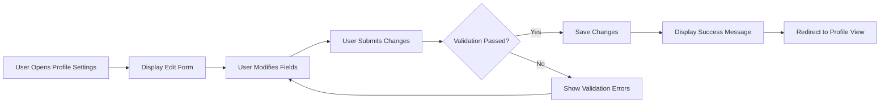
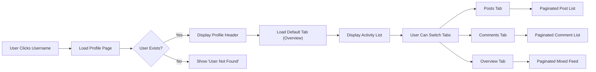
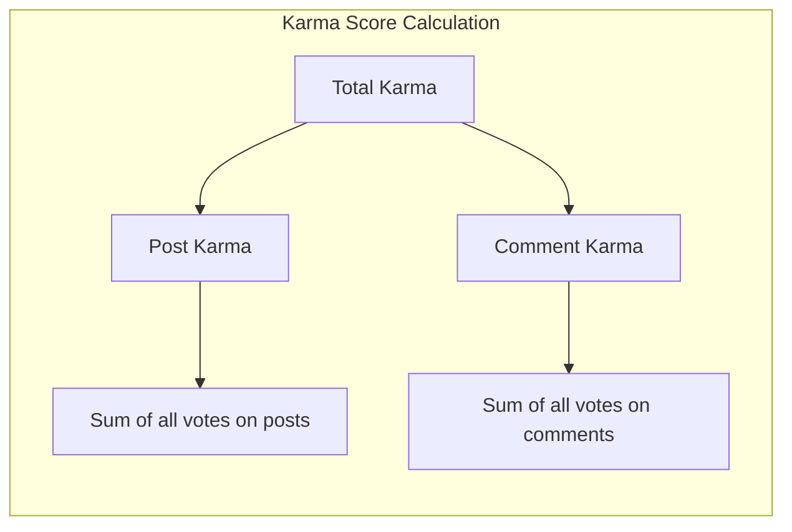
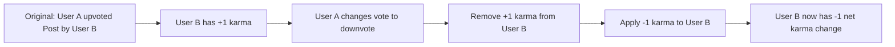

# User Profile and Karma System Requirements

## 1. Introduction

This document specifies the business requirements for the user profile and karma system in the community platform. The profile system provides user identity management, while the karma system serves as a reputation mechanism that reflects a user's contribution to the community.

### 1.1 Purpose

THE profile system SHALL provide a comprehensive identity layer for all registered members, including personal information display and activity history. THE karma system SHALL track and display a numerical representation of community contribution based on content votes received.

### 1.2 Scope

This document covers:
- Profile component definitions and validation rules
- Profile management capabilities for users
- Profile viewing permissions and display requirements
- Karma scoring mechanism and calculation rules
- Activity history presentation on profiles

---

## 2. Profile Components

### 2.1 Core Profile Elements

Every member SHALL have a profile containing the following components:

| Component | Data Type | Required | Constraints | Description |
|-----------|-----------|----------|-------------|-------------|
| Username | String | Yes | Unique, 3-20 characters, alphanumeric and underscores only | Permanent identifier chosen during registration |
| Display Name | String | Yes | 1-50 characters, can be changed | The name shown publicly on profile and content |
| Bio Text | String | No | Maximum 500 characters | User-provided description or introduction |
| Avatar Image | Image File | No | Max 2MB, JPEG/PNG/GIF formats | Profile picture displayed across the platform |
| Karma Score | Integer | Yes | Can be negative, calculated automatically | Reputation score based on votes received |
| Account Creation Date | Timestamp | Yes | Auto-generated, immutable | When the user registered |

### 2.2 Derived Profile Information

THE system SHALL automatically calculate and display the following derived information on profiles:

- **Total Post Count**: Number of posts created by the user across all communities
- **Total Comment Count**: Number of comments written by the user across all posts
- **Community Subscriptions**: Number of communities the user has subscribed to (private to profile owner)
- **Community Ownership**: List of communities where the user is the owner
- **Moderator Positions**: List of communities where the user is a moderator

### 2.3 Profile Data Validation Rules

#### 2.3.1 Username Requirements

THE system SHALL enforce the following username rules:

1. WHEN a user registers, THE system SHALL accept only usernames between 3 and 20 characters in length.
2. THE system SHALL allow only alphanumeric characters (a-z, A-Z, 0-9) and underscores in usernames.
3. THE system SHALL ensure username uniqueness across the entire platform.
4. THE system SHALL preserve username case sensitivity for display but enforce case-insensitive uniqueness.
5. WHEN a username is already taken, THE system SHALL reject the registration with an appropriate error message.
6. THE username SHALL be immutable after account creation - users cannot change their username.

#### 2.3.2 Display Name Requirements

THE system SHALL enforce the following display name rules:

1. WHEN a user sets their display name, THE system SHALL accept names between 1 and 50 characters in length.
2. THE system SHALL allow Unicode characters in display names to support international names.
3. THE display name SHALL NOT need to be unique - multiple users can have the same display name.
4. THE system SHALL allow users to change their display name at any time.
5. THE system SHALL NOT impose any waiting period between display name changes.

#### 2.3.3 Bio Text Requirements

THE system SHALL enforce the following bio text rules:

1. WHEN a user enters bio text, THE system SHALL accept a maximum of 500 characters.
2. THE system SHALL allow empty bio text - bio is optional.
3. THE system SHALL preserve line breaks and basic formatting in bio text.
4. THE system SHALL strip potentially harmful HTML/JavaScript from bio text while preserving safe formatting.
5. THE system SHALL NOT support markdown or rich text formatting in bio - plain text only.

#### 2.3.4 Avatar Image Requirements

THE system SHALL enforce the following avatar image rules:

1. WHEN a user uploads an avatar, THE system SHALL accept JPEG, PNG, and GIF image formats only.
2. THE system SHALL reject avatar images larger than 2 megabytes in file size.
3. THE system SHALL accept avatar images with minimum dimensions of 100x100 pixels.
4. THE system SHALL accept avatar images with maximum dimensions of 4096x4096 pixels.
5. WHEN an avatar is uploaded, THE system SHALL automatically generate a standard display size (128x128 pixels).
6. WHEN no avatar is uploaded, THE system SHALL display a default placeholder image.
7. THE system SHALL allow users to remove their avatar and revert to the default.

---

## 3. Profile Management

### 3.1 Profile Editing Capabilities

THE system SHALL allow authenticated members to edit their own profile with the following capabilities:

#### 3.1.1 Editable Profile Fields

| Field | Editable | Notes |
|-------|----------|-------|
| Username | No | Permanent identifier, cannot be changed |
| Display Name | Yes | Can be changed anytime, no approval needed |
| Bio Text | Yes | Can be edited anytime, no approval needed |
| Avatar Image | Yes | Can be uploaded, changed, or removed |
| Karma Score | No | Automatically calculated, cannot be manually edited |
| Account Creation Date | No | System-generated, immutable |

#### 3.1.2 Edit Flow Requirements

WHEN a user edits their profile, THE system SHALL:

1. Validate all input according to the constraints defined in Section 2.3.
2. Apply changes immediately without requiring approval.
3. Preserve the previous state until new values are successfully saved.
4. Display a confirmation message upon successful update.
5. IF validation fails, THE system SHALL display specific error messages for each invalid field.
6. IF an avatar upload fails, THE system SHALL preserve the existing avatar and display an error message.

### 3.2 Profile Editing User Flow

### 3.3 Profile Privacy and Visibility

#### 3.3.1 Public Profile Information

THE system SHALL make the following information visible to all users (including non-authenticated visitors):

- Username
- Display name
- Avatar image
- Bio text
- Karma score
- Account creation date (shown as relative time, e.g., "3 years ago")
- Public posts and comments

#### 3.3.2 Private Profile Information

THE system SHALL restrict the following information to the profile owner only:

- Email address
- List of subscribed communities
- Account settings and preferences
- Content drafts (if any)

#### 3.3.3 No Private Profiles Option

THE system SHALL NOT support private or hidden profiles. All member profiles are publicly viewable. WHEN a user deletes their account, THE system SHALL remove their profile entirely.

---

## 4. Profile Viewing

### 4.1 Profile Page Access

#### 4.1.1 Access Control

THE system SHALL enforce the following profile viewing permissions:

1. WHEN any user (authenticated or not) requests a profile page, THE system SHALL display the public profile information.
2. WHEN a user views their own profile, THE system SHALL additionally display private information and edit options.
3. WHEN a profile page is requested for a deleted account, THE system SHALL display a "User not found" message.

#### 4.1.2 Profile Navigation

THE system SHALL provide multiple ways to access user profiles:

1. WHEN clicking on a username anywhere on the platform, THE system SHALL navigate to that user's profile page.
2. THE system SHALL support direct profile access via URL pattern: `/user/[username]`.
3. THE system SHALL handle profile URLs case-insensitively for username lookup.

### 4.2 Profile Page Layout and Content

#### 4.2.1 Profile Header Information

WHEN viewing a profile page, THE system SHALL display in the header section:

| Element | Position | Details |
|---------|----------|---------|
| Avatar Image | Left side, prominent | 128x128 pixel display size |
| Display Name | Next to avatar, large text | Primary identifier |
| Username | Below display name, smaller text | Prefixed with "u/" or "@" |
| Karma Score | Below username | Displayed as integer, can be negative |
| Account Age | Below karma | Shown as "Member for X years/months/days" |
| Bio Text | Below header area | Full bio text with preserved formatting |

#### 4.2.2 Activity Tabs

THE system SHALL organize user activity into the following tabs on the profile page:

1. **Posts Tab**: Shows all posts created by the user, sorted newest first
2. **Comments Tab**: Shows all comments written by the user, sorted newest first
3. **Overview Tab** (default): Shows a combined feed of posts and comments, sorted newest first

WHEN a tab is selected, THE system SHALL load content with pagination (20 items per page).

### 4.3 Activity History Display

#### 4.3.1 Post List on Profile

WHEN displaying posts on a user's profile, THE system SHALL show for each post:

- Post title (clickable, links to full post)
- Community name where posted
- Vote score (upvotes minus downvotes)
- Comment count
- Time since posted (e.g., "3 hours ago")
- Post type indicator (text/link/image)
- For text posts: first 100 characters of content as preview
- For image posts: small thumbnail
- For link posts: domain name

#### 4.3.2 Comment List on Profile

WHEN displaying comments on a user's profile, THE system SHALL show for each comment:

- Comment content (full text, no truncation)
- Parent post title (clickable, links to the post)
- Community name where the parent post exists
- Vote score
- Time since posted
- Context link (links to comment within the post page)

#### 4.3.3 Deleted Content Handling

THE system SHALL handle deleted content in activity history as follows:

1. WHEN a post has been deleted by the author, THE system SHALL show "[deleted]" placeholder in the activity list.
2. WHEN a comment has been deleted by the author, THE system SHALL show "[deleted]" placeholder in the activity list.
3. WHEN content has been deleted by moderators, THE system SHALL show "[removed]" placeholder.
4. THE system SHALL maintain a record of deleted content for karma calculation purposes even when not displayed.

### 4.4 Profile Viewing Flow

---

## 5. Karma System

### 5.1 Karma Overview

#### 5.1.1 Purpose

The karma system serves as a reputation mechanism that reflects the quality of a user's contributions to the community. Karma is earned when other members vote on the user's posts and comments.

#### 5.1.2 Fundamental Properties

THE karma system SHALL have the following properties:

1. THE system SHALL maintain exactly one karma score per member.
2. THE karma score SHALL be a single integer value.
3. THE karma score SHALL be visible on the user's profile and next to their username in content displays.
4. THE karma score CAN be negative - there is no minimum floor.
5. THE karma score SHALL be calculated automatically - users cannot manually set their karma.

### 5.2 Karma Score Components

THE karma score SHALL be calculated from two sources:

1. **Post Karma**: Sum of net votes on all posts created by the user
2. **Comment Karma**: Sum of net votes on all comments created by the user
3. **Total Karma**: Post Karma + Comment Karma

### 5.3 Karma Display

#### 5.3.1 Display Format

THE system SHALL display karma scores as follows:

1. WHEN karma is between -999 and 999, THE system SHALL display the exact number.
2. WHEN karma is 1,000 or more, THE system SHALL display in abbreviated format:
   - 1,000 to 999,999: Display as "X.Xk" (e.g., "1.2k", "45.3k")
   - 1,000,000 or more: Display as "X.Xm" (e.g., "1.5m")
3. WHEN karma is -1,000 or less, THE system SHALL display with negative sign and abbreviation (e.g., "-1.2k").

#### 5.3.2 Display Locations

THE system SHALL display karma scores in the following locations:

| Location | Format | Context |
|----------|--------|---------|
| Profile Page | Full number | Shows complete karma breakdown |
| Username on Posts/Comments | Abbreviated | Quick reputation indicator |
| User Hover Card | Abbreviated | Preview when hovering over username |

---

## 6. Karma Calculation Rules

### 6.1 Vote Impact on Karma

#### 6.1.1 Upvote Impact

WHEN someone upvotes a user's post or comment:

1. THE system SHALL increase the content author's karma by exactly 1 point.
2. THE karma increase SHALL be applied immediately when the vote is cast.
3. THE karma increase SHALL be reflected in the author's total karma score.

#### 6.1.2 Downvote Impact

WHEN someone downvotes a user's post or comment:

1. THE system SHALL decrease the content author's karma by exactly 1 point.
2. THE karma decrease SHALL be applied immediately when the vote is cast.
3. THE karma decrease SHALL be reflected in the author's total karma score.

### 6.2 Vote Change Scenarios

#### 6.2.1 Changing Vote Direction

WHEN a voter changes their vote from upvote to downvote (or vice versa):

1. THE system SHALL first remove the original vote's karma impact (reversing the +1 or -1).
2. THE system SHALL then apply the new vote's karma impact (+1 or -1).
3. THE net karma change SHALL be either +2 (upvote to downvote) or -2 (downvote to upvote).

**Example Flow**:

#### 6.2.2 Removing Vote

WHEN a voter removes their vote entirely:

1. THE system SHALL reverse the karma impact of that vote.
2. WHEN removing an upvote, THE system SHALL decrease the author's karma by 1.
3. WHEN removing a downvote, THE system SHALL increase the author's karma by 1.
4. THE karma adjustment SHALL be applied immediately.

### 6.3 Edge Cases and Special Scenarios

#### 6.3.1 Self-Voting

THE system SHALL NOT allow users to vote on their own content:

1. WHEN a user attempts to upvote their own post or comment, THE system SHALL reject the action and display an error.
2. WHEN a user attempts to downvote their own post or comment, THE system SHALL reject the action and display an error.
3. Self-voting restrictions SHALL NOT affect karma calculation since the vote is never recorded.

#### 6.3.2 Account Deletion Impact

WHEN a user deletes their account:

1. THE system SHALL preserve karma impacts from that user's past votes on other users' content.
2. THE deleted user's karma score SHALL no longer be visible or accessible.
3. Content created by the deleted user SHALL be marked as "[deleted]" but karma given to others by their votes SHALL remain.

#### 6.3.3 Content Deletion Impact

WHEN a user deletes their own post or comment:

1. THE karma earned from that content SHALL remain on the user's profile.
2. THE system SHALL retain the vote records for karma calculation purposes.
3. THE content SHALL no longer be publicly visible, but karma history SHALL be preserved.

#### 6.3.4 Moderator Content Removal

WHEN a moderator removes content:

1. THE karma earned from that content SHALL remain on the author's profile.
2. THE removed content SHALL be visible only to moderators in the moderation queue.
3. Removed content SHALL no longer be votable - no new karma can be gained or lost from it.
4. Existing votes on removed content SHALL still count toward karma.

### 6.4 Karma Calculation Examples

| Scenario | Action | Karma Change | Notes |
|----------|--------|--------------|-------|
| User receives upvote on post | +1 upvote | +1 | Immediate karma increase |
| User receives downvote on comment | +1 downvote | -1 | Immediate karma decrease |
| Voter changes upvote to downvote | Vote change | -2 | Remove +1, then apply -1 |
| Voter changes downvote to upvote | Vote change | +2 | Remove -1, then apply +1 |
| Voter removes upvote | Vote removal | -1 | Reverse the original +1 |
| Voter removes downvote | Vote removal | +1 | Reverse the original -1 |
| User deletes their post | Content deleted | 0 | Karma from post is preserved |
| Moderator removes post | Content removed | 0 | Existing karma preserved, no new votes possible |

### 6.5 Karma Integrity

#### 6.5.1 Prevention of Karma Manipulation

THE system SHALL implement measures to prevent karma manipulation:

1. THE system SHALL NOT allow users to vote on their own content.
2. THE system SHALL enforce one vote per user per content item.
3. THE system SHALL NOT allow users to change votes more than once per minute to prevent rapid manipulation.
4. THE system SHALL NOT apply karma changes from votes on deleted content.

#### 6.5.2 Karma Recalculation

THE system SHALL maintain karma consistency:

1. THE system SHALL store vote records permanently for karma calculation.
2. THE karma score SHALL be recalculable from vote history if inconsistencies occur.
3. THE system SHALL NOT allow manual karma adjustments by users or moderators.

---

## 7. Permission Matrix

### 7.1 Profile Actions by Actor Type

| Action | Profile Owner | Other Members | Non-Authenticated Users |
|--------|---------------|---------------|------------------------|
| View public profile info | ✅ | ✅ | ✅ |
| View private profile info | ✅ | ❌ | ❌ |
| Edit own display name | ✅ | N/A | N/A |
| Edit own bio | ✅ | N/A | N/A |
| Edit own avatar | ✅ | N/A | N/A |
| View other user's profile | ✅ | ✅ | ✅ |
| View other user's posts | ✅ | ✅ | ✅ |
| View other user's comments | ✅ | ✅ | ✅ |
| View own subscribed communities | ✅ | ❌ | ❌ |
| Delete own account | ✅ | N/A | N/A |

### 7.2 Karma-Related Actions

| Action | Content Author | Content Voter | Other Users |
|--------|----------------|---------------|-------------|
| Receive karma from votes | ✅ (automatic) | N/A | N/A |
| Vote on own content | ❌ | N/A | N/A |
| Vote on others' content | N/A | ✅ | ❌ |
| View karma score | ✅ | ✅ | ✅ |
| Manually modify karma | ❌ | ❌ | ❌ |

---

## 8. Error Handling and Edge Cases

### 8.1 Profile Error Scenarios

#### 8.1.1 Profile Not Found

WHEN a user requests a profile that does not exist:

1. THE system SHALL display a "User not found" error page.
2. THE system SHALL use HTTP 404 status code for the response.
3. THE error page SHALL include a search functionality to find other users.

#### 8.1.2 Profile Edit Validation Errors

WHEN profile edit validation fails:

| Error Type | Error Message | Recovery Action |
|------------|---------------|-----------------|
| Display name too long | "Display name must be 50 characters or less" | Truncate or shorten name |
| Bio too long | "Bio must be 500 characters or less" | Edit bio to fit limit |
| Avatar file too large | "Avatar must be 2MB or smaller" | Upload smaller image |
| Avatar invalid format | "Avatar must be JPEG, PNG, or GIF" | Upload supported format |

#### 8.1.3 Avatar Upload Failures

IF avatar upload fails, THE system SHALL:

1. Preserve the existing avatar (do not remove it).
2. Display a specific error message indicating the failure reason.
3. Allow the user to retry the upload.
4. Log the error for system administrator review.

### 8.2 Karma Edge Cases

#### 8.2.1 Karma Overflow

THE system SHALL handle extreme karma values:

1. THE system SHALL support karma values from -2,147,483,648 to 2,147,483,647 (32-bit signed integer range).
2. IF karma calculation would exceed these limits, THE system SHALL cap at the maximum/minimum value.
3. THE system SHALL log such occurrences for review.

#### 8.2.2 Vote Synchronization Issues

IF vote and karma synchronization fails:

1. THE system SHALL queue karma updates for retry.
2. THE system SHALL attempt reconciliation within 5 minutes.
3. THE system SHALL log discrepancies for administrative review.
4. THE system SHALL NOT display incorrect karma to users during synchronization.

---

## 9. Performance Requirements

### 9.1 Profile Loading Performance

WHEN loading a profile page, THE system SHALL:

1. Display the profile header within 200 milliseconds.
2. Load the initial activity feed (first 20 items) within 500 milliseconds.
3. Support pagination for activity history with each page loading within 300 milliseconds.

### 9.2 Karma Calculation Performance

THE karma system SHALL maintain performance under the following conditions:

1. WHEN a vote is cast, THE system SHALL update karma within 100 milliseconds.
2. THE system SHALL handle simultaneous votes on popular content without degradation.
3. THE system SHALL calculate karma from vote history rather than maintaining a denormalized count to ensure accuracy.

---

## 10. Data Retention

### 10.1 Profile Data Retention

THE system SHALL retain profile data according to the following rules:

1. WHEN a user deletes their account, THE system SHALL remove all profile data within 30 days.
2. THE system SHALL immediately mark profiles as deleted upon account deletion request.
3. THE system SHALL remove deleted profiles from search results immediately.

### 10.2 Karma Data Retention

THE system SHALL retain karma-related data as follows:

1. THE system SHALL retain vote records indefinitely for karma calculation accuracy.
2. THE system SHALL retain karma score history for account lifetime.
3. WHEN an account is deleted, THE system SHALL anonymize vote records but preserve them for other users' karma calculations.

---

## 11. Summary

The user profile and karma system provides:

- **Comprehensive user identity** with display name, bio, and avatar customization
- **Public profile visibility** for all platform users while maintaining private information for the profile owner
- **Activity history display** showing posts and comments created by each user
- **Reputation scoring** through the karma system based on community votes
- **Automatic karma calculation** that reflects the quality of user contributions
- **Robust handling** of edge cases including vote changes, content deletion, and account deletion

These requirements enable backend developers to implement a complete user identity and reputation system that supports community engagement and content quality assessment.