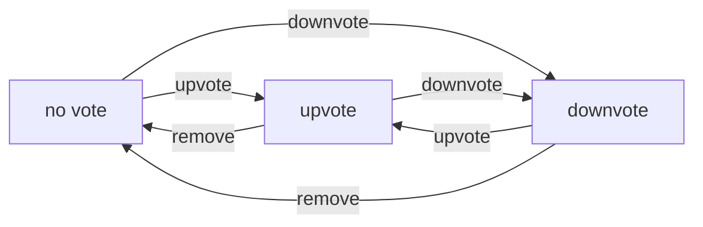

**communityPlatform — Data isolation, business rules, filtering/sorting/pagination, error catalog**

Data isolation, business rules, filtering/sorting/pagination, error catalog

# Data Isolation and Ownership

Data ownership rules and tenant/user-level isolation policies.

## Ownership and Isolation Rules

Define data ownership semantics and isolation boundaries for multi-user access.

### Data Ownership Model

### Content Ownership

THE system SHALL associate every post with exactly one author who is the owner of that post.

THE system SHALL associate every comment with exactly one author who is the owner of that comment.

THE system SHALL associate every community with exactly one owner who is the user who created it.

THE system SHALL associate every vote with exactly one user who cast that vote.

THE system SHALL associate every subscription with exactly one user who created that subscription.

THE system SHALL associate every report with exactly one user who submitted that report.

### Ownership Transfer Restrictions

THE system SHALL NOT allow transfer of post ownership from one user to another.

THE system SHALL NOT allow transfer of comment ownership from one user to another.

THE system SHALL NOT allow transfer of community ownership except through explicit owner reassignment.

WHEN a community owner assigns a new owner, THE system SHALL transfer ownership rights to the new owner and revoke ownership from the previous owner.

### Ownership Duration

WHILE a user account exists, THE system SHALL maintain all ownership associations for that user's content.

WHEN a user deletes their account, THE system SHALL remove all ownership associations for that user.

WHEN a user deletes their account, THE system SHALL cascade delete all posts owned by that user.

WHEN a user deletes their account, THE system SHALL cascade delete all comments owned by that user.

WHEN a user deletes their account, THE system SHALL cascade delete all votes cast by that user.

WHEN a user deletes their account, THE system SHALL cascade delete all subscriptions created by that user.

WHEN a user deletes their account, THE system SHALL cascade delete all reports submitted by that user.

WHEN a user deletes their account, THE system SHALL remove the user as moderator from all communities where they held moderator status.

IF a deleted user was the owner of a community, THE system SHALL assign ownership to the longest-serving moderator.

IF a deleted user was the owner of a community with no moderators, THE system SHALL delete that community.

### User Data Isolation

### Account Isolation

THE system SHALL ensure that each user account is completely isolated from all other user accounts.

THE system SHALL NOT allow any user to access another user's authentication credentials.

THE system SHALL NOT allow any user to modify another user's account settings.

THE system SHALL NOT allow any user to act on behalf of another user.

THE system SHALL ensure that session tokens are unique per user and cannot be reused across accounts.

### Profile Data Isolation

WHILE a user is editing their own profile, THE system SHALL allow full access to their own profile data.

THE system SHALL restrict profile editing to the profile owner.

THE system SHALL allow any user to view any other user's profile display name, bio, avatar, and karma score.

THE system SHALL NOT expose a user's email address to any other user.

THE system SHALL NOT expose a user's password to any other user.

### Vote Privacy

THE system SHALL track which user cast each vote for internal purposes.

THE system SHALL NOT expose the identity of who cast a specific upvote or downvote to other users.

THE system SHALL only expose aggregate vote scores (upvotes minus downvotes) to users.

THE system SHALL NOT allow users to see a breakdown of who upvoted or downvoted their content.

### Subscription Privacy

THE system SHALL allow users to view their own list of subscribed communities.

THE system SHALL NOT expose a user's subscription list to other users.

THE system SHALL only expose community-level subscriber counts, not the list of individual subscribers.

### Community Content Access

### Post Visibility Rules

THE system SHALL allow all users to view posts in any community regardless of subscription status.

THE system SHALL restrict post creation to users who are subscribed to that community.

THE system SHALL allow post authors to edit their own posts.

THE system SHALL NOT allow users to edit posts owned by other users.

THE system SHALL allow post authors to delete their own posts.

THE system SHALL allow community moderators to delete any post within their community.

THE system SHALL NOT allow community moderators to edit posts owned by other users.

### Comment Visibility Rules

THE system SHALL allow all users to view comments on any post.

THE system SHALL restrict comment creation to users who are subscribed to the post's community.

THE system SHALL NOT allow users to comment in communities where they are banned.

THE system SHALL allow comment authors to edit their own comments.

THE system SHALL NOT allow users to edit comments owned by other users.

THE system SHALL allow comment authors to delete their own comments.

THE system SHALL allow community moderators to delete any comment within their community.

### Moderator Access Scope

THE system SHALL grant community moderators access to all posts within their community.

THE system SHALL grant community moderators access to all comments within their community.

THE system SHALL grant community moderators access to all reports within their community.

THE system SHALL grant community moderators access to the list of banned users within their community.

THE system SHALL NOT grant community moderators access to content in other communities they do not moderate.

THE system SHALL NOT grant community moderators access to user account data such as email or password.

### Cross-User Data Visibility

### Publicly Visible User Data

THE system SHALL make user display names visible to all users.

THE system SHALL make user avatars visible to all users.

THE system SHALL make user karma scores visible to all users.

THE system SHALL make user post history visible to all users.

THE system SHALL make user comment history visible to all users.

THE system SHALL make community subscriber counts visible to all users.

### Private User Data

THE system SHALL keep user email addresses private and visible only to the account owner.

THE system SHALL keep user passwords private and never exposed to any party.

THE system SHALL keep user vote history private and not visible to other users.

THE system SHALL keep user subscription lists private and not visible to other users.

### Content Author Attribution

WHEN displaying a post, THE system SHALL show the author's display name.

WHEN displaying a comment, THE system SHALL show the author's display name.

THE system SHALL allow users to click on an author's display name to view their profile.

THE system SHALL NOT allow users to modify the author attribution of content they do not own.

### Anonymous Access Rights

WHILE a user is not logged in (guest), THE system SHALL allow viewing the popular feed.

WHILE a user is not logged in (guest), THE system SHALL allow viewing community feeds.

WHILE a user is not logged in (guest), THE system SHALL allow viewing individual posts and comments.

WHILE a user is not logged in (guest), THE system SHALL NOT allow voting on any content.

WHILE a user is not logged in (guest), THE system SHALL NOT allow creating posts or comments.

WHILE a user is not logged in (guest), THE system SHALL NOT allow subscribing to communities.

WHILE a user is not logged in (guest), THE system SHALL NOT allow reporting content.

# Domain Business Rules

Per-concept business rules, validation logic, and domain constraints.

## User Rules

Each user must have a unique email address and a unique username across the platform. Email addresses are used for login and must not already be associated with an active account. Usernames serve as public identifiers and cannot be duplicated. When a user deletes their account, all of their posts and comments are permanently removed from the system. Password changes are allowed at any time for authenticated users. Every user has a single karma score that reflects the cumulative voting on their posts and comments. Karma can increase when others upvote the user's content and decrease when others downvote it. Karma scores can become negative if a user receives more downvotes than upvotes. Users cannot vote on their own content to prevent artificial karma inflation. Account deletion is irreversible and removes all associated user data.

### Account Identity Uniqueness

### Account Identity Uniqueness

WHEN a new user attempts to register, THE system SHALL verify that the provided email address is not already associated with an active account.

WHEN a new user attempts to register, THE system SHALL verify that the provided username is not already in use by any active account.

IF the email address is already associated with an active account, THE system SHALL reject the registration request.

IF the username is already in use by an active account, THE system SHALL reject the registration request.

THE system SHALL maintain uniqueness of email addresses across all active accounts.

THE system SHALL maintain uniqueness of usernames across all active accounts.

WHEN a user changes their email address, THE system SHALL verify that the new email address is not already associated with another active account.

WHEN a user changes their username, THE system SHALL verify that the new username is not already in use by another active account.

IF an email address or username becomes available due to account deletion, THE system SHALL allow that email address or username to be registered by a new user.

THE system SHALL use email addresses exclusively for authentication and account recovery purposes.

THE system SHALL use usernames exclusively as public identifiers visible to other users.

IF a deleted account previously held a unique email or username, THE system SHALL release those identifiers for future registration.

### Account Deletion and Cascade

### Account Deletion and Cascade

WHEN a user requests account deletion, THE system SHALL permanently remove the user's account.

WHEN a user account is deleted, THE system SHALL permanently delete all posts created by that user.

WHEN a user account is deleted, THE system SHALL permanently delete all comments written by that user.

THE system SHALL cascade the deletion to all content authored by the deleted user.

IF a post authored by a deleted user has received votes, THE system SHALL remove those vote records when the post is deleted.

IF a comment authored by a deleted user has received votes, THE system SHALL remove those vote records when the comment is deleted.

WHEN a user account is deleted, THE system SHALL remove all subscriptions associated with that user.

WHEN a user account is deleted, THE system SHALL remove all moderator roles held by that user in any community.

IF the deleted user was a community owner, THE system SHALL transfer ownership according to community succession rules.

THE system SHALL NOT allow recovery of a deleted account or any of its associated data.

WHEN account deletion is initiated, THE system SHALL NOT provide an option to undo the deletion.

THE system SHALL NOT retain any backup or archive of deleted account data.

WHEN account deletion completes, THE system SHALL remove all personal information associated with the user.

### Password Change Rules

### Password Change Rules

WHEN an authenticated user requests to change their password, THE system SHALL allow the password change.

WHEN a user changes their password, THE system SHALL require the user to provide their current password for verification.

IF the current password provided does not match the stored password, THE system SHALL reject the password change request.

WHEN a user successfully changes their password, THE system SHALL update the stored password with the new value.

THE system SHALL allow users to change their password at any time while authenticated.

THE system SHALL NOT impose any waiting period between password changes.

WHEN a password is successfully changed, THE system SHALL NOT require the user to re-authenticate for their current session.

THE system SHALL maintain the user's active session after a successful password change.

IF a password change fails due to validation errors, THE system SHALL NOT modify the existing password.

THE system SHALL NOT limit the number of password changes a user can make.

WHEN a password is changed, THE system SHALL NOT send notifications to the user's email address about the change.

IF a user has forgotten their password, THE system SHALL provide an alternative recovery mechanism separate from the authenticated password change flow.

### Karma Score Rules

### Karma Score Rules

THE system SHALL maintain a single karma score for each user.

WHEN a user's post receives an upvote, THE system SHALL increase the user's karma score by 1.

WHEN a user's post receives a downvote, THE system SHALL decrease the user's karma score by 1.

WHEN a user's comment receives an upvote, THE system SHALL increase the user's karma score by 1.

WHEN a user's comment receives a downvote, THE system SHALL decrease the user's karma score by 1.

WHEN a vote is removed from a user's post or comment, THE system SHALL adjust the user's karma score accordingly.

IF a user receives more downvotes than upvotes across their content, THE system SHALL allow the karma score to become negative.

THE system SHALL NOT impose a minimum limit on karma scores.

THE system SHALL track karma cumulatively based on all votes received on all of the user's content.

WHEN a user attempts to vote on their own post, THE system SHALL reject the vote.

WHEN a user attempts to vote on their own comment, THE system SHALL reject the vote.

THE system SHALL NOT allow a user to upvote their own content.

THE system SHALL NOT allow a user to downvote their own content.

IF a user attempts self-voting, THE system SHALL NOT modify the vote score of the content.

THE system SHALL calculate karma based on net votes from other users only.

WHEN content authored by a user is deleted, THE system SHALL recalculate the user's karma score to reflect the removal of votes on that content.

IF all content from a user is deleted, THE system SHALL set the user's karma score to zero.

WHEN displaying a user's karma score, THE system SHALL show the current cumulative value including any negative results.

## Community Rules

Every community must have a unique name that distinguishes it from all other communities on the platform. The user who creates a community automatically becomes its owner with the highest authority. Community descriptions are required and provide context about the community's purpose and topic. Each community displays its current subscriber count to all users. The community owner can add and remove moderators to help manage the community. Moderators cannot remove the owner or remove each other, only the owner can remove moderators. Communities can be browsed by all users in a list view. Users can search for communities by name to find specific ones. The icon image for a community is optional but provides visual identity. Communities persist until deleted by the owner.

### Community Name Uniqueness

WHEN a user creates a community, THE system SHALL ensure the community name is unique across all communities on the platform.

IF a user attempts to create a community with a name that already exists, THE system SHALL reject the creation request.

THE system SHALL consider community names case-insensitively when determining uniqueness.

IF a community name is rejected due to duplication, THE system SHALL inform the user that the name is already taken.

WHEN a community is deleted, THE system SHALL release its name for potential reuse by new communities.

### Community Creation and Ownership

WHEN a user successfully creates a community, THE system SHALL automatically designate that user as the community owner.

THE system SHALL assign the owner role at the moment of community creation without requiring additional action.

WHEN a user creates a community, THE system SHALL grant that user the highest authority level within that community.

THE system SHALL maintain the creator as owner throughout the community's lifetime unless ownership is transferred or the community is deleted.

WHEN the community owner account is deleted, THE system SHALL delete the community along with all its associated content.

### Owner Authority Rules

THE system SHALL grant the community owner the ability to add moderators to the community.

THE system SHALL grant the community owner the ability to remove any moderator from the community.

THE system SHALL prevent moderators from removing the community owner from their role.

THE system SHALL prevent moderators from removing other moderators.

THE system SHALL ensure that only the owner can remove moderators from the community.

WHEN a moderator attempts to remove the owner or another moderator, THE system SHALL reject the action.

THE system SHALL grant the owner all moderator privileges in addition to owner-specific authorities.

### Moderator Management Rules

WHEN the community owner adds a user as a moderator, THE system SHALL grant that user moderator privileges within the community.

WHEN an existing moderator adds another user as a moderator, THE system SHALL grant that user moderator privileges within the community.

WHEN the owner removes a moderator, THE system SHALL revoke that user's moderator privileges immediately.

THE system SHALL maintain a record of all moderators for each community.

WHEN a user is added as a moderator, THE system SHALL allow that user to perform moderator actions within the community.

WHEN a moderator is removed, THE system SHALL revoke their ability to perform moderator actions but preserve their prior actions and content.

### Community Display and Search

WHEN any user views a community, THE system SHALL display the current subscriber count for that community.

THE system SHALL update the subscriber count whenever a user subscribes or unsubscribes from the community.

THE system SHALL make the subscriber count visible to all users including guests who are not logged in.

WHEN a user browses communities, THE system SHALL display all communities in a list format.

WHEN a user searches for communities by name, THE system SHALL return matching communities based on the search query.

THE system SHALL allow users to search for communities regardless of their subscription status.

WHEN a user searches for communities, THE system SHALL match against community names.

### Community Content and Persistence

WHEN a user creates a community, THE system SHALL require a description text to be provided.

IF a community creation request lacks a description, THE system SHALL reject the creation request.

THE system SHALL allow a community to be created without an icon image.

WHEN a community has no icon image, THE system SHALL display a default placeholder or no icon.

THE system SHALL persist each community until the owner explicitly deletes it.

WHEN a community has no subscribers, THE system SHALL continue to maintain the community.

WHEN a community has no posts, THE system SHALL continue to maintain the community.

WHEN the owner deletes a community, THE system SHALL remove all posts, comments, and subscriptions associated with that community.

## Post Rules

Users can only create posts in communities they are subscribed to. Every post must have a title which is always required regardless of post type. Each post must be exactly one of three types: text post, link post, or image post. Text posts contain written content, link posts contain a URL, and image posts contain an uploaded image file. Users can edit their own posts at any time after creation. Users can delete their own posts, which removes them permanently from the community. Post authors are displayed alongside the post content for attribution. Each post shows its current vote score, which is the total upvotes minus total downvotes. The comment count is displayed with each post to show engagement level. Posts show when they were created using relative time formatting.

### Post Creation Requirements

### Subscription Requirement

IF a user is not subscribed to a community, THE system SHALL prevent the user from creating a post in that community.

IF a user is subscribed to a community, THE system SHALL allow the user to create a post in that community.

### Required Title

WHEN a user creates a post, THE system SHALL require a title regardless of the post type selected.

IF a post is created without a title, THE system SHALL reject the post creation.

### Post Type Selection

WHEN a user creates a post, THE system SHALL require the user to select exactly one post type from the available options: text, link, or image.

IF no post type is selected, THE system SHALL reject the post creation.

IF more than one post type is selected, THE system SHALL reject the post creation.

THE system SHALL associate the selected post type with the post for display and processing purposes.

### Post Type Content Rules

### Text Post Content

WHEN a user creates a text post, THE system SHALL allow the user to enter text content as the post body.

THE system SHALL store the text content for display when the post is viewed.

### Link Post URL

WHEN a user creates a link post, THE system SHALL require the user to provide a URL.

IF a link post is created without a URL, THE system SHALL reject the post creation.

THE system SHALL display the domain name of the URL when the post appears in a feed.

### Image Post Upload

WHEN a user creates an image post, THE system SHALL require the user to upload an image file.

IF an image post is created without an uploaded image, THE system SHALL reject the post creation.

THE system SHALL generate a thumbnail of the uploaded image for display in post feeds.

THE system SHALL display the full image when the post is viewed directly.

### Post Editing Rules

### Edit Own Posts

WHEN a user edits their own post, THE system SHALL allow the user to modify the post title.

WHEN a user edits their own text post, THE system SHALL allow the user to modify the text content.

WHEN a user edits their own link post, THE system SHALL allow the user to modify the URL.

WHEN a user edits their own image post, THE system SHALL allow the user to replace the image.

IF a user attempts to edit a post they did not create, THE system SHALL reject the edit.

IF a user attempts to edit a post that has been deleted, THE system SHALL reject the edit.

THE system SHALL preserve the original author attribution after any edits are made.

THE system SHALL preserve the original creation time after any edits are made.

### Post Deletion Rules

### Delete Own Posts

WHEN a user deletes their own post, THE system SHALL remove the post from the community.

IF a user attempts to delete a post they did not create, THE system SHALL reject the deletion.

WHEN a post is deleted, THE system SHALL remove the post from all feeds.

WHEN a post is deleted, THE system SHALL remove all comments associated with the post.

WHEN a post is deleted, THE system SHALL remove all votes associated with the post.

WHEN a post is deleted, THE system SHALL adjust the author's karma score to remove any karma gained or lost from votes on that post.

### Post Display Rules

### Vote Score Display

WHEN a post is displayed, THE system SHALL show the current vote score calculated as total upvotes minus total downvotes.

THE system SHALL allow the vote score to be negative if downvotes exceed upvotes.

THE system SHALL update the displayed vote score when votes are added, changed, or removed.

### Comment Count Display

WHEN a post is displayed in a feed, THE system SHALL show the total number of comments on the post.

WHEN a post is viewed directly, THE system SHALL show the total number of comments on the post.

THE system SHALL update the comment count when comments are added or deleted.

### Post Author Attribution

WHEN a post is displayed, THE system SHALL show the username of the user who created the post.

IF the author's account has been deleted, THE system SHALL display a designated placeholder to indicate the author no longer exists.

### Creation Time Display

WHEN a post is displayed, THE system SHALL show when the post was created using relative time formatting.

THE system SHALL display creation time as "just now" for posts created within one minute.

THE system SHALL display creation time in minutes for posts less than one hour old.

THE system SHALL display creation time in hours for posts less than 24 hours old.

THE system SHALL display creation time in days for posts less than one week old.

THE system SHALL display the absolute date for posts older than one week.

## Comment Rules

Users can write comments on any post without subscription requirements. Comments can be made as direct responses to posts or as replies to other comments. Replies can be nested to any depth with no limit on the conversation chain. Users can edit their own comments at any time after posting. Users can delete their own comments, which removes them from the discussion. Each comment displays its author, content, vote score, and creation time. Nested replies are shown in a threaded structure beneath their parent comment. Comments follow the same voting rules as posts with one vote per user per comment. Comment sorting options include best, new, and controversial. Moderators can delete any comment in their community regardless of author.

### Comment Creation on Posts

### Comment Creation on Posts

WHEN a user writes a comment on a post, THE system SHALL allow the comment without requiring subscription to the post's community.

WHEN a user writes a comment on a post, THE system SHALL associate the comment with the post and the authoring user.

IF the user is banned from the community containing the post, THE system SHALL reject the comment creation.

WHEN a comment is created, THE system SHALL record the creation timestamp.

IF the post has been deleted, THE system SHALL reject new comments on that post.

THE system SHALL allow any logged-in user to comment on any existing post across all communities.

### Nested Reply Structure

### Nested Reply Structure

WHEN a user replies to a comment, THE system SHALL create the reply as a child of the parent comment.

THE system SHALL support unlimited depth for nested replies without any maximum chain length.

WHEN a comment has replies, THE system SHALL display all nested replies beneath their parent comment in a threaded structure.

WHEN viewing a comment thread, THE system SHALL preserve the hierarchical parent-child relationships between comments and their replies.

IF a parent comment is deleted, THE system SHALL retain its replies with an indication that the parent was removed.

THE system SHALL allow users to reply to any comment regardless of its depth in the thread.

### Comment Editing

### Comment Editing

WHEN a user edits their own comment, THE system SHALL allow modification of the comment content.

IF a user attempts to edit a comment authored by another user, THE system SHALL reject the edit operation.

WHEN a comment is edited, THE system SHALL preserve the original author and creation timestamp.

IF a comment has been deleted, THE system SHALL reject edit attempts on that comment.

THE system SHALL allow the author to edit their comment at any time after posting.

### Comment Deletion

### Comment Deletion

WHEN a user deletes their own comment, THE system SHALL remove the comment content from the post.

IF a user attempts to delete a comment authored by another user, THE system SHALL reject the deletion unless the user is a moderator of the community.

WHEN a comment is deleted, THE system SHALL retain its nested replies with an indication that the parent comment was removed.

IF a comment is deleted, THE system SHALL remove all votes associated with that comment.

WHEN a comment is deleted, THE system SHALL adjust the author's karma by reversing the vote contributions from that comment.

THE system SHALL allow a comment author to delete their comment at any time.

### Comment Voting Behavior

### Comment Voting Behavior

WHEN a user upvotes a comment, THE system SHALL increase the comment's vote score by 1 and increase the comment author's karma by 1.

WHEN a user downvotes a comment, THE system SHALL decrease the comment's vote score by 1 and decrease the comment author's karma by 1.

IF a user attempts to vote on their own comment, THE system SHALL reject the vote.

WHEN a user changes their vote from upvote to downvote on a comment, THE system SHALL decrease the score by 2 (remove +1, add -1).

WHEN a user changes their vote from downvote to upvote on a comment, THE system SHALL increase the score by 2 (remove -1, add +1).

WHEN a user removes their vote from a comment, THE system SHALL reverse the vote's effect on both the comment score and the author's karma.

THE system SHALL allow each user exactly one vote per comment.

### Comment Display Rules

### Comment Display Rules

WHEN a comment is displayed, THE system SHALL show the author's username.

WHEN a comment is displayed, THE system SHALL show the comment content.

WHEN a comment is displayed, THE system SHALL show the vote score as total upvotes minus total downvotes.

WHEN a comment is displayed, THE system SHALL show the time elapsed since the comment was posted.

IF a comment has replies, THE system SHALL display the nested replies beneath the parent comment.

IF a comment has been deleted but has replies, THE system SHALL display a placeholder indicating the comment was removed while preserving the reply structure.

### Comment Sorting Options

### Comment Sorting Options

WHEN viewing comments on a post, THE system SHALL allow sorting by best (highest vote score first).

WHEN viewing comments on a post, THE system SHALL allow sorting by new (most recently created first).

WHEN viewing comments on a post, THE system SHALL allow sorting by controversial (many votes but score close to zero).

WHEN sorting by controversial, THE system SHALL prioritize comments with high total vote counts where the absolute score is low.

THE system SHALL apply the selected sort order to all comments and their nested replies.

WHEN no sort option is specified, THE system SHALL use best as the default sorting method.

### Moderator Comment Deletion

### Moderator Comment Deletion

WHEN a moderator deletes a comment in their community, THE system SHALL remove the comment regardless of the author.

IF a user attempts to delete a comment in a community they do not moderate and did not author, THE system SHALL reject the deletion.

WHEN a moderator deletes a comment, THE system SHALL retain the nested replies with an indication that the parent was removed.

THE system SHALL not allow moderators to delete comments in communities they do not moderate.

WHEN a moderator deletes a comment, THE system SHALL apply the same deletion rules as author deletion including karma adjustments.

## Vote Rules

Each user can cast only one vote per post or comment. Votes can be either an upvote, which adds one to the content score, or a downvote, which subtracts one. Users can change their vote from upvote to downvote or vice versa at any time. Users can remove their vote entirely, which adjusts the content score and the author's karma accordingly. When a vote is added, the content's vote score and the author's karma are immediately updated. Vote scores can be negative if content receives more downvotes than upvotes. Users cannot vote on their own posts or comments. Votes are anonymous and do not reveal who cast them. The vote score displayed on content is the aggregate of all votes cast. Removing a vote reverses its effect on both content score and author karma.

### Single Vote Restriction

THE system SHALL enforce that each user can cast at most one vote per post.

THE system SHALL enforce that each user can cast at most one vote per comment.

WHEN a user attempts to cast a second vote on the same content, THE system SHALL reject the request.

THE system SHALL maintain a record of each user's vote for every post and comment they have voted on.

IF a user has already voted on content, THE system SHALL require the user to modify or remove their existing vote rather than creating a new vote.

### Upvote Effects

WHEN a user casts an upvote on a post, THE system SHALL add 1 to the post's vote score.

WHEN a user casts an upvote on a comment, THE system SHALL add 1 to the comment's vote score.

WHEN a user casts an upvote on any content, THE system SHALL add 1 to the content author's karma score.

THE system SHALL apply upvote effects immediately upon the vote being recorded.

WHEN an upvote is successfully cast, THE system SHALL NOT reveal the identity of the voter to any other user.

### Downvote Effects

WHEN a user casts a downvote on a post, THE system SHALL subtract 1 from the post's vote score.

WHEN a user casts a downvote on a comment, THE system SHALL subtract 1 from the comment's vote score.

WHEN a user casts a downvote on any content, THE system SHALL subtract 1 from the content author's karma score.

THE system SHALL apply downvote effects immediately upon the vote being recorded.

WHEN a downvote is successfully cast, THE system SHALL NOT reveal the identity of the voter to any other user.

### Vote Modification Rules

WHEN a user changes their vote from upvote to downvote on content, THE system SHALL subtract 2 from the content's vote score.

WHEN a user changes their vote from upvote to downvote on content, THE system SHALL subtract 2 from the content author's karma score.

WHEN a user changes their vote from downvote to upvote on content, THE system SHALL add 2 to the content's vote score.

WHEN a user changes their vote from downvote to upvote on content, THE system SHALL add 2 to the content author's karma score.

THE system SHALL allow users to change their vote type at any time.

THE system SHALL apply vote change effects immediately upon the modification being recorded.

IF a user attempts to change their vote to the same type they have already cast, THE system SHALL reject the request as no change is needed.

### Vote Removal Effects

WHEN a user removes an upvote from content, THE system SHALL subtract 1 from the content's vote score.

WHEN a user removes an upvote from content, THE system SHALL subtract 1 from the content author's karma score.

WHEN a user removes a downvote from content, THE system SHALL add 1 to the content's vote score.

WHEN a user removes a downvote from content, THE system SHALL add 1 to the content author's karma score.

THE system SHALL allow users to remove their vote entirely at any time.

THE system SHALL apply vote removal effects immediately upon the vote being deleted.

WHEN a vote is removed, THE system SHALL clear the user's vote record for that content, allowing them to cast a new vote if desired.

### Vote Score Calculation

THE system SHALL calculate the vote score for each post as the total number of upvotes minus the total number of downvotes.

THE system SHALL calculate the vote score for each comment as the total number of upvotes minus the total number of downvotes.

THE system SHALL allow vote scores to be negative when downvotes exceed upvotes.

THE system SHALL aggregate all votes on a piece of content to produce a single vote score value.

WHEN displaying content, THE system SHALL show the aggregated vote score, not individual vote counts.

THE system SHALL NOT display the breakdown of upvotes versus downvotes to users.

THE system SHALL update the displayed vote score in real-time as votes are cast, changed, or removed.

### Self-Voting Restriction

THE system SHALL prevent users from casting votes on their own posts.

THE system SHALL prevent users from casting votes on their own comments.

WHEN a user attempts to vote on content they authored, THE system SHALL reject the request.

IF a user is the author of a post or comment, THE system SHALL NOT display voting controls for that content to that user.

THE self-voting restriction SHALL apply regardless of vote type (upvote or downvote).

### Vote Anonymity

THE system SHALL keep all votes anonymous.

THE system SHALL NOT display which users have voted on any post or comment.

THE system SHALL NOT reveal vote direction (upvote or downvote) on a per-user basis.

WHEN displaying content, THE system SHALL show only the aggregate vote score, not individual voter identities.

THE system SHALL NOT allow any user, including moderators or community owners, to view individual vote records.

THE system SHALL NOT include voter identity information in any user-facing displays or reports.

## Subscription Rules

Users can subscribe to any community on the platform. Subscription is required before a user can create posts in that community. Users can unsubscribe from any community they are subscribed to at any time. Each subscription records when the user subscribed to the community. Users can view a complete list of all communities they are currently subscribed to. The home feed shows posts only from communities the user is subscribed to. Unsubscribing from a community does not delete the user's previous posts in that community. Subscribing to a community increases its subscriber count by one. Unsubscribing decreases the subscriber count by one. Subscription status is tracked separately for each user-community pair.

### Subscription Creation Rules

### Subscription Creation

WHEN a user subscribes to a community, THE system SHALL:
1. Create a subscription record linking the user to the community
2. Record the subscription timestamp
3. Set the subscription status to active
4. Increment the community's subscriber count by one

THE system SHALL allow a user to subscribe to any community on the platform.

THE system SHALL track subscription status separately for each user-community pair.

IF a user attempts to subscribe to a community they are already subscribed to, THE system SHALL reject the request.

### Subscription Timestamp

WHEN a user subscribes to a community, THE system SHALL record the exact timestamp of the subscription.

THE subscription timestamp SHALL remain unchanged if the user unsubscribes and later resubscribes to the same community.

WHEN a user resubscribes to a community they previously unsubscribed from, THE system SHALL:
1. Update the subscription status to active
2. Update the subscribedAt timestamp to the current time
3. Increment the community's subscriber count by one

### Unsubscription Rules

### Unsubscription Process

WHEN a user unsubscribes from a community, THE system SHALL:
1. Set the subscription status to inactive
2. Decrement the community's subscriber count by one
3. Preserve all posts and comments the user previously created in that community

THE system SHALL allow users to unsubscribe from any community at any time.

THE system SHALL NOT delete or modify any content created by the user in the community upon unsubscription.

IF a user unsubscribes from a community, THE system SHALL preserve their existing posts in that community for other users to view.

IF a user unsubscribes from a community, THE system SHALL preserve their existing comments in that community for other users to view.

### Resubscription After Unsubscription

IF a user unsubscribes from a community, THE system SHALL allow them to resubscribe to the same community later.

WHEN a user resubscribes to a previously unsubscribed community, THE system SHALL create a new active subscription record with a new subscription timestamp.

### Subscription List Management

### Viewing Subscribed Communities

WHEN a user requests to view their subscribed communities, THE system SHALL return a list of all communities where their subscription status is active.

THE subscribed communities list SHALL display each community's name and subscriber count.

THE subscribed communities list SHALL NOT include communities where the user's subscription status is inactive.

### Subscription Status Query

WHEN viewing a community, THE system SHALL display the user's subscription status for that community.

IF a user is subscribed to a community, THE system SHALL indicate their active subscription status.

IF a user is not subscribed to a community, THE system SHALL indicate that no active subscription exists.

### Home Feed Filtering Rules

### Home Feed Content Scope

WHEN a logged-in user views the home feed, THE system SHALL display posts only from communities where the user has an active subscription.

THE home feed SHALL NOT display posts from communities where the user has no subscription.

THE home feed SHALL NOT display posts from communities where the user's subscription status is inactive.

IF a user is not subscribed to any communities, THE home feed SHALL display an empty result set.

### Home Feed Availability

THE home feed SHALL be available only to logged-in users.

IF a guest user attempts to access the home feed, THE system SHALL redirect them to log in or display the popular feed instead.

### Feed Exclusion on Unsubscription

WHEN a user unsubscribes from a community, THE system SHALL immediately exclude posts from that community from the user's home feed.

Posts from an unsubscribed community SHALL NOT appear in the user's home feed, even if the user previously interacted with those posts.

### Subscriber Count Management

### Subscriber Count Updates

WHEN a user successfully subscribes to a community, THE system SHALL increment the community's subscriber count by exactly one.

WHEN a user successfully unsubscribes from a community, THE system SHALL decrement the community's subscriber count by exactly one.

THE subscriber count SHALL always reflect the current number of users with active subscriptions to that community.

### Subscriber Count Integrity

THE subscriber count SHALL be a non-negative integer.

IF a community has no subscribers, THE subscriber count SHALL be zero.

WHEN a user account is deleted, THE system SHALL decrement the subscriber count for every community where that user had an active subscription.

### Subscriber Count Display

WHEN displaying a community, THE system SHALL show the current subscriber count.

THE subscriber count displayed SHALL reflect the number of active subscriptions at the time of the request.

### Subscription State Management

### Subscription Status Values

THE subscription status SHALL have one of two values: active or inactive.

A newly created subscription SHALL have its status set to active.

WHEN a user unsubscribes from a community, THE system SHALL set the subscription status to inactive.

### User-Community Pair Tracking

THE system SHALL track exactly one subscription record per user-community pair.

IF a subscription record already exists for a user-community pair, THE system SHALL NOT create a duplicate record.

WHEN a user resubscribes to a community, THE system SHALL update the existing subscription record rather than creating a new one.

### Active Subscription Requirement

IF a user attempts to create a post in a community without an active subscription, THE system SHALL reject the request.

An inactive subscription SHALL NOT grant the user permission to create posts in that community.

An active subscription SHALL grant the user permission to create posts in that community.

## Report Rules

Users can report any post or comment that they believe violates community guidelines. Each report must include a reason provided as text by the reporting user. Reports start in a pending status when first submitted. Moderators can view all reports submitted for their community. Each report displays the reported content, the user who submitted the report, and the reason provided. Moderators can approve a report, which results in the content being deleted. Moderators can dismiss a report, which keeps the content and removes the report from the pending list. Dismissed reports no longer appear in the moderator's report queue. Approved reports result in content removal but do not automatically ban users. Reports are specific to communities and are only visible to that community's moderators.

### Report Creation

### Reporting Eligibility

WHEN a user reports content, THE system SHALL allow reporting of any post or comment.

WHEN a user reports a post, THE system SHALL create a report associated with that post.

WHEN a user reports a comment, THE system SHALL create a report associated with that comment.

IF the reported content does not exist, THE system SHALL reject the report request.

### Required Report Reason

WHEN a user submits a report, THE system SHALL require the user to provide a reason.

IF the reason is not provided, THE system SHALL reject the report request.

THE system SHALL store the reason as text provided by the reporting user.

### Initial Report Status

WHEN a report is successfully created, THE system SHALL set the report status to pending.

WHEN a report is created, THE system SHALL record the reporting user.

WHEN a report is created, THE system SHALL record the timestamp of creation.

### Duplicate Report Prevention

IF a user has already submitted a report for the same content, THE system SHALL reject the duplicate report request.

### Moderator Report Access

### Community-Specific Report Visibility

WHEN a moderator views reports, THE system SHALL only show reports for content within their community.

IF a user is not a moderator of the community where content was reported, THE system SHALL not display that report to the user.

IF a user is not a moderator, THE system SHALL deny access to the report queue.

### Report Content Display

WHEN a moderator views a report, THE system SHALL display the reported content.

WHEN a moderator views a report, THE system SHALL display the username of the user who submitted the report.

WHEN a moderator views a report, THE system SHALL display the reason provided by the reporting user.

WHEN a moderator views a report, THE system SHALL display the timestamp when the report was submitted.

WHEN a moderator views a report, THE system SHALL display the current status of the report.

### Report Review Actions

### Approve Report Action

WHEN a moderator approves a report, THE system SHALL change the report status to approved.

WHEN a moderator approves a report, THE system SHALL delete the reported content.

WHEN a report is approved, THE system SHALL remove the content from all feeds and views.

WHEN a post is deleted due to report approval, THE system SHALL also delete all comments associated with that post.

IF the reported content has already been deleted, THE system SHALL still allow the moderator to approve the report.

### Dismiss Report Action

WHEN a moderator dismisses a report, THE system SHALL change the report status to dismissed.

WHEN a moderator dismisses a report, THE system SHALL preserve the reported content.

WHEN a report is dismissed, THE system SHALL remove the report from the pending report queue.

### Action Authorization

IF a user is not a moderator of the community where the content was posted, THE system SHALL reject the report review action.

THE system SHALL record which moderator performed the approve or dismiss action.

THE system SHALL record the timestamp when the report review action was performed.

### Report Queue Management

### Pending Report Queue

WHEN a moderator views the report queue, THE system SHALL display only reports with pending status.

WHEN a moderator views the report queue, THE system SHALL order reports from newest to oldest by creation timestamp.

WHEN a report is approved or dismissed, THE system SHALL remove it from the pending report queue.

### Report Queue Filtering

WHEN a moderator views reports, THE system SHALL allow filtering by content type (post or comment).

WHEN a moderator views reports, THE system SHALL display the total count of pending reports.

### Report Queue Pagination

WHEN the report queue contains many reports, THE system SHALL paginate the results.

WHEN a moderator navigates through the report queue, THE system SHALL maintain the current filter and sort settings.

### Report Status History

WHEN a report has been reviewed, THE system SHALL retain the report record with its final status.

THE system SHALL NOT allow moderators to change the status of an already approved or dismissed report.

## Ban Rules

Moderators can ban users from their community as a moderation action. Banned users cannot create new posts or comments in that community. Banned users retain the ability to view content in the community they are banned from. Moderators can unban users who were previously banned, restoring their ability to participate. Each ban records when it was applied and optionally includes a reason. Moderators can view a list of all users currently banned from their community. Bans do not affect the user's ability to participate in other communities. Banned users are not automatically unbanned if they were moderators. The community owner has final authority over all ban decisions. Multiple bans across different communities are tracked independently.

### Moderator Ban Authority

WHEN a moderator bans a user from their community, THE system SHALL record the ban with the moderator who applied it.

THE system SHALL allow any moderator of a community to ban users from that community.

IF a user attempts to ban someone from a community they do not moderate, THE system SHALL reject the request.

WHEN a moderator bans a user, THE system SHALL immediately prevent that user from creating new posts and comments in the community.

THE system SHALL NOT allow moderators to ban the community owner.

IF a moderator attempts to ban the community owner, THE system SHALL reject the request.

### Banned User Restrictions

WHILE a user is banned from a community, THE system SHALL prevent that user from creating posts in that community.

WHILE a user is banned from a community, THE system SHALL prevent that user from creating comments in that community.

WHILE a user is banned from a community, THE system SHALL prevent that user from replying to existing comments in that community.

IF a banned user attempts to create a post or comment in the community, THE system SHALL reject the request and inform the user of their ban status.

THE system SHALL NOT prevent banned users from viewing content in the community they are banned from.

THE system SHALL NOT prevent banned users from voting on content in the community they are banned from.

THE system SHALL NOT remove existing posts and comments created by a user when they become banned.

### Banned User Read Access

WHILE a user is banned from a community, THE system SHALL allow that user to view all posts in the community.

WHILE a user is banned from a community, THE system SHALL allow that user to view all comments in the community.

WHILE a user is banned from a community, THE system SHALL allow that user to view the community's subscriber count and description.

THE system SHALL NOT hide community content from banned users.

THE system SHALL allow banned users to view the list of moderators and the community owner.

### Unban Functionality

WHEN a moderator unbans a previously banned user, THE system SHALL remove the ban and restore the user's ability to participate in that community.

THE system SHALL allow any moderator of a community to unban users from that community.

THE system SHALL allow the community owner to unban users from that community.

IF a user attempts to unban someone from a community they do not moderate, THE system SHALL reject the request.

WHEN a user is unbanned, THE system SHALL immediately restore their ability to create posts and comments in that community.

THE system SHALL NOT automatically restore content that was deleted before or during the ban.

IF a user attempts to unban someone who is not currently banned, THE system SHALL reject the request.

### Ban Timestamp

WHEN a user is banned from a community, THE system SHALL record the timestamp of when the ban was applied.

THE system SHALL preserve the ban timestamp even if the user is later unbanned.

THE system SHALL use the ban timestamp to display when the ban was applied in the banned users list.

WHEN displaying banned users, THE system SHALL show how long ago each ban was applied (e.g., "2 days ago").

### Optional Ban Reason

WHEN a moderator bans a user, THE system SHALL allow the moderator to optionally provide a reason for the ban.

IF a ban reason is provided, THE system SHALL record the reason with the ban.

IF a ban reason is not provided, THE system SHALL create the ban without a reason.

THE system SHALL display the ban reason to the banned user when they attempt to participate in the community.

THE system SHALL display the ban reason in the banned users list for moderators to review.

IF a ban reason is provided, THE system SHALL require the reason to contain at least one character.

### Banned Users List

WHEN a moderator views the banned users list for their community, THE system SHALL display all users currently banned from that community.

THE system SHALL allow moderators to view the banned users list for any community they moderate.

THE system SHALL allow the community owner to view the banned users list.

FOR EACH banned user in the list, THE system SHALL display their username.

FOR EACH banned user in the list, THE system SHALL display when they were banned.

FOR EACH banned user in the list, IF a ban reason was provided, THE system SHALL display the reason.

FOR EACH banned user in the list, THE system SHALL display which moderator applied the ban.

THE system SHALL NOT allow non-moderators to view the banned users list.

THE system SHALL sort the banned users list with the most recent bans appearing first.

### Community-Specific Bans

WHEN a user is banned from a community, THE system SHALL restrict the ban to that specific community only.

THE system SHALL NOT prevent a banned user from participating in other communities.

THE system SHALL NOT prevent a banned user from creating posts and comments in communities where they are not banned.

THE system SHALL maintain separate ban records for each community.

IF a user is banned from multiple communities, THE system SHALL track each ban independently.

THE system SHALL allow a user to be banned from one community while remaining a moderator in another community.

### Owner Ban Authority

THE community owner SHALL have final authority over all ban decisions in their community.

WHEN the owner bans a user, THE system SHALL record the ban immediately.

THE system SHALL allow the owner to ban any user except themselves.

IF the owner attempts to ban themselves, THE system SHALL reject the request.

WHEN the owner unbans a user, THE system SHALL restore that user's ability to participate regardless of who applied the original ban.

THE system SHALL allow the owner to unban users who were banned by other moderators.

THE system SHALL NOT allow moderators to ban the community owner.

IF a moderator attempts to ban the owner, THE system SHALL reject the request.

THE system SHALL allow the owner to ban moderators of their community.

### Independent Ban Tracking

THE system SHALL track bans independently across different communities.

IF a user is banned from multiple communities, THE system SHALL maintain a separate ban record for each community.

IF a user is unbanned from one community, THE system SHALL NOT affect their ban status in other communities.

IF a user is banned from a community, THE system SHALL NOT automatically change their moderator status in that community.

IF a user is banned from a community, THE system SHALL NOT automatically change their subscription status in that community.

THE system SHALL allow the same user to be banned from multiple communities for different reasons.

THE system SHALL allow the same user to have different ban timestamps across different communities.

# Detailed Validation Rules

Detailed validation rules with boundary values and format requirements.

## User Validation Rules

Users must provide a valid email address during registration. The email must follow standard email format conventions. Each email address can only be associated with one active account at a time. The username must be unique across the entire platform and cannot be changed after registration. Usernames must contain only alphanumeric characters and underscores, with no spaces or special symbols. Passwords must meet minimum security requirements to protect user accounts. Users cannot reuse their current password when changing passwords. When a user deletes their account, their email and username become available for new registrations. Display names can be changed and may contain spaces and common punctuation. Bio text has a reasonable length limit for readability. Avatar images must be in supported image formats and within size limits for optimal platform performance.

### Email Format Validation

### Email Format Validation

WHEN a user provides an email address during registration or profile update, THE system SHALL validate that the email follows standard email format conventions.

THE system SHALL accept email addresses in the format `local-part@domain`.

THE system SHALL require the local part to contain at least one character before the `@` symbol.

THE system SHALL require the domain part to contain at least one character after the `@` symbol.

THE system SHALL require the domain to include at least one dot (`.`) separating the domain name from the top-level domain.

THE system SHALL reject email addresses containing spaces.

THE system SHALL reject email addresses containing multiple consecutive `@` symbols.

THE system SHALL convert all email addresses to lowercase before validation and storage.

THE system SHALL trim leading and trailing whitespace from email addresses before validation.

IF the email format is invalid, THE system SHALL reject the request with an appropriate error message.

### Email Uniqueness Validation

WHEN a user registers a new account, THE system SHALL verify that no existing account uses the same email address.

IF the email address is already registered to another active account, THE system SHALL reject the registration request.

WHEN a deleted account's email becomes available for reuse, THE system SHALL allow new registrations with that email address.

### Username Validation Rules

### Username Uniqueness

WHEN a user chooses a username during registration, THE system SHALL verify that the username is not already in use by any existing account.

THE system SHALL treat usernames as case-insensitive for uniqueness comparison.

IF the requested username is already taken, THE system SHALL reject the registration request with an error message.

THE system SHALL NOT allow username changes after account creation.

### Username Character Requirements

WHEN a user provides a username, THE system SHALL validate that the username contains only alphanumeric characters (a-z, A-Z, 0-9) and underscores (`_`).

THE system SHALL reject usernames containing spaces.

THE system SHALL reject usernames containing special symbols other than underscores.

THE system SHALL reject usernames that are empty.

THE system SHALL enforce a minimum length requirement for usernames.

THE system SHALL enforce a maximum length requirement for usernames.

IF the username contains invalid characters, THE system SHALL reject the request with a message indicating allowed characters.

### Password Security Requirements

### Password Complexity Rules

WHEN a user sets or changes their password, THE system SHALL enforce minimum security requirements.

THE system SHALL require passwords to have a minimum length.

THE system SHALL require passwords to contain at least one uppercase letter.

THE system SHALL require passwords to contain at least one lowercase letter.

THE system SHALL require passwords to contain at least one numeric digit.

THE system SHALL require passwords to contain at least one special character.

THE system SHALL reject passwords that do not meet all complexity requirements.

THE system SHALL store passwords using secure hashing, not in plain text.

### Password Reuse Prevention

WHEN a user changes their password, THE system SHALL compare the new password against the current password.

IF the new password is identical to the current password, THE system SHALL reject the password change request.

THE system SHALL require users to provide a password that differs from their current password.

### Display Name and Bio Validation

### Display Name Format

WHEN a user sets or updates their display name, THE system SHALL allow the display name to contain letters, numbers, spaces, and common punctuation.

THE system SHALL enforce a maximum length for display names.

THE system SHALL allow display names to be changed at any time.

THE system SHALL NOT require display names to be unique across the platform.

THE system SHALL trim leading and trailing whitespace from display names before storage.

IF the display name exceeds the maximum length, THE system SHALL reject the request.

### Bio Length Limits

WHEN a user writes or edits their bio, THE system SHALL enforce a reasonable length limit for readability.

THE system SHALL limit the bio text to a maximum number of characters.

IF the bio exceeds the maximum length, THE system SHALL reject the request with an error indicating the limit.

THE system SHALL allow the bio field to be left empty.

THE system SHALL allow users to clear their bio entirely.

### Avatar Image Validation

### Avatar Image Format

WHEN a user uploads an avatar image, THE system SHALL validate that the image is in a supported format.

THE system SHALL accept avatar images in standard image formats (JPEG, PNG, GIF).

THE system SHALL reject avatar images in unsupported formats.

IF the uploaded file is not a valid image, THE system SHALL reject the upload with an appropriate error message.

THE system SHALL process and store the avatar image for display on the user's profile.

### Avatar Size Constraints

WHEN a user uploads an avatar image, THE system SHALL enforce size limits for optimal platform performance.

THE system SHALL reject avatar images that exceed the maximum file size limit.

THE system SHALL reject avatar images with dimensions outside acceptable bounds.

THE system SHALL allow users to upload avatar images within the specified size limits.

IF the avatar image exceeds size constraints, THE system SHALL reject the upload with an error indicating the limits.

### Account Deletion Validation

### Account Deletion Validation

WHEN a user requests account deletion, THE system SHALL verify the user's identity through authentication.

THE system SHALL require the user to confirm the deletion request.

THE system SHALL inform the user that all posts and comments will be permanently deleted along with the account.

THE system SHALL proceed with deletion only after user confirmation.

WHEN account deletion is completed, THE system SHALL make the user's email address and username available for new registrations.

THE system SHALL cascade delete all user-created content including posts, comments, votes, subscriptions, and reports filed by the user.

THE system SHALL remove the user's ownership of any communities they created.

THE system SHALL NOT allow account deletion to be undone.

### Registration Field Validation

### Required Registration Fields

WHEN a user submits a registration request, THE system SHALL validate that all required fields are present.

THE system SHALL require an email address for registration.

THE system SHALL require a username for registration.

THE system SHALL require a password for registration.

IF any required field is missing, THE system SHALL reject the registration with an error indicating the missing field.

### Field Validation Order

WHEN validating registration fields, THE system SHALL check all validation rules before returning errors.

THE system SHALL return all validation errors at once rather than failing on the first error.

THE system SHALL provide clear error messages indicating which fields failed validation and why.

WHEN all validation rules pass, THE system SHALL create the user account.

THE system SHALL create the account with the validated email, username, and password.

## Community Validation Rules

Community names must be unique across the platform to avoid confusion between communities. Names must follow specific character restrictions to ensure they are URL-safe and easily shareable. Community descriptions are required and provide users with essential information about the community's purpose. Descriptions have minimum and maximum length requirements to ensure meaningful content. Community icons must be valid image files in supported formats. Icon images have size limits to ensure fast loading and consistent display across the platform. Only the community owner and moderators can modify community details. When a community is created, all required fields must be provided before the community becomes active. Community names cannot contain offensive or prohibited terms as defined by platform policies. The subscriber count is automatically calculated and cannot be manually modified.

### Community Name Uniqueness

### Uniqueness Requirements

WHEN a user attempts to create a community, THE system SHALL verify that the community name is not already in use by another community.

IF a community name is already registered in the platform, THE system SHALL reject the creation request with an error indicating the name is unavailable.

WHEN a user attempts to rename a community, THE system SHALL verify that the new name does not conflict with any existing community name.

THE system SHALL treat community names as case-insensitive for uniqueness verification purposes.

IF two names differ only in letter case (e.g., "Technology" and "technology"), THE system SHALL consider them identical and reject the duplicate.

### Cross-Platform Uniqueness

THE system SHALL enforce community name uniqueness across all communities on the platform, regardless of which user created them.

THE system SHALL NOT allow the same community name to exist in multiple communities simultaneously.

### Community Name Format

### Character Requirements

WHEN a user creates or renames a community, THE system SHALL validate that the community name contains only alphanumeric characters, underscores, and hyphens.

IF the community name contains spaces, THE system SHALL reject the request.

IF the community name contains special characters other than underscores and hyphens, THE system SHALL reject the request.

THE system SHALL allow community names to begin and end with alphanumeric characters only.

IF a community name begins or ends with an underscore or hyphen, THE system SHALL reject the request.

### Length Requirements

WHEN a user creates or renames a community, THE system SHALL validate that the community name meets minimum and maximum length requirements.

IF the community name is shorter than the minimum required length, THE system SHALL reject the request.

IF the community name exceeds the maximum allowed length, THE system SHALL reject the request.

### URL-Safe Naming

THE system SHALL ensure all valid community names are URL-safe for sharing and linking purposes.

THE system SHALL generate community URLs using the community name as a path component.

IF a community name would cause URL encoding issues, THE system SHALL reject the name during validation.

### Prohibited Community Names

### Prohibited Terms

WHEN a user submits a community name, THE system SHALL check the name against a list of prohibited terms.

IF the community name contains any prohibited offensive or inappropriate terms, THE system SHALL reject the request.

THE system SHALL check the community name for prohibited terms in a case-insensitive manner.

IF a prohibited term appears as part of a larger word within the community name, THE system SHALL still reject the request.

### Reserved Names

THE system SHALL maintain a list of reserved community names that cannot be registered.

IF a user attempts to create a community with a reserved name, THE system SHALL reject the request.

Reserved names SHALL include platform-internal identifiers and common system paths.

### Reserved Prefixes and Suffixes

THE system SHALL prohibit community names that begin with platform-reserved prefixes.

THE system SHALL prohibit community names that end with platform-reserved suffixes.

IF a user attempts to create a community with a prohibited prefix or suffix, THE system SHALL reject the request.

### Community Description Requirements

### Required Description

WHEN a user creates a community, THE system SHALL require a description to be provided.

IF the description is omitted or empty, THE system SHALL reject the community creation request.

### Description Length

WHEN a user creates or edits a community description, THE system SHALL validate that the description meets minimum and maximum length requirements.

IF the description is shorter than the minimum required length, THE system SHALL reject the request.

IF the description exceeds the maximum allowed length, THE system SHALL reject the request.

### Description Content

THE system SHALL allow descriptions to contain any valid text characters.

THE system SHALL preserve whitespace and formatting in descriptions as provided by the user.

THE system SHALL NOT strip or modify description content except for leading and trailing whitespace.

### Community Icon Requirements

### Supported Image Formats

WHEN a user uploads a community icon, THE system SHALL validate that the image is in a supported format.

THE system SHALL accept community icons in common image formats.

IF an uploaded icon is in an unsupported format, THE system SHALL reject the upload with an error indicating valid formats.

### Image Size Limits

WHEN a user uploads a community icon, THE system SHALL validate that the image file size does not exceed the maximum allowed size.

IF the image file size exceeds the maximum limit, THE system SHALL reject the upload.

THE system SHALL validate the image dimensions to ensure consistent display across the platform.

IF the image dimensions exceed the maximum allowed dimensions, THE system SHALL reject the upload.

### Optional Icon

THE system SHALL allow communities to be created without an icon image.

IF no icon is provided during community creation, THE system SHALL assign a default placeholder icon.

WHEN a user adds or updates a community icon, THE system SHALL replace any existing icon with the new image.

### Required Community Fields

### Mandatory Fields at Creation

WHEN a user creates a community, THE system SHALL require the following fields: name and description.

IF any mandatory field is missing or empty, THE system SHALL reject the community creation request.

THE system SHALL validate all mandatory fields before creating the community.

### Optional Fields

THE system SHALL allow community creation without an icon image.

THE system SHALL allow community creation without additional metadata.

### Field Validation Order

WHEN a user submits a community creation request, THE system SHALL validate fields in a defined order.

THE system SHALL report all validation errors for mandatory fields in a single response.

IF multiple validation errors exist, THE system SHALL include all error messages in the rejection response.

### Community Modification Permissions

### Owner and Moderator Authority

WHEN a user attempts to modify community details, THE system SHALL verify that the user is the community owner or a moderator.

IF the user is neither the owner nor a moderator, THE system SHALL reject the modification request.

THE system SHALL allow owners to modify all community details including name and description.

THE system SHALL allow moderators to modify all community details.

### Name Modification Restrictions

WHEN a community name is modified, THE system SHALL apply all validation rules that apply to new community names.

THE system SHALL validate name uniqueness even when modifying an existing community.

THE system SHALL NOT allow a name change to conflict with another community's name.

### Icon Modification

WHEN an owner or moderator modifies the community icon, THE system SHALL apply the same validation rules as icon uploads during creation.

THE system SHALL allow removal of an existing icon, reverting to the default placeholder.

### Subscriber Count Integrity

### Automatic Calculation

THE system SHALL automatically calculate and maintain the subscriber count for each community.

WHEN a user subscribes to a community, THE system SHALL increment the subscriber count by one.

WHEN a user unsubscribes from a community, THE system SHALL decrement the subscriber count by one.

### Manual Modification Prevention

THE system SHALL NOT allow any user to manually set or modify the subscriber count directly.

IF a request attempts to modify the subscriber count field, THE system SHALL reject the request.

THE system SHALL treat subscriber count as a derived value computed from active subscriptions.

### Count Consistency

THE system SHALL ensure subscriber count accurately reflects the number of active subscriptions.

WHEN subscription data changes, THE system SHALL update the subscriber count accordingly.

THE system SHALL maintain subscriber count consistency even during concurrent subscription changes.

## Post Validation Rules

Every post must have a title, which is required for all post types. Post titles have maximum length requirements to ensure readability in feed displays. Users can only create posts in communities they are subscribed to, which is validated at submission time. Each post must be exactly one of three types: text post, link post, or image post. Text posts require text content to be provided. Link posts require a valid URL that follows proper URL formatting conventions. Image posts require an uploaded image file in a supported format. Users cannot create a post without selecting one of the three content types. The system validates that the appropriate content field matches the selected post type. Posts cannot contain both text content and a link or image simultaneously. Users can only edit posts they have created themselves. Deleted posts are removed from all feeds and cannot be recovered.

### Post Title Validation

THE system SHALL require a title for every post submission.

THE system SHALL reject any post submission that does not include a title.

IF a post title exceeds the maximum allowed length, THE system SHALL reject the submission.

IF a post title consists only of whitespace characters, THE system SHALL reject the submission.

IF a post title is empty, THE system SHALL reject the submission.

THE system SHALL preserve the exact title text as submitted by the user without automatic modification.

IF the title validation fails, THE system SHALL display an error message indicating the specific validation failure.

### Subscription Requirement Validation

WHEN a user attempts to create a post in a community, THE system SHALL verify that the user has an active subscription to that community.

IF the user is not subscribed to the target community, THE system SHALL reject the post creation request.

IF the user's subscription to the community has been terminated, THE system SHALL reject the post creation request.

IF the user was previously subscribed but has unsubscribed, THE system SHALL reject the post creation request.

THE system SHALL perform the subscription validation at the time of post submission, not at the time of post editing.

IF subscription validation fails, THE system SHALL display an error message indicating that subscription to the community is required.

### Post Type Selection Validation

THE system SHALL require exactly one content type to be selected for each post.

The valid content types SHALL be: text post, link post, or image post.

IF no content type is selected for a post, THE system SHALL reject the submission.

IF multiple content types are selected for a single post, THE system SHALL reject the submission.

IF an invalid or unrecognized content type is specified, THE system SHALL reject the submission.

IF the content type is changed during editing, THE system SHALL validate that the new content matches the updated type.

THE system SHALL not allow a post to be submitted without a content type selection.

### Text Post Validation

WHEN a text post is created or edited, THE system SHALL require text content to be provided.

IF text content is missing for a text post submission, THE system SHALL reject the submission.

IF text content for a text post consists only of whitespace, THE system SHALL reject the submission.

THE system SHALL allow text content of any length that does not exceed the maximum content length.

IF the text content exceeds the maximum allowed length, THE system SHALL reject the submission.

THE system SHALL not require a URL or image for text posts.

### Link Post Validation

WHEN a link post is created or edited, THE system SHALL require a valid URL to be provided.

IF the URL field is empty for a link post, THE system SHALL reject the submission.

IF the URL does not conform to a valid URL format, THE system SHALL reject the submission.

THE system SHALL validate that the URL contains a valid protocol scheme (HTTP or HTTPS).

IF the URL lacks a valid protocol scheme, THE system SHALL reject the submission.

IF the URL contains invalid characters or formatting, THE system SHALL reject the submission.

THE system SHALL not require text content or an image for link posts.

### Image Post Validation

WHEN an image post is created or edited, THE system SHALL require an uploaded image file to be provided.

IF an image file is not uploaded for an image post, THE system SHALL reject the submission.

THE system SHALL validate that the uploaded file is in a supported image format.

IF the uploaded file is not a valid or supported image format, THE system SHALL reject the submission.

IF the image file exceeds the maximum allowed file size, THE system SHALL reject the submission.

IF the uploaded file is corrupted or cannot be processed as an image, THE system SHALL reject the submission.

THE system SHALL not require text content or a URL for image posts.

### Content Type Matching Validation

THE system SHALL validate that the content provided matches the selected post type.

IF a text post includes a URL or image, THE system SHALL reject the submission.

IF a link post includes text content or an image, THE system SHALL reject the submission.

IF an image post includes text content or a URL, THE system SHALL reject the submission.

THE system SHALL enforce the constraint that each post contains content for exactly one type.

IF the content fields do not match the declared post type, THE system SHALL reject the submission with an error indicating the mismatch.

### Post Editing Permissions

THE system SHALL only allow users to edit posts that they have created.

IF a user attempts to edit a post created by another user, THE system SHALL reject the request.

IF a post no longer exists when an edit is attempted, THE system SHALL reject the edit request.

IF a user's account has been deleted, THE system SHALL not allow edits to their existing posts.

THE system SHALL preserve the original creation timestamp when a post is edited.

IF the edit introduces invalid content, THE system SHALL reject the edit while preserving the original post.

IF the edit violates any validation rule that applied to the original creation, THE system SHALL reject the edit.

### Post Deletion Rules

THE system SHALL allow users to delete posts they have created.

IF a user attempts to delete a post created by another user, THE system SHALL reject the request.

WHEN a post is deleted, THE system SHALL permanently remove it from all feeds and listings.

THE system SHALL not provide any mechanism to recover deleted posts.

IF a post has comments, THE system SHALL delete all associated comments when the post is deleted.

IF the post no longer exists when deletion is attempted, THE system SHALL return an error indicating the post was not found.

IF a post has been reported but not yet resolved, THE system SHALL remove the post and mark any pending reports as resolved upon deletion.

## Comment Validation Rules

Comment content is required and cannot be empty when submitted. Comments have maximum length limits to maintain readability in discussion threads. Users can only comment on posts in communities where they are not banned. Replies can be made to any comment at any depth level in the comment tree. Users can only edit their own comments, not comments written by others. The vote score for comments starts at zero when created and adjusts based on voting activity. Comments must be made on existing posts that have not been deleted. When a comment is deleted, it is removed from the thread but replies may still exist. The time since posting is calculated automatically and displayed in a human-readable format. Comments inherit the moderation rules of the community where the post is located.

### Comment Content Requirements

### Required Content

WHEN a user creates a comment, THE system SHALL require non-empty content.

IF the comment content is empty or contains only whitespace, THE system SHALL reject the comment.

### Content Length Limits

WHEN a user creates a comment, THE system SHALL enforce a maximum content length of 10,000 characters.

IF the comment content exceeds 10,000 characters, THE system SHALL reject the comment.

WHEN a user edits a comment, THE system SHALL enforce the same maximum content length of 10,000 characters.

IF the edited comment content exceeds 10,000 characters, THE system SHALL reject the edit.

### Content Format

THE system SHALL preserve the original formatting of comment content including line breaks.

THE system SHALL NOT strip or modify user-entered whitespace within the comment content.

### Ban Status Validation

### Ban Check Requirement

WHEN a user attempts to create a comment, THE system SHALL check the user's ban status in the community where the post resides.

IF the user is banned from the community, THE system SHALL reject the comment creation.

### Ban Check for Replies

WHEN a user attempts to reply to a comment, THE system SHALL check the user's ban status in the community where the parent post resides.

IF the user is banned from the community, THE system SHALL reject the reply.

### Ban Check for Edits

WHEN a user attempts to edit their own comment, THE system SHALL allow the edit even if the user is currently banned from the community.

### Existing Comments

IF a user is banned from a community, THE system SHALL preserve their existing comments from before the ban.

THE system SHALL NOT delete existing comments when a user becomes banned.

### Comment Ownership Validation

### Edit Ownership

WHEN a user attempts to edit a comment, THE system SHALL verify that the requesting user is the author of the comment.

IF the requesting user is not the author of the comment, THE system SHALL reject the edit request.

### Delete Ownership

WHEN a user attempts to delete a comment, THE system SHALL verify that the requesting user is the author of the comment.

IF the requesting user is not the author of the comment, THE system SHALL reject the delete request.

### Moderator Override

Moderators may delete comments in their community without being the author. This is defined in [Community Moderation](../03-functional-requirements.md#community-moderation).

### Ownership Persistence

THE system SHALL maintain the author association with each comment regardless of subsequent edits.

WHEN a comment is edited, THE system SHALL NOT change the original author of the comment.

### Vote Score Initialization

### Initial Vote Score

WHEN a comment is created, THE system SHALL initialize the vote score to zero.

THE system SHALL NOT initialize comment vote scores to any value other than zero.

### Vote Score Adjustment

WHEN a user upvotes a comment, THE system SHALL increase the vote score by 1.

WHEN a user downvotes a comment, THE system SHALL decrease the vote score by 1.

WHEN a user removes their vote from a comment, THE system SHALL adjust the vote score accordingly.

### Negative Vote Scores

THE system SHALL allow comment vote scores to become negative.

IF a comment has more downvotes than upvotes, THE system SHALL display the negative vote score.

### Post Existence Validation

### Post Existence Check

WHEN a user attempts to create a comment, THE system SHALL verify that the post exists.

IF the post does not exist, THE system SHALL reject the comment creation.

### Deleted Post Validation

WHEN a user attempts to create a comment, THE system SHALL verify that the post has not been deleted.

IF the post has been deleted, THE system SHALL reject the comment creation.

### Reply Post Validation

WHEN a user attempts to reply to a comment, THE system SHALL verify that the parent post exists and has not been deleted.

IF the parent post has been deleted, THE system SHALL reject the reply.

### Orphan Comment Handling

IF a post is deleted, THE system SHALL delete all associated comments.

### Comment Deletion Validation

### Deletion Authorization

WHEN a user deletes their comment, THE system SHALL remove the comment from public view.

THE system SHALL preserve nested replies when a parent comment is deleted.

### Reply Preservation

WHEN a comment with replies is deleted, THE system SHALL NOT delete the replies.

THE system SHALL indicate that the deleted comment previously existed to maintain reply context.

### Moderator Deletion

WHEN a moderator deletes a comment in their community, THE system SHALL remove the comment from public view.

### Deleted Comment References

THE system SHALL NOT count deleted comments in user profile comment lists.

THE system SHALL NOT count deleted comments in post comment totals.

### Nested Reply Validation

### Reply Depth

THE system SHALL allow unlimited nesting depth for comment replies.

WHEN a user replies to a comment, THE system SHALL attach the reply to the parent comment.

### Reply Target Validation

WHEN a user attempts to reply to a comment, THE system SHALL verify that the parent comment exists.

IF the parent comment has been deleted, THE system SHALL reject the reply.

### Reply Chain Integrity

WHEN displaying a comment thread, THE system SHALL maintain the hierarchical relationship between parent and child comments.

THE system SHALL display replies in the order they were created within each nesting level.

### Timestamp Display Format

### Time Since Calculation

WHEN displaying a comment, THE system SHALL calculate the time elapsed since the comment was created.

THE system SHALL display the elapsed time in a human-readable format.

### Display Format Rules

IF the comment was created less than 1 minute ago, THE system SHALL display "just now".

IF the comment was created between 1 and 59 minutes ago, THE system SHALL display the number of minutes (e.g., "5 minutes ago").

IF the comment was created between 1 and 23 hours ago, THE system SHALL display the number of hours (e.g., "3 hours ago").

IF the comment was created between 1 and 6 days ago, THE system SHALL display the number of days (e.g., "2 days ago").

IF the comment was created more than 6 days ago, THE system SHALL display the full date.

### Edit Timestamp

WHEN a comment has been edited, THE system SHALL display an edit indicator.

THE system SHALL display the time since the last edit in the same human-readable format.

## Vote Validation Rules

Each user can only cast one vote per post or comment. A vote must be either an upvote or a downvote, with no other options available. Users can change their existing vote from upvote to downvote or vice versa. Users can remove their vote entirely, which clears their voting record on that content. Users cannot vote on their own posts or comments to prevent self-promotion manipulation. Votes can only be cast on content that exists and has not been deleted. The voting timestamp is recorded when the vote is cast or modified. Banned users cannot vote on content within the community where they are banned. Vote scores are calculated by subtracting total downvotes from total upvotes. The system validates that a vote change is a valid transition between voting states.

### Vote Type Validation

THE system SHALL accept only two valid vote types: upvote and downvote.

IF a vote submission contains any value other than upvote or downvote, THE system SHALL reject the request.

THE system SHALL treat vote type values as case-sensitive.

IF a vote submission is missing the vote type field, THE system SHALL reject the request.

THE system SHALL NOT accept null, empty, or undefined values for vote type.

THE system SHALL validate vote type before processing any vote operation.

### Single Vote Enforcement

THE system SHALL allow exactly one vote per user per post.

THE system SHALL allow exactly one vote per user per comment.

IF a user attempts to cast a second vote on the same post while an existing vote is active, THE system SHALL reject the duplicate vote request.

IF a user attempts to cast a second vote on the same comment while an existing vote is active, THE system SHALL reject the duplicate vote request.

THE system SHALL NOT create multiple vote records for the same user-content combination.

THE system SHALL maintain a unique constraint on the combination of user ID and content ID.

IF a vote change request is submitted, THE system SHALL update the existing vote record rather than creating a new one.

### Valid Vote State Transitions

THE system SHALL define the following valid vote states: no vote, upvote, and downvote.

THE system SHALL allow transition from no vote to upvote.

THE system SHALL allow transition from no vote to downvote.

THE system SHALL allow transition from upvote to downvote.

THE system SHALL allow transition from downvote to upvote.

THE system SHALL allow transition from upvote to no vote (vote removal).

THE system SHALL allow transition from downvote to no vote (vote removal).

IF a user submits an upvote while already having an active upvote on the same content, THE system SHALL reject the request as a no-op transition.

IF a user submits a downvote while already having an active downvote on the same content, THE system SHALL reject the request as a no-op transition.

### Self-Voting Prevention

IF a user attempts to vote on their own post, THE system SHALL reject the request.

IF a user attempts to vote on their own comment, THE system SHALL reject the request.

THE system SHALL validate the content author against the voting user before processing any vote.

IF the voting user ID matches the post author user ID, THE system SHALL reject the vote.

IF the voting user ID matches the comment author user ID, THE system SHALL reject the vote.

THE system SHALL apply self-voting prevention regardless of whether the vote type is upvote or downvote.

### Content Eligibility Validation

IF a vote is submitted for a post that does not exist, THE system SHALL reject the request.

IF a vote is submitted for a comment that does not exist, THE system SHALL reject the request.

IF a vote is submitted for a post that has been deleted, THE system SHALL reject the request.

IF a vote is submitted for a comment that has been deleted, THE system SHALL reject the request.

THE system SHALL validate content existence before accepting any vote.

THE system SHALL validate content deletion status before accepting any vote.

IF content is deleted after a vote has been cast, THE system SHALL retain the vote record for karma calculation purposes.

### Banned User Voting Restrictions

IF a user is banned from a community, THE system SHALL reject any vote attempt on posts within that community.

IF a user is banned from a community, THE system SHALL reject any vote attempt on comments within that community.

THE system SHALL validate the user's ban status for the community before processing any vote.

IF a vote is attempted on community content while the user has an active ban, THE system SHALL reject the request.

THE system SHALL NOT prevent banned users from viewing vote scores on content.

THE system SHALL allow banned users to vote on content in communities where they are not banned.

### Vote Timestamp Recording

THE system SHALL record a timestamp when a vote is first cast.

THE system SHALL record a timestamp when a vote type is changed.

THE system SHALL record a timestamp when a vote is removed.

IF a vote type is changed, THE system SHALL update the timestamp to reflect the modification time.

IF a vote is removed and then re-cast, THE system SHALL record a new timestamp for the new vote.

THE system SHALL store timestamps in ISO 8601 format with timezone information.

THE system SHALL use the server's timestamp when recording vote operations, not the client's submitted timestamp.

### Vote Score Calculation Rules

THE system SHALL calculate vote score as the total number of upvotes minus the total number of downvotes.

THE system SHALL allow vote scores to be negative when downvotes exceed upvotes.

IF an upvote is cast on content with score N, THE system SHALL update the score to N+1.

IF a downvote is cast on content with score N, THE system SHALL update the score to N-1.

IF an upvote is changed to a downvote, THE system SHALL decrease the score by 2 (removing +1 and adding -1).

IF a downvote is changed to an upvote, THE system SHALL increase the score by 2 (removing -1 and adding +1).

IF a vote is removed, THE system SHALL reverse the score effect of that vote.

THE system SHALL update vote scores in real-time when votes are cast, changed, or removed.

## Subscription Validation Rules

Users can only subscribe to communities that exist on the platform. A user cannot subscribe to the same community multiple times simultaneously. The subscription timestamp is recorded when the subscription is first created. Users can unsubscribe and resubscribe to the same community multiple times. Each resubscription creates a new subscription record with a fresh timestamp. Subscription status must be either active or inactive to indicate current membership. Users must have an active subscription to create posts in a community. The system validates subscription status before allowing post creation. Unsubscribing from a community does not delete the user's existing posts in that community. Users can view their subscription history and current subscriptions list.

### Community Existence Validation

WHEN a user requests to subscribe to a community, THE system SHALL verify that the community exists in the platform.

IF the requested community does not exist, THE system SHALL reject the subscription request.

IF the community exists but has been deleted, THE system SHALL reject the subscription request.

THE system SHALL display an appropriate error message when a subscription is rejected due to non-existent community.

### Duplicate Subscription Prevention

WHEN a user attempts to subscribe to a community, THE system SHALL check if an active subscription already exists for that user-community pair.

IF the user already has an active subscription to the community, THE system SHALL reject the duplicate subscription request.

WHEN a user with an inactive subscription attempts to subscribe, THE system SHALL allow the subscription to proceed as a reactivation.

THE system SHALL ensure that at any given time, a user has at most one active subscription per community.

### Subscription Timestamp Recording

WHEN a user successfully subscribes to a community, THE system SHALL record the current timestamp as the subscription date.

IF a subscription is reactivated after being inactive, THE system SHALL update the subscription timestamp to the current date.

WHEN displaying subscription information, THE system SHALL show when the user subscribed to each community.

### Unsubscribe and Resubscribe Rules

WHEN a user unsubscribes from a community, THE system SHALL change the subscription status to inactive.

WHEN a user resubscribes to a community after unsubscribing, THE system SHALL create a new subscription record with a fresh timestamp.

IF a user resubscribes to a previously subscribed community, THE system SHALL treat it as a new subscription rather than restoring the old one.

WHEN a user resubscribes, THE system SHALL reset the subscription timestamp to the current date and time.

THE system SHALL allow unlimited unsubscribe and resubscribe cycles for any user-community pair.

### Active Subscription Requirement for Posting

WHEN a user attempts to create a post in a community, THE system SHALL verify that the user has an active subscription to that community.

IF the user does not have an active subscription to the community, THE system SHALL reject the post creation request.

IF the user's subscription status is inactive, THE system SHALL reject the post creation request.

THE system SHALL check subscription status before allowing any post creation operation in a community.

### Subscription Status Values

THE system SHALL support exactly two subscription status values: active and inactive.

WHEN a user subscribes to a community, THE system SHALL set the subscription status to active.

WHEN a user unsubscribes from a community, THE system SHALL set the subscription status to inactive.

WHEN determining posting permissions, THE system SHALL only consider subscriptions with active status as valid.

### Post Preservation After Unsubscribe

WHEN a user unsubscribes from a community, THE system SHALL preserve all posts created by that user in the community.

WHEN a user unsubscribes from a community, THE system SHALL preserve all comments created by that user in that community.

IF a user resubscribes to a community after unsubscribing, THE system SHALL display their previously created posts and comments.

THE system SHALL NOT delete any user content as a result of subscription status changes.

### Subscription List Display

WHEN a user requests to view their subscriptions, THE system SHALL display a list of all communities where the user has an active subscription.

WHEN a user views their subscription list, THE system SHALL show each community's name, icon, and description.

THE system SHALL allow users to filter their subscription list to show only active subscriptions.

WHEN displaying subscription information, THE system SHALL show the date each active subscription was created.

### Subscription State Transitions

WHEN a new subscription is created, THE system SHALL transition the subscription status from non-existent to active.

WHEN a user unsubscribes, THE system SHALL transition the subscription status from active to inactive.

WHEN a user resubscribes after unsubscribing, THE system SHALL transition the subscription status from inactive to active.

IF an inactive subscription is reactivated, THE system SHALL update the timestamp to reflect the reactivation date.

THE system SHALL maintain a complete history of subscription state changes for each user-community pair.

## Report Validation Rules

Users must provide a reason when reporting any post or comment. The report reason text has minimum length requirements to ensure meaningful explanations. Users can only report content that exists and has not already been deleted. Each user can only submit one report per piece of content. Report status must be one of three values: pending, approved, or dismissed. New reports start with pending status by default. Moderators can only view reports for communities they moderate. Approved reports result in the content being deleted from the platform. Dismissed reports keep the reported content visible. The report timestamp is recorded when the report is submitted. Users cannot report their own posts or comments.

### Report Reason Validation

### Required Reason Field

WHEN a user submits a report, THE system SHALL require a reason text field.

IF the reason field is empty or omitted, THE system SHALL reject the request.

### Reason Minimum Length

WHEN a user submits a report, THE system SHALL validate the reason text length.

IF the reason text is shorter than 10 characters, THE system SHALL reject the request.

THE system SHALL accept reason text between 10 and 1000 characters.

IF the reason text exceeds 1000 characters, THE system SHALL reject the request.

### Report Content Validation

### Content Existence Validation

WHEN a user attempts to report content, THE system SHALL verify the target post or comment exists.

IF the target post or comment does not exist, THE system SHALL reject the request.

IF the target post or comment has been deleted, THE system SHALL reject the request.

### Self-Reporting Prevention

WHEN a user attempts to report content, THE system SHALL compare the reporter's identity with the content author.

IF the reporter is the author of the target post, THE system SHALL reject the request.

IF the reporter is the author of the target comment, THE system SHALL reject the request.

### Report Uniqueness Rules

### Single Report Per User Per Content

WHEN a user submits a report, THE system SHALL check for existing reports by that user on the same content.

IF the user has already submitted a report for the target post or comment, THE system SHALL reject the request.

THE system SHALL allow each user to submit exactly one report per post.

THE system SHALL allow each user to submit exactly one report per comment.

### Multiple Users Reporting Same Content

THE system SHALL allow multiple different users to report the same post or comment.

THE system SHALL track each report separately by its reporter and content combination.

### Report Status Values

### Valid Status Values

THE system SHALL support exactly three report status values: "pending", "approved", and "dismissed".

IF a report status is set to any value other than "pending", "approved", or "dismissed", THE system SHALL reject the request.

### Pending Default Status

WHEN a user submits a new report, THE system SHALL assign the status "pending" by default.

THE system SHALL NOT allow users to specify a status when creating a report.

THE system SHALL persist the pending status until a moderator takes action.

### Status Transition Rules

WHEN a moderator approves a pending report, THE system SHALL change the status to "approved".

WHEN a moderator dismisses a pending report, THE system SHALL change the status to "dismissed".

THE system SHALL NOT allow status changes after approval or dismissal.

IF a moderator attempts to modify an already-approved report status, THE system SHALL reject the request.

IF a moderator attempts to modify an already-dismissed report status, THE system SHALL reject the request.

### Moderator Report Access

### Moderator Access Validation

WHEN a moderator requests to view reports, THE system SHALL verify the moderator's permissions for the target community.

IF the user is not a moderator of the community, THE system SHALL reject the request.

IF the user is not the owner of the community, THE system SHALL still allow access if they are a moderator.

### Report Visibility Scope

THE system SHALL only show reports for communities where the requesting user is a moderator or owner.

THE system SHALL NOT show reports from communities the moderator does not serve.

IF a moderator requests reports for a community they do not moderate, THE system SHALL return an access denied error.

### Report Outcome Validation

### Approved Report Outcome

WHEN a moderator approves a report, THE system SHALL delete the reported content.

IF the reported content is a post, THE system SHALL delete the post and all associated comments.

IF the reported content is a comment, THE system SHALL delete only that comment and its nested replies.

THE system SHALL NOT allow recovery of content deleted through report approval.

### Dismissed Report Outcome

WHEN a moderator dismisses a report, THE system SHALL keep the reported content visible.

THE system SHALL remove the report from the pending reports list.

THE system SHALL preserve the dismissed report record for audit purposes.

THE reported content SHALL remain available for normal interactions after dismissal.

### Outcome Validation Errors

IF a moderator attempts to approve a report for non-existent content, THE system SHALL reject the request.

IF a moderator attempts to dismiss a report that is already resolved, THE system SHALL reject the request.

### Report Metadata Recording

### Report Timestamp Recording

WHEN a user submits a report, THE system SHALL record the submission timestamp.

THE system SHALL record the timestamp at the moment the report is created.

THE system SHALL store the timestamp in UTC format.

THE system SHALL use the recorded timestamp for report ordering and audit logs.

### Metadata Immutability

THE system SHALL NOT allow modification of the report creation timestamp.

THE system SHALL NOT allow modification of the reporter identity after creation.

THE system SHALL NOT allow modification of the reported content reference after creation.

## Ban Validation Rules

Users can only be banned from communities where they are not already banned. Moderators must provide a reason when banning a user from their community. Ban reasons have length requirements to document the justification clearly. Only moderators and owners can ban users from a community. Users cannot be banned from a community they own. The ban timestamp is recorded when the ban is enacted. Banned users cannot create posts or comments in the community where they are banned. Banned users retain read access to community content despite the ban. Moderators can unban users, which removes the ban restriction. Users can be banned and unbanned multiple times if necessary. Each ban action creates a permanent record for community management purposes.

### Duplicate Ban Prevention

### Duplicate Ban Prevention

WHEN a moderator attempts to ban a user from a community, THE system SHALL verify the user is not already banned from that community.

IF the user is already banned from the community, THE system SHALL reject the ban request with an appropriate error.

THE system SHALL consider a user "already banned" when an active ban record exists for that user-community pair.

WHEN checking for existing bans, THE system SHALL only consider bans that have not been removed (unbanned).

### Required Ban Reason

### Required Ban Reason

WHEN a moderator bans a user from a community, THE system SHALL require a reason for the ban.

IF the ban reason is not provided, THE system SHALL reject the ban request.

THE system SHALL NOT allow bans to be created without documentation of the justification.

THE ban reason SHALL be stored as part of the permanent ban record.

### Ban Reason Length Requirements

### Ban Reason Length Requirements

WHEN a moderator submits a ban reason, THE system SHALL validate the reason length.

THE system SHALL require a minimum of 10 characters for the ban reason.

THE system SHALL allow a maximum of 2000 characters for the ban reason.

IF the ban reason is shorter than 10 characters, THE system SHALL reject the ban request.

IF the ban reason exceeds 2000 characters, THE system SHALL reject the ban request.

THE system SHALL preserve the exact content of the ban reason within the allowed length bounds.

### Moderator Ban Permissions Validation

### Moderator Ban Permissions Validation

WHEN a user attempts to ban another user from a community, THE system SHALL verify the acting user has moderator or owner authority in that community.

IF the acting user is not a moderator or owner of the community, THE system SHALL reject the ban request.

THE system SHALL NOT allow regular members to ban other users from a community.

THE system SHALL NOT allow guests to ban users from any community.

WHEN validating ban permissions, THE system SHALL check the user's moderator status specifically within the target community.

### Owner Immunity from Bans

### Owner Immunity from Bans

WHEN a moderator or owner attempts to ban a user from a community, THE system SHALL verify the target user is not the community owner.

IF the target user is the owner of the community, THE system SHALL reject the ban request.

THE community owner SHALL be immune from being banned in their own community.

This immunity SHALL apply regardless of who attempts to impose the ban (including the owner themselves).

### Ban Timestamp Recording

### Ban Timestamp Recording

WHEN the system creates a ban record, THE system SHALL record the timestamp when the ban was enacted.

THE ban timestamp SHALL reflect the exact moment the ban takes effect.

THE system SHALL use a standardized timestamp format (ISO 8601) for ban timestamps.

THE ban timestamp SHALL be immutable once recorded.

### Posting Restriction Validation for Banned Users

### Posting Restriction Validation for Banned Users

WHEN a banned user attempts to create a post in a community, THE system SHALL verify the user is not banned from that community.

WHEN a banned user attempts to write a comment in a community, THE system SHALL verify the user is not banned from that community.

IF the user is banned from the community, THE system SHALL reject the post or comment creation request.

THE system SHALL check ban status before processing any content creation in a community.

THE posting restriction SHALL apply only to communities where the user has an active ban.

### Read Access Preservation for Banned Users

### Read Access Preservation for Banned Users

WHEN a banned user attempts to view posts in a community, THE system SHALL allow the request to proceed.

WHEN a banned user attempts to view comments in a community, THE system SHALL allow the request to proceed.

WHEN a banned user attempts to view the community details, THE system SHALL allow the request to proceed.

THE system SHALL NOT restrict read access for users based on ban status.

A user's ban status SHALL NOT affect their ability to browse or view community content.

### Unban Permissions Validation

### Unban Permissions Validation

WHEN a user attempts to unban another user from a community, THE system SHALL verify the acting user has moderator or owner authority in that community.

IF the acting user is not a moderator or owner of the community, THE system SHALL reject the unban request.

THE system SHALL NOT allow regular members to unban users from a community.

THE system SHALL NOT allow guests to unban users from any community.

WHEN unbanning a user, THE system SHALL verify an active ban exists for that user-community pair.

IF no active ban exists, THE system SHALL reject the unban request.

### Repeated Ban and Unban Cycles

### Repeated Ban and Unban Cycles

WHEN a user is unbanned from a community, THE system SHALL allow that user to be banned again in the future.

WHEN a user is banned after being previously unbanned, THE system SHALL create a new ban record.

THE system SHALL NOT limit the number of times a user can be banned and unbanned from a community.

EACH ban-unban cycle SHALL be recorded separately in the ban history.

THE system SHALL maintain the historical record of all previous bans and unbans for auditing purposes.

### Ban Record Maintenance

### Ban Record Maintenance

WHEN a ban is created, THE system SHALL store the ban record permanently.

THE system SHALL NOT automatically delete ban records.

WHEN a user is unbanned, THE system SHALL mark the ban as removed but SHALL preserve the ban record.

THE ban record SHALL remain accessible to moderators and owners for community management purposes.

EACH ban record SHALL include: the banned user, the community, the moderator who enacted the ban, the reason, and the timestamp.

### Community-Specific Ban Scope

### Community-Specific Ban Scope

WHEN a user is banned from a community, THE system SHALL restrict the ban to that specific community only.

A ban in one community SHALL NOT affect the user's ability to participate in other communities.

THE system SHALL NOT support platform-wide bans through the community moderation system.

WHEN a banned user attempts to participate in a different community, THE system SHALL allow the request to proceed normally.

THE system SHALL evaluate ban restrictions independently for each community.

# Filtering, Sorting, and Pagination

List query specifications for filtering, sorting, and pagination.

## List Query Specifications

Define filtering, sorting, and pagination rules for list operations.

### Post Feed Filtering Rules

THE system SHALL provide three distinct post feed types with specific filtering rules.

WHEN a member accesses the Home Feed, THE system SHALL filter posts to include only those from communities the user is subscribed to.

WHEN a guest or member accesses the Popular Feed, THE system SHALL include posts from all communities without subscription-based filtering.

WHEN any user accesses a Community Feed, THE system SHALL filter posts to include only those belonging to the specified community.

THE system SHALL apply the same sorting options to all three feed types.

IF a user attempts to access the Home Feed without authentication, THE system SHALL reject the request.

THE system SHALL calculate the subscriber count displayed with each community in post listings from the Subscription records.

THE system SHALL include the post's vote score, comment count, and time since posting in all feed listings.

### Community Filtering Rules

THE system SHALL provide community list filtering for browsing and searching.

WHEN a user browses all communities, THE system SHALL return a list of all communities with their subscriber counts.

WHEN a user searches for communities by name, THE system SHALL return matching communities based on partial name matching.

THE system SHALL display each community's name, description, icon, and subscriber count in list results.

IF a search query is empty, THE system SHALL return all communities.

WHEN a user views their subscribed communities list, THE system SHALL filter to show only communities where the user has an active subscription.

### Content Sorting Rules

THE system SHALL support four sorting methods for post feeds: Hot, New, Top, and Controversial.

WHEN sorting by Hot, THE system SHALL prioritize posts with a high rate of recent upvotes, placing trending content first.

WHEN sorting by New, THE system SHALL order posts by creation timestamp with the most recent first.

WHEN sorting by Top, THE system SHALL order posts by vote score (upvotes minus downvotes) from highest to lowest within the specified time window.

WHEN sorting by Controversial, THE system SHALL prioritize posts with a high total vote count but a vote score close to zero.

THE system SHALL support the same four sorting options for comments on a post: Best (highest score), New (most recent), and Controversial.

IF no sort method is specified, THE system SHALL use Hot as the default for post feeds and Best for comment lists.

### Time Window Filtering

THE system SHALL support time window filtering when sorting by Top.

WHEN a user selects Top sorting, THE system SHALL provide time window options: today, this week, this month, this year, and all time.

WHEN "today" is selected, THE system SHALL filter posts created within the last 24 hours.

WHEN "this week" is selected, THE system SHALL filter posts created within the last 7 days.

WHEN "this month" is selected, THE system SHALL filter posts created within the last 30 days.

WHEN "this year" is selected, THE system SHALL filter posts created within the last 365 days.

WHEN "all time" is selected, THE system SHALL include all posts regardless of creation date.

IF no time window is specified for Top sorting, THE system SHALL use "all time" as the default.

### Pagination Rules

THE system SHALL paginate all list results using cursor-based pagination.

WHEN returning a paginated list, THE system SHALL include a cursor value that identifies the position for fetching the next page.

THE system SHALL return results in pages of a fixed maximum size.

IF a cursor is provided in the query, THE system SHALL return results starting after the position identified by that cursor.

IF no cursor is provided, THE system SHALL return results from the beginning of the list.

WHEN the end of the list is reached, THE system SHALL return no cursor value indicating no more results are available.

THE system SHALL ensure cursor values are valid for the current sort order and filter criteria.

IF an invalid cursor is provided, THE system SHALL return results from the beginning of the list.

THE system SHALL apply pagination consistently across post feeds, community lists, comment lists, and user content lists.

### User Content Query Rules

THE system SHALL support querying content associated with a specific user.

WHEN viewing a user's profile, THE system SHALL display the user's posts with the same sorting options available for post feeds.

WHEN viewing a user's profile, THE system SHALL display the user's comments sorted by creation timestamp (most recent first).

THE system SHALL paginate both the post list and comment list on user profiles.

WHEN a user views their subscribed communities, THE system SHALL return the list sorted by subscription date (most recently subscribed first).

THE system SHALL paginate the subscribed communities list.

### Search Query Rules

THE system SHALL support search queries for community discovery.

WHEN a user submits a community search query, THE system SHALL perform a case-insensitive partial match against community names.

THE system SHALL return matching communities sorted by relevance (exact match first, then by subscriber count).

THE system SHALL paginate search results.

IF a search query contains special characters, THE system SHALL treat them as literal characters in the search term.

IF no communities match the search query, THE system SHALL return an empty result list with no error.

### Report List Query Rules

THE system SHALL provide report list queries for moderators.

WHEN a moderator views reports for their community, THE system SHALL filter reports to show only pending reports.

THE system SHALL sort pending reports by creation timestamp with the oldest first.

THE system SHALL paginate the report list.

THE system SHALL exclude dismissed reports from the default report list view.

WHEN a moderator views the banned users list, THE system SHALL return all banned users for that community sorted by ban timestamp (most recent first).

THE system SHALL paginate the banned users list.

# Error Conditions

Business error scenarios and how the system should respond.

## Error Scenarios

Describe error conditions and expected system responses in natural language.

### Authentication Errors

### Authentication Error Scenarios

WHEN a user attempts to log in with an email that does not exist in the system, THE system SHALL reject the request and SHALL NOT reveal whether the email exists.

WHEN a user attempts to log in with an incorrect password, THE system SHALL reject the request and SHALL NOT reveal whether the email exists.

WHEN a user attempts to sign up with an email that is already registered, THE system SHALL reject the request with an error indicating the email is already in use.

WHEN a user attempts to sign up with a username that is already taken, THE system SHALL reject the request with an error indicating the username is unavailable.

WHEN a guest attempts to access features requiring authentication, THE system SHALL reject the request and SHALL require the user to log in.

WHEN a user's session has expired, THE system SHALL reject subsequent requests and SHALL require the user to re-authenticate.

IF the provided password does not meet security requirements during sign-up, THE system SHALL reject the request with specific validation errors.

### Authorization Errors

### Authorization Error Scenarios

WHEN a user attempts to edit a post they did not create, THE system SHALL reject the request and SHALL NOT modify the post.

WHEN a user attempts to delete a post they did not create, THE system SHALL reject the request unless the user is a moderator of the community.

WHEN a user attempts to edit a comment they did not write, THE system SHALL reject the request.

WHEN a user attempts to delete a comment they did not write, THE system SHALL reject the request unless the user is a moderator of the community.

WHEN a banned user attempts to create a post in a community they are banned from, THE system SHALL reject the request.

WHEN a banned user attempts to create a comment in a community they are banned from, THE system SHALL reject the request.

WHEN a moderator attempts to remove the community owner, THE system SHALL reject the request.

WHEN a moderator attempts to remove another moderator, THE system SHALL reject the request.

WHEN a non-moderator attempts to access the community report list, THE system SHALL reject the request.

WHEN a non-moderator attempts to ban a user from a community, THE system SHALL reject the request.

### Resource Not Found Errors

### Resource Not Found Scenarios

WHEN a user attempts to view a post that does not exist, THE system SHALL return an error indicating the post was not found.

WHEN a user attempts to view a comment that has been deleted, THE system SHALL return an error indicating the comment was not found.

WHEN a user attempts to view a community that does not exist, THE system SHALL return an error indicating the community was not found.

WHEN a user attempts to view a user profile that does not exist, THE system SHALL return an error indicating the user was not found.

WHEN a user attempts to vote on content that has been deleted, THE system SHALL reject the request.

WHEN a user attempts to subscribe to a community that does not exist, THE system SHALL reject the request.

WHEN a moderator attempts to dismiss a report that does not exist, THE system SHALL return an error indicating the report was not found.

### Validation Rejections

### Input Validation Rejection Scenarios

WHEN a user attempts to create a post without providing a title, THE system SHALL reject the request.

WHEN a user attempts to create a text post without providing text content, THE system SHALL reject the request.

WHEN a user attempts to create a link post without providing a valid URL, THE system SHALL reject the request.

WHEN a user attempts to create an image post without uploading an image, THE system SHALL reject the request.

WHEN a user attempts to create a comment without providing content, THE system SHALL reject the request.

WHEN a user attempts to create a community without providing a name, THE system SHALL reject the request.

WHEN a user attempts to create a community with a name that already exists, THE system SHALL reject the request.

WHEN a user attempts to report content without providing a reason, THE system SHALL reject the request.

WHEN a user attempts to sign up with an invalid email format, THE system SHALL reject the request.

WHEN a user attempts to use a username with invalid characters, THE system SHALL reject the request.

WHEN a user attempts to create a post in a community they are not subscribed to, THE system SHALL reject the request.

### Business Rule Violations

### Business Rule Violation Scenarios

WHEN a user attempts to vote on their own post, THE system SHALL reject the request.

WHEN a user attempts to vote on their own comment, THE system SHALL reject the request.

WHEN a user attempts to subscribe to a community they are already subscribed to, THE system SHALL reject the request.

WHEN a user attempts to unsubscribe from a community they are not subscribed to, THE system SHALL reject the request.

WHEN a user attempts to report content they have already reported, THE system SHALL reject the request.

WHEN a moderator attempts to ban a user who is already banned from the community, THE system SHALL reject the request.

WHEN a moderator attempts to unban a user who is not banned from the community, THE system SHALL reject the request.

WHEN a moderator attempts to ban the community owner, THE system SHALL reject the request.

WHEN an owner attempts to remove their own owner role, THE system SHALL reject the request.

WHEN a user attempts to delete their account while having pending moderator responsibilities, THE system SHALL warn the user about the consequences.

WHEN a user attempts to vote on content they have already voted on with the same vote type, THE system SHALL reject the request as a duplicate action.

### Concurrent Operation Errors

### Concurrent Operation Error Scenarios

WHEN a user attempts to edit a post that has been deleted by another user concurrently, THE system SHALL return an error indicating the post no longer exists.

WHEN a user attempts to edit a comment that has been deleted concurrently, THE system SHALL return an error indicating the comment no longer exists.

WHEN a moderator attempts to moderate content that has been deleted concurrently, THE system SHALL return an error indicating the content no longer exists.

WHEN a user attempts to vote on content while another vote operation is in progress, THE system SHALL process only one vote and SHALL ensure consistency of the vote score.

WHEN a user attempts to subscribe to a community that is being deleted concurrently, THE system SHALL return an error indicating the community no longer exists.

WHEN a user attempts to report content that has been deleted concurrently, THE system SHALL return an error indicating the content no longer exists.

### Account Lifecycle Errors

### Account Lifecycle Error Scenarios

WHEN a user attempts to log into a deleted account, THE system SHALL reject the request and SHALL NOT reveal whether the account existed.

WHEN a user attempts to use an email from a recently deleted account, THE system SHALL reject the request during the retention period.

WHEN a user attempts to access content created by a deleted user, THE system SHALL display the content with an indication that the author is no longer available.

WHEN a user attempts to view the profile of a deleted account, THE system SHALL return an error indicating the user was not found.

# File Validation Rules

Validation rules and policies for file uploads and storage.

## File Validation and Policies

Define file type restrictions, virus scanning requirements, content validation, and retention policies for uploaded files.

### File Validation Rules

### Avatar File Validation

WHEN a user uploads an avatar image, THE system SHALL:
1. Accept files with size not exceeding 2 megabytes
2. Accept image dimensions between 64x64 pixels and 4096x4096 pixels
3. Reject files exceeding the maximum size limit

IF an avatar file exceeds 2 megabytes, THE system SHALL reject the upload and provide an error message indicating the size limit.

IF an avatar image has dimensions smaller than 64x64 pixels, THE system SHALL reject the upload.

IF an avatar image has dimensions larger than 4096x4096 pixels, THE system SHALL reject the upload.

### Community Icon File Validation

WHEN a user uploads a community icon image, THE system SHALL:
1. Accept files with size not exceeding 2 megabytes
2. Accept image dimensions between 64x64 pixels and 4096x4096 pixels
3. Reject files exceeding the maximum size limit

IF a community icon file exceeds 2 megabytes, THE system SHALL reject the upload and provide an error message indicating the size limit.

### Post Image File Validation

WHEN a user uploads an image for a post, THE system SHALL:
1. Accept files with size not exceeding 20 megabytes
2. Accept image dimensions between 1x1 pixels and 8192x8192 pixels
3. Reject files exceeding the maximum size limit

IF a post image file exceeds 20 megabytes, THE system SHALL reject the upload and provide an error message indicating the size limit.

### File Name Validation

WHEN a user uploads any file, THE system SHALL:
1. Sanitize the file name to remove special characters
2. Generate a unique identifier for file storage
3. Preserve the original file extension

### Virus Scanning Requirements

### Mandatory Scanning

WHEN any file is uploaded, THE system SHALL scan the file for malware and viruses before accepting it.

IF a file is detected as containing malware or viruses, THE system SHALL:
1. Reject the upload
2. Log the security event
3. Not store the file
4. Provide an error message to the user

### Scanning Timeout

IF the virus scan does not complete within 60 seconds, THE system SHALL:
1. Reject the upload
2. Provide an error message indicating a scan timeout
3. Allow the user to retry the upload

### Scanning Failure

IF the virus scanning service is unavailable, THE system SHALL:
1. Reject the upload
2. Provide an error message indicating temporary unavailability
3. Allow the user to retry the upload after a period of time

### Post-Upload Monitoring

THE system SHALL periodically re-scan previously uploaded files for newly identified threats.

IF a previously uploaded file is found to contain malware, THE system SHALL:
1. Remove the file from storage
2. Replace the file reference with a placeholder
3. Notify the user of the removal

### Content Type Restrictions

### Allowed Image Formats

WHEN a user uploads an avatar or community icon, THE system SHALL accept only the following image formats:
1. JPEG (Joint Photographic Experts Group)
2. PNG (Portable Network Graphics)
3. GIF (Graphics Interchange Format)
4. WebP (Web Picture format)

WHEN a user uploads an image for a post, THE system SHALL accept only the following image formats:
1. JPEG (Joint Photographic Experts Group)
2. PNG (Portable Network Graphics)
3. GIF (Graphics Interchange Format)
4. WebP (Web Picture format)

### Prohibited Formats

IF an uploaded file has a format other than JPEG, PNG, GIF, or WebP, THE system SHALL reject the upload and provide an error message listing allowed formats.

### MIME Type Validation

WHEN a file is uploaded, THE system SHALL:
1. Verify that the file extension matches the declared MIME type
2. Verify that the actual file content matches the declared MIME type
3. Reject files with mismatched extension and content

IF the file content does not match the declared MIME type, THE system SHALL reject the upload as potentially malicious.

IF the file extension does not correspond to the actual content type, THE system SHALL reject the upload.

### Animated Image Handling

WHEN an animated GIF is uploaded as an avatar or community icon, THE system SHALL:
1. Accept the file if it meets size and dimension requirements
2. Display the animation in the user interface

THE system SHALL NOT convert animated images to static images during processing.

### File Retention Policies

### Avatar Retention

WHEN a user uploads an avatar, THE system SHALL retain the file until:
1. The user uploads a new avatar, at which point the previous avatar is deleted
2. The user deletes their account, at which point the avatar is deleted

IF a user uploads a new avatar, THE system SHALL delete the previous avatar file within 24 hours.

WHEN a user deletes their account, THE system SHALL delete all associated avatar files immediately.

### Community Icon Retention

WHEN a community icon is uploaded, THE system SHALL retain the file until:
1. A new community icon is uploaded, at which point the previous icon is deleted
2. The community is deleted, at which point the icon is deleted

IF a community uploads a new icon, THE system SHALL delete the previous icon file within 24 hours.

WHEN a community is deleted, THE system SHALL delete the associated icon file immediately.

### Post Image Retention

WHEN an image is uploaded for a post, THE system SHALL retain the file until:
1. The post is deleted by its author
2. The post is deleted by a moderator
3. The author deletes their account

IF a post is deleted, THE system SHALL delete the associated image file within 24 hours.

IF a user deletes their account, THE system SHALL delete all post images created by that user immediately.

### Temporary File Cleanup

THE system SHALL delete any uploaded files that are not associated with a completed post, avatar update, or community icon update within 24 hours.

IF a file upload session expires or is abandoned, THE system SHALL clean up the temporary file.

### Backup and Recovery Retention

THE system SHALL retain file backups according to the platform's backup policy.

IF a file is deleted from primary storage, THE system SHALL retain a backup copy for 30 days for recovery purposes.

IF the 30-day backup retention period expires, THE system SHALL permanently delete the backup copy.