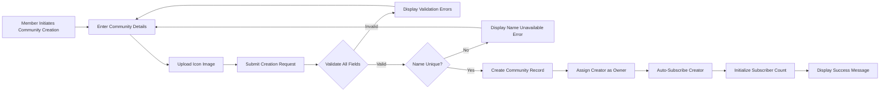
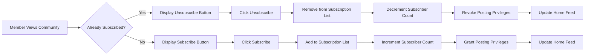
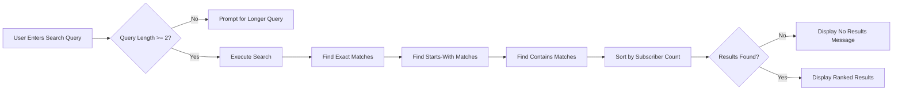
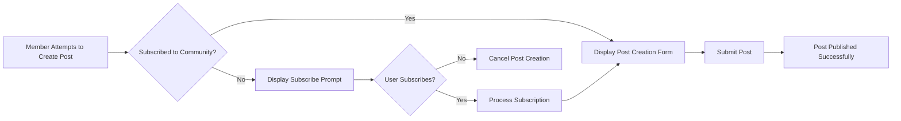

# Community System Requirements

## 1. Overview

The Community System enables users to create, discover, and participate in topic-based communities within the platform. Communities serve as the primary organizational unit for content, allowing users to find and engage with posts that match their interests. This document specifies the business requirements for community creation, management, discovery, and subscription functionality.

## 2. Community Creation

### 2.1 Creation Eligibility

THE system SHALL allow any authenticated member to create a new community.

WHEN a member creates a community, THE system SHALL automatically designate that member as the community owner with full moderation privileges.

### 2.2 Required Community Information

WHEN a member creates a community, THE system SHALL require the following information:

| Field | Requirement | Constraints |
|-------|-------------|-------------|
| Community Name | Required | Must be unique across all communities, alphanumeric characters and underscores only, minimum 3 characters, maximum 21 characters |
| Description | Required | Text description of the community's purpose and topics, minimum 10 characters, maximum 500 characters |
| Icon Image | Required | Uploaded image file, accepted formats: JPEG, PNG, GIF, maximum file size: 2MB, recommended dimensions: 256x256 pixels |

THE system SHALL validate that the community name is unique before allowing creation.

IF a member attempts to create a community with a name that already exists, THEN THE system SHALL reject the creation and display an error message indicating the name is unavailable.

### 2.3 Creation Process

WHEN a member submits a community creation request with valid information, THE system SHALL:

1. Validate all input fields according to the specified constraints
2. Verify the community name is unique
3. Process and store the uploaded icon image
4. Create the community record with the provided information
5. Automatically subscribe the creator to the new community
6. Assign the creator the "owner" role for that community
7. Initialize the subscriber count to 1 (the creator)

### 2.4 Owner Role and Initial Setup

WHEN a community is created, THE system SHALL grant the creator the "owner" role with the following inherent capabilities:

- Full moderation privileges within the community
- Ability to add and remove moderators
- Ability to ban and unban users from the community
- Ability to delete any post or comment within the community
- Ability to edit community information (name, description, icon)

THE owner role SHALL be permanent and cannot be transferred or removed by any other user.

IF a community has only one moderator (the owner), THEN THE system SHALL prevent the owner from removing themselves as moderator.

## 3. Community Information Display

### 3.1 Community Profile Information

WHEN a user views a community, THE system SHALL display the following information:

- Community name (unique identifier)
- Community description text
- Community icon image
- Current subscriber count
- Community creation date
- Name of the community owner (optional, based on owner's privacy settings)

### 3.2 Community Banner and Branding

THE system SHALL display the community icon in the following locations:

- Community list pages (thumbnail size: 32x32 pixels)
- Community profile page (large size: 256x256 pixels)
- Posts from that community (small size: 24x24 pixels)
- User subscription list (medium size: 48x48 pixels)

### 3.3 Subscriber Count Display

THE system SHALL display the current subscriber count on:

- Community profile page (exact number)
- Community list items (formatted number, e.g., "1.2k" for 1,234)
- Search results containing communities (formatted number)

THE system SHALL update the subscriber count in real-time when users subscribe or unsubscribe.

WHEN a community has fewer than 1,000 subscribers, THE system SHALL display the exact count.

WHEN a community has 1,000 or more subscribers, THE system SHALL display the count in abbreviated format:

| Subscriber Count | Display Format |
|------------------|----------------|
| 0-999 | Exact number (e.g., "847") |
| 1,000-999,999 | "X.Xk" format (e.g., "12.3k") |
| 1,000,000+ | "X.Xm" format (e.g., "2.5m") |

## 4. Subscription Management

### 4.1 Subscription Eligibility

THE system SHALL allow any authenticated member to subscribe to any community.

WHILE a member is subscribed to a community, THE system SHALL grant that member the ability to create posts in that community.

IF a member is not subscribed to a community, THEN THE system SHALL prevent that member from creating posts in that community.

### 4.2 Subscription Process

WHEN a member subscribes to a community, THE system SHALL:

1. Add the community to the member's subscription list
2. Increment the community's subscriber count by 1
3. Include the community's posts in the member's home feed
4. Grant posting privileges for that community

### 4.3 Unsubscription Process

WHEN a member unsubscribes from a community, THE system SHALL:

1. Remove the community from the member's subscription list
2. Decrement the community's subscriber count by 1
3. Remove the community's posts from the member's home feed (for future feed loads)
4. Revoke posting privileges for that community

IF a member has existing posts or comments in a community and then unsubscribes, THE system SHALL preserve those posts and comments.

WHEN an unsubscribed member attempts to create a post in a community they previously had access to, THE system SHALL deny the action and display a message prompting them to resubscribe.

### 4.4 Subscription List Management

THE system SHALL provide each member with access to their subscription list.

WHEN a member views their subscription list, THE system SHALL display:

- All communities the member is subscribed to
- Each community's name, icon, and subscriber count
- Sorting options: alphabetical, date subscribed (newest first), or subscriber count (highest first)

THE system SHALL support pagination for subscription lists with more than 25 communities.

### 4.5 Subscription Status Indication

WHEN a member views any community, THE system SHALL clearly indicate the member's subscription status:

- IF subscribed: Display "Joined" status with an "Leave" or "Unsubscribe" button
- IF not subscribed: Display "Join" button

## 5. Community Discovery and Search

### 5.1 Community Browsing

THE system SHALL provide a community browsing interface accessible to all users (including non-authenticated visitors).

WHEN a user browses the community list, THE system SHALL display:

- Community icons
- Community names
- Subscriber counts
- Brief description snippets (first 100 characters)

THE system SHALL support pagination for the community list with a default of 20 communities per page.

### 5.2 Community Search

THE system SHALL provide a search function to find communities by name.

WHEN a user performs a community search, THE system SHALL:

1. Accept a search query string
2. Search for communities whose names contain the query (case-insensitive partial matching)
3. Return matching communities sorted by relevance (exact matches first, then partial matches sorted by subscriber count)
4. Display results in a list format similar to the browse view

THE system SHALL support minimum search query length of 2 characters.

IF a search query has fewer than 2 characters, THEN THE system SHALL display a message requesting a longer query.

IF no communities match the search query, THEN THE system SHALL display a "No communities found" message with suggestions to:
- Check spelling
- Try different keywords
- Browse all communities

### 5.3 Search Results Ranking

WHEN displaying community search results, THE system SHALL rank results using the following priority:

1. **Exact match**: Community name exactly matches the query (highest priority)
2. **Starts with query**: Community name begins with the search query
3. **Contains query**: Community name contains the search query somewhere in the name
4. **Within each category**, sort by subscriber count (highest first)

### 5.4 Discovery Features

THE system SHALL support the following discovery features:

**Trending Communities**
- WHEN a user views the community discovery page, THE system SHALL display a "Trending" section showing communities with the highest growth in subscribers over the past 7 days.
- THE system SHALL limit the trending section to 5 communities.

**New Communities**
- THE system SHALL display a "New" section showing communities created within the past 30 days, sorted by creation date (newest first).
- THE system SHALL limit the new communities section to 10 communities.

**Popular Communities**
- THE system SHALL display a "Popular" section showing communities with the highest subscriber counts overall.
- THE system SHALL limit the popular section to 10 communities.

## 6. Community Settings and Management

### 6.1 Community Information Editing

THE system SHALL allow community owners to edit community information.

WHEN a community owner edits the community, THE system SHALL allow modification of:

- Community description
- Community icon image

THE system SHALL NOT allow modification of the community name after creation to maintain consistent community identity and prevent confusion.

IF an owner needs to change a community name, THEN the owner must create a new community and manually migrate content.

### 6.2 Community Deletion

THE system SHALL allow community owners to delete their communities.

WHEN a community owner initiates community deletion, THE system SHALL:

1. Require explicit confirmation (typing the community name)
2. Delete all posts within the community
3. Delete all comments on those posts
4. Remove all subscription records
5. Delete the community record
6. Notify all subscribers that the community has been deleted (via system notification)

IF a community is deleted, THEN THE system SHALL preserve the karma impact on users from votes received within that community.

## 7. Access Control and Permissions

### 7.1 Community Visibility

THE system SHALL make all communities publicly visible to all users, including non-authenticated visitors.

THE system SHALL allow non-authenticated users to:

- View community information
- Browse community posts
- View community subscriber counts

THE system SHALL prevent non-authenticated users from:

- Subscribing to communities
- Creating posts in communities
- Commenting on posts
- Voting on content

### 7.2 Banned User Access

WHEN a user is banned from a community, THE system SHALL:

- Allow that user to continue viewing community content
- Allow that user to remain subscribed to the community
- Prevent that user from creating new posts in the community
- Prevent that user from creating new comments in the community
- Display an informative message when the user attempts to post or comment indicating they are banned from that community

### 7.3 Subscription Requirement for Posting

THE system SHALL enforce subscription as a prerequisite for creating posts.

WHEN a non-subscribed member attempts to create a post in a community, THE system SHALL:

1. Deny the post creation
2. Display a message: "You must subscribe to this community to post"
3. Provide a quick subscribe button
4. After successful subscription, redirect to the post creation form

## 8. Integration with Other Systems

### 8.1 Post System Integration

Communities serve as the primary container for posts. See the [Post System Requirements](./05-post-system.md) for detailed specifications on:

- Post creation within communities
- Community feeds
- Post sorting and display

### 8.2 Moderation System Integration

Each community has its own moderation structure. See the [Moderation System Requirements](./08-moderation-system.md) for detailed specifications on:

- Moderator role hierarchy (Owner, Moderator)
- Moderator permissions within communities
- Banning and unbanning functionality
- Content moderation actions

### 8.3 User Actor Integration

Community creation and subscription require member authentication. See the [User Actors and Authentication Requirements](./02-user-actors.md) for detailed specifications on:

- Member authentication flows
- Session management
- Permission validation

## 9. Error Handling

### 9.1 Community Creation Errors

| Error Scenario | System Response |
|----------------|-----------------|
| Duplicate community name | "This community name is already taken. Please choose another."
| Invalid characters in name | "Community names can only contain letters, numbers, and underscores."
| Name too short | "Community name must be at least 3 characters."
| Name too long | "Community name cannot exceed 21 characters."
| Description too short | "Description must be at least 10 characters."
| Description too long | "Description cannot exceed 500 characters."
| Invalid image format | "Icon must be a JPEG, PNG, or GIF file."
| Image file too large | "Icon image must be smaller than 2MB."

### 9.2 Subscription Errors

| Error Scenario | System Response |
|----------------|-----------------|
| Already subscribed | "You are already subscribed to this community."
| Not subscribed (when unsubscribing) | "You are not subscribed to this community."
| Authentication required | "Please log in to subscribe to communities."

### 9.3 Search Errors

| Error Scenario | System Response |
|----------------|-----------------|
| Query too short | "Please enter at least 2 characters to search."
| No results found | "No communities found matching your search. Try different keywords or browse all communities."
| Search temporarily unavailable | "Search is temporarily unavailable. Please try again later."

## 10. Performance Requirements

### 10.1 Response Time Expectations

- WHEN a user creates a community, THE system SHALL complete the creation process within 3 seconds.
- WHEN a user subscribes to a community, THE system SHALL process the subscription within 1 second.
- WHEN a user searches for communities, THE system SHALL return results within 2 seconds.
- WHEN a user browses the community list, THE system SHALL load each page within 1 second.

### 10.2 Scalability Considerations

THE system SHALL efficiently handle:

- Communities with up to 10 million subscribers
- Platforms with up to 1 million total communities
- Search queries across all community names
- Real-time subscriber count updates

## 11. Data Retention

### 11.1 Community Data

THE system SHALL retain community data indefinitely unless:

- The community is deleted by the owner
- The community owner's account is deleted (which triggers community deletion)

### 11.2 Subscription Records

THE system SHALL retain subscription records until:

- The member unsubscribes
- The member's account is deleted
- The community is deleted

## 12. Summary

The Community System provides the foundational organizational structure for the platform. Communities enable users to find and participate in topic-based discussions while providing clear ownership and moderation hierarchies. Key capabilities include:

- Self-service community creation for all members
- Flexible subscription management with immediate posting privileges
- Robust discovery features including search, trending, and popular communities
- Clear permission boundaries between subscribed and non-subscribed users
- Integration with post creation, moderation, and user authentication systems

The system is designed to scale to millions of communities and subscribers while maintaining responsive performance for all operations.