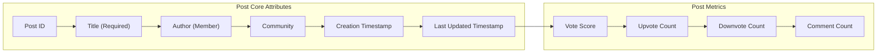
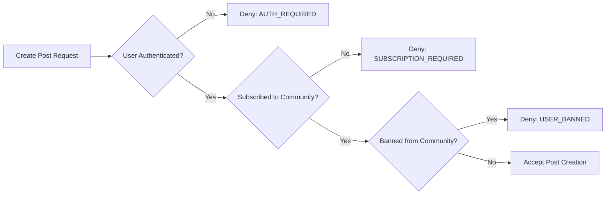
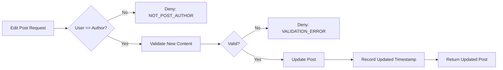
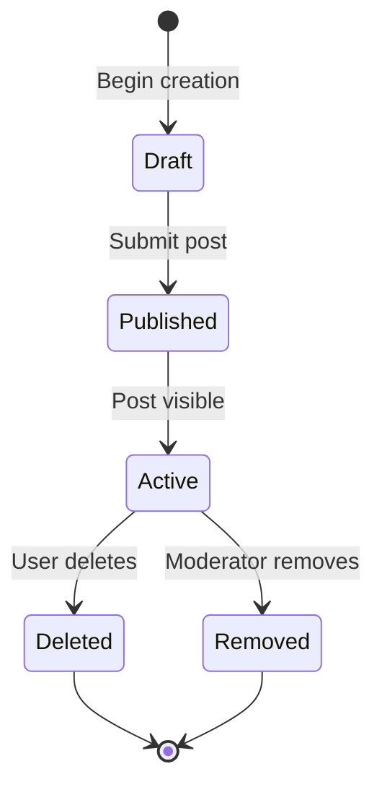
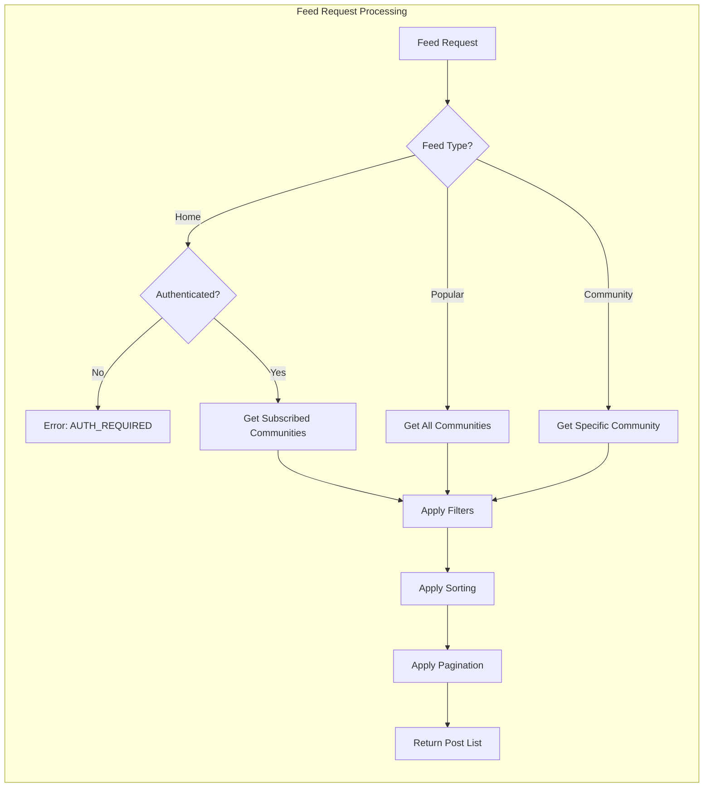
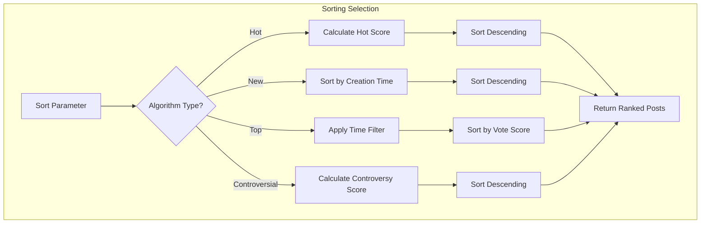

# Post System Requirements Specification

## 1. Overview

This document defines the complete post system for the community platform, including post types, creation and management workflows, feed delivery mechanisms, sorting algorithms, and display requirements. The post system is the core content delivery mechanism that enables users to share and discover content across communities.

### 1.1 Scope

THE post system SHALL support three distinct post types: text posts, link posts, and image posts. THE system SHALL provide multiple feed views with configurable sorting options. THE system SHALL ensure all post operations complete within acceptable performance thresholds.

### 1.2 Related Features

Posts interact with the following systems:
- **Community System**: Posts belong to communities and require subscription for creation
- **Voting System**: Posts receive upvotes and downvotes affecting visibility
- **Comment System**: Posts serve as root containers for comment threads
- **Karma System**: Post votes affect author karma scores
- **User Profile System**: Posts appear in user activity history

## 2. Post Types and Structure

### 2.1 Post Type Overview

THE system SHALL support exactly three post types, each with distinct content requirements:

| Post Type | Required Content | Optional Content | Validation Rules |
|-----------|------------------|------------------|------------------|
| Text Post | Title, Text Content | None | Text content maximum 40,000 characters |
| Link Post | Title, URL | None | URL must be valid HTTP/HTTPS, maximum 2,048 characters |
| Image Post | Title, Image File | None | Image file required, allowed formats: JPEG, PNG, GIF, WebP |

### 2.2 Common Post Attributes

All post types share the following attributes:



### 2.3 Text Post Requirements

WHEN a user creates a text post, THE system SHALL:

1. Require a title with minimum 1 character and maximum 300 characters
2. Require text content with minimum 1 character and maximum 40,000 characters
3. Store the text content as-is without automatic formatting modifications
4. Preserve whitespace and line breaks in the text content

IF text content exceeds 40,000 characters, THEN THE system SHALL reject the post with error code POST_TEXT_TOO_LONG.

IF text content is empty or contains only whitespace, THEN THE system SHALL reject the post with error code POST_CONTENT_REQUIRED.

### 2.4 Link Post Requirements

WHEN a user creates a link post, THE system SHALL:

1. Require a title with minimum 1 character and maximum 300 characters
2. Require a URL with valid HTTP or HTTPS protocol
3. Validate URL format before accepting the post
4. Extract and store the domain name for display purposes
5. Store the complete URL without modification

IF the URL does not start with "http://" or "https://", THEN THE system SHALL reject the post with error code POST_INVALID_URL_PROTOCOL.

IF the URL exceeds 2,048 characters, THEN THE system SHALL reject the post with error code POST_URL_TOO_LONG.

IF the URL format is malformed, THEN THE system SHALL reject the post with error code POST_MALFORMED_URL.

### 2.5 Image Post Requirements

WHEN a user creates an image post, THE system SHALL:

1. Require a title with minimum 1 character and maximum 300 characters
2. Require an uploaded image file
3. Accept only the following image formats: JPEG, PNG, GIF, WebP
4. Generate a thumbnail image for list display
5. Store the original image for full-size display
6. Reject images larger than 20MB

IF an image file exceeds 20MB, THEN THE system SHALL reject the post with error code POST_IMAGE_TOO_LARGE.

IF an image format is not JPEG, PNG, GIF, or WebP, THEN THE system SHALL reject the post with error code POST_UNSUPPORTED_IMAGE_FORMAT.

## 3. Post Creation and Management

### 3.1 Post Creation Prerequisites

WHEN a member attempts to create a post, THE system SHALL verify the following conditions:



THE system SHALL enforce subscription requirements for post creation. WHERE a user is not subscribed to a community, THE system SHALL deny post creation with error code SUBSCRIPTION_REQUIRED.

IF a user has been banned from a community, THEN THE system SHALL deny post creation in that community with error code USER_BANNED, regardless of subscription status.

### 3.2 Post Creation Process

WHEN a member creates a post, THE system SHALL:

1. Validate all required fields based on post type
2. Validate community subscription status
3. Verify user is not banned from the target community
4. Generate a unique post identifier
5. Record the creation timestamp
6. Initialize vote counts to zero (score: 0, upvotes: 0, downvotes: 0)
7. Initialize comment count to zero
8. Automatically upvote the post by the author
9. Update the author's karma by +1
10. Return the created post with all attributes

THE system SHALL complete post creation and return a response within 2 seconds for text and link posts, and within 5 seconds for image posts (accounting for file upload and processing).

### 3.3 Post Editing

WHEN a member edits their own post, THE system SHALL:

1. Verify the user is the post author
2. Allow modification of title and content (type-specific)
3. Not allow changing the post type after creation
4. Not allow changing the community after creation
5. Record the last updated timestamp
6. Preserve the original creation timestamp
7. Preserve existing vote counts and comments

IF a user attempts to edit another user's post, THEN THE system SHALL deny the operation with error code NOT_POST_AUTHOR.



### 3.4 Post Deletion

WHEN a member deletes their own post, THE system SHALL:

1. Verify the user is the post author
2. Mark the post as deleted (soft delete)
3. Remove the post from all feeds immediately
4. Preserve the post data for audit purposes
5. Decrement the author's karma by the post's current vote score
6. Delete all comments associated with the post
7. Return confirmation of deletion

THE system SHALL complete post deletion within 2 seconds.

IF a user attempts to delete another user's post without moderator privileges, THEN THE system SHALL deny the operation with error code NOT_POST_AUTHOR.

### 3.5 Post Lifecycle States



### 3.6 Post Ownership and Permissions

THE system SHALL maintain clear ownership tracking for all posts:

| Permission | Post Author | Moderator | Community Owner | Other Users |
|------------|-------------|-----------|-----------------|-------------|
| View post | ✅ Yes | ✅ Yes | ✅ Yes | ✅ Yes |
| Edit post | ✅ Yes | ❌ No | ❌ No | ❌ No |
| Delete post | ✅ Yes | ✅ Yes* | ✅ Yes* | ❌ No |
| Vote on post | ❌ No** | ✅ Yes | ✅ Yes | ✅ Yes |
| Comment on post | ✅ Yes | ✅ Yes | ✅ Yes | ✅ Yes*** |

*Moderators and owners can delete posts within their own communities only

**Authors cannot vote on their own posts

***Requires subscription and not banned from community

## 4. Post Feeds

### 4.1 Feed Types Overview

THE system SHALL provide three distinct feed types:

| Feed Type | Access Requirement | Content Scope | Purpose |
|-----------|-------------------|---------------|----------|
| Home Feed | Authenticated users only | Subscribed communities | Personalized content discovery |
| Popular Feed | Everyone (including anonymous) | All communities | Platform-wide trending content |
| Community Feed | Everyone (including anonymous) | Single community | Community-specific browsing |

### 4.2 Home Feed

WHEN an authenticated member requests their home feed, THE system SHALL:

1. Retrieve posts exclusively from communities the user has subscribed to
2. Apply the requested sorting algorithm
3. Return paginated results
4. Exclude deleted posts
5. Exclude posts from communities where the user is banned

IF an unauthenticated user requests the home feed, THEN THE system SHALL return error code AUTHENTICATION_REQUIRED.

THE home feed SHALL support all sorting algorithms: Hot, New, Top, and Controversial.

### 4.3 Popular Feed

WHEN any user (authenticated or anonymous) requests the popular feed, THE system SHALL:

1. Retrieve posts from all communities across the platform
2. Apply the requested sorting algorithm
3. Return paginated results
4. Exclude deleted posts
5. Exclude posts from banned communities (if applicable)

THE popular feed SHALL support all sorting algorithms: Hot, New, Top, and Controversial.

### 4.4 Community Feed

WHEN any user (authenticated or anonymous) requests a community feed, THE system SHALL:

1. Retrieve posts exclusively from the specified community
2. Apply the requested sorting algorithm
3. Return paginated results
4. Exclude deleted posts
5. Verify the community exists

IF the specified community does not exist, THEN THE system SHALL return error code COMMUNITY_NOT_FOUND.

THE community feed SHALL support all sorting algorithms: Hot, New, Top, and Controversial.

### 4.5 Feed Request Flow



### 4.6 Feed Caching Strategy

THE system SHALL implement caching for feed performance optimization:

WHEN loading feeds, THE system SHALL:

1. Cache popular feed results for 30 seconds
2. Cache community feed results for 60 seconds
3. NOT cache home feed results (user-specific personalization)
4. Invalidate cache when new posts are created
5. Invalidate cache when posts are deleted or removed

## 5. Sorting Algorithms

### 5.1 Sorting Overview

THE system SHALL support four sorting algorithms for all feed types:

1. **Hot**: Recent posts with high engagement ranked first
2. **New**: Most recently created posts first
3. **Top**: Highest vote score first with time filtering
4. **Controversial**: High vote count with low net score first

### 5.2 Hot Sorting

WHEN the Hot sorting algorithm is applied, THE system SHALL:

1. Calculate a hot score for each post based on:
   - Vote score (upvotes minus downvotes)
   - Time since creation
   - Comment count
2. Rank posts with higher hot scores first
3. Give preference to recent posts with positive votes
4. Decay older posts' visibility over time

THE hot algorithm SHALL use a time-decay formula that reduces post visibility exponentially over time while amplifying posts with higher engagement.

**Hot Score Formula** (conceptual description):
THE system SHALL calculate hot score considering the vote score and the logarithm of time elapsed since creation. Posts with higher vote scores and more recent creation times receive higher hot scores.

**Hot Score Components**:

| Factor | Weight | Description |
|--------|--------|-------------|
| Vote Score | High | Primary factor - higher scores rank higher |
| Recency | Medium | Newer posts receive boost |
| Comment Count | Low | Active discussions receive minor boost |
| Time Decay | Exponential | Older posts gradually lose visibility |

### 5.3 New Sorting

WHEN the New sorting algorithm is applied, THE system SHALL:

1. Sort posts by creation timestamp in descending order (newest first)
2. Use the post's original creation time, not the last updated time
3. Not consider vote scores or engagement metrics

THE new feed SHALL display posts in pure reverse chronological order.

### 5.4 Top Sorting

WHEN the Top sorting algorithm is applied, THE system SHALL:

1. Sort posts by vote score in descending order (highest first)
2. Apply a user-selected time filter
3. Support the following time filters:
   - Today: Posts created in the last 24 hours
   - This Week: Posts created in the last 7 days
   - This Month: Posts created in the last 30 days
   - This Year: Posts created in the last 365 days
   - All Time: All posts regardless of creation time

| Time Filter | Time Range |
|-------------|------------|
| Today | Last 24 hours from current time |
| This Week | Last 168 hours (7 days) from current time |
| This Month | Last 720 hours (30 days) from current time |
| This Year | Last 8,760 hours (365 days) from current time |
| All Time | No time restriction |

IF no time filter is specified, THEN THE system SHALL default to "All Time".

### 5.5 Controversial Sorting

WHEN the Controversial sorting algorithm is applied, THE system SHALL:

1. Identify posts with high total vote count but vote score close to zero
2. Calculate controversy score based on:
   - Total votes (upvotes + downvotes)
   - Absolute value of vote score
   - Ratio between upvotes and downvotes
3. Rank posts with higher controversy scores first

**Controversy Score Concept**:
THE system SHALL assign higher controversy scores to posts where:
- Total vote count is high (many people voted)
- Vote score is near zero (roughly equal upvotes and downvotes)
- The ratio between upvotes and downvotes is close to 1:1

A post with 500 upvotes and 500 downvotes (score: 0) SHALL rank higher in controversial sorting than a post with 50 upvotes and 50 downvotes (score: 0).

**Controversy Score Examples**:

| Upvotes | Downvotes | Score | Total Votes | Controversy Level |
|---------|-----------|-------|-------------|-------------------|
| 500 | 498 | 2 | 998 | Very High |
| 100 | 100 | 0 | 200 | High |
| 50 | 45 | 5 | 95 | Medium |
| 100 | 10 | 90 | 110 | Low |
| 10 | 1 | 9 | 11 | Very Low |

### 5.6 Sorting Algorithm Flow



### 5.7 Default Sorting

IF no sorting algorithm is specified in a feed request, THE system SHALL apply the following defaults:

- **Home Feed**: Hot sorting
- **Popular Feed**: Hot sorting
- **Community Feed**: Hot sorting

## 6. Post Display Requirements

### 6.1 Post List Display

WHEN displaying posts in any feed (list view), THE system SHALL show the following information for each post:

| Display Element | Requirement | Notes |
|-----------------|-------------|-------|
| Title | Always displayed | Full title, maximum 300 characters |
| Author Username | Always displayed | Display the author's username |
| Community Name | Always displayed | Display the community name with link |
| Vote Score | Always displayed | Net score (upvotes - downvotes) |
| Comment Count | Always displayed | Total comment count including nested replies |
| Time Since Posted | Always displayed | Relative time (e.g., "3 hours ago") |
| Content Preview | Type-dependent | See section 6.2 |

### 6.2 Content Preview by Post Type

WHEN displaying posts in a list, THE system SHALL show type-specific previews:

**Text Posts**:
- THE system SHALL display the first 200 characters of the text content
- THE system SHALL truncate longer content with an ellipsis ("...")
- THE system SHALL preserve line breaks in the preview

**Link Posts**:
- THE system SHALL display the domain name extracted from the URL
- THE system SHALL format the domain as: "example.com" (without protocol)
- THE system SHALL strip "www." prefix from domain display

**Image Posts**:
- THE system SHALL display a thumbnail of the uploaded image
- THE system SHALL generate thumbnails at a fixed aspect ratio
- THE system SHALL optimize thumbnail file size for fast loading
- THE system SHALL use lazy loading for image thumbnails

### 6.3 Post Detail Display

WHEN displaying a single post in detail view, THE system SHALL show:

| Display Element | Requirement |
|-----------------|-------------|
| Title | Full title |
| Full Content | Complete text content, full image, or linked URL |
| Author | Username with link to profile |
| Community | Name with link to community feed |
| Vote Score | Current net score |
| Upvote Count | Total number of upvotes |
| Downvote Count | Total number of downvotes |
| Comment Count | Total comments on the post |
| Creation Timestamp | Absolute date and time |
| Last Updated Timestamp | If post was edited, show "edited at [timestamp]" |
| Edit History | Not displayed (future consideration) |

### 6.4 Relative Time Display

THE system SHALL display time since posting in human-readable format:

| Time Range | Display Format |
|------------|----------------|
| Less than 1 minute | "just now" |
| 1-59 minutes | "X minutes ago" |
| 1-23 hours | "X hours ago" |
| 24-48 hours | "yesterday" |
| 3-6 days | "X days ago" |
| 7-30 days | "X weeks ago" |
| 31-365 days | "X months ago" |
| More than 365 days | "X years ago" |

### 6.5 Vote Display on Posts

WHEN an authenticated user views a post, THE system SHALL:

1. Display the current vote score prominently
2. Show upvote and downvote buttons
3. Highlight the user's current vote status (if any)
4. Allow vote actions directly from the post display

WHEN an anonymous user views a post, THE system SHALL:

1. Display the current vote score
2. Show upvote and downvote buttons
3. Redirect to login when vote buttons are clicked

## 7. Pagination

### 7.1 Pagination Requirements

THE system SHALL implement cursor-based pagination for all feeds to ensure consistent results even when new posts are created.

WHEN a user requests a feed, THE system SHALL:

1. Return a default of 25 posts per page
2. Support configurable page sizes between 10 and 100 posts
3. Provide a cursor for fetching the next page
4. Include total count metadata when feasible

IF a page size exceeds 100, THEN THE system SHALL limit the page size to 100 posts.

IF a page size is less than 10, THEN THE system SHALL set the page size to 10 posts.

### 7.2 Pagination Response Structure

WHEN returning paginated results, THE system SHALL include:

1. Array of posts for the current page
2. Cursor for the next page (if more results exist)
3. Boolean indicating if more results exist
4. Current page metadata (sort algorithm, filter settings)

### 7.3 Cursor-Based Pagination Details

THE system SHALL use cursor-based pagination with the following characteristics:

| Property | Description |
|----------|-------------|
| Cursor | Encoded string containing sort position and timestamp |
| Cursor Expiration | Cursors expire after 24 hours |
| Consistency | Results remain consistent even if new posts are created |
| Navigation | Users can navigate forward and backward through pages |

## 8. Performance Requirements

### 8.1 Response Time Requirements

| Operation | Maximum Response Time |
|-----------|----------------------|
| Feed retrieval (any type) | 500 milliseconds |
| Single post detail view | 200 milliseconds |
| Post creation (text/link) | 2 seconds |
| Post creation (image) | 5 seconds |
| Post editing | 1 second |
| Post deletion | 2 seconds |

### 8.2 Scalability Expectations

THE system SHALL support:

- Concurrent feed requests from multiple users without degradation
- Efficient queries for posts with high vote counts
- Fast sorting operations across large post volumes
- Responsive pagination even for deep page navigation
- Platform with up to 10 million posts
- Communities with up to 1 million posts each
- Real-time feed updates without performance impact

### 8.3 Database Performance

THE system SHALL maintain the following database performance characteristics:

| Operation | Target Performance |
|-----------|-------------------|
| Feed query (with sorting) | Less than 100ms query time |
| Post lookup by ID | Less than 10ms query time |
| Post insertion | Less than 50ms write time |
| Vote count update | Less than 20ms update time |

## 9. Error Handling

### 9.1 Post Creation Errors

| Error Code | Condition | User Message |
|------------|-----------|--------------|
| AUTH_REQUIRED | User not authenticated | "You must be logged in to create posts" |
| SUBSCRIPTION_REQUIRED | User not subscribed to community | "You must subscribe to this community before posting" |
| USER_BANNED | User banned from community | "You have been banned from this community and cannot post" |
| POST_TITLE_REQUIRED | Missing or empty title | "Post title is required" |
| POST_TITLE_TOO_LONG | Title exceeds 300 characters | "Post title must be 300 characters or less" |
| POST_CONTENT_REQUIRED | Missing content for post type | "Post content is required" |
| POST_TEXT_TOO_LONG | Text exceeds 40,000 characters | "Post text must be 40,000 characters or less" |
| POST_INVALID_URL_PROTOCOL | URL missing HTTP/HTTPS | "Link must start with http:// or https://" |
| POST_URL_TOO_LONG | URL exceeds 2,048 characters | "URL must be 2,048 characters or less" |
| POST_MALFORMED_URL | Invalid URL format | "Please enter a valid URL" |
| POST_IMAGE_TOO_LARGE | Image exceeds 20MB | "Image must be 20MB or smaller" |
| POST_UNSUPPORTED_IMAGE_FORMAT | Invalid image format | "Image must be JPEG, PNG, GIF, or WebP" |

### 9.2 Feed Retrieval Errors

| Error Code | Condition | User Message |
|------------|-----------|--------------|
| AUTHENTICATION_REQUIRED | Home feed requested by anonymous user | "Please log in to view your home feed" |
| COMMUNITY_NOT_FOUND | Community feed for non-existent community | "This community does not exist" |
| INVALID_SORT_PARAMETER | Unsupported sorting algorithm | "Invalid sorting option" |
| INVALID_TIME_FILTER | Unsupported time filter | "Invalid time filter" |

### 9.3 Post Management Errors

| Error Code | Condition | User Message |
|------------|-----------|--------------|
| POST_NOT_FOUND | Post does not exist | "This post does not exist" |
| POST_DELETED | Post has been deleted | "This post has been deleted" |
| NOT_POST_AUTHOR | User attempting to edit/delete another user's post | "You can only edit or delete your own posts" |

### 9.4 Error Response Format

WHEN an error occurs, THE system SHALL return:

```json
{
  "error": {
    "code": "ERROR_CODE",
    "message": "User-friendly error message",
    "details": {}
  }
}
```

## 10. Business Rules

### 10.1 Post Creation Business Rules

1. **Subscription Enforcement**: Users cannot create posts in communities they are not subscribed to
2. **Ban Enforcement**: Banned users cannot create posts in the community they are banned from
3. **Automatic Self-Upvote**: When a user creates a post, the system automatically adds an upvote from the author
4. **Karma Credit**: Authors receive +1 karma when their post is created (from self-upvote)

### 10.2 Post Display Business Rules

1. **Deleted Post Visibility**: Deleted posts are never shown in feeds or search results
2. **Banned User Content**: Posts from banned users remain visible unless explicitly deleted
3. **Edited Post Indication**: Posts that have been edited show "edited" indicator with timestamp
4. **Content Preview Truncation**: Previews are truncated at word boundaries when possible

### 10.3 Feed Business Rules

1. **Home Feed Exclusivity**: Home feed only shows content from subscribed communities
2. **Cross-Community Discovery**: Popular and community feeds show all posts regardless of subscription
3. **Moderator Exception**: Moderators can see posts in their community feed even if not subscribed
4. **Anonymous Access**: Popular and community feeds are accessible without authentication

### 10.4 Content Moderation Integration

WHEN a post is removed by a moderator, THE system SHALL:

1. Remove the post from all feeds
2. Preserve the post data for moderation records
3. Notify the post author of the removal
4. Record the moderator and reason for removal

## 11. Integration Points

### 11.1 Community System Integration

- Posts belong to exactly one community
- Post creation requires community subscription
- Community deletion requires handling of associated posts
- Community bans prevent post creation

### 11.2 Voting System Integration

- Posts receive votes that affect visibility and ranking
- Vote changes trigger hot score recalculation
- Vote score directly impacts Top and Controversial sorting
- Self-voting is prevented on own posts

### 11.3 Comment System Integration

- Posts serve as root containers for comment threads
- Comment count affects hot score calculation
- Post deletion triggers cascade deletion of comments
- Comments inherit community restrictions from parent post

### 11.4 User Profile Integration

- Posts appear in user's activity history
- Post deletion removes post from activity history
- Post count may be displayed on user profile
- User profile shows karma from post votes

### 11.5 Karma System Integration

- Post creation grants author +1 karma (self-upvote)
- Post deletion adjusts author's karma
- Post votes directly affect author's karma score
- Karma updates are atomic with vote operations

## 12. Data Model Overview

### 12.1 Post Entity Properties

THE system SHALL store the following properties for each post:

| Property | Type | Description |
|----------|------|-------------|
| id | UUID | Unique post identifier |
| communityId | UUID | Reference to parent community |
| authorId | UUID | Reference to post author |
| title | String | Post title (max 300 chars) |
| postType | Enum | TEXT, LINK, or IMAGE |
| textContent | Text (nullable) | Text content for text posts |
| linkUrl | String (nullable) | URL for link posts |
| imageUrl | String (nullable) | Image URL for image posts |
| imageThumbnailUrl | String (nullable) | Thumbnail URL for image posts |
| voteScore | Integer | Current vote score |
| upvoteCount | Integer | Total upvotes received |
| downvoteCount | Integer | Total downvotes received |
| commentCount | Integer | Total comments on post |
| hotScore | Decimal | Calculated hot score |
| controversyScore | Decimal | Calculated controversy score |
| isDeleted | Boolean | Soft delete flag |
| deletedAt | Timestamp (nullable) | Deletion timestamp |
| createdAt | Timestamp | Creation timestamp |
| updatedAt | Timestamp | Last update timestamp |
| editedAt | Timestamp (nullable) | Last edit timestamp |

### 12.2 Post Indexes

THE system SHALL maintain the following indexes for efficient querying:

| Index Name | Fields | Purpose |
|------------|--------|--------|
| idx_posts_community_created | communityId, createdAt DESC | Community feed queries |
| idx_posts_community_score | communityId, voteScore DESC | Top sorting by community |
| idx_posts_author_created | authorId, createdAt DESC | User post history |
| idx_posts_hot_score | hotScore DESC | Hot sorting |
| idx_posts_controversy | controversyScore DESC | Controversial sorting |
| idx_posts_created | createdAt DESC | New sorting |

## 13. Security Considerations

### 13.1 Input Validation

THE system SHALL validate all user input:

| Input Field | Validation |
|-------------|------------|
| Title | Sanitize HTML, enforce length limits |
| Text Content | Sanitize HTML, enforce length limits |
| URL | Validate format, check for malicious URLs |
| Image File | Validate file type, scan for malware |

### 13.2 Rate Limiting

THE system SHALL implement rate limiting for post operations:

| Operation | Rate Limit |
|-----------|------------|
| Post creation | 10 posts per hour per user |
| Post editing | 30 edits per hour per user |
| Post deletion | 20 deletions per hour per user |

### 13.3 Content Security

THE system SHALL protect against:

- Cross-site scripting (XSS) in post content
- Malicious URL redirects in link posts
- Malware in uploaded images
- Spam and automated posting

## 14. Summary

The Post System provides the core content sharing and discovery functionality for the community platform. Key capabilities include:

- **Three Post Types**: Text, link, and image posts with type-specific validation
- **Comprehensive Feed System**: Home, popular, and community feeds with distinct access controls
- **Advanced Sorting**: Hot, new, top, and controversial algorithms for content discovery
- **Full Content Lifecycle**: Creation, editing, deletion, and moderation integration
- **Performance Optimized**: Sub-second feed loading with efficient pagination
- **Security Hardened**: Input validation, rate limiting, and content security measures

The system is designed to scale to millions of posts while maintaining responsive performance and providing a seamless user experience for content creators and consumers alike.