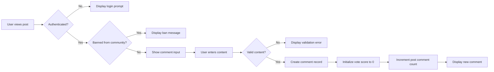
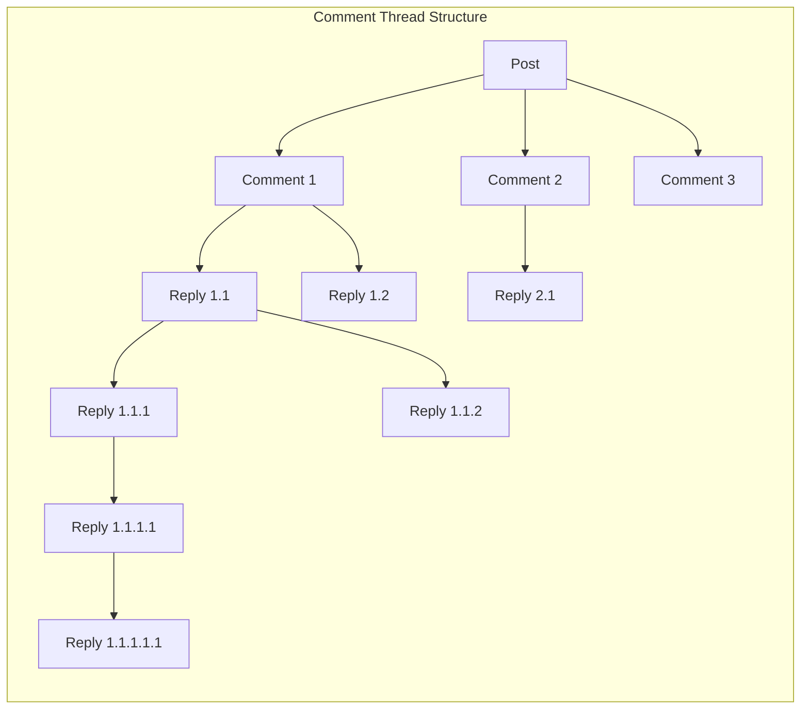
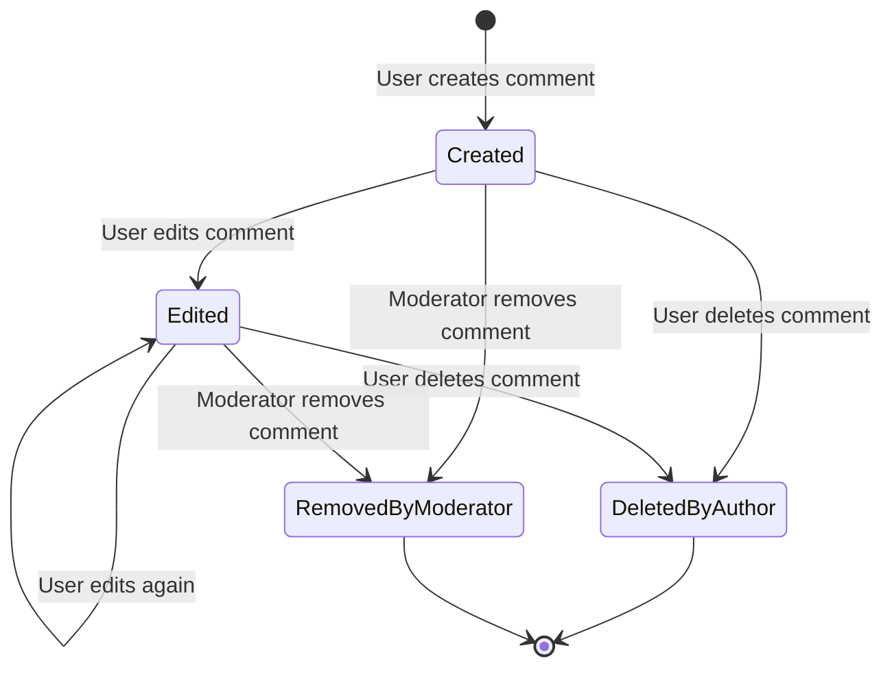
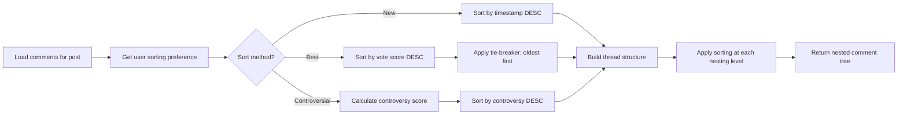
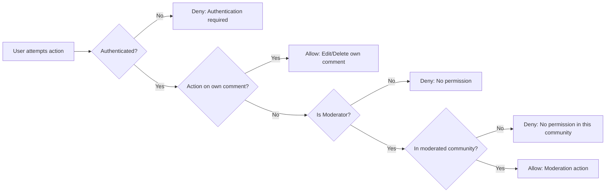
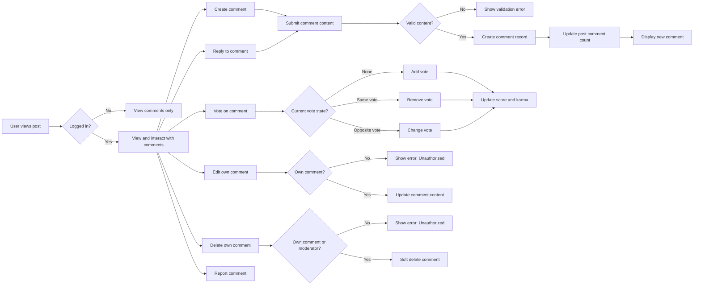

# Comment System Requirements

## 1. Overview

The comment system enables users to engage in discussions on posts through a hierarchical, nested comment structure with unlimited depth. Comments support voting, sorting, and full content management by their authors.

THE comment system SHALL provide users the ability to express opinions and engage in discussions on posts through text-based comments.

THE comment system SHALL support unlimited nesting depth for comment replies, enabling complex threaded discussions.

THE comment system SHALL integrate with the voting system to allow users to upvote or downvote any comment.

THE comment system SHALL maintain accurate comment counts on posts and preserve thread integrity.

## 2. Comment Creation

### 2.1 Basic Comment Creation

**Ubiquitous Requirements**

THE system SHALL allow authenticated members to create comments on any post.

THE system SHALL require users to be logged in before creating comments.

THE system SHALL associate each comment with its author, the parent post, creation timestamp, and initial vote score of zero.

THE system SHALL store the following properties for each comment:

| Property | Type | Description |
|----------|------|-------------|
| id | UUID | Unique comment identifier |
| postId | UUID | Reference to parent post |
| parentId | UUID (nullable) | Reference to parent comment (null for top-level) |
| authorId | UUID | Reference to comment author |
| content | Text | Comment text content (max 10,000 characters) |
| voteScore | Integer | Current vote score (upvotes - downvotes) |
| upvoteCount | Integer | Total upvotes received |
| downvoteCount | Integer | Total downvotes received |
| createdAt | Timestamp | Creation timestamp |
| updatedAt | Timestamp | Last update timestamp |
| editedAt | Timestamp (nullable) | Last edit timestamp |
| isDeleted | Boolean | Soft delete flag |

**Event-Driven Requirements**

WHEN a user submits a comment on a post, THE system SHALL validate that:
- The user is authenticated
- The user has not been banned from that community
- The user is subscribed to the community (if required by system policy)
- The post exists and has not been deleted

WHEN a banned user attempts to create a comment in a community, THE system SHALL reject the comment and display an error message: "You are banned from this community and cannot post comments."

WHEN a comment is successfully created, THE system SHALL:
1. Store the comment content as provided by the user
2. Record the author as the authenticated user's ID
3. Link the comment to the parent post
4. Set the creation timestamp to the current server time
5. Initialize the vote score to 0
6. Initialize the upvote count to 0
7. Initialize the downvote count to 0
8. Increment the parent post's comment count by 1
9. Return the created comment with all associated metadata

**Input Validation Requirements**

THE system SHALL enforce the following validation rules for comment content:

| Validation Rule | Requirement | Error Code |
|-----------------|-------------|------------|
| Non-empty content | Content must contain at least 1 non-whitespace character | COMMENT_EMPTY_CONTENT |
| Maximum length | Content must not exceed 10,000 characters | COMMENT_TOO_LONG |
| Whitespace handling | Leading and trailing whitespace shall be stripped | N/A |
| Line breaks | Internal whitespace and line breaks shall be preserved | N/A |

IF the comment content is empty or contains only whitespace, THEN THE system SHALL reject the submission with HTTP status 400 and error code COMMENT_EMPTY_CONTENT with message "Comment content cannot be empty."

IF the comment content exceeds 10,000 characters, THEN THE system SHALL reject the submission with HTTP status 400 and error code COMMENT_TOO_LONG with message "Comment cannot exceed 10,000 characters."

IF the user is not authenticated, THEN THE system SHALL reject the submission with HTTP status 401 and error code AUTHENTICATION_REQUIRED with message "Please log in to post a comment."

IF the user is banned from the community, THEN THE system SHALL reject the submission with HTTP status 403 and error code USER_BANNED_FROM_COMMUNITY with message "You are banned from this community."

IF the parent post does not exist or has been deleted, THEN THE system SHALL reject the submission with HTTP status 404 and error code POST_NOT_FOUND with message "This post no longer exists."

### 2.2 Comment Creation Workflow



## 3. Nested Reply System

### 3.1 Reply Architecture

**Ubiquitous Requirements**

THE system SHALL support unlimited nesting depth for comment replies.

THE system SHALL maintain a hierarchical parent-child relationship structure for all comments.

THE system SHALL track the complete ancestry chain for each comment through the parentId reference.

THE system SHALL allow replies to any comment at any nesting level without depth restrictions.

**Event-Driven Requirements**

WHEN a user creates a reply to an existing comment, THE system SHALL:
1. Store the comment as a child of the parent comment
2. Link the reply to the same post as its parent comment
3. Record the parent comment ID in the parentId field
4. Maintain the full thread structure
5. Increment the parent post's comment count by 1

WHEN displaying a comment thread, THE system SHALL preserve the nested structure for proper hierarchical display.

WHEN a user views a comment with replies, THE system SHALL display all direct child comments indented beneath the parent.

**State-Driven Requirements**

WHILE a parent comment exists, THE system SHALL allow replies to that comment regardless of nesting depth.

WHILE a parent comment has been deleted but not removed from the database, THE system SHALL still display its replies with the deleted parent showing as "[deleted]".

**Thread Integrity Requirements**

THE system SHALL prevent orphaned comments by maintaining referential integrity between parent and child comments.

THE system SHALL ensure all comments in a thread remain accessible through the parent post.

THE system SHALL support efficient retrieval of entire comment threads with unlimited depth through optimized database queries.

### 3.2 Reply Display Structure

THE system SHALL display replies indented under their parent comments with clear visual indication of nesting depth.

THE system SHALL display the complete reply chain from any comment to its deepest descendant.

THE system SHALL provide visual indicators such as indentation levels, connecting lines, or threading UI elements to clarify comment relationships.

THE system SHALL support collapsing and expanding of comment threads to improve readability for large discussions.

### 3.3 Nested Comment Structure Diagram



## 4. Comment Editing and Deletion

### 4.1 Comment Editing

**Ubiquitous Requirements**

THE system SHALL allow users to edit their own comments at any time after creation.

THE system SHALL prohibit users from editing comments authored by other users.

THE system SHALL preserve the original creation timestamp when a comment is edited.

THE system SHALL track the last edit timestamp for edited comments in the editedAt field.

THE system SHALL mark edited comments with an "edited" indicator visible to all users.

**Event-Driven Requirements**

WHEN a user edits their comment, THE system SHALL:
1. Validate the user is the comment author
2. Validate the new content meets all content requirements
3. Update the comment content with the new text
4. Record the edit timestamp in the editedAt field
5. Mark the comment as edited
6. Preserve all other comment properties including author, votes, parent relationships, and creation timestamp
7. Return the updated comment

WHEN an edited comment is displayed, THE system SHALL show an indicator that the comment has been edited, such as "(edited)" after the timestamp.

WHEN a user attempts to edit another user's comment, THE system SHALL deny access with HTTP status 403 and error code COMMENT_EDIT_UNAUTHORIZED with message "You can only edit your own comments."

WHEN a user attempts to edit a deleted comment, THE system SHALL deny access with HTTP status 400 and error code COMMENT_DELETED with message "This comment has been deleted."

**Input Validation for Edits**

IF the edited comment content is empty or contains only whitespace, THEN THE system SHALL reject the edit with HTTP status 400 and error code COMMENT_EMPTY_CONTENT.

IF the edited comment content exceeds 10,000 characters, THEN THE system SHALL reject the edit with HTTP status 400 and error code COMMENT_TOO_LONG.

### 4.2 Comment Deletion by Author

**Ubiquitous Requirements**

THE system SHALL allow users to delete their own comments at any time.

THE system SHALL prohibit users from deleting comments authored by other users, except for moderators within their communities.

THE system SHALL implement soft deletion for comments to preserve thread structure.

**Event-Driven Requirements**

WHEN a user deletes their own comment, THE system SHALL:
1. Mark the comment as deleted (set isDeleted to true)
2. Set the deletedAt timestamp
3. Replace the author information display with "[deleted]"
4. Replace the content display with "[deleted]"
5. Preserve the comment's position in the thread structure
6. Preserve all replies to the deleted comment
7. Decrement the parent post's comment count by 1
8. Maintain the vote score and counts for internal record-keeping

WHEN a deleted comment has replies, THE system SHALL continue to display the deleted comment placeholder to maintain thread structure for the replies.

WHEN a deleted comment has no replies, THE system MAY hide the comment from display entirely.

**Cascading Rules for Account Deletion**

WHEN a user deletes their account, THE system SHALL delete all comments authored by that user using the soft deletion process.

WHEN a post is deleted, THE system SHALL soft-delete all comments on that post.

WHEN a parent comment is deleted, THE system SHALL NOT automatically delete child replies; they remain visible with the deleted parent placeholder.

### 4.3 Comment Deletion by Moderators

**Ubiquitous Requirements**

THE system SHALL allow moderators to delete any comment within their moderated communities.

THE system SHALL allow community owners to delete any comment within their owned communities.

THE system SHALL prohibit moderators from deleting comments in communities where they do not have moderation privileges.

**Event-Driven Requirements**

WHEN a moderator deletes a comment in their community, THE system SHALL:
1. Mark the comment as removed by moderator
2. Preserve the comment content for audit and appeal purposes
3. Remove the comment from public display
4. Record the moderator who performed the action
5. Record the reason for removal if provided
6. Decrement the post's comment count
7. Notify the comment author of the removal (optional, based on platform policy)

WHEN a non-moderator attempts to remove another user's comment, THE system SHALL deny access with HTTP status 403 and error code COMMENT_MODERATION_UNAUTHORIZED with message "You do not have permission to moderate this comment."

### 4.4 Comment Lifecycle State Diagram



## 5. Comment Voting Integration

### 5.1 Voting Mechanics

**Ubiquitous Requirements**

THE system SHALL allow authenticated users to vote on any comment.

THE system SHALL support three voting states per user per comment: upvote, downvote, or no vote.

THE system SHALL enforce one vote per user per comment (users cannot both upvote and downvote the same comment).

THE system SHALL prevent users from voting on their own comments.

**Event-Driven Requirements**

WHEN a user upvotes a comment, THE system SHALL:
1. Verify the user is authenticated
2. Verify the user is not the comment author
3. Verify the user has not already voted on this comment
4. Create a vote record linking the user, comment, and vote type
5. Increase the comment's vote score by 1
6. Increase the author's karma by 1
7. Update the comment's upvote count
8. Return the updated vote score

WHEN a user downvotes a comment, THE system SHALL:
1. Verify the user is authenticated
2. Verify the user is not the comment author
3. Verify the user has not already voted on this comment
4. Create a vote record linking the user, comment, and vote type
5. Decrease the comment's vote score by 1
6. Decrease the author's karma by 1
7. Update the comment's downvote count
8. Return the updated vote score

### 5.2 Vote Changes and Removal

WHEN a user changes their vote from upvote to downvote on a comment, THE system SHALL:
1. Update the existing vote record
2. Decrease the comment's vote score by 2 (remove +1, add -1)
3. Decrease the author's karma by 2
4. Update the upvote and downvote counts accordingly

WHEN a user changes their vote from downvote to upvote on a comment, THE system SHALL:
1. Update the existing vote record
2. Increase the comment's vote score by 2 (remove -1, add +1)
3. Increase the author's karma by 2
4. Update the upvote and downvote counts accordingly

WHEN a user removes their vote entirely from a comment, THE system SHALL:
1. Delete the vote record
2. Adjust the comment's vote score by -1 (for removed upvote) or +1 (for removed downvote)
3. Adjust the author's karma accordingly
4. Update the appropriate vote count

### 5.3 Vote Score Calculation

**Ubiquitous Requirements**

THE system SHALL calculate comment vote score using the formula: `Score = Total Upvotes - Total Downvotes`

THE system SHALL allow comment vote scores to be negative.

THE system SHALL display the current vote score on every comment.

THE system SHALL update vote scores in real-time when votes are cast, changed, or removed.

**Display Requirements**

THE system SHALL indicate the current user's vote status on each comment (upvoted, downvoted, or no vote) when the user is authenticated.

THE system SHALL provide upvote and downvote buttons or controls for each comment.

THE system SHALL visually highlight the button corresponding to the user's current vote.

## 6. Comment Sorting Algorithms

### 6.1 Sorting Options

THE system SHALL support three sorting methods for comments on a post:

| Sort Method | Description | Default |
|-------------|-------------|---------|
| Best | Highest vote score first | Yes |
| New | Most recently created first | No |
| Controversial | Many votes but score close to zero | No |

THE system SHALL apply the user's selected sorting preference to both top-level comments and nested replies.

THE system SHALL maintain the nested thread structure while applying sorting at each level.

### 6.2 Best Sorting Algorithm

**Ubiquitous Requirements**

THE system SHALL sort comments by vote score in descending order when "Best" sorting is selected.

THE system SHALL display higher-scored comments before lower-scored comments.

THE system SHALL display negative-scored comments after positive-scored comments.

**Tie-Breaking Rules**

WHEN two comments have the same vote score, THE system SHALL prioritize the comment created earlier (chronological tie-breaker, oldest first).

WHEN multiple comments have zero score, THE system SHALL sort them by creation time, oldest first.

**Display Requirements**

WHEN displaying comments sorted by "Best", THE system SHALL:
1. Show top-level comments sorted by vote score descending
2. Show replies within each thread also sorted by vote score descending
3. Maintain the nested parent-child structure while applying sorting

### 6.3 New Sorting Algorithm

**Ubiquitous Requirements**

THE system SHALL sort comments by creation timestamp in descending order when "New" sorting is selected.

THE system SHALL display the most recently created comments first.

THE system SHALL use ISO 8601 timestamps for accurate chronological sorting.

**Display Requirements**

WHEN displaying comments sorted by "New", THE system SHALL:
1. Show top-level comments sorted by creation time descending (newest first)
2. Show replies within each thread also sorted by creation time descending
3. Display creation timestamps in relative format for user-friendly reading

### 6.4 Controversial Sorting Algorithm

**Ubiquitous Requirements**

THE system SHALL identify controversial comments as those with many total votes but a vote score close to zero.

THE system SHALL calculate a controversy score based on both total engagement (vote count) and score proximity to zero.

**Controversy Calculation**

THE system SHALL calculate controversy using the following logic:
- Comments with high total votes (upvotes + downvotes) but low absolute score are more controversial
- Controversy score increases with total vote count
- Controversy score increases as score approaches zero
- A comment with equal upvotes and downvotes is more controversial than one with a skewed ratio

**Example Controversial Comments**

| Upvotes | Downvotes | Score | Total Votes | Controversy Level |
|---------|-----------|-------|-------------|-------------------|
| 100 | 98 | 2 | 198 | Highly controversial |
| 50 | 50 | 0 | 100 | Very controversial |
| 75 | 25 | 50 | 100 | Somewhat controversial |
| 100 | 10 | 90 | 110 | Not controversial |
| 5 | 5 | 0 | 10 | Low engagement, less controversial |

**Display Requirements**

WHEN displaying comments sorted by "Controversial", THE system SHALL:
1. Calculate the controversy score for each comment
2. Show comments with highest controversy scores first
3. Apply sorting at each nesting level
4. Maintain thread structure

### 6.5 Default Sorting and User Preferences

**Ubiquitous Requirements**

THE system SHALL use "Best" sorting as the default when no sorting preference is specified.

THE system SHALL allow users to select their preferred sorting method.

THE system SHALL remember a user's last selected sorting preference within their session or user profile.

### 6.6 Sorting Algorithm Flow



## 7. Comment Display Requirements

### 7.1 Single Comment Display

**Ubiquitous Requirements**

WHEN displaying a comment, THE system SHALL show the following information:

| Information | Display Requirement |
|-------------|---------------------|
| Author username | Clickable link to author's profile, or "[deleted]" if deleted |
| Comment content | Full text content, or "[deleted]" if deleted |
| Vote score | Current net score (upvotes - downvotes) |
| Time since posted | Relative time format (e.g., "5 minutes ago") |
| Edit indicator | "(edited)" label if comment has been edited |
| Nested replies | All child comments displayed indented beneath |
| Vote controls | Upvote and downvote buttons for authenticated users |

**Author Information Display**

THE system SHALL display the author's username as a clickable link to their profile.

THE system SHALL display "[deleted]" as the author for deleted comments.

THE system MAY indicate if the comment author is the same as the post author (e.g., "OP" badge).

THE system MAY indicate if the comment author is a moderator of the community (e.g., "Mod" badge).

**Vote Display**

THE system SHALL display the current vote score prominently on each comment.

THE system SHALL provide upvote and downvote buttons or controls for authenticated users.

THE system SHALL visually indicate the user's current vote status:
- Highlighted upvote button if the user has upvoted
- Highlighted downvote button if the user has downvoted
- No highlight if the user has not voted or is not authenticated

### 7.2 Nested Thread Display

**Ubiquitous Requirements**

THE system SHALL display comments in a threaded, hierarchical structure.

THE system SHALL visually indicate nesting depth through indentation, connecting lines, or similar visual cues.

THE system SHALL maintain the complete thread structure for all replies.

THE system SHALL support unlimited nesting depth in the display.

**Thread Expansion and Collapse**

THE system SHALL support expanding and collapsing individual comment threads.

WHEN a comment thread is collapsed, THE system SHALL display the number of hidden replies.

WHEN a user clicks a collapsed thread, THE system SHALL expand to show all replies.

THE system MAY automatically collapse deeply nested threads to improve readability.

**Performance Requirements**

THE system SHALL load comment threads efficiently within 500 milliseconds.

THE system SHALL support pagination for discussions with more than 50 top-level comments.

THE system SHALL support lazy loading of deeply nested replies to optimize initial page load performance.

THE system SHALL use efficient database queries optimized for hierarchical comment structures.

### 7.3 Comment Count Display

**Ubiquitous Requirements**

THE system SHALL display the total comment count on each post in post listings and detail views.

THE system SHALL update the comment count whenever a comment is added or deleted.

THE system SHALL include all comments (top-level and nested replies) in the comment count.

THE system SHALL adjust the comment count when comments are soft-deleted or removed by moderators.

### 7.4 Time Display Format

**Ubiquitous Requirements**

THE system SHALL display comment creation times in relative format:

| Time Range | Display Format |
|------------|----------------|
| Less than 1 minute | "just now" |
| 1-59 minutes | "X minutes ago" |
| 1-23 hours | "X hours ago" |
| 1-6 days | "X days ago" |
| 7+ days | Specific date (e.g., "Jan 15, 2026") |

THE system SHALL display edit timestamps when applicable:
- "edited 2 hours ago" for recently edited comments
- "edited Jan 15, 2026" for older edits

THE system SHALL calculate relative times based on the user's local timezone.

### 7.5 Deleted Comment Display

WHEN a comment has been deleted by its author, THE system SHALL:
1. Display author as "[deleted]"
2. Display content as "[deleted]"
3. Continue to show the comment's position in the thread
4. Continue to show all replies to the deleted comment
5. Optionally display the original vote score or hide it

WHEN a comment has been removed by a moderator, THE system SHALL:
1. Display author as "[deleted]"
2. Display content as "[removed]" to distinguish from author deletion
3. Continue to show all replies to the removed comment

## 8. Permission Matrix

### 8.1 Comment Actions by User Type

| Action | Guest | Member (Author) | Member (Non-Author) | Moderator | Community Owner |
|--------|-------|-----------------|---------------------|-----------|-----------------|
| View comments | ✅ Yes | ✅ Yes | ✅ Yes | ✅ Yes | ✅ Yes |
| Create comment | ❌ No | ✅ Yes* | ✅ Yes* | ✅ Yes* | ✅ Yes* |
| Edit own comment | ❌ No | ✅ Yes | N/A | ✅ Yes | ✅ Yes |
| Edit others' comment | ❌ No | ❌ No | ❌ No | ❌ No | ❌ No |
| Delete own comment | ❌ No | ✅ Yes | N/A | ✅ Yes | ✅ Yes |
| Delete others' comment | ❌ No | ❌ No | ❌ No | ✅ Yes** | ✅ Yes** |
| Vote on comment | ❌ No | ✅ Yes | ✅ Yes | ✅ Yes | ✅ Yes |
| Reply to comment | ❌ No | ✅ Yes* | ✅ Yes* | ✅ Yes* | ✅ Yes* |
| Report comment | ❌ No | ✅ Yes | ✅ Yes | ✅ Yes | ✅ Yes |

*Requires user to be subscribed to the community and not banned from the community.

**Only within communities where the user has moderator privileges.

### 8.2 Moderator-Specific Permissions

**Event-Driven Requirements**

WHEN a moderator views comments in their community, THE system SHALL provide moderation controls for removing comments.

WHEN a moderator removes a comment, THE system SHALL:
1. Remove the comment from public view
2. Preserve the comment content for audit and appeal purposes
3. Record the moderator who performed the action
4. Record the timestamp of the action
5. Record the reason for removal (if provided by moderator)

WHEN a non-moderator attempts to remove another user's comment, THE system SHALL deny access with HTTP status 403 and error code COMMENT_MODERATION_UNAUTHORIZED.

### 8.3 Permission Validation Flow



## 9. Business Rules and Constraints

### 9.1 Content Rules

**Ubiquitous Requirements**

THE system SHALL enforce a minimum comment length of 1 character (after whitespace stripping).

THE system SHALL enforce a maximum comment length of 10,000 characters.

THE system SHALL strip leading and trailing whitespace from comment content before storage.

THE system SHALL preserve internal whitespace and line breaks in comment content.

THE system SHALL NOT restrict the type of content (text only, no rich formatting in basic implementation).

### 9.2 Rate Limiting

**State-Driven Requirements**

THE system SHALL implement rate limiting for comment creation to prevent spam:

| Rate Limit | Threshold | Cooldown Period |
|------------|-----------|-----------------|
| Comments per minute | 10 comments | Wait 1 minute |
| Comments per hour | 100 comments | Wait 1 hour |

IF a user exceeds the comment rate limit, THEN THE system SHALL:
1. Reject the comment with HTTP status 429 (Too Many Requests)
2. Return error code COMMENT_RATE_LIMIT_EXCEEDED
3. Display message: "You are commenting too quickly. Please wait before posting again."
4. Include the time remaining until the user can post again

### 9.3 Anti-Spam Measures

**Event-Driven Requirements**

WHEN a user attempts to post identical content multiple times in succession, THE system SHALL detect and prevent duplicate comments.

IF a duplicate comment is detected within 5 minutes of a previous comment by the same user, THEN THE system SHALL:
1. Reject the comment with HTTP status 400
2. Return error code COMMENT_DUPLICATE
3. Display message: "You've already posted this comment."

### 9.4 Thread Depth Handling

**Ubiquitous Requirements**

THE system SHALL support unlimited nesting depth for comment threads.

THE system SHALL provide efficient retrieval of nested threads regardless of depth.

THE system SHALL implement pagination for threads with more than 500 total comments.

THE system SHALL use optimized database indexes for hierarchical comment queries.

### 9.5 Data Integrity

**Ubiquitous Requirements**

THE system SHALL maintain referential integrity between comments and their parent posts.

THE system SHALL maintain referential integrity between replies and their parent comments.

THE system SHALL ensure atomic operations when updating vote counts and karma scores simultaneously.

THE system SHALL use database transactions to ensure data consistency for multi-step operations.

**Cascading Delete Behavior**

WHEN a post is deleted, THE system SHALL soft-delete all associated comments.

WHEN a user account is deleted, THE system SHALL soft-delete all comments authored by that user.

WHEN a parent comment is deleted, THE system SHALL preserve child replies (they remain visible with "[deleted]" parent placeholder).

## 10. Error Handling

### 10.1 Error Codes Summary

| Error Code | Description | HTTP Status | User Message |
|------------|-------------|-------------|--------------|
| COMMENT_EMPTY_CONTENT | Comment content is empty or whitespace only | 400 | "Comment content cannot be empty." |
| COMMENT_TOO_LONG | Comment exceeds 10,000 characters | 400 | "Comment cannot exceed 10,000 characters." |
| COMMENT_NOT_FOUND | Specified comment does not exist | 404 | "This comment no longer exists." |
| COMMENT_EDIT_UNAUTHORIZED | User attempting to edit another user's comment | 403 | "You can only edit your own comments." |
| COMMENT_DELETE_UNAUTHORIZED | User attempting to delete another user's comment without moderator privileges | 403 | "You do not have permission to delete this comment." |
| COMMENT_MODERATION_UNAUTHORIZED | Non-moderator attempting moderation action | 403 | "You do not have permission to moderate this comment." |
| COMMENT_RATE_LIMIT_EXCEEDED | User has exceeded comment creation rate limit | 429 | "You are commenting too quickly. Please wait before posting again." |
| COMMENT_DUPLICATE | Duplicate comment detected within short timeframe | 400 | "You've already posted this comment." |
| COMMENT_DELETED | Attempting to edit or interact with a deleted comment | 400 | "This comment has been deleted." |
| AUTHENTICATION_REQUIRED | User must be logged in to perform this action | 401 | "Please log in to perform this action." |
| USER_BANNED_FROM_COMMUNITY | User is banned from the community | 403 | "You are banned from this community." |
| POST_NOT_FOUND | Parent post does not exist | 404 | "This post no longer exists." |

### 10.2 Error Response Format

WHEN an error occurs, THE system SHALL return a structured error response:

```json
{
  "success": false,
  "error": {
    "code": "COMMENT_EMPTY_CONTENT",
    "message": "Comment content cannot be empty.",
    "details": {}
  }
}
```

## 11. Performance Expectations

### 11.1 Response Time Requirements

| Operation | Target Response Time | Maximum Response Time |
|-----------|---------------------|----------------------|
| Load initial comments (first 25) | 300 ms | 500 ms |
| Create new comment | 300 ms | 500 ms |
| Edit comment | 200 ms | 400 ms |
| Delete comment | 200 ms | 400 ms |
| Vote on comment | 100 ms | 200 ms |
| Load additional comments (pagination) | 300 ms | 500 ms |

### 11.2 Scalability Requirements

THE system SHALL support:
- Up to 10,000 comments per post
- Up to 100 concurrent comment creations per second
- Up to 1,000 concurrent comment views per second
- Pagination with 25-50 comments per page
- Efficient retrieval of deeply nested threads

### 11.3 Optimization Requirements

THE system SHALL implement:
- Database indexes on postId, parentId, authorId, createdAt, and voteScore
- Caching for frequently accessed comment threads
- Lazy loading of deeply nested replies
- Optimized hierarchical queries using recursive CTEs or materialized path patterns

## 12. User Flow Diagram



## 13. Integration with Other Systems

### 13.1 Post System Integration

THE comment system SHALL integrate with the post system:
- Comments are linked to posts via postId
- Comment count is displayed on posts
- Post deletion triggers comment deletion
- Post feed displays comment counts

### 13.2 Voting System Integration

THE comment system SHALL integrate with the voting system:
- Users can vote on comments
- Vote scores are displayed on comments
- Karma is updated when comments receive votes
- Vote state is preserved when comments are edited

### 13.3 User Profile Integration

THE comment system SHALL integrate with the user profile system:
- User profiles display their comment history
- Comments are linked to user profiles via authorId
- User deletion triggers comment deletion
- Karma is reflected in user profiles

### 13.4 Moderation System Integration

THE comment system SHALL integrate with the moderation system:
- Moderators can remove comments in their communities
- Removed comments are tracked for audit
- Moderation actions are logged
- Bans prevent comment creation

### 13.5 Reporting System Integration

THE comment system SHALL integrate with the reporting system:
- Users can report comments for moderation review
- Reports are linked to specific comments
- Moderators can act on reports to remove comments
- Report resolution can trigger comment removal