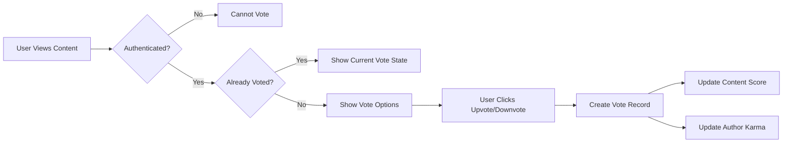
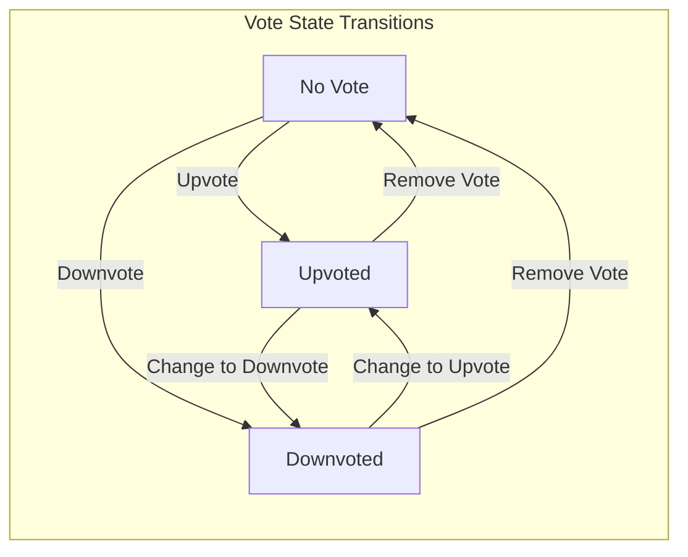
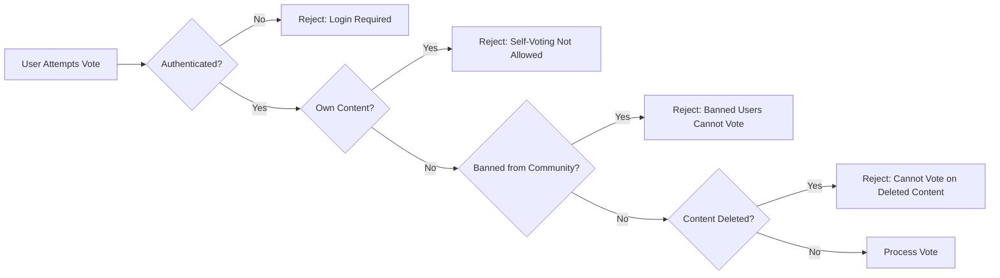

# Voting System Requirements

## 1. Overview

This document specifies the voting system for the community platform, which enables users to express their opinion on posts and comments through upvotes and downvotes. The voting system directly impacts content visibility through score calculations and user reputation through the karma system.

THE voting system SHALL provide bidirectional voting capability (upvote and downvote) for both posts and comments.

THE voting system SHALL maintain accurate vote counts and scores for all votable content.

THE voting system SHALL update user karma scores in real-time based on vote activities.

## 2. Voting Mechanics

### 2.1 Vote Types

THE voting system SHALL support exactly two vote types for each piece of content:
- **Upvote**: Indicates positive sentiment toward the content, adds +1 to the content's score
- **Downvote**: Indicates negative sentiment toward the content, subtracts 1 from the content's score

### 2.2 Votable Content

THE voting system SHALL apply voting mechanics to the following content types:

| Content Type | Vote Scope | Impact on Author Karma |
|--------------|------------|------------------------|
| Posts | Per post | +1 for each upvote, -1 for each downvote |
| Comments | Per comment | +1 for each upvote, -1 for each downvote |

### 2.3 Vote Recording

WHEN a user casts a vote on a post or comment, THE system SHALL:
1. Verify the user is authenticated
2. Verify the user has not previously voted on this content
3. Record the vote with the following information:
   - User identifier
   - Content identifier (post ID or comment ID)
   - Content type (post or comment)
   - Vote direction (upvote or downvote)
   - Timestamp of vote creation
4. Update the content's vote score immediately
5. Update the content author's karma immediately

### 2.4 Initial Vote Creation

WHEN a user votes on content for the first time, THE system SHALL:
1. Create a new vote record
2. Increment the appropriate counter (upvote count or downvote count)
3. Recalculate the content's vote score
4. Adjust the content author's karma by +1 (for upvote) or -1 (for downvote)
5. Return the updated vote score to the user



## 3. Vote Management

### 3.1 Vote State Model

THE voting system SHALL maintain three possible states for each user-content pair:

| State | Description | Score Impact | Karma Impact |
|-------|-------------|--------------|--------------|
| No Vote | User has not voted on this content | 0 | 0 |
| Upvoted | User has cast an upvote | +1 | +1 to author |
| Downvoted | User has cast a downvote | -1 | -1 to author |

### 3.2 Changing Votes

WHEN a user changes their vote from one type to another, THE system SHALL:
1. Verify the user currently has a vote on the content
2. Update the vote record with the new vote direction
3. Adjust counters:
   - Decrement the original vote type count (upvote or downvote)
   - Increment the new vote type count
4. Recalculate the content's vote score (net change of +2 or -2)
5. Adjust the author's karma accordingly:
   - Upvote to Downvote: Author karma decreases by 2 (lose +1, gain -1)
   - Downvote to Upvote: Author karma increases by 2 (lose -1, gain +1)

#### Vote Change Scenarios

**Scenario 1: Upvote to Downvote**
- Original state: User has upvoted (score contribution: +1, author karma: +1)
- New state: User has downvoted (score contribution: -1, author karma: -1)
- Net change: Score decreases by 2, Author karma decreases by 2

**Scenario 2: Downvote to Upvote**
- Original state: User has downvoted (score contribution: -1, author karma: -1)
- New state: User has upvoted (score contribution: +1, author karma: +1)
- Net change: Score increases by 2, Author karma increases by 2



### 3.3 Removing Votes

WHEN a user removes their vote entirely, THE system SHALL:
1. Verify the user currently has a vote on the content
2. Delete the vote record from the system
3. Decrement the appropriate counter (upvote count or downvote count)
4. Recalculate the content's vote score
5. Adjust the author's karma:
   - Removing an upvote: Author karma decreases by 1
   - Removing a downvote: Author karma increases by 1

### 3.4 Vote Removal Scenarios

**Scenario 1: Removing an Upvote**
- Original state: User has upvoted (score contribution: +1, author karma: +1)
- New state: No vote (score contribution: 0, author karma: 0)
- Net change: Score decreases by 1, Author karma decreases by 1

**Scenario 2: Removing a Downvote**
- Original state: User has downvoted (score contribution: -1, author karma: -1)
- New state: No vote (score contribution: 0, author karma: 0)
- Net change: Score increases by 1, Author karma increases by 1

## 4. Score Calculation

### 4.1 Vote Score Formula

THE voting system SHALL calculate content scores using the following formula:

```
Score = Total Upvotes - Total Downvotes
```

### 4.2 Score Properties

THE voting system SHALL maintain the following score properties:

| Property | Description | Range |
|----------|-------------|-------|
| Score | Net vote value (upvotes minus downvotes) | Can be negative |
| Upvote Count | Total number of upvotes | Non-negative integer |
| Downvote Count | Total number of downvotes | Non-negative integer |

### 4.3 Score Examples

| Upvotes | Downvotes | Score |
|---------|-----------|-------|
| 100 | 20 | 80 |
| 5 | 5 | 0 |
| 10 | 50 | -40 |
| 0 | 0 | 0 |
| 1 | 0 | 1 |

### 4.4 Score Display

WHEN displaying content in any feed or detail view, THE system SHALL show:
- The current vote score as a single number
- For posts: The score appears prominently on the post listing and detail page
- For comments: The score appears next to the comment content
- Scores CAN be negative and SHALL be displayed with a minus sign when applicable

### 4.5 Score Update Timing

THE voting system SHALL update scores in real-time:
1. WHEN a vote is cast, changed, or removed, THE system SHALL immediately recalculate and update the score
2. THE system SHALL NOT batch or delay score updates
3. THE system SHALL ensure score consistency across all views within 1 second of vote action

## 5. Voting Constraints

### 5.1 Authentication Requirement

IF a user is not authenticated, THEN THE system SHALL:
1. Prevent any voting action
2. Display appropriate message indicating login is required
3. Provide option to log in or register

### 5.2 One Vote Per User Per Content

THE voting system SHALL enforce exactly one vote per authenticated user per piece of content:

| Constraint | Description |
|------------|-------------|
| Maximum votes per user per post | 1 (either upvote OR downvote OR no vote) |
| Maximum votes per user per comment | 1 (either upvote OR downvote OR no vote) |

IF a user attempts to vote multiple times on the same content, THE system SHALL reject the subsequent vote attempts and display an appropriate error message.

### 5.3 Self-Voting Prevention

THE voting system SHALL prevent users from voting on their own content:

IF a user attempts to vote on their own post or comment, THEN THE system SHALL:
1. Reject the vote action
2. Display an error message: "You cannot vote on your own content"
3. NOT record any vote
4. NOT modify any score or karma

### 5.4 Voting on Deleted Content

IF content has been deleted, THEN THE system SHALL:
1. Preserve existing votes in the database for karma integrity
2. Prevent new votes on deleted content
3. Prevent vote changes on deleted content
4. Continue to factor existing votes into karma calculations

### 5.5 Voting in Banned Communities

IF a user has been banned from a community, THEN THE system SHALL:
1. Allow the user to view content in that community
2. Prevent the user from voting on any posts or comments in that community
3. Display an appropriate message when vote action is attempted



### 5.6 Vote Rate Limiting

THE voting system SHALL implement rate limiting to prevent vote manipulation:

IF a user exceeds the vote rate limit, THEN THE system SHALL:
1. Temporarily block further vote actions
2. Display an error message: "You are voting too quickly. Please wait before voting again"
3. Allow vote actions to resume after a cooldown period

| Rate Limit | Threshold |
|------------|-----------|
| Maximum votes per minute | 30 votes |
| Maximum votes per hour | 500 votes |
| Cooldown period | 5 minutes |

## 6. Vote Impact on Karma

### 6.1 Karma Calculation Overview

THE voting system SHALL maintain a single karma score for each user that reflects the net reception of their content by the community.

**User Karma Formula:**
```
User Karma = Sum of all votes received on all posts + Sum of all votes received on all comments
```

Where:
- Each upvote on user's content contributes +1 to karma
- Each downvote on user's content contributes -1 to karma

### 6.2 Karma Update Rules

THE voting system SHALL update karma in the following scenarios:

| Event | Karma Change |
|-------|--------------|
| Someone upvotes user's post or comment | +1 |
| Someone downvotes user's post or comment | -1 |
| Someone changes vote from downvote to upvote | +2 |
| Someone changes vote from upvote to downvote | -2 |
| Someone removes their upvote | -1 |
| Someone removes their downvote | +1 |

### 6.3 Karma Properties

THE voting system SHALL maintain the following karma properties:

| Property | Description | Range |
|----------|-------------|-------|
| Karma Score | Net total of votes received on all content | Can be negative, no upper/lower bound |
| Post Karma | Total karma from posts (informational) | Can be negative |
| Comment Karma | Total karma from comments (informational) | Can be negative |

### 6.4 Karma Negative Values

THE voting system SHALL allow karma scores to be negative:
- Users with more downvotes than upvotes on their content SHALL have negative karma
- Negative karma SHALL be displayed with a minus sign
- There SHALL be no minimum karma threshold (karma can decrease indefinitely)

### 6.5 Karma Independence

THE voting system SHALL maintain karma independence:

| Rule | Description |
|------|-------------|
| Voting power | A user's voting power is NOT affected by their karma. All users have equal voting weight (±1) |
| Voting ability | Users can vote regardless of their karma score, even if negative |
| No karma thresholds | There SHALL be no restrictions based on karma score |

### 6.6 Karma and Deleted Content

THE voting system SHALL preserve karma integrity when content is deleted:

WHEN a post or comment is deleted, THE system SHALL:
1. Remove the content from public view
2. Preserve the vote records associated with the deleted content
3. Continue to factor those votes into the author's karma calculation

**Rationale:** This prevents users from deleting downvoted content to artificially inflate their karma.

### 6.7 Karma and Account Deletion

WHEN a user account is deleted, THE system SHALL:
1. Remove all votes made by that user on other users' content
2. Adjust the karma of affected content authors accordingly
3. Remove all votes received on the deleted user's content
4. No longer maintain karma for the deleted account

## 7. Vote Display and User Interface Requirements

### 7.1 Current Vote State Display

WHEN a user views content they can vote on, THE system SHALL display:
- The current vote state (no vote, upvoted, or downvoted)
- The current vote score
- Clear visual distinction between upvote and downvote options
- Indication of the user's current vote if one exists

### 7.2 Vote Count Display

THE voting system SHALL display vote information as follows:

| View | Information Displayed |
|------|----------------------|
| Post listing | Vote score only |
| Post detail | Vote score only |
| Comment | Vote score only |
| Post/comment for author | Vote score (author cannot vote on own content) |

**Note:** Individual upvote and downvote counts are NOT publicly displayed; only the net score is shown.

### 7.3 Vote Action Feedback

WHEN a vote action is performed, THE system SHALL provide immediate visual feedback:

| Action | Visual Feedback |
|--------|----------------|
| Upvote cast | Upvote button highlighted, score increases by 1 |
| Downvote cast | Downvote button highlighted, score decreases by 1 |
| Vote changed | Previous highlight removed, new highlight applied, score updates |
| Vote removed | All highlights removed, score updates |

## 8. Error Handling

### 8.1 Voting Error Scenarios

IF an error occurs during a vote action, THEN THE system SHALL:
1. Display a clear, user-friendly error message
2. NOT modify any scores or karma
3. Allow the user to retry the action
4. Log the error for system monitoring

### 8.2 Error Messages

THE voting system SHALL display appropriate error messages for the following scenarios:

| Error Scenario | User-Facing Message |
|----------------|---------------------|
| Not authenticated | "Please log in to vote" |
| Already voted | "You have already voted on this content" |
| Self-voting attempt | "You cannot vote on your own content" |
| Content deleted | "This content has been deleted" |
| Banned from community | "You are banned from this community and cannot vote" |
| Rate limit exceeded | "You are voting too quickly. Please wait before voting again" |
| Server error | "Unable to process your vote. Please try again" |

### 8.3 Concurrent Vote Handling

IF multiple users vote on the same content simultaneously, THE system SHALL:
1. Process each vote independently
2. Maintain accurate score calculation
3. Ensure karma updates are consistent
4. Use database transactions to ensure data integrity

## 9. Data Retention and Integrity

### 9.1 Vote Record Retention

THE voting system SHALL maintain vote records indefinitely:
- Vote records SHALL NOT be automatically deleted
- Historical vote data SHALL be preserved for accurate karma calculation
- Users can view their voting history through their profile (future consideration)

### 9.2 Vote Anonymity

THE voting system SHALL protect vote anonymity:
- Individual vote records SHALL NOT be publicly visible
- Only the aggregate score is displayed publicly
- Users cannot see who voted on their content
- Users cannot see how others voted on any content

### 9.3 Vote Integrity

THE voting system SHALL ensure vote integrity:

| Requirement | Description |
|------------|-------------|
| No vote modification | Users cannot edit a vote record (only change or remove) |
| Immutable timestamps | Vote creation time SHALL NOT be modifiable |
| Atomic updates | Score and karma updates SHALL be atomic transactions |