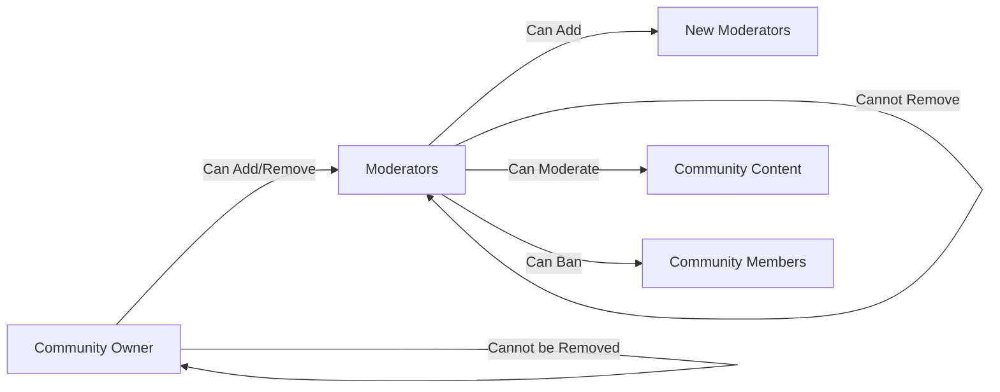

# Community Moderation System Requirements

## 1. Overview

The community moderation system enables designated users to maintain quality and enforce community standards within the communities they oversee. This system implements a hierarchical authority structure where community owners delegate moderation responsibilities to trusted members, ensuring communities can be self-governed effectively.

### 1.1 System Purpose

WHEN the moderation system operates within the platform, THE system SHALL provide community governance tools that enable:
- Hierarchical authority management through owner and moderator roles
- Content quality control through post and comment moderation
- Community protection through user banning capabilities
- Transparent moderation through action tracking and audit trails

### 1.2 Moderation Scope

THE moderation system SHALL operate within community boundaries:
- Each community has its own independent moderation team
- Moderators have authority only within their assigned community
- Moderation actions affect content within the specific community only
- Users may be moderators in multiple communities simultaneously

WHEN a moderation action is performed, THE system SHALL restrict the effects to the specific community context.

## 2. Moderator Roles

### 2.1 Owner Role

WHEN a user creates a new community, THE system SHALL automatically designate that user as the community owner.

**Owner Characteristics:**
- Permanent role that cannot be removed by any moderator
- Highest authority in the moderation hierarchy
- Full control over all moderation functions
- Cannot be demoted or removed by other moderators
- Only one owner per community exists at any time

**EARS Requirements:**

WHEN a user creates a new community, THE system SHALL automatically designate that user as the community owner.

THE owner SHALL have all moderator permissions plus the exclusive ability to remove moderators from the moderation team.

WHILE a user remains the community owner, THE system SHALL preserve their owner status regardless of any moderator actions taken against them.

IF a moderator attempts to remove the community owner's moderator status, THE system SHALL reject the action and return an error message indicating that the owner cannot be removed.

### 2.2 Moderator Role

THE system SHALL support appointed moderators with delegated moderation authority within specific communities.

**Moderator Characteristics:**
- Appointed by the community owner or by other moderators
- Can perform most moderation actions within the community
- Cannot remove the owner or other moderators from their positions
- Can appoint additional moderators to the community
- Multiple moderators can exist per community
- Moderator status can be removed by the owner only

**EARS Requirements:**

WHEN the owner or an existing moderator appoints a user as moderator, THE system SHALL grant that user moderator permissions within the specific community.

THE moderator SHALL have authority to delete posts, delete comments, ban users from the community, unban users, view the banned users list, and appoint new moderators to the community.

IF a moderator attempts to remove another moderator's moderator status, THE system SHALL reject the action and return an error indicating insufficient permissions for that operation.

WHEN the owner removes a moderator, THE system SHALL revoke all moderator permissions for that user within the community immediately.

### 2.3 Regular Member Role

THE system SHALL maintain regular member status for all users who are neither owners nor moderators of a given community.

**Member Characteristics:**
- Can view all public community content
- Can create posts and comments if subscribed and not banned
- Cannot access moderation tools or interfaces
- Cannot view the banned users list
- Cannot delete other users' content

**EARS Requirements:**

WHEN a regular member attempts to access moderation functions, THE system SHALL deny access and return an appropriate authorization error message.

THE system SHALL hide all moderation tools and options from regular members in the user interface.

WHILE a user remains a regular member without moderator privileges, THE system SHALL not display any moderation action buttons or interfaces to that user.

## 3. Moderator Hierarchy and Authority

### 3.1 Authority Structure

THE system SHALL implement a two-tier moderation hierarchy with clearly defined authority relationships.

### 3.2 Authority Scope

THE system SHALL enforce clear boundaries for moderation authority within each community.

**Authority Matrix:**

| Action | Owner | Moderator | Regular Member |
|--------|-------|-----------|----------------|
| Delete any post in community | ✓ | ✓ | ✗ |
| Delete any comment in community | ✓ | ✓ | ✗ |
| Ban users from community | ✓ | ✓ | ✗ |
| Unban users from community | ✓ | ✓ | ✗ |
| View banned users list | ✓ | ✓ | ✗ |
| Add moderators | ✓ | ✓ | ✗ |
| Remove moderators | ✓ | ✗ | ✗ |
| Remove owner | ✗ | ✗ | ✗ |
| Moderate other communities | ✗ | ✗ | ✗ |

**EARS Requirements:**

THE system SHALL restrict all moderation actions to the specific community where the user holds moderator status.

IF a moderator of Community A attempts to moderate content in Community B where they do not have moderator privileges, THE system SHALL deny the action with an authorization error.

WHEN a user holds moderator status in multiple communities, THE system SHALL treat each community's moderation permissions independently without cross-community authority.

### 3.3 Authority Limitations

THE system SHALL enforce specific constraints on moderator authority to protect the governance structure.

**Critical Constraint 1: Owner Immunity**

THE owner cannot be removed from their position by any moderator.

THE owner cannot be banned from their own community.

THE owner's content cannot be deleted by moderators.

**Critical Constraint 2: Moderator Protection**

Moderators cannot remove other moderators from their positions.

Moderators cannot ban other moderators from the community.

Only the owner can remove moderators or ban moderators from the community.

**Critical Constraint 3: Cross-Community Isolation**

Moderation authority does not transfer between communities.

Banning a user in one community does not affect their ability to participate in other communities.

Each community's moderation team operates independently from all other communities.

**EARS Requirements:**

IF a moderator attempts to delete the owner's post or comment, THE system SHALL reject the action and return an error indicating that the owner's content cannot be moderated by moderators.

IF a moderator attempts to ban the community owner from the community, THE system SHALL reject the action with an appropriate error message indicating that the owner cannot be banned.

WHEN a moderator attempts to remove another moderator's moderator status, THE system SHALL deny the action and return an error indicating that only the owner can remove moderators.

THE system SHALL allow only the owner to remove moderators from the moderation team.

## 4. Moderator Management

### 4.1 Adding Moderators

THE system SHALL allow owners and existing moderators to appoint new moderators to the community.

**Addition Process:**

1. Owner or moderator initiates the "Add Moderator" action from the community settings
2. System displays a searchable interface listing community subscribers
3. Acting user searches for and selects the member to appoint as moderator
4. System validates that the target user is currently a subscriber to the community
5. System grants moderator permissions to the selected user
6. System records the appointment action in the moderation audit log
7. System notifies the newly appointed moderator of their new role

**EARS Requirements:**

WHEN the owner or a moderator initiates adding a new moderator, THE system SHALL display a searchable list of community subscribers for selection.

IF the selected user is already a moderator of the community, THE system SHALL display an appropriate message indicating the user is already a moderator and prevent duplicate assignment.

WHEN a user is successfully appointed as moderator, THE system SHALL perform the following actions: grant moderator permissions within the specific community, record the appointment action with timestamp and acting moderator identity, and notify the newly appointed moderator of their new role.

IF the user to be appointed is not a subscriber to the community, THE system SHALL return an error indicating that the user must subscribe to the community before they can be appointed as moderator.

### 4.2 Removing Moderators

THE system SHALL allow only the owner to remove moderators from their positions.

**Removal Process:**

1. Owner initiates the "Remove Moderator" action from community settings
2. System displays the list of current moderators excluding the owner
3. Owner selects the moderator to remove
4. System validates the owner's authority to perform this action
5. System revokes moderator permissions from the selected user
6. System records the removal action in the moderation audit log
7. Removed user retains regular member privileges

**EARS Requirements:**

WHEN the owner initiates removing a moderator, THE system SHALL display a list of all moderators except the owner for selection.

IF a moderator attempts to remove another moderator, THE system SHALL reject the action and return an error indicating that only the owner can remove moderators from the community.

WHEN a moderator is successfully removed, THE system SHALL perform the following actions: revoke all moderator permissions within the community, record the removal action with timestamp and acting owner identity, convert the user back to regular member status, and not unsubscribe the user from the community.

THE removed moderator SHALL retain their regular member privileges, including the ability to view content and create posts or comments subject to community rules.

### 4.3 Moderator List Display

THE system SHALL provide visibility into the moderation team to all community members.

**Display Requirements:**

WHEN viewing a community's moderation team, THE system SHALL display: the community owner prominently marked as "Owner", all moderators listed with their role marked as "Moderator", and optionally the date each moderator was appointed.

THE system SHALL make the moderator list visible to all community members including non-subscribers.

WHEN a user is both owner and moderator, THE system SHALL display only the "Owner" role to avoid confusion.

## 5. Banning System

### 5.1 Ban User Function

THE system SHALL allow moderators and owners to ban users from communities to enforce community standards.

**Ban Characteristics:**
- Banned users cannot create new posts in the community
- Banned users cannot create new comments in the community
- Banned users CAN still view all community content
- Banned users can still vote on posts and comments according to overall system design
- Bans are community-specific, not platform-wide
- Users can be banned from multiple communities independently

**EARS Requirements:**

WHEN a moderator or owner initiates a ban action, THE system SHALL display an interface to specify the user to ban, optionally allow entry of a ban reason for internal tracking, require confirmation of the ban action, and record the ban with timestamp, acting moderator, and optional reason.

IF the user to be banned is already banned from the community, THE system SHALL display an appropriate message indicating the user is already banned from this community.

IF a moderator attempts to ban the community owner, THE system SHALL reject the action with an error indicating that the owner cannot be banned from their own community.

IF a moderator attempts to ban another moderator, THE system SHALL reject the action with an error indicating that moderators cannot ban other moderators.

WHEN a user is successfully banned, THE system SHALL perform the following actions: add the user to the community's banned users list, prevent the user from creating new posts or comments in the community, not remove the user's existing posts or comments, and not unsubscribe the user from the community.

### 5.2 Unban User Function

THE system SHALL allow moderators and owners to remove bans and restore user privileges.

**Unban Process:**

1. Moderator or owner accesses the banned users list from community settings
2. Acting user selects the user to unban
3. System removes the user from the banned list
4. User regains full posting and commenting privileges immediately
5. System records the unban action in the audit log

**EARS Requirements:**

WHEN a moderator or owner unbans a user, THE system SHALL perform the following actions: remove the user from the community's banned users list, restore the user's ability to create posts and comments, record the unban action with timestamp and acting moderator identity, and not automatically resubscribe the user if they unsubscribed while banned.

IF the user to be unbanned is not currently banned from the community, THE system SHALL display an appropriate message indicating the user is not currently banned.

### 5.3 Banned Users List

THE system SHALL provide moderators and owners access to the list of banned users for community management.

**List Display Requirements:**

WHEN a moderator or owner views the banned users list, THE system SHALL display: username of each banned user, date the ban was applied, moderator who applied the ban, optional ban reason if provided, and an unban action button for each user.

THE system SHALL sort the banned users list by ban date with most recent bans appearing first.

THE system SHALL provide pagination for the banned users list when the number of banned users exceeds 25 users per page.

IF a regular member attempts to access the banned users list, THE system SHALL deny access and return an authorization error.

### 5.4 Banned User Experience

THE system SHALL provide clear feedback to banned users about their restricted status.

**Banned User Constraints for Post Creation:**

WHEN a banned user attempts to create a post in the community, THE system SHALL reject the post creation, display a message indicating the user is banned from the community, optionally display the ban reason if available, and not reveal which moderator applied the ban.

**Banned User Constraints for Comment Creation:**

WHEN a banned user attempts to create a comment in the community, THE system SHALL reject the comment creation and display a message indicating the user is banned from the community.

**Banned User Retained Privileges:**

WHILE a user is banned from a community, THE system SHALL still allow them to: view all posts and comments, vote on posts and comments subject to overall system design, edit their own existing posts and comments, delete their own existing posts and comments, report content for moderation review, and subscribe or unsubscribe from the community.

### 5.5 Ban Scope and Limitations

THE system SHALL enforce clear boundaries for banning authority.

**Cross-Community Independence:**

THE system SHALL maintain separate ban lists for each community.

IF a user is banned from Community A, THE system SHALL NOT affect their ability to participate in Community B or any other community.

**Moderator Ban Restrictions:**

THE system SHALL prevent moderators from banning: the community owner under any circumstances, and other moderators of the same community.

IF a moderator attempts to bypass these restrictions through any means, THE system SHALL reject the action and log the attempted violation for security review.

## 6. Content Moderation Actions

### 6.1 Post Deletion

THE system SHALL allow moderators and owners to delete any post within their community for content moderation purposes.

**Post Deletion Process:**

1. Moderator views a post within their community
2. Moderator initiates the "Delete Post" moderation action
3. System requests confirmation of the deletion
4. Moderator confirms the deletion
5. System removes the post and all associated comments from public view
6. System records the action in the moderation audit log

**EARS Requirements:**

WHEN a moderator or owner deletes a post, THE system SHALL perform the following actions: remove the post from public view immediately, remove all comments associated with the post, not notify the post author automatically unless specifically configured, record the deletion with timestamp, moderator identity, and post details, and decrement the post count in community statistics.

IF a moderator attempts to delete a post from another community where they do not have moderator privileges, THE system SHALL reject the action with an authorization error.

IF a moderator attempts to delete the owner's post, THE system SHALL reject the action with an error indicating insufficient permissions to moderate the owner's content.

WHEN a post is deleted by a moderator, THE system SHALL preserve a soft-deleted record for potential dispute resolution and audit purposes.

### 6.2 Comment Deletion

THE system SHALL allow moderators and owners to delete any comment within their community.

**Comment Deletion Process:**

1. Moderator views a comment within their community
2. Moderator initiates the "Delete Comment" moderation action
3. System requests confirmation of the deletion
4. Moderator confirms the deletion
5. System removes the comment and all nested replies from public view
6. System records the action in the moderation audit log

**EARS Requirements:**

WHEN a moderator or owner deletes a comment, THE system SHALL perform the following actions: remove the comment from public view immediately, remove all nested replies to the deleted comment, not automatically notify the comment author, record the deletion with timestamp, moderator identity, and comment details, and update the comment count on the associated post.

IF a moderator attempts to delete a comment from another community's post, THE system SHALL reject the action with an authorization error.

IF a moderator attempts to delete the owner's comment, THE system SHALL reject the action with an error indicating insufficient permissions to moderate the owner's content.

### 6.3 Content Deletion vs. Author Deletion

THE system SHALL distinguish between moderator-initiated deletion and author-initiated deletion.

**Moderator Deletion Characteristics:**

WHEN content is deleted by a moderator, THE system SHALL record the deletion as a moderation action, associate the action with the moderator who performed it, maintain an audit trail for review purposes, and preserve minimal metadata for dispute resolution.

**Author Deletion Characteristics:**

WHEN content is deleted by the author, THE system SHALL record the deletion as a user action, not require a moderator audit trail, and process the deletion immediately.

### 6.4 Bulk Moderation Actions

THE system SHALL support efficient moderation through bulk action capabilities.

**Bulk Deletion Requirements:**

IF bulk moderation is implemented, THE system SHALL support bulk deletion of multiple posts or comments by a single user within a community, require explicit confirmation before executing bulk actions, log each individual item affected by the bulk action, provide a summary of actions taken after completion, and allow moderators to select multiple items for deletion from a moderation queue.

### 6.5 Content Restoration

THE system SHALL provide mechanisms for addressing erroneous moderation decisions.

**Restoration Requirements:**

IF content restoration is implemented, THE system SHALL allow only the community owner to restore moderator-deleted content within a limited time window, maintain the deletion record even after restoration for audit purposes, notify the original moderator who deleted the content about the restoration, and preserve all associated comments and interactions when content is restored.

## 7. Moderation Audit Trail

### 7.1 Action Logging

THE system SHALL maintain comprehensive logs of all moderation actions for accountability and transparency.

**Logged Actions and Information:**

| Action Type | Information Logged |
|-------------|-------------------|
| Moderator Added | Moderator username, Added by, Timestamp, Community identifier |
| Moderator Removed | Moderator username, Removed by, Timestamp, Community identifier |
| User Banned | Banned user username, Banned by, Timestamp, Community identifier, Ban reason (optional) |
| User Unbanned | Unbanned user username, Unbanned by, Timestamp, Community identifier |
| Post Deleted | Post ID, Post author username, Deleted by, Timestamp, Community identifier, Deletion reason (optional) |
| Comment Deleted | Comment ID, Comment author username, Deleted by, Timestamp, Community identifier, Deletion reason (optional) |

### 7.2 Audit Log Access

THE system SHALL control access to moderation logs based on user roles.

**EARS Requirements:**

THE system SHALL allow community owners to view all moderation actions within their community.

THE system MAY allow moderators to view a subset of the audit log relevant to actions they have performed.

THE system SHALL NOT allow regular members to access moderation audit logs under any circumstances.

WHEN viewing the audit log, THE system SHALL provide: chronological listing of all moderation actions, filtering by action type, filtering by acting moderator, and filtering by date range.

### 7.3 Log Retention

THE system SHALL maintain moderation logs for a defined retention period.

**EARS Requirements:**

THE system SHALL retain moderation action logs for a minimum of 90 days from the action date.

IF the platform supports dispute resolution processes, THE system SHALL extend log retention to match the dispute resolution timeframe requirements.

THE system MAY implement automatic archival of logs older than the retention period while maintaining searchability for administrative purposes.

## 8. Error Handling and User Feedback

### 8.1 Authorization Errors

THE system SHALL provide clear and specific error messages for all moderation authorization failures.

**Error Scenarios:**

WHEN a non-moderator attempts to access moderation functions, THE system SHALL return an error message indicating that the user does not have moderator permissions for this community.

WHEN a moderator attempts to remove another moderator's status, THE system SHALL return an error message indicating that only the owner can remove moderators from the community.

WHEN a moderator attempts to ban the community owner, THE system SHALL return an error message indicating that the owner cannot be banned from their own community.

WHEN a moderator attempts to delete the owner's content, THE system SHALL return an error message indicating that the owner's content cannot be deleted by moderators.

WHEN a moderator attempts to moderate content in another community where they lack privileges, THE system SHALL return an error message indicating that the user is not a moderator of that community.

### 8.2 Action Confirmation

THE system SHALL require confirmation for all irreversible moderation actions.

**Confirmation Requirements:**

WHEN a moderator initiates a ban action against a user, THE system SHALL require explicit confirmation before executing the ban.

WHEN a moderator initiates a post deletion, THE system SHALL require explicit confirmation before removing the post permanently.

WHEN a moderator initiates a comment deletion, THE system SHALL require explicit confirmation before removing the comment permanently.

WHEN the owner initiates a moderator removal action, THE system SHALL require explicit confirmation before revoking moderator status.

### 8.3 Success Notifications

THE system SHALL provide clear feedback for all successful moderation actions.

**Notification Requirements:**

WHEN a moderation action completes successfully, THE system SHALL display a confirmation message to the moderator indicating the action was completed.

THE system SHALL update the relevant user interface elements immediately to reflect the moderation action taken.

THE system MAY notify affected users of moderation actions against their content depending on platform notification policy.

## 9. Non-Functional Considerations

### 9.1 Performance Requirements

THE moderation system SHALL operate efficiently under expected load conditions.

**Performance Specifications:**

WHEN a moderator performs a moderation action, THE system SHALL complete the action within 2 seconds under normal operating conditions.

WHEN a moderator views the banned users list, THE system SHALL display the paginated list within 2 seconds for lists containing up to 1,000 users.

WHEN a moderator views the moderation audit log, THE system SHALL display paginated results within 2 seconds under normal conditions.

### 9.2 Concurrent Moderation

THE system SHALL handle concurrent moderation actions correctly without data inconsistency.

**Concurrency Requirements:**

IF multiple moderators attempt to moderate the same content simultaneously, THE system SHALL process the first received action and notify the other moderator(s) that the content has already been moderated.

THE system SHALL maintain data consistency when multiple moderators perform different actions concurrently on different content items.

### 9.3 Security Considerations

THE system SHALL implement comprehensive security measures for all moderation functions.

**Security Requirements:**

THE system SHALL validate all moderation actions on the server-side without relying on client-side checks.

THE system SHALL verify moderator status for every moderation API request before processing.

THE system SHALL log all attempted unauthorized moderation actions for security review and potential account action.

THE system SHALL implement rate limiting on moderation actions to prevent abuse of moderation privileges.

## 10. Integration with Related Systems

### 10.1 Reporting System Integration

THE moderation system SHALL integrate with the community reporting system for streamlined content moderation workflows.

**Integration Points:**

Moderators can view all reports submitted for their community through the moderation interface.

Moderators can take action to approve or dismiss reports directly from the report viewing interface.

All report resolution actions are logged in the moderation audit trail for accountability.

For detailed reporting requirements, see [Reporting System Document](./09-reporting-system.md).

### 10.2 Post and Comment System Integration

THE moderation system SHALL integrate with content management systems for comprehensive content control.

**Integration Points:**

Moderation actions directly affect post and comment visibility within the community.

Post deletion cascades to all associated comments automatically.

Comment deletion cascades to all nested replies automatically.

Moderators can access content management functions within their community scope.

For detailed content requirements, see [Post System Document](./05-post-system.md) and [Comment System Document](./06-comment-system.md).

### 10.3 Community System Integration

THE moderation system SHALL integrate with community management for seamless governance.

**Integration Points:**

Community creators are automatically designated as owners upon community creation.

Only subscribers to a community can be appointed as moderators.

Community settings may include moderation configuration options for customization.

For detailed community requirements, see [Community System Document](./04-community-system.md).