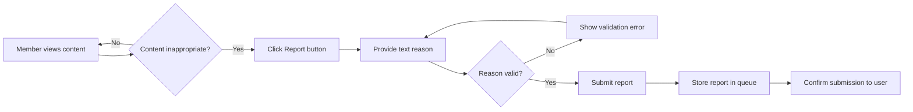
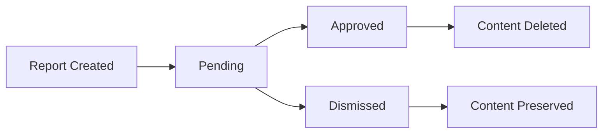
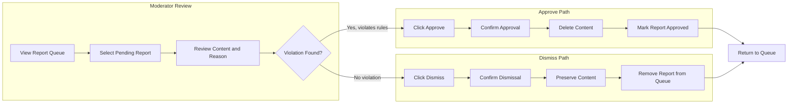

# Reporting System Requirements

## 1. Executive Summary

The reporting system provides a community-driven content moderation mechanism that enables users to flag inappropriate content for moderator review. This system serves as the primary feedback loop between community members and moderators, allowing the community to self-regulate by identifying content that violates community standards or platform rules.

The reporting system operates at the community level, where each community's moderation team independently reviews and resolves reports for content within their community. This decentralized approach ensures that moderation decisions reflect the specific standards and culture of each community.

## 2. User Actors and Permissions

### 2.1 Reporter (Any Member)

Any authenticated member can report content within the platform. The reporting capability is a fundamental participation right that enables community self-moderation.

**Reporter Permissions:**
- Create reports on any post or comment
- Provide a text reason explaining the report
- View their own submitted reports (optional feature for transparency)

**Reporter Restrictions:**
- Cannot view reports submitted by other users
- Cannot approve or dismiss reports
- Cannot access the moderator report queue
- Cannot modify reports after submission

### 2.2 Community Moderator

Community moderators are members who have been granted moderation privileges within a specific community. Moderators are responsible for reviewing and resolving reports.

**Moderator Permissions (within their community only):**
- View all reports for their community
- Access complete report details including reported content, reporter identity, and reason
- Approve reports (resulting in content deletion)
- Dismiss reports (keeping the content)
- View the list of all pending reports

**Moderator Restrictions:**
- Can only access reports for communities where they have moderator status
- Cannot access reports from other communities
- Cannot view reports outside their moderation scope
- Must follow the approve/dismiss workflow (cannot take arbitrary actions)

### 2.3 Community Owner

The community owner possesses the highest level of authority within a community and has all moderator permissions plus additional capabilities.

**Owner Permissions (in addition to moderator permissions):**
- All moderator permissions for report management
- Can add or remove moderators
- Final authority on disputed moderation decisions

### 2.4 Permission Matrix

| Action | Member (Reporter) | Moderator | Owner |
|--------|-------------------|-----------|-------|
| Create report on any content | ✅ | ✅ | ✅ |
| View own reports | ✅ | ✅ | ✅ |
| View all community reports | ❌ | ✅ | ✅ |
| Approve reports | ❌ | ✅ | ✅ |
| Dismiss reports | ❌ | ✅ | ✅ |
| View reporter identity | ❌ | ✅ | ✅ |
| Manage moderators | ❌ | ❌ | ✅ |

## 3. Report Creation Requirements

### 3.1 Reportable Content Types

THE system SHALL allow members to report two types of content:

1. **Posts**: Any post within any community can be reported
2. **Comments**: Any comment on any post can be reported

THE system SHALL NOT restrict reporting based on community subscription status. Any authenticated member can report content even in communities they are not subscribed to.

### 3.2 Report Creation Process

WHEN a member submits a report, THE system SHALL require the following information:

**Required Fields:**
- **Content Reference**: Identification of the post or comment being reported
- **Reason**: A text explanation provided by the reporter describing why the content is inappropriate

**Report Metadata (Automatically Captured):**
- Reporter identity (the member who submitted the report)
- Timestamp of report creation
- Content type (post or comment)
- Community where the content exists
- Content author identity

### 3.3 Report Creation Constraints

THE system SHALL enforce the following constraints during report creation:

1. **Authentication Required**: WHEN an unauthenticated user attempts to create a report, THE system SHALL deny the request and prompt for authentication.

2. **Reason Required**: WHEN a member submits a report without providing a reason, THE system SHALL reject the submission and display an error message requiring a reason to be provided.

3. **Reason Length**: THE system SHALL accept report reasons between 1 and 2,000 characters in length.

4. **Content Existence**: WHEN a member attempts to report content that has been deleted, THE system SHALL reject the report and inform the user that the content no longer exists.

5. **Duplicate Reports**: THE system SHALL allow multiple members to report the same content independently, as different users may identify the same problematic content.

6. **Self-Reporting**: THE system SHALL allow members to report their own content, enabling users to request deletion of their own posts through the reporting mechanism.

### 3.4 Report Creation Workflow

## 4. Report Information Display

### 4.1 Report Data Structure

EACH report SHALL contain the following information:

| Field | Description | Visibility |
|-------|-------------|------------|
| Report ID | Unique identifier for the report | Moderators only |
| Reported Content | The actual post or comment content | Moderators only |
| Content Type | Whether it's a post or comment | Moderators only |
| Content Author | Username of the content creator | Moderators only |
| Reporter | Username of the member who submitted the report | Moderators only |
| Reason | Text explanation provided by reporter | Moderators only |
| Timestamp | When the report was submitted | Moderators only |
| Status | Current state (pending, approved, dismissed) | Moderators only |
| Community | The community where content exists | Moderators only |

### 4.2 Moderator Report Queue Display

WHEN a moderator views the report queue for their community, THE system SHALL display:

**List View Information:**
- Report submission timestamp (relative time format: "2 hours ago")
- Content type indicator (post icon or comment icon)
- Content title or preview (first 100 characters for comments)
- Reporter username
- Report reason preview (first 100 characters)
- Current status badge (pending, approved, dismissed)

**Sorting Options:**
- Newest first (default): Most recent reports appear at the top
- Oldest first: Earliest reports appear first
- Status: Grouped by pending, then dismissed, then approved

**Filtering Options:**
- Filter by status (pending, approved, dismissed)
- Filter by content type (posts only, comments only)
- Filter by date range

### 4.3 Individual Report Detail View

WHEN a moderator opens a specific report, THE system SHALL display:

**Full Content Display:**
- For posts: Complete title, full content (text, link, or image), author, vote score, comment count, posting timestamp
- For comments: Full comment text, author, vote score, posting timestamp, parent post reference

**Report Details:**
- Complete reason text provided by the reporter
- Reporter username with link to their profile
- Report submission timestamp
- Community context

**Action Panel:**
- Approve button (with confirmation prompt)
- Dismiss button (with confirmation prompt)
- Content context link (view the full post/comment in context)

## 5. Moderator Report Management

### 5.1 Report Queue Access

THE system SHALL provide moderators with access to a dedicated report management interface for their community.

WHEN a moderator accesses the report queue, THE system SHALL:

1. Verify the moderator's permissions for that community
2. Retrieve all reports for that community
3. Display reports in a paginated list (default 25 reports per page)
4. Allow filtering and sorting as specified in section 4.2

### 5.2 Report Queue Access Constraints

IF a member attempts to access a report queue for a community where they are not a moderator, THE system SHALL deny access and display an appropriate error message.

THE system SHALL maintain strict community boundaries:
- Moderators can only view reports for their assigned community
- Community A moderators cannot view Community B reports
- Platform-wide reports do not exist (all reports are community-scoped)

### 5.3 Report Status States

THE system SHALL maintain the following status states for each report:

**Status Definitions:**
- **Pending**: Initial state when a report is submitted; awaiting moderator action
- **Approved**: Moderator has approved the report; content is deleted
- **Dismissed**: Moderator has dismissed the report; content is preserved

### 5.4 Report Notifications

WHEN a new report is submitted for a community, THE system SHALL notify community moderators through:
- Visual indicator on the moderation dashboard
- Optional email notification (if moderator has enabled notifications)
- Real-time notification badge when actively viewing the platform

## 6. Report Resolution Workflow

### 6.1 Approve Action

WHEN a moderator approves a report, THE system SHALL execute the following actions:

1. **Content Deletion**: The reported post or comment SHALL be permanently removed from the platform
   - For posts: The post and all associated comments SHALL be deleted
   - For comments: Only the specific comment SHALL be deleted (replies remain intact)

2. **Report Status Update**: The report status SHALL change from "pending" to "approved"

3. **Audit Trail**: The system SHALL record:
   - Which moderator approved the report
   - Timestamp of approval
   - The original content (for audit purposes, retained for a configurable period)

4. **User Notification**: The content author MAY be notified that their content was removed due to a report (implementation discretion)

5. **Reporter Privacy**: The reporter's identity SHALL NOT be disclosed to the content author

### 6.2 Dismiss Action

WHEN a moderator dismisses a report, THE system SHALL execute the following actions:

1. **Content Preservation**: The reported post or comment SHALL remain visible on the platform unchanged

2. **Report Removal**: The dismissed report SHALL be removed from the active report queue
   - The report record MAY be retained in an audit log for statistical purposes
   - Dismissed reports SHALL NOT appear in the default moderator queue view
   - Dismissed reports MAY be accessible through a "history" or "archived reports" view

3. **No User Notification**: The content author SHALL NOT be notified about dismissed reports

4. **Audit Trail**: The system SHALL record:
   - Which moderator dismissed the report
   - Timestamp of dismissal

5. **Re-reporting**: Members SHALL be able to submit new reports on the same content even after a report has been dismissed

### 6.3 Resolution Confirmation

Both approve and dismiss actions SHALL require explicit confirmation from the moderator:

**Approve Confirmation:**
- Display: "Approve this report? This will delete the content permanently."
- Required: Explicit confirmation action
- Optional: Moderator can provide internal notes about the decision

**Dismiss Confirmation:**
- Display: "Dismiss this report? The content will remain visible."
- Required: Explicit confirmation action
- Optional: Moderator can provide internal notes about the decision

### 6.4 Resolution Workflow Diagram

## 7. Business Rules and Constraints

### 7.1 Report Integrity Rules

1. **Immutability**: WHEN a report has been submitted, THE system SHALL NOT allow modification of the report reason or any associated data.

2. **Deletion on Account Removal**: WHEN a member deletes their account, THE system SHALL retain reports they submitted (with reporter marked as "deleted user") to maintain moderation history integrity.

3. **Content Audit**: WHEN reported content is deleted through report approval, THE system SHALL retain an audit copy for a minimum of 30 days for dispute resolution purposes.

### 7.2 Moderator Decision Authority

1. **Independent Decision**: Each moderator SHALL have independent authority to approve or dismiss reports within their community.

2. **No Overrule by Other Moderators**: WHEN a moderator resolves a report (approve or dismiss), other moderators SHALL NOT be able to reverse that decision through the normal interface.

3. **Owner Authority**: The community owner SHALL have the ability to review moderator actions and handle escalated disputes.

### 7.3 Report Queue Management

1. **Queue Priority**: THE system SHALL NOT implement priority queuing; all pending reports SHALL be displayed in chronological order by default.

2. **No Auto-Resolution**: THE system SHALL NOT automatically approve or dismiss reports without human moderator action.

3. **No Expiration**: Pending reports SHALL NOT expire automatically; they remain in the queue until a moderator takes action.

### 7.4 Cross-Community Rules

1. **No Cross-Community Reports**: A report submitted in Community A SHALL only appear in Community A's moderator queue.

2. **No Platform-Wide Moderation**: THE system SHALL NOT provide a platform-wide moderation interface; all moderation is community-scoped.

3. **Content Cross-Posting**: IF content is cross-posted to multiple communities, each instance SHALL generate independent reports in their respective communities.

## 8. Error Handling and User Feedback

### 8.1 Report Creation Errors

| Error Scenario | System Response |
|---------------|-----------------|
| Unauthenticated user attempts to report | "You must be logged in to report content. Please sign in and try again." |
| Empty reason submitted | "Please provide a reason for your report. This helps moderators understand the issue." |
| Reason exceeds 2,000 characters | "Your report reason is too long. Please keep it under 2,000 characters." |
| Content already deleted | "This content has been removed and is no longer available for reporting." |
| User is banned from community | "You cannot report content in this community due to a ban." |

### 8.2 Moderator Action Errors

| Error Scenario | System Response |
|---------------|-----------------|
| Non-moderator accesses queue | "You do not have permission to view this community's moderation queue." |
| Attempting to resolve already-resolved report | "This report has already been resolved by another moderator." |
| Content deleted before approval | "This content has already been removed by its author." |
| Network error during action | "Unable to complete action. Please check your connection and try again." |

### 8.3 Success Feedback

**Report Submission Success:**
- Display: "Thank you for your report. Our moderation team will review it shortly."
- Duration: 3 seconds, then dismiss automatically
- Optional: Provide report ID for user reference

**Approve Success:**
- Display: "Report approved. The content has been removed."
- Action: Return to report queue automatically

**Dismiss Success:**
- Display: "Report dismissed. The content will remain visible."
- Action: Return to report queue automatically

## 9. Performance and Scalability Considerations

### 9.1 Report Queue Performance

WHEN a moderator accesses the report queue, THE system SHALL load the queue within 2 seconds under normal conditions.

THE system SHALL support:
- Up to 1,000 pending reports per community without performance degradation
- Simultaneous access by multiple moderators
- Real-time queue updates when new reports arrive

### 9.2 Report Data Retention

THE system SHALL retain report data according to the following schedule:

| Data Type | Retention Period |
|-----------|-----------------|
| Pending reports | Indefinite until resolved |
| Approved reports (metadata) | 1 year minimum |
| Dismissed reports (metadata) | 90 days minimum |
| Deleted content audit copies | 30 days minimum |
| Reporter identity | Lifetime of account + 90 days |

## 10. Integration with Other Systems

### 10.1 Integration with Content System

The reporting system SHALL integrate with the post and comment systems to:
- Verify content existence before allowing reports
- Retrieve content for moderator display
- Execute content deletion upon report approval
- Handle content display in the report queue

### 10.2 Integration with User System

The reporting system SHALL integrate with the user system to:
- Authenticate reporters and moderators
- Verify moderator permissions
- Display user profiles and usernames
- Handle account deletion impacts on reports

### 10.3 Integration with Ban System

The reporting system SHALL integrate with the community ban system:
- Banned users SHALL NOT be able to submit reports in that community
- Reports from users who are later banned SHALL remain valid
- Moderators can consider reporter's history when evaluating reports

### 10.4 Integration with Karma System

THE system SHALL NOT impact karma scores through the reporting process:
- Reporting content SHALL NOT affect the reporter's karma
- Reported content SHALL NOT affect the content author's karma
- Only voting actions influence karma scores

## 11. Security and Privacy Considerations

### 11.1 Reporter Privacy

THE system SHALL protect reporter identity:
- Content authors SHALL NOT be able to see who reported their content
- Report reasons SHALL NOT be visible to content authors
- Only moderators can view reporter identity

### 11.2 Moderator Accountability

THE system SHALL maintain accountability for moderator actions:
- All approve/dismiss actions SHALL be logged with moderator identity
- Audit logs SHALL be accessible to community owners
- Action history SHALL be preserved for dispute resolution

### 11.3 Abuse Prevention

THE system SHALL implement safeguards against report abuse:
- Rate limiting: Maximum 10 reports per user per hour
- Pattern detection: Flag users who submit many dismissed reports
- No anonymous reporting: All reports are tied to authenticated accounts

---

> **Developer Note**: This document defines business requirements only. All technical implementation details including API design, database schemas, and architecture decisions are at the discretion of the development team.