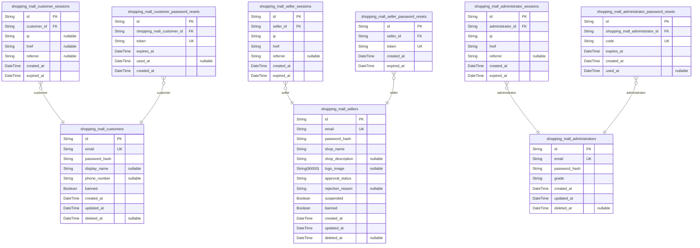
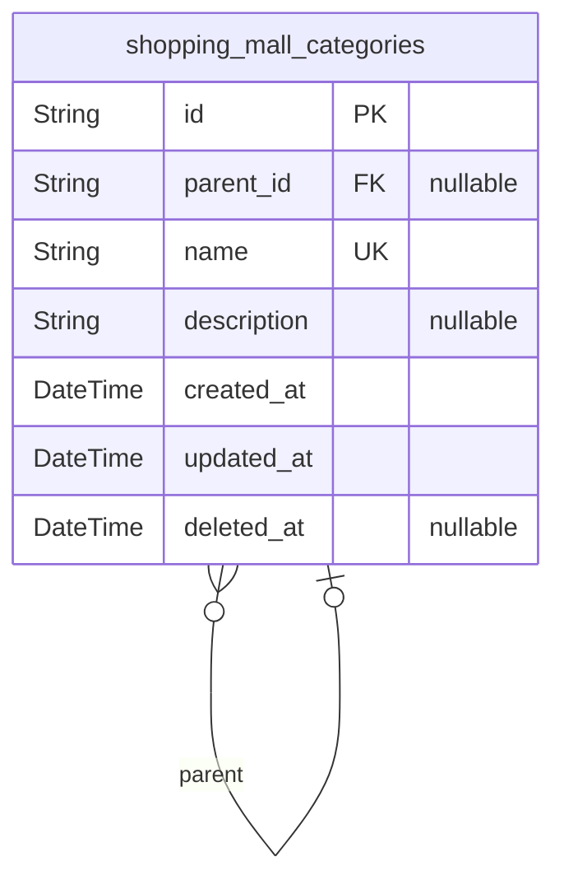
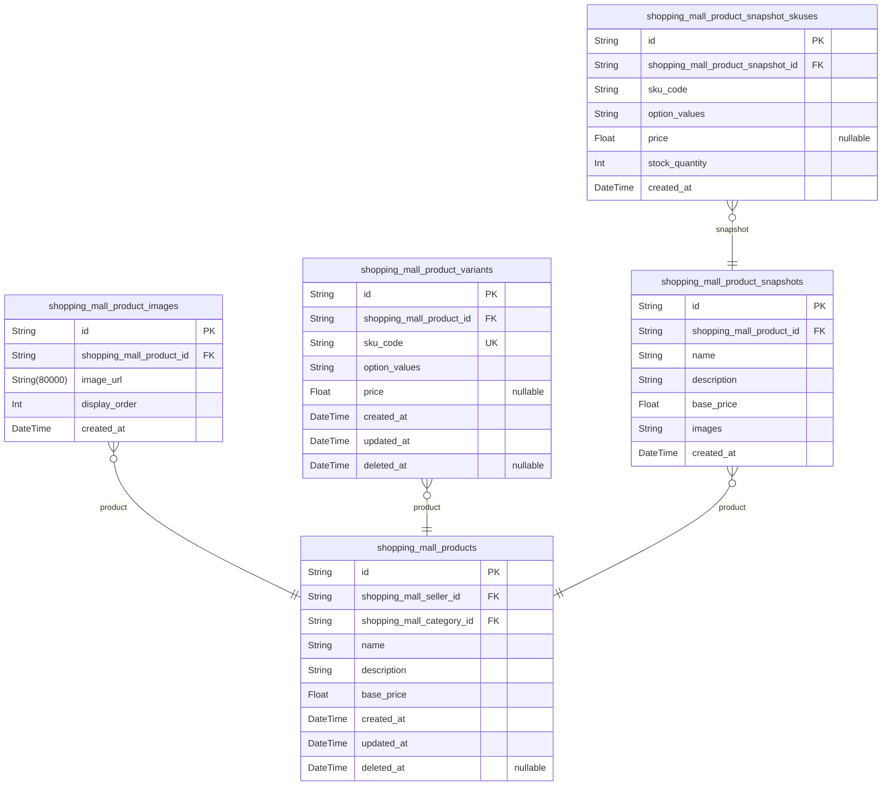
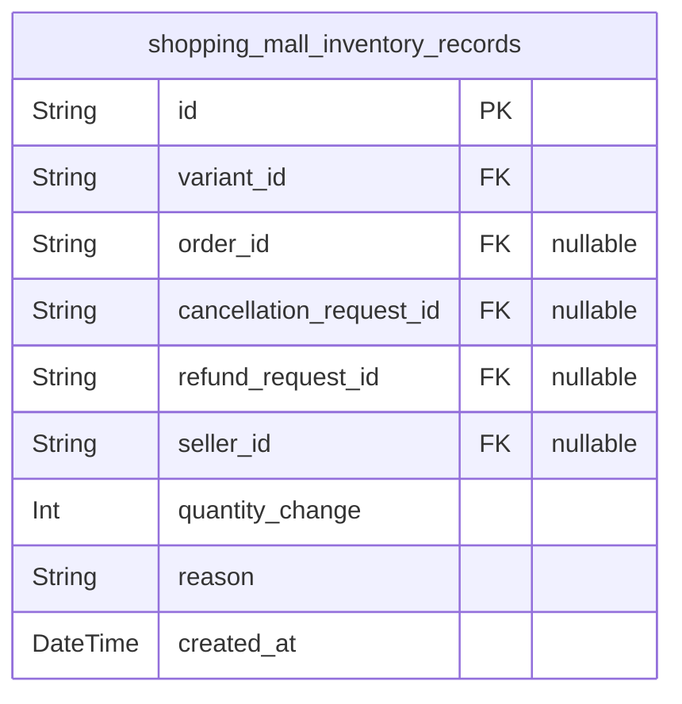
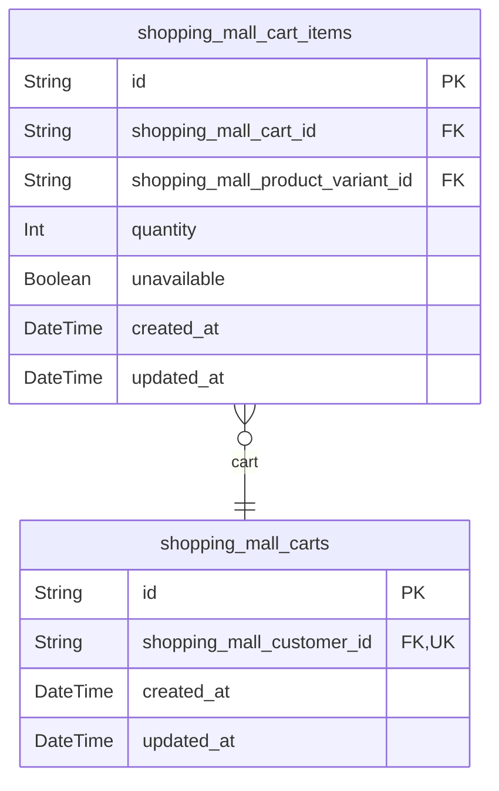
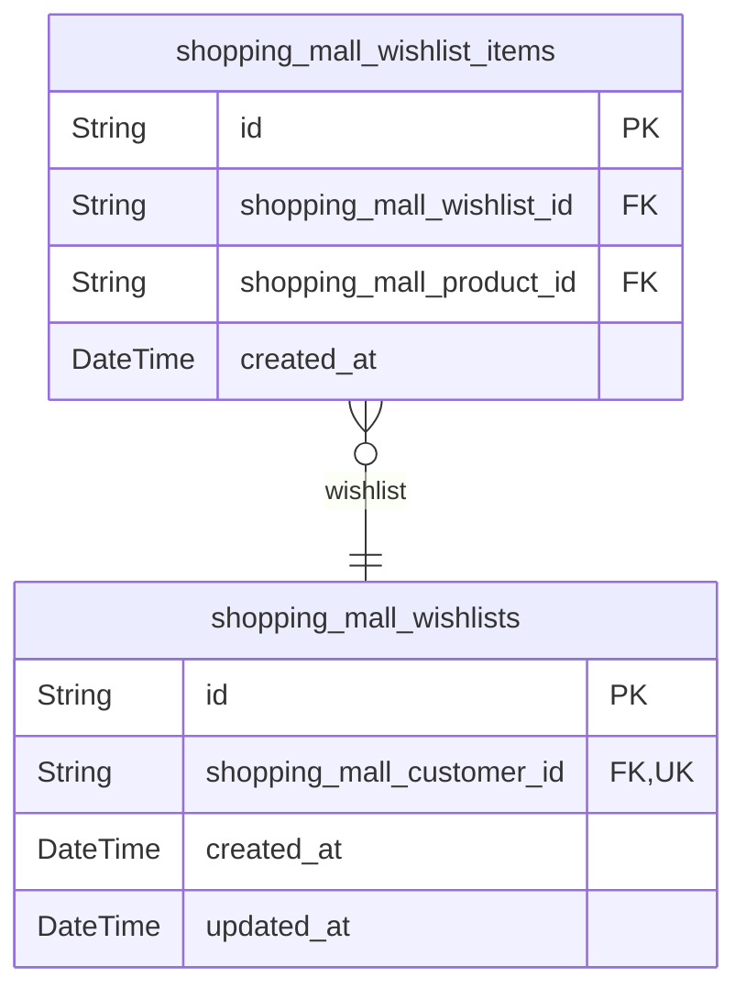
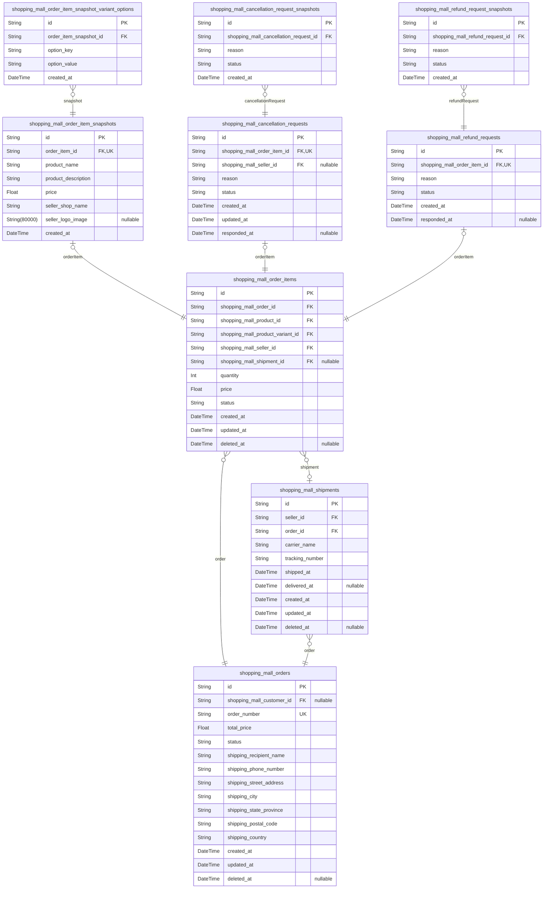
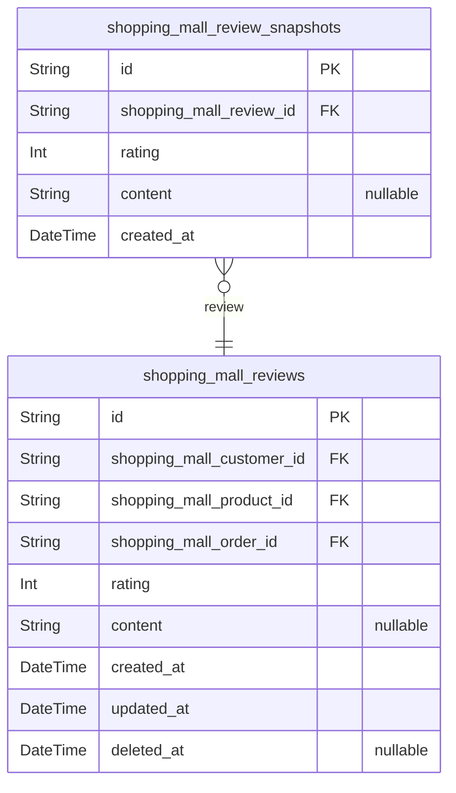
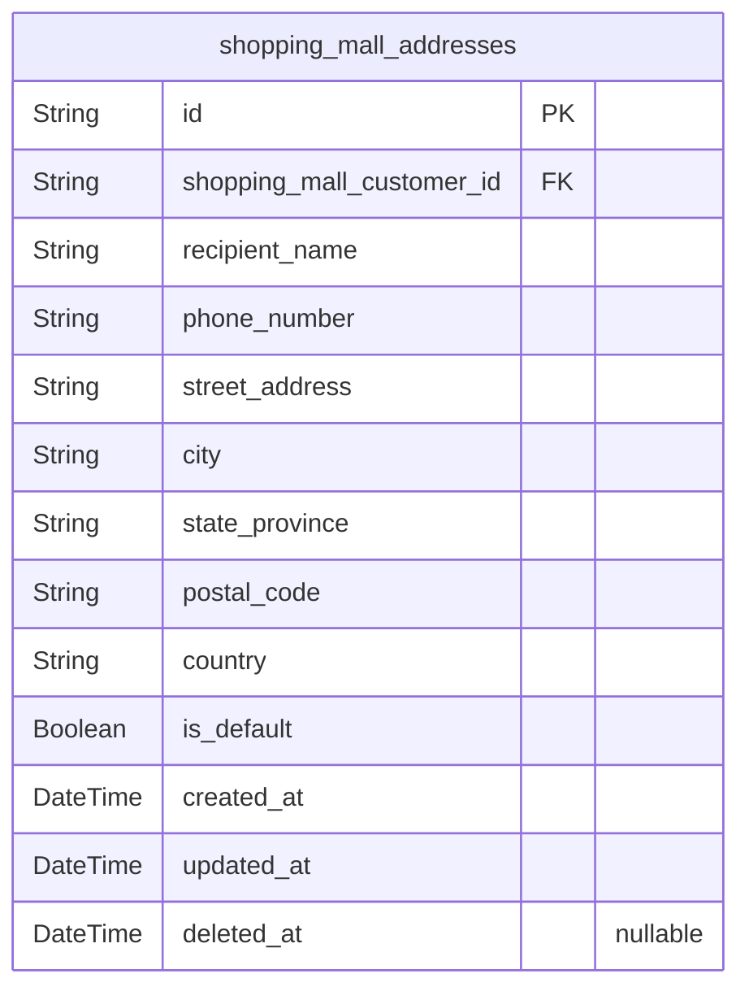

# Prisma Markdown

> Generated by [`prisma-markdown`](https://github.com/samchon/prisma-markdown)

- [Actors](#actors)
- [Categories](#categories)
- [Products](#products)
- [Inventory](#inventory)
- [Cart](#cart)
- [Wishlist](#wishlist)
- [Orders](#orders)
- [Reviews](#reviews)
- [Addresses](#addresses)

## Actors

### `shopping_mall_customers`

Registered customer accounts with email/password authentication, profile
information, and account status.

Customers are the primary shoppers in the platform who browse products,
manage carts, place orders, write reviews, and manage wishlists. Each
customer has a unique email address for authentication and can maintain
profile information including display name and phone number.

**Key Business Rules:**
- Email must be unique across all customer accounts (case-insensitive)
- Password is stored as secure hash, never in plaintext
- Account deletion is soft delete; orders and reviews are preserved with
'deleted user' attribution
- Banned customers cannot log in to the platform

**Relationships:**
- Has many [shopping_mall_addresses](#shopping_mall_addresses) for shipping destinations
- Has one [shopping_mall_carts](#shopping_mall_carts) for shopping cart
- Has many [shopping_mall_wishlists](#shopping_mall_wishlists) for saved products
- Has many [shopping_mall_orders](#shopping_mall_orders) for purchase history
- Has many [shopping_mall_reviews](#shopping_mall_reviews) for product feedback
- Has many [shopping_mall_customer_sessions](#shopping_mall_customer_sessions) for authentication
sessions
- Has many [shopping_mall_customer_password_resets](#shopping_mall_customer_password_resets) for password
recovery

Properties as follows:

- `id`: Primary Key.
- `email`
  > Customer's email address used for authentication. Must be unique across
  > all customer accounts. Case-insensitive comparison for uniqueness
  > validation.
- `password_hash`
  > Securely hashed password for authentication. Never stored in plaintext.
  > Uses one-way hashing algorithm for security.
- `display_name`
  > Customer's display name shown in reviews and public interactions. Maximum
  > 50 characters. Can be edited by customer at any time without approval.
- `phone_number`
  > Customer's phone number for contact purposes. Can be edited by customer
  > at any time without approval.
- `banned`
  > Flag indicating whether customer account is banned by administrator.
  > Banned customers cannot log in. Default is false.
- `created_at`: Timestamp when customer account was created.
- `updated_at`: Timestamp when customer account was last updated.
- `deleted_at`
  > Timestamp when customer account was deleted (soft delete). Null if
  > account is active. When deleted, orders and reviews are preserved with
  > 'deleted user' attribution.

### `shopping_mall_customer_sessions`

Customer authentication session records tracking login events with
connection metadata. Each session represents a single authenticated login
instance with IP address, request URL, and referrer information captured
for security auditing. Sessions have expiration timestamps and are
append-only records that cannot be modified after creation. Used for
session management, security monitoring, and audit trail maintenance.

Properties as follows:

- `id`: Primary Key.
- `customer_id`: Authenticated customer's [shopping_mall_customers.id](#shopping_mall_customers).
- `ip`
  > IP address of the client that initiated the login session. Used for
  > security auditing and anomaly detection.
- `href`
  > Request URL or endpoint that initiated the session. Captures the full URL
  > including path and query parameters for session context.
- `referrer`
  > HTTP Referrer header value from the login request. Identifies the source
  > page or application that directed to the authentication flow.
- `created_at`
  > Timestamp when the session was created (login time). Used for session
  > lifecycle management and audit trails.
- `expired_at`
  > Timestamp when the session expires. Required for security to enforce
  > session timeouts. Sessions are considered invalid after this timestamp.

### `shopping_mall_customer_password_resets`

Password reset tokens for customer account recovery with expiration
tracking.

This table stores secure password reset tokens that enable customers to
recover access to their accounts when they forget their passwords. Each
token has an expiration time and tracks whether it has been used,
ensuring security and preventing token reuse.

The token field stores a cryptographically secure hash of the reset
token, not the plaintext token itself. This ensures that even if the
database is compromised, attackers cannot use the stored values to reset
passwords.

Relationships:
- Belongs to [shopping_mall_customers](#shopping_mall_customers) (many password resets per
customer)
- Referenced during the password reset verification flow

Properties as follows:

- `id`: Primary Key.
- `shopping_mall_customer_id`
  > The customer requesting the password reset. {@link
  > shopping_mall_customers.id}.
- `token`
  > Hashed password reset token used for verification during the account
  > recovery process. This is a cryptographically secure hash, not the
  > plaintext token sent to the customer's email.
- `expires_at`
  > Expiration timestamp for the password reset token. Tokens become invalid
  > after this time for security purposes. Typically set to 1-24 hours from
  > creation.
- `used_at`
  > Timestamp when the token was successfully used to reset the password.
  > Null if the token has not been used yet. Once set, the token is
  > considered consumed and cannot be reused.
- `created_at`
  > Timestamp when the password reset token was created. Used for audit
  > trails and to identify the most recent reset request for a customer.

### `shopping_mall_sellers`

Registered seller accounts with email/password authentication, shop
profile information, approval workflow status, and account standing.

Sellers are authenticated actors who create and manage products, handle
inventory, process shipments, and respond to cancellation/refund
requests. They require administrator approval before they can sell on the
platform.

**Authentication**: Sellers log in with email and password. Password
changes are supported through the password reset flow.

**Approval Workflow**: New seller registrations start with
approval_status='pending'. Administrators review and approve or reject
applications. Rejected sellers can view the rejection reason and submit
new registration requests.

**Account Standing**: Sellers can be suspended (temporary, products
hidden but can process existing orders) or banned (cannot log in) by
administrators. Suspended sellers cannot create new products but can
fulfill existing orders.

**Account Deletion**: Sellers can delete their account only if they have
no pending order items (paid or shipped status) and no pending
cancellation/refund requests. Upon deletion, their products are removed
from listings, but order history and snapshots are preserved for legal
and dispute resolution purposes.

**Relationships**: Has many [shopping_mall_products](#shopping_mall_products), has many
[shopping_mall_seller_sessions](#shopping_mall_seller_sessions), has many {@link
shopping_mall_seller_password_resets}.

Properties as follows:

- `id`: Primary Key.
- `email`
  > Seller's email address used for authentication. Must be unique across all
  > seller accounts. Used for login identification.
- `password_hash`
  > Hashed password for authentication. Stored using secure hashing algorithm
  > (bcrypt/argon2). Never stored in plaintext.
- `shop_name`
  > Display name of the seller's shop. Visible to customers on product
  > listings and order details. Required for shop profile.
- `shop_description`
  > Detailed description of the seller's shop. Optional field for providing
  > additional shop information to customers.
- `logo_image`
  > URL to the seller's shop logo image. Displayed on product listings and
  > seller profile page. Optional field.
- `approval_status`
  > Current approval status of the seller account. Values: 'pending'
  > (awaiting admin review), 'approved' (can sell products), 'rejected'
  > (cannot sell, can reapply). New registrations default to 'pending'.
- `rejection_reason`
  > Reason provided by administrator when rejecting a seller registration.
  > Only populated when approval_status is 'rejected'. Visible to the
  > rejected seller for improvement guidance.
- `suspended`
  > Whether the seller account is suspended by an administrator. Suspended
  > sellers cannot create or edit products, but their existing products are
  > hidden and they can still process existing orders. Defaults to false.
- `banned`
  > Whether the seller account is banned by an administrator. Banned sellers
  > cannot log in to the platform. Used for severe policy violations.
  > Defaults to false.
- `created_at`
  > Timestamp when the seller account was created. Recorded automatically on
  > registration.
- `updated_at`
  > Timestamp when the seller account was last updated. Automatically updated
  > on profile changes.
- `deleted_at`
  > Timestamp when the seller account was soft-deleted. Null if account is
  > active. Upon deletion, products are removed but order history and
  > snapshots are preserved for legal purposes.

### `shopping_mall_seller_sessions`

JWT session tokens for seller authentication tracking login sessions with
connection context. Each session represents a single authentication event
for a seller account, storing the connection metadata (IP, URLs) and
temporal boundaries. Sessions support concurrent logins across multiple
devices with a maximum duration of 24 hours. Sessions are automatically
invalidated when the seller account is banned, suspended, or when
password is changed, and can be manually invalidated on explicit logout.

Properties as follows:

- `id`
  > Primary Key. Unique session identifier used as the 'sid' claim in JWT
  > tokens for seller authentication sessions.
- `seller_id`
  > Reference to the authenticated seller's account. Belonged seller's {@link
  > shopping_mall_sellers.id}. This session is valid only for this specific
  > seller account.
- `ip`
  > IP address of the client at the time of session creation. Used for
  > security auditing and session tracking to identify the source of
  > authentication requests.
- `href`
  > The URL (href) where the authentication was initiated. Captures the
  > landing page or entry point for the seller's login session.
- `referrer`
  > HTTP referrer header value from the authentication request. Identifies
  > the referring page that led to the login page for security tracking.
- `created_at`
  > Timestamp when this session was created. This is the login time and is
  > recorded when authentication succeeds. Used for session duration tracking
  > and audit purposes.
- `expired_at`
  > Timestamp when this session expires. Maximum session duration is 24 hours
  > from creation. Sessions must be invalidated after this time regardless of
  > activity. NOT NULL by default for security enforcement.

### `shopping_mall_seller_password_resets`

Password reset tokens for seller account recovery. Stores time-limited,
unique tokens that allow sellers to securely reset their passwords.
Tokens are created when a seller requests a password reset and expire
after a defined period for security. Each token is single-use and
invalidated after password change or expiration.

Properties as follows:

- `id`: Primary Key.
- `seller_id`
  > The seller account requesting the password reset. References {@link
  > shopping_mall_sellers.id}. A seller can have multiple password reset
  > tokens (e.g., if they request multiple resets before using one).
- `token`
  > Unique, cryptographically secure reset token used to authenticate
  > password reset requests. Must be single-use and invalidated after
  > password change or expiration.
- `created_at`
  > Timestamp when the password reset token was created. Used for audit trail
  > and token age validation.
- `expired_at`
  > Timestamp when the reset token expires. Tokens past this time are invalid
  > and must not be accepted. Enforces time-limited access for security.

### `shopping_mall_administrators`

Administrator accounts with email/password authentication and grade-based
privilege management. Supports two grades: regular administrator (seller
approval, category management, user banning, product oversight, forced
order operations) and super administrator (all regular privileges plus
administrator request review, promotion/demotion authority).
Administrators are created through approval of AdministratorRequest
submissions by super administrators. Account separation is maintained
from customer/seller accounts when users hold multiple roles.

Properties as follows:

- `id`: Primary Key.
- `email`
  > Administrator email address used for authentication. Must be unique
  > across all administrator accounts. Used as login identifier.
- `password_hash`
  > Hashed password for administrator authentication. Must meet platform
  > password complexity requirements (minimum length, uppercase, lowercase,
  > numeric digit).
- `grade`
  > Administrator privilege level. Valid values: 'regular' (standard
  > administrative functions), 'super' (elevated privileges including
  > administrator request approval, promotion/demotion authority). Super
  > administrators cannot demote themselves. At least one super administrator
  > must exist in the system.
- `created_at`
  > Timestamp when the administrator account was created. Set automatically
  > on account creation.
- `updated_at`
  > Timestamp when the administrator account was last modified. Updated
  > automatically on profile changes.
- `deleted_at`
  > Timestamp when the administrator account was soft-deleted. Null for
  > active accounts. Preserves account record for audit trail when removed.

### `shopping_mall_administrator_sessions`

Administrator login session records tracking authentication sessions with
connection metadata. Each session represents a single administrator login
with IP address, requested URL path, referrer information, and expiration
timestamp. Sessions are created upon successful authentication and used
for JWT token validation and session management. Sessions support audit
trails for administrator access patterns and can be invalidated on logout
or security events. Related to [shopping_mall_administrators](#shopping_mall_administrators) via
the administrator relationship.

Properties as follows:

- `id`: Primary Key.
- `administrator_id`
  > The administrator who owns this session. {@link
  > shopping_mall_administrators.id}
- `ip`: Client IP address from which the administrator logged in.
- `href`
  > URL path that the administrator accessed during authentication. Used for
  > session tracking and redirect purposes.
- `referrer`
  > HTTP Referrer header indicating the previous page from which the
  > administrator navigated to the login page. Optional as some browsers may
  > not send this header.
- `created_at`: Timestamp when the session was created upon successful authentication.
- `expired_at`
  > Timestamp when the session expires. Used for JWT token validation and
  > session timeout enforcement. Always set to enforce security limits.

### `shopping_mall_administrator_password_resets`

Password reset tokens for administrator account recovery with expiration
tracking. Each token is uniquely identified by a code and links to a
specific administrator account. Tokens expire after a defined period for
security, and usage is tracked through the used_at timestamp. This entity
supports the administrator password reset workflow and is managed through
administrator-related operations.

Properties as follows:

- `id`: Primary Key.
- `shopping_mall_administrator_id`
  > Administrator account requesting password reset. {@link
  > shopping_mall_administrators.id}.
- `code`
  > Unique password reset token code used for verification during the reset
  > process. Must be cryptographically secure and single-use.
- `expires_at`
  > Expiration timestamp for the reset token. Tokens cannot be used after
  > this time for security reasons.
- `created_at`: Timestamp when the password reset token was created.
- `used_at`
  > Timestamp when the reset token was used, if applicable. Null if the token
  > has not been used yet or expired unused.

## Categories

### `shopping_mall_categories`

Product categories with optional parent-child hierarchy for organizing
products.

Categories provide the primary organizational structure for the product
catalog. Each category can have an optional parent category, enabling one
level of nesting (subcategory). Categories are created and managed
exclusively by administrators and are browsable by all customers.

When a category is deleted, products belonging to that category become
uncategorized. Categories are non-transactional metadata and do not
require snapshot tracking.

Key relationships:
- Self-referential parent-child relationship for subcategories
- Referenced by [shopping_mall_products](#shopping_mall_products) for product categorization

Properties as follows:

- `id`: Primary Key.
- `parent_id`
  > Parent category reference for subcategory relationship. When set, this
  > category is a subcategory of the referenced parent. Only one level of
  > nesting is allowed (parent must be a top-level category). Null for
  > top-level categories.
- `name`
  > Unique category name displayed to customers and used for product
  > categorization. Required field that must be unique across all categories.
- `description`
  > Optional detailed description of the category, its purpose, and the types
  > of products it contains. May be null for categories without detailed
  > descriptions.
- `created_at`: Timestamp when the category was created by an administrator.
- `updated_at`: Timestamp when the category was last modified.
- `deleted_at`
  > Timestamp when the category was soft-deleted. Null for active categories.
  > Soft delete preserves referential integrity while hiding from customer
  > view.

## Products

### `shopping_mall_products`

Product catalog entries created by sellers, containing name, description,
base price, and category assignment. Each product belongs to exactly one
seller who owns and manages it. Products must be assigned to exactly one
category (top-level or subcategory). Products must have at least one
variant to be purchasable. Products are soft-deletable with snapshots
preserved for dispute resolution. Sellers can edit their products, with
each edit creating an immutable snapshot. Product deletion is blocked if
any variant has pending order items (paid/shipped) or pending
cancellation/refund requests.

Key Relationships:
- Belongs to [shopping_mall_sellers](#shopping_mall_sellers) (owner)
- Belongs to [shopping_mall_categories](#shopping_mall_categories) (category assignment)
- Has many [shopping_mall_product_images](#shopping_mall_product_images) (product images)
- Has many [shopping_mall_product_variants](#shopping_mall_product_variants) (product variants/SKUs)
- Has many [shopping_mall_product_snapshots](#shopping_mall_product_snapshots) (edit history)
- Referenced by [shopping_mall_wishlist_items](#shopping_mall_wishlist_items) (customer wishlists)
- Referenced by [shopping_mall_reviews](#shopping_mall_reviews) (customer reviews)

Properties as follows:

- `id`: Primary Key.
- `shopping_mall_seller_id`
  > Owner seller of this product. References {@link
  > shopping_mall_sellers.id}. Products are created and managed by sellers.
  > When seller is suspended, products are hidden from search and category
  > listings.
- `shopping_mall_category_id`
  > Category assignment for this product. References {@link
  > shopping_mall_categories.id}. Each product must be assigned to exactly
  > one category (top-level or subcategory). When assigned to subcategory,
  > product appears in both subcategory and parent category listings.
- `name`
  > Product name displayed in search results and product detail pages.
  > Required field for all products. Used in product search functionality
  > with full-text search support.
- `description`
  > Detailed product description explaining features, specifications, and
  > usage. Required field for all products. Displayed on product detail page.
- `base_price`
  > Base price for the product in the platform's currency. Required field.
  > Must be a positive value. Variants can override this price with their own
  > pricing.
- `created_at`
  > Timestamp when the product was created. Set automatically on product
  > creation.
- `updated_at`
  > Timestamp when the product was last updated. Updated automatically on
  > every edit. Used to determine when snapshots should be created.
- `deleted_at`
  > Timestamp when the product was soft-deleted. Null if product is active.
  > Deleted products are removed from search and category listings but
  > snapshots are preserved for dispute resolution.

### `shopping_mall_product_images`

Product images serving as visual representations of products in the
catalog. Each product can have multiple images with controlled display
order, where the first image (lowest display_order value) serves as the
main thumbnail shown in search results and category listings. Images are
managed by sellers through product operations and are included in product
snapshots when products are edited for historical preservation. Supports
JPEG, PNG, and WebP formats with secure URL protocols.

Properties as follows:

- `id`: Primary Key.
- `shopping_mall_product_id`
  > The product this image belongs to. Images cascade delete when the parent
  > product is deleted. References [shopping_mall_products.id](#shopping_mall_products).
- `image_url`
  > URL pointing to the product image file. Must use secure protocols (HTTPS)
  > and point to an accessible location. Supports JPEG, PNG, and WebP image
  > formats.
- `display_order`
  > Numerical display order determining the image's position in the product
  > gallery. Lower values appear first. The image with the lowest
  > display_order is used as the main thumbnail in product listings and
  > search results. Must be unique within the same product.
- `created_at`
  > Timestamp when the image was uploaded. Used as secondary sorting
  > criterion when multiple images have the same display order value, and for
  > audit trail purposes.

### `shopping_mall_product_variants`

Specific SKU configurations for products with unique SKU codes, option
values (color, size, etc.), and optional price overrides. Each variant
represents a distinct purchasable combination of product options and has
its stock quantity managed through inventory records.

Sellers create and manage variants for their products, defining option
combinations like 'Red / Large' or 'Blue / Small'. Customers select
specific variants when adding items to their cart. The variant's price
can override the product's base price, and stock availability is
calculated by summing all associated inventory records.

When a variant is deleted, it is soft-deleted and no longer appears in
product listings. Variants with pending orders or requests cannot be
deleted. Every edit to a variant creates a snapshot for audit trail
purposes.

Relationships:
- Belongs to [shopping_mall_products](#shopping_mall_products) (required)
- Has many [shopping_mall_inventory_records](#shopping_mall_inventory_records) for stock tracking
- Referenced by [shopping_mall_cart_items](#shopping_mall_cart_items) and {@link
shopping_mall_order_items}

Properties as follows:

- `id`: Primary Key.
- `shopping_mall_product_id`
  > The product this variant belongs to. Each product can have multiple
  > variants representing different option combinations. {@link
  > shopping_mall_products.id}
- `sku_code`
  > Unique identifier for the variant across the entire platform. Must be
  > 3-50 characters, alphanumeric and hyphens only, cannot start or end with
  > hyphen, and no consecutive hyphens. This code is used for inventory
  > tracking and order processing.
- `option_values`
  > JSON object containing the variant's option attributes as key-value pairs
  > (e.g., {"color": "Red", "size": "Large"}). Each variant must have at
  > least one option attribute, with a maximum of 5 attributes. Attribute
  > names are 1-30 characters, values are 1-50 characters. The combination of
  > option values must be unique within each product.
- `price`
  > Optional price that overrides the product's base price for this specific
  > variant. If not set, the product's base price is used. Must be between
  > 0.01 and 999,999.99 with up to 2 decimal places when specified.
- `created_at`: Timestamp when the variant was created.
- `updated_at`: Timestamp when the variant was last updated.
- `deleted_at`
  > Timestamp when the variant was soft-deleted. Deleted variants are not
  > displayed in product listings but data is preserved for historical
  > records and audit trails.

### `shopping_mall_product_snapshots`

Historical snapshots of product state created automatically on every
product edit, preserving the complete product information including name,
description, base price, and images at a specific point in time.

These snapshots serve critical business purposes:
- Audit Trail: Provides complete history of product modifications for
accountability
- Dispute Resolution: Serves as legal evidence in customer-seller
disputes regarding product details at time of purchase
- Version Control: Allows tracking of product evolution over time
- Data Integrity: Ensures historical accuracy even when products are
deleted or heavily modified

Each snapshot captures the product state exactly as it existed when the
edit was made. Snapshots are immutable and cannot be modified or deleted,
preserving the integrity of historical records.

Related entities:
- Belongs to [shopping_mall_products](#shopping_mall_products) (the product being snapshotted)
- Has many [shopping_mall_product_snapshot_skuses](#shopping_mall_product_snapshot_skuses) (variant states
at time of snapshot)

Properties as follows:

- `id`: Primary Key.
- `shopping_mall_product_id`
  > The product whose state is preserved in this snapshot. References {@link
  > shopping_mall_products.id}.
- `name`
  > Product name at the time of snapshot creation. Preserved exactly as it
  > appeared when the product was edited.
- `description`
  > Product description at the time of snapshot creation. Preserves the full
  > text content for historical reference and dispute resolution.
- `base_price`
  > Base price of the product at the time of snapshot creation. Stored as
  > decimal to preserve exact pricing for transaction records and dispute
  > resolution.
- `images`
  > JSON array of product image URLs at the time of snapshot creation.
  > Preserves complete image state including display order. First image in
  > array represents the main/thumbnail image. Stored as JSON to maintain
  > exact image configuration as it existed.
- `created_at`
  > Timestamp when this snapshot was created, marking the exact moment of
  > product edit. Used for chronological ordering of product history.

### `shopping_mall_product_snapshot_skuses`

Historical snapshot of product variant state embedded within product
snapshots. Captures SKU code, option values, price override, and stock
quantity at the exact moment of product edit creation. Part of the
complete product state preservation system that ensures transaction
integrity for dispute resolution and historical tracking.

Each snapshot SKU record is immutable and linked to its parent product
snapshot. Preserves variant information exactly as it existed, even if
the original variant is later modified or deleted. Supports complete
historical reconstruction of any product's variant configuration at any
point in time.

Properties as follows:

- `id`: Primary Key.
- `shopping_mall_product_snapshot_id`
  > Reference to the parent product snapshot. Each variant snapshot belongs
  > to exactly one product snapshot, preserving the complete product state at
  > a point in time.
- `sku_code`
  > SKU code of the product variant at the moment of snapshot creation.
  > Preserved exactly as it existed when the product was edited, serving as a
  > unique identifier for the variant configuration at that time.
- `option_values`
  > JSON representation of variant option values (e.g.,
  > {"color":"Red","size":"Large"}). Preserved at the moment of snapshot
  > creation for historical accuracy. Stored as JSON string to capture
  > complete option configuration.
- `price`
  > Price override of the variant at snapshot time. Nullable if the variant
  > uses the product's base price instead of a custom override. Preserved for
  > accurate price history tracking in dispute resolution.
- `stock_quantity`
  > Stock quantity of the variant at the exact moment of snapshot creation.
  > Preserved for inventory history tracking and to show availability context
  > at the time of product edit.
- `created_at`
  > Timestamp when this variant snapshot was created. Matches the parent
  > product snapshot's creation time for consistency.

## Inventory

### `shopping_mall_inventory_records`

Stock movement ledger for product variants using an additive approach.

Each record documents a quantity change (positive for restocks, negative
for orders/adjustments) with a reason and timestamp. Current stock for
any variant is calculated by summing all inventory records for that
variant. Records are immutable and provide a complete audit trail for
dispute resolution and transparency.

Supports manual restocking, manual adjustments, and automatic stock
updates triggered by order placement, cancellations, and refunds. Each
record tracks its source through optional foreign key references to
orders, cancellation requests, refund requests, or sellers (for manual
adjustments).

Relationships:
- Belongs to [shopping_mall_product_variants](#shopping_mall_product_variants) (the variant being
adjusted)
- Optionally references [shopping_mall_orders](#shopping_mall_orders) (for order-triggered
deductions)
- Optionally references [shopping_mall_cancellation_requests](#shopping_mall_cancellation_requests) (for
cancellation-triggered restorations)
- Optionally references [shopping_mall_refund_requests](#shopping_mall_refund_requests) (for
refund-triggered restorations)
- Optionally references [shopping_mall_sellers](#shopping_mall_sellers) (for manual
adjustments)

Properties as follows:

- `id`: Primary Key.
- `variant_id`
  > The product variant whose stock is being adjusted. References {@link
  > shopping_mall_product_variants.id}.
- `order_id`
  > Reference to the order that triggered this inventory deduction. Only
  > populated for automatic records created during order placement. Null for
  > manual adjustments, cancellations, and refunds.
- `cancellation_request_id`
  > Reference to the cancellation request that triggered this stock
  > restoration. Only populated for automatic records created when a
  > cancellation is approved. Null for other record types.
- `refund_request_id`
  > Reference to the refund request that triggered this stock restoration.
  > Only populated for automatic records created when a refund is approved.
  > Null for other record types.
- `seller_id`
  > Reference to the seller who performed this manual inventory adjustment.
  > Only populated for manual restocking or adjustment records. Null for
  > automatic records (order, cancellation, refund triggered).
- `quantity_change`
  > The quantity change for this inventory movement. Positive values indicate
  > stock additions (restocking, refund restoration). Negative values
  > indicate stock deductions (order placement, adjustments, losses). Zero
  > values allowed for correction entries.
- `reason`
  > The reason for this inventory change. For manual entries, contains
  > seller-provided explanation (e.g., 'Initial stock', 'Damaged goods
  > adjustment'). For automatic entries, contains system-generated
  > description (e.g., 'Order placed', 'Cancellation approved', 'Refund
  > processed').
- `created_at`
  > Timestamp when this inventory record was created. Used for chronological
  > history tracking and audit trail purposes.

## Cart

### `shopping_mall_carts`

Customer shopping cart sessions with one-to-one relationship to customers
for managing product selections before checkout. Tracks creation and
modification timestamps for session persistence across logins. Cart is
cleared after successful order placement but not deleted, remaining
available for future shopping sessions.

Properties as follows:

- `id`: Primary Key.
- `shopping_mall_customer_id`
  > Customer who owns this cart. Enforces one-to-one relationship where each
  > customer has exactly one cart. [shopping_mall_customers.id](#shopping_mall_customers)
- `created_at`
  > Timestamp when the cart was created. Used for session tracking and
  > persistence across customer logins.
- `updated_at`
  > Timestamp when the cart was last modified. Updated when cart items are
  > added, modified, or removed. Used for session management and cleanup
  > policies.

### `shopping_mall_cart_items`

Individual items in shopping carts referencing specific product variants
with quantity.

Each cart item represents a customer's selection of a specific product
variant (SKU) added to their cart for purchase. The quantity field tracks
how many units of the variant the customer intends to buy. When the same
variant is added again, quantities are merged into a single cart item
rather than creating duplicates.

The unavailable flag marks items whose variants have been deleted by
sellers or are out of stock. Unavailable items remain in the cart to
preserve product information for customer reference but cannot be checked
out until removed or restocked.

Cart items are automatically removed when orders are successfully placed,
converting each item into an order item with its preserved product and
pricing information.

**Relationships:**
- Belongs to [shopping_mall_carts](#shopping_mall_carts) (many items per cart)
- References [shopping_mall_product_variants](#shopping_mall_product_variants) for the selected SKU
- Indirectly references shopping_mall_products through the variant
- Indirectly references shopping_mall_sellers for seller association

Properties as follows:

- `id`: Primary Key.
- `shopping_mall_cart_id`
  > The cart this item belongs to. Each cart can have multiple items, each
  > referencing a different product variant. [shopping_mall_carts.id](#shopping_mall_carts)
- `shopping_mall_product_variant_id`
  > The specific product variant (SKU) selected for purchase. Customers must
  > select a variant when adding to cart, not just the product. {@link
  > shopping_mall_product_variants.id}
- `quantity`
  > Number of units of the variant selected for purchase. Must be a positive
  > integer (minimum 1). When the same variant is added to cart again,
  > quantities are merged by adding to the existing quantity rather than
  > creating a duplicate item.
- `unavailable`
  > Flag indicating whether this item's variant is unavailable (deleted by
  > seller or out of stock). Unavailable items remain in the cart to preserve
  > product information but cannot be checked out. When stock becomes
  > available again, this flag is cleared.
- `created_at`
  > Timestamp when the item was first added to the cart. Used for sorting
  > cart items and tracking customer shopping behavior.
- `updated_at`
  > Timestamp when the item was last modified, such as when quantities are
  > merged when the same variant is added to cart again. Tracks all changes
  > to the cart item's state.

## Wishlist

### `shopping_mall_wishlists`

Main wishlist entity providing one-to-one relationship with customers for
managing their saved product collections. Each customer has exactly one
wishlist that can contain multiple products for future consideration.
Serves as a monitoring list rather than a purchase intent, separate from
the active shopping cart workflow.

Properties as follows:

- `id`: Primary Key.
- `shopping_mall_customer_id`
  > The customer who owns this wishlist. Each customer has exactly one
  > wishlist. [shopping_mall_customers.id](#shopping_mall_customers).
- `created_at`: Timestamp when the wishlist was created.
- `updated_at`
  > Timestamp when the wishlist was last updated (e.g., when items were added
  > or removed).

### `shopping_mall_wishlist_items`

Individual product entries stored in customer wishlists for future
consideration. Each entry references a product at the product level (not
variant-specific), with creation timestamp for sorting by most recently
added. Enforces uniqueness constraint to prevent duplicate products per
wishlist. Automatically removed when referenced product is deleted by
seller.

Properties as follows:

- `id`: Primary Key.
- `shopping_mall_wishlist_id`
  > The wishlist this item belongs to. Each customer has exactly one
  > wishlist. [shopping_mall_wishlists.id](#shopping_mall_wishlists)
- `shopping_mall_product_id`
  > The product saved in the wishlist. References products at the product
  > level only, not variant-specific. [shopping_mall_products.id](#shopping_mall_products)
- `created_at`
  > Timestamp when the product was added to the wishlist. Used for sorting
  > wishlist items by most recently added first.

## Orders

### `shopping_mall_orders`

Customer purchase transactions created at checkout with unique order
number, total price, derived status, and immutable shipping address.
Orders aggregate order items from potentially multiple sellers, and
status is derived from individual item statuses. Order history is
preserved even after customer account deletion for seller records and
legal purposes.

Each order captures the complete shipping address as individual immutable
fields at checkout time, preserving the destination details exactly as
they were provided regardless of subsequent changes to the customer's
address book.

Properties as follows:

- `id`: Primary Key.
- `shopping_mall_customer_id`
  > Customer who placed the order. May be null if customer account is
  > deleted, as orders are preserved for seller records and legal purposes.
  > [shopping_mall_customers.id](#shopping_mall_customers)
- `order_number`
  > Unique order identifier generated at order creation. Used for customer
  > reference and order lookup.
- `total_price`
  > Total price of all order items at the time of purchase. Sum of (item
  > price × quantity) for all items.
- `status`
  > Order status derived from order items: 'paid' (all items paid), 'shipped'
  > (any shipped), 'delivered' (all delivered), 'cancelled' (all cancelled),
  > 'refunded' (all refunded), or 'partially_completed' (mixed states).
  > Cached for efficient querying.
- `shipping_recipient_name`
  > Recipient name for the shipping address as captured at checkout.
  > Immutable after order creation.
- `shipping_phone_number`
  > Phone number for delivery contact as captured at checkout. Immutable
  > after order creation.
- `shipping_street_address`
  > Street address for delivery as captured at checkout. Immutable after
  > order creation.
- `shipping_city`: City for delivery as captured at checkout. Immutable after order creation.
- `shipping_state_province`
  > State or province for delivery as captured at checkout. Immutable after
  > order creation.
- `shipping_postal_code`
  > Postal code for delivery as captured at checkout. Immutable after order
  > creation.
- `shipping_country`
  > Country for delivery as captured at checkout. Immutable after order
  > creation.
- `created_at`: Timestamp when order was created after successful payment.
- `updated_at`
  > Timestamp when order was last updated, typically when derived status
  > changes due to order item status changes.
- `deleted_at`
  > Timestamp for soft deletion, used when customer deletes account. Orders
  > are preserved with null customer reference.

### `shopping_mall_order_items`

Individual purchased product variants within customer orders, tracking
quantity, price at purchase time, and independent fulfillment status.

Each order item represents a specific product variant purchased by a
customer, with its own lifecycle through paid, shipped, delivered,
cancelled, or refunded states. Order items enable independent processing
per item, allowing customers to cancel individual items before shipment
or request refunds for delivered items.

Key relationships:
- Belongs to [shopping_mall_orders](#shopping_mall_orders) for order context
- References [shopping_mall_products](#shopping_mall_products) for product identity
- References [shopping_mall_product_variants](#shopping_mall_product_variants) for specific SKU
configuration
- References [shopping_mall_sellers](#shopping_mall_sellers) for seller attribution and
fulfillment responsibility
- Optionally references [shopping_mall_shipments](#shopping_mall_shipments) when shipped
(null until shipped)

Price is captured at purchase time to preserve transaction value
regardless of subsequent product price changes. Status progresses
independently per item, enabling mixed order states where some items ship
while others are cancelled.

Properties as follows:

- `id`: Primary Key.
- `shopping_mall_order_id`: The order this item belongs to. [shopping_mall_orders.id](#shopping_mall_orders)
- `shopping_mall_product_id`: The product purchased. [shopping_mall_products.id](#shopping_mall_products)
- `shopping_mall_product_variant_id`
  > The specific variant (SKU) purchased with its option configuration.
  > [shopping_mall_product_variants.id](#shopping_mall_product_variants)
- `shopping_mall_seller_id`
  > The seller responsible for fulfilling this item. Enables seller-specific
  > order views and multi-seller order distribution. {@link
  > shopping_mall_sellers.id}
- `shopping_mall_shipment_id`
  > The shipment this item is included in. Null until the seller creates a
  > shipment. Items from the same seller can be bundled into one shipment or
  > shipped separately. [shopping_mall_shipments.id](#shopping_mall_shipments)
- `quantity`
  > Number of units purchased for this product variant. If the same variant
  > is purchased multiple times, quantities are consolidated into a single
  > order item.
- `price`
  > Unit price at time of purchase. Captured from the product variant's price
  > (or product base price if no variant override) to preserve transaction
  > value for historical accuracy and dispute resolution.
- `status`
  > Current fulfillment status of this item. Values: 'paid' (awaiting
  > shipment), 'shipped' (in transit), 'delivered' (received by customer),
  > 'cancelled' (cancelled before shipment with refund), 'refunded' (refunded
  > after delivery). Each item tracks status independently within an order.
- `created_at`: Timestamp when this order item was created during order placement.
- `updated_at`: Timestamp when this order item was last modified, such as status changes.
- `deleted_at`
  > Timestamp for soft delete. Set when order data is archived or removed
  > from active view while preserving transaction history.

### `shopping_mall_order_item_snapshots`

Immutable purchase-time records that preserve the complete product,
variant, and seller state at the moment of purchase for transaction
integrity and dispute resolution.

When a customer successfully places an order, this snapshot captures the
product name, product description, exact price paid, seller shop name,
and seller logo image exactly as they existed at purchase time. This
creates a permanent historical record that cannot be modified or deleted,
ensuring customers and sellers have authoritative evidence of transaction
terms for dispute resolution.

The snapshot remains unchanged even if the original product is modified,
variant is deleted, or seller changes their shop profile. Links to {@link
shopping_mall_order_items.id} for complete purchase context. Variant
options are stored in normalized child table {@link
shopping_mall_order_item_snapshot_variant_options} for proper 1NF
compliance.

Properties as follows:

- `id`: Primary Key.
- `order_item_id`
  > The order item this snapshot preserves. Each order item has exactly one
  > snapshot capturing purchase-time state. {@link
  > shopping_mall_order_items.id}
- `product_name`
  > Product name exactly as displayed to the customer at purchase time.
  > Preserved character-for-character without modification.
- `product_description`
  > Complete product description in full text format as shown during
  > purchase. Preserves all formatting and content from the original product
  > description.
- `price`
  > Exact price the customer paid for this item at purchase. Uses variant
  > override price if defined, otherwise product base price. Preserved
  > unchanged regardless of subsequent price changes.
- `seller_shop_name`
  > Seller shop name as it existed at the time of purchase. Preserved
  > independently from seller profile changes.
- `seller_logo_image`
  > URL of seller logo image as it appeared at purchase time. Preserved for
  > historical reference even if seller updates their logo.
- `created_at`
  > Timestamp when the order item snapshot was created, marking the exact
  > moment of purchase completion.

### `shopping_mall_shipments`

Shipment packages created by sellers for order fulfillment.

Represents a physical package shipped by a seller containing one or more
order items from the same seller. When a seller ships items, they create
a shipment with carrier name and tracking number. All items in the same
shipment share the same tracking information.

Key behaviors:
- Sellers create shipments when shipping order items
- Sellers enter carrier name and tracking number
- Items can be bundled into a single shipment or shipped individually
- Customers view tracking information per shipment
- Delivery is confirmed by customer or automatically after 14 days
- When delivery is confirmed, all items in the shipment change to
'delivered' status

The shipment groups order items from the same seller for the same order.
Order items reference the shipment they belong to via {@link
shopping_mall_order_items.shipment_id}.

Properties as follows:

- `id`: Primary Key.
- `seller_id`
  > The seller who created this shipment. References {@link
  > shopping_mall_sellers.id}.
- `order_id`
  > The order containing the items in this shipment. Enables efficient
  > querying of shipments for customer order views. References {@link
  > shopping_mall_orders.id}.
- `carrier_name`
  > Name of the shipping carrier (e.g., FedEx, UPS, DHL). Entered by the
  > seller when creating the shipment.
- `tracking_number`
  > Tracking number provided by the carrier. Used by customers to track
  > shipment status on the carrier's website.
- `shipped_at`
  > Timestamp when the shipment was created and the items were marked as
  > shipped. Set automatically when the seller creates the shipment.
- `delivered_at`
  > Timestamp when delivery was confirmed. Set either by customer
  > confirmation or automatically 14 days after shipping if not confirmed by
  > customer.
- `created_at`: Record creation timestamp.
- `updated_at`: Record last modification timestamp.
- `deleted_at`
  > Soft deletion timestamp. Set when the shipment record is marked as
  > deleted.

### `shopping_mall_cancellation_requests`

Customer requests to cancel individual order items before shipment. Each
request includes a reason for cancellation, tracks status through
pending/approved/rejected states, and records when the seller responds.
Only one active cancellation request can exist per order item. When
approved, the order item status changes to cancelled and stock is
restored. Linked to [shopping_mall_cancellation_request_snapshots](#shopping_mall_cancellation_request_snapshots)
for audit trail preservation.

Properties as follows:

- `id`: Primary Key.
- `shopping_mall_order_item_id`
  > The order item being requested for cancellation. Must have 'paid' status
  > (not yet shipped). One active cancellation request per order item. {@link
  > shopping_mall_order_items.id}.
- `shopping_mall_seller_id`
  > The seller who responds to the cancellation request. Null until seller
  > approves or rejects. Must match the seller of the order item. {@link
  > shopping_mall_sellers.id}.
- `reason`
  > Customer's explanation for requesting cancellation. Required text field
  > explaining why the order item should be cancelled.
- `status`
  > Current status of the cancellation request. 'pending' - awaiting seller
  > response, 'approved' - seller accepted cancellation, 'rejected' - seller
  > declined cancellation. Transitions: pending → approved or pending →
  > rejected.
- `created_at`: Timestamp when the cancellation request was created by the customer.
- `updated_at`
  > Timestamp when the cancellation request was last updated. Tracks status
  > transitions and seller response.
- `responded_at`
  > Timestamp when the seller responded to the request. Null until seller
  > approves or rejects.

### `shopping_mall_cancellation_request_snapshots`

Immutable snapshots of cancellation request state created when a seller
responds to a cancellation request by approving or rejecting it. Captures
the customer's original reason text, the seller's decision status, and
the exact timestamp of response for permanent audit trail and dispute
resolution.

This table serves as authoritative evidence for resolving disputes
between customers and sellers regarding cancellation handling. Each
snapshot represents a distinct point in the cancellation request timeline
and cannot be modified or deleted after creation. Multiple snapshots may
exist for a single cancellation request if the seller provides multiple
responses over time.

Properties as follows:

- `id`: Primary Key.
- `shopping_mall_cancellation_request_id`
  > The cancellation request that this snapshot captures at the moment of
  > seller response. [shopping_mall_cancellation_requests.id](#shopping_mall_cancellation_requests)
- `reason`
  > The original cancellation reason text provided by the customer when they
  > submitted the cancellation request. Preserved exactly as entered without
  > modification to maintain historical accuracy for dispute resolution.
- `status`
  > The status assigned by the seller's response. Valid values are 'approved'
  > (seller authorized the cancellation) or 'rejected' (seller denied the
  > cancellation). Snapshots are only created upon seller response, so this
  > value is never 'pending'.
- `created_at`
  > The exact timestamp when the seller responded to the cancellation request
  > and this snapshot was created. Serves as the official record of when the
  > cancellation decision was made.

### `shopping_mall_refund_requests`

Customer requests to refund delivered order items within the 7-day
eligibility window. Each request is associated with exactly one order
item and can only be created for items with 'delivered' status. The
seller who owns the product can approve or reject the request, triggering
stock restoration and order status recalculation upon approval. All state
changes are preserved in shopping_mall_refund_request_snapshots for audit
trail and dispute resolution.

Properties as follows:

- `id`: Primary Key.
- `shopping_mall_order_item_id`
  > The order item being requested for refund. Must have 'delivered' status
  > and be within 7 days of delivery. Each order item can have at most one
  > active (pending) refund request. [shopping_mall_order_items.id](#shopping_mall_order_items)
- `reason`
  > Customer's explanation for requesting the refund. Required field with
  > minimum 10 characters and maximum 1000 characters. Preserved exactly as
  > submitted in snapshots for dispute resolution.
- `status`
  > Current status of the refund request. Values: 'pending' (awaiting seller
  > response), 'approved' (seller approved, refund processed), 'rejected'
  > (seller declined). Initial status is always 'pending'. Status transitions
  > are one-way: pending → approved or pending → rejected.
- `created_at`
  > Timestamp when the refund request was submitted by the customer. Used to
  > validate the 7-day eligibility window from the order item's delivery
  > date.
- `responded_at`
  > Timestamp when the seller responded to the request (approved or
  > rejected). Null until seller responds. Preserved in snapshots for audit
  > trail.

### `shopping_mall_refund_request_snapshots`

Immutable snapshots of refund request state changes, capturing reason and
status when seller responds for audit trail and dispute resolution.

Each snapshot preserves the complete state of a refund request at a
specific point in time, typically when the seller approves or rejects the
request. These snapshots ensure transaction integrity and provide
evidence for dispute resolution between customers and sellers.

Snapshots are append-only records that cannot be modified or deleted,
maintaining a permanent audit trail of all refund request state
transitions.

Properties as follows:

- `id`: Primary Key.
- `shopping_mall_refund_request_id`
  > Reference to the refund request being snapshotted. {@link
  > shopping_mall_refund_requests.id}
- `reason`
  > The reason text for the refund request at the time of this snapshot.
  > Preserves the customer's explanation for requesting a refund.
- `status`
  > The status of the refund request at the time of this snapshot. Valid
  > values: 'pending', 'approved', or 'rejected'.
- `created_at`
  > Timestamp when this snapshot was created, typically when the seller
  > responded to the refund request.

### `shopping_mall_order_item_snapshot_variant_options`

Normalized child table for storing variant option key-value pairs at
purchase time, decomposing variant configuration into atomic values for
1NF compliance. Each row captures one option (e.g., color=Red,
size=Large) preserving the exact variant state when the customer placed
their order. Supports dispute resolution by providing clear evidence of
what the customer purchased.

Properties as follows:

- `id`: Primary Key.
- `order_item_snapshot_id`
  > Reference to the order item snapshot that contains this variant option.
  > [shopping_mall_order_item_snapshots.id](#shopping_mall_order_item_snapshots)
- `option_key`
  > Name of the variant option, such as "color", "size", or "material".
  > Preserved exactly as defined at purchase time for dispute resolution.
- `option_value`
  > Value of the variant option, such as "Red", "Large", or "Cotton".
  > Captures the exact customer selection at purchase time.
- `created_at`
  > Timestamp when this variant option record was created. Matches the order
  > item snapshot creation time for consistency.

## Reviews

### `shopping_mall_reviews`

Customer reviews for delivered products with rating (1-5 stars) and
optional text content.

Reviews are linked to customer, product, and order for purchase
verification and to enforce the one-review-per-product-per-order
constraint. Reviews can only be written after the order item status
becomes 'delivered'. Customers can edit their reviews (creating snapshots
via [shopping_mall_review_snapshots](#shopping_mall_review_snapshots)) or soft-delete them.
Soft-deleted reviews are preserved and displayed as 'deleted user' for
historical transparency.

Reviews are displayed on product detail pages sorted by newest first, and
contribute to the product's average rating calculation.

Properties as follows:

- `id`: Primary Key.
- `shopping_mall_customer_id`: The customer who wrote this review. [shopping_mall_customers.id](#shopping_mall_customers).
- `shopping_mall_product_id`: The product being reviewed. [shopping_mall_products.id](#shopping_mall_products).
- `shopping_mall_order_id`
  > The order through which this product was purchased. Used for purchase
  > verification and enforcing one review per product per order. {@link
  > shopping_mall_orders.id}.
- `rating`
  > Star rating from 1 to 5. Required field representing the customer's
  > overall satisfaction with the product.
- `content`
  > Optional text content of the review. Can contain detailed feedback about
  > the product.
- `created_at`: Timestamp when the review was created.
- `updated_at`: Timestamp when the review was last modified.
- `deleted_at`
  > Timestamp when the review was soft-deleted. Soft-deleted reviews are
  > preserved and displayed as 'deleted user' for historical transparency.

### `shopping_mall_review_snapshots`

Immutable snapshots of review state preserved when reviews are edited,
supporting audit trails, dispute resolution, and edit history tracking.

Each snapshot captures the complete state of a review (rating and
content) at the moment before an edit is applied. Snapshots are created
automatically when customers modify their reviews and cannot be modified
or deleted by any actor, including administrators.

The snapshot ensures accountability and transparency in the review system
by preserving evidence of all changes, preventing review manipulation,
and providing historical proof for dispute resolution. Even when the
parent review is deleted, all associated snapshots are retained
indefinitely for compliance and audit purposes.

Relationships:
- Belongs to [shopping_mall_reviews](#shopping_mall_reviews) (1:N - one review can have
multiple snapshots)
- Maintains indirect relationship to customer, product, and order through
the parent review

Properties as follows:

- `id`: Primary Key.
- `shopping_mall_review_id`
  > Parent review's [shopping_mall_reviews.id](#shopping_mall_reviews). Links snapshot to the
  > review whose state was captured before an edit.
- `rating`
  > Star rating value (1-5) as it existed before the edit. Preserved to show
  > the customer's original assessment before modification.
- `content`
  > Text content of the review as it existed before the edit. May be null if
  > the review had no text content at the time of the snapshot. Preserved
  > exactly without modification for dispute resolution.
- `created_at`
  > Timestamp when the snapshot was created, marking the exact moment when
  > the review was edited. Used to establish chronological order of edit
  > history.

## Addresses

### `shopping_mall_addresses`

Customer shipping addresses with complete destination information for
order delivery.

Each address contains recipient name, phone number, street address, city,
state/province, postal code, and country. Customers can have multiple
addresses with one designated as default for checkout convenience.

Addresses are copied to orders at checkout rather than referenced,
preserving the address state at time of purchase through the order's
shipping_address field. This ensures historical accuracy even if
customers modify or delete addresses later.

Key relationships:
- Belongs to [shopping_mall_customers](#shopping_mall_customers) (many addresses per customer)

Soft deletion via deleted_at allows addresses to be removed from
customer's active list while preserving any historical references in past
orders.

Properties as follows:

- `id`: Primary Key.
- `shopping_mall_customer_id`
  > Owner customer's [shopping_mall_customers.id](#shopping_mall_customers). Each customer can
  > have multiple shipping addresses.
- `recipient_name`: Name of the person who will receive the package at this address.
- `phone_number`: Contact phone number for delivery coordination at this address.
- `street_address`: Street address including house/building number and street name.
- `city`: City or locality name for the shipping address.
- `state_province`: State, province, or region name for the shipping address.
- `postal_code`: Postal or ZIP code for the shipping address.
- `country`: Country name for the shipping address.
- `is_default`
  > Whether this address is the customer's default shipping address. Only one
  > address per customer can be default. Used for automatic selection at
  > checkout.
- `created_at`: Timestamp when the address was created.
- `updated_at`: Timestamp when the address was last updated.
- `deleted_at`
  > Timestamp when the address was soft-deleted. Null for active addresses.
  > Soft deletion preserves address history for past orders.
