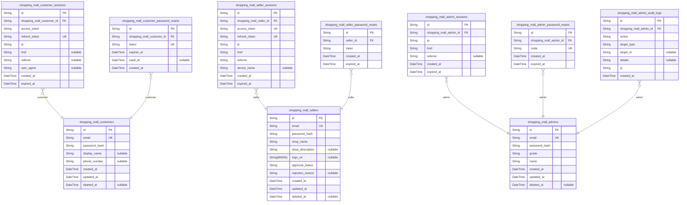
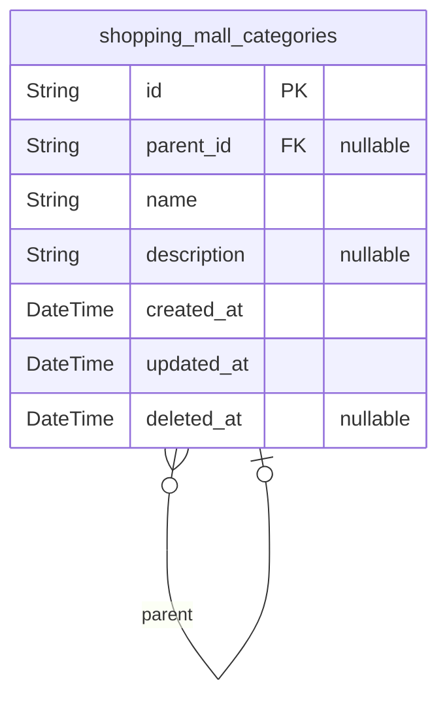
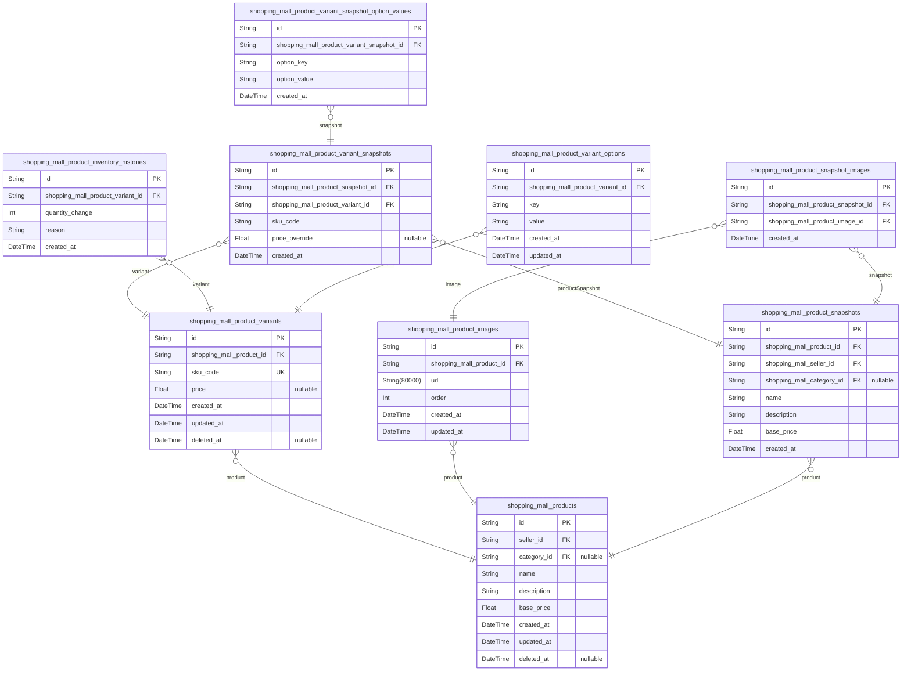
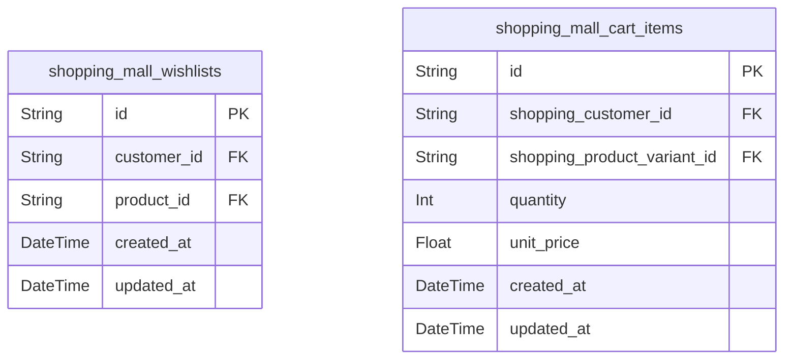
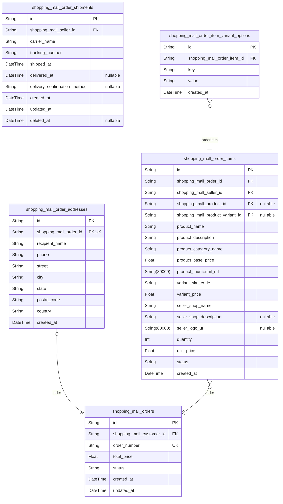
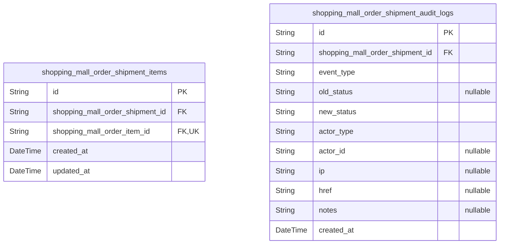
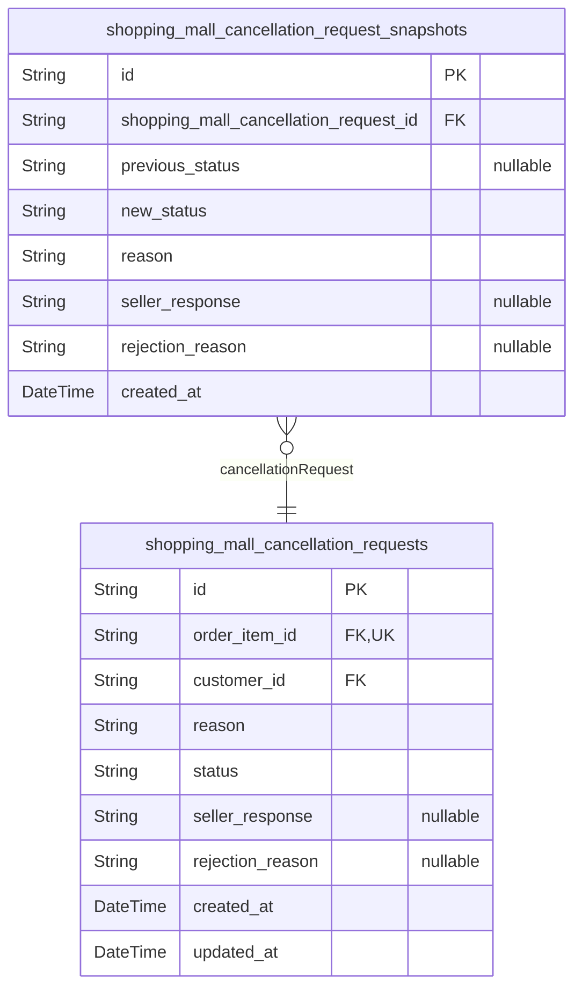
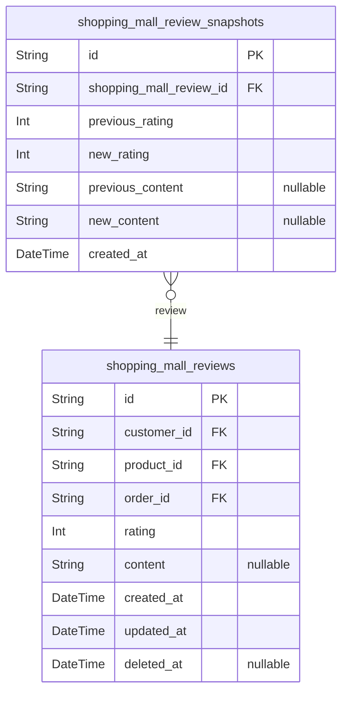

# Prisma Markdown

> Generated by [`prisma-markdown`](https://github.com/samchon/prisma-markdown)

- [Actors](#actors)
- [Categories](#categories)
- [Products](#products)
- [Shopping](#shopping)
- [Orders](#orders)
- [Shipments](#shipments)
- [Cancellations](#cancellations)
- [Reviews](#reviews)

## Actors

### `shopping_mall_customers`

Customer accounts for the e-commerce platform.

Represents registered buyers who can browse products, manage their
wishlist and cart, place orders, write reviews, and manage their profile
and addresses. Customers require authentication to access any platform
features.

**Account Management:**
- Registration requires unique email and password
- Profile contains optional display name and phone number
- Supports soft deletion where orders and reviews are preserved for legal
compliance
- When deleted, reviews display as "deleted user"

**Related Entities:**
- [shopping_mall_customer_sessions](#shopping_mall_customer_sessions) - Authentication sessions
- [shopping_mall_customer_password_resets](#shopping_mall_customer_password_resets) - Password recovery tokens

**Data Preservation:**
When a customer deletes their account:
- Profile information (display_name, phone_number) is deleted
- Orders are preserved for seller records
- Reviews are preserved and shown as "deleted user"

Properties as follows:

- `id`: Primary Key.
- `email`
  > Customer's email address used for authentication and communication. Must
  > be unique across all customer accounts.
- `password_hash`
  > Hashed password for authentication. Stored using bcrypt or similar strong
  > encryption algorithm.
- `display_name`
  > Customer's display name shown in reviews and order communications.
  > Optional profile information that is deleted when account is
  > soft-deleted.
- `phone_number`
  > Customer's phone number for delivery contacts and notifications. Optional
  > profile information that is deleted when account is soft-deleted.
- `created_at`: Timestamp when the customer account was created.
- `updated_at`: Timestamp when the customer account was last updated.
- `deleted_at`
  > Timestamp when the customer account was soft-deleted. When set, the
  > account is considered deleted but orders and reviews are preserved for
  > legal compliance. Null means the account is active.

### `shopping_mall_customer_sessions`

JWT session tokens for customer authentication supporting multi-device
login with device tracking. Each session stores access and refresh tokens
with expiration timestamps, connection metadata (IP, href, referrer), and
user agent for device identification. Sessions are created on login and
invalidated on logout or token expiration. Enables secure token refresh,
multi-device session management, and session revocation capabilities.

Properties as follows:

- `id`: Primary Key.
- `shopping_mall_customer_id`: Customer who owns this session. [shopping_mall_customers.id](#shopping_mall_customers)
- `access_token`
  > JWT access token for API authentication. Short-lived token (30-minute
  > expiration) used for authenticating API requests.
- `refresh_token`
  > JWT refresh token for obtaining new access tokens. Long-lived token
  > (14-day expiration) used to rotate access tokens without requiring
  > re-login.
- `ip`
  > IP address from which the customer logged in. Used for security auditing
  > and suspicious activity detection.
- `href`
  > URL or page where the login was initiated. Captures the application
  > context at login time.
- `referrer`
  > HTTP referrer header from the login request. Used for tracking login
  > source and security analysis.
- `user_agent`
  > Browser user agent string for device identification. Enables multi-device
  > session management and device recognition for security purposes.
- `created_at`
  > Timestamp when the session was created (login time). Used for session
  > listing and audit trail.
- `expired_at`
  > Expiration timestamp for the refresh token. Session becomes invalid after
  > this time and requires re-authentication.

### `shopping_mall_customer_password_resets`

Password reset tokens for customer email-based password recovery.
Contains unique token (hashed), expiration timestamp (typically 1 hour),
and usage tracking. Automatically invalidated after use or expiration.
When a customer successfully resets their password, all existing sessions
are invalidated for security.

Properties as follows:

- `id`: Primary Key.
- `shopping_mall_customer_id`
  > The customer who requested password reset. {@link
  > shopping_mall_customers.id}.
- `token`
  > Unique password reset token (hashed) sent to customer's registered email
  > address. Used to verify identity and authorize password change. Must be
  > unique across all reset requests.
- `expires_at`
  > Expiration timestamp for the reset token. Tokens typically expire after 1
  > hour for security. Expired tokens cannot be used for password reset.
- `used_at`
  > Timestamp when the reset token was used. Null if not yet used. Used to
  > prevent token reuse and track successful password resets.
- `created_at`
  > Timestamp when the reset request was created. Used for audit trail and
  > cleanup of old tokens.

### `shopping_mall_sellers`

Registered seller accounts with email/password credentials for
authentication, shop profile information, and approval status management.

Sellers operate as merchants on the platform after administrator
approval. Each seller maintains a shop profile (name, description, logo)
visible to customers. The approval workflow transitions seller accounts
through pending → approved/rejected/suspended states.

Account deletion is conditional: sellers cannot delete their account
while pending orders or cancellation/refund requests exist. Upon
deletion, products and inventory are removed while order history
preserves the shop name for legal compliance.

Related sessions are tracked in [shopping_mall_seller_sessions](#shopping_mall_seller_sessions) and
password resets in [shopping_mall_seller_password_resets](#shopping_mall_seller_password_resets).

Properties as follows:

- `id`: Primary Key.
- `email`
  > Unique email address used for seller login and authentication. Must be
  > unique across all seller accounts.
- `password_hash`
  > Bcrypt-hashed password for secure authentication. Stored as hashed value,
  > never in plain text.
- `shop_name`
  > Display name of the seller's shop visible to customers in product
  > listings and seller profile. Also preserved in order history after
  > account deletion.
- `shop_description`
  > Optional detailed description of the seller's shop, business, or
  > products. Displayed on seller profile page.
- `logo_url`
  > URL to the seller's shop logo image. Used in seller profile and product
  > listings for brand visibility.
- `approval_status`
  > Current approval status of the seller account. Valid values: 'pending'
  > (awaiting admin review), 'approved' (active seller), 'rejected' (denied
  > by admin), 'suspended' (temporarily blocked by admin).
- `rejection_reason`
  > Reason provided by administrator when rejecting a seller registration.
  > Only populated when approval_status is 'rejected'.
- `created_at`: Timestamp when the seller account was created (registration submitted).
- `updated_at`: Timestamp when the seller account was last modified.
- `deleted_at`
  > Timestamp when the seller account was soft-deleted. Null for active
  > accounts. Used for account deletion which is conditional on having no
  > pending orders or requests.

### `shopping_mall_seller_sessions`

JWT session tokens for seller authentication supporting multi-device
sessions with device tracking. Each session record contains access and
refresh tokens, device information, and connection metadata (IP, href,
referrer). Sessions are created upon successful seller login and expire
based on token lifecycle. Supports concurrent sessions across multiple
devices with individual session management.

Properties as follows:

- `id`: Primary Key.
- `shopping_mall_seller_id`: The seller who owns this session. [shopping_mall_sellers.id](#shopping_mall_sellers)
- `access_token`
  > JWT access token for seller authentication. Short-lived token (15-30
  > minutes expiration) used for API requests.
- `refresh_token`
  > JWT refresh token for obtaining new access tokens. Long-lived token (7-30
  > days expiration) used to refresh authentication without re-login.
- `ip`
  > IP address from which the seller logged in. Used for security auditing
  > and session tracking.
- `href`
  > Full URL path of the page from which login was initiated. Used for
  > security tracking and session context.
- `referrer`
  > HTTP referrer header value from the login request. Used for security
  > auditing and session origin tracking.
- `device_name`
  > Human-readable name or identifier of the device used for login. Enables
  > seller to identify and manage their active sessions across devices.
- `created_at`: Timestamp when the session was created (seller logged in).
- `expired_at`
  > Timestamp when the session expires. Based on refresh token expiration
  > time. Session is invalid after this time.

### `shopping_mall_seller_password_resets`

Password reset tokens for seller accounts enabling email-based password
recovery. Each record contains a hashed reset token linked to a specific
seller, with creation and expiration timestamps for security validation.
Tokens are automatically invalidated after expiration (typically 15-30
minutes) and can be used only once for password reset verification.
Supports the seller authentication workflow as a subsidiary entity to the
[shopping_mall_sellers](#shopping_mall_sellers) actor table.

Properties as follows:

- `id`: Primary Key.
- `seller_id`
  > Reference to the seller account requesting password reset. {@link
  > shopping_mall_sellers.id}
- `token`
  > Hashed password reset token used for verification. Contains a securely
  > hashed random code that is sent to the seller's email address. Must be
  > verified before allowing password reset completion.
- `created_at`
  > Timestamp when the password reset request was created. Used for audit
  > trail and rate limiting purposes.
- `expired_at`
  > Expiration timestamp for the reset token. Tokens become invalid after
  > this time for security purposes. Typically set to 15-30 minutes after
  > creation.

### `shopping_mall_admins`

Administrator accounts with email/password credentials and grade level
(regular/super) for elevated platform management permissions.

Administrators oversee platform operations including seller approvals,
category management, product oversight, order management, and user
moderation. Super administrators have additional capabilities to manage
other administrator accounts and cannot demote themselves.

Related entities:
- [shopping_mall_admin_sessions](#shopping_mall_admin_sessions) - Active login sessions for this
administrator
- [shopping_mall_admin_password_resets](#shopping_mall_admin_password_resets) - Password recovery tokens
- [shopping_mall_admin_audit_logs](#shopping_mall_admin_audit_logs) - Administrative action audit trail

Properties as follows:

- `id`: Primary Key.
- `email`
  > Administrator's email address used for authentication. Must be unique
  > across all administrator accounts.
- `password_hash`
  > Bcrypt-hashed password for secure authentication. Never stored in plain
  > text.
- `grade`
  > Administrator permission level. Valid values: "regular" (standard admin
  > capabilities) or "super" (can manage other admins, cannot be demoted by
  > self).
- `name`
  > Display name for the administrator. Used in admin panel and audit logs
  > for identification.
- `created_at`: Timestamp when the administrator account was created.
- `updated_at`: Timestamp when the administrator account was last modified.
- `deleted_at`
  > Timestamp when the administrator account was soft-deleted. Null for
  > active accounts.

### `shopping_mall_admin_sessions`

JWT session tokens for administrator authentication tracking login
sessions with connection context. Supports multi-device sessions with
device tracking via IP address, URL accessed, and referrer information.
Sessions have expiration timestamps for security. Links to
shopping_mall_admins actor for authentication flow.

Properties as follows:

- `id`: Primary Key.
- `shopping_mall_admin_id`: Administrator's [shopping_mall_admins.id](#shopping_mall_admins).
- `ip`: IP address from which the administrator logged in.
- `href`
  > URL accessed during login, capturing the entry point of the administrator
  > session.
- `referrer`
  > HTTP referrer header from the login request, indicating the source page
  > that referred to the login page.
- `created_at`: Timestamp when the session was created (login time).
- `expired_at`
  > Timestamp when the session expires. Required for security - all sessions
  > must have explicit expiration.

### `shopping_mall_admin_password_resets`

Password reset tokens for administrator email-based password recovery.

When an administrator requests a password reset, the system generates a
unique reset code
and stores it in this table with an expiration time. The administrator
receives the code
via email and can use it to reset their password within the validity period.

Each reset token is linked to a specific administrator account and
becomes invalid after
expiration or after being used. Multiple reset tokens can exist for the
same administrator
(e.g., if they request multiple resets), but typically only the most
recent one is valid.

Properties as follows:

- `id`: Primary Key.
- `shopping_mall_admin_id`
  > The administrator account this password reset token belongs to. {@link
  > shopping_mall_admins.id}
- `code`
  > Unique password reset code/token sent to the administrator's email. Used
  > to verify the reset request authenticity.
- `created_at`: Timestamp when the password reset request was created.
- `expired_at`
  > Timestamp when the reset token expires. After this time, the token is no
  > longer valid for password reset.

### `shopping_mall_admin_audit_logs`

Audit trail records of all administrative actions performed on the
platform for security compliance, accountability, and dispute resolution.

Each record captures which administrator performed what action, on which
target entity, at what time, from which IP address. Supports
investigation of administrative actions including seller approvals,
product removals, user bans, force-cancellations, and configuration
changes.

References the administrator who performed the action via {@link
shopping_mall_admins.id}. This table is append-only - records are never
modified or deleted to maintain complete audit history.

Properties as follows:

- `id`: Primary Key.
- `shopping_mall_admin_id`
  > The administrator who performed this action. References {@link
  > shopping_mall_admins.id}.
- `action`
  > Type of administrative action performed. Examples: 'seller_approve',
  > 'seller_reject', 'seller_suspend', 'product_delete',
  > 'order_force_cancel', 'order_force_refund', 'customer_ban',
  > 'customer_unban', 'category_create', 'category_update',
  > 'category_delete', 'admin_promote', 'admin_demote'.
- `target_type`
  > Category of the entity that was acted upon. Examples: 'seller',
  > 'customer', 'product', 'order', 'category', 'admin'. Used in conjunction
  > with target_id to identify the affected entity.
- `target_id`
  > UUID of the specific entity that was acted upon. References the ID of the
  > entity identified by target_type. Can be null for actions that don't
  > target a specific entity (e.g., system configuration changes).
- `details`
  > Additional contextual details about the action in JSON format. Stores
  > action-specific information such as rejection reasons, ban durations,
  > refund amounts, or other relevant metadata that varies by action type.
- `ip`
  > IP address from which the administrative action was performed. Used for
  > security auditing and detecting suspicious activity patterns.
- `created_at`: Timestamp when the administrative action was performed.

## Categories

### `shopping_mall_categories`

Product categories organized in a two-level hierarchy managed by
administrators. Parent categories have null parent_id while subcategories
reference their parent category via parent_id. Each category contains a
unique name (unique among siblings within the same parent) and an
optional description. Categories classify products for browsing and
search functionality. When deleted, products become uncategorized rather
than cascade deleted. The two-level hierarchy limit (category and
subcategory only) is enforced at the application layer.

Properties as follows:

- `id`: Primary Key.
- `parent_id`
  > Reference to parent category for subcategory hierarchy. Null for
  > top-level categories. Enables two-level category structure where
  > subcategories reference their parent category.
- `name`
  > Category name, unique among siblings within the same parent category.
  > Used for display and identification in product listings and navigation.
- `description`
  > Optional detailed description of the category purpose and scope. Helps
  > administrators and users understand category contents.
- `created_at`: Timestamp when the category was created by an administrator.
- `updated_at`: Timestamp when the category was last modified.
- `deleted_at`
  > Timestamp when the category was soft-deleted. Null for active categories.
  > Soft deletion preserves product references while removing category from
  > active listings.

## Products

### `shopping_mall_products`

Main product listings created by sellers, containing name, description,
category reference, base price, and soft-delete support.

Products are the primary sellable entities in the marketplace. Each
product belongs to exactly one seller and can optionally be assigned to a
category. Products support soft deletion to preserve order history
references and enable potential recovery.

Products require at least one variant with stock to be purchasable. When
a product is deleted, all variants and images are removed, but snapshots
are preserved for audit purposes.

Key relationships:
- [shopping_mall_sellers](#shopping_mall_sellers) - Seller who owns this product
- [shopping_mall_categories](#shopping_mall_categories) - Optional category assignment
- [shopping_mall_product_variants](#shopping_mall_product_variants) - SKU variants with pricing and
stock
- [shopping_mall_product_images](#shopping_mall_product_images) - Product images with ordering
- [shopping_mall_product_snapshots](#shopping_mall_product_snapshots) - Immutable state history

Properties as follows:

- `id`: Primary Key.
- `seller_id`
  > Seller who owns this product. Every product must have exactly one seller.
  > [shopping_mall_sellers.id](#shopping_mall_sellers)
- `category_id`
  > Category this product belongs to. Can be null if product is
  > uncategorized. Products become uncategorized when their category is
  > deleted. [shopping_mall_categories.id](#shopping_mall_categories)
- `name`
  > Product name displayed in listings and search results. Required field
  > that must be unique within the seller's products.
- `description`
  > Detailed product description explaining features, specifications, and
  > usage. Supports rich text formatting.
- `base_price`
  > Base price for the product in the platform's currency. Individual
  > variants can override this price. Must be a positive value.
- `created_at`: Timestamp when the product was created. Automatically set on creation.
- `updated_at`
  > Timestamp when the product was last updated. Automatically updated on any
  > modification.
- `deleted_at`
  > Timestamp when the product was soft-deleted. Null if product is active.
  > Preserves order history references when product is removed.

### `shopping_mall_product_variants`

Product variants/SKUs representing specific purchasable combinations of a
product. Each variant has a unique SKU code, optional price override from
the product's base price, and is linked to a parent product. Variant
options (such as color, size) are stored as normalized key-value pairs in
the child table shopping_mall_product_variant_options. Stock quantity is
tracked through inventory history records, not stored directly. Variants
cannot be deleted if pending orders or cancellation/refund requests
exist.

Properties as follows:

- `id`: Primary Key.
- `shopping_mall_product_id`: Product that this variant belongs to. [shopping_mall_products.id](#shopping_mall_products)
- `sku_code`
  > Unique SKU code identifying this variant. Must be unique across all
  > products in the system.
- `price`
  > Price override for this variant. If null, uses the parent product's base
  > price. Allows different pricing for different variant combinations.
- `created_at`: Timestamp when this variant was created.
- `updated_at`: Timestamp when this variant was last updated.
- `deleted_at`
  > Timestamp for soft delete. When set, variant is considered deleted but
  > preserved for order history and audit purposes. Cannot be deleted if
  > pending orders or requests exist.

### `shopping_mall_product_images`

Product images attached to products with ordering support for display
sequence management.

Each product can have multiple images, and the image with the lowest
order value (typically order=1) serves as the main/thumbnail image
displayed in product listings and search results. Images are managed
through their parent [shopping_mall_products](#shopping_mall_products) entity and are
deleted when the parent product is deleted.

When product images change (add, delete, reorder), the changes are
captured in [shopping_mall_product_snapshots](#shopping_mall_product_snapshots) for audit trail
purposes per the snapshot principle. Images support seller product
management workflows including upload, reordering, and deletion
operations.

Properties as follows:

- `id`: Primary Key.
- `shopping_mall_product_id`
  > Product to which this image belongs. References {@link
  > shopping_mall_products.id}.
- `url`
  > URL path to the image file. Stored as a URI pointing to the image
  > location in the storage system (e.g., CDN or object storage).
- `order`
  > Display order of the image within the product's image gallery. Lower
  > values appear first. The image with the lowest order value serves as the
  > main/thumbnail image for product listings and search results. Enables
  > drag-and-drop reordering functionality for sellers.
- `created_at`: Timestamp when the image was uploaded and attached to the product.
- `updated_at`
  > Timestamp when the image metadata (e.g., order) was last modified.
  > Updated when seller reorders images.

### `shopping_mall_product_snapshots`

Immutable product snapshots preserving complete product state at the
point-in-time of any product modification.

This table implements the snapshot principle for products, ensuring
complete audit trails for all product modifications. Each snapshot
captures the denormalized product fields including name, description,
base price, category reference, and seller reference at the moment of
creation or update.

The snapshot principle requires that:
- Snapshots are immutable and cannot be deleted
- Each snapshot records the complete state at a point in time
- Snapshots enable dispute resolution and historical tracking
- Even when products are deleted, snapshots are preserved

Variant states at snapshot time are captured separately in {@link
shopping_mall_product_variant_snapshots} and can be correlated via
shopping_mall_product_id and created_at timestamp.

Image states at snapshot time are captured separately in {@link
shopping_mall_product_snapshot_images} to maintain normalized structure
while preserving the complete product state including images.

Properties as follows:

- `id`: Primary Key.
- `shopping_mall_product_id`
  > Reference to the product being snapshotted. Points to {@link
  > shopping_mall_products.id}. Multiple snapshots exist for each product
  > over its lifecycle, creating a complete modification history.
- `shopping_mall_seller_id`
  > Seller who owned the product at snapshot time. Points to {@link
  > shopping_mall_sellers.id}. Enables efficient querying of a seller's
  > product modification history and preserves seller association even if
  > product is deleted.
- `shopping_mall_category_id`
  > Category the product belonged to at snapshot time. Points to {@link
  > shopping_mall_categories.id}. Preserves category assignment for
  > historical accuracy and audit purposes, enabling analysis of product
  > categorization over time.
- `name`
  > Product name at the time of snapshot. Stored denormalized to preserve
  > exact wording even if product is later modified or deleted. Used for
  > audit trails and dispute resolution.
- `description`
  > Product description at the time of snapshot. Stored denormalized to
  > preserve exact content including formatting and details at that point in
  > time.
- `base_price`
  > Base price of the product at snapshot time in the platform's currency.
  > Stored denormalized to track pricing history and enable price change
  > analysis. Actual selling price may vary by variant.
- `created_at`
  > Timestamp when this snapshot was created, marking the point-in-time of
  > the product modification. Used for chronological ordering and time-based
  > queries. Immutable once created.

### `shopping_mall_product_variant_snapshots`

Immutable snapshots preserving the complete state of product variants at
the point-in-time of product modification. Each snapshot captures the SKU
code and price override of a variant, enabling complete audit trails for
dispute resolution and version control.

Created automatically when a product is modified, these snapshots are
linked to a parent product snapshot via {@link
shopping_mall_product_snapshots.id}. The combination of product snapshot
and variant is unique, ensuring each variant's state is captured exactly
once per product modification event.

Option values are stored in a normalized child table {@link
shopping_mall_product_variant_snapshot_option_values} for proper
atomicity and queryability. Each option (e.g., color, size) is stored as
a separate key-value pair.

These snapshots serve as the authoritative historical record of variant
configurations, supporting compliance requirements and enabling sellers
and administrators to review the complete evolution of product variants
over time.

Properties as follows:

- `id`: Primary Key.
- `shopping_mall_product_snapshot_id`
  > The parent product snapshot this variant snapshot belongs to. Links to
  > [shopping_mall_product_snapshots.id](#shopping_mall_product_snapshots).
- `shopping_mall_product_variant_id`
  > The source variant whose state is captured in this snapshot. Links to
  > [shopping_mall_product_variants.id](#shopping_mall_product_variants).
- `sku_code`
  > The SKU code of the variant at the time of snapshot creation. Unique
  > identifier for inventory tracking.
- `price_override`
  > The variant's price override at the time of snapshot. Null if the variant
  > uses the product's base price. When present, this price takes precedence
  > over the product's base_price.
- `created_at`
  > Timestamp when this variant snapshot was created. Marks the point-in-time
  > when the variant state was captured.

### `shopping_mall_product_inventory_histories`

Inventory history records tracking stock level changes per product variant.

Each record represents a single stock movement with quantity change
(positive for restocks/refunds, negative for orders/adjustments), reason
for the change, and timestamp. Current stock for any variant is
calculated by summing all quantity_change values for that variant.

This is an append-only audit trail used for inventory tracking and
dispute resolution. Stock is never stored directly; it's always computed
from the sum of all history records.

**Change Types:**
- Positive: Restock, Cancellation refund, Refund return
- Negative: Order placement, Inventory adjustment/loss

**Related Entities:**
- [shopping_mall_product_variants](#shopping_mall_product_variants) - The variant whose stock is
being tracked

Properties as follows:

- `id`: Primary Key.
- `shopping_mall_product_variant_id`
  > Reference to the product variant whose inventory is being tracked. {@link
  > shopping_mall_product_variants.id}
- `quantity_change`
  > Quantity change in stock. Positive values indicate stock additions
  > (restock, cancellation refund, refund return). Negative values indicate
  > stock deductions (order placement, inventory adjustment/loss). Current
  > stock equals the sum of all history records for a variant.
- `reason`
  > Reason for the inventory change. Examples: 'restock', 'order',
  > 'adjustment', 'cancellation', 'refund', 'loss'. Provides audit trail
  > context for each stock movement.
- `created_at`
  > Timestamp when the inventory change occurred. Used for chronological
  > ordering of stock movements and audit trail purposes.

### `shopping_mall_product_variant_options`

Normalized key-value pairs for product variant options, enabling 1NF
compliance by decomposing complex option attributes into atomic units.

Each record represents a single attribute of a product variant (e.g.,
color="Red", size="Large"). This decomposition replaces JSON storage in
the parent variant table, enabling proper querying and filtering by
option type and value.

**Key Features:**
- One record per option attribute per variant
- Unique constraint ensures each variant has only one value per option key
- Supports arbitrary option types (color, size, material, etc.)
- Enables efficient filtering and searching by option values

**Relationships:**
- Belongs to [shopping_mall_product_variants](#shopping_mall_product_variants) (many options per
variant)
- Referenced when creating variant snapshots for order items

Properties as follows:

- `id`: Primary Key.
- `shopping_mall_product_variant_id`
  > The product variant this option belongs to. Links the key-value pair to
  > its parent variant for product configuration. {@link
  > shopping_mall_product_variants.id}
- `key`
  > The option attribute name (e.g., "color", "size", "material", "pattern").
  > Defines the category of the variant option. Used as the key in the
  > key-value pair structure.
- `value`
  > The option attribute value (e.g., "Red", "Large", "Cotton", "Striped").
  > The actual value for the specified option key. Subject to full-text
  > search for filtering products by option values.
- `created_at`
  > Timestamp when this variant option was created. Automatically set upon
  > record creation.
- `updated_at`
  > Timestamp when this variant option was last updated. Automatically
  > updated when the option value changes.

### `shopping_mall_product_snapshot_images`

Junction table linking product snapshots to product images, capturing
which images were attached to a product at the time of snapshot creation.

This table implements the snapshot principle requirement that product
snapshots include all fields including images. When a product snapshot is
created, all images attached to that product are linked through this
junction table, preserving the complete visual state of the product at
that moment.

Being a subsidiary entity, this table is managed through parent snapshot
operations and does not require independent API endpoints. The immutable
nature of snapshots means these image associations are never modified
after creation.

Properties as follows:

- `id`: Primary Key.
- `shopping_mall_product_snapshot_id`
  > The product snapshot to which this image belongs. References {@link
  > shopping_mall_product_snapshots.id}. Each snapshot can have multiple
  > images attached.
- `shopping_mall_product_image_id`
  > The product image linked to this snapshot. References {@link
  > shopping_mall_product_images.id}. Captures which specific images were
  > attached to the product at snapshot creation time.
- `created_at`
  > Timestamp when this image was linked to the product snapshot during
  > snapshot creation. Records the moment of association for audit purposes.

### `shopping_mall_product_variant_snapshot_option_values`

Normalized key-value pairs for variant snapshot option values, enabling
1NF-compliant storage of variant attributes at the point-in-time of
snapshot creation.

Each record represents a single atomic attribute of a product variant
(e.g., color='Red', size='Large') captured in a variant snapshot. This
decomposition replaces storing option_values as JSON or serialized
strings, enabling proper querying by option type and value for historical
analysis and inventory reporting.

This table is essential for the snapshot principle, ensuring that variant
option configurations at the time of purchase or modification are
preserved immutably for dispute resolution, order fulfillment
verification, and audit trail purposes.

Relationship: Multiple option values belong to a single {@link
shopping_mall_product_variant_snapshots} record, representing the
complete option configuration of that variant at the snapshot moment.

Properties as follows:

- `id`: Primary Key.
- `shopping_mall_product_variant_snapshot_id`
  > The variant snapshot to which this option value belongs. Each snapshot
  > can have multiple option values representing the complete variant
  > configuration. [shopping_mall_product_variant_snapshots.id](#shopping_mall_product_variant_snapshots)
- `option_key`
  > The type or category of the option attribute (e.g., 'color', 'size',
  > 'material', 'style'). Stored in lowercase for consistent querying. Used
  > for grouping and filtering variant options by category.
- `option_value`
  > The specific value for this option attribute (e.g., 'Red', 'Large',
  > 'Cotton', 'Vintage'). Preserves the exact value at the moment of snapshot
  > creation for historical accuracy and order verification.
- `created_at`
  > Timestamp when this option value record was created. Inherited from the
  > parent snapshot creation time for consistency.

## Shopping

### `shopping_mall_wishlists`

Customer wishlist entries tracking products at the product level (not
specific variants). Each entry links a customer to a product they are
interested in, enabling quick access and monitoring of desired items.

Supports a maximum of 200 products per customer (enforced in service
layer). Entries are automatically removed when the referenced product is
deleted by the seller. Unlike order items, wishlists track product-level
interest without variant specification or pricing information.

Relationships:
- Each wishlist entry belongs to exactly one [shopping_mall_customers](#shopping_mall_customers)
- Each wishlist entry references exactly one [shopping_mall_products](#shopping_mall_products)
- Unique constraint ensures one entry per customer-product pair

Properties as follows:

- `id`: Primary Key.
- `customer_id`
  > The customer who added this product to their wishlist. References {@link
  > shopping_mall_customers.id}.
- `product_id`
  > The product added to the wishlist. References {@link
  > shopping_mall_products.id}. Automatically removed when product is deleted
  > by seller.
- `created_at`: Timestamp when the product was added to the wishlist.
- `updated_at`: Timestamp of the last modification to the wishlist entry.

### `shopping_mall_cart_items`

Customer shopping cart items storing specific product variants with
quantities for purchase preparation.

Each cart item represents a single product variant (SKU) that a customer
intends to purchase. The unit_price field captures the variant's price at
the time of addition, enabling price change detection during checkout to
alert customers if prices have changed.

Business constraints enforced at service layer:
- Maximum 99 units per cart item
- Maximum 50 distinct variants per customer cart
- Automatic combination of duplicate variant additions (sum quantities)

Cart items are transient and removed upon successful order placement.
When variants are deleted or become out of stock, cart items are marked
as unavailable but preserved for customer visibility.

References [shopping_mall_customers](#shopping_mall_customers) for cart ownership and {@link
shopping_mall_product_variants} for the specific SKU being purchased.

Properties as follows:

- `id`: Primary Key.
- `shopping_customer_id`
  > The customer who owns this cart item. References {@link
  > shopping_mall_customers.id}.
- `shopping_product_variant_id`
  > The specific product variant (SKU) in the cart. References {@link
  > shopping_mall_product_variants.id}.
- `quantity`
  > Number of units of this variant in the cart. Maximum allowed is 99 units
  > per item. When the same variant is added multiple times, quantities are
  > combined into a single cart item.
- `unit_price`
  > Price per unit at the time the item was added to cart. Used to detect
  > price changes during checkout - if the current variant price differs from
  > this stored value, the customer is notified of the price change. Stored
  > as decimal for monetary precision.
- `created_at`
  > Timestamp when the cart item was first added. Used for cart item ordering
  > and pagination.
- `updated_at`: Timestamp when the cart item was last modified (quantity change, etc.).

## Orders

### `shopping_mall_orders`

Main order records representing completed transactions in the e-commerce
platform.

Each order is created after successful payment and contains multiple
order items from potentially different sellers. The order status is
derived from the statuses of its constituent items according to business
rules: 'paid' when all items are paid, 'shipped' when any item is
shipped, 'delivered' when all items are delivered, 'cancelled' when all
items are cancelled, 'refunded' when all items are refunded, and
'partially_completed' for mixed statuses.

Orders are preserved indefinitely for legal compliance and audit
purposes. The shipping address is captured in an immutable snapshot (via
[shopping_mall_order_addresses](#shopping_mall_order_addresses)) at the time of order placement.
Each order item maintains its own status and references
product/variant/seller snapshots from the purchase time.

References:
- Customer: [shopping_mall_customers.id](#shopping_mall_customers)
- Address snapshot: [shopping_mall_order_addresses](#shopping_mall_order_addresses)
- Order items: [shopping_mall_order_items](#shopping_mall_order_items)

Properties as follows:

- `id`: Primary Key.
- `shopping_mall_customer_id`
  > Customer who placed this order. References {@link
  > shopping_mall_customers.id}.
- `order_number`
  > Unique order identifier for customer reference and tracking.
  > Auto-generated in format like 'ORD-2024-001234'.
- `total_price`
  > Total price of the order calculated as the sum of all order item prices
  > (quantity × unit price). Stored as decimal for monetary precision.
- `status`
  > Derived order status computed from constituent order item statuses.
  > Values: 'paid' (all items paid), 'shipped' (any item shipped),
  > 'delivered' (all items delivered), 'cancelled' (all items cancelled),
  > 'refunded' (all items refunded), 'partially_completed' (mixed statuses).
- `created_at`: Timestamp when the order was created after successful payment.
- `updated_at`
  > Timestamp when the order was last updated, such as when order item
  > statuses changed.

### `shopping_mall_order_addresses`

Immutable shipping address snapshots captured at order placement time for
legal compliance and audit trail purposes.

Each address record preserves the complete shipping information exactly
as it was when the customer placed the order, ensuring that historical
orders maintain accurate delivery records even if customers modify or
delete addresses from their address book.

Contains recipient name, phone number, street address, city,
state/province, postal code, and country. Records are append-only and
never modified after creation to maintain data integrity for dispute
resolution and legal compliance.

References [shopping_mall_orders](#shopping_mall_orders) via unique foreign key,
establishing a one-to-one relationship where each order has exactly one
shipping address snapshot.

Properties as follows:

- `id`: Primary Key.
- `shopping_mall_order_id`
  > Reference to the order this shipping address belongs to. Each order has
  > exactly one shipping address snapshot. [shopping_mall_orders.id](#shopping_mall_orders)
- `recipient_name`
  > Full name of the person designated to receive the shipment at the
  > delivery address.
- `phone`
  > Contact phone number for the recipient, used for delivery coordination
  > and shipping notifications.
- `street`: Street address including house/apartment number for the delivery location.
- `city`: City or locality name for the delivery address.
- `state`: State, province, or administrative region for the delivery address.
- `postal_code`: Postal or ZIP code for the delivery address.
- `country`: Country name or ISO country code for the delivery address.
- `created_at`
  > Timestamp when this shipping address snapshot was created at order
  > placement. Immutable - no updated_at field as records are never modified.

### `shopping_mall_order_items`

Individual order items representing specific product variants purchased
by customers. Each item maintains independent status tracking (paid,
shipped, delivered, cancelled, refunded) enabling item-level
cancellation/refund and multi-seller order handling. Contains complete
snapshot data for product, variant, and seller at time of purchase for
historical accuracy and dispute resolution. References the parent {@link
shopping_mall_orders} and the selling [shopping_mall_sellers](#shopping_mall_sellers).
Product and variant references may become null if source entities are
deleted, but snapshot data is preserved for order history integrity.

Properties as follows:

- `id`: Primary Key.
- `shopping_mall_order_id`
  > The order this item belongs to. References {@link
  > shopping_mall_orders.id}.
- `shopping_mall_seller_id`
  > The seller who sold this item. References {@link
  > shopping_mall_sellers.id}.
- `shopping_mall_product_id`
  > The original product at time of purchase. May be null if product is
  > deleted. References [shopping_mall_products.id](#shopping_mall_products).
- `shopping_mall_product_variant_id`
  > The original variant at time of purchase. May be null if variant is
  > deleted. References [shopping_mall_product_variants.id](#shopping_mall_product_variants).
- `product_name`
  > Product name at time of purchase. Snapshot value preserved for historical
  > accuracy even if product is later edited or deleted.
- `product_description`
  > Product description at time of purchase. Snapshot value preserved for
  > historical accuracy.
- `product_category_name`
  > Product category name at time of purchase. Snapshot value for order
  > history display.
- `product_base_price`
  > Product base price at time of purchase. Snapshot value preserved for
  > price dispute resolution.
- `product_thumbnail_url`
  > Product main image URL at time of purchase. Snapshot value for order
  > history display.
- `variant_sku_code`
  > Variant SKU code at time of purchase. Unique identifier for the specific
  > product configuration.
- `variant_price`
  > Variant price at time of purchase (may override product base price).
  > Snapshot value preserved for historical accuracy.
- `seller_shop_name`
  > Seller shop name at time of purchase. Snapshot value preserved for order
  > history even if seller profile is later edited or account is deleted.
- `seller_shop_description`
  > Seller shop description at time of purchase. Snapshot value for
  > historical accuracy.
- `seller_logo_url`
  > Seller logo image URL at time of purchase. Snapshot value for order
  > history display.
- `quantity`
  > Number of units purchased for this variant. Multiple quantities of the
  > same variant are combined into a single order item.
- `unit_price`
  > Price per unit at time of purchase. Derived from variant price or product
  > base price. Total for this item = quantity * unit_price.
- `status`
  > Current status of this order item. Valid values: 'paid' (awaiting
  > shipment), 'shipped' (in transit), 'delivered' (received by customer),
  > 'cancelled' (cancelled before shipping), 'refunded' (refunded after
  > delivery). Each item has independent status enabling item-level
  > operations.
- `created_at`
  > Timestamp when this order item was created. Set at order placement time
  > and immutable thereafter.

### `shopping_mall_order_shipments`

Shipment records created by sellers containing carrier information,
tracking details, and delivery confirmation data. Each shipment bundles
one or more order items from the same seller into a single package with
one tracking number. Created when seller ships items, triggering status
change to 'shipped' for all included order items. Delivery confirmation
can be manual (customer confirms) or automatic (14 days after shipment).

Properties as follows:

- `id`: Primary Key.
- `shopping_mall_seller_id`
  > Seller who created and shipped this package. {@link
  > shopping_mall_sellers.id}
- `carrier_name`: Name of the shipping carrier (e.g., 'FedEx', 'UPS', 'Korea Post').
- `tracking_number`: Tracking number provided by the carrier for shipment tracking.
- `shipped_at`: Timestamp when the shipment was created and items were shipped.
- `delivered_at`
  > Timestamp when delivery was confirmed (either by customer manually or
  > automatically after 14 days). Null until delivery is confirmed.
- `delivery_confirmation_method`
  > Method of delivery confirmation: 'manual' for customer-initiated, 'auto'
  > for automatic confirmation after 14 days. Null until delivery is
  > confirmed.
- `created_at`: Timestamp when the shipment record was created.
- `updated_at`: Timestamp when the shipment record was last updated.
- `deleted_at`: Timestamp for soft deletion. Null if shipment is active.

### `shopping_mall_order_item_variant_options`

Normalized key-value pairs capturing variant option values for order
items at the point of purchase.

Each record stores a single option attribute (e.g., key='color',
value='red') as an atomic unit, enabling proper 1NF compliance by
avoiding JSON or serialized string storage in the parent order item
table. This decomposition allows efficient querying by option type and
value, and preserves the exact variant configuration that the customer
purchased.

Created automatically when an order is placed, copying the option values
from the selected product variant. Part of the snapshot principle
implementation ensuring complete audit trails for dispute resolution.

References [shopping_mall_order_items.id](#shopping_mall_order_items) as the parent entity.

Properties as follows:

- `id`: Primary Key.
- `shopping_mall_order_item_id`
  > The order item for which this variant option was captured. References
  > [shopping_mall_order_items.id](#shopping_mall_order_items).
- `key`
  > The option attribute name (e.g., 'color', 'size', 'material'). Represents
  > the type of variant option being specified.
- `value`
  > The option attribute value (e.g., 'Red', 'Large', 'Cotton'). The specific
  > choice for this variant option.
- `created_at`
  > Timestamp when this variant option record was created. Set automatically
  > when the order is placed.

## Shipments

### `shopping_mall_order_shipment_items`

Junction table linking order shipments to order items, enabling sellers
to bundle multiple items from the same seller into a single shipment with
one tracking number.

This table implements the many-to-one relationship between shipments and
order items, where:
- A shipment can contain multiple order items (same seller bundling)
- An order item can belong to exactly one shipment (unique constraint)

When a seller creates a shipment and selects order items to ship, records
are created in this junction table. The shipment's carrier name and
tracking number apply to all bundled items.

Relationships:
- References [shopping_mall_order_shipments](#shopping_mall_order_shipments) for the shipment record
- References [shopping_mall_order_items](#shopping_mall_order_items) for the individual order
items

The unique constraint on order_item_id ensures each order item is shipped
exactly once, preventing duplicate shipment assignments.

Properties as follows:

- `id`: Primary Key.
- `shopping_mall_order_shipment_id`
  > Reference to the shipment that contains this order item. Links to {@link
  > shopping_mall_order_shipments.id} to associate the order item with
  > carrier and tracking information.
- `shopping_mall_order_item_id`
  > Reference to the order item being shipped. Links to {@link
  > shopping_mall_order_items.id}. Unique constraint ensures each order item
  > can only be assigned to one shipment.
- `created_at`
  > Timestamp when the order item was assigned to this shipment. Records the
  > moment the seller included this item in the shipment.
- `updated_at`
  > Timestamp when this shipment item assignment was last modified. Typically
  > matches created_at as assignments are usually not modified after
  > creation.

### `shopping_mall_order_shipment_audit_logs`

Immutable audit trail for shipment lifecycle events capturing creation,
status transitions, delivery confirmations (both manual by customer and
automatic after 14 days), and administrative interventions. Each log
entry records the event type, previous and new status, responsible actor
(seller, customer, admin, or system), connection context (IP, URL), and
timestamp. Provides complete traceability for dispute resolution and
compliance. References [shopping_mall_order_shipments](#shopping_mall_order_shipments) for shipment
association.

Properties as follows:

- `id`: Primary Key.
- `shopping_mall_order_shipment_id`
  > Reference to the shipment being audited. {@link
  > shopping_mall_order_shipments.id}.
- `event_type`
  > Type of shipment lifecycle event. Values: 'created' (shipment created by
  > seller), 'status_changed' (manual status update), 'delivered_manually'
  > (customer confirmed delivery), 'delivered_auto' (automatic delivery after
  > 14 days), 'admin_override' (administrator intervention).
- `old_status`
  > Previous shipment status before the event. Null for 'created' events
  > which have no prior state. Values: 'preparing', 'shipped', 'delivered'.
- `new_status`
  > New shipment status after the event. Values: 'preparing' (initial),
  > 'shipped' (carrier has package), 'delivered' (received by customer).
- `actor_type`
  > Type of actor who performed the action. Values: 'seller' (merchant
  > shipping items), 'customer' (buyer confirming delivery), 'admin'
  > (administrator override), 'system' (automatic process for 14-day
  > delivery).
- `actor_id`
  > UUID of the actor who performed the action. References
  > shopping_mall_sellers.id, shopping_mall_customers.id, or
  > shopping_mall_admins.id based on actor_type. Null for 'system' actor
  > type.
- `ip`
  > IP address of the client that triggered the event. Used for security
  > audit and fraud detection. Null for system-triggered events.
- `href`
  > URL path of the API endpoint that triggered the event. Provides context
  > for understanding which operation caused the status change. Null for
  > system-triggered events.
- `notes`
  > Optional additional context or reason for the event. Used for admin
  > override explanations, automatic delivery confirmation details, or other
  > relevant information.
- `created_at`
  > Timestamp when the audit log entry was created. Represents the exact
  > moment the shipment event occurred. Used for chronological ordering and
  > time-based analysis.

## Cancellations

### `shopping_mall_cancellation_requests`

Customer-initiated cancellation requests for order items with 'paid' status.

Customers can request cancellation for order items that have not yet been
shipped (status: paid). Each request captures the customer's reason,
tracks the approval workflow through pending/approved/rejected statuses,
and records seller responses including rejection reasons when applicable.

Key relationships:
- References [shopping_mall_order_items.id](#shopping_mall_order_items) for the item being
cancelled (1:1 - one request per item)
- References [shopping_mall_customers.id](#shopping_mall_customers) for the requesting customer
- Seller context is derived through the order item's seller association

Business rules:
- Only order items with 'paid' status can have cancellation requests
- Approved cancellations trigger automatic refund and stock restoration
- All state changes are captured in {@link
shopping_mall_cancellation_request_snapshots} for audit

Properties as follows:

- `id`: Primary Key.
- `order_item_id`
  > The order item being cancelled. References {@link
  > shopping_mall_order_items.id}. Only one cancellation request allowed per
  > order item.
- `customer_id`
  > The customer who initiated the cancellation request. References {@link
  > shopping_mall_customers.id}.
- `reason`: Customer's explanation for why they want to cancel this order item.
- `status`
  > Current state of the cancellation request: pending (awaiting seller
  > review), approved (seller accepted, refund initiated), or rejected
  > (seller declined with reason provided).
- `seller_response`
  > Seller's response message when approving or rejecting the request.
  > Optional additional context from the seller.
- `rejection_reason`
  > Reason provided by seller when rejecting the cancellation request.
  > Required when status is 'rejected'.
- `created_at`: Timestamp when the cancellation request was created.
- `updated_at`
  > Timestamp when the cancellation request was last modified (status change,
  > seller response, etc.).

### `shopping_mall_cancellation_request_snapshots`

Immutable snapshots preserving complete state of cancellation requests at
each stage of their lifecycle. Created automatically when a cancellation
request is submitted and when a seller responds (approve/reject). Records
the transition from previous status to new status, along with the
customer's reason for cancellation, seller's response, and rejection
reason if applicable. Provides complete audit trail for dispute
resolution and legal compliance as required by the snapshot principle.
Each snapshot represents a single state transition and cannot be modified
or deleted.

Related to [shopping_mall_cancellation_requests](#shopping_mall_cancellation_requests) for the parent
cancellation request entity.

Properties as follows:

- `id`: Primary Key.
- `shopping_mall_cancellation_request_id`
  > The cancellation request this snapshot captures. {@link
  > shopping_mall_cancellation_requests.id}
- `previous_status`
  > The status of the cancellation request before this state change. Null for
  > initial submission snapshots.
- `new_status`
  > The status of the cancellation request after this state change. Values:
  > 'pending' for initial submission, 'approved' when seller approves,
  > 'rejected' when seller rejects.
- `reason`
  > Customer's explanation for why they want to cancel the order item.
  > Captured at the time of snapshot creation to preserve the exact wording.
- `seller_response`
  > Seller's response or explanation when approving or rejecting the
  > cancellation request. Null for initial submission snapshots, populated
  > when seller responds.
- `rejection_reason`
  > Seller's explanation for rejecting the cancellation request. Null for
  > approved or pending statuses, populated only when seller rejects the
  > request.
- `created_at`
  > Timestamp when this snapshot was created, representing when the state
  > transition occurred.

## Reviews

### `shopping_mall_reviews`

Customer reviews and ratings for purchased products, containing rating
(1-5 stars), optional text content, and references to customer, product,
and order for purchase verification.

Supports soft delete to preserve reviews when customers delete accounts,
displaying as 'deleted user' while maintaining review content for product
rating calculations. Enforces one review per product per order constraint
to prevent duplicate reviews.

Reviews can only be written for delivered order items. When customers
edit their reviews, snapshots are created separately in {@link
shopping_mall_review_snapshots} for audit trails and dispute resolution.

Properties as follows:

- `id`: Primary Key.
- `customer_id`
  > Customer who wrote this review. Referenced as 'deleted user' when
  > customer account is deleted. References {@link
  > shopping_mall_customers.id}.
- `product_id`
  > Product being reviewed. Used for product-level rating calculation and
  > filtering. References [shopping_mall_products.id](#shopping_mall_products).
- `order_id`
  > Order through which the product was purchased. Used for purchase
  > verification and enforcing one-review-per-product-per-order constraint.
  > References [shopping_mall_orders.id](#shopping_mall_orders).
- `rating`
  > Rating value from 1 to 5 stars. Required for all reviews. Used to
  > calculate product average rating.
- `content`
  > Optional text content of the review. Supports full-text search via GIN
  > index. Maximum 2000 characters.
- `created_at`: Timestamp when the review was created.
- `updated_at`
  > Timestamp when the review was last updated. Used for snapshot creation
  > triggers.
- `deleted_at`
  > Soft delete timestamp. When set, review is hidden from display but
  > preserved for rating calculations and audit. Used when customer deletes
  > account - review displays as 'deleted user'.

### `shopping_mall_review_snapshots`

Immutable snapshot records of review edits preserving previous and new
rating values and text content. Created automatically when customers
modify their reviews to maintain complete edit history for dispute
resolution and audit purposes.

Each snapshot captures the state transition from previous to new values,
recording when the change occurred and what values changed. Snapshots are
never deleted even if the parent review is soft-deleted, ensuring
permanent audit trails for the snapshot principle.

Supports the platform's financial accountability model where customer
feedback disputes may require historical evidence of what was originally
written versus current state.

Properties as follows:

- `id`: Primary Key.
- `shopping_mall_review_id`: The review that was edited. References [shopping_mall_reviews.id](#shopping_mall_reviews).
- `previous_rating`
  > The rating value (1-5 stars) before this edit was made. Captures the
  > previous state for audit comparison.
- `new_rating`
  > The rating value (1-5 stars) after this edit was made. Captures the new
  > state for audit comparison.
- `previous_content`
  > The text content before this edit was made. Null if the review had no
  > text content originally.
- `new_content`
  > The text content after this edit was made. Null if the customer removed
  > all text content.
- `created_at`
  > Timestamp when this snapshot was created, coinciding with when the review
  > edit was submitted.
