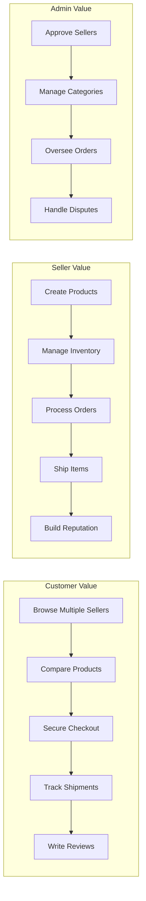
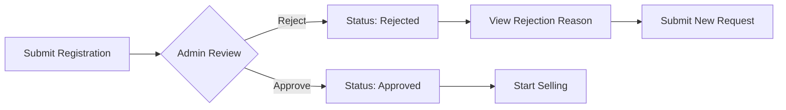
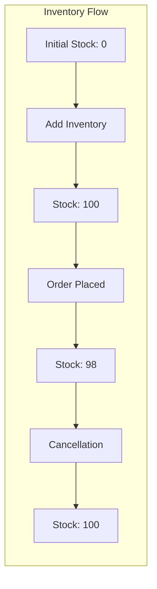
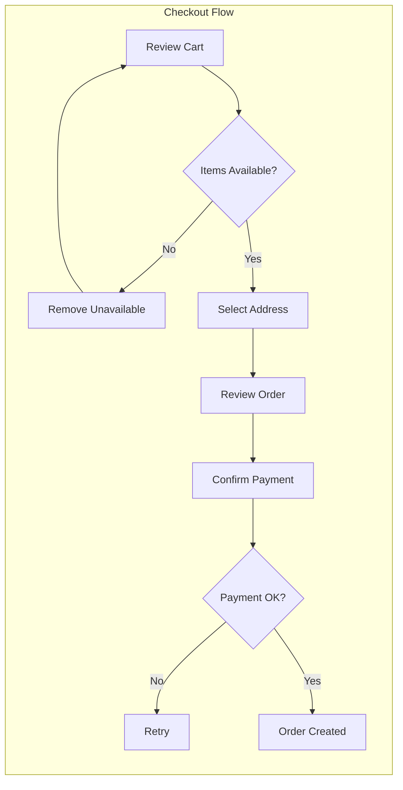
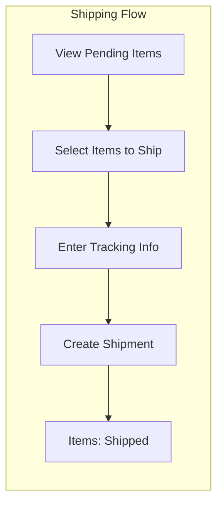
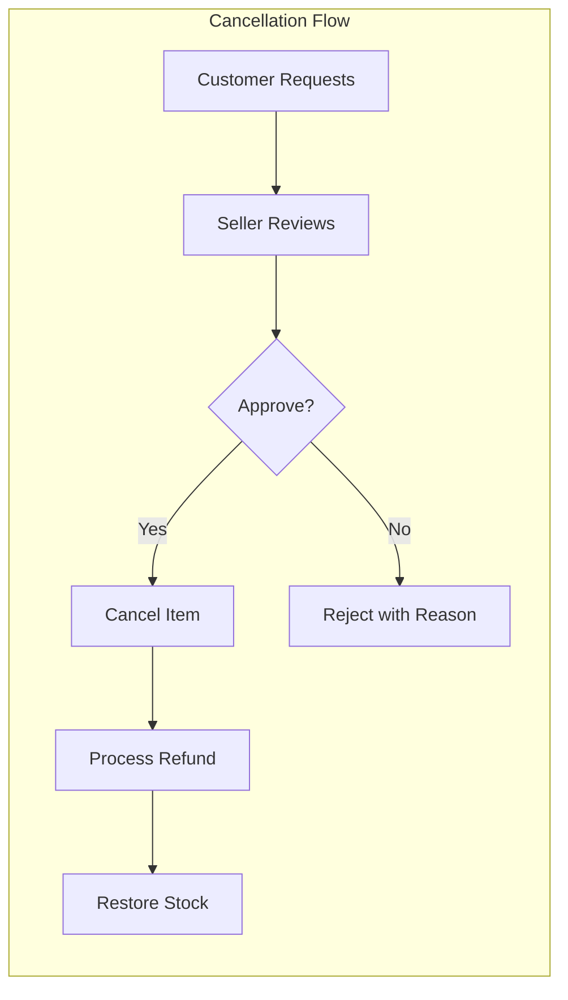
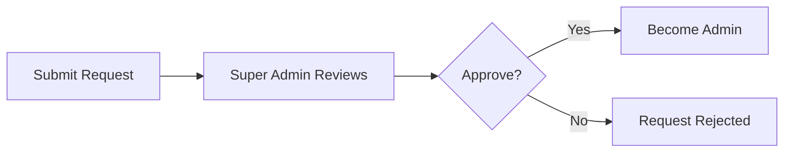
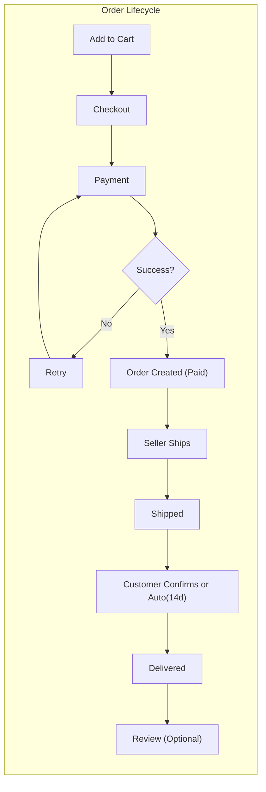
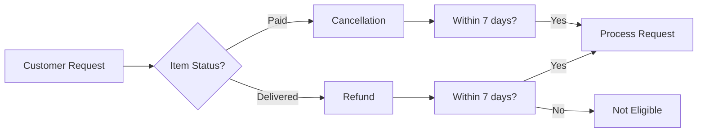

# E-Commerce Shopping Mall Platform - Requirements Analysis Report

## Executive Summary

This requirements analysis provides a comprehensive specification for the Shopping Mall e-commerce platform. The platform is a multi-sided marketplace connecting sellers and customers with full administrative oversight. It operates on a strict authentication-first model where all features require user registration, and implements a robust snapshot principle ensuring complete audit trails for all financial transactions.

### Key Platform Characteristics

- **Multi-actor ecosystem**: Customers, Sellers, and Administrators with distinct capabilities
- **Financial accountability**: Every monetary transaction and data modification is tracked via immutable snapshots
- **Seller approval workflow**: Administrators must approve sellers before they can operate
- **Item-level order management**: Cancellations and refunds operate at the order-item level, not order level
- **Data preservation**: Critical data (orders, reviews, seller information) is preserved even after account deletion for legal and audit purposes

---

## 1. Service Overview

### 1.1 Business Model

#### Why This Service Exists

The e-commerce shopping mall platform addresses the growing need for a trustworthy online marketplace where:
- **Customers** can discover, purchase, and review products from multiple sellers with confidence
- **Sellers** can establish their online presence and manage their business with full inventory and order control
- **Administrators** can maintain platform quality through seller vetting and oversight

The platform differentiates itself through:
1. **Comprehensive audit trails** via the snapshot principle, ensuring dispute resolution capability
2. **Seller accountability** through mandatory approval processes
3. **Data integrity** by preserving transaction history even when accounts are deleted

#### Revenue Strategy

The platform operates as a marketplace facilitator with potential revenue streams:
- **Commission fees** on successful transactions
- **Premium seller subscriptions** for enhanced visibility
- **Featured product placements** in search results

#### Success Metrics

- **Monthly Active Users (MAU)**: Customer engagement measurement
- **Seller Acquisition Rate**: Growth of approved sellers
- **Order Completion Rate**: Successful transaction percentage
- **Average Order Value (AOV)**: Revenue optimization indicator
- **Customer Retention Rate**: Repeat purchase behavior
- **Seller Satisfaction Score**: Platform health from merchant perspective

### 1.2 Core Value Proposition

---

## 2. User Actors and Authentication

### 2.1 Actor Definitions

#### Customer
- **Role**: Registered buyer on the platform
- **Authentication**: Required before accessing any platform features (no guest browsing)
- **Capabilities**: Browse products, manage wishlist and cart, place orders, write reviews, manage profile and addresses
- **Account Deletion**: Orders and reviews are preserved; profile information is deleted; reviews display as "deleted user"

#### Seller
- **Role**: Registered merchant selling products on the platform
- **Authentication**: Required; additionally requires administrator approval before selling
- **Capabilities**: Create and manage products, handle inventory, process shipments, respond to cancellation/refund requests
- **Account Deletion**: Conditional - no pending orders or requests; products deleted; shop name preserved in order history

#### Administrator
- **Role**: Platform overseer with elevated permissions
- **Grades**: Regular Administrator and Super Administrator
- **Capabilities**: Approve/reject sellers, manage categories, oversee all products and orders, ban users, force-cancel/refund orders
- **Hierarchy**: Super Administrators can promote/demote other administrators

### 2.2 Authentication Requirements

#### Registration Process

**For Customers:**
1. WHEN a new customer registers, THE system SHALL require email and password
2. WHEN registration is submitted, THE system SHALL validate email uniqueness
3. WHEN registration succeeds, THE system SHALL create a customer account

**For Sellers:**
1. WHEN a new seller registers, THE system SHALL require email and password
2. WHEN registration is submitted, THE system SHALL create a seller account with status "pending"
3. WHILE a seller account is pending, THE seller SHALL NOT be able to create products or sell
4. WHEN an administrator approves a seller, THE system SHALL change seller status to "approved"
5. WHEN an administrator rejects a seller, THE system SHALL record the rejection reason

#### Login and Session Management

1. WHEN a user submits login credentials, THE system SHALL validate email and password
2. WHEN credentials are valid, THE system SHALL create a session using JWT (JSON Web Token)
3. THE system SHALL include userId, role, and permissions in the JWT payload
4. WHEN a user requests a password change, THE system SHALL verify the current password and update to the new password
5. WHEN a user logs out, THE system SHALL terminate the session

#### Token Specifications

- **Access Token**: 15-30 minutes expiration
- **Refresh Token**: 7-30 days expiration
- **Storage**: localStorage or httpOnly cookie

### 2.3 Permission Matrix

| Action | Customer | Seller | Admin | Super Admin |
|--------|----------|--------|-------|-------------|
| Browse Products | ✅ | ✅ | ✅ | ✅ |
| Purchase Products | ✅ | ✅ | ✅ | ✅ |
| Create Products | ❌ | ✅* | ❌ | ❌ |
| Manage Own Products | ❌ | ✅ | ❌ | ❌ |
| Manage All Products | ❌ | ❌ | ✅ | ✅ |
| Approve Sellers | ❌ | ❌ | ✅ | ✅ |
| Manage Categories | ❌ | ❌ | ✅ | ✅ |
| Ban Users | ❌ | ❌ | ✅ | ✅ |
| Force Cancel/Refund | ❌ | ❌ | ✅ | ✅ |
| Manage Admins | ❌ | ❌ | ❌ | ✅ |

*Requires administrator approval

---

## 3. Customer Feature Requirements

### 3.1 Customer Account Management

#### Account Creation

1. WHEN a customer signs up, THE system SHALL require email and password
2. WHEN a customer attempts to register with an existing email, THE system SHALL reject the registration with an appropriate error
3. WHEN a customer account is created, THE system SHALL create an empty profile

#### Password Management

1. WHEN a customer requests a password change, THE system SHALL verify the current password
2. WHEN the current password is verified, THE system SHALL update to the new password
3. WHEN a customer forgets their password, THE system SHALL provide a password reset mechanism via email

#### Account Deletion

1. WHEN a customer deletes their account, THE system SHALL delete all profile information (display name, phone number)
2. WHEN a customer deletes their account, THE system SHALL delete all shipping addresses
3. WHEN a customer deletes their account, THE system SHALL delete all wishlist entries
4. WHEN a customer deletes their account, THE system SHALL preserve all order history
5. WHEN a customer deletes their account, THE system SHALL preserve all reviews with display changed to "deleted user"

### 3.2 Profile Management

1. THE system SHALL maintain a customer profile containing:
   - Display name
   - Phone number
2. WHEN a customer updates their profile, THE system SHALL save the changes immediately
3. THE system SHALL allow customers to update display name independently
4. THE system SHALL allow customers to update phone number independently

### 3.3 Address Management

#### Address Structure

Each shipping address SHALL contain:
- Recipient name
- Phone number
- Street address
- City
- State/Province
- Postal code
- Country

#### Address Operations

1. WHEN a customer adds a new address, THE system SHALL create an address record linked to the customer
2. WHEN a customer edits an address, THE system SHALL update the address details
3. WHEN a customer deletes an address, THE system SHALL remove the address record
4. WHEN a customer sets an address as default, THE system SHALL mark it as the primary shipping address
5. WHEN a customer has multiple addresses, THE system SHALL allow exactly one default address

### 3.4 Wishlist Functionality

1. WHEN a customer adds a product to wishlist, THE system SHALL create a wishlist entry
2. WHEN a customer views their wishlist, THE system SHALL display paginated products
3. WHEN a customer removes a product from wishlist, THE system SHALL delete the wishlist entry
4. WHEN a product is deleted by a seller, THE system SHALL automatically remove it from all wishlists
5. THE wishlist SHALL display product information, not specific variants

### 3.5 Shopping Cart Operations

#### Cart Structure

1. THE cart SHALL contain specific product variants (not just products)
2. WHEN a customer adds a variant to cart, THE system SHALL require quantity specification
3. WHEN a customer adds the same variant again, THE system SHALL combine quantities

#### Cart Display

THE cart SHALL display for each item:
- Product name
- Variant options
- Price
- Quantity
- Subtotal

THE cart SHALL display:
- Total price of all items
- Stock warnings for insufficient quantity
- Unavailable indicators for deleted or out-of-stock variants

#### Cart Operations

1. WHEN a customer changes item quantity, THE system SHALL update the cart
2. WHEN a customer removes an item, THE system SHALL delete the cart entry
3. WHEN a variant is deleted or becomes out of stock, THE system SHALL mark the cart item as unavailable
4. WHEN checkout is initiated, THE system SHALL prevent checkout of unavailable items

---

## 4. Seller Feature Requirements

### 4.1 Seller Registration and Approval

#### Registration Process

1. WHEN a seller registers, THE system SHALL create an account with status "pending"
2. WHILE a seller account is pending, THE system SHALL prevent product creation and selling
3. WHEN an administrator approves a seller, THE system SHALL change status to "approved"
4. WHEN an administrator rejects a seller, THE system SHALL change status to "rejected" and record the reason
5. WHEN a rejected seller views their status, THE system SHALL display the rejection reason
6. WHEN a rejected seller submits a new request, THE system SHALL reset status to "pending"

### 4.2 Shop Profile Management

#### Profile Structure

Each seller profile SHALL contain:
- Shop name
- Shop description
- Logo image

#### Profile Operations

1. WHEN a seller edits their profile, THE system SHALL update the profile information
2. WHEN a seller updates their profile, THE system SHALL create a snapshot of the previous state
3. WHEN a customer views a seller profile, THE system SHALL display shop name, description, and logo

### 4.3 Seller Dashboard

THE dashboard SHALL display:
- Total number of products
- Total number of order items (for their products)
- Number of pending cancellation requests
- Number of pending refund requests

THE system SHALL allow sellers to:
- View a list of all order items for their products
- Filter order items by status

### 4.4 Account Deletion Conditions

1. WHEN a seller requests account deletion, THE system SHALL check for pending orders
2. WHEN pending orders exist (paid or shipped status), THE system SHALL prevent deletion
3. WHEN pending cancellation or refund requests exist, THE system SHALL prevent deletion
4. WHEN all conditions are satisfied, THE system SHALL delete the seller account
5. WHEN a seller account is deleted, THE system SHALL delete all products and variants
6. WHEN a seller account is deleted, THE system SHALL preserve order history with shop name

---

## 5. Category System Requirements

### 5.1 Category Structure

1. THE system SHALL support a two-level category hierarchy (category and subcategory)
2. THE system SHALL NOT support more than one level of nesting
3. Each category SHALL have:
   - Name
   - Description

### 5.2 Category Management

**Administrator-Only Operations:**

1. WHEN an administrator creates a category, THE system SHALL add it to the category list
2. WHEN an administrator creates a subcategory, THE system SHALL link it to a parent category
3. WHEN an administrator edits a category, THE system SHALL update name and description
4. WHEN an administrator deletes a category, THE system SHALL unlink products (they become uncategorized)

### 5.3 Category Browsing

1. WHEN a customer browses categories, THE system SHALL display all categories
2. WHEN a customer selects a category, THE system SHALL display products within that category
3. WHEN a customer selects a subcategory, THE system SHALL display products within that subcategory

---

## 6. Product Management Requirements

### 6.1 Product Creation

#### Product Fields

Every product SHALL have:
- Name (required)
- Description (required)
- Category (required, can select subcategory)
- Base price (required)
- Seller association (automatic)

#### Creation Process

1. WHEN a seller creates a product, THE system SHALL associate it with the seller
2. WHEN a product is created, THE system SHALL create an initial snapshot
3. WHEN a product has no variants, THE system SHALL display it as "unavailable"

### 6.2 Product Images

1. WHEN a seller uploads images, THE system SHALL attach them to the product
2. THE system SHALL allow multiple images per product
3. WHEN a seller reorders images, THE system SHALL update the image sequence
4. WHEN images are ordered, THE first image SHALL be the main/thumbnail image
5. WHEN a seller deletes an image, THE system SHALL remove it from the product
6. WHEN product images change, THE system SHALL include changes in product snapshots

### 6.3 Product Variants (SKU)

#### Variant Structure

Each variant SHALL have:
- SKU code (unique identifier, required)
- Option values (e.g., color: "Red", size: "Large")
- Price (can override base price, optional)
- Stock quantity (required, starts at 0)

#### Variant Operations

1. WHEN a seller adds a variant, THE system SHALL create a variant record linked to the product
2. WHEN a seller edits a variant, THE system SHALL update variant details and create a snapshot
3. WHEN a seller deletes a variant, THE system SHALL check for pending orders or requests
4. WHEN pending orders or requests exist for a variant, THE system SHALL prevent deletion
5. WHEN a product has at least one variant with stock, THE system SHALL mark it as purchasable

### 6.4 Inventory Management

#### Inventory History Approach

1. THE system SHALL track inventory through history records (not snapshots)
2. Each inventory record SHALL contain:
   - Quantity change (positive for restock, negative for orders/adjustments)
   - Reason
   - Timestamp

#### Inventory Operations

1. WHEN a seller restocks, THE system SHALL create a positive inventory record
2. WHEN a seller adjusts inventory (loss), THE system SHALL create a negative inventory record
3. WHEN an order is placed, THE system SHALL create a negative inventory record
4. WHEN an order is cancelled or refunded, THE system SHALL create a positive inventory record
5. THE current stock SHALL equal the sum of all inventory records
6. WHEN stock reaches 0, THE variant SHALL be shown as "out of stock"
7. WHEN a variant is out of stock, THE system SHALL prevent adding to cart
8. THE system SHALL allow sellers to view full inventory history per variant

### 6.5 Product Editing and Snapshots

1. WHEN a seller edits a product, THE system SHALL create a snapshot of the previous state
2. THE product snapshot SHALL include:
   - All product fields
   - Snapshots of all variants at that moment
3. WHEN a product is edited, THE system SHALL preserve the complete state

### 6.6 Product Deletion Rules

#### Deletion Conditions

1. WHEN a seller requests product deletion, THE system SHALL check for pending order items
2. WHEN pending order items exist (paid or shipped), THE system SHALL prevent deletion
3. WHEN pending cancellation/refund requests exist, THE system SHALL prevent deletion

#### Deletion Effects

1. WHEN a product is deleted, THE system SHALL delete all variants
2. WHEN a product is deleted, THE system SHALL delete all inventory records
3. WHEN a product is deleted, THE system SHALL remove it from search and category listings
4. WHEN a product is deleted, THE system SHALL preserve all snapshots

---

## 7. Product Search and Listing Requirements

### 7.1 Search Functionality

1. WHEN a customer searches by name, THE system SHALL return matching products
2. THE search SHALL include products from all sellers
3. THE search results SHALL be paginated

### 7.2 Search Filters

THE system SHALL allow filtering by:
- Category
- Price range (minimum and maximum)
- In-stock only

### 7.3 Search Sorting

THE system SHALL allow sorting by:
- Newest first
- Price (low to high)
- Price (high to low)

### 7.4 Product Listing Display

WHEN viewing a list of products, each product SHALL show:
- Main image (thumbnail)
- Name
- Base price (or price range if variants differ)
- Seller shop name
- Average rating (if reviews exist)

### 7.5 Product Detail Page

WHEN viewing a product detail, THE page SHALL show:
- All images
- Name and description
- Category
- Seller shop name (linked to profile)
- All available variants with prices and stock status
- Average rating and total review count
- All reviews (sorted by newest first)

---

## 8. Order Management Requirements

### 8.1 Checkout Process

1. WHEN a customer proceeds to checkout, THE system SHALL validate cart items
2. WHEN unavailable items exist, THE system SHALL prevent their checkout
3. WHEN a customer selects an address, THE system SHALL use it for shipping
4. WHEN an order is placed, THE shipping address SHALL be immutable

### 8.2 Payment Processing

1. WHEN payment is processed, THE system SHALL integrate with an external payment gateway
2. WHEN payment fails, THE order SHALL NOT be created
3. WHEN payment fails, THE customer SHALL be able to retry
4. WHEN payment succeeds, THE order SHALL be created

### 8.3 Order Creation

WHEN an order is successfully placed:
1. THE system SHALL decrease stock for each purchased variant
2. THE system SHALL remove items from the cart
3. THE system SHALL create an order record
4. THE system SHALL create order items with status "paid"
5. THE system SHALL create snapshots of:
   - Each purchased product
   - Each purchased variant
   - Each seller's profile

### 8.4 Order Structure

#### Order Item Definition

1. An order SHALL contain one or more order items
2. Each order item SHALL represent a specific variant with a quantity
3. WHEN a customer buys multiple of the same variant, THE system SHALL create ONE order item with combined quantity
4. Order items CAN be from different sellers
5. Each order item SHALL have its own status
6. Each order item CAN be individually cancelled or refunded

### 8.5 Order Status Management

#### Item Status Values

| Status | Description |
|--------|-------------|
| Paid | Payment completed, awaiting shipment |
| Shipped | Seller has shipped the item |
| Delivered | Item has been delivered |
| Cancelled | Item was cancelled |
| Refunded | Item was refunded |

#### Derived Order Status

1. WHEN all items are paid, THE order status SHALL be "paid"
2. WHEN any item is shipped (and none delivered), THE order status SHALL be "shipped"
3. WHEN all items are delivered, THE order status SHALL be "delivered"
4. WHEN all items are cancelled, THE order status SHALL be "cancelled"
5. WHEN all items are refunded, THE order status SHALL be "refunded"
6. WHEN items have mixed statuses, THE order status SHALL be "partially completed"

### 8.6 Order History

1. WHEN a customer views order history, THE system SHALL display paginated orders
2. THE orders SHALL be sorted by newest first
3. Each order in list SHALL show: order number, date, total price, overall status
4. WHEN a customer views order details, THE system SHALL display:
   - List of items with product name, variant, quantity, price, and item status
   - Shipping address
   - List of shipments with tracking information

---

## 9. Shipping and Tracking Requirements

### 9.1 Shipment Concept

1. A shipment SHALL be a package sent by a seller
2. A shipment SHALL contain one or more order items from the same seller
3. Different sellers SHALL always ship separately (different shipments)
4. A seller SHALL be able to bundle multiple items into one shipment

### 9.2 Shipping Process

1. WHEN a seller views order items, THE system SHALL show items needing shipment
2. WHEN a seller ships items, THE system SHALL allow selecting multiple items
3. WHEN a seller enters tracking information, THE system SHALL record carrier name and tracking number
4. WHEN a shipment is created, THE system SHALL change all items to "shipped" status

### 9.3 Delivery Confirmation

1. WHEN a customer views shipments, THE system SHALL display tracking information
2. WHEN a customer confirms delivery, THE system SHALL change all items in that shipment to "delivered"
3. WHEN a customer does not confirm, THE system SHALL automatically change items to "delivered" after 14 days

---

## 10. Cancellation and Refund Requirements

### 10.1 Order Item Cancellation

#### Cancellation Conditions

1. WHEN a customer requests cancellation, THE item MUST have status "paid"
2. WHEN an item is already shipped, THE system SHALL prevent cancellation

#### Cancellation Process

1. WHEN a customer requests cancellation, THE system SHALL require a reason
2. WHEN a seller responds, THE system SHALL create a snapshot of the request
3. WHEN a seller approves, THE system SHALL:
   - Cancel the item
   - Process refund for that item
   - Restore stock via inventory record
4. WHEN a seller rejects, THE system SHALL record the rejection
5. WHEN all items in an order are cancelled, THE order status SHALL become "cancelled"

### 10.2 Refund Requests

#### Refund Conditions

1. WHEN a customer requests a refund, THE item MUST have status "delivered"
2. THE refund request MUST be within 7 days of delivery

#### Refund Process

1. WHEN a customer requests a refund, THE system SHALL require a reason
2. WHEN a seller responds, THE system SHALL create a snapshot of the request
3. WHEN a seller approves, THE system SHALL:
   - Refund the item
   - Restore stock via inventory record
4. WHEN a seller rejects, THE system SHALL record the rejection
5. WHEN all items in an order are refunded, THE order status SHALL become "refunded"

---

## 11. Reviews and Ratings Requirements

### 11.1 Review Creation Rules

1. WHEN a customer writes a review, THE item MUST have status "delivered"
2. THE system SHALL allow ONE review per product per order
3. Each review SHALL have:
   - Rating (1-5 stars, required)
   - Text content (optional)

### 11.2 Review Management

1. WHEN a customer edits a review, THE system SHALL create a snapshot
2. WHEN a customer deletes a review, THE system SHALL hide it but preserve snapshots
3. WHEN a customer account is deleted, THE system SHALL preserve reviews as "deleted user"

### 11.3 Rating Calculation

1. THE average rating SHALL be calculated from all non-deleted reviews
2. WHEN reviews are deleted, THE system SHALL recalculate the average
3. THE average rating SHALL be displayed on product listings and detail pages

---

## 12. Snapshot Principle

### 12.1 Snapshot Overview

The snapshot principle is a core architectural requirement ensuring complete audit trails for all financial transactions and data modifications.

#### Snapshot Characteristics

1. WHEN data is modified, THE system SHALL create a snapshot of the previous state
2. Snapshots SHALL be immutable and cannot be deleted
3. Each snapshot SHALL record:
   - When the change was made
   - What was changed
   - Values before and after

### 12.2 Entities Requiring Snapshots

| Entity | Snapshot Content |
|--------|------------------|
| Products | All fields including images |
| Product Variants | SKU code, option values, price |
| Seller Profiles | Shop name, description, logo |
| Order Items | Product, variant, seller profile at purchase time |
| Reviews | Rating, text content |
| Cancellation Requests | Reason, status changes |
| Refund Requests | Reason, status changes |

### 12.3 Snapshot Access

1. WHEN a seller views their products, THE system SHALL allow viewing snapshots
2. WHEN an administrator views any product, THE system SHALL allow viewing all snapshots
3. WHEN snapshots are created, THE system SHALL preserve them even after entity deletion

---

## 13. Administrator System Requirements

### 13.1 Administrator Grades

#### Grade Hierarchy

1. **Regular Administrator**:
   - Can approve/reject sellers
   - Can manage categories
   - Can view all products and orders
   - Can ban users
   - Can force-cancel/refund orders

2. **Super Administrator**:
   - All regular administrator powers
   - Can promote regular administrators to super
   - Can demote super administrators to regular
   - Cannot demote themselves

### 13.2 Becoming an Administrator

1. WHEN a user requests admin status, THE system SHALL require a reason
2. WHEN a super administrator views requests, THE system SHALL display pending requests
3. WHEN a super administrator approves, THE user SHALL become a regular administrator

### 13.3 Seller Management

1. WHEN an administrator views sellers, THE system SHALL show pending approvals
2. WHEN an administrator approves a seller, THE seller SHALL be able to sell
3. WHEN an administrator rejects a seller, THE system SHALL require a rejection reason
4. WHEN an administrator suspends a seller:
   - Products SHALL be hidden from search/listings
   - Products SHALL not be purchasable
   - Existing orders SHALL still be processable
   - New product creation/editing SHALL be blocked
5. WHEN an administrator unsuspends a seller, THE products SHALL become visible

### 13.4 Category Management

1. WHEN an administrator creates a category, THE system SHALL add it to the platform
2. WHEN an administrator edits a category, THE system SHALL update name and description
3. WHEN an administrator deletes a category, THE products SHALL become uncategorized

### 13.5 Product Oversight

1. WHEN an administrator views products, THE system SHALL show all products
2. WHEN an administrator views snapshots, THE system SHALL show all product snapshots
3. WHEN an administrator deletes a product, THE system SHALL remove it for policy violations

### 13.6 Order Oversight

1. WHEN an administrator views orders, THE system SHALL show all platform orders
2. WHEN an administrator force-cancels an item, THE system SHALL refund and restore stock
3. WHEN an administrator force-refunds an item, THE system SHALL refund and restore stock

### 13.7 User Management

1. WHEN an administrator bans a customer, THE customer SHALL not be able to log in
2. WHEN an administrator unbans a customer, THE customer SHALL regain access
3. WHEN an administrator bans a seller, THE seller SHALL not be able to log in
4. WHEN a seller is banned, THE existing orders SHALL remain

---

## 14. Data Preservation Requirements

### 14.1 Customer Account Deletion

#### Deleted Data
- Profile information (display name, phone number)
- Shipping addresses
- Wishlist entries

#### Preserved Data
- Order history (for seller records)
- Reviews (displayed as "deleted user")

### 14.2 Seller Account Deletion

#### Conditions for Deletion
- No pending order items (paid or shipped)
- No pending cancellation/refund requests

#### Deleted Data
- Products and variants
- Inventory records

#### Preserved Data
- Order history with shop name
- Order item snapshots

---

## 15. Business Rules Summary

### 15.1 Registration and Authentication Rules

1. THE platform SHALL require authentication for all features (no guest browsing)
2. WHEN a seller registers, THE account SHALL require administrator approval
3. WHEN an administrator is promoted, THE action SHALL require super administrator

### 15.2 Product and Inventory Rules

1. WHEN a product has no variants, THE system SHALL display it as "unavailable"
2. WHEN stock reaches 0, THE variant SHALL be marked "out of stock"
3. WHEN inventory changes, THE system SHALL create a history record (not snapshot)

### 15.3 Order and Payment Rules

1. WHEN an order is placed, THE payment MUST succeed first
2. WHEN an order is created, THE shipping address SHALL be immutable
3. WHEN multiple quantities of same variant are ordered, THE system SHALL combine into one order item

### 15.4 Cancellation and Refund Rules

1. WHEN cancellation is requested, THE item MUST be "paid" status
2. WHEN refund is requested, THE item MUST be "delivered" status and within 7 days
3. WHEN cancellation/refund is approved, THE stock SHALL be restored

### 15.5 Rating and Review Rules

1. WHEN a review is written, THE item MUST be "delivered"
2. THE system SHALL allow one review per product per order
3. WHEN reviews are deleted, THE average rating SHALL be recalculated

---

## 16. Non-Functional Requirements

### 16.1 Performance Requirements

1. WHEN a customer searches for products, THE results SHALL appear instantly for common queries
2. WHEN a customer views a product detail, THE page SHALL load within 2 seconds
3. WHEN a customer places an order, THE response SHALL be provided within 3 seconds
4. WHEN browsing product listings, THE pagination SHALL feel smooth and immediate

### 16.2 Security Requirements

1. THE system SHALL use HTTPS for all communications
2. THE system SHALL hash passwords with strong encryption (bcrypt or similar)
3. THE system SHALL use JWT for session management
4. THE system SHALL validate all user inputs
5. THE system SHALL prevent SQL injection and XSS attacks

### 16.3 Data Privacy and Compliance

1. THE system SHALL preserve transaction data for legal compliance
2. WHEN accounts are deleted, THE system SHALL preserve required data
3. THE system SHALL allow users to view their data (GDPR compliance)
4. THE system SHALL provide data export functionality on request

### 16.4 Availability and Reliability

1. THE system SHALL maintain high availability (target 99.9% uptime)
2. THE system SHALL implement proper error handling and recovery
3. THE system SHALL log all critical operations for audit purposes

---

## Appendix: Key Process Flows

### Complete Order Lifecycle

### Cancellation vs Refund Decision

---

> *Developer Note: This document defines **business requirements only**. All technical implementations (architecture, APIs, database design, etc.) are at the discretion of the development team.*