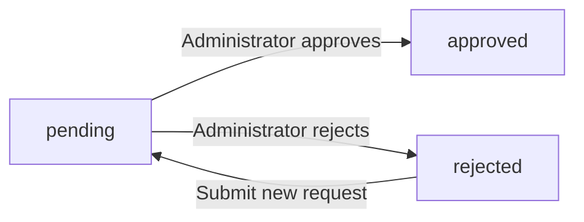
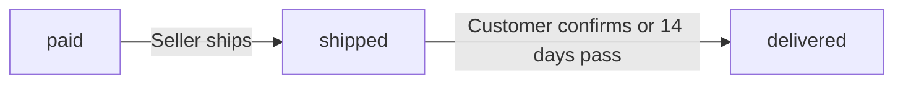
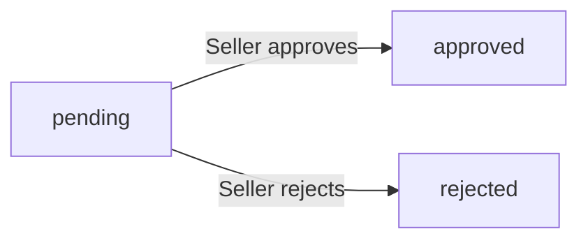
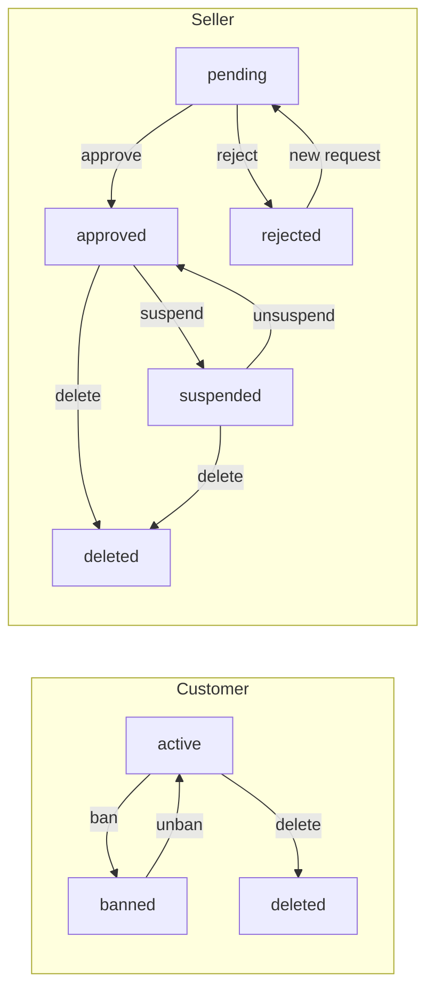
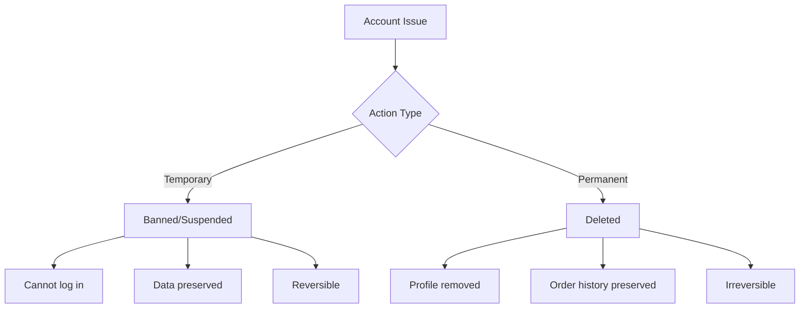

**shoppingMall — Actor definitions, permission matrix, authentication, session, account lifecycle**

Actor definitions, permission matrix, authentication, session, account lifecycle

# Actor Definitions

Define all user actor types with their roles and what they can do.

## customer Actor

Customers are registered users who browse and purchase products on the platform. Registration is mandatory to access any features, as guest browsing is not permitted. Customers sign up using their email address and password, which they can later change if needed. Each customer maintains a profile containing their display name and phone number, which can be updated at any time. Customers can manage multiple shipping addresses, designating one as the default for convenience. They browse products through category navigation or search functionality, applying filters by category, price range, and stock availability. Products can be saved to a wishlist for future consideration before purchase. When ready to buy, customers add specific product variants to their shopping cart with desired quantities. During checkout, they select a shipping address and review the complete order summary before confirming payment. After purchase, customers can track their orders, request cancellations for items not yet shipped, and request refunds for delivered items within seven days. Customers who have received their orders can write reviews with ratings to share their purchasing experience with other users.

### Customer Registration Requirement

THE system SHALL require user registration before any platform features can be accessed.

THE system SHALL NOT permit guest browsing of products, categories, or any other platform content.

WHEN an unregistered user attempts to access any platform feature, THE system SHALL redirect them to the registration page.

THE system SHALL require customers to sign up with an email address and password during registration.

THE system SHALL create a customer account upon successful registration.

IF a user attempts to perform any action without a registered account, THE system SHALL deny access and prompt for registration or login.

### Customer Profile Management

THE system SHALL maintain a profile for each customer containing a display name and phone number.

THE system SHALL allow customers to edit their display name.

THE system SHALL allow customers to edit their phone number.

WHEN a customer updates their profile information, THE system SHALL save the changes immediately.

THE system SHALL NOT require customers to provide a display name or phone number during initial registration.

THE system SHALL allow customers to leave their display name or phone number fields empty.

WHEN a customer views their profile, THE system SHALL display their current display name and phone number.

### Shipping Address Management

THE system SHALL allow customers to add multiple shipping addresses to their account.

WHEN a customer adds a new shipping address, THE system SHALL require the following information: recipient name, phone number, street address, city, state/province, postal code, and country.

THE system SHALL allow customers to edit any of their existing shipping addresses.

THE system SHALL allow customers to delete any of their shipping addresses.

THE system SHALL allow customers to designate one address as their default shipping address.

IF a customer has only one shipping address, THE system SHALL automatically set it as the default.

WHEN a customer sets a new default shipping address, THE system SHALL remove the default status from the previously default address.

THE system SHALL preserve all shipping addresses until the customer explicitly deletes them or deletes their account.

### Product Browsing and Search

THE system SHALL allow customers to browse the list of all categories.

THE system SHALL allow customers to view products within a selected category.

THE system SHALL allow customers to search products by name.

WHEN a customer performs a search, THE system SHALL display search results from all sellers.

THE system SHALL paginate search results.

THE system SHALL allow customers to filter search results by category.

THE system SHALL allow customers to filter search results by price range (minimum and maximum).

THE system SHALL allow customers to filter search results to show only in-stock items.

THE system SHALL allow customers to sort search results by newest first.

THE system SHALL allow customers to sort search results by price from low to high.

THE system SHALL allow customers to sort search results by price from high to low.

WHEN displaying a product in search results or category listings, THE system SHALL show the main image, name, base price or price range, seller shop name, and average rating if reviews exist.

### Wishlist Functionality

THE system SHALL allow customers to add products to their wishlist.

THE system SHALL allow customers to view their wishlist.

THE system SHALL paginate the wishlist display.

THE system SHALL display products (not specific variants) in the wishlist.

THE system SHALL allow customers to remove products from their wishlist.

IF a product is deleted by the seller, THE system SHALL automatically remove it from all customer wishlists.

WHEN a customer views their wishlist, THE system SHALL display each product's main image, name, base price or price range, and seller shop name.

### Shopping Cart Operations

THE system SHALL allow customers to add specific product variants to their shopping cart with a specified quantity.

WHEN a customer adds a variant that is already in the cart, THE system SHALL combine the quantities into a single cart item.

THE system SHALL allow customers to view their cart contents.

WHEN displaying the cart, THE system SHALL show each item with product name, variant options, price, quantity, and subtotal.

THE system SHALL allow customers to change the quantity of items in their cart.

THE system SHALL allow customers to remove items from their cart.

THE system SHALL display the total price of all items in the cart.

IF a variant's stock quantity is less than the cart quantity, THE system SHALL display a warning to the customer.

IF a variant is deleted or out of stock, THE system SHALL mark the item as unavailable in the cart.

THE system SHALL NOT allow customers to add out-of-stock variants to their cart.

### Checkout and Payment Process

THE system SHALL allow customers to proceed to checkout from their cart.

THE system SHALL NOT allow checkout of unavailable items.

THE system SHALL require customers to select a shipping address during checkout.

IF the customer has a default shipping address, THE system SHALL pre-select it during checkout.

THE system SHALL allow customers to choose a different shipping address from their saved addresses.

WHEN reviewing the order, THE system SHALL display the order summary including list of items with prices, shipping address, and total price.

THE system SHALL NOT allow changes to the shipping address after an order is placed.

WHEN a customer confirms the order, THE system SHALL process payment through the external payment gateway.

IF payment fails, THE system SHALL NOT create the order and SHALL allow the customer to retry.

IF payment succeeds, THE system SHALL create the order record.

WHEN an order is successfully created, THE system SHALL decrease stock quantities for each purchased variant.

WHEN an order is successfully created, THE system SHALL remove the purchased items from the customer's cart.

### Order Tracking and History

THE system SHALL allow customers to view a list of all their orders.

THE system SHALL paginate the order list and sort it by newest first.

WHEN displaying the order list, THE system SHALL show the order number, date, total price, and overall order status for each order.

THE system SHALL allow customers to view the full details of any order.

WHEN viewing order details, THE system SHALL display the list of items with product name, variant, quantity, price, and item status.

WHEN viewing order details, THE system SHALL display the shipping address.

WHEN viewing order details, THE system SHALL display the list of shipments with tracking information, showing which items are included in each shipment.

THE system SHALL allow customers to view tracking information for each shipment.

THE system SHALL allow customers to confirm delivery per shipment.

WHEN a customer confirms delivery, THE system SHALL change all items in that shipment to delivered status.

IF a customer does not confirm delivery within 14 days from shipping, THE system SHALL automatically change the items to delivered status.

### Cancellation and Refund Requests

THE system SHALL allow customers to request cancellation for individual order items with status "paid".

WHEN a customer requests a cancellation, THE system SHALL require the customer to provide a reason.

THE system SHALL NOT allow cancellation requests for items that have been shipped.

THE system SHALL allow customers to request a refund for individual order items with status "delivered".

WHEN a customer requests a refund, THE system SHALL require the customer to provide a reason.

THE system SHALL allow refund requests only within 7 days of the item being delivered.

THE system SHALL NOT allow refund requests for items not yet delivered.

THE system SHALL display the status of cancellation and refund requests to the customer.

IF a seller approves a cancellation request, THE system SHALL cancel the item and process the refund for that item only.

IF a seller approves a refund request, THE system SHALL refund that item.

IF an item is cancelled or refunded, THE system SHALL restore the stock quantity for that variant.

THE system SHALL allow the remaining items in an order to continue processing normally when some items are cancelled or refunded.

### Product Reviews

THE system SHALL allow customers to write a review for products they have purchased.

THE system SHALL allow reviews only after an order item's status is "delivered".

THE system SHALL allow customers to write one review per product per order.

WHEN writing a review, THE system SHALL require a rating from 1 to 5 stars.

WHEN writing a review, THE system SHALL allow optional text content.

THE system SHALL display reviews on the product detail page.

THE system SHALL sort reviews by newest first.

THE system SHALL allow customers to edit their own reviews.

WHEN a customer edits a review, THE system SHALL create a snapshot preserving the previous state.

THE system SHALL allow customers to delete their own reviews.

WHEN a customer deletes a review, THE system SHALL preserve the review snapshots.

THE system SHALL calculate a product's average rating from all non-deleted reviews.

### Seller Profile Viewing

THE system SHALL allow customers to view seller profiles.

WHEN a customer views a seller profile, THE system SHALL display the shop name, shop description, and logo image.

THE system SHALL allow customers to access seller profiles from product detail pages.

THE system SHALL allow customers to access seller profiles from product listings.

THE system SHALL NOT allow customers to edit seller profiles.

### Account Deletion Rights

THE system SHALL allow customers to delete their account.

WHEN a customer deletes their account, THE system SHALL delete the customer's profile information.

WHEN a customer deletes their account, THE system SHALL preserve their orders and order history for seller records and legal purposes.

WHEN a customer deletes their account, THE system SHALL preserve their reviews but display them as "deleted user".

WHEN a customer deletes their account, THE system SHALL delete all of their shipping addresses.

WHEN a customer deletes their account, THE system SHALL delete their wishlist.

WHEN a customer deletes their account, THE system SHALL delete their shopping cart and cart items.

THE system SHALL NOT require any conditions to be met before a customer can delete their account.

## seller Actor

Sellers are registered merchants who offer products for sale on the platform. They sign up using their email address and password, but their accounts require administrator approval before they can begin selling. Sellers can check their approval status at any time, viewing whether they are pending, approved, or rejected. If a registration is rejected, the seller can view the reason provided by the administrator and submit a new registration request. Once approved, sellers create and manage their product catalog, including product details, images, and variants with specific SKU codes and pricing. Each product edit generates a snapshot to preserve historical records. Sellers manage inventory levels for each variant through restocking and adjustments, with all changes tracked in inventory history. When customers place orders, sellers view items needing shipment and create shipments with tracking information. Sellers respond to customer cancellation requests for items not yet shipped and refund requests for delivered items. Their shop profile, including name, description, and logo, is visible to customers browsing products. Sellers may delete their account only when they have no pending orders or unresolved requests, ensuring all customer commitments are fulfilled.

### Seller Registration and Approval

### Registration Process

WHEN a person signs up as a seller, THE system SHALL require an email address and password.

WHEN a seller submits a registration, THE system SHALL create a seller account with approval status "pending".

THE system SHALL prevent pending sellers from creating products or accessing seller features until approved.

### Approval Status Tracking

WHEN a seller views their approval status, THE system SHALL display one of the following states:
1. Pending - awaiting administrator review
2. Approved - seller may operate on the platform
3. Rejected - seller registration was declined

WHEN a seller's registration is rejected, THE system SHALL display the rejection reason provided by the administrator.

WHEN a rejected seller submits a new registration request, THE system SHALL create a new pending approval request with the updated information.

### Approval State Transitions

IF a seller attempts to access seller-only features while in pending status, THE system SHALL deny access and display the pending approval message.

IF a seller attempts to access seller-only features while in rejected status, THE system SHALL deny access and display the rejection reason.

### Product Catalog Management

### Product Creation

WHEN an approved seller creates a product, THE system SHALL require:
1. Product name
2. Product description
3. Category selection
4. Base price

WHEN a seller creates a product, THE system SHALL associate the product with that seller.

IF a seller selects a subcategory, THE system SHALL associate the product with that subcategory under its parent category.

### Product Editing and Snapshots

WHEN a seller edits any product field, THE system SHALL create a product snapshot preserving:
1. The previous values of all product fields
2. The new values after the edit
3. The timestamp of the change

THE system SHALL make snapshots immutable and undeletable.

WHEN a seller views their products, THE system SHALL display all products they have created.

### Product Variant Creation

WHEN a seller adds a variant to a product, THE system SHALL require:
1. Unique SKU code
2. Option values (e.g., color, size combination)
3. Initial stock quantity (minimum zero)

WHEN a seller adds a variant, THE system SHALL allow an optional price that overrides the product's base price.

IF a seller attempts to create a variant with an SKU code that already exists, THE system SHALL reject the request.

WHEN a seller edits a variant, THE system SHALL create a snapshot preserving the previous variant state.

### Product Image Handling

WHEN a seller uploads images for a product, THE system SHALL allow multiple images to be uploaded.

WHEN a seller reorders product images, THE system SHALL designate the first image as the main thumbnail for listings.

WHEN a seller deletes an image from a product, THE system SHALL remove the image and update the display order.

WHEN product images are modified, THE system SHALL include the image changes in the product snapshot.

### Product Visibility

IF a product has no variants, THE system SHALL display the product in search results with "unavailable" status.

IF a product has at least one variant with stock greater than zero, THE system SHALL allow customers to purchase that product.

### Product Deletion Restrictions

IF a product has pending order items (paid or shipped status) for any variant, THE system SHALL prevent deletion of that product.

IF a product has pending cancellation or refund requests for any variant, THE system SHALL prevent deletion of that product.

WHEN a seller deletes a product, THE system SHALL:
1. Remove the product from search and category listings
2. Delete all variants and inventory records
3. Preserve all product snapshots for historical records

### Inventory Level Management

### Inventory Records

THE system SHALL track inventory through individual inventory records rather than snapshots.

EACH inventory record SHALL contain:
1. Quantity change (positive for additions, negative for deductions)
2. Reason for the change
3. Timestamp of the change

THE system SHALL calculate current stock quantity as the sum of all inventory records for a variant.

### Inventory Operations

WHEN a seller restocks inventory, THE system SHALL create a positive inventory record with the quantity and reason.

WHEN a seller adjusts inventory downward (for loss or correction), THE system SHALL create a negative inventory record with the quantity and reason.

WHEN a customer places an order, THE system SHALL automatically create a negative inventory record for each purchased variant.

WHEN an order item is cancelled, THE system SHALL automatically create a positive inventory record to restore stock.

WHEN an order item is refunded, THE system SHALL automatically create a positive inventory record to restore stock.

### Stock Status

IF a variant's stock quantity reaches zero, THE system SHALL display that variant as "out of stock".

IF a variant is out of stock, THE system SHALL prevent customers from adding it to their cart.

### Inventory History Access

WHEN a seller views a variant's inventory history, THE system SHALL display all inventory records for that variant in chronological order.

THE system SHALL preserve inventory history even after a variant or product is deleted.

### Order Fulfillment and Shipping

### Order Item Visibility

WHEN a seller views items requiring shipment, THE system SHALL display all order items with status "paid" that belong to that seller's products.

THE system SHALL allow sellers to filter order items by status.

### Shipment Creation

WHEN a seller creates a shipment, THE system SHALL require:
1. Selection of one or more order items from the same order that belong to the seller
2. Carrier name
3. Tracking number

WHEN a seller creates a shipment containing multiple order items, THE system SHALL assign the same tracking information to all items in the shipment.

WHEN a shipment is created, THE system SHALL change the status of all included items to "shipped".

### Delivery Confirmation

WHEN a customer confirms delivery of a shipment, THE system SHALL change the status of all items in that shipment to "delivered".

IF 14 days pass after a shipment is created without customer confirmation, THE system SHALL automatically change the status of all items in that shipment to "delivered".

### Shipment Tracking

WHEN a seller creates a shipment, THE system SHALL record the shipment date.

THE system SHALL make tracking information visible to the customer who placed the order.

### Cancellation and Refund Handling

### Cancellation Request Response

WHEN a customer requests cancellation of an item with status "paid", THE system SHALL notify the seller of that item.

WHEN a seller responds to a cancellation request, THE system SHALL create a snapshot of the request state.

IF a seller approves a cancellation request, THE system SHALL:
1. Change the order item status to "cancelled"
2. Process the refund for that item
3. Create a positive inventory record to restore stock

IF a seller rejects a cancellation request, THE system SHALL update the request status to "rejected" and notify the customer.

### Refund Request Response

WHEN a customer requests a refund for an item with status "delivered", THE system SHALL notify the seller of that item.

IF a refund request is submitted more than 7 days after delivery, THE system SHALL reject the request automatically.

WHEN a seller responds to a refund request, THE system SHALL create a snapshot of the request state.

IF a seller approves a refund request, THE system SHALL:
1. Change the order item status to "refunded"
2. Process the refund for that item
3. Create a positive inventory record to restore stock

IF a seller rejects a refund request, THE system SHALL update the request status to "rejected" and notify the customer.

### Request State Snapshots

### Shop Profile and Dashboard

### Shop Profile Management

WHEN a seller edits their shop profile, THE system SHALL allow modification of:
1. Shop name
2. Shop description
3. Logo image

WHEN a seller edits their shop profile, THE system SHALL create a seller profile snapshot preserving the previous state.

### Shop Profile Visibility

WHEN a customer views a product, THE system SHALL display the seller's shop name as a link to the seller profile.

WHEN a customer views a seller profile, THE system SHALL display:
1. Shop name
2. Shop description
3. Logo image

### Dashboard Statistics Access

WHEN a seller views their dashboard, THE system SHALL display:
1. Total number of products
2. Total number of order items for their products
3. Number of pending cancellation requests
4. Number of pending refund requests

WHEN a seller views the order items list, THE system SHALL allow filtering by item status (paid, shipped, delivered, cancelled, refunded).

### Account Deletion Conditions

### Deletion Eligibility

IF a seller has any pending order items (paid or shipped status) for their products, THE system SHALL prevent account deletion.

IF a seller has any pending cancellation requests, THE system SHALL prevent account deletion.

IF a seller has any pending refund requests, THE system SHALL prevent account deletion.

WHEN a seller deletes their account, THE system SHALL:
1. Delete all products and their variants
2. Remove products from search and category listings
3. Preserve order history and order item snapshots
4. Preserve the shop name in past orders

### Data Preservation After Deletion

WHEN a seller account is deleted, THE system SHALL preserve historical records including:
1. Order items with their snapshots showing the seller's shop name at time of purchase
2. Product snapshots created during the account's lifetime
3. Seller profile snapshots

THE system SHALL preserve these records for dispute resolution and legal compliance.

## administrator Actor

Administrators are platform overseers who manage users, content, and disputes to maintain marketplace integrity. There are two administrator grades: regular administrators and super administrators, with super administrators holding additional privileges for managing administrator roles. Any user can submit a request to become an administrator, which super administrators review and approve or reject. Administrators manage the seller approval process, reviewing pending seller registrations and deciding whether to approve or reject them with required reasons. They can suspend seller accounts when policy violations occur, hiding products from listings while allowing the seller to complete existing orders, and later unsuspend accounts when appropriate. Category management falls under administrator control, including creating, editing, and deleting categories and subcategories. Administrators have oversight of all products on the platform, can view product snapshots for historical records, and can delete products that violate policies. For order management, administrators can force-cancel or force-refund individual items or entire orders when intervention is necessary. User management capabilities include viewing all customer and seller accounts, with the ability to ban users who violate platform rules, preventing them from logging in, and unbanning them when appropriate. These oversight capabilities ensure a safe and fair marketplace environment for all participants.

### Administrator Grades and Privileges

THE system SHALL maintain two administrator grades: regular administrator and super administrator.

THE system SHALL grant super administrators all privileges available to regular administrators.

WHEN a super administrator promotes a regular administrator, THE system SHALL change the administrator's grade to super administrator.

WHEN a super administrator demotes another super administrator, THE system SHALL change that administrator's grade to regular administrator.

IF a super administrator attempts to demote themselves, THE system SHALL reject the request.

IF a regular administrator attempts to perform super administrator-only operations, THE system SHALL deny access.

Super administrator-exclusive operations include:
- Approving or rejecting administrator requests
- Promoting regular administrators to super administrator
- Demoting super administrators to regular administrator

### Administrator Request Process

WHEN a user submits a request to become an administrator, THE system SHALL record the reason and set the status to pending.

THE system SHALL allow any customer or seller to submit an administrator request.

WHEN a super administrator views the list of administrator requests, THE system SHALL display all pending requests.

WHEN a super administrator approves an administrator request, THE system SHALL:
1. Change the user's role to administrator
2. Set the administrator grade to regular administrator
3. Set the request status to approved
4. Record who reviewed the request and when

WHEN a super administrator rejects an administrator request, THE system SHALL:
1. Set the request status to rejected
2. Record who reviewed the request and when

IF a user's administrator request is rejected, THE system SHALL allow the user to submit a new request.

### Seller Registration Approval

THE system SHALL allow administrators to view the list of pending seller registrations.

WHEN an administrator approves a seller registration, THE system SHALL:
1. Set the seller's approval status to approved
2. Enable the seller to create and manage products

WHEN an administrator rejects a seller registration, THE system SHALL:
1. Require the administrator to provide a rejection reason
2. Set the seller's approval status to rejected
3. Record the rejection reason

IF a seller registration is rejected, THE system SHALL allow the seller to view the rejection reason.

IF a seller registration is rejected, THE system SHALL allow the seller to submit a new registration request.

WHEN a seller submits a new registration request after rejection, THE system SHALL set the approval status to pending.

### Seller Account Suspension

THE system SHALL allow administrators to suspend seller accounts.

WHEN an administrator suspends a seller account, THE system SHALL:
1. Hide all of the seller's products from search results
2. Hide all of the seller's products from category listings
3. Prevent new purchases of the seller's products

WHILE a seller account is suspended, THE system SHALL allow the seller to:
1. View their existing orders
2. Ship pending order items
3. Respond to cancellation requests
4. Respond to refund requests

WHILE a seller account is suspended, THE system SHALL prevent the seller from:
1. Creating new products
2. Editing existing products

THE system SHALL allow administrators to unsuspend seller accounts.

WHEN an administrator unsuspends a seller account, THE system SHALL restore visibility of the seller's products in search results and category listings.

### Category and Subcategory Management

THE system SHALL allow administrators to create categories.

WHEN an administrator creates a category, THE system SHALL require:
1. A category name
2. A category description

THE system SHALL allow administrators to create subcategories under existing categories.

THE system SHALL limit subcategory nesting to one level only (categories can have subcategories, but subcategories cannot have further subcategories).

WHEN an administrator creates a subcategory, THE system SHALL require:
1. A parent category selection
2. A subcategory name
3. A subcategory description

THE system SHALL allow administrators to edit category names and descriptions.

THE system SHALL allow administrators to delete categories.

WHEN an administrator deletes a category, THE system SHALL:
1. Remove the category from the system
2. Set all products in that category to uncategorized
3. Delete all subcategories under that category

### Platform-Wide Product Oversight

THE system SHALL allow administrators to view all products on the platform across all sellers.

THE system SHALL allow administrators to view snapshots of any product.

THE system SHALL allow administrators to delete any product for policy violations.

WHEN an administrator deletes a product, THE system SHALL:
1. Remove the product from search results and category listings
2. Delete all variants of the product
3. Delete all inventory records for the product variants
4. Preserve order history and order item snapshots referencing the product

IF a product has pending order items (paid or shipped status), THE system SHALL warn the administrator before deletion.

IF a product has pending cancellation or refund requests, THE system SHALL warn the administrator before deletion.

### Order Intervention Powers

THE system SHALL allow administrators to view all orders on the platform.

THE system SHALL allow administrators to force-cancel individual order items.

WHEN an administrator force-cancels an order item, THE system SHALL:
1. Change the item status to cancelled
2. Process a refund to the customer for that item
3. Restore the stock quantity for that variant via an inventory record

THE system SHALL allow administrators to force-cancel entire orders.

WHEN an administrator force-cancels an entire order, THE system SHALL force-cancel all items in that order.

THE system SHALL allow administrators to force-refund individual order items.

WHEN an administrator force-refunds an order item, THE system SHALL:
1. Change the item status to refunded
2. Process a refund to the customer for that item
3. Restore the stock quantity for that variant via an inventory record

THE system SHALL allow administrators to force-refund entire orders.

WHEN an administrator force-refunds an entire order, THE system SHALL force-refund all items in that order.

### User Account Moderation

THE system SHALL allow administrators to view all customer accounts.

THE system SHALL allow administrators to ban customer accounts.

WHEN an administrator bans a customer account, THE system SHALL prevent that customer from logging in.

THE system SHALL allow administrators to unban customer accounts.

WHEN an administrator unbans a customer account, THE system SHALL restore the customer's ability to log in.

THE system SHALL allow administrators to view all seller accounts.

THE system SHALL allow administrators to ban seller accounts.

WHEN an administrator bans a seller account, THE system SHALL:
1. Prevent that seller from logging in
2. Preserve all existing orders associated with that seller

THE system SHALL allow administrators to unban seller accounts.

WHEN an administrator unbans a seller account, THE system SHALL restore the seller's ability to log in.

# Authentication Flows

Registration, login, session management, and token policies.

## Registration and Login

Define user registration and login flows including validation and error handling.

### Customer Registration

WHEN a customer submits a registration request with an email and password, THE system SHALL create a new customer account.

THE system SHALL require an email address for customer registration.

THE system SHALL require a password for customer registration.

IF the email address is already registered as a customer, THE system SHALL reject the registration request.

IF the email address is already registered as a seller, THE system SHALL reject the registration request.

IF the email address is already registered as an administrator, THE system SHALL reject the registration request.

WHEN a customer account is successfully created, THE system SHALL set the account status to active.

WHEN a customer account is successfully created, THE system SHALL NOT require administrator approval.

IF the email address format is invalid, THE system SHALL reject the registration request.

IF the password does not meet security requirements, THE system SHALL reject the registration request.

### Seller Registration

WHEN a seller submits a registration request with an email and password, THE system SHALL create a new seller account.

THE system SHALL require an email address for seller registration.

THE system SHALL require a password for seller registration.

IF the email address is already registered as a customer, THE system SHALL reject the registration request.

IF the email address is already registered as a seller, THE system SHALL reject the registration request.

IF the email address is already registered as an administrator, THE system SHALL reject the registration request.

WHEN a seller account is successfully created, THE system SHALL set the approval status to pending.

WHILE a seller account has pending approval status, THE system SHALL prevent the seller from creating products.

WHILE a seller account has pending approval status, THE system SHALL prevent the seller from editing their shop profile.

THE system SHALL allow sellers with pending approval status to view their approval status.

IF a seller's registration is rejected, THE system SHALL allow the seller to view the rejection reason.

IF a seller's registration is rejected, THE system SHALL allow the seller to submit a new registration request.

### Login Authentication

WHEN a user submits login credentials with an email and password, THE system SHALL authenticate the user.

THE system SHALL validate the email and password combination against the registered credentials.

IF the login credentials are valid, THE system SHALL create an authenticated session for the user.

IF the email address is not registered in the system, THE system SHALL reject the login request.

IF the password does not match the registered password, THE system SHALL reject the login request.

IF a customer account is banned, THE system SHALL reject the login request.

IF a seller account is banned, THE system SHALL reject the login request.

WHEN an administrator logs in successfully, THE system SHALL create a session with the appropriate administrator grade.

WHEN a seller logs in successfully, THE system SHALL grant access based on the seller's approval status.

THE system SHALL use the same email and password authentication for customers, sellers, and administrators.

### Authentication Enforcement

THE system SHALL require authentication for all platform features.

THE system SHALL NOT allow guest browsing of products.

THE system SHALL NOT allow guest access to product search.

THE system SHALL NOT allow guest access to category listings.

THE system SHALL NOT allow guest access to seller profiles.

WHEN an unauthenticated user attempts to access any protected feature, THE system SHALL redirect the user to the login page.

WHEN an unauthenticated user attempts to access any protected feature, THE system SHALL NOT display any product information.

THE system SHALL require authenticated session for product browsing.

THE system SHALL require authenticated session for wishlist operations.

THE system SHALL require authenticated session for shopping cart operations.

THE system SHALL require authenticated session for order placement.

### Password Requirements

THE system SHALL require passwords to meet minimum security requirements.

IF a password is shorter than the minimum required length, THE system SHALL reject the registration or password change request.

WHEN a user registers or changes their password, THE system SHALL store the password in a secure hashed format.

THE system SHALL allow customers to change their password.

THE system SHALL allow sellers to change their password.

THE system SHALL allow administrators to change their password.

IF a password change request contains invalid credentials, THE system SHALL reject the request.

WHEN a password is changed successfully, THE system SHALL invalidate all existing sessions except the current one.

## Session and Token Policy

Define session duration, token refresh, and expiration policies.

### Session Duration and Management

### Session Creation

WHEN a user (customer, seller, or administrator) successfully logs in, THE system SHALL create a new session.

WHEN a session is created, THE system SHALL generate a unique session identifier.

WHEN a session is created, THE system SHALL record the creation timestamp.

### Session Duration

THE system SHALL define a maximum session duration of 24 hours.

WHILE a session is active, THE system SHALL allow the user to perform authenticated operations.

WHEN a session exceeds the maximum duration, THE system SHALL invalidate the session.

### Concurrent Sessions

THE system SHALL allow a user to have multiple active sessions across different devices.

WHEN a user logs in from a new device, THE system SHALL NOT invalidate existing sessions.

IF a user explicitly logs out from one device, THE system SHALL invalidate only that specific session.

### Session Storage

THE system SHALL store session information including session identifier, user identifier, creation timestamp, and last activity timestamp.

THE system SHALL update the last activity timestamp on each authenticated request.

### JWT Token Structure and Claims

### Token Generation

WHEN a session is created, THE system SHALL generate a JWT (JSON Web Token) access token.

WHEN a JWT token is generated, THE system SHALL include the following claims:
1. User identifier (sub)
2. User type - customer, seller, or administrator (type)
3. Session identifier (sid)
4. Issued at timestamp (iat)
5. Expiration timestamp (exp)

### Token Structure

THE system SHALL sign all JWT tokens using a secure signing algorithm.

THE system SHALL NOT store sensitive user information in JWT token payloads.

THE system SHALL encode all token claims in a tamper-resistant format.

### Token Validation

WHEN a JWT token is presented for authentication, THE system SHALL verify the token signature.

IF the token signature is invalid, THE system SHALL reject the authentication request.

IF the token has expired, THE system SHALL reject the authentication request.

IF the session associated with the token is invalidated, THE system SHALL reject the authentication request.

### Administrator Token Claims

WHEN an administrator logs in, THE system SHALL include the administrator grade (regular or super) in the JWT token claims.

THE system SHALL use the administrator grade claim to determine authorization for administrative operations.

### Token Refresh Policy

### Refresh Token Issuance

WHEN a session is created, THE system SHALL issue a refresh token alongside the access token.

THE system SHALL associate the refresh token with the specific session.

### Refresh Token Duration

THE system SHALL set the refresh token validity period to 7 days.

WHEN a refresh token is used to obtain a new access token, THE system SHALL issue a new access token.

### Token Refresh Process

WHEN a user requests a token refresh with a valid refresh token, THE system SHALL:
1. Verify the refresh token is valid and not expired
2. Verify the associated session is still active
3. Issue a new access token with updated claims
4. Maintain the same session identifier

IF the refresh token has expired, THE system SHALL require the user to log in again.

IF the session associated with the refresh token is invalidated, THE system SHALL reject the refresh request.

### Refresh Token Security

THE system SHALL NOT accept the same refresh token more than once for token refresh.

WHEN a refresh token is used, THE system SHALL invalidate the used refresh token and issue a new refresh token.

THE system SHALL store refresh tokens securely with hashing.

### Token and Session Expiration

### Access Token Expiration

THE system SHALL set the access token expiration time to 1 hour from issuance.

WHEN an access token expires, THE system SHALL NOT accept the token for authenticated operations.

IF a user attempts to use an expired access token, THE system SHALL return an authentication error.

### Refresh Token Expiration

THE system SHALL set the refresh token expiration time to 7 days from issuance.

IF a refresh token expires, THE system SHALL require the user to re-authenticate.

### Session Expiration

WHEN a session reaches the maximum duration of 24 hours, THE system SHALL:
1. Invalidate the session
2. Invalidate all associated tokens
3. Require re-authentication

WHEN a user has been inactive for 30 minutes, THE system SHALL extend the session if a request is made within the session duration limit.

### Token Expiration Extension

WHEN a valid access token is used within 5 minutes before its expiration, THE system SHALL return a warning header indicating imminent expiration.

THE system SHALL NOT automatically extend access token expiration without a refresh request.

### Session Invalidation and Security

### Manual Session Invalidation

WHEN a user explicitly logs out, THE system SHALL invalidate the current session and all associated tokens.

WHEN a user changes their password, THE system SHALL invalidate all sessions except the current session.

### Automatic Session Invalidation

WHEN an account is banned, THE system SHALL invalidate all active sessions for that account.

WHEN a seller account is suspended, THE system SHALL invalidate all active sessions for that seller.

WHEN an administrator account is demoted or removed, THE system SHALL invalidate all active sessions for that administrator.

### Security Token Handling

THE system SHALL transmit JWT tokens only over secure HTTPS connections.

THE system SHALL NOT include tokens in URL parameters.

THE system SHALL set tokens in secure HTTP-only cookies or authorization headers.

### Token Blacklisting

WHEN a session is invalidated before token expiration, THE system SHALL blacklist the associated tokens.

THE system SHALL check the blacklist before accepting any token.

IF a token is blacklisted, THE system SHALL reject the authentication request.

### Rate Limiting

THE system SHALL apply rate limiting to token refresh requests.

IF a user exceeds 10 refresh requests per minute, THE system SHALL temporarily block further refresh requests.

THE system SHALL apply rate limiting to login attempts to prevent brute force attacks.

# Account Lifecycle

Account state transitions and lifecycle management.

## Account States and Transitions

Define account states (active, suspended, deleted) and valid transitions.

### Account State Definitions

### Customer Account States

THE system SHALL maintain the following states for customer accounts:

1. **Active**: Customer can log in and use all platform features
2. **Banned**: Customer cannot log in (defined in [Account Banning](#account-banning))
3. **Deleted**: Customer profile removed but order history preserved (defined in [Account Deletion](#account-deletion))

### Seller Account States

THE system SHALL maintain the following states for seller accounts:

1. **Pending**: Seller registered but awaiting administrator approval
2. **Approved**: Seller can sell products and manage orders
3. **Rejected**: Seller registration denied by administrator (can submit new request)
4. **Suspended**: Seller cannot create/edit products but can process existing orders (defined in [Account Suspension](#account-suspension))
5. **Deleted**: Seller profile and products removed but order history preserved (defined in [Account Deletion](#account-deletion))

### Administrator Account States

THE system SHALL maintain the following states for administrator accounts:

1. **Active**: Administrator can perform administrative functions based on grade

THE system SHALL assign each administrator one of two grades:

1. **Regular Administrator**: Can manage sellers, categories, products, and orders
2. **Super Administrator**: Has all regular administrator privileges plus can manage administrator requests and other super administrators

### State Transition Overview

### Account Lifecycle

### Customer Lifecycle

WHEN a customer registers, THE system SHALL create the account in the **active** state.

WHILE a customer account is **active**, THE system SHALL allow the customer to:

1. Browse products and categories
2. Manage their profile and addresses
3. Add items to cart and wishlist
4. Place orders
5. Write reviews for delivered items
6. Request cancellations and refunds

### Seller Lifecycle

WHEN a seller registers, THE system SHALL create the account in the **pending** state.

WHILE a seller account is **pending**, THE system SHALL:

1. Allow the seller to view their approval status
2. Prohibit any selling activities

IF an administrator approves the seller registration, THEN THE system SHALL transition the account to **approved** state.

IF an administrator rejects the seller registration, THEN THE system SHALL transition the account to **rejected** state and record the rejection reason.

IF a seller registration is rejected, THE system SHALL allow the seller to submit a new registration request, transitioning back to **pending** state.

WHILE a seller account is **approved**, THE system SHALL allow the seller to:

1. Create and manage products
2. Manage inventory
3. Process orders and shipments
4. Respond to cancellation and refund requests

### Administrator Lifecycle

WHEN a user's administrator request is approved by a super administrator, THE system SHALL create the administrator account in the **active** state with grade **regular**.

IF a super administrator promotes a regular administrator, THEN THE system SHALL change the grade to **super**.

IF a super administrator demotes another super administrator, THEN THE system SHALL change that administrator's grade to **regular**.

THE system SHALL NOT allow a super administrator to demote themselves.

### Account Suspension

### Seller Suspension by Administrators

WHEN an administrator suspends a seller account, THE system SHALL transition the seller from **approved** or **active** state to **suspended** state.

WHILE a seller account is **suspended**, THE system SHALL:

1. Hide all of the seller's products from search results
2. Hide all of the seller's products from category listings
3. Prevent customers from purchasing any of the seller's products
4. Allow the seller to log in
5. Allow the seller to view their existing orders
6. Allow the seller to ship items and create shipments
7. Allow the seller to respond to cancellation requests
8. Allow the seller to respond to refund requests

WHILE a seller account is **suspended**, THE system SHALL NOT allow the seller to:

1. Create new products
2. Edit existing products
3. Add or edit product variants
4. Modify inventory (except through automatic order processing)

### Suspension Removal

WHEN an administrator unsuspends a seller account, THE system SHALL transition the seller back to **approved** state.

WHEN a seller account transitions from **suspended** to **approved**, THE system SHALL:

1. Make all of the seller's products visible in search and category listings
2. Allow customers to purchase the seller's products again

### Account Deletion

### Customer Account Deletion

WHEN a customer deletes their account, THE system SHALL:

1. Remove the customer's profile information
2. Preserve all of the customer's orders and order history
3. Preserve all of the customer's reviews
4. Display preserved reviews with "deleted user" as the author name

### Seller Account Deletion Preconditions

IF a seller requests account deletion, THE system SHALL check for:

1. Any order items with status **paid** or **shipped** (pending orders)
2. Any pending cancellation requests
3. Any pending refund requests

IF the seller has any pending orders, pending cancellation requests, or pending refund requests, THEN THE system SHALL reject the deletion request.

IF the seller has no pending orders, no pending cancellation requests, and no pending refund requests, THEN THE system SHALL allow the deletion.

### Seller Account Deletion Effects

WHEN a seller deletes their account, THE system SHALL:

1. Remove the seller's profile information
2. Delete all of the seller's products from listings
3. Delete all product variants and inventory records
4. Preserve all order items and order history
5. Preserve the seller's shop name in historical order records

THE system SHALL preserve snapshots of the seller's profile that were created at the time of each order.

### Snapshot Preservation

WHEN any account is deleted, THE system SHALL preserve all snapshots that were created during the account's lifetime.

THE preserved snapshots SHALL remain viewable by administrators for dispute resolution purposes.

### Account Banning

### Customer Account Banning

WHEN an administrator bans a customer account, THE system SHALL transition the customer to **banned** state.

WHILE a customer account is **banned**, THE system SHALL:

1. Prevent the customer from logging in
2. Preserve all of the customer's existing data (profile, orders, reviews)

### Customer Account Unbanning

WHEN an administrator unbans a customer account, THE system SHALL transition the customer back to **active** state.

WHEN a customer account transitions from **banned** to **active**, THE system SHALL restore the customer's ability to log in and use all platform features.

### Seller Account Banning

WHEN an administrator bans a seller account, THE system SHALL:

1. Prevent the seller from logging in
2. Preserve all of the seller's existing data (profile, products, orders)
3. Hide the seller's products from search and category listings

THE system SHALL NOT delete or modify any of the seller's products or order history when banning.

### Deactivation vs Deletion Distinction

THE system SHALL distinguish between **banned/suspended** (temporary restriction) and **deleted** (permanent removal):

- **Banned/Suspended**: Account exists but cannot log in; data preserved; reversible
- **Deleted**: Account information removed; data partially preserved; irreversible

