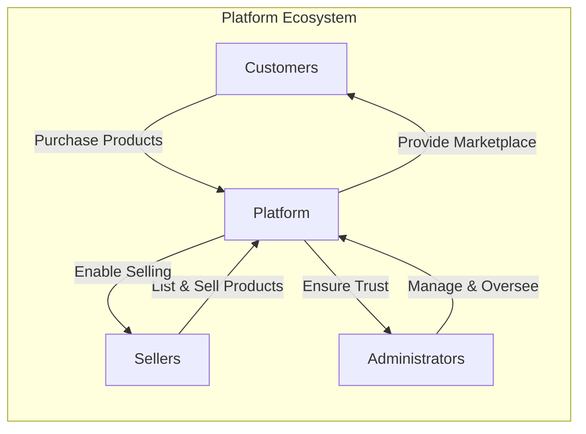
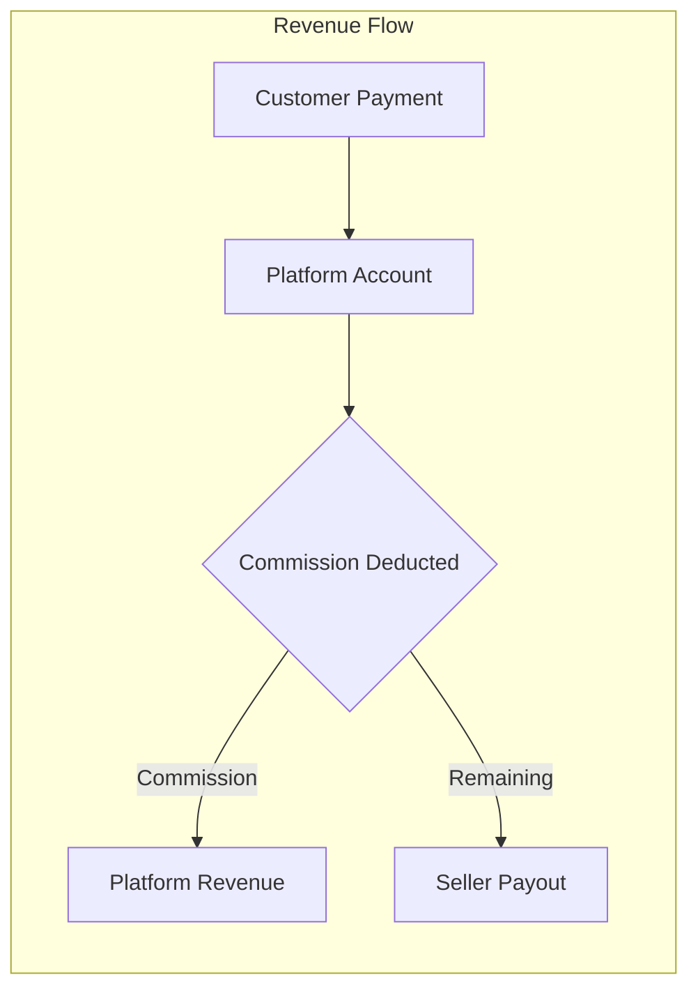
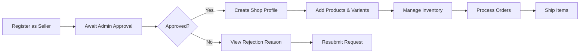
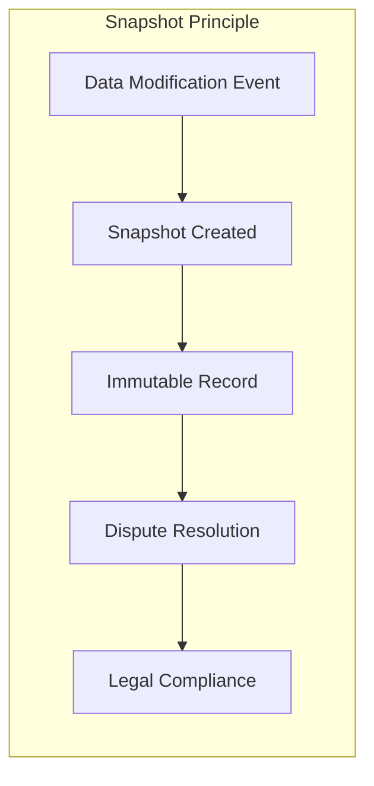
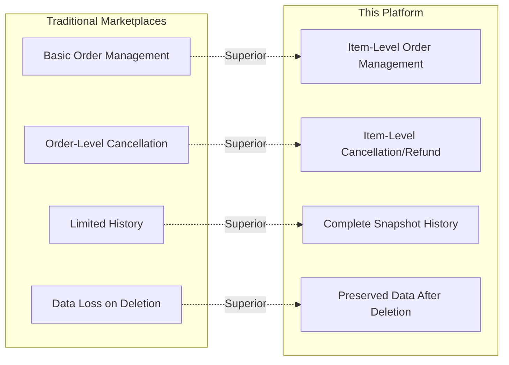
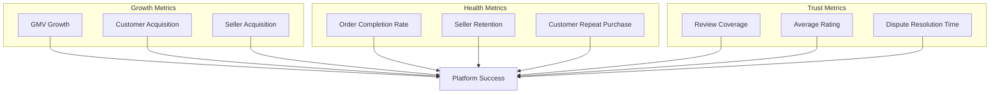

# E-Commerce Shopping Mall Platform Service Overview

## Service Vision and Objectives

### Vision Statement

This e-commerce shopping mall platform exists to create a **trusted multi-vendor marketplace** where customers can discover and purchase products from multiple independent sellers through a unified shopping experience, while sellers can establish and grow their online businesses with complete accountability and transparency.

### Core Objectives

**Primary Objectives:**

1. **Enable Multi-Seller Commerce**: Provide a platform where multiple independent sellers can operate their own shops within a unified marketplace, allowing customers to purchase from multiple sellers in a single transaction.

2. **Ensure Transaction Integrity**: Implement comprehensive data traceability through the snapshot principle, ensuring that every modification to critical business data is recorded and preserved for dispute resolution, legal compliance, and trust-building.

3. **Protect All Stakeholders**: Create a balanced ecosystem that protects customer rights (cancellation, refund, review capabilities), enables seller business operations (inventory, shipping, order management), and provides administrative oversight for platform integrity.

4. **Support Regulatory Compliance**: Maintain complete audit trails and data preservation policies that support legal requirements, including the preservation of order history and reviews even after account deletion.

### Problem Statement

**Problems This Platform Solves:**

| Problem | Impact | Platform Solution |
|---------|--------|------------------|
| Fragmented Multi-Vendor Shopping | Customers must create accounts and checkout separately on each seller's website | Unified cart and checkout with multiple sellers in single transaction |
| Lack of Transaction Transparency | Disputes arise from unclear product states at time of purchase | Complete snapshot system preserving exact product, variant, and seller state |
| Seller Accountability Gaps | Customers cannot verify seller history or product changes | Snapshot-based audit trail accessible for dispute resolution |
| Inflexible Order Management | Customers forced to cancel entire orders instead of specific items | Item-level cancellation and refund with seller approval workflow |
| Data Loss After Account Deletion | Sellers lose access to historical order data; legal compliance issues | Preservation of order history, reviews, and snapshots even after account deletion |
| Unverified Sellers | Fraud risk from unvetted sellers | Administrator approval required before sellers can list products |

## Business Model and Revenue Strategy

### Platform Type

This is a **multi-sided marketplace platform** that connects three distinct user groups:

### Revenue Strategy

**Primary Revenue Stream: Transaction Commission**

THE platform SHALL generate revenue through commission fees on successful transactions:

- **Commission Model**: Percentage-based fee deducted from seller earnings on each sale
- **Fee Timing**: WHEN a payment is completed, THE system SHALL calculate commission at that time
- **Refund Handling**: WHEN a refund is approved, THE system SHALL return the commission to the seller

**Secondary Revenue Opportunities:**

1. **Seller Verification Fees**: Potential fees for expedited seller approval or premium verification badges
2. **Featured Listings**: Optional paid promotion for products in search results and category pages
3. **Premium Seller Tools**: Advanced analytics and inventory management tools for subscription fees

### Business Sustainability Model

### Financial Risk Mitigation

**Customer Protection Mechanisms:**
- WHEN a customer places an order, THE system SHALL hold payment until order confirmation
- THE system SHALL provide refund capability for 7 days after delivery
- THE system SHALL enable administrators to force-refund transactions for dispute resolution

**Seller Protection Mechanisms:**
- WHEN a customer attempts to purchase, THE system SHALL reserve inventory (not deduct) until payment confirmation
- THE system SHALL require seller approval for cancellations (not automatic)
- WHEN a dispute arises, THE system SHALL protect sellers with order snapshots that preserve product state at time of purchase

## Target Market and User Base

### User Actor Categories

THE platform SHALL serve three distinct user actor types, each with specific needs and permissions:

#### 1. Customers (Buyers)

**Target Demographic:**
- Online shoppers seeking variety from multiple sellers
- Users who value purchase protection and transparency
- Customers who want flexible order management (item-level cancellation/refund)

**User Journey:**

**Key Needs:**
- THE system SHALL require registration for all features (no guest browsing)
- THE system SHALL provide ability to manage multiple shipping addresses
- THE system SHALL provide wishlist for future purchases
- THE system SHALL provide shopping cart with multi-seller items
- THE system SHALL provide item-level order tracking
- THE system SHALL provide review and rating capability after delivery

#### 2. Sellers (Merchants)

**Target Demographic:**
- Small to medium business owners seeking online presence
- Artisans and crafters selling unique products
- Wholesalers expanding to direct-to-consumer channels

**User Journey:**

**Key Needs:**
- THE system SHALL require administrator approval before selling
- THE system SHALL provide shop profile management (name, description, logo)
- THE system SHALL provide product creation with variants (SKU) and images
- THE system SHALL provide inventory management with history tracking
- THE system SHALL provide order fulfillment and shipment tracking
- THE system SHALL provide cancellation and refund request handling

#### 3. Administrators (Platform Managers)

**Target Demographic:**
- Platform operations team members
- Customer service representatives with elevated permissions
- Business owners managing the marketplace

**Administrator Hierarchy:**

| Grade | Capabilities | Limitations |
|-------|--------------|-------------|
| Regular Administrator | Approve sellers, manage categories, oversee products/orders, ban users | Cannot manage other administrators |
| Super Administrator | All regular admin capabilities + promote/demote administrators | Cannot demote themselves |

**Key Responsibilities:**
- THE system SHALL allow administrators to approve/reject seller registrations
- THE system SHALL allow administrators to manage product categories
- THE system SHALL allow administrators to oversee products and orders platform-wide
- THE system SHALL allow administrators to handle user bans and suspensions
- THE system SHALL allow administrators to force-cancel or force-refund orders when necessary

### Market Size Estimation

**Initial Focus:**
- Geographic scope: Domestic market (initially) with expansion capability
- Product categories: Configurable category system supporting various niches
- Scale: Designed to support thousands of sellers and tens of thousands of customers

## Core Value Proposition

### Customer Value Proposition

**"Shop with Confidence, Manage with Flexibility"**

| Value | Description |
|-------|-------------|
| **Unified Multi-Seller Shopping** | WHEN a customer browses products, THE system SHALL display items from multiple sellers in a unified cart with one checkout |
| **Complete Purchase Transparency** | WHEN a purchase is made, THE system SHALL preserve every product state at time of purchase via snapshots |
| **Flexible Order Control** | THE system SHALL allow customers to cancel or request refund for individual items, not entire orders |
| **Protected Reviews** | WHEN a customer account is deleted, THE system SHALL preserve reviews ensuring authentic feedback |
| **Guaranteed Delivery Tracking** | THE system SHALL allow customers to track each shipment separately, with automatic delivery confirmation after 14 days |
| **Multi-Address Management** | THE system SHALL allow customers to save and select from multiple shipping addresses for convenience |

### Seller Value Proposition

**"Build Your Business with Accountability and Protection"**

| Value | Description |
|-------|-------------|
| **Professional Shop Presence** | THE system SHALL provide customizable shop profile with name, description, and logo |
| **Complete Product Control** | THE system SHALL allow sellers to create products with multiple variants, images, and pricing |
| **Inventory Intelligence** | THE system SHALL track stock changes with complete history for each variant |
| **Order Management Dashboard** | THE system SHALL display pending orders, process shipments, handle cancellation/refund requests |
| **Seller Protection via Snapshots** | WHEN a purchase occurs, THE system SHALL preserve product state at time of purchase, protecting against unfair disputes |
| **Business Continuity** | WHEN a seller deletes their account, THE system SHALL preserve order history and shop name |

### Platform Value Proposition

**"Trust Through Transparency"**

THE platform's unique differentiation is the **Snapshot Principle** - a comprehensive audit trail system:

**Snapshot-Covered Entities:**

| Entity | Snapshot Triggers | Preserved Information |
|--------|-------------------|----------------------|
| Products | WHEN any edit is made (name, description, category, price, images) | Complete product state including all variants |
| Product Variants | WHEN SKU code, option values, or price changes | Variant state with product reference |
| Seller Profiles | WHEN shop name, description, or logo changes | Profile state at time of change |
| Order Items | WHEN purchase is completed | Product, variant, and seller profile state |
| Reviews | WHEN any edit is made to rating or text | Previous review content |
| Cancellation Requests | WHEN status changes (approved/rejected) | Request state and response |
| Refund Requests | WHEN status changes (approved/rejected) | Request state and response |

## Competitive Advantages

### Market Differentiation

### Competitive Advantage Matrix

| Feature | Traditional Marketplaces | This Platform | Advantage |
|---------|-------------------------|---------------|-----------|
| **Multi-Seller Cart** | Often requires separate checkouts | Single unified cart | Customer convenience |
| **Order Item Management** | Entire order cancellation only | Individual item cancellation/refund | Customer flexibility |
| **Data Traceability** | Limited or no history | Complete snapshot system | Dispute resolution |
| **Seller Accountability** | Minimal verification | Admin approval required | Trust building |
| **Post-Deletion Data** | Usually deleted | Order history and reviews preserved | Legal compliance |
| **Inventory Tracking** | Current stock only | Complete history with reasons | Seller intelligence |
| **Shipment Management** | Seller-level or order-level | Item grouping into shipments | Flexible fulfillment |
| **Administrator Hierarchy** | Single admin level | Regular + Super admin grades | Platform security |

### Barriers to Entry for Competitors

1. **Snapshot System Complexity**: Building comprehensive audit trail requires significant architectural investment
2. **Multi-Actor Permission System**: Three distinct actor types with complex permission matrices
3. **Item-Level Order Operations**: Technical complexity of item-level cancellation/refund with seller approval workflow
4. **Data Preservation Compliance**: Legal and business logic for preserving data after account deletion
5. **Administrator Approval Workflow**: Multi-step seller verification with rejection handling

## Success Metrics and KPIs

### Platform Health Metrics

**Customer Acquisition and Engagement:**

| Metric | Definition | Target |
|--------|------------|--------|
| **Monthly Active Customers (MAC)** | Unique customers logging in per month | Growth of 15% MoM |
| **Customer Registration Conversion** | Visitors who complete registration | > 40% of interested visitors |
| **Repeat Purchase Rate** | Customers with 2+ orders in 6 months | > 35% |
| **Average Order Value (AOV)** | Average total per order | Monitor for growth trend |
| **Wishlist Conversion Rate** | Wishlist items converted to cart | > 20% |

**Seller Acquisition and Performance:**

| Metric | Definition | Target |
|--------|------------|--------|
| **Active Sellers** | Sellers with at least one product listed | Growth of 10% MoM |
| **Seller Approval Rate** | Registration requests approved | > 70% of quality applications |
| **Seller Retention** | Sellers active after 12 months | > 60% |
| **Products per Seller** | Average product count per seller | > 5 products |
| **Order Fulfillment Time** | Time from paid to shipped | < 48 hours average |

**Transaction Performance:**

| Metric | Definition | Target |
|--------|------------|--------|
| **Gross Merchandise Value (GMV)** | Total value of transactions | Primary revenue indicator |
| **Order Completion Rate** | Orders fully delivered without cancellation | > 85% |
| **Cancellation Rate** | Items cancelled by customers | < 10% of paid items |
| **Refund Rate** | Items refunded after delivery | < 5% of delivered items |
| **Dispute Resolution Time** | Time to resolve cancellation/refund requests | < 72 hours |

### Trust and Quality Metrics

**Platform Trust Indicators:**

| Metric | Definition | Target |
|--------|------------|--------|
| **Review Coverage** | Delivered items with reviews | > 40% |
| **Average Product Rating** | Mean rating across all products | > 4.0 stars |
| **Seller Response Time** | Time to respond to cancellation/refund | < 24 hours |
| **Administrator Action Time** | Time for seller approval decisions | < 48 hours |

**Data Integrity Indicators:**

| Metric | Definition | Target |
|--------|------------|--------|
| **Snapshot Creation Rate** | Snapshots created per data change | 100% (required) |
| **Preserved Data Accessibility** | Historical order/review data available | 100% |
| **Inventory Accuracy** | Stock matches physical inventory | > 98% |

### Technical Performance Metrics

| Metric | Definition | Target |
|--------|------------|--------|
| **Page Load Time** | Product listing and detail pages | < 2 seconds |
| **Search Response Time** | Product search query execution | < 1 second |
| **Checkout Completion Time** | From cart to order placement | < 30 seconds |
| **Platform Uptime** | Service availability | > 99.9% |
| **Error Rate** | Failed transactions | < 0.1% |

### Success Measurement Framework

## Platform Scale and Growth Strategy

### Phase 1: Launch and Validation (Months 1-6)
- Focus on seller acquisition and approval
- Ensure platform stability and data integrity
- Build initial product catalog
- Achieve first 100 successful orders

### Phase 2: Growth (Months 7-18)
- Scale customer acquisition
- Optimize search and discovery
- Expand product categories
- Achieve profitability per transaction

### Phase 3: Maturity (Months 19+)
- Advanced seller tools and analytics
- Mobile application development
- International expansion capability
- Premium feature monetization

---

> *Developer Note: This document defines **business requirements only**. All technical implementations (architecture, APIs, database design, etc.) are at the discretion of the development team.*