**shoppingMall — Business concepts, relationships, and states from user perspective**

Business concepts, relationships, and states from user perspective

# Domain Concepts

Describe what each concept means to users and why it exists.

## Customer Concept

A Customer represents a registered user who shops on the platform. Registration is required to access any features, meaning there is no guest browsing or purchasing. Customers sign up with their email address and a password, creating a unique account that identifies them throughout the platform. Each customer has a profile containing a display name and phone number, which can be updated as needed. Customers manage multiple shipping addresses for receiving their orders. They interact with products by browsing categories, searching, adding items to their cart or wishlist, and placing orders. After receiving products, customers can write reviews and ratings. Customers can request cancellations for unpaid items or refunds for delivered items. Account deletion is available, though order history and reviews are preserved for record-keeping purposes.

### Registered Shopper Account

A Customer represents a registered user who shops on the platform. THE system SHALL require user registration before any platform features can be accessed.

THE system SHALL NOT allow guest browsing or guest purchasing.

Each Customer SHALL have a unique identifier that distinguishes them from all other registered users.

THE system SHALL associate all customer activities—including orders, reviews, wishlists, and cart contents—with their registered account.

A Customer SHALL maintain a single account identity throughout their relationship with the platform.

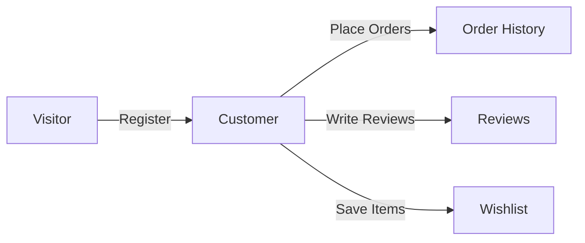

### Email-Based Identity

A Customer's identity is established through their email address. THE system SHALL require an email address and password for registration.

THE system SHALL ensure each email address is associated with only one customer account.

THE system SHALL use the customer's email address as the primary credential for authentication.

WHEN a customer attempts to register with an email already in use, THE system SHALL reject the registration request.

THE system SHALL allow customers to log in using their registered email and password.

THE system SHALL allow customers to change their password through a secure process.

### Customer Profile

Each Customer has a personal profile containing information used for shopping and communication. THE system SHALL maintain a customer profile with a display name and phone number.

THE system SHALL allow customers to update their display name.

THE system SHALL allow customers to update their phone number.

THE system SHALL NOT require customers to provide real names—display names serve as their public identity.

THE profile information SHALL be separate from authentication credentials (email and password).

### Shipping Address Management

Customers maintain multiple shipping addresses to receive orders at different locations. THE system SHALL allow each customer to store multiple shipping addresses.

Each address SHALL include: recipient name, phone number, street address, city, state/province, postal code, and country.

THE system SHALL allow customers to designate one address as the default shipping address.

THE system SHALL allow customers to add new addresses at any time.

THE system SHALL allow customers to edit existing addresses.

THE system SHALL allow customers to delete addresses they no longer need.

WHEN a customer places an order, THE system SHALL allow selection from their saved addresses.

### Product Discovery and Shopping

Customers discover and save products of interest through browsing and search. THE system SHALL allow customers to browse products organized by categories.

THE system SHALL allow customers to search for products by name.

THE system SHALL allow customers to filter and sort search results.

THE system SHALL allow customers to add specific product variants to their shopping cart with a desired quantity.

THE system SHALL allow customers to save products to a wishlist for future consideration.

The shopping cart represents items the customer intends to purchase, while the wishlist represents items of potential interest.

### Order Placement

When ready to purchase, customers convert their cart into a formal order. THE system SHALL allow customers to proceed to checkout from their shopping cart.

THE system SHALL require customers to select a shipping address during checkout.

THE system SHALL require customers to review and confirm their order before payment.

THE system SHALL create an order record upon successful payment.

THE system SHALL remove purchased items from the customer's cart after order creation.

THE system SHALL decrease inventory for each purchased variant.

Each order SHALL receive a unique order number for tracking and reference.

### Post-Purchase Feedback

After receiving products, customers can share their experience through reviews. THE system SHALL allow customers to write reviews for products they have purchased.

THE system SHALL require that an order item has been delivered before a review can be written.

THE system SHALL allow one review per product per order.

Each review SHALL include a rating from 1 to 5 stars.

THE system SHALL allow customers to include optional text content in their reviews.

THE system SHALL allow customers to edit their own reviews.

THE system SHALL allow customers to delete their own reviews.

Reviews contribute to the product's overall rating visible to other customers.

### Order Issue Resolution

Customers can request resolution for order issues through cancellation and refund requests. THE system SHALL allow customers to request cancellation for order items that have not yet shipped (status "paid").

THE system SHALL allow customers to request refunds for order items that have been delivered.

THE system SHALL require a reason when submitting a cancellation or refund request.

THE system SHALL allow refund requests only within 7 days of an item's delivery.

Cancellation requests are reviewed and approved by the seller of that item.

Refund requests are reviewed and approved by the seller of that item.

IF a cancellation is approved, THE system SHALL restore the variant's inventory and update the item status to "cancelled".

IF a refund is approved, THE system SHALL restore the variant's inventory and update the item status to "refunded".

### Account Lifecycle and Data Retention

Customers can delete their account, with specific data retention rules applying for legal and business purposes. THE system SHALL allow customers to delete their account.

WHEN a customer deletes their account, THE system SHALL remove their profile information.

THE system SHALL preserve all orders and order history even after account deletion.

THE system SHALL preserve the customer's reviews but display them as "deleted user".

This retention policy ensures sellers maintain accurate business records and the platform fulfills legal requirements for transaction documentation.

Account deletion is irreversible—the customer cannot recover their account or associated data.

## Seller Concept

A Seller represents a merchant who offers products on the platform. Sellers register with an email and password but must receive administrator approval before they can start selling. Each seller has a shop profile with a name, description, and logo image that customers see when browsing products. Sellers create and manage their own products, including variants with different options and prices. They maintain inventory levels for each variant through inventory records. When customers place orders, sellers process them by creating shipments with tracking information. Sellers respond to cancellation and refund requests from customers. Sellers can delete their account only when they have no pending orders or requests. When deleted, their products are removed but order history and shop name in past orders are preserved.

### Seller Registration and Approval

### Registration Process

WHEN a user registers as a seller, THE system SHALL require a unique email address and a password.

WHEN a seller submits their registration, THE system SHALL create a seller account with a pending approval status.

WHEN a seller account has pending status, THE system SHALL NOT allow the seller to create products or sell on the platform.

### Administrator Approval

WHEN an administrator reviews a pending seller registration, THE system SHALL allow the administrator to approve or reject the registration.

IF an administrator rejects a seller registration, THE system SHALL require the administrator to provide a rejection reason.

WHEN a seller registration is rejected, THE system SHALL display the rejection reason to the seller.

IF a seller registration is rejected, THE system SHALL allow the seller to submit a new registration request.

WHEN a seller registration is approved, THE system SHALL change the seller status to approved and enable selling privileges.

### Status Visibility

WHEN a seller views their account status, THE system SHALL display one of the following statuses: pending, approved, or rejected.

IF the status is rejected, THE system SHALL also display the rejection reason provided by the administrator.

### Shop Profile

### Profile Composition

WHEN a seller sets up their shop profile, THE system SHALL require a shop name.

WHEN a seller sets up their shop profile, THE system SHALL allow an optional shop description and logo image.

WHEN a customer views a product, THE system SHALL display the seller's shop name linked to their profile.

### Profile Editing

WHEN a seller edits their shop name, THE system SHALL update the shop name and create a snapshot of the previous state.

WHEN a seller edits their shop description, THE system SHALL update the description and create a snapshot of the previous state.

WHEN a seller updates their logo image, THE system SHALL update the logo and create a snapshot of the previous state.

WHEN a seller views their profile edit history, THE system SHALL display all snapshots showing when each change was made and the values before and after.

### Profile Visibility

WHEN a customer views a seller's shop profile, THE system SHALL display the shop name, description, and logo image.

WHEN a customer views a seller profile, THE system SHALL display the seller's products available for purchase.

### Product and Inventory Management

### Product Creation

WHEN an approved seller creates a product, THE system SHALL require a name, description, category, and base price.

WHEN a product is created, THE system SHALL associate the product with the seller who created it.

WHEN a seller edits their product, THE system SHALL create a snapshot preserving the previous state of all product fields.

### Product Variants

WHEN a seller adds a variant to a product, THE system SHALL require a unique SKU code and option values.

WHEN a seller adds a variant to a product, THE system SHALL allow an optional price that overrides the product's base price.

WHEN a seller edits a variant, THE system SHALL create a snapshot preserving the previous state of all variant fields.

IF a product has no variants, THE system SHALL display the product in search results but show it as unavailable for purchase.

### Inventory Management

WHEN a seller restocks a variant, THE system SHALL record a positive quantity change with the reason provided by the seller.

WHEN a seller adjusts inventory downward for a variant, THE system SHALL record a negative quantity change with the reason provided by the seller.

WHEN an order is placed for a variant, THE system SHALL automatically create a negative inventory record reducing the stock.

WHEN a customer views a product, THE system SHALL display each variant's availability status based on current stock.

IF a variant's stock reaches zero, THE system SHALL display the variant as out of stock.

IF a variant is out of stock, THE system SHALL prevent customers from adding that variant to their cart.

WHEN a seller views a variant's inventory history, THE system SHALL display all inventory records with quantity changes, reasons, and timestamps.

### Order Fulfillment and Customer Requests

### Order Fulfillment

WHEN a seller views orders for their products, THE system SHALL display all order items with paid status that need shipping.

WHEN a seller creates a shipment, THE system SHALL require a carrier name and tracking number.

WHEN a seller selects items to include in a shipment, THE system SHALL allow the seller to select one or more of their pending items for the same order.

WHEN a shipment is created, THE system SHALL change the status of all included items to shipped.

WHEN a seller creates a shipment, THE system SHALL display the tracking information to the customer.

### Cancellation Request Handling

WHEN a customer requests cancellation for an item, THE system SHALL notify the seller of that item and display the cancellation reason.

WHEN a seller approves a cancellation request, THE system SHALL cancel the item, process the refund, and restore the stock quantity.

WHEN a seller rejects a cancellation request, THE system SHALL notify the customer and preserve the request with rejected status.

WHEN a seller responds to a cancellation request, THE system SHALL create a snapshot of the request state.

### Refund Request Handling

WHEN a customer requests a refund for a delivered item, THE system SHALL notify the seller of that item and display the refund reason.

WHEN a seller approves a refund request, THE system SHALL mark the item as refunded and restore the stock quantity.

WHEN a seller rejects a refund request, THE system SHALL notify the customer and preserve the request with rejected status.

WHEN a seller responds to a refund request, THE system SHALL create a snapshot of the request state.

### Account and Data Lifecycle

### Account Deletion Restrictions

WHEN a seller requests to delete their account, THE system SHALL check for pending order items with paid or shipped status.

IF any pending order items exist for the seller's products, THE system SHALL reject the account deletion request.

WHEN a seller requests to delete their account, THE system SHALL check for pending cancellation or refund requests.

IF any pending cancellation or refund requests exist for the seller's products, THE system SHALL reject the account deletion request.

### Product Deletion Cascade

WHEN a seller deletes a product, THE system SHALL check for pending order items with paid or shipped status for any variant.

IF pending order items exist for any variant, THE system SHALL reject the product deletion.

WHEN a seller deletes a product, THE system SHALL check for pending cancellation or refund requests for any variant.

IF pending requests exist for any variant, THE system SHALL reject the product deletion.

WHEN a product is deleted, THE system SHALL remove all variants and inventory records associated with that product.

WHEN a product is deleted, THE system SHALL remove the product from search results and category listings.

### Order History Preservation

WHEN a seller account is deleted, THE system SHALL preserve all order history and order item records.

WHEN a seller account is deleted, THE system SHALL preserve all order item snapshots containing product and variant information.

WHEN a seller account is deleted, THE system SHALL preserve the seller's shop name in past order records.

WHEN a customer or administrator views historical orders from a deleted seller, THE system SHALL display the preserved shop name and product snapshots.

## Administrator Concept

An Administrator represents a platform manager responsible for overseeing operations and enforcing policies. Administrators exist in two grades: regular administrators and super administrators, with super administrators having elevated privileges including promoting others. Regular administrators manage seller approvals, category management, product oversight, and user management tasks. Super administrators additionally handle administrator role assignments and promotions. Both grades can view and manage seller registrations, approving or rejecting applications with reasons. Administrators can suspend seller accounts when needed, which hides products without affecting ongoing orders. They oversee all products and orders on the platform and can force-cancel or force-refund items in dispute situations. Administrators can ban both customers and sellers from logging into the platform. Super administrators cannot demote themselves to regular administrator status.

### Administrator Role and Purpose

### Administrator Role Definition

An Administrator represents a platform manager responsible for overseeing operations and enforcing platform policies.

THE system SHALL maintain administrator accounts as distinct from customer and seller accounts.

THE system SHALL allow administrators to access platform-wide oversight functions not available to other actors.

THE system SHALL ensure administrators can perform management tasks on behalf of platform integrity.

### Platform Oversight Scope

THE system SHALL grant administrators visibility into all customer accounts, seller accounts, products, and orders on the platform.

THE system SHALL enable administrators to intervene in seller registrations, product listings, and order disputes.

THE system SHALL allow administrators to enforce platform rules through account suspension, banning, and content removal.

### Administrator Accountability

WHEN an administrator performs any oversight action, THE system SHALL record which administrator performed the action.

THE system SHALL maintain an audit trail of all administrator interventions for accountability purposes.

### Administrator Grade Structure

### Grade Definition

THE system SHALL support two administrator grades: regular administrator and super administrator.

THE system SHALL associate each administrator account with exactly one grade.

### Regular Administrator Capabilities

THE system SHALL allow regular administrators to:
1. Approve or reject seller registrations
2. Create, edit, and delete categories
3. View all products and their snapshots
4. Delete any product for policy violations
5. View all orders and force-cancel or force-refund items
6. Ban and unban customers and sellers
7. Suspend and unsuspend seller accounts

### Super Administrator Capabilities

THE system SHALL allow super administrators to perform all actions available to regular administrators.

Additionally, THE system SHALL allow super administrators to:
1. View and respond to administrator role requests
2. Promote regular administrators to super administrator
3. Demote other super administrators to regular administrator

### Grade-Based Access Control

WHEN an administrator attempts an action, THE system SHALL verify the administrator's grade permits that action.

IF an administrator lacks the required grade for an action, THE system SHALL reject the request.

THE system SHALL not allow regular administrators to access super administrator-only functions.

### Seller Approval Management

### Pending Seller Review

THE system SHALL provide administrators with a list of all pending seller registration requests.

WHEN viewing a pending seller registration, THE system SHALL display:
1. Seller email address
2. Shop name
3. Shop description
4. Submitted date

### Approval Process

WHEN an administrator approves a seller registration, THE system SHALL:
1. Change the seller's status to "approved"
2. Enable the seller to create products and manage their shop
3. Record which administrator approved the registration

### Rejection Process

WHEN an administrator rejects a seller registration, THE system SHALL:
1. Require the administrator to provide a rejection reason
2. Change the seller's status to "rejected"
3. Make the rejection reason visible to the rejected seller
4. Record which administrator rejected the registration

IF an administrator attempts to reject without providing a reason, THE system SHALL reject the request.

### Reapplication Support

THE system SHALL allow rejected sellers to submit a new registration request.

WHEN a rejected seller submits a new request, THE system SHALL:
1. Reset the seller's status to "pending"
2. Update the seller's information
3. Make the new request available for administrator review

### Category Management Authority

### Category Creation

THE system SHALL allow administrators to create categories with a name and description.

THE system SHALL allow administrators to create subcategories under existing categories.

THE system SHALL limit category nesting to one level (categories can have subcategories, but subcategories cannot have further subcategories).

### Category Editing

THE system SHALL allow administrators to edit category names and descriptions.

WHEN a category name is changed, THE system SHALL update all references to display the new name.

### Category Deletion

THE system SHALL allow administrators to delete categories.

WHEN a category is deleted, THE system SHALL:
1. Remove the category from listings
2. Set any products in that category to "uncategorized"
3. Preserve the products themselves

IF a category has subcategories, THE system SHALL delete all subcategories when the parent is deleted.

### Category Visibility

THE system SHALL make categories visible to all users for browsing products.

THE system SHALL not allow non-administrator users to create, edit, or delete categories.

### Product Oversight Authority

### Product Visibility

THE system SHALL allow administrators to view all products on the platform regardless of seller or status.

THE system SHALL allow administrators to view snapshots of any product to review its modification history.

### Product Removal

THE system SHALL allow administrators to delete any product for policy violations.

WHEN an administrator deletes a product, THE system SHALL:
1. Remove the product from search results and category listings
2. Delete all variants and inventory records
3. Preserve order history and snapshots for records
4. Record which administrator performed the deletion

### Oversight Restrictions

THE system SHALL not allow administrators to edit product details; editing remains the seller's responsibility.

THE system SHALL not allow administrators to modify product variants or inventory directly.

THE system SHALL allow administrators to view but not modify seller product snapshots.

### Order Intervention Powers

### Order Visibility

THE system SHALL allow administrators to view all orders on the platform.

THE system SHALL allow administrators to view order details including:
1. Customer information
2. Order items and their statuses
3. Shipping address
4. Shipment tracking information
5. Cancellation and refund requests

### Force Cancellation

THE system SHALL allow administrators to force-cancel individual order items.

WHEN an administrator force-cancels an order item, THE system SHALL:
1. Change the item status to "cancelled"
2. Process a refund to the customer for that item
3. Restore stock quantity for that variant via an inventory record
4. Record which administrator performed the cancellation

THE system SHALL allow administrators to force-cancel entire orders (all items).

### Force Refund

THE system SHALL allow administrators to force-refund individual order items.

WHEN an administrator force-refunds an order item, THE system SHALL:
1. Change the item status to "refunded"
2. Process a refund to the customer for that item
3. Restore stock quantity for that variant via an inventory record
4. Record which administrator performed the refund

THE system SHALL allow administrators to force-refund entire orders (all items).

### Intervention Documentation

WHEN an administrator performs any order intervention, THE system SHALL require documentation of the reason.

THE system SHALL maintain records of all administrator interventions for audit purposes.

### User Management Powers

### Customer Banning

THE system SHALL allow administrators to ban customer accounts.

WHEN a customer is banned, THE system SHALL:
1. Prevent the customer from logging in
2. Preserve the customer's order history and reviews
3. Record which administrator performed the ban

THE system SHALL allow administrators to unban previously banned customers.

WHEN a customer is unbanned, THE system SHALL restore their ability to log in.

### Seller Banning

THE system SHALL allow administrators to ban seller accounts.

WHEN a seller is banned, THE system SHALL:
1. Prevent the seller from logging in
2. Hide all products from search and category listings
3. Preserve existing orders for fulfillment
4. Record which administrator performed the ban

THE system SHALL allow administrators to unban previously banned sellers.

### Seller Suspension

THE system SHALL allow administrators to suspend seller accounts.

WHEN a seller is suspended, THE system SHALL:
1. Hide all products from search and category listings
2. Prevent products from being purchased
3. Allow the seller to process existing orders (ship items, respond to requests)
4. Prevent the seller from creating new products or editing existing products
5. Allow the seller to log in
6. Record which administrator performed the suspension

THE system SHALL allow administrators to unsuspend previously suspended sellers.

WHEN a seller is unsuspended, THE system SHALL:
1. Restore product visibility in search and category listings
2. Enable products to be purchased again
3. Restore the seller's ability to create and edit products

### Distinction Between Ban and Suspension

THE system SHALL distinguish between banning (no login access) and suspension (limited login access).

THE system SHALL apply different restrictions based on whether a seller is banned or suspended.

### Administrator Promotion and Demotion

### Administrator Request Review

THE system SHALL allow super administrators to view all pending administrator role requests.

WHEN viewing a request, THE system SHALL display:
1. Requester's current role (customer or seller)
2. Requester's email
3. Submitted reason for requesting administrator access
4. Submission date

### Administrator Approval

THE system SHALL allow super administrators to approve administrator role requests.

WHEN a super administrator approves a request, THE system SHALL:
1. Create a regular administrator account for the requester
2. Grant the requester access to administrator functions
3. Record which super administrator approved the request

### Administrator Rejection

THE system SHALL allow super administrators to reject administrator role requests.

WHEN a super administrator rejects a request, THE system SHALL:
1. Notify the requester of the rejection
2. Record which super administrator rejected the request

### Promotion to Super Administrator

THE system SHALL allow super administrators to promote regular administrators to super administrator.

WHEN a promotion occurs, THE system SHALL:
1. Change the administrator's grade to "super"
2. Grant access to super administrator-only functions
3. Record which super administrator performed the promotion

### Demotion from Super Administrator

THE system SHALL allow super administrators to demote other super administrators to regular administrator.

WHEN a demotion occurs, THE system SHALL:
1. Change the administrator's grade to "regular"
2. Remove access to super administrator-only functions
3. Record which super administrator performed the demotion

### Self-Demotion Restriction

IF a super administrator attempts to demote themselves, THE system SHALL reject the request.

THE system SHALL enforce that super administrators can only demote other super administrators, not themselves.

This restriction prevents the scenario where a platform loses all super administrators.

## AdministratorRequest Concept

An AdministratorRequest represents a user's application to become an administrator. Any existing user, whether a customer or seller, can submit a request explaining why they should become an administrator. The request includes a reason text field where the applicant justifies their suitability for the role. Super administrators review pending requests and decide to approve or reject them. When a request is approved, the user gains administrator privileges with the regular grade. If rejected, the user remains in their original role but may submit a new request later. Each request has a status tracking its progress through pending, approved, or rejected states. The reviewedAt timestamp records when a decision was made. This concept ensures that administrator access is granted through a controlled review process rather than automatic assignment.

### Administrator Request Purpose

An AdministratorRequest represents a formal application from an existing platform user to obtain administrator privileges.

THE AdministratorRequest SHALL serve as the controlled mechanism through which users transition from customer or seller roles to administrator roles.

THE system SHALL require all users seeking administrator access to submit an AdministratorRequest rather than being automatically assigned the role.

THE AdministratorRequest SHALL capture the applicant's justification for why they should be granted administrator privileges.

THE AdministratorRequest SHALL maintain a record of each application regardless of its outcome for audit purposes.

THE system SHALL ensure that administrator access is granted only through the approved AdministratorRequest process.

This concept exists to provide controlled, auditable access to administrative functions, ensuring that platform oversight capabilities are assigned through deliberate review rather than arbitrary assignment.

### Request Required Attributes

Each AdministratorRequest SHALL capture the following information:

THE AdministratorRequest SHALL include a reason text field where the applicant explains their suitability for the administrator role.

THE AdministratorRequest SHALL record the status of the request, which SHALL be one of: pending, approved, or rejected.

THE AdministratorRequest SHALL capture the timestamp when the request was submitted.

THE AdministratorRequest SHALL include a reference to the requesting user, who SHALL be either a Customer or a Seller.

THE AdministratorRequest SHALL capture the reviewedAt timestamp when a decision is made on the request.

THE AdministratorRequest SHALL include a reference to the Administrator who reviewed the request when a decision is recorded.

IF a request has not yet been reviewed, THE reviewedAt timestamp and reviewer reference SHALL not be present.

IF a request has been reviewed, THE reviewedAt timestamp and reviewer reference SHALL be mandatory and immutable.

### Request Status Lifecycle

The AdministratorRequest SHALL progress through defined status states from submission to resolution.

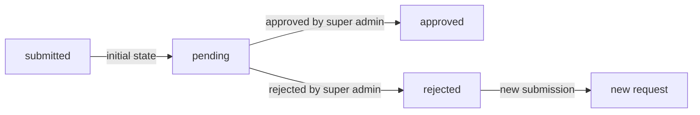

WHEN a user submits an AdministratorRequest, THE request SHALL begin with status "pending".

THE "pending" status SHALL indicate that the request is awaiting review by a super administrator.

WHEN a super administrator approves a pending request, THE status SHALL transition to "approved".

WHEN a super administrator rejects a pending request, THE status SHALL transition to "rejected".

THE approved and rejected statuses SHALL be terminal states for that specific request.

THE system SHALL allow users with rejected requests to submit new AdministratorRequests.

THE system SHALL maintain the history of all previous requests submitted by a user, including rejected ones.

### Super Administrator Review Authority

THE authority to review and decide AdministratorRequests SHALL be restricted to super administrators only.

THE system SHALL permit super administrators to view all pending AdministratorRequests.

THE system SHALL NOT permit regular administrators to review or decide AdministratorRequests.

WHEN a super administrator reviews a request, THE system SHALL require them to make an approval or rejection decision.

THE super administrator reviewing a request SHALL be recorded as the reviewer for audit purposes.

THE system SHALL ensure that the reviewer cannot approve their own request for administrator privileges.

This controlled access ensures that administrator privileges are granted only through established oversight by the highest-level administrators, maintaining platform security and accountability.

### Approval Outcome and Role Transition

WHEN an AdministratorRequest is approved, THE system SHALL transition the requesting user to an Administrator role with regular grade.

THE role transition from Customer or Seller to Administrator SHALL occur immediately upon approval.

THE newly created Administrator SHALL have regular grade privileges, not super administrator privileges.

THE user's previous role (Customer or Seller) SHALL be superseded by the Administrator role.

THE approved AdministratorRequest SHALL remain as a permanent record of how the user obtained administrator access.

IF the user was previously a Seller, THE system SHALL preserve their seller-related data for historical reference.

IF the user was previously a Customer, THE system SHALL preserve their customer-related data for historical reference.

### Rejection Outcome and Resubmission

WHEN an AdministratorRequest is rejected, THE user SHALL remain in their original role as either a Customer or a Seller.

THE rejected AdministratorRequest SHALL be preserved as a historical record.

THE system SHALL permit users with rejected requests to submit new AdministratorRequests.

THE system SHALL NOT impose a waiting period between rejection and new submission.

EACH new AdministratorRequest SHALL be evaluated independently without automatic bias from previous rejections.

THE user SHALL retain all privileges and capabilities of their original Customer or Seller role after rejection.

THE rejected status SHALL indicate that the user's justification was not accepted by the reviewing super administrator.

## Category Concept

A Category represents an organizational structure for grouping related products. Categories help customers navigate and discover products by grouping similar items together. Each category has a name and description that explains what kind of products belong there. Categories support one level of nesting, allowing subcategories beneath parent categories for more specific organization. For example, a parent category "Electronics" might contain subcategories like "Phones" and "Laptops". Only administrators can create, edit, or delete categories. Customers browse the category list to find products and can view all products within a specific category. When a category is deleted, products that were in that category become uncategorized but remain available on the platform. Products must be assigned to a category when created by sellers.

### Category Purpose and Structure

### Category Purpose and Structure

A Category represents an organizational grouping that helps customers discover and navigate products on the platform.

THE system SHALL provide categories as the primary means of organizing products into logical groups.

THE system SHALL use categories to enable customers to find related products without searching by specific terms.

THE system SHALL group products by their assigned category for browsing purposes.

THE system SHALL display categories as navigation options for customers exploring the platform.

WHEN a customer browses the platform, THE system SHALL present categories as the entry point for product discovery.

THE system SHALL support product organization through a hierarchical category structure.

### Category Attributes

### Category Attributes

Each category has identifying and descriptive information that explains its purpose.

THE system SHALL require a name for every category.

THE system SHALL allow an optional description for each category.

THE system SHALL use the category name to identify the category to customers and administrators.

THE system SHALL use the category description to explain what types of products belong in that category.

WHEN an administrator creates a category, THE system SHALL require the administrator to provide a name.

WHEN an administrator creates a category, THE system SHALL allow the administrator to optionally provide a description.

### Category Hierarchy and Nesting

### Category Hierarchy and Nesting

Categories support a single level of nesting to provide more specific product organization.

THE system SHALL support one level of subcategory nesting beneath parent categories.

THE system SHALL NOT support nesting beyond one level (no sub-subcategories).

THE system SHALL allow subcategories to exist under parent categories.

THE system SHALL require each subcategory to have exactly one parent category.

THE system SHALL allow parent categories to have zero or more subcategories.

THE system SHALL treat subcategories as more specific classifications within their parent category.

WHEN a customer views a parent category, THE system SHALL display products in that category and all its subcategories.

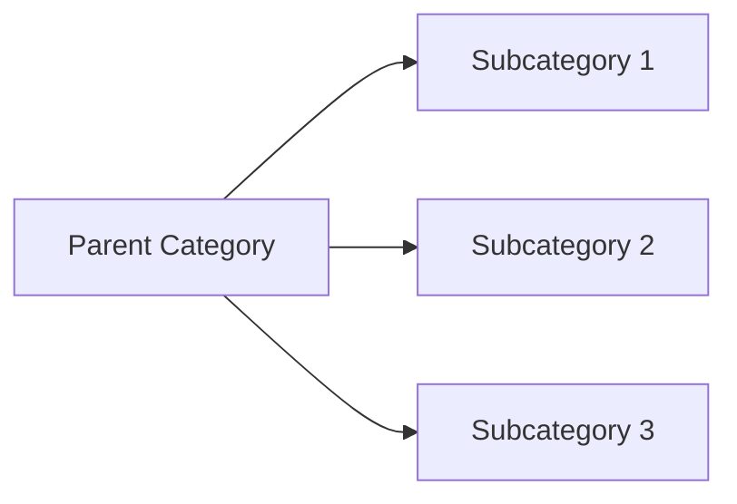

### Category Management Permissions

### Category Management Permissions

Only administrators can create, modify, and delete categories.

THE system SHALL restrict category creation to administrators only.

THE system SHALL restrict category editing to administrators only.

THE system SHALL restrict category deletion to administrators only.

IF a non-administrator user attempts to create a category, THE system SHALL reject the request.

IF a non-administrator user attempts to edit a category, THE system SHALL reject the request.

IF a non-administrator user attempts to delete a category, THE system SHALL reject the request.

WHEN an administrator creates a category, THE system SHALL allow the administrator to specify whether it is a parent category or a subcategory.

WHEN an administrator creates a subcategory, THE system SHALL require the administrator to select a parent category.

### Category Browsing for Customers

### Category Browsing for Customers

Customers can browse categories to discover products.

THE system SHALL allow customers to view the list of all categories.

THE system SHALL display the category hierarchy when customers browse categories.

THE system SHALL allow customers to select a category to view products within it.

WHEN a customer selects a category, THE system SHALL display all products assigned to that category.

WHEN a customer selects a parent category, THE system SHALL display products from that category and all its subcategories.

WHEN a customer selects a subcategory, THE system SHALL display only products assigned to that specific subcategory.

THE system SHALL NOT require authentication for customers to browse categories.

### Category Deletion Behavior

### Category Deletion Behavior

When a category is deleted, products previously in that category do not disappear from the platform.

WHEN an administrator deletes a category, THE system SHALL remove the category from the category list.

WHEN an administrator deletes a category, THE system SHALL set the category assignment of all products in that category to uncategorized.

THE system SHALL NOT delete products when their category is deleted.

THE system SHALL make uncategorized products still searchable and purchasable.

THE system SHALL display uncategorized products without a category label.

WHEN an administrator deletes a parent category that has subcategories, THE system SHALL also delete all subcategories under that parent.

WHEN an administrator deletes a parent category with subcategories, THE system SHALL set all products in the parent and subcategories to uncategorized.

### Required Product Category Assignment

### Required Product Category Assignment

Every product must be assigned to a category when created.

THE system SHALL require a category assignment for every product.

WHEN a seller creates a product, THE system SHALL require the seller to select a category.

THE system SHALL allow sellers to select either a parent category or a subcategory for their product.

IF a seller attempts to create a product without selecting a category, THE system SHALL reject the request.

WHEN a seller edits a product, THE system SHALL allow the seller to change the product's category.

THE system SHALL require the new category assignment to be valid when a seller changes a product's category.

## Product Concept

A Product represents an item available for sale on the platform, created by a seller. Every product has a name, description, category assignment, and base price as required information. Products belong exclusively to the seller who created them. Products can have multiple images that showcase the item, with the first image serving as the main thumbnail. Products can have multiple variants representing different option combinations like size or color. A product must have at least one variant to be purchasable; products without variants appear in search but show as unavailable. Sellers can edit their products at any time, with each edit creating a snapshot for historical record. Products can be deleted only when no pending orders or cancellation/refund requests exist for any variant. Deleted products disappear from search and category listings. Both sellers and administrators can view product snapshots for dispute resolution.

### Product Definition and Purpose

A Product represents a sellable item listing on the platform.

THE system SHALL allow sellers to create products representing items available for purchase.

THE system SHALL require each product to have exactly one seller who owns it.

THE system SHALL prevent products from existing without seller ownership.

WHEN a seller creates a product, THE system SHALL associate that product with the creating seller exclusively.

### Required Product Information

THE system SHALL require a name for every product.

THE system SHALL require a description for every product.

THE system SHALL require a base price for every product.

IF any required field (name, description, or base price) is missing, THE system SHALL prevent the product from being created.

THE system SHALL allow sellers to modify the name, description, and base price of their products.

THE system SHALL validate that the base price is a positive value.

### Category Assignment

THE system SHALL require every product to be assigned to exactly one category.

THE system SHALL allow sellers to select either a top-level category or a subcategory for their products.

THE system SHALL prevent products from being created without a category assignment.

WHEN a seller assigns a product to a subcategory, THE system SHALL recognize that product as belonging to both the subcategory and its parent category for browsing purposes.

### Product Images Container

THE system SHALL allow products to have multiple images.

THE system SHALL recognize the first image in display order as the main thumbnail image.

WHEN a product has no images, THE system SHALL still allow the product to exist.

THE system SHALL display the main image in product listings and search results.

(Individual image management is detailed in the ProductImage Concept section.)

### Product Variants Container

THE system SHALL allow products to have multiple variants representing different option combinations.

THE system SHALL treat variants as children of a product.

WHEN a seller adds a variant to a product, THE system SHALL associate that variant with the parent product.

WHEN a seller removes a variant from a product, THE system SHALL check for pending orders before allowing removal.

(Variant configuration is detailed in the ProductVariant Concept section.)

### Purchasability Requirement

THE system SHALL consider a product purchasable only when it has at least one variant.

WHEN a product has no variants, THE system SHALL display the product in search results with an unavailable status.

THE system SHALL prevent customers from adding products without variants to their cart.

WHEN a product's last variant is deleted, THE system SHALL update the product to unavailable status.

### Product Editing and Snapshots

WHEN a seller edits a product, THE system SHALL create a snapshot preserving the previous state.

THE system SHALL record when the change was made, what was changed, and the values before and after in each snapshot.

THE system SHALL make snapshots immutable and undeletable.

THE system SHALL preserve snapshots even after product deletion.

(Snapshot structure is detailed in the ProductSnapshot Concept section.)

### Product Deletion Restrictions

THE system SHALL allow sellers to delete their own products.

IF a product has any pending order items (paid or shipped status), THE system SHALL prevent deletion.

IF a product has any pending cancellation or refund requests, THE system SHALL prevent deletion.

WHEN a product is deleted, THE system SHALL remove all variants and inventory records associated with that product.

WHEN a product is deleted, THE system SHALL preserve order history and snapshots.

### Search and Category Visibility

THE system SHALL display products in search results.

THE system SHALL display products within their assigned category pages.

WHEN a product is deleted, THE system SHALL remove it from search results.

WHEN a product is deleted, THE system SHALL remove it from category listings.

WHEN a seller's account is suspended, THE system SHALL hide their products from search and category listings.

THE system SHALL prevent customers from purchasing products with suspended seller status.

### Snapshot Viewing for Disputes

THE system SHALL allow sellers to view snapshots of their own products.

THE system SHALL allow administrators to view snapshots of any product.

THE system SHALL preserve all snapshots for dispute resolution purposes.

THE system SHALL provide access to snapshots for relevant parties involved in disputes.

## ProductImage Concept

A ProductImage represents a visual representation of a product uploaded by the seller. Sellers can upload multiple images for each product to show different angles, features, or uses of the item. Each image has a display order that determines its position in the product gallery. The first image in the order serves as the main thumbnail shown in search results and category listings. Sellers can reorder images to change which one appears as the main image. Images can be deleted individually from a product. When a product is edited to add, remove, or reorder images, these changes are captured in the product snapshot. Images help customers make informed purchasing decisions by providing visual details about the product. Product images are preserved in snapshots to maintain historical accuracy of product appearance.

### Purpose and Role of Product Images

Product images serve as visual representations of products to help customers understand the appearance, features, and details of items before making a purchase decision.

THE system SHALL allow sellers to associate multiple images with each product they create.

THE system SHALL use product images to provide customers with visual information about the product's appearance, condition, and features.

THE system SHALL display product images in the product gallery when customers view a product's details.

THE system SHALL make images available to customers browsing search results, category listings, and product detail pages.

WHEN a customer views a product listing, THE system SHALL display at least one image representing the product.

THE system SHALL support product images as the primary means for customers to assess product appearance and quality remotely.

Product images complement the product description to provide customers with comprehensive information for purchasing decisions.

### Image Upload and Display Order

Sellers manage multiple images per product with control over the order in which images appear.

WHEN a seller uploads a new image for a product, THE system SHALL assign it a display order position.

THE system SHALL maintain a display order for each product image to determine the sequence in which images appear.

WHEN a seller uploads multiple images for a product, THE system SHALL preserve the order relationship between all images.

THE system SHALL allow sellers to change the display order of images after upload.

WHEN a seller changes the display order of images, THE system SHALL update the positioning of all affected images.

THE system SHALL store the display order as an integer value that determines the image's position in the product gallery.

IF multiple images have the same display order value, THE system SHALL resolve the ordering based on upload timestamp.

THE display order determines which image appears first, second, and so on in the product gallery view.

### Main Thumbnail Designation

The main thumbnail image is the primary visual representation shown in condensed views like search results and category listings.

THE system SHALL designate the first image in display order as the main thumbnail for the product.

WHEN images are reordered, THE system SHALL automatically update the main thumbnail to be the image now in the first position.

THE system SHALL display the main thumbnail image whenever a condensed product view is shown (search results, category listings, wishlist views).

WHEN a product has only one image, THE system SHALL use that image as both the main thumbnail and the complete product gallery.

IF a seller wants a different image as the main thumbnail, THE system SHALL require the seller to reorder images to place the desired image first.

THE system SHALL not allow sellers to designate a main thumbnail independent of display order—the first position always determines the thumbnail.

The main thumbnail serves as the product's primary visual identifier across the platform.

### Image Management Operations

Sellers have full control over adding, reordering, and deleting product images throughout the product's lifecycle.

THE system SHALL allow sellers to upload additional images to existing products at any time.

THE system SHALL allow sellers to delete individual images from a product's image gallery.

WHEN a seller deletes an image, THE system SHALL remove it from the product's image collection and adjust the display order of remaining images.

IF a seller deletes the main thumbnail image (first image), THE system SHALL promote the next image in display order to become the new main thumbnail.

IF a seller deletes the only remaining image for a product, THE system SHALL display the product without an image in listings.

WHEN a seller reorders images to change which appears first, THE system SHALL update the main thumbnail accordingly.

THE system SHALL not impose a maximum limit on the number of images per product (subject to storage constraints).

All image management operations are available to the seller who owns the product.

### Snapshot Inclusion and Historical Preservation

Product images are preserved in snapshots to maintain historical accuracy of product appearance at critical points in time.

WHEN a product is edited and a snapshot is created, THE system SHALL include all current images in the product snapshot.

THE product snapshot SHALL capture the images with their display order at the time of the snapshot.

THE system SHALL preserve the complete set of images in each snapshot, not just the main thumbnail.

WHEN an order item is created, THE system SHALL save a snapshot of the product including all images visible at the time of purchase.

Snapshots SHALL preserve images to show customers and sellers exactly what the product looked like at the time of purchase for dispute resolution.

THE system SHALL not modify historical image snapshots when sellers later change, add, or delete product images.

WHEN viewing a historical snapshot, THE system SHALL display the images as they existed at the time the snapshot was created.

Historical image preservation ensures accurate records for order verification, dispute resolution, and audit purposes.

## ProductVariant Concept

A ProductVariant represents a specific purchasable configuration of a product, identified by a unique SKU code. Variants define different option combinations such as color, size, or material that customers can choose from. Each variant has option values that describe its specific characteristics, like "Red" for color or "Large" for size. Variants can have their own price that overrides the product's base price, allowing different pricing for different configurations. Each variant maintains its own stock quantity, tracked through inventory records rather than a single value. Customers must select a specific variant when adding items to their cart, not just the product. Sellers can add, edit, or delete variants as needed, with edits creating snapshots. A variant can only be deleted if there are no pending orders or cancellation/refund requests for it. When stock reaches zero, the variant shows as out of stock and cannot be added to carts.

### Variant Identity and Configuration

### Definition

A ProductVariant represents a specific purchasable configuration of a product. Each variant defines a distinct combination of options that customers can select, such as color and size.

### Unique Identification

THE system SHALL assign each variant a unique SKU code that identifies it across the entire platform.

THE system SHALL require a SKU code for every variant.

THE system SHALL reject any variant with a SKU code that already exists in the system.

### Option Values

THE system SHALL allow each variant to specify option values that define its characteristics.

THE system SHALL store option values as a combination of attributes such as color, size, or material.

THE system SHALL display option values to customers so they can distinguish between variants of the same product.

WHEN a customer views a product, THE system SHALL present all available variants with their respective option values.

### Relationship to Product

THE system SHALL associate each variant with exactly one product.

THE system SHALL allow a product to have multiple variants representing different configurations.

THE system SHALL require at least one variant for a product to be purchasable.

IF a product has no variants, THE system SHALL display the product as unavailable for purchase.

### Variant Pricing

### Base Price Relationship

THE system SHALL use the product's base price as the default price for a variant.

### Price Override

THE system SHALL allow a variant to specify its own price that overrides the product's base price.

IF a variant has a custom price, THE system SHALL display that price instead of the base price.

IF a variant does not have a custom price, THE system SHALL display the product's base price.

### Price Display

WHEN displaying a product listing, THE system SHALL show either the base price or a price range based on variant prices.

IF variants have different prices, THE system SHALL display a price range showing the minimum and maximum prices.

IF all variants have the same price, THE system SHALL display a single price.

### Stock Management

### Individual Stock Tracking

THE system SHALL maintain a separate stock quantity for each variant.

THE system SHALL NOT share stock quantities between variants of the same product.

### Inventory Record Relationship

THE system SHALL track stock quantities through inventory records rather than a single stored value.

THE system SHALL calculate current stock by summing all inventory records for a variant.

WHEN stock is increased, THE system SHALL create an inventory record with a positive quantity change.

WHEN stock is decreased, THE system SHALL create an inventory record with a negative quantity change.

### Stock Availability Display

WHEN stock quantity reaches zero, THE system SHALL mark the variant as out of stock.

THE system SHALL display out-of-stock status to customers viewing the product.

THE system SHALL prevent customers from adding out-of-stock variants to their cart.

### Automatic Stock Updates

WHEN an order is placed, THE system SHALL automatically create a negative inventory record for each purchased variant.

WHEN an order is cancelled, THE system SHALL automatically create a positive inventory record to restore stock.

WHEN a refund is processed, THE system SHALL automatically create a positive inventory record to restore stock.

### Customer Purchase Behavior

### Cart Addition Requirement

WHEN a customer adds an item to their cart, THE system SHALL require selection of a specific variant.

THE system SHALL NOT allow customers to add a product to cart without selecting a variant.

WHEN a customer adds a variant to cart, THE system SHALL require the customer to specify a quantity.

### Duplicate Variant Handling

IF the same variant is already in the customer's cart, THE system SHALL combine the quantities into a single cart item.

THE system SHALL NOT create duplicate cart entries for the same variant.

### Unavailable Variant Handling

IF a variant is deleted by the seller, THE system SHALL mark the variant as unavailable in any carts containing it.

IF a variant becomes out of stock, THE system SHALL prevent checkout of cart items containing that variant.

THE system SHALL display a warning to customers when a variant's stock is less than the cart quantity.

### Seller Variant Management

### Variant Addition

THE system SHALL allow sellers to add variants to their products.

THE system SHALL require a unique SKU code for each new variant.

THE system SHALL require a stock quantity for each new variant.

THE system SHALL allow sellers to specify option values for each variant.

THE system SHALL allow sellers to optionally set a custom price for each variant.

### Variant Editing

THE system SHALL allow sellers to edit their variants' SKU code, option values, and price.

WHEN a seller edits a variant, THE system SHALL create a snapshot preserving the previous state.

THE system SHALL record the timestamp and changes made for each edit.

### Snapshot Creation

THE system SHALL create a variant snapshot whenever any variant field is modified.

THE system SHALL preserve snapshots even after the variant is deleted.

THE system SHALL allow sellers to view snapshots of their variants.

THE system SHALL allow administrators to view snapshots of any variant.

### Deletion Restrictions

IF a variant has pending order items with paid or shipped status, THE system SHALL prevent deletion of that variant.

IF a variant has pending cancellation or refund requests, THE system SHALL prevent deletion of that variant.

WHEN a seller deletes a variant, THE system SHALL remove the variant from product listings.

WHEN a seller deletes a product, THE system SHALL delete all variants associated with that product.

## ProductSnapshot Concept

A ProductSnapshot represents a preserved historical state of a product at a specific point in time. Snapshots are created automatically whenever a product or its variants are edited, capturing all field values before changes take effect. Each snapshot records when the change was made, what was changed, and the values before and after. Product snapshots include all product fields: name, description, category, base price, and images. Crucially, product snapshots also embed snapshots of all variants at that moment, preserving the complete state. This comprehensive approach ensures that the entire product configuration is preserved together. Snapshots are immutable and cannot be deleted, ensuring historical integrity. Sellers can view snapshots of their own products while administrators can view any product's snapshots. Snapshots serve as evidence for dispute resolution when disagreements arise about what was sold.

### Historical State Preservation

THE system SHALL create a ProductSnapshot to preserve the complete state of a product at a specific point in time.

THE system SHALL ensure that each snapshot represents an immutable historical record of the product configuration.

THE system SHALL maintain snapshots independently from the current product state, ensuring historical accuracy regardless of subsequent changes.

THE system SHALL use snapshots to document what was actually available for purchase at any given moment.

### Automatic Creation on Edit

WHEN a seller edits a product, THE system SHALL automatically create a ProductSnapshot before the changes take effect.

WHEN a seller edits any product variant, THE system SHALL automatically create a ProductSnapshot that captures all variants at that moment.

THE system SHALL create a snapshot for every product modification without exception or manual intervention.

THE system SHALL NOT allow sellers to manually create or skip snapshot creation.

### Change Timestamp Recording

THE system SHALL record the exact creation timestamp for each ProductSnapshot.

THE system SHALL associate each snapshot with the point in time when the product state was captured.

WHEN displaying snapshots, THE system SHALL show the chronological order of product state changes.

### Complete Product State Capture

THE system SHALL capture the following product fields in each ProductSnapshot: name, description, category, base price, and all images with their display order.

THE system SHALL capture the complete product configuration in a single snapshot operation, preserving all fields together.

THE system SHALL ensure that the snapshot represents the product state immediately before the edit was applied.

### Embedded Variant Snapshots

THE system SHALL embed a snapshot of each product variant within the ProductSnapshot.

THE system SHALL capture the following for each variant: SKU code, option values, and price at that moment.

THE system SHALL preserve the complete relationship between product and all its variants in a single snapshot.

THE system SHALL include all variants in the snapshot even if only one variant was modified.

### Immutable and Non-Deletable Records

THE system SHALL make all ProductSnapshots immutable after creation.

THE system SHALL NOT allow any modification to snapshot content under any circumstances.

THE system SHALL prevent deletion of snapshots regardless of user role or administrative authority.

THE system SHALL preserve snapshots even after the original product has been deleted.

### Snapshot Access Control

THE system SHALL allow sellers to view all snapshots of their own products.

THE system SHALL allow administrators to view snapshots of any product on the platform.

THE system SHALL NOT allow sellers to view snapshots of products belonging to other sellers.

THE system SHALL maintain proper access controls ensuring that only authorized parties can view snapshot history.

### Dispute Resolution and Legal Records

THE system SHALL provide snapshots as evidence for dispute resolution when disagreements arise about product details at time of purchase.

THE system SHALL preserve snapshots as legal records for regulatory compliance and audit requirements.

THE system SHALL enable relevant parties to retrieve and view snapshot history for investigation purposes.

THE system SHALL maintain snapshots permanently to support the platform's legal and financial record-keeping obligations.

## InventoryRecord Concept

An InventoryRecord represents a single stock quantity change for a product variant. Unlike snapshots that preserve state, inventory records are additive and used to calculate current stock. Each record contains a quantity change value, positive for additions like restocking and negative for reductions like orders. A reason field explains why the change occurred, such as restock, sale, adjustment, or loss. The current stock of a variant is calculated by summing all inventory records together. When customers place orders, negative inventory records are automatically created for each purchased variant. When orders are cancelled or refunded, positive inventory records restore the stock. Sellers can manually add or subtract inventory with appropriate reasons for adjustments. Sellers can view the complete inventory history of each variant to understand stock movements. This approach provides a complete audit trail of all stock changes for accurate tracking.

### Stock Quantity Change Tracking

An InventoryRecord represents a single, indivisible stock quantity change for a product variant.

THE system SHALL create an InventoryRecord for every stock quantity change affecting a product variant.

THE system SHALL associate each InventoryRecord with exactly one ProductVariant.

THE system SHALL record the quantity change value as a signed integer in each InventoryRecord.

THE system SHALL record the reason for the change in each InventoryRecord.

THE system SHALL record the timestamp when each InventoryRecord was created.

THE system SHALL ensure no InventoryRecord can be modified after creation.

THE system SHALL ensure no InventoryRecord can be deleted after creation.

### Additive Record Approach

Current stock is calculated by summing all inventory records, not stored as a single value.

THE system SHALL calculate the current stock of a ProductVariant by summing all InventoryRecord quantity change values for that variant.

THE system SHALL derive stock quantity solely from the sum of InventoryRecords without maintaining a separate stock counter.

THE system SHALL preserve all InventoryRecords when calculating current stock, including historical records.

WHEN a new InventoryRecord is created, THE system SHALL immediately reflect the updated stock quantity in all stock displays.

IF an InventoryRecord creation fails, THE system SHALL NOT update the calculated stock quantity.

WHEN the sum of InventoryRecords results in zero for a variant, THE system SHALL mark the variant as "out of stock".

### Positive and Negative Values

InventoryRecord quantity change values use positive and negative numbers to represent additions and reductions.

THE system SHALL accept positive quantity change values to represent stock additions.

THE system SHALL accept negative quantity change values to represent stock reductions.

THE system SHALL NOT accept zero as a quantity change value in an InventoryRecord.

WHEN a positive quantity change is recorded, THE system SHALL increase the calculated stock by that amount.

WHEN a negative quantity change is recorded, THE system SHALL decrease the calculated stock by that amount.

IF the absolute value of a negative quantity change exceeds the current calculated stock, THE system SHALL reject the inventory record creation.

### Reason Documentation

Every inventory record must include a reason explaining why the change occurred.

THE system SHALL require a reason text for every InventoryRecord.

THE system SHALL accept reasons for manual inventory adjustments such as restock, adjustment, and loss.

THE system SHALL automatically generate reasons for system-created inventory records.

WHEN an inventory record is created for a customer order, THE system SHALL set the reason to indicate the order.

WHEN an inventory record is created for a cancellation, THE system SHALL set the reason to indicate cancellation.

WHEN an inventory record is created for a refund, THE system SHALL set the reason to indicate refund.

THE system SHALL preserve the original reason text exactly as entered or generated.

### Automatic Order Deduction

When a customer places an order, inventory records are automatically created to reduce stock.

WHEN an order is successfully placed, THE system SHALL create a negative InventoryRecord for each ordered ProductVariant.

THE system SHALL set the quantity change value to the negative of the ordered quantity.

THE system SHALL set the reason to indicate the order that caused the deduction.

WHEN multiple units of the same variant are ordered, THE system SHALL create one InventoryRecord with the combined negative quantity.

IF an order fails before payment completion, THE system SHALL NOT create any InventoryRecords.

THE system SHALL create the InventoryRecords atomically with the order creation to ensure consistency.

### Automatic Refund Restoration

When orders are cancelled or refunded, inventory records automatically restore stock.

WHEN a cancellation request is approved for an order item, THE system SHALL create a positive InventoryRecord to restore stock.

WHEN a refund request is approved for an order item, THE system SHALL create a positive InventoryRecord to restore stock.

THE system SHALL set the quantity change value to the quantity of the cancelled or refunded item.

THE system SHALL set the reason to indicate the cancellation or refund that caused the restoration.

WHEN an administrator force-cancels an order item, THE system SHALL create a positive InventoryRecord to restore stock.

WHEN an administrator force-refunds an order item, THE system SHALL create a positive InventoryRecord to restore stock.

THE system SHALL create the restoration InventoryRecord at the moment the cancellation or refund is finalized.

### Manual Inventory Adjustment

Sellers can manually add or subtract inventory for their product variants.

WHEN a seller adds inventory to a variant, THE system SHALL create a positive InventoryRecord with the added quantity.

WHEN a seller subtracts inventory from a variant, THE system SHALL create a negative InventoryRecord with the subtracted quantity.

THE system SHALL require sellers to provide a reason when manually adjusting inventory.

IF a seller attempts to subtract more than the current stock, THE system SHALL reject the adjustment.

WHEN a seller creates a manual adjustment, THE system SHALL record the seller who made the adjustment.

THE system SHALL allow sellers to adjust inventory only for their own product variants.

THE system SHALL NOT allow manual inventory adjustments for variants in suspended seller accounts.

### Inventory History Viewing

Sellers can view the complete inventory history of each variant they own.

THE system SHALL allow sellers to view all InventoryRecords for their product variants.

THE system SHALL display inventory history sorted by creation timestamp in descending order (newest first).

THE system SHALL display the following information for each InventoryRecord: quantity change, reason, and timestamp.

THE system SHALL provide pagination for inventory history viewing.

Administrators can view inventory history for any product variant on the platform.

THE system SHALL NOT allow customers to view inventory history.

THE system SHALL display inventory history as a chronological log of all stock movements.

### Audit Trail Maintenance

Inventory records serve as an immutable audit trail for all stock changes.

THE system SHALL preserve all InventoryRecords indefinitely, even after product or variant deletion.

THE system SHALL allow administrators to view InventoryRecords for dispute resolution.

THE system SHALL allow sellers to view InventoryRecords for their own variants in dispute resolution.

THE system SHALL ensure InventoryRecords cannot be altered by any user, including administrators.

THE system SHALL ensure InventoryRecords cannot be deleted by any user, including administrators.

WHEN a product variant is deleted, THE system SHALL preserve all associated InventoryRecords.

THE system SHALL maintain the relationship between InventoryRecords and the original ProductVariant even after variant deletion.

### Stock Movement Transparency

All stock movements are fully transparent and traceable through inventory records.

THE system SHALL enable sellers to see the source of every stock change (order, cancellation, refund, or manual adjustment).

THE system SHALL maintain a clear link between each InventoryRecord and its triggering event.

WHEN an InventoryRecord is created by an order, THE system SHALL record the order reference.

WHEN an InventoryRecord is created by a cancellation, THE system SHALL record the cancellation request reference.

WHEN an InventoryRecord is created by a refund, THE system SHALL record the refund request reference.

WHEN an InventoryRecord is created manually, THE system SHALL record the seller who performed the adjustment.

THE system SHALL enable sellers to verify that stock deductions correspond to actual customer orders.

THE system SHALL enable sellers to verify that stock restorations correspond to actual cancellations or refunds.

## Cart Concept

A Cart represents a temporary collection of items a customer intends to purchase. Each customer has their own cart that persists between sessions, allowing them to shop over multiple visits. The cart holds items the customer has selected but not yet purchased, serving as a staging area before checkout. Customers add specific product variants to their cart with desired quantities, not products in general. If the same variant is added again, quantities are combined rather than creating duplicate entries. The cart displays each item with product name, variant options, individual price, quantity, and subtotal. The total price of all items is shown to help customers understand their potential purchase total. Customers can adjust quantities or remove items at any time before checkout. The cart identifies issues like insufficient stock or deleted variants, marking them as unavailable. Unavailable items cannot be included in checkout and must be removed or adjusted.

### Cart Purpose and Persistence

### Cart as Temporary Purchase Collection

THE system SHALL provide each registered customer with a single cart for collecting items intended for purchase.

THE cart SHALL serve as a temporary staging area where customers accumulate product variants before committing to checkout.

THE system SHALL NOT require customers to complete checkout after adding items to their cart.

### Session Persistence

THE system SHALL persist the cart and its contents across customer login sessions.

WHEN a customer logs in, THE system SHALL restore their previously saved cart contents.

THE system SHALL NOT automatically clear the cart contents between sessions.

THE system SHALL preserve cart contents indefinitely until the customer removes items or completes checkout.

### Variant Selection and Quantity Management

### Variant-Specific Selection

WHEN a customer adds an item to the cart, THE system SHALL require selection of a specific product variant with defined option values.

THE system SHALL NOT allow customers to add a product to the cart without selecting a specific variant.

THE system SHALL associate each cart entry with exactly one product variant and its corresponding seller.

### Quantity Combination for Duplicate Variants

WHEN a customer adds a variant that already exists in their cart, THE system SHALL combine the quantities into a single cart entry.

THE system SHALL NOT create separate cart entries for the same product variant.

WHEN combining quantities, THE system SHALL add the new quantity to the existing quantity for that variant.

### Quantity Adjustment

THE system SHALL allow customers to change the quantity of any item in their cart.

IF the requested quantity exceeds available stock, THE system SHALL accept the quantity but display a stock warning.

IF a customer sets a quantity to zero, THE system SHALL remove the item from the cart.

THE system SHALL enforce a minimum quantity of one for each cart item.

### Cart Display and Pricing

### Item Detail Display

WHEN a customer views their cart, THE system SHALL display each item with the following information:
1. Product name
2. Selected variant options (e.g., color, size)
3. Price per unit
4. Selected quantity
5. Subtotal for that item

THE system SHALL display the seller's shop name for each cart item.

### Subtotal Calculation

THE system SHALL calculate and display a subtotal for each cart item by multiplying the unit price by the selected quantity.

WHEN a variant has a custom price override, THE system SHALL use the variant price instead of the product base price.

### Total Price Display

THE system SHALL calculate and display the total price as the sum of all item subtotals in the cart.

THE system SHALL update the total price immediately whenever quantities change or items are added or removed.

WHEN displaying prices, THE system SHALL show the currency and decimal precision appropriate for the platform.

### Stock and Availability Status

### Stock Warning Display

WHEN a variant's available stock is less than the quantity in the cart, THE system SHALL display a warning indicating insufficient stock.

THE system SHALL indicate the maximum quantity currently available for purchase.

THE system SHALL NOT prevent customers from maintaining quantities exceeding stock in their cart (pending availability).

### Unavailable Item Marking

IF a product variant has been deleted by the seller, THE system SHALL mark the corresponding cart item as unavailable.

IF a product variant is out of stock (stock quantity equals zero), THE system SHALL mark the cart item as unavailable.

WHEN displaying unavailable items, THE system SHALL show the original product name and variant options to help customers identify the affected item.

THE system SHALL clearly distinguish between temporarily out-of-stock items and permanently deleted items.

### Item Removal and Checkout Restrictions

### Item Removal

THE system SHALL allow customers to remove any individual item from their cart.

THE system SHALL provide a way to remove all items from the cart at once.

WHEN an item is removed, THE system SHALL immediately update the cart total.

### Checkout Restriction for Issues

WHEN a customer attempts to proceed to checkout, THE system SHALL NOT allow checkout if any cart item is marked as unavailable.

IF unavailable items exist in the cart, THE system SHALL require customers to remove those items before checkout can proceed.

THE system SHALL clearly indicate which items are preventing checkout and why.

WHEN all items in the cart are available and have sufficient stock, THE system SHALL allow the customer to proceed to checkout.

## CartItem Concept

A CartItem represents a specific product variant that a customer has added to their cart with a quantity. Each cart item links to exactly one product variant, not the product in general. The quantity field indicates how many units of that variant the customer wants to purchase. When the same variant is added to the cart again, the quantity is increased rather than creating a new cart item. Cart items display the product name, variant options, price per unit, and calculated subtotal. The subtotal is derived by multiplying the unit price by the quantity. Cart items remain in the cart until the customer removes them or completes a purchase. If a variant's stock becomes insufficient for the cart quantity, a warning is shown. If a variant is deleted by the seller, the cart item is marked as unavailable. Upon successful order placement, cart items are removed from the cart and become order items.

### Variant-Specific Selection

### Variant Binding

WHEN a customer adds an item to their cart, THE system SHALL require selection of a specific product variant, not the product in general.

THE system SHALL associate each cart item with exactly one product variant.

IF a customer attempts to add a product without selecting a variant, THE system SHALL reject the request and prompt for variant selection.

### Variant Reference

THE system SHALL maintain a reference from each cart item to its associated product variant.

WHEN displaying a cart item, THE system SHALL retrieve current variant information including option values and current price.

IF the referenced variant no longer exists, THE system SHALL mark the cart item as unavailable.

### Quantity Management

### Quantity Specification

WHEN a customer adds a variant to their cart, THE system SHALL require the customer to specify a quantity.

THE system SHALL store the quantity as a positive integer for each cart item.

IF the specified quantity is zero or negative, THE system SHALL reject the request.

### Duplicate Variant Handling

WHEN a customer adds a variant that already exists in their cart, THE system SHALL merge the quantities into the existing cart item.

THE system SHALL calculate the new quantity by adding the new quantity to the existing quantity.

THE system SHALL NOT create a separate cart item for the same variant.

IF the merged quantity exceeds available stock, THE system SHALL display a warning but allow the cart item to remain.

### Cart Item Display

### Display Information

WHEN a customer views their cart, THE system SHALL display each cart item with the following information:
1. Product name (from the parent product)
2. Variant option values (e.g., "Red / Large")
3. Unit price (from the variant or base price)
4. Quantity
5. Subtotal (unit price multiplied by quantity)

### Product Name Display

THE system SHALL display the product name for each cart item as defined in the parent product.

### Variant Options Display

THE system SHALL display the option values for each cart item as configured in the variant (e.g., color, size).

IF the variant has multiple option values, THE system SHALL display them in a readable format (e.g., "Color: Red, Size: Large").

### Unit Price Display

THE system SHALL display the unit price for each cart item.

IF the variant has a custom price, THE system SHALL display the variant price.

IF the variant does not have a custom price, THE system SHALL display the product's base price.

### Subtotal Calculation

THE system SHALL calculate the subtotal for each cart item by multiplying the unit price by the quantity.

THE system SHALL display the subtotal for each cart item.

THE system SHALL calculate and display the total price of all items in the cart.

### Stock Validation

### Stock Insufficiency Warning

WHEN a customer views their cart, THE system SHALL compare each cart item's quantity against the variant's current stock.

IF a variant's stock is less than the cart item quantity, THE system SHALL display a warning indicating the available quantity.

THE system SHALL allow the cart item to remain in the cart with insufficient stock, but prevent checkout for that item.

WHEN a customer attempts to checkout, THE system SHALL prevent unavailable items from being checked out.

IF all items in the cart have insufficient stock, THE system SHALL prevent the entire checkout.

### Out of Stock Handling

IF a variant's stock reaches zero, THE system SHALL mark the cart item as out of stock.

THE system SHALL prevent customers from adding out-of-stock variants to their cart.

### Unavailable Item Handling

### Deleted Variant Marking

IF a seller deletes a variant that exists in customer carts, THE system SHALL mark those cart items as unavailable.

THE system SHALL display unavailable items in the cart with an indication that the variant is no longer available.

THE system SHALL prevent unavailable items from being checked out.

THE system SHALL allow customers to remove unavailable items from their cart.

### Display of Unavailable Items

WHEN displaying an unavailable cart item, THE system SHALL:
1. Show the product name (from the last known state)
2. Show "Unavailable" status
3. Show the variant options (from the last known state)
4. Not display the price
5. Prevent quantity changes

### Checkout and Order Transition

### Checkout Removal on Purchase

WHEN an order is successfully placed, THE system SHALL remove all purchased items from the customer's cart.

THE system SHALL only remove items that were included in the order.

IF some cart items were unavailable and excluded from checkout, THE system SHALL retain those items in the cart.

### Order Item Transition

WHEN an order is successfully placed, THE system SHALL convert each cart item into an order item.

THE system SHALL preserve the following information for each order item:
1. Reference to the product
2. Reference to the variant
3. Quantity
4. Price at time of purchase

THE system SHALL set the initial status of each order item to "paid".

THE system SHALL create a snapshot of the product and variant at the time of purchase for each order item.

## Wishlist Concept

A Wishlist represents a collection of products a customer has saved for future consideration. Unlike the cart which holds items for immediate purchase, the wishlist serves as a saved list for later review. Customers add products to their wishlist without selecting a specific variant, keeping the option open for future decisions. The wishlist helps customers track products they are interested in but not ready to buy yet. Customers can view their wishlist with pagination to browse through saved products. Each entry in the wishlist shows product information including the main image, name, base price, and seller shop name. Products can be removed from the wishlist when no longer desired or after purchase. If a product is deleted by the seller, it is automatically removed from all wishlists where it was saved. The wishlist provides a convenient way to monitor products for price changes or availability before purchasing.

### Product Collection Structure

### Wishlist Definition

THE system SHALL maintain a wishlist as a personal collection of products saved by each customer.

WHEN a customer adds a product to their wishlist, THE system SHALL create a single entry referencing that product.

THE system SHALL allow products to be saved at the product level only, without requiring variant selection.

### Product-Level Saving

WHEN a customer adds a product to their wishlist, THE system SHALL NOT require the customer to select a specific variant (SKU, size, color, etc.).

THE system SHALL store only the product reference in the wishlist entry.

WHEN a customer views their wishlist, THE system SHALL display the product's base price or price range, not a specific variant's price.

### Collection Ownership

THE system SHALL associate each wishlist entry with the customer who created it.

THE system SHALL ensure that wishlist data is private to the owning customer.

THE system SHALL allow multiple wishlist entries per customer, each referencing a different product.

### Duplicate Prevention

IF a customer attempts to add a product that already exists in their wishlist, THE system SHALL NOT create a duplicate entry.

THE system SHALL ensure each product appears at most once in a customer's wishlist.

### Future Consideration Purpose

### Wishlist Purpose

THE system SHALL provide the wishlist as a mechanism for customers to save products for future consideration.

THE system SHALL distinguish the wishlist from the shopping cart, where the cart represents items for immediate purchase and the wishlist represents items for later review.

THE system SHALL NOT treat wishlist items as a commitment to purchase.

### Interest Tracking

THE system SHALL enable customers to maintain a running list of products of interest.

THE system SHALL preserve wishlist entries across customer sessions until the customer removes them or the product is deleted.

WHEN a customer logs in, THE system SHALL provide access to their previously saved wishlist items.

### Monitoring Support

THE system SHALL support customer monitoring of saved products for changes in availability status.

THE system SHALL display the current availability status of each wishlist product when the customer views their wishlist.

THE system SHALL allow customers to track products they are interested in without adding them to the cart.

### Wishlist Viewing and Display

### Paginated Viewing

WHEN a customer views their wishlist, THE system SHALL display the items in a paginated format.

THE system SHALL allow customers to navigate between pages of wishlist items.

THE system SHALL sort wishlist items by the date they were added, showing the most recently added items first.

### Product Information Display

WHEN a customer views a wishlist item, THE system SHALL display the product's main image (thumbnail).

THE system SHALL display the product name for each wishlist entry.

THE system SHALL display the product's base price or price range if variants have different prices.

THE system SHALL display the seller's shop name for each wishlist item.

IF the product has received reviews, THE system SHALL display the product's average rating alongside the wishlist entry.

### Availability Status Display

WHEN a product in the wishlist is out of stock, THE system SHALL display an "out of stock" indicator for that wishlist entry.

WHEN a product in the wishlist has no available variants, THE system SHALL display an "unavailable" indicator for that wishlist entry.

THE system SHALL display the current stock status for each saved product when viewing the wishlist.

### Wishlist Modifications

### Adding Products

WHEN a customer adds a product to their wishlist, THE system SHALL create a new wishlist entry for that product.

THE system SHALL associate the entry with the customer's account.

THE system SHALL record the date and time when the product was added to the wishlist.

### Manual Removal

WHEN a customer chooses to remove a product from their wishlist, THE system SHALL delete that wishlist entry.

THE system SHALL allow customers to remove any product from their wishlist at any time.

THE system SHALL NOT require confirmation before removing a wishlist item.

### Automatic Deletion Cleanup

IF a seller deletes a product, THE system SHALL automatically remove that product from all customer wishlists where it was saved.

WHEN a product is removed from the wishlist due to seller deletion, THE system SHALL NOT display an error or warning to the customer.

THE system SHALL ensure that deleted products do not appear in any customer's wishlist.

### Purchase Monitoring Support

### Transition to Cart

THE system SHALL allow customers to move products from their wishlist to their shopping cart when ready to purchase.

WHEN a customer moves a product from wishlist to cart, THE system SHALL require the customer to select a specific variant and quantity for the cart.

THE system SHALL NOT automatically remove the product from the wishlist when moved to cart.

### Post-Purchase Behavior

THE system SHALL NOT automatically remove products from the wishlist after purchase.

THE system SHALL allow customers to keep purchased products in their wishlist for future re-purchase.

THE system SHALL allow customers to manually remove purchased products from their wishlist if desired.

### Availability Change Notifications

WHEN viewing the wishlist, THE system SHALL reflect current product availability at the time of viewing.

THE system SHALL indicate when a saved product's availability has changed since it was added to the wishlist.

## Order Concept

An Order represents a completed purchase transaction created after successful payment. Each order has a unique order number for identification and reference. An order contains one or more order items, each representing a purchased product variant with quantity. Orders can include items from different sellers, who ship their items separately. The order captures the total price paid and the shipping address selected by the customer at checkout. An order has an overall status derived from the statuses of its individual items. If all items are paid, the order is paid; if any item ships, the order is shipped; if all items are delivered, the order is delivered. Mixed states where some items are delivered and others cancelled or refunded result in partially completed status. Customers can view their order history sorted by newest first with pagination. Orders preserve snapshots of products, variants, and seller profiles at the time of purchase for historical accuracy.

### Order Creation and Identification

### Completed Purchase Transaction

THE system SHALL create an order only after successful payment confirmation.

THE system SHALL NOT create an order if payment fails.

IF payment succeeds, THE system SHALL create an order record with the confirmed purchase details.

### Unique Order Number

THE system SHALL assign a unique order number to each order upon creation.

THE system SHALL use the order number as the primary identifier for customer and seller reference.

THE system SHALL ensure no two orders share the same order number.

WHEN a customer contacts support about an order, THE system SHALL identify the order by its unique order number.

### Order Creation Timing

WHEN payment is confirmed, THE system SHALL:
1. Create the order record
2. Decrease stock quantities for each purchased variant
3. Remove purchased items from the customer's cart
4. Create order items with status "paid"
5. Save product, variant, and seller profile snapshots

IF payment fails, THE system SHALL NOT create an order and SHALL allow the customer to retry.

### Order Items Structure

### Multiple Order Items

THE system SHALL allow an order to contain one or more order items.

THE system SHALL create one order item for each unique product variant purchased.

IF a customer purchases multiple quantities of the same variant, THE system SHALL combine them into a single order item with the total quantity.

### Order Item Properties

THE system SHALL capture for each order item:
1. The product variant purchased
2. The quantity ordered
3. The price at time of purchase
4. The item status
5. Reference to the seller

### Multi-Seller Orders

THE system SHALL allow order items from different sellers within the same order.

THE system SHALL maintain the seller association for each order item.

THE system SHALL enable each seller to view and manage only their own order items within a multi-seller order.

### Independent Item Management

THE system SHALL allow each order item to be managed independently for shipping, cancellation, and refund.

THE system SHALL track status changes at the individual order item level, not at the order level.

### Order Information Capture

### Total Price Capture

THE system SHALL calculate and capture the total price of all order items at the time of purchase.

THE system SHALL store the total price as part of the order record.

THE system SHALL preserve the total price value even if product prices change after purchase.

### Shipping Address Preservation

THE system SHALL capture the shipping address selected by the customer at checkout.

THE system SHALL store the complete shipping address including:
1. Recipient name
2. Phone number
3. Street address
4. City
5. State or province
6. Postal code
7. Country

THE system SHALL preserve the shipping address as it was at the time of order placement.

### Address Immutability

THE system SHALL NOT allow changes to the shipping address after an order is placed.

IF a customer needs a different shipping address, THE system SHALL require a new order.

### Order Status Derivation

### Derived Order Status

THE system SHALL derive the overall order status from the statuses of its individual order items.

THE system SHALL NOT allow direct modification of the order status.

### Status Aggregation Logic

THE system SHALL apply the following rules to determine order status:

IF all order items have status "paid", THE system SHALL set the order status to "paid".

IF any order item has status "shipped" and no items have status "delivered", THE system SHALL set the order status to "shipped".

IF all order items have status "delivered", THE system SHALL set the order status to "delivered".

IF all order items have status "cancelled", THE system SHALL set the order status to "cancelled".

IF all order items have status "refunded", THE system SHALL set the order status to "refunded".

IF order items have mixed statuses (e.g., some delivered, some cancelled or refunded), THE system SHALL set the order status to "partially completed".

### Status Flow Diagram

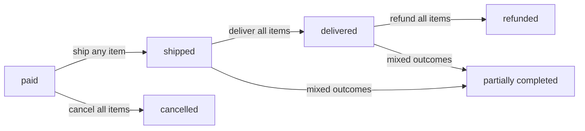

### Order History and Historical Accuracy

### Order History Viewing

THE system SHALL allow customers to view a list of all their orders.

THE system SHALL display orders sorted by creation date, newest first.

THE system SHALL paginate the order list for manageable viewing.

THE system SHALL display for each order in the list:
1. Order number
2. Order creation date
3. Total price
4. Overall order status

### Order Detail View

WHEN a customer views an order's details, THE system SHALL display:
1. List of all order items with product name, variant options, quantity, price, and item status
2. Shipping address
3. List of shipments with tracking information (items included per shipment)

### Snapshot Preservation

THE system SHALL create a snapshot of each purchased product at the time of order creation.

THE system SHALL create a snapshot of each purchased product variant at the time of order creation.

THE system SHALL create a snapshot of each seller's profile at the time of order creation.

THE system SHALL store these snapshots as immutable records associated with order items.

### Historical Accuracy Maintenance

THE system SHALL preserve product name in the snapshot even if the product name is later edited.

THE system SHALL preserve product description in the snapshot even if the description is later changed.

THE system SHALL preserve variant options in the snapshot even if the variant configuration is later modified.

THE system SHALL preserve the price at time of purchase regardless of subsequent price changes.

THE system SHALL preserve the seller's shop name and logo as they were at the time of purchase.

IF a product is deleted, THE system SHALL retain the snapshot for order history reference.

IF a seller deletes their account, THE system SHALL preserve the seller's shop name in past orders.

## OrderItem Concept

An OrderItem represents a specific purchased product variant within an order. Each order item links to one variant and records the quantity purchased and the price paid per unit. Order items have individual statuses independent of other items in the same order, enabling partial processing. The status progression moves from paid to shipped to delivered, or can change to cancelled or refunded. Sellers view order items for their products that need shipping and process them individually or in groups. When a seller ships items, they create shipments that group one or more order items together. Customers can request cancellation for items still in paid status before shipping. Customers can request refunds for delivered items within 7 days of delivery. Each order item includes a snapshot preserving the product and variant details at purchase time. This granular approach allows different items in the same order to be processed, cancelled, or refunded independently.

### Purchased Variant Record

### Variant Association

THE system SHALL link each order item to exactly one product variant.

THE system SHALL link each order item to exactly one product.

THE system SHALL link each order item to exactly one seller (the product owner).

### Item Creation

WHEN an order is placed, THE system SHALL create one order item for each unique variant purchased.

IF a customer purchases multiple quantities of the same variant, THE system SHALL create a single order item with the total quantity rather than multiple separate items.

### Record Purpose

THE system SHALL preserve the purchased variant as an immutable record for order tracking.

THE system SHALL enable sellers to identify which variants need fulfillment.

THE system SHALL enable customers to review their specific variant purchases.

### Quantity and Price Capture

### Quantity Recording

WHEN an order item is created, THE system SHALL record the quantity purchased.

THE system SHALL store quantity as a positive integer.

### Price Recording

WHEN an order item is created, THE system SHALL record the price per unit at the time of purchase.

THE system SHALL calculate and display the subtotal as quantity multiplied by unit price.

THE system SHALL preserve the original price even if the variant's price changes later.

### Value Calculation

WHEN displaying an order item, THE system SHALL show the quantity, unit price, and subtotal.

THE system SHALL use the recorded price for all refund and cancellation calculations.

### Individual Item Status

### Status Independence

THE system SHALL maintain a separate status for each order item independent of other items in the same order.

THE system SHALL allow different items within the same order to have different statuses.

### Status Values

THE system SHALL support the following item statuses:
- Paid: payment completed, awaiting shipment
- Shipped: seller has shipped the item
- Delivered: item has been delivered
- Cancelled: item was cancelled before shipment
- Refunded: item was refunded after delivery

### Status Derivation for Order

IF all items in an order have status "paid", THE system SHALL set the overall order status to "paid".

IF any item in an order has status "shipped" and none are delivered, THE system SHALL set the overall order status to "shipped".

IF all items in an order have status "delivered", THE system SHALL set the overall order status to "delivered".

IF all items in an order have status "cancelled", THE system SHALL set the overall order status to "cancelled".

IF all items in an order have status "refunded", THE system SHALL set the overall order status to "refunded".

IF items in an order have mixed statuses, THE system SHALL set the overall order status to "partially completed".

### Independent Status Progression

### Normal Progression Flow

WHEN payment succeeds, THE system SHALL set the order item status to "paid".

WHEN a seller creates a shipment containing an order item, THE system SHALL change that item's status to "shipped".

WHEN a customer confirms delivery for a shipment, THE system SHALL change all items in that shipment to status "delivered".

IF a customer does not confirm delivery within 14 days of shipping, THE system SHALL automatically change the item status to "delivered".

### Cancellation Path

WHEN a seller approves a cancellation request for an item with status "paid", THE system SHALL change that item's status to "cancelled".

### Refund Path

WHEN a seller approves a refund request for an item with status "delivered", THE system SHALL change that item's status to "refunded".

### State Transition Diagram

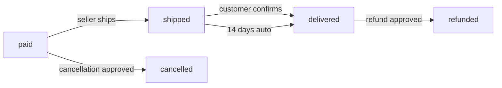

### Seller Shipping View and Shipment Grouping

### Seller Order Item View

WHEN a seller views their dashboard, THE system SHALL display order items for their products that need shipping.

THE system SHALL filter order items to show only those belonging to the logged-in seller.

THE system SHALL allow sellers to filter their order items by status.

THE system SHALL display pending items (status "paid") that require shipping action.

### Shipment Grouping

THE system SHALL allow a seller to select multiple order items for the same shipment.

WHEN a seller creates a shipment, THE system SHALL allow them to choose which order items to include.

THE system SHALL link all order items in a shipment to that shipment record.

THE system SHALL ensure all items in a shipment belong to the same seller.

THE system SHALL not allow items from different sellers in the same shipment.

### Tracking Association

WHEN a seller enters tracking information for a shipment, THE system SHALL associate that tracking with all order items in the shipment.

THE system SHALL change all items in a shipment to status "shipped" when the shipment is created.

THE system SHALL not allow a single order item to be in multiple shipments.

### Cancellation and Refund Eligibility

### Cancellation Eligibility

THE system SHALL allow customers to request cancellation only for items with status "paid".

IF an item has status "shipped" or "delivered", THE system SHALL not allow cancellation requests.

WHEN a customer requests cancellation, THE system SHALL require a reason text.

THE system SHALL create a cancellation request linked to the specific order item.

### Refund Eligibility Window

THE system SHALL allow customers to request refunds only for items with status "delivered".

THE system SHALL allow refund requests within 7 days of the item's delivery date.

IF more than 7 days have passed since delivery, THE system SHALL not allow refund requests.

WHEN a customer requests a refund, THE system SHALL require a reason text.

THE system SHALL create a refund request linked to the specific order item.

### Product Snapshot Inclusion

WHEN an order item is created, THE system SHALL create a snapshot of the purchased product.

THE system SHALL store the product name, description, and images in the snapshot.

THE system SHALL create a snapshot of the purchased variant with SKU code and option values.

THE system SHALL store the price at the time of purchase in the snapshot.

THE system SHALL create a snapshot of the seller profile with shop name and logo.

THE system SHALL preserve all snapshots even if the original product, variant, or seller profile is later modified or deleted.

### Independent Item Processing

### Partial Order Operations

THE system SHALL allow individual order items to be processed independently from other items in the same order.

THE system SHALL allow a seller to ship some items while others remain in "paid" status.

THE system SHALL allow different items in the same order to have different sellers processing them independently.

### Cancellation Impact on Order

IF some items in an order are cancelled while others proceed normally, THE system SHALL continue processing the remaining items.

IF all items in an order become cancelled, THE system SHALL set the overall order status to "cancelled".

WHEN an item is cancelled, THE system SHALL restore stock quantity for that item's variant.

### Refund Impact on Order

IF some items in an order are refunded while others remain unaffected, THE system SHALL maintain normal status for unaffected items.

IF all items in an order become refunded, THE system SHALL set the overall order status to "refunded".

WHEN an item is refunded, THE system SHALL restore stock quantity for that item's variant.

### Mixed Status Handling

THE system SHALL display item-level status within order detail views.

THE system SHALL calculate overall order status based on the aggregate of item statuses.

THE system SHALL allow customers to view and manage items individually within an order detail.

## OrderItemSnapshot Concept

An OrderItemSnapshot represents the preserved state of a product and its variant at the moment of purchase. When an order is placed, a snapshot is created for each order item to record exactly what was purchased. The snapshot includes the product name, description, variant options, and price at that point in time. This ensures that even if the seller later changes the product or variant, the purchase record remains accurate. The snapshot also captures the variant's option values like color and size, so customers know exactly what they bought. Order item snapshots are immutable and cannot be modified after creation. These snapshots serve as evidence in disputes about what product or variant was actually purchased. Customers can view their order history with confidence that the details shown reflect their original purchase. Sellers and administrators can reference snapshots to verify transaction details for customer service.

### Purchase-Time State Capture

WHEN a customer successfully places an order, THE system SHALL create an order item snapshot for each purchased product variant.

WHEN an order item snapshot is created, THE system SHALL capture the complete state of the product and variant at that exact moment.

WHEN an order item snapshot is created, THE system SHALL associate it with the corresponding order item.

WHEN multiple variants are purchased in a single order, THE system SHALL create a separate snapshot for each variant.

THE system SHALL create order item snapshots only after successful payment confirmation.

### Product Name Preservation

WHEN an order item snapshot is created, THE system SHALL preserve the product name exactly as it appeared at the time of purchase.

THE system SHALL record the product description in the order item snapshot.

IF the seller changes the product name after a purchase, THE system SHALL retain the original product name in all existing order item snapshots.

WHEN a customer views their order history, THE system SHALL display the preserved product name from the order item snapshot.

THE system SHALL ensure the preserved product name remains accessible even if the original product is deleted.

### Variant Option Preservation

WHEN an order item snapshot is created, THE system SHALL capture all variant option values (such as color and size) that apply to the purchased variant.

THE system SHALL record the exact combination of options that define the purchased variant.

IF the seller modifies a variant's option values after a purchase, THE system SHALL retain the original option values in all existing order item snapshots.

WHEN a customer views order details, THE system SHALL display the preserved variant options from the order item snapshot.

THE system SHALL ensure variant option details are preserved even if the variant is deleted from the product.

### Price at Time of Purchase

WHEN an order item snapshot is created, THE system SHALL record the exact price the customer paid for the variant.

IF the variant had a price override, THE system SHALL preserve that overridden price rather than the base price.

IF the variant used the product's base price, THE system SHALL preserve that base price.

IF the seller changes prices after a purchase, THE system SHALL retain the original purchase price in all existing order item snapshots.

THE system SHALL ensure the preserved price matches the amount charged to the customer's payment method.

WHEN displaying order history, THE system SHALL show the preserved price from the order item snapshot.

### Immutable Purchase Record

THE system SHALL prevent any modification to order item snapshots after creation.

THE system SHALL preserve order item snapshots indefinitely regardless of subsequent changes to products, variants, or seller profiles.

IF a product is deleted, THE system SHALL retain all associated order item snapshots.

IF a variant is deleted, THE system SHALL retain all associated order item snapshots.

THE system SHALL not allow sellers, customers, or administrators to edit order item snapshot data.

WHEN a dispute arises, THE system SHALL guarantee that the order item snapshot reflects the exact state at purchase time.

### Customer Order Verification

THE system SHALL allow customers to view the order item snapshots for all their purchases.

WHEN a customer views an order, THE system SHALL display the product name, variant options, and price from the order item snapshot.

THE system SHALL enable customers to verify that the purchased product details match their recollection.

IF a product's current details differ from the purchase-time details, THE system SHALL show the preserved historical details in the order view.

THE system SHALL provide customers access to order item snapshots as proof of purchase terms.

### Seller Reference Capability

THE system SHALL allow sellers to view order item snapshots for products they sold.

WHEN a seller views an order item for their product, THE system SHALL display the preserved product and variant details.

THE system SHALL enable sellers to reference order item snapshots when responding to customer inquiries.

IF a customer disputes a purchase, THE system SHALL provide sellers access to the order item snapshot as evidence.

THE system SHALL allow sellers to view the exact product details that the customer saw at purchase time.

### Administrator Oversight Access

THE system SHALL allow administrators to view all order item snapshots across the platform.

WHEN an administrator investigates a dispute, THE system SHALL provide full access to the relevant order item snapshot.

THE system SHALL enable administrators to verify transaction details using the preserved snapshot data.

IF a customer or seller raises a complaint, THE system SHALL allow administrators to reference the order item snapshot as authoritative evidence.

THE system SHALL support administrator review of historical purchase records for policy enforcement.

### Dispute Resolution Evidence

WHEN a dispute arises regarding what product was purchased, THE system SHALL provide the order item snapshot as definitive evidence.

THE system SHALL ensure order item snapshots can be referenced to resolve disagreements between customers and sellers.

IF a customer claims the product received differs from what was ordered, THE system SHALL display the preserved variant options from the order item snapshot for comparison.

THE system SHALL maintain order item snapshots as auditable records for transaction verification.

WHEN resolving disputes, THE system SHALL present the order item snapshot data as the authoritative source of purchase terms.

### Transaction Integrity

THE system SHALL ensure order item snapshots accurately reflect the transaction at the moment it occurred.

WHEN an order is placed, THE system SHALL create the order item snapshot from the same data presented to the customer during checkout.

THE system SHALL maintain a consistent link between order items and their corresponding snapshots.

THE system SHALL prevent any discrepancy between the price charged and the price preserved in the order item snapshot.

THE system SHALL ensure that order item snapshots provide a complete and accurate record for financial and legal purposes.

## SellerProfileSnapshot Concept

A SellerProfileSnapshot represents the preserved state of a seller's shop profile at the moment of a customer's purchase. When an order is placed, the seller's profile information is captured and saved with each order item. The snapshot includes the shop name, shop description, and logo image at the time of purchase. This preserves the seller's identity and branding as it appeared when the customer made their buying decision. If a seller changes their shop name or logo later, historical orders still show the original information. This is important for customers to remember which shop they purchased from, even if the seller rebrands. The snapshot approach ensures transparency and accountability for transactions over time. Customers can identify sellers from their order history even years after the purchase. Seller profile snapshots support dispute resolution by providing evidence of the seller's presentation at transaction time.

### Purchase-Time Profile Capture

WHEN a customer successfully places an order, THE system SHALL create a seller profile snapshot for each order item.

THE snapshot SHALL preserve the seller's shop name as it appeared at the moment of purchase.

THE snapshot SHALL capture the seller's shop description in its complete form at the time of purchase.

THE snapshot SHALL record the seller's logo image URL as it existed when the customer made their buying decision.

THE system SHALL create snapshots automatically without requiring any action from the seller or customer.

THE snapshot SHALL reflect the seller's branding presentation that influenced the customer's purchase decision.

THE system SHALL ensure each snapshot is associated with exactly one order item.

### Immutability and Seller Rebranding Isolation

THE system SHALL prevent any modifications to seller profile snapshots after creation.

WHEN a seller changes their shop name, THE system SHALL NOT update any existing snapshots.

WHEN a seller updates their shop description, THE system SHALL preserve all historical snapshots unchanged.

WHEN a seller uploads a new logo image, THE system SHALL maintain the original logo in all existing snapshots.

THE system SHALL ensure seller rebranding does not affect historical order records.

THE snapshot SHALL remain accessible and accurate for the lifetime of the order.

THE system SHALL maintain snapshots even if the seller account is deleted or suspended.

### Long-Term Order Reference

THE snapshot SHALL enable customers to identify sellers based on how they appeared at the time of purchase.

THE snapshot SHALL provide accurate historical information for as long as order records exist.

THE system SHALL preserve snapshot data indefinitely to support long-term purchase history reference.

WHEN a customer views their order history, THE system SHALL display the seller information from the snapshot.

THE system SHALL ensure customers can reference the exact shop presentation they saw when making purchasing decisions, even years after the purchase.

THE snapshot SHALL support customer memory of which shop they purchased from, regardless of subsequent seller changes.

### Transaction Transparency and Accountability

THE snapshot SHALL provide verifiable evidence of the seller's presentation at the time of transaction.

THE snapshot SHALL support dispute resolution by showing exactly what branding and information was presented to the customer.

THE system SHALL make snapshots available to administrators for dispute investigation purposes.

THE snapshot SHALL enable accurate comparison between current seller profiles and historical representations.

THE snapshot SHALL support seller accountability by preserving the shop name and branding under which transactions occurred.

THE system SHALL ensure snapshots can be used as evidence in cases of misrepresentation or dispute.

THE snapshot SHALL provide transparency into the seller's identity and presentation at the exact moment of each transaction.

## Shipment Concept

A Shipment represents a physical package containing one or more order items sent by a seller to a customer. Different sellers always ship their items separately, meaning each seller creates their own shipments. A seller can choose to ship multiple items from the same order in one shipment or create separate shipments for each item. When creating a shipment, the seller selects which of their order items to include and enters tracking information. The tracking information consists of the carrier name and tracking number, allowing customers to follow delivery progress. All items in the same shipment share identical tracking information and change to shipped status together. Customers can view tracking information for each shipment in their order details. Delivery is confirmed either by the customer manually or automatically after 14 days from shipping. When delivery is confirmed, all items in that shipment change to delivered status. This concept enables flexible shipping arrangements while maintaining clear tracking for customers.

### Physical Package Representation

### Definition

A shipment represents a physical package sent by a seller to deliver purchased items to a customer.

### Requirements

WHEN a seller ships order items, THE system SHALL create a shipment record representing a single physical package.

THE system SHALL associate each shipment with exactly one seller who sent the package.

THE system SHALL associate each shipment with exactly one order containing the purchased items.

THE system SHALL maintain shipment records for delivery tracking and order history purposes.

### Seller-Specific Shipping

### Requirements

WHEN multiple sellers have items in the same order, THE system SHALL create separate shipments for each seller.

THE system SHALL NOT allow items from different sellers to be combined into a single shipment.

WHEN a seller creates a shipment, THE system SHALL only allow that seller to include their own order items in the shipment.

### Business Rule

Different sellers always ship their items separately because each seller operates independently and handles their own inventory and shipping processes.

### Multi-Item Shipment Option

### Requirements

WHEN a seller creates a shipment, THE system SHALL allow the seller to select one or more of their order items to include.

THE system SHALL NOT require sellers to ship all items in a single shipment.

THE system SHALL allow a seller to create multiple shipments for items from the same order.

WHEN a seller ships multiple items together, THE system SHALL bundle all selected items into one shipment record.

### Flexible Shipping Arrangements

THE system SHALL support flexible shipping arrangements where sellers choose whether to ship items individually or bundle multiple items together.

### Carrier Name Entry

### Requirements

WHEN a seller creates a shipment, THE system SHALL require the seller to enter a carrier name.

THE system SHALL accept any text value for the carrier name field.

THE system SHALL NOT create a shipment without a carrier name.

### Examples

Carrier names may include: "FedEx", "UPS", "USPS", "DHL", "Korean Post", or any shipping provider the seller uses.

### Tracking Number Entry

### Requirements

WHEN a seller creates a shipment, THE system SHALL require the seller to enter a tracking number.

THE system SHALL accept any text value for the tracking number field.

THE system SHALL NOT create a shipment without a tracking number.

THE system SHALL NOT validate tracking number format, allowing sellers to enter carrier-specific tracking codes.

### Shared Tracking Information

### Requirements

WHEN a shipment contains multiple order items, THE system SHALL assign the same carrier name and tracking number to all items in that shipment.

THE system SHALL NOT allow different tracking information for individual items within the same shipment.

WHEN a seller enters tracking information for a shipment, THE system SHALL apply that information to all items included in the shipment.

### Rationale

All items in a shipment share identical tracking information because they travel together in the same physical package.

### Customer Tracking Access

### Requirements

WHEN a customer views their order details, THE system SHALL display all shipments associated with that order.

THE system SHALL display the carrier name and tracking number for each shipment.

THE system SHALL indicate which order items are included in each shipment.

THE system SHALL show the shipping date for each shipment.

### Item Status Synchronization

### Shipped Status Synchronization

WHEN a seller creates a shipment, THE system SHALL change the status of all included order items to "shipped".

THE system SHALL change item status to "shipped" at the moment the shipment is created.

THE system SHALL NOT allow items to have "shipped" status without being associated with a shipment.

### Delivered Status Synchronization

WHEN delivery is confirmed for a shipment, THE system SHALL change the status of all order items in that shipment to "delivered".

THE system SHALL change all items in the shipment to "delivered" status simultaneously.

### Manual Delivery Confirmation

### Requirements

WHEN a customer views a shipment that has been shipped but not yet confirmed delivered, THE system SHALL provide an option for the customer to confirm delivery.

WHEN a customer confirms delivery for a shipment, THE system SHALL record the delivery confirmation timestamp.

WHEN a customer confirms delivery for a shipment, THE system SHALL change all items in that shipment to "delivered" status.

THE system SHALL allow customers to confirm delivery per shipment, not per individual order item.

### Automatic Delivery Confirmation

### Requirements

IF a shipment has not been confirmed delivered by the customer within 14 days of shipping, THE system SHALL automatically change the shipment status to delivered.

WHEN the system automatically confirms delivery, THE system SHALL change all order items in that shipment to "delivered" status.

THE system SHALL record an automatic delivery timestamp for audit purposes.

### Business Rule

The 14-day automatic delivery confirmation ensures that orders progress to completion even if customers do not manually confirm delivery.

## CancellationRequest Concept

A CancellationRequest represents a customer's request to cancel a specific order item before it ships. Customers can only request cancellation for items with paid status that have not yet been shipped. Each cancellation request includes a reason text explaining why the customer wants to cancel. The request enters pending status and awaits the seller's response. The seller of that item can approve or reject the cancellation request. When the seller responds, a snapshot is created to preserve the request state at that moment. If approved, the order item status changes to cancelled and the payment is refunded. Approved cancellations also restore the stock quantity through an inventory record. If rejected, the order item continues processing normally toward shipment. Cancellation is handled at the individual item level, not the entire order, allowing partial order processing. If all items in an order are cancelled, the entire order status becomes cancelled.

### Pre-Shipment Cancellation Eligibility

A CancellationRequest represents a customer's attempt to cancel an order item before it ships.

THE system SHALL allow cancellation requests only for order items with paid status.

THE system SHALL reject cancellation requests for order items with shipped, delivered, cancelled, or refunded status.

WHEN a customer requests cancellation for an item that is not in paid status, THE system SHALL reject the request.

IF an order item has already been shipped, THEN THE system SHALL prevent the customer from submitting a cancellation request.

WHEN an order item's status changes from paid to shipped, THE system SHALL disable the cancellation request option for that item.

### Cancellation Request Submission

WHEN a customer submits a cancellation request, THE system SHALL require a reason text explaining the cancellation.

THE system SHALL create a cancellation request record associated with the specific order item.

THE system SHALL set the initial status of every new cancellation request to pending.

THE system SHALL link the cancellation request to the customer who created it.

THE system SHALL link the cancellation request to the seller who owns the order item.

THE system SHALL record the creation timestamp for each cancellation request.

IF the reason text is not provided, THEN THE system SHALL reject the cancellation request submission.

### Pending Request Status

WHILE a cancellation request is in pending status, THE system SHALL preserve the order item's paid status.

THE system SHALL display pending cancellation requests to the seller who owns the order item.

THE system SHALL display the cancellation request status to the customer who submitted it.

WHILE awaiting seller response, THE system SHALL maintain the cancellation request in pending status.

THE system SHALL track the time elapsed since the cancellation request was created.

The pending status indicates that the seller has not yet responded to the cancellation request.

### Seller Response Authority

THE system SHALL allow only the seller who owns the order item to respond to the cancellation request.

WHEN a seller approves a cancellation request, THE system SHALL change the request status to approved.

WHEN a seller rejects a cancellation request, THE system SHALL change the request status to rejected.

THE system SHALL record the response timestamp when the seller responds.

THE system SHALL record the identity of the seller who responded to the request.

WHEN a seller responds to a cancellation request, THE system SHALL preserve the request state by creating a snapshot.

### Cancellation Request Snapshot

WHEN a seller responds to a cancellation request, THE system SHALL create a CancellationRequestSnapshot.

THE system SHALL capture the reason text in the snapshot.

THE system SHALL capture the status decision in the snapshot.

THE system SHALL record the timestamp of the snapshot creation.

THE system SHALL make the snapshot immutable after creation.

THE system SHALL prevent deletion of cancellation request snapshots.

Snapshots serve as an audit trail for dispute resolution between customers and sellers.

### Approved Cancellation Effects

WHEN a cancellation request is approved, THE system SHALL change the order item status to cancelled.

WHEN a cancellation request is approved, THE system SHALL process a refund for that order item.

WHEN a cancellation request is approved, THE system SHALL create a positive inventory record to restore the stock quantity.

THE system SHALL restore the stock quantity to the variant's available inventory.

THE system SHALL preserve the cancellation request and its snapshot even after the order item is cancelled.

The refund amount corresponds to the price of the cancelled order item multiplied by its quantity.

### Rejected Cancellation Processing

WHEN a cancellation request is rejected, THE system SHALL maintain the order item's paid status.

THE system SHALL preserve the cancellation request record with rejected status.

THE system SHALL notify the customer of the rejection.

THE system SHALL allow the order item to proceed normally toward shipment.

IF a seller rejects a cancellation request, THEN THE system SHALL retain the snapshot for record-keeping purposes.

### Individual Item Cancellation

THE system SHALL process cancellation requests independently for each order item.

WHEN a customer requests cancellation, THE system SHALL affect only the specified order item, not the entire order.

THE system SHALL allow cancellation of some items while other items continue processing.

THE system SHALL maintain separate cancellation requests for each order item within the same order.

WHEN one item in an order is cancelled, THE system SHALL continue processing other items in that order normally.

This individual processing allows partial order fulfillment when some items are cancelled.

### Order-Wide Cancellation Status

THE system SHALL derive the overall order status from the statuses of its individual order items.

IF all order items in an order have cancelled status, THEN THE system SHALL set the order status to cancelled.

IF some items are cancelled and others continue processing, THE system SHALL set the order status to partially completed.

THE system SHALL NOT automatically cancel an entire order when a single item cancellation is approved.

The order-wide cancellation status reflects the aggregation of all item-level cancellation outcomes.

## CancellationRequestSnapshot Concept

A CancellationRequestSnapshot represents a preserved state of a cancellation request when a seller responds. When a seller approves or rejects a cancellation request, a snapshot is created to record that decision point. The snapshot captures the reason provided by the customer, the status decision, and when it was made. This creates an audit trail of how cancellation requests were handled over time. If disputes arise about whether a cancellation was properly processed, the snapshot provides evidence. The snapshot is immutable and cannot be changed after creation, ensuring historical integrity. Multiple snapshots may exist if the request status changes multiple times, though the typical flow is a single response. Sellers and administrators can review snapshots to understand cancellation handling history. This supports fair resolution of customer complaints about cancellation processing. The snapshot principle ensures transparency in how seller-customer interactions are recorded.

### Request State Preservation

THE CancellationRequestSnapshot SHALL represent a preserved state of a cancellation request at the moment a seller responds.

WHEN a seller approves or rejects a cancellation request, THE system SHALL create a snapshot capturing that decision point.

THE snapshot SHALL contain the reason text provided by the customer for the cancellation request.

THE snapshot SHALL contain the status decision made by the seller (approved or rejected).

THE snapshot SHALL record the exact timestamp when the seller responded to the request.

THE snapshot SHALL preserve the complete state of the cancellation request at that moment in time.

### Response Documentation

WHEN a seller responds to a cancellation request, THE system SHALL automatically create a CancellationRequestSnapshot.

THE snapshot SHALL document who responded to the request (the seller).

THE snapshot SHALL document what decision was made (approval or rejection).

THE snapshot SHALL document when the response occurred.

Multiple snapshots MAY exist for a single cancellation request if the status changes multiple times.

THE snapshot SHALL link to its parent CancellationRequest for reference.

### Audit Trail Creation

THE system SHALL maintain a complete audit trail of all cancellation request status changes through snapshots.

Each snapshot SHALL represent a distinct point in the cancellation handling timeline.

THE snapshot sequence SHALL show the progression of how cancellation requests were processed.

Sellers SHALL be able to view snapshots of cancellation requests for their products.

Administrators SHALL be able to view snapshots of any cancellation request for oversight purposes.

THE audit trail SHALL remain available even after the cancellation request is resolved.

### Immutability and Historical Integrity

THE CancellationRequestSnapshot SHALL be immutable after creation.

THE system SHALL NOT allow modification of snapshot data once recorded.

THE system SHALL NOT allow deletion of snapshots.

THE snapshot SHALL preserve the exact values at the time of creation, ensuring historical accuracy.

IF a cancellation request is later modified, THE original snapshot SHALL remain unchanged.

This immutability SHALL ensure that the historical record reflects exactly what happened at each decision point.

### Dispute Resolution Evidence

THE CancellationRequestSnapshot SHALL serve as evidence for resolving disputes about cancellation handling.

THE snapshot SHALL provide proof of what reason the customer provided.

THE snapshot SHALL provide proof of what decision the seller made.

THE snapshot SHALL provide proof of when the response was made.

WHEN a customer questions why their cancellation was rejected, THE snapshot SHALL show the seller's recorded response at that time.

THE snapshot SHALL support fair resolution of disagreements about how cancellations were processed.

Both sellers and administrators SHALL have access to snapshots for transparency in cancellation processing.

### Seller-Customer Interaction Record

THE CancellationRequestSnapshot SHALL record the interaction between customers and sellers regarding cancellation requests.

THE snapshot SHALL capture the customer's reason for requesting cancellation.

THE snapshot SHALL capture the seller's response to that request.

This record SHALL demonstrate transparency in how seller-customer communications are handled.

THE snapshot SHALL show that every cancellation request receives a documented response.

The preservation of this interaction SHALL ensure accountability in the cancellation process.

## RefundRequest Concept

A RefundRequest represents a customer's request for a refund on a delivered order item. Customers can only request refunds for items with delivered status and only within 7 days of delivery. Each refund request includes a reason text explaining why the customer wants their money back. The request starts in pending status and is sent to the seller who sold that item. The seller can approve or reject the refund request based on their assessment. When the seller responds, a snapshot is created to preserve the request state. If approved, the order item status changes to refunded and the payment is returned to the customer. Approved refunds also restore the stock quantity through a positive inventory record. If rejected, the order item remains in delivered status and no refund is issued. Refund handling is at the individual item level, enabling partial order refunds. If all items in an order are refunded, the entire order status becomes refunded.

### Post-Delivery Refund Request Creation

WHEN a customer requests a refund for an order item, THE system SHALL verify the item status is "delivered".

IF the order item status is not "delivered", THEN THE system SHALL reject the refund request.

WHEN a customer requests a refund, THE system SHALL verify the request is submitted within 7 days of the item's delivery date.

IF the 7-day eligibility window has passed, THEN THE system SHALL reject the refund request.

WHEN a customer creates a refund request, THE system SHALL require the customer to provide a reason explaining why they want the refund.

IF the reason text is not provided, THEN THE system SHALL reject the refund request.

WHEN a valid refund request is created, THE system SHALL set the request status to "pending".

WHEN a refund request is created, THE system SHALL associate the request with exactly one order item.

WHEN a refund request is created, THE system SHALL record the creation timestamp.

### Refund Request Status

THE system SHALL support the following refund request statuses: pending, approved, and rejected.

WHEN a refund request is first created, THE system SHALL assign it the status "pending".

WHILE a refund request is in "pending" status, THE system SHALL wait for the seller's response.

IF a seller approves the request, THEN THE system SHALL change the status to "approved".

IF a seller rejects the request, THEN THE system SHALL change the status to "rejected".

THE system SHALL preserve all refund request records regardless of their final status.

### Seller Response to Refund Requests

WHEN a seller views their pending refund requests, THE system SHALL show only refund requests for items they sold.

WHEN a seller responds to a pending refund request, THE system SHALL allow the seller to either approve or reject the request.

IF a seller approves a refund request, THEN THE system SHALL process the refund for that specific order item.

IF a seller rejects a refund request, THEN THE system SHALL update the request status to "rejected" and the order item shall remain in "delivered" status.

WHEN a seller responds to a refund request, THE system SHALL record the response timestamp.

WHEN a seller rejects a refund request, THE system SHALL allow the customer to see that the request was rejected but shall not allow the customer to resubmit for the same item.

### Request State Snapshots

WHEN a seller responds to a refund request, THE system SHALL create a snapshot capturing the request state.

THE system SHALL include in each snapshot: the reason text, the status at the time of response, and the timestamp.

THE system SHALL preserve all snapshots for dispute resolution and audit purposes.

THE system SHALL prevent modification or deletion of any snapshot.

WHEN an administrator views a refund request, THE system SHALL display the complete history of snapshots for that request.

### Approved Refund Processing

WHEN a seller approves a refund request, THE system SHALL change the associated order item status from "delivered" to "refunded".

WHEN a refund is approved, THE system SHALL initiate the return of payment to the customer.

WHEN a refund is approved, THE system SHALL create a positive inventory record to restore the stock quantity for that product variant.

THE system SHALL calculate the restored stock quantity as equal to the quantity of the refunded order item.

WHEN stock is restored, THE system SHALL record the reason as "refund approved" in the inventory history.

### Individual Item Processing

THE system SHALL process refund requests independently for each order item.

WHEN a customer requests a refund for one item in an order, THE system SHALL NOT affect other items in the same order.

WHEN a refund is approved for one item, THE system SHALL allow other items in the order to continue their normal status progression.

THE system SHALL allow multiple refund requests within the same order as long as each meets the eligibility requirements independently.

THE system SHALL track the refund status of each order item separately from the overall order status.

### Order-Wide Refund Status

WHEN all items in an order have status "refunded", THEN THE system SHALL set the overall order status to "refunded".

IF some items are refunded while others have different statuses, THEN THE system SHALL set the overall order status to "partially completed".

THE system SHALL derive the order status from the individual statuses of all its order items.

THE system SHALL NOT allow an order to have status "refunded" unless all items have been refunded.

## RefundRequestSnapshot Concept

A RefundRequestSnapshot represents a preserved state of a refund request when a seller responds. When a seller approves or rejects a refund request, a snapshot records that decision point in time. The snapshot captures the customer's reason, the seller's decision, and the timestamp of the response. This creates a permanent record of how refund requests were handled. The snapshot serves as evidence if disputes arise about refund processing decisions. Like all snapshots, it is immutable and cannot be modified after creation. This ensures the historical record cannot be tampered with or disputed. Multiple snapshots may be created if the request goes through multiple status changes. Sellers and administrators can review snapshots to understand refund handling patterns. The snapshot approach supports fair and transparent resolution of customer-seller disagreements about refunds.

### Snapshot Creation Timing

### Automatic Creation

WHEN a seller responds to a refund request, THE system SHALL automatically create a RefundRequestSnapshot capturing the state at that moment.

WHEN a seller approves a refund request, THE system SHALL create a snapshot recording the approval decision.

WHEN a seller rejects a refund request, THE system SHALL create a snapshot recording the rejection decision.

IF a refund request status changes multiple times, THE system SHALL create a separate snapshot for each status change.

### Timestamp Recording

WHEN creating a snapshot, THE system SHALL record the exact timestamp of the seller's response.

THE system SHALL capture the respondedAt timestamp from the refund request and preserve it in the snapshot.

### Sequential Preservation

THE system SHALL maintain snapshots in chronological order based on their creation timestamps.

IF multiple snapshots exist for a single refund request, THE system SHALL preserve all snapshots without deletion.

### Snapshot Content

### Reason Documentation

THE system SHALL include the customer's submitted reason in each RefundRequestSnapshot.

THE system SHALL preserve the complete text content of the refund reason without truncation.

THE system SHALL store the reason exactly as submitted by the customer at the time of the request.

### Status Decision Record

THE system SHALL record the status value (approved or rejected) in each snapshot.

THE system SHALL capture the decision made by the seller at the time of response.

THE system SHALL preserve the status transition from pending to the final state.

### Reference Information

THE system SHALL link each snapshot to its parent RefundRequest.

THE system SHALL store the creation timestamp independently to track when the snapshot was generated.

THE system SHALL maintain complete context of the request state at the moment of seller response.

### Immutability and Historical Integrity

### Immutable Record

THE system SHALL prevent any modification to RefundRequestSnapshot records after creation.

THE system SHALL prohibit deletion of RefundRequestSnapshot records.

IF an administrator attempts to edit a snapshot, THE system SHALL reject the request.

IF an administrator attempts to delete a snapshot, THE system SHALL reject the request.

### Historical Integrity

THE system SHALL preserve all snapshots regardless of subsequent changes to the refund request.

THE system SHALL maintain snapshot data independently from the current refund request state.

WHILE a refund request may be updated, THE system SHALL keep all associated snapshots unchanged.

THE system SHALL ensure snapshot records remain permanently accessible for audit purposes.

### Data Consistency

THE system SHALL store snapshot data as a complete, self-contained record.

THE system SHALL not use references to mutable data in snapshot records.

### Audit Trail and Dispute Resolution

### Audit Trail Creation

THE system SHALL maintain a complete audit trail of all refund request status changes through snapshots.

THE system SHALL enable chronological reconstruction of refund request handling through snapshot history.

THE system SHALL preserve the sequence of decisions made on each refund request.

### Dispute Resolution Evidence

WHEN a dispute arises regarding refund handling, THE system SHALL provide access to snapshot records as evidence.

THE system SHALL support dispute resolution by presenting the exact state of requests at decision points.

THE system SHALL enable administrators to review how sellers have handled refund requests through snapshot history.

THE system SHALL preserve seller decision rationale as documented in request states.

### Customer-Seller Disagreement Record

THE system SHALL record the customer's stated reason for refund in each snapshot.

THE system SHALL record the seller's response decision in each snapshot.

THE system SHALL maintain complete records to support fair resolution of disagreements between customers and sellers.

THE system SHALL enable both parties' perspectives to be preserved in the historical record.

### Access and Transparency

### Seller Access

THE system SHALL allow sellers to view snapshots for refund requests related to their products.

THE system SHALL enable sellers to review their own refund handling history through snapshot records.

### Administrator Access

THE system SHALL allow administrators to view snapshots for any refund request on the platform.

THE system SHALL enable administrators to search and filter snapshot records for oversight purposes.

THE system SHALL support administrator review of refund handling patterns across sellers.

### Transparency in Processing

THE system SHALL maintain snapshots to ensure transparency in how refund requests are processed.

THE system SHALL enable review of whether sellers appropriately handled refund requests.

THE system SHALL provide evidence of the timeline between request submission and seller response.

### Refund Handling History

THE system SHALL preserve the complete history of refund request processing through snapshots.

THE system SHALL enable analysis of refund approval and rejection patterns over time.

THE system SHALL support identification of potential issues in refund handling through historical snapshot data.

## Review Concept

A Review represents a customer's feedback on a product they have purchased. Customers can only write reviews for products from orders where the item status is delivered. One review can be written per product per order, allowing customers to review the same product multiple times if they purchase it again. Each review includes a rating from 1 to 5 stars, which is required, and optional text content. Reviews are displayed publicly on the product detail page for other customers to see. Reviews are sorted by newest first, showing the most recent feedback prominently. Customers can edit their own reviews after posting, with each edit creating a snapshot. Customers can also delete their reviews entirely, though the snapshots are preserved. A product's average rating is calculated from all non-deleted reviews and displayed on product listings. Reviews help other customers make informed purchasing decisions based on real experiences.

### Review Creation Requirements

A Review represents customer feedback on a purchased product.

WHEN a customer creates a review, THE system SHALL require that the order item status is "delivered".

IF the order item status is not "delivered", THE system SHALL reject the review creation.

THE system SHALL allow only one review per product per order.

WHEN a customer attempts to create a second review for the same product from the same order, THE system SHALL reject the request.

THE system SHALL allow customers to create multiple reviews for the same product across different orders.

WHEN a customer creates a review, THE system SHALL associate the review with the customer, the product, and the order.

THE system SHALL preserve the relationship between a review and its source order item for verification purposes.

IF the associated order item does not belong to the customer, THE system SHALL reject the review creation.

### Review Content Structure

Each review contains a star rating and optional text content.

WHEN a customer creates a review, THE system SHALL require a rating value.

THE system SHALL accept only integer rating values from 1 to 5.

IF the rating value is less than 1 or greater than 5, THE system SHALL reject the review.

IF the rating value is not an integer, THE system SHALL reject the review.

THE system SHALL allow text content to be optional in a review.

THE system SHALL allow empty text content in a valid review submission.

IF text content is provided, THE system SHALL store it with the review.

THE system SHALL record the timestamp when each review is created.

### Review Display and Visibility

Reviews are publicly visible on product detail pages.

THE system SHALL display all non-deleted reviews on the product detail page.

THE system SHALL sort reviews by creation timestamp with newest reviews first.

THE system SHALL display each review with its rating value, text content, and the display name of the reviewing customer.

IF a customer has deleted their account, THE system SHALL display reviews from that customer as "deleted user".

THE system SHALL preserve the review content and rating even after the customer account is deleted.

THE system SHALL make reviews visible to all users browsing the platform.

THE system SHALL NOT display deleted reviews on the product detail page.

THE system SHALL show the total number of reviews for each product on the product listing.

### Review Modification

Customers can modify their own reviews after creation.

WHEN a customer edits their review, THE system SHALL allow modification of the rating value.

WHEN a customer edits their review, THE system SHALL allow modification of the text content.

IF a customer attempts to edit a review that does not belong to them, THE system SHALL reject the request.

WHEN a customer edits a review, THE system SHALL create a snapshot capturing the previous rating and text content.

THE system SHALL preserve all edit snapshots immutably for dispute resolution.

THE system SHALL record the timestamp of each edit.

Customers can delete their own reviews.

WHEN a customer deletes a review, THE system SHALL mark the review as deleted without removing it from storage.

IF a customer attempts to delete a review that does not belong to them, THE system SHALL reject the request.

THE system SHALL preserve review snapshots even after the review is deleted.

WHEN a review is deleted, THE system SHALL exclude it from the product's average rating calculation.

### Product Rating Aggregation

Each product displays an aggregated rating from all its reviews.

THE system SHALL calculate the average rating from all non-deleted reviews for each product.

IF a product has no reviews, THE system SHALL not display an average rating.

THE system SHALL update the average rating whenever a review is created, edited, or deleted.

WHEN displaying the average rating, THE system SHALL round to one decimal place.

THE system SHALL display the average rating on the product listing page alongside the product name.

THE system SHALL display the average rating and total review count on the product detail page.

The average rating helps customers make informed purchasing decisions based on collective customer experiences.

THE system SHALL recalculate the average rating when reviews are added or removed.

IF all reviews for a product are deleted, THE system SHALL display no average rating.

## ReviewSnapshot Concept

A ReviewSnapshot represents a preserved state of a review at the time it was created or edited. Whenever a customer edits their review, a snapshot is created to preserve the previous version. The snapshot captures the rating value and text content as they existed before the change. The timestamp records when the snapshot was taken. This creates a complete history of how a review evolved over time. Snapshots are immutable and cannot be deleted, even if the original review is deleted. This prevents customers from hiding unfavorable reviews by editing them after the fact. Administrators can view review snapshots during dispute investigations to understand review history. The snapshot approach ensures transparency and accountability in the review system. It protects both customers who want to update their genuine opinions and the platform's integrity.

### Review State Preservation

### Snapshot Creation

WHEN a customer edits their review, THE system SHALL create a ReviewSnapshot capturing the complete state of the review before any changes are applied.

THE system SHALL preserve the rating value in the snapshot as it existed before the edit.

THE system SHALL preserve the text content in the snapshot as it existed before the edit.

THE system SHALL record the precise timestamp when the snapshot was created.

### Snapshot Association

THE system SHALL associate each ReviewSnapshot with its parent Review.

THE system SHALL maintain the relationship between snapshots and the customer who created the review.

THE system SHALL maintain the relationship between snapshots and the product that was reviewed.

THE system SHALL maintain the relationship between snapshots and the order that contained the reviewed item.

### Edit-Time Capture

### Automatic Capture Timing

WHEN a customer submits a review edit, THE system SHALL capture the snapshot at the moment before the edit is applied.

THE system SHALL ensure no edits can occur without creating a corresponding snapshot.

THE system SHALL create the snapshot before validating the new content.

### Temporal Accuracy

THE system SHALL record the exact date and time when each snapshot was created.

THE system SHALL order snapshots chronologically based on their creation timestamps.

THE system SHALL preserve the sequence of edits to establish a complete timeline of review changes.

### Rating and Content Records

### Rating Value Preservation

THE system SHALL capture the star rating (1-5) as it existed before each edit.

THE system SHALL store the rating value separately from the current review rating.

THE system SHALL allow comparison between snapshot ratings and current ratings.

### Text Content Preservation

THE system SHALL capture the complete text content of the review before each edit.

IF the review text was empty before an edit, THE system SHALL record an empty text content in the snapshot.

THE system SHALL preserve the exact text content without modification or sanitization.

### Complete Edit History

### History Accumulation

THE system SHALL maintain all ReviewSnapshots for each review throughout the review's lifetime.

THE system SHALL NOT remove or overwrite existing snapshots when new snapshots are created.

THE system SHALL allow viewing of any snapshot in the edit history.

### Historical Timeline

WHEN viewing a review's edit history, THE system SHALL display snapshots in chronological order.

THE system SHALL show the before state from each snapshot.

THE system SHALL show the timestamp for each snapshot.

THE system SHALL show which customer performed each edit.

### Immutable and Non-Deletable Records

### Immutability Enforcement

THE system SHALL prevent any modification to a ReviewSnapshot after creation.

THE system SHALL reject any attempt to change the rating value within a snapshot.

THE system SHALL reject any attempt to change the text content within a snapshot.

THE system SHALL reject any attempt to change the creation timestamp of a snapshot.

### Permanent Retention

THE system SHALL preserve all ReviewSnapshots even if the parent review is deleted.

THE system SHALL NOT allow customers to delete their review snapshots.

THE system SHALL NOT allow administrators to delete review snapshots.

THE system SHALL maintain snapshots for dispute resolution and audit purposes indefinitely.

### Review Manipulation Prevention

### Accountability Through History

THE system SHALL ensure that editing a review cannot hide the previous content from historical records.

WHEN a customer changes their rating from low to high, THE system SHALL preserve evidence of the original low rating.

WHEN a customer changes their rating from high to low, THE system SHALL preserve evidence of the original high rating.

THE system SHALL prevent customers from removing unfavorable reviews from the historical record by editing them.

### Transparent Evolution

THE system SHALL maintain a complete audit trail showing how a review evolved over time.

THE system SHALL allow verification of whether a review was substantively changed after initial posting.

THE system SHALL prevent retroactive changes to the edit history.

### Administrator Oversight and Dispute Support

### Administrator Access Rights

THE system SHALL allow administrators to view all ReviewSnapshots for any review.

THE system SHALL allow administrators to view snapshots for reviews that have been deleted.

THE system SHALL NOT allow customers to hide snapshot history from administrators.

### Dispute Investigation Support

WHEN investigating a dispute involving a review, THE system SHALL provide administrators access to the complete edit history.

THE system SHALL allow administrators to see exactly what content existed at any point in time.

THE system SHALL allow administrators to compare snapshot versions to identify changes.

THE system SHALL provide timestamps to establish when changes occurred relative to disputes or complaints.

### Review System Integrity

### Platform Trust Protection

THE system SHALL use ReviewSnapshots to maintain the integrity of the review system.

THE system SHALL ensure that review manipulation attempts are detectable through snapshot history.

THE system SHALL support accountability by preserving all review states.

### Compliance and Audit

THE system SHALL maintain snapshots as permanent records for platform auditing purposes.

THE system SHALL ensure snapshots can serve as evidence in customer-seller disputes.

THE system SHALL protect the platform against fraudulent review manipulation claims by providing historical proof of review content.

THE system SHALL support regulatory requirements for record keeping through permanent snapshot retention.

## Address Concept

An Address represents a shipping destination that a customer can use for receiving orders. Customers can manage multiple addresses to ship to different locations like home, work, or gift recipients. Each address contains the recipient name, phone number, street address, city, state or province, postal code, and country. These fields ensure that delivery services can accurately locate and deliver packages. Customers can edit their saved addresses to keep information current. Addresses can be deleted when no longer needed, unless they are set as default. One address can be designated as the default shipping address for convenient checkout. During checkout, customers select which address to use or accept the default selection. Once an order is placed, the shipping address is captured and cannot be changed. This ensures delivery goes to the intended location as confirmed during purchase.

### Shipping Destination Record

THE system SHALL provide customers with the ability to store shipping destination records.

An Address represents a shipping destination containing the recipient's name, phone number, street address, city, state or province, postal code, and country.

THE system SHALL ensure each address is associated with exactly one customer.

WHEN a customer creates an address, THE system SHALL store the address as a shipping destination record for that customer.

THE system SHALL allow addresses to be used during checkout for order delivery.

### Multiple Address Management

THE system SHALL allow a customer to create multiple shipping addresses.

THE system SHALL not limit the number of addresses a customer can store.

WHEN a customer views their addresses, THE system SHALL display all addresses associated with that customer.

THE system SHALL allow customers to maintain separate addresses for different delivery locations such as home, work, or gift recipients.

WHEN a customer has no addresses stored, THE system SHALL present options to add a new address.

### Address Field Requirements

WHEN a customer creates or edits an address, THE system SHALL require the following fields:

1. Recipient name (required)
2. Phone number (required)
3. Street address (required)
4. City (required)
5. State or province (required)
6. Postal code (required)
7. Country (required)

IF any required field is missing, THE system SHALL reject the address creation or modification.

THE system SHALL preserve all address fields exactly as entered by the customer.

### Address Editing Capability

WHEN a customer edits an existing address, THE system SHALL allow modification of all address fields.

THE system SHALL save the updated address information upon customer confirmation.

THE system SHALL reflect address changes immediately in the customer's address list.

IF the edited address is designated as the default address, THE system SHALL maintain the default designation after the edit.

### Address Deletion Option

WHEN a customer requests deletion of an address, THE system SHALL remove the address from the customer's address list.

IF the address being deleted is set as the default address, THE system SHALL require the customer to designate another address as default or confirm deletion of the sole address.

THE system SHALL not allow deletion of an address that is the only address on file without explicit customer confirmation.

THE system SHALL provide a warning when deleting a default address.

### Default Address Designation

THE system SHALL allow a customer to designate exactly one address as the default shipping address.

WHEN a customer sets an address as default, THE system SHALL remove the default designation from any previously designated default address.

THE system SHALL ensure only one address per customer can have the default designation at any time.

IF a customer has only one address, THE system SHALL automatically designate that address as the default.

WHEN a customer views their address list, THE system SHALL indicate which address is the default.

### Checkout Address Selection

WHEN a customer proceeds to checkout, THE system SHALL present the customer's saved addresses for selection.

THE system SHALL pre-select the default shipping address during checkout.

THE system SHALL allow the customer to choose any of their saved addresses as the shipping destination.

IF a customer has no saved addresses, THE system SHALL require the customer to add an address before completing checkout.

THE system SHALL allow customers to add a new address during checkout without leaving the checkout flow.

### Order Address Preservation and Immutability

WHEN a customer places an order, THE system SHALL capture the complete shipping address as part of the order record.

THE system SHALL preserve the shipping address exactly as it appeared at the time of order placement.

AFTER an order is placed, THE system SHALL prevent any changes to the shipping address associated with that order.

IF a customer modifies or deletes an address in their address book, THE system SHALL not affect addresses already captured on existing orders.

THE system SHALL maintain the shipping address for each order independently from the customer's current address list.

# Domain Relationships

Describe how concepts relate to each other from a business perspective.

## Conceptual Relationships

Describe how concepts relate to each other in business terms.

### Customer Relationships

### Customer Ownership Relationships

A Customer SHALL own multiple Addresses.

A Customer SHALL own exactly one Cart.

A Customer SHALL own multiple Wishlists.

A Customer SHALL own multiple Orders.

A Customer SHALL own multiple Reviews.

### Customer Association Rules

THE system SHALL associate each Address with exactly one Customer.

THE system SHALL associate each Cart with exactly one Customer.

THE system SHALL associate each Wishlist with exactly one Customer.

THE system SHALL associate each Order with exactly one Customer.

THE system SHALL associate each Review with exactly one Customer.

### Customer-Product Relationships

A Wishlist SHALL belong to exactly one Customer and reference exactly one Product.

A Review SHALL belong to exactly one Customer and reference exactly one Product.

A Review SHALL also reference the Order through which the Customer purchased the Product.

WHEN a Customer deletes their account, THE system SHALL preserve their Orders and Reviews but disassociate the Customer profile.

WHEN a Customer deletes their account, THE system SHALL display their preserved Reviews as "deleted user".

### Seller Relationships

### Seller Ownership Relationships

A Seller SHALL own multiple Products.

A Seller SHALL own multiple SellerProfileSnapshots.

A Seller SHALL be associated with multiple OrderItems as the selling merchant.

### Seller-Product Association

THE system SHALL associate each Product with exactly one Seller.

THE system SHALL record the Seller identity on every ProductSnapshot.

WHEN a Seller is suspended, THE system SHALL maintain all Product associations but prevent new Product creation.

WHEN a Seller deletes their account, THE system SHALL preserve OrderItems with the Seller's shop name captured at the time of purchase.

### Seller-Order Relationships

An OrderItem SHALL be associated with exactly one Seller.

A Shipment SHALL be associated with exactly one Seller.

A CancellationRequest SHALL be associated with exactly one Seller as the respondent.

A RefundRequest SHALL be associated with exactly one Seller as the respondent.

THE system SHALL allow Sellers to view OrderItems only for their own Products.

### SellerProfileSnapshot Relationships

THE system SHALL create a SellerProfileSnapshot whenever a Seller edits their profile.

A SellerProfileSnapshot SHALL belong to exactly one Seller.

A SellerProfileSnapshot SHALL capture the Seller's shop name, description, and logo at a specific point in time.

### Product Ownership

### Product-Seller Relationship

A Product SHALL belong to exactly one Seller.

THE system SHALL record the Seller identity on each Product.

### Product-Category Relationship

A Product SHALL belong to exactly one Category.

A Product MAY belong to a subcategory if one exists.

IF a Category is deleted, THE system SHALL set the Product's category reference to uncategorized.

### Product Component Relationships

A Product SHALL have multiple ProductImages.

A Product SHALL have multiple ProductVariants.

A Product SHALL have multiple ProductSnapshots.

A Product MAY have multiple Wishlists referencing it.

A Product MAY have multiple Reviews referencing it.

### ProductVariant Ownership

A ProductVariant SHALL belong to exactly one Product.

A ProductVariant SHALL have multiple InventoryRecords.

A ProductVariant MAY be referenced by multiple CartItems.

A ProductVariant MAY be referenced by multiple OrderItems.

### ProductImage Association

A ProductImage SHALL belong to exactly one Product.

THE system SHALL maintain display order for ProductImages within a Product.

THE system SHALL designate the first ProductImage as the main thumbnail.

### Order Relationships

### Order-Customer Relationship

An Order SHALL belong to exactly one Customer.

THE system SHALL record the Customer who placed the Order.

### Order Component Relationships

An Order SHALL have multiple OrderItems.

An Order MAY have multiple Shipments.

### OrderItem Relationships

An OrderItem SHALL belong to exactly one Order.

An OrderItem SHALL belong to exactly one Product.

An OrderItem SHALL belong to exactly one ProductVariant.

An OrderItem SHALL belong to exactly one Seller.

An OrderItem SHALL have exactly one OrderItemSnapshot capturing the purchase-time state.

An OrderItem MAY have one CancellationRequest.

An OrderItem MAY have one RefundRequest.

An OrderItem MAY belong to one Shipment when shipped.

### Shipment Relationships

A Shipment SHALL belong to exactly one Order.

A Shipment SHALL belong to exactly one Seller.

A Shipment SHALL contain one or more OrderItems from the same Seller.

THE system SHALL NOT allow OrderItems from different Sellers in the same Shipment.

### OrderItemSnapshot Purpose

An OrderItemSnapshot SHALL preserve the Product name, description, variant options, and price at the time of purchase.

An OrderItemSnapshot SHALL preserve the Seller's shop name at the time of purchase.

An OrderItemSnapshot SHALL be immutable after creation.

### Request and Snapshot Relationships

### CancellationRequest Relationships

A CancellationRequest SHALL belong to exactly one OrderItem.

A CancellationRequest SHALL belong to exactly one Seller as the respondent.

A CancellationRequest SHALL have multiple CancellationRequestSnapshots.

THE system SHALL create a CancellationRequestSnapshot when a Seller responds to a CancellationRequest.

### RefundRequest Relationships

A RefundRequest SHALL belong to exactly one OrderItem.

A RefundRequest SHALL belong to exactly one Seller as the respondent.

A RefundRequest SHALL have multiple RefundRequestSnapshots.

THE system SHALL create a RefundRequestSnapshot when a Seller responds to a RefundRequest.

### Review Relationships

A Review SHALL belong to exactly one Customer.

A Review SHALL belong to exactly one Product.

A Review SHALL belong to exactly one Order.

A Review SHALL have multiple ReviewSnapshots.

THE system SHALL create a ReviewSnapshot when a Customer edits their Review.

### InventoryRecord Relationships

An InventoryRecord SHALL belong to exactly one ProductVariant.

THE system SHALL use InventoryRecords to calculate current stock quantity.

### Snapshot Immutability

All Snapshot types (ProductSnapshot, SellerProfileSnapshot, OrderItemSnapshot, CancellationRequestSnapshot, RefundRequestSnapshot, ReviewSnapshot) SHALL be immutable after creation.

THE system SHALL preserve all Snapshots even after their source entities are modified or deleted.

### Cart and Wishlist Relationships

### Cart Ownership

A Cart SHALL belong to exactly one Customer.

Each Customer SHALL have exactly one Cart.

### CartItem Relationships

A CartItem SHALL belong to exactly one Cart.

A CartItem SHALL belong to exactly one ProductVariant.

WHEN a Customer adds a ProductVariant already in their Cart, THE system SHALL combine the quantities into one CartItem.

### Wishlist Relationships

A Wishlist SHALL belong to exactly one Customer.

A Wishlist SHALL reference exactly one Product.

THE system SHALL NOT associate a Wishlist with a specific ProductVariant.

IF a Product is deleted by a Seller, THE system SHALL automatically remove it from all Wishlists.

### Address Relationships

An Address SHALL belong to exactly one Customer.

A Customer SHALL have multiple Addresses.

THE system SHALL allow Customers to designate one Address as the default shipping address.

### Administrator and Category Relationships

### Administrator Relationships

An Administrator SHALL approve or reject Seller registrations.

An Administrator SHALL create and manage Categories.

A Super Administrator SHALL approve or reject AdministratorRequests.

An AdministratorRequest SHALL belong to a Customer or Seller as the requester.

### Category Hierarchy

A Category MAY have a parent Category for subcategory relationships.

THE system SHALL support only one level of nesting for subcategories.

A Category SHALL have multiple Products.

IF a Category has a parent, THE system SHALL display it as a subcategory.

### Administrator Oversight Relationships

An Administrator MAY view any Product on the platform.

An Administrator MAY view Snapshots of any Product.

An Administrator MAY view all Orders on the platform.

An Administrator MAY view all Customer and Seller accounts.

## Lifecycle and Retention

Describe business rules for concept lifecycle and data retention from a user perspective.

### Account Lifecycle and Deletion

### Customer Account Lifecycle

WHEN a customer registers, THE system SHALL create a new customer account with email and password.

WHEN a customer deletes their account, THE system SHALL:
1. Remove the customer's profile information (display name and phone number)
2. Remove all shipping addresses associated with the customer
3. Remove the customer's wishlist
4. Remove the customer's cart and cart items

WHEN a customer deletes their account, THE system SHALL preserve all order history and order items for seller records and legal purposes.

WHEN a customer deletes their account, THE system SHALL preserve all reviews written by that customer.

WHEN a deleted customer's reviews are displayed, THE system SHALL show the reviewer as "deleted user".

### Seller Account Lifecycle

WHEN a seller submits a registration request, THE system SHALL create a seller account with pending approval status.

WHEN an administrator approves a seller registration, THE system SHALL change the seller's status to approved.

WHEN an administrator rejects a seller registration, THE system SHALL record the rejection reason.

IF a seller account is rejected, THE seller SHALL be able to submit a new registration request.

### Seller Account Deletion Conditions

IF a seller requests account deletion, THE system SHALL verify that no pending order items (paid or shipped status) exist for any of the seller's products.

IF a seller requests account deletion, THE system SHALL verify that no pending cancellation or refund requests exist for any of the seller's products.

IF any pending order items or requests exist, THE system SHALL reject the seller account deletion request.

WHEN a seller account is deleted, THE system SHALL:
1. Remove all products and product variants from active listings
2. Preserve all order history and order item snapshots
3. Preserve the shop name in past order records

### Administrator Account Lifecycle

WHEN a user submits an administrator request, THE system SHALL create the request with pending status.

WHEN a super administrator approves an administrator request, THE system SHALL convert the user to an administrator with regular grade.

WHEN a super administrator promotes a regular administrator, THE system SHALL change the administrator's grade to super.

WHEN a super administrator demotes another super administrator, THE system SHALL change the administrator's grade to regular.

### Product and Variant Lifecycle

### Product Lifecycle

WHEN a seller creates a product, THE system SHALL record the product with all required fields (name, description, category, base price).

WHEN a seller edits a product, THE system SHALL create a snapshot capturing the previous state before modification.

### Product Deletion Conditions

IF a seller requests product deletion, THE system SHALL verify that no pending order items (paid or shipped status) exist for any variant of the product.

IF a seller requests product deletion, THE system SHALL verify that no pending cancellation or refund requests exist for any variant of the product.

IF any pending orders or requests exist for the product, THE system SHALL reject the product deletion request.

WHEN a product is deleted, THE system SHALL:
1. Remove all product variants associated with the product
2. Remove all inventory records for each variant
3. Remove the product from search results and category listings
4. Remove the product from all customer wishlists automatically
5. Preserve all product snapshots for historical records

### Product Variant Lifecycle

WHEN a seller adds a variant to a product, THE system SHALL create the variant with SKU code, option values, and initial stock quantity.

WHEN a seller edits a product variant, THE system SHALL create a snapshot capturing the previous state of the variant.

### Product Variant Deletion Conditions

IF a seller requests variant deletion, THE system SHALL verify that no pending order items (paid or shipped status) exist for that specific variant.

IF a seller requests variant deletion, THE system SHALL verify that no pending cancellation or refund requests exist for that specific variant.

IF any pending orders or requests exist for the variant, THE system SHALL reject the variant deletion request.

WHEN a product has no variants, THE system SHALL display the product as "unavailable" in search results.

WHEN a product has no variants, THE system SHALL prevent customers from adding the product to cart.

### Snapshot Retention and Immutability

### Snapshot Creation Principle

WHEN any editable data is modified, THE system SHALL create a snapshot recording the previous state.

WHEN a snapshot is created, THE system SHALL record:
1. The timestamp of the change
2. The type of data changed
3. The values before the change
4. The values after the change

### Snapshot Immutability

THE system SHALL NOT allow modification of any snapshot after creation.

THE system SHALL NOT allow deletion of any snapshot.

THE system SHALL preserve snapshots indefinitely for dispute resolution purposes.

### Snapshot Access

THE system SHALL allow sellers to view snapshots of their own products.

THE system SHALL allow administrators to view snapshots of any product.

THE system SHALL allow relevant parties (owners and administrators) to access snapshots for dispute resolution.

### Snapshots Applied To

WHEN a product is edited, THE system SHALL create a product snapshot containing all product fields and all variant snapshots at that moment.

WHEN a product variant is edited, THE system SHALL create a variant snapshot containing SKU code, option values, and price.

WHEN a seller profile is edited, THE system SHALL create a seller profile snapshot containing shop name, description, and logo.

WHEN an order item is created, THE system SHALL create an order item snapshot containing product, variant, and seller profile at time of purchase.

WHEN a review is edited, THE system SHALL create a review snapshot containing rating and text content.

WHEN a cancellation request status changes, THE system SHALL create a cancellation request snapshot containing reason and status.

WHEN a refund request status changes, THE system SHALL create a refund request snapshot containing reason and status.

### Order and Transaction Data Retention

### Order History Preservation

THE system SHALL preserve all order records regardless of account status changes.

THE system SHALL preserve all order item snapshots regardless of product deletion.

THE system SHALL preserve seller profile snapshots within order items regardless of seller account status.

### Order Status Lifecycle

WHEN an order is created, THE system SHALL assign status "paid" to all order items.

WHEN a shipment is created, THE system SHALL change the status of all items in that shipment to "shipped".

WHEN a customer confirms delivery, THE system SHALL change the status of all items in that shipment to "delivered".

IF 14 days pass after shipping without customer confirmation, THE system SHALL automatically change item status to "delivered".

WHEN a cancellation request is approved, THE system SHALL change the item status to "cancelled".

WHEN a refund request is approved, THE system SHALL change the item status to "refunded".

### Inventory Record Retention

THE system SHALL maintain a complete history of all inventory records for each product variant.

THE system SHALL calculate current stock by summing all inventory record quantity changes.

THE system SHALL create inventory records for:
1. Manual restocking (positive quantity change)
2. Manual adjustment or loss (negative quantity change)
3. Order placement (negative quantity change)
4. Order cancellation (positive quantity change)
5. Order refund (positive quantity change)

THE system SHALL preserve all inventory records regardless of variant deletion.

### Review and Content Data Recovery

### Review Soft Deletion

WHEN a customer deletes their review, THE system SHALL mark the review as deleted with a deletion timestamp.

THE system SHALL NOT physically remove deleted reviews from storage.

WHEN a customer deletes their review, THE system SHALL preserve all review snapshots.

WHEN displaying product reviews, THE system SHALL exclude deleted reviews from the visible list.

WHEN calculating product average rating, THE system SHALL exclude deleted reviews from the calculation.

### Wishlist Auto-Removal

WHEN a product is deleted by a seller, THE system SHALL automatically remove that product from all customer wishlists.

### Data Recovery Limitations

THE system SHALL NOT support recovery of deleted customer profiles.

THE system SHALL NOT support recovery of deleted seller accounts.

THE system SHALL NOT support recovery of deleted products or variants.

THE system SHALL NOT support recovery of deleted addresses.

THE system SHALL NOT support recovery of deleted cart items.

THE system SHALL support viewing of historical snapshots for dispute resolution purposes.

### Account Ban and Suspension

WHEN an administrator bans a customer, THE system SHALL prevent the customer from logging in.

WHEN an administrator bans a seller, THE system SHALL:
1. Prevent the seller from logging in
2. Preserve all existing orders

WHEN an administrator suspends a seller, THE system SHALL:
1. Hide all products from search and category listings
2. Prevent new purchases of the seller's products
3. Allow the seller to process existing orders (ship items, respond to cancellation/refund requests)
4. Prevent the seller from creating or editing products

WHEN an administrator unsuspends a seller, THE system SHALL restore visibility of the seller's products in search and category listings.

# Enums and State Machines

Enum type definitions and state transitions.

## Enum Definitions

Define all enum types with their allowed values and descriptions.

### Administrator Grade Enumeration

THE system SHALL define an Administrator Grade enumeration with the following allowed values:

| Value | Description |
|-------|-------------|
| regular | Standard administrator with limited permissions for platform management |
| super | Senior administrator with full permissions including grade promotion and demotion |

THE system SHALL assign the grade value "regular" to newly approved administrators.

WHEN a super administrator promotes a regular administrator, THE system SHALL change the administrator's grade to "super".

WHEN a super administrator demotes another super administrator, THE system SHALL change the administrator's grade to "regular".

THE system SHALL NOT allow a super administrator to demote themselves to regular grade.

THE system SHALL restrict grade promotion and demotion operations to super administrators only.

### Administrator Request Status Enumeration

THE system SHALL define an Administrator Request Status enumeration with the following allowed values:

| Value | Description |
|-------|-------------|
| pending | Request submitted and awaiting super administrator review |
| approved | Request approved by super administrator, user becomes administrator |
| rejected | Request rejected by super administrator, user remains customer or seller |

WHEN a user submits an administrator request, THE system SHALL set the status to "pending".

WHEN a super administrator approves a pending request, THE system SHALL change the status to "approved".

WHEN a super administrator rejects a pending request, THE system SHALL change the status to "rejected".

THE system SHALL preserve rejected requests with their rejection reason for audit purposes.

THE system SHALL allow users with rejected requests to submit new administrator requests.

THE system SHALL record the timestamp when a request is reviewed (approved or rejected).

### Order Status Enumeration

THE system SHALL define an Order Status enumeration with the following allowed values:

| Value | Description |
|-------|-------------|
| paid | All items in the order have paid status |
| shipped | At least one item is shipped, no items delivered yet |
| delivered | All items in the order have delivered status |
| cancelled | All items in the order have cancelled status |
| refunded | All items in the order have refunded status |
| partially_completed | Order has mixed item statuses (some delivered, some cancelled/refunded) |

THE system SHALL derive order status from its constituent order item statuses.

WHEN all items in an order have status "paid", THE system SHALL set the order status to "paid".

WHEN any item in an order has status "shipped" and no items have status "delivered", THE system SHALL set the order status to "shipped".

WHEN all items in an order have status "delivered", THE system SHALL set the order status to "delivered".

WHEN all items in an order have status "cancelled", THE system SHALL set the order status to "cancelled".

WHEN all items in an order have status "refunded", THE system SHALL set the order status to "refunded".

WHEN an order contains items with different statuses (e.g., some delivered, some refunded), THE system SHALL set the order status to "partially_completed".

### Order Item Status Enumeration

THE system SHALL define an Order Item Status enumeration with the following allowed values:

| Value | Description |
|-------|-------------|
| paid | Payment completed, waiting for seller to ship |
| shipped | Seller has shipped the item, in transit |
| delivered | Item has been delivered to customer |
| cancelled | Item was cancelled before shipment |
| refunded | Item was refunded after delivery |

THE system SHALL set initial status to "paid" when an order is successfully created.

WHEN a seller creates a shipment containing an order item, THE system SHALL change that item's status to "shipped".

WHEN a customer confirms delivery of a shipment, THE system SHALL change all items in that shipment to status "delivered".

WHEN 14 days have passed since shipment and the customer has not confirmed delivery, THE system SHALL automatically change all items in that shipment to status "delivered".

WHEN a seller approves a cancellation request for an item with status "paid", THE system SHALL change that item's status to "cancelled".

WHEN a seller approves a refund request for an item with status "delivered", THE system SHALL change that item's status to "refunded".

THE system SHALL NOT allow status transitions that violate the natural order (e.g., from "cancelled" to "shipped").

### Cancellation Request Status Enumeration

THE system SHALL define a Cancellation Request Status enumeration with the following allowed values:

| Value | Description |
|-------|-------------|
| pending | Request submitted, awaiting seller response |
| approved | Seller approved cancellation, refund processing |
| rejected | Seller rejected cancellation, request closed |

WHEN a customer submits a cancellation request for a paid order item, THE system SHALL set the status to "pending".

WHEN a seller approves a pending cancellation request, THE system SHALL change the status to "approved".

WHEN a seller rejects a pending cancellation request, THE system SHALL change the status to "rejected".

THE system SHALL create a snapshot of the cancellation request when the seller responds (approved or rejected).

THE system SHALL record the timestamp when a seller responds to a cancellation request.

THE system SHALL only allow customers to create cancellation requests for items with status "paid".

THE system SHALL only allow sellers to respond to cancellation requests for their own products.

### Refund Request Status Enumeration

THE system SHALL define a Refund Request Status enumeration with the following allowed values:

| Value | Description |
|-------|-------------|
| pending | Request submitted, awaiting seller response |
| approved | Seller approved refund, refund processing |
| rejected | Seller rejected refund, request closed |

WHEN a customer submits a refund request for a delivered order item, THE system SHALL set the status to "pending".

WHEN a seller approves a pending refund request, THE system SHALL change the status to "approved".

WHEN a seller rejects a pending refund request, THE system SHALL change the status to "rejected".

THE system SHALL create a snapshot of the refund request when the seller responds (approved or rejected).

THE system SHALL record the timestamp when a seller responds to a refund request.

THE system SHALL only allow customers to create refund requests for items with status "delivered".

THE system SHALL only allow refund requests within 7 days of the item's delivery date.

THE system SHALL only allow sellers to respond to refund requests for their own products.

## State Transitions

Define valid state transition paths for stateful concepts.

### Administrator Request Status

THE system SHALL track administrator requests with the following status values: pending, approved, rejected.

WHEN a user submits an administrator request, THE system SHALL set the status to "pending".

IF a super administrator approves a pending request, THE system SHALL change the status to "approved".

IF a super administrator rejects a pending request, THE system SHALL change the status to "rejected".

THE system SHALL NOT allow status changes from "approved" or "rejected" states.

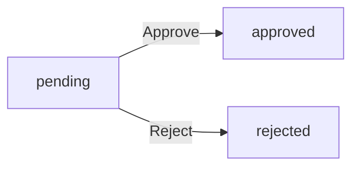

### Seller Approval Status

THE system SHALL track seller registrations with the following status values: pending, approved, rejected.

WHEN a seller signs up, THE system SHALL set their approval status to "pending".

IF an administrator approves a pending seller registration, THE system SHALL change the status to "approved".

IF an administrator rejects a pending seller registration, THE system SHALL change the status to "rejected" and record the rejection reason.

IF a rejected seller submits a new registration request, THE system SHALL create a new seller record with status "pending".

THE system SHALL NOT allow direct status changes from "approved" or "rejected" states.

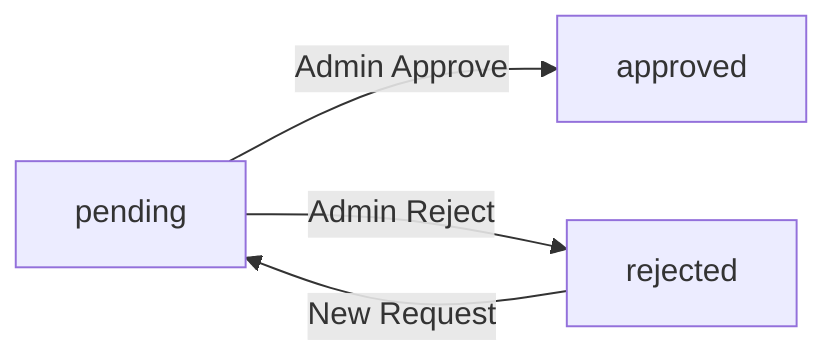

### Order Item Status

THE system SHALL track each order item with the following status values: paid, shipped, delivered, cancelled, refunded.

WHEN an order is placed successfully, THE system SHALL set all order items to status "paid".

WHEN a seller creates a shipment containing an order item, THE system SHALL change that item's status to "shipped".

WHEN a customer confirms delivery of a shipment, THE system SHALL change all items in that shipment to status "delivered".

IF 14 days pass after shipping without customer confirmation, THE system SHALL automatically change all items in that shipment to status "delivered".

IF a seller approves a cancellation request for a "paid" item, THE system SHALL change the item status to "cancelled".

IF a seller approves a refund request for a "delivered" item, THE system SHALL change the item status to "refunded".

THE system SHALL NOT allow cancellation requests for items with status other than "paid".

THE system SHALL NOT allow refund requests for items with status other than "delivered".

THE system SHALL NOT allow status transitions from "cancelled" or "refunded" states.

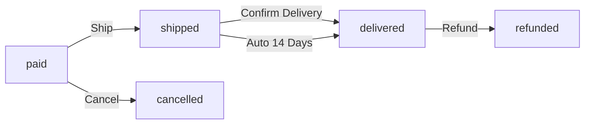

### Order Status Derivation

THE system SHALL derive the overall order status from its constituent order items.

IF all items in an order have status "paid", THE system SHALL set the order status to "paid".

IF any item in an order has status "shipped" and no items are delivered, THE system SHALL set the order status to "shipped".

IF all items in an order have status "delivered", THE system SHALL set the order status to "delivered".

IF all items in an order have status "cancelled", THE system SHALL set the order status to "cancelled".

IF all items in an order have status "refunded", THE system SHALL set the order status to "refunded".

IF an order contains items with mixed final statuses, THE system SHALL set the order status to "partially_completed".

THE system SHALL recalculate the order status whenever any item status changes.

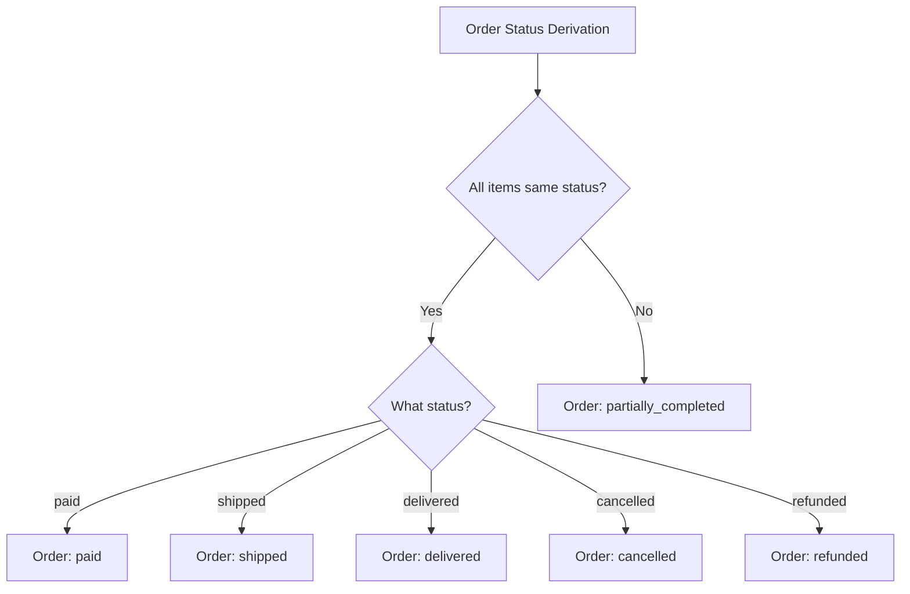

### Cancellation Request Status

THE system SHALL track cancellation requests with the following status values: pending, approved, rejected.

WHEN a customer requests cancellation for a "paid" order item, THE system SHALL create a cancellation request with status "pending".

IF the seller approves a pending cancellation request, THE system SHALL change the request status to "approved".

IF the seller rejects a pending cancellation request, THE system SHALL change the request status to "rejected".

WHEN the seller responds to a cancellation request, THE system SHALL create a snapshot of the request state.

THE system SHALL NOT allow status changes from "approved" or "rejected" states.

THE system SHALL NOT allow cancellation requests for items with status other than "paid".

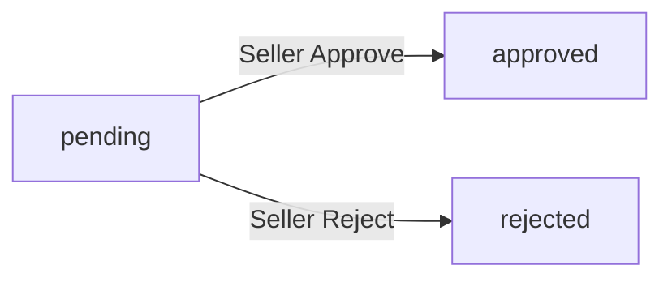

### Refund Request Status

THE system SHALL track refund requests with the following status values: pending, approved, rejected.

WHEN a customer requests a refund for a "delivered" order item within 7 days of delivery, THE system SHALL create a refund request with status "pending".

IF the seller approves a pending refund request, THE system SHALL change the request status to "approved".

IF the seller rejects a pending refund request, THE system SHALL change the request status to "rejected".

WHEN the seller responds to a refund request, THE system SHALL create a snapshot of the request state.

THE system SHALL NOT allow status changes from "approved" or "rejected" states.

THE system SHALL NOT allow refund requests for items with status other than "delivered".

THE system SHALL NOT allow refund requests for items delivered more than 7 days ago.

### Customer Account Status

THE system SHALL track customer accounts with the following status values: active, banned.

WHEN a customer successfully registers, THE system SHALL set their account status to "active".

IF an administrator bans an active customer, THE system SHALL change the account status to "banned".

IF an administrator unbans a banned customer, THE system SHALL change the account status to "active".

WHILE a customer account has status "banned", THE system SHALL prevent that customer from logging in.

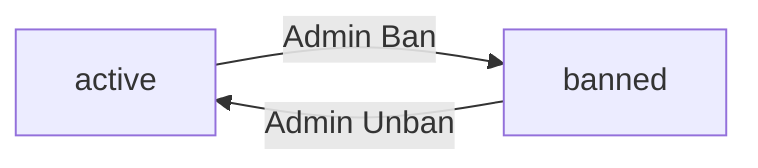

### Seller Account Status

THE system SHALL track seller accounts with the following status values: pending, approved, rejected, active, suspended.

WHEN a seller successfully registers, THE system SHALL set their approval status based on administrator review: "approved" or "rejected".

WHEN a seller is approved, THE system SHALL set their account status to "active".

IF an administrator suspends an active seller, THE system SHALL change the account status to "suspended".

IF an administrator unsuspends a suspended seller, THE system SHALL change the account status to "active".

IF an administrator bans a seller, THE system SHALL prevent that seller from logging in.

IF an administrator unbans a banned seller, THE system SHALL restore their previous active or suspended status.

WHILE a seller account has status "suspended", THE system SHALL hide their products from search and category listings.

WHILE a seller account has status "suspended", THE system SHALL prevent purchases of their products.

WHILE a seller account has status "suspended", THE system SHALL allow the seller to process existing orders.

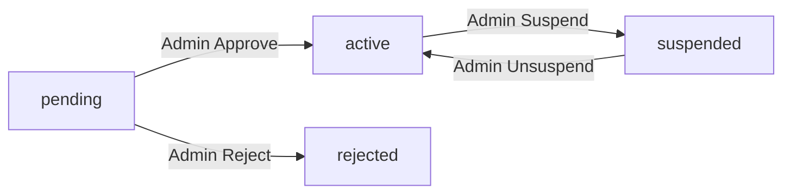