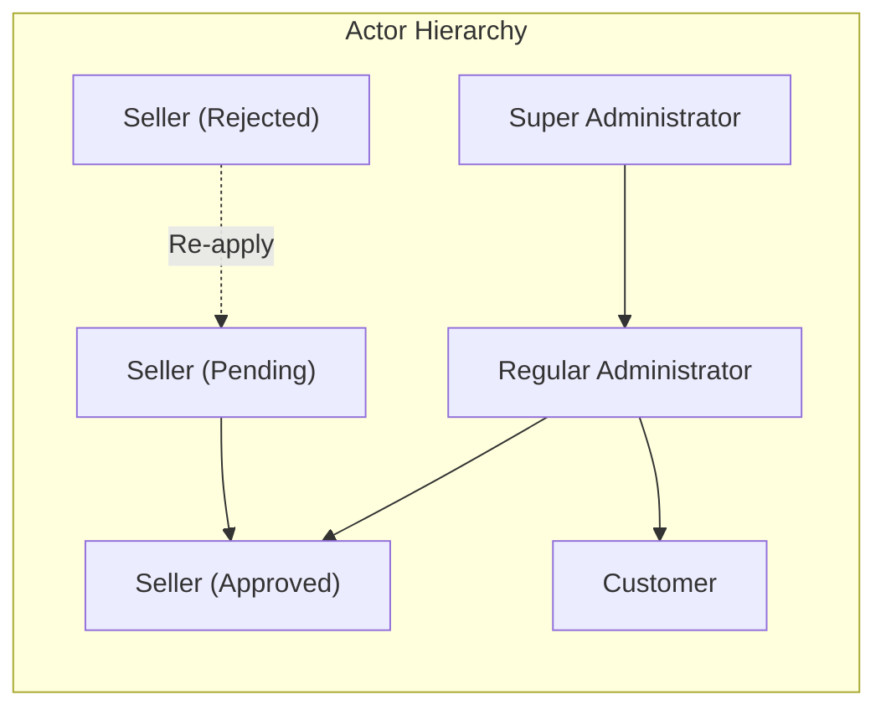
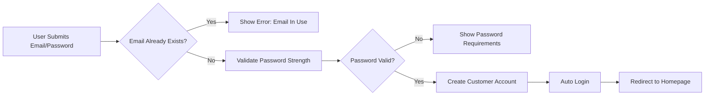
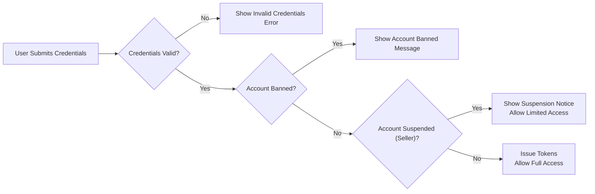
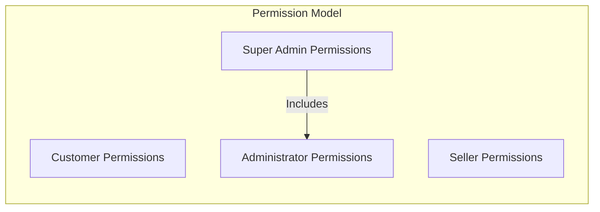
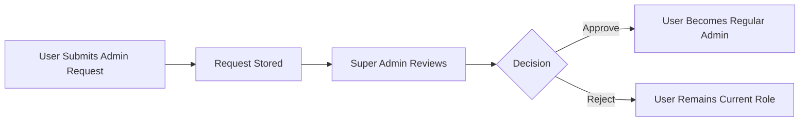
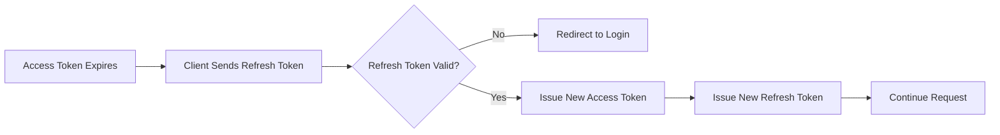

# User Actors Specification

## Overview

This document defines the complete user actor system for the shopping mall e-commerce platform, including authentication flows, authorization model, permission matrices, and session management. The platform operates with three distinct actor types, each with specific capabilities and access levels.

## 1. User Actor Definitions

### 1.1 Customer

**Definition**: A Customer is a registered user who can browse products, manage purchases, and interact with sellers through orders and reviews.

**Core Responsibilities**:
- Browse and search products across all sellers
- Manage shopping cart and wishlist
- Place orders and make payments
- Track shipments and confirm delivery
- Request cancellations and refunds
- Write product reviews and ratings
- Manage personal profile and shipping addresses

**Key Characteristics**:
- Requires registration to access ANY platform features (no guest browsing)
- Orders and reviews are preserved for legal/seller record purposes even after account deletion
- Deleted customer accounts display as "deleted user" in preserved reviews

### 1.2 Seller

**Definition**: A Seller is a registered merchant who can list products, manage inventory, process orders, and operate a shop on the platform.

**Core Responsibilities**:
- Create and manage product listings
- Manage product variants (SKU) and inventory
- Process and ship customer orders
- Respond to cancellation and refund requests
- Maintain shop profile and branding
- View seller dashboard and analytics

**Key Characteristics**:
- Requires administrator approval before activating selling privileges
- Can only delete account if no pending orders or cancellation/refund requests exist
- Shop name preserved in order history even after account deletion
- Products hidden from listings when suspended but can still process existing orders

### 1.3 Administrator

**Definition**: An Administrator is a privileged user who manages platform operations, oversees sellers, and ensures policy compliance.

**Administrator Grades**:
- **Regular Administrator**: Standard administrative permissions for day-to-day platform management
- **Super Administrator**: Elevated permissions including ability to manage other administrators

**Core Responsibilities**:
- Approve/reject seller registrations
- Manage product categories
- Oversee products and orders platform-wide
- Handle user bans and suspensions
- Force-cancel or force-refund orders when necessary

**Key Characteristics**:
- Can be promoted from customer or seller accounts
- Super administrators cannot demote themselves
- Super administrators can promote/demote other administrators

### 1.4 Actor Hierarchy



---

## 2. Authentication Requirements

### 2.1 Registration

#### Customer Registration

**Functional Requirements**:

- THE system SHALL allow any user to register as a customer with email and password
- WHEN a user submits registration with an email already in use, THE system SHALL reject the registration and display an appropriate error message
- THE system SHALL validate email format during registration
- THE system SHALL enforce minimum password strength requirements (minimum 8 characters, at least one letter and one number)
- WHEN registration is successful, THE system SHALL create a customer account and automatically log the user in

**Registration Flow**:



#### Seller Registration

**Functional Requirements**:

- THE system SHALL allow any user to register as a seller with email and password
- WHEN a user submits seller registration, THE system SHALL create the account with "pending" approval status
- THE system SHALL store the seller profile information (shop name, description, logo) during registration
- WHEN seller registration is successful, THE system SHALL notify the user that their application is pending administrator review
- WHILE a seller account is pending approval, THE seller SHALL NOT be able to create products or access seller features

**Approval States**:

| State | Description | Capabilities |
|-------|-------------|-------------|
| Pending | Awaiting administrator review | Cannot sell, can view status |
| Approved | Full seller privileges | Full seller capabilities |
| Rejected | Application denied | Can view reason, can re-apply |

**Rejection and Re-application**:

- WHEN a seller registration is rejected, THE system SHALL display the rejection reason provided by the administrator
- THE system SHALL allow rejected sellers to submit a new registration request
- WHEN a rejected seller re-applies, THE system SHALL process the new application as a fresh pending request

#### Administrator Appointment

**Functional Requirements**:

- THE system SHALL allow any user (customer or seller) to submit a request to become an administrator
- WHEN submitting an admin request, THE user SHALL provide a reason text explaining their qualification
- THE system SHALL store admin requests for super administrator review
- WHEN a super administrator approves a request, THE user SHALL be promoted to regular administrator status
- WHEN a super administrator rejects a request, THE user SHALL remain at their current actor level

### 2.2 Login

**Functional Requirements**:

- THE system SHALL allow customers to log in with their registered email and password
- THE system SHALL allow sellers to log in with their registered email and password
- THE system SHALL allow administrators to log in with their registered email and password
- WHEN login credentials are invalid, THE system SHALL return a generic error message (not specifying whether email or password is incorrect)
- WHEN login is successful, THE system SHALL issue a JWT access token and refresh token
- THE system SHALL enforce account status checks during login

**Account Status Handling**:



**Seller-Specific Login Behavior**:

- WHEN a seller with pending approval status logs in, THE system SHALL allow login but display approval status prominently
- WHEN a seller with rejected status logs in, THE system SHALL allow login and show rejection reason with option to re-apply
- WHEN a suspended seller logs in, THE system SHALL allow login with restricted capabilities (can process existing orders, cannot create/edit products)

### 2.3 Logout

**Functional Requirements**:

- WHEN a user requests logout, THE system SHALL invalidate the current session
- THE system SHALL clear the refresh token from storage
- WHEN logout is complete, THE system SHALL redirect the user to the login page
- THE system SHALL support logout from all devices (invalidate all refresh tokens for the user)

### 2.4 Password Management

**Change Password**:

- THE system SHALL allow all actors to change their password
- WHEN changing password, THE user SHALL provide their current password and new password
- THE system SHALL validate the new password meets strength requirements
- WHEN password change is successful, THE system SHALL NOT invalidate existing sessions (user can continue using current session)

**Password Reset (Forgot Password)**:

- THE system SHALL provide password reset functionality via email
- WHEN a user requests password reset, THE system SHALL send a reset link to the registered email
- THE reset link SHALL expire after a limited time (recommended: 1 hour)
- WHEN a user successfully resets password, THE system SHALL invalidate all existing sessions for security

---

## 3. Authorization and Permission Model

### 3.1 Permission Inheritance Structure

The platform follows a flat permission model where each actor has explicitly defined permissions without inheritance between actor types. Users can hold multiple actor roles (e.g., a customer can also be a seller or administrator).



**Note**: Super Administrator includes all Regular Administrator permissions plus administrator management capabilities.

### 3.2 Access Control Principles

**Authentication Required for All Actions**:

- THE system SHALL require authentication for ALL platform features
- THE system SHALL NOT allow guest browsing of products
- WHEN an unauthenticated user attempts to access protected resources, THE system SHALL redirect to the login page

**Ownership-Based Access**:

- THE system SHALL restrict data modification to the owner of that data
- Customers SHALL only modify their own profile, addresses, cart, and wishlist
- Sellers SHALL only modify their own products, shop profile, and process their own orders
- Administrators SHALL have override access for oversight purposes

**Status-Based Access**:

- WHILE a seller account is pending approval, THE seller SHALL NOT access product creation or inventory management
- WHILE a seller account is suspended, THE seller SHALL be able to process existing orders but NOT create new products
- WHEN an account is banned, THE user SHALL NOT be able to log in

---

## 4. Actor Registration and Account Management

### 4.1 Customer Account Management

**Profile Management**:

- THE system SHALL allow customers to view and edit their display name
- THE system SHALL allow customers to view and edit their phone number
- THE system SHALL require display name to be non-empty
- THE system SHALL validate phone number format if provided

**Account Deletion**:

- THE system SHALL allow customers to delete their own account
- WHEN a customer deletes their account:
  - THE system SHALL remove all profile information
  - THE system SHALL preserve all order history and order records
  - THE system SHALL preserve all reviews but display author as "deleted user"
  - THE system SHALL remove the account from the wishlist of other users if applicable

**Address Management**:

- THE system SHALL allow customers to add multiple shipping addresses
- THE system SHALL allow customers to edit their addresses
- THE system SHALL allow customers to delete their addresses
- THE system SHALL allow customers to set one address as the default shipping address

### 4.2 Seller Account Management

**Shop Profile Management**:

- THE system SHALL allow approved sellers to set their shop name
- THE system SHALL allow approved sellers to set their shop description
- THE system SHALL allow approved sellers to upload a shop logo image
- THE system SHALL allow approved sellers to edit shop name, description, and logo
- WHEN a seller edits their shop profile, THE system SHALL create a snapshot of the previous state

**Approval Status Management**:

- THE system SHALL display approval status to sellers (pending, approved, rejected)
- WHEN a seller is rejected, THE system SHALL display the rejection reason
- THE system SHALL allow rejected sellers to submit a new registration request

**Account Deletion Conditions**:

- THE system SHALL check deletion eligibility before allowing seller account deletion
- WHEN a seller requests account deletion, THE system SHALL verify:
  - No pending order items (paid or shipped status) exist for any of the seller's products
  - No pending cancellation requests exist
  - No pending refund requests exist
- IF any pending items or requests exist, THE system SHALL reject the deletion request with explanation
- WHEN seller account deletion is successful:
  - THE system SHALL remove all products from active listings
  - THE system SHALL preserve order history and order item snapshots
  - THE system SHALL preserve the shop name in past orders

**Seller Suspension**:

- WHEN an administrator suspends a seller:
  - THE system SHALL hide all seller's products from search and category listings
  - THE system SHALL prevent new purchases of the seller's products
  - THE system SHALL allow the seller to process existing orders (ship items, respond to requests)
  - THE system SHALL prevent the seller from creating new products or editing existing products
- WHEN an administrator unsuspends a seller, THE system SHALL restore product visibility

### 4.3 Administrator Account Management

**Administrator Appointment Process**:



**Grade Management**:

- THE system SHALL allow super administrators to promote regular administrators to super administrator status
- THE system SHALL allow super administrators to demote other super administrators to regular administrator status
- THE system SHALL NOT allow a super administrator to demote themselves

---

## 5. Permission Matrix

### 5.1 Complete Permission Matrix

| Action | Customer | Seller (Approved) | Seller (Pending) | Seller (Suspended) | Admin | Super Admin |
|--------|:--------:|:-----------------:|:----------------:|:------------------:|:-----:|:-----------:|
| **Authentication** |
| Register as Customer | ✅ | ✅ | ✅ | ✅ | ✅ | ✅ |
| Register as Seller | ✅ | ✅ | ✅ | ✅ | ✅ | ✅ |
| Login to Account | ✅ | ✅ | ✅ | ✅ | ✅ | ✅ |
| Logout | ✅ | ✅ | ✅ | ✅ | ✅ | ✅ |
| Change Password | ✅ | ✅ | ✅ | ✅ | ✅ | ✅ |
| Delete Own Account | ✅ | ✅* | ✅ | ✅* | ✅ | ✅ |
| **Product Browsing** |
| Browse Products | ✅ | ✅ | ✅ | ✅ | ✅ | ✅ |
| Search Products | ✅ | ✅ | ✅ | ✅ | ✅ | ✅ |
| View Product Details | ✅ | ✅ | ✅ | ✅ | ✅ | ✅ |
| View Seller Profiles | ✅ | ✅ | ✅ | ✅ | ✅ | ✅ |
| **Cart and Wishlist** |
| Manage Cart | ✅ | ✅ | ✅ | ✅ | ✅ | ✅ |
| Manage Wishlist | ✅ | ✅ | ✅ | ✅ | ✅ | ✅ |
| **Orders (as Customer)** |
| Place Orders | ✅ | ✅ | ✅ | ✅ | ✅ | ✅ |
| View Own Orders | ✅ | ✅ | ✅ | ✅ | ✅ | ✅ |
| Request Cancellation | ✅ | ✅ | ✅ | ✅ | ✅ | ✅ |
| Request Refund | ✅ | ✅ | ✅ | ✅ | ✅ | ✅ |
| Confirm Delivery | ✅ | ✅ | ✅ | ✅ | ✅ | ✅ |
| **Reviews** |
| Write Reviews | ✅ | ✅ | ✅ | ✅ | ✅ | ✅ |
| Edit Own Reviews | ✅ | ✅ | ✅ | ✅ | ✅ | ✅ |
| Delete Own Reviews | ✅ | ✅ | ✅ | ✅ | ✅ | ✅ |
| **Seller Operations** |
| Create Products | ❌ | ✅ | ❌ | ❌ | ❌ | ❌ |
| Edit Own Products | ❌ | ✅ | ❌ | ❌ | ❌ | ❌ |
| Delete Own Products | ❌ | ✅ | ❌ | ❌ | ❌ | ❌ |
| Manage Inventory | ❌ | ✅ | ❌ | ❌ | ❌ | ❌ |
| Process Orders (Ship) | ❌ | ✅ | ❌ | ✅ | ❌ | ❌ |
| Respond to Cancellations | ❌ | ✅ | ❌ | ✅ | ❌ | ❌ |
| Respond to Refunds | ❌ | ✅ | ❌ | ✅ | ❌ | ❌ |
| View Seller Dashboard | ❌ | ✅ | ❌ | ✅ | ❌ | ❌ |
| Edit Shop Profile | ❌ | ✅ | ❌ | ❌ | ❌ | ❌ |
| **Administrator Operations** |
| Approve/Reject Sellers | ❌ | ❌ | ❌ | ❌ | ✅ | ✅ |
| Suspend/Unsuspend Sellers | ❌ | ❌ | ❌ | ❌ | ✅ | ✅ |
| Ban/Unban Users | ❌ | ❌ | ❌ | ❌ | ✅ | ✅ |
| Manage Categories | ❌ | ❌ | ❌ | ❌ | ✅ | ✅ |
| Delete Any Product | ❌ | ❌ | ❌ | ❌ | ✅ | ✅ |
| Force-Cancel Orders | ❌ | ❌ | ❌ | ❌ | ✅ | ✅ |
| Force-Refund Orders | ❌ | ❌ | ❌ | ❌ | ✅ | ✅ |
| View All Orders | ❌ | ❌ | ❌ | ❌ | ✅ | ✅ |
| View All Products | ❌ | ❌ | ❌ | ❌ | ✅ | ✅ |
| **Super Admin Operations** |
| View Admin Requests | ❌ | ❌ | ❌ | ❌ | ❌ | ✅ |
| Approve Admin Requests | ❌ | ❌ | ❌ | ❌ | ❌ | ✅ |
| Promote Admins | ❌ | ❌ | ❌ | ❌ | ❌ | ✅ |
| Demote Admins | ❌ | ❌ | ❌ | ❌ | ❌ | ✅ |

**Legend**: ✅ = Allowed, ❌ = Not Allowed, ✅* = Conditional (see specific rules)

### 5.2 Conditional Permission Details

**Seller Account Deletion** (marked with *):
- Allowed ONLY when:
  - No pending order items (paid or shipped status)
  - No pending cancellation requests
  - No pending refund requests

---

## 6. Session and Token Management

### 6.1 JWT Token Structure

**Token Type**: JSON Web Token (JWT)

**Access Token Payload**:

```json
{
  "sub": "user_id",
  "email": "user@example.com",
  "actor": "customer | seller | admin",
  "adminGrade": "regular | super",
  "sellerStatus": "pending | approved | rejected | suspended",
  "permissions": ["array", "of", "permission", "strings"],
  "iat": 1234567890,
  "exp": 1234567890
}
```

**Token Claims Specification**:

| Claim | Type | Description | Required For |
|-------|------|-------------|--------------|
| sub | string | Unique user identifier | All actors |
| email | string | User's registered email | All actors |
| actor | enum | Primary actor type | All actors |
| adminGrade | enum | Administrator grade level | Admin only |
| sellerStatus | enum | Seller approval status | Seller only |
| permissions | array | List of granted permissions | All actors |
| iat | number | Issued at timestamp | All actors |
| exp | number | Expiration timestamp | All actors |

### 6.2 Token Lifecycle

**Access Token**:

- THE system SHALL issue access tokens with a 30-minute expiration time
- THE system SHALL validate access tokens on every protected API request
- WHEN an access token expires, THE client SHALL use the refresh token to obtain a new access token
- THE system SHALL reject access tokens from banned users

**Refresh Token**:

- THE system SHALL issue refresh tokens with a 14-day expiration time
- THE system SHALL store refresh tokens securely (httpOnly cookie recommended)
- WHEN a refresh token is used, THE system SHALL issue a new access token and new refresh token (rotation)
- WHEN a refresh token expires, THE user SHALL be required to log in again
- THE system SHALL invalidate all refresh tokens when a user logs out from all devices

**Token Refresh Flow**:



### 6.3 Session Security Requirements

**Security Measures**:

- THE system SHALL use HTTPS for all authentication endpoints
- THE system SHALL hash all passwords using a strong hashing algorithm (bcrypt or argon2)
- THE system SHALL NOT store passwords in plain text
- THE system SHALL generate a unique JWT secret key for token signing
- THE system SHALL implement rate limiting on login endpoints to prevent brute force attacks
- WHEN multiple failed login attempts are detected, THE system SHALL implement temporary account lockout

**Token Storage (Client-Side)**:

- THE system SHALL store refresh tokens in httpOnly cookies to prevent XSS attacks
- THE system SHALL optionally store access tokens in memory or localStorage for client access
- THE system SHALL implement CSRF protection when using cookie-based storage

### 6.4 Multi-Device Session Management

**Functional Requirements**:

- THE system SHALL allow users to be logged in on multiple devices simultaneously
- THE system SHALL track active sessions (device type, IP address, last activity)
- THE system SHALL allow users to view their active sessions
- WHEN a user requests "logout from all devices", THE system SHALL invalidate all refresh tokens
- WHEN suspicious activity is detected (login from new location), THE system SHALL optionally notify the user via email

---

## 7. Actor State Management

### 7.1 Customer States

```mermaid
stateDiagram-v2
    [*] --> "Active"
    "Active" --> "Banned": Admin Bans
    "Banned" --> "Active": Admin Unbans
    "Active" --> "Deleted": User Deletes Account
    "Deleted" --> [*]
```

### 7.2 Seller States

```mermaid
stateDiagram-v2
    [*] --> "Pending"
    "Pending" --> "Approved": Admin Approves
    "Pending" --> "Rejected": Admin Rejects
    "Rejected" --> "Pending": Seller Re-applies
    "Approved" --> "Suspended": Admin Suspends
    "Suspended" --> "Approved": Admin Unsuspends
    "Approved" --> "Banned": Admin Bans
    "Suspended" --> "Banned": Admin Bans
    "Banned" --> "Approved": Admin Unbans
    "Approved" --> "Deleted": Seller Deletes (if eligible)
    "Deleted" --> [*]
```

### 7.3 Administrator States

```mermaid
stateDiagram-v2
    [*] --> "Requested": User Submits Request
    "Requested" --> "Regular Admin": Super Admin Approves
    "Requested" --> [*]: Super Admin Rejects
    "Regular Admin" --> "Super Admin": Super Admin Promotes
    "Super Admin" --> "Regular Admin": Another Super Admin Demotes
```

---

## 8. Error Handling and User Feedback

### 8.1 Authentication Error Messages

| Scenario | User Message | Technical Code |
|----------|--------------|----------------|
| Invalid credentials | "Invalid email or password" | AUTH_INVALID_CREDENTIALS |
| Email already in use | "This email is already registered" | AUTH_EMAIL_EXISTS |
| Account banned | "Your account has been banned. Contact support." | AUTH_ACCOUNT_BANNED |
| Weak password | "Password must be at least 8 characters with letters and numbers" | AUTH_WEAK_PASSWORD |
| Invalid email format | "Please enter a valid email address" | AUTH_INVALID_EMAIL |
| Token expired | "Your session has expired. Please log in again." | AUTH_TOKEN_EXPIRED |
| Invalid token | "Invalid session. Please log in again." | AUTH_TOKEN_INVALID |

### 8.2 Authorization Error Messages

| Scenario | User Message | Technical Code |
|----------|--------------|----------------|
| Insufficient permissions | "You do not have permission to perform this action" | AUTH_FORBIDDEN |
| Seller not approved | "Your seller account is pending approval" | SELLER_PENDING |
| Seller suspended | "Your account is suspended. Some features are unavailable." | SELLER_SUSPENDED |
| Account deletion blocked | "Cannot delete account: pending orders exist" | DELETE_BLOCKED |

---

## 9. Summary

This document defines the complete authentication and authorization framework for the shopping mall e-commerce platform. The system implements:

1. **Three distinct actor types** with clearly defined roles and capabilities
2. **JWT-based authentication** with access and refresh token rotation
3. **Comprehensive permission matrix** covering all system operations
4. **Status-based access control** for sellers with approval workflow
5. **Secure session management** with multi-device support
6. **Complete audit trail** through snapshot preservation for dispute resolution

All authentication and authorization requirements are specified for immediate implementation by backend developers.