**shoppingMall — What operations users can perform, use cases, business workflows**

What operations users can perform, use cases, business workflows

# Core Business Operations

What the system must do for each business concept.

## Customer Operations

Customers register with email and password to access the platform. Registration requires a unique email address among all active customer accounts. Password must meet security requirements. Customers log in with their email and password credentials. Customers can change their password at any time while logged in. Customers can update their profile display name and phone number. Customers can add multiple shipping addresses, edit them, set a default, and delete them. Customers can delete their own account, which removes profile information but preserves order history for seller records and legal compliance. Reviews from deleted accounts are preserved but displayed as 'deleted user'. Account deletion is permanent and cannot be undone.

### Customer Registration

WHEN a person registers as a customer, THE system SHALL require an email address and a password.

WHEN a person submits a registration request, THE system SHALL validate that the email address is not already registered to an active customer account.

IF the email address is already registered to an active customer account, THE system SHALL reject the registration request.

WHEN a registration is successful, THE system SHALL create a new customer account with the provided email and password.

WHEN a customer account is created, THE system SHALL create an empty profile with no display name or phone number.

WHEN a customer account is created, THE system SHALL create an empty cart for the customer.

THE system SHALL not allow unregistered users to browse products or access any platform features.

IF the email format is invalid, THE system SHALL reject the registration request.

IF the password does not meet security requirements, THE system SHALL reject the registration request.

### Login Authentication

WHEN a customer attempts to log in, THE system SHALL require the registered email address and password.

WHEN a customer submits login credentials, THE system SHALL validate the email and password combination against the stored credentials.

IF the email address is not found in the system, THE system SHALL reject the login attempt.

IF the password does not match the stored password for the email address, THE system SHALL reject the login attempt.

IF the customer account has been banned, THE system SHALL reject the login attempt.

WHEN login credentials are valid and the account is not banned, THE system SHALL authenticate the customer and grant access to the platform.

IF a banned customer attempts to log in, THE system SHALL display a message indicating the account is banned without revealing specific ban details.

### Password Management

WHEN a logged-in customer requests to change their password, THE system SHALL require the current password and a new password.

WHEN a customer submits a password change request, THE system SHALL validate that the current password matches the stored password.

IF the current password does not match the stored password, THE system SHALL reject the password change request.

IF the new password does not meet security requirements, THE system SHALL reject the password change request.

WHEN a password change is successful, THE system SHALL update the stored password with the new password.

WHEN a password is changed, THE system SHALL not invalidate the customer's current session.

THE system SHALL not allow customers to reuse their current password as the new password.

### Profile Management

THE system SHALL maintain a profile for each customer containing a display name and a phone number.

WHEN a customer updates their display name, THE system SHALL save the new display name to the customer's profile.

WHEN a customer updates their phone number, THE system SHALL save the new phone number to the customer's profile.

THE system SHALL allow customers to leave the display name empty.

THE system SHALL allow customers to leave the phone number empty.

WHEN a customer updates their profile, THE system SHALL immediately reflect the changes.

THE system SHALL not create snapshots for profile updates.

IF the display name exceeds the maximum allowed length, THE system SHALL reject the update.

IF the phone number format is invalid, THE system SHALL reject the update.

### Account Deletion

WHEN a customer requests to delete their account, THE system SHALL permanently remove the customer's profile information including display name and phone number.

WHEN a customer account is deleted, THE system SHALL preserve all orders and order history associated with the customer.

WHEN a customer account is deleted, THE system SHALL preserve all reviews written by the customer.

WHEN displaying reviews from a deleted customer account, THE system SHALL show the author as "deleted user" instead of the original display name.

WHEN a customer account is deleted, THE system SHALL remove the customer's wishlist.

WHEN a customer account is deleted, THE system SHALL remove the customer's cart and cart items.

WHEN a customer account is deleted, THE system SHALL remove all addresses associated with the customer.

THE system SHALL not allow a deleted customer account to be recovered.

IF a deleted customer attempts to register again with the same email address, THE system SHALL allow the registration as a new customer account.

WHEN a deleted customer re-registers with the same email, THE system SHALL not restore any previous order history or reviews to the new account.

## Seller Operations

Sellers register with email and password to request selling privileges on the platform. Seller accounts require administrator approval before they can list products. Sellers can view their approval status as pending, approved, or rejected. Rejected sellers can view the rejection reason provided by administrators and submit a new registration request. Approved sellers can create, edit, and delete products within platform constraints. Sellers manage their shop profile including shop name, description, and logo image. Sellers can change their password at any time. Sellers can delete their account only if they have no pending orders and no pending cancellation or refund requests. Account deletion removes products from listings but preserves order history and shop name in past orders.

### Seller Registration and Approval

### Seller Registration

WHEN a user registers as a seller, THE system SHALL:
1. Require a unique email address
2. Require a password
3. Create a seller account with status "pending"
4. Prevent the seller from listing products until approved

IF the email address is already registered, THE system SHALL reject the registration.

### Administrator Approval Requirement

WHEN a seller account is created, THE system SHALL:
1. Set the seller status to "pending"
2. Make the account visible to administrators for review
3. Prevent any product creation until approval

WHILE a seller has status "pending", THE system SHALL:
1. Allow the seller to log in
2. Allow the seller to view their approval status
3. Prevent the seller from creating, editing, or deleting products
4. Prevent the seller from accessing the seller dashboard

### Approval Process

WHEN an administrator approves a seller registration, THE system SHALL:
1. Change the seller status to "approved"
2. Grant the seller full selling privileges
3. Allow the seller to create and manage products

WHEN an administrator rejects a seller registration, THE system SHALL:
1. Change the seller status to "rejected"
2. Record the rejection reason provided by the administrator
3. Prevent the seller from selling on the platform

### Approval Status Management

### Viewing Approval Status

WHEN a seller views their approval status, THE system SHALL display:
1. The current status (pending, approved, or rejected)
2. The rejection reason if status is "rejected"

WHILE a seller has status "pending", THE system SHALL:
1. Display a message indicating the account is under review
2. Disable all product management features

WHILE a seller has status "approved", THE system SHALL:
1. Grant access to all seller features
2. Allow product creation and management

### Rejected Seller Reapplication

WHEN a rejected seller views their status, THE system SHALL:
1. Display the rejection reason provided by the administrator
2. Provide an option to submit a new registration request

WHEN a rejected seller submits a new registration request, THE system SHALL:
1. Change the seller status back to "pending"
2. Clear the previous rejection reason
3. Make the account available for administrator review again

IF a rejected seller has not submitted a new request, THE system SHALL maintain the rejected status indefinitely.

### Shop Profile Management

### Shop Profile Structure

WHEN a seller is approved, THE system SHALL provide a shop profile with:
1. Shop name
2. Shop description
3. Logo image

### Profile Editing

WHEN an approved seller edits their shop profile, THE system SHALL:
1. Allow modification of shop name, description, and logo image
2. Create a snapshot recording the previous state before changes
3. Record the timestamp of the change
4. Record what fields were changed and their previous values

THE system SHALL preserve all profile snapshots for dispute resolution.

### Profile Visibility

WHEN a customer views a product, THE system SHALL display:
1. The seller's shop name
2. A link to the seller's shop profile

WHEN a customer views a seller's shop profile, THE system SHALL display:
1. The current shop name
2. The current shop description
3. The current logo image

### Password Management

### Password Change Operation

WHEN a seller changes their password, THE system SHALL:
1. Require authentication with the current password
2. Accept a new password
3. Update the seller's password
4. Allow the seller to continue using their account immediately

IF the current password provided is incorrect, THE system SHALL reject the password change.

THE system SHALL allow sellers to change their password at any time regardless of account status (pending, approved, rejected, or suspended).

### Product Management Permissions

### Product Creation Permission

WHEN a seller with status "approved" creates a product, THE system SHALL:
1. Accept the product details
2. Associate the product with the seller
3. Make the product available for customer viewing

WHEN a seller with status "pending" attempts to create a product, THE system SHALL reject the request.

WHEN a seller with status "rejected" attempts to create a product, THE system SHALL reject the request.

WHEN a seller with status "suspended" attempts to create a product, THE system SHALL reject the request.

### Product Editing Permission

WHEN a seller with status "approved" edits their own product, THE system SHALL:
1. Allow the modification
2. Create a snapshot of the product state before changes

WHEN a seller attempts to edit another seller's product, THE system SHALL reject the request.

WHEN a seller with status "suspended" attempts to edit a product, THE system SHALL reject the request.

### Product Deletion Permission

WHEN a seller with status "approved" deletes their own product, THE system SHALL:
1. Verify no pending order items exist for any variant
2. Verify no pending cancellation requests exist for any variant
3. Verify no pending refund requests exist for any variant
4. Delete the product and all associated variants if conditions are met

IF pending order items, cancellation requests, or refund requests exist for the product, THE system SHALL reject the deletion.

WHEN a seller with status "suspended" attempts to delete a product, THE system SHALL reject the request.

### Account Deletion Constraints

### Pending Order Restrictions

WHEN a seller attempts to delete their account, THE system SHALL check for:
1. Order items with status "paid" belonging to the seller
2. Order items with status "shipped" belonging to the seller
3. Pending cancellation requests for the seller's products
4. Pending refund requests for the seller's products

IF any pending orders (paid or shipped status) exist for the seller's products, THE system SHALL reject the account deletion.

IF any pending cancellation requests exist for the seller's products, THE system SHALL reject the account deletion.

IF any pending refund requests exist for the seller's products, THE system SHALL reject the account deletion.

### Deletion Eligibility

WHEN a seller requests account deletion and meets all conditions, THE system SHALL:
1. Verify no pending order items exist
2. Verify no pending cancellation requests exist
3. Verify no pending refund requests exist
4. Proceed with account deletion if all conditions are satisfied

### Account Deletion Effects

### Data Deletion on Seller Account Removal

WHEN a seller account is deleted, THE system SHALL:
1. Remove the seller's profile information
2. Delete all products belonging to the seller
3. Remove all product variants and inventory records
4. Remove products from customer wishlists automatically

### Data Preservation on Seller Account Removal

WHEN a seller account is deleted, THE system SHALL preserve:
1. All order history and order item records
2. All order item snapshots
3. The seller's shop name as it appeared in past orders
4. All shipment records and tracking information
5. All product snapshots created during the seller's activity

### Historical Record Integrity

WHEN a customer views an order from a deleted seller, THE system SHALL:
1. Display the preserved shop name
2. Display the preserved product information from snapshots
3. Indicate the seller is no longer active on the platform

THE system SHALL ensure deleted sellers' historical order data remains accessible for:
1. Customer order history review
2. Dispute resolution
3. Legal compliance

## Administrator Operations

Users become administrators by submitting a request that super administrators review and approve. Administrators have two grades: regular administrator and super administrator. Super administrators can promote regular administrators to super administrator status. Super administrators can demote other super administrators to regular administrator, but cannot demote themselves. Administrators manage seller registrations by approving or rejecting pending requests. When rejecting, administrators must provide a reason. Administrators can suspend seller accounts to hide products while allowing order processing. Administrators can ban customers or sellers, preventing login access. Administrators create and manage product categories and subcategories. Administrators can view and delete any product for policy violations. Administrators can force-cancel or force-refund orders.

### Administrator Request Approval

### Administrator Request Submission and Review

WHEN a user submits a request to become an administrator, THE system SHALL:
1. Record the user's identity and the reason text provided
2. Set the request status to pending
3. Allow the user to view their own request status

WHEN a super administrator views pending administrator requests, THE system SHALL display all requests with pending status.

WHEN a super administrator approves a pending administrator request, THE system SHALL:
1. Change the user's role to regular administrator
2. Set the request status to approved
3. Record the approving super administrator and approval timestamp

WHEN a super administrator rejects a pending administrator request, THE system SHALL:
1. Require the super administrator to provide a rejection reason
2. Set the request status to rejected
3. Record the rejecting super administrator and rejection timestamp

IF a user's administrator request is rejected, THE system SHALL allow the user to submit a new administrator request.

### Permission Constraints

IF a user is not a super administrator, THE system SHALL reject any attempt to view or respond to administrator requests.

IF a super administrator attempts to approve their own existing administrator request, THE system SHALL reject the operation.

### Administrator Grade Management

### Administrator Grade Distinction

THE system SHALL maintain two administrator grades: regular administrator and super administrator.

WHEN a user becomes an administrator through request approval, THE system SHALL assign them the grade of regular administrator.

### Grade Information Display

WHEN an administrator views their own profile, THE system SHALL display their administrator grade.

WHEN a super administrator views the list of administrators, THE system SHALL display each administrator's grade.

### Grade-Based Access Control

IF an administrator has regular administrator grade, THE system SHALL NOT allow access to administrator request approval functions.

IF an administrator has regular administrator grade, THE system SHALL NOT allow access to promotion and demotion functions.

IF an administrator has regular administrator grade, THE system SHALL allow access to seller management functions.

IF an administrator has regular administrator grade, THE system SHALL allow access to user management functions.

IF an administrator has regular administrator grade, THE system SHALL allow access to category management functions.

IF an administrator has regular administrator grade, THE system SHALL allow access to product oversight functions.

IF an administrator has regular administrator grade, THE system SHALL allow access to forced order operations.

### Super Administrator Privileges

### Elevated Privileges

IF an administrator has super administrator grade, THE system SHALL allow access to all administrator functions.

### Administrator Request Management

IF an administrator has super administrator grade, THE system SHALL allow viewing the list of pending administrator requests.

IF an administrator has super administrator grade, THE system SHALL allow approving or rejecting pending administrator requests.

### Promotion Authority

IF an administrator has super administrator grade, THE system SHALL allow promoting regular administrators to super administrator grade.

### Demotion Authority

IF an administrator has super administrator grade, THE system SHALL allow demoting other super administrators to regular administrator grade.

IF a super administrator attempts to demote themselves, THE system SHALL reject the operation.

### Super Administrator Count Protection

WHILE the system has only one super administrator, THE system SHALL prevent that super administrator from being demoted to regular administrator grade.

### Approval and Rejection Documentation

WHEN a super administrator approves or rejects any request, THE system SHALL record the super administrator's identity and the action timestamp.

### Promotion and Demotion

### Promotion Process

WHEN a super administrator promotes a regular administrator to super administrator grade, THE system SHALL:
1. Verify the target user is currently a regular administrator
2. Verify the promoting super administrator is not promoting themselves
3. Change the target's administrator grade to super administrator
4. Record the promoting super administrator and promotion timestamp

IF the target user is not a regular administrator, THE system SHALL reject the promotion operation.

### Immediate Effect

WHEN a regular administrator is promoted to super administrator grade, THE system SHALL immediately grant all super administrator privileges.

### Demotion Process

WHEN a super administrator demotes another super administrator to regular administrator grade, THE system SHALL:
1. Verify the target user is currently a super administrator
2. Verify the demoting super administrator is not demoting themselves
3. Change the target's administrator grade to regular administrator
4. Record the demoting super administrator and demotion timestamp

IF the target user is not a super administrator, THE system SHALL reject the demotion operation.

IF the demoting super administrator is demoting themselves, THE system SHALL reject the demotion operation.

### Privilege Revocation

WHEN a super administrator is demoted to regular administrator grade, THE system SHALL immediately revoke access to:
1. Administrator request approval functions
2. Promotion and demotion functions

### Seller Approval Workflow

### Viewing Pending Seller Requests

WHEN an administrator views pending seller registrations, THE system SHALL display all seller accounts with pending approval status.

### Seller Approval

WHEN an administrator approves a pending seller registration, THE system SHALL:
1. Change the seller's approval status to approved
2. Allow the seller to create and manage products
3. Allow the seller's products to appear in search and category listings
4. Record the approving administrator and approval timestamp

### Seller Rejection

WHEN an administrator rejects a pending seller registration, THE system SHALL:
1. Require the administrator to provide a rejection reason
2. Change the seller's approval status to rejected
3. Record the rejection reason, rejecting administrator, and rejection timestamp
4. Preserve the rejection reason for the seller to view

### Rejection Reason Requirement

IF an administrator attempts to reject a seller registration without providing a reason, THE system SHALL reject the operation.

### Seller Reapplication

IF a seller registration is rejected, THE system SHALL allow the seller to submit a new registration request.

### Approved Seller Capabilities

IF a seller has approved status, THE system SHALL allow the seller to:
1. Create products
2. Edit their own products
3. Delete their own products (subject to order constraints)
4. Process orders for their products

### Rejected Seller Limitations

IF a seller has rejected status, THE system SHALL NOT allow the seller to create products or process orders.

### Seller Suspension Operations

### Suspension Authority

WHEN an administrator suspends a seller account, THE system SHALL:
1. Change the seller's account status to suspended
2. Hide all of the seller's products from search results
3. Hide all of the seller's products from category listings
4. Prevent new purchases of the seller's products
5. Record the suspending administrator and suspension timestamp

### Continued Order Processing

IF a seller account is suspended, THE system SHALL still allow the seller to:
1. View order items for their products
2. Ship order items
3. Respond to cancellation requests
4. Respond to refund requests

### Product Management Restriction

IF a seller account is suspended, THE system SHALL NOT allow the seller to:
1. Create new products
2. Edit existing products
3. Delete products

### Suspension Visibility

IF a seller account is suspended, THE system SHALL display the suspended status to the seller.

### Unsuspension Process

WHEN an administrator unsuspends a seller account, THE system SHALL:
1. Change the seller's account status to active
2. Make the seller's products visible in search and category listings
3. Allow new purchases of the seller's products
4. Record the unsuspending administrator and unsuspension timestamp

### Unsuspension Capability Restoration

IF a suspended seller is unsuspended, THE system SHALL restore the seller's ability to create, edit, and delete products.

### User Ban Operations

### Ban Authority

WHEN an administrator bans a user (customer or seller), THE system SHALL:
1. Set the user's banned status to true
2. Prevent the user from logging in
3. Record the banning administrator and ban timestamp

### Customer Ban Effects

IF a customer is banned, THE system SHALL:
1. Prevent login access
2. Preserve the customer's order history
3. Preserve the customer's reviews (displayed as "deleted user" if account is deleted)

### Seller Ban Effects

IF a seller is banned, THE system SHALL:
1. Prevent login access
2. Preserve existing order items for their products
3. Preserve the seller's shop name in past orders

### Login Prevention

IF a user with banned status true attempts to log in, THE system SHALL reject the login attempt.

### Ban Reason Recording

WHEN an administrator bans a user, THE system SHALL record the reason for the ban (if provided by the administrator).

### Unban Process

WHEN an administrator unbans a user, THE system SHALL:
1. Set the user's banned status to false
2. Restore the user's ability to log in
3. Record the unbanning administrator and unban timestamp

### Ban Status Visibility

WHEN an administrator views user accounts, THE system SHALL display each user's ban status.

### Category Management

### Category Creation

WHEN an administrator creates a category, THE system SHALL:
1. Require a category name
2. Allow an optional category description
3. Allow specifying a parent category (creating a subcategory)
4. Allow only one level of subcategory nesting

### Subcategory Nesting Constraint

IF an administrator attempts to create a subcategory under another subcategory, THE system SHALL reject the operation.

### Category Editing

WHEN an administrator edits a category, THE system SHALL allow updating the category name and description.

### Category Deletion

WHEN an administrator deletes a category, THE system SHALL:
1. Remove the category from listings
2. Set the category reference of all products in that category to uncategorized
3. Preserve the products themselves

### Subcategory Handling on Deletion

IF an administrator deletes a parent category, THE system SHALL:
1. Remove the parent-child relationship from all subcategories
2. Convert all subcategories to top-level categories
3. NOT delete the subcategories

### Category Listing

WHEN an administrator views categories, THE system SHALL display the hierarchical structure showing parent categories and their subcategories.

### Duplicate Category Prevention

IF an administrator attempts to create a category with a name that already exists at the same level, THE system SHALL reject the operation.

### Product Oversight

### View All Products

WHEN an administrator views products, THE system SHALL display all products from all sellers on the platform.

### Product Snapshot Access

WHEN an administrator views a product, THE system SHALL allow access to all snapshots of that product.

### Product Deletion Authority

WHEN an administrator deletes a product, THE system SHALL:
1. Remove the product from search and category listings
2. Delete all variants of the product
3. Delete all inventory records for all variants
4. Preserve order items referencing the product
5. Preserve product snapshots
6. Record the deleting administrator and deletion timestamp

### Deletion Constraint Override

IF there are pending order items (paid or shipped status) for a product variant, THE system SHALL allow an administrator to delete the product (administrators can override normal seller deletion constraints).

IF there are pending cancellation or refund requests for a product variant, THE system SHALL allow an administrator to delete the product.

### Reason for Deletion

WHEN an administrator deletes a product, THE system SHALL require the administrator to provide a reason (for policy violation documentation).

### Product Visibility Management

THE system SHALL allow administrators to view products regardless of seller approval status or suspension status.

### Snapshot Viewing Privilege

IF an administrator views product snapshots, THE system SHALL display complete snapshot history including all previous versions of the product and its variants.

### Forced Order Cancellation

### Forced Cancellation Authority

WHEN an administrator force-cancels an order item, THE system SHALL:
1. Change the order item status to cancelled
2. Process a refund for that item
3. Restore the stock quantity for that item's variant via inventory record
4. Record the cancelling administrator, cancellation reason, and cancellation timestamp

### Forced Cancellation Scope

IF an administrator force-cancels an entire order, THE system SHALL:
1. Cancel all order items within that order
2. Process refunds for all items
3. Restore stock quantities for all items
4. Record the cancellation as a single administrative action

### Customer Notification

WHEN an administrator force-cancels an order or order item, THE system SHALL record the cancellation reason for customer reference.

### Order Status Derivation

IF an administrator force-cancels all items in an order, THE system SHALL set the order status to cancelled.

IF an administrator force-cancels some items in an order, THE system SHALL set the order status to partially completed.

### Cancellation Reason Requirement

IF an administrator force-cancels an order or order item, THE system SHALL require a cancellation reason.

### Override Capability

IF a cancellation request is pending for an order item, THE system SHALL allow an administrator to force-cancel the item (overriding the normal seller approval process).

### Forced Refund Authorization

### Forced Refund Authority

WHEN an administrator force-refunds an order item, THE system SHALL:
1. Change the order item status to refunded
2. Process a refund for that item
3. Restore the stock quantity for that item's variant via inventory record
4. Record the refunding administrator, refund reason, and refund timestamp

### Forced Refund Scope

IF an administrator force-refunds an entire order, THE system SHALL:
1. Refund all order items within that order
2. Process refunds for all items
3. Restore stock quantities for all items
4. Record the refund as a single administrative action

### Refund Timing

IF an administrator force-refunds an order item, THE system SHALL NOT require the item to have delivered status (administrators can override normal refund timing constraints).

IF an administrator force-refunds an order item, THE system SHALL NOT enforce the 7-day delivery window (administrators can override normal refund window constraints).

### Order Status Derivation

IF an administrator force-refunds all items in an order, THE system SHALL set the order status to refunded.

IF an administrator force-refunds some items in an order, THE system SHALL set the order status to partially completed.

### Refund Reason Requirement

IF an administrator force-refunds an order or order item, THE system SHALL require a refund reason.

### Override Capability

IF a refund request is pending for an order item, THE system SHALL allow an administrator to force-refund the item (overriding the normal seller approval process).

### Seller Notification

WHEN an administrator force-refunds an order item, THE system SHALL preserve the refund reason for seller reference.

## AdministratorRequest Operations

Any user can submit a request to become an administrator by providing a reason for the request. Administrator requests start in pending status upon creation. Super administrators can view a list of all pending administrator requests. Super administrators review each request and either approve or reject it. When a request is approved, the requesting user becomes a regular administrator. When a request is rejected, the user remains in their current role. The reviewed timestamp is recorded when a super administrator processes the request. Users can view the status of their own administrator request. There is no limit on how many times a user can submit an administrator request if previously rejected.

### Administrator Request Submission

WHEN a customer or seller submits a request to become an administrator, THE system SHALL:
1. Accept a reason text provided by the requester
2. Set the request status to pending
3. Record the creation timestamp
4. Associate the request with the requesting user

IF the reason text is not provided, THE system SHALL reject the request.

THE system SHALL allow any registered customer or seller to submit an administrator request.

THE system SHALL NOT limit the number of times a user can submit an administrator request.

### Request Reason Requirement

WHEN a user submits an administrator request, THE system SHALL require a reason text explaining why the user wants to become an administrator.

IF the reason text is empty or contains only whitespace, THE system SHALL reject the request.

THE system SHALL store the reason text as part of the administrator request record.

Super administrators SHALL be able to view the reason text when reviewing pending requests.

### Pending Status and Review Process

WHEN an administrator request is created, THE system SHALL set the status to pending.

THE system SHALL maintain the pending status until a super administrator responds to the request.

WHEN a super administrator views pending requests, THE system SHALL display all requests with pending status.

Super administrators SHALL be able to approve or reject each pending request.

WHEN a super administrator responds to a request, THE system SHALL record the reviewed timestamp.

THE system SHALL record which super administrator reviewed the request.

### Approval and Rejection Handling

WHEN a super administrator approves an administrator request, THE system SHALL:
1. Change the request status to approved
2. Convert the requesting user to a regular administrator
3. Record the reviewed timestamp
4. Record the reviewing super administrator

WHEN a super administrator rejects an administrator request, THE system SHALL:
1. Change the request status to rejected
2. Preserve the user's existing role (customer or seller)
3. Record the reviewed timestamp
4. Record the reviewing super administrator

IF a request is rejected, the user SHALL be able to submit a new administrator request.

THE system SHALL NOT impose any waiting period between a rejection and a new request submission.

### Status Viewing and Role Transition

WHEN a user views their own administrator request, THE system SHALL display:
1. The current status (pending, approved, or rejected)
2. The submitted reason
3. The creation timestamp
4. The reviewed timestamp (if applicable)

IF the request has been reviewed, THE system SHALL display the review outcome.

WHEN a request is approved, THE system SHALL transition the user from their current role (customer or seller) to regular administrator.

IF an approved user was previously a seller, THE system SHALL preserve their seller-related data for historical purposes.

IF an approved user was previously a customer, THE system SHALL preserve their customer-related data for historical purposes.

THE system SHALL prevent users with pending administrator requests from submitting another request until the current request is resolved.

## Category Operations

Categories organize products into hierarchical groups for easier browsing. Only administrators can create, edit, and delete categories. Each category has a name and description. Categories support one level of nesting, allowing subcategories under parent categories. Customers can browse the complete list of all categories and subcategories. Customers can view all products within a specific category. When administrators delete a category, products that were in that category become uncategorized but remain in the system. Products can be assigned to either a parent category or a subcategory. Subcategories provide more specific classification within broader categories.

### Category Creation

### Category Creation

WHEN an administrator creates a new category, THE system SHALL require a category name.

WHEN an administrator creates a new category, THE system SHALL require a category description.

WHEN an administrator creates a new category, THE system SHALL allow the administrator to specify a parent category to create a subcategory.

WHEN an administrator creates a new category without specifying a parent category, THE system SHALL create a top-level category.

IF an administrator attempts to create a subcategory under another subcategory, THE system SHALL reject the request and notify the administrator that only one level of nesting is allowed.

IF an administrator attempts to create a category with a name that already exists at the same level, THE system SHALL reject the request.

WHEN a category is successfully created, THE system SHALL make the category immediately available for product assignment.

WHEN a category is successfully created, THE system SHALL make the category visible to customers in the category list.

THE system SHALL restrict category creation to administrators only.

IF a non-administrator user attempts to create a category, THE system SHALL reject the request.

### Category Editing

### Category Editing

WHEN an administrator edits a category, THE system SHALL allow modification of the category name.

WHEN an administrator edits a category, THE system SHALL allow modification of the category description.

WHEN an administrator edits a category, THE system SHALL allow changing the parent category.

IF an administrator changes a category's parent from another category to none, THE system SHALL convert the subcategory to a top-level category.

IF an administrator changes a top-level category to become a subcategory, THE system SHALL update the category hierarchy accordingly.

IF an administrator attempts to change a category's parent to one of its own subcategories, THE system SHALL reject the request to prevent circular references.

IF an administrator attempts to edit a category name to match an existing category name at the same level, THE system SHALL reject the request.

WHEN a category is successfully edited, THE system SHALL immediately reflect the changes to all users viewing the category.

THE system SHALL restrict category editing to administrators only.

IF a non-administrator user attempts to edit a category, THE system SHALL reject the request.

WHEN a category name is changed, THE system SHALL preserve all product assignments to that category.

### Category Deletion

### Category Deletion

WHEN an administrator deletes a category, THE system SHALL remove the category from all category listings.

WHEN an administrator deletes a category that has products assigned to it, THE system SHALL convert those products to uncategorized status.

WHEN a product becomes uncategorized due to category deletion, THE system SHALL preserve all product information and continue to make the product available for purchase.

WHEN an administrator deletes a parent category that has subcategories, THE system SHALL also delete all subcategories under that parent.

WHEN subcategories are deleted due to parent category deletion, THE system SHALL convert all products in those subcategories to uncategorized status.

IF an administrator attempts to delete a category, THE system SHALL display a warning indicating how many products will become uncategorized.

WHEN a category is deleted, THE system SHALL prevent new products from being assigned to that category.

THE system SHALL restrict category deletion to administrators only.

IF a non-administrator user attempts to delete a category, THE system SHALL reject the request.

WHEN a category is deleted, THE system SHALL remove the category from all customer browsing interfaces immediately.

### Subcategory Hierarchy

### Subcategory Hierarchy

THE system SHALL support exactly one level of category nesting.

WHEN an administrator creates a subcategory, THE system SHALL require selection of a parent category.

THE system SHALL NOT allow subcategories to have their own subcategories.

IF an administrator attempts to create a subcategory under an existing subcategory, THE system SHALL reject the request.

THE system SHALL treat parent categories and subcategories as distinct categories that can both contain products.

WHEN a customer views a parent category, THE system SHALL display both products directly in the parent category and subcategories under it.

WHEN a customer views a subcategory, THE system SHALL display only products assigned to that specific subcategory.

THE system SHALL allow products to be assigned to either a parent category or a subcategory independently.

WHEN a seller assigns a product to a category, THE system SHALL allow selection of any parent category or subcategory.

IF a parent category is deleted, THE system SHALL delete all its subcategories and convert all affected products to uncategorized status.

WHEN an administrator changes a subcategory to a top-level category, THE system SHALL remove the parent-child relationship and preserve all product assignments.

### Category Browsing

### Category Browsing

WHEN a customer browses categories, THE system SHALL display all top-level categories.

WHEN a customer browses categories, THE system SHALL display all subcategories under their respective parent categories.

THE system SHALL allow customers to browse categories without being logged in.

WHEN a customer views a parent category, THE system SHALL display the category name, description, and list of subcategories.

WHEN a customer views a subcategory, THE system SHALL display the subcategory name, description, and link to navigate back to the parent category.

WHEN a customer browses a category with no products, THE system SHALL display an empty product list without errors.

THE system SHALL organize the category list alphabetically by category name.

WHEN a customer selects a category, THE system SHALL display all products assigned to that category.

WHEN a customer views an uncategorized product in search results, THE system SHALL indicate that the product has no category.

THE system SHALL allow customers to navigate between parent categories and subcategories seamlessly.

WHEN a category has no subcategories, THE system SHALL display only the products within that category without showing an empty subcategory list.

### Product Listing by Category

### Product Listing by Category

WHEN a customer views products within a category, THE system SHALL display all products assigned to that category.

WHEN a customer views products within a parent category, THE system SHALL NOT automatically include products from subcategories.

WHEN a customer views products within a subcategory, THE system SHALL display only products directly assigned to that subcategory.

THE system SHALL allow customers to filter products within a category by price range.

THE system SHALL allow customers to filter products within a category to show only in-stock items.

THE system SHALL allow customers to sort products within a category by newest first.

THE system SHALL allow customers to sort products within a category by price from low to high.

THE system SHALL allow customers to sort products within a category by price from high to low.

WHEN displaying products within a category, THE system SHALL show each product's main image, name, price, seller shop name, and average rating.

WHEN a customer views products in a category, THE system SHALL paginate the results.

WHEN a product is assigned to a category and the product's seller is suspended, THE system SHALL hide the product from the category listing.

WHEN a product is assigned to a category and the product is deleted, THE system SHALL remove the product from the category listing.

WHEN a customer views a category, THE system SHALL display the total number of products available in that category.

WHEN an uncategorized product is searched by name, THE system SHALL include it in search results with an indication that it has no category.

## Product Operations

Sellers create products with a name, description, category, and base price. Products belong exclusively to the seller who created them. Sellers can edit their own products, and every edit creates a snapshot preserving the previous state. Sellers can delete products only if no variants have pending order items or pending cancellation and refund requests. Deleting a product removes all its variants and inventory records. Deleted products disappear from search results and category listings. Products with no variants are visible in searches but shown as unavailable for purchase. Customers search products by name and filter by category, price range, and stock availability. Customers view product details including images, variants, seller information, and reviews.

### Product Creation

### Product Creation

WHEN a seller creates a product, THE system SHALL require:
1. A product name
2. A product description
3. A category (which may be a subcategory)
4. A base price

WHEN a seller creates a product, THE system SHALL:
1. Associate the product with the creating seller
2. Record the creation timestamp
3. Make the product visible in search results and category listings

THE system SHALL allow only approved sellers to create products.

THE system SHALL NOT allow suspended sellers to create products.

IF a seller attempts to create a product without a name, THE system SHALL reject the request.

IF a seller attempts to create a product without a description, THE system SHALL reject the request.

IF a seller attempts to create a product without selecting a category, THE system SHALL reject the request.

IF a seller attempts to create a product without specifying a base price, THE system SHALL reject the request.

THE system SHALL allow sellers to upload images during product creation.

THE system SHALL allow sellers to add variants during product creation.

WHEN a product is created without variants, THE system SHALL:
1. Save the product successfully
2. Display the product as "unavailable" in search results
3. Prevent customers from purchasing the product until at least one variant exists

### Product Editing

### Product Editing

WHEN a seller edits their product, THE system SHALL allow modifications to:
1. Product name
2. Product description
3. Category
4. Base price
5. Product images

THE system SHALL allow only the owning seller to edit a product.

THE system SHALL NOT allow suspended sellers to edit their products.

THE system SHALL NOT allow other sellers to edit products they do not own.

THE system SHALL NOT allow customers to edit any products.

WHEN a product edit is saved, THE system SHALL create a product snapshot preserving the previous state.

THE system SHALL record in each snapshot:
1. When the change was made
2. What was changed
3. The values before and after the change

WHEN a product's category is changed, THE system SHALL:
1. Update the product's category association
2. Create a snapshot of the previous state
3. Reflect the change in category listings immediately

### Product Deletion

### Product Deletion

WHEN a seller attempts to delete their product, THE system SHALL verify:
1. No variants of the product have pending order items with status "paid" or "shipped"
2. No variants of the product have pending cancellation requests
3. No variants of the product have pending refund requests

IF any variant has pending order items, THE system SHALL reject the deletion request.

IF any variant has pending cancellation requests, THE system SHALL reject the deletion request.

IF any variant has pending refund requests, THE system SHALL reject the deletion request.

WHEN a product is deleted, THE system SHALL:
1. Delete all variants associated with the product
2. Delete all inventory records associated with the product's variants
3. Delete all images associated with the product
4. Remove the product from search results
5. Remove the product from category listings
6. Preserve all product snapshots for historical records

THE system SHALL allow administrators to delete any product for policy violations.

WHEN an administrator deletes a product for policy violations, THE system SHALL:
1. Apply the same deletion process as seller-initiated deletion
2. Preserve order history and snapshots
3. Remove the product from all public listings

### Product Visibility and Availability

### Product Visibility and Availability

THE system SHALL display products in search results and category listings.

THE system SHALL NOT display deleted products in search results or category listings.

WHEN a seller is suspended, THE system SHALL:
1. Hide their products from search results
2. Hide their products from category listings
3. Prevent new purchases of their products
4. Allow existing orders to be processed

WHEN a product has no variants, THE system SHALL:
1. Display the product in search results
2. Mark the product as "unavailable"
3. Prevent customers from adding the product to cart
4. Prevent customers from purchasing the product

WHEN a product has at least one variant, THE system SHALL:
1. Display the product as available for purchase
2. Allow customers to select variants and add to cart

THE system SHALL NOT allow customers to purchase products without at least one variant.

WHEN all variants of a product are out of stock, THE system SHALL display the product as "out of stock."

WHEN at least one variant of a product is in stock, THE system SHALL:
1. Display the product as available
2. Show stock status for each variant individually

THE system SHALL NOT display products from banned sellers in any listings.

### Product Search

### Product Search

WHEN a customer searches for products, THE system SHALL:
1. Search by product name
2. Return matching products from all sellers
3. Display results in a paginated format

THE system SHALL NOT display deleted products in search results.

THE system SHALL NOT display products from suspended or banned sellers in search results.

WHEN displaying search results, THE system SHALL show for each product:
1. Main image (thumbnail)
2. Product name
3. Base price or price range if variants have different prices
4. Seller shop name
5. Average rating if reviews exist

WHEN a customer filters search results by category, THE system SHALL:
1. Show only products in the selected category
2. Include products in subcategories of the selected category

WHEN a customer filters search results by price range, THE system SHALL:
1. Accept a minimum price
2. Accept a maximum price
3. Show products whose base price falls within the specified range

WHEN a customer filters search results by "in-stock only," THE system SHALL show only products with at least one variant having stock quantity greater than zero.

WHEN a customer sorts search results by "newest first," THE system SHALL display products ordered by creation date in descending order.

WHEN a customer sorts search results by "price low to high," THE system SHALL display products ordered by base price in ascending order.

WHEN a customer sorts search results by "price high to low," THE system SHALL display products ordered by base price in descending order.

WHEN a customer views a product detail page, THE system SHALL display:
1. All product images
2. Product name and description
3. Category
4. Seller shop name with link to seller profile
5. All available variants with prices and stock status
6. Average rating and total review count
7. All reviews sorted by newest first

## ProductImage Operations

Sellers upload multiple images for each product they create. Images can be reordered, and the first image serves as the main thumbnail displayed in product listings. Sellers can delete images from their products at any time. Image changes are included in product snapshots when products are edited. Product images help customers evaluate products before purchase. The main image is prominently displayed in search results and category listings. All product images are shown on the product detail page. Images support the purchasing decision process by providing visual product information.

### Image Upload Process

WHEN a seller uploads an image for their product, THE system SHALL:
1. Associate the uploaded image with the specified product
2. Record the display order for the image
3. Allow multiple images to be uploaded for a single product

WHEN a seller uploads the first image for a product that has no images, THE system SHALL set the display order to indicate it is the first image.

WHEN a seller uploads an additional image for a product that already has images, THE system SHALL assign it a display order after the existing images.

IF the seller is not the owner of the product, THE system SHALL reject the image upload.

IF the seller's account is suspended, THE system SHALL reject the image upload.

### Multiple Images Per Product

THE system SHALL allow sellers to upload multiple images for each product they own.

WHEN a product has multiple images, THE system SHALL maintain the display order of all images.

WHEN a customer views a product with multiple images, THE system SHALL display all images in the recorded display order.

WHEN a product has multiple images with different display orders, THE system SHALL preserve the relative ordering when displaying the product.

IF all images of a product are deleted, THE system SHALL indicate that the product has no images available.

### Image Reordering and Display Order Management

WHEN a seller reorders images for their product, THE system SHALL:
1. Update the display order for each affected image
2. Preserve the new display order for all subsequent displays
3. Allow any image to be moved to any position

WHEN a seller changes the display order of images, THE system SHALL immediately reflect the new order in product displays.

IF a seller attempts to reorder images for a product they do not own, THE system SHALL reject the request.

IF the seller's account is suspended, THE system SHALL reject the image reordering request.

### Main Thumbnail Selection

THE system SHALL designate the first image in display order as the main thumbnail image.

WHEN a product has at least one image, THE system SHALL use the first image as the thumbnail in product listings, search results, and category pages.

WHEN a seller reorders images and a different image becomes the first in display order, THE system SHALL update the main thumbnail to the new first image.

WHEN a product has no images, THE system SHALL display a placeholder indicator in product listings.

WHEN the main thumbnail image is deleted, THE system SHALL promote the next image in display order to become the new main thumbnail.

IF all images are deleted from a product, THE system SHALL display a placeholder indicator until a new image is uploaded.

### Image Deletion

WHEN a seller deletes an image from their product, THE system SHALL:
1. Remove the image from the product
2. Adjust the display order of remaining images to maintain sequential ordering
3. Update the main thumbnail if the deleted image was the first image

IF a seller attempts to delete an image from a product they do not own, THE system SHALL reject the request.

IF the seller's account is suspended, THE system SHALL reject the image deletion request.

WHEN the deleted image was the main thumbnail, THE system SHALL automatically designate the next image in display order as the new main thumbnail.

### Snapshot Inclusion for Images

WHEN a product is edited, THE system SHALL include all current images and their display order in the product snapshot.

THE system SHALL preserve the state of images (including their URLs and display order) at the time of each product edit.

WHEN a snapshot is viewed, THE system SHALL display the images as they existed at the time the snapshot was created.

THE system SHALL maintain the connection between product snapshots and the image state captured within each snapshot.

### Image Display in Product Listings

WHEN a customer views a product listing (in search results or category pages), THE system SHALL display the main thumbnail image of the product.

WHEN a product has no images, THE system SHALL display a placeholder indicator in the product listing.

THE system SHALL ensure that product images in listings support customers in identifying products of interest.

WHEN a customer browses product listings, THE system SHALL load images in a manner that supports reasonable browsing performance.

### Image Display in Product Detail Page

WHEN a customer views a product detail page, THE system SHALL display all images of the product in the recorded display order.

THE system SHALL display images prominently on the product detail page to support customer purchasing decisions.

WHEN a product has multiple images, THE system SHALL allow customers to view each image.

IF a product has no images, THE system SHALL display a placeholder indicator on the product detail page.

THE system SHALL provide visual product information through images to help customers evaluate products before purchase.

## ProductVariant Operations

Product variants represent specific combinations of options like color and size. Each variant has a unique SKU code, option values, an optional price override, and stock quantity. Sellers add variants to products to make them purchasable. Products without any variants show as unavailable in listings. Sellers edit variants to change SKU codes, option values, or prices, and each edit creates a snapshot. Sellers can delete variants only if there are no pending order items or cancellation and refund requests for that variant. Stock quantity starts at zero and is managed through inventory records. Out of stock variants cannot be added to the shopping cart. Variant prices can override the product base price.

### Variant Creation

### Variant Creation

WHEN a seller adds a variant to their product, THE system SHALL:
1. Require a unique SKU code
2. Require option values that define the variant combination
3. Set the initial stock quantity to zero
4. Allow an optional price that overrides the product base price
5. Associate the variant with the product

IF the SKU code is already used by another variant, THE system SHALL reject the creation.

IF the seller account is suspended, THE system SHALL reject the variant creation.

THE system SHALL allow a product to have multiple variants with different option combinations.

### SKU Code Assignment

### SKU Code Assignment

WHEN a seller assigns an SKU code to a variant, THE system SHALL:
1. Require the SKU code to be unique across all variants in the system
2. Accept alphanumeric characters and standard symbols
3. Store the SKU code as the unique identifier for the variant

IF an SKU code is already registered, THE system SHALL reject the assignment and inform the seller.

THE system SHALL allow sellers to modify SKU codes when editing variants.

WHEN an SKU code is modified, THE system SHALL create a snapshot of the variant's previous state.

### Option Value Combinations

### Option Value Combinations

WHEN a seller configures option values for a variant, THE system SHALL:
1. Allow specification of multiple option types (e.g., color, size)
2. Record the specific value for each option type
3. Store option values as a combination that distinguishes the variant

THE system SHALL allow different variants of the same product to have different option combinations.

WHEN a seller modifies option values, THE system SHALL create a snapshot of the variant's previous state.

THE system SHALL allow customers to select specific variants based on displayed option values.

### Price Override Functionality

### Price Override Functionality

WHEN a seller sets a variant price, THE system SHALL:
1. Allow the variant price to override the product base price
2. Accept the variant price as optional (defaults to product base price if not specified)
3. Display the variant price instead of the base price when the variant is selected

IF no variant-specific price is set, THE system SHALL use the product base price.

WHEN displaying product listings with variants having different prices, THE system SHALL show a price range.

WHEN a seller modifies a variant price, THE system SHALL create a snapshot of the variant's previous state.

### Stock Quantity Management

### Stock Quantity Management

THE system SHALL maintain stock quantity for each variant independently.

WHEN a variant is created, THE system SHALL initialize its stock quantity to zero.

THE system SHALL calculate current stock by summing all inventory records for the variant.

WHEN a customer places an order, THE system SHALL:
1. Decrease the stock quantity for each purchased variant
2. Create a negative inventory record with the order as the reason

WHEN an order is cancelled or refunded, THE system SHALL:
1. Increase the stock quantity for the affected variant
2. Create a positive inventory record with the cancellation or refund as the reason

WHEN stock quantity reaches zero, THE system SHALL mark the variant as out of stock.

### Variant Editing

### Variant Editing

WHEN a seller edits a variant, THE system SHALL:
1. Allow modification of the SKU code
2. Allow modification of option values
3. Allow modification of the variant price
4. Create a snapshot capturing the previous state of the variant

THE system SHALL preserve all snapshots for dispute resolution and audit purposes.

IF the seller account is suspended, THE system SHALL reject the edit.

THE system SHALL record when the change was made and what values changed.

### Variant Deletion Constraints

### Variant Deletion Constraints

WHEN a seller attempts to delete a variant, THE system SHALL:
1. Check for pending order items with paid status for that variant
2. Check for pending order items with shipped status for that variant
3. Check for pending cancellation requests for that variant
4. Check for pending refund requests for that variant

IF any pending order items or requests exist, THE system SHALL reject the deletion.

IF no pending items or requests exist, THE system SHALL:
1. Delete the variant
2. Remove the variant from product listings
3. Preserve any existing snapshots of the variant

THE system SHALL allow deletion of the last remaining variant of a product.

WHEN the last variant is deleted, THE system SHALL mark the product as unavailable for purchase.

### Unavailable Product Handling

### Unavailable Product Handling

WHEN a product has no variants, THE system SHALL:
1. Display the product in search results
2. Mark the product as unavailable
3. Prevent customers from adding the product to cart
4. Show an unavailable status indicator on the product listing

THE system SHALL continue to display product details including name, description, and images.

WHEN a product has variants but all are out of stock, THE system SHALL display the product but show all variants as unavailable.

THE system SHALL allow sellers to view and edit products that are marked as unavailable.

### Out of Stock Restrictions

### Out of Stock Restrictions

WHEN a variant's stock quantity reaches zero, THE system SHALL:
1. Mark the variant as out of stock
2. Display an out of stock indicator to customers
3. Prevent the variant from being added to shopping carts

THE system SHALL continue to display out of stock variants on the product detail page.

IF a variant in a customer's cart becomes out of stock, THE system SHALL:
1. Mark the item as unavailable in the cart
2. Display a warning to the customer
3. Prevent checkout of the unavailable item

THE system SHALL automatically update variant stock status when inventory records are created or modified.

### Cart Addition Validation

### Cart Addition Validation

WHEN a customer adds a variant to their cart, THE system SHALL:
1. Verify the variant exists and has not been deleted
2. Verify the variant has stock quantity greater than zero
3. Verify the product has not been deleted
4. Verify the seller account is not suspended

IF the variant stock is insufficient for the requested quantity, THE system SHALL:
1. Display a warning to the customer
2. Allow addition up to the available stock quantity

IF the same variant already exists in the cart, THE system SHALL combine the quantities into a single cart item.

IF the variant is out of stock, THE system SHALL reject the addition and inform the customer.

THE system SHALL require customers to select a specific variant, not just a product, for cart addition.

## ProductSnapshot Operations

Product snapshots preserve the complete state of a product at a specific point in time. Snapshots are created automatically whenever a product or its variants are edited. Each snapshot records the product name, description, category, base price, and all variant states. Snapshots are immutable and cannot be modified or deleted. Sellers can view snapshots of their own products. Administrators can view snapshots of any product on the platform. Product snapshots attached to order items preserve what the customer purchased at checkout time. Snapshots serve as evidence for dispute resolution between buyers and sellers. Even deleted products have their snapshots preserved.

### Automatic Snapshot Creation

### Automatic Snapshot Creation

WHEN a seller edits any product field, THE system SHALL automatically create a product snapshot.

WHEN a seller edits any variant field, THE system SHALL automatically create a product snapshot that includes the complete variant state.

WHEN a seller uploads, reorders, or deletes product images, THE system SHALL automatically create a product snapshot.

WHEN a product is edited, THE system SHALL create the snapshot before applying the new values.

THE system SHALL record the timestamp of when each snapshot was created.

THE system SHALL associate each snapshot with the product it represents.

### Snapshot Content

WHEN a product snapshot is created, THE system SHALL record the product name.

WHEN a product snapshot is created, THE system SHALL record the product description.

WHEN a product snapshot is created, THE system SHALL record the product category.

WHEN a product snapshot is created, THE system SHALL record the product base price.

WHEN a product snapshot is created, THE system SHALL record all product images in their current display order.

WHEN a product snapshot is created, THE system SHALL record the complete state of every variant associated with the product.

WHEN recording variant state in a snapshot, THE system SHALL include the SKU code, option values, and price of each variant.

THE system SHALL NOT create a snapshot when the same values are submitted without changes.

### Snapshot Immutability

### Snapshot Immutability

THE system SHALL prevent any modification to an existing product snapshot.

THE system SHALL prevent deletion of any product snapshot.

THE system SHALL preserve all snapshots regardless of subsequent product edits.

THE system SHALL preserve all snapshots even after the original product is deleted.

IF a snapshot reference is requested, THE system SHALL return the exact state as it was recorded.

THE system SHALL maintain the chronological order of snapshots based on their creation timestamps.

### Snapshot Integrity

WHEN a snapshot is created, THE system SHALL ensure the captured state represents a complete and consistent view of the product.

THE system SHALL NOT allow partial or incomplete snapshots to be saved.

IF a snapshot creation fails, THE system SHALL NOT save the product edit and SHALL notify the seller of the failure.

### Snapshot Access Control

### Seller Snapshot Access

THE system SHALL allow sellers to view snapshots of their own products.

WHEN a seller views their product snapshots, THE system SHALL display all snapshots in chronological order.

THE system SHALL NOT allow sellers to view snapshots of products owned by other sellers.

WHEN a seller views a snapshot, THE system SHALL display the complete product state and all variant states as captured.

### Administrator Snapshot Access

THE system SHALL allow administrators to view snapshots of any product on the platform.

WHEN an administrator views product snapshots, THE system SHALL display all snapshots regardless of product ownership.

THE system SHALL allow administrators to view snapshots even for deleted products.

### Access Restrictions

IF a seller attempts to access snapshots of another seller's product, THE system SHALL deny access.

THE system SHALL NOT allow customers to view product snapshots.

THE system SHALL log all snapshot access attempts for audit purposes.

### Order Item Attachment

### Order Time Snapshot Creation

WHEN an order is successfully placed, THE system SHALL create a product snapshot for each purchased variant.

WHEN a snapshot is created for an order item, THE system SHALL attach the snapshot to the order item record.

THE system SHALL record the exact product state at the moment of purchase.

THE system SHALL record the exact variant state at the moment of purchase.

THE system SHALL record the seller's shop name and logo at the moment of purchase.

### Order Snapshot Preservation

THE system SHALL preserve order-attached snapshots independently of the main product snapshot history.

IF the original product is deleted after an order is placed, THE system SHALL preserve the order-attached snapshot.

IF a seller edits their shop profile after an order is placed, THE system SHALL NOT update the snapshot attached to the order item.

WHEN a customer views their order history, THE system SHALL display the product information from the order-attached snapshot.

THE system SHALL ensure order-attached snapshots remain accessible for the lifetime of the order record.

### Dispute Resolution Evidence

### Evidence Role

THE system SHALL provide snapshots as evidence for dispute resolution between buyers and sellers.

WHEN a dispute arises, THE system SHALL allow authorized parties to view the relevant product snapshot.

THE system SHALL display the exact product state at any requested point in time.

THE system SHALL display the exact variant state at any requested point in time.

### Historical Accuracy

THE system SHALL guarantee that snapshot data reflects the actual product state at the time of capture.

THE system SHALL maintain snapshot timestamps to establish a clear audit trail.

WHEN comparing multiple snapshots, THE system SHALL show the exact differences between states.

### Dispute Access

WHEN a cancellation or refund request is created, THE system SHALL allow both the customer and seller to access the relevant product snapshot.

WHEN an administrator reviews a dispute, THE system SHALL allow access to all relevant product snapshots.

THE system SHALL NOT allow any party to modify snapshot evidence during dispute resolution.

### Deleted Product Preservation

### Snapshot Survival After Deletion

WHEN a product is deleted, THE system SHALL preserve all snapshots associated with that product.

THE system SHALL maintain the association between preserved snapshots and the deleted product identifier.

IF a deleted product had orders, THE system SHALL ensure order-attached snapshots remain fully accessible.

### Post-Deletion Access

THE system SHALL allow administrators to view snapshots of deleted products.

THE system SHALL allow sellers who previously owned the deleted product to view its snapshots.

WHEN viewing snapshots of a deleted product, THE system SHALL clearly indicate that the product no longer exists.

### Integrity After Deletion

THE system SHALL NOT modify or remove snapshot data when the source product is deleted.

THE system SHALL preserve snapshot images even after the original product images are removed from active listings.

IF a product is deleted during an active dispute, THE system SHALL ensure all snapshot evidence remains available.

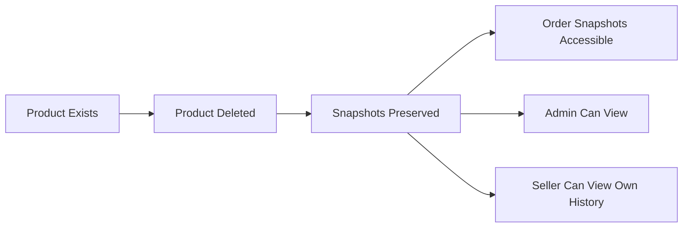

## InventoryRecord Operations

Inventory records track all stock quantity changes for each product variant. Each record contains a quantity change value, reason, and timestamp. Positive quantity changes represent restocking or inventory additions. Negative quantity changes represent sales, adjustments, or losses. Current stock is calculated by summing all inventory records for a variant. Sellers manually add inventory with a quantity and reason for restocking. Sellers manually subtract inventory with a quantity and reason for adjustments or losses. Order placement automatically creates negative inventory records. Order cancellations and refunds automatically create positive inventory records to restore stock. Sellers can view the complete inventory history for each variant.

### Inventory Record Creation and Structure

### Inventory Record Creation

WHEN an inventory record is created, THE system SHALL record the quantity change value, reason, and timestamp.

WHEN an inventory record is created, THE system SHALL associate it with exactly one product variant.

THE system SHALL require a reason text for every inventory record creation.

THE system SHALL require a quantity change value for every inventory record creation.

THE system SHALL automatically record the creation timestamp for every inventory record.

### Quantity Change Value Rules

WHEN the quantity change is positive, THE system SHALL interpret it as inventory addition (restocking).

WHEN the quantity change is negative, THE system SHALL interpret it as inventory reduction (sales, adjustments, or losses).

THE system SHALL allow a quantity change of zero.

IF a quantity change would result in negative stock, THE system SHALL reject the inventory record creation.

### Timestamp Recording

THE system SHALL record the exact date and time when each inventory record is created.

THE system SHALL use a consistent timezone for all inventory record timestamps.

THE system SHALL NOT allow modification of the timestamp after an inventory record is created.

### Immutability

THE system SHALL NOT allow editing of any inventory record after creation.

THE system SHALL NOT allow deletion of any inventory record.

THE system SHALL preserve all inventory records permanently for audit and dispute resolution purposes.

### Manual Stock Operations

### Restocking Operations

WHEN a seller adds inventory to a variant, THE system SHALL create an inventory record with a positive quantity change.

WHEN a seller restocks inventory, THE system SHALL require the seller to provide a reason for the restocking.

WHEN a seller restocks inventory, THE system SHALL allow the seller to specify any positive quantity value.

THE system SHALL update the current stock quantity immediately after a restocking inventory record is created.

IF the seller does not own the product variant, THE system SHALL reject the restocking operation.

### Inventory Adjustment Operations

WHEN a seller subtracts inventory from a variant, THE system SHALL create an inventory record with a negative quantity change.

WHEN a seller performs an inventory adjustment, THE system SHALL require the seller to provide a reason for the adjustment.

IF an inventory adjustment would result in negative stock, THE system SHALL reject the adjustment operation.

WHEN a seller performs an inventory adjustment, THE system SHALL update the current stock quantity immediately.

### Stock Status Updates

WHEN the stock quantity reaches zero, THE system SHALL mark the variant as "out of stock".

WHEN the stock quantity is greater than zero after being zero, THE system SHALL mark the variant as available.

WHEN a variant is out of stock, THE system SHALL prevent customers from adding it to their cart.

### Stock Calculation

### Current Stock Derivation

THE system SHALL calculate the current stock quantity by summing all inventory records for a variant.

WHEN calculating current stock, THE system SHALL include all inventory records regardless of their source (manual, automatic, or order-related).

THE system SHALL calculate current stock in real-time whenever inventory records are created.

THE system SHALL NOT store a separate stock quantity field; stock SHALL always be derived from inventory records.

### Stock Display

WHEN displaying stock quantity to a seller, THE system SHALL show the calculated current stock.

WHEN displaying a variant to a customer, THE system SHALL show only the availability status (in stock or out of stock), not the exact quantity.

### Stock Integrity

THE system SHALL ensure that stock calculation never produces a negative value.

IF a calculation error occurs, THE system SHALL maintain data integrity by rejecting the operation that would cause the error.

### Automatic Stock Adjustments

### Order-Based Stock Deduction

WHEN an order is placed successfully, THE system SHALL automatically create a negative inventory record for each purchased variant.

WHEN creating an order-based inventory record, THE system SHALL set the quantity change to the negative of the quantity purchased.

WHEN creating an order-based inventory record, THE system SHALL set the reason to indicate the order number.

THE system SHALL create order-based inventory records immediately upon successful payment.

THE system SHALL NOT create inventory records if payment fails.

### Cancellation Stock Restoration

WHEN a seller approves a cancellation request, THE system SHALL automatically create a positive inventory record for the cancelled variant.

WHEN creating a cancellation-based inventory record, THE system SHALL set the quantity change to the quantity that was cancelled.

WHEN creating a cancellation-based inventory record, THE system SHALL set the reason to indicate the cancellation request and order number.

THE system SHALL restore stock immediately upon cancellation approval.

### Refund Stock Restoration

WHEN a seller approves a refund request, THE system SHALL automatically create a positive inventory record for the refunded variant.

WHEN creating a refund-based inventory record, THE system SHALL set the quantity change to the quantity that was refunded.

WHEN creating a refund-based inventory record, THE system SHALL set the reason to indicate the refund request and order number.

THE system SHALL restore stock immediately upon refund approval.

### Administrator Force Operations

WHEN an administrator force-cancels an order item, THE system SHALL create a positive inventory record to restore the stock.

WHEN an administrator force-refunds an order item, THE system SHALL create a positive inventory record to restore the stock.

### Inventory History Access

### Seller Inventory History Viewing

WHEN a seller views the inventory history of a variant, THE system SHALL display all inventory records in chronological order.

THE system SHALL show each inventory record with its quantity change, reason, and timestamp.

THE system SHALL indicate the source of each inventory record (manual restock, manual adjustment, order placement, cancellation, or refund).

IF the seller does not own the product variant, THE system SHALL deny access to the inventory history.

THE system SHALL allow sellers to view inventory history for their own products only.

### History Filtering and Sorting

THE system SHALL sort inventory records from newest to oldest by default.

THE system SHALL allow sellers to filter inventory history by date range.

THE system SHALL allow sellers to filter inventory history by reason type (manual, order, cancellation, refund).

### History for Dispute Resolution

THE system SHALL preserve all inventory records for audit purposes.

THE system SHALL allow administrators to view inventory history for any product variant.

THE system SHALL provide inventory history as evidence for dispute resolution between buyers and sellers.

## Cart Operations

Each customer has one shopping cart that persists between sessions. The cart is automatically created when a customer adds the first item. Customers view their cart to see all items with product details, variant options, prices, and subtotals. The cart displays the total price of all items. Customers proceed to checkout from the cart when ready to purchase. Unavailable items cannot be checked out and are marked accordingly. The cart warns customers when item quantities exceed available stock. Items are removed from the cart when the order is successfully placed. The cart tracks creation and last update timestamps.

### Cart Creation and Initialization

### Automatic Cart Creation

WHEN a customer adds an item to their cart for the first time, THE system SHALL create a new cart associated with that customer.

THE system SHALL ensure each customer has exactly one cart.

WHEN a cart is created, THE system SHALL record the creation timestamp.

### Cart Existence Guarantee

THE system SHALL maintain a cart for each registered customer once the first item is added.

IF a customer has never added any items, THE system SHALL NOT create an empty cart record.

### Timestamp Tracking

WHEN a cart is created or modified, THE system SHALL update the last modified timestamp.

THE system SHALL preserve the original creation timestamp regardless of subsequent modifications.

### Cart Persistence

### Cross-Session Persistence

THE system SHALL persist cart data across customer sessions.

WHEN a customer logs out and logs back in, THE system SHALL restore their cart with all previously added items.

### Session Independence

THE system SHALL maintain cart contents independently of session state.

IF a customer's session expires, THE system SHALL preserve their cart contents.

### Long-Term Storage

THE system SHALL retain cart data until one of the following occurs:
1. The customer successfully places an order (items removed)
2. The customer manually removes all items
3. The customer deletes their account

THE system SHALL NOT automatically clear carts based on time elapsed.

### Cart Viewing and Item Listing Display

### Cart Viewing Access

WHEN a customer requests to view their cart, THE system SHALL display all items currently in the cart.

THE system SHALL display each cart item with the following information:
1. Product name
2. Variant options (e.g., color, size)
3. Unit price at time of adding to cart
4. Quantity
5. Subtotal (unit price multiplied by quantity)

### Display Organization

THE system SHALL display cart items grouped by seller or product at the customer's preference.

THE system SHALL show the seller's shop name for each item.

### Empty Cart State

WHEN a customer views an empty cart, THE system SHALL display a message indicating the cart is empty.

THE system SHALL provide navigation options to continue shopping when the cart is empty.

### Total Price Calculation

### Price Aggregation

THE system SHALL calculate the cart total as the sum of all item subtotals.

WHEN displaying the cart, THE system SHALL show the total price prominently.

### Price Currency and Format

THE system SHALL display all prices in the platform's default currency.

THE system SHALL format prices with appropriate decimal places for the currency.

### Real-Time Updates

WHEN a customer modifies item quantities, THE system SHALL recalculate and display the updated total immediately.

THE system SHALL recalculate the total when items are added or removed from the cart.

### Checkout Initiation

### Checkout Prerequisites

WHEN a customer initiates checkout, THE system SHALL verify all cart items are available for purchase.

IF all items are available, THE system SHALL allow the customer to proceed to checkout.

### Checkout Blocking

IF any cart item is unavailable, THE system SHALL prevent checkout and display an appropriate message.

IF any cart item has insufficient stock, THE system SHALL prevent checkout until quantities are adjusted.

### Minimum Requirements

WHEN a customer proceeds to checkout, THE system SHALL require at least one valid item in the cart.

IF the cart is empty, THE system SHALL NOT allow checkout initiation.

### Checkout Flow Initiation

WHEN checkout is initiated successfully, THE system SHALL present the customer with address selection and order summary review steps.

### Unavailable Item Marking

### Unavailable Item Detection

THE system SHALL identify items as unavailable when:
1. The product has been deleted by the seller
2. The specific variant has been deleted
3. The variant is out of stock (stock quantity is zero)

### Unavailable Item Display

WHEN a cart contains unavailable items, THE system SHALL mark them clearly with a visual indicator.

THE system SHALL display an explanatory message for each unavailable item stating the reason.

### Unavailable Item Interaction

THE system SHALL NOT allow customers to change the quantity of unavailable items.

THE system SHALL allow customers to remove unavailable items from the cart.

THE system SHALL display unavailable items separately from available items in the cart view.

### Stock Warning Display

### Stock Level Validation

WHEN displaying the cart, THE system SHALL compare each item's cart quantity against the current stock quantity.

IF the cart quantity exceeds the available stock, THE system SHALL display a stock warning for that item.

### Warning Content

THE system SHALL display the available stock quantity in the warning message.

THE system SHALL suggest reducing the quantity to the available stock level.

### Warning Impact on Operations

WHEN an item has a stock warning, THE system SHALL allow the customer to reduce the quantity.

IF the customer attempts checkout with items exceeding stock, THE system SHALL block checkout and require quantity adjustment.

### Stock Information Updates

THE system SHALL update stock warnings in real-time based on current inventory levels.

IF stock becomes available for a previously insufficient item, THE system SHALL remove the warning automatically.

### Order Completion Cleanup

### Automatic Item Removal

WHEN an order is successfully placed, THE system SHALL remove all ordered items from the customer's cart.

IF some cart items were not included in the order, THE system SHALL retain those items in the cart.

### Partial Order Handling

WHEN an order contains only some cart items (due to checkout selection), THE system SHALL remove only the purchased items.

### Cart State After Order

AFTER a successful order, THE system SHALL update the cart's last modified timestamp.

IF all items were removed due to order completion, THE system SHALL display the empty cart state.

### Payment Failure Handling

IF payment fails during checkout, THE system SHALL preserve all items in the cart.

THE system SHALL allow the customer to retry checkout after a payment failure.

### Session Persistence and Cart Recovery

### Session-Based Access

WHEN a customer logs in, THE system SHALL associate their session with their persistent cart.

THE system SHALL make the cart accessible throughout the customer's session.

### Concurrent Session Handling

IF a customer has multiple active sessions, THE system SHALL maintain a single consistent cart across all sessions.

WHEN items are added in one session, THE system SHALL reflect those changes in all other active sessions.

### Browser and Device Independence

THE system SHALL provide access to the same cart contents regardless of the browser or device used.

WHEN a customer logs in from a new device, THE system SHALL display their existing cart with all items.

### Session Expiration Handling

IF a customer's session expires, THE system SHALL preserve their cart data.

WHEN the customer logs in again, THE system SHALL restore access to their cart.

## CartItem Operations

Cart items represent specific product variants that customers intend to purchase. Customers add items by selecting a specific variant and specifying quantity. If the same variant is added again, quantities are combined rather than creating duplicate entries. Each cart item shows the product name, variant options, unit price, quantity, and subtotal. Customers can change the quantity of items already in the cart. Customers can remove items from the cart entirely. Cart items display warnings when variant stock is insufficient for the selected quantity. Items are marked unavailable if the variant was deleted or is out of stock. Unavailable items cannot proceed to checkout.

### Adding Items to Cart

### Variant Selection Requirement

WHEN a customer adds an item to their cart, THE system SHALL require the customer to select a specific product variant.

THE system SHALL NOT allow customers to add a product to the cart without selecting a variant.

### Cart Item Addition

WHEN a customer adds a variant to the cart, THE system SHALL require the customer to specify a quantity greater than zero.

WHEN a customer adds a variant to the cart, THE system SHALL verify that the variant stock quantity is greater than zero.

IF the variant stock quantity is zero, THE system SHALL reject the addition and display an "out of stock" message.

### Quantity Combination

IF the same variant is already in the customer's cart, THE system SHALL combine the new quantity with the existing cart item quantity.

THE system SHALL NOT create a separate cart item entry when the same variant is added again.

WHEN quantities are combined, THE system SHALL update the existing cart item with the sum of the existing quantity and the new quantity.

### Cart Item Display

### Item Detail Display

WHEN a customer views their cart, THE system SHALL display each cart item with the following information:
1. Product name
2. Variant options (e.g., color, size)
3. Unit price
4. Selected quantity
5. Subtotal

THE system SHALL display the variant options in a human-readable format.

### Subtotal Calculation

THE system SHALL calculate each cart item's subtotal as the unit price multiplied by the quantity.

WHEN a customer views their cart, THE system SHALL display the calculated subtotal for each item.

THE system SHALL display the total price of all cart items.

THE system SHALL recalculate subtotals and totals whenever a quantity is modified or an item is removed.

### Quantity Management

### Quantity Modification

WHEN a customer modifies the quantity of a cart item, THE system SHALL accept a new quantity value.

IF the new quantity is zero, THE system SHALL remove the item from the cart.

IF the new quantity is less than zero, THE system SHALL reject the modification.

WHEN a customer increases the quantity, THE system SHALL verify that the variant has sufficient stock for the new total quantity.

### Item Removal

WHEN a customer removes an item from the cart, THE system SHALL delete the cart item record.

WHEN an item is removed, THE system SHALL recalculate the cart's total price.

THE system SHALL allow customers to remove any item from their cart regardless of stock status.

### Stock and Availability

### Stock Insufficiency Warning

IF a variant's stock quantity is less than the cart item quantity, THE system SHALL display a warning indicating insufficient stock.

THE system SHALL display the available stock quantity alongside the warning.

THE system SHALL allow the cart item to remain in the cart despite the stock insufficiency warning.

### Unavailable Item Marking

IF a variant has been deleted by the seller, THE system SHALL mark the cart item as unavailable.

IF a variant's stock quantity is zero, THE system SHALL mark the cart item as unavailable.

WHEN an item is marked as unavailable, THE system SHALL clearly indicate the unavailable status to the customer.

THE system SHALL preserve unavailable items in the cart until the customer removes them.

WHEN a variant becomes available again, THE system SHALL remove the unavailable marking from the cart item.

### Checkout Restrictions

### Checkout Restriction

WHEN a customer attempts to proceed to checkout, THE system SHALL identify all unavailable items in the cart.

IF the cart contains any unavailable items, THE system SHALL prevent checkout from proceeding.

THE system SHALL display a message indicating which items are unavailable and must be removed before checkout.

WHEN all items in the cart are available and have sufficient stock, THE system SHALL allow the customer to proceed to checkout.

### Pre-Checkout Validation

WHEN a customer proceeds to checkout, THE system SHALL revalidate stock quantities for all cart items.

IF any variant's stock has changed and is now insufficient, THE system SHALL display a warning and prevent checkout.

THE system SHALL allow the customer to adjust quantities or remove items to resolve stock issues.

## Wishlist Operations

Customers create wishlists to save products they are interested in for later. Customers add products to their wishlist from product pages. The wishlist shows products at the product level, not specific variants. Customers view their wishlist as a paginated list. Customers remove products from their wishlist when no longer interested. Products deleted by sellers are automatically removed from all wishlists that contain them. The wishlist helps customers track products they want to purchase later. Multiple customers can have the same product on their individual wishlists.

### Wishlist Product Addition

WHEN a customer adds a product to their wishlist, THE system SHALL create an association between the customer and that product.

WHEN a customer adds a product to their wishlist, THE system SHALL store the reference at the product level, not at a specific variant level.

WHEN a customer adds a product to their wishlist for the first time, THE system SHALL initialize the wishlist entry with the current timestamp.

WHEN a customer attempts to add a product that is already in their wishlist, THE system SHALL not create a duplicate entry.

WHEN a customer adds a product to their wishlist, THE system SHALL allow the customer to later track that product for potential purchase.

WHEN a customer views a product detail page, THE system SHALL provide an option to add that product to the customer's wishlist.

IF the product does not exist, THE system SHALL reject the wishlist addition request.

THE system SHALL allow customers to build a list of products they are interested in purchasing later.

THE system SHALL maintain each customer's wishlist independently from other customers' wishlists.

WHEN a customer adds a product to their wishlist, THE system SHALL not affect the product's stock quantity or availability.

### Wishlist Viewing and Pagination

WHEN a customer views their wishlist, THE system SHALL display all products the customer has added.

WHEN a customer views their wishlist, THE system SHALL present the products in a paginated list.

WHEN a customer requests a specific page of their wishlist, THE system SHALL return the appropriate subset of products for that page.

WHEN a customer views their wishlist, THE system SHALL sort the products by most recently added first.

WHEN a customer views a product in their wishlist, THE system SHALL display the product's main image thumbnail, name, and base price.

WHEN a customer views their wishlist, THE system SHALL display each product's seller shop name.

WHEN a customer views a product in their wishlist that has variants with different prices, THE system SHALL display the price range.

WHEN a customer views their wishlist, THE system SHALL indicate whether each product is currently in stock.

WHEN a customer's wishlist is empty, THE system SHALL display a message indicating no products have been added.

THE system SHALL allow customers to navigate through multiple pages of their wishlist.

### Wishlist Product Removal

WHEN a customer removes a product from their wishlist, THE system SHALL delete the association between the customer and that product.

WHEN a customer removes a product from their wishlist, THE system SHALL no longer display that product in the customer's wishlist.

WHEN a customer removes a product from their wishlist, THE system SHALL not affect other customers' wishlists containing the same product.

WHEN a customer removes a product from their wishlist, THE system SHALL not affect the product itself or its availability.

THE system SHALL allow customers to remove any product from their wishlist at any time.

THE system SHALL provide a removal option for each product displayed in the wishlist.

IF the product is not in the customer's wishlist, THE system SHALL reject the removal request.

### Automatic Wishlist Cleanup

WHEN a seller deletes a product, THE system SHALL automatically remove that product from all customer wishlists that contain it.

WHEN a product is removed from wishlists due to seller deletion, THE system SHALL perform the removal without requiring customer action.

WHEN a product is deleted by a seller, THE system SHALL ensure the product no longer appears in any customer's wishlist.

WHEN multiple customers have the same product on their wishlists and that product is deleted by the seller, THE system SHALL remove the product from all affected wishlists.

WHEN a product is automatically removed from a customer's wishlist due to seller deletion, THE system SHALL not preserve the wishlist entry.

THE system SHALL support multiple customers having the same product on their individual wishlists simultaneously.

WHEN a product is deleted by a seller, THE system SHALL process the wishlist cleanup as part of the product deletion workflow.

WHEN a customer views their wishlist after a product has been automatically removed, THE system SHALL not display the removed product.

## Order Operations

Orders are created when customers successfully complete checkout and payment. Each order has a unique order number for identification. Orders contain one or more order items that can be from different sellers. Orders record the total price and shipping address. The shipping address cannot be changed after order placement. Orders have a status derived from their items: paid, shipped, delivered, cancelled, refunded, or partially completed. Customers view their order history as a paginated list sorted by newest first. Customers view full order details including items, shipping address, and shipment tracking. Administrators can view all orders on the platform and force-cancel or force-refund as needed.

### Order Creation

WHEN a customer successfully completes payment, THE system SHALL create an order record.

WHEN an order is created, THE system SHALL generate a unique order number for identification.

WHEN an order is created, THE system SHALL record the total price of all purchased items.

WHEN an order is created, THE system SHALL decrease stock quantities for each purchased variant.

WHEN an order is created, THE system SHALL remove the purchased items from the customer's cart.

WHEN an order contains items from multiple sellers, THE system SHALL create the order as a single order with items from all sellers.

WHEN an order item is created, THE system SHALL create a snapshot of the product, variant, and seller profile at the time of purchase.

WHEN an order is created, each order item SHALL have a status of "paid".

IF a customer purchases multiple units of the same variant, THE system SHALL create one order item with the combined quantity.

IF the customer's cart is empty, THE system SHALL NOT allow checkout to proceed.

IF payment fails, THE system SHALL NOT create an order.

IF payment fails, THE system SHALL allow the customer to retry payment.

IF any cart item becomes unavailable before checkout, THE system SHALL prevent checkout and notify the customer.

### Shipping Address Management

WHEN a customer proceeds to checkout, THE system SHALL require selection of a shipping address.

WHEN a customer places an order, THE system SHALL record the selected shipping address with the order.

WHEN an order is placed, THE system SHALL NOT allow changes to the shipping address.

IF a customer has a default address set, THE system SHALL pre-select the default address for checkout.

IF a customer has no addresses, THE system SHALL require the customer to add an address before checkout.

THE system SHALL preserve the complete shipping address details (recipient name, phone number, street address, city, state/province, postal code, country) with each order.

### Order Status Derivation

THE system SHALL derive the overall order status from the statuses of its items.

IF all items in an order have status "paid", THE system SHALL set the order status to "paid".

IF any item in an order has status "shipped" and no items have status "delivered", THE system SHALL set the order status to "shipped".

IF all items in an order have status "delivered", THE system SHALL set the order status to "delivered".

IF all items in an order have status "cancelled", THE system SHALL set the order status to "cancelled".

IF all items in an order have status "refunded", THE system SHALL set the order status to "refunded".

IF an order has items with mixed statuses (e.g., some delivered, some refunded), THE system SHALL set the order status to "partially completed".

WHEN an item's status changes, THE system SHALL recalculate the overall order status.

Each order item SHALL maintain its own status independently from other items in the same order.

### Order History Viewing

WHEN a customer views their order history, THE system SHALL display a paginated list of all orders for that customer.

THE system SHALL sort the order history list by newest orders first.

WHEN displaying the order history list, THE system SHALL show for each order: order number, date, total price, and overall order status.

THE system SHALL only show orders belonging to the authenticated customer.

IF a customer has no orders, THE system SHALL display an empty order history.

THE system SHALL provide pagination for order history with a configurable number of orders per page.

### Order Detail Display

WHEN a customer views an order detail, THE system SHALL display all items in the order with: product name, variant options, quantity, price, and item status.

WHEN a customer views an order detail, THE system SHALL display the shipping address.

WHEN a customer views an order detail, THE system SHALL display all shipments with tracking information.

WHEN displaying shipments, THE system SHALL show which items are included in each shipment.

IF an item has no shipment yet (still in "paid" status), THE system SHALL indicate the item is awaiting shipment.

THE system SHALL only allow customers to view details of their own orders.

IF a customer attempts to view an order that does not belong to them, THE system SHALL deny access.

### Administrator Order Oversight

Administrators can view all orders on the platform regardless of seller or customer.

WHEN an administrator views orders, THE system SHALL display orders from all customers and all sellers.

Administrators can view the full details of any order on the platform.

THE system SHALL provide administrators the ability to filter and search orders by customer, seller, status, or date range.

Administrators can view order item snapshots for any order.

Administrators can view snapshots of products and seller profiles preserved with order items.

### Forced Order Modification

Administrators can force-cancel individual order items.

WHEN an administrator force-cancels an item, THE system SHALL change the item status to "cancelled".

WHEN an administrator force-cancels an item, THE system SHALL process a refund to the customer for that item.

WHEN an administrator force-cancels an item, THE system SHALL restore stock quantity for that variant via an inventory record.

Administrators can force-cancel entire orders.

WHEN an administrator force-cancels an entire order, THE system SHALL cancel all items in the order.

Administrators can force-refund individual order items.

WHEN an administrator force-refunds an item, THE system SHALL change the item status to "refunded".

WHEN an administrator force-refunds an item, THE system SHALL process a refund to the customer for that item.

WHEN an administrator force-refunds an item, THE system SHALL restore stock quantity for that variant via an inventory record.

Administrators can force-refund entire orders.

WHEN an administrator force-refunds an entire order, THE system SHALL refund all items in the order.

WHEN an administrator modifies an order, THE system SHALL recalculate the overall order status based on the new item statuses.

## OrderItem Operations

Order items represent individual product variants purchased within an order. Multiple units of the same variant become one order item with the combined quantity. Each order item has its own status: paid, shipped, delivered, cancelled, or refunded. Order items can be cancelled or refunded individually without affecting other items in the order. Customers can request cancellation for paid items not yet shipped. Customers can request refunds for delivered items within seven days of delivery. Sellers process cancellation and refund requests for their items. Order items are grouped into shipments when sellers ship products. Stock quantities are restored when items are cancelled or refunded.

### Order Item Creation and Quantity Consolidation

### Order Item Creation

WHEN an order is successfully placed, THE system SHALL create one order item for each distinct product variant purchased.

WHEN a customer purchases multiple units of the same product variant, THE system SHALL consolidate them into a single order item with a combined quantity.

WHEN a customer purchases 3 units of the same variant in one order, THE system SHALL create one order item with quantity 3, not three separate order items.

WHEN an order item is created, THE system SHALL record the price per unit for that variant at the time of purchase.

WHEN an order item is created, THE system SHALL associate it with the seller who owns the product.

THE system SHALL preserve the product snapshot with each order item, including the product name, description, and variant options at the time of purchase.

THE system SHALL preserve the seller profile snapshot with each order item, including the shop name and logo at the time of purchase.

### Quantity Consolidation Rules

WHEN a customer adds the same variant to their cart multiple times before checkout, THE system SHALL combine the quantities into a single cart item.

WHEN the order is placed, THE system SHALL create one order item for each unique variant regardless of how many times it was added to the cart.

IF a customer purchases from different sellers in the same order, THE system SHALL create separate order items for each seller's products.

THE system SHALL allow order items from different sellers within the same order.

### Initial Status Assignment

WHEN an order item is created after successful payment, THE system SHALL assign it the status "paid".

THE system SHALL set all newly created order items to "paid" status upon successful payment processing.

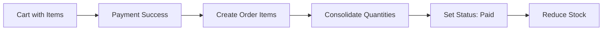

### Individual Item Status Tracking

### Independent Status Management

THE system SHALL track the status of each order item independently from other items in the same order.

WHEN one order item changes status, THE system SHALL NOT automatically change the status of other items in the same order.

IF an order contains items from multiple sellers, THE system SHALL allow each seller to ship their items independently.

### Status Values

THE system SHALL support the following statuses for each order item: paid, shipped, delivered, cancelled, and refunded.

WHEN an order item is newly created after payment, THE system SHALL set its status to "paid".

WHEN a seller creates a shipment containing an order item, THE system SHALL change that item's status to "shipped".

WHEN a customer confirms delivery for a shipment, THE system SHALL change all items in that shipment to "delivered" status.

WHEN 14 days pass after an item is shipped without customer confirmation, THE system SHALL automatically change its status to "delivered".

WHEN a cancellation request is approved, THE system SHALL change the affected item's status to "cancelled".

WHEN a refund request is approved, THE system SHALL change the affected item's status to "refunded".

### Order Status Derivation

THE system SHALL derive the overall order status from the individual statuses of its items.

IF all items in an order have status "paid", THE system SHALL set the order status to "paid".

IF any item in an order has status "shipped" and none are delivered yet, THE system SHALL set the order status to "shipped".

IF all items in an order have status "delivered", THE system SHALL set the order status to "delivered".

IF all items in an order have status "cancelled", THE system SHALL set the order status to "cancelled".

IF all items in an order have status "refunded", THE system SHALL set the order status to "refunded".

IF items in an order have mixed statuses, THE system SHALL set the order status to "partially completed".

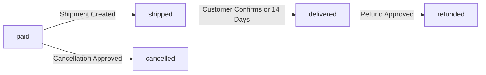

### Individual Cancellation Operations

### Cancellation Eligibility

THE system SHALL allow customers to request cancellation for individual order items, not entire orders.

WHEN a customer requests cancellation, THE system SHALL only accept requests for items with status "paid".

THE system SHALL NOT allow cancellation requests for items that have been shipped.

THE system SHALL NOT allow cancellation requests for items that have already been delivered.

THE system SHALL NOT allow cancellation requests for items that have already been cancelled.

THE system SHALL NOT allow cancellation requests for items that have already been refunded.

### Cancellation Request Process

WHEN a customer submits a cancellation request, THE system SHALL require the customer to provide a reason in text.

WHEN a cancellation request is created, THE system SHALL set its initial status to "pending".

WHEN a cancellation request is created, THE system SHALL notify the seller of that item about the pending request.

THE system SHALL only allow the seller who owns the product to respond to cancellation requests for their items.

WHEN a seller approves a cancellation request, THE system SHALL change the item status to "cancelled".

WHEN a seller approves a cancellation request, THE system SHALL process a refund for that specific item only.

WHEN a seller rejects a cancellation request, THE system SHALL keep the item status as "paid" and the order continues normally.

WHEN a seller responds to a cancellation request, THE system SHALL create a snapshot of the request state.

### Cancellation Impact

WHEN an order item is cancelled, THE system SHALL NOT change the status of other items in the same order.

IF all items in an order are cancelled, THE system SHALL change the overall order status to "cancelled".

WHEN an order item is cancelled, THE system SHALL restore the stock quantity for that variant through an inventory record.

THE system SHALL allow the remaining items in the order to continue processing normally after one item is cancelled.

### Individual Refund Operations

### Refund Eligibility

THE system SHALL allow customers to request refunds for individual order items, not entire orders.

WHEN a customer requests a refund, THE system SHALL only accept requests for items with status "delivered".

THE system SHALL NOT allow refund requests for items that are still in "paid" status.

THE system SHALL NOT allow refund requests for items that are still in "shipped" status.

THE system SHALL NOT allow refund requests for items that have already been cancelled.

THE system SHALL NOT allow refund requests for items that have already been refunded.

### Seven-Day Refund Window

WHEN a customer requests a refund, THE system SHALL verify the request is within 7 days of the item's delivery.

IF a refund request is submitted more than 7 days after delivery, THE system SHALL reject the request.

THE system SHALL calculate the 7-day window from the date the item status changed to "delivered".

### Refund Request Process

WHEN a customer submits a refund request, THE system SHALL require the customer to provide a reason in text.

WHEN a refund request is created, THE system SHALL set its initial status to "pending".

WHEN a refund request is created, THE system SHALL notify the seller of that item about the pending request.

THE system SHALL only allow the seller who owns the product to respond to refund requests for their items.

WHEN a seller approves a refund request, THE system SHALL change the item status to "refunded".

WHEN a seller approves a refund request, THE system SHALL process the refund for that specific item only.

WHEN a seller rejects a refund request, THE system SHALL keep the item status as "delivered".

WHEN a seller responds to a refund request, THE system SHALL create a snapshot of the request state.

### Refund Impact

WHEN an order item is refunded, THE system SHALL NOT change the status of other items in the same order.

IF all items in an order are refunded, THE system SHALL change the overall order status to "refunded".

WHEN an order item is refunded, THE system SHALL restore the stock quantity for that variant through an inventory record.

THE system SHALL allow the remaining items in the order to remain unaffected after one item is refunded.

### Shipment Grouping and Seller Responsibility

### Seller Ownership

THE system SHALL associate each order item with the seller who owns the product.

THE system SHALL allow only the seller who owns an item to manage its shipment and respond to cancellation or refund requests.

THE system SHALL NOT allow a seller to manage order items belonging to other sellers.

### Shipment Grouping

WHEN a seller ships order items, THE system SHALL allow the seller to select one or more of their items to include in a shipment.

THE system SHALL only allow items from the same seller to be grouped into a single shipment.

THE system SHALL NOT allow items from different sellers to be combined in the same shipment.

WHEN a shipment is created, THE system SHALL require the seller to enter the carrier name and tracking number.

WHEN a shipment is created, THE system SHALL change the status of all items in that shipment to "shipped".

### Multi-Seller Orders

THE system SHALL support orders containing items from multiple sellers.

WHEN an order contains items from multiple sellers, THE system SHALL create separate shipments for each seller.

THE system SHALL allow each seller to ship their items at different times.

THE system SHALL allow each seller to choose whether to bundle their items or ship them separately.

### Delivery Confirmation

WHEN a customer confirms delivery for a shipment, THE system SHALL change all items in that shipment to "delivered" status.

THE system SHALL NOT allow a customer to confirm delivery for individual items within a shipment.

IF a customer does not confirm delivery within 14 days of shipment, THE system SHALL automatically change all items in that shipment to "delivered" status.

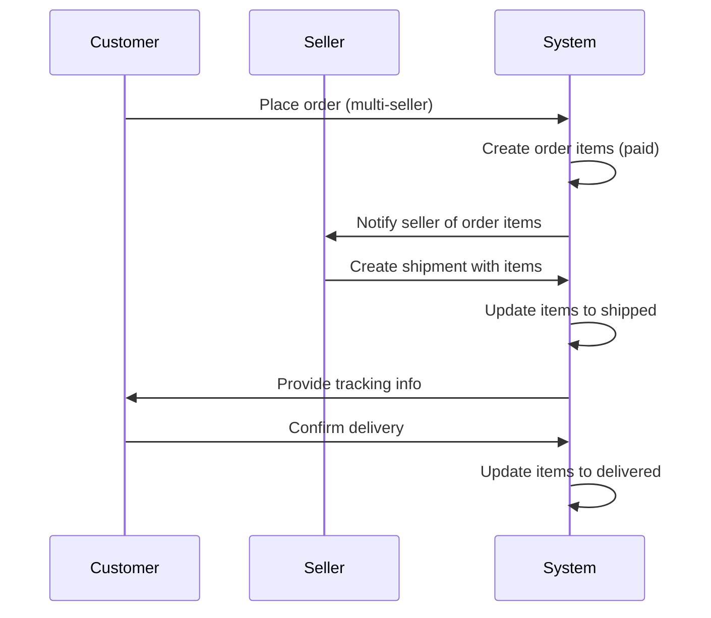

### Stock Restoration Operations

### Automatic Stock Restoration

WHEN an order item is cancelled, THE system SHALL automatically create a positive inventory record to restore the stock.

WHEN an order item is refunded, THE system SHALL automatically create a positive inventory record to restore the stock.

THE system SHALL calculate the stock restoration quantity as the item quantity multiplied by the negative of the original deduction.

### Stock Restoration Process

WHEN an order is placed, THE system SHALL create a negative inventory record for each purchased variant to decrease stock.

WHEN an order item is cancelled, THE system SHALL create a positive inventory record to restore the deducted stock.

WHEN an order item is refunded, THE system SHALL create a positive inventory record to restore the deducted stock.

THE system SHALL record the reason for each inventory change (order placement, cancellation, or refund).

### Inventory Record Requirements

THE system SHALL NOT allow manual deletion of inventory records.

THE system SHALL calculate current stock by summing all inventory records for a variant.

WHEN stock is restored through cancellation or refund, THE system SHALL make the variant available for purchase again if stock becomes greater than zero.

### Partial Order Impact

WHEN one item in a multi-item order is cancelled, THE system SHALL only restore stock for that specific variant.

WHEN one item in a multi-item order is refunded, THE system SHALL only restore stock for that specific variant.

THE system SHALL NOT affect stock quantities of other items in the same order when one item is cancelled or refunded.

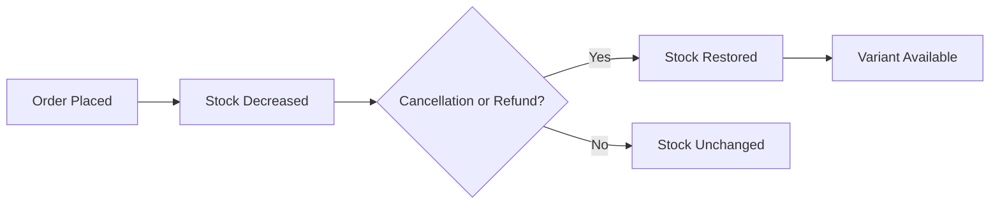

## OrderItemSnapshot Operations

Order item snapshots preserve product information at the time of purchase. Each snapshot records the product name, description, variant options, and price when ordered. Snapshots are created automatically when an order is placed successfully. Snapshots ensure customers and sellers can verify what was purchased even if products change later. The snapshot includes the seller profile snapshot showing shop name and logo at purchase time. Order item snapshots are immutable and cannot be modified. These snapshots support dispute resolution by preserving purchase evidence. Snapshots remain accessible even if the original product is deleted.

### Automatic Snapshot Creation

WHEN an order is successfully placed and payment is completed, THE system SHALL create a snapshot for each order item automatically.

WHEN creating an order item snapshot, THE system SHALL capture the complete product state at the moment of purchase.

WHEN creating an order item snapshot, THE system SHALL record the exact timestamp of the purchase.

THE system SHALL associate each snapshot with its corresponding order item.

THE system SHALL create snapshots for all order items regardless of the product's future status.

WHEN an order item is created, THE system SHALL ensure the snapshot is created atomically with the order item to guarantee data consistency.

IF the snapshot creation fails, THE system SHALL NOT create the order and SHALL allow the customer to retry payment.

THE system SHALL NOT create snapshots for order items that were not successfully paid.

### Product State Preservation

WHEN creating an order item snapshot, THE system SHALL record the product name as it existed at the time of purchase.

WHEN creating an order item snapshot, THE system SHALL record the product description as it existed at the time of purchase.

THE system SHALL preserve the product's category assignment in the snapshot.

THE system SHALL preserve the product's image URLs in the snapshot.

THE system SHALL capture the product's base price in the snapshot.

IF the product is deleted after the order is placed, THE system SHALL retain the snapshot with all preserved product information.

IF the product is modified after the order is placed, THE system SHALL NOT update the snapshot and SHALL preserve the original product state.

### Variant State Capture

WHEN creating an order item snapshot, THE system SHALL record the variant's SKU code.

WHEN creating an order item snapshot, THE system SHALL record the variant's option values (such as color and size).

THE system SHALL preserve the variant's specific price in the snapshot.

IF the variant has a price override, THE system SHALL record the override price in the snapshot.

IF the variant uses the product's base price, THE system SHALL record the base price as the variant price.

IF the variant is deleted after the order is placed, THE system SHALL retain the snapshot with all preserved variant information.

THE system SHALL ensure the snapshot reflects exactly what the customer purchased, including the specific variant configuration.

### Price Recording

WHEN creating an order item snapshot, THE system SHALL record the exact price the customer paid for the item.

THE system SHALL record the price per unit in the snapshot.

THE system SHALL record the quantity ordered in the snapshot.

THE system SHALL ensure the recorded price matches the price displayed to the customer at checkout.

IF a variant has a price override, THE system SHALL record the override price, not the base price.

THE system SHALL preserve the price regardless of any future price changes to the product or variant.

THE system SHALL use the recorded price for all refund and cancellation calculations.

### Seller Profile Inclusion

WHEN creating an order item snapshot, THE system SHALL create or reference a seller profile snapshot.

THE system SHALL preserve the seller's shop name in the snapshot.

THE system SHALL preserve the seller's shop description in the snapshot.

THE system SHALL preserve the seller's logo image URL in the snapshot.

IF the seller changes their shop profile after the order is placed, THE system SHALL NOT update the order item snapshot.

IF the seller deletes their account, THE system SHALL retain the snapshot with the preserved seller profile information.

THE system SHALL link the order item snapshot to the seller profile snapshot created at the time of purchase.

### Snapshot Immutability

THE system SHALL prevent any modifications to order item snapshots after creation.

THE system SHALL prevent deletion of order item snapshots.

IF a request is made to modify a snapshot, THE system SHALL reject the request.

IF a request is made to delete a snapshot, THE system SHALL reject the request.

THE system SHALL ensure snapshots remain unchanged even when the source product, variant, or seller profile is modified.

THE system SHALL preserve snapshots for historical and legal record-keeping purposes.

THE system SHALL maintain snapshots independently from the entities they capture.

### Purchase Verification and Dispute Resolution

THE system SHALL allow customers to view the snapshot for each of their order items.

THE system SHALL allow sellers to view snapshots for order items containing their products.

THE system SHALL allow administrators to view all order item snapshots.

WHEN a product has been deleted, THE system SHALL still display the snapshot to authorized viewers.

WHEN a variant has been deleted, THE system SHALL still display the snapshot to authorized viewers.

WHEN a seller has deleted their account, THE system SHALL still display the snapshot with the preserved seller profile.

THE system SHALL use snapshots as the authoritative record for dispute resolution.

THE system SHALL display snapshot information when customers or sellers need to verify purchase details.

## SellerProfileSnapshot Operations

Seller profile snapshots preserve the shop name, description, and logo at a specific point in time. Snapshots are created automatically when sellers edit their shop profiles. Each snapshot records when the change was made and the values before and after. Snapshots are immutable and cannot be modified or deleted. Seller profile snapshots are attached to order items to show shop information at purchase time. Sellers can view their own profile snapshots. Administrators can view profile snapshots for any seller. Snapshots help resolve disputes about shop identity and branding.

### Profile Snapshot Creation

WHEN a seller edits their shop profile (shop name, shop description, or logo image), THE system SHALL automatically create a seller profile snapshot.

WHEN creating a seller profile snapshot, THE system SHALL record the timestamp of the change.

WHEN creating a seller profile snapshot, THE system SHALL record all shop profile fields at that moment.

THE system SHALL create a snapshot for every profile edit, regardless of which field was changed.

IF a seller edits multiple profile fields at once, THE system SHALL create a single snapshot containing all updated values.

WHEN a snapshot is created, THE system SHALL preserve the previous state of the shop profile before the edit.

THE system SHALL maintain a complete chronological history of all profile snapshots for each seller.

### Shop Profile Content Preservation

THE system SHALL preserve the shop name in each seller profile snapshot.

THE system SHALL preserve the shop description in each seller profile snapshot.

THE system SHALL preserve the logo image URL in each seller profile snapshot.

WHEN a profile snapshot is created, THE system SHALL capture the exact values of all three profile elements (shop name, description, and logo image) at that point in time.

THE system SHALL preserve profile content exactly as it existed at the time of each snapshot creation.

IF a profile field was empty or null at the time of snapshot creation, THE system SHALL preserve that empty state accurately.

### Change Tracking

THE system SHALL track when each profile snapshot was created.

THE system SHALL record the values of shop profile fields before each change.

THE system SHALL record the values of shop profile fields after each change.

WHEN viewing snapshot history, THE system SHALL display the chronological sequence of all profile changes.

THE system SHALL enable reconstruction of the seller's shop profile state at any historical point using snapshot records.

THE system SHALL maintain change tracking even after a seller account is deleted.

### Snapshot Immutability

THE system SHALL not allow any modifications to created seller profile snapshots.

THE system SHALL not allow deletion of seller profile snapshots.

IF a user attempts to modify a snapshot, THE system SHALL reject the request.

IF a user attempts to delete a snapshot, THE system SHALL reject the request.

THE system SHALL preserve snapshots permanently for dispute resolution and historical record purposes.

THE system SHALL protect snapshot integrity even when the associated seller profile is edited or deleted.

### Order Item Attachment

WHEN an order item is created, THE system SHALL attach the seller's current profile snapshot to that order item.

THE system SHALL preserve the shop name from the seller profile snapshot with each order item.

THE system SHALL preserve the shop description from the seller profile snapshot with each order item.

THE system SHALL preserve the logo image from the seller profile snapshot with each order item.

THE system SHALL maintain the attached profile snapshot even if the seller subsequently edits or deletes their profile.

WHEN displaying order history, THE system SHALL show the seller's shop information as it existed at the time of purchase.

THE system SHALL ensure customers can identify the seller as they appeared at the time of each transaction.

### Seller Access to Snapshots

WHEN a seller requests to view their profile snapshot history, THE system SHALL display all snapshots for that seller's profile.

THE system SHALL allow sellers to view the content of each of their profile snapshots.

THE system SHALL allow sellers to view the timestamp of each profile snapshot.

THE system SHALL not allow sellers to access profile snapshots of other sellers.

THE system SHALL allow sellers to view their snapshot history even after account deletion processing has begun.

IF a seller account has been deleted, THE system SHALL preserve snapshot access for historical and dispute resolution purposes.

### Administrator Access to Snapshots

THE system SHALL allow administrators to view profile snapshots for any seller.

WHEN an administrator requests a seller's profile snapshot history, THE system SHALL display all snapshots for that seller.

THE system SHALL allow administrators to view the complete chronological history of any seller's profile changes.

THE system SHALL allow administrators to access snapshots even for deleted seller accounts.

THE system SHALL allow super administrators to access the same snapshot information as regular administrators.

THE system SHALL log administrator access to seller profile snapshots for audit purposes.

### Dispute Resolution Support

THE system SHALL provide snapshot history to support dispute resolution regarding seller identity and branding.

WHEN a dispute arises about shop information at the time of purchase, THE system SHALL provide the profile snapshot attached to the relevant order item.

THE system SHALL enable verification of what shop name, description, and logo were displayed to customers at any historical point.

THE system SHALL preserve snapshot evidence that can demonstrate the seller's profile state during transactions.

THE system SHALL support investigation of claims regarding seller misrepresentation by providing snapshot history.

THE system SHALL ensure snapshot records are available to relevant parties (sellers and administrators) throughout the dispute resolution process.

## Shipment Operations

Shipments are packages sent by sellers containing one or more order items. Sellers create shipments by selecting items from their orders to ship together. Each shipment requires a carrier name and tracking number. All items in a shipment share the same tracking information. When a shipment is created, all included items change to shipped status. Different sellers ship items in separate shipments. A seller can ship multiple items together in one shipment or ship items individually. Customers view tracking information for each shipment. Customers confirm delivery per shipment, which updates all items in that shipment to delivered status. Items automatically become delivered after fourteen days if not confirmed by the customer.

### Shipment Creation

### Shipment Creation

WHEN a seller creates a shipment, THE system SHALL require the seller to select one or more order items for their products.

WHEN a seller creates a shipment, THE system SHALL require the seller to provide a carrier name.

WHEN a seller creates a shipment, THE system SHALL require the seller to provide a tracking number.

IF the seller attempts to create a shipment with no order items selected, THE system SHALL reject the request.

IF the seller attempts to include an order item that does not belong to them, THE system SHALL reject the request.

IF the seller attempts to include an order item that does not have paid status, THE system SHALL reject the request.

WHEN a shipment is successfully created, THE system SHALL record the shipment date and time.

WHEN a shipment is successfully created, THE system SHALL associate the shipment with the seller who created it.

WHEN a shipment is successfully created, THE system SHALL associate the shipment with the order containing the selected items.

THE system SHALL allow a seller to create multiple shipments for the same order if items are shipped separately.

THE system SHALL allow a seller to include multiple order items in a single shipment if they are shipping items together.

### Item Grouping in Shipments

### Item Grouping in Shipments

THE system SHALL allow a seller to group multiple order items from the same order into one shipment.

WHEN a seller groups items into a shipment, THE system SHALL verify that all items belong to the same seller.

IF a seller attempts to group order items from different sellers into one shipment, THE system SHALL reject the request.

THE system SHALL allow a seller to ship items individually, each as a separate shipment.

WHEN an order item is already included in a shipment, THE system SHALL prevent that item from being added to another shipment.

THE system SHALL maintain the relationship between each shipment and its contained order items.

WHEN a seller creates a shipment, THE system SHALL display all eligible order items (paid status, belonging to that seller) for selection.

### Carrier and Tracking Number Requirements

### Carrier and Tracking Number Requirements

WHEN a seller creates a shipment, THE system SHALL require a carrier name to be provided.

WHEN a seller creates a shipment, THE system SHALL require a tracking number to be provided.

IF the carrier name is empty, THE system SHALL reject the shipment creation request.

IF the tracking number is empty, THE system SHALL reject the shipment creation request.

THE system SHALL store the carrier name as provided by the seller without modification.

THE system SHALL store the tracking number as provided by the seller without modification.

THE system SHALL associate the same carrier name and tracking number with all order items in the shipment.

WHEN a seller creates a shipment for multiple items, THE system SHALL apply the same carrier name and tracking number to all items in that shipment.

### Status Update to Shipped

### Status Update to Shipped

WHEN a shipment is successfully created, THE system SHALL change the status of all included order items to shipped.

WHEN an order item status changes to shipped, THE system SHALL record the timestamp of the status change.

WHEN a shipment is created, THE system SHALL record the shipped date for the shipment.

WHEN some items in an order are shipped while others remain paid, THE system SHALL set the overall order status to shipped.

WHEN all items in an order are shipped, THE system SHALL set the overall order status to shipped.

THE system SHALL update order item status independently based on shipment inclusion.

IF an order item has already been shipped, THE system SHALL prevent that item from being included in a new shipment.

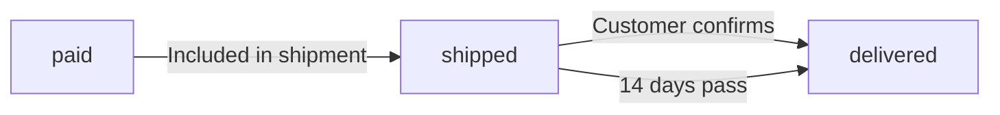

### Separate Seller Shipments

### Separate Seller Shipments

THE system SHALL require each seller to create their own shipments for their products.

THE system SHALL NOT allow order items from different sellers to be combined in a single shipment.

WHEN an order contains items from multiple sellers, THE system SHALL require each seller to create separate shipments.

THE system SHALL track shipments by seller, allowing each seller to manage their own shipments independently.

WHEN a seller views order items needing shipment, THE system SHALL display only items belonging to that seller.

WHEN a seller views order items needing shipment, THE system SHALL display only items with paid status.

THE system SHALL maintain separate tracking information for each seller's shipments, even when items are from the same order.

### Tracking Information Display

### Tracking Information Display

WHEN a customer views an order, THE system SHALL display tracking information for each shipment in that order.

THE system SHALL display the carrier name for each shipment.

THE system SHALL display the tracking number for each shipment.

THE system SHALL display the shipped date for each shipment.

THE system SHALL display which order items are included in each shipment.

WHEN a customer views tracking information, THE system SHALL show the delivery status of each shipment.

WHEN a shipment has not yet been delivered, THE system SHALL indicate that the shipment is in transit.

THE system SHALL group tracking information by shipment, not by individual order items.

### Delivery Confirmation

### Delivery Confirmation

WHEN a customer confirms delivery of a shipment, THE system SHALL change the status of all order items in that shipment to delivered.

WHEN a customer confirms delivery, THE system SHALL record the delivery date and time for the shipment.

WHEN a customer confirms delivery, THE system SHALL record the delivery date and time for each delivered order item.

THE system SHALL allow delivery confirmation only for shipments that have been shipped but not yet delivered.

IF a customer attempts to confirm delivery of a shipment that has already been delivered, THE system SHALL reject the request.

THE system SHALL allow the customer who placed the order to confirm delivery.

WHEN all items in an order have been delivered, THE system SHALL set the overall order status to delivered.

WHEN some items in an order are delivered while others remain shipped, THE system SHALL set the overall order status to partially completed.

Delivery confirmation is per shipment, not per individual item within a shipment.

### Automatic Delivery After Timeout

### Automatic Delivery After Timeout

IF a customer does not confirm delivery within fourteen days from the shipment date, THE system SHALL automatically change the status of all order items in that shipment to delivered.

WHEN the fourteen-day period expires, THE system SHALL record the delivery date as the fourteenth day after shipment.

WHEN automatic delivery occurs, THE system SHALL update the shipment delivery date and time.

WHEN automatic delivery occurs, THE system SHALL update the status of all order items in the shipment to delivered.

THE system SHALL calculate the fourteen-day period starting from the shipped date of the shipment.

IF the customer confirms delivery before the fourteen-day period expires, THE system SHALL use the customer-confirmed delivery date.

WHEN automatic delivery occurs, THE system SHALL NOT require customer action.

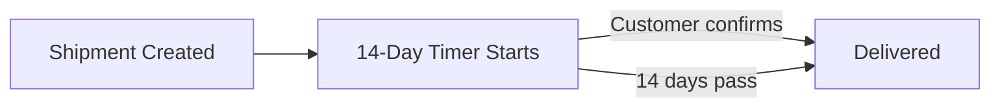

## CancellationRequest Operations

Cancellation requests are created by customers for order items with paid status. Each request includes a reason provided by the customer. The seller of the item reviews and either approves or rejects the request. When approved, the item is cancelled and stock is restored. When rejected, the item continues in its normal processing flow. A snapshot of the request is created when the seller responds. Sellers view pending cancellation requests through their dashboard. Customers view the status of their cancellation requests. Each item can have one active cancellation request at a time.

### Cancellation Request Creation

WHEN a customer creates a cancellation request for an order item, THE system SHALL require the order item status to be "paid".

IF an order item has any status other than "paid", THE system SHALL reject the cancellation request.

WHEN a customer creates a cancellation request, THE system SHALL require the customer to provide a reason.

IF the reason is not provided, THE system SHALL reject the cancellation request.

THE system SHALL allow only one active cancellation request per order item at any time.

IF an active cancellation request already exists for an order item, THE system SHALL reject the creation of a new request.

WHEN a cancellation request is successfully created, THE system SHALL set the request status to "pending".

WHEN a cancellation request is successfully created, THE system SHALL associate the request with the order item and the seller of that item.

THE system SHALL allow only the customer who placed the order to create a cancellation request for that order's items.

IF the requesting customer is not the owner of the order item, THE system SHALL reject the request.

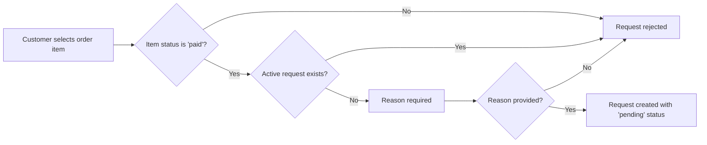

### Seller Response to Cancellation

WHEN a seller views pending cancellation requests, THE system SHALL display only requests for items sold by that seller.

WHEN a seller approves a cancellation request, THE system SHALL change the order item status to "cancelled".

WHEN a seller rejects a cancellation request, THE system SHALL keep the order item status as "paid".

WHEN a seller responds to a cancellation request, THE system SHALL create a snapshot recording the request state at the time of response.

The snapshot SHALL include the reason text, the status, and the timestamp of the response.

WHEN a seller responds to a cancellation request, THE system SHALL record the response timestamp.

THE system SHALL allow only the seller associated with the order item to approve or reject the cancellation request.

IF a seller who is not associated with the order item attempts to respond, THE system SHALL reject the action.

WHEN a cancellation request is approved or rejected, THE system SHALL notify the customer of the result.

THE system SHALL preserve the cancellation request record after the seller responds.

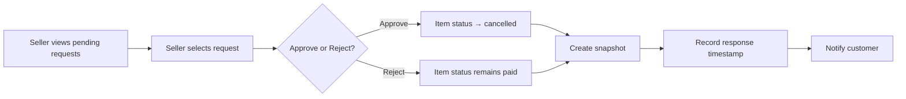

### Stock Restoration on Cancellation

WHEN a seller approves a cancellation request, THE system SHALL create a positive inventory record for the product variant.

The inventory record SHALL have a quantity change equal to the cancelled item quantity.

The inventory record SHALL include the reason "order cancellation".

WHEN the inventory record is created, THE system SHALL recalculate the current stock quantity by summing all inventory records for the variant.

IF the cancellation request is rejected, THE system SHALL NOT create any inventory record.

IF the cancellation request is rejected, THE system SHALL NOT modify the stock quantity.

THE system SHALL apply stock restoration immediately upon approval, regardless of any other processing steps.

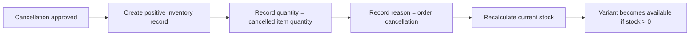

### Cancellation Request Viewing

WHEN a customer views their order details, THE system SHALL display the cancellation request status for each item that has a request.

WHEN a customer views a cancellation request, THE system SHALL display the reason text and current status.

WHEN a seller has responded to a cancellation request, THE system SHALL display the response (approved or rejected) to the customer.

WHEN a seller views their dashboard, THE system SHALL display the count of pending cancellation requests.

WHEN a seller views order items for their products, THE system SHALL allow filtering by cancellation request status.

THE system SHALL allow sellers to view the full list of cancellation requests for their items.

WHEN a seller views a cancellation request, THE system SHALL display the reason text provided by the customer.

WHEN an order item has an approved cancellation, THE system SHALL display the item status as "cancelled" to both the customer and seller.

THE system SHALL allow customers to view the history of their cancellation requests.

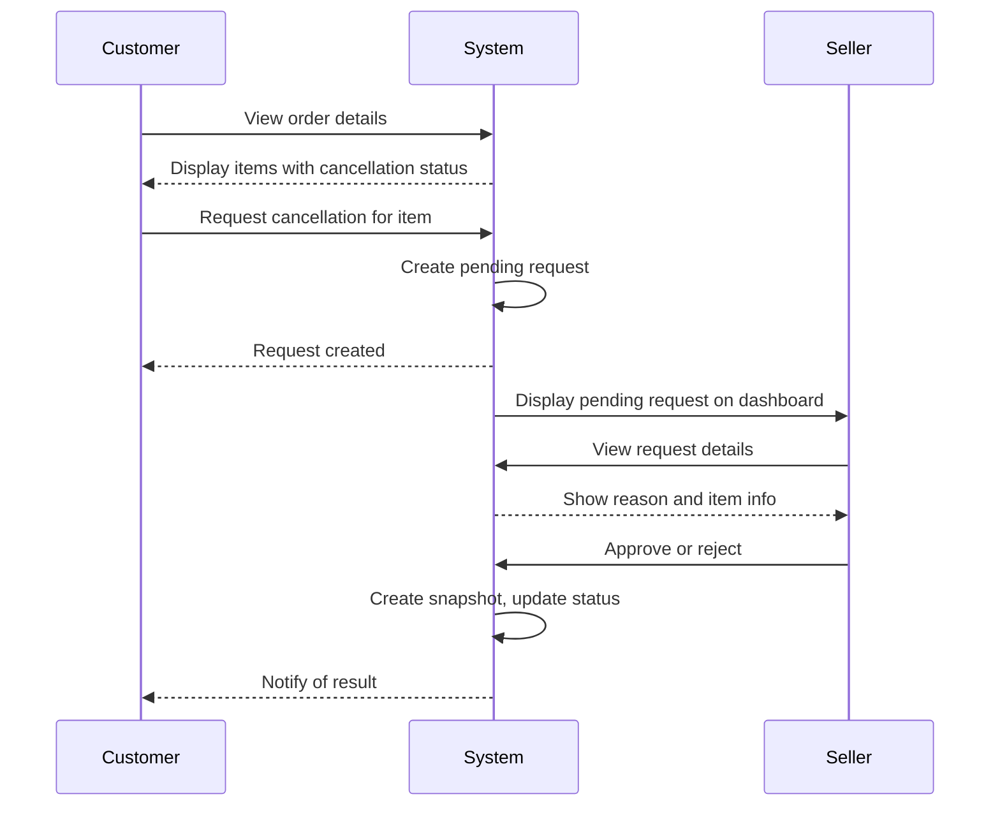

## CancellationRequestSnapshot Operations

Cancellation request snapshots preserve the state of a request when changes occur. Snapshots are created when sellers respond to cancellation requests. Each snapshot records the reason, status, and timestamp at the time of the change. Snapshots are immutable and cannot be modified or deleted. These records support audit trails for dispute resolution. Relevant parties can view cancellation request snapshots. Snapshots help track the history of cancellation request processing. The snapshot preserves evidence of what was requested and how it was handled.

### Snapshot Creation

WHEN a seller responds to a cancellation request, THE system SHALL create a cancellation request snapshot.

WHEN a seller approves a cancellation request, THE system SHALL create a snapshot recording the approved state.

WHEN a seller rejects a cancellation request, THE system SHALL create a snapshot recording the rejected state.

THE system SHALL create exactly one snapshot for each seller response to a cancellation request.

WHEN a snapshot is created, THE system SHALL link it to the corresponding cancellation request.

THE system SHALL create snapshots automatically without requiring manual intervention from the seller.

IF multiple responses occur on the same cancellation request, THE system SHALL create a separate snapshot for each response.

### State Preservation

WHEN a cancellation request snapshot is created, THE system SHALL record the reason text from the request at that moment.

WHEN a cancellation request snapshot is created, THE system SHALL record the current status of the request (pending, approved, or rejected).

WHEN a cancellation request snapshot is created, THE system SHALL record the exact timestamp of when the snapshot was created.

WHEN a cancellation request snapshot is created, THE system SHALL preserve the complete state of the cancellation request at the time of the seller's response.

THE system SHALL ensure that the recorded reason text in the snapshot reflects exactly what was provided in the request.

THE system SHALL ensure that the recorded status in the snapshot reflects the outcome of the seller's response.

THE system SHALL use the recorded timestamp to establish when each state change occurred.

### Immutability Rules

THE system SHALL prevent any modification to a cancellation request snapshot after creation.

THE system SHALL prevent deletion of cancellation request snapshots.

THE system SHALL preserve cancellation request snapshots indefinitely for audit and dispute resolution purposes.

IF an attempt is made to modify a snapshot, THE system SHALL reject the operation.

IF an attempt is made to delete a snapshot, THE system SHALL reject the operation.

THE system SHALL ensure snapshot data remains unchanged even if the original cancellation request is modified or resolved.

THE system SHALL maintain snapshot integrity regardless of subsequent changes to related order items or seller accounts.

### Access and Audit Support

THE system SHALL allow the customer who created the cancellation request to view all snapshots for that request.

THE system SHALL allow the seller who responded to the cancellation request to view all snapshots for that request.

THE system SHALL allow administrators to view all cancellation request snapshots.

THE system SHALL provide a complete history of all snapshots for each cancellation request in chronological order.

WHEN viewing a cancellation request, THE system SHALL enable access to all associated snapshots for audit purposes.

THE system SHALL support dispute resolution by providing preserved evidence of request states and response decisions.

THE system SHALL maintain snapshots as an audit trail showing the progression of each cancellation request from submission through resolution.

## RefundRequest Operations

Refund requests are created by customers for order items with delivered status. Refunds can only be requested within seven days of delivery. Each request includes a reason provided by the customer. The seller of the item reviews and either approves or rejects the request. When approved, the item is refunded and stock is restored. When rejected, the item remains in delivered status. A snapshot of the request is created when the seller responds. Sellers view pending refund requests through their dashboard. Customers view the status of their refund requests. Each item can have one active refund request at a time.

### Refund Request Creation

WHEN a customer requests a refund for an order item, THE system SHALL require the order item status to be "delivered".

WHEN a customer requests a refund, THE system SHALL verify the request is submitted within 7 days of the order item's delivery date.

IF the refund request is submitted more than 7 days after delivery, THE system SHALL reject the request.

WHEN a customer creates a refund request, THE system SHALL require a reason text to be provided.

IF the reason text is not provided, THE system SHALL reject the request.

WHEN a customer attempts to create a refund request for an order item, THE system SHALL verify that no active refund request already exists for that item.

IF an active refund request already exists for the order item, THE system SHALL reject the new request.

WHEN a refund request is successfully created, THE system SHALL set the request status to "pending".

WHEN a refund request is successfully created, THE system SHALL record the creation timestamp.

WHEN a refund request is successfully created, THE system SHALL associate the request with the customer who created it.

WHEN a refund request is successfully created, THE system SHALL associate the request with the seller of the order item.

### Seller Review Process

WHEN a seller views pending refund requests, THE system SHALL display all refund requests with status "pending" for products sold by that seller.

WHEN a seller approves a refund request, THE system SHALL update the request status to "approved".

WHEN a seller approves a refund request, THE system SHALL update the order item status to "refunded".

WHEN a seller approves a refund request, THE system SHALL record the approval timestamp.

WHEN a seller rejects a refund request, THE system SHALL update the request status to "rejected".

WHEN a seller rejects a refund request, THE system SHALL maintain the order item status as "delivered".

WHEN a seller rejects a refund request, THE system SHALL record the rejection timestamp.

WHEN a seller responds to a refund request, THE system SHALL create a snapshot of the request state.

WHEN a seller responds to a refund request, THE system SHALL associate the seller with the response as the respondent.

THE system SHALL allow only the seller of the order item to approve or reject the refund request.

### Stock Restoration on Refund

WHEN a seller approves a refund request, THE system SHALL create a positive inventory record for the product variant.

WHEN an inventory record is created for a refund, THE system SHALL set the quantity change equal to the quantity of the refunded order item.

WHEN an inventory record is created for a refund, THE system SHALL set the reason to "refund approved".

WHEN an inventory record is created for a refund, THE system SHALL record the timestamp of the inventory change.

WHEN the inventory record is created, THE system SHALL update the stock quantity of the variant by adding the refunded quantity.

WHEN the stock quantity is restored, THE system SHALL make the variant available for purchase if the previous stock was zero.

THE system SHALL restore stock quantity only after the refund request is approved.

THE system SHALL not restore stock quantity when a refund request is rejected.

### Request Status and Dashboard

WHEN a customer views their refund requests, THE system SHALL display all refund requests created by that customer.

WHEN a customer views their refund requests, THE system SHALL display the status of each request (pending, approved, or rejected).

WHEN a customer views their refund requests, THE system SHALL display the reason text for each request.

WHEN a customer views their refund requests, THE system SHALL display the creation date of each request.

WHEN a seller views their dashboard, THE system SHALL display the count of pending refund requests.

WHEN a seller views their dashboard, THE system SHALL provide access to the list of pending refund requests.

WHEN a seller views the list of refund requests, THE system SHALL display the order item details including product name and variant.

WHEN a seller views the list of refund requests, THE system SHALL display the customer's reason for the refund.

WHEN a seller views the list of refund requests, THE system SHALL display the request creation date.

WHEN a refund request is approved or rejected, THE system SHALL allow the customer to view the response status and date.

## RefundRequestSnapshot Operations

Refund request snapshots preserve the state of a request when changes occur. Snapshots are created when sellers respond to refund requests. Each snapshot records the reason, status, and timestamp at the time of the change. Snapshots are immutable and cannot be modified or deleted. These records support audit trails for dispute resolution. Relevant parties can view refund request snapshots. Snapshots help track the history of refund request processing. The snapshot preserves evidence of what was requested and how it was handled.

### Refund Request Snapshot Creation

### Snapshot Creation Trigger

WHEN a seller responds to a refund request, THE system SHALL create a RefundRequestSnapshot recording the state of the request at that moment.

WHEN a snapshot is created, THE system SHALL record the reason text from the refund request.

WHEN a snapshot is created, THE system SHALL record the status of the refund request (pending, approved, or rejected).

WHEN a snapshot is created, THE system SHALL record the timestamp of when the snapshot was created.

WHEN a snapshot is created, THE system SHALL associate it with the corresponding RefundRequest.

IF a seller approves a refund request, THE system SHALL create a snapshot capturing the approved state.

IF a seller rejects a refund request, THE system SHALL create a snapshot capturing the rejected state.

THE system SHALL NOT create a snapshot when a customer initially submits a refund request.

THE system SHALL create a snapshot only upon seller response to the request.

### Refund Request Snapshot Immutability

### Snapshot Immutability

THE system SHALL treat all RefundRequestSnapshots as immutable records.

THE system SHALL NOT allow modification of any recorded reason text in a snapshot.

THE system SHALL NOT allow modification of any recorded status in a snapshot.

THE system SHALL NOT allow modification of any recorded timestamp in a snapshot.

THE system SHALL NOT allow deletion of any RefundRequestSnapshot.

IF a user attempts to modify or delete a RefundRequestSnapshot, THE system SHALL reject the request.

THE system SHALL preserve all snapshots even if the associated RefundRequest is deleted.

THE system SHALL preserve all snapshots even if the associated OrderItem is deleted.

THE system SHALL preserve all snapshots even if the associated Seller account is deleted.

### Refund Request Snapshot Access and Audit Support

### Snapshot Access Control

THE system SHALL allow sellers to view snapshots of refund requests for their own products.

THE system SHALL allow administrators to view snapshots of any refund request.

THE system SHALL allow customers to view snapshots of their own refund requests.

THE system SHALL NOT allow any user to modify or delete snapshots regardless of their role.

### Audit Trail and Dispute Resolution

THE system SHALL maintain RefundRequestSnapshots as part of the audit trail for all refund transactions.

THE system SHALL provide chronological ordering of snapshots when displaying request history.

WHEN multiple snapshots exist for a refund request, THE system SHALL display all snapshots to relevant parties.

THE system SHALL preserve snapshots as evidence for dispute resolution purposes.

WHEN a dispute arises regarding a refund request, THE system SHALL provide access to all related snapshots.

THE system SHALL enable reconstruction of the complete history of a refund request through its snapshots.

IF a legal or administrative inquiry requires refund request history, THE system SHALL provide access to all related snapshots.

## Review Operations

Reviews are written by customers for products they have purchased. Reviews can only be written after an order item reaches delivered status. Each review includes a rating from one to five stars and optional text content. Customers can write one review per product per order. Reviews are displayed on product detail pages sorted by newest first. Customers can edit their own reviews, and each edit creates a snapshot. Customers can delete their own reviews, but snapshots are preserved. Product average ratings are calculated from all non-deleted reviews. Reviews from deleted customer accounts show as 'deleted user'.

### Review Creation

### Delivery Status Requirement

WHEN a customer creates a review, THE system SHALL verify that the customer has purchased the product through a completed order item.

WHEN a customer creates a review, THE system SHALL verify that the order item status is "delivered".

IF the order item is not in "delivered" status, THE system SHALL reject the review creation request.

IF the customer has not purchased the product, THE system SHALL reject the review creation request.

### Rating System

WHEN a customer creates a review, THE system SHALL require a rating value.

WHEN a customer submits a rating, THE system SHALL accept only integer values from 1 to 5.

IF the rating value is less than 1 or greater than 5, THE system SHALL reject the review.

IF the rating value is not an integer, THE system SHALL reject the review.

### Text Content Option

WHEN a customer creates a review, THE system SHALL allow optional text content.

THE system SHALL accept a review with only a rating and no text content.

### One Review Per Order

WHEN a customer creates a review, THE system SHALL verify that the customer has not already written a review for that product within that specific order.

IF a review already exists for that customer-product-order combination, THE system SHALL reject the duplicate review.

THE system SHALL allow a customer to write multiple reviews for the same product across different orders.

### Review Record Creation

WHEN a review is successfully created, THE system SHALL associate the review with:
1. The customer who created it
2. The product being reviewed
3. The order through which the product was purchased

WHEN a review is created, THE system SHALL record the creation timestamp.

WHEN a review is created, THE system SHALL NOT create an initial snapshot (snapshots are created only on edits).

### Review Display on Product Page

### Product Detail Page Display

WHEN a customer views a product detail page, THE system SHALL display all non-deleted reviews for that product.

WHEN displaying reviews, THE system SHALL show:
1. The customer's display name (or "deleted user" if the account was deleted)
2. The rating value
3. The text content (if provided)
4. The creation timestamp

### Review Sorting

WHEN displaying reviews on a product page, THE system SHALL sort reviews by creation timestamp in descending order (newest first).

### Review Visibility

THE system SHALL display reviews to all users regardless of authentication status.

THE system SHALL NOT display deleted reviews on the product page.

IF a review has a deletedAt timestamp, THE system SHALL exclude it from the product page display.

### Empty State

IF a product has no reviews, THE system SHALL display an appropriate message indicating no reviews are available.

### Review Editing

### Edit Authorization

WHEN a customer attempts to edit a review, THE system SHALL verify that the customer is the original author of the review.

IF the customer is not the original author, THE system SHALL reject the edit request.

### Editable Fields

WHEN a customer edits a review, THE system SHALL allow modification of:
1. The rating value
2. The text content

### Rating Validation on Edit

WHEN a customer modifies the rating, THE system SHALL validate that the new rating is an integer from 1 to 5.

IF the modified rating is outside the range of 1 to 5, THE system SHALL reject the edit.

### Snapshot Creation on Edit

WHEN a customer successfully edits a review, THE system SHALL create a snapshot preserving the previous state.

WHEN a review snapshot is created, THE system SHALL record:
1. The rating value before the edit
2. The text content before the edit
3. The timestamp of the snapshot creation

THE system SHALL preserve all review snapshots and SHALL NOT allow snapshot deletion.

### Edit History

THE system SHALL allow multiple edits to the same review, creating a new snapshot for each edit.

THE system SHALL maintain a complete history of all edits through the snapshot chain.

### Review Deletion

### Deletion Authorization

WHEN a customer attempts to delete a review, THE system SHALL verify that the customer is the original author of the review.

IF the customer is not the original author, THE system SHALL reject the deletion request.

### Soft Delete Mechanism

WHEN a customer deletes a review, THE system SHALL perform a soft delete by recording a deletedAt timestamp.

THE system SHALL NOT physically remove the review record from storage.

### Snapshot Preservation

WHEN a review is deleted, THE system SHALL preserve all existing snapshots for that review.

THE system SHALL NOT create a new snapshot when a review is deleted.

### Effect on Display

WHEN a review is deleted, THE system SHALL immediately remove it from the product page display.

WHEN a review is deleted, THE system SHALL exclude it from the product's average rating calculation.

### Irreversibility

THE system SHALL NOT allow customers to restore a deleted review.

IF a customer wishes to review the same product again after deletion, THE system SHALL require a new review submission subject to all creation rules.

### Rating Aggregation

### Average Rating Calculation

WHEN calculating a product's average rating, THE system SHALL include only non-deleted reviews.

THE system SHALL exclude deleted reviews (those with a deletedAt timestamp) from the average rating calculation.

WHEN calculating the average, THE system SHALL compute the arithmetic mean of all rating values from non-deleted reviews.

### Display of Average Rating

WHEN displaying a product listing, THE system SHALL show the average rating if at least one review exists.

WHEN displaying a product detail page, THE system SHALL show:
1. The average rating
2. The total count of non-deleted reviews

IF a product has no reviews, THE system SHALL NOT display an average rating.

### Rating Update Timing

WHEN a new review is created, THE system SHALL immediately update the product's average rating.

WHEN a review is deleted, THE system SHALL immediately recalculate the product's average rating.

WHEN a review is edited, THE system SHALL immediately recalculate the product's average rating with the new rating value.

### Deleted User Attribution

WHEN a customer deletes their account, THE system SHALL preserve their reviews.

WHEN displaying a review from a deleted customer account, THE system SHALL show the author as "deleted user".

THE system SHALL NOT display any personally identifiable information for reviews from deleted accounts.

WHEN calculating average ratings, THE system SHALL include reviews from deleted accounts (as long as the review itself is not deleted).

## ReviewSnapshot Operations

Review snapshots preserve the state of a review when changes occur. Snapshots are created automatically when reviews are edited. Each snapshot records the rating, text content, and timestamp of the change. Snapshots are immutable and cannot be modified or deleted. Review snapshots are preserved even after the original review is deleted. These records support audit trails for dispute resolution. The review owner and administrators can view review snapshots. Snapshots help track the history of what was written and when changes were made.

### Automatic Snapshot Creation

WHEN a customer edits their review, THE system SHALL automatically create a review snapshot before applying the changes.

WHEN a review snapshot is created, THE system SHALL record the rating value as it existed before the edit.

WHEN a review snapshot is created, THE system SHALL record the text content as it existed before the edit.

WHEN a review snapshot is created, THE system SHALL record the timestamp of when the snapshot was created.

WHEN a customer creates a new review, THE system SHALL NOT create an initial snapshot (snapshots only capture edits, not initial creation).

IF multiple edits are made to a review, THE system SHALL create a separate snapshot for each edit, accumulating a complete edit history.

### Snapshot State Preservation

WHEN a review snapshot is created, THE system SHALL preserve the rating value that ranged from 1 to 5 stars at the time of the edit.

WHEN a review snapshot is created, THE system SHALL preserve the text content exactly as it appeared before the edit.

WHEN a review snapshot is created, THE system SHALL preserve the complete state of the review at that moment in time.

THE system SHALL maintain the relationship between each snapshot and its parent review for complete history reconstruction.

### Snapshot Immutability

THE system SHALL prevent any modification to review snapshots after creation.

THE system SHALL prevent deletion of review snapshots under any circumstances.

IF a user attempts to modify a review snapshot, THE system SHALL reject the request.

IF a user attempts to delete a review snapshot, THE system SHALL reject the request.

THE system SHALL ensure review snapshots remain permanently available as immutable historical records.

### Authorized Snapshot Access

WHEN the review owner requests to view snapshots of their review, THE system SHALL allow access.

WHEN an administrator requests to view snapshots of any review, THE system SHALL allow access.

IF a user who is neither the review owner nor an administrator attempts to view review snapshots, THE system SHALL deny access.

WHEN an authorized user views review snapshots, THE system SHALL display all snapshots in chronological order from oldest to newest.

### Post-Deletion Preservation

WHEN a customer deletes their review, THE system SHALL preserve all associated review snapshots.

WHEN a review is deleted, THE system SHALL maintain the relationship between snapshots and the deleted review for audit purposes.

WHEN an administrator views snapshots of a deleted review, THE system SHALL display the snapshots with appropriate indication that the original review has been deleted.

THE system SHALL ensure review snapshots remain accessible to administrators even after the original review is deleted.

### Audit Trail and History Tracking

THE system SHALL maintain review snapshots to support audit trails for dispute resolution.

WHEN reconstructing the history of a review, THE system SHALL provide access to all snapshots in chronological sequence.

WHEN a dispute arises regarding review content, THE system SHALL allow authorized parties to view the complete edit history through snapshots.

THE system SHALL enable comparison between snapshots to identify what changes were made and when.

WHEN viewing snapshot history, THE system SHALL display the timestamp of each edit to establish a clear timeline of changes.

## Address Operations

Customers create multiple shipping addresses for their account. Each address requires a recipient name, phone number, street address, city, state or province, postal code, and country. Customers can edit any of their existing addresses. Customers can delete addresses they no longer need. Customers can set one address as the default shipping address. The default address is pre-selected during checkout. All addresses are available for selection during the checkout process. Customers manage their addresses through their profile settings.

### Address Creation

WHEN a customer creates a new shipping address, THE system SHALL require the following fields: recipient name, phone number, street address, city, state or province, postal code, and country.

WHEN a customer creates their first address, THE system SHALL automatically designate it as the default shipping address.

WHEN a customer creates an additional address and already has existing addresses, THE system SHALL NOT automatically designate it as the default.

THE system SHALL associate each address with the customer who created it.

THE system SHALL allow a customer to have multiple shipping addresses.

IF any required field is missing or empty, THE system SHALL reject the address creation request.

IF the customer is not authenticated, THE system SHALL reject the address creation request.

WHEN an address is successfully created, THE system SHALL make it immediately available for selection during checkout.

THE system SHALL store recipient name and phone number as part of the address for delivery contact purposes.

THE system SHALL store location details including street address, city, state or province, postal code, and country for shipping purposes.

### Address Editing

WHEN a customer edits an existing address, THE system SHALL allow modification of all address fields including recipient name, phone number, street address, city, state or province, postal code, and country.

WHEN a customer saves changes to an address, THE system SHALL validate that all required fields remain populated.

IF any required field is cleared during editing, THE system SHALL reject the update request.

IF a customer attempts to edit an address that belongs to another customer, THE system SHALL reject the request.

WHEN a customer edits their default address, THE system SHALL preserve its default status.

THE system SHALL allow customers to edit any of their existing addresses at any time.

WHEN address edits are saved, THE system SHALL immediately reflect the changes for future checkout selections.

THE system SHALL NOT modify the address ownership during editing operations.

### Address Deletion

WHEN a customer deletes an address, THE system SHALL remove it from their address list.

IF a customer attempts to delete their default address while they have other addresses, THE system SHALL reject the deletion.

IF a customer attempts to delete their default address and it is their only address, THE system SHALL allow the deletion and leave the customer without a default address.

IF a customer attempts to delete an address that belongs to another customer, THE system SHALL reject the request.

WHEN an address is deleted, THE system SHALL no longer display it as an option during checkout.

WHEN an address is deleted, THE system SHALL preserve the address information in any existing orders that previously used it.

THE system SHALL not allow deletion of addresses referenced by pending orders (defined in Order Operations).

WHEN a customer deletes an address, THE system SHALL not automatically assign a new default address.

### Default Address Management

WHEN a customer designates an address as the default, THE system SHALL update the default address indicator for that address.

WHEN a customer designates a new default address, THE system SHALL remove the default status from the previously designated default address.

THE system SHALL ensure that only one address per customer is marked as default at any given time.

IF a customer attempts to set a non-existent address as default, THE system SHALL reject the request.

IF a customer attempts to set an address as default that belongs to another customer, THE system SHALL reject the request.

WHEN a customer has multiple addresses, THE system SHALL maintain exactly one default address.

WHEN a customer views their address list, THE system SHALL clearly indicate which address is the default.

WHEN a customer has only one address, THE system SHALL designate it as the default automatically.

THE system SHALL allow customers to change their default address at any time through their profile settings.

### Checkout Address Selection

WHEN a customer initiates checkout, THE system SHALL display all of their saved shipping addresses.

WHEN a customer has a default address set, THE system SHALL pre-select the default address during checkout.

WHEN a customer selects a different address during checkout, THE system SHALL use the selected address for the order shipment.

IF a customer has no saved addresses, THE system SHALL require them to create an address before proceeding with checkout.

WHEN an order is successfully placed, THE system SHALL capture and store the selected shipping address with the order.

WHEN an order is placed, THE system SHALL prevent any subsequent modification of the shipping address.

THE system SHALL display the recipient name and phone number from the selected address for customer verification during checkout.

THE system SHALL display the complete location details including street address, city, state or province, postal code, and country for customer verification during checkout.

IF a previously selected address is deleted before order placement, THE system SHALL require the customer to select a different address.

### Profile Address Management

THE system SHALL provide a dedicated section in the customer profile for managing shipping addresses.

WHEN a customer accesses their profile settings, THE system SHALL display all their saved addresses.

WHEN a customer views their address list, THE system SHALL display each address with complete recipient information and location details.

THE system SHALL allow customers to access address management after logging in.

THE system SHALL organize address management under the customer's profile settings.

WHEN a customer navigates to the address management section, THE system SHALL display options to create, edit, delete, and set default for each address.

THE system SHALL maintain address data as customer-specific and private to each customer account.

WHEN a customer account is deleted (defined in Customer Operations), THE system SHALL delete all addresses associated with that customer.

# Business Actions and Workflows

Business actions and workflows beyond basic CRUD.

## Customer Actions

Customers must register before accessing any platform features, providing email and password credentials. After registration, customers can log in using their email and password combination. Customers may change their password at any time through their account settings. When a customer deletes their account, their profile information is permanently removed while their order history is preserved for seller records and legal compliance. Reviews written by deleted customers remain visible but display as 'deleted user' to maintain review integrity. Customers can edit their display name and phone number in their profile at any time. Profile changes do not create snapshots as they are not transactional data. Customers manage multiple shipping addresses, each containing recipient name, phone number, street address, city, state/province, postal code, and country. Customers can add new addresses, edit existing ones, delete addresses, and designate one address as the default shipping address for convenience during checkout.

### Customer Registration Flow

### Overview

Customers must complete registration before accessing any platform features. Guest browsing is not supported on this platform.

### Registration Requirements

WHEN a person registers as a customer, THE system SHALL:
1. Require an email address
2. Require a password
3. Validate that the email address is unique across all customer accounts
4. Create a new customer account with the provided credentials

IF the email address is already registered to another customer, THE system SHALL reject the registration.

IF registration is successful, THE system SHALL create a customer profile with empty display name and phone number fields.

### Account Access

WHEN registration is completed successfully, THE system SHALL:
1. Allow the customer to log in immediately
2. Grant access to all customer features
3. Create an empty cart for the customer
4. Create an empty wishlist for the customer

### Email Password Login

### Login Requirements

WHEN a customer attempts to log in, THE system SHALL:
1. Require the registered email address
2. Require the corresponding password
3. Validate the credentials against stored records

IF the email and password combination is correct, THE system SHALL authenticate the customer.

IF the email or password is incorrect, THE system SHALL reject the login attempt.

### Banned Account Handling

IF the customer account has been banned, THE system SHALL:
1. Reject the login attempt
2. Prevent access to the platform

### Session Management

WHEN a customer successfully logs in, THE system SHALL:
1. Grant access to the customer's profile, cart, wishlist, and orders
2. Allow the customer to browse products and categories
3. Enable checkout functionality

### Password Change Workflow

### Password Change Requirements

WHEN a customer requests a password change, THE system SHALL:
1. Require the customer to be logged in
2. Require the current password for verification
3. Require a new password
4. Require confirmation of the new password

IF the current password provided does not match the stored password, THE system SHALL reject the password change.

IF the new password and confirmation do not match, THE system SHALL reject the password change.

WHEN the password change is successful, THE system SHALL:
1. Update the stored password
2. Maintain the customer's current session
3. Not require the customer to log in again

### Account Deletion Process

### Deletion Request

WHEN a customer requests account deletion, THE system SHALL:
1. Require the customer to be logged in
2. Request confirmation of the deletion action
3. Warn the customer that the action is irreversible

### Data Removal on Deletion

WHEN a customer account is deleted, THE system SHALL:
1. Remove the customer's profile information (display name and phone number)
2. Remove the customer's email and password credentials
3. Remove the customer's shipping addresses
4. Remove the customer's cart and cart items
5. Remove the customer's wishlist entries

### Data Preservation on Deletion

WHEN a customer account is deleted, THE system SHALL preserve:
1. The customer's order records for seller access
2. The customer's order history for legal and record-keeping purposes
3. The customer's review content with the author shown as "deleted user"

IF a deleted customer had written reviews, THE system SHALL display those reviews with the author name shown as "deleted user" to maintain product review integrity.

### Post-Deletion State

WHEN a customer account is deleted, THE system SHALL:
1. Prevent the customer from logging in
2. Make the email address available for new registration
3. Not allow restoration of the deleted account

### Profile Editing Actions

### Profile Information Structure

THE system SHALL maintain a customer profile containing:
1. Display name (optional text identifier)
2. Phone number (optional contact information)

### Display Name Update

WHEN a customer updates their display name, THE system SHALL:
1. Accept any valid text as the display name
2. Allow the display name to be cleared (set to empty)
3. Update the display name immediately
4. Not create a snapshot of the change

### Phone Number Management

WHEN a customer updates their phone number, THE system SHALL:
1. Accept any valid text as the phone number
2. Allow the phone number to be cleared (set to empty)
3. Update the phone number immediately
4. Not create a snapshot of the change

### Profile Change Characteristics

THE system SHALL treat profile changes as non-transactional data modifications.

THE system SHALL NOT create snapshots for profile edits because they do not involve financial transactions or dispute-relevant information.

### Shipping Address Management

### Address Structure

THE system SHALL require each shipping address to contain:
1. Recipient name (required)
2. Phone number (required)
3. Street address (required)
4. City (required)
5. State or province (required)
6. Postal code (required)
7. Country (required)

### Address Addition

WHEN a customer adds a new shipping address, THE system SHALL:
1. Require all address fields to be provided
2. Store the address associated with the customer's account
3. Allow unlimited number of addresses per customer

IF the new address is the customer's first address, THE system SHALL automatically set it as the default shipping address.

### Address Editing

WHEN a customer edits an existing address, THE system SHALL:
1. Allow modification of any address field
2. Require all fields to remain populated
3. Preserve the address's default status

### Address Deletion

WHEN a customer deletes a shipping address, THE system SHALL:
1. Remove the address from the customer's account
2. Not affect any orders that previously used this address

IF the deleted address was the default shipping address, THE system SHALL:
1. Require the customer to select a new default address
2. Not allow deletion until a new default is designated

### Default Address Selection

WHEN a customer sets an address as the default shipping address, THE system SHALL:
1. Remove the default status from any previously default address
2. Mark the selected address as the default
3. Pre-select this address during checkout

WHEN a customer has multiple addresses, THE system SHALL allow exactly one address to be designated as the default.

### Address Display in Checkout

WHEN a customer proceeds to checkout, THE system SHALL:
1. Pre-select the default shipping address
2. Allow the customer to choose any of their saved addresses
3. Allow the customer to add a new address during checkout

## Seller Actions

Sellers register with email and password but cannot sell until an administrator approves their account. Sellers can view their approval status (pending, approved, rejected) and see rejection reasons if applicable. Rejected sellers may submit a new registration request after receiving rejection notification. Sellers can change their password and delete their account only when they have no pending orders or pending cancellation/refund requests. Upon account deletion, seller's products are removed from listings while order history and snapshots are preserved with the shop name intact. Sellers edit their shop name, description, and logo image, with each edit creating a snapshot for historical tracking. Sellers create products with name, description, category, and base price. Products require at least one variant to be purchasable. Sellers edit their own products, triggering snapshot creation for each modification. Sellers can delete products only when no pending orders or requests exist for any variant. Sellers manage product images including upload, reordering, and deletion. Sellers create and manage product variants with SKU codes, option values, and prices. Sellers manage inventory through restocking and adjustment records that track quantity changes with reasons. Sellers view order items for their products and create shipments with tracking information. Sellers respond to cancellation and refund requests from customers with approval or rejection.

### Seller Registration and Approval

### Seller Registration

WHEN a user submits a seller registration request, THE system SHALL:
1. Require an email address and password
2. Validate that the email address is not already registered as a seller
3. Create a seller account with status "pending"
4. Prevent the seller from listing products or receiving orders

WHILE a seller account has status "pending", THE system SHALL:
1. Allow the seller to log in
2. Display the approval status as "pending"
3. Prevent product creation and editing
4. Prevent shop profile modifications

### Approval Process

WHEN an administrator approves a seller registration, THE system SHALL:
1. Change the seller account status to "approved"
2. Enable full seller functionality
3. Allow the seller to create products and manage their shop

WHEN an administrator rejects a seller registration, THE system SHALL:
1. Change the seller account status to "rejected"
2. Require the administrator to provide a rejection reason
3. Store the rejection reason for the seller to view

### Rejection and Reapplication

WHEN a seller with status "rejected" logs in, THE system SHALL:
1. Display the rejection reason provided by the administrator
2. Allow the seller to submit a new registration request

WHEN a rejected seller submits a new registration request, THE system SHALL:
1. Require the seller to confirm the resubmission
2. Reset the seller account status to "pending"
3. Clear the previous rejection reason
4. Submit the account for administrator review again

### Error Conditions

THE system SHALL reject the registration when the email is already registered as a seller.
THE system SHALL reject the registration when the email format is invalid.
THE system SHALL reject the registration when the password does not meet security requirements.
THE system SHALL prevent a rejected seller from creating products until re-approved.

### Seller Account Deletion

### Deletion Eligibility

WHEN a seller requests account deletion, THE system SHALL:
1. Check for order items with status "paid" or "shipped" for any of the seller's products
2. Check for pending cancellation requests on the seller's products
3. Check for pending refund requests on the seller's products
4. Proceed with deletion only if all checks pass

IF any order items have status "paid" or "shipped", THEN THE system SHALL:
1. Reject the deletion request
2. Display a message explaining that pending orders must be completed first
3. List the affected order items to the seller

IF any pending cancellation or refund requests exist, THEN THE system SHALL:
1. Reject the deletion request
2. Display a message explaining that pending requests must be resolved first
3. List the affected requests to the seller

### Deletion Execution

WHEN a seller account is deleted, THE system SHALL:
1. Remove all products belonging to the seller from listings
2. Delete all product variants and inventory records
3. Delete the seller's profile information
4. Preserve all order history and order item snapshots
5. Preserve the seller's shop name in historical order records

WHILE order history is preserved after seller deletion, THE system SHALL:
1. Display the seller's shop name as it existed at the time of each order
2. Link to preserved snapshot data when viewing order details
3. Maintain the complete purchase history for customers

### Error Conditions

THE system SHALL reject the deletion request when the seller has pending orders.
THE system SHALL reject the deletion request when the seller has pending cancellation requests.
THE system SHALL reject the deletion request when the seller has pending refund requests.

### Shop Profile Management

### Profile Editing

WHEN a seller edits their shop profile, THE system SHALL:
1. Allow modification of the shop name
2. Allow modification of the shop description
3. Allow modification of the logo image
4. Require all modifications to be saved together

WHEN a seller saves profile changes, THE system SHALL:
1. Create a snapshot of the previous profile state
2. Store the previous shop name, description, and logo image in the snapshot
3. Record the timestamp of the change
4. Apply the new values to the current profile

### Snapshot Management

WHEN a seller profile snapshot is created, THE system SHALL:
1. Preserve the shop name as it existed before the change
2. Preserve the shop description as it existed before the change
3. Preserve the logo image URL as it existed before the change
4. Record the exact date and time of the change
5. Link the snapshot to the seller account

WHILE profile snapshots exist, THE system SHALL:
1. Allow the seller to view their own profile snapshot history
2. Allow administrators to view any seller's profile snapshot history
3. Prevent any modification or deletion of snapshots
4. Maintain snapshots even after seller account deletion

### Error Conditions

THE system SHALL reject the profile update when the shop name is empty.
THE system SHALL reject the profile update when the logo image format is not supported.
THE system SHALL reject the profile update when the seller account is suspended.

### Product Management

### Product Creation

WHEN a seller creates a product, THE system SHALL:
1. Require a product name
2. Require a product description
3. Require selection of a category (or subcategory)
4. Require a base price
5. Associate the product with the seller who created it
6. Set the product as unavailable for purchase until at least one variant exists

WHEN a product is created without any variants, THE system SHALL:
1. Display the product in search results
2. Mark the product as "unavailable" to customers
3. Prevent customers from adding the product to cart

### Product Editing

WHEN a seller edits a product, THE system SHALL:
1. Allow modification of the product name
2. Allow modification of the product description
3. Allow modification of the category
4. Allow modification of the base price
5. Allow management of product images

WHEN a seller saves product changes, THE system SHALL:
1. Create a snapshot of the previous product state
2. Include all product fields in the snapshot
3. Include snapshots of all variants in their current state
4. Record the timestamp of the change
5. Apply the new values to the current product

### Product Deletion

WHEN a seller requests product deletion, THE system SHALL:
1. Check for order items with status "paid" or "shipped" for any variant of the product
2. Check for pending cancellation requests for any variant of the product
3. Check for pending refund requests for any variant of the product

IF any pending orders or requests exist, THEN THE system SHALL:
1. Reject the deletion request
2. Display a message explaining the blocking condition

WHEN a product is deleted, THE system SHALL:
1. Remove the product from search and category listings
2. Delete all product variants
3. Delete all inventory records
4. Preserve all product snapshots
5. Remove the product from customer wishlists automatically

### Error Conditions

THE system SHALL reject product creation when the name is empty.
THE system SHALL reject product creation when the description is empty.
THE system SHALL reject product creation when no category is selected.
THE system SHALL reject product creation when the base price is invalid.
THE system SHALL reject product deletion when pending orders exist.
THE system SHALL reject product deletion when pending requests exist.
THE system SHALL reject product editing when the seller account is suspended.

### Product Variant Management

### Variant Creation

WHEN a seller creates a product variant, THE system SHALL:
1. Require a unique SKU code
2. Allow specification of option values (e.g., color, size)
3. Allow an optional price override for the variant
4. Set the initial stock quantity to zero
5. Mark the product as purchasable if this is the first variant

WHEN a seller specifies option values for a variant, THE system SHALL:
1. Allow multiple option types per variant (e.g., color and size)
2. Store the option values as a combination (e.g., "Red / Large")
3. Display the combination to customers when selecting variants

### Variant Editing

WHEN a seller edits a product variant, THE system SHALL:
1. Allow modification of the SKU code (must remain unique)
2. Allow modification of option values
3. Allow modification of the price override
4. Create a snapshot of the previous variant state
5. Include the variant snapshot in the product snapshot chain

### Variant Deletion

WHEN a seller requests variant deletion, THE system SHALL:
1. Check for order items with status "paid" or "shipped" for that specific variant
2. Check for pending cancellation requests for that specific variant
3. Check for pending refund requests for that specific variant

IF any pending orders or requests exist for the variant, THEN THE system SHALL:
1. Reject the deletion request
2. Display a message explaining the blocking condition

WHEN the last remaining variant is deleted, THE system SHALL:
1. Mark the product as unavailable for purchase
2. Keep the product visible in search results
3. Display the product as "unavailable" to customers

### Error Conditions

THE system SHALL reject variant creation when the SKU code already exists.
THE system SHALL reject variant creation when the SKU code is empty.
THE system SHALL reject variant editing when the new SKU code conflicts with an existing SKU.
THE system SHALL reject variant deletion when pending orders exist for the variant.
THE system SHALL reject variant deletion when pending requests exist for the variant.
THE system SHALL reject variant deletion when it is the last variant with pending orders on other variants.

### Inventory Management

### Inventory Restocking

WHEN a seller adds inventory to a variant, THE system SHALL:
1. Require a positive quantity to add
2. Require a reason for the restock
3. Create an inventory record with the positive quantity change
4. Record the timestamp of the restock
5. Update the variant's current stock quantity by summing all inventory records

WHEN inventory is successfully added, THE system SHALL:
1. Display the new stock quantity to the seller
2. Update the variant's availability status if it was previously out of stock
3. Allow the variant to be added to customer carts if stock is now greater than zero

### Inventory Adjustment

WHEN a seller subtracts inventory from a variant, THE system SHALL:
1. Require a positive quantity to subtract
2. Require a reason for the adjustment
3. Verify that the subtraction does not result in negative stock
4. Create an inventory record with the negative quantity change
5. Record the timestamp of the adjustment

IF the adjustment would result in negative stock, THEN THE system SHALL:
1. Reject the adjustment request
2. Display the current stock quantity
3. Allow the seller to enter a valid quantity

WHEN inventory reaches zero, THE system SHALL:
1. Mark the variant as "out of stock"
2. Prevent customers from adding the variant to cart
3. Display the variant as unavailable in the product listing

### Automatic Inventory Changes

WHEN an order is placed successfully, THE system SHALL:
1. Create a negative inventory record for each purchased variant
2. Use "order placement" as the reason
3. Decrement the stock quantity by the ordered amount

WHEN a cancellation is approved, THE system SHALL:
1. Create a positive inventory record for the affected variant
2. Use "cancellation approved" as the reason
3. Increment the stock quantity by the cancelled amount

WHEN a refund is approved, THE system SHALL:
1. Create a positive inventory record for the affected variant
2. Use "refund approved" as the reason
3. Increment the stock quantity by the refunded amount

### Error Conditions

THE system SHALL reject inventory addition when the quantity is zero or negative.
THE system SHALL reject inventory addition when the reason is empty.
THE system SHALL reject inventory subtraction when the quantity would cause negative stock.
THE system SHALL reject inventory subtraction when the reason is empty.

### Order Fulfillment

### Order Item Viewing

WHEN a seller views their order items, THE system SHALL:
1. Display all order items for products belonging to the seller
2. Show the product name, variant options, and quantity for each item
3. Show the customer's shipping address for the order
4. Show the current status of each item
5. Allow filtering by item status

WHEN a seller views pending order items (status "paid"), THE system SHALL:
1. Highlight items that need to be shipped
2. Provide the option to create a shipment for selected items
3. Display the time elapsed since the order was placed

### Shipment Creation

WHEN a seller creates a shipment, THE system SHALL:
1. Allow selection of one or more order items from the same order
2. Require all selected items to belong to the seller
3. Require a carrier name
4. Require a tracking number
5. Change the status of all included items to "shipped"
6. Record the shipment date

WHEN a seller selects multiple items for one shipment, THE system SHALL:
1. Bundle the items into a single shipment record
2. Assign the same tracking information to all items
3. Allow the customer to confirm delivery for all items together

### Delivery Tracking

WHEN a shipment is created, THE system SHALL:
1. Provide the tracking information to the customer
2. Display the carrier name and tracking number
3. Show which items are included in the shipment
4. Set a 14-day automatic delivery confirmation timer

IF the customer does not confirm delivery within 14 days, THE system SHALL:
1. Automatically change all items in the shipment to status "delivered"
2. Record the automatic confirmation

### Error Conditions

THE system SHALL reject shipment creation when no items are selected.
THE system SHALL reject shipment creation when selected items belong to different sellers.
THE system SHALL reject shipment creation when the carrier name is empty.
THE system SHALL reject shipment creation when the tracking number is empty.
THE system SHALL reject shipment creation when selected items do not have status "paid".

### Cancellation and Refund Handling

### Cancellation Request Response

WHEN a seller views cancellation requests for their products, THE system SHALL:
1. Display all pending cancellation requests
2. Show the order item details (product, variant, quantity)
3. Show the customer's reason for cancellation
4. Show the date the request was created
5. Allow the seller to approve or reject each request

WHEN a seller approves a cancellation request, THE system SHALL:
1. Create a snapshot of the request state before the response
2. Change the request status to "approved"
3. Change the order item status to "cancelled"
4. Create a positive inventory record for the affected variant
5. Process the refund for that specific item

WHEN a seller rejects a cancellation request, THE system SHALL:
1. Create a snapshot of the request state before the response
2. Change the request status to "rejected"
3. Keep the order item status as "paid"
4. Allow the seller to continue with normal order fulfillment

### Refund Request Response

WHEN a seller views refund requests for their products, THE system SHALL:
1. Display all pending refund requests
2. Show the order item details (product, variant, quantity)
3. Show the customer's reason for refund
4. Show the date the item was delivered
5. Show the remaining time in the 7-day refund window
6. Allow the seller to approve or reject each request

WHEN a seller approves a refund request, THE system SHALL:
1. Create a snapshot of the request state before the response
2. Change the request status to "approved"
3. Change the order item status to "refunded"
4. Create a positive inventory record for the affected variant
5. Process the refund for that specific item

WHEN a seller rejects a refund request, THE system SHALL:
1. Create a snapshot of the request state before the response
2. Change the request status to "rejected"
3. Keep the order item status as "delivered"
4. Preserve the customer's ability to use the product

### Snapshot Preservation

WHEN a seller responds to any cancellation or refund request, THE system SHALL:
1. Create a snapshot capturing the reason, status, and timestamp
2. Make the snapshot immutable
3. Preserve the snapshot for dispute resolution purposes
4. Allow both the seller and administrators to view the snapshot history

### Error Conditions

THE system SHALL reject cancellation request approval when the order item does not belong to the seller.
THE system SHALL reject cancellation request approval when the order item status is not "paid".
THE system SHALL reject refund request approval when the order item does not belong to the seller.
THE system SHALL reject refund request approval when the order item status is not "delivered".
THE system SHALL reject refund request approval when the 7-day refund window has expired.

## Administrator Actions

Administrators exist in two grades: regular administrator and super administrator. Super administrators can promote regular administrators to super administrator status. Super administrators can demote other super administrators to regular administrator but cannot demote themselves. Administrators view and approve or reject pending seller registrations. When rejecting a seller, administrators must provide a rejection reason. Administrators can suspend seller accounts, which hides their products from listings and prevents new purchases while allowing order processing to continue. Administrators can unsuspend suspended seller accounts. Administrators create, edit, and delete categories and subcategories. Products in deleted categories become uncategorized. Administrators view all products on the platform and can view snapshots of any product. Administrators can delete any product for policy violations. Administrators view all orders platform-wide and can force-cancel or force-refund individual items or entire orders. Force actions refund customers and restore inventory. Administrators view all customer and seller accounts and can ban or unban users. Banned users cannot log in but their existing orders remain.

### Seller Suspension and Unsuspension

### Seller Suspension Workflow

WHEN an administrator suspends a seller account, THE system SHALL:
1. Require the administrator to provide a suspension reason
2. Change the seller's status to suspended
3. Hide all of the seller's products from search results
4. Hide all of the seller's products from category listings
5. Prevent new purchases of the seller's products

WHILE a seller is suspended, THE system SHALL:
1. Allow the seller to view and process existing orders
2. Allow the seller to ship pending order items
3. Allow the seller to respond to cancellation requests
4. Allow the seller to respond to refund requests
5. Prevent the seller from creating new products
6. Prevent the seller from editing existing products

### Seller Unsuspension Workflow

WHEN an administrator unsuspends a seller account, THE system SHALL:
1. Change the seller's status from suspended to active
2. Restore visibility of the seller's products in search results
3. Restore visibility of the seller's products in category listings
4. Allow new purchases of the seller's products
5. Restore the seller's ability to create and edit products

### Seller Rejection Reason

WHEN an administrator rejects a seller registration, THE system SHALL:
1. Require the administrator to enter a rejection reason
2. Record the rejection reason with the seller's registration record
3. Allow the rejected seller to view the rejection reason
4. Allow the rejected seller to submit a new registration request

### Category Management

### Category Creation Workflow

WHEN an administrator creates a category, THE system SHALL:
1. Require a category name
2. Allow an optional category description
3. Allow the administrator to specify a parent category for subcategories
4. Enforce the one-level nesting limit for subcategories
5. Prevent creation of subcategories under existing subcategories

IF an administrator attempts to create a subcategory under an existing subcategory, THE system SHALL reject the request.

### Category Editing Action

WHEN an administrator edits a category, THE system SHALL:
1. Allow modification of the category name
2. Allow modification of the category description
3. Allow changing the parent category for subcategories
4. Maintain the one-level nesting limit after edits

IF an edit would result in more than one level of nesting, THE system SHALL reject the request.

### Category Deletion Impact

WHEN an administrator deletes a category, THE system SHALL:
1. Remove the category from the system
2. Change all products in the deleted category to uncategorized status
3. Preserve the products themselves without deletion
4. Remove the category from all product associations

IF the deleted category has subcategories, THE system SHALL:
1. Delete all subcategories within the deleted category
2. Change all products in those subcategories to uncategorized status

### Product and Order Oversight

### Product Oversight Capability

THE system SHALL allow administrators to view all products on the platform regardless of seller.

WHEN an administrator views products, THE system SHALL display:
1. Product name and description
2. Associated category
3. Seller information
4. All variants with stock status
5. Product status (active, deleted, etc.)

THE system SHALL allow administrators to view snapshots of any product for historical review.

THE system SHALL allow administrators to filter products by seller, category, and status.

### Product Deletion for Violations

WHEN an administrator deletes a product for policy violations, THE system SHALL:
1. Require the administrator to provide a deletion reason
2. Remove the product from all listings and search results
3. Delete all variants associated with the product
4. Delete all inventory records associated with the product variants
5. Preserve all product snapshots for historical records
6. Preserve order item snapshots that reference the product

### Order Oversight Access

THE system SHALL allow administrators to view all orders on the platform.

WHEN an administrator views orders, THE system SHALL display:
1. Order number and date
2. Customer information
3. All order items with seller information
4. Item statuses and tracking information
5. Shipping address

THE system SHALL allow administrators to filter orders by status and date range.

### Force Cancellation Action

WHEN an administrator force-cancels an order item, THE system SHALL:
1. Require the administrator to provide a cancellation reason
2. Process a refund to the customer for that item
3. Change the order item status to cancelled
4. Create a positive inventory record to restore stock for that variant
5. Recalculate the overall order status based on remaining items

### Force Refund Action

WHEN an administrator force-refunds an order item, THE system SHALL:
1. Require the administrator to provide a refund reason
2. Process a refund to the customer for that item
3. Change the order item status to refunded
4. Create a positive inventory record to restore stock for that variant
5. Recalculate the overall order status based on remaining items

### User Banning and Unbanning

### User Banning Process

WHEN an administrator bans a customer account, THE system SHALL:
1. Require the administrator to provide a ban reason
2. Set the customer's banned status to true
3. Prevent the customer from logging in
4. Preserve all existing orders associated with the customer
5. Preserve the customer's order history

WHEN an administrator bans a seller account, THE system SHALL:
1. Require the administrator to provide a ban reason
2. Set the seller's banned status to true
3. Prevent the seller from logging in
4. Preserve all existing orders for the seller's products
5. Preserve the seller's order history and snapshots

IF a banned user attempts to log in, THE system SHALL reject the login attempt.

### User Unbanning Action

WHEN an administrator unbans a customer account, THE system SHALL:
1. Set the customer's banned status to false
2. Allow the customer to log in again
3. Restore full access to the customer's account and features

WHEN an administrator unbans a seller account, THE system SHALL:
1. Set the seller's banned status to false
2. Allow the seller to log in again
3. Restore full access to the seller's account and features
4. Restore visibility of the seller's products if they were not separately suspended

### Administrator Grade Management Actions

### Super Administrator Promotion

WHEN a super administrator promotes a regular administrator, THE system SHALL:
1. Change the administrator's grade from regular to super
2. Grant the promoted administrator all super administrator privileges
3. Allow the newly promoted super administrator to promote other regular administrators
4. Record the promotion action with timestamp and actor

THE system SHALL NOT allow regular administrators to promote other administrators.

### Super Administrator Demotion

WHEN a super administrator demotes another super administrator, THE system SHALL:
1. Change the target administrator's grade from super to regular
2. Remove super administrator privileges from the demoted administrator
3. Record the demotion action with timestamp and actor

IF a super administrator attempts to demote themselves, THE system SHALL reject the request.

THE system SHALL NOT allow regular administrators to demote any administrators.

## AdministratorRequest Actions

Any user, whether customer or seller, can submit a request to become an administrator. The request must include a reason explaining why they want administrator privileges. Super administrators view the list of pending administrator requests. Super administrators review each request and approve or reject it. When approved, the requesting user becomes a regular administrator with appropriate privileges. When rejected, the user retains their current role as customer or seller. Rejected users may submit new requests if they wish to try again. The request status indicates whether it is pending, approved, or rejected. Approved requests have a reviewedAt timestamp recording when the decision was made.

### Administrator Request Submission

### Request Creation

WHEN a customer or seller submits a request to become an administrator, THE system SHALL:
1. Create a new administrator request record with status "pending"
2. Require the requester to provide a reason explaining why they want administrator privileges
3. Associate the request with the requesting user (customer or seller)
4. Record the current timestamp as the creation time

IF the reason text is not provided, THE system SHALL reject the request submission.

### Request Identity

WHEN a user has a pending administrator request, THE system SHALL:
1. Allow only one pending request per user at any time
2. Prevent the user from submitting a new request while an existing request is pending
3. Display the pending request status when the user attempts to create a new request

IF the user already has a pending request, THE system SHALL reject the new request submission.

### Already Administrator Check

WHEN a user who is already an administrator attempts to submit an administrator request, THE system SHALL:
1. Reject the request submission
2. Display an error indicating the user already has administrator privileges

IF the requesting user is already an administrator, THE system SHALL reject the request.

### Pending Request List Viewing

### Request List Access

WHEN a super administrator views the administrator request list, THE system SHALL:
1. Display all requests with status "pending"
2. Show the requester's identity (email and current role)
3. Show the reason text provided by the requester
4. Show the request creation timestamp
5. Sort requests by creation time with oldest first

### Request List Pagination

WHEN the list of pending requests exceeds a certain number, THE system SHALL:
1. Paginate the results
2. Allow navigation between pages
3. Maintain the sort order across pages

### Request Detail Viewing

WHEN a super administrator selects a specific request, THE system SHALL:
1. Display the complete request details
2. Show the requester's full profile information
3. Show the reason text in full
4. Provide options to approve or reject the request

IF the request is not found or does not exist, THE system SHALL display an error message.

### Non-Super Administrator Access

WHEN a regular administrator attempts to view the administrator request list, THE system SHALL:
1. Deny access to the request list
2. Display an error indicating insufficient privileges

### Request Approval Workflow

### Approval Action

WHEN a super administrator approves an administrator request, THE system SHALL:
1. Change the request status to "approved"
2. Record the current timestamp as the reviewedAt time
3. Record the super administrator who approved the request
4. Promote the requesting user to the role of regular administrator

IF the requesting user was a customer, THE system SHALL convert their account to an administrator account.
IF the requesting user was a seller, THE system SHALL convert their account to an administrator account.

### Approval Effect

WHEN an administrator request is approved, THE system SHALL:
1. Grant the user regular administrator privileges immediately
2. Allow the user to access administrator-only functions
3. Preserve the user's original account history

### Approval Notification

WHEN a request is approved, THE system SHALL:
1. Notify the user of the approval
2. Inform the user of their new role as regular administrator

### Request Rejection Outcome

### Rejection Action

WHEN a super administrator rejects an administrator request, THE system SHALL:
1. Change the request status to "rejected"
2. Record the current timestamp as the reviewedAt time
3. Record the super administrator who rejected the request
4. Allow the super administrator to optionally provide a rejection reason

### Rejection Effect

WHEN an administrator request is rejected, THE system SHALL:
1. Retain the user's current role as customer or seller
2. Not modify the user's existing privileges or account
3. Allow the user to continue using their current role's features

### Rejection Notification

WHEN a request is rejected, THE system SHALL:
1. Notify the user of the rejection
2. Include the rejection reason if one was provided by the super administrator
3. Inform the user that they may submit a new request if desired

### Request Resubmission

### New Request Eligibility

WHEN a user whose previous administrator request was rejected submits a new request, THE system SHALL:
1. Allow the new request submission
2. Require a new reason text for the new request
3. Create a new administrator request record with status "pending"
4. Preserve the history of previous rejected requests

### Resubmission Timing

WHEN a user submits a new request after a rejection, THE system SHALL:
1. Not impose any waiting period between rejection and new submission
2. Accept the new request immediately if no other pending request exists

### Resubmission Tracking

WHEN a user submits multiple administrator requests over time, THE system SHALL:
1. Maintain a complete history of all requests by that user
2. Allow administrators to view the history of previous requests
3. Preserve all status changes and timestamps for each request

### Request Status Tracking

### Status Visibility for Requester

WHEN a user views their administrator request, THE system SHALL:
1. Display the current status (pending, approved, or rejected)
2. Show the creation timestamp
3. If reviewed, show the reviewedAt timestamp
4. If rejected with a reason, show the rejection reason

### Status Transitions

THE system SHALL manage the following status transitions:
1. "pending" → "approved" (via super administrator approval)
2. "pending" → "rejected" (via super administrator rejection)

THE system SHALL NOT allow status changes after approval or rejection.

### Timestamp Recording

WHEN a request is created, THE system SHALL record the creation timestamp.

WHEN a request is reviewed (approved or rejected), THE system SHALL:
1. Record the reviewedAt timestamp
2. Record the identity of the super administrator who made the decision

### Request History Access

WHEN a super administrator views a request that has been processed, THE system SHALL:
1. Show the complete timeline of the request
2. Display who reviewed the request
3. Display when the review occurred
4. Display the final status and any accompanying reason

## Category Actions

Categories organize products into hierarchical groups with one level of nesting for subcategories. Each category has a name and description that administrators manage. Administrators create categories and subcategories, specifying parent category for subcategories. Administrators edit category names and descriptions as needed. Administrators delete categories, which causes products in those categories to become uncategorized. Customers browse the list of all categories to discover products. Customers select a category to view all products within it, including products in subcategories. Category management is restricted to administrators only; sellers and customers cannot create or modify categories. Category selection is required when sellers create or edit products.

### Category Hierarchy Structure

THE system SHALL support a two-level category hierarchy consisting of parent categories and subcategories.

THE system SHALL allow each category to have at most one level of nesting below it.

WHEN a category is designated as a subcategory, THE system SHALL associate it with exactly one parent category.

THE system SHALL NOT allow a subcategory to have its own subcategories.

IF a user attempts to create a subcategory under an existing subcategory, THE system SHALL reject the request.

WHEN a parent category is specified for a subcategory, THE system SHALL record the parent category reference.

THE system SHALL allow categories to exist without a parent category (top-level categories).

THE system SHALL allow categories to exist without any subcategories.

WHEN displaying the category hierarchy, THE system SHALL show parent categories with their associated subcategories.

THE system SHALL maintain the parent category relationship separately from the category's own properties.

### Category Creation Workflow

WHEN an administrator creates a new category, THE system SHALL require a category name.

WHEN an administrator creates a new category, THE system SHALL require a category description.

WHEN an administrator creates a new category, THE system SHALL allow optional specification of a parent category.

IF a parent category is specified during creation, THE system SHALL create the new category as a subcategory of that parent.

IF no parent category is specified, THE system SHALL create the new category as a top-level category.

THE system SHALL only allow administrators to create categories.

IF a non-administrator user attempts to create a category, THE system SHALL reject the request.

WHEN a category is created successfully, THE system SHALL store the category name, description, and optional parent reference.

THE system SHALL generate a unique identifier for each newly created category.

### Category Editing Action

WHEN an administrator edits a category, THE system SHALL allow modification of the category name.

WHEN an administrator edits a category, THE system SHALL allow modification of the category description.

THE system SHALL only allow administrators to edit categories.

IF a non-administrator user attempts to edit a category, THE system SHALL reject the request.

WHEN a category name is changed, THE system SHALL update the name for all products associated with that category.

WHEN a category description is changed, THE system SHALL update the description without affecting associated products.

THE system SHALL NOT allow changing a category's parent category after creation.

IF an administrator attempts to reassign a subcategory to a different parent, THE system SHALL reject the request.

WHEN a category is edited successfully, THE system SHALL persist the changes immediately.

### Category Deletion and Product Handling

WHEN an administrator deletes a category, THE system SHALL remove the category from the platform.

IF a deleted category has products associated with it, THE system SHALL set those products to uncategorized status.

WHEN a product becomes uncategorized due to category deletion, THE system SHALL preserve all other product data.

THE system SHALL NOT automatically delete products when their category is deleted.

IF a deleted category has subcategories, THE system SHALL also delete all subcategories.

WHEN subcategories are deleted along with a parent category, THE system SHALL set products from those subcategories to uncategorized status.

THE system SHALL only allow administrators to delete categories.

IF a non-administrator user attempts to delete a category, THE system SHALL reject the request.

WHEN a category is deleted, THE system SHALL remove it from all category listings immediately.

THE system SHALL allow products to exist without an associated category (uncategorized products).

### Category Browsing by Customers

WHEN a customer views the platform, THE system SHALL display a list of all available categories.

THE system SHALL display categories to all authenticated customers.

WHEN displaying the category list, THE system SHALL show the category name and description for each category.

WHEN displaying the category list, THE system SHALL indicate which categories have subcategories.

WHEN a customer selects a category, THE system SHALL display all products within that category.

WHEN a customer selects a parent category, THE system SHALL display products from that category and all its subcategories.

WHEN a customer selects a subcategory, THE system SHALL display only products within that specific subcategory.

THE system SHALL allow customers to browse categories without restriction.

WHEN a category has no products, THE system SHALL display an empty result to the customer.

THE system SHALL present categories in a hierarchical structure showing parent categories and their subcategories.

### Category Selection for Products

WHEN a seller creates a product, THE system SHALL require selection of a category.

WHEN a seller creates a product, THE system SHALL allow selection of either a parent category or a subcategory.

IF a seller does not select a category during product creation, THE system SHALL reject the product creation request.

WHEN a seller edits a product, THE system SHALL allow changing the associated category.

WHEN a product is associated with a category, THE system SHALL maintain the reference to that category.

IF the associated category is deleted, THE system SHALL set the product to uncategorized status.

THE system SHALL present all available categories in a list for selection during product creation and editing.

WHEN displaying category selection options, THE system SHALL show the hierarchy with parent categories and subcategories.

THE system SHALL allow a product to be associated with exactly one category.

IF a seller attempts to associate a product with a non-existent category, THE system SHALL reject the request.

## Product Actions

Sellers create products with required name, description, category, and base price. Products belong exclusively to the seller who created them. Sellers edit their products, triggering snapshot creation that preserves the previous state with timestamp and change details. Sellers can delete their products only when no pending order items exist and no pending cancellation or refund requests are open. Product deletion removes the product and all its variants from active listings while preserving snapshots for historical records. Customers search products by name across all sellers. Search results support filtering by category, price range, and in-stock status. Search results support sorting by newest, price low to high, and price high to low. Product listings display main image thumbnail, name, base price, seller shop name, and average rating. Product detail pages show all images, full description, category, seller profile link, available variants with prices and stock status, and customer reviews.

### Product Creation and Ownership

### Product Creation and Ownership

WHEN a seller creates a product, THE system SHALL require a product name.

WHEN a seller creates a product, THE system SHALL require a product description.

WHEN a seller creates a product, THE system SHALL require selection of a category.

WHEN a seller creates a product, THE system SHALL require a base price.

WHEN a product is created, THE system SHALL associate the product exclusively with the seller who created it.

WHEN a product is created, THE system SHALL make the product visible in search results and category listings.

IF a seller attempts to create a product without providing all required fields, THE system SHALL reject the creation request.

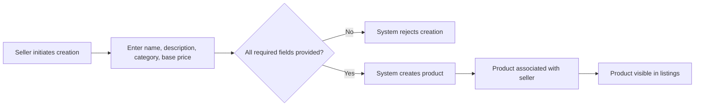

### Product Editing and Snapshot Creation

### Product Editing and Snapshot Creation

WHEN a seller edits their product, THE system SHALL create a snapshot preserving the previous state.

WHEN a product snapshot is created, THE system SHALL record the timestamp of the change.

WHEN a product snapshot is created, THE system SHALL record which fields were modified.

WHEN a product snapshot is created, THE system SHALL record the values before and after the change.

WHEN a product snapshot is created, THE system SHALL make it immutable and non-deletable.

IF a seller attempts to edit another seller's product, THE system SHALL reject the request.

WHEN a product is edited, THE system SHALL update the current product state while preserving all historical snapshots.

THE system SHALL allow the product owner (seller) to view snapshots of their own products.

THE system SHALL allow administrators to view snapshots of any product.

### Product Deletion Conditions and Snapshot Preservation

### Product Deletion Conditions and Snapshot Preservation

WHEN a seller requests to delete a product, THE system SHALL verify no pending order items exist for any variant of the product.

WHEN a seller requests to delete a product, THE system SHALL verify no pending cancellation requests exist for any variant of the product.

WHEN a seller requests to delete a product, THE system SHALL verify no pending refund requests exist for any variant of the product.

IF any pending order items, cancellation requests, or refund requests exist, THE system SHALL reject the deletion request.

WHEN a product is deleted, THE system SHALL remove the product from search results.

WHEN a product is deleted, THE system SHALL remove the product from category listings.

WHEN a product is deleted, THE system SHALL delete all variants of the product.

WHEN a product is deleted, THE system SHALL delete all inventory records associated with the product's variants.

WHEN a product is deleted, THE system SHALL preserve all product snapshots for historical records.

WHEN a product is deleted, THE system SHALL automatically remove the product from all customer wishlists.

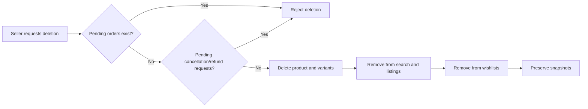

### Product Search Functionality

### Product Search Functionality

WHEN a customer searches for products, THE system SHALL allow searching by product name.

WHEN displaying search results, THE system SHALL include products from all sellers.

WHEN a customer filters search results by category, THE system SHALL display only products within the selected category or its subcategories.

WHEN a customer filters search results by price range, THE system SHALL display only products with prices within the specified minimum and maximum values.

WHEN a customer filters search results by in-stock only, THE system SHALL display only products that have at least one variant with stock quantity greater than zero.

WHEN a customer sorts search results by newest, THE system SHALL display products ordered by creation date in descending order.

WHEN a customer sorts search results by price low to high, THE system SHALL display products ordered by price in ascending order.

WHEN a customer sorts search results by price high to low, THE system SHALL display products ordered by price in descending order.

WHEN displaying search results, THE system SHALL paginate the results.

IF no products match the search criteria, THE system SHALL display an empty result message.

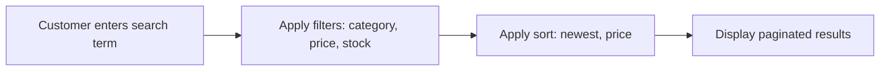

### Product Listing Display

### Product Listing Display

WHEN displaying a product in a listing, THE system SHALL show the main image as a thumbnail.

WHEN displaying a product in a listing, THE system SHALL show the product name.

WHEN displaying a product in a listing, THE system SHALL show the base price.

IF a product has variants with different prices, THE system SHALL display a price range instead of a single base price.

WHEN displaying a product in a listing, THE system SHALL show the seller's shop name.

WHEN displaying a product in a listing, THE system SHALL show the average rating if the product has reviews.

IF a product has no reviews, THE system SHALL not display any rating information.

WHEN displaying a product in a listing, THE system SHALL allow customers to click through to view the product detail page.

### Product Detail Page View

### Product Detail Page View

WHEN a customer views a product detail page, THE system SHALL display all product images.

WHEN a customer views a product detail page, THE system SHALL display the product name.

WHEN a customer views a product detail page, THE system SHALL display the full product description.

WHEN a customer views a product detail page, THE system SHALL display the product category.

WHEN a customer views a product detail page, THE system SHALL display the seller's shop name.

WHEN a customer views a product detail page, THE system SHALL provide a link to the seller's profile page.

WHEN a customer views a product detail page, THE system SHALL display all available variants with their respective prices.

WHEN a customer views a product detail page, THE system SHALL display the stock status for each variant.

WHEN a customer views a product detail page, THE system SHALL display the average rating based on all non-deleted reviews.

WHEN a customer views a product detail page, THE system SHALL display the total count of reviews.

WHEN a customer views a product detail page, THE system SHALL display all reviews sorted by creation date in descending order.

IF a product has no variants, THE system SHALL display the product as unavailable for purchase.

IF all variants have zero stock, THE system SHALL display the product as out of stock.

## ProductImage Actions

Sellers upload multiple images for each product to showcase different angles and details. Images can be reordered by sellers to control display sequence. The first image in the sequence serves as the main thumbnail displayed in search results and product listings. Sellers delete images from products when they are no longer needed or appropriate. Image changes including uploads, reordering, and deletions are captured in product snapshots. Snapshots preserve the complete image state at each point in time. Product images help customers evaluate products before purchase. Image display order determines which image appears first in product detail view.

### Image Upload Workflow

WHEN a seller uploads an image for their product, THE system SHALL:
1. Associate the image with the specified product
2. Record the upload timestamp
3. Assign a display order based on existing images
4. Require the seller to be the owner of the product

IF the seller is not the owner of the product, THE system SHALL reject the upload.

IF the seller's account is suspended, THE system SHALL reject the upload.

THE system SHALL allow sellers to upload multiple images per product.

WHEN a seller uploads the first image for a product, THE system SHALL set it as the main thumbnail image.

WHEN a seller uploads an additional image to a product that already has images, THE system SHALL place it at the end of the display order.

### Multiple Image Support

THE system SHALL support multiple images per product.

WHEN a customer views a product listing in search results or category pages, THE system SHALL display the main thumbnail image.

WHEN a customer views a product detail page, THE system SHALL display all images associated with the product.

THE system SHALL preserve all images when a product is edited, unless explicitly modified by the seller.

WHEN a product has no images, THE system SHALL display a placeholder indicator in product listings.

THE system SHALL allow customers to view all product images in the order determined by the seller.

### Display Order Management

THE system SHALL maintain a display order for each image within a product.

WHEN a seller changes the display order of images, THE system SHALL:
1. Update the order for all affected images
2. Record the new order sequence
3. Trigger a product snapshot creation

THE system SHALL allow sellers to reorder images at any time.

WHEN display order is changed, THE system SHALL immediately reflect the new order in product listings and detail pages.

### Main Thumbnail Selection

THE system SHALL designate the first image in display order as the main thumbnail.

WHEN the first image in display order is deleted, THE system SHALL automatically designate the next image in order as the main thumbnail.

IF a product has no images, THE system SHALL display no thumbnail in product listings.

WHEN a seller reorders images to make a different image first, THE system SHALL update the main thumbnail for the product.

THE system SHALL display the main thumbnail in:
1. Search results
2. Category listings
3. Wishlist displays
4. Order history items

### Image Deletion Process

WHEN a seller deletes an image from their product, THE system SHALL:
1. Remove the image from the product's image list
2. Adjust display order of remaining images
3. Trigger a product snapshot creation
4. Update the main thumbnail if the deleted image was first

IF the seller is not the owner of the product, THE system SHALL reject the deletion.

IF the seller's account is suspended, THE system SHALL reject the deletion.

THE system SHALL allow deletion of any image regardless of its position in the display order.

WHEN all images are deleted from a product, THE system SHALL display the product with no thumbnail in listings.

### Image Change Snapshot

WHEN a seller uploads a new image, THE system SHALL include the image change in the next product snapshot.

WHEN a seller reorders images, THE system SHALL include the new order in the next product snapshot.

WHEN a seller deletes an image, THE system SHALL include the deletion in the next product snapshot.

THE system SHALL capture the complete image state in product snapshots, including:
1. All image URLs at the time of snapshot
2. Display order of each image
3. Which image is the main thumbnail

THE system SHALL preserve image snapshots for dispute resolution purposes.

### Image State Preservation

THE system SHALL preserve the image state at the time of purchase in order item snapshots.

WHEN an order is placed, THE system SHALL capture the product images as they appeared at that moment.

THE system SHALL allow sellers and administrators to view historical image states through product snapshots.

THE system SHALL maintain immutability of image snapshots once created.

THE system SHALL preserve image snapshots even after the original product or images are deleted.

### Product Showcase Images

THE system SHALL display product images to help customers evaluate products before purchase.

WHEN a customer views a product detail page, THE system SHALL show all images in the display order set by the seller.

THE system SHALL allow customers to navigate through all product images.

THE system SHALL ensure image changes by sellers do not affect existing order snapshots.

WHEN a product is displayed in any context, THE system SHALL use the current main thumbnail for visual representation.

## ProductVariant Actions

Products can have multiple variants representing specific option combinations such as color and size. Each variant has a unique SKU code, option values, optional price override, and stock quantity. Sellers create variants by specifying all required attributes. Sellers edit variants to change SKU codes, option values, or price overrides. Every variant edit creates a snapshot preserving the previous variant state. Sellers delete variants only when no pending orders exist for that variant and no pending cancellation or refund requests are open. Products without variants are visible in search but shown as unavailable for purchase. Stock quantity starts at zero and is managed through inventory records. When stock reaches zero, the variant displays as out of stock. Out of stock variants cannot be added to customer carts.

### Variant Creation Workflow

WHEN a seller creates a product variant, THE system SHALL require the seller to specify a unique SKU code.

WHEN a seller creates a product variant, THE system SHALL require the seller to specify option values representing a specific combination such as color and size.

WHEN a seller creates a product variant, THE system SHALL allow the seller to optionally specify a price that overrides the product's base price.

WHEN a seller creates a product variant, THE system SHALL initialize the stock quantity to zero.

WHEN a seller creates a product variant, THE system SHALL associate the variant with the product.

WHEN a seller creates a product variant with a SKU code that already exists, THE system SHALL reject the creation request.

WHEN a seller creates a product variant, THE system SHALL record the creation timestamp.

THE system SHALL allow sellers to create multiple variants for a single product.

WHEN a product has no variants, THE system SHALL display the product as unavailable for purchase.

### SKU Code Assignment

WHEN a seller assigns a SKU code to a variant, THE system SHALL require the SKU code to be unique across all variants on the platform.

WHEN a seller assigns a SKU code to a variant, THE system SHALL store the SKU code as the unique identifier for that variant.

WHEN a seller edits a variant's SKU code, THE system SHALL verify the new SKU code does not already exist.

IF the new SKU code already exists, THE system SHALL reject the edit request.

WHEN a seller successfully changes a SKU code, THE system SHALL create a snapshot preserving the previous variant state.

THE system SHALL use the SKU code to identify specific product variants in orders, inventory records, and cart items.

### Option Value Combinations

WHEN a seller creates a variant, THE system SHALL allow the seller to specify multiple option values representing a specific combination.

WHEN a seller specifies option values, THE system SHALL store each option value as a key-value pair such as color: Red and size: Large.

THE system SHALL allow different variants of the same product to have different option value combinations.

THE system SHALL display option values to customers when viewing product details and selecting variants for purchase.

WHEN a seller edits option values, THE system SHALL create a snapshot preserving the previous option values.

THE system SHALL preserve option values in order item snapshots at the time of purchase for historical accuracy.

### Price Override Setting

WHEN a seller sets a variant price, THE system SHALL allow the seller to specify a price that overrides the product's base price.

IF a variant has no price override specified, THE system SHALL use the product's base price as the variant's effective price.

WHEN a seller modifies a variant's price, THE system SHALL create a snapshot preserving the previous price.

THE system SHALL display the variant's effective price to customers on the product detail page.

WHEN a product has variants with different prices, THE system SHALL display a price range in product listings.

THE system SHALL preserve the variant's effective price in order item snapshots at the time of purchase.

### Stock Quantity Management

THE system SHALL calculate each variant's stock quantity by summing all inventory records for that variant.

WHEN a seller restocks a variant, THE system SHALL create an inventory record with a positive quantity change.

WHEN a seller adjusts inventory downward for a variant, THE system SHALL create an inventory record with a negative quantity change.

WHEN an order is placed for a variant, THE system SHALL automatically create an inventory record with a negative quantity change equal to the ordered quantity.

WHEN an order item is cancelled or refunded, THE system SHALL automatically create an inventory record with a positive quantity change to restore stock.

WHEN a variant's stock quantity reaches zero, THE system SHALL display the variant as out of stock.

THE system SHALL prevent inventory records from being modified or deleted after creation.

Sellers can view the complete inventory history for each variant, including quantity changes, reasons, and timestamps.

### Variant Editing Snapshot

WHEN a seller edits a variant's SKU code, THE system SHALL create a snapshot preserving the previous SKU code.

WHEN a seller edits a variant's option values, THE system SHALL create a snapshot preserving the previous option values.

WHEN a seller edits a variant's price, THE system SHALL create a snapshot preserving the previous price.

THE system SHALL record in each snapshot the timestamp of the change.

THE system SHALL record in each snapshot the values before and after the change.

THE system SHALL make snapshots immutable and prevent deletion.

Sellers can view snapshots of their own variants.

Administrators can view snapshots of any variant.

### Variant Deletion Conditions

WHEN a seller attempts to delete a variant, THE system SHALL check for pending order items with status paid or shipped for that variant.

IF pending order items exist for the variant, THE system SHALL reject the deletion request.

WHEN a seller attempts to delete a variant, THE system SHALL check for pending cancellation requests for that variant.

IF pending cancellation requests exist for the variant, THE system SHALL reject the deletion request.

WHEN a seller attempts to delete a variant, THE system SHALL check for pending refund requests for that variant.

IF pending refund requests exist for the variant, THE system SHALL reject the deletion request.

IF the variant has no pending orders, cancellations, or refunds, THE system SHALL allow the seller to delete the variant.

WHEN a variant is deleted, THE system SHALL remove it from product listings and search results.

IF a seller deletes all variants from a product, THE system SHALL display the product as unavailable for purchase.

### Unavailable Product Status

WHEN a product has zero variants, THE system SHALL display the product as unavailable for purchase in search results and category listings.

WHEN a product has zero variants, THE system SHALL still allow the product to appear in search results and category listings.

WHEN a customer views a product with zero variants, THE system SHALL display a message indicating the product is unavailable for purchase.

THE system SHALL prevent customers from adding products with zero variants to their cart.

WHEN all variants of a product are deleted, THE system SHALL update the product's purchase availability status to unavailable.

THE system SHALL preserve product information including name, description, images, and category regardless of variant availability.

### Out of Stock Display

WHEN a variant's stock quantity is zero, THE system SHALL display the variant as out of stock on the product detail page.

WHEN a variant is out of stock, THE system SHALL prevent customers from adding the variant to their cart.

WHEN a variant is out of stock, THE system SHALL still display the variant information including name, option values, and price.

IF a variant in a customer's cart becomes out of stock before checkout, THE system SHALL mark the cart item as unavailable and prevent checkout for that item.

THE system SHALL allow sellers to view out of stock variants in their product management interface.

WHEN a variant's stock quantity is greater than zero, THE system SHALL allow customers to add the variant to their cart.

### Variant Purchase Restriction

THE system SHALL require customers to select a specific variant when adding a product to their cart.

WHEN a customer attempts to add an out of stock variant to their cart, THE system SHALL reject the request.

WHEN a customer adds a variant to their cart with a quantity exceeding the available stock, THE system SHALL display a warning.

WHEN a customer attempts to check out with a cart item whose stock is insufficient, THE system SHALL prevent checkout for that item.

WHEN a variant is deleted while in a customer's cart, THE system SHALL mark the cart item as unavailable.

THE system SHALL prevent checkout for cart items marked as unavailable.

WHEN a customer views their cart, THE system SHALL display stock warnings for items where the cart quantity exceeds available stock.

### Variant Stock Tracking

THE system SHALL maintain a complete inventory history for each variant through inventory records.

Each inventory record SHALL contain the quantity change, reason, and timestamp.

Positive quantity changes SHALL represent inventory increases such as restocking.

Negative quantity changes SHALL represent inventory decreases such as orders and adjustments.

THE system SHALL calculate current stock as the sum of all inventory records for a variant.

WHEN an order is placed, THE system SHALL automatically create an inventory record with a negative quantity change.

WHEN an order item is cancelled, THE system SHALL automatically create an inventory record with a positive quantity change.

WHEN an order item is refunded, THE system SHALL automatically create an inventory record with a positive quantity change.

Sellers can view the complete inventory history including all past quantity changes and their reasons.

## ProductSnapshot Actions

Snapshots capture the complete state of a product at a specific moment in time. Every product edit automatically creates a snapshot recording what changed, when, and the previous values. Product snapshots include all product fields: name, description, category, base price, and images. Snapshots also capture the state of all variants at that moment, preserving complete product-variant relationships. Snapshots are immutable and cannot be modified or deleted even after product deletion. Sellers view snapshots of their own products for historical tracking and dispute resolution. Administrators view snapshots of any product on the platform. Snapshots serve as authoritative records for transaction disputes. When orders are placed, product snapshots are attached to order items to preserve the exact state at purchase time.

### Automatic Snapshot Creation Trigger

WHEN a seller edits any field of their product, THE system SHALL automatically create a product snapshot capturing the complete state before the modification.

WHEN a seller modifies the product name, THE system SHALL trigger snapshot creation.

WHEN a seller modifies the product description, THE system SHALL trigger snapshot creation.

WHEN a seller changes the product category, THE system SHALL trigger snapshot creation.

WHEN a seller modifies the product base price, THE system SHALL trigger snapshot creation.

WHEN a seller adds, removes, or reorders product images, THE system SHALL trigger snapshot creation.

WHEN a seller adds, edits, or deletes a product variant, THE system SHALL trigger snapshot creation.

IF a snapshot creation fails, THE system SHALL NOT apply the product modification.

THE system SHALL create exactly one snapshot per edit action, regardless of how many fields were changed in that action.

### Product State Preservation

WHEN the system creates a product snapshot, THE system SHALL preserve the product name at that moment.

WHEN the system creates a product snapshot, THE system SHALL preserve the product description at that moment.

WHEN the system creates a product snapshot, THE system SHALL preserve the product category reference at that moment.

WHEN the system creates a product snapshot, THE system SHALL preserve the product base price at that moment.

WHEN the system creates a product snapshot, THE system SHALL preserve all product images with their display order at that moment.

WHEN the system creates a product snapshot, THE system SHALL record the timestamp of when the snapshot was created.

WHEN the system creates a product snapshot, THE system SHALL record which edit action triggered the snapshot creation.

THE system SHALL preserve all product snapshot records even after the original product is deleted.

### Variant State Capture

WHEN the system creates a product snapshot, THE system SHALL also capture the state of all variants belonging to that product at that moment.

WHEN capturing variant state, THE system SHALL preserve each variant's SKU code.

WHEN capturing variant state, THE system SHALL preserve each variant's option values.

WHEN capturing variant state, THE system SHALL preserve each variant's price override setting.

WHEN capturing variant state, THE system SHALL preserve each variant's current stock quantity.

THE system SHALL link all captured variant states to the parent product snapshot.

IF a product has no variants at the time of snapshot creation, THE system SHALL create the product snapshot with no variant states attached.

THE system SHALL preserve variant state records even after the original variant is deleted.

### Snapshot Immutability Guarantee

THE system SHALL NOT allow modification of any product snapshot after it has been created.

THE system SHALL NOT allow modification of any variant state record attached to a snapshot.

THE system SHALL NOT allow deletion of product snapshots by any user including administrators.

THE system SHALL NOT allow deletion of variant state records attached to snapshots by any user.

IF a user attempts to modify or delete a snapshot, THE system SHALL reject the request.

THE system SHALL preserve all snapshots indefinitely for audit and dispute resolution purposes.

THE system SHALL maintain snapshots as permanent records that survive product deletion, variant deletion, and seller account deletion.

### Seller Snapshot Viewing Access

WHEN a seller views their own product details, THE system SHALL provide access to view the snapshot history of that product.

WHEN a seller requests to view snapshots of their product, THE system SHALL display each snapshot with its creation timestamp.

WHEN a seller views a snapshot, THE system SHALL display the complete product state as it existed at that moment.

WHEN a seller views a snapshot, THE system SHALL display all variant states captured with that snapshot.

THE system SHALL NOT allow a seller to view snapshots of products belonging to other sellers.

IF a seller attempts to access snapshots of another seller's product, THE system SHALL reject the request.

WHEN a product is deleted, THE system SHALL continue to allow the former product owner to view the preserved snapshots.

### Administrator Snapshot Oversight

WHEN an administrator views any product on the platform, THE system SHALL provide access to view the complete snapshot history of that product.

WHEN an administrator requests to view snapshots of any product, THE system SHALL display each snapshot with its creation timestamp.

WHEN an administrator views a snapshot, THE system SHALL display the complete product state and all variant states captured.

THE system SHALL allow administrators to view snapshots of products from all sellers.

THE system SHALL allow administrators to view snapshots of deleted products.

WHEN an administrator views snapshots, THE system SHALL display the seller who owned the product at the time of each snapshot.

THE system SHALL provide administrators with filtering and search capabilities to locate specific snapshots across the platform.

### Dispute Resolution Record

WHEN a dispute arises regarding a product's state at a specific time, THE system SHALL provide the relevant product snapshot as authoritative evidence.

WHEN a seller or administrator reviews a snapshot for dispute resolution, THE system SHALL display all preserved fields in their original state.

THE system SHALL allow snapshots to be referenced in cancellation and refund request proceedings.

WHEN a dispute involves variant-specific details, THE system SHALL provide the variant state records captured in the relevant snapshot.

THE system SHALL guarantee that snapshot data has not been modified since creation for use as reliable evidence.

THE system SHALL provide timestamps on all snapshots to establish clear timelines for dispute resolution.

WHEN a dispute involves order items, THE system SHALL link order item snapshots to the original product snapshots for comparison.

### Order Item Snapshot Attachment

WHEN an order is placed successfully, THE system SHALL create a snapshot for each distinct product variant in the order.

WHEN creating an order item snapshot, THE system SHALL capture the product name as it existed at the time of purchase.

WHEN creating an order item snapshot, THE system SHALL capture the product description as it existed at the time of purchase.

WHEN creating an order item snapshot, THE system SHALL capture the variant options as they existed at the time of purchase.

WHEN creating an order item snapshot, THE system SHALL capture the price paid at the time of purchase.

WHEN creating an order item snapshot, THE system SHALL capture the seller's shop name at the time of purchase.

WHEN a customer views their order history, THE system SHALL display the product information from the order item snapshot, not the current product state.

IF a product is deleted after an order is placed, THE system SHALL preserve the order item snapshots for the customer to view their purchase history.

### Historical State Tracking

WHEN a seller or administrator views a product's snapshot history, THE system SHALL display all snapshots in chronological order.

WHEN viewing snapshot history, THE system SHALL indicate what fields changed between consecutive snapshots.

THE system SHALL maintain a complete audit trail of all product modifications through snapshot records.

WHEN a product has been edited multiple times, THE system SHALL provide navigation to view each historical snapshot.

THE system SHALL support comparison between any two snapshots of the same product.

WHEN comparing snapshots, THE system SHALL highlight differences in product fields and variant states.

THE system SHALL retain all historical snapshots regardless of the number of edits made to a product.

THE system SHALL use snapshot history as the authoritative record of a product's evolution over time.

## InventoryRecord Actions

Inventory records track all stock quantity changes for each product variant. Each record contains the quantity change amount, reason for the change, and timestamp. Positive quantity changes represent restocking by sellers. Negative quantity changes represent deductions from orders, losses, or adjustments. Current stock is calculated by summing all inventory records for a variant. Sellers add inventory through restocking actions with a specified quantity and reason. Sellers subtract inventory through adjustment actions for losses or corrections. Order placement automatically creates negative inventory records for each purchased variant. Order cancellation creates positive inventory records to restore stock. Refund processing creates positive inventory records to restore stock. Sellers view complete inventory history for each variant to track stock movements over time.

### Inventory Restock Action

WHEN a seller adds inventory to a product variant, THE system SHALL create an inventory record with a positive quantity change.

WHEN a seller performs a restock action, THE system SHALL require the seller to provide a reason for the inventory addition.

WHEN a seller restocks inventory, THE system SHALL record the current timestamp in the inventory record.

WHEN a seller restocks inventory, THE system SHALL associate the inventory record with the specific product variant.

THE system SHALL calculate the updated stock quantity by summing all inventory records for the variant after the restock.

WHEN inventory is restocked, THE system SHALL update the variant's availability status if stock was previously zero.

IF a restock quantity is zero or negative, THE system SHALL reject the request.

### Inventory Adjustment Action

WHEN a seller subtracts inventory from a product variant, THE system SHALL create an inventory record with a negative quantity change.

WHEN a seller performs an inventory adjustment, THE system SHALL require the seller to provide a reason for the subtraction.

WHEN a seller adjusts inventory downward, THE system SHALL record the current timestamp in the inventory record.

WHEN a seller adjusts inventory, THE system SHALL associate the inventory record with the specific product variant.

THE system SHALL calculate the updated stock quantity by summing all inventory records for the variant after the adjustment.

IF an adjustment would result in negative stock, THE system SHALL reject the request.

WHEN an adjustment causes stock to reach zero, THE system SHALL mark the variant as out of stock.

### Automatic Order Placement Deduction

WHEN an order is successfully placed, THE system SHALL automatically create negative inventory records for each purchased variant.

WHEN creating an inventory record for an order, THE system SHALL set the quantity change to the negative of the ordered quantity.

WHEN creating an inventory record for an order, THE system SHALL record "Order placement" as the reason.

WHEN creating an inventory record for an order, THE system SHALL record the current timestamp.

WHEN order placement deducts inventory, THE system SHALL associate the inventory record with the corresponding product variant.

THE system SHALL calculate the updated stock quantity by summing all inventory records immediately after order placement.

### Automatic Cancellation Stock Restoration

WHEN a seller approves a cancellation request for an order item, THE system SHALL automatically create a positive inventory record.

WHEN creating an inventory record for cancellation, THE system SHALL set the quantity change to the positive quantity of the cancelled item.

WHEN creating an inventory record for cancellation, THE system SHALL record "Order cancellation" as the reason.

WHEN creating an inventory record for cancellation, THE system SHALL record the current timestamp.

WHEN cancellation restores inventory, THE system SHALL associate the inventory record with the corresponding product variant.

THE system SHALL calculate the updated stock quantity by summing all inventory records immediately after cancellation processing.

### Automatic Refund Stock Restoration

WHEN a seller approves a refund request for an order item, THE system SHALL automatically create a positive inventory record.

WHEN creating an inventory record for refund, THE system SHALL set the quantity change to the positive quantity of the refunded item.

WHEN creating an inventory record for refund, THE system SHALL record "Refund processing" as the reason.

WHEN creating an inventory record for refund, THE system SHALL record the current timestamp.

WHEN refund processing restores inventory, THE system SHALL associate the inventory record with the corresponding product variant.

THE system SHALL calculate the updated stock quantity by summing all inventory records immediately after refund processing.

### Inventory History Viewing

WHEN a seller views the inventory history for a product variant, THE system SHALL display all inventory records for that variant.

WHEN displaying inventory history, THE system SHALL show each record's quantity change amount.

WHEN displaying inventory history, THE system SHALL show each record's reason.

WHEN displaying inventory history, THE system SHALL show each record's timestamp.

THE system SHALL display inventory history records sorted by timestamp in descending order (newest first).

THE system SHALL indicate whether each quantity change was positive (addition) or negative (subtraction).

### Stock Calculation Method

THE system SHALL calculate current stock for a product variant by summing the quantity change values of all inventory records for that variant.

WHEN calculating stock, THE system SHALL include all inventory records regardless of their reason.

WHEN calculating stock, THE system SHALL include both manual and automatic inventory records.

THE system SHALL not store a separate stock quantity field but derive it from inventory record summation.

IF the sum of inventory records for a variant equals zero, THE system SHALL mark the variant as out of stock.

IF the sum of inventory records for a variant is greater than zero, THE system SHALL display the variant as available for purchase.

### Quantity Change Tracking

THE system SHALL record every stock quantity change as an immutable inventory record.

THE system SHALL prevent modification or deletion of any inventory record after creation.

WHEN an inventory record is created, THE system SHALL capture the exact quantity change amount.

THE system SHALL maintain the chronological order of inventory records by timestamp.

THE system SHALL track quantity changes separately for each product variant.

THE system SHALL preserve all inventory records even after product deletion for audit purposes.

### Reason Documentation Requirements

WHEN a seller manually creates an inventory record, THE system SHALL require a reason text input.

WHEN the system automatically creates an inventory record, THE system SHALL populate the reason with a descriptive system-generated value.

THE system SHALL support the following system-generated reasons: "Order placement", "Order cancellation", and "Refund processing".

WHEN a seller enters a reason, THE system SHALL store the reason as text in the inventory record.

IF a seller attempts to create a manual inventory record without a reason, THE system SHALL reject the request.

THE system SHALL display the reason alongside each inventory record in the history view.

## Cart Actions

Customers add product variants to their cart by selecting a specific variant and specifying quantity. When adding the same variant again, quantities are combined into a single cart item rather than creating duplicate entries. Customers view their cart to see all items with product names, variant options, prices, quantities, and subtotals. The cart displays the total price of all items. Customers proceed to checkout when ready to purchase. Items marked as unavailable due to stock issues or variant deletion cannot be checked out. If a variant's stock is less than the cart quantity, a warning is displayed but checkout can proceed. If a variant is deleted or out of stock, it is marked as unavailable in the cart. Cart contents are updated when customers change quantities or remove items. Successful order creation removes purchased items from the cart.

### Adding Items to Cart

### Cart Item Addition

WHEN a customer adds a product variant to their cart, THE system SHALL:
1. Require selection of a specific product variant (not just the product)
2. Require specification of quantity
3. Create a cart item associated with the customer's cart
4. Capture the variant's current price at the time of addition

### Quantity Combination Logic

WHEN a customer adds a variant that already exists in their cart, THE system SHALL:
1. Combine the new quantity with the existing cart item quantity
2. Update the single cart item with the total quantity
3. NOT create a duplicate cart item entry

IF the combined quantity exceeds available stock, THE system SHALL display a warning to the customer.

### Initial Stock Validation

WHEN a customer adds a variant to their cart, THE system SHALL:
1. Verify the variant exists and is not deleted
2. Verify the variant has stock quantity greater than zero
3. Allow addition even if quantity exceeds current stock
4. Display a warning if the requested quantity exceeds available stock

### Viewing Cart Contents

### Cart Viewing Display

WHEN a customer views their cart, THE system SHALL display:
1. All cart items with product name, variant options, and current price
2. Quantity for each cart item
3. Subtotal for each cart item (price × quantity)
4. Overall cart total price
5. Stock status indicators for each item

THE system SHALL show items in the order they were added (oldest first).

### Total Price Calculation

THE system SHALL calculate the cart total by summing all cart item subtotals.

WHEN calculating item subtotals, THE system SHALL use the price captured at the time of cart item addition.

IF a variant's price has changed since being added to the cart, THE system SHALL display a notification indicating the price difference.

### Price Updates

WHEN a variant's price is updated by the seller, THE system SHALL:
1. Preserve the original price in existing cart items
2. Display the current price alongside the cart item price
3. Allow the customer to remove and re-add the item to get the new price

### Stock and Availability Management

### Stock Warning Display

WHEN a customer views their cart, THE system SHALL:
1. Compare each cart item quantity against current variant stock
2. Display a warning if cart quantity exceeds available stock
3. Display a warning if stock is low (less than 5 units remaining)
4. Indicate which items have stock warnings

### Out of Stock Marking

WHEN a variant's stock reaches zero or is deleted, THE system SHALL:
1. Mark the corresponding cart item as unavailable
2. Display the item with an unavailable status indicator
3. Prevent checkout of unavailable items
4. Retain the cart item for customer reference

IF a variant is deleted by the seller, THE system SHALL mark the cart item as unavailable with a deleted variant indicator.

### Unavailable Item Handling

THE system SHALL track unavailable status separately for:
1. Out of stock variants (stock = 0)
2. Deleted variants
3. Discontinued products

WHEN an item is marked unavailable, THE system SHALL display a clear message explaining why the item cannot be purchased.

### Cart Item Management

### Quantity Modification

WHEN a customer changes the quantity of a cart item, THE system SHALL:
1. Update the cart item with the new quantity
2. Recalculate the item subtotal
3. Recalculate the cart total
4. Apply stock validation to the new quantity

IF the new quantity is set to zero, THE system SHALL remove the cart item.

IF the new quantity exceeds available stock, THE system SHALL display a warning.

### Cart Item Removal

WHEN a customer removes an item from their cart, THE system SHALL:
1. Delete the cart item from the cart
2. Recalculate the cart total
3. Not affect the variant's stock quantity

THE system SHALL NOT require confirmation for item removal.

### Cart Persistence

THE system SHALL persist cart contents across customer sessions.

WHEN a customer logs in from a different device or session, THE system SHALL restore their cart contents.

### Checkout Initiation

### Checkout Initiation Process

WHEN a customer proceeds to checkout, THE system SHALL:
1. Re-validate all cart item availability
2. Block checkout if any unavailable items exist in the cart
3. Require the customer to remove or update unavailable items before checkout
4. Display a clear list of unavailable items preventing checkout

### Pre-Checkout Validation

WHEN a customer initiates checkout, THE system SHALL verify:
1. At least one cart item exists
2. All cart items are available (not marked unavailable)
3. All variants still exist and are not deleted
4. All variants have stock quantity greater than zero

IF any validation fails, THE system SHALL prevent checkout and display specific error messages.

### Checkout Blocking Rules

THE system SHALL block checkout when:
1. The cart is empty
2. Any cart item has unavailable status
3. Any variant has been deleted
4. Any variant has zero stock

IF checkout is blocked, THE system SHALL allow the customer to:
1. Remove unavailable items
2. Adjust quantities to available stock levels
3. Clear the cart entirely

### Post-Purchase Cart Management

### Order Creation Cart Clear

WHEN an order is successfully created, THE system SHALL:
1. Remove all purchased items from the customer's cart
2. Remove only the items included in the order
3. Retain any items not included in the order

### Partial Order Handling

IF an order contains only some cart items (due to checkout blocking or customer selection), THE system SHALL:
1. Remove only the items included in the order
2. Retain unpurchased items in the cart
3. Recalculate the cart total for remaining items

### Failed Payment Cart Retention

WHEN payment fails during checkout, THE system SHALL:
1. Retain all cart items
2. Not modify cart contents
3. Allow the customer to retry payment
4. Allow the customer to modify cart contents and retry

## CartItem Actions

Cart items represent specific product variants with a quantity selected by the customer. Customers specify the quantity when adding a variant to the cart. If the same variant is added again, the new quantity is added to the existing cart item's quantity. Customers view each cart item with product name, variant option values, price per unit, quantity, and subtotal. Customers change the quantity of cart items to increase or decrease their order amount. Customers remove individual cart items when they no longer want to purchase them. Cart items display warnings when variant stock is insufficient for the requested quantity. Cart items are marked unavailable when the variant has been deleted or is out of stock. Each cart item links to its associated product and variant for navigation. Cart items are converted to order items when an order is successfully placed.

### Variant Selection for Cart

### Variant Selection Requirement

WHEN a customer adds a product to their cart, THE system SHALL require selection of a specific product variant.

IF the customer attempts to add a product without selecting a variant, THE system SHALL reject the request.

WHEN a customer selects a variant for cart addition, THE system SHALL validate that the variant belongs to the product being viewed.

IF the selected variant does not exist or does not belong to the product, THE system SHALL reject the request.

WHEN a customer adds a variant to cart, THE system SHALL check the stock quantity of that variant.

IF the variant stock quantity is zero, THE system SHALL prevent the variant from being added to the cart.

### Variant Identification

WHEN a variant is added to cart, THE system SHALL store the unique SKU code of the variant.

THE system SHALL maintain the association between the cart item and its product variant for navigation purposes.

WHEN displaying a cart item, THE system SHALL provide a link to the associated product detail page.

### Quantity Specification

### Initial Quantity Entry

WHEN a customer adds a variant to the cart, THE system SHALL require the customer to specify a quantity.

IF the quantity is not specified or is less than one, THE system SHALL reject the request.

WHEN a customer specifies a quantity for a new cart item, THE system SHALL set the initial quantity to the specified value.

### Quantity Combination

WHEN a customer adds a variant that already exists in their cart, THE system SHALL combine the new quantity with the existing cart item quantity.

WHEN quantities are combined, THE system SHALL NOT create a duplicate cart item for the same variant.

WHEN quantities are combined, THE system SHALL set the total quantity to the sum of the existing quantity and the new quantity.

### Stock Validation

WHEN a quantity is specified or combined, THE system SHALL validate the quantity against the variant's current stock.

IF the specified or combined quantity exceeds the available stock, THE system SHALL allow the addition but display an insufficient stock warning (defined in Insufficient Stock Warning section).

### Quantity Increase Workflow

### Quantity Increase Action

WHEN a customer increases the quantity of a cart item, THE system SHALL update the cart item quantity to the new value.

WHEN a quantity is increased, THE system SHALL recalculate the subtotal for that cart item.

WHEN a quantity is increased, THE system SHALL update the cart's total price.

### Stock Validation on Increase

WHEN a customer increases a cart item quantity, THE system SHALL check if the new quantity exceeds the available stock.

IF the new quantity exceeds available stock, THE system SHALL still update the quantity and display an insufficient stock warning.

### Maximum Quantity

WHEN a customer increases quantity, THE system SHALL validate that the quantity remains a positive integer.

IF the customer enters a non-integer value, THE system SHALL reject the request.

### Quantity Decrease Workflow

### Quantity Decrease Action

WHEN a customer decreases the quantity of a cart item, THE system SHALL update the cart item quantity to the new value.

WHEN a quantity is decreased, THE system SHALL recalculate the subtotal for that cart item.

WHEN a quantity is decreased, THE system SHALL update the cart's total price.

### Minimum Quantity

IF the customer attempts to decrease the quantity below one, THE system SHALL treat this as a removal request and remove the cart item.

WHEN a quantity is decreased to one, THE system SHALL allow the cart item to remain in the cart.

### Automatic Removal

IF the customer sets the quantity to zero, THE system SHALL automatically remove the cart item from the cart.

### Item Removal Action

### Removal Initiation

WHEN a customer removes a cart item, THE system SHALL delete the cart item from the cart.

WHEN a cart item is removed, THE system SHALL recalculate the cart's total price.

WHEN a cart item is removed, THE system SHALL update the cart's item count.

### Removal Confirmation

WHEN a customer removes a cart item, THE system SHALL confirm the removal was successful.

### Stock Impact

WHEN a cart item is removed, THE system SHALL NOT modify the stock quantity of the associated variant.

Stock quantities are only modified when orders are placed, cancelled, or refunded (defined in InventoryRecord Operations).

### Insufficient Stock Warning

### Warning Display Condition

WHEN a cart item's quantity exceeds the variant's available stock, THE system SHALL display an insufficient stock warning for that item.

THE system SHALL display the warning prominently on the affected cart item.

### Warning Information

WHEN displaying an insufficient stock warning, THE system SHALL show the available stock quantity.

WHEN displaying an insufficient stock warning, THE system SHALL indicate that the item cannot be checked out until the quantity is adjusted.

### Checkout Blocking

IF any cart item has a quantity exceeding available stock, THE system SHALL prevent checkout of that item.

WHEN attempting to checkout with insufficient stock items, THE system SHALL display an error message identifying which items cannot be checked out.

### Warning Resolution

WHEN a customer adjusts the quantity to be equal to or less than available stock, THE system SHALL remove the insufficient stock warning from that item.

### Variant Deletion Marking

### Deleted Variant Detection

WHEN a variant has been deleted by the seller, THE system SHALL detect the deletion when displaying the cart.

WHEN a deleted variant is found in a cart, THE system SHALL mark the associated cart item as unavailable.

### Unavailable Display

WHEN a cart item is marked as unavailable due to variant deletion, THE system SHALL display a clear indicator that the variant is no longer available.

WHEN a cart item is unavailable, THE system SHALL display the item's previous information (product name, variant options) for customer reference.

### Unavailable Item Actions

IF a cart item is marked as unavailable, THE system SHALL prevent checkout of that item.

IF a cart item is marked as unavailable, THE system SHALL allow the customer to remove the item from the cart.

THE system SHALL NOT allow quantity changes on unavailable cart items.

### Unavailable Item Status

### Out of Stock Status

WHEN a variant's stock quantity reaches zero, THE system SHALL mark the associated cart item as unavailable.

WHEN an out-of-stock variant is detected in a cart, THE system SHALL display an indicator that the item is currently out of stock.

### Combined Unavailability

WHEN a cart item is unavailable due to variant deletion OR out-of-stock status, THE system SHALL apply the same unavailable treatment.

### Customer Options for Unavailable Items

WHEN a cart item is unavailable, THE system SHALL display options to:
1. Remove the item from the cart
2. Keep the item and check if it becomes available later

WHEN an unavailable item becomes available again (restocked), THE system SHALL automatically update the item status and allow checkout.

### Cart Item Display Fields

### Display Information

WHEN a customer views their cart, THE system SHALL display for each cart item:
1. Product name
2. Variant option values (e.g., color, size)
3. Price per unit
4. Quantity
5. Subtotal (price per unit multiplied by quantity)

### Product Association

WHEN displaying a cart item, THE system SHALL show the product's main image (thumbnail).

WHEN displaying a cart item, THE system SHALL provide a link to the product detail page.

### Seller Information

WHEN displaying a cart item, THE system SHALL show the seller's shop name.

### Stock Status Display

WHEN displaying a cart item, THE system SHALL show the current stock status (available, low stock, out of stock).

IF the cart item quantity exceeds available stock, THE system SHALL display the insufficient stock warning alongside the item.

### Unavailable Item Display

WHEN displaying an unavailable cart item, THE system SHALL:
1. Show the item with a visual indicator of unavailability
2. Display the last known price and variant information
3. Prevent quantity modification
4. Show removal option

### Order Item Conversion

### Conversion Trigger

WHEN an order is successfully placed, THE system SHALL convert each cart item into an order item.

### Information Preservation

WHEN converting a cart item to an order item, THE system SHALL preserve:
1. The product reference
2. The variant reference (if still available)
3. The quantity
4. The price at the time of purchase

### Snapshot Creation

WHEN converting a cart item to an order item, THE system SHALL create an order item snapshot containing:
1. Product name at time of purchase
2. Product description at time of purchase
3. Variant option values at time of purchase
4. Price at time of purchase
5. Seller shop name at time of purchase

### Cart Clearance

WHEN all cart items are converted to order items, THE system SHALL remove all items from the cart.

### Multi-Seller Handling

WHEN cart items from multiple sellers are converted to order items, THE system SHALL maintain the seller association for each order item.

Each order item remains associated with its original seller for shipping and tracking purposes (defined in Shipment Operations).

## Wishlist Actions

Customers add products to their wishlist to save items for future consideration. Wishlist items reference products rather than specific variants. Customers view their wishlist as a paginated list of saved products. The wishlist displays products with their main image, name, price, and seller information. Customers remove products from their wishlist when no longer interested. When a seller deletes a product, it is automatically removed from all customer wishlists. Wishlist helps customers track products they are interested in without committing to purchase. Products remain in the wishlist until the customer removes them or the product is deleted. Customers can move items from wishlist to cart when ready to purchase. Wishlist does not reserve stock or guarantee price.

### Adding Products to Wishlist

### Adding Products to Wishlist

WHEN a customer adds a product to their wishlist, THE system SHALL:
1. Reference the product at the product level (not a specific variant)
2. Associate the wishlist entry with the customer who added it
3. Record the timestamp when the product was added

IF the same product is already in the customer's wishlist, THE system SHALL NOT create a duplicate entry.

WHEN a product is added to the wishlist, THE system SHALL NOT reserve any stock for that product.

THE system SHALL allow customers to add products to their wishlist regardless of the product's stock availability.

WHEN a customer adds a product to their wishlist, THE system SHALL NOT guarantee that the product price will remain the same when the customer later decides to purchase.

IF the product has variants with different prices, THE system SHALL display a price range in the wishlist.

THE system SHALL preserve wishlist items across customer login sessions.

### Viewing Wishlist

### Viewing Wishlist

WHEN a customer views their wishlist, THE system SHALL display the list as paginated results.

THE system SHALL sort wishlist items with the most recently added items appearing first.

WHEN displaying a product in the wishlist, THE system SHALL show:
1. The product's main image (thumbnail)
2. The product name
3. The product price or price range
4. The seller's shop name
5. The product's stock availability status

IF a product in the wishlist has no variants, THE system SHALL display the product as "unavailable".

IF a product in the wishlist has all variants out of stock, THE system SHALL display the product as "out of stock".

THE system SHALL allow customers to filter their wishlist by stock availability.

WHEN a customer navigates through wishlist pages, THE system SHALL maintain the sort order and filter settings.

IF the wishlist is empty, THE system SHALL display an appropriate message indicating no saved products.

### Removing Products from Wishlist

### Removing Products from Wishlist

WHEN a customer removes a product from their wishlist, THE system SHALL delete the wishlist entry.

IF a customer removes a product from their wishlist, THE system SHALL NOT affect any other customer's wishlist containing the same product.

THE system SHALL allow customers to remove individual products from their wishlist without removing all items.

THE system SHALL NOT require customers to provide a reason when removing products from their wishlist.

WHEN a product is removed from the wishlist, THE system SHALL NOT affect the product's availability or listing status.

IF a customer attempts to remove a product that is no longer in their wishlist, THE system SHALL reject the request.

### Wishlist Maintenance and Limitations

### Wishlist Maintenance and Limitations

WHEN a seller deletes a product, THE system SHALL automatically remove that product from all customer wishlists.

WHEN a product is automatically removed from wishlists due to seller deletion, THE system SHALL NOT notify customers of the removal.

THE system SHALL treat the wishlist as a tracking tool for future purchases, not as a reservation or commitment to buy.

WHEN a customer moves a product from wishlist to cart, THE system SHALL:
1. Require the customer to select a specific variant
2. Require the customer to specify a quantity
3. Leave the product in the wishlist unless the customer explicitly removes it

IF a product's price changes after being added to a wishlist, THE system SHALL display the current price when the customer views their wishlist.

IF a product's variants are modified or deleted after being added to a wishlist, THE system SHALL reflect the current variant availability.

THE system SHALL NOT prevent customers from adding their own products to their wishlist (if they are also a seller).

WHEN a customer views their wishlist, THE system SHALL NOT display products from sellers who have been suspended or banned.

## Order Actions

Orders are created after successful payment through an external payment gateway. Each order contains one or more order items representing purchased product variants. Orders receive a unique order number for tracking. Customers view their order history sorted by newest first in paginated format. Order history shows order number, date, total price, and overall status. Customers view full order details including item list, shipping address, and shipment tracking. Order status is derived from its items: paid when all items are paid, shipped when any item is shipped, delivered when all items are delivered, cancelled when all items are cancelled, refunded when all items are refunded, and partially completed for mixed states. Shipping address cannot be changed after order placement. The order total is calculated from all order item prices and quantities.

### Order Creation and Payment Success

WHEN a customer completes payment successfully through the payment gateway, THE system SHALL create an order record.

WHEN an order is created, THE system SHALL:
1. Decrease stock quantities for each purchased product variant
2. Remove purchased items from the customer's cart
3. Set each order item status to "paid"
4. Create snapshots of each purchased product and variant
5. Create snapshots of each seller's profile

IF payment fails, THE system SHALL NOT create an order and SHALL allow the customer to retry payment.

THE system SHALL record the total price calculated from all order item prices and quantities.

THE system SHALL record the shipping address selected by the customer at the time of order creation.

### Unique Order Number Generation

WHEN an order is created, THE system SHALL generate a unique order number for that order.

THE order number SHALL uniquely identify the order across all orders in the system.

THE system SHALL use the order number for order tracking and customer reference.

THE customer SHALL be able to reference their order using the order number for support inquiries.

### Order History Viewing

WHEN a customer views their order history, THE system SHALL display a paginated list of all orders belonging to that customer.

THE system SHALL sort the order history list by newest first.

THE system SHALL display for each order in the list:
1. Order number
2. Order date
3. Total price
4. Overall order status

THE system SHALL allow customers to navigate through paginated order history.

THE system SHALL only display orders belonging to the authenticated customer.

### Order Detail Display

WHEN a customer views a specific order, THE system SHALL display:
1. List of all order items with product name, variant options, quantity, price, and item status
2. Shipping address
3. List of shipments with tracking information
4. Order total price
5. Order date and order number

THE system SHALL indicate which items are included in each shipment.

THE system SHALL only allow customers to view details of their own orders.

THE system SHALL display tracking information for each shipment including carrier name and tracking number.

### Order Status Derivation

THE system SHALL derive the overall order status from the statuses of all its order items.

IF all items in an order have status "paid", THE system SHALL set the order status to "paid".

IF any item in an order has status "shipped" and no items have status "delivered", THE system SHALL set the order status to "shipped".

IF all items in an order have status "delivered", THE system SHALL set the order status to "delivered".

IF all items in an order have status "cancelled", THE system SHALL set the order status to "cancelled".

IF all items in an order have status "refunded", THE system SHALL set the order status to "refunded".

IF an order has a mix of item statuses (such as some delivered and some refunded, or some paid and some shipped), THE system SHALL set the order status to "partially completed".

THE system SHALL recalculate the order status whenever an item status changes.

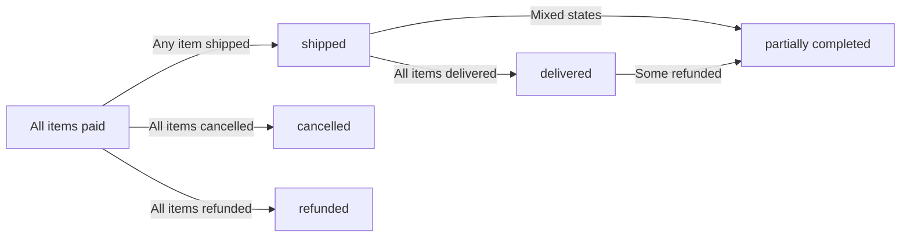

### Shipping Address Lock

WHEN an order is created, THE system SHALL lock the shipping address for that order.

THE system SHALL NOT allow changes to the shipping address after order placement.

THE customer SHALL NOT be able to modify the shipping address for an existing order.

IF the customer needs to change the shipping address, THE system SHALL require cancelling the order and placing a new order with the correct address.

### Order Total Calculation

WHEN an order is created, THE system SHALL calculate the total price from all order items.

THE system SHALL calculate each order item's price as the product variant price multiplied by the quantity.

THE system SHALL sum all order item prices to determine the order total.

THE system SHALL record the calculated total price in the order record.

THE system SHALL preserve the total price as part of the order record even if product prices change later.

## OrderItem Actions

Order items represent individual purchased product variants with quantity and price. Each order item has its own status independent of other items in the order. Order item statuses include paid, shipped, delivered, cancelled, and refunded. Customers request cancellation for items in paid status that have not yet shipped. Cancellation requests include a reason explaining why the customer wants to cancel. Sellers approve or reject cancellation requests. Approved cancellations change item status to cancelled and restore inventory. Customers request refunds for items in delivered status within 7 days of delivery. Refund requests include a reason explaining why the customer wants a refund. Sellers approve or reject refund requests. Approved refunds change item status to refunded and restore inventory. Each item can be individually cancelled or refunded without affecting other items in the order. Sellers view order items for their products that need shipping. Items change to shipped status when included in a shipment. Items change to delivered status when customer confirms delivery or automatically after 14 days from shipping.

### Order Item Creation

WHEN an order is successfully placed, THE system SHALL create one order item for each unique product variant purchased.

WHEN a customer purchases multiple quantities of the same variant, THE system SHALL create a single order item with the combined quantity.

WHEN an order item is created, THE system SHALL record the product, variant, quantity, and price at the time of purchase.

WHEN an order item is created, THE system SHALL set the initial status to "paid".

WHEN an order item is created, THE system SHALL associate it with the seller who owns the product.

WHEN an order item is created, THE system SHALL create a snapshot preserving the product name, description, variant options, and price.

WHEN an order item is created, THE system SHALL create a snapshot of the seller's profile preserving the shop name and logo.

IF a customer purchases variants from different sellers in the same order, THE system SHALL create separate order items for each seller's products.

THE system SHALL maintain the relationship between order items and their parent order.

THE system SHALL ensure each order item can be tracked independently within the order.

### Item Status Independence

THE system SHALL maintain a separate status for each order item within an order.

WHEN one order item changes status, THE system SHALL NOT automatically change the status of other items in the same order.

WHEN all items in an order have the same status, THE system SHALL set the overall order status to match that item status.

WHEN items in an order have different statuses, THE system SHALL set the overall order status to "partially completed".

THE system SHALL allow individual items to be cancelled without affecting other items.

THE system SHALL allow individual items to be refunded without affecting other items.

THE system SHALL allow some items to be shipped while others remain in paid status.

THE system SHALL allow some items to be delivered while others remain in different statuses.

WHEN calculating order status, THE system SHALL derive it from the statuses of all items in the order.

IF all items are cancelled, THE system SHALL set the order status to "cancelled".

IF all items are refunded, THE system SHALL set the order status to "refunded".

### Paid Status

WHEN an order item is first created after successful payment, THE system SHALL assign the status "paid" to that item.

WHILE an order item has status "paid", THE system SHALL indicate that payment is complete and the item is awaiting shipment.

WHEN an order item has status "paid", THE system SHALL allow the customer to request cancellation.

WHEN an order item has status "paid", THE system SHALL NOT allow the customer to request a refund.

WHEN an order item has status "paid", THE system SHALL allow the seller to include it in a shipment.

THE system SHALL display paid status items as awaiting shipment to both customers and sellers.

WHEN stock has been reserved for a paid item, THE system SHALL maintain that reservation until the item is shipped, cancelled, or refunded.

IF a paid item is cancelled, THE system SHALL restore the stock quantity through an inventory record.

IF a paid item is shipped, THE system SHALL change its status to "shipped".

### Shipped Status Transition

WHEN a seller creates a shipment containing an order item, THE system SHALL change that item's status to "shipped".

WHEN an order item transitions to shipped status, THE system SHALL record the shipment association.

WHEN an order item has status "shipped", THE system SHALL NOT allow the customer to request cancellation.

WHEN an order item has status "shipped", THE system SHALL NOT allow the customer to request a refund.

WHEN an order item has status "shipped", THE system SHALL display tracking information from the associated shipment.

THE system SHALL link shipped items to their shipment record for tracking purposes.

IF multiple items are included in one shipment, THE system SHALL change all those items to shipped status simultaneously.

WHEN an item is shipped, THE system SHALL update the order status if any items have changed to shipped.

IF some items are shipped and others remain paid, THE system SHALL set the order status to "shipped".

### Delivered Status Confirmation

WHEN a customer confirms delivery of a shipment, THE system SHALL change all items in that shipment to status "delivered".

WHEN an order item transitions to delivered status, THE system SHALL record the delivery confirmation timestamp.

WHEN an item has been in shipped status for 14 days without customer confirmation, THE system SHALL automatically change the item's status to "delivered".

WHEN an order item has status "delivered", THE system SHALL allow the customer to request a refund within 7 days.

WHEN an order item has status "delivered", THE system SHALL NOT allow the customer to request cancellation.

WHEN an order item has status "delivered", THE system SHALL allow the customer to write a review.

THE system SHALL calculate the 7-day refund window starting from the delivery confirmation date.

IF all items in an order reach delivered status, THE system SHALL set the order status to "delivered".

WHEN automatic delivery confirmation occurs after 14 days, THE system SHALL record the automatic confirmation in the item's history.

### Cancellation Request Workflow

WHEN a customer requests cancellation of an order item, THE system SHALL verify the item has status "paid".

IF the item does not have status "paid", THE system SHALL reject the cancellation request.

WHEN a customer creates a cancellation request, THE system SHALL require a reason text explaining the cancellation.

WHEN a cancellation request is created, THE system SHALL set the request status to "pending".

WHEN a cancellation request is created, THE system SHALL notify the seller of the request.

WHEN a seller views a cancellation request, THE system SHALL display the reason provided by the customer.

THE system SHALL maintain only one active cancellation request per order item at a time.

IF a cancellation request already exists for an item, THE system SHALL prevent creation of a duplicate request.

THE system SHALL preserve all cancellation request data for dispute resolution purposes.

WHEN a seller responds to a cancellation request, THE system SHALL create a snapshot recording the response state.

### Cancellation Approval and Rejection

WHEN a seller approves a cancellation request, THE system SHALL change the order item status to "cancelled".

WHEN an order item is cancelled, THE system SHALL create a positive inventory record to restore the stock quantity.

WHEN a cancellation is approved, THE system SHALL process a refund for that item.

WHEN a seller approves a cancellation request, THE system SHALL update the request status to "approved".

WHEN a seller approves a cancellation request, THE system SHALL record the response timestamp.

WHEN a seller rejects a cancellation request, THE system SHALL update the request status to "rejected".

WHEN a seller rejects a cancellation request, THE system SHALL keep the order item status unchanged.

WHEN a seller rejects a cancellation request, THE system SHALL record the response timestamp.

WHEN a cancellation request is resolved, THE system SHALL notify the customer of the decision.

IF all items in an order are cancelled, THE system SHALL set the order status to "cancelled".

THE system SHALL allow the customer to view the status and outcome of their cancellation requests.

### Refund Request Workflow

WHEN a customer requests a refund for an order item, THE system SHALL verify the item has status "delivered".

IF the item does not have status "delivered", THE system SHALL reject the refund request.

WHEN a customer creates a refund request, THE system SHALL verify the request is within 7 days of delivery.

IF more than 7 days have passed since delivery, THE system SHALL reject the refund request.

WHEN a customer creates a refund request, THE system SHALL require a reason text explaining the refund request.

WHEN a refund request is created, THE system SHALL set the request status to "pending".

WHEN a refund request is created, THE system SHALL notify the seller of the request.

THE system SHALL maintain only one active refund request per order item at a time.

IF a refund request already exists for an item, THE system SHALL prevent creation of a duplicate request.

THE system SHALL preserve all refund request data for dispute resolution purposes.

WHEN a seller responds to a refund request, THE system SHALL create a snapshot recording the response state.

### Refund Approval and Rejection

WHEN a seller approves a refund request, THE system SHALL change the order item status to "refunded".

WHEN an order item is refunded, THE system SHALL create a positive inventory record to restore the stock quantity.

WHEN a seller approves a refund request, THE system SHALL update the request status to "approved".

WHEN a seller approves a refund request, THE system SHALL record the response timestamp.

WHEN a seller approves a refund request, THE system SHALL process the refund payment to the customer.

WHEN a seller rejects a refund request, THE system SHALL update the request status to "rejected".

WHEN a seller rejects a refund request, THE system SHALL keep the order item status unchanged.

WHEN a seller rejects a refund request, THE system SHALL record the response timestamp.

WHEN a refund request is resolved, THE system SHALL notify the customer of the decision.

IF all items in an order are refunded, THE system SHALL set the order status to "refunded".

THE system SHALL allow the customer to view the status and outcome of their refund requests.

### Individual Item Operations

THE system SHALL allow customers to cancel individual order items without affecting other items in the order.

THE system SHALL allow customers to request refunds for individual order items without affecting other items.

THE system SHALL process cancellations and refunds on a per-item basis.

WHEN an individual item is cancelled or refunded, THE system SHALL continue processing other items in the order normally.

THE system SHALL calculate refunds based on the individual item price and quantity.

THE system SHALL maintain separate shipment associations for each item.

THE system SHALL track delivery confirmation per item based on shipment grouping.

WHEN an individual item status changes, THE system SHALL recalculate the overall order status.

THE system SHALL provide item-level detail in order history views.

THE system SHALL preserve individual item records even when other items in the same order are cancelled or refunded.

### Seller Order Item View

WHEN a seller views their order items, THE system SHALL display only items for products they own.

WHEN a seller views order items, THE system SHALL display items grouped by order.

THE system SHALL allow sellers to filter order items by status (paid, shipped, delivered, cancelled, refunded).

WHEN a seller views order items, THE system SHALL display the customer information for each item.

WHEN a seller views order items with status "paid", THE system SHALL indicate these items need shipping.

THE system SHALL allow sellers to view pending cancellation requests for their items.

THE system SHALL allow sellers to view pending refund requests for their items.

WHEN a seller views the dashboard, THE system SHALL display the count of order items for their products.

WHEN a seller views the dashboard, THE system SHALL display the number of pending cancellation requests.

WHEN a seller views the dashboard, THE system SHALL display the number of pending refund requests.

THE system SHALL allow sellers to respond to cancellation and refund requests for their items only.

## OrderItemSnapshot Actions

Order item snapshots are created automatically when an order is successfully placed. Each snapshot preserves the product name, description, variant options, and price at the moment of purchase. Snapshots ensure historical accuracy even if the seller later modifies or deletes the product. Order item snapshots link to the order item they belong to. Snapshots cannot be modified or deleted after creation. Customers view snapshots through order details to see exactly what they purchased. Sellers view snapshots in their order management to see what was sold at that time. Administrators access snapshots for dispute resolution and record keeping. Snapshots provide authoritative evidence for any disputes about product details at time of purchase. The snapshot includes both the product state and variant state as they existed during the transaction.

### Automatic Snapshot Creation

### Automatic Snapshot Creation

WHEN an order is successfully placed, THE system SHALL automatically create an order item snapshot for each order item.

WHEN creating an order item snapshot, THE system SHALL capture the product name as it exists at the moment of purchase.

WHEN creating an order item snapshot, THE system SHALL capture the product description as it exists at the moment of purchase.

WHEN creating an order item snapshot, THE system SHALL capture the variant options as they exist at the moment of purchase.

WHEN creating an order item snapshot, THE system SHALL capture the price at which the item was purchased.

WHEN creating an order item snapshot, THE system SHALL capture the seller's shop name as it exists at the moment of purchase.

WHEN an order item snapshot is created, THE system SHALL associate it with the corresponding order item.

IF payment fails during checkout, THE system SHALL NOT create any order item snapshots.

### Product State Capture

### Product State Capture

WHEN capturing the product state for an order item snapshot, THE system SHALL record the product name exactly as displayed to the customer during purchase.

WHEN capturing the product state for an order item snapshot, THE system SHALL record the product description exactly as displayed to the customer during purchase.

IF the seller modifies the product after an order is placed, THE system SHALL NOT update the order item snapshot with the new product information.

IF the seller deletes the product after an order is placed, THE system SHALL preserve the order item snapshot unchanged.

THE system SHALL ensure the product state in the snapshot reflects the exact information that formed the basis of the purchase decision.

### Variant State Capture

### Variant State Capture

WHEN capturing the variant state for an order item snapshot, THE system SHALL record the variant option values (such as color and size) exactly as selected by the customer.

WHEN capturing the variant state for an order item snapshot, THE system SHALL record the SKU code of the purchased variant.

WHEN capturing the variant state for an order item snapshot, THE system SHALL record the variant-specific price if it differs from the product base price.

IF the seller modifies the variant after an order is placed, THE system SHALL NOT update the order item snapshot with the new variant information.

IF the seller deletes the variant after an order is placed, THE system SHALL preserve the order item snapshot unchanged.

THE system SHALL ensure variant information in the snapshot precisely identifies what the customer purchased.

### Price Preservation

### Price Preservation

WHEN capturing the price for an order item snapshot, THE system SHALL record the exact price the customer paid for that item.

THE system SHALL store the price as a fixed value that does not change regardless of subsequent product price modifications.

IF the seller changes the product base price after an order is placed, THE system SHALL NOT update the price recorded in the order item snapshot.

IF the seller changes a variant's override price after an order is placed, THE system SHALL NOT update the price recorded in the order item snapshot.

THE system SHALL use the preserved price for all order-related calculations, refunds, and cancellation processing.

WHEN processing a refund or cancellation, THE system SHALL reference the preserved price from the order item snapshot.

### Historical Accuracy Guarantee

### Historical Accuracy Guarantee

THE system SHALL guarantee that order item snapshots represent an accurate historical record of each transaction.

THE system SHALL ensure snapshots cannot be modified after creation.

THE system SHALL ensure snapshots cannot be deleted after creation.

WHEN a customer views their order history, THE system SHALL display the exact product details that existed at the time of purchase.

WHEN a seller views order items for their products, THE system SHALL display the exact product details that were sold at the time of purchase.

IF a product's name, description, or price changes, THE system SHALL NOT affect any existing order item snapshots.

THE system SHALL maintain order item snapshots as permanent transaction records for dispute resolution and audit purposes.

### Snapshot Immutability

### Snapshot Immutability

THE system SHALL prevent any modifications to order item snapshots after they are created.

THE system SHALL prevent deletion of order item snapshots.

IF any user or process attempts to modify an order item snapshot, THE system SHALL reject the operation.

IF any user or process attempts to delete an order item snapshot, THE system SHALL reject the operation.

THE system SHALL maintain snapshots independently of the original product, variant, and seller profile data.

WHEN a seller account is deleted, THE system SHALL preserve all order item snapshots that reference that seller.

WHEN a product is deleted, THE system SHALL preserve all order item snapshots that reference that product.

WHEN a variant is deleted, THE system SHALL preserve all order item snapshots that reference that variant.

### Customer Snapshot Viewing

### Customer Snapshot Viewing

WHEN a customer views their order details, THE system SHALL display the order item snapshot information for each item.

THE system SHALL show customers the product name exactly as recorded in the snapshot.

THE system SHALL show customers the product description exactly as recorded in the snapshot.

THE system SHALL show customers the variant options exactly as recorded in the snapshot.

THE system SHALL show customers the price exactly as recorded in the snapshot.

THE system SHALL show customers the seller shop name exactly as recorded in the snapshot.

IF the original product has been modified or deleted, THE system SHALL still display the snapshot information unchanged to the customer.

THE system SHALL NOT allow customers to modify snapshot information.

### Seller Snapshot Viewing

### Seller Snapshot Viewing

WHEN a seller views order items for their products, THE system SHALL display the order item snapshot information for each item.

THE system SHALL show sellers the product name exactly as recorded in the snapshot at the time of sale.

THE system SHALL show sellers the variant options exactly as recorded in the snapshot at the time of sale.

THE system SHALL show sellers the price at which the item was sold.

IF the seller has modified their product since the order was placed, THE system SHALL display the snapshot information (not current product information) for that order item.

IF the seller has modified their shop name since the order was placed, THE system SHALL display the shop name as recorded in the snapshot.

THE system SHALL NOT allow sellers to modify snapshot information.

### Dispute Resolution Evidence

### Dispute Resolution Evidence

WHEN an administrator accesses order item snapshots, THE system SHALL provide the complete snapshot information.

THE system SHALL make order item snapshots available to administrators for dispute resolution purposes.

THE system SHALL ensure snapshots serve as authoritative evidence of what was sold and at what price.

WHEN a customer disputes an order, THE system SHALL allow administrators to view the order item snapshot to verify the product details at time of purchase.

WHEN a seller disputes a cancellation or refund request, THE system SHALL allow administrators to view the order item snapshot to verify the transaction details.

THE system SHALL provide timestamps indicating when the snapshot was created.

THE system SHALL ensure snapshots remain accessible even if the original product, variant, or seller account no longer exists.

THE system SHALL support reconstruction of the complete transaction state from order item snapshots for audit and legal purposes.

## SellerProfileSnapshot Actions

Seller profile snapshots are created automatically when an order is placed, capturing the seller's shop name, description, and logo at that moment. Each order item includes a seller profile snapshot to preserve seller information at the time of purchase. Snapshots ensure customers can see who sold the item even if the seller later changes their profile or deletes their account. When sellers edit their shop name, description, or logo, the changes are recorded as snapshots for historical tracking. Snapshots cannot be modified after creation. Customers view seller profile snapshots through their order history to identify sellers for past purchases. Sellers view their own profile snapshots for historical reference. The snapshot preserves the complete profile state including shop name, shop description, and logo image. This ensures accurate seller attribution in order records regardless of subsequent profile changes.

### Snapshot Creation Timing

WHEN an order is placed successfully, THE system SHALL create a seller profile snapshot for each order item capturing the seller's profile at that moment.

WHEN a seller edits their shop name, shop description, or logo image, THE system SHALL create a seller profile snapshot recording the previous state before the change.

WHEN a seller profile snapshot is created, THE system SHALL record the timestamp of creation.

THE system SHALL NOT create a seller profile snapshot for any changes unrelated to shop name, shop description, or logo image.

THE system SHALL create exactly one seller profile snapshot per unique seller per order, regardless of the number of items from that seller in the order.

### Shop Name Preservation

WHEN a seller profile snapshot is created, THE system SHALL capture and preserve the seller's shop name as it exists at that moment.

THE system SHALL preserve the shop name in the snapshot even if the seller subsequently changes their shop name.

THE system SHALL preserve the shop name in the snapshot even if the seller deletes their account.

WHEN a customer views an order item, THE system SHALL display the seller's shop name from the associated seller profile snapshot, not the current profile.

THE system SHALL ensure customers can identify the seller of historical purchases using the preserved shop name.

### Shop Description Preservation

WHEN a seller profile snapshot is created, THE system SHALL capture and preserve the seller's shop description as it exists at that moment.

THE system SHALL preserve the shop description in the snapshot even if the seller subsequently edits their shop description.

THE system SHALL preserve the shop description in the snapshot even if the seller deletes their account.

THE system SHALL allow customers to view the shop description that was associated with the seller at the time of purchase through the snapshot.

THE system SHALL allow sellers to view their historical shop descriptions through their profile snapshots.

### Logo Image Preservation

WHEN a seller profile snapshot is created, THE system SHALL capture and preserve the seller's logo image URL as it exists at that moment.

THE system SHALL preserve the logo image in the snapshot even if the seller subsequently uploads a new logo.

THE system SHALL preserve the logo image in the snapshot even if the seller deletes their account.

WHEN a customer views an order item, THE system SHALL display the seller's logo from the associated seller profile snapshot.

THE system SHALL ensure the visual identity of sellers in historical orders remains accurate through logo image preservation.

### Order Item Association

WHEN an order item is created, THE system SHALL associate that order item with the seller profile snapshot created for that order.

THE system SHALL link each order item to the seller profile snapshot of the seller who sold that item.

WHEN a customer views their order history, THE system SHALL display seller information from the associated seller profile snapshot for each order item.

THE system SHALL allow customers to reference the seller's profile information at the time of purchase through the order item's associated snapshot.

THE system SHALL maintain the association between order items and seller profile snapshots even after the seller modifies their profile or deletes their account.

### Historical Profile Tracking

THE system SHALL maintain all seller profile snapshots for historical tracking purposes.

WHEN a seller views their own profile snapshot history, THE system SHALL display all snapshots in chronological order with timestamps.

THE system SHALL provide sellers the ability to review their complete profile change history through their snapshots.

WHEN an administrator views a seller's profile history, THE system SHALL display all snapshots for that seller.

THE system SHALL preserve all seller profile snapshots indefinitely for dispute resolution and historical accuracy.

### Seller Attribution Accuracy

THE system SHALL ensure that seller information displayed in order history matches the snapshot preserved at the time of purchase.

WHEN a product or seller profile changes, THE system SHALL NOT update the information in existing order item snapshots.

THE system SHALL maintain accurate seller attribution for all historical orders regardless of subsequent profile changes.

WHEN a seller deletes their account, THE system SHALL preserve the seller's shop name in order item snapshots so customers can still identify the seller of past purchases.

THE system SHALL enable customers to verify seller identity for dispute resolution using the preserved snapshot information.

### Snapshot Immutability

THE system SHALL NOT allow any modifications to a seller profile snapshot after it has been created.

THE system SHALL NOT allow deletion of seller profile snapshots.

THE system SHALL preserve all seller profile snapshots even if the seller account is deleted.

THE system SHALL preserve all seller profile snapshots even if the seller's products are deleted.

THE system SHALL ensure that seller profile snapshots remain unchanged and available for historical reference and dispute resolution.

### Customer Order Reference

WHEN a customer views their order details, THE system SHALL display seller information from the seller profile snapshot associated with each order item.

THE system SHALL allow customers to see the seller's shop name, shop description, and logo as they existed at the time of purchase.

THE system SHALL enable customers to identify sellers for past purchases even if the seller has changed their profile or deleted their account.

WHEN a customer needs to initiate a cancellation or refund request, THE system SHALL use the preserved snapshot information to identify the correct seller.

THE system SHALL provide customers access to seller profile snapshot information for dispute resolution purposes.

## Shipment Actions

Shipments are packages sent by sellers containing one or more order items. Different sellers always ship separately, creating different shipments for each seller's items in an order. A seller can bundle multiple of their order items into a single shipment or ship items individually. Sellers create shipments by selecting one or more of their pending order items. Sellers enter carrier name and tracking number for each shipment. All items in a shipment share the same tracking information. When a shipment is created, all included order items change status from paid to shipped. Customers view tracking information for each shipment to monitor delivery progress. Customers confirm delivery per shipment rather than per individual item. When a customer confirms delivery, all items in that shipment change to delivered status. If customers do not confirm delivery, items automatically change to delivered status 14 days after the shipping date.

### Shipment Creation Process

WHEN a seller creates a shipment, THE system SHALL allow the seller to select one or more of their order items that have status "paid".

WHEN a seller creates a shipment, THE system SHALL require at least one order item to be selected.

IF the seller attempts to include an order item that does not belong to them, THE system SHALL reject the shipment creation.

IF the seller attempts to include an order item with a status other than "paid", THE system SHALL reject the shipment creation.

WHEN a seller creates a shipment, THE system SHALL allow multiple order items from the same order to be bundled into a single shipment.

WHEN a seller creates a shipment, THE system SHALL allow the seller to ship items individually in separate shipments.

WHEN multiple sellers have order items in the same order, THE system SHALL require each seller to create their own separate shipments.

IF a seller attempts to include another seller's order item in their shipment, THE system SHALL reject the request.

WHEN a shipment is successfully created, THE system SHALL record the seller who created it, the order it belongs to, and the included order items.

WHEN a shipment is created, THE system SHALL set the shipment creation timestamp.

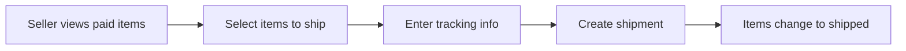

### Carrier and Tracking Entry

WHEN a seller creates a shipment, THE system SHALL require the seller to enter a carrier name.

WHEN a seller creates a shipment, THE system SHALL require the seller to enter a tracking number.

IF the carrier name is not provided, THE system SHALL reject the shipment creation.

IF the tracking number is not provided, THE system SHALL reject the shipment creation.

WHEN a seller enters carrier and tracking information, THE system SHALL store this information with the shipment record.

WHEN a seller enters carrier and tracking information, THE system SHALL associate the same carrier name and tracking number with all order items included in the shipment.

THE system SHALL allow the seller to enter any carrier name as free text.

THE system SHALL allow the seller to enter any tracking number as free text.

### Status Change to Shipped

WHEN a shipment is successfully created, THE system SHALL change the status of all included order items from "paid" to "shipped".

WHEN the status of an order item changes to "shipped", THE system SHALL record the shipment it belongs to.

WHEN all order items in an order have status "shipped" or higher, THE system SHALL update the overall order status to "shipped".

IF some items are shipped while others remain with status "paid", THE system SHALL set the overall order status to "shipped".

THE system SHALL NOT change the status of order items not included in the shipment.

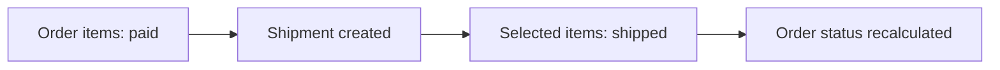

### Tracking Information Display

WHEN a customer views an order, THE system SHALL display a list of all shipments associated with that order.

WHEN a customer views a shipment, THE system SHALL display the carrier name and tracking number.

WHEN a customer views a shipment, THE system SHALL display the list of order items included in that shipment.

WHEN a customer views a shipment, THE system SHALL display the shipping date.

WHEN a customer views a shipment, THE system SHALL display the delivery status (pending or delivered).

IF a shipment has been delivered, THE system SHALL display the delivery confirmation date.

THE system SHALL group order items by shipment in the order detail view.

WHEN an order item has not yet been assigned to a shipment, THE system SHALL display it separately with a "pending shipment" indicator.

### Delivery Confirmation Workflow

WHEN a customer confirms delivery of a shipment, THE system SHALL change the status of all order items in that shipment from "shipped" to "delivered".

WHEN a customer confirms delivery, THE system SHALL record the delivery confirmation timestamp.

WHEN all order items in an order have status "delivered", "cancelled", or "refunded", THE system SHALL update the overall order status accordingly.

THE system SHALL allow customers to confirm delivery only for shipments with status "shipped".

IF a customer attempts to confirm delivery of a shipment that does not belong to their order, THE system SHALL reject the request.

WHEN delivery is confirmed, THE system SHALL NOT affect other shipments in the same order.

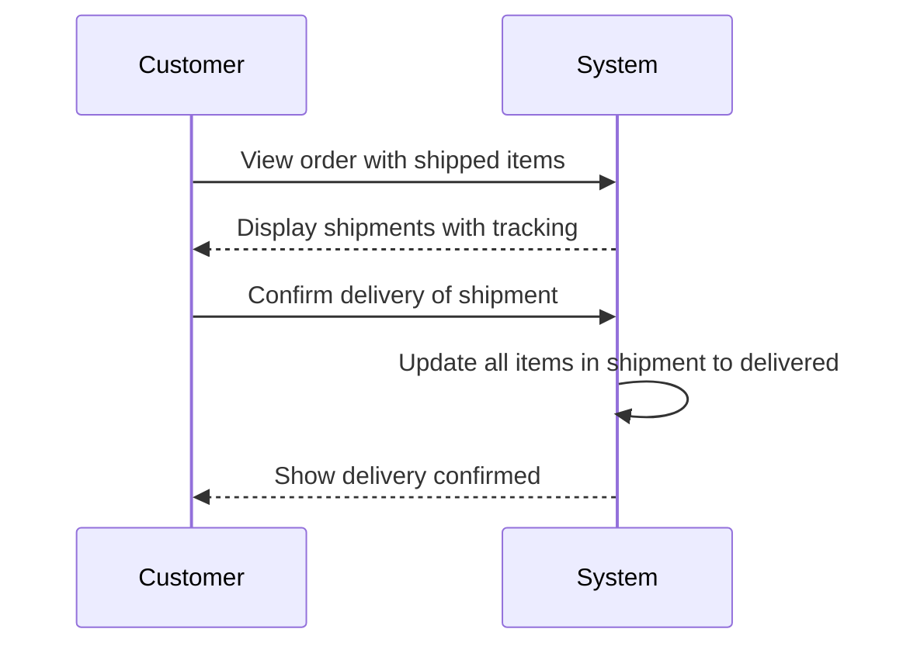

### Automatic Delivery Confirmation

IF a customer has not confirmed delivery within 14 days of the shipment date, THE system SHALL automatically change all order items in that shipment from "shipped" to "delivered".

WHEN automatic delivery confirmation occurs, THE system SHALL record the delivery date as 14 days after the shipping date.

THE system SHALL calculate the 14-day period starting from the shipment creation date.

WHEN automatic delivery confirmation occurs for all shipped items in an order, THE system SHALL update the overall order status to "delivered" if no items remain in other states.

THE system SHALL process automatic delivery confirmations regardless of whether the customer has logged in.

WHEN an item's status changes to "delivered" through automatic confirmation, THE system SHALL enable the customer to submit a refund request for that item.

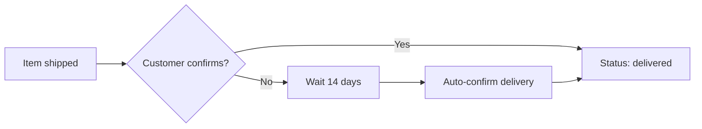

## CancellationRequest Actions

Customers create cancellation requests for order items in paid status that have not yet been shipped. Each cancellation request includes a reason text explaining why the customer wants to cancel. Requests are created with pending status. Sellers of the affected item view pending cancellation requests for their products. Sellers approve or reject each cancellation request. When a seller responds, a snapshot of the request state is created. Approved cancellations change the order item status to cancelled. Cancelled items trigger inventory restoration through positive inventory records. Rejected cancellations leave the order item in paid status, allowing the seller to proceed with shipping. If all items in an order are cancelled, the overall order status becomes cancelled. Cancellation is handled per item, allowing partial order cancellation without affecting other items.

### Cancellation Request Creation Workflow

### Request Creation

WHEN a customer creates a cancellation request, THE system SHALL require selection of a specific order item.

WHEN a customer creates a cancellation request, THE system SHALL require the order item to have status "paid".

IF the order item status is not "paid", THE system SHALL reject the cancellation request.

WHEN a customer creates a cancellation request, THE system SHALL require a reason text explaining the cancellation.

IF the reason text is not provided, THE system SHALL reject the cancellation request.

WHEN a cancellation request is successfully created, THE system SHALL set the request status to "pending".

WHEN a cancellation request is created, THE system SHALL record the current timestamp as the creation time.

THE system SHALL associate the cancellation request with exactly one order item.

THE system SHALL associate the cancellation request with the seller of the affected order item.

### Duplicate Request Prevention

IF a pending cancellation request already exists for the same order item, THE system SHALL reject the creation of a new request.

### Seller Notification

WHEN a cancellation request is created, THE system SHALL make the request visible to the seller of the affected order item.

### Seller Response Actions

### Seller Approval

WHEN a seller approves a cancellation request, THE system SHALL create a snapshot of the request state.

WHEN a seller approves a cancellation request, THE system SHALL change the request status to "approved".

WHEN a seller approves a cancellation request, THE system SHALL record the current timestamp as the response time.

WHEN a seller approves a cancellation request, THE system SHALL associate the seller as the respondent.

WHEN a seller approves a cancellation request, THE system SHALL change the order item status to "cancelled".

WHEN an order item status changes to "cancelled", THE system SHALL create a positive inventory record for the corresponding product variant.

WHEN an order item is cancelled, THE system SHALL restore the stock quantity equal to the cancelled item quantity.

### Seller Rejection

WHEN a seller rejects a cancellation request, THE system SHALL create a snapshot of the request state.

WHEN a seller rejects a cancellation request, THE system SHALL change the request status to "rejected".

WHEN a seller rejects a cancellation request, THE system SHALL record the current timestamp as the response time.

WHEN a seller rejects a cancellation request, THE system SHALL associate the seller as the respondent.

WHEN a seller rejects a cancellation request, THE system SHALL keep the order item status as "paid".

### Response Validation

IF the seller attempting to respond is not the seller of the affected order item, THE system SHALL reject the response.

IF the cancellation request status is not "pending", THE system SHALL reject the response.

### Cancellation State Changes

### Request State Snapshot

WHEN a seller responds to a cancellation request, THE system SHALL create a snapshot capturing the reason text, status, and timestamp.

THE system SHALL make the snapshot immutable after creation.

THE system SHALL preserve the snapshot even after the cancellation request is resolved.

### Item Status Transition

WHEN a cancellation request is approved, THE system SHALL change the order item status from "paid" to "cancelled".

WHEN an order item status becomes "cancelled", THE system SHALL prevent further status changes to that item.

THE system SHALL preserve the cancelled status for historical and dispute resolution purposes.

### Inventory Restoration

WHEN an order item is cancelled, THE system SHALL create an inventory record with a positive quantity change.

THE system SHALL set the inventory record reason to indicate order cancellation.

THE system SHALL record the current timestamp for the inventory record.

THE system SHALL link the inventory record to the affected product variant.

THE system SHALL make the inventory record visible in the variant's inventory history.

### Partial Order Cancellation

### Per-Item Cancellation

THE system SHALL allow cancellation requests for individual order items within a multi-item order.

WHEN one item in an order is cancelled, THE system SHALL keep other items in the order unchanged.

WHEN one item in an order is cancelled, THE system SHALL allow other items to proceed through normal order processing.

### Order Status Derivation

THE system SHALL derive the overall order status from the statuses of all order items.

IF all items in an order have status "cancelled", THE system SHALL set the order status to "cancelled".

IF some items are cancelled and other items have different statuses, THE system SHALL set the order status to "partially completed".

IF at least one item remains in "paid" or "shipped" status, THE system SHALL NOT change the order status to "cancelled".

### Multi-Seller Order Handling

WHEN items from multiple sellers exist in an order, THE system SHALL allow each seller to respond independently to cancellation requests for their items.

WHEN a cancellation request is approved for one seller's item, THE system SHALL NOT affect items from other sellers in the same order.

## CancellationRequestSnapshot Actions

Cancellation request snapshots are created when sellers respond to cancellation requests. Each snapshot records the reason text and status at the moment of response. Snapshots preserve both approved and rejected request states for historical accuracy. The snapshot includes the timestamp when the seller responded. Snapshots cannot be modified after creation. Customers view cancellation request snapshots in their order history to understand the resolution of their requests. Sellers view snapshots for their managed requests as a record of their decisions. Administrators access snapshots for dispute resolution regarding cancellation handling. Multiple snapshots may exist if sellers modify their responses. The snapshot provides an immutable record of the cancellation request state for audit and dispute purposes.

### Snapshot Creation on Seller Response

### Snapshot Creation Trigger

WHEN a seller approves or rejects a cancellation request, THE system SHALL create a snapshot of the cancellation request state.

WHEN a seller responds to a cancellation request, THE system SHALL capture the reason text and status at the moment of response.

WHEN a snapshot is created, THE system SHALL record the timestamp of the seller's response.

WHEN a seller modifies their response to a cancellation request, THE system SHALL create an additional snapshot.

### Snapshot Immutability

THE system SHALL prevent any modifications to cancellation request snapshots after creation.

THE system SHALL preserve all snapshots even if the original cancellation request is modified or resolved.

THE system SHALL NOT allow deletion of cancellation request snapshots.

### Multiple Snapshot Accumulation

WHEN a seller provides multiple responses to the same cancellation request over time, THE system SHALL create a separate snapshot for each response.

THE system SHALL maintain the chronological order of all snapshots for a cancellation request.

THE system SHALL preserve the complete history of seller responses through multiple snapshots.

### Response Timing and State Preservation

### Response Timing Capture

WHEN a seller responds to a cancellation request, THE system SHALL record the exact date and time of the response in the snapshot.

THE system SHALL use the snapshot timestamp as the official record of when the seller's decision was made.

### Reason Text Preservation

WHEN a snapshot is created, THE system SHALL preserve the reason text provided in the cancellation request.

THE system SHALL ensure the reason text in the snapshot matches the reason text at the moment of the seller's response.

THE system SHALL preserve the reason text even if the original cancellation request is later modified.

### Status State Recording

WHEN a snapshot is created, THE system SHALL record the status of the cancellation request (approved or rejected).

THE system SHALL capture the status exactly as determined by the seller's response.

THE system SHALL preserve the status value in the snapshot independently of any subsequent changes to the cancellation request.

### Approved and Rejected Request Snapshots

### Approved Request Snapshot

WHEN a seller approves a cancellation request, THE system SHALL create a snapshot with status "approved".

THE approved snapshot SHALL preserve the reason text that the customer originally provided for the cancellation request.

THE approved snapshot SHALL serve as the permanent record that the seller authorized the cancellation.

### Rejected Request Snapshot

WHEN a seller rejects a cancellation request, THE system SHALL create a snapshot with status "rejected".

THE rejected snapshot SHALL preserve the reason text that the customer originally provided for the cancellation request.

THE rejected snapshot SHALL serve as the permanent record that the seller denied the cancellation request.

### Status Transition Recording

WHEN a snapshot is created for an approved cancellation, THE system SHALL record the transition from "pending" to "approved".

WHEN a snapshot is created for a rejected cancellation, THE system SHALL record the transition from "pending" to "rejected".

### Historical Record and Audit Trail

### Historical Record Purpose

THE system SHALL maintain cancellation request snapshots to provide an accurate historical record of cancellation handling.

THE system SHALL ensure that the state of each cancellation request at the time of seller response is permanently preserved.

THE system SHALL use snapshots to reconstruct the complete history of cancellation request resolution.

### Audit Trail Maintenance

THE system SHALL maintain cancellation request snapshots as part of the platform's audit trail for financial transactions.

THE system SHALL ensure snapshots are available for compliance and regulatory purposes.

THE system SHALL provide a complete, tamper-proof record of seller decisions regarding cancellation requests.

THE system SHALL link each snapshot to the corresponding cancellation request for traceability.

### Record Integrity

THE system SHALL ensure that snapshots provide an immutable and verifiable record of cancellation request resolution.

THE system SHALL guarantee that historical records cannot be altered or deleted by any user, including administrators.

### Dispute Resolution Access

### Customer Snapshot Access

WHEN a customer views their order history, THE system SHALL allow them to view cancellation request snapshots for their orders.

THE system SHALL display the snapshot reason text and status to the customer who created the cancellation request.

THE system SHALL show the timestamp of when the seller responded to help customers understand the resolution timeline.

### Seller Snapshot Access

WHEN a seller views cancellation requests for their products, THE system SHALL allow them to view snapshots of their previous responses.

THE system SHALL enable sellers to review their decision history on cancellation requests.

THE system SHALL help sellers understand their past handling of customer cancellation requests.

### Administrator Snapshot Access

WHEN an administrator investigates a dispute, THE system SHALL allow them to view all cancellation request snapshots.

THE system SHALL provide administrators access to the complete history of seller responses for any cancellation request.

THE system SHALL enable administrators to use snapshots as evidence when resolving disputes between customers and sellers.

THE system SHALL support administrators in verifying the accuracy of seller actions through snapshot review.

## RefundRequest Actions

Customers create refund requests for order items in delivered status within 7 days of delivery. Each refund request includes a reason text explaining why the customer wants a refund. Requests are created with pending status. Sellers of the affected item view pending refund requests for their products. Sellers approve or reject each refund request. When a seller responds, a snapshot of the request state is created. Approved refunds change the order item status to refunded. Refunded items trigger inventory restoration through positive inventory records. Rejected refunds leave the order item in delivered status. If all items in an order are refunded, the overall order status becomes refunded. Refund is handled per item, allowing partial order refund without affecting other items. The 7-day window ensures customers have reasonable time to evaluate delivered items before requesting refunds.

### Refund Request Creation

### Request Creation

WHEN a customer creates a refund request for an order item, THE system SHALL require the order item status to be "delivered".

WHEN a customer creates a refund request, THE system SHALL require a reason text explaining why the refund is being requested.

WHEN a customer creates a refund request, THE system SHALL set the initial status to "pending".

IF the order item status is not "delivered", THE system SHALL reject the refund request creation.

IF more than 7 days have passed since the order item was delivered, THE system SHALL reject the refund request creation.

IF a refund request already exists for the same order item with status "pending" or "approved", THE system SHALL reject the duplicate refund request creation.

WHEN a refund request is successfully created, THE system SHALL associate the request with the specific order item.

WHEN a refund request is successfully created, THE system SHALL record the creation timestamp.

WHEN a refund request is successfully created, THE system SHALL make the request visible to the seller of the order item.

### Time Window Validation

WHEN validating the 7-day refund window, THE system SHALL calculate the window from the delivery confirmation timestamp of the order item.

IF the order item delivery timestamp is not recorded, THE system SHALL calculate the window from 14 days after the shipment shippedAt timestamp.

WHEN a customer views an order item eligible for refund, THE system SHALL display whether the item is within the 7-day refund window.

IF the 7-day refund window has expired, THE system SHALL prevent the customer from creating a refund request for that item.

### Reason Text Requirements

WHEN a customer submits a refund request, THE system SHALL require the reason text to be non-empty.

IF the reason text is empty or contains only whitespace, THE system SHALL reject the refund request creation.

WHEN the reason text is submitted, THE system SHALL preserve the exact text as provided by the customer.

### Seller Refund Response

### Seller Review Process

WHEN a seller views pending refund requests, THE system SHALL display all refund requests for order items belonging to that seller's products.

WHEN a seller views a refund request, THE system SHALL display the order item details, the customer's reason text, and the request creation timestamp.

WHEN a seller responds to a refund request, THE system SHALL allow the seller to approve or reject the request.

IF the seller does not provide an approve or reject decision, THE system SHALL not allow the response to be submitted.

### Approval Workflow

WHEN a seller approves a refund request, THE system SHALL change the order item status to "refunded".

WHEN a seller approves a refund request, THE system SHALL create a positive inventory record to restore the stock quantity for the product variant.

WHEN a seller approves a refund request, THE system SHALL record the approval timestamp and the seller who approved it.

WHEN the order item status changes to "refunded", THE system SHALL trigger the refund payment processing.

### Rejection Workflow

WHEN a seller rejects a refund request, THE system SHALL keep the order item status as "delivered".

WHEN a seller rejects a refund request, THE system SHALL record the rejection timestamp and the seller who rejected it.

WHEN a seller rejects a refund request, THE system SHALL not modify any inventory records.

### Request State Snapshot

WHEN a seller responds to a refund request (approve or reject), THE system SHALL create a snapshot of the request state.

THE system SHALL include in the snapshot: the reason text, the status (approved or rejected), and the timestamp of the response.

THE system SHALL make the snapshot immutable after creation.

THE system SHALL preserve all snapshots even if the original refund request is later modified or deleted.

WHEN a refund request receives multiple responses (such as status changes), THE system SHALL create a separate snapshot for each response event.

### Partial Order Refund

### Per-Item Refund Processing

WHEN a refund request is approved for one order item in a multi-item order, THE system SHALL only change the status of that specific order item to "refunded".

WHEN a refund request is approved for one order item, THE system SHALL not affect the status of other order items in the same order.

WHEN a customer requests refunds for multiple order items, THE system SHALL process each refund request independently.

### Order Status Derivation

WHEN all order items in an order have status "refunded", THE system SHALL set the overall order status to "refunded".

WHEN some order items are refunded and others have different statuses, THE system SHALL set the overall order status to "partially completed".

WHEN calculating the overall order status, THE system SHALL consider all order item statuses together.

### Inventory Restoration

WHEN a refund is approved, THE system SHALL create an inventory record with a positive quantity change equal to the refunded item quantity.

THE system SHALL associate the inventory record with the reason "refund approved" and the timestamp of approval.

WHEN inventory is restored, THE system SHALL immediately update the available stock quantity for the product variant.

### Business Impact

WHEN an order item is refunded, THE system SHALL preserve the order item snapshot for dispute resolution.

WHEN an order item is refunded, THE system SHALL preserve the seller profile snapshot associated with that order item.

THE system SHALL allow the customer to view their refunded order items in the order history.

THE system SHALL allow the seller to view refunded order items for their products in the seller dashboard.

## RefundRequestSnapshot Actions

Refund request snapshots are created when sellers respond to refund requests. Each snapshot records the reason text and status at the moment of response. Snapshots preserve both approved and rejected request states for historical accuracy. The snapshot includes the timestamp when the seller responded. Snapshots cannot be modified after creation. Customers view refund request snapshots in their order history to understand the resolution of their requests. Sellers view snapshots for their managed requests as a record of their decisions. Administrators access snapshots for dispute resolution regarding refund handling. Multiple snapshots may exist if sellers modify their responses. The snapshot provides an immutable record of the refund request state for audit and dispute purposes.

### Snapshot Creation on Seller Response

WHEN a seller approves or rejects a refund request, THE system SHALL automatically create a RefundRequestSnapshot record.

WHEN creating a snapshot, THE system SHALL record the exact timestamp of the seller's response.

WHEN a seller responds to a refund request, THE system SHALL capture the reason text as provided by the customer in the snapshot.

WHEN a seller responds to a refund request, THE system SHALL record the status value (approved or rejected) in the snapshot.

IF a seller modifies their response to a refund request, THE system SHALL create a new snapshot while preserving all previous snapshots.

THE system SHALL associate each snapshot with the corresponding RefundRequest record.

THE system SHALL associate each snapshot with the seller who provided the response.

### Request State Preservation

WHEN creating a refund request snapshot, THE system SHALL preserve the reason text exactly as submitted by the customer.

WHEN creating a refund request snapshot, THE system SHALL record the decision status reflecting the seller's response.

THE system SHALL NOT allow modification of any snapshot after creation.

THE system SHALL NOT allow deletion of any snapshot.

WHEN a snapshot is created, THE system SHALL store the complete state of the refund request at that moment.

THE system SHALL maintain the chronological order of all snapshots for a refund request based on their creation timestamps.

### Approved Refund Request Snapshot

WHEN a seller approves a refund request, THE system SHALL create a snapshot with status set to "approved".

WHEN an approved snapshot is created, THE system SHALL record the seller's approval timestamp.

WHEN a refund request is approved, THE system SHALL preserve the approved status in the snapshot for historical reference.

THE system SHALL retain the approved snapshot even if the refund is subsequently processed.

WHEN viewing an approved refund request, THE system SHALL display the snapshot showing the approved state with its timestamp.

### Rejected Refund Request Snapshot

WHEN a seller rejects a refund request, THE system SHALL create a snapshot with status set to "rejected".

WHEN a rejected snapshot is created, THE system SHALL record the seller's rejection timestamp.

WHEN a refund request is rejected, THE system SHALL preserve the rejected status in the snapshot for historical reference.

THE system SHALL retain the rejected snapshot even if the customer submits a new refund request for the same item.

WHEN viewing a rejected refund request, THE system SHALL display the snapshot showing the rejected state with its timestamp.

### Snapshot Access for Dispute Resolution

WHEN a customer views their order history, THE system SHALL display refund request snapshots for items with refund requests.

WHEN a customer views a refund request snapshot, THE system SHALL show the reason text, status, and response timestamp.

WHEN a seller views refund requests for their products, THE system SHALL display all snapshots as a record of their decisions.

WHEN an administrator accesses a dispute case, THE system SHALL provide access to all refund request snapshots.

THE system SHALL provide snapshots as evidence for resolving disputes between customers and sellers.

THE system SHALL maintain snapshots as an immutable audit trail for all refund request state changes.

WHEN an administrator reviews platform activity, THE system SHALL allow viewing of refund request snapshots for audit purposes.

## Review Actions

Customers write reviews for products they have purchased after the order item status becomes delivered. Each review includes a rating from 1 to 5 stars and optional text content. Customers can write one review per product per order. Reviews are displayed on the product detail page sorted by newest first. The product's average rating is calculated from all non-deleted reviews. Customers edit their own reviews, triggering snapshot creation for each modification. Customers delete their own reviews, though snapshots are preserved for historical records. Deleted reviews are excluded from average rating calculations. Reviews cannot be written for items that are cancelled or refunded, only for delivered items. Reviews help other customers make informed purchase decisions. Sellers cannot modify or delete customer reviews.

### Review Creation Timing

### Delivered Status Requirement

WHEN a customer creates a review, THE system SHALL verify that the order item status is "delivered".

IF the order item status is "paid", "shipped", "cancelled", or "refunded", THE system SHALL reject the review creation.

WHEN a customer creates a review, THE system SHALL verify that the customer placing the review is the same customer who purchased the order item.

### Review Creation Process

WHEN a customer creates a review for a delivered order item, THE system SHALL:
1. Associate the review with the customer who created it
2. Associate the review with the product being reviewed
3. Associate the review with the order containing the purchased item
4. Record the creation timestamp

IF a review already exists for the same product and order combination by the same customer, THE system SHALL reject the duplicate review creation.

### Timing Validation

WHEN a customer attempts to create a review, THE system SHALL verify the order item delivery has been confirmed either by customer confirmation or automatic confirmation after 14 days from shipping.

### Review Rating and Content

### Rating Requirement

WHEN a customer creates a review, THE system SHALL require a rating value.

THE system SHALL accept only integer rating values from 1 to 5 inclusive.

IF the rating value is less than 1 or greater than 5, THE system SHALL reject the review creation.

IF the rating value is not an integer, THE system SHALL reject the review creation.

### Text Content Option

WHEN a customer creates a review, THE system SHALL allow text content to be optional.

THE system SHALL accept reviews containing only a rating without text content.

THE system SHALL accept reviews containing both a rating and text content.

IF text content is provided, THE system SHALL store the text content as part of the review record.

### Content Completeness

WHEN a review is created successfully, THE system SHALL ensure the review contains at minimum a valid rating and the association references to customer, product, and order.

### One Review Per Order Constraint

### Uniqueness Constraint

WHEN a customer creates a review, THE system SHALL enforce that only one review exists per product per order for that customer.

IF a customer attempts to create a second review for the same product from the same order, THE system SHALL reject the creation.

### Product-Level Review

THE system SHALL track reviews at the product level, not the variant level.

WHEN a customer purchases multiple variants of the same product in a single order, THE system SHALL allow only one review for that product from that order.

WHEN a customer purchases the same product in different orders, THE system SHALL allow one review per order for that product.

### Multiple Order Reviews

THE system SHALL allow a customer to create separate reviews for the same product across different orders.

WHEN calculating the average product rating, THE system SHALL include all reviews from different orders by the same customer for that product.

### Review Display and Ordering

### Product Detail Page Display

WHEN a customer views a product detail page, THE system SHALL display all non-deleted reviews for that product.

THE system SHALL display each review with:
1. The rating value
2. The text content if provided
3. The customer display name
4. The creation timestamp

### Newest First Ordering

WHEN displaying reviews on the product detail page, THE system SHALL sort reviews by creation timestamp with newest reviews appearing first.

WHEN multiple reviews have the same creation timestamp, THE system SHALL sort those reviews by review ID in descending order.

### Informed Purchase Decisions

THE system SHALL display the total number of reviews for each product on the product detail page.

THE system SHALL display the average rating for each product on the product detail page.

WHEN a product has no reviews, THE system SHALL display an indicator that no reviews exist for that product.

THE system SHALL allow customers to view reviews without being logged in.

### Average Rating Calculation

### Rating Aggregation

WHEN calculating a product's average rating, THE system SHALL include all non-deleted reviews for that product.

THE system SHALL calculate the average by summing all rating values and dividing by the total number of non-deleted reviews.

THE system SHALL round the average rating to one decimal place for display purposes.

### Deleted Review Exclusion

WHEN a review is deleted, THE system SHALL immediately exclude that review from the average rating calculation.

IF all reviews for a product are deleted, THE system SHALL display no average rating for that product.

WHEN calculating the average rating, THE system SHALL NOT include reviews with a deleted timestamp.

### Rating Updates

WHEN a review is edited and the rating changes, THE system SHALL recalculate the product's average rating.

WHEN a new review is created, THE system SHALL recalculate the product's average rating.

WHEN a review is deleted, THE system SHALL recalculate the product's average rating.

### Review Editing with Snapshot

### Edit Authorization

WHEN a customer edits a review, THE system SHALL verify that the customer is the original author of the review.

IF the customer attempting to edit is not the original author, THE system SHALL reject the edit.

### Editable Fields

WHEN a customer edits a review, THE system SHALL allow modification of:
1. The rating value
2. The text content

### Snapshot Creation on Edit

WHEN a customer edits a review, THE system SHALL create a snapshot preserving the previous state.

THE snapshot SHALL contain:
1. The rating value before the edit
2. The text content before the edit
3. The timestamp of the snapshot creation

THE system SHALL link the snapshot to the original review record.

### Snapshot Accumulation

THE system SHALL preserve all snapshots created from multiple edits to the same review.

THE system SHALL maintain snapshots in chronological order to enable reconstruction of the review's edit history.

### Review Deletion Process

### Deletion Authorization

WHEN a customer deletes a review, THE system SHALL verify that the customer is the original author of the review.

IF the customer attempting to delete is not the original author, THE system SHALL reject the deletion.

### Soft Delete Implementation

WHEN a customer deletes a review, THE system SHALL record a deleted timestamp rather than permanently removing the review record.

THE system SHALL preserve all snapshots associated with the deleted review.

### Effects of Deletion

WHEN a review is deleted, THE system SHALL:
1. Exclude the review from display on the product detail page
2. Exclude the review from average rating calculations
3. Exclude the review from the total review count
4. Preserve the review record for historical purposes

### Seller Restrictions

THE system SHALL NOT allow sellers to modify or delete customer reviews of their products.

IF a seller attempts to modify or delete a review, THE system SHALL reject the action.

### Deleted User Display

WHEN a customer deletes their account, THE system SHALL preserve their reviews with the author displayed as "deleted user".

WHEN a review by a deleted customer is displayed, THE system SHALL show the rating and content with the author name as "deleted user".

## ReviewSnapshot Actions

Review snapshots are created automatically when customers edit their reviews. Each snapshot preserves the rating and text content as they existed before the edit. Snapshots record when the change was made and what values changed. Multiple snapshots accumulate as customers make multiple edits over time. Snapshots cannot be modified or deleted even after the review itself is deleted. Customers view their own review snapshots to see the history of their feedback. Administrators access review snapshots for dispute resolution regarding review content. The snapshot ensures historical accuracy for any disputes about what a customer originally wrote. Deleted reviews retain their snapshots for audit purposes. Snapshots provide evidence of review content at specific points in time.

### Review Snapshot Creation

### Automatic Creation Trigger

WHEN a customer edits an existing review, THE system SHALL automatically create a review snapshot before applying the changes.

THE system SHALL NOT create a snapshot when a review is first created.

WHEN creating a review snapshot, THE system SHALL record the timestamp of when the edit was made.

### Snapshot Content

WHEN creating a review snapshot, THE system SHALL preserve the rating value as it existed before the edit.

WHEN creating a review snapshot, THE system SHALL preserve the text content as it existed before the edit.

IF the text content was empty before the edit, THE system SHALL record an empty content in the snapshot.

### Snapshot Association

Each review snapshot SHALL be associated with the review that was edited.

THE system SHALL maintain the relationship between a review and all its snapshots throughout the review's lifecycle.

### Rating and Content Preservation

### Rating Preservation

WHEN a review snapshot is created, THE system SHALL preserve the exact rating value (1 to 5 stars) from before the edit.

THE system SHALL NOT modify the rating value stored in the snapshot after creation.

### Text Content Preservation

WHEN a review snapshot is created, THE system SHALL preserve the complete text content from before the edit.

THE system SHALL preserve all formatting and special characters in the text content exactly as they appeared.

### Complete State Capture

Each snapshot SHALL represent the complete state of the review at a specific point in time.

WHEN viewing a snapshot, THE system SHALL display both the rating and text content together to show the complete review state.

### Edit History Tracking

### History Accumulation

WHEN a customer makes multiple edits to a review, THE system SHALL create a separate snapshot for each edit.

THE system SHALL preserve all previous snapshots when a new snapshot is created.

THE system SHALL NOT replace or overwrite existing snapshots when new edits occur.

### Chronological Recording

Each snapshot SHALL include a timestamp indicating when the edit was made.

THE system SHALL maintain snapshots in chronological order based on their creation timestamps.

### History Reconstruction

WHEN a customer or administrator views the edit history, THE system SHALL display all snapshots in reverse chronological order (newest first).

THE system SHALL enable reconstruction of the complete edit history from the accumulated snapshots.

### Snapshot Immutability

### Modification Restrictions

THE system SHALL NOT allow any modifications to a review snapshot after it has been created.

THE system SHALL prevent changes to the rating value stored in a snapshot.

THE system SHALL prevent changes to the text content stored in a snapshot.

THE system SHALL prevent changes to the timestamp recorded in a snapshot.

### Deletion Restrictions

THE system SHALL NOT allow deletion of individual review snapshots.

THE system SHALL NOT allow customers to delete their own review snapshots.

THE system SHALL NOT allow administrators to delete review snapshots.

### Permanent Record

Review snapshots SHALL serve as permanent, unalterable records of review history.

THE system SHALL ensure snapshot data integrity throughout the platform's lifetime.

### Customer Snapshot Access

### Access Rights

WHEN a customer views their own review, THE system SHALL provide access to view all snapshots associated with that review.

THE system SHALL NOT allow customers to view snapshots of reviews written by other customers.

### Viewing Capabilities

WHEN a customer views their review snapshots, THE system SHALL display the rating and content for each snapshot.

THE system SHALL display the timestamp for each snapshot showing when the edit was made.

THE system SHALL indicate that the snapshot shows the review state before an edit was applied.

### Access After Review Deletion

WHEN a customer deletes their review, THE system SHALL preserve the customer's ability to view the historical snapshots.

THE system SHALL continue to allow the customer to access their own snapshots even after the review itself is deleted.

### Administrator Dispute Access

### Administrator Access Rights

Administrators SHALL be able to view snapshots for any review on the platform.

WHEN an administrator accesses review snapshots for dispute resolution, THE system SHALL display all snapshots associated with the review.

### Dispute Resolution Support

THE system SHALL provide administrators with access to review snapshots for resolving disputes about review content.

WHEN a dispute arises regarding what a customer wrote in a review, THE system SHALL enable administrators to view the complete edit history through snapshots.

### Historical Accuracy Guarantee

Review snapshots SHALL provide evidence of review content at specific points in time for dispute resolution.

THE system SHALL ensure that snapshots accurately represent the review state as it existed when recorded.

THE system SHALL prevent any alteration of historical review content records to maintain accuracy for dispute proceedings.

### Deleted Review Snapshot Retention

### Retention After Deletion

WHEN a customer deletes their review, THE system SHALL preserve all snapshots associated with that review.

THE system SHALL NOT delete snapshots when the parent review is deleted.

### Audit Trail Maintenance

Deleted reviews SHALL retain their snapshots for audit purposes.

THE system SHALL maintain the relationship between deleted reviews and their snapshots.

### Access to Deleted Review Snapshots

Administrators SHALL be able to view snapshots of deleted reviews for audit and dispute resolution purposes.

THE system SHALL clearly mark snapshots as belonging to a deleted review when displayed to administrators.

### Permanent Retention

THE system SHALL retain review snapshots indefinitely regardless of the review's deletion status.

Snapshot records SHALL remain available for historical reference, audit requirements, and dispute resolution throughout the platform's operation.

## Address Actions

Customers manage multiple shipping addresses for their account. Each address includes recipient name, phone number, street address, city, state or province, postal code, and country. Customers add new addresses through their profile management. Customers edit existing addresses when information changes such as moving to a new location. Customers delete addresses they no longer need. One address can be designated as the default shipping address for convenience during checkout. The default address is automatically selected when placing orders but can be changed during checkout. Addresses must be complete with all required fields before they can be used. The shipping address used for an order is locked at the time of order placement and cannot be modified afterward. Customers maintain their address list through their account settings.

### Address Addition Workflow

WHEN a customer adds a new shipping address, THE system SHALL require all of the following fields: recipient name, phone number, street address, city, state or province, postal code, and country.

WHEN a customer submits a new address, THE system SHALL validate that all required fields contain valid data.

IF any required address field is missing or invalid, THE system SHALL reject the address submission and display an error message indicating which fields need correction.

WHEN a customer successfully adds a new address, THE system SHALL create the address record and associate it with the customer's account.

WHEN a customer adds their first address, THE system SHALL automatically designate that address as the default shipping address.

WHEN a customer adds an additional address (not the first one), THE system SHALL NOT change the existing default address designation.

WHEN a customer adds a new address, THE system SHALL display the address in the customer's address list.

IF a customer attempts to add an address with invalid phone number format, THE system SHALL reject the submission.

IF a customer attempts to add an address with invalid postal code format, THE system SHALL reject the submission.

### Address Editing Action

WHEN a customer edits an existing address, THE system SHALL allow modification of all address fields: recipient name, phone number, street address, city, state or province, postal code, and country.

WHEN a customer saves changes to an address, THE system SHALL validate that all required fields remain complete and valid.

IF any required field becomes empty or invalid during editing, THE system SHALL reject the update and preserve the previous values.

WHEN a customer successfully saves address changes, THE system SHALL update the address record immediately.

WHEN a customer edits the address that is currently set as default, THE system SHALL maintain its default status after the edit.

WHEN a customer edits an address, THE system SHALL allow the customer to cancel the edit and revert to the original values.

IF a customer attempts to edit an address that does not belong to them, THE system SHALL reject the request.

WHEN a customer views an address for editing, THE system SHALL display all current field values pre-populated in the edit form.

### Address Deletion Process

WHEN a customer requests to delete an address, THE system SHALL remove that address from the customer's address list.

IF a customer attempts to delete an address that does not belong to them, THE system SHALL reject the deletion request.

IF a customer deletes their default shipping address, THE system SHALL automatically select another address as the new default.

WHEN a customer deletes their only address, THE system SHALL leave the customer with no default shipping address.

IF a customer attempts to delete an address while having no other addresses, THE system SHALL allow the deletion and leave the customer with an empty address list.

WHEN an address is deleted, THE system SHALL ensure the address can no longer be selected during checkout.

WHEN a customer deletes an address, THE system SHALL NOT affect any previously placed orders that used that address.

IF a customer deletes an address that was used in pending orders, THE system SHALL preserve the address information within those order records.

### Default Address Designation

WHEN a customer designates an address as the default shipping address, THE system SHALL mark only one address as the default for that customer.

WHEN a customer sets a new default address, THE system SHALL automatically remove the default status from any previously designated default address.

IF a customer attempts to set an address as default that does not belong to them, THE system SHALL reject the request.

WHEN a customer views their address list, THE system SHALL clearly indicate which address is currently the default.

WHEN a customer adds their first address, THE system SHALL automatically designate it as the default without requiring explicit customer action.

IF a customer's default address is deleted, THE system SHALL NOT automatically select a new default unless the customer has other addresses.

WHEN a customer has multiple addresses, THE system SHALL allow the customer to change which address is designated as default at any time.

### Address Selection at Checkout

WHEN a customer proceeds to checkout, THE system SHALL automatically pre-select the default shipping address if one exists.

WHEN a customer has no default shipping address at checkout, THE system SHALL require the customer to select or add an address before proceeding.

WHEN a customer has multiple addresses, THE system SHALL allow the customer to choose any address from their address list during checkout.

WHEN a customer selects a different address during checkout, THE system SHALL use that selected address for the order instead of the default.

WHEN a customer selects an address for checkout, THE system SHALL NOT change the default address designation based on this selection.

IF a customer has no addresses in their address list, THE system SHALL require the customer to add a new address before completing checkout.

WHEN a customer confirms the order, THE system SHALL lock the selected shipping address to the order.

### Address Locking on Order Placement

WHEN an order is successfully placed, THE system SHALL permanently lock the shipping address to that order.

WHEN an order's shipping address is locked, THE system SHALL NOT allow any modifications to the address information within that order.

IF a customer requests to change the shipping address after order placement, THE system SHALL reject the request.

WHEN an order is placed, THE system SHALL store a copy of the shipping address data within the order record.

WHEN a customer edits or deletes an address in their address list, THE system SHALL NOT affect the address stored in any previously placed orders.

WHEN viewing order history, THE system SHALL display the shipping address exactly as it was at the time of order placement.

IF a customer deletes an address from their address list, THE system SHALL preserve that address information in any orders where it was used.

# Error Scenarios and Edge Cases

Business-level error scenarios, edge case coverage, and expected system behaviors for exceptional conditions.

## Customer Error Scenarios

Customers cannot register with an email address that already exists in the system for an active account. When a deleted customer's email is reused for new registration, the new account is created fresh without any connection to the previous account's history. Customers who attempt to log in with incorrect credentials receive a generic error message without revealing whether the email exists in the system. Rate limiting prevents brute-force login attempts by temporarily blocking further attempts after multiple failures. Account deletion fails if the customer has active orders with pending status. When a customer's account is banned by an administrator, they cannot log in and see a message indicating their account has been suspended. Profile updates that would result in empty display names are rejected. Customers cannot view or modify other customers' profiles or orders.

### Duplicate Email Registration

### Duplicate Email Registration

IF a customer attempts to register with an email address that already exists for an active account in the system, THE system SHALL reject the registration request.

IF a customer attempts to register with an email address that was previously used by a deleted account, THE system SHALL allow the registration and create a new account without any connection to the previous account's history.

WHEN a new account is created using a previously deleted email address, THE system SHALL NOT restore or link any data from the previous account including order history, reviews, or profile information.

IF a customer attempts to register with an email address that is already registered to a seller account, THE system SHALL reject the registration request.

THE system SHALL treat email addresses as case-insensitive when checking for duplicates.

IF a registration is rejected due to duplicate email, THE system SHALL display a generic message indicating the email is already in use without revealing whether the account belongs to a customer or seller.

### Invalid Login Credentials

### Invalid Login Credentials

IF a customer attempts to log in with an email address that does not exist in the system, THE system SHALL reject the login attempt.

IF a customer attempts to log in with an incorrect password for an existing email, THE system SHALL reject the login attempt.

WHEN a login attempt fails due to invalid credentials, THE system SHALL display a generic error message that does not reveal whether the email exists in the system or the password was incorrect.

THE system SHALL NOT provide different error messages for "email not found" versus "wrong password" to prevent account enumeration attacks.

IF a customer account has been deleted, THE system SHALL treat login attempts with that email the same as non-existent accounts and reject the attempt.

IF a seller attempts to log in through the customer login interface using their seller email, THE system SHALL reject the login attempt.

### Rate Limiting for Login Attempts

### Rate Limiting for Login Attempts

IF a customer fails login attempts multiple times within a short period, THE system SHALL temporarily block further login attempts from that source.

WHEN a customer is temporarily blocked due to excessive failed login attempts, THE system SHALL display a message indicating the account is temporarily locked with an approximate wait time.

THE system SHALL gradually increase the lockout duration for repeated patterns of failed login attempts.

IF a customer successfully logs in after previous failed attempts, THE system SHALL reset the failed attempt counter.

WHEN a customer is blocked from login attempts, THE system SHALL NOT count that block period against any subsequent rate limiting calculations.

THE system SHALL apply rate limiting independently for each unique identifier such as email address and IP address combination.

### Banned Account Access

### Banned Account Access

IF a customer attempts to log in to an account that has been banned by an administrator, THE system SHALL reject the login attempt.

WHEN a banned customer attempts to log in, THE system SHALL display a message indicating the account has been suspended and provide guidance for contacting support.

THE system SHALL NOT allow banned customers to reset their password as a means to regain access.

IF a customer is banned while currently logged in, THE system SHALL terminate their session upon their next action.

WHEN a session is terminated due to a ban, THE system SHALL redirect the customer to a page explaining their account status.

THE system SHALL NOT allow banned customers to access any customer features including viewing order history, wishlist, or profile information.

### Account Deletion Constraints

### Account Deletion Constraints

IF a customer attempts to delete their account while they have active orders with "paid" status, THE system SHALL reject the deletion request.

IF a customer attempts to delete their account while they have active orders with "shipped" status, THE system SHALL reject the deletion request.

WHEN an account deletion is rejected due to active orders, THE system SHALL display a message explaining which orders must be completed before deletion is allowed.

IF a customer has only orders with "delivered", "cancelled", or "refunded" status, THE system SHALL allow the account deletion.

WHEN a customer account is deleted, THE system SHALL remove the customer's profile information, addresses, cart, and wishlist.

WHEN a customer account is deleted, THE system SHALL preserve the customer's order history and order items for seller records and legal compliance purposes.

WHEN a customer account is deleted, THE system SHALL preserve the customer's reviews but display them as "deleted user" instead of showing the customer's display name.

### Profile Update Validation

### Profile Update Validation

IF a customer attempts to update their display name to an empty value, THE system SHALL reject the update request.

IF a customer attempts to update their display name to contain only whitespace characters, THE system SHALL reject the update request.

WHEN a profile update is rejected, THE system SHALL preserve the existing profile information unchanged.

IF a customer attempts to update their phone number to an invalid format, THE system SHALL reject the update request.

THE system SHALL allow a customer to update their display name to a name that another customer is already using.

WHEN a customer updates their display name or phone number, THE system SHALL immediately apply the change without requiring additional confirmation.

### Password Change Requirements

### Password Change Requirements

WHEN a customer changes their password, THE system SHALL require the customer to enter their current password for verification.

IF a customer enters an incorrect current password when attempting to change their password, THE system SHALL reject the password change request.

IF a customer attempts to set a new password that is identical to their current password, THE system SHALL reject the password change request.

WHEN a password is successfully changed, THE system SHALL NOT automatically terminate other active sessions for that customer.

IF a customer has forgotten their password, THE system SHALL provide a password reset mechanism that does not require knowledge of the current password.

WHEN a customer successfully changes their password, THE system SHALL display a confirmation message indicating the password has been updated.

### Customer Data Isolation

### Customer Data Isolation

IF a customer attempts to view another customer's profile information, THE system SHALL reject the request.

IF a customer attempts to view another customer's order history, THE system SHALL reject the request.

IF a customer attempts to modify another customer's profile, cart, wishlist, or addresses, THE system SHALL reject the request.

THE system SHALL ensure each customer can only access and modify their own data including profile, addresses, cart, wishlist, and orders.

IF a customer attempts to access a resource that does not belong to them, THE system SHALL display an appropriate access denied message.

WHEN displaying seller information on product pages or order details, THE system SHALL only show information designated as public such as shop name and shop description.

### Concurrent Session Handling

### Concurrent Session Handling

THE system SHALL allow a customer to be logged in on multiple devices or browsers simultaneously.

WHEN a customer performs an action on one device that affects shared data (such as modifying the cart), THE system SHALL reflect that change across all the customer's active sessions.

IF a customer logs out from one device, THE system SHALL NOT terminate sessions on other devices.

THE system SHALL NOT impose a maximum limit on the number of concurrent sessions a customer may have.

IF a customer's account is banned by an administrator, THE system SHALL terminate all active sessions for that customer.

WHEN a customer changes their password, THE system SHALL NOT terminate existing sessions, allowing them to remain active until they expire or are manually logged out.

## Seller Error Scenarios

Sellers cannot delete their account while they have pending order items with paid or shipped status. Sellers also cannot delete their account if they have pending cancellation or refund requests that need their response. When a seller attempts to delete their account with pending items, they receive a clear message listing which orders or requests need resolution first. Suspended sellers cannot create new products or edit existing products, but can still process existing orders including shipping items and responding to cancellation/refund requests. A seller cannot change their approval status themselves—only administrators can approve, reject, or suspend seller accounts. Rejected sellers who resubmit their registration cannot use the process while their previous rejection is still pending review. Shop names must be unique across all sellers; attempting to register with a duplicate shop name fails with an appropriate error message.

### Seller Account Deletion Constraints

### Seller Account Deletion Constraints

IF a seller attempts to delete their account while they have order items with status "paid" or "shipped" for their products, THE system SHALL reject the deletion request.

IF a seller attempts to delete their account while they have pending cancellation requests awaiting their response, THE system SHALL reject the deletion request.

IF a seller attempts to delete their account while they have pending refund requests awaiting their response, THE system SHALL reject the deletion request.

WHEN a seller account deletion is rejected, THE system SHALL display a message listing the pending order items and requests that must be resolved first.

WHEN a seller account deletion is rejected due to pending orders, THE system SHALL include the order numbers and item details in the rejection message.

WHEN a seller account deletion is rejected due to pending cancellation or refund requests, THE system SHALL include the request identifiers in the rejection message.

IF a seller has no pending order items and no pending cancellation or refund requests, THE system SHALL allow the seller to delete their account.

WHEN a seller successfully deletes their account, THE system SHALL preserve all order history and order item snapshots associated with that seller.

WHEN a seller successfully deletes their account, THE system SHALL preserve the shop name in all past order records for historical accuracy.

### Suspended Seller Limitations

### Suspended Seller Limitations

IF a seller's account is suspended, THE system SHALL prevent the seller from creating new products.

IF a seller's account is suspended, THE system SHALL prevent the seller from editing existing products.

IF a suspended seller attempts to create a product, THE system SHALL reject the request with an appropriate error message.

IF a suspended seller attempts to edit a product, THE system SHALL reject the request with an appropriate error message.

WHILE a seller is suspended, THE system SHALL hide their products from search results and category listings.

WHILE a seller is suspended, THE system SHALL prevent customers from purchasing their products.

WHILE a seller is suspended, THE system SHALL allow the seller to view order items for their existing products.

WHILE a seller is suspended, THE system SHALL allow the seller to create shipments for existing order items.

WHILE a seller is suspended, THE system SHALL allow the seller to respond to cancellation requests for their products.

WHILE a seller is suspended, THE system SHALL allow the seller to respond to refund requests for their products.

IF an administrator unsuspends a seller account, THE system SHALL restore the visibility of their products in search and category listings.

IF an administrator unsuspends a seller account, THE system SHALL allow customers to purchase their products again.

### Shop Name Uniqueness

### Shop Name Uniqueness

IF a seller attempts to register with a shop name that already exists in the system, THE system SHALL reject the registration request.

WHEN a shop name conflict occurs during registration, THE system SHALL display an error message indicating that the shop name is already taken.

IF a seller attempts to change their shop name to one that already exists, THE system SHALL reject the change request.

THE system SHALL enforce shop name uniqueness across all seller accounts, both active and deleted.

WHEN a seller account is deleted, THE system SHALL reserve that shop name and prevent its reuse by new sellers.

IF a rejected seller submits a new registration request with a different shop name, THE system SHALL process the new request independently.

IF a rejected seller submits a new registration request with the same shop name, THE system SHALL allow the request if the shop name was not the reason for rejection.

### Rejected Seller Re-registration

### Rejected Seller Re-registration

IF a seller's registration is rejected, THE system SHALL allow the seller to submit a new registration request.

WHEN a rejected seller submits a new registration request, THE system SHALL create a new seller account record with status "pending".

IF a rejected seller has a pending new registration request, THE system SHALL not allow them to submit another registration request.

IF a rejected seller attempts to view their previous rejection details, THE system SHALL display the rejection reason provided by the administrator.

WHEN a rejected seller submits a new registration request, THE system SHALL preserve the history of their previous rejection for administrator review.

IF an administrator rejects a seller's new registration request, THE system SHALL record the new rejection reason separately from previous rejections.

THE system SHALL allow multiple re-registration attempts by a rejected seller, with each attempt being independently reviewed by administrators.

### Approval Status Restrictions

### Approval Status Restrictions

IF a seller attempts to change their own approval status, THE system SHALL reject the request.

THE system SHALL restrict approval status changes to administrators only.

IF a seller with status "pending" attempts to perform seller operations, THE system SHALL reject the request and display a message indicating approval is pending.

IF a seller with status "rejected" attempts to perform seller operations, THE system SHALL reject the request and direct them to submit a new registration request.

IF a seller with status "approved" attempts to access administrator-only functions, THE system SHALL reject the request.

WHEN an administrator approves a seller registration, THE system SHALL change the seller's status from "pending" to "approved".

WHEN an administrator rejects a seller registration, THE system SHALL change the seller's status from "pending" to "rejected" and record the rejection reason.

WHEN an administrator suspends a seller account, THE system SHALL change the seller's status to "suspended" and apply the suspended seller limitations.

### Pending Requests Impact on Operations

### Pending Requests Impact on Operations

IF a seller has pending cancellation requests awaiting their response, THE system SHALL include a notification in the seller dashboard.

IF a seller has pending refund requests awaiting their response, THE system SHALL include a notification in the seller dashboard.

IF a seller attempts to delete their account while having pending cancellation or refund requests, THE system SHALL list each pending request with the associated order item details.

WHEN a seller responds to a cancellation request, THE system SHALL remove the request from the pending count.

WHEN a seller responds to a refund request, THE system SHALL remove the request from the pending count.

IF a seller has unresolved pending requests, THE system SHALL prevent account deletion regardless of other account conditions.

THE system SHALL calculate the number of pending cancellation and refund requests separately for display in the seller dashboard.

## Administrator Error Scenarios

Regular administrators cannot access super administrator functions such as promoting users or managing administrator requests. Super administrators cannot demote themselves to regular administrator status—they can only demote other super administrators. Administrators cannot ban themselves from the platform. When an administrator attempts to perform an action outside their permission level, they receive an access denied message. Regular administrators can view but not modify super administrator accounts. Super administrators cannot delete the last remaining super administrator account to ensure there is always at least one super administrator in the system. Administrators who were previously customers or sellers retain their original account type alongside their administrator privileges, and these remain separate accounts. Promoting a regular administrator to super administrator requires confirmation from an existing super administrator.

### Permission Level Violations

### Permission Level Violations

IF a regular administrator attempts to access super administrator functions, THE system SHALL reject the request.

IF a regular administrator attempts to promote another administrator to super administrator grade, THE system SHALL reject the request.

IF a regular administrator attempts to demote a super administrator, THE system SHALL reject the request.

IF a regular administrator attempts to view pending administrator requests, THE system SHALL reject the request.

IF a regular administrator attempts to approve or reject administrator requests, THE system SHALL reject the request.

WHEN a permission violation occurs, THE system SHALL display an access denied message to the administrator.

IF a regular administrator attempts to modify a super administrator account, THE system SHALL reject the request.

IF a regular administrator attempts to delete a super administrator account, THE system SHALL reject the request.

### Regular vs Super Administrator Boundaries

THE system SHALL enforce strict boundaries between regular and super administrator privileges.

IF a regular administrator attempts an action reserved for super administrators, THE system SHALL log the attempt and deny access.

WHEN a regular administrator views the administrator list, THE system SHALL allow viewing of super administrator accounts.

IF a regular administrator attempts to edit super administrator profile information, THE system SHALL reject the request.

THE system SHALL prevent regular administrators from accessing super administrator management interfaces.

IF an administrator's grade is changed from super to regular, THE system SHALL immediately revoke all super administrator privileges.

### Self-Demotion Restriction

### Self-Demotion Restriction

IF a super administrator attempts to demote themselves to regular administrator grade, THE system SHALL reject the request.

WHEN a super administrator attempts self-demotion, THE system SHALL display an error message explaining that self-demotion is not permitted.

IF a super administrator attempts to reduce their own privileges through any mechanism, THE system SHALL prevent the action.

THE system SHALL only allow super administrators to demote other super administrators.

IF a super administrator submits a demotion request targeting themselves, THE system SHALL reject the request before processing.

### Administrator Self-Ban Prevention

IF an administrator attempts to ban their own account, THE system SHALL reject the request.

WHEN an administrator attempts to ban themselves, THE system SHALL display an error message explaining that self-banning is not permitted.

IF an administrator attempts to restrict their own account access, THE system SHALL prevent the action.

THE system SHALL require another administrator to perform ban actions on any administrator account.

### Super Administrator Minimum Count

### Super Administrator Minimum Count

IF a super administrator attempts to demote the last remaining super administrator, THE system SHALL reject the request.

WHEN a demotion would result in zero super administrators, THE system SHALL reject the demotion.

THE system SHALL always maintain at least one super administrator account.

IF deletion of a super administrator account would leave no super administrators, THE system SHALL reject the deletion.

WHEN the last super administrator attempts account deletion, THE system SHALL reject the request.

IF a super administrator attempts to change their grade when they are the only super administrator, THE system SHALL reject the request.

THE system SHALL display an error message explaining that at least one super administrator must exist.

WHEN promoting a regular administrator to super administrator, THE system SHALL allow the demotion of the previous super administrator only after the promotion succeeds.

### Administrator Account Separation

### Administrator Account Separation

THE system SHALL maintain administrator privileges separately from customer or seller account status.

WHEN a customer is promoted to administrator, THE system SHALL preserve their customer account as a separate entity.

WHEN a seller is promoted to administrator, THE system SHALL preserve their seller account as a separate entity.

IF an administrator was previously a customer, THE system SHALL allow them to continue using customer features through their customer account.

IF an administrator was previously a seller, THE system SHALL allow them to continue using seller features through their seller account.

THE system SHALL require separate authentication for administrator functions.

IF an administrator's customer account is banned, THE system SHALL NOT automatically affect their administrator privileges.

IF an administrator's seller account is banned, THE system SHALL NOT automatically affect their administrator privileges.

THE system SHALL track administrator role assignments independently from other account types.

### Promotion Confirmation Requirements

### Promotion Confirmation Requirements

IF a super administrator attempts to promote a regular administrator to super administrator grade, THE system SHALL require explicit confirmation.

WHEN a promotion request is submitted, THE system SHALL display the implications of super administrator privileges.

IF confirmation is not provided for a promotion, THE system SHALL NOT process the promotion.

THE system SHALL record which super administrator approved each promotion.

WHEN a promotion is confirmed, THE system SHALL immediately grant super administrator privileges to the promoted administrator.

IF multiple super administrators exist, THE system SHALL require confirmation from any one super administrator.

THE system SHALL log all promotion actions with timestamp and approving super administrator identity.

WHEN a promotion is completed, THE system SHALL notify the promoted administrator of their new privileges.

### Privilege Escalation Prevention

### Privilege Escalation Prevention

IF a regular administrator attempts to elevate their own privileges, THE system SHALL reject the request.

IF a regular administrator attempts to create a super administrator account, THE system SHALL reject the request.

THE system SHALL prevent privilege escalation through any interface or mechanism.

IF a regular administrator attempts to modify permission settings, THE system SHALL reject the request.

WHEN privilege escalation is attempted, THE system SHALL log the attempt for audit purposes.

IF an administrator account is compromised and attempts unusual privilege changes, THE system SHALL require re-authentication.

THE system SHALL validate all privilege change requests against the requesting administrator's grade.

IF a regular administrator attempts to access elevated functions through direct interface manipulation, THE system SHALL deny access.

### Administrator Deletion Constraints

### Administrator Deletion Constraints

IF an administrator attempts to delete their own administrator account, THE system SHALL reject the request.

IF deletion of an administrator account would leave no super administrators, THE system SHALL reject the request.

WHEN a super administrator deletes a regular administrator account, THE system SHALL remove administrator privileges but preserve any underlying customer or seller account.

IF an administrator attempts to delete a super administrator with higher or equal grade, THE system SHALL reject the request.

THE system SHALL require a super administrator to perform any administrator account deletion.

WHEN an administrator account is deleted, THE system SHALL log the action with the identity of the deleting super administrator.

IF an administrator being deleted has pending actions or decisions, THE system SHALL display a warning before allowing deletion.

THE system SHALL prevent deletion of administrator accounts that are the sole handler of critical pending matters.

### Role Management Conflicts

### Role Management Conflicts

IF a super administrator attempts to assign contradictory roles to an administrator, THE system SHALL reject the request.

WHEN an administrator's role is changed, THE system SHALL ensure no conflicting permissions remain assigned.

IF an administrator is both a customer and an administrator, THE system SHALL prevent actions that create conflict of interest.

THE system SHALL prevent administrators from managing orders or products where they have a seller interest.

IF an administrator attempts to approve their own seller account registration, THE system SHALL reject the request.

IF an administrator attempts to approve their own administrator request, THE system SHALL reject the request.

WHEN a conflict of interest is detected, THE system SHALL restrict the administrator from participating in that decision.

IF role changes would create permission conflicts, THE system SHALL display a warning and require resolution.

THE system SHALL maintain an audit trail of all role assignments and changes.

WHEN multiple roles are assigned to one user, THE system SHALL enforce appropriate separation of duties.

## AdministratorRequest Error Scenarios

Users cannot submit a new administrator request if they already have a pending request awaiting review. A user who has been rejected can submit a new request, but only after their previous rejection has been processed. Users who are already administrators cannot submit administrator requests. Super administrators cannot approve their own administrator request if they somehow have one pending. When a request is approved, the user's account is immediately granted administrator privileges without requiring additional confirmation. Rejected requests remain in the system for audit purposes with the rejection reason visible to the requesting user. Super administrators cannot delete administrator requests—they can only approve or reject them. Multiple administrator requests from the same user within a short time period may be rate-limited to prevent abuse of the request system.

### Duplicate Pending Request Prevention

IF a user attempts to submit an administrator request while they already have a pending request awaiting review, THE system SHALL reject the new request.

WHEN a user has a pending administrator request, THE system SHALL prevent the user from submitting additional administrator requests until the pending request is resolved.

IF a user attempts to submit a duplicate pending request, THE system SHALL inform the user that they already have a pending request under review.

WHEN a user's pending administrator request is approved or rejected, THE system SHALL allow the user to submit new administrator requests (subject to other restrictions).

### Already Administrator Conflict

IF a user who is already an administrator attempts to submit an administrator request, THE system SHALL reject the request.

WHEN a user already has administrator privileges, THE system SHALL display an error indicating that administrator requests are not available to existing administrators.

IF an administrator's request was previously approved and they attempt to submit another administrator request, THE system SHALL reject the request.

WHEN an administrator account is demoted to a regular user, THE system SHALL allow that user to submit administrator requests again.

### Rejection Timing and Resubmission Rules

WHEN an administrator request is rejected, THE system SHALL record the rejection timestamp.

IF a user whose administrator request was rejected attempts to submit a new request, THE system SHALL verify that the previous rejection has been fully processed.

WHEN a user submits a new administrator request after a previous rejection, THE system SHALL accept the new request without requiring a waiting period.

IF a rejected user submits a new administrator request, THE system SHALL create a new request record distinct from the rejected request.

WHEN a new administrator request is submitted after rejection, THE system SHALL treat it as an independent request requiring fresh review.

### Request Approval Immediate Effect

WHEN a super administrator approves an administrator request, THE system SHALL immediately grant administrator privileges to the requesting user's account.

IF an administrator request is approved, THE system SHALL apply the administrator role to the user without requiring additional confirmation from the user.

WHEN administrator privileges are granted upon approval, THE system SHALL provide the user with immediate access to administrator functions.

IF a user's administrator request is approved, THE system SHALL update the user's account type to administrator in real-time.

WHEN a request is approved, THE system SHALL remove the request from the pending requests list.

### Request Rejection History and Audit Trail

WHEN an administrator request is rejected, THE system SHALL preserve the rejected request record in the system.

IF a user views their rejected administrator request, THE system SHALL display the rejection reason provided by the reviewing super administrator.

WHEN an administrator request is rejected, THE system SHALL record the identity of the super administrator who performed the rejection.

THE system SHALL maintain rejected administrator requests indefinitely for audit purposes.

IF a super administrator attempts to delete an administrator request, THE system SHALL reject the deletion and only allow approval or rejection actions.

WHEN an administrator request is processed (approved or rejected), THE system SHALL preserve the complete request history including original submission details and resolution information.

### Rate Limiting for Request Submissions

IF a user submits multiple administrator requests within a short time period, THE system MAY apply rate limiting to prevent abuse.

WHEN rate limiting is triggered, THE system SHALL inform the user that they must wait before submitting another administrator request.

THE system SHALL track administrator request submission frequency per user to detect potential abuse patterns.

IF rate limiting prevents a submission, THE system SHALL provide the user with information about when they can next submit a request.

### Self-Approval Prevention

IF a super administrator has a pending administrator request (from a previous account state), THE system SHALL prevent that super administrator from approving their own request.

WHEN a super administrator views pending administrator requests, THE system SHALL NOT allow the super administrator to approve any request submitted by themselves.

IF a super administrator attempts to approve their own administrator request, THE system SHALL reject the action.

WHEN displaying pending administrator requests to a super administrator, THE system SHALL hide or disable the approval action for any request submitted by that same super administrator.

## Category Error Scenarios

Categories cannot have more than one level of subcategories—creating a subcategory under an existing subcategory is not permitted. When an administrator attempts to create a subcategory under another subcategory, the operation fails with a clear message about the single-level nesting limit. Deleting a category that contains products causes those products to become uncategorized rather than deleting the products. When a parent category is deleted, its subcategories become top-level categories instead of being deleted. Category names do not need to be unique, but the combination of name and parent category must be unique to prevent confusion. Administrators cannot create categories with empty names. Attempting to assign a product to a non-existent category fails gracefully. The system handles edge cases where a category exists but has no products or subcategories.

### Subcategory Nesting Limit

### Subcategory Nesting Limit

WHEN an administrator attempts to create a subcategory under an existing subcategory, THE system SHALL reject the request.

IF a subcategory is specified as the parent for a new category, THE system SHALL display an error indicating that only one level of subcategory nesting is permitted.

THE system SHALL enforce a maximum of one level of subcategory nesting at all times.

WHEN an administrator creates a category with a parent category, THE system SHALL verify that the parent is a top-level category.

IF the parent category already has a parent itself, THE system SHALL prevent the new category from being created as its child.

THE system SHALL allow categories to be created only as top-level categories or as direct children of top-level categories.

WHEN the category hierarchy is queried, THE system SHALL return at most two levels of depth (top-level categories and their direct subcategories).

### Category Hierarchy Constraints

THE system SHALL maintain a strict two-level hierarchy for all categories.

IF an operation would result in more than two levels of nesting, THE system SHALL reject the operation.

WHEN an administrator attempts to change a subcategory's parent to another subcategory, THE system SHALL reject the modification.

IF a category is already a parent to subcategories, THE system SHALL prevent it from being assigned as a child to another category.

THE system SHALL ensure that no category can be both a parent and a grandparent in the hierarchy.

### Category Deletion and Product Handling

### Category Deletion Product Handling

WHEN an administrator deletes a category that contains products, THE system SHALL NOT delete those products.

THE system SHALL change the category assignment of all products in the deleted category to "uncategorized".

WHEN a product becomes uncategorized due to category deletion, THE system SHALL preserve all product information.

THE system SHALL allow uncategorized products to remain visible in search results.

THE system SHALL allow uncategorized products to remain purchasable.

WHEN an administrator views an uncategorized product, THE system SHALL display the product without a category label.

### Parent Category Removal

WHEN an administrator deletes a parent category that has subcategories, THE system SHALL NOT delete the subcategories.

THE system SHALL convert all subcategories of the deleted parent into top-level categories.

IF a parent category is deleted, THE system SHALL remove the parent reference from all its former subcategories.

THE system SHALL preserve all products assigned to former subcategories.

WHEN a subcategory becomes a top-level category due to parent deletion, THE system SHALL maintain its product associations.

### Orphaned Subcategory Handling

WHEN a parent category is deleted, THE system SHALL automatically promote all orphaned subcategories to top-level status.

THE system SHALL NOT require administrator confirmation for promoting orphaned subcategories.

THE system SHALL preserve the name and description of orphaned subcategories when they become top-level.

IF multiple subcategories become orphaned from the same parent, THE system SHALL promote all of them independently as top-level categories.

THE system SHALL NOT merge orphaned subcategories with existing top-level categories, even if names are identical.

### Category Validation Errors

### Duplicate Category Names

WHEN an administrator creates a category, THE system SHALL allow duplicate category names across different parent categories.

IF an administrator attempts to create a category with a name that already exists under the same parent, THE system SHALL reject the creation.

THE system SHALL enforce uniqueness on the combination of category name and parent category.

WHEN two top-level categories have the same name, THE system SHALL reject the duplicate.

IF a subcategory name matches a sibling subcategory's name under the same parent, THE system SHALL reject the duplicate.

THE system SHALL allow a subcategory to have the same name as a top-level category or a subcategory under a different parent.

WHEN a duplicate category name is detected, THE system SHALL display a clear error message indicating the naming conflict.

### Empty Category Validation

WHEN an administrator creates a category, THE system SHALL require a non-empty category name.

IF the category name is blank, contains only whitespace, or is omitted, THE system SHALL reject the creation.

THE system SHALL NOT require a category description to be non-empty.

WHEN an administrator edits a category to have an empty name, THE system SHALL reject the modification.

IF an administrator attempts to create a category without specifying a name, THE system SHALL reject the request with an appropriate error message.

### Non-Existent Category Assignment

WHEN an administrator or seller attempts to assign a product to a non-existent category, THE system SHALL reject the operation.

IF the specified category identifier does not exist in the system, THE system SHALL display an error indicating the category was not found.

WHEN a product's assigned category is deleted, THE system SHALL automatically change the product's category to "uncategorized" rather than failing.

THE system SHALL NOT allow products to reference deleted category identifiers.

IF an import or bulk operation references non-existent categories, THE system SHALL reject those specific assignments while processing valid assignments.

WHEN a user views a product whose category no longer exists, THE system SHALL display the product as uncategorized without errors.

## Product Error Scenarios

Sellers cannot delete products that have pending order items in paid or shipped status. Sellers also cannot delete products with pending cancellation or refund requests. When a deletion attempt is made on a product with pending orders, the seller receives a message listing the specific orders that need to be completed first. Suspended sellers cannot create new products or edit existing products, though their existing products remain visible or hidden based on suspension status. Products without any variants are visible in search results but displayed as unavailable for purchase. When a product is deleted, all its variants and inventory records are also removed, but order history and snapshots are preserved. Products must have a category assigned; attempting to create a product without a category fails validation. Products with base prices of zero or negative values cannot be created. Sellers cannot edit products belonging to other sellers.

### Product Deletion Constraints

### Blocked by Pending Order Items

IF a seller attempts to delete a product that has order items in "paid" status, THE system SHALL reject the deletion request.

IF a seller attempts to delete a product that has order items in "shipped" status, THE system SHALL reject the deletion request.

WHEN a deletion is rejected due to pending order items, THE system SHALL display a message listing the specific order items that must be completed first.

### Blocked by Pending Cancellation or Refund Requests

IF a seller attempts to delete a product variant that has a pending cancellation request, THE system SHALL reject the deletion request.

IF a seller attempts to delete a product variant that has a pending refund request, THE system SHALL reject the deletion request.

WHEN a deletion is rejected due to pending cancellation or refund requests, THE system SHALL inform the seller about the pending requests.

### Deletion Requirements Summary

WHEN a seller attempts to delete a product, THE system SHALL verify that all variants of the product have no pending order items.

WHEN a seller attempts to delete a product, THE system SHALL verify that no variants have pending cancellation or refund requests.

### Suspended Seller Product Restrictions

### Creation and Editing Limitations

IF a seller account is in suspended status, THE system SHALL reject any attempt to create a new product.

IF a seller account is in suspended status, THE system SHALL reject any attempt to edit an existing product.

WHEN a suspended seller attempts to create or edit a product, THE system SHALL display a message explaining that product creation and editing are not available during suspension.

### Visibility and Operations During Suspension

WHEN a seller account is suspended, THE system SHALL hide all products belonging to that seller from search results.

WHEN a seller account is suspended, THE system SHALL hide all products belonging to that seller from category listings.

WHEN a seller account is suspended, THE system SHALL prevent customers from adding the seller's products to their cart.

WHILE a seller account is suspended, THE system SHALL allow the seller to view their existing products.

WHILE a seller account is suspended, THE system SHALL allow the seller to process existing orders including shipping items and responding to cancellation or refund requests.

### Product Purchase Availability

### Variant Requirement for Purchase

IF a product has no variants, THE system SHALL display the product as "unavailable" in search results.

IF a product has no variants, THE system SHALL display the product as "unavailable" in category listings.

IF a product has no variants, THE system SHALL prevent customers from adding the product to their cart.

WHEN a customer views a product with no variants, THE system SHALL display a message indicating the product is currently unavailable for purchase.

### Out of Stock Variant Handling

IF all variants of a product have zero stock quantity, THE system SHALL display the product as "out of stock" in listings.

IF a variant has zero stock quantity, THE system SHALL prevent that variant from being added to the cart.

WHEN a customer views a product where all variants are out of stock, THE system SHALL display the product but indicate it is out of stock.

### Visibility Rules

THE system SHALL display products with no variants in search results and category listings.

THE system SHALL display products with zero stock in search results and category listings.

THE system SHALL allow customers to view the full details of unavailable products.

### Product Ownership Validation

### Seller Product Access Control

IF a seller attempts to edit a product belonging to another seller, THE system SHALL reject the request.

IF a seller attempts to delete a product belonging to another seller, THE system SHALL reject the request.

IF a seller attempts to add variants to a product belonging to another seller, THE system SHALL reject the request.

IF a seller attempts to edit variants of a product belonging to another seller, THE system SHALL reject the request.

IF a seller attempts to delete variants of a product belonging to another seller, THE system SHALL reject the request.

IF a seller attempts to upload images for a product belonging to another seller, THE system SHALL reject the request.

IF a seller attempts to manage inventory for a product belonging to another seller, THE system SHALL reject the request.

WHEN an ownership validation fails, THE system SHALL display an error message indicating the seller does not have permission to modify the product.

### Product Creation Validation

### Category Assignment Requirement

IF a seller attempts to create a product without selecting a category, THE system SHALL reject the creation request.

WHEN a product creation is rejected due to missing category, THE system SHALL display an error message indicating that category selection is required.

THE system SHALL allow sellers to select either a top-level category or a subcategory for their products.

### Price Validation Rules

IF a seller attempts to create a product with a base price of zero, THE system SHALL reject the creation request.

IF a seller attempts to create a product with a negative base price, THE system SHALL reject the creation request.

WHEN a product creation is rejected due to invalid price, THE system SHALL display an error message indicating that the price must be greater than zero.

### Required Field Validation

IF a seller attempts to create a product without a name, THE system SHALL reject the creation request.

IF a seller attempts to create a product without a description, THE system SHALL reject the creation request.

WHEN multiple validation errors occur during product creation, THE system SHALL display all validation errors simultaneously.

### Product Cascade Deletion

### Cascade Deletion of Related Records

WHEN a product is successfully deleted, THE system SHALL delete all variants associated with that product.

WHEN a product is successfully deleted, THE system SHALL delete all inventory records associated with each variant.

WHEN a product is successfully deleted, THE system SHALL delete all images associated with that product.

WHEN a product is successfully deleted, THE system SHALL remove the product from all customer wishlists.

### Preserved Records After Deletion

WHEN a product is deleted, THE system SHALL preserve all product snapshots that were created before deletion.

WHEN a product is deleted, THE system SHALL preserve all order items referencing that product.

WHEN a product is deleted, THE system SHALL preserve all order item snapshots referencing that product.

WHEN a product is deleted, THE system SHALL preserve all reviews written for that product.

### Post-Deletion Visibility

WHEN a product is deleted, THE system SHALL remove the product from search results.

WHEN a product is deleted, THE system SHALL remove the product from category listings.

IF a customer attempts to access a deleted product directly, THE system SHALL display a message indicating the product is no longer available.

## ProductImage Error Scenarios

When a product is deleted, all associated images are removed from the system. Sellers cannot add images to products they do not own. If an image upload fails due to size limits or format restrictions, the seller receives a clear error message indicating the acceptable formats and size limits. Setting a display order for images ensures the first image is used as the main thumbnail—removing the main image causes the next image in sequence to become the new thumbnail. Products must have at least one image to appear professional in listings, though this is not strictly enforced. Sellers cannot delete all images from a product if it would leave the product without a main image. Image reordering operations that result in duplicate display order values are automatically resolved by the system. When a product has no images, a placeholder image is displayed in search results and category listings.

### Image Upload Validation Errors

WHEN a seller attempts to upload an image that exceeds the maximum allowed file size, THE system SHALL reject the upload and display an error message indicating the maximum file size limit.

WHEN a seller attempts to upload an image in an unsupported format, THE system SHALL reject the upload and display an error message listing all acceptable image formats.

IF an image upload fails due to file size limits, THE system SHALL provide clear guidance on how to reduce the file size.

IF an image upload fails due to format restrictions, THE system SHALL inform the seller of the acceptable formats such as JPEG, PNG, and GIF.

WHEN an image upload fails, THE system SHALL preserve any previously uploaded images for that product without modification.

THE system SHALL validate image dimensions to ensure they meet minimum quality requirements before accepting the upload.

IF the image dimensions are below the minimum required resolution, THE system SHALL reject the upload and display an error message specifying the minimum resolution.

WHEN multiple images are uploaded simultaneously and one fails validation, THE system SHALL reject only the invalid image while processing the valid ones.

IF an image file is corrupted or unreadable, THE system SHALL reject the upload and display an error message indicating the file could not be processed.

### Product Ownership Validation

WHEN a seller attempts to add an image to a product they do not own, THE system SHALL reject the operation and display an access denied error.

IF a seller attempts to edit or delete images belonging to another seller's product, THE system SHALL prevent the operation and log an unauthorized access attempt.

WHEN a seller views their product list, THE system SHALL only display products and images owned by that seller.

IF an administrator attempts to modify product images, THE system SHALL allow the operation only for oversight purposes such as policy violation removal.

WHEN a product is transferred between sellers, THE system SHALL retain all existing images under the new ownership automatically.

IF a suspended seller attempts to modify product images, THE system SHALL reject the operation and display a message indicating the account is suspended.

### Main Image Removal Handling

WHEN a seller deletes the main image (first image by display order), THE system SHALL automatically promote the next image in sequence to become the new main image.

IF a seller deletes the main image and no other images remain, THE system SHALL prevent the deletion and display an error message indicating at least one image must remain.

WHEN the main image is removed and a new main image is assigned, THE system SHALL update the product thumbnail in all search results and category listings.

IF the remaining images after main image removal have the same display order, THE system SHALL automatically resolve the conflict by assigning sequential display orders.

WHEN the main image is promoted to thumbnail status, THE system SHALL ensure the product listing displays the updated image immediately.

IF a product has only one image and a seller attempts to delete it, THE system SHALL reject the deletion to maintain at least one image per product.

### Minimum Image Requirements

WHEN a seller attempts to delete the last remaining image of a product, THE system SHALL reject the deletion and display an error message.

IF a product has no images uploaded, THE system SHALL allow the product to exist but display it with a placeholder image in listings.

THE system SHALL NOT require a minimum number of images for product creation to succeed.

WHEN a product has fewer than one image, THE system SHALL display a warning to the seller encouraging them to add at least one image.

IF a seller attempts to delete all images from a product, THE system SHALL prevent the final deletion and require at least one image to remain.

WHEN a product is created without images, THE system SHALL notify the seller that adding images improves product visibility.

### Display Order Conflict Resolution

WHEN an image reordering operation results in duplicate display order values, THE system SHALL automatically reassign sequential display orders to resolve the conflict.

IF a seller manually assigns a display order value that conflicts with an existing image, THE system SHALL shift the conflicting images to maintain unique ordering.

WHEN multiple images have the same display order after a batch update, THE system SHALL resolve conflicts based on the order in which the images were originally uploaded.

THE system SHALL maintain consistent display order values without gaps in the sequence.

IF a seller reorders images and creates gaps in the display order sequence, THE system SHALL automatically compact the sequence to remove gaps.

WHEN images are reordered, THE system SHALL immediately reflect the new order in the product detail page and thumbnail selection.

### Image Cascade Deletion

WHEN a product is deleted by a seller or administrator, THE system SHALL automatically delete all associated images from the storage system.

IF a product is deleted, THE system SHALL ensure that image references in product snapshots remain intact for historical records.

WHEN a product deletion occurs, THE system SHALL remove all image files from the storage to free up space.

IF a product deletion is initiated while images are being uploaded, THE system SHALL cancel the upload and delete all associated images.

WHEN a product is deleted from one seller's account, THE system SHALL not affect images in product snapshots linked to historical orders.

IF an image file fails to delete during product cascade deletion, THE system SHALL log the error and continue with the deletion process.

### Placeholder Image Display

WHEN a product has no images, THE system SHALL display a placeholder image in search results and category listings.

IF a product's images are all deleted or removed, THE system SHALL immediately replace the thumbnail with the placeholder image.

THE system SHALL use a consistent placeholder image design across all product listings.

WHEN a product has a placeholder image, THE system SHALL display it with appropriate dimensions matching other product thumbnails.

IF a customer views a product detail page for a product with no images, THE system SHALL display the placeholder image prominently.

WHEN a seller uploads the first image to a product previously showing a placeholder, THE system SHALL immediately replace the placeholder with the actual image.

### Upload Failure Messaging

WHEN an image upload fails, THE system SHALL display a clear error message explaining the reason for the failure.

IF an image upload fails due to file size, THE system SHALL specify the maximum allowed file size in the error message.

IF an image upload fails due to format, THE system SHALL list all supported image formats in the error message.

WHEN an image upload fails due to network issues, THE system SHALL allow the seller to retry the upload without losing other form data.

IF multiple images fail to upload simultaneously, THE system SHALL display a summary of all failures with specific reasons for each.

THE system SHALL not display technical error codes to sellers; instead, THE system SHALL provide user-friendly error descriptions.

WHEN an image upload fails, THE system SHALL preserve the product edit form state so the seller can correct and retry without re-entering data.

## ProductVariant Error Scenarios

SKU codes must be unique across all variants in the system—attempting to create a variant with a duplicate SKU code fails with an error message. Sellers cannot delete variants that have pending order items with paid or shipped status. Variants also cannot be deleted if there are pending cancellation or refund requests for that specific variant. A product must have at least one variant to be purchasable; deleting the last variant of a product makes the product unavailable. Stock quantities cannot go below zero through normal order processing—if an order would result in negative stock, the order fails. When a variant's stock reaches zero, it is displayed as out of stock and cannot be added to shopping carts. Price overrides on variants can be set to zero for promotional items but cannot be negative. Sellers cannot edit variants of products belonging to other sellers. Option values for variants must be valid—the system rejects malformed or empty option configurations.

### SKU Code Uniqueness

### SKU Code Uniqueness

WHEN a seller creates a new product variant, THE system SHALL validate that the SKU code is unique across all variants in the platform.

WHEN a seller edits an existing product variant's SKU code, THE system SHALL validate that the new SKU code is unique across all variants in the platform.

IF a seller attempts to create or edit a variant with a SKU code that already exists, THE system SHALL reject the request with an error message indicating the SKU code is already in use.

THE system SHALL treat SKU codes as case-sensitive unique identifiers.

THE system SHALL not allow SKU codes to be empty or null when creating or editing a variant.

### Variant Deletion Constraints

### Variant Deletion Constraints

WHEN a seller attempts to delete a product variant, THE system SHALL check for pending order items with status "paid" or "shipped" for that variant.

IF there are pending order items for the variant, THE system SHALL reject the deletion request with an error message explaining that the variant cannot be deleted while orders are pending.

WHEN a seller attempts to delete a product variant, THE system SHALL check for pending cancellation requests associated with that variant.

IF there is a pending cancellation request for the variant, THE system SHALL reject the deletion request.

WHEN a seller attempts to delete a product variant, THE system SHALL check for pending refund requests associated with that variant.

IF there is a pending refund request for the variant, THE system SHALL reject the deletion request.

THE system SHALL not allow deletion of variants belonging to products owned by other sellers.

### Last Variant Protection

### Last Variant Protection

WHEN a product has only one variant remaining, THE system SHALL allow deletion of that variant.

IF a seller deletes the last remaining variant of a product, THE system SHALL mark the product as unavailable for purchase.

THE system SHALL continue to display products with no variants in search results and category listings with an unavailable status.

WHEN a customer views a product with no variants, THE system SHALL display a message indicating the product is currently unavailable.

THE system SHALL not allow customers to add products without variants to their shopping cart.

### Stock Integrity and Availability

### Stock Integrity and Availability

WHEN a customer places an order, THE system SHALL validate that the stock quantity for each variant is sufficient to fulfill the requested quantity.

IF an order would result in a variant's stock quantity becoming negative, THE system SHALL reject the order with an error message indicating insufficient stock.

WHEN a variant's stock quantity reaches zero, THE system SHALL mark the variant as out of stock.

IF a variant is marked as out of stock, THE system SHALL display the variant with an out of stock status on the product detail page.

IF a customer attempts to add an out of stock variant to their cart, THE system SHALL reject the request with an error message indicating the variant is not available.

WHEN a variant is out of stock, THE system SHALL prevent the variant from being added to shopping carts.

THE system SHALL calculate current stock by summing all inventory records for the variant, ensuring accurate availability status.

### Price Override Validation

### Price Override Validation

WHEN a seller sets a price override for a product variant, THE system SHALL allow the price to be set to zero for promotional items.

IF a seller attempts to set a negative price override for a variant, THE system SHALL reject the request with an error message indicating price cannot be negative.

WHEN a seller creates or edits a variant without specifying a price override, THE system SHALL use the product's base price for that variant.

THE system SHALL allow price overrides to be removed, reverting the variant to use the product's base price.

IF a price override exceeds reasonable bounds defined by business rules, THE system SHALL reject the request.

### Variant Ownership Validation

### Variant Ownership Validation

WHEN a seller attempts to edit a product variant, THE system SHALL verify that the variant belongs to a product owned by that seller.

IF a seller attempts to edit a variant belonging to another seller's product, THE system SHALL reject the request with an authorization error.

WHEN a seller attempts to delete a product variant, THE system SHALL verify that the variant belongs to a product owned by that seller.

IF a seller attempts to delete a variant belonging to another seller's product, THE system SHALL reject the request with an authorization error.

THE system SHALL not allow sellers to view or modify variants of products they do not own, except through administrator oversight functions.

### Option Values Configuration

### Option Values Configuration

WHEN a seller creates or edits a product variant, THE system SHALL validate that option values are properly formatted.

IF option values are empty or null, THE system SHALL reject the request with an error message indicating that option values are required.

THE system SHALL accept option values as key-value pairs representing variant attributes such as color, size, or material.

IF option values contain invalid characters or exceed maximum length limits, THE system SHALL reject the request with an appropriate error message.

WHEN a variant is created, THE system SHALL store option values in a structured format that can be displayed to customers.

IF duplicate option keys are provided within a single variant's option values, THE system SHALL reject the request with an error message.

### Variant Cascading Rules

### Variant Cascading Rules

WHEN a product is deleted, THE system SHALL automatically delete all variants associated with that product.

WHEN a product is deleted, THE system SHALL automatically delete all inventory records associated with each variant.

THE system SHALL preserve product snapshots and variant snapshots even after the product and variants are deleted.

WHEN a variant is deleted, THE system SHALL preserve any snapshots that were created during the variant's lifetime.

IF a product has pending order items when a seller attempts to delete it, THE system SHALL reject the deletion request, preventing cascading deletion of variants with active orders.

WHEN a variant is deleted, THE system SHALL automatically remove that variant from all shopping carts that contain it.

## ProductSnapshot Error Scenarios

Snapshots are created automatically when a product is edited—sellers cannot create snapshots manually. Snapshots are immutable and cannot be modified or deleted once created, even by administrators. When viewing snapshots, sellers can only see snapshots of their own products, while administrators can view snapshots of any product. If a product is edited multiple times in quick succession, each edit creates a separate snapshot with accurate timestamps. Snapshots preserve the complete state including all variants and their states at the time of editing. Snapshot history remains available even after a product is deleted. Sellers attempting to access another seller's product snapshots receive an access denied response. The snapshot system handles edge cases where products have no prior edits (only the initial creation snapshot exists).

### Snapshot Immutability Violations

### Manual Snapshot Creation Prevention

THE system SHALL prevent sellers from manually creating product snapshots.

THE system SHALL automatically create snapshots only when a product is edited.

IF a seller attempts to create a snapshot manually, THE system SHALL reject the request.

### Snapshot Modification Prevention

THE system SHALL prevent modification of any product snapshot after creation.

IF any user (including administrators) attempts to modify a snapshot's content, THE system SHALL reject the request.

THE system SHALL preserve all snapshot fields exactly as they were at the time of creation.

### Snapshot Deletion Prevention

THE system SHALL prevent deletion of product snapshots under any circumstances.

IF an administrator attempts to delete a product snapshot, THE system SHALL reject the request.

THE system SHALL maintain snapshots permanently for audit and dispute resolution purposes.

### Audit Trail Completeness

THE system SHALL ensure all product modifications are captured in the snapshot history.

IF a product is edited, THE system SHALL create a snapshot before applying any changes.

THE system SHALL not allow any product modification to bypass snapshot creation.

### Snapshot Access Control Violations

### Seller Snapshot Isolation

IF a seller attempts to view snapshots of a product they do not own, THE system SHALL deny access.

THE system SHALL return an access denied response when a seller requests another seller's product snapshots.

THE system SHALL only display snapshot lists containing products owned by the requesting seller.

### Administrator Snapshot Access

WHEN an administrator requests to view snapshots of any product, THE system SHALL provide access regardless of product ownership.

THE system SHALL not restrict administrator access to any product's snapshot history.

### Unauthenticated Access Prevention

IF an unauthenticated user attempts to view any product snapshots, THE system SHALL deny access.

THE system SHALL require authentication before processing any snapshot viewing request.

### Concurrent Edit Handling

### Rapid Succession Edits

IF a product is edited multiple times in rapid succession, THE system SHALL create a separate snapshot for each edit.

THE system SHALL assign accurate timestamps to each snapshot reflecting the actual time of each edit.

THE system SHALL preserve the chronological order of all snapshots.

### Concurrent Modification Conflicts

IF multiple users attempt to edit the same product simultaneously, THE system SHALL process edits sequentially.

THE system SHALL create a separate snapshot for each successful edit.

THE system SHALL not merge multiple edits into a single snapshot.

### Variant State Preservation Edge Cases

### Complete Variant State Capture

WHEN a product snapshot is created, THE system SHALL include snapshots of all product variants at that moment.

THE system SHALL preserve each variant's SKU code, option values, price, and stock quantity in the snapshot.

IF a product has no variants at the time of editing, THE system SHALL create a snapshot with an empty variant collection.

### Deleted Variant Preservation

IF a variant was deleted between edits, THE system SHALL preserve the variant state as it existed at the time of each snapshot.

THE system SHALL not retroactively update previous snapshots when variants are deleted.

### Stock Quantity Snapshot

WHEN a variant snapshot is created, THE system SHALL record the stock quantity at that exact moment.

THE system SHALL not update snapshot stock quantities based on subsequent inventory changes.

### Product Deletion Snapshot Retention

### Snapshot Preservation After Product Deletion

IF a product is deleted, THE system SHALL preserve all snapshots of that product.

THE system SHALL continue to make deleted product snapshots available to relevant parties.

THE system SHALL not cascade delete snapshots when a product is deleted.

### Access to Deleted Product Snapshots

WHEN a seller views snapshots of their deleted products, THE system SHALL provide access to the preserved snapshot history.

WHEN an administrator views snapshots of any deleted product, THE system SHALL provide access to the preserved snapshot history.

### Product Restoration Consideration

IF a product deletion is processed, THE system SHALL maintain the complete snapshot chain independent of the product's existence.

### Initial Creation Snapshot Edge Cases

### First Edit Snapshot

WHEN a product is edited for the first time after creation, THE system SHALL create the first edit snapshot.

THE system SHALL distinguish between the creation snapshot and edit snapshots.

### Products Without Prior Edits

IF a product has never been edited, THE system SHALL indicate that only the initial creation snapshot exists.

THE system SHALL provide the creation timestamp as the snapshot reference for products with no edit history.

### Creation Snapshot Content

THE system SHALL capture the initial state of a product in a creation snapshot when the product is first created.

THE system SHALL include all initial variants and their states in the creation snapshot.

### Snapshot Viewing Permission Errors

### Customer Snapshot Access Restriction

IF a customer attempts to view product snapshots, THE system SHALL deny access.

THE system SHALL restrict snapshot viewing to product owners (sellers) and administrators only.

### Suspended Seller Snapshot Access

WHEN a suspended seller attempts to view their own product snapshots, THE system SHALL provide access.

THE system SHALL not restrict suspended sellers from viewing their own product history.

### Banned Seller Snapshot Access

IF a banned seller attempts to log in to view snapshots, THE system SHALL prevent authentication.

THE system SHALL not process snapshot viewing requests from banned accounts due to login prevention.

## InventoryRecord Error Scenarios

Inventory records track quantity changes but cannot be deleted or modified once created. Sellers cannot subtract more inventory than currently exists—attempting to set stock below zero fails with an appropriate error. When an order is placed, stock is automatically reduced, and this cannot be overridden manually. Similarly, when orders are cancelled or refunded, stock is automatically restored. Sellers can only view inventory history for their own product variants. Inventory adjustments require a reason to be specified—blank reason entries are rejected. The sum of all inventory records determines current stock; there is no separate stock field to edit directly. Concurrent inventory modifications are handled sequentially to ensure stock accuracy. If a variant is deleted, its inventory history is preserved for audit purposes. Negative inventory records (reductions) cannot exceed the current positive balance of inventory.

### Negative Inventory Prevention

### Negative Inventory Prevention

IF a seller attempts to subtract more inventory than the current stock quantity, THE system SHALL reject the inventory adjustment and display an error indicating insufficient stock.

WHEN calculating available stock for an inventory subtraction, THE system SHALL use the sum of all existing inventory records for that variant.

IF the current stock is zero, THE system SHALL reject any negative inventory adjustment request.

WHEN an order is placed, THE system SHALL verify that each variant has sufficient stock before allowing the order to proceed.

IF multiple concurrent requests attempt to reduce stock below zero, THE system SHALL process them sequentially and reject requests that would result in negative stock.

WHEN a seller attempts to create an inventory record with a negative quantity change, THE system SHALL validate that the absolute value does not exceed the current calculated stock.

### Inventory Record Immutability

### Inventory Record Immutability

IF a seller or administrator attempts to modify an existing inventory record, THE system SHALL reject the request and display an error indicating that inventory records cannot be modified.

IF a seller or administrator attempts to delete an inventory record, THE system SHALL reject the request and display an error indicating that inventory records cannot be deleted.

WHEN an inventory record is created, THE system SHALL ensure the record becomes permanently immutable immediately after creation.

IF an error is discovered in a previously created inventory record, THE system SHALL require the creation of a correcting adjustment record rather than modification of the original.

WHEN a variant is deleted, THE system SHALL preserve all associated inventory records without modification.

THE system SHALL maintain all inventory records for audit purposes regardless of product or variant lifecycle changes.

### Reason Requirement Validation

### Reason Requirement Validation

IF a seller attempts to create an inventory record without providing a reason, THE system SHALL reject the request and require a reason to be specified.

WHEN validating an inventory adjustment reason, THE system SHALL reject blank or whitespace-only reason text.

IF the reason field contains only special characters or formatting codes, THE system SHALL reject the inventory record creation.

WHEN a seller submits an inventory adjustment, THE system SHALL validate that the reason contains meaningful text content.

IF an automatic inventory adjustment is created due to an order, cancellation, or refund, THE system SHALL automatically populate the reason with an appropriate system-generated description.

THE system SHALL not impose a maximum length limit on inventory adjustment reasons.

### Automatic Stock Restoration

### Automatic Stock Restoration

WHEN an order item is cancelled, THE system SHALL automatically create a positive inventory record to restore the stock quantity for that variant.

WHEN an order item is refunded, THE system SHALL automatically create a positive inventory record to restore the stock quantity for that variant.

IF an automatic stock restoration fails due to a system error, THE system SHALL retry the operation and log the failure for administrator review.

WHEN creating an automatic stock restoration record, THE system SHALL include a system-generated reason indicating the triggering event (cancellation or refund).

THE system SHALL not allow sellers to manually override or prevent automatic stock restoration when cancellations or refunds occur.

WHEN stock is restored automatically, THE system SHALL immediately update the calculated available stock for that variant.

### Concurrent Modification Handling

### Concurrent Modification Handling

WHEN multiple inventory modifications are submitted simultaneously for the same variant, THE system SHALL process them sequentially to ensure stock accuracy.

IF two inventory adjustments are submitted concurrently, THE system SHALL apply them in the order received rather than simultaneously.

WHEN processing concurrent inventory modifications, THE system SHALL ensure that each subsequent adjustment is evaluated against the updated stock total.

THE system SHALL not allow inventory records to be created with timestamps that suggest simultaneous creation for the same variant.

IF concurrent modification results in a stock calculation error, THE system SHALL reject the conflicting adjustment and notify the seller.

WHEN an order placement and manual inventory adjustment occur simultaneously, THE system SHALL prioritize the order placement first.

### Inventory History Access Control

### Inventory History Access Control

IF a seller attempts to view the inventory history of a variant they do not own, THE system SHALL reject the request and display an access denied error.

WHEN a seller views their inventory history, THE system SHALL only display records for variants belonging to products they own.

IF an administrator views inventory history, THE system SHALL allow access to records for all variants across all sellers.

THE system SHALL not allow customers to view inventory history for any variant.

WHEN a variant is deleted, THE system SHALL preserve inventory history access for administrators and the original seller who owned the variant.

IF a seller account is suspended or banned, THE system SHALL preserve their access to view historical inventory records for their variants.

### Stock Calculation Rules

### Stock Calculation Rules

WHEN calculating current stock for a variant, THE system SHALL sum all inventory records (positive and negative) for that variant.

THE system SHALL not maintain a separate stock field that can be edited directly.

IF a variant has no inventory records, THE system SHALL report its stock as zero.

WHEN displaying stock to a seller, THE system SHALL calculate the current stock in real-time from all inventory records.

IF there are discrepancies in calculated stock versus expected stock, THE system SHALL provide the inventory history for the seller to audit.

WHEN a variant's calculated stock reaches zero, THE system SHALL mark that variant as unavailable for purchase.

THE system SHALL treat inventory record quantities as absolute values for summation, with negative quantities reducing the total.

### Inventory Record Cascade and Preservation

### Inventory Record Cascade and Preservation

WHEN a product variant is deleted, THE system SHALL preserve all associated inventory records for audit purposes.

IF a product is deleted, THE system SHALL preserve inventory records for all variants that belonged to that product.

WHEN a seller deletes their account, THE system SHALL preserve all inventory records for their products and variants.

THE system SHALL not cascade delete inventory records under any circumstances.

IF an administrator attempts to manually delete inventory records, THE system SHALL reject the request regardless of administrator grade.

WHEN preserved inventory records are viewed after variant deletion, THE system SHALL indicate that the original variant no longer exists.

THE system SHALL maintain the association between preserved inventory records and the deleted variant identifier for historical tracking.

## Cart Error Scenarios

Each customer has exactly one active cart; the system automatically creates a cart when the first item is added. If a customer attempts to add an unavailable or deleted variant to the cart, the operation fails with a message explaining why. Carts that contain items with stock quantity less than the cart quantity display warnings but do not prevent the customer from keeping the items in cart. When checking out, unavailable items must be removed before the order can be placed. Expired sessions do not lose cart contents—the cart remains associated with the customer account. Customers cannot check out with an empty cart. The cart total is recalculated whenever items are added, removed, or quantities changed. Items in the cart from suspended sellers can still be purchased as the products remain available. Customers can only view and modify their own carts.

### Single Cart Per Customer

THE system SHALL maintain exactly one active cart per customer account.

WHEN a customer adds an item to their cart for the first time, THE system SHALL automatically create a cart associated with that customer.

WHEN a customer adds an item to their cart, THE system SHALL add the item to the customer's existing cart rather than creating a new cart.

IF a customer attempts to create a second cart, THE system SHALL reject the request and direct the customer to their existing cart.

THE system SHALL not allow multiple simultaneous carts for a single customer account.

WHEN a customer views their cart, THE system SHALL display all items in their single cart.

IF multiple add-to-cart requests are received from the same customer, THE system SHALL process all items into the same cart.

THE system SHALL ensure cart uniqueness is enforced at the customer account level, regardless of device or session.

IF a technical anomaly results in multiple carts for a single customer, THE system SHALL merge all items into a single cart automatically.

### Unavailable Variant Handling

IF a customer attempts to add a deleted variant to their cart, THE system SHALL reject the operation with a message explaining that the variant is no longer available.

IF a customer attempts to add an out-of-stock variant to their cart, THE system SHALL reject the operation with a message explaining that the variant is currently out of stock.

WHEN a variant becomes unavailable after being added to a cart, THE system SHALL mark the item as unavailable in the cart.

THE system SHALL display unavailable items distinctly from available items in the cart view.

IF a customer attempts to change the quantity of an unavailable variant, THE system SHALL reject the operation.

WHEN a customer views their cart containing unavailable items, THE system SHALL display a warning that unavailable items cannot be checked out.

IF a variant is deleted by a seller while in a customer's cart, THE system SHALL automatically mark that cart item as unavailable.

IF a variant's stock reaches zero while in a customer's cart, THE system SHALL mark that cart item as out of stock.

WHEN an unavailable variant becomes available again, THE system SHALL update the cart item status accordingly.

IF a customer removes an unavailable item from their cart, THE system SHALL delete the item from the cart immediately.

### Stock Warning Display

WHEN a customer views their cart, THE system SHALL display the current stock quantity for each variant.

IF the cart quantity exceeds the available stock for any variant, THE system SHALL display a warning message for that item.

THE system SHALL allow customers to keep items in their cart even when the quantity exceeds available stock.

WHEN a cart item has insufficient stock, THE system SHALL display the maximum available quantity that can be purchased.

IF multiple cart items have stock warnings, THE system SHALL display warnings for each affected item.

THE system SHALL not automatically reduce cart quantities when stock levels decrease.

WHEN stock quantity is less than cart quantity, THE system SHALL prevent checkout for that item until the quantity is adjusted.

IF a variant has zero stock, THE system SHALL display an out of stock indicator in the cart.

THE system SHALL calculate and display the subtotal for each item based on the cart quantity, regardless of stock availability.

WHEN stock warnings are present, THE system SHALL display a clear indication at the cart summary level that some items have insufficient stock.

### Checkout Blocking Rules

IF a customer attempts to check out with an empty cart, THE system SHALL reject the checkout and display a message indicating the cart is empty.

IF a customer attempts to check out with unavailable items in their cart, THE system SHALL block the checkout and require removal of unavailable items.

WHEN unavailable items exist in the cart, THE system SHALL display a clear indication that checkout is blocked.

IF any cart item has a quantity exceeding available stock, THE system SHALL block checkout until the quantity is reduced to available levels.

THE system SHALL not allow checkout to proceed if any cart item is marked as unavailable or deleted.

WHEN a customer attempts checkout with blocked items, THE system SHALL identify which specific items are blocking the checkout.

IF all items in a cart are unavailable, THE system SHALL display a message indicating no items are available for purchase.

THE system SHALL allow customers to proceed to checkout only when all items are available with sufficient stock.

WHEN checkout is blocked, THE system SHALL provide clear instructions on how to resolve the blocking condition.

IF a customer removes blocking items from their cart, THE system SHALL immediately allow checkout to proceed for remaining valid items.

### Cart Persistence and Session Handling

THE system SHALL persist cart contents independently of session state.

WHEN a customer's session expires, THE system SHALL retain all cart contents associated with the customer's account.

IF a customer logs in from a new session or device, THE system SHALL display their existing cart with all items intact.

THE system SHALL not delete cart items based on session expiration or timeout.

WHEN a customer logs out and logs back in, THE system SHALL restore their complete cart.

IF a customer's account is banned, THE system SHALL preserve their cart contents but prevent access.

THE system SHALL maintain cart persistence across multiple login sessions.

WHEN a customer reconnects after a session interruption, THE system SHALL reload their cart without data loss.

THE system SHALL associate cart data with the customer account, not with session identifiers.

IF a customer is inactive for an extended period, THE system SHALL retain their cart contents indefinitely until the customer or system takes explicit action.

### Cart Ownership Validation

THE system SHALL enforce that customers can only view their own cart.

IF a customer attempts to access another customer's cart, THE system SHALL reject the request.

THE system SHALL associate each cart with exactly one customer account.

WHEN a customer performs any cart operation, THE system SHALL verify the customer owns the cart.

IF a cart access validation fails, THE system SHALL deny the operation and log the unauthorized access attempt.

THE system SHALL not allow customers to modify items in carts belonging to other customers.

WHEN a customer adds an item to their cart, THE system SHALL verify the cart belongs to the authenticated customer.

IF an administrator views a customer's cart, THE system SHALL allow read-only access for oversight purposes.

THE system SHALL validate cart ownership for all cart operations including viewing, adding, modifying, and removing items.

IF a seller attempts to view a customer's cart, THE system SHALL reject the request unless authorized for administrative oversight.

### Cart Total Recalculation

WHEN a customer adds an item to their cart, THE system SHALL recalculate the cart total.

WHEN a customer removes an item from their cart, THE system SHALL recalculate the cart total.

WHEN a customer changes the quantity of an item, THE system SHALL recalculate the cart total.

THE system SHALL calculate the cart total as the sum of all item subtotals.

WHEN recalculating the total, THE system SHALL use the current price of each variant.

IF a variant's price changes after being added to a cart, THE system SHALL update the cart to reflect the new price.

THE system SHALL display the updated total immediately after any cart modification.

WHEN multiple items are modified simultaneously, THE system SHALL perform a single recalculation reflecting all changes.

THE system SHALL ensure the cart total accurately represents the sum that would be charged at checkout.

IF price changes occur due to seller edits, THE system SHALL apply the new prices to cart items upon recalculation.

### Suspended Seller Products in Cart

WHEN a seller is suspended, THE system SHALL retain their products in customer carts.

IF a product from a suspended seller exists in a customer's cart, THE system SHALL allow the customer to purchase that product.

THE system SHALL not remove items from carts when the associated seller is suspended.

WHEN a customer attempts to check out with items from a suspended seller, THE system SHALL process the checkout normally.

IF a suspended seller's products are in a cart, THE system SHALL not mark those items as unavailable.

THE system SHALL allow suspended sellers' products to remain purchasable during the suspension period.

WHEN a suspended seller's product is purchased from a cart, THE system SHALL create the order normally.

IF a seller becomes suspended after a customer has added their products to a cart, THE system SHALL not modify the cart contents.

THE system SHALL only hide suspended sellers' products from search results and category listings, not from existing carts.

WHEN a customer views their cart containing items from a suspended seller, THE system SHALL display those items normally without suspension indicators.

## CartItem Error Scenarios

When adding the same variant that already exists in the cart, the quantities are merged rather than creating duplicate line items. Cart item quantities cannot exceed the available stock—if a customer attempts to add more than available, the quantity is capped at the current stock level with a notification. If a variant is deleted by the seller while in a customer's cart, the item is marked as unavailable and cannot be checked out. Quantity updates that would result in zero items automatically remove the item from the cart. Customers cannot add variants to their cart if the product is from their own seller account. When a variant's stock drops below the cart quantity, the cart displays a warning but keeps the item for the customer to adjust. Cart items are automatically removed when the order is successfully placed. Invalid quantities (negative, zero, or non-numeric values) are rejected during updates.

### Quantity Merging Rules

WHEN a customer adds a variant to their cart that already exists as a cart item, THE system SHALL combine the new quantity with the existing cart item quantity.

WHEN quantities are combined, THE system SHALL display a single line item with the total quantity rather than creating duplicate entries.

IF the combined quantity would exceed the available stock, THE system SHALL cap the quantity at the available stock level and notify the customer.

WHEN merging quantities, THE system SHALL preserve the original cart item's creation timestamp.

IF the customer attempts to add a quantity that would result in a merged total exceeding stock limits, THE system SHALL inform the customer of the maximum available quantity.

WHEN quantities are merged successfully, THE system SHALL update the cart's modified timestamp.

### Stock Level Capping

WHEN a customer attempts to add more units of a variant than available in stock, THE system SHALL limit the quantity added to the current stock level.

WHEN stock level capping occurs, THE system SHALL display a notification informing the customer of the quantity adjustment.

IF a variant has zero stock, THE system SHALL prevent the item from being added to the cart.

WHEN a customer updates a cart item quantity to exceed available stock, THE system SHALL cap the quantity at the available stock level.

IF stock decreases after an item was added to the cart, THE system SHALL display a warning but retain the item for customer adjustment.

WHEN displaying the cart, THE system SHALL show the available stock quantity for each item alongside the cart quantity.

### Deleted Variant Detection

IF a variant is deleted by the seller while it exists in a customer's cart, THE system SHALL mark the cart item as unavailable.

WHEN a cart item is marked as unavailable due to variant deletion, THE system SHALL prevent the item from being checked out.

WHEN displaying an unavailable cart item, THE system SHALL clearly indicate that the variant is no longer available.

IF a customer attempts to update the quantity of an unavailable cart item, THE system SHALL reject the update.

WHEN a deleted variant is detected in the cart, THE system SHALL preserve the cart item record with unavailable status for customer visibility.

IF a customer removes an unavailable item from their cart, THE system SHALL delete the cart item permanently.

### Zero Quantity Removal

IF a customer updates a cart item quantity to zero, THE system SHALL automatically remove the item from the cart.

WHEN an item is automatically removed due to zero quantity, THE system SHALL update the cart's modified timestamp.

IF a customer's quantity update would result in a merged quantity of zero, THE system SHALL remove the existing cart item rather than updating it.

WHEN zero quantity removal occurs, THE system SHALL recalculate and display the updated cart total.

IF the last item in a cart is removed due to zero quantity, THE system SHALL retain the empty cart for future additions.

### Self-Purchase Prevention

IF a customer who is also a seller attempts to add their own product variant to their cart, THE system SHALL reject the addition.

WHEN self-purchase is rejected, THE system SHALL display a message indicating that sellers cannot purchase their own products.

IF a seller account has multiple products, THE system SHALL prevent all variants of those products from being added to that seller's customer cart.

WHEN a product's seller matches the current customer's seller account, THE system SHALL identify the conflict before cart addition.

IF a customer's seller account status changes after adding items to cart, THE system SHALL validate cart contents and flag any self-purchase conflicts.

WHEN displaying product details, THE system SHALL not display add-to-cart options for products owned by the viewing seller.

### Stock Warning Persistence

WHEN a variant's stock quantity drops below the quantity in a customer's cart, THE system SHALL display a stock warning on the cart item.

IF a stock warning is displayed, THE system SHALL retain the cart item at its current quantity for the customer to adjust.

WHEN a customer views their cart with stock warnings, THE system SHALL show both the requested quantity and the available stock.

IF a customer does not adjust a cart item with a stock warning, THE system SHALL prevent that item from being checked out.

WHEN stock is replenished to meet or exceed the cart quantity, THE system SHALL automatically remove the stock warning.

IF multiple cart items have stock warnings, THE system SHALL display warnings on each affected item.

WHEN a customer adjusts a cart item quantity to within available stock limits, THE system SHALL clear the stock warning.

### Post-Order Cart Clearing

WHEN an order is successfully placed, THE system SHALL remove all ordered items from the customer's cart.

IF an order contains items from multiple sellers, THE system SHALL remove all items regardless of seller.

WHEN cart items are cleared after order placement, THE system SHALL preserve the cart structure for future additions.

IF an order fails to complete after payment failure, THE system SHALL retain all items in the cart.

WHEN a partial order scenario occurs, THE system SHALL only remove items that were successfully ordered.

IF a customer has items in their cart that were not included in a placed order, THE system SHALL retain those items in the cart.

### Invalid Quantity Rejection

IF a customer attempts to update a cart item with a negative quantity, THE system SHALL reject the update.

IF a customer attempts to update a cart item with a zero quantity through an update action, THE system SHALL reject the update and suggest item removal instead.

IF a customer attempts to add a variant with a negative quantity, THE system SHALL reject the addition.

IF a customer provides a non-numeric quantity value, THE system SHALL reject the operation.

WHEN rejecting an invalid quantity, THE system SHALL display an error message indicating the valid quantity format.

IF a quantity exceeds reasonable limits defined by the system, THE system SHALL reject the quantity and display the maximum allowed.

WHEN an invalid quantity rejection occurs, THE system SHALL preserve the cart item's previous valid quantity.

### Unavailable Item Marking

IF a variant becomes out of stock after being added to a cart, THE system SHALL mark the cart item as unavailable.

WHEN a cart item is marked as unavailable, THE system SHALL prevent the item from being included in checkout.

IF a product is deleted by the seller, THE system SHALL mark all cart items for that product's variants as unavailable.

WHEN displaying unavailable cart items, THE system SHALL clearly differentiate them from available items visually.

IF a variant's stock changes from zero to available, THE system SHALL remove the unavailable marking and restore normal cart item status.

WHEN a seller account is suspended, THE system SHALL mark cart items from that seller's products as unavailable.

IF a customer attempts to proceed to checkout with unavailable items in the cart, THE system SHALL display an error and list the unavailable items.

### Line Item Consolidation

WHEN a customer adds multiple quantities of the same variant across different sessions, THE system SHALL consolidate them into a single line item.

IF consolidation results in a quantity exceeding stock limits, THE system SHALL apply stock level capping rules.

WHEN line items are consolidated, THE system SHALL use the most recent addition timestamp as the item's modified timestamp.

IF a customer has multiple cart items for the same variant due to system error, THE system SHALL automatically consolidate them during cart display.

WHEN consolidation occurs, THE system SHALL recalculate and display the correct subtotal for the line item.

IF consolidation would result in a quantity of zero or less, THE system SHALL remove the item entirely.

WHEN displaying consolidated line items, THE system SHALL show the variant's current price, not the price at the time of each addition.

## Wishlist Error Scenarios

Each customer has exactly one wishlist; adding the first item creates the wishlist automatically. Adding the same product to a wishlist that already contains it does not create a duplicate entry. When a seller deletes a product, it is automatically removed from all wishlists that contained it. Customers cannot add products to their wishlist from their own seller account. The wishlist shows products rather than specific variants—clicking through to a product lets the customer choose a variant. If a product is out of stock, it still appears in the wishlist but shows the unavailable status. Customers can only view and modify their own wishlists. The wishlist does not reserve stock—adding a product to the wishlist does not guarantee availability at purchase time. An empty wishlist displays a message indicating no saved items. Pagination handles large wishlists appropriately.

### Duplicate Wishlist Prevention

### Duplicate Entry Prevention

WHEN a customer attempts to add a product to their wishlist that already exists in the wishlist, THE system SHALL NOT create a duplicate entry.

WHEN a duplicate product addition is attempted, THE system SHALL silently ignore the request or display an informational message indicating the product is already in the wishlist.

IF the same product is already in the customer's wishlist, THE system SHALL NOT increase any counter or create a new wishlist record.

### Concurrent Addition Handling

WHEN multiple concurrent requests attempt to add the same product to a wishlist, THE system SHALL ensure only one entry exists in the final state.

IF a race condition occurs during duplicate detection, THE system SHALL resolve to a single wishlist entry.

### Product Re-addition After Removal

WHEN a customer removes a product from their wishlist and subsequently adds the same product again, THE system SHALL create a new wishlist entry for that product.

IF a product was previously removed from the wishlist, THE system SHALL allow the customer to add it again without any restrictions.

### Deleted Product Auto-Removal

### Automatic Product Removal

WHEN a seller deletes a product, THE system SHALL automatically remove that product from all customer wishlists that contain it.

IF a product is deleted by its seller, THE system SHALL NOT display any error to customers whose wishlists contained that product.

WHEN a product is removed from wishlists due to seller deletion, THE system SHALL NOT notify the affected customers about the removal.

### Product Visibility After Deletion

IF a customer attempts to view their wishlist after a product has been deleted, THE system SHALL display the wishlist without the deleted product.

WHEN a deleted product is removed from a wishlist, THE system SHALL NOT leave any placeholder or reference to the deleted product.

### Cascade Behavior

WHEN a product is deleted and removed from wishlists, THE system SHALL NOT affect other products in those wishlists.

IF all products in a wishlist are deleted, THE system SHALL display the empty wishlist state.

### Self-Listing Exclusion

### Seller Self-Purchase Prevention

WHEN a user who is both a customer and a seller attempts to add their own product to their wishlist, THE system SHALL reject the addition.

IF a seller attempts to add a product they own to their wishlist, THE system SHALL display an error message indicating they cannot add their own products.

WHEN a self-listing addition is attempted, THE system SHALL NOT create the wishlist entry.

### Ownership Verification

IF the product being added to the wishlist belongs to the same user account as the customer adding it, THE system SHALL prevent the addition.

WHEN determining product ownership for wishlist addition, THE system SHALL compare the seller of the product with the customer attempting to add it.

### Error Messaging

WHEN a self-listing exclusion is triggered, THE system SHALL inform the user that sellers cannot add their own products to their wishlist.

IF a user has both customer and seller roles, THE system SHALL enforce self-listing exclusion based on the product's seller association.

### Product-Level Wishlist Behavior

### Variant Selection Timing

WHEN a customer adds a product to their wishlist, THE system SHALL save the product reference without requiring variant selection.

IF a product has multiple variants, THE system SHALL NOT require the customer to select a specific variant for wishlist addition.

WHEN viewing the wishlist, THE system SHALL display the product name and base price without variant-specific information.

### Variant Availability Display

IF a customer views a wishlisted product, THE system SHALL allow them to select a variant at that time.

WHEN a customer navigates from their wishlist to a product detail page, THE system SHALL display all available variants for selection.

### Price Display Rules

IF variants have different prices, THE wishlist SHALL display the product's base price or a price range indicator.

WHEN a product has variant price overrides, THE system SHALL indicate on the wishlist that pricing may vary by variant.

### Out of Stock Visibility

### Out of Stock Display

WHEN a product in a wishlist has all variants out of stock, THE system SHALL display an "unavailable" or "out of stock" status indicator.

IF a wishlisted product has some variants in stock and some out of stock, THE system SHALL display the product as available.

WHEN a product's stock status changes to out of stock, THE system SHALL update the wishlist display to reflect this status.

### Out of Stock Persistence

IF a product is out of stock, THE system SHALL NOT automatically remove it from the wishlist.

WHEN a product becomes out of stock, THE system SHALL retain the product in the wishlist and display the unavailable status.

### Purchase Attempt with Out of Stock

WHEN a customer attempts to add an out of stock product variant to their cart from a wishlisted product, THE system SHALL prevent the cart addition and display an error.

IF all variants of a wishlisted product are out of stock, THE system SHALL display a clear indicator that the product cannot currently be purchased.

### Wishlist Ownership Validation

### Access Control

WHEN a customer attempts to view a wishlist, THE system SHALL verify that the wishlist belongs to the authenticated customer.

IF a customer attempts to access another customer's wishlist, THE system SHALL deny access and display an authorization error.

WHEN a wishlist operation is requested, THE system SHALL authenticate the user and verify wishlist ownership before proceeding.

### Modification Restrictions

IF an unauthenticated user attempts to perform any wishlist operation, THE system SHALL redirect to the login page or display an authentication required message.

WHEN a modification request is made to a wishlist, THE system SHALL validate that the requesting customer owns that wishlist.

### Cross-User Prevention

IF a customer attempts to add a product to another customer's wishlist, THE system SHALL reject the request.

WHEN any wishlist operation is performed, THE system SHALL ensure the operation is limited to the authenticated customer's own wishlist.

### Stock Reservation Absence

### No Inventory Reservation

WHEN a customer adds a product to their wishlist, THE system SHALL NOT reserve or hold any inventory for that product.

IF a product is in a customer's wishlist, THE system SHALL NOT prevent other customers from purchasing all available stock.

WHEN a customer adds a product to their wishlist, THE inventory system SHALL remain unaffected.

### Availability at Purchase Time

IF a wishlisted product goes out of stock before the customer purchases it, THE system SHALL NOT guarantee availability.

WHEN a customer proceeds to purchase a wishlisted product, THE system SHALL check current stock availability at that time.

### No Priority Access

IF a product in a wishlist becomes low in stock or sells out, THE system SHALL NOT provide any priority notification or purchase window to the wishlist owner.

WHEN a product restocks after being out of stock, THE system SHALL NOT automatically notify customers who have it in their wishlist.

### Empty Wishlist Handling

### Empty State Display

WHEN a customer views their wishlist and it contains no products, THE system SHALL display a message indicating no saved items.

IF a customer's wishlist is empty, THE system SHALL provide guidance on how to add products to the wishlist.

WHEN an empty wishlist is displayed, THE system SHALL present a clear visual indication that no products have been saved.

### Initial Wishlist State

IF a new customer views their wishlist before adding any products, THE system SHALL display the empty wishlist message.

WHEN a customer removes all products from their wishlist, THE system SHALL return to the empty wishlist display state.

### Zero-Item Behavior

IF a wishlist has zero items, THE system SHALL NOT display pagination controls or item counts.

WHEN an empty wishlist is viewed, THE system SHALL NOT display "no results found" error but rather an informative empty state message.

### Automatic Wishlist Creation

### On-Demand Creation

WHEN a customer adds their first product to a wishlist, THE system SHALL automatically create a wishlist for that customer.

IF a customer has no existing wishlist, THE system SHALL create one upon the first product addition without requiring explicit wishlist creation.

WHEN automatic wishlist creation occurs, THE system SHALL associate the newly created wishlist with the authenticated customer.

### Single Wishlist Per Customer

IF a customer already has a wishlist, THE system SHALL NOT create additional wishlists.

WHEN a customer adds products to their wishlist, THE system SHALL always use the single existing wishlist associated with that customer.

### Pre-Creation Access

IF a customer attempts to view their wishlist before adding any products, THE system SHALL either display an empty wishlist or the empty state message without requiring explicit creation.

WHEN a customer account is created, THE system SHALL NOT automatically create an empty wishlist until the first product is added.

### Wishlist Pagination Support

### Large Wishlist Handling

WHEN a customer's wishlist contains more items than the page limit, THE system SHALL paginate the wishlist display.

IF a wishlist has multiple pages of products, THE system SHALL provide navigation controls to move between pages.

WHEN pagination is applied to a wishlist, THE system SHALL maintain the order of products across all pages.

### Page Navigation

IF a customer navigates to a specific page in their wishlist, THE system SHALL display only the products for that page.

WHEN a customer modifies their wishlist (adds or removes items), THE system SHALL recalculate pagination if necessary.

### Consistent Display

IF products are removed from a wishlist page, THE system SHALL adjust the remaining items and pagination accordingly.

WHEN a wishlist page becomes empty due to deletions, THE system SHALL redirect to the previous page or display the appropriate page with remaining items.

## Order Error Scenarios

Orders cannot be placed with an empty cart—attempting checkout with no items fails validation. Payment failures result in the order not being created, and the customer can retry payment. Once an order is placed, the shipping address cannot be changed even by administrators. Order status is derived from its items—if items have mixed statuses, the order shows as partially completed. Customers cannot place orders for products from their own seller account. When stock becomes insufficient between adding to cart and order placement, the order fails with a message about insufficient stock. Orders with items from suspended sellers can still be processed—the orders are already confirmed. Order numbers are unique and generated automatically; customers cannot specify custom order numbers. The total price is calculated based on prices at the time of order placement, not current prices.

### Empty Cart Order Prevention

WHEN a customer attempts to place an order with an empty cart, THE system SHALL reject the request and display an error message indicating the cart is empty.

WHEN a customer attempts to proceed to checkout with no items in their cart, THE system SHALL prevent the checkout process from starting.

WHEN a customer's cart becomes empty during the checkout process, THE system SHALL prevent order placement and return the customer to their cart.

IF all items in a customer's cart become unavailable before order placement, THE system SHALL treat the cart as empty and prevent the order.

IF all items in a customer's cart are removed during checkout, THE system SHALL terminate the checkout session.

THE system SHALL validate cart contents are non-empty before processing any payment.

THE system SHALL validate cart contents are non-empty before creating an order record.

IF a cart contains only items marked as unavailable, THE system SHALL prevent order creation.

### Payment Failure Handling

IF payment processing fails, THE system SHALL NOT create an order record.

IF payment processing fails, THE system SHALL preserve the customer's cart contents.

WHEN payment fails, THE system SHALL display an appropriate error message to the customer.

IF payment fails, THE system SHALL allow the customer to retry the payment.

IF payment fails, THE system SHALL NOT decrease stock quantities for any items.

IF payment fails, THE system SHALL NOT remove items from the customer's cart.

IF payment fails, THE system SHALL NOT create any order item snapshots.

WHEN a customer retries payment after a failure, THE system SHALL process the same cart contents as the original attempt.

IF payment fails repeatedly, THE system SHALL continue to allow retry attempts without locking the cart.

THE system SHALL NOT hold or reserve inventory during the payment attempt.

IF payment is declined by the payment gateway, THE system SHALL treat this as a payment failure and follow the same error handling process.

### Shipping Address Immutability

WHEN an order is successfully placed, THE system SHALL lock the shipping address and prevent any modifications.

IF a customer attempts to change the shipping address after order placement, THE system SHALL reject the request.

IF an administrator attempts to modify the shipping address of a placed order, THE system SHALL reject the request.

THE system SHALL preserve the original shipping address exactly as provided at checkout.

IF a customer's saved address is edited after an order is placed, THE system SHALL NOT update the shipping address on any existing orders.

IF a customer deletes an address from their profile, THE system SHALL preserve that address information for any orders that used it.

WHEN an order is viewed after placement, THE system SHALL display the shipping address as it was at the time of order creation.

THE system SHALL NOT provide any functionality to modify the shipping address once an order is created.

IF a customer contacts support about a wrong shipping address, THE system SHALL NOT provide a mechanism to edit the address—the customer must request cancellation instead.

### Order Status Derivation Rules

THE system SHALL derive the overall order status from the individual statuses of all order items.

IF all order items have status "paid", THE system SHALL set the order status to "paid".

IF any order item has status "shipped" and no items have status "delivered", THE system SHALL set the order status to "shipped".

IF all order items have status "delivered", THE system SHALL set the order status to "delivered".

IF all order items have status "cancelled", THE system SHALL set the order status to "cancelled".

IF all order items have status "refunded", THE system SHALL set the order status to "refunded".

IF order items have mixed statuses that do not fall into the above categories, THE system SHALL set the order status to "partially completed".

WHEN any order item status changes, THE system SHALL recalculate and update the overall order status.

THE system SHALL NOT allow manual setting of the overall order status—it must always be derived.

IF an order contains items with statuses "delivered" and "refunded", THE system SHALL set the order status to "partially completed".

IF an order contains items with statuses "paid" and "shipped", THE system SHALL set the order status to "shipped".

### Self-Order Restriction

IF a customer attempts to place an order containing items from their own seller account, THE system SHALL reject the order.

WHEN a customer who is also a seller attempts to checkout, THE system SHALL check if any cart items are from their own products.

IF a cart contains items from the customer's own seller account, THE system SHALL display an error message indicating self-purchasing is not allowed.

THE system SHALL prevent self-orders even when the seller account is suspended.

IF a customer has multiple seller accounts, THE system SHALL block orders from all their own seller accounts.

WHEN a self-order attempt is detected, THE system SHALL NOT process payment.

IF a self-order attempt is detected, THE system SHALL preserve the cart contents and allow the customer to remove the restricted items.

THE system SHALL identify self-order attempts based on the relationship between the customer account and the seller account owner.

IF a customer and seller share the same email address, THE system SHALL treat them as the same person and prevent self-orders.

### Stock Availability at Order Time

WHEN an order is placed, THE system SHALL verify current stock levels for all variants in the cart.

IF any variant has insufficient stock at the time of order placement, THE system SHALL reject the order.

IF stock becomes insufficient between adding to cart and order placement, THE system SHALL display an error message indicating which items have insufficient stock.

THE system SHALL NOT process payment if any item has insufficient stock.

WHEN an order is rejected due to insufficient stock, THE system SHALL preserve the cart contents with the unavailable items marked.

THE system SHALL NOT reserve stock when items are added to the cart—stock is only deducted when the order is successfully placed.

IF multiple customers attempt to purchase the same variant simultaneously, THE system SHALL process orders on a first-come-first-served basis.

IF stock is exhausted during order processing, THE system SHALL fail the order for the affected customer.

WHEN displaying stock warnings during checkout, THE system SHALL show the current available quantity.

IF a variant's stock drops to zero while in a customer's cart, THE system SHALL mark it as unavailable but allow the customer to proceed with other items.

THE system SHALL validate stock levels immediately before payment processing.

### Suspended Seller Order Processing

IF an order contains items from a seller who is later suspended, THE system SHALL continue processing the order normally.

WHEN a seller is suspended, THE system SHALL NOT cancel or modify any existing orders for that seller's products.

IF a seller is suspended, THE system SHALL allow them to continue processing pending orders (shipping items, responding to cancellation/refund requests).

IF a seller is suspended, THE system SHALL NOT allow them to create new products or edit existing products.

Orders placed before a seller's suspension SHALL remain valid and processable.

IF a seller's products are in a customer's cart when the seller is suspended, THE system SHALL mark those items as unavailable.

IF a customer attempts to checkout with items from a suspended seller's products, THE system SHALL prevent the order for those specific items.

THE system SHALL NOT remove suspended sellers' products from existing orders.

IF a suspended seller's account is reinstated, THE system SHALL restore their products to active listings.

Orders containing items from suspended sellers SHALL continue through delivery confirmation and review processes normally.

### Order Number Generation

THE system SHALL generate a unique order number for every order.

IF an order is created, THE system SHALL automatically assign an order number without customer input.

THE system SHALL NOT allow customers to specify custom order numbers.

IF two orders are placed simultaneously, THE system SHALL ensure each receives a unique order number.

THE system SHALL generate order numbers that are unique across all time.

IF an order is cancelled or refunded, THE system SHALL NOT reuse that order number for future orders.

THE system SHALL NOT allow administrators to modify order numbers.

WHEN an order is created, THE system SHALL generate the order number before saving the order record.

THE system SHALL generate order numbers in a format that allows easy reference and searching.

IF an order creation fails after order number generation, THE system SHALL NOT reuse that order number.

### Price Freeze at Order Time

WHEN an order is placed, THE system SHALL record the price of each item as it was at the moment of order placement.

IF a seller changes a product's price after an order is placed, THE system SHALL NOT update the price on existing orders.

THE system SHALL calculate the total order price based on the prices at the time of order placement.

IF a variant's price changes between adding to cart and order placement, THE system SHALL use the current price at order time.

WHEN an order is placed, THE system SHALL create snapshots of product and variant prices.

IF a customer views a past order, THE system SHALL display the prices as they were at purchase time.

IF a product is refunded, THE system SHALL refund the amount originally paid, not the current product price.

IF a product is cancelled, THE system SHALL refund the amount originally paid, not the current product price.

THE system SHALL NOT recalculate order totals if product prices change after purchase.

WHEN a customer reviews an order, THE system SHALL display the frozen prices, not current market prices.

### Order Creation Timing and Sequence

THE system SHALL NOT create an order record until payment is successfully processed.

WHEN payment succeeds, THE system SHALL create the order record before decreasing stock quantities.

AFTER an order record is created, THE system SHALL remove the purchased items from the customer's cart.

AFTER an order record is created, THE system SHALL create snapshots for each order item.

THE system SHALL perform stock deduction, cart clearing, and snapshot creation as atomic operations following order creation.

IF any post-order creation step fails, THE system SHALL NOT roll back the order itself once payment is confirmed.

THE system SHALL record the order creation timestamp at the moment the order record is saved.

IF multiple order items are created simultaneously, THE system SHALL record the same creation timestamp for all items.

WHEN an order is created, THE system SHALL set all order items to status "paid" initially.

THE system SHALL process order creation in the following sequence: verify cart, process payment, create order record, decrease stock, create snapshots, clear cart items.

## OrderItem Error Scenarios

Each order item represents a purchased variant with quantity; buying multiple units of the same variant results in one item with quantity rather than multiple items. Order item status is tracked independently—individual items within the same order can have different statuses. Items cannot be cancelled if they have already shipped; the cancellation request is rejected with a clear message. Items cannot be refunded if they have not been delivered yet; refund requests for non-delivered items fail. Once an item is refunded, it cannot be refunded again—duplicate refund requests for the same item are rejected. When stock is insufficient at order time, the specific item causing the issue is identified in the error message. Order items preserve the price at time of purchase, protecting customers from price changes. Customers cannot modify order items after the order is placed—they can only request cancellation or refund through proper channels.

### Quantity Consolidation and Item Identification

### Quantity Consolidation Rules

WHEN a customer purchases multiple units of the same product variant in a single order, THE system SHALL create one order item with the combined quantity rather than multiple separate items.

IF a customer adds the same variant to their cart multiple times before checkout, THE system SHALL consolidate them into a single cart item with summed quantity, which then becomes a single order item.

### Item Identification in Errors

WHEN an order operation fails due to a specific item, THE system SHALL identify the problematic item by its product name, variant options, and seller shop name.

IF multiple items in an order encounter errors, THE system SHALL report each item's error separately with clear identification.

WHEN stock is insufficient for an item in the cart at checkout time, THE system SHALL display the specific product name, variant options, and the difference between requested quantity and available stock.

IF an item becomes unavailable between cart addition and checkout, THE system SHALL identify that specific item as unavailable with its product name and variant details.

### Independent Status Tracking

### Individual Item Status

THE system SHALL track the status of each order item independently from other items in the same order.

WHEN one order item is shipped, THE system SHALL NOT automatically change the status of other items in the same order.

WHEN one order item is cancelled, THE system SHALL preserve the status of all other items in the order.

IF items in the same order have different statuses, THE system SHALL derive the overall order status according to the priority rules defined in Order Status.

### Status Display Requirements

WHEN a customer views an order containing multiple items, THE system SHALL display each item with its individual status.

IF an order contains items from multiple sellers with different processing speeds, THE system SHALL reflect the actual status of each item rather than a unified status.

### Cancellation Timing and Status Restrictions

### Pre-Shipment Cancellation Only

IF a customer attempts to cancel an order item with status "shipped" or "delivered", THE system SHALL reject the cancellation request.

WHEN a cancellation request is submitted for an item that has already been shipped, THE system SHALL return an error message indicating the item has been shipped and cannot be cancelled.

IF an item's status changes from "paid" to "shipped" while a cancellation request is pending, THE system SHALL automatically reject the cancellation request.

### Status Transition Rules for Cancellation

WHEN a seller approves a cancellation request, THE system SHALL transition the item status from "paid" to "cancelled".

THE system SHALL NOT allow status transitions from "cancelled" to any other status.

IF an administrator force-cancels a shipped item, THE system SHALL process the cancellation and update the item status to "cancelled" with an administrative override indicator.

### Refund Delivery and Timing Requirements

### Delivered Status Requirement

IF a customer attempts to request a refund for an order item with status other than "delivered", THE system SHALL reject the refund request.

WHEN a refund request is submitted for an item with status "paid", THE system SHALL return an error message indicating the item must be delivered before a refund can be requested.

WHEN a refund request is submitted for an item with status "shipped", THE system SHALL return an error message indicating the customer must confirm delivery before requesting a refund.

### Seven-Day Refund Window

IF a customer attempts to request a refund more than seven days after the item's delivery date, THE system SHALL reject the refund request.

WHEN a refund request is rejected due to the time window, THE system SHALL inform the customer of the seven-day limit and the item's delivery date.

### Status Transition Rules for Refund

WHEN a seller approves a refund request, THE system SHALL transition the item status from "delivered" to "refunded".

THE system SHALL NOT allow status transitions from "refunded" to any other status.

### Duplicate Refund Prevention

### Single Refund Per Item

IF a customer attempts to request a refund for an order item that already has status "refunded", THE system SHALL reject the request.

WHEN a duplicate refund request is attempted, THE system SHALL display a message indicating the item has already been refunded.

IF a refund request is already pending for an item, THE system SHALL reject any additional refund requests for that same item.

WHEN a refund request is rejected as a duplicate, THE system SHALL reference the existing pending or completed refund request.

### Concurrent Request Handling

IF multiple refund requests are submitted simultaneously for the same item, THE system SHALL process only one request and reject duplicates.

THE system SHALL prevent any refund request for an item with status "cancelled" as the item has already been settled through cancellation.

### Stock Insufficient Error Handling

### Checkout Stock Validation

WHEN a customer attempts to checkout with items where stock quantity is less than the requested quantity, THE system SHALL block the checkout and identify each affected item.

IF stock is insufficient for one or more items, THE system SHALL display for each affected item: the product name, variant options, requested quantity, and available stock.

THE system SHALL NOT allow checkout to proceed until all quantity-quantity mismatches are resolved.

### Stock Depletion During Checkout

IF an item's stock is depleted by another customer between cart addition and checkout completion, THE system SHALL reject the checkout for that specific item.

WHEN stock depletion occurs during checkout, THE system SHALL preserve the cart with updated stock information and allow the customer to adjust quantities.

IF stock becomes zero for an item during the checkout process, THE system SHALL mark that item as unavailable in the cart with a warning indicator.

### Price Preservation and Historical Accuracy

### Purchase Price Lock

THE system SHALL preserve the price of each order item at the time of purchase, regardless of subsequent price changes to the product or variant.

WHEN a seller changes the price of a product after an order is placed, THE system SHALL NOT update the price of any existing order items.

IF a customer views a past order, THE system SHALL display the price that was paid at the time of purchase.

### Dispute Resolution Support

WHEN a price-related dispute arises, THE system SHALL provide the order item snapshot showing the exact price at the time of purchase.

IF a customer claims the price has changed, THE system SHALL show the preserved price from the order item snapshot as the authoritative record.

THE system SHALL NOT allow any modification to the price recorded in order items or their snapshots after order creation.

### Post-Order Modification Restrictions

### Immutable Order Items

THE system SHALL NOT allow customers to modify the quantity, variant, or product of an order item after the order has been placed.

IF a customer requests to change the variant of an item in a placed order, THE system SHALL reject the request and direct the customer to the cancellation and re-purchase process.

WHEN a customer wants to change the quantity of an ordered item, THE system SHALL reject the request and inform them of the cancellation option for individual items.

### Allowed Post-Order Actions

THE system SHALL only allow the following customer actions on placed order items: cancellation request (if paid), refund request (if delivered within seven days), and delivery confirmation.

IF a customer attempts any modification beyond the allowed actions, THE system SHALL reject the request with a message explaining the permitted operations.

### Seller Modification Restrictions

THE system SHALL NOT allow sellers to modify the price, product, or variant of order items after the order is placed.

IF a seller attempts to change order item details, THE system SHALL reject the request as order items are immutable purchase records.

### Status Transition Validity Rules

### Valid Status Transitions

THE system SHALL only allow the following status transitions for order items:
- "paid" to "shipped" (when seller creates a shipment)
- "paid" to "cancelled" (when cancellation is approved or force-cancelled)
- "shipped" to "delivered" (when customer confirms or auto-confirmed after 14 days)
- "delivered" to "refunded" (when refund is approved or force-refunded)

### Invalid Transition Rejection

IF any status transition outside the defined valid paths is attempted, THE system SHALL reject the transition.

WHEN an invalid status transition is attempted, THE system SHALL log the attempt and return an error indicating the current status cannot transition to the requested status.

THE system SHALL NOT allow transitions from terminal states ("cancelled" and "refunded") to any other status.

### Administrative Override

WHEN an administrator force-cancels or force-refunds an item, THE system SHALL record the administrative action separately from standard transitions.

IF an administrator attempts an invalid status transition, THE system SHALL still enforce the transition rules with the exception of force-cancellation and force-refund operations.

## OrderItemSnapshot Error Scenarios

Order item snapshots are created automatically when an order is placed—there is no manual snapshot creation. Snapshots capture the complete state of the product, variant, and seller profile at the time of purchase. Order item snapshots cannot be modified or deleted—they serve as permanent records for dispute resolution. If a product is deleted after an order, the snapshot preserves all necessary information for the order history. Similarly, if a seller deletes their account, the snapshot preserves the shop name and other details. Customers can view snapshots of their own order items; sellers can view snapshots of items in orders for their products. Administrators can access any order item snapshot for oversight purposes. The snapshot system ensures that historical orders remain meaningful even when the original data changes. Snapshot data includes variant options, prices, and seller information at the exact moment of purchase.

### Automatic Snapshot Creation Errors

### Creation Timing and Trigger

WHEN an order is placed successfully, THE system SHALL automatically create an order item snapshot for each purchased item without manual intervention.

IF snapshot creation fails during order processing, THE system SHALL abort the order and not process payment.

### Complete State Capture Requirements

WHEN creating an order item snapshot, THE system SHALL capture the product name, product description, variant options, price, and seller shop name.

IF any required snapshot field is missing at the time of order placement, THE system SHALL prevent the order from being placed.

IF the product variant does not exist at the moment of snapshot creation, THE system SHALL reject the order placement.

IF the seller profile data is incomplete when snapshot is created, THE system SHALL use the available data and mark the snapshot as partially complete.

### Duplicate Snapshot Prevention

IF an order item snapshot already exists for an order item, THE system SHALL not create a duplicate snapshot.

THE system SHALL ensure exactly one snapshot exists per order item.

### Snapshot Immutability Violations

### Modification Prevention

IF any user attempts to modify an order item snapshot, THE system SHALL reject the request.

THE system SHALL preserve all snapshot fields in their original state regardless of changes to the source product, variant, or seller profile.

### Deletion Prevention

IF any user attempts to delete an order item snapshot, THE system SHALL reject the request.

THE system SHALL maintain snapshots permanently for historical accuracy and dispute resolution purposes.

WHEN an order is cancelled or refunded, THE system SHALL preserve the order item snapshot unchanged.

### System-Level Protection

THE system SHALL prevent any administrative action from modifying or deleting order item snapshots.

WHEN data cleanup processes execute, THE system SHALL exclude order item snapshots from deletion.

### Product Deletion After Order Errors

### Product Deletion Independence

WHEN a product is deleted after an order is placed, THE system SHALL preserve all order item snapshots for that product unchanged.

IF a customer attempts to view order history containing a deleted product, THE system SHALL display the snapshot data normally.

### Variant Deletion Preservation

WHEN a product variant is deleted after an order is placed, THE system SHALL preserve the variant options and price in the order item snapshot.

IF a customer views order details for an item with a deleted variant, THE system SHALL show the variant options from the snapshot.

### Historical Order Integrity

THE system SHALL ensure that product or variant deletions have no impact on existing order item snapshots.

IF a dispute arises regarding a deleted product, THE system SHALL provide complete snapshot data for resolution.

### Reference Integrity

THE system SHALL store all necessary product and variant data directly within the snapshot without relying on external references.

IF a product reference becomes invalid due to deletion, THE system SHALL continue to serve snapshot data from stored values.

### Seller Account Deletion Preservation

### Seller Account Removal Independence

WHEN a seller deletes their account after orders are placed, THE system SHALL preserve all order item snapshots containing that seller's shop name.

THE system SHALL store the seller shop name directly within the snapshot rather than referencing the seller account.

### Historical Seller Information

IF a customer views order history for items from a deleted seller account, THE system SHALL display the shop name from the snapshot.

THE system SHALL not show any indication of seller account deletion within order history displays.

### Dispute Resolution with Deleted Sellers

WHEN a dispute arises involving a seller who has deleted their account, THE system SHALL provide the complete seller profile snapshot for resolution purposes.

THE system SHALL preserve seller shop name and logo information within order item snapshots regardless of seller account status.

### Order Processing After Seller Deletion

THE system SHALL not allow seller account deletion to affect the integrity or availability of existing order item snapshots.

IF an administrator requires snapshot data from a deleted seller's orders, THE system SHALL provide complete access to all snapshots.

### Snapshot Access Authorization Errors

### Customer Access Rights

IF a customer attempts to view an order item snapshot for an order they did not place, THE system SHALL reject the request.

WHEN a customer views their own order history, THE system SHALL provide access to all order item snapshots within their orders.

### Seller Access Rights

IF a seller attempts to view an order item snapshot for a product they did not sell, THE system SHALL reject the request.

WHEN a seller views order items for their products, THE system SHALL provide access to the order item snapshots.

IF a seller's account is suspended, THE system SHALL continue to allow access to order item snapshots for their products.

### Administrator Access Rights

THE system SHALL allow administrators to access any order item snapshot for oversight purposes.

IF an administrator accesses snapshots for dispute investigation, THE system SHALL log the access.

### Cross-Boundary Access Prevention

IF a seller attempts to access snapshots from another seller's orders, THE system SHALL reject the request.

IF a customer attempts to access another customer's order snapshots, THE system SHALL reject the request.

### Historical Data Integrity Errors

### Variant Options Retention

THE system SHALL store variant options as a complete record within the snapshot at the time of order placement.

IF variant options are changed on the product after order placement, THE system SHALL not update existing order item snapshots.

WHEN displaying historical orders, THE system SHALL show variant options exactly as they were at purchase time.

### Price Preservation

THE system SHALL store the exact price paid within the snapshot at the moment of order placement.

IF product prices change after an order is placed, THE system SHALL not update existing order item snapshots.

THE system SHALL ensure price disputes can be resolved using the preserved snapshot price.

### Data Consistency Guarantees

THE system SHALL ensure that snapshot data remains internally consistent over time.

IF any external data source becomes unavailable, THE system SHALL continue to serve complete snapshot data from stored values.

### Timestamp Accuracy

THE system SHALL record the exact timestamp when each snapshot was created.

IF there is a discrepancy between order time and snapshot creation time, THE system SHALL use the snapshot creation time as the official record.

### Dispute Resolution Support Errors

### Snapshot Availability for Disputes

WHEN a dispute is raised regarding an order item, THE system SHALL provide complete access to the order item snapshot.

IF a customer initiates a refund or cancellation request, THE system SHALL make the relevant snapshot available to both parties.

### Evidence Preservation

THE system SHALL ensure that snapshots serve as immutable evidence for dispute resolution.

IF a dispute requires verification of product details at time of purchase, THE system SHALL provide the snapshot as authoritative evidence.

### Access During Disputes

WHEN a dispute is active, THE system SHALL ensure both the customer and seller have access to the relevant order item snapshot.

IF a seller account is suspended or deleted during a dispute, THE system SHALL still provide snapshot access to administrators handling the dispute.

### Administrator Dispute Access

THE system SHALL allow administrators to retrieve any order item snapshot for dispute resolution purposes.

IF an administrator forces a cancellation or refund, THE system SHALL preserve the snapshot unchanged as a record of the original transaction.

## SellerProfileSnapshot Error Scenarios

Seller profile snapshots are created automatically whenever a seller edits their profile information. Each edit creates a new snapshot while preserving all previous snapshots as history. Snapshots include shop name, description, and logo at the time of editing. Sellers cannot delete or modify existing snapshots—the audit trail must remain complete. When a seller is suspended or banned, their profile snapshots remain accessible for historical purposes. Order items include a snapshot of the seller profile at purchase time, ensuring customers can reference the shop details as they existed when ordering. If a seller deletes their account, their profile information in existing order snapshots is preserved. Sellers can view their own snapshot history; administrators can view any seller's snapshot history. Multiple rapid edits result in multiple snapshots with accurate timestamps for each change.

### Automatic Snapshot Creation Failures

WHEN a seller edits their profile, THE system SHALL automatically create a snapshot before persisting the new profile data.

IF the snapshot creation fails during a profile edit, THE system SHALL NOT persist the profile changes and SHALL notify the seller that the update could not be saved.

IF a database or system error occurs during snapshot creation, THE system SHALL preserve the original profile data unchanged.

WHEN concurrent profile edits are attempted simultaneously, THE system SHALL serialize the snapshot creation and process each edit sequentially with accurate timestamps.

### Edit History Preservation Errors

IF a seller or administrator attempts to delete or modify an existing snapshot, THE system SHALL reject the request.

THE system SHALL reject any request to alter the content of a previously created snapshot.

IF a system error occurs while retrieving snapshot history, THE system SHALL display an error message and allow the seller to retry.

WHEN a snapshot history request exceeds the maximum queryable range, THE system SHALL return a paginated subset with navigation options.

### Snapshot Immutability Enforcement

THE system SHALL reject all requests to modify, update, or delete any snapshot record.

IF an unauthorized modification attempt is detected on a snapshot, THE system SHALL log the attempt and preserve the snapshot integrity.

THE system SHALL treat all snapshots as permanent audit records that cannot be altered after creation.

WHEN a snapshot is accessed for viewing, THE system SHALL return a read-only representation without modification capability.

### Account Deletion and Snapshot Preservation

WHEN a seller deletes their account, THE system SHALL preserve all profile snapshots for order history and dispute resolution purposes.

IF a seller account is deleted, THE system SHALL maintain the association between order item snapshots and the preserved seller profile snapshots.

THE system SHALL NOT delete or orphan seller profile snapshots when the associated seller account is removed.

WHEN a deleted seller's order items are viewed, THE system SHALL display the preserved snapshot data including shop name and logo as they existed at purchase time.

### Order Integration Error Handling

WHEN an order is created, THE system SHALL automatically create a snapshot of the seller's current profile and associate it with the order item.

IF the seller profile snapshot cannot be created during order processing, THE system SHALL halt the order creation and notify the customer of a processing error.

THE system SHALL ensure every order item has an associated seller profile snapshot before the order is finalized.

IF a mismatch is detected between an order item's snapshot and historical records, THE system SHALL log the discrepancy for audit purposes while preserving both records.

### Suspended and Banned Account Snapshot Access

WHEN a seller account is suspended, THE system SHALL allow the seller to view their own snapshot history.

IF a seller is banned from the platform, THE system SHALL preserve their snapshot history but prevent further login access.

THE system SHALL allow administrators to view snapshot history for suspended or banned seller accounts.

WHEN a suspended seller's profile snapshot is referenced in an order, THE system SHALL display the historical data as it existed at purchase time.

### Seller Snapshot Access Control

IF a seller attempts to view another seller's snapshots, THE system SHALL reject the request with an access denied error.

THE system SHALL restrict snapshot viewing to the owning seller and administrators only.

IF an unauthorized user attempts to access snapshot history, THE system SHALL deny access and log the attempt.

WHEN an administrator views a seller's snapshot history, THE system SHALL require valid administrator authentication and log the access.

### Rapid Edit and Timestamp Handling

WHEN multiple profile edits occur within a short time period, THE system SHALL create a separate snapshot for each edit with distinct timestamps.

IF the system clock or timestamp service is unavailable during snapshot creation, THE system SHALL queue the edit request and process it when accurate timestamps are available.

THE system SHALL NOT merge or deduplicate snapshots created from rapid sequential edits.

IF two snapshots have identical timestamps due to system precision limitations, THE system SHALL apply a secondary ordering mechanism to maintain a clear edit sequence.

### Audit Trail Maintenance

IF a gap is detected in the snapshot sequence for a seller profile, THE system SHALL log an audit warning while continuing normal operations.

THE system SHALL NOT allow manual insertion of snapshots to fill audit trail gaps.

WHEN a snapshot creation is attempted but fails due to storage constraints, THE system SHALL prevent the associated profile edit and alert system administrators.

THE system SHALL maintain snapshot records indefinitely for legal compliance and dispute resolution purposes.

### Historical Shop Details Retrieval

WHEN historical shop details are required for dispute resolution, THE system SHALL provide access to the relevant snapshot records.

IF a snapshot cannot be retrieved due to corruption or system error, THE system SHALL log the error and notify administrators while preserving remaining snapshots.

THE system SHALL allow reconstruction of a seller's profile history by sequencing all preserved snapshots chronologically.

IF a customer or seller requests historical profile information for an order, THE system SHALL return the exact snapshot associated with that order item without modification.

## Shipment Error Scenarios

Sellers can only create shipments for their own products—attempting to ship another seller's items fails. All items in a shipment must belong to the same seller. Items must have paid status before they can be included in a shipment—shipped or delivered items cannot be re-shipped. Tracking information (carrier name and tracking number) is required when creating a shipment; partial shipment information is not accepted. A shipment cannot be created empty— at least one order item must be selected. When a shipment is created, all items in it automatically change to shipped status. Items can only be included in one shipment—duplicate shipping of the same item is prevented. Delivery confirmation can only be done once per shipment; customers cannot confirm delivery multiple times. Automatic delivery confirmation occurs 14 days after shipping if the customer does not confirm manually. Customers can only confirm delivery of shipments containing their own orders.

### Seller Ownership Validation

### Seller Ownership Validation

WHEN a seller attempts to create a shipment, THE system SHALL validate that all selected order items belong to products owned by that seller.

IF any selected order item belongs to a product from a different seller, THE system SHALL reject the shipment creation.

IF a seller attempts to ship another seller's items, THE system SHALL reject the request with an error indicating the items do not belong to the seller.

WHEN a seller views order items available for shipping, THE system SHALL display only items from products they own.

IF a seller attempts to access shipment details for another seller's shipment, THE system SHALL deny access.

THE system SHALL enforce seller ownership validation before any shipment operation is processed.

### Same-Seller Requirement

### Same-Seller Requirement

WHEN a seller creates a shipment with multiple order items, THE system SHALL validate that all items belong to the same seller.

IF order items from multiple sellers are selected for a single shipment, THE system SHALL reject the shipment creation.

THE system SHALL require each seller to create separate shipments for their own items.

IF a shipment creation request contains items from different sellers, THE system SHALL return an error indicating all items must be from the same seller.

WHEN items are from different sellers, THE system SHALL not automatically split them into separate shipments—the seller must create each shipment separately.

### Paid Status Requirement

### Paid Status Requirement

WHEN a seller attempts to add an order item to a shipment, THE system SHALL validate that the item has status "paid".

IF an order item has status "shipped", "delivered", "cancelled", or "refunded", THE system SHALL reject the addition to shipment.

IF an order item has already been included in another shipment, THE system SHALL reject the addition with an error indicating the item is already shipped.

WHEN a shipment is successfully created, THE system SHALL automatically change the status of all included items to "shipped".

IF a seller attempts to re-ship an already shipped item, THE system SHALL reject the request.

THE system SHALL prevent shipment of items that are not in "paid" status to ensure proper order processing flow.

### Tracking Information Requirement

### Tracking Information Requirement

WHEN a seller creates a shipment, THE system SHALL require both carrier name and tracking number to be provided.

IF either carrier name or tracking number is missing, THE system SHALL reject the shipment creation.

IF tracking information is incomplete or empty, THE system SHALL not create the shipment.

THE system SHALL not accept partial tracking information—both carrier name and tracking number are mandatory.

IF the carrier name or tracking number contains only whitespace, THE system SHALL treat it as missing and reject the shipment.

WHEN tracking information is provided, THE system SHALL store it with the shipment record and make it visible to the customer.

### Empty Shipment Prevention

### Empty Shipment Prevention

WHEN a seller attempts to create a shipment, THE system SHALL require at least one order item to be selected.

IF no order items are selected for a shipment, THE system SHALL reject the shipment creation.

THE system SHALL not allow creation of a shipment with zero items.

IF a shipment creation request contains an empty list of items, THE system SHALL return an error indicating at least one item must be selected.

THE system SHALL validate that the item count is greater than zero before processing the shipment.

### Duplicate Shipping Prevention

### Duplicate Shipping Prevention

WHEN a seller attempts to add an order item to a shipment, THE system SHALL check if that item has already been included in an existing shipment.

IF an order item has already been assigned to a shipment, THE system SHALL reject the duplicate shipping attempt.

THE system SHALL ensure each order item can only be included in exactly one shipment.

IF a seller attempts to ship the same item twice, THE system SHALL return an error indicating the item is already shipped.

WHEN a shipment is created, THE system SHALL mark all included items as shipped to prevent future duplicate shipping.

THE system SHALL maintain a reference from each order item to its shipment (if any) to enforce the one-to-one relationship.

### Delivery Confirmation Errors

### Delivery Confirmation Errors

**Customer Ownership Validation**

WHEN a customer attempts to confirm delivery of a shipment, THE system SHALL validate that the shipment belongs to an order placed by that customer.

IF a customer attempts to confirm delivery of another customer's shipment, THE system SHALL reject the request.

THE system SHALL only allow the customer who placed the order to confirm delivery of its shipments.

**Delivery Confirmation Timing**

WHEN a customer attempts to confirm delivery, THE system SHALL validate that the shipment has status "shipped" (not yet delivered).

IF the shipment has already been confirmed as delivered, THE system SHALL reject the duplicate confirmation.

IF a customer attempts to confirm delivery multiple times for the same shipment, THE system SHALL reject the request with an error indicating the shipment is already delivered.

THE system SHALL allow only one delivery confirmation per shipment.

**Automatic Confirmation**

IF a customer does not confirm delivery within 14 days from the shipment date, THE system SHALL automatically change the shipment status to "delivered".

WHEN automatic delivery confirmation occurs, THE system SHALL change all items in the shipment to status "delivered".

IF a customer attempts to confirm delivery after automatic confirmation has occurred, THE system SHALL reject the request as the shipment is already delivered.

### Status Transition Enforcement

### Status Transition Enforcement

**Valid Status Transitions**

WHEN a shipment is created, THE system SHALL automatically transition all included order items from status "paid" to status "shipped".

WHEN delivery is confirmed (manually or automatically), THE system SHALL automatically transition all items in the shipment from status "shipped" to status "delivered".

**Invalid Status Transitions**

THE system SHALL not allow transitioning an item from "paid" to "delivered" directly—items must go through "shipped" status.

THE system SHALL not allow transitioning items backward in status (e.g., from "shipped" back to "paid").

**Order Status Derivation**

WHEN shipment status changes, THE system SHALL recalculate the overall order status based on all item statuses.

IF any item in an order is shipped and none are delivered yet, THE system SHALL set the order status to "shipped".

IF all items in an order are delivered, THE system SHALL set the order status to "delivered".

**Shipment Creation Timing**

IF items have status other than "paid" when attempting to create a shipment, THE system SHALL reject the shipment and indicate which items have invalid status.

## CancellationRequest Error Scenarios

Cancellation requests can only be created for items with paid status—shipped or delivered items cannot have cancellation requests. A customer cannot create multiple cancellation requests for the same item simultaneously. If a cancellation request already exists for an item, creating another one fails. Cancellation requests require a reason text; blank requests are rejected. Sellers can only respond to cancellation requests for their own products. When a seller approves a cancellation, the item status changes to cancelled and stock is restored automatically. When a seller rejects a cancellation, the item remains in paid status and can still be shipped. Rejected cancellations do not prevent the customer from shipping confirmation—they can still receive their item. Customers cannot modify a cancellation request once submitted; they must wait for the seller's response. Cancellation requests for items from suspended sellers can still be processed—suspended sellers can respond to cancellation requests.

### Paid Status Requirement

IF a customer attempts to create a cancellation request for an order item that is not in "paid" status, THE system SHALL reject the request.

IF the order item status is "shipped", THE system SHALL reject the cancellation request with an indication that shipped items cannot be cancelled.

IF the order item status is "delivered", THE system SHALL reject the cancellation request and indicate that delivered items require a refund request instead.

IF the order item status is "cancelled", THE system SHALL reject the cancellation request as the item is already cancelled.

IF the order item status is "refunded", THE system SHALL reject the cancellation request as the item is already refunded.

WHEN a cancellation request is submitted, THE system SHALL verify the order item status is "paid" before creating the request.

### Duplicate Request Prevention

IF a customer attempts to create a cancellation request for an order item that already has a pending cancellation request, THE system SHALL reject the new request.

IF a customer attempts to create a cancellation request for an order item that has an approved cancellation request, THE system SHALL reject the new request.

IF a customer attempts to create a cancellation request for an order item that has a rejected cancellation request, THE system SHALL allow the creation of a new request.

WHEN validating a new cancellation request, THE system SHALL check for existing cancellation requests associated with the same order item.

IF an existing cancellation request is found with status "pending" or "approved", THE system SHALL prevent duplicate request creation.

### Reason Text Requirement

IF a customer submits a cancellation request without providing a reason, THE system SHALL reject the request.

IF the reason text provided is empty or contains only whitespace, THE system SHALL reject the cancellation request.

WHEN a cancellation request is created, THE system SHALL require the reason text to contain at least one non-whitespace character.

IF the reason text exceeds the maximum allowed length, THE system SHALL reject the cancellation request.

THE system SHALL store the reason text exactly as provided by the customer for the seller to review.

### Seller Ownership Validation

IF a seller attempts to respond to a cancellation request for a product they do not own, THE system SHALL reject the response.

IF a seller attempts to respond to a cancellation request for an order item from a different seller's product, THE system SHALL reject the action.

WHEN a seller submits an approval or rejection for a cancellation request, THE system SHALL verify the seller owns the product associated with the order item.

IF the seller ownership validation fails, THE system SHALL NOT change the cancellation request status.

THE system SHALL only allow the seller who owns the product in the order item to approve or reject the cancellation request.

### Automatic Stock Restoration

WHEN a seller approves a cancellation request, THE system SHALL automatically create a positive inventory record for the associated product variant.

IF a cancellation request is approved, THE system SHALL restore the stock quantity by the amount of the cancelled order item quantity.

WHEN stock is restored due to cancellation approval, THE system SHALL record the reason as "Order cancellation approved" in the inventory record.

IF the order item quantity was 3, THE system SHALL add 3 to the variant's stock quantity upon cancellation approval.

THE system SHALL NOT restore stock if the cancellation request is rejected.

IF a cancellation request is rejected, THE stock quantity SHALL remain unchanged.

### Rejection Handling

IF a seller rejects a cancellation request, THE system SHALL change the cancellation request status to "rejected".

WHEN a cancellation request is rejected, THE order item status SHALL remain "paid".

IF a cancellation request is rejected, THE customer SHALL still be able to receive the item when shipped.

IF a cancellation request is rejected, THE seller SHALL be able to ship the order item normally.

WHEN a cancellation request is rejected, THE system SHALL create a snapshot recording the rejection.

IF a seller rejects a cancellation request, THE system SHALL NOT restore any stock quantity.

THE system SHALL preserve the rejection reason and timestamp for dispute resolution purposes.

### Request Modification Restriction

IF a customer attempts to modify a submitted cancellation request, THE system SHALL reject the modification.

IF a customer attempts to change the reason text of a pending cancellation request, THE system SHALL reject the change.

THE system SHALL NOT allow customers to edit any field of a cancellation request after submission.

IF a customer wants to change their cancellation request, THE system SHALL require them to wait for the seller's response first.

IF a cancellation request is rejected and the customer wants to request cancellation again, THE system SHALL allow submission of a new cancellation request with a different reason.

### Suspended Seller Processing

IF a seller's account is suspended, THE seller SHALL still be able to view and respond to pending cancellation requests.

IF a seller's account is suspended, THE seller SHALL still be able to approve or reject cancellation requests.

IF a customer submits a cancellation request for an item from a suspended seller, THE system SHALL create the request normally.

IF a suspended seller does not respond to a cancellation request, THE customer SHALL be able to escalate to an administrator.

THE system SHALL NOT prevent cancellation request processing based on seller suspension status.

### Status Change Timing

WHEN a seller approves a cancellation request, THE system SHALL immediately change the order item status to "cancelled".

IF a cancellation request is approved, THE stock restoration SHALL occur at the same time as the status change.

WHEN a seller rejects a cancellation request, THE system SHALL immediately record the rejection but NOT change the order item status.

IF all items in an order are cancelled through cancellation request approvals, THE system SHALL change the overall order status to "cancelled".

IF some but not all items in an order are cancelled, THE order status SHALL remain "partially completed" if other items have different statuses.

### Customer Notification Rules

WHEN a seller approves a cancellation request, THE system SHALL notify the customer of the approval.

WHEN a seller rejects a cancellation request, THE system SHALL notify the customer of the rejection.

IF a cancellation request is approved, THE notification SHALL include information about the refund processing.

IF a cancellation request is rejected, THE notification SHALL indicate that the item will proceed to shipping.

WHEN a customer submits a cancellation request, THE system SHALL confirm the submission to the customer.

IF a cancellation request remains pending for an extended period, THE system SHALL NOT automatically approve or reject it without seller action.

## CancellationRequestSnapshot Error Scenarios

Cancellation request snapshots are created automatically when a seller responds to a request. Both approval and rejection responses create snapshots with the request state at that moment. Snapshots include the original reason, the seller's response, and the status change. These snapshots cannot be modified or deleted—they serve as permanent records. If a cancellation request goes through multiple rounds (rare), each seller response creates a separate snapshot. Customers can view snapshots of their own cancellation requests. Sellers can view snapshots of cancellation requests for their products. Administrators can access all cancellation request snapshots for oversight and dispute resolution. The snapshot system ensures that there is a clear record of when and how cancellation requests were handled. Even after an order is fully processed or a seller account is deleted, cancellation snapshots remain available.

### Automatic Snapshot Creation Failures

WHEN a seller responds to a cancellation request, THE system SHALL automatically create a snapshot recording the request state.

IF snapshot creation fails due to a system error, THE system SHALL NOT persist the seller's response and SHALL notify the seller to retry.

IF a seller attempts to respond to a cancellation request that does not exist, THE system SHALL reject the operation and SHALL NOT create any snapshot.

IF a seller attempts to respond to a cancellation request for a product they do not own, THE system SHALL reject the operation with an access denied error.

IF a seller attempts to respond to a cancellation request that has already been resolved, THE system SHALL reject the operation and SHALL NOT create a new snapshot.

### Response Recording Errors

WHEN recording a seller's response to a cancellation request, THE system SHALL capture the reason text and the response timestamp.

IF the cancellation request reason text is empty or missing in the snapshot, THE system SHALL preserve the reason as recorded at request creation time.

IF a system error occurs while recording the seller's response, THE system SHALL roll back all changes and SHALL prompt the seller to resubmit.

WHEN a snapshot is created, THE system SHALL include the status before the response and the status after the response.

IF the status transition is invalid (e.g., from 'rejected' to 'approved'), THE system SHALL reject the operation and SHALL NOT create a snapshot.

### Approval Rejection Tracking Errors

WHEN a seller approves or rejects a cancellation request, THE system SHALL create a snapshot recording the approval or rejection decision.

IF a snapshot is created for an approval, THE system SHALL record that the cancellation was approved.

IF a snapshot is created for a rejection, THE system SHALL record that the cancellation was rejected.

IF a seller attempts to approve their own cancellation request (which is impossible since customers create requests), THE system SHALL reject the operation.

IF the seller's response does not clearly indicate approval or rejection, THE system SHALL reject the operation as ambiguous and SHALL require explicit confirmation.

### Snapshot Immutability Violations

THE system SHALL treat all cancellation request snapshots as immutable records that cannot be modified.

IF any user attempts to modify an existing cancellation request snapshot, THE system SHALL reject the operation with an immutability violation error.

IF any user attempts to delete a cancellation request snapshot, THE system SHALL reject the operation and SHALL preserve the snapshot.

WHEN a cancellation request is fully processed, THE system SHALL retain all associated snapshots without modification.

IF a database or system operation threatens snapshot integrity, THE system SHALL prevent the operation and SHALL log an integrity violation alert.

### Multiple Response Handling Errors

IF a cancellation request receives multiple seller responses in rapid succession, THE system SHALL create a separate snapshot for each response.

IF a seller attempts to respond twice to the same cancellation request after it has been resolved, THE system SHALL reject the second response.

WHEN multiple snapshots exist for a single cancellation request, THE system SHALL order them chronologically by creation timestamp.

IF a seller attempts to modify their response after a snapshot has been created, THE system SHALL reject the modification and SHALL require creating a new response if permitted.

IF concurrent responses are detected for the same cancellation request, THE system SHALL process only the first received response and SHALL reject subsequent responses for the already-resolved request.

### Customer Snapshot Access Errors

WHEN a customer attempts to view cancellation request snapshots, THE system SHALL only display snapshots for cancellation requests the customer created.

IF a customer attempts to access snapshots for a cancellation request they did not create, THE system SHALL reject the access with an authorization error.

IF a customer attempts to access snapshots for a deleted order, THE system SHALL still allow access if the customer originally created the cancellation request.

IF a customer's account has been deleted, THE system SHALL preserve their cancellation request snapshots but SHALL display the requester as "deleted user".

IF a customer attempts to export or download cancellation request snapshots, THE system SHALL allow the operation only for their own requests.

### Seller Snapshot Access Errors

WHEN a seller attempts to view cancellation request snapshots, THE system SHALL only display snapshots for cancellation requests related to their products.

IF a seller attempts to access snapshots for a cancellation request on a product they do not own, THE system SHALL reject the access with an authorization error.

IF a seller's account has been suspended, THE system SHALL still allow the seller to view cancellation request snapshots for their existing products.

IF a seller attempts to access snapshots after their account has been deleted, THE system SHALL deny access.

IF a seller attempts to view snapshots for a product that has been deleted, THE system SHALL still allow access to preserve dispute resolution capability.

### Administrator Oversight Errors

WHEN an administrator attempts to view cancellation request snapshots, THE system SHALL allow access to all snapshots across the platform.

IF a regular administrator attempts to perform oversight on cancellation requests, THE system SHALL grant read-only access to all snapshots.

IF an administrator attempts to modify or delete a cancellation request snapshot during oversight, THE system SHALL reject the operation with an immutability error.

IF an administrator requires access to snapshots for a suspended or deleted seller, THE system SHALL still provide full access.

IF an administrator attempts to access snapshots without proper authentication, THE system SHALL reject the access attempt.

### Dispute Resolution Support Errors

WHEN a dispute arises regarding a cancellation request, THE system SHALL provide access to all related snapshots for authorized parties.

IF a snapshot needed for dispute resolution is corrupted or inaccessible, THE system SHALL log a critical error and SHALL notify administrators.

IF a customer or seller attempts to use snapshots as evidence in a dispute, THE system SHALL provide the complete snapshot history without modification.

IF timestamps or status records in a snapshot are inconsistent, THE system SHALL flag the anomaly for administrator review.

IF a dispute requires snapshot data from a deleted product or seller account, THE system SHALL still provide the preserved snapshot records.

### Permanent Record Retention Errors

THE system SHALL retain all cancellation request snapshots indefinitely for legal and audit purposes.

IF an order is fully completed or cancelled, THE system SHALL preserve all associated cancellation request snapshots.

IF a seller account is deleted, THE system SHALL preserve all cancellation request snapshots and SHALL mark the seller as "deleted seller" in historical records.

IF a customer account is deleted, THE system SHALL preserve all cancellation request snapshots and SHALL mark the customer as "deleted user".

IF a product is deleted, THE system SHALL preserve all cancellation request snapshots and SHALL maintain the product name as recorded in the snapshot.

IF a system cleanup or archival process targets cancellation request snapshots, THE system SHALL exclude all snapshots from deletion and SHALL log any attempted removal.

## RefundRequest Error Scenarios

Refund requests can only be created for items with delivered status—paid or shipped items are not eligible. Refund requests must be submitted within 7 days of delivery; requests after this window are rejected. A customer cannot create multiple refund requests for the same item simultaneously. Refund requests require a reason text; blank requests are rejected. Sellers can only respond to refund requests for their own products. When a seller approves a refund, the item status changes to refunded and stock is restored automatically. Rejected refunds leave the item in delivered status. Customers cannot modify a refund request once submitted. If an item was already refunded, another refund request cannot be created for it. Refund requests for items from suspended sellers can still be processed—suspended sellers can respond to refund requests. When a seller's account is deleted, pending refund requests for their items need administrator intervention.

### Refund Request Creation Errors

### Status Eligibility

IF a customer attempts to create a refund request for an order item with status other than "delivered", THE system SHALL reject the request.

IF a customer attempts to create a refund request for an order item with status "paid", THE system SHALL reject the request and display a message indicating that cancellation is the appropriate action.

IF a customer attempts to create a refund request for an order item with status "shipped", THE system SHALL reject the request and display a message indicating that refund is only available after delivery.

IF a customer attempts to create a refund request for an order item with status "cancelled", THE system SHALL reject the request.

IF a customer attempts to create a refund request for an order item with status "refunded", THE system SHALL reject the request.

### Time Window Validation

WHEN a customer creates a refund request, THE system SHALL verify that the delivery date is within 7 days.

IF the delivery date is more than 7 days before the refund request, THE system SHALL reject the request.

WHEN the system rejects a refund request due to the 7-day window, THE system SHALL display a message indicating the refund window has expired.

IF a customer attempts to create a refund request for an item delivered exactly 7 days ago, THE system SHALL accept the request.

IF a customer attempts to create a refund request for an item delivered 8 days ago, THE system SHALL reject the request.

### Refund Request Authorization Errors

### Duplicate Request Prevention

IF a customer attempts to create a refund request for an order item that already has a pending refund request, THE system SHALL reject the request.

IF a customer attempts to create a refund request for an order item that already has an approved refund request, THE system SHALL reject the request.

WHEN a customer attempts to create a duplicate refund request, THE system SHALL display a message indicating an existing request is in progress.

IF a customer has a rejected refund request for an order item and attempts to create a new request, THE system SHALL allow the new request.

IF a customer attempts to create multiple refund requests simultaneously for the same order item, THE system SHALL process only the first request and reject subsequent requests.

### Reason Text Requirement

IF a customer attempts to create a refund request without providing a reason, THE system SHALL reject the request.

IF a customer provides only whitespace characters as the refund reason, THE system SHALL reject the request.

WHEN a customer creates a refund request, THE system SHALL require a reason text of at least one non-whitespace character.

IF the refund reason exceeds the maximum character limit, THE system SHALL reject the request.

WHEN a refund request is rejected due to missing reason, THE system SHALL display a message indicating that a reason is required.

### Refund Request Processing Errors

### Seller Ownership Validation

IF a seller attempts to respond to a refund request for a product they do not own, THE system SHALL reject the action.

IF a seller attempts to respond to a refund request for an order item from another seller, THE system SHALL reject the action.

WHEN a seller views refund requests, THE system SHALL only display requests for products sold by that seller.

IF a seller attempts to access a refund request by ID that belongs to another seller, THE system SHALL deny access.

IF an administrator attempts to respond to a refund request, THE system SHALL allow the action for any product.

### Suspended Seller Processing

IF a seller account is suspended, THE system SHALL still allow the seller to view pending refund requests for their products.

IF a seller account is suspended, THE system SHALL still allow the seller to approve or reject refund requests for their products.

WHEN a suspended seller responds to a refund request, THE system SHALL process the response normally.

IF a seller account is suspended, THE system SHALL NOT allow the seller to create new products but SHALL allow refund request processing.

IF a suspended seller's refund request response would restore stock, THE system SHALL process the stock restoration normally.

### Refund Request Modification Errors

### Automatic Stock Restoration

WHEN a seller approves a refund request, THE system SHALL automatically create a positive inventory record for the order item's variant.

WHEN a seller approves a refund request, THE system SHALL increase the stock quantity of the order item's variant by the refunded quantity.

IF a refund is approved for an order item with quantity greater than one, THE system SHALL restore the full quantity to inventory.

WHEN stock is restored due to a refund, THE system SHALL record the reason as "refund approved" in the inventory record.

IF the variant associated with an approved refund request no longer exists, THE system SHALL still record the inventory restoration attempt.

### Rejection Handling

IF a seller rejects a refund request, THE system SHALL NOT modify the order item's status.

WHEN a seller rejects a refund request, THE system SHALL keep the order item in "delivered" status.

IF a seller rejects a refund request, THE system SHALL NOT restore any stock quantity.

WHEN a seller rejects a refund request, THE system SHALL create a snapshot of the rejection.

IF a refund request is rejected, THE system SHALL allow the customer to create a new refund request if still within the 7-day window.

### Refund Request Special Cases

### Request Modification Restriction

IF a customer attempts to modify a submitted refund request, THE system SHALL reject the action.

IF a customer attempts to change the reason text of a pending refund request, THE system SHALL reject the action.

IF a customer attempts to cancel a pending refund request, THE system SHALL reject the action.

IF a customer wants to change their refund request, THE system SHALL require them to wait for the seller's response and submit a new request if rejected.

WHEN a refund request is rejected, THE system SHALL allow the customer to submit a new request with different reason text.

IF a seller attempts to modify a refund request they have already responded to, THE system SHALL reject the action.

WHEN a seller approves a refund request, THE system SHALL NOT allow the seller to revoke the approval.

WHEN a seller rejects a refund request, THE system SHALL NOT allow the seller to change the response to approved.

### Seller Deletion Intervention

IF a seller attempts to delete their account while there are pending refund requests for their products, THE system SHALL prevent the account deletion.

WHEN a seller account has pending refund requests, THE system SHALL require all refund requests to be resolved before account deletion.

IF a seller account is deleted forcibly (by administrator), THE system SHALL transfer pending refund requests to administrator intervention.

IF a seller account is deleted and refund requests remain unresolved, THE system SHALL notify administrators of the pending requests.

WHEN an administrator takes over a refund request from a deleted seller account, THE system SHALL allow the administrator to approve or reject the request.

IF a refund request is approved by an administrator for a deleted seller's product, THE system SHALL process the refund and restore stock normally.

WHEN a seller account deletion is attempted, THE system SHALL check for pending refund requests before allowing the deletion.

IF a seller's products have order items with pending refund requests, THE system SHALL include those in the pending count for deletion validation.

## RefundRequestSnapshot Error Scenarios

Refund request snapshots are created automatically when a seller responds to a request. Both approval and rejection responses create snapshots with the complete request state. Snaphots include the original reason, the seller's response, and the status at the time of response. These snapshots cannot be modified or deleted—they serve as permanent audit records. Customers can view snapshots of their own refund requests. Sellers can view snapshots of refund requests for their products. Administrators can access all refund request snapshots for oversight. The snapshot system provides clear evidence for disputes about refund decisions. Even after an order is completed or accounts are deleted, refund request snapshots remain available for reference. The timestamp on each snapshot shows exactly when the seller responded to the request.

### Automatic Snapshot Creation Failures

WHEN a seller responds to a refund request, THE system SHALL create a RefundRequestSnapshot automatically before updating the request status.

IF the snapshot creation fails due to a system error, THE system SHALL NOT update the refund request status.

IF the snapshot creation fails, THE system SHALL preserve the original request state and allow the seller to retry their response.

WHEN two sellers attempt to respond to the same refund request simultaneously, THE system SHALL process only the first response and create a single snapshot.

IF a concurrent response is detected, THE system SHALL reject the second response and inform the seller that the request has already been processed.

WHEN a snapshot is created, THE system SHALL include the complete request state: the original reason, the current status, and the timestamp of the seller's response.

### Response Recording Edge Cases

IF a seller attempts to respond to a refund request that has already been approved or rejected, THE system SHALL reject the operation.

WHEN a seller responds to a refund request, THE system SHALL record both the approval or rejection decision in the snapshot.

IF the seller provides an approval response, THE system SHALL create a snapshot with status "approved" and process the refund automatically.

IF the seller provides a rejection response, THE system SHALL create a snapshot with status "rejected" and notify the customer.

WHEN a snapshot is created for a response, THE system SHALL preserve the seller's identity as the respondent.

IF the refund request does not exist or has been deleted, THE system SHALL reject any response attempt and not create a snapshot.

### Approval and Rejection Tracking Errors

WHEN a snapshot is created, THE system SHALL record whether the response was an approval or rejection.

IF a snapshot shows an approved status but the refund was not processed, THE system SHALL maintain the snapshot as evidence and flag the discrepancy for administrator review.

IF a snapshot shows a rejected status, THE system SHALL ensure the customer was notified of the rejection.

WHEN a customer views a refund request, THE system SHALL display all snapshots showing the progression of the request state.

IF multiple snapshots exist for a single refund request due to multiple responses, THE system SHALL display all snapshots in chronological order.

IF a snapshot has an invalid or unrecognized status value, THE system SHALL display an error indicator and alert administrators to the data integrity issue.

### Snapshot Immutability Violations

THE system SHALL NOT allow any modifications to RefundRequestSnapshot records after creation.

IF any user attempts to modify a snapshot's reason, status, or timestamp, THE system SHALL reject the operation with an immutability error.

IF any user attempts to delete a RefundRequestSnapshot, THE system SHALL reject the operation.

IF an administrator attempts to modify or delete a snapshot, THE system SHALL reject the operation regardless of administrator grade.

WHEN a refund request is deleted or modified, THE system SHALL preserve all associated snapshots unchanged.

IF a database-level modification is detected on a snapshot record, THE system SHALL log a security alert and preserve the original values.

### Customer Snapshot Access Control

WHEN a customer attempts to view refund request snapshots, THE system SHALL only display snapshots for refund requests they created.

IF a customer attempts to access snapshots for another customer's refund request, THE system SHALL reject the access and return a permission denied error.

IF a customer attempts to access snapshots for a refund request that belongs to an order they did not place, THE system SHALL reject the access.

WHEN a customer's account is deleted, THE system SHALL preserve their refund request snapshots and display the customer as "deleted user" in historical records.

IF a customer's account is banned, THE system SHALL still allow them to view their own refund request snapshots upon login.

WHEN a customer views their snapshots, THE system SHALL display the seller's response decision and the timestamp of the response.

### Seller Snapshot Access Control

WHEN a seller attempts to view refund request snapshots, THE system SHALL only display snapshots for refund requests related to their products.

IF a seller attempts to access snapshots for a refund request on another seller's product, THE system SHALL reject the access.

IF a seller account is suspended, THE system SHALL still allow them to view snapshots of their refund requests.

IF a seller account is deleted, THE system SHALL preserve all snapshots and maintain the seller's identity in historical records.

WHEN a seller views snapshots for their products' refund requests, THE system SHALL display the customer's original reason and the response history.

IF a seller attempts to export or download snapshots in bulk, THE system SHALL limit the operation to snapshots they are authorized to view.

### Administrator Oversight Errors

WHEN an administrator views refund request snapshots, THE system SHALL allow access to all snapshots across the platform.

IF a regular administrator attempts to modify a snapshot, THE system SHALL reject the operation.

IF a super administrator attempts to delete a snapshot, THE system SHALL reject the operation.

WHEN an administrator investigates a dispute, THE system SHALL display all snapshots for the related refund request including timestamps and respondent information.

IF an administrator attempts to access snapshots for a refund request that has been fully resolved, THE system SHALL still allow full access to historical snapshots.

WHEN an administrator is reviewing snapshots, THE system SHALL display the complete audit trail showing each state change.

### Dispute Evidence Availability

WHEN a dispute arises regarding a refund decision, THE system SHALL provide all associated snapshots as evidence.

IF a customer or seller claims the refund decision was different from what was recorded, THE system SHALL display the snapshot as authoritative evidence.

WHEN snapshots are presented for dispute resolution, THE system SHALL display the original reason, the seller's response, and the exact timestamp of the decision.

IF a snapshot is unavailable for a refund request that should have one, THE system SHALL flag this as a data integrity issue for administrator investigation.

WHEN legal or compliance review requires refund decision history, THE system SHALL provide access to all relevant snapshots regardless of account status.

IF both the customer and seller accounts have been deleted, THE system SHALL still preserve and make available all refund request snapshots.

### Permanent Audit Record Preservation

THE system SHALL preserve RefundRequestSnapshot records indefinitely regardless of related entity states.

WHEN an order is completed and all items are delivered, THE system SHALL preserve all refund request snapshots for that order.

WHEN a product is deleted, THE system SHALL preserve any refund request snapshots associated with that product's order items.

WHEN a customer account is deleted, THE system SHALL preserve their refund request snapshots with "deleted user" attribution.

WHEN a seller account is deleted, THE system SHALL preserve their refund request snapshots with their shop name preserved.

IF a database cleanup or archival process targets refund request snapshots, THE system SHALL exclude them from deletion.

WHEN the platform performs data retention operations, THE system SHALL protect refund request snapshots from any modification or removal.

### Timestamp Accuracy and Integrity

WHEN a RefundRequestSnapshot is created, THE system SHALL record the exact timestamp of the seller's response.

IF the system clock is unreliable or synchronized incorrectly, THE system SHALL still create the snapshot and log a warning about timestamp accuracy.

WHEN a snapshot is displayed, THE system SHALL show the timestamp in the viewer's local timezone.

IF multiple snapshots exist for a refund request, THE system SHALL order them chronologically by timestamp.

IF a timestamp appears to be in the future relative to the current system time, THE system SHALL still display it but flag the anomaly for investigation.

WHEN timestamps are used for dispute resolution, THE system SHALL provide the timestamp in both local time and UTC format for clarity.

IF a seller claims they responded at a different time than recorded, THE system SHALL treat the snapshot timestamp as the authoritative record.

## Review Error Scenarios

Reviews can only be written for items with delivered status—paid or shipped items cannot be reviewed. Customers can write one review per product per order—multiple reviews for the same product in one order are not allowed. Rating values must be between 1 and 5; values outside this range are rejected. Review text content is optional, but if provided, cannot be empty after trimming whitespace. Customers cannot review products from their own seller account. Reviews cannot be edited after being deleted—deletion is permanent. When a customer account is deleted, their reviews remain visible but show as from a deleted user. Sellers cannot respond to or delete customer reviews directly. Administrators can remove reviews that violate policies, but the snapshots are preserved for audit purposes. The average product rating is recalculated whenever a review is added, edited, or deleted. Editing a review creates a snapshot of the previous version.

### Delivered Status Requirement

### Delivered Status Requirement

WHEN a customer attempts to create a review for an order item, THE system SHALL verify that the order item status is "delivered".

IF the order item status is "paid", THE system SHALL reject the review creation and display an error indicating the item has not been shipped.

IF the order item status is "shipped", THE system SHALL reject the review creation and display an error indicating the item has not been delivered.

IF the order item status is "cancelled" or "refunded", THE system SHALL reject the review creation and display an error indicating the item is not eligible for review.

WHEN a customer views an order item that has not been delivered, THE system SHALL NOT display the option to write a review for that item.

IF a customer attempts to bypass the delivered status requirement, THE system SHALL reject the request with an appropriate error message.

### One Review Per Order

### One Review Per Order

WHEN a customer attempts to create a review for a product, THE system SHALL verify that no existing review exists for that product from the same order.

IF a review already exists for the same product from the same order, THE system SHALL reject the creation and display an error indicating only one review per product per order is allowed.

IF a customer has purchased multiple quantities of the same variant in one order, THE system SHALL still only allow one review for that product.

IF a customer has purchased the same product in different orders, THE system SHALL allow one review for each order.

WHEN a customer deletes a review for a product from an order, THE system SHALL allow the customer to create a new review for that product from the same order.

IF a customer attempts to create multiple reviews for the same product from the same order simultaneously, THE system SHALL reject all but one request and display an error.

### Rating Range Validation

### Rating Range Validation

WHEN a customer creates or edits a review, THE system SHALL validate that the rating value is an integer between 1 and 5 inclusive.

IF the rating value is less than 1, THE system SHALL reject the request and display an error indicating the minimum rating is 1.

IF the rating value is greater than 5, THE system SHALL reject the request and display an error indicating the maximum rating is 5.

IF the rating value is not an integer, THE system SHALL reject the request and display an error indicating the rating must be a whole number.

IF the rating value is null or missing during creation, THE system SHALL reject the request and display an error indicating the rating is required.

IF the rating value is null or missing during an edit, THE system SHALL reject the request and display an error indicating the rating cannot be removed.

WHEN a rating value is validated successfully, THE system SHALL proceed with the review creation or edit.

### Self-Review Prevention

### Self-Review Prevention

WHEN a customer attempts to create a review for a product, THE system SHALL verify that the customer is not the seller of that product.

IF the customer creating the review is also the seller of the product, THE system SHALL reject the review creation and display an error indicating sellers cannot review their own products.

WHEN a user has both a customer account and a seller account, THE system SHALL prevent that user from reviewing products they sell.

IF a customer attempts to review a product from a seller account they own, THE system SHALL detect the ownership relationship and reject the review.

WHEN a seller is viewing their own product page, THE system SHALL NOT display the option to write a review.

IF a seller attempts to bypass the self-review prevention through different account credentials but the same underlying user identity, THE system SHALL still reject the review.

### Review Deletion Permanence

### Review Deletion Permanence

WHEN a customer deletes a review, THE system SHALL mark the review as deleted with a timestamp but preserve all review snapshots.

IF a customer attempts to edit a deleted review, THE system SHALL reject the request and display an error indicating deleted reviews cannot be edited.

IF a customer attempts to restore a deleted review, THE system SHALL reject the request and display an error indicating review restoration is not supported.

WHEN a customer deletes a review, THE system SHALL NOT delete the associated review snapshots.

IF a customer attempts to access a deleted review they previously wrote, THE system SHALL display an error indicating the review no longer exists.

WHEN a customer deletes a review, THE system SHALL recalculate the average product rating to exclude that review.

IF a customer attempts to create a new review for the same product from the same order after deletion, THE system SHALL allow the creation as a new review.

### Deleted User Display

### Deleted User Display

WHEN a customer deletes their account, THE system SHALL preserve all reviews written by that customer.

IF a customer account is deleted, THE system SHALL display the customer name as "deleted user" on all their existing reviews.

WHEN displaying reviews from deleted user accounts, THE system SHALL still show the rating and text content of the review.

IF a product page displays reviews, THE system SHALL include reviews from deleted users in the list and in the average rating calculation.

WHEN an administrator views review details from a deleted user, THE system SHALL indicate that the original author account has been deleted.

IF a deleted user's review is edited by an administrator for policy compliance, THE system SHALL preserve the "deleted user" designation.

### Seller Interaction Restriction

### Seller Interaction Restriction

WHEN a seller views reviews for their own products, THE system SHALL NOT display any options to delete or respond to those reviews.

IF a seller attempts to delete a customer review through any means, THE system SHALL reject the request and display an error indicating sellers cannot delete reviews.

IF a seller attempts to modify a customer review's content or rating, THE system SHALL reject the request and display an error indicating sellers cannot modify reviews.

WHEN a seller has concerns about a review, THE system SHALL require the seller to contact an administrator for review moderation.

IF a seller attempts to flag or report a review, THE system SHALL allow the flagging but not provide direct removal capability.

WHEN a product is deleted by a seller, THE system SHALL preserve all existing reviews for that product but hide them from public view.

### Administrator Review Removal

### Administrator Review Removal

WHEN an administrator removes a review for policy violation, THE system SHALL mark the review as deleted but preserve all associated snapshots.

IF an administrator removes a review, THE system SHALL NOT delete the review snapshots, ensuring audit trail availability.

WHEN an administrator removes a review, THE system SHALL recalculate the product's average rating to exclude that review.

IF an administrator views removed reviews, THE system SHALL display the review content along with an indication that it was administratively removed.

WHEN an administrator removes a review, THE system SHALL record the administrator's identity, the reason for removal, and the timestamp.

IF a customer attempts to view their own administratively removed review, THE system SHALL display an indication that the review was removed for policy violation.

IF an administrator attempts to restore an administratively removed review, THE system SHALL allow the restoration and recalculate the average product rating.

### Average Rating Recalculation

### Average Rating Recalculation

WHEN a new review is created, THE system SHALL recalculate the product's average rating including the new review.

WHEN a review is edited with a different rating value, THE system SHALL recalculate the product's average rating with the updated rating.

WHEN a review is deleted by a customer, THE system SHALL recalculate the product's average rating excluding that review.

WHEN an administrator removes a review, THE system SHALL recalculate the product's average rating excluding that review.

IF a product has no reviews, THE system SHALL display no average rating for that product.

IF all reviews for a product are deleted, THE system SHALL display no average rating for that product.

WHEN calculating the average rating, THE system SHALL only include non-deleted reviews in the calculation.

IF a deleted user's review exists, THE system SHALL include that review in the average rating calculation unless the review itself is deleted.

WHEN the average rating is recalculated, THE system SHALL update the displayed rating immediately on the product page.

### Edit Snapshot Creation

### Edit Snapshot Creation

WHEN a customer edits an existing review, THE system SHALL create a snapshot of the review before the edit is applied.

IF a review edit includes a rating change, THE system SHALL record both the previous and new rating values in the snapshot.

IF a review edit includes a text content change, THE system SHALL record both the previous and new text content in the snapshot.

IF a review edit includes both rating and text content changes, THE system SHALL record both changes in the same snapshot.

WHEN a snapshot is created for a review edit, THE system SHALL record the timestamp of the edit.

IF a customer makes multiple edits to the same review, THE system SHALL create a separate snapshot for each edit preserving the state before each change.

IF a customer attempts to edit a review that has pending snapshots being processed, THE system SHALL process edits sequentially to maintain accurate snapshot ordering.

WHEN an administrator views review edit history, THE system SHALL display all snapshots with their timestamps, previous values, and new values.

## ReviewSnapshot Error Scenarios

Review snapshots are created automatically when a review is edited. The initial review creation does not create a snapshot; only subsequent edits create snapshots. Each snapshot captures the rating and text content as they existed before the edit. Snapshots cannot be modified or deleted, preserving the complete history of review changes. Customers can view the snapshot history of their own reviews. Administrators can view snapshot history for all reviews when investigating disputes or policy violations. If a review is edited multiple times, each edit creates a separate snapshot with timestamps. When a review is deleted, its snapshots remain in the system for audit purposes. The snapshot system ensures that the original review content can be recovered if needed for dispute resolution. Even if a product is deleted, review snapshots remain accessible through order history.

### Edit-Triggered Snapshot Creation

### Snapshot Creation Timing

WHEN a customer edits an existing review, THE system SHALL automatically create a review snapshot before applying the edit.

WHEN a customer creates a new review for the first time, THE system SHALL NOT create a snapshot.

IF an edit is attempted but no changes are detected in rating or content, THE system SHALL NOT create a snapshot.

IF an edit request is rejected due to validation failure, THE system SHALL NOT create a snapshot.

IF a snapshot creation fails during the edit process, THE system SHALL NOT apply the edit and SHALL return an error to the customer.

### Initial Creation Exclusion

WHEN a customer submits a review for a delivered order item, THE system SHALL create the review record without creating a snapshot.

IF an administrator attempts to view snapshots for a newly created review, THE system SHALL indicate that no snapshots exist yet.

THE system SHALL treat the first edit as the trigger for the first snapshot, capturing the original rating and content values.

### Rating and Text Capture Errors

### Snapshot Content Capture

WHEN creating a review snapshot, THE system SHALL capture the current rating value as it existed before the edit.

WHEN creating a review snapshot, THE system SHALL capture the current text content as it existed before the edit.

IF the review has no text content (optional field is empty), THE system SHALL create a snapshot with an empty content field.

IF a snapshot is created with corrupted or incomplete data, THE system SHALL log the error and preserve the partial snapshot for audit purposes.

THE system SHALL NOT modify snapshot content after creation, even if the captured values contain unexpected characters or formatting.

### Content Validation

IF the pre-edit rating is outside the valid range (1-5 stars), THE system SHALL still create a snapshot capturing the invalid value and SHALL flag the anomaly for investigation.

### Snapshot Immutability Enforcement

### Modification Prevention

IF any user (including administrators) attempts to modify an existing review snapshot, THE system SHALL reject the request.

IF any user attempts to delete a review snapshot, THE system SHALL reject the request.

WHEN a review is edited multiple times, THE system SHALL create new snapshots rather than modifying existing ones.

THE system SHALL NOT allow timestamps on snapshots to be changed after creation.

### System Integrity

IF a database-level operation attempts to update or delete a snapshot record, THE system SHALL prevent the operation through access controls.

IF snapshot data is corrupted due to a system error, THE system SHALL preserve the corrupted snapshot rather than deleting it, maintaining the audit trail.

### Snapshot Access Control

### Customer Access

WHEN a customer views their own review history, THE system SHALL allow access to all snapshots for that review.

IF a customer attempts to view snapshots for a review written by another customer, THE system SHALL reject the request.

WHEN a customer views their snapshot history, THE system SHALL display each snapshot with its timestamp and the rating and content values.

IF a customer's account is deleted, THE system SHALL preserve the review snapshots but SHALL prevent the deleted user from accessing them.

### Administrator Investigation Access

WHEN an administrator investigates a dispute involving a review, THE system SHALL provide access to all snapshots for that review.

WHEN an administrator views snapshot history for any review, THE system SHALL display complete snapshot details including the customer who wrote the review.

IF an administrator attempts to view snapshots for a review that has been deleted, THE system SHALL still provide access to the preserved snapshots.

IF a regular administrator attempts to view snapshots for reviews involving super administrators, THE system SHALL allow access for dispute resolution purposes.

### Multiple Edit Handling

### Sequential Edit Processing

WHEN a customer edits a review multiple times in succession, THE system SHALL create a separate snapshot for each edit.

IF a customer attempts to edit a review while a previous edit is still being processed, THE system SHALL queue the edit or reject the concurrent request.

WHEN viewing snapshot history for a review with multiple edits, THE system SHALL display all snapshots in chronological order.

IF a review has been edited more than the expected number of times, THE system SHALL continue creating snapshots without limit.

### Snapshot Sequence Integrity

IF a snapshot is missing from the expected sequence, THE system SHALL still display available snapshots and SHALL log the gap for investigation.

WHEN reconstructing review history from snapshots, THE system SHALL use timestamps to determine the correct order.

### Deletion Preservation

### Review Deletion Impact

WHEN a customer deletes their review, THE system SHALL preserve all associated snapshots.

IF a deleted user's review is displayed, THE system SHALL show the review as authored by "deleted user" while keeping snapshots intact.

THE system SHALL NOT delete snapshots even when explicitly requested by any user.

IF an administrator force-deletes a review due to policy violation, THE system SHALL preserve the snapshots for audit purposes.

### Product Deletion Independence

WHEN a product is deleted by its seller, THE system SHALL preserve all review snapshots for that product.

IF a deleted product's review snapshots are accessed, THE system SHALL provide the snapshot data through order history links.

THE system SHALL maintain the relationship between review snapshots and order history even when the original product no longer exists.

IF a customer attempts to view snapshot history for a review of a deleted product, THE system SHALL allow access through their order history.

### Content Recovery Support

### Dispute Resolution Access

WHEN a dispute arises regarding review content, THE system SHALL provide administrators with access to the complete snapshot history.

THE system SHALL allow reconstruction of the original review content from the first snapshot.

IF a customer claims their review was altered without permission, THE system SHALL provide snapshot evidence showing the change history.

IF a snapshot is needed for legal or regulatory purposes, THE system SHALL provide export functionality that includes all relevant snapshots.

### Recovery Error Handling

IF a snapshot required for dispute resolution is temporarily unavailable, THE system SHALL log the access attempt and notify administrators.

IF snapshot data needed for recovery cannot be retrieved, THE system SHALL document the failure and provide available evidence.

THE system SHALL NOT allow any user to create retroactive snapshots for edits that occurred without snapshot creation.

## Address Error Scenarios

Each customer can have multiple addresses, but at least one must be designated as the default shipping address. Setting an address as default automatically unsets any previous default address. Customers cannot delete their default address without setting another address as default first. Address fields must be complete—partial addresses missing required fields like postal code or country are rejected. Customers can only view and modify their own addresses. An address that is currently being used for an active order cannot be deleted until the order is completed. When creating a new address for a customer with no addresses, it automatically becomes the default. Customers cannot add addresses to another customer's account. The system validates phone number formats according to regional requirements. All addresses must include valid recipient names and phone numbers for delivery purposes.

### Default Address Management Errors

### Default Address Requirement

IF a customer has at least one address, THE system SHALL require that exactly one address be designated as the default shipping address.

IF a customer attempts to unset a default address without designating another address as default, THE system SHALL reject the request.

### Default Address Switching

WHEN a customer sets an address as the default, THE system SHALL automatically unset any previously designated default address.

IF a customer sets an address as default that does not belong to them, THE system SHALL reject the request.

### Default Address Deletion Prevention

IF a customer attempts to delete their default address, THE system SHALL reject the request.

IF a customer has only one address and attempts to delete it, THE system SHALL reject the request.

IF a customer has multiple addresses and wants to delete the default address, THE system SHALL require the customer to designate another address as default before the deletion can proceed.

### First Address Auto-Default

WHEN a customer creates their first address, THE system SHALL automatically designate that address as the default shipping address.

IF a customer with no existing addresses creates an address, THE system SHALL prevent the customer from unchecking the default designation for that address.

### Address Required Field Validation

### Mandatory Field Requirements

IF a customer attempts to create or update an address with missing required fields, THE system SHALL reject the request.

THE system SHALL require the following fields for every address:
1. Recipient name
2. Phone number
3. Street address
4. City
5. State or province
6. Postal code
7. Country

IF any required field is empty or contains only whitespace, THE system SHALL reject the request.

### Partial Address Rejection

IF a customer submits an address with incomplete postal code information, THE system SHALL reject the request.

IF a customer submits an address without specifying the country, THE system SHALL reject the request.

IF a customer submits an address with a valid street address but missing city or state information, THE system SHALL reject the request.

### Recipient Information Requirement

IF a customer attempts to create an address without a recipient name, THE system SHALL reject the request.

IF a customer attempts to create an address without a phone number, THE system SHALL reject the request.

THE system SHALL require valid recipient names for delivery purposes.

### Address Ownership and Access Errors

### Address Ownership Validation

IF a customer attempts to view an address that does not belong to them, THE system SHALL reject the request.

IF a customer attempts to edit an address that does not belong to them, THE system SHALL reject the request.

IF a customer attempts to delete an address that does not belong to them, THE system SHALL reject the request.

IF a customer attempts to set another customer's address as their default, THE system SHALL reject the request.

### Customer Account Isolation

IF a customer attempts to add an address to another customer's account, THE system SHALL reject the request.

THE system SHALL ensure that each address is associated with exactly one customer account.

IF a customer attempts to access another customer's address list, THE system SHALL reject the request.

THE system SHALL prevent customers from modifying any address data owned by other customers.

### Active Order Address Protection

### Address Deletion Protection for Active Orders

IF a customer attempts to delete an address that is currently being used for an active order, THE system SHALL reject the request.

THE system SHALL consider an order as active if its status is paid, shipped, or partially completed.

IF an address is associated with any order that has not reached delivered, cancelled, or refunded status, THE system SHALL prevent deletion of that address.

### Address Modification During Active Orders

IF a customer attempts to modify an address that is being used for an active order, THE system SHALL allow the modification.

WHEN an address is modified after being used for an order, THE system SHALL preserve the original address snapshot within the order record.

THE system SHALL NOT allow changes to a shipping address after an order has been placed.

### Phone Number Validation Errors

### Phone Number Format Validation

IF a customer submits a phone number in an invalid format, THE system SHALL reject the request.

THE system SHALL validate phone number formats according to regional requirements based on the selected country.

IF a customer submits a phone number that does not match the expected format for the specified country, THE system SHALL reject the request.

### Phone Number Completeness

IF a customer submits a phone number that is too short for the specified country's format, THE system SHALL reject the request.

IF a customer submits a phone number containing invalid characters, THE system SHALL reject the request.

THE system SHALL allow phone numbers to contain digits, spaces, hyphens, and parentheses only.

### Delivery Contact Requirements

IF a customer attempts to save an address without a valid phone number for delivery contact purposes, THE system SHALL reject the request.

THE system SHALL ensure that all saved addresses have a phone number suitable for delivery carrier contact.

# End-to-End User Scenarios

Cross-domain user scenarios, multi-step business flows, and end-to-end use cases.

## Customer User Scenarios

A new visitor must register before accessing any platform features, creating an account with a unique email address and a password that meets security requirements. After registration, the customer receives a verification email and must confirm their email address before the account becomes active. Once verified, the customer can log in using their email and password combination. The customer can update their profile information including display name and phone number at any time through the account settings. If a customer forgets their password, they can request a password reset via email and create a new password. Customers can add multiple shipping addresses to their account, setting one as the default for faster checkout. When a customer decides to delete their account, the system removes their profile information but preserves their order history for seller records and legal compliance. Reviews written by deleted customers remain visible but display as 'deleted user' to maintain review integrity. Customers cannot browse products, add to cart, or make purchases without being logged in, ensuring all transactions are traceable to registered accounts.

### Customer Registration Journey

### Mandatory Registration Requirement

THE system SHALL require user registration before any platform features can be accessed.

WHEN a guest attempts to access any platform feature, THE system SHALL redirect the guest to the registration or login page.

THE system SHALL NOT allow guest browsing of products, categories, or any other platform content.

THE system SHALL ensure all transactions are traceable to registered customer accounts.

### Registration Process

WHEN a visitor registers for a customer account, THE system SHALL:
1. Accept an email address and password
2. Validate that the email address is unique across all customer accounts
3. Validate that the password meets security requirements
4. Create a new customer account with status "active"
5. Automatically log the customer in after successful registration

IF the email address is already registered to another customer, THE system SHALL reject the registration.

IF the password does not meet security requirements, THE system SHALL reject the registration.

### Initial Profile Setup

WHEN a customer account is created, THE system SHALL create an empty profile with display name and phone number fields.

WHEN a customer account is created, THE system SHALL create an empty shopping cart for the customer.

THE system SHALL allow the customer to optionally populate display name and phone number after registration.

### Registration Flow Diagram

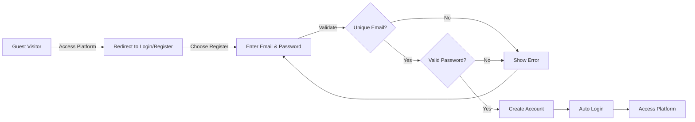

### Customer Login and Session

### Login Authentication

WHEN a customer logs in, THE system SHALL:
1. Accept an email address and password combination
2. Verify the credentials against the customer account
3. Verify the account is not banned
4. Create a session for the authenticated customer

IF the email is not registered, THE system SHALL reject the login.

IF the password is incorrect, THE system SHALL reject the login.

IF the account is banned, THE system SHALL reject the login and display a ban notification.

### Session Management

WHEN a customer is logged in, THE system SHALL maintain the customer's session across platform activities.

WHEN a customer logs out, THE system SHALL terminate the session and clear authentication state.

WHEN a session expires, THE system SHALL require the customer to log in again.

### Post-Login Access

WHEN a customer successfully logs in, THE system SHALL:
1. Restore access to the customer's cart
2. Enable access to the customer's wishlist
3. Enable access to the customer's order history
4. Enable access to the customer's addresses
5. Enable product browsing and purchasing

### Login Flow Diagram

```mermaid
flowchart LR
    A["Customer"] -->|Enter Credentials| B["Submit Login"]
    B --> C{"Valid Email?"}
    C -->|No| D["Show Error"]
    D --> A
    C -->|Yes| E{"Correct Password?"}
    E -->|No| D
    E -->|Yes| F{"Account Banned?"}
    F -->|Yes| G["Show Ban Notice"]
    F -->|No| H["Create Session"]
    H --> I["Access Platform"]
```

### Profile Management Journey

### Profile Viewing

WHEN an authenticated customer views their profile, THE system SHALL display:
1. Email address (read-only)
2. Display name
3. Phone number

### Profile Update Process

WHEN a customer updates their profile, THE system SHALL:
1. Accept changes to display name
2. Accept changes to phone number
3. Validate any format requirements
4. Save the updated profile information

THE system SHALL NOT allow changes to the email address through profile editing.

THE system SHALL allow display name and phone number to be left blank or cleared.

### Password Change Process

WHEN a customer requests a password change, THE system SHALL:
1. Require the current password for verification
2. Require a new password that meets security requirements
3. Require confirmation of the new password
4. Validate that the new password matches the confirmation

IF the current password is incorrect, THE system SHALL reject the password change.

IF the new password does not meet security requirements, THE system SHALL reject the password change.

IF the new password does not match the confirmation, THE system SHALL reject the password change.

WHEN a password is successfully changed, THE system SHALL:
1. Update the customer's password
2. Maintain the current session
3. Not require re-login

### Password Change Flow Diagram

```mermaid
flowchart LR
    A["Customer"] -->|Request Change| B["Enter Current Password"]
    B --> C{"Correct?"}
    C -->|No| D["Show Error"]
    D --> B
    C -->|Yes| E["Enter New Password"]
    E --> F{"Meets Requirements?"}
    F -->|No| D
    F -->|Yes| G["Confirm New Password"]
    G --> H{"Matches?"}
    H -->|No| D
    H -->|Yes| I["Update Password"]
```

### Address Management Journey

### Address List Viewing

WHEN an authenticated customer views their addresses, THE system SHALL display:
1. All saved addresses
2. Which address is currently set as default
3. Complete address details for each saved address

### Address Addition Process

WHEN a customer adds a new address, THE system SHALL require:
1. Recipient name
2. Phone number
3. Street address
4. City
5. State/province
6. Postal code
7. Country

THE system SHALL validate all required fields before saving.

WHEN a customer adds their first address, THE system SHALL automatically set it as the default shipping address.

### Address Editing Process

WHEN a customer edits an existing address, THE system SHALL:
1. Pre-populate all fields with current values
2. Allow modification of any field
3. Validate all required fields before saving
4. Preserve the default status if the edited address is currently the default

### Default Address Selection

WHEN a customer sets an address as default, THE system SHALL:
1. Update the default flag on the selected address
2. Remove the default flag from any previously default address
3. Ensure exactly one address is marked as default at all times

WHEN a customer has multiple addresses, THE system SHALL allow the customer to change which address is default.

### Address Deletion Process

WHEN a customer deletes an address, THE system SHALL:
1. Remove the address from the customer's address list
2. IF the deleted address was the default, require the customer to select a new default address

IF the customer attempts to delete their only address, THE system SHALL allow the deletion.

IF the customer attempts to delete their default address and has other addresses, THE system SHALL require selection of a new default before deletion.

### Address Management Flow Diagram

```mermaid
flowchart LR
    A["View Addresses"] --> B{"Action?"}
    B -->|Add| C["Enter Address Details"]
    C --> D["Validate & Save"]
    D --> E{"First Address?"}
    E -->|Yes| F["Set as Default"]
    E -->|No| A
    F --> A
    B -->|Edit| G["Modify Fields"]
    G --> D
    B -->|Set Default| H["Update Default Flag"]
    H --> A
    B -->|Delete| I{"Is Default?"}
    I -->|No| J["Remove Address"]
    I -->|Yes| K{"Other Addresses?"}
    K -->|No| J
    K -->|Yes| L["Select New Default"]
    L --> J
    J --> A
```

### Account Closure Journey

### Account Deletion Request

WHEN a customer requests to delete their account, THE system SHALL:
1. Require explicit confirmation of the deletion request
2. Warn the customer about what will be preserved
3. Process the deletion immediately upon confirmation

THE system SHALL NOT require administrator approval for customer account deletion.

### Data Removal on Account Deletion

WHEN a customer account is deleted, THE system SHALL remove:
1. The customer's profile information (display name, phone number)
2. The customer's authentication credentials
3. The customer's shopping cart and cart items
4. The customer's wishlist
5. The customer's saved addresses

THE system SHALL NOT restore stock quantities for any past orders from deleted accounts.

### Data Preservation on Account Deletion

WHEN a customer account is deleted, THE system SHALL preserve:
1. All order records associated with the customer
2. All order items within those orders
3. Order item snapshots (product state at time of purchase)
4. Seller profile snapshots (seller state at time of purchase)

THE system SHALL preserve order history for seller records and legal compliance purposes.

### Review Handling on Account Deletion

WHEN a customer account is deleted, THE system SHALL preserve all reviews written by the customer.

WHEN displaying reviews from a deleted customer account, THE system SHALL show the author as "deleted user" instead of the original display name.

THE system SHALL NOT remove reviews from product pages when the author's account is deleted.

THE system SHALL preserve review snapshots for deleted customer accounts.

### Post-Deletion Access

WHEN a customer account is deleted, THE system SHALL:
1. Terminate any active sessions
2. Prevent future login with the deleted credentials
3. Allow the email address to be used for a new registration

### Account Deletion Flow Diagram

```mermaid
flowchart LR
    A["Customer Requests Deletion"] --> B["Show Warning"]
    B --> C["Confirm Deletion"]
    C --> D{"Confirmed?"}
    D -->|No| E["Cancel"]
    D -->|Yes| F["Delete Profile & Credentials"]
    F --> G["Delete Cart & Wishlist"]
    G --> H["Delete Addresses"]
    H --> I["Preserve Orders"]
    I --> J["Preserve Reviews"]
    J --> K["Mark Reviews as 'deleted user'"]
    K --> L["Terminate Session"]
    L --> M["Account Deleted"]
```

## Seller User Scenarios

A user registers as a seller by providing their email, password, and initial shop information. The seller account enters pending status and awaits administrator approval before any selling activities can begin. The seller can check their approval status at any time to see if it is pending, approved, or rejected. If rejected, the seller views the rejection reason provided by the administrator and can submit a new registration request with updated information. Once approved, the seller can create products with variants, upload product images, and manage inventory. Sellers can edit their shop profile including shop name, description, and logo image, with each edit creating a snapshot for historical tracking. When a seller decides to delete their account, the system checks for pending orders and active refund or cancellation requests before allowing deletion. If deletion conditions are met, the seller's products are removed from listings but order history and snapshots are preserved for legal purposes. The shop name in past orders remains visible to customers who previously purchased from that seller. Sellers cannot delete their account if they have pending orders or unresolved customer requests.

### Seller Registration and Onboarding Journey

### Registration Flow

WHEN a user registers as a seller, THE system SHALL require email, password, shop name, shop description, and logo image.

WHEN a seller registration is submitted, THE system SHALL create a seller account with pending approval status.

THE system SHALL not allow pending sellers to create products.

THE system SHALL not allow pending sellers to access seller dashboard features.

THE system SHALL allow pending sellers to view their approval status.

THE system SHALL allow pending sellers to edit their shop profile information while awaiting approval.

### Onboarding Steps

WHEN a seller account is approved, THE system SHALL enable full seller capabilities including product creation and dashboard access.

WHEN a new seller accesses the dashboard for the first time, THE system SHALL display an empty product list and zero order statistics.

```mermaid
flowchart LR
    A["Submit Registration"] --> B["Pending Status"]
    B --> C{"Admin Review"}
    C -->|Approved| D["Active Seller"]
    C -->|Rejected| E["Rejected Status"]
    E --> F["Resubmit Request"]
    F --> B
    D --> G["Create Products"]
    D --> H["Manage Orders"]
```

### Administrator Approval Process

### Administrator Review Workflow

WHEN an administrator views pending seller registrations, THE system SHALL display all sellers with pending approval status.

WHEN an administrator views a pending seller registration, THE system SHALL display the shop name, shop description, and logo image.

WHEN an administrator approves a seller registration, THE system SHALL change the seller status to approved.

WHEN an administrator approves a seller registration, THE system SHALL grant the seller full selling privileges.

### Rejection Process

WHEN an administrator rejects a seller registration, THE system SHALL require a rejection reason.

WHEN an administrator rejects a seller registration, THE system SHALL change the seller status to rejected.

WHEN a seller registration is rejected, THE system SHALL preserve the rejection reason for the seller to view.

THE system SHALL allow administrators to view the complete registration history including submission timestamp.

```mermaid
sequenceDiagram
    participant S as Seller
    participant Sys as System
    participant A as Administrator
    S->>Sys: Submit registration
    Sys->>Sys: Create pending account
    A->>Sys: View pending sellers
    Sys-->>A: Display seller details
    alt Approve
        A->>Sys: Approve registration
        Sys->>S: Grant seller privileges
    else Reject
        A->>Sys: Reject with reason
        Sys->>S: Store rejection reason
    end
```

### Seller Approval Status Check

### Status Viewing

WHEN a seller views their approval status, THE system SHALL display one of: pending, approved, or rejected.

WHEN a pending seller views their status, THE system SHALL indicate that approval is awaiting administrator review.

WHEN an approved seller views their status, THE system SHALL indicate that full seller privileges are active.

WHEN a rejected seller views their status, THE system SHALL display the rejection reason provided by the administrator.

THE system SHALL allow sellers to view their approval status at any time without restriction.

THE system SHALL display the timestamp of when the approval or rejection decision was made.

### Status-Based Feature Access

IF a seller has pending status, THEN THE system SHALL restrict access to product creation features.

IF a seller has approved status, THEN THE system SHALL grant access to all seller features.

IF a seller has rejected status, THEN THE system SHALL allow the seller to submit a new registration request.

### Rejected Seller Reapplication

### Reapplication Flow

WHEN a rejected seller views their account, THE system SHALL display an option to submit a new registration request.

WHEN a rejected seller submits a new registration request, THE system SHALL require updated shop name, shop description, and logo image.

WHEN a rejected seller submits a new registration request, THE system SHALL reset the seller status to pending.

WHEN a rejected seller submits a new registration request, THE system SHALL preserve the original email and password.

THE system SHALL not create a duplicate seller account for the same email when a rejected seller resubmits.

### Reapplication History

THE system SHALL preserve the history of previous rejection reasons for the seller to review.

THE system SHALL allow administrators to view all previous registration attempts by a seller.

```mermaid
flowchart LR
    A["Rejected Status"] --> B["View Rejection Reason"]
    B --> C["Update Shop Info"]
    C --> D["Submit New Request"]
    D --> E["Pending Status"]
    E --> F{"Admin Review"}
    F -->|Approved| G["Active Seller"]
    F -->|Rejected| A
```

### Shop Information Management

### Profile Viewing and Editing

WHEN a seller views their shop profile, THE system SHALL display shop name, shop description, and logo image.

WHEN an approved seller edits their shop profile, THE system SHALL allow changes to shop name, shop description, or logo image.

WHEN a seller edits their shop profile, THE system SHALL create a snapshot of the previous state before saving changes.

THE system SHALL allow sellers to edit any combination of profile fields in a single update.

### Snapshot Preservation

WHEN a seller profile snapshot is created, THE system SHALL record the previous shop name, shop description, and logo image.

WHEN a seller profile snapshot is created, THE system SHALL record the timestamp of the change.

THE system SHALL allow sellers to view their own profile edit history through snapshots.

THE system SHALL allow administrators to view any seller's profile edit history.

THE system SHALL preserve seller profile snapshots even after account deletion.

```mermaid
flowchart LR
    A["View Profile"] --> B["Edit Fields"]
    B --> C["Create Snapshot"]
    C --> D["Save Changes"]
    D --> E["Updated Profile"]
```

### Seller Account Deletion Conditions

### Deletion Eligibility Check

WHEN a seller requests account deletion, THE system SHALL check for pending order items with paid or shipped status.

WHEN a seller requests account deletion, THE system SHALL check for pending cancellation requests.

WHEN a seller requests account deletion, THE system SHALL check for pending refund requests.

IF any pending order items exist, THEN THE system SHALL reject the deletion request.

IF any pending cancellation requests exist, THEN THE system SHALL reject the deletion request.

IF any pending refund requests exist, THEN THE system SHALL reject the deletion request.

THE system SHALL display a clear reason when deletion is rejected due to pending items.

### Deletion Execution

WHEN deletion conditions are satisfied, THE system SHALL delete the seller account.

WHEN a seller account is deleted, THE system SHALL remove all products from listings.

WHEN a seller account is deleted, THE system SHALL preserve order history records.

WHEN a seller account is deleted, THE system SHALL preserve order item snapshots.

THE system SHALL not remove the seller's shop name from historical orders.

```mermaid
flowchart LR
    A["Request Deletion"] --> B{"Check Pending Orders"}
    B -->|Has Pending| C["Reject Deletion"]
    B -->|None| D{"Check Requests"}
    D -->|Has Requests| C
    D -->|None| E["Execute Deletion"]
    E --> F["Remove Products"]
    E --> G["Preserve Orders"]
```

### Pending Order Restrictions

### Understanding Pending Orders

A pending order item is defined as an order item with status paid or shipped that has not yet been delivered.

A pending cancellation request is defined as a cancellation request with status pending awaiting seller response.

A pending refund request is defined as a refund request with status pending awaiting seller response.

### Restrictions Applied

IF a seller has pending order items, THEN THE system SHALL block account deletion.

IF a seller has pending cancellation requests, THEN THE system SHALL block account deletion.

IF a seller has pending refund requests, THEN THE system SHALL block account deletion.

THE system SHALL allow sellers to view a count of pending orders on their dashboard.

THE system SHALL allow sellers to view a count of pending cancellation and refund requests.

### Clearing Restrictions

WHEN all order items are delivered, cancelled, or refunded, THEN THE system SHALL clear the pending order restriction for deletion.

WHEN all cancellation requests are resolved, THEN THE system SHALL clear the pending cancellation restriction for deletion.

WHEN all refund requests are resolved, THEN THE system SHALL clear the pending refund restriction for deletion.

### Product Lifecycle for Sellers

### Product Creation

WHEN an approved seller creates a product, THE system SHALL require name, description, category, and base price.

WHEN a seller creates a product, THE system SHALL associate the product with the seller as owner.

THE system SHALL allow only the product owner to edit or delete the product.

### Product Editing and Snapshots

WHEN a seller edits a product, THE system SHALL create a product snapshot capturing the previous state.

WHEN a seller edits a product variant, THE system SHALL create a variant snapshot capturing the previous state.

THE system SHALL include all variant states in the product snapshot at the time of edit.

### Product Deletion Constraints

WHEN a seller attempts to delete a product, THE system SHALL check for pending order items on any variant.

IF any variant has pending order items with paid or shipped status, THEN THE system SHALL reject the product deletion.

IF any variant has pending cancellation or refund requests, THEN THE system SHALL reject the product deletion.

WHEN product deletion is allowed, THE system SHALL delete all variants and inventory records associated with the product.

THE system SHALL preserve product snapshots even after product deletion.

```mermaid
flowchart LR
    A["Create Product"] --> B["Add Variants"]
    B --> C["Manage Inventory"]
    C --> D["Receive Orders"]
    D --> E{"Has Pending Items?"}
    E -->|Yes| F["Cannot Delete"]
    E -->|No| G["Can Delete"]
    G --> H["Snapshots Preserved"]
```

### Seller Shop Name Preservation

### Snapshot at Order Time

WHEN an order is placed, THE system SHALL create a snapshot of the seller profile at that moment.

WHEN a seller profile snapshot is created for an order, THE system SHALL capture the shop name, shop description, and logo image.

THE system SHALL associate the seller profile snapshot with each order item from that seller.

### Historical Preservation

THE system SHALL preserve seller shop names in historical orders regardless of subsequent profile edits.

THE system SHALL preserve seller shop names in historical orders even after seller account deletion.

WHEN a customer views past orders, THE system SHALL display the shop name as it was at the time of purchase.

WHEN a product name or variant option has changed since purchase, THE system SHALL display the information as captured in the order item snapshot.

### Dispute Resolution

THE system SHALL allow administrators to view seller profile snapshots for dispute resolution purposes.

THE system SHALL provide evidence of what the seller's profile looked like at the time of any transaction.

### Seller Dashboard Access

### Dashboard Availability

WHEN an approved seller accesses the dashboard, THE system SHALL display total number of products.

WHEN an approved seller accesses the dashboard, THE system SHALL display total number of order items for their products.

WHEN an approved seller accesses the dashboard, THE system SHALL display count of pending cancellation requests.

WHEN an approved seller accesses the dashboard, THE system SHALL display count of pending refund requests.

### Access Control

IF a seller has pending approval status, THEN THE system SHALL deny dashboard access.

IF a seller account is suspended, THEN THE system SHALL deny dashboard access.

IF a seller account is banned, THEN THE system SHALL deny dashboard access.

### Order Item Management

WHEN an approved seller views the order items list, THE system SHALL display all order items for their products.

WHEN an approved seller views order items, THE system SHALL allow filtering by item status.

THE system SHALL display pending items requiring attention prominently on the dashboard.

```mermaid
flowchart LR
    A["Login as Seller"] --> B{"Status Check"}
    B -->|Approved| C["Dashboard Access"]
    B -->|Pending| D["Status Page"]
    B -->|Suspended/Banned| E["Access Denied"]
    C --> F["View Products"]
    C --> G["View Orders"]
    C --> H["View Requests"]
```

## Administrator User Scenarios

A user becomes an administrator by submitting a request that includes a reason for wanting administrative access. Super administrators review pending administrator requests and can approve or reject them. Once approved as a regular administrator, the user gains access to seller management, category management, and platform oversight functions. Regular administrators can view pending seller approvals and approve or reject seller registrations with required rejection reasons. Administrators can suspend seller accounts, which hides products from listings and prevents new product creation while allowing order fulfillment to continue. Category management allows administrators to create, edit, and delete categories and subcategories. Administrators can view all products on the platform and delete any product that violates policies. For order oversight, administrators can force-cancel or force-refund orders when disputes cannot be resolved between buyers and sellers. User management functions allow administrators to ban and unban customer and seller accounts. Super administrators can promote regular administrators to super administrator status or demote other super administrators, but cannot demote themselves.

### Administrator Request Workflow

### End-to-End Administrator Request Flow

WHEN a customer or seller submits a request to become an administrator, THE system SHALL:
1. Record the request with the provided reason text
2. Set the request status to "pending"
3. Make the request visible to super administrators

WHEN a super administrator views pending administrator requests, THE system SHALL:
1. Display a list of all requests with status "pending"
2. Show the requester's current role (customer or seller)
3. Show the reason text provided by the requester
4. Show the date and time of the request submission

WHEN a super administrator approves an administrator request, THE system SHALL:
1. Change the request status to "approved"
2. Record the approval timestamp
3. Record which super administrator approved the request
4. Convert the requester to a regular administrator
5. Grant the user access to administrator functions

WHEN a super administrator rejects an administrator request, THE system SHALL:
1. Change the request status to "rejected"
2. Record the rejection timestamp
3. Record which super administrator rejected the request
4. Maintain the requester's original role without changes

IF a user who is already an administrator submits an administrator request, THE system SHALL reject the duplicate submission.

```mermaid
flowchart LR
    A["Submit Request"] --> B["Pending Status"]
    B --> C{"Super Admin Review"}
    C -->|Approve| D["Approved - Become Regular Admin"]
    C -->|Reject| E["Rejected - Keep Original Role"]
```

### Super Administrator Privileges

### Privilege Distinction Between Administrator Grades

THE system SHALL maintain two administrator grades: regular administrator and super administrator.

WHEN a regular administrator performs platform operations, THE system SHALL allow access to:
1. Seller approval and rejection
2. Seller suspension and unsuspension
3. Category creation, editing, and deletion
4. Product viewing and deletion
5. Order force-cancel and force-refund
6. Customer and seller account banning

WHEN a super administrator performs platform operations, THE system SHALL allow access to all regular administrator functions PLUS:
1. Administrator request approval and rejection
2. Regular administrator promotion to super administrator
3. Other super administrator demotion to regular administrator

IF a regular administrator attempts to approve administrator requests, THE system SHALL reject the operation.

IF a regular administrator attempts to promote or demote administrators, THE system SHALL reject the operation.

IF a super administrator attempts to demote themselves, THE system SHALL reject the operation.

### Promotion Flow

WHEN a super administrator promotes a regular administrator to super administrator, THE system SHALL:
1. Update the administrator's grade to "super"
2. Grant access to super administrator-specific functions
3. Record the promotion with timestamp and promoting administrator

### Demotion Flow

WHEN a super administrator demotes another super administrator to regular administrator, THE system SHALL:
1. Update the administrator's grade to "regular"
2. Revoke access to super administrator-specific functions
3. Record the demotion with timestamp and demoting administrator

### Seller Approval Management

### End-to-End Seller Approval Flow

WHEN a seller submits a registration request, THE system SHALL:
1. Create a seller account with status "pending"
2. Make the seller visible in the pending approvals list for administrators
3. Prevent the seller from creating products or selling

WHEN an administrator views pending seller approvals, THE system SHALL:
1. Display a list of all sellers with pending status
2. Show the seller's email, shop name, and registration date
3. Allow the administrator to approve or reject each seller

WHEN an administrator approves a seller registration, THE system SHALL:
1. Change the seller status to "approved"
2. Enable the seller to create and manage products
3. Enable the seller to receive and process orders
4. Record the approval with timestamp and administrator

WHEN an administrator rejects a seller registration, THE system SHALL:
1. Require the administrator to provide a rejection reason
2. Change the seller status to "rejected"
3. Store the rejection reason
4. Prevent the seller from creating products
5. Record the rejection with timestamp, administrator, and reason

WHEN a rejected seller views their approval status, THE system SHALL:
1. Display the status as "rejected"
2. Show the rejection reason provided by the administrator
3. Allow submission of a new registration request

WHEN a rejected seller submits a new registration request, THE system SHALL:
1. Create a new pending approval entry
2. Preserve the history of previous rejections

```mermaid
flowchart LR
    A["Seller Registration"] --> B["Pending Status"]
    B --> C{"Administrator Review"}
    C -->|Approve| D["Approved - Can Sell"]
    C -->|Reject with Reason| E["Rejected"]
    E --> F["View Rejection Reason"]
    F --> G["Submit New Request"]
    G --> B
```

### Seller Suspension Process

### End-to-End Seller Suspension Flow

WHEN an administrator suspends a seller account, THE system SHALL:
1. Set the seller status to "suspended"
2. Hide all of the seller's products from search and category listings
3. Prevent new purchases of the seller's products
4. Prevent the seller from creating new products
5. Prevent the seller from editing existing products
6. Allow the seller to view and process existing orders
7. Allow the seller to respond to cancellation requests
8. Allow the seller to respond to refund requests
9. Allow the seller to create shipments
10. Record the suspension with timestamp and administrator

WHEN a suspended seller attempts to create a product, THE system SHALL reject the operation.

WHEN a suspended seller attempts to edit a product, THE system SHALL reject the operation.

WHEN a customer attempts to purchase a product from a suspended seller, THE system SHALL prevent the purchase.

### End-to-End Seller Unsuspension Flow

WHEN an administrator unsuspends a seller account, THE system SHALL:
1. Change the seller status back to "approved"
2. Make all of the seller's products visible in search and category listings
3. Enable purchases of the seller's products
4. Enable the seller to create and edit products
5. Record the unsuspension with timestamp and administrator

### Suspension During Active Orders

WHILE a seller is suspended, THE system SHALL:
1. Continue to allow customers to view their existing orders from that seller
2. Continue to allow the seller to ship pending items
3. Continue to allow the seller to approve or reject cancellation requests
4. Continue to allow the seller to approve or reject refund requests
5. Continue to allow customers to confirm delivery of shipped items

### Category Management Operations

### End-to-End Category Creation Flow

WHEN an administrator creates a category, THE system SHALL:
1. Require a category name
2. Allow an optional description
3. Allow optional specification of a parent category for subcategories
4. Prevent nesting beyond one level (subcategory cannot have its own subcategory)
5. Record the creation with timestamp and administrator

IF an administrator attempts to create a subcategory under another subcategory, THE system SHALL reject the operation.

### End-to-End Category Editing Flow

WHEN an administrator edits a category, THE system SHALL:
1. Allow modification of the category name
2. Allow modification of the category description
3. Preserve all existing product associations
4. Record the edit with timestamp and administrator

### End-to-End Category Deletion Flow

WHEN an administrator deletes a category, THE system SHALL:
1. Remove the category from listings
2. Set all products in that category to "uncategorized"
3. Preserve all products without deletion
4. Record the deletion with timestamp and administrator

WHEN an administrator deletes a parent category with subcategories, THE system SHALL:
1. Delete the parent category
2. Convert all subcategories to top-level categories
3. Preserve all products in those subcategories

```mermaid
flowchart LR
    A["Create Category"] --> B["Optional: Add Subcategory"]
    B --> C["Products Assigned"]
    C --> D{"Edit or Delete"}
    D -->|Edit| E["Update Name/Description"]
    D -->|Delete| F["Products Become Uncategorized"]
```

### Product Oversight Capabilities

### End-to-End Product Viewing Flow

WHEN an administrator views all products on the platform, THE system SHALL:
1. Display products from all sellers
2. Show product name, seller shop name, category, and status
3. Allow filtering by seller, category, or status
4. Provide access to product snapshots for any product

WHEN an administrator views snapshots of a product, THE system SHALL:
1. Display all historical snapshots of the product
2. Show the state before and after each edit
3. Include variant snapshots within each product snapshot
4. Show the timestamp of each snapshot

### End-to-End Product Deletion Flow

WHEN an administrator deletes a product for policy violations, THE system SHALL:
1. Remove the product from all listings and search results
2. Delete all variants of the product
3. Delete all inventory records for each variant
4. Preserve any order items that reference the product
5. Preserve product snapshots for dispute resolution
6. Record the deletion with timestamp, administrator, and reason

WHEN an administrator deletes a product that has pending order items, THE system SHALL allow the deletion and:
1. Preserve order item snapshots for pending orders
2. Maintain the seller's obligation to fulfill existing orders
3. Prevent the product from appearing in new orders

IF a product is deleted by an administrator, THE system SHALL preserve the product name in order item snapshots for customers viewing their order history.

### Order Force-Cancel Process

### End-to-End Order Item Force-Cancel Flow

WHEN an administrator force-cancels an individual order item, THE system SHALL:
1. Change the item status to "cancelled"
2. Process a refund for that item to the customer
3. Restore the stock quantity for that variant via inventory record
4. Record the force-cancel with timestamp, administrator, and reason
5. Allow remaining items in the order to continue processing normally

WHEN an administrator force-cancels all items in an order, THE system SHALL:
1. Change all item statuses to "cancelled"
2. Process refunds for all items to the customer
3. Restore stock quantities for all variants via inventory records
4. Set the overall order status to "cancelled"
5. Record the force-cancel with timestamp, administrator, and reason

### Force-Cancel Authorization

THE system SHALL allow administrators to force-cancel order items regardless of:
1. The item's current status
2. The seller's approval or rejection of any existing cancellation request

WHEN an administrator force-cancels an item with an existing pending cancellation request, THE system SHALL:
1. Close the cancellation request
2. Record the force-cancel action
3. Process the refund immediately

```mermaid
flowchart LR
    A["Identify Problem Order"] --> B{"Select Scope"}
    B -->|Single Item| C["Force-Cancel Item"]
    B -->|Entire Order| D["Force-Cancel All Items"]
    C --> E["Refund Customer"]
    D --> E
    E --> F["Restore Stock"]
```

### Order Force-Refund Process

### End-to-End Order Item Force-Refund Flow

WHEN an administrator force-refunds an individual order item, THE system SHALL:
1. Change the item status to "refunded"
2. Process a refund for that item to the customer
3. Restore the stock quantity for that variant via inventory record
4. Record the force-refund with timestamp, administrator, and reason
5. Allow remaining items in the order to continue processing normally

WHEN an administrator force-refunds all items in an order, THE system SHALL:
1. Change all item statuses to "refunded"
2. Process refunds for all items to the customer
3. Restore stock quantities for all variants via inventory records
4. Set the overall order status to "refunded"
5. Record the force-refund with timestamp, administrator, and reason

### Force-Refund Authorization

THE system SHALL allow administrators to force-refund order items regardless of:
1. The item's current status (paid, shipped, or delivered)
2. Whether a refund request exists
3. The 7-day refund window
4. The seller's approval or rejection of any existing refund request

WHEN an administrator force-refunds an item with an existing pending refund request, THE system SHALL:
1. Close the refund request
2. Record the force-refund action
3. Process the refund immediately

### Difference from Force-Cancel

IF an item has not been shipped, THE system SHALL use force-cancel for the operation.

IF an item has been shipped or delivered, THE system SHALL use force-refund for the operation.

### User Ban Management

### End-to-End Customer Ban Flow

WHEN an administrator bans a customer account, THE system SHALL:
1. Set the customer's banned status to true
2. Prevent the customer from logging in
3. Preserve the customer's order history
4. Preserve the customer's reviews
5. Record the ban with timestamp, administrator, and reason

WHEN a banned customer attempts to log in, THE system SHALL reject the login and display a message indicating the account is banned.

WHEN an administrator unbans a customer account, THE system SHALL:
1. Set the customer's banned status to false
2. Allow the customer to log in normally
3. Restore full access to all customer functions
4. Record the unban with timestamp and administrator

### End-to-End Seller Ban Flow

WHEN an administrator bans a seller account, THE system SHALL:
1. Set the seller's banned status to true
2. Prevent the seller from logging in
3. Hide all of the seller's products from listings
4. Preserve existing orders and order history
5. Record the ban with timestamp, administrator, and reason

WHEN a banned seller attempts to log in, THE system SHALL reject the login and display a message indicating the account is banned.

WHEN an administrator unbans a seller account, THE system SHALL:
1. Set the seller's banned status to false
2. Allow the seller to log in normally
3. Restore visibility of the seller's products to their previous state
4. Record the unban with timestamp and administrator

### Ban vs Suspension Distinction

THE system SHALL differentiate between banned and suspended sellers:
- Banned sellers cannot log in
- Suspended sellers can log in but cannot create or edit products
- Banned sellers' products are hidden
- Suspended sellers' products are hidden but can still fulfill orders

### Administrator Grade Hierarchy

### Two-Tier Administrator Structure

THE system SHALL maintain exactly two administrator grades:
1. Regular administrator - standard platform oversight capabilities
2. Super administrator - full platform oversight plus administrator management

### Grade Transition Rules

WHEN a user is approved as an administrator, THE system SHALL assign them the grade of "regular administrator."

WHEN a super administrator promotes a regular administrator, THE system SHALL:
1. Require confirmation of the promotion
2. Update the administrator's grade immediately
3. Grant access to administrator request review functions
4. Grant access to administrator promotion and demotion functions

WHEN a super administrator demotes another super administrator, THE system SHALL:
1. Require confirmation of the demotion
2. Update the administrator's grade immediately
3. Revoke access to super administrator-only functions
4. Retain the demoted administrator's other administrator privileges

### Self-Demotion Prevention

IF a super administrator attempts to demote themselves, THE system SHALL:
1. Reject the operation
2. Display an error indicating self-demotion is not permitted
3. Suggest contacting another super administrator for demotion

### Minimum Super Administrator Count

WHEN the last super administrator attempts to demote themselves or be demoted, THE system SHALL reject the operation to ensure at least one super administrator exists.

```mermaid
flowchart LR
    A["Regular Administrator"] -->|Promoted by Super Admin| B["Super Administrator"]
    B -->|Demoted by Other Super Admin| A
    B -.->|Cannot Demote Self| B
```

### Platform Moderation Scenarios

### Dispute Resolution Scenario

WHEN a customer and seller cannot resolve a cancellation or refund request, an administrator may intervene:

1. THE administrator SHALL view the order item and all related requests
2. THE administrator SHALL review product snapshots to verify item details at time of purchase
3. THE administrator SHALL review the seller profile snapshot to verify seller information at time of purchase
4. THE administrator SHALL either force-cancel or force-refund the item
5. THE system SHALL process the refund and restore stock

### Policy Violation Scenario

WHEN an administrator identifies a product that violates platform policies:

1. THE administrator SHALL view the product details and seller information
2. THE administrator SHALL review product snapshots for history of changes
3. THE administrator SHALL delete the product
4. THE system SHALL preserve order history for any existing purchases
5. THE administrator MAY ban the seller if the violation warrants account termination

### Seller Misconduct Scenario

WHEN an administrator identifies seller misconduct requiring account action:

1. THE administrator SHALL first suspend the seller account to prevent new sales
2. THE seller SHALL continue to fulfill existing orders while suspended
3. THE administrator SHALL monitor the seller's order completion
4. AFTER pending orders are resolved, THE administrator MAY ban the seller account

### Mass Account Management Scenario

WHEN an administrator needs to manage multiple problematic accounts:

1. THE administrator SHALL view lists of customers and sellers with filtering options
2. THE administrator SHALL be able to ban or unban multiple accounts
3. THE administrator SHALL be able to suspend or unsuspend multiple seller accounts
4. THE system SHALL record all actions with timestamps and administrator identification

### Audit Trail for Moderation

WHEN an administrator performs any moderation action, THE system SHALL:
1. Record the action type (ban, unban, suspend, unsuspend, force-cancel, force-refund, product deletion)
2. Record the target (customer, seller, product, order item)
3. Record the timestamp
4. Record the administrator who performed the action
5. Record any reason or notes provided

## AdministratorRequest User Scenarios

Any registered user, whether customer or seller, can submit a request to become an administrator by providing a reason text explaining their motivation. The request is created with pending status and appears in the list of pending requests visible only to super administrators. Super administrators review the request details including the user's existing account information and the provided reason. When a super administrator approves a request, the user's account is upgraded to regular administrator status and they gain access to administrative functions. When a super administrator rejects a request, the status changes to rejected and the reason for rejection may be recorded for the requester's reference. Users can check the status of their administrator request to see if it is still pending, approved, or rejected. If a request is rejected, the user can submit a new request with updated reasoning. Administrator requests do not affect the user's existing role as customer or seller while pending.

### Administrator Request Submission Flow

### Request Eligibility and Initiation

WHEN a registered user (customer or seller) initiates an administrator request, THE system SHALL verify that the user is not already an administrator.

IF the user is already an administrator, THE system SHALL reject the request submission.

IF the user has an existing pending administrator request, THE system SHALL reject the new request submission.

### Reason Documentation

WHEN a user submits an administrator request, THE system SHALL require the user to provide a reason text explaining their motivation for becoming an administrator.

THE system SHALL record the submitted reason as part of the administrator request record.

### Request Creation

WHEN a valid administrator request is submitted, THE system SHALL create a new AdministratorRequest record with status "pending".

THE system SHALL associate the request with the submitting user.

THE system SHALL record the current timestamp as the creation time.

WHEN an administrator request is successfully created, THE system SHALL confirm the submission to the user.

```mermaid
flowchart LR
    A["User initiates request"] --> B{"Already admin?"}
    B -->|Yes| C["Reject submission"]
    B -->|No| D{"Pending request exists?"}
    D -->|Yes| C
    D -->|No| E["Enter reason text"]
    E --> F["Create pending request"]
    F --> G["Confirm submission"]
```

### Request Status Tracking Flow

### Status Visibility

WHEN a user views their administrator request status, THE system SHALL display the current status (pending, approved, or rejected).

IF the user has no administrator request, THE system SHALL indicate that no request exists.

IF the user has multiple administrator requests, THE system SHALL display the most recent request status.

### Pending Status Display

WHEN a user views a pending administrator request, THE system SHALL display the submitted reason and the creation timestamp.

THE system SHALL indicate that the request is awaiting review by a super administrator.

### Rejection Details

IF the administrator request status is "rejected", THE system SHALL display any rejection reason provided by the reviewing super administrator.

IF the administrator request status is "approved", THE system SHALL display the approval timestamp.

### Request History

WHEN a user views their administrator request history, THE system SHALL list all previous administrator requests with their statuses and timestamps.

THE system SHALL order the list from newest to oldest.

### Super Administrator Review Flow

### Pending Request Queue

WHEN a super administrator views the administrator request queue, THE system SHALL display all administrator requests with status "pending".

THE system SHALL display for each request: the requester's account type (customer or seller), the submitted reason, and the creation timestamp.

THE system SHALL order the pending requests from oldest to newest.

### Request Detail Review

WHEN a super administrator selects a pending request for review, THE system SHALL display the complete request details including the requester's existing profile information.

THE system SHALL display the reason text submitted by the requester.

### Approval Action

WHEN a super administrator approves an administrator request, THE system SHALL change the request status to "approved".

THE system SHALL record the reviewing super administrator and the approval timestamp.

THE system SHALL upgrade the requester's account to regular administrator status.

THE system SHALL grant the newly promoted administrator access to administrative functions.

### Rejection Action

WHEN a super administrator rejects an administrator request, THE system SHALL require the super administrator to provide a rejection reason.

THE system SHALL change the request status to "rejected".

THE system SHALL record the reviewing super administrator, the rejection reason, and the rejection timestamp.

THE system SHALL preserve the requester's existing role (customer or seller) unchanged.

```mermaid
flowchart LR
    A["View pending queue"] --> B["Select request"]
    B --> C["Review details"]
    C --> D{"Approve?"}
    D -->|Yes| E["Set approved status"]
    E --> F["Upgrade to admin"]
    D -->|No| G["Enter rejection reason"]
    G --> H["Set rejected status"]
```

### Role Upgrade Process

### Immediate Effect

WHEN an administrator request is approved, THE system SHALL immediately upgrade the user's account to regular administrator status.

THE system SHALL NOT remove the user's existing role as customer or seller.

### Administrator Onboarding

WHEN a user is promoted to administrator, THE system SHALL grant access to the administrator dashboard.

THE system SHALL assign the administrator grade as "regular" (not super administrator).

THE system SHALL enable the administrator to perform functions defined for regular administrators.

### Access Rights Assignment

THE system SHALL grant the newly promoted administrator the ability to:
- View and manage seller approvals
- Suspend and unsuspend seller accounts
- Create, edit, and delete categories
- View all products and their snapshots
- Delete products for policy violations
- View all orders
- Force-cancel and force-refund orders
- View and ban customer and seller accounts

THE system SHALL NOT grant the newly promoted administrator the ability to:
- Promote or demote administrators
- Approve administrator requests

### Notification

WHEN an administrator request is approved, THE system SHALL notify the user of their new administrator status.

WHEN an administrator request is rejected, THE system SHALL notify the user of the rejection with the provided reason.

### Request Reapplication Flow

### Rejection Waiting Period

THE system SHALL allow a user to submit a new administrator request after their previous request has been rejected.

THE system SHALL NOT impose a mandatory waiting period between rejection and new request submission.

### New Request Submission

WHEN a previously rejected user submits a new administrator request, THE system SHALL create a new AdministratorRequest record with status "pending".

THE system SHALL require a new reason text for each new request submission.

THE system SHALL maintain the history of previous requests separately from the new request.

### Multiple Request Handling

THE system SHALL allow a user to have only one pending administrator request at any time.

IF a user submits a new request while a previous request is still pending, THE system SHALL reject the new submission.

IF a user's previous request was rejected or approved, THE system SHALL allow a new request submission.

THE system SHALL maintain a complete history of all administrator requests submitted by each user.

### Subsequent Approval

WHEN a user who previously had a rejected request is approved on a subsequent request, THE system SHALL process the approval following the standard role upgrade process.

```mermaid
flowchart LR
    A["Request rejected"] --> B["User views rejection reason"]
    B --> C["Prepare new reason"]
    C --> D{"Pending request exists?"}
    D -->|Yes| E["Cannot submit"]
    D -->|No| F["Submit new request"]
    F --> G["New pending request created"]
```

## Category User Scenarios

Administrators create categories with names and descriptions to organize products on the platform. Categories can have one level of subcategories, allowing for hierarchical organization such as Electronics > Computers or Clothing > Men's Wear. When creating a category, administrators specify whether it is a top-level category or a subcategory by optionally setting a parent category. Administrators can edit category names and descriptions at any time to improve clarity or fix errors. When an administrator deletes a category, all products previously in that category become uncategorized but remain on the platform. Customers browse the complete list of categories to discover products organized by type. When a customer selects a category, they see all products within that category including products in subcategories. Customers can filter product searches by category to narrow results to specific product types. Category changes made by administrators immediately affect how products appear in browse and search results.

### Administrator Category Creation Scenario

### Complete Flow

WHEN an administrator creates a new category, THE system SHALL:
1. Present a form requiring a category name and description
2. Allow the administrator to optionally select a parent category for subcategory creation
3. Validate that the selected parent category does not already have a parent (enforcing one-level nesting)
4. Create the category with the provided information
5. Make the category immediately available for product assignment

### Subcategory Creation Option

WHEN an administrator selects a parent category while creating a new category, THE system SHALL:
1. Create the new category as a subcategory under the selected parent
2. Enforce that the selected parent is a top-level category
3. Reject the creation IF the selected parent is already a subcategory

### Category Creation Validation

IF the category name is not provided, THE system SHALL reject the creation.
IF the category description is not provided, THE system SHALL reject the creation.
IF an administrator attempts to create a subcategory under another subcategory, THE system SHALL reject the creation and display an error indicating the one-level nesting limit.

### Immediate Availability

WHEN a category is successfully created, THE system SHALL:
1. Display the category in the customer-facing category list
2. Allow sellers to assign products to the category immediately
3. Allow the category to be selected as a parent for future subcategories

### Subcategory Hierarchy Management Scenario

### Hierarchy Structure

THE system SHALL support exactly two levels of category hierarchy:
1. Top-level categories that have no parent
2. Subcategories that belong to one top-level category

WHEN an administrator views the category hierarchy, THE system SHALL display all top-level categories with their subcategories nested beneath.

### Parent-Child Relationship Rules

WHEN an administrator creates a subcategory, THE system SHALL:
1. Link the subcategory to exactly one parent category
2. Prevent the parent from being another subcategory
3. Allow multiple subcategories under the same parent

WHEN a subcategory is created under a parent, THE system SHALL:
1. Maintain the parent-child relationship
2. Include products in the subcategory when the parent category is browsed
3. Display the subcategory name alongside the parent category name for products

### Hierarchy Modification

IF an administrator attempts to change a subcategory's parent to another subcategory, THE system SHALL reject the modification.

WHEN an administrator changes a subcategory's parent to a different top-level category, THE system SHALL:
1. Update the parent-child relationship
2. Move all products in the subcategory to display under the new parent category
3. Maintain product assignments to the subcategory

### Category Content Management Scenario

### Category Editing Initiation

WHEN an administrator initiates an edit to an existing category, THE system SHALL:
1. Display the current category name and description
2. Allow modification of either or both fields
3. Allow changing the parent category for subcategories

### Category Name Update

WHEN an administrator updates a category name, THE system SHALL:
1. Apply the new name immediately across all displays
2. Update the category name shown on all products in that category
3. Update the category name in customer browsing interfaces
4. Preserve all product assignments to the category

### Category Description Update

WHEN an administrator updates a category description, THE system SHALL:
1. Apply the new description immediately
2. Update the description shown when customers view category details
3. Not affect any product assignments or the category hierarchy

### Edit Validation

IF an administrator submits an empty category name, THE system SHALL reject the edit.
IF an administrator submits an empty category description, THE system SHALL reject the edit.

### Customer Visibility

WHEN category content is updated, THE system SHALL reflect the changes immediately in customer-facing interfaces without requiring a cache refresh or system restart.

### Category Removal Scenario

### Category Deletion Initiation

WHEN an administrator deletes a category, THE system SHALL:
1. Remove the category from all category listings
2. Remove the category from product assignment options
3. Process all products in the deleted category according to uncategorized handling rules

### Uncategorized Product Handling

WHEN a category is deleted, THE system SHALL:
1. Remove the category assignment from all products in that category
2. Mark those products as uncategorized
3. Retain all uncategorized products on the platform
4. Make uncategorized products discoverable only through direct search or all-products listing
5. NOT delete any products when their category is deleted

### Subcategory Deletion

WHEN an administrator deletes a parent category that has subcategories, THE system SHALL:
1. Delete the parent category
2. Delete all subcategories under that parent
3. Mark all products in those subcategories as uncategorized

WHEN an administrator deletes a subcategory, THE system SHALL:
1. Delete only that subcategory
2. Leave the parent category intact
3. Mark all products in the deleted subcategory as uncategorized

### Immediate Effect

WHEN a category is deleted, THE system SHALL:
1. Remove the category from customer browsing interfaces immediately
2. Remove the category from seller product assignment options immediately
3. Update product listings to no longer show the deleted category

### Customer Category Discovery Scenario

### Category Browsing Entry

WHEN a customer accesses the category browsing feature, THE system SHALL:
1. Display a list of all top-level categories
2. Show the category name and description for each
3. Indicate which categories have subcategories

### Subcategory Navigation

WHEN a customer selects a top-level category, THE system SHALL:
1. Display all subcategories under the selected category
2. Display all products directly in the selected category
3. Display all products in subcategories under the selected category

WHEN a customer selects a subcategory, THE system SHALL:
1. Display only products in that subcategory
2. NOT display products from the parent category or sibling subcategories

### Category-Based Product Filtering

WHEN a customer filters product search results by category, THE system SHALL:
1. Allow selection of any top-level category or subcategory
2. Display products from the selected category and all its subcategories
3. Include the category name in the filter display
4. Allow clearing the category filter to show all products

### Product Display with Category

WHEN a product is displayed in search results or listings, THE system SHALL show the full category path including the parent category name and subcategory name if applicable.

### Category Navigation Flow

WHEN a customer navigates through categories, THE system SHALL:
1. Preserve the customer's browsing context
2. Allow the customer to return to the parent category from a subcategory view
3. Allow the customer to navigate to a different top-level category at any time

```mermaid
flowchart LR
    A["Browse Categories"] --> B{"Select Top-Level Category"}
    B --> C["View Subcategories & Products"]
    C --> D{"Select Subcategory"}
    D --> E["View Subcategory Products"]
    C --> F["Select Product"]
    E --> F
    F --> G["View Product Details"]
    G --> H["See Full Category Path"]
```

## Product User Scenarios

Sellers create products by entering required information including name, description, category selection, and base price. After creating a product, the seller must add at least one variant with SKU code, option values, and initial stock quantity for the product to be purchasable. Products without variants are visible in search results but display as unavailable for purchase. Every time a seller edits a product, the system creates a snapshot recording all product fields and variant states at that moment. Sellers can upload multiple product images and reorder them, with the first image serving as the main thumbnail in listings. Sellers can delete products only when no pending order items exist for any variant of that product and no cancellation or refund requests are pending. Product deletion removes the product from search results and category listings but preserves all historical snapshots for dispute resolution. Customers search for products by name and can filter results by category, price range, and stock availability. Customers view product detail pages showing all images, descriptions, available variants with prices, seller information, and customer reviews.

### Product Creation End-to-End Workflow

### Seller Product Creation Flow

WHEN a seller creates a new product, THE system SHALL require the seller to enter a product name, description, category selection, and base price.

WHEN a seller submits product creation, THE system SHALL associate the product with the seller who created it.

WHEN a product is created, THE system SHALL display the product as unavailable for purchase until at least one variant is added.

### Variant Requirement for Purchase

WHEN a product has no variants, THE system SHALL display the product as unavailable for purchase in all product listings.

WHEN a product has no variants, THE system SHALL prevent customers from adding the product to their cart.

WHEN a seller adds the first variant to a product, THE system SHALL make the product purchasable.

WHEN a seller adds a variant, THE system SHALL require the seller to provide a unique SKU code, option values, and initial stock quantity.

### Unavailable Product Display

WHEN a customer views a product without variants in search results, THE system SHALL display the product with an unavailable indicator.

WHEN a customer views a product detail page for a product without variants, THE system SHALL show all product information but prevent purchase actions.

WHEN a product has variants but all variants have zero stock, THE system SHALL display each variant as out of stock.

IF a product has no variants, THE system SHALL NOT prevent the product from appearing in search results.

IF a product has no variants, THE system SHALL NOT prevent the product from appearing in category listings.

### Product Snapshot Creation Scenario

### Automatic Snapshot Generation

WHEN a seller edits any product field, THE system SHALL automatically create a snapshot recording the complete product state before the change.

WHEN a product snapshot is created, THE system SHALL include all product fields: name, description, category, base price, and images.

WHEN a product snapshot is created, THE system SHALL include snapshots of all variants associated with the product at that moment.

WHEN a variant is edited, THE system SHALL create a product snapshot that includes the modified variant state.

### Snapshot Content and Access

WHEN a product snapshot is created, THE system SHALL record when the change was made, what was changed, and the values before and after.

WHEN a product snapshot is created, THE system SHALL make the snapshot immutable and permanent.

WHEN a seller views their own products, THE system SHALL allow the seller to view all snapshots for those products.

WHEN an administrator views any product, THE system SHALL allow the administrator to view all snapshots for that product.

### Snapshot Preservation

IF a product is deleted, THE system SHALL preserve all product snapshots for dispute resolution.

WHEN a snapshot is created, THE system SHALL NOT allow any party to delete or modify the snapshot.

WHEN a product snapshot is viewed, THE system SHALL display the complete state of the product and all its variants at that point in time.

### Product Editing End-to-End Flow

### Seller Product Edit Process

WHEN a seller edits their product, THE system SHALL allow modification of the product name, description, category, and base price.

WHEN a seller saves product changes, THE system SHALL create a snapshot of the product state before applying the changes.

WHEN a seller edits product images by uploading, reordering, or deleting, THE system SHALL include the image changes in the product snapshot.

WHEN a seller changes the product category, THE system SHALL update the product's appearance in category listings accordingly.

### Image Management During Editing

WHEN a seller uploads multiple images for a product, THE system SHALL allow the seller to reorder the images.

WHEN images are reordered, THE system SHALL designate the first image as the main thumbnail displayed in product listings.

WHEN a seller deletes an image from a product, THE system SHALL remove the image from the product display.

WHEN a seller deletes the main thumbnail image, THE system SHALL promote the next image in order to become the main thumbnail.

### Edit Validation

IF a seller attempts to edit a product they do not own, THE system SHALL reject the edit request.

IF a seller's account is suspended, THE system SHALL prevent the seller from editing their products.

WHEN a seller saves product edits, THE system SHALL immediately update the product information visible to customers.

### Product Deletion End-to-End Scenario

### Deletion Prerequisites

WHEN a seller attempts to delete a product, THE system SHALL verify that no pending order items exist for any variant of that product.

WHEN a seller attempts to delete a product, THE system SHALL verify that no pending cancellation requests exist for any variant of that product.

WHEN a seller attempts to delete a product, THE system SHALL verify that no pending refund requests exist for any variant of that product.

### Deletion Execution

WHEN a product is deleted, THE system SHALL remove the product from all search results.

WHEN a product is deleted, THE system SHALL remove the product from all category listings.

WHEN a product is deleted, THE system SHALL delete all variants associated with the product.

WHEN a product is deleted, THE system SHALL delete all inventory records for the product's variants.

WHEN a product is deleted, THE system SHALL delete all product images.

### Deletion Blocking Conditions

IF any variant of the product has pending order items with status paid or shipped, THE system SHALL reject the deletion request.

IF any variant of the product has pending cancellation requests, THE system SHALL reject the deletion request.

IF any variant of the product has pending refund requests, THE system SHALL reject the deletion request.

### Post-Deletion Preservation

WHEN a product is deleted, THE system SHALL preserve all product snapshots for historical and dispute resolution purposes.

WHEN a product is deleted, THE system SHALL preserve order item snapshots that reference the product.

### Product Search and Discovery Scenario

### Customer Product Search

WHEN a customer searches for products by name, THE system SHALL display matching products from all sellers.

WHEN a customer views search results, THE system SHALL display each product with its main image thumbnail, name, base price or price range, seller shop name, and average rating if reviews exist.

WHEN a customer applies category filter to search results, THE system SHALL show only products belonging to the selected category.

WHEN a customer applies price range filter, THE system SHALL show only products within the specified minimum and maximum price.

WHEN a customer applies in-stock only filter, THE system SHALL show only products with at least one variant having stock quantity greater than zero.

### Search Result Sorting

WHEN a customer sorts by newest first, THE system SHALL display products ordered by creation date with most recent first.

WHEN a customer sorts by price low to high, THE system SHALL display products ordered by price ascending.

WHEN a customer sorts by price high to low, THE system SHALL display products ordered by price descending.

### Product Listing Visibility

WHEN a product is active and has at least one variant, THE system SHALL display the product in relevant search results.

WHEN a product belongs to a category, THE system SHALL display the product in that category's product listing.

WHEN a product belongs to a subcategory, THE system SHALL display the product in both the subcategory and parent category listings.

WHEN a seller's account is suspended, THE system SHALL hide all products from that seller from search results and category listings.

WHEN a seller's account is suspended, THE system SHALL prevent customers from purchasing the seller's products.

### Product Detail Page Viewing Scenario

### Product Information Display

WHEN a customer views a product detail page, THE system SHALL display all product images in the order set by the seller.

WHEN a customer views a product detail page, THE system SHALL display the product name and full description.

WHEN a customer views a product detail page, THE system SHALL display the category the product belongs to.

WHEN a customer views a product detail page, THE system SHALL display the seller's shop name with a link to the seller profile.

### Variant and Pricing Display

WHEN a customer views a product detail page, THE system SHALL display all available variants with their respective prices.

WHEN a customer views a product detail page, THE system SHALL display the stock status for each variant.

WHEN variants have different prices from the base price, THE system SHALL display each variant's specific price.

WHEN all variants have the same price as the base price, THE system SHALL display the base price prominently.

### Review Display on Product Page

WHEN a customer views a product detail page, THE system SHALL display the average rating calculated from all non-deleted reviews.

WHEN a customer views a product detail page, THE system SHALL display the total count of reviews.

WHEN a customer views a product detail page, THE system SHALL display all reviews sorted by newest first.

### Seller Profile Access

WHEN a customer clicks the seller shop name on a product detail page, THE system SHALL navigate the customer to the seller's profile page.

WHEN a customer views a product from a deleted seller account, THE system SHALL display the preserved shop name in the order item snapshot.

### Product Image Management Scenario

### Image Upload Process

WHEN a seller uploads an image for a product, THE system SHALL associate the image with the product.

WHEN a seller uploads multiple images for a product, THE system SHALL store the order in which images were uploaded.

WHEN a seller uploads the first image for a product, THE system SHALL automatically designate it as the main thumbnail.

### Image Reordering Workflow

WHEN a seller reorders product images, THE system SHALL update the display order for each image.

WHEN a seller sets an image as the first in order, THE system SHALL display that image as the main thumbnail in all product listings.

WHEN images are reordered, THE system SHALL include the new order in the product snapshot if edits are saved.

### Image Deletion Process

WHEN a seller deletes an image from a product, THE system SHALL remove the image from the product's image gallery.

WHEN a seller deletes the only remaining image, THE system SHALL display no thumbnail in product listings.

WHEN image deletion occurs during an edit session, THE system SHALL record the image change in the product snapshot.

### Image in Product Listings

WHEN a product appears in search results or category listings, THE system SHALL display the main thumbnail image.

WHEN a product has no images, THE system SHALL display a placeholder or no image indicator in listings.

WHEN a customer views the product detail page, THE system SHALL display all remaining images in the current order.

## ProductImage User Scenarios

Sellers upload multiple images for each product to showcase the product from different angles or show different use cases. The platform stores each image with a display order that determines which image appears first in product listings. Sellers can reorder images by changing their display order, making a different image the main thumbnail visible in search results. When sellers delete images, the remaining images automatically adjust their display order to maintain sequence. Any image changes including uploads, reordering, or deletions are included in product snapshots to preserve the visual state at any point in time. Customers viewing product detail pages see all uploaded images in the specified order. The main image serves as the product thumbnail in search results, category listings, and wishlist displays. If a seller uploads a new image after customers have already viewed the product, the new image appears in updated snapshots but previous snapshots retain the original image set.

### Image Upload Process

### Image Upload Process

WHEN a seller uploads an image for their product, THE system SHALL:
1. Associate the image with the specified product
2. Assign the next available display order number to the image
3. Store the image URL reference
4. Record the upload timestamp

WHEN a seller uploads the first image for a product with no existing images, THE system SHALL:
1. Assign display order 1 to the image
2. Designate this image as the main thumbnail for the product

WHEN a seller uploads multiple images for a single product, THE system SHALL:
1. Accept and store each image independently
2. Assign sequential display order numbers based on upload sequence
3. Preserve the order in which images were uploaded

IF a seller attempts to upload an image for a product they do not own, THE system SHALL reject the request.

IF a seller attempts to upload an image while their account is suspended, THE system SHALL reject the request.

WHEN a seller uploads a new image, THE system SHALL create a product snapshot that includes all current images with their display order.

### Display Order and Main Image Selection

### Display Order and Main Image Selection

THE system SHALL maintain a display order value for each product image.

WHEN displaying product images, THE system SHALL:
1. Sort images by their display order value in ascending order
2. Present the first image (lowest display order) as the main thumbnail

WHEN a seller reorders images for a product, THE system SHALL:
1. Allow the seller to specify a new display order for each image
2. Update all affected images' display order values
3. Recalculate display order to maintain sequential numbering without gaps

WHEN a seller changes the display order of an image to position 1, THE system SHALL:
1. Designate that image as the new main thumbnail
2. Display this image in search results and category listings

WHEN a seller reorders images, THE system SHALL create a product snapshot capturing the new image sequence.

IF multiple images have the same display order value, THE system SHALL resolve the conflict using the upload timestamp as a secondary sort criterion.

### Image Deletion Impact

### Image Deletion Impact

WHEN a seller deletes an image from their product, THE system SHALL:
1. Remove the image from the product's image collection
2. Automatically adjust display order values of remaining images to maintain sequential numbering
3. Preserve any product snapshots that contain the deleted image

WHEN a seller deletes the main thumbnail image (display order 1), THE system SHALL:
1. Promote the next image in sequence to display order 1
2. Designate this promoted image as the new main thumbnail

IF a seller deletes all images from a product, THE system SHALL:
1. Display a placeholder image in search results and category listings
2. Show no images on the product detail page

WHEN an image is deleted, THE system SHALL create a product snapshot reflecting the updated image collection.

IF a seller attempts to delete an image from a product they do not own, THE system SHALL reject the request.

IF a seller attempts to delete an image while their account is suspended, THE system SHALL reject the request.

### Image Snapshot Inclusion and State History

### Image Snapshot Inclusion and State History

WHEN a product snapshot is created, THE system SHALL:
1. Include all current product images in the snapshot
2. Record each image's URL and display order at that moment
3. Preserve the complete visual state of the product

WHEN a product snapshot is created, THE system SHALL include snapshot records of all product variants with their current state.

THE system SHALL preserve all image snapshots even after the original images are deleted.

WHEN a seller views snapshots of their product, THE system SHALL:
1. Display the images that existed at the time of each snapshot
2. Show the display order of each image as it was at that moment
3. Allow navigation through the image state history

WHEN an administrator views snapshots of any product, THE system SHALL provide access to the complete image state history.

IF a product is deleted, THE system SHALL preserve all snapshots including image records for dispute resolution purposes.

THE system SHALL NOT allow modification or deletion of any snapshot image records.

### Product Gallery Viewing

### Product Gallery Viewing

WHEN a customer views a product detail page, THE system SHALL:
1. Display all uploaded images for the product
2. Present images in the order specified by their display order values
3. Allow the customer to navigate through all images
4. Show each image at full resolution when selected

WHEN a customer views a product with multiple images, THE system SHALL:
1. Indicate the total number of images available
2. Provide navigation controls to browse through images
3. Maintain the visual sequence established by the seller

WHEN a customer views a product that has been updated with new images since their last visit, THE system SHALL:
1. Display the current image collection
2. Show the images in the current display order
3. Not indicate previous image states on the product detail page

WHEN a customer views a product detail page for a product with no images, THE system SHALL display a placeholder indicating no images are available.

THE system SHALL make all images visible to any customer who can view the product, regardless of image upload timing.

### Image Visibility in Listings

### Image Visibility in Listings

WHEN a product appears in search results, THE system SHALL:
1. Display the main thumbnail image (display order 1)
2. Show the product name, base price, and seller shop name alongside the image
3. Link the image to the product detail page

WHEN a product appears in category listings, THE system SHALL display the main thumbnail image.

WHEN a product appears in a customer's wishlist, THE system SHALL:
1. Display the main thumbnail image
2. Show the current image even if updated since the product was added to the wishlist

WHEN a product appears in cart item displays, THE system SHALL show the main thumbnail image for product identification.

WHEN the main thumbnail image changes (due to reordering or deletion), THE system SHALL:
1. Immediately reflect the new main thumbnail in all product listings
2. Update search results, category pages, and wishlist displays with the new image

IF a product has no images, THE system SHALL display a placeholder image in all listing contexts.

WHEN a seller's products are hidden due to account suspension, THE system SHALL:
1. Not display product images in search results or category listings
2. Preserve all images for display when the account is unsuspended

## ProductVariant User Scenarios

Sellers create product variants to offer different options such as size, color, or material combinations for the same product. Each variant requires a unique SKU code, option values defining the variant attributes, and an optional price that can override the product's base price. Variants start with zero stock quantity, and sellers must add inventory through restocking before customers can purchase. Sellers can edit variant SKU codes, option values, and prices, with each edit creating a snapshot to track changes over time. When customers add products to cart, they must select a specific variant rather than the general product. Variants with zero stock display as out of stock and cannot be added to shopping carts. Sellers can delete variants only when no pending order items exist for that specific variant and no cancellation or refund requests are pending. A product must have at least one active variant to be available for purchase. If all variants of a product are deleted, the product becomes unavailable but remains visible in search results. Variant information including option values and prices is preserved in order item snapshots at the time of purchase.

### Seller Creates Product Variants

### Overview

When a seller creates a product variant, the system SHALL guide the seller through a multi-step process to define the variant's identifying information, options, pricing, and initial stock.

### Variant Creation Process

WHEN a seller creates a new variant for an existing product, THE system SHALL:
1. Require the seller to enter a unique SKU code
2. Allow the seller to define option values (e.g., color, size)
3. Allow the seller to optionally set a price that overrides the product's base price
4. Initialize the stock quantity to zero
5. Associate the variant with the product

### SKU Code Assignment

WHEN a seller assigns an SKU code to a variant, THE system SHALL:
1. Require the SKU code to be provided
2. Verify that the SKU code is unique across all variants in the platform
3. Store the SKU code as the unique identifier for the variant

IF the SKU code is already in use by another variant, THE system SHALL reject the creation and prompt the seller to enter a different SKU code.

### Option Values Configuration

WHEN a seller configures option values for a variant, THE system SHALL:
1. Allow the seller to specify one or more option values (e.g., color: "Red", size: "Large")
2. Store the option values as a set of attributes that distinguish this variant from other variants of the same product
3. Display the option values to customers when they view the product

### Variant Price Override

WHEN a seller sets a price for a variant, THE system SHALL:
1. Allow the seller to leave the price empty, in which case the product's base price is used
2. Allow the seller to specify a variant-specific price that overrides the product's base price
3. Display the variant price to customers when the variant is shown

IF no variant-specific price is set, THE system SHALL display the product's base price for that variant.

### Stock Quantity Initialization

WHEN a seller completes variant creation, THE system SHALL:
1. Set the initial stock quantity to zero
2. Display the variant as "out of stock" until inventory is added through restocking
3. Create an initial inventory record with zero quantity change to establish the baseline

### Success Confirmation

WHEN variant creation is successful, THE system SHALL:
1. Display the newly created variant in the product's variant list
2. Show the SKU code, option values, price (or base price indicator), and stock status
3. Allow the seller to immediately add inventory if desired

### Seller Edits Product Variants

### Overview

When a seller edits a product variant, the system SHALL preserve the previous state through snapshots and update the variant with new information.

### Variant Editing Workflow

WHEN a seller edits an existing variant, THE system SHALL:
1. Allow the seller to modify the SKU code (subject to uniqueness validation)
2. Allow the seller to modify the option values
3. Allow the seller to modify or remove the variant-specific price
4. Require at least one field to be changed for the edit to proceed

### Edit Validation

IF the seller changes the SKU code to a value already in use by another variant, THE system SHALL reject the change and require a unique SKU code.

IF no fields are modified, THE system SHALL not create a snapshot and not save the edit.

### Snapshot Preservation

WHEN a seller saves variant edits, THE system SHALL:
1. Create a product snapshot that includes the complete state of all variants at that moment
2. Record the timestamp of the change
3. Record the previous values and new values of all modified fields
4. Preserve the snapshot immutably for dispute resolution

### Snapshot Accessibility

WHEN a seller views a product's history, THE system SHALL:
1. Display all snapshots created for that product
2. Show the variant states at each point in time
3. Allow the seller to see what values changed and when

Administrators SHALL be able to view snapshots of any product.
Sellers SHALL only be able to view snapshots of their own products.

### Price Change Handling

WHEN a seller modifies a variant's price, THE system SHALL:
1. Update the variant price immediately
2. Apply the new price to all future purchases
3. Not affect prices in existing orders (which are preserved in order item snapshots)
4. Record the price change in the product snapshot

### Seller Manages Variant Availability

### Overview

The system SHALL track variant availability based on stock quantity and manage how variants are displayed to customers when stock is exhausted.

### Out of Stock Handling

WHEN a variant's stock quantity reaches zero, THE system SHALL:
1. Display the variant as "out of stock" in the product detail page
2. Prevent customers from adding the variant to their cart
3. Continue to show the variant's information (SKU code, option values, price)
4. Allow sellers to restock the variant at any time

### Stock Quantity Calculation

THE system SHALL calculate the current stock quantity by summing all inventory records (positive and negative) for each variant.

WHEN a seller views variant stock, THE system SHALL display the current calculated stock quantity.

### Restocking Workflow

WHEN a seller adds inventory to a variant, THE system SHALL:
1. Require the seller to enter a positive quantity
2. Require the seller to enter a reason for the restocking
3. Create an inventory record with the positive quantity change
4. Automatically recalculate the stock quantity
5. If stock was zero and is now positive, make the variant available for purchase

### Stock Warning Display

WHEN a seller views their product variants, THE system SHALL display a warning indicator for variants with low stock (configurable threshold).

### Inventory Deduction

WHEN a customer places an order that includes a variant, THE system SHALL:
1. Create a negative inventory record for the ordered quantity
2. Automatically recalculate the stock quantity
3. If stock reaches zero after the order, mark the variant as out of stock

### Seller Deletes Product Variants

### Overview

When a seller deletes a product variant, the system SHALL verify that deletion conditions are met and handle the consequences for product availability.

### Variant Deletion Conditions

WHEN a seller requests to delete a variant, THE system SHALL:
1. Check for any order items with "paid" status for that variant
2. Check for any order items with "shipped" status for that variant
3. Check for any pending cancellation requests for that variant
4. Check for any pending refund requests for that variant

IF any of the above conditions exist, THE system SHALL reject the deletion and inform the seller why deletion is not possible.

IF none of the above conditions exist, THE system SHALL allow the deletion to proceed.

### Deletion Execution

WHEN a variant deletion is confirmed, THE system SHALL:
1. Remove the variant from the product's variant list
2. Remove all inventory records for that variant
3. Preserve any existing product snapshots (which contain the variant's historical state)

### Minimum Variant Requirement

WHEN a seller deletes a variant, THE system SHALL check if this is the last remaining variant of the product.

IF the deleted variant is the last variant of the product, THE system SHALL:
1. Mark the product as unavailable for purchase
2. Continue to display the product in search results
3. Display the product as "unavailable" or "no variants available"

### Product Availability Status

THE system SHALL consider a product purchasable only when:
1. The product has at least one variant
2. At least one variant has stock quantity greater than zero

IF all variants of a product are out of stock, THE system SHALL display the product as "out of stock".

IF a product has no variants, THE system SHALL display the product as "unavailable".

### Order Preservation

WHEN a variant is deleted, THE system SHALL preserve:
1. All order items that were created from that variant (with their snapshots)
2. All product snapshots containing that variant's state
3. The variant information in historical order item snapshots

### Customer Selects Variant for Purchase

### Overview

When a customer browses products and adds items to cart, the system SHALL require variant selection and manage the display of unavailable variants.

### Variant Selection for Cart

WHEN a customer views a product detail page, THE system SHALL:
1. Display all available variants with their option values
2. Show the price for each variant (variant-specific price or base price)
3. Show the stock status for each variant (in stock or out of stock)
4. Require the customer to select a specific variant before adding to cart

THE system SHALL NOT allow customers to add a generic "product" to cart without selecting a variant.

### Adding Variant to Cart

WHEN a customer adds a variant to their cart, THE system SHALL:
1. Verify the variant has stock quantity greater than zero
2. Verify the variant has not been deleted
3. Allow the customer to specify a quantity
4. Check if the same variant already exists in the cart
5. If the variant already exists in cart, combine the quantities

### Unavailable Variant Display

WHEN a variant is unavailable (out of stock or deleted), THE system SHALL:
1. In product detail page: Display the variant with an "out of stock" or "unavailable" indicator
2. Prevent the customer from adding the unavailable variant to cart
3. Continue to display the variant's option values so customers know it exists

WHEN a variant in a customer's cart becomes unavailable, THE system SHALL:
1. Display the item as "unavailable" in the cart
2. Prevent the item from being checked out
3. Show a warning that the item cannot be purchased
4. Allow the customer to remove the item from cart

### Cart Item Display

WHEN a customer views their cart, THE system SHALL display for each cart item:
1. The product name
2. The variant's option values (e.g., "Red / Large")
3. The price at the time of adding to cart
4. The quantity
5. The subtotal (price × quantity)
6. Stock warning if current quantity exceeds available stock

### Checkout Validation

WHEN a customer proceeds to checkout, THE system SHALL:
1. Verify all cart items are from variants that still exist
2. Verify all cart items have sufficient stock
3. Remove or flag any items that are no longer available
4. Prevent checkout if any unavailable items are present

## ProductSnapshot User Scenarios

Every product edit automatically creates a snapshot that captures the complete state of the product and all its variants at that moment. Product snapshots record the product name, description, category, base price, and all images with their display order. Each snapshot also includes snapshots of all variants existing at that time, preserving their SKU codes, option values, and prices. Sellers can view the history of all snapshots for their products to understand how the product has evolved over time. Administrators can view snapshots of any product on the platform for oversight and dispute resolution purposes. Snapshots are immutable and cannot be modified or deleted even after the original product is deleted. When a customer places an order, the relevant product snapshot is linked to the order item to preserve what the customer purchased at that time. During disputes about product descriptions, prices, or images, snapshots provide evidence of what was displayed at any specific point in time. Snapshots help resolve discrepancies between what customers expected and what sellers offered.

### Product Edit and Snapshot Creation

### Automatic Snapshot Creation

WHEN a seller edits any product field, THE system SHALL automatically create a product snapshot capturing the complete state before the change is applied.

WHEN a product is edited, THE system SHALL preserve in the snapshot: product name, description, category, base price, and all images with their display order.

WHEN a product snapshot is created, THE system SHALL include snapshots of all variants existing at that time.

WHEN a variant snapshot is created, THE system SHALL preserve the SKU code, option values, and price for each variant.

THE system SHALL create a snapshot for every edit regardless of which field is modified.

WHEN a product snapshot is created, THE system SHALL record the timestamp of when the change was made.

WHEN a product snapshot is created, THE system SHALL record the seller who made the change.

IF a product has no variants at the time of edit, THE system SHALL create a product snapshot without any variant snapshots.

```mermaid
flowchart LR
    A["Seller edits product"] --> B["System creates snapshot"]
    B --> C["Product state captured"]
    B --> D["All variant states captured"]
    C --> E["Snapshot saved with timestamp"]
    D --> E
```

### Complete Product and Variant State Preservation

### Product State Preservation

WHEN a snapshot is created, THE system SHALL capture the complete product state including all editable fields.

THE system SHALL preserve product images in the snapshot with their display order to maintain the main thumbnail designation.

WHEN a snapshot is created, THE system SHALL capture the category assignment at that point in time.

### Variant State Capture

WHEN a product snapshot is created, THE system SHALL capture all variant states simultaneously.

THE system SHALL preserve each variant's SKU code in the snapshot.

THE system SHALL preserve each variant's option values (such as color and size combinations) in the snapshot.

THE system SHALL preserve each variant's price (whether base price or override price) in the snapshot.

IF a variant uses the product's base price, THE system SHALL record this in the variant snapshot.

THE system SHALL preserve the complete product-variant relationship in each snapshot to show which variants belonged to the product at that time.

### Snapshot Immutability and Retention Policy

### Snapshot Immutability

WHEN a snapshot is created, THE system SHALL make it permanently immutable.

THE system SHALL prevent any modifications to snapshot data by any user including administrators.

THE system SHALL prevent deletion of any snapshot by any user including administrators.

### Snapshot Retention Policy

THE system SHALL retain all snapshots indefinitely without automatic deletion.

IF a product is deleted, THE system SHALL preserve all snapshots of that product.

IF a variant is deleted, THE system SHALL preserve its snapshots within the product snapshot history.

THE system SHALL maintain snapshot records even after the original product, variants, or seller account no longer exists.

### Purpose of Retention

THE system SHALL retain snapshots to provide historical evidence for dispute resolution.

THE system SHALL retain snapshots to demonstrate compliance with consumer protection requirements.

```mermaid
flowchart LR
    A["Snapshot Created"] --> B["Immutable Record"]
    B --> C["Product Deleted"]
    B --> D["Variant Deleted"]
    B --> E["Seller Account Deleted"]
    C --> F["Snapshot Retained"]
    D --> F
    E --> F
```

### Snapshot Viewing and Access Control

### Seller Snapshot History Access

SELLERS can view the complete snapshot history of their own products.

WHEN a seller views snapshot history, THE system SHALL display snapshots in chronological order with timestamps.

WHEN a seller views a snapshot, THE system SHALL show all product fields and all variant states as they existed at that time.

SELLERS can compare different snapshots to understand how their product has evolved.

### Administrator Snapshot Access

ADMINISTRATORS can view snapshots of any product on the platform regardless of seller ownership.

WHEN an administrator views snapshots, THE system SHALL display the seller who made each change.

ADMINISTRATORS can access snapshot history for oversight and investigation purposes.

### Snapshot Viewing Permissions

CUSTOMERS cannot view product snapshots directly.

CUSTOMERS can view snapshot information only through their order items (see order-linked snapshot).

THE system SHALL restrict snapshot viewing to the product owner (seller) and administrators.

```mermaid
sequenceDiagram
    participant S as Seller
    participant A as Administrator
    participant C as Customer
    participant System as System
    S->>System: Request own product snapshots
    System-->>S: Display chronological snapshot history
    A->>System: Request any product snapshots
    System-->>A: Display snapshot history with seller info
    C->>System: Request product snapshots
    System-->>C: Access denied
```

### Order-Linked Snapshot for Purchase Evidence

### Order-Linked Snapshot Creation

WHEN a customer places an order, THE system SHALL link the relevant product snapshot to each order item.

WHEN an order item is created, THE system SHALL create an order item snapshot preserving the product name, description, variant options, and price at the time of purchase.

THE system SHALL preserve the seller's shop name and logo in the order item snapshot.

### Customer Access to Order Snapshots

WHEN a customer views an order item, THE system SHALL display the product state as it existed at purchase time.

CUSTOMERS can view the product name, description, variant options, and price they purchased.

CUSTOMERS can view the seller's shop name and logo as they appeared at purchase time.

### Dispute Resolution Evidence

WHEN a dispute arises about product description, THE system SHALL provide the snapshot to show what was displayed at purchase time.

WHEN a dispute arises about pricing, THE system SHALL provide the snapshot to show the exact price at purchase time.

WHEN a dispute arises about product images, THE system SHALL provide the snapshot to show which images were displayed at purchase time.

THE system SHALL use snapshots to resolve discrepancies between customer expectations and actual product offerings.

```mermaid
sequenceDiagram
    participant C as Customer
    participant System as System
    participant S as Seller
    C->>System: Place order
    System->>System: Create order item snapshot
    System->>System: Link snapshot to order item
    Note over System: Dispute arises
    C->>System: Report discrepancy
    System->>System: Retrieve linked snapshot
    System-->>C: Show purchase-time product state
    System-->>S: Show purchase-time product state
```

### Historical Product View and Evolution Tracking

### Product Edit History

WHEN a seller views snapshot history, THE system SHALL display all field changes with before and after values.

THE system SHALL show the complete sequence of changes made to the product over time.

SELLERS can track when specific fields were modified and what the previous values were.

THE system SHALL indicate which variants were added, modified, or removed at each snapshot point.

### Historical Product View

WHEN a seller views a historical snapshot, THE system SHALL display the complete product state as it existed at that specific time.

THE system SHALL show all images as they were arranged at that point in history.

THE system SHALL show all variants with their prices and option values as they existed at that time.

THE system SHALL show the category assignment as it was at that time.

### Snapshot Timeline Navigation

SELLERS can navigate through the snapshot timeline to view any historical state.

WHEN navigating snapshots, THE system SHALL clearly indicate the date and time of each change.

THE system SHALL allow sellers to compare any two snapshots side by side.

### Audit Trail Purpose

THE system SHALL maintain snapshot history as an audit trail for financial transactions.

THE system SHALL use snapshots to demonstrate what information was available to customers at any point in time.

```mermaid
flowchart LR
    subgraph "Snapshot Timeline"
        S1["Snapshot 1\nJan 15"] --> S2["Snapshot 2\nFeb 10"]
        S2 --> S3["Snapshot 3\nMar 5"]
        S3 --> S4["Snapshot 4\nApr 20"]
    end
    S1 --> V1["View product state\nas of Jan 15"]
    S2 --> V2["View product state\nas of Feb 10"]
    S3 --> V3["View product state\nas of Mar 5"]
    S4 --> V4["View product state\nas of Apr 20"]
```

## InventoryRecord User Scenarios

Each product variant maintains its stock quantity through a series of inventory records rather than a single stock field. Sellers add inventory by creating positive inventory records with a quantity and reason such as receiving new stock from supplier. Sellers subtract inventory by creating negative inventory records with a quantity and reason for adjustments like damaged goods or inventory corrections. When a customer places an order, the system automatically creates negative inventory records for each purchased variant to decrease stock. When orders are cancelled or refunded, the system automatically creates positive inventory records to restore stock quantities. The current stock is always calculated by summing all inventory records for a variant, providing a complete audit trail. Sellers can view the full inventory history of each variant including all additions, subtractions, and automatic adjustments. When stock reaches zero, the variant displays as out of stock and cannot be added to customer carts. Inventory records are preserved indefinitely for audit and dispute resolution purposes.

### Inventory Addition Flow

### Seller Restock Process

WHEN a seller adds inventory to a variant, THE system SHALL:
1. Create an inventory record with a positive quantity change value
2. Require the seller to provide a reason for the restock
3. Record the current timestamp
4. Associate the record with the specific product variant

WHEN a seller submits a restock entry, THE system SHALL require the following information:
1. Quantity (positive integer)
2. Reason (text description, e.g., "Received new stock from supplier")

IF the quantity is zero or negative, THE system SHALL reject the restock entry.

IF the variant does not belong to the seller, THE system SHALL reject the restock entry.

### Restock Reason Documentation

WHEN a seller creates a restock record, THE system SHALL preserve the reason text in the inventory record.

THE system SHALL allow sellers to enter any text as the restock reason, including but not limited to:
1. Supplier deliveries
2. Returned merchandise restocking
3. Inventory corrections
4. Transfer from another location

### Inventory Record Display After Addition

WHEN a seller successfully adds inventory, THE system SHALL:
1. Immediately reflect the updated stock quantity
2. Display the new inventory record in the variant's history
3. Show the reason and timestamp for the addition

### Inventory Subtraction Process

### Manual Inventory Reduction

WHEN a seller manually subtracts inventory from a variant, THE system SHALL:
1. Create an inventory record with a negative quantity change value
2. Require the seller to provide a reason for the subtraction
3. Record the current timestamp
4. Associate the record with the specific product variant

WHEN a seller submits an inventory reduction, THE system SHALL require the following information:
1. Quantity (positive integer, recorded as negative change)
2. Reason (text description, e.g., "Damaged goods", "Inventory correction")

IF the subtraction would result in negative stock, THE system SHALL reject the operation.

IF the variant does not belong to the seller, THE system SHALL reject the subtraction entry.

### Inventory Adjustment Scenarios

THE system SHALL allow sellers to subtract inventory for reasons including:
1. Damaged or defective merchandise
2. Lost or stolen inventory
3. Inventory corrections and audits
4. Product expiration or obsolescence

### Stock Validation Before Subtraction

WHEN a seller attempts to subtract inventory, THE system SHALL:
1. Calculate the current stock by summing all existing inventory records
2. Verify the subtraction does not exceed available stock
3. Reject the operation if insufficient stock exists

### Automatic Stock Adjustment on Order Placement

### Order Placement Stock Reduction

WHEN a customer successfully places an order containing variants, THE system SHALL:
1. Automatically create negative inventory records for each purchased variant
2. Set the quantity change equal to the negative of the quantity purchased
3. Record the reason as "Order placed" or similar automatic designation
4. Associate each record with the corresponding variant and timestamp

WHEN an order contains multiple units of the same variant, THE system SHALL create one inventory record reflecting the total quantity reduction.

### Payment Success Trigger

IF payment succeeds, THE system SHALL create inventory records immediately after order creation.

IF payment fails, THE system SHALL NOT create inventory records and no stock reduction occurs.

### Multi-Seller Order Handling

WHEN an order contains items from multiple sellers, THE system SHALL create inventory records for each variant regardless of seller, ensuring accurate stock tracking across all sellers' inventories.

### Automatic Stock Restoration

### Cancellation Stock Restoration

WHEN a seller approves a cancellation request for an order item, THE system SHALL:
1. Create a positive inventory record for the corresponding variant
2. Set the quantity equal to the cancelled item quantity
3. Record the reason as "Order cancelled" or similar automatic designation
4. Record the timestamp of the cancellation approval

WHEN an administrator force-cancels an order item, THE system SHALL create a positive inventory record to restore the stock.

### Refund Stock Restoration

WHEN a seller approves a refund request for an order item, THE system SHALL:
1. Create a positive inventory record for the corresponding variant
2. Set the quantity equal to the refunded item quantity
3. Record the reason as "Refund processed" or similar automatic designation
4. Record the timestamp of the refund approval

WHEN an administrator force-refunds an order item, THE system SHALL create a positive inventory record to restore the stock.

### Partial Order Handling

WHEN only some items in an order are cancelled or refunded, THE system SHALL restore stock only for the affected variants, leaving other items' stock adjustments unchanged.

### Stock Calculation and Out of Stock Trigger

### Current Stock Calculation Method

WHEN the system displays or checks stock for a variant, THE system SHALL:
1. Sum all inventory records associated with the variant
2. Include positive records (additions) in the sum
3. Include negative records (subtractions and orders) in the sum
4. Return the calculated total as the current stock quantity

THE system SHALL calculate stock in real-time from inventory records rather than maintaining a separate stock field.

### Out of Stock Trigger

WHEN a variant's calculated stock reaches zero, THE system SHALL:
1. Display the variant as "out of stock" to customers
2. Prevent customers from adding the variant to their cart
3. Continue to display the variant in product listings

WHEN a variant's calculated stock is negative, THE system SHALL display the variant as "out of stock" and prevent purchases.

### Stock Warning Display

WHEN a customer attempts to add a variant to cart, THE system SHALL check stock availability and:
1. Allow the addition if sufficient stock exists
2. Show a warning if the cart quantity exceeds available stock
3. Block checkout of unavailable items

### Inventory History Viewing and Audit Trail

### Inventory History Viewing

WHEN a seller views the inventory history of a variant, THE system SHALL display:
1. All inventory records for that variant in chronological order
2. Each record's quantity change (positive or negative)
3. The reason for each change
4. The timestamp of each change

THE system SHALL allow sellers to view inventory history only for variants of their own products.

### Inventory Audit Trail

THE system SHALL maintain a complete audit trail by preserving all inventory records indefinitely.

THE system SHALL NOT allow deletion or modification of any inventory record after creation.

WHEN an administrator views inventory history, THE system SHALL provide access to all variants across all sellers.

### Inventory Record Immutability

THE system SHALL treat all inventory records as immutable and append-only.

IF any user or process attempts to modify an existing inventory record, THE system SHALL reject the operation.

IF any user or process attempts to delete an inventory record, THE system SHALL reject the operation.

### Dispute Resolution Support

WHEN a dispute arises regarding inventory or stock levels, THE system SHALL provide:
1. Complete history of all additions and subtractions
2. Automatic records from order placements
3. Automatic records from cancellations and refunds
4. Manual entries with seller-provided reasons and timestamps

## Cart User Scenarios

Customers must be logged in to add items to their cart, ensuring all cart data is associated with a registered account. Each customer has one cart that persists across sessions, allowing items to remain in cart between visits. The cart displays each added item with product name, selected variant options, unit price, quantity, and subtotal. The cart shows the total price of all items combined, helping customers understand the full cost before checkout. When stock for a variant in the cart is less than the requested quantity, a warning is displayed to alert the customer. Variants that have been deleted or are out of stock are marked as unavailable in the cart and cannot be checked out. Customers can change quantities of items in the cart, and the subtotals and total update automatically. Items can be removed from the cart individually, allowing customers to refine their selections. The cart contents are automatically cleared of purchased items when an order is successfully placed.

### Cart Access and Persistence Scenario

### User Login Requirement for Cart Access

WHEN a user attempts to add an item to their cart, THE system SHALL require the user to be logged in as a customer.

IF the user is not logged in, THE system SHALL prompt the user to authenticate before allowing cart operations.

### Single Cart Per Customer

WHEN a customer logs in, THE system SHALL provide access to their single persistent cart.

THE system SHALL maintain exactly one cart per customer account.

### Cart Persistence Across Sessions

WHEN a customer adds items to their cart, THE system SHALL persist the cart contents across login sessions.

WHEN a customer logs out and logs back in, THE system SHALL restore their cart contents as they were at the time of logout.

WHEN a customer closes their browser and returns later, THE system SHALL restore their cart contents upon authentication.

### Cart Creation on Customer Registration

WHEN a new customer account is created, THE system SHALL automatically create an empty cart associated with that customer.

THE system SHALL ensure every customer has a cart ready for use upon first login.

### Adding Items to Cart Scenario

### Variant Selection Requirement

WHEN a customer adds a product to their cart, THE system SHALL require selection of a specific product variant with its SKU code.

IF the customer attempts to add a product without selecting a variant, THE system SHALL prompt variant selection before adding to cart.

THE system SHALL NOT allow adding a product generically without specifying a variant.

### Quantity Specification on Addition

WHEN a customer adds a variant to their cart, THE system SHALL require the customer to specify the quantity.

THE system SHALL validate that the specified quantity is a positive integer.

### Quantity Merging for Duplicate Variants

WHEN a customer adds a variant that is already in their cart, THE system SHALL merge the quantities into a single cart item.

THE system SHALL add the new quantity to the existing quantity for that variant.

THE system SHALL NOT create a separate cart item entry for the same variant.

### Out of Stock Prevention

WHEN a customer attempts to add a variant with zero stock to their cart, THE system SHALL reject the addition.

THE system SHALL display an error message indicating the variant is out of stock.

### Viewing Cart Contents Scenario

### Cart Item Display Information

WHEN a customer views their cart, THE system SHALL display each cart item with:
1. Product name
2. Selected variant options (e.g., color, size)
3. Unit price
4. Quantity
5. Subtotal (unit price multiplied by quantity)

### Cart Item Identification

WHEN displaying cart items, THE system SHALL show the variant options clearly so the customer can distinguish between different variants of the same product.

### Total Price Calculation

WHEN a customer views their cart, THE system SHALL calculate and display the total price as the sum of all item subtotals.

### Real-time Total Updates

WHEN a customer modifies any item quantity in their cart, THE system SHALL immediately recalculate and update the item subtotal.

WHEN any item subtotal changes, THE system SHALL immediately recalculate and update the cart total price.

### Empty Cart Display

WHEN a customer views an empty cart, THE system SHALL display a message indicating the cart is empty.

### Stock and Availability Management Scenario

### Stock Warning Display

WHEN a customer views their cart with an item whose quantity exceeds the variant's available stock, THE system SHALL display a warning message.

THE system SHALL indicate the maximum available quantity for that variant.

THE system SHALL allow the item to remain in the cart with the warning until checkout.

### Unavailable Variant Detection

WHEN a variant in the cart has been deleted by the seller, THE system SHALL mark that cart item as unavailable.

WHEN a variant in the cart has zero stock, THE system SHALL mark that cart item as unavailable.

### Unavailable Item Display

WHEN displaying an unavailable cart item, THE system SHALL clearly indicate the item cannot be purchased.

THE system SHALL allow the customer to view the item details but prevent it from being checked out.

THE system SHALL allow the customer to remove unavailable items from the cart.

### Modifying Cart Contents Scenario

### Quantity Increase Flow

WHEN a customer increases the quantity of a cart item, THE system SHALL update the quantity value.

THE system SHALL recalculate the item subtotal and cart total.

IF the new quantity exceeds available stock, THE system SHALL display a stock warning.

### Quantity Decrease Flow

WHEN a customer decreases the quantity of a cart item, THE system SHALL update the quantity value.

THE system SHALL recalculate the item subtotal and cart total.

IF the customer sets the quantity to zero, THE system SHALL remove the item from the cart.

### Quantity Validation

WHEN a customer enters a quantity, THE system SHALL validate the quantity is a positive integer.

IF the customer enters an invalid quantity, THE system SHALL reject the change and display an error message.

### Item Removal Process

WHEN a customer removes an item from their cart, THE system SHALL delete that cart item.

THE system SHALL recalculate the cart total.

THE system SHALL immediately update the cart display to reflect the removal.

### Removal Confirmation

WHEN a customer removes the last item from their cart, THE system SHALL display an empty cart message.

### Checkout Preparation Scenario

### Checkout Eligibility Check

WHEN a customer initiates checkout, THE system SHALL verify all cart items are available for purchase.

THE system SHALL reject checkout if any cart item is marked as unavailable.

THE system SHALL reject checkout if the cart is empty.

### Blocking Checkout for Unavailable Items

IF the cart contains unavailable items, THE system SHALL prevent checkout and prompt the customer to remove those items.

THE system SHALL clearly identify which items are preventing checkout.

### Stock Validation at Checkout

WHEN a customer initiates checkout, THE system SHALL verify each item's quantity does not exceed available stock.

IF any item quantity exceeds stock, THE system SHALL prevent checkout and display the stock limitation.

### Cart Clearing After Successful Order

WHEN an order is successfully created after payment, THE system SHALL remove all purchased items from the customer's cart.

THE system SHALL clear the cart completely if all items were purchased.

THE system SHALL preserve any unpurchased items if the order contained only a subset of cart items (partial checkout scenario).

### Post-Checkout Cart State

WHEN the cart is cleared after order creation, THE system SHALL display an empty cart or any remaining unpurchased items.

## CartItem User Scenarios

Customers add items to cart by selecting a specific product variant and specifying the desired quantity. If the same variant is already in the cart, the quantities are merged rather than creating a duplicate line item. Each cart item stores the selected variant, quantity, and captures the price at the time of adding to cart. Customers can adjust the quantity of any cart item, with the system validating that the new quantity does not exceed available stock. The subtotal for each cart item is calculated by multiplying the quantity by the unit price. When a customer views their cart, each cart item shows the product name, variant options with values like color and size, price per unit, quantity, and calculated subtotal. Cart items from different sellers can coexist in the same cart and will be processed together in a single order. If a variant's price changes after being added to cart, the cart item reflects the current price rather than the original price. Unavailable cart items cannot proceed through checkout and must be removed or have their quantities adjusted.

### Adding Product Variants to Cart

### User Flow Overview

When a customer browses a product and decides to add it to their cart, they must select a specific variant and specify the quantity. The system processes this request through multiple validation and merging steps.

### Variant Selection Process

WHEN a customer adds a product to their cart, THE system SHALL require selection of a specific product variant before the item can be added.

WHEN a customer attempts to add a product without selecting a variant, THE system SHALL prevent the addition and prompt the customer to select variant options.

WHEN a customer selects a variant that is out of stock, THE system SHALL prevent the addition and display an "out of stock" message.

### Quantity Merging Logic

WHEN a customer adds a variant that already exists in their cart, THE system SHALL merge the new quantity with the existing cart item rather than creating a duplicate line.

WHEN the system merges quantities, THE system SHALL add the new quantity to the existing cart item quantity.

IF the merged quantity exceeds the available stock, THE system SHALL cap the cart item quantity at the available stock level.

WHEN quantities are merged, THE system SHALL display a notification indicating the quantity was added to an existing cart item.

### Price Capture at Addition

WHEN a customer adds a variant to their cart, THE system SHALL capture the current price of that variant at the moment of addition.

WHEN the cart item is created, THE system SHALL store the captured price for subtotal calculation purposes.

WHEN a customer adds a variant with a price override, THE system SHALL use the variant's override price rather than the product's base price.

### Adjusting Cart Item Quantities

### User Flow Overview

Customers can modify the quantity of any item in their cart. The system validates the new quantity against stock availability and recalculates subtotals automatically.

### Quantity Adjustment Validation

WHEN a customer changes the quantity of a cart item, THE system SHALL validate the new quantity against the variant's current stock level.

IF the requested quantity exceeds available stock, THE system SHALL accept the quantity but display a warning that stock is insufficient.

IF a customer sets the quantity to zero, THE system SHALL remove the cart item from the cart.

WHEN a customer adjusts quantity on an unavailable item, THE system SHALL prevent the adjustment and display the unavailability reason.

### Subtotal Calculation

WHEN a cart item is created or modified, THE system SHALL calculate the subtotal by multiplying the quantity by the unit price.

WHEN the quantity of a cart item changes, THE system SHALL immediately recalculate the subtotal for that item.

WHEN a customer views their cart, THE system SHALL display the subtotal for each cart item alongside the unit price and quantity.

WHEN the cart is displayed, THE system SHALL calculate and show the total price as the sum of all cart item subtotals.

### Quantity Change User Feedback

WHEN a customer successfully changes a cart item quantity, THE system SHALL display the updated subtotal immediately.

IF a quantity change triggers a stock warning, THE system SHALL display the warning without blocking the change.

### Viewing Cart Contents

### User Flow Overview

When a customer views their cart, they see a comprehensive list of all items with relevant details including product information, variant specifications, pricing, and seller information.

### Cart Item Details Display

WHEN a customer views their cart, THE system SHALL display each cart item with the product name, variant options, unit price, quantity, and subtotal.

WHEN displaying a cart item, THE system SHALL show the product's main image as a thumbnail.

WHEN displaying a cart item, THE system SHALL show the seller's shop name for each item.

WHEN a cart item's variant has custom option values, THE system SHALL display each option name and value (e.g., "Color: Red, Size: Large").

### Cart Item Line Structure

WHEN the system displays cart items, THE system SHALL show each unique variant as a separate line item.

WHEN the same variant exists in the cart, THE system SHALL display it as a single line with the consolidated quantity.

WHEN a customer has multiple cart items, THE system SHALL list them in the order they were added (most recent first or oldest first).

### Multi-Seller Cart Items

WHEN a customer has items from multiple sellers in their cart, THE system SHALL display all items together in a single cart view.

WHEN displaying the cart, THE system SHALL clearly indicate the seller for each cart item.

WHEN a customer proceeds to checkout with multi-seller items, THE system SHALL process them as a single order while preserving seller attribution for each item.

### Variant Options Display

WHEN displaying a cart item with variant options, THE system SHALL show each option as a readable label-value pair.

WHEN a variant has multiple options, THE system SHALL display them in a consistent order defined by the product configuration.

### Managing Cart Item Availability

### User Flow Overview

Cart items may become unavailable due to seller actions, stock depletion, or price changes. The system handles these scenarios to ensure customers are informed and checkout proceeds smoothly.

### Price Update in Cart

WHEN a variant's price changes after being added to a cart, THE system SHALL update the cart item to reflect the current price.

WHEN a customer views their cart after a price change, THE system SHALL display the current price and recalculate subtotals.

IF a price has decreased, THE system SHALL display the new lower price.

IF a price has increased, THE system SHALL display the new higher price.

WHEN prices change, THE system SHALL not preserve the original price captured at addition time for display purposes.

### Unavailable Cart Item Handling

WHEN a variant is deleted by the seller, THE system SHALL mark the corresponding cart item as unavailable.

WHEN a variant's stock becomes zero, THE system SHALL mark the cart item as out of stock.

WHEN displaying an unavailable cart item, THE system SHALL clearly indicate the unavailability status and reason.

WHEN a product is deleted by the seller, THE system SHALL remove all cart items for that product's variants from all customer carts.

### Checkout Eligibility Check

WHEN a customer attempts to proceed to checkout, THE system SHALL verify that all cart items are available for purchase.

IF any cart item is unavailable or out of stock, THE system SHALL prevent checkout and prompt the customer to remove or adjust unavailable items.

WHEN a cart contains items with quantities exceeding stock, THE system SHALL warn the customer and offer to adjust quantities to available stock.

WHEN a customer has only unavailable items in their cart, THE system SHALL display an empty cart message with explanation.

WHEN all cart items are available and within stock limits, THE system SHALL allow the customer to proceed to the checkout process.

## Wishlist User Scenarios

Customers can add products to their wishlist to save items for future consideration without committing to purchase. The wishlist stores products rather than specific variants, allowing customers to decide on size or color options later. Customers view their wishlist as a paginated list showing product thumbnails, names, prices, and seller information. Products in the wishlist remain there indefinitely until the customer removes them or the product is deleted by the seller. If a seller deletes a product, it is automatically removed from all customer wishlists and no longer appears in wishlist views. Customers can add products to wishlist from search results, category pages, or product detail pages. From the wishlist, customers can navigate to the product detail page to make a final purchase decision. Wishlist items do not reserve inventory, so products may become out of stock or unavailable while in the wishlist. Customers can remove products from their wishlist at any time to keep the list organized.

### Adding Products to Wishlist

### Overview

Customers save products for future consideration by adding them to their wishlist from various browsing locations.

### Adding from Search Results

WHEN a customer views product search results, THE system SHALL display an "Add to Wishlist" option for each product.

WHEN a customer adds a product to their wishlist from search results, THE system SHALL:
1. Add the product to the customer's wishlist
2. Display a confirmation that the product was added
3. Allow the customer to continue browsing

### Adding from Category Pages

WHEN a customer browses products within a category, THE system SHALL display an "Add to Wishlist" option for each product.

WHEN a customer adds a product to their wishlist from a category page, THE system SHALL:
1. Add the product to the customer's wishlist
2. Display a confirmation that the product was added
3. Allow the customer to continue browsing the category

### Adding from Product Detail Page

WHEN a customer views a product detail page, THE system SHALL display an "Add to Wishlist" option prominently on the page.

WHEN a customer adds a product to their wishlist from the product detail page, THE system SHALL:
1. Add the product to the customer's wishlist
2. Display a confirmation that the product was added
3. Change the button state to indicate the product is already in the wishlist

### Product-Level Storage

WHEN a customer adds a product to their wishlist, THE system SHALL store the product reference without requiring variant selection.

THE system SHALL allow customers to decide on specific variants (such as size or color) at the time of purchase rather than at the time of wishlist addition.

### Duplicate Addition Prevention

IF a customer attempts to add a product that is already in their wishlist, THE system SHALL:
1. Not create a duplicate wishlist entry
2. Display a message indicating the product is already in the wishlist
3. Show the existing wishlist item location if applicable

### Viewing and Browsing Wishlist

### Overview

Customers view their saved products as a paginated list with key information to help them make purchase decisions.

### Wishlist Display Format

WHEN a customer views their wishlist, THE system SHALL display each product with:
1. Product main image (thumbnail)
2. Product name
3. Base price or price range (if variants have different prices)
4. Seller shop name
5. Current stock availability status
6. Average rating if reviews exist

### Pagination

WHEN a customer's wishlist contains more products than fit on a single page, THE system SHALL:
1. Paginate the wishlist display
2. Show pagination controls allowing navigation between pages
3. Maintain the customer's position when navigating between pages
4. Display the total number of items in the wishlist

### Wishlist Browsing Experience

WHEN a customer browses their wishlist, THE system SHALL:
1. Sort products by the date they were added (most recent first)
2. Allow navigation to each product's detail page
3. Allow direct addition to cart from the wishlist view
4. Display stock status for each product (in stock, low stock, out of stock)

### Out of Stock Visibility

WHEN a product in the wishlist is out of stock, THE system SHALL:
1. Display an "out of stock" indicator on that wishlist item
2. Keep the product in the wishlist
3. Allow the customer to remove the out of stock item
4. Prevent the customer from adding out of stock items to their cart directly from the wishlist

### Empty Wishlist Display

IF a customer has no products in their wishlist, THE system SHALL display an empty state message suggesting the customer browse products to add.

### Automatic Wishlist Cleanup

### Overview

The system automatically removes products from wishlists when they are no longer available, maintaining an accurate and relevant wishlist for customers.

### Deleted Product Removal

WHEN a seller deletes a product, THE system SHALL automatically remove that product from all customer wishlists.

WHEN a product is removed from a wishlist due to seller deletion, THE system SHALL NOT display the deleted product in the wishlist view.

### Cleanup Notification

WHEN a product in a customer's wishlist is deleted by the seller, THE system SHALL:
1. Remove the product from the wishlist silently
2. NOT send a notification to the customer about the removal
3. Adjust pagination accordingly when the customer next views their wishlist

### Unavailable Product Handling

WHEN a product becomes unavailable (deleted or suspended seller), THE system SHALL ensure the product no longer appears in:
1. The customer's wishlist display
2. Wishlist item counts
3. Pagination calculations

### Wishlist Navigation and Cart Conversion

### Overview

Customers navigate from their wishlist to product details or directly to cart for purchase.

### Navigation to Product Detail

WHEN a customer clicks on a product in their wishlist, THE system SHALL navigate to that product's detail page.

WHEN a customer views a product detail page from their wishlist, THE system SHALL display the product's full information including all available variants.

### Wishlist to Cart Conversion

WHEN a customer adds a product from their wishlist to their cart, THE system SHALL:
1. Require the customer to select a specific variant (SKU) on the product detail page
2. Add the selected variant with the specified quantity to the cart
3. Keep the product in the wishlist (not automatically removed)

### Variant Selection Requirement

WHEN a customer attempts to purchase a wishlist item, THE system SHALL require variant selection before adding to cart.

THE system SHALL NOT allow direct cart addition from the wishlist without variant selection.

### Stock Validation During Conversion

WHEN a customer adds a wishlist item to their cart, THE system SHALL:
1. Verify the selected variant has sufficient stock
2. Display a warning if the quantity exceeds available stock
3. Prevent addition if the variant is out of stock

### Inventory Availability in Wishlist

### Overview

Wishlist items do not reserve inventory, so customers must verify availability at the time of purchase.

### Real-Time Availability Check

WHEN a customer views their wishlist, THE system SHALL display the current stock status of each product.

WHEN a product's stock changes, THE system SHALL update the availability display in the wishlist on the next viewing.

### No Inventory Reservation

THE system SHALL NOT reserve inventory for products in a wishlist.

THE system SHALL allow products in wishlists to become out of stock or unavailable without restriction.

### Availability Warning

WHEN a customer attempts to add an out of stock product variant to their cart from the wishlist, THE system SHALL:
1. Display an error message indicating the item is out of stock
2. Prevent the addition to cart
3. Suggest checking back later or selecting a different variant if available

### Managing Wishlist Items

### Overview

Customers manage their wishlist by removing products they no longer wish to save.

### Item Removal

WHEN a customer removes a product from their wishlist, THE system SHALL:
1. Delete the wishlist entry immediately
2. Display a confirmation that the product was removed
3. Update the wishlist display and pagination

### Removal from Wishlist View

WHEN a customer views their wishlist, THE system SHALL provide a clear option to remove each product from the wishlist.

### Wishlist Persistence

THE system SHALL preserve wishlist contents across customer sessions.

WHEN a customer logs out and logs back in, THE system SHALL restore their wishlist with all saved products.

### Persistence Duration

THE system SHALL retain wishlist items indefinitely until:
1. The customer removes the product
2. The product is deleted by the seller
3. The customer deletes their account

### Account Deletion Impact

WHEN a customer deletes their account, THE system SHALL delete their wishlist along with their account data.

## Order User Scenarios

Customers initiate the order process by reviewing their cart and confirming all items are available before proceeding to checkout. During checkout, customers select a shipping address from their saved addresses or use their default address. The order summary displays all items with prices, the selected shipping address, and the total cost for final review. Once the customer confirms the order, payment is processed through an external payment gateway. If payment fails, the order is not created and the customer can retry with different payment information. Successful payment creates an order record with a unique order number and sets all item statuses to paid. Stock quantities are immediately decreased for all purchased variants through automatic inventory records. The shipping address is locked when the order is placed and cannot be changed afterward. Customers can view their order history showing all past orders sorted by date with order numbers and total prices. Each order detail page shows the list of items, shipping address, shipment tracking information, and overall order status derived from all item statuses.

### Checkout Process Flow

### Checkout Initiation

WHEN a customer proceeds to checkout from their cart, THE system SHALL display a checkout page with all cart items for review.

WHEN the customer initiates checkout, THE system SHALL verify all cart items are still available.

IF any cart item is unavailable due to deletion or out-of-stock status, THE system SHALL mark the item as unavailable and prevent checkout.

WHEN unavailable items exist in the cart, THE system SHALL require the customer to remove them before proceeding.

WHEN all items are available, THE system SHALL allow the customer to continue with the checkout process.

### Pre-Checkout Cart Verification

WHEN a customer proceeds to checkout, THE system SHALL check stock quantities for all variants in the cart.

IF a variant's stock quantity is less than the cart quantity, THE system SHALL display a warning about insufficient stock.

WHEN the customer views the checkout page, THE system SHALL show each item with product name, variant options, unit price, and quantity.

### Address Selection for Order

### Shipping Address Selection

WHEN a customer reaches the address selection step during checkout, THE system SHALL display all saved addresses for the customer.

WHEN the customer has a default shipping address, THE system SHALL pre-select the default address.

WHEN the customer selects a different address, THE system SHALL update the selected shipping address for the order.

IF the customer has no saved addresses, THE system SHALL require the customer to add an address before proceeding.

WHEN the customer confirms the address selection, THE system SHALL associate the selected address with the order being created.

### Default Address Usage

WHEN a customer proceeds to checkout without explicitly selecting an address, THE system SHALL use the customer's default shipping address.

IF the default address has been deleted, THE system SHALL require the customer to select or add a new address.

### Order Summary Review

### Order Summary Display

WHEN a customer reaches the order summary step, THE system SHALL display all items with their names, variants, quantities, and prices.

WHEN displaying the order summary, THE system SHALL show the selected shipping address.

WHEN displaying the order summary, THE system SHALL calculate and display the total price of all items.

WHEN the customer views the order summary, THE system SHALL provide options to confirm or cancel the order.

### Final Review Before Payment

WHEN the customer reviews the order summary, THE system SHALL allow the customer to return to previous steps to modify selections.

WHEN the customer confirms the order summary, THE system SHALL proceed to payment processing.

IF the customer cancels during the summary review, THE system SHALL return the customer to the cart without creating an order.

### Payment Processing Workflow

### Payment Gateway Integration

WHEN a customer confirms the order summary, THE system SHALL initiate payment processing through an external payment gateway.

WHEN payment is processed, THE system SHALL wait for the payment result from the gateway.

IF payment succeeds, THE system SHALL create the order and proceed with order fulfillment.

IF payment fails, THE system SHALL NOT create the order and shall inform the customer of the failure.

### Payment Confirmation

WHEN payment succeeds, THE system SHALL generate a unique order number.

WHEN payment succeeds, THE system SHALL record the successful payment for the order.

WHEN payment succeeds, THE system SHALL redirect the customer to an order confirmation page.

### Payment Failure Handling

### Payment Failure Response

IF payment processing fails, THE system SHALL NOT create an order record.

WHEN payment fails, THE system SHALL preserve the customer's cart contents.

WHEN payment fails, THE system SHALL display an appropriate error message to the customer.

WHEN payment fails, THE system SHALL allow the customer to retry payment with different payment information.

### Retry Mechanism

WHEN a customer retries payment after failure, THE system SHALL process the payment again with the new payment information.

IF repeated payment failures occur, THE system SHALL continue to allow retry attempts.

WHEN payment fails, THE system SHALL NOT modify any stock quantities.

### Order Creation and Number Generation

### Order Creation Trigger

WHEN payment succeeds, THE system SHALL create an order record.

WHEN creating an order, THE system SHALL assign a unique order number to the order.

WHEN assigning an order number, THE system SHALL ensure the number is unique across all orders.

WHEN creating an order, THE system SHALL record the total price of all items.

WHEN creating an order, THE system SHALL record the shipping address as provided during checkout.

### Order Item Creation

WHEN an order is created, THE system SHALL create an order item for each unique product variant purchased.

WHEN creating an order item, THE system SHALL set the item status to "paid."

WHEN a customer purchased multiple quantities of the same variant, THE system SHALL create one order item with the total quantity.

WHEN creating order items from different sellers, THE system SHALL associate each item with its respective seller.

### Stock Decrease on Order

### Automatic Stock Reduction

WHEN an order is successfully created, THE system SHALL decrease the stock quantity for each purchased variant.

WHEN decreasing stock, THE system SHALL create an inventory record with a negative quantity change for each variant.

WHEN creating an inventory record for an order, THE system SHALL record the reason as the order reference.

### Cart Clearance

WHEN an order is successfully created, THE system SHALL remove all purchased items from the customer's cart.

WHEN the cart is cleared after order creation, THE system SHALL preserve any items that were not included in the order.

### Shipping Address Locking

### Address Immutability

WHEN an order is created, THE system SHALL lock the shipping address.

AFTER an order is created, THE system SHALL NOT allow modifications to the shipping address.

IF a customer requests to change the shipping address after order creation, THE system SHALL reject the request.

### Locked Address Display

WHEN a customer views order details, THE system SHALL display the shipping address as it was at the time of order creation.

WHEN displaying a locked shipping address, THE system SHALL show the recipient name, phone number, street address, city, state/province, postal code, and country.

### Order History Viewing

### Order List Display

WHEN a customer views their order history, THE system SHALL display a list of all orders for that customer.

WHEN displaying the order list, THE system SHALL sort orders by creation date with newest orders first.

WHEN displaying the order list, THE system SHALL show the order number, creation date, total price, and overall order status for each order.

WHEN the customer has many orders, THE system SHALL paginate the order list.

### Order List Navigation

WHEN a customer selects an order from the list, THE system SHALL navigate to the order detail page for that order.

WHEN a customer views paginated order history, THE system SHALL provide navigation controls to move between pages.

### Order Status Derivation

### Overall Order Status Calculation

WHEN calculating the overall order status, THE system SHALL derive the status from all item statuses within the order.

IF all items in an order have status "paid," THE system SHALL set the order status to "paid."

IF any item in an order has status "shipped" and no items have status "delivered," THE system SHALL set the order status to "shipped."

IF all items in an order have status "delivered," THE system SHALL set the order status to "delivered."

IF all items in an order have status "cancelled," THE system SHALL set the order status to "cancelled."

IF all items in an order have status "refunded," THE system SHALL set the order status to "refunded."

IF an order contains items with mixed statuses, THE system SHALL set the order status to "partially completed."

### Status Update Propagation

WHEN an individual item status changes, THE system SHALL recalculate the overall order status.

WHEN the order status changes, THE system SHALL update the displayed status in the order list and detail pages.

### Order Detail Page Display

### Order Information Display

WHEN a customer views an order detail page, THE system SHALL display the order number and creation date.

WHEN a customer views an order detail page, THE system SHALL display the overall order status.

WHEN a customer views an order detail page, THE system SHALL display the locked shipping address.

WHEN a customer views an order detail page, THE system SHALL display the total price of the order.

### Order Items Display

WHEN a customer views an order detail page, THE system SHALL display each order item with product name, variant options, quantity, price, and individual item status.

WHEN displaying order items, THE system SHALL group items by seller or display the seller shop name for each item.

### Shipment Tracking Display

WHEN shipments exist for an order, THE system SHALL display each shipment with carrier name, tracking number, and shipment date.

WHEN displaying shipments, THE system SHALL show which order items are included in each shipment.

WHEN a shipment has been delivered, THE system SHALL display the delivery date.

## OrderItem User Scenarios

Each order contains one or more order items, with each item representing a specific product variant purchased with a quantity. If a customer purchases three units of the same variant, it becomes one order item with quantity three rather than three separate items. Order items from different sellers can exist in the same order, and each item maintains its relationship to the originating seller. Each order item has its own status independent of other items in the order: paid, shipped, delivered, cancelled, or refunded. Customers can request cancellation for individual items that are still in paid status before the seller ships them. After delivery, customers can request refunds for individual items within seven days of delivery. Sellers handle cancellation and refund requests for their own items without affecting items from other sellers in the same order. When items are shipped together, they are grouped into a shipment with shared tracking information. The overall order status is derived from the statuses of all items, resulting in states like paid, shipped, delivered, cancelled, refunded, or partially completed for mixed states.

### Order Item Creation and Quantity Consolidation

### Order Item Creation Flow

WHEN a customer successfully completes payment for an order, THE system SHALL create one order item for each unique product variant purchased.

WHEN a customer purchases multiple units of the same product variant, THE system SHALL consolidate them into a single order item with the combined quantity.

WHEN creating an order item, THE system SHALL record the product variant reference, quantity, unit price, and seller reference.

WHEN creating an order item, THE system SHALL set the initial status to "paid".

### Quantity Handling

WHEN a customer purchases 3 units of the same variant in one order, THE system SHALL create one order item with quantity 3.

WHEN a customer purchases the same variant in separate orders, THE system SHALL create separate order items in separate orders.

WHEN creating an order item, THE system SHALL capture and store the price at the time of purchase, independent of any subsequent price changes to the product.

### Snapshot Creation

WHEN an order item is created, THE system SHALL automatically create an order item snapshot preserving the product name, product description, variant options, and price.

WHEN an order item is created, THE system SHALL automatically create a seller profile snapshot preserving the shop name and logo image at the time of purchase.

THE system SHALL preserve order item snapshots even if the original product, variant, or seller profile is subsequently modified or deleted.

### Multi-Seller Order Processing

### Mixed Seller Orders

WHEN a customer purchases items from multiple sellers in a single checkout, THE system SHALL create a single order containing order items from all sellers.

THE system SHALL maintain each order item's relationship to its originating seller, regardless of how many sellers are represented in the order.

WHEN a customer views an order with items from multiple sellers, THE system SHALL display each item with its associated seller's shop name.

### Seller-Specific Item Handling

WHEN a seller views order items for their products, THE system SHALL display only items belonging to that seller's products.

WHEN a seller processes shipments, THE system SHALL allow the seller to ship only their own items.

WHEN a seller receives a cancellation request, THE system SHALL route the request only to the seller of that specific item, not to other sellers in the same order.

WHEN a seller receives a refund request, THE system SHALL route the request only to the seller of that specific item, not to other sellers in the same order.

### Independent Processing Across Sellers

WHEN one seller ships their items, THE system SHALL NOT change the status of items belonging to other sellers in the same order.

WHEN one seller approves a cancellation request, THE system SHALL NOT affect items belonging to other sellers in the same order.

WHEN one seller approves a refund request, THE system SHALL NOT affect items belonging to other sellers in the same order.

### Individual Item Status Tracking

### Status Independence

THE system SHALL maintain a separate status for each order item independent of other items in the same order.

WHEN an item's status changes, THE system SHALL NOT automatically change the status of other items in the same order.

THE system SHALL support the following item statuses: paid, shipped, delivered, cancelled, and refunded.

### Item Status Transitions

WHEN an order is successfully created, THE system SHALL set all order items to status "paid".

WHEN a seller includes an item in a shipment, THE system SHALL change that item's status from "paid" to "shipped".

WHEN a customer confirms delivery of a shipment, THE system SHALL change all items in that shipment from "shipped" to "delivered".

WHEN 14 days pass after shipping without customer confirmation, THE system SHALL automatically change all items in that shipment from "shipped" to "delivered".

WHEN a cancellation request is approved, THE system SHALL change that item's status from "paid" to "cancelled".

WHEN a refund request is approved, THE system SHALL change that item's status from "delivered" to "refunded".

### Status Transition Constraints

THE system SHALL NOT allow an item to transition from "paid" directly to "delivered".

THE system SHALL NOT allow an item to transition from "paid" to "refunded".

THE system SHALL NOT allow an item to transition from "shipped" to "cancelled".

THE system SHALL NOT allow an item's status to change once it reaches "cancelled" or "refunded".

### Independent Item Processing Flow

```mermaid
flowchart LR
    A["paid"] -->|"Ship"| B["shipped"]
    A -->|"Cancel"| C["cancelled"]
    B -->|"Confirm Delivery"| D["delivered"]
    B -->|"Auto 14 Days"| D
    D -->|"Approve Refund"| E["refunded"]
```

### Order Status Derivation from Items

### Derived Order Status

THE system SHALL derive the overall order status from the statuses of all items in the order.

WHEN all items in an order have status "paid", THE system SHALL set the order status to "paid".

WHEN any item in an order has status "shipped" and no items have status "delivered", THE system SHALL set the order status to "shipped".

WHEN all items in an order have status "delivered", THE system SHALL set the order status to "delivered".

WHEN all items in an order have status "cancelled", THE system SHALL set the order status to "cancelled".

WHEN all items in an order have status "refunded", THE system SHALL set the order status to "refunded".

### Partial Completion State

WHEN an order has a mix of completed and non-completed item statuses, THE system SHALL set the order status to "partially completed".

WHEN an order has some items delivered and some items cancelled, THE system SHALL set the order status to "partially completed".

WHEN an order has some items delivered and some items refunded, THE system SHALL set the order status to "partially completed".

WHEN an order has some items shipped and some items cancelled, THE system SHALL set the order status to "partially completed".

WHEN an order has some items shipped and some items refunded, THE system SHALL set the order status to "partially completed".

### Status Derivation Flow

```mermaid
flowchart TD
    Start["Check All Item Statuses"] --> AllPaid{"All items paid?"}
    AllPaid -->|Yes| OrderPaid["Order: paid"]
    AllPaid -->|No| AnyShipped{"Any shipped, none delivered?"}
    AnyShipped -->|Yes| OrderShipped["Order: shipped"]
    AnyShipped -->|No| AllDelivered{"All delivered?"}
    AllDelivered -->|Yes| OrderDelivered["Order: delivered"]
    AllDelivered -->|No| AllCancelled{"All cancelled?"}
    AllCancelled -->|Yes| OrderCancelled["Order: cancelled"]
    AllCancelled -->|No| AllRefunded{"All refunded?"}
    AllRefunded -->|Yes| OrderRefunded["Order: refunded"]
    AllRefunded -->|No| Partial["Order: partially completed"]
```

### Item-Level Cancellation User Flow

### Cancellation Request Creation

WHEN a customer views an order with items in "paid" status, THE system SHALL display an option to request cancellation for each individual paid item.

WHEN a customer requests cancellation for an item, THE system SHALL require the customer to provide a reason in text format.

WHEN a customer submits a cancellation request, THE system SHALL create a cancellation request record with status "pending".

WHEN a customer requests cancellation for an item, THE system SHALL NOT affect the status of other items in the same order.

### Cancellation Restrictions

THE system SHALL NOT allow cancellation requests for items with status "shipped".

THE system SHALL NOT allow cancellation requests for items with status "delivered".

THE system SHALL NOT allow cancellation requests for items already in "cancelled" status.

THE system SHALL NOT allow cancellation requests for items already in "refunded" status.

### Seller Review of Cancellation

WHEN a seller views pending cancellation requests, THE system SHALL display only requests for items belonging to that seller's products.

WHEN a seller approves a cancellation request, THE system SHALL change the item status to "cancelled".

WHEN a seller approves a cancellation request, THE system SHALL process a refund for that item's price.

WHEN a seller approves a cancellation request, THE system SHALL restore the stock quantity for that variant through an inventory record.

WHEN a seller rejects a cancellation request, THE system SHALL update the request status to "rejected" and preserve the item's current status.

WHEN a seller responds to a cancellation request, THE system SHALL create a snapshot of the request state.

### Effect on Order Status

WHEN all items in an order become cancelled through individual cancellations, THE system SHALL update the order status to "cancelled".

WHEN some items become cancelled while others remain in other statuses, THE system SHALL update the order status to "partially completed" if conditions for that status are met.

### Item-Level Refund User Flow

### Refund Request Creation

WHEN a customer views an order with items in "delivered" status, THE system SHALL display an option to request a refund for each individual delivered item.

WHEN a customer requests a refund for an item, THE system SHALL require the customer to provide a reason in text format.

WHEN a customer submits a refund request, THE system SHALL create a refund request record with status "pending".

WHEN a customer requests a refund for an item, THE system SHALL NOT affect the status of other items in the same order.

### Refund Time Window

THE system SHALL allow refund requests only within 7 days of the item's delivery date.

IF a customer attempts to request a refund after 7 days from delivery, THE system SHALL reject the request.

### Refund Restrictions

THE system SHALL NOT allow refund requests for items with status "paid".

THE system SHALL NOT allow refund requests for items with status "shipped".

THE system SHALL NOT allow refund requests for items already in "cancelled" status.

THE system SHALL NOT allow refund requests for items already in "refunded" status.

THE system SHALL NOT allow multiple pending refund requests for the same item.

### Seller Review of Refund

WHEN a seller views pending refund requests, THE system SHALL display only requests for items belonging to that seller's products.

WHEN a seller approves a refund request, THE system SHALL change the item status to "refunded".

WHEN a seller approves a refund request, THE system SHALL process a refund for that item's price.

WHEN a seller approves a refund request, THE system SHALL restore the stock quantity for that variant through an inventory record.

WHEN a seller rejects a refund request, THE system SHALL update the request status to "rejected" and preserve the item's current status.

WHEN a seller responds to a refund request, THE system SHALL create a snapshot of the request state.

### Effect on Order Status

WHEN all items in an order become refunded through individual refunds, THE system SHALL update the order status to "refunded".

WHEN some items become refunded while others remain in other statuses, THE system SHALL update the order status to "partially completed" if conditions for that status are met.

### Shipment Item Grouping Flow

### Shipment Creation for Items

WHEN a seller ships items, THE system SHALL allow the seller to select one or more of their order items to include in a single shipment.

THE system SHALL require that all items in a shipment belong to the same seller.

THE system SHALL require that all items in a shipment have status "paid".

WHEN a seller creates a shipment, THE system SHALL require the seller to enter carrier name and tracking number.

### Status Update on Shipment

WHEN a seller creates a shipment containing items, THE system SHALL change all items in that shipment from "paid" to "shipped".

WHEN items are shipped together, THE system SHALL associate all items in the shipment with the same tracking information.

### Delivery Confirmation for Grouped Items

WHEN a customer confirms delivery for a shipment, THE system SHALL change all items in that shipment from "shipped" to "delivered".

WHEN 14 days pass after shipping without customer confirmation, THE system SHALL automatically change all items in that shipment from "shipped" to "delivered".

### Multi-Seller Shipment Separation

THE system SHALL require items from different sellers to be shipped in separate shipments.

WHEN an order contains items from multiple sellers, THE system SHALL create separate shipments for each seller's items.

### Shipment Grouping Flow

```mermaid
sequenceDiagram
    participant C as Customer
    participant S as Seller
    participant Sys as System
    C->>Sys: Place order with items from Seller A and B
    Sys->>Sys: Create order items (all status: paid)
    S->>Sys: Create shipment for their items
    Sys->>Sys: Update items to shipped
    Sys->>C: Provide tracking information
    C->>Sys: Confirm delivery
    Sys->>Sys: Update items to delivered
```

## OrderItemSnapshot User Scenarios

When an order is placed, a snapshot is created for each order item preserving the product state at the moment of purchase. The order item snapshot captures the product name, description, variant options, and the price the customer actually paid. This snapshot ensures that even if the seller changes the product later, the customer has a record of what they purchased. The snapshot includes the variant-specific option values such as color and size that were selected by the customer. If a dispute arises about what was delivered versus what was described, the snapshot provides evidence of the purchase conditions. Order item snapshots are preserved permanently and cannot be modified or deleted. When viewing order history, customers see the snapshot information for each item, showing exactly what was purchased. Sellers can also reference these snapshots when handling customer service inquiries about past orders. The snapshot system protects both buyers and sellers by maintaining accurate historical records of all transactions.

### Order Item Snapshot Creation Flow

WHEN a customer successfully places an order, THE system SHALL automatically create an order item snapshot for each purchased product variant.

WHEN creating an order item snapshot, THE system SHALL capture the product name exactly as it appeared at the time of purchase.

WHEN creating an order item snapshot, THE system SHALL capture the product description exactly as it appeared at the time of purchase.

WHEN creating an order item snapshot, THE system SHALL capture all variant option values (such as color and size) that the customer selected.

WHEN creating an order item snapshot, THE system SHALL record the exact price the customer paid for that variant.

WHEN creating an order item snapshot, THE system SHALL capture the seller's shop name as it appeared at the time of purchase.

WHEN an order item snapshot is created, THE system SHALL link it permanently to its corresponding order item.

THE system SHALL NOT create order item snapshots for orders where payment has failed.

```mermaid
flowchart LR
    A["Customer places order"] --> B["Payment processed"]
    B --> C{"Payment successful?"}
    C -->|Yes| D["Create order items"]
    D --> E["Create snapshot for each item"]
    E --> F["Capture product state"]
    F --> G["Capture variant state"]
    G --> H["Capture seller profile"]
    C -->|No| I["No snapshot created"]
```

### Product State Preservation at Purchase

WHEN an order item snapshot is created, THE system SHALL preserve the complete product state as it existed at the moment of purchase.

IF a seller edits their product after a customer has purchased it, THE system SHALL preserve the original product information in the order item snapshot unchanged.

WHEN a seller changes a product name after purchase, THE system SHALL NOT update the product name in existing order item snapshots.

WHEN a seller changes a product description after purchase, THE system SHALL NOT update the product description in existing order item snapshots.

WHEN a product is deleted by a seller, THE system SHALL preserve all order item snapshots containing that product's information.

WHEN a product becomes unavailable, THE system SHALL retain the order item snapshot showing the original product details.

THE system SHALL ensure that product changes never affect historical order records.

WHEN viewing order history, THE system SHALL display the preserved product information from the snapshot rather than current product state.

### Variant Information Capture

WHEN creating an order item snapshot, THE system SHALL capture all option values that define the specific variant purchased.

WHEN a customer purchases a product variant with specific attributes (such as "Red" color and "Large" size), THE system SHALL record these exact option values in the order item snapshot.

IF a seller modifies variant option values after purchase, THE system SHALL preserve the original option values in the order item snapshot.

WHEN a variant is deleted by a seller, THE system SHALL preserve the variant information in all related order item snapshots.

WHEN a variant's SKU code is changed, THE system SHALL NOT update the SKU code in existing order item snapshots.

THE system SHALL ensure customers can verify exactly which variant options they selected at the time of purchase.

IF a dispute arises about the variant delivered, THE system SHALL provide the snapshot as evidence of what was ordered.

### Purchase Price Recording

WHEN creating an order item snapshot, THE system SHALL record the exact price the customer paid for each order item.

IF a seller changes the product price after purchase, THE system SHALL NOT update the price in existing order item snapshots.

IF a seller changes a variant's price override after purchase, THE system SHALL preserve the original paid price in the order item snapshot.

WHEN displaying order history, THE system SHALL show the price recorded in the snapshot as the purchase price.

THE system SHALL NOT recalculate or adjust historical prices based on current product pricing.

WHEN a refund is processed, THE system SHALL reference the price recorded in the order item snapshot for refund calculation.

IF a customer questions the amount charged, THE system SHALL provide the snapshot as proof of the agreed purchase price.

### Dispute Resolution Evidence

WHEN a dispute arises between a buyer and seller, THE system SHALL provide the order item snapshot as objective evidence of the purchase conditions.

IF a customer claims they received a different product than ordered, THE system SHALL allow both parties to view the order item snapshot showing product name, description, and variant options.

IF a customer claims they were charged a different price than agreed, THE system SHALL provide the snapshot showing the exact purchase price.

IF a seller claims the product was described differently, THE system SHALL provide the snapshot showing the description at time of purchase.

THE system SHALL ensure order item snapshots are available to administrators for dispute investigation.

WHEN investigating disputes, THE system SHALL allow administrators to compare the snapshot against the current product state.

THE system SHALL guarantee that order item snapshots cannot be modified or deleted to ensure their integrity as evidence.

```mermaid
flowchart LR
    A["Dispute reported"] --> B["Administrator access granted"]
    B --> C["View order item snapshot"]
    C --> D["Compare with current product state"]
    D --> E["Identify discrepancies"]
    E --> F["Make resolution decision"]
```

### Snapshot Immutability Guarantee

THE system SHALL NOT allow any modifications to order item snapshots after creation.

THE system SHALL NOT allow deletion of order item snapshots under any circumstances.

WHEN a seller deletes their account, THE system SHALL preserve all order item snapshots containing their product and shop information.

WHEN a product is permanently removed from the platform, THE system SHALL preserve all related order item snapshots.

WHEN a seller changes their shop name, THE system SHALL NOT update the shop name in existing order item snapshots.

IF a seller's account is suspended or banned, THE system SHALL preserve all order item snapshots containing their information.

THE system SHALL ensure snapshots exist independently from the current state of products, variants, and seller profiles.

THE system SHALL maintain snapshots indefinitely to support long-term record keeping and dispute resolution.

### Customer Purchase Record Access

WHEN a customer views their order history, THE system SHALL display the order item snapshot information for each purchased item.

WHEN a customer views an order detail, THE system SHALL show the product name, description, variant options, and price from the order item snapshot.

IF the original product has been deleted, THE system SHALL still display the product information from the order item snapshot.

IF the original variant has been deleted, THE system SHALL still display the variant information from the order item snapshot.

WHEN a customer views a past order, THE system SHALL show the seller's shop name as recorded in the snapshot, even if the seller has changed their shop name.

THE system SHALL ensure customers can always verify what they purchased regardless of changes to products or sellers.

IF a customer needs proof of purchase details, THE system SHALL provide access to the order item snapshot as the authoritative record.

### Seller Reference Material Access

WHEN a seller views order items for their products, THE system SHALL allow access to the order item snapshots for customer service purposes.

WHEN a seller handles a customer inquiry about a past order, THE system SHALL provide the order item snapshot showing exactly what the customer purchased.

WHEN a seller processes a cancellation or refund request, THE system SHALL provide the order item snapshot for reference.

IF a customer claims they ordered a different variant, THE system SHALL allow the seller to view the snapshot showing the actual variant options selected.

THE system SHALL allow sellers to view snapshots only for order items containing their own products.

IF a seller changes their product, THE system SHALL still provide access to snapshots showing the previous product state.

WHEN handling disputes, THE system SHALL ensure sellers have access to the same snapshot information as the customer for fair resolution.

### Historical Transaction Proof

THE system SHALL maintain order item snapshots as permanent proof of all completed transactions.

WHEN an order is placed, THE system SHALL create an immutable record that serves as legal evidence of the transaction terms.

THE system SHALL ensure that order item snapshots provide a complete audit trail for all purchases.

IF legal or regulatory inquiry requires transaction evidence, THE system SHALL provide order item snapshots as the authoritative record.

WHEN calculating seller earnings or tax obligations, THE system SHALL reference order item snapshots for accurate historical data.

THE system SHALL guarantee that transaction records cannot be retroactively altered.

IF a platform audit is conducted, THE system SHALL provide order item snapshots as verifiable transaction evidence.

```mermaid
sequenceDiagram
    participant C as Customer
    participant S as System
    participant SL as Seller
    C->>S: Place order
    S->>S: Process payment
    S->>S: Create order items
    S->>S: Create snapshots for each item
    S-->>C: Order confirmation with snapshot details
    Note over S: Snapshots preserved indefinitely
    S-->>SL: Order notification with snapshot reference
    Note over S,SL: Both parties can reference snapshot later
```

### Product Change Protection

WHEN a seller edits a product, THE system SHALL NOT affect any existing order item snapshots containing that product's previous information.

WHEN a seller uploads new product images, THE system SHALL NOT update the images in existing order item snapshots.

WHEN a seller changes a product's category, THE system SHALL NOT update the category in existing order item snapshots.

IF a product is moved to a different category, THE system SHALL preserve the original product state in snapshots created before the change.

WHEN a seller edits variant options or prices, THE system SHALL preserve all previous variant states in existing order item snapshots.

THE system SHALL ensure that product evolution does not corrupt historical purchase records.

IF a customer compares their order history to current product listings, THE system SHALL display both the historical snapshot and current state for transparency.

### Snapshot Viewing Access Control

WHEN a customer attempts to view an order item snapshot, THE system SHALL verify the customer owns the order containing that snapshot.

WHEN a seller attempts to view an order item snapshot, THE system SHALL verify the snapshot contains a product sold by that seller.

WHEN an administrator views order item snapshots, THE system SHALL allow access to any snapshot on the platform.

IF an unauthorized user attempts to view an order item snapshot, THE system SHALL deny access.

THE system SHALL NOT allow customers to view snapshots from other customers' orders.

THE system SHALL NOT allow sellers to view snapshots for products they did not sell.

WHEN providing snapshot access, THE system SHALL enforce the same access controls as the parent order item.

## SellerProfileSnapshot User Scenarios

Every time a seller edits their shop profile, a snapshot is created preserving the shop name, description, and logo image at that moment. Order item snapshots include a copy of the seller's profile snapshot at the time of purchase, preserving the shop name and logo as they appeared. This ensures that order history accurately reflects which shop the customer purchased from, even if the seller later changes their shop name. If a seller deletes their account, the shop name in historical orders remains visible to customers through the preserved snapshots. Customers can view seller profiles to see current shop information including name, description, and logo. When comparing past orders to current seller information, any profile changes are evident through the difference between current profile and historical snapshots. Sellers can review their profile change history through the sequence of snapshots. These snapshots support dispute resolution by providing clear evidence of what shop information was displayed at any point in time. Profile snapshots cannot be modified after creation, ensuring historical accuracy for all parties.

### Profile Edit Snapshot Creation

WHEN a seller edits their shop profile, THE system SHALL create a snapshot preserving the previous state before applying the changes.

WHEN a snapshot is created, THE system SHALL record the shop name, shop description, and logo image as they existed before the edit.

WHEN a snapshot is created, THE system SHALL record the exact timestamp when the profile change occurred.

THE system SHALL ensure that snapshots cannot be modified or deleted after creation.

THE system SHALL preserve snapshots even after the seller account is deleted.

WHEN a seller views their snapshot history, THE system SHALL display each snapshot with its timestamp and the profile values it preserves.

WHEN an administrator views any seller's snapshots, THE system SHALL display the complete snapshot history for that seller.

IF a seller attempts to modify or delete a snapshot, THE system SHALL reject the request.

```mermaid
flowchart LR
    A["Seller Edits Profile"] --> B["Create Snapshot"]
    B --> C["Save Previous State"]
    C --> D["Apply New Values"]
```

### Shop Information Preservation in Orders

WHEN an order item is created, THE system SHALL capture a snapshot of the seller's profile at that moment.

WHEN a seller profile snapshot is captured for an order item, THE system SHALL preserve the shop name and logo image as they appeared at the time of purchase.

WHEN a customer views their order history, THE system SHALL display the seller's shop name from the order-linked profile snapshot, not the current profile.

WHEN a seller changes their shop name after a customer has made a purchase, THE system SHALL preserve the original shop name in the order history through the snapshot.

THE system SHALL maintain the link between order items and seller profile snapshots independently of the seller's current profile state.

WHEN a customer views an order, THE system SHALL show the shop name and logo that were displayed at the time of purchase.

IF a customer compares a past order to the current seller profile, THE system SHALL allow the customer to see the difference between historical and current information.

THE system SHALL ensure that seller identification is preserved in orders regardless of subsequent profile changes.

```mermaid
sequenceDiagram
    participant C as Customer
    participant S as System
    participant SL as Seller
    C->>S: Place Order
    S->>S: Capture Seller Profile Snapshot
    S->>S: Link Snapshot to Order Item
    SL->>S: Change Shop Name Later
    C->>S: View Order History
    S-->>C: Show Historical Shop Name
```

### Shop Name History and Profile Evolution

WHEN a seller changes their shop name, THE system SHALL preserve the previous shop name in a profile snapshot.

WHEN a seller views their profile change history, THE system SHALL display a chronological list of all snapshots showing how their profile has evolved.

THE system SHALL present each snapshot in the history with its timestamp and the profile values at that moment.

WHEN a seller navigates through their snapshot history, THE system SHALL present each historical profile state as it originally appeared.

THE system SHALL maintain the complete profile evolution sequence with no gaps in the historical record.

IF a seller has made multiple profile changes, THE system SHALL display all changes in chronological order from oldest to newest.

THE system SHALL NOT allow sellers to alter the sequence or content of their profile change history.

WHEN a seller views their profile evolution, THE system SHALL show the complete timeline of shop name changes, description changes, and logo changes.

```mermaid
flowchart LR
    A["Profile State 1"] -->|"Edit"| B["Profile State 2"]
    B -->|"Edit"| C["Profile State 3"]
    C -->|"Edit"| D["Current Profile"]
```

### Deleted Seller Information Preservation

WHEN a seller deletes their account, THE system SHALL preserve all existing seller profile snapshots.

WHEN a seller deletes their account, THE system SHALL NOT remove the shop name from historical order snapshots.

WHEN a customer views a past order from a deleted seller, THE system SHALL display the shop name as preserved in the order-linked profile snapshot.

THE system SHALL maintain the ability to identify which shop a customer purchased from even after the seller account is deleted.

WHEN an administrator views order history involving a deleted seller, THE system SHALL display the preserved shop name and profile information from the snapshot.

THE system SHALL NOT remove profile snapshots when a seller account is deleted.

WHEN a customer views orders from deleted sellers, THE system SHALL clearly indicate that the seller no longer exists while preserving the historical shop identification.

THE system SHALL ensure that seller identification in order history remains intact for legal and record-keeping purposes after account deletion.

```mermaid
flowchart LR
    A["Active Seller"] -->|"Delete Account"| B["Seller Deleted"]
    B --> C["Snapshots Preserved"]
    C --> D["Order History Maintained"]
```

### Dispute Resolution Evidence

WHEN a dispute arises regarding seller representation, THE system SHALL provide profile snapshots as evidence of what shop information was displayed at any given time.

WHEN an administrator reviews a dispute, THE system SHALL display the exact seller profile snapshot that was presented to the customer at the time of purchase.

THE system SHALL provide snapshots as authoritative evidence that cannot be disputed because snapshots are immutable.

WHEN a customer claims they were shown different shop information, THE system SHALL provide the order-linked profile snapshot to verify what was actually displayed.

WHEN a seller claims they never used a particular shop name or logo, THE system SHALL provide the snapshot history as evidence.

THE system SHALL timestamp each snapshot to establish when specific profile changes were made.

WHEN a dispute involves the timing of profile changes, THE system SHALL display the exact timestamps from relevant snapshots.

THE system SHALL support dispute resolution for all parties by maintaining complete, unalterable records of profile states.

```mermaid
sequenceDiagram
    participant C as Customer
    participant A as Administrator
    participant S as System
    C->>A: File Dispute
    A->>S: Request Profile Snapshot Evidence
    S-->>A: Provide Immutable Snapshot Record
    A->>A: Verify Historical Information
    A-->>C: Resolution Based on Evidence
```

### Current vs Historical Profile Comparison

WHEN a customer views a seller's current profile, THE system SHALL display the current shop name, description, and logo.

WHEN a customer views their order history, THE system SHALL display the seller information from the historical snapshot, not the current profile.

IF the seller has changed their profile since the customer placed an order, THE system SHALL allow the customer to see the difference between historical and current information.

WHEN a seller views their own profile, THE system SHALL display the current profile state.

WHEN a seller accesses their snapshot history, THE system SHALL allow the seller to compare any historical snapshot with the current profile.

THE system SHALL clearly distinguish between current profile information and historical snapshot information when displaying both to users.

WHEN a customer returns to view a seller's shop after a purchase, THE system SHALL allow the customer to compare their purchase-time seller information with the current profile.

THE system SHALL maintain the integrity of both current profile data and historical snapshot data as separate, independent records.

```mermaid
flowchart LR
    subgraph "Historical View"
        A["Order Snapshot"]
    end
    subgraph "Current View"
        B["Seller Profile"]
    end
    A -->|"Compare"| C["Difference Visible"]
    B -->|"Compare"| C
```

### Logo Image History

WHEN a seller uploads a new logo image, THE system SHALL preserve the previous logo in a profile snapshot.

WHEN a profile snapshot is created, THE system SHALL include the logo image URL as it existed at that moment.

THE system SHALL preserve the complete logo image history through the sequence of profile snapshots.

WHEN a customer views a historical order, THE system SHALL display the logo image from the order-linked profile snapshot.

IF a seller has changed their logo multiple times, THE system SHALL maintain the complete visual history through snapshots.

THE system SHALL NOT delete logo images that are preserved in snapshots, even if the seller removes them from the current profile.

WHEN a seller views their snapshot history, THE system SHALL display each historical logo image alongside its timestamp.

THE system SHALL ensure that logo image history is as complete and immutable as shop name history.

WHEN a dispute involves the visual representation of a shop, THE system SHALL provide logo image snapshots as evidence.

```mermaid
flowchart LR
    A["Logo Version 1"] -->|"Change"| B["Logo Version 2"]
    B -->|"Change"| C["Logo Version 3"]
    C -->|"Change"| D["Current Logo"]
```

## Shipment User Scenarios

A shipment represents a package sent by a seller containing one or more order items from that seller's products. Different sellers always ship separately, creating independent shipments for each seller's items in a multi-seller order. A seller can choose to ship multiple items together in one shipment or ship items separately in different shipments. When creating a shipment, the seller selects which of their order items to include and enters the carrier name and tracking number. All items included in a shipment change their status from paid to shipped at the same time. Customers can view tracking information for each shipment to monitor delivery progress. When a shipment is delivered, the customer confirms delivery for that entire shipment rather than for individual items. If a customer does not confirm delivery, the items automatically change to delivered status fourteen days after shipping. Once items are delivered, they become eligible for refund requests within seven days of delivery. The shipment structure allows sellers to fulfill orders flexibly while maintaining clear tracking for customers.

### Shipment Creation Flow

### Seller Shipment Creation

WHEN a seller creates a shipment, THE system SHALL allow the seller to select one or more order items from their products that have status "paid".

WHEN a seller creates a shipment, THE system SHALL require the seller to enter the carrier name and tracking number.

IF a seller attempts to include an order item that does not belong to them, THE system SHALL reject the shipment creation.

IF a seller attempts to include an order item that does not have status "paid", THE system SHALL reject the shipment creation.

WHEN a shipment is successfully created, THE system SHALL change the status of all included order items from "paid" to "shipped".

WHEN a shipment is successfully created, THE system SHALL record the shipment date and time.

IF a seller attempts to create a shipment with no items selected, THE system SHALL reject the shipment creation.

IF a seller attempts to create a shipment without entering carrier name or tracking number, THE system SHALL reject the shipment creation.

### Item Status Transition

WHEN an order item is included in a shipment, THE system SHALL update that item's status to "shipped" immediately.

WHEN multiple order items are included in the same shipment, THE system SHALL update all items' status to "shipped" simultaneously.

IF an order item has already been shipped, THE system SHALL NOT allow it to be included in another shipment.

### Multi-Item Shipment Bundling

### Shipment Item Grouping

WHEN a seller ships multiple order items, THE system SHALL allow the seller to bundle multiple items from the same order into a single shipment.

WHEN a seller ships multiple order items, THE system SHALL allow the seller to ship items in separate shipments.

IF multiple order items are bundled in one shipment, THE system SHALL apply the same carrier name and tracking number to all items in that shipment.

WHEN a seller views order items awaiting shipment, THE system SHALL display all items from the seller's products that have status "paid".

### Shipment Grouping Logic

WHEN a seller creates a shipment, THE system SHALL allow selection of any combination of the seller's "paid" order items regardless of which order they belong to.

IF order items are from different customers but sold by the same seller, THE system SHALL allow them to be shipped together in one shipment.

WHEN a shipment contains multiple order items, THE system SHALL ensure all items share the same delivery confirmation process.

IF one item in a multi-item shipment is delivered, THE system SHALL mark all items in that shipment as "delivered" simultaneously.

### Separate Seller Shipments

### Multi-Seller Order Shipment Structure

WHEN an order contains items from multiple sellers, THE system SHALL create separate shipments for each seller.

THE system SHALL NOT allow order items from different sellers to be combined in the same shipment.

WHEN an order is placed with items from multiple sellers, THE system SHALL enable each seller to ship their items independently.

WHEN a seller views their order items for shipping, THE system SHALL display only items from that seller's products.

### Independent Shipment Processing

WHEN one seller ships their items, THE system SHALL NOT affect the shipment status of other sellers' items in the same order.

IF some sellers have shipped their items while others have not, THE system SHALL display the order status as "partially shipped" or derived from the individual item statuses.

WHEN a customer views an order with multiple sellers, THE system SHALL display separate shipment information for each seller's items.

THE system SHALL maintain independent tracking information for each seller's shipment in a multi-seller order.

### Delivery Confirmation Process

### Customer Delivery Confirmation

WHEN a customer views a shipment that has been shipped, THE system SHALL display the carrier name and tracking number.

WHEN a shipment has been shipped, THE system SHALL allow the customer to confirm delivery for that shipment.

WHEN a customer confirms delivery of a shipment, THE system SHALL change the status of all order items in that shipment to "delivered".

IF a customer confirms delivery for a shipment, THE system SHALL record the delivery confirmation date.

WHEN an order item's status changes to "delivered", THE system SHALL record that item as eligible for refund requests.

### Automatic Delivery Completion

IF a customer does not confirm delivery within 14 days from the shipment date, THE system SHALL automatically change all items in that shipment to "delivered" status.

WHEN the system automatically marks items as delivered after 14 days, THE system SHALL record the automatic delivery date.

WHEN items are automatically marked as delivered, THE system SHALL make those items eligible for refund requests starting from the automatic delivery date.

IF a customer attempts to confirm delivery for a shipment that was already auto-delivered, THE system SHALL NOT duplicate the delivery confirmation.

### Refund Eligibility Timing

### Refund Request Window

WHEN an order item's status changes to "delivered", THE system SHALL start a 7-day refund eligibility window for that item.

IF a customer attempts to request a refund within 7 days of delivery, THE system SHALL allow the refund request.

IF a customer attempts to request a refund after 7 days from delivery, THE system SHALL reject the refund request.

WHEN delivery is confirmed by the customer, THE system SHALL calculate the 7-day window from the customer's confirmation date.

WHEN delivery is automatically completed after 14 days, THE system SHALL calculate the 7-day window from the automatic delivery date.

### Delivery Status Requirement

IF an order item does not have status "delivered", THE system SHALL NOT allow a refund request for that item.

WHEN a refund request is created for an item, THE system SHALL verify that the item's status is "delivered" and within the 7-day window.

IF a shipment contains multiple items and the customer confirms delivery, THE system SHALL start the 7-day refund window for all items in that shipment simultaneously.

### Shipment Tracking and Viewing

### Carrier and Tracking Details

WHEN a seller enters tracking information, THE system SHALL require both carrier name and tracking number.

WHEN a customer views a shipment, THE system SHALL display the carrier name and tracking number entered by the seller.

THE system SHALL allow customers to use the tracking number to track their shipment with the carrier.

WHEN a shipment is created, THE system SHALL link the carrier and tracking information to all order items in that shipment.

### Shipment Viewing Access

WHEN a customer views their order, THE system SHALL display all shipments associated with that order.

WHEN a customer views a shipment, THE system SHALL show which order items are included in that shipment.

WHEN a seller views their shipments, THE system SHALL display only shipments containing items from that seller's products.

WHEN a seller views a shipment they created, THE system SHALL display the shipment date, carrier name, tracking number, and included order items.

WHEN an administrator views any order, THE system SHALL display all shipments associated with that order.

IF a shipment has not been created yet for certain items, THE system SHALL indicate those items as "awaiting shipment" with no tracking information.

## CancellationRequest User Scenarios

Customers can request cancellation for individual order items that are still in paid status and have not yet been shipped. The cancellation request includes a text reason explaining why the customer wants to cancel that specific item. The request is created with pending status and is visible to the seller who owns that product. The seller reviews the cancellation request and can choose to approve or reject it. If approved, the item status changes to cancelled, stock is restored through a positive inventory record, and a refund is processed for that item. If rejected, the item remains in paid status and continues toward shipping. The remaining items in the order continue processing normally regardless of individual item cancellations. If all items in an order are cancelled, the overall order status becomes cancelled. Customers can check the status of their cancellation requests to see if they are pending, approved, or rejected. Only items with paid status can have cancellation requests, preventing cancellations after shipping has occurred.

### Customer Cancellation Request Creation

### Customer Cancellation Request Creation

WHEN a customer requests cancellation for an order item, THE system SHALL:
1. Verify the order item belongs to the customer
2. Verify the order item status is "paid"
3. Verify no existing cancellation request exists for that order item
4. Create a cancellation request with status "pending"

IF the order item status is not "paid", THE system SHALL reject the cancellation request.

IF the order item has already been shipped, THE system SHALL reject the cancellation request.

IF an existing cancellation request already exists for the order item, THE system SHALL reject the duplicate request.

WHEN creating a cancellation request, THE system SHALL require the customer to provide a reason text explaining the cancellation.

IF the reason text is empty or missing, THE system SHALL reject the cancellation request.

THE system SHALL allow cancellation requests only for individual order items, not for entire orders.

WHEN a cancellation request is successfully created, THE system SHALL associate the request with the specific order item and the seller who owns the product.

THE system SHALL preserve the cancellation request creation timestamp for tracking purposes.

```mermaid
flowchart LR
    A["Customer selects order item"] --> B{"Item status = paid?"}
    B -->|No| C["Request rejected"]
    B -->|Yes| D{"Existing request?"}
    D -->|Yes| C
    D -->|No| E["Enter cancellation reason"]
    E --> F{"Reason provided?"}
    F -->|No| C
    F -->|Yes| G["Create pending request"]
    G --> H["Notify seller"]
```

### Seller Review of Cancellation Requests

### Seller Review of Cancellation Requests

WHEN a seller views their order items, THE system SHALL display any pending cancellation requests associated with their products.

THE system SHALL show the seller the following information for each cancellation request:
1. Order number and item details
2. Product name and variant information
3. Quantity and price of the item
4. Customer-provided cancellation reason
5. Request creation timestamp

WHEN a seller reviews a cancellation request, THE system SHALL allow the seller to either approve or reject the request.

IF the seller approves the cancellation request, THE system SHALL:
1. Change the cancellation request status to "approved"
2. Record the approval timestamp
3. Create a snapshot of the cancellation request state
4. Proceed with cancellation processing

IF the seller rejects the cancellation request, THE system SHALL:
1. Change the cancellation request status to "rejected"
2. Record the rejection timestamp
3. Create a snapshot of the cancellation request state
4. Leave the order item in "paid" status

WHEN the seller responds to a cancellation request, THE system SHALL notify the customer of the decision.

THE system SHALL record the seller's response in the cancellation request snapshot for audit purposes.

### Cancellation Approval Outcomes

### Cancellation Approval Outcomes

WHEN a cancellation request is approved, THE system SHALL change the order item status to "cancelled".

WHEN an order item is cancelled, THE system SHALL create a positive inventory record for the corresponding product variant.

THE system SHALL calculate the inventory restoration as the negative of the order item quantity multiplied by negative one.

THE system SHALL record the inventory restoration reason as "order cancellation".

WHEN a cancellation request is approved, THE system SHALL process a refund for the cancelled order item.

THE refund amount SHALL equal the price of the cancelled order item multiplied by its quantity.

WHEN a cancellation is processed, THE system SHALL preserve all order history and snapshots for the cancelled item.

THE system SHALL NOT allow a cancelled item to be shipped or have its status changed.

```mermaid
flowchart LR
    A["Seller approves cancellation"] --> B["Update request status to approved"]
    B --> C["Create request snapshot"]
    C --> D["Change item status to cancelled"]
    D --> E["Create positive inventory record"]
    E --> F["Process item refund"]
    F --> G["Notify customer"]
```

### Cancellation Rejection Handling

### Cancellation Rejection Handling

WHEN a seller rejects a cancellation request, THE system SHALL maintain the order item status as "paid".

THE system SHALL NOT restore any inventory for rejected cancellation requests.

THE system SHALL NOT process any refund for rejected cancellation requests.

WHEN a cancellation request is rejected, THE system SHALL allow the order item to proceed normally toward shipping.

THE customer SHALL be able to view the rejection and the original request details.

THE system SHALL preserve the rejection in the cancellation request snapshot for dispute resolution purposes.

IF a customer disagrees with a rejection, THE system SHALL allow the customer to contact the seller through other means (not covered by cancellation request functionality).

```mermaid
flowchart LR
    A["Seller rejects cancellation"] --> B["Update request status to rejected"]
    B --> C["Create request snapshot"]
    C --> D["Item remains paid status"]
    D --> E["No inventory change"]
    E --> F["No refund processed"]
    F --> G["Notify customer"]
```

### Order Status After Cancellation

### Order Status After Cancellation

WHEN an order item is cancelled, THE system SHALL continue processing the remaining non-cancelled items normally.

IF some items in an order are cancelled while others remain in other statuses, THE system SHALL set the overall order status to "partially completed".

IF all items in an order are cancelled, THE system SHALL set the overall order status to "cancelled".

THE system SHALL calculate the order status as follows:
1. IF all items are "paid", order status is "paid"
2. IF any item is "shipped" and none are "delivered", order status is "shipped"
3. IF all items are "delivered", order status is "delivered"
4. IF all items are "cancelled", order status is "cancelled"
5. IF all items are "refunded", order status is "refunded"
6. IF items have mixed statuses, order status is "partially completed"

THE system SHALL allow independent status tracking for each order item.

```mermaid
flowchart LR
    A["Item cancelled"] --> B{"All items cancelled?"}
    B -->|Yes| C["Order status = cancelled"]
    B -->|No| D{"Mixed statuses?"}
    D -->|Yes| E["Order status = partially completed"]
    D -->|No| F["Order status per item states"]
```

### Customer Cancellation Status Tracking

### Customer Cancellation Status Tracking

WHEN a customer views their order details, THE system SHALL display the status of any cancellation requests for each order item.

THE system SHALL show the following information for each cancellation request:
1. Request status (pending, approved, or rejected)
2. Cancellation reason submitted
3. Request creation timestamp
4. Seller response timestamp (if responded)

WHEN a cancellation request status changes from "pending" to "approved" or "rejected", THE system SHALL notify the customer.

THE customer SHALL be able to view approved cancellations with the refund status.

THE customer SHALL be able to view rejected cancellations while the order item continues processing.

THE system SHALL NOT allow customers to modify cancellation requests after submission.

IF a customer wants to change their cancellation reason after submission, THE system SHALL require them to contact the seller directly (outside the cancellation request system).

```mermaid
sequenceDiagram
    participant C as Customer
    participant S as System
    participant Se as Seller
    C->>S: Submit cancellation request
    S->>S: Create pending request
    S-->>C: Confirm request submitted
    S->>Se: Notify seller of request
    Se->>S: Review and respond
    S->>S: Update request status
    S->>S: Create snapshot
    S-->>C: Notify customer of decision
```

## CancellationRequestSnapshot User Scenarios

When a seller responds to a cancellation request, a snapshot is created capturing the request state at that moment. The snapshot records the cancellation reason provided by the customer, the current status, and the timestamp of the change. This snapshot ensures that any dispute about cancellation handling has clear evidence of what happened and when. If a seller approves a cancellation, the snapshot preserves the approved status and timing for future reference. If a seller rejects a cancellation, the snapshot records the rejected status along with any notes or timing. Multiple snapshots may exist for a single cancellation request if the status changes multiple times. Administrators can view these snapshots when investigating customer complaints about cancellation handling. The immutable nature of snapshots prevents sellers from retroactively changing cancellation records. Snapshots support fair dispute resolution by providing an accurate audit trail of all cancellation request interactions.

### Cancellation Response Snapshot Creation Flow

WHEN a seller responds to a cancellation request, THE system SHALL automatically create a snapshot capturing the complete request state at that moment.

WHEN a snapshot is created, THE system SHALL record the cancellation reason provided by the customer, the current status of the request, and the precise timestamp of the change.

WHEN a seller approves a cancellation request, THE system SHALL create a snapshot that preserves the approved status and the timing of the approval for future reference.

WHEN a seller rejects a cancellation request, THE system SHALL create a snapshot that records the rejected status along with the timestamp of the rejection.

THE system SHALL ensure that every seller response to a cancellation request results in exactly one snapshot being created.

WHEN a snapshot is created, THE system SHALL associate it with the corresponding cancellation request for retrieval during dispute investigations.

### Request State Preservation Scenario

WHEN a seller responds to a cancellation request, THE system SHALL preserve the complete request state including the original cancellation reason, the customer's stated justification, and the status at the time of response.

THE system SHALL maintain snapshots in chronological order to enable reconstruction of the cancellation request's history.

WHEN multiple responses occur on a single cancellation request, THE system SHALL create a separate snapshot for each response, preserving each state transition.

THE system SHALL ensure that snapshots remain linked to their parent cancellation request even if the cancellation request itself is resolved.

WHEN a customer or seller reviews a cancellation request's history, THE system SHALL present all snapshots in the order they were created.

### Cancellation Reason Capture Scenario

WHEN a snapshot is created upon seller response, THE system SHALL capture and preserve the exact cancellation reason text that the customer originally provided.

THE system SHALL ensure that the captured reason text cannot be modified after the snapshot is created.

WHEN a dispute arises about why a cancellation was requested, THE system SHALL provide access to the preserved reason text from the relevant snapshot.

THE system SHALL preserve the reason text exactly as submitted by the customer, including any formatting or special characters.

WHEN multiple snapshots exist for a cancellation request, THE system SHALL preserve the original reason text consistently across all snapshots.

### Approval Snapshot Recording Flow

WHEN a seller approves a cancellation request, THE system SHALL create a snapshot that records the status change from pending to approved.

WHEN an approval snapshot is created, THE system SHALL record the timestamp of approval to document when the cancellation was authorized.

THE system SHALL ensure that the approval snapshot captures the identities of both the customer who requested the cancellation and the seller who approved it.

WHEN an approved cancellation results in stock restoration, THE system SHALL link the inventory restoration record to the approval snapshot for audit purposes.

THE system SHALL preserve the approval snapshot indefinitely to support potential future disputes or refund investigations.

### Rejection Snapshot Recording Flow

WHEN a seller rejects a cancellation request, THE system SHALL create a snapshot that records the status change from pending to rejected.

WHEN a rejection snapshot is created, THE system SHALL record the timestamp of rejection to document when the cancellation was denied.

THE system SHALL ensure that the rejection snapshot captures the identities of both the customer who requested the cancellation and the seller who rejected it.

WHEN a rejection occurs, THE system SHALL preserve the customer's original cancellation reason in the snapshot for potential escalation or administrator review.

THE system SHALL enable the customer to view the rejection snapshot to understand the outcome of their cancellation request.

### Multiple Status Change Tracking Scenario

WHEN a cancellation request undergoes multiple status changes, THE system SHALL create a separate snapshot for each status transition.

THE system SHALL maintain all snapshots in chronological order, enabling reconstruction of the complete cancellation request timeline.

WHEN a cancellation request is reopened after an initial response, THE system SHALL create a new snapshot capturing the state change and preserving the complete history.

THE system SHALL enable viewing of all previous snapshots when investigating how a cancellation request evolved over time.

WHEN an administrator reviews a cancellation request with multiple status changes, THE system SHALL present each snapshot in sequence to show the complete request history.

### Dispute Resolution Evidence Scenario

WHEN a customer files a complaint about cancellation handling, THE system SHALL provide administrators access to all snapshots related to that cancellation request.

THE system SHALL present snapshots as immutable evidence that cannot be altered by either the customer or the seller after creation.

WHEN administrators investigate a dispute, THE system SHALL display each snapshot's timestamp, status, and preserved reason text to establish a clear audit trail.

THE system SHALL ensure that snapshots provide objective evidence of what happened and when, supporting fair dispute resolution.

WHEN a dispute requires review of seller response timing, THE system SHALL present the exact timestamps recorded in each snapshot.

### Cancellation Audit Trail Documentation

THE system SHALL maintain a complete audit trail of all cancellation request interactions through snapshot preservation.

WHEN any party needs to verify the history of a cancellation request, THE system SHALL provide access to all related snapshots in chronological order.

THE system SHALL ensure that the audit trail captures every seller response, including both approvals and rejections, with precise timing.

WHEN an order item has a cancellation request history, THE system SHALL link the snapshots to the order item record for comprehensive documentation.

THE system SHALL preserve the audit trail even after the cancellation request is fully resolved or the related order is completed.

### Snapshot Immutability Guarantee

THE system SHALL prevent any modification to snapshots after they are created.

WHEN a user attempts to alter a snapshot, THE system SHALL reject the request and preserve the original snapshot data.

THE system SHALL ensure that sellers cannot retroactively change cancellation records through snapshot immutability.

THE system SHALL ensure that customers cannot modify the cancellation reason or status after a snapshot is created.

WHEN a cancellation request is deleted or modified, THE system SHALL preserve all existing snapshots unchanged.

THE system SHALL guarantee that snapshot data remains accurate and trustworthy for dispute resolution purposes.

### Administrator Snapshot Access Flow

WHEN an administrator investigates a customer complaint about cancellation handling, THE system SHALL grant access to view all snapshots for the relevant cancellation request.

WHEN an administrator views a cancellation request, THE system SHALL display all associated snapshots showing the complete history of seller responses.

THE system SHALL enable administrators to view snapshots even when the original cancellation request has been resolved.

WHEN administrators review platform-wide cancellation patterns, THE system SHALL enable searching and filtering of snapshots across all sellers and customers.

THE system SHALL provide administrators with read-only access to snapshots to prevent any modifications to the historical record.

### Cancellation Timing Record Scenario

WHEN a snapshot is created, THE system SHALL record the precise date and time of the seller's response.

THE system SHALL use consistent timestamp formatting across all snapshots to enable accurate comparison of response times.

WHEN investigating whether a seller responded within expected timeframes, THE system SHALL provide the exact timestamp from each snapshot.

THE system SHALL record timestamps in a manner that accounts for timezone differences, ensuring fair documentation for all parties.

WHEN a cancellation request spans multiple days, THE system SHALL preserve timestamps for each snapshot to document the complete timeline.

### Fair Process Documentation Scenario

THE system SHALL use snapshots to document fair process by preserving the complete state of each cancellation request interaction.

WHEN a customer claims unfair cancellation handling, THE system SHALL provide snapshots as objective evidence of what occurred and when.

WHEN a seller claims a customer's cancellation request was invalid, THE system SHALL provide the preserved reason text from snapshots for review.

THE system SHALL ensure that both customers and sellers have access to view snapshots related to their cancellation requests, supporting transparency.

WHEN disputes require third-party review, THE system SHALL provide the snapshot-based audit trail as documented evidence of fair process.

THE system SHALL maintain snapshot records in a manner that supports regulatory compliance and legal audit requirements.

## RefundRequest User Scenarios

Customers can request refunds for order items that have been delivered, within seven days of the delivery date. The refund request includes a text reason explaining why the customer wants a refund for that specific item. The request is created with pending status and is sent to the seller who sold that item. The seller reviews the refund request and decides whether to approve or reject it. If approved, the item status changes to refunded, stock is restored through a positive inventory record, and the refund payment is processed. If rejected, the item remains in delivered status and no refund is issued. Customers can check the status of their refund requests to see whether they are pending, approved, or rejected. Only delivered items are eligible for refund requests, and the seven-day window ensures timely resolution. If all items in an order are refunded, the overall order status becomes refunded. The remaining items in an order are unaffected when one item is refunded.

### Refund Request Creation

### Customer Refund Request Submission

WHEN a customer requests a refund for an order item, THE system SHALL:
1. Verify the order item status is "delivered"
2. Verify the request is made within seven days of the item's delivery date
3. Create a refund request with status "pending"
4. Associate the request with the specific order item
5. Route the request to the seller who sold that item

IF the order item status is not "delivered", THE system SHALL reject the refund request.
IF the request is made more than seven days after delivery, THE system SHALL reject the refund request.

### Refund Reason Requirement

WHEN a customer creates a refund request, THE system SHALL:
1. Require a reason text explaining why the refund is requested
2. Store the reason with the refund request record
3. Make the reason visible to the seller reviewing the request

IF the reason text is not provided, THE system SHALL reject the refund request submission.

### Individual Item Refund Scope

WHEN a customer requests a refund, THE system SHALL:
1. Apply the refund request to a single order item only
2. Leave other items in the same order unaffected
3. Allow the customer to submit separate refund requests for different items in the same order

THE system SHALL NOT automatically refund all items in an order when one refund request is submitted.

### Seven-Day Refund Window

WHEN an order item status changes to "delivered", THE system SHALL start a seven-day refund eligibility window.

WHILE an item is within the seven-day refund window, THE system SHALL allow the customer to create a refund request for that item.

IF the seven-day window expires, THE system SHALL prevent new refund requests for that item.

```mermaid
flowchart LR
    A["Item Delivered"] -->|"Within 7 days"| B["Refund Eligible"]
    B -->|"Customer Request"| C["Pending Refund"]
    A -->|"After 7 days"| D["Refund Ineligible"]
```

### Seller Review of Refund Requests

### Seller Refund Request Notification

WHEN a refund request is created, THE system SHALL:
1. Notify the seller who sold the order item
2. Display the refund request in the seller's pending requests list
3. Show the customer-provided reason for the refund

### Seller Refund Approval

WHEN a seller approves a refund request, THE system SHALL:
1. Change the refund request status to "approved"
2. Change the order item status from "delivered" to "refunded"
3. Create a positive inventory record to restore stock for that variant
4. Process the refund payment to the customer
5. Create a snapshot of the refund request state

THE system SHALL record the timestamp of the seller's response.

### Seller Refund Rejection

WHEN a seller rejects a refund request, THE system SHALL:
1. Change the refund request status to "rejected"
2. Leave the order item status as "delivered"
3. NOT restore any inventory
4. NOT process any refund payment
5. Create a snapshot of the refund request state

THE system SHALL notify the customer that their refund request was rejected.

### Seller Response Recording

WHEN a seller responds to a refund request, THE system SHALL:
1. Create a RefundRequestSnapshot capturing the current state
2. Record the reason text, status, and timestamp in the snapshot
3. Preserve the snapshot for dispute resolution purposes
4. Make the snapshot immutable

```mermaid
flowchart LR
    A["Pending Request"] -->|"Seller Reviews"| B{"Decision"}
    B -->|"Approve"| C["Refunded Status"]
    B -->|"Reject"| D["Delivered Status"]
    C --> E["Stock Restored"]
    D --> F["No Stock Change"]
```

### Stock Restoration on Refund

### Automatic Stock Restoration

WHEN a refund request is approved, THE system SHALL:
1. Identify the product variant associated with the refunded order item
2. Create a positive inventory record for that variant
3. Set the quantity change equal to the refunded item quantity
4. Set the reason to indicate the inventory change was due to a refund
5. Recalculate the current stock quantity by summing all inventory records

### Inventory Record Creation

WHEN the system restores stock after a refund, THE system SHALL create an InventoryRecord with:
1. A positive quantity change matching the refunded item quantity
2. A reason indicating "refund approved" or similar
3. The current timestamp
4. A reference to the product variant

THE system SHALL NOT allow manual modification of inventory records created by refund processing.

### Stock Availability Impact

WHEN stock is restored after a refund, THE system SHALL:
1. Make the variant available for purchase if it was previously out of stock
2. Update the variant's availability status immediately
3. Allow customers to add the variant to their cart again

```mermaid
sequenceDiagram
    participant C as Customer
    participant S as Seller
    participant I as Inventory
    C->>S: Request Refund
    S->>S: Approve Request
    S->>I: Create Positive Inventory Record
    I->>I: Recalculate Stock
    I-->>S: Stock Restored
```

### Partial Order Refund

### Multi-Item Order Refund Handling

WHEN a refund is approved for one item in a multi-item order, THE system SHALL:
1. Change only that specific item's status to "refunded"
2. Leave all other items in the order with their current statuses
3. Continue normal processing for non-refunded items
4. Derive the overall order status based on all item statuses

THE system SHALL NOT automatically refund or cancel other items in the order.

### Order Status After Partial Refund

WHEN some but not all items in an order are refunded, THE system SHALL set the overall order status to "partially completed".

IF all items in an order are refunded, THE system SHALL set the overall order status to "refunded".

### Separate Seller Items

WHEN an order contains items from multiple sellers, THE system SHALL:
1. Route refund requests to the appropriate seller for each item
2. Process each refund independently based on each seller's decision
3. Track refund status per item regardless of other sellers' items

THE system SHALL NOT require all sellers to agree for partial refunds to proceed.

```mermaid
flowchart LR
    A["Multi-Item Order"] --> B{"Refund Status"}
    B -->|"Some Items Refunded"| C["Partially Completed"]
    B -->|"All Items Refunded"| D["Refunded"]
    B -->|"No Items Refunded"| E["Original Status"]
```

### Refund Status Checking

### Customer Refund Request Viewing

WHEN a customer views their refund requests, THE system SHALL:
1. Display all refund requests submitted by that customer
2. Show the status of each request (pending, approved, rejected)
3. Show the associated order item and product information
4. Show the reason submitted with the request
5. Show the timestamp when the request was created

### Refund Request Status Display

WHEN a customer views a specific refund request, THE system SHALL:
1. Show the current status clearly
2. If approved, display the approval timestamp
3. If rejected, display the rejection timestamp
4. Show the order item that was subject to the refund request

### Seller Refund Request Management

WHEN a seller views refund requests for their products, THE system SHALL:
1. Show all pending refund requests for items they sold
2. Filter requests by status (pending, approved, rejected)
3. Display the customer-provided reason for each request
4. Allow the seller to approve or reject pending requests

THE system SHALL indicate which items are awaiting seller response.

### Refund History Access

WHEN an administrator views refund request history, THE system SHALL:
1. Show all refund requests across the platform
2. Allow filtering by status, date range, and seller
3. Display both the customer's reason and the seller's response
4. Provide access to refund request snapshots for dispute resolution

```mermaid
flowchart LR
    A["Customer Submits"] --> B["Pending"]
    B --> C{"Seller Response"}
    C -->|"Approve"| D["Approved"]
    C -->|"Reject"| E["Rejected"]
```

## RefundRequestSnapshot User Scenarios

When a seller responds to a refund request, a snapshot is created preserving the request state at that moment. The snapshot captures the refund reason provided by the customer, the current status, and the timestamp of the response. This snapshot provides evidence for any future disputes about refund handling or timing. When a seller approves a refund, the snapshot records the approved status and the time of approval. When a seller rejects a refund, the snapshot preserves the rejected status and timing for dispute reference. Multiple snapshots may be created if there are multiple status changes during the refund process. The snapshot system protects both customers and sellers by maintaining an accurate record of all interactions. Administrators can access these snapshots when investigating complaints about unfair refund handling. The immutable snapshots cannot be modified after creation, ensuring historical accuracy. This documentation supports transparent and fair resolution of refund-related disputes.

### Refund Response Snapshot Creation Flow

### End-to-End Flow

WHEN a seller responds to a refund request, THE system SHALL automatically create a RefundRequestSnapshot preserving the current state of the request.

WHEN the snapshot is created, THE system SHALL record the refund reason provided by the customer at the time of response.

WHEN the snapshot is created, THE system SHALL record the current status of the refund request (pending, approved, or rejected).

WHEN the snapshot is created, THE system SHALL record the exact timestamp of when the seller responded.

WHEN multiple snapshots exist for a refund request, THE system SHALL maintain all snapshots in chronological order.

### User Experience

THE seller SHALL receive confirmation that their response has been recorded with a timestamp.

THE customer SHALL be able to view the current status of their refund request.

THE system SHALL provide both parties with access to the history of the refund request.

### Refund Reason Preservation Process

### End-to-End Flow

WHEN a customer submits a refund request with a reason, THE system SHALL preserve that reason in the snapshot when a seller responds.

WHEN the snapshot is created, THE system SHALL capture the exact text of the refund reason without modification.

THE system SHALL maintain the original refund reason across all subsequent status changes.

WHEN the seller approves a refund, THE system SHALL create a snapshot containing the original customer reason and the approved status.

WHEN the seller rejects a refund, THE system SHALL create a snapshot containing the original customer reason and the rejected status.

### User Experience

THE customer SHALL see their original refund reason preserved accurately in the request history.

THE seller SHALL be able to review the customer's original reason when making their decision.

THE system SHALL ensure the reason text remains unchanged throughout the refund process.

### Approval Timing Documentation

### End-to-End Flow

WHEN a seller approves a refund request, THE system SHALL create a snapshot recording the approval status.

WHEN the approval snapshot is created, THE system SHALL record the exact date and time of the approval.

THE system SHALL preserve the approved status as an immutable record in the snapshot.

WHEN an approved refund is processed, THE system SHALL maintain the approval snapshot for audit purposes.

WHEN a customer views an approved refund, THE system SHALL display the approval timestamp from the snapshot.

### User Experience

THE customer SHALL receive notification of the approval with the recorded timestamp.

THE seller SHALL see the approval confirmation with the time of their action.

THE system SHALL provide a clear record showing when the refund was approved.

### Rejection Timing Documentation

### End-to-End Flow

WHEN a seller rejects a refund request, THE system SHALL create a snapshot recording the rejection status.

WHEN the rejection snapshot is created, THE system SHALL record the exact date and time of the rejection.

THE system SHALL preserve the rejected status as an immutable record in the snapshot.

WHEN a customer views a rejected refund request, THE system SHALL display the rejection timestamp from the snapshot.

WHEN a rejected refund request is later reconsidered, THE system SHALL maintain the original rejection snapshot as historical evidence.

### User Experience

THE customer SHALL be informed of the rejection with the exact timing.

THE seller SHALL have confirmation of their rejection action with the recorded timestamp.

THE system SHALL maintain a permanent record of when and why requests were rejected.

### Multiple Status Change Tracking

### End-to-End Flow

WHEN a refund request undergoes multiple status changes, THE system SHALL create a separate snapshot for each status change.

WHEN multiple snapshots exist for a single refund request, THE system SHALL maintain all snapshots in the order they were created.

WHEN a status is changed from pending to approved, THE system SHALL create both the pending snapshot and the approved snapshot.

WHEN a refund request is reopened after rejection, THE system SHALL create additional snapshots for the new status changes.

THE system SHALL ensure each snapshot captures the complete state at that moment in time.

### User Experience

THE customer SHALL be able to view the complete history of all status changes for their refund request.

THE seller SHALL be able to review the timeline of their responses and actions.

THE system SHALL present snapshots chronologically to show the progression of the refund request.

```mermaid
flowchart LR
    A["Pending"] -->|"Seller Response"| B["Approved or Rejected"]
    B -->|"Reopened"| C["Pending Again"]
    C -->|"Second Response"| D["Final Status"]
```

### Dispute Evidence Creation Flow

### End-to-End Flow

WHEN a seller responds to a refund request, THE system SHALL create evidence suitable for dispute resolution.

THE system SHALL preserve snapshots as evidence that can be referenced in customer-seller disputes.

WHEN a dispute arises regarding refund handling, THE system SHALL provide the snapshot history as objective evidence.

THE system SHALL maintain timestamps that establish a clear timeline of events for dispute resolution.

WHEN a customer claims unfair treatment, THE system SHALL provide snapshot evidence showing the seller's response timing and decision.

WHEN a seller claims they responded promptly, THE system SHALL provide snapshot timestamps as verification.

### User Experience

THE customer SHALL have confidence that their refund request interactions are permanently documented.

THE seller SHALL have evidence to defend against unfair accusations of delayed or improper handling.

THE system SHALL support fair resolution by providing an accurate, tamper-proof record of all interactions.

### Refund Audit Trail Access

### End-to-End Flow

WHEN a seller views their refund request history, THE system SHALL display the snapshots created for each refund request.

WHEN a customer views their refund request history, THE system SHALL display the snapshots for their requests.

WHEN an administrator investigates a refund-related complaint, THE system SHALL provide access to all snapshots for that refund request.

THE system SHALL maintain a complete audit trail of all refund request status changes.

WHEN reviewing the audit trail, THE system SHALL show the reason, status, and timestamp for each snapshot.

### User Experience

THE customer SHALL be able to access their complete refund request history with all status changes.

THE seller SHALL be able to review all their responses to refund requests with timestamps.

THE administrator SHALL be able to access the complete snapshot history for any refund request on the platform.

THE system SHALL provide filtering and searching capabilities for administrators reviewing refund audit trails.

### Snapshot Immutability Guarantee

### End-to-End Flow

WHEN a RefundRequestSnapshot is created, THE system SHALL ensure the snapshot cannot be modified.

WHEN a snapshot is created, THE system SHALL prevent any changes to the recorded reason, status, or timestamp.

THE system SHALL protect snapshots from deletion, ensuring permanent availability for dispute resolution.

WHEN a user attempts to view a snapshot, THE system SHALL display the exact content as it was originally recorded.

THE system SHALL guarantee that snapshot data remains unchanged regardless of subsequent refund request modifications.

### User Experience

THE customer SHALL trust that the refund request history cannot be altered after creation.

THE seller SHALL be confident that their responses are permanently and accurately recorded.

THE administrator SHALL have assurance that snapshot evidence is reliable for dispute resolution.

THE system SHALL provide notification that all snapshot records are permanent and unchangeable.

## Review User Scenarios

Customers can write reviews for products they have purchased after the item status becomes delivered. Each review includes a rating from one to five stars, which is required, and optional text content describing the customer's experience. Customers can write one review per product per order, allowing multiple reviews for repeat purchases of the same product. Reviews are displayed on the product detail page sorted by newest first, helping customers see recent feedback. The product's average rating is calculated from all non-deleted reviews and displayed prominently. Customers can edit their own reviews at any time, and each edit creates a snapshot preserving the previous rating and content. If customers delete their reviews, the review content is removed but snapshots are preserved for dispute resolution. Deleted customer accounts result in reviews being attributed to 'deleted user' rather than being removed entirely. Reviews help other customers make informed purchasing decisions and provide valuable feedback to sellers. Sellers cannot delete or modify customer reviews, ensuring review authenticity.

### Post-Purchase Review Creation Flow

### Post-Purchase Review Creation Flow

WHEN a customer receives a delivered order item, THE system SHALL enable the customer to write a review for that product.

WHEN a customer attempts to create a review, THE system SHALL verify that the order item status is "delivered".

IF the order item status is not "delivered", THE system SHALL prevent review creation and display an appropriate message.

WHEN a customer creates a review, THE system SHALL require a rating between 1 and 5 stars.

WHEN a customer creates a review, THE system SHALL allow optional text content to describe their experience.

WHEN a customer creates a review, THE system SHALL record the customer, the product, and the associated order.

IF a customer has already written a review for the same product from the same order, THE system SHALL prevent duplicate review creation.

WHEN a review is successfully created, THE system SHALL display the review on the product detail page.

```mermaid
flowchart LR
    A["Item Delivered"] --> B{"Review Exists?"}
    B -->|No| C["Enable Review Creation"]
    C --> D["Enter Rating 1-5"]
    D --> E["Enter Optional Text"]
    E --> F["Submit Review"]
    F --> G["Display on Product Page"]
    B -->|Yes| H["Edit Existing Review"]
```

WHEN a customer views an eligible delivered item in their order history, THE system SHALL provide a visible option to write a review.

IF the customer has already reviewed that product from that order, THE system SHALL display the existing review with an option to edit.

### Review Discovery and Product Decision Flow

### Review Discovery and Product Decision Flow

WHEN a customer views a product detail page, THE system SHALL display all non-deleted reviews for that product.

WHEN displaying reviews, THE system SHALL sort them by creation date with newest reviews first.

WHEN displaying reviews, THE system SHALL show for each review:
1. The customer's display name or "deleted user"
2. The rating given (1-5 stars)
3. The text content if provided
4. The creation date

WHEN displaying a product, THE system SHALL calculate and display the average rating from all non-deleted reviews.

IF a product has no reviews, THE system SHALL indicate that no reviews are available.

WHEN a customer browses product listings, THE system SHALL display the average rating next to each product that has reviews.

WHEN a customer views search results or category listings, THE system SHALL show the average rating and total review count for products with reviews.

```mermaid
sequenceDiagram
    participant C as Customer
    participant S as System
    C->>S: View product page
    S->>S: Fetch non-deleted reviews
    S->>S: Sort by newest first
    S->>S: Calculate average rating
    S-->>C: Display reviews and average
    C->>C: Read reviews for decision
```

WHEN a customer uses reviews to make a purchasing decision, THE system SHALL ensure all displayed reviews are authentic customer submissions from verified purchases.

### Review Modification and History Flow

### Review Modification and History Flow

WHEN a customer views their own existing review, THE system SHALL provide an option to edit the review.

WHEN a customer edits their review, THE system SHALL allow modification of both the rating and text content.

WHEN a customer saves an edited review, THE system SHALL create a snapshot preserving the previous rating and text content.

WHEN a snapshot is created, THE system SHALL record:
1. The timestamp of the change
2. The previous rating value
3. The previous text content
4. The new rating value
5. The new text content

WHEN a customer edits their review multiple times, THE system SHALL create a snapshot for each edit, preserving the complete history.

WHEN a customer views their review history, THE system SHALL display all snapshots showing how the review evolved over time.

```mermaid
flowchart LR
    A["View Own Review"] --> B["Select Edit Option"]
    B --> C["Modify Rating or Text"]
    C --> D["Save Changes"]
    D --> E["Create Snapshot"]
    E --> F["Update Review"]
    F --> G{"View History?"}
    G -->|Yes| H["Display All Snapshots"]
    G -->|No| I["Return to Product"]
```

IF an administrator views a review for dispute resolution, THE system SHALL provide access to all snapshots associated with that review.

THE system SHALL preserve all snapshots indefinitely for dispute resolution purposes.

### Review Deletion and Account Impact Flow

### Review Deletion and Account Impact Flow

WHEN a customer chooses to delete their review, THE system SHALL remove the review content from public display.

WHEN a review is deleted, THE system SHALL preserve all snapshots associated with that review.

WHEN a review is deleted, THE system SHALL recalculate the product's average rating excluding the deleted review.

IF a customer deletes their account, THE system SHALL preserve all reviews written by that customer.

WHEN a customer account is deleted, THE system SHALL display "deleted user" as the author name for all reviews previously written by that customer.

WHEN reviews from a deleted account are displayed, THE system SHALL show:
1. "deleted user" as the author
2. The original rating
3. The original text content
4. The original creation date

```mermaid
flowchart LR
    A["Customer Deletes Account"] --> B["Preserve Reviews"]
    B --> C["Update Author Display"]
    C --> D["Show 'deleted user'"]
    D --> E["Retain Rating & Content"]
    
    F["Customer Deletes Review"] --> G["Remove from Display"]
    G --> H["Preserve Snapshots"]
    H --> I["Recalculate Average Rating"]
```

WHEN a deleted customer's reviews are viewed on a product page, THE system SHALL indicate that the author account no longer exists.

THE system SHALL NOT allow reviews to be completely removed from the system when an account is deleted, ensuring historical accuracy of product feedback.

### Review Authenticity Protection Flow

### Review Authenticity Protection Flow

WHEN a review is created, THE system SHALL verify that the reviewer has actually purchased the product through a verified order.

THE system SHALL prevent sellers from modifying or deleting reviews written about their products.

WHEN a seller views reviews on their own products, THE system SHALL display all reviews but SHALL NOT provide options to edit or delete them.

IF a seller believes a review violates platform policies, THE system SHALL require the seller to report the review to administrators rather than removing it directly.

WHEN a customer submits a review, THE system SHALL record the associated order to prove the review authenticity.

```mermaid
sequenceDiagram
    participant C as Customer
    participant S as System
    participant Seller as Seller
    C->>S: Submit review for purchased product
    S->>S: Verify purchase via order
    S->>S: Store review with order reference
    S-->>C: Review published
    Seller->>S: View reviews on own product
    S-->>Seller: Display reviews (no edit/delete)
    Note over Seller,S: Seller cannot modify reviews
```

THE system SHALL ensure that only the customer who wrote a review can edit or delete it.

WHEN a customer attempts to edit or delete a review, THE system SHALL verify that the authenticated user is the original author.

IF a non-author attempts to modify a review, THE system SHALL reject the request.

THE system SHALL maintain review integrity to help customers make informed purchasing decisions based on authentic feedback from verified buyers.

## ReviewSnapshot User Scenarios

Every time a customer edits their review, a snapshot is created preserving the previous rating and text content. Review snapshots capture the rating value, content text, and the timestamp of when that version existed. This snapshot system allows the complete history of a review to be reconstructed if needed for dispute resolution. If a customer changes their rating from five stars to one star after a dispute, the snapshot preserves both versions. Sellers can reference these snapshots when investigating claims about review manipulation or inappropriate content. Administrators can access review snapshots when handling complaints about unfair or fraudulent reviews. The average rating displayed for a product is always calculated from the current version of each review, not from historical snapshots. Snapshots are preserved even after a review is deleted, maintaining a complete audit trail. This historical record protects both customers who want to update their opinions and sellers who need evidence of actual customer feedback over time.

### Review Edit Snapshot Creation

### Snapshot Creation Trigger

WHEN a customer edits their existing review, THE system SHALL automatically create a snapshot preserving the previous rating and text content before applying the changes.

THE system SHALL NOT create a snapshot when a review is first created.

### Timestamp Recording

WHEN a review snapshot is created, THE system SHALL record the exact timestamp of when that version of the review existed.

THE system SHALL associate each snapshot with the corresponding review and customer.

### Snapshot Accumulation

WHEN a customer edits their review multiple times, THE system SHALL create a separate snapshot for each edit, accumulating a complete edit history.

THE system SHALL preserve all previous versions in chronological order.

### Rating and Content History Capture

### Rating Value Preservation

WHEN a review snapshot is created, THE system SHALL capture the rating value (1 to 5 stars) exactly as it existed before the edit.

THE system SHALL preserve the numerical rating value without modification.

### Text Content Preservation

WHEN a review snapshot is created, THE system SHALL capture the complete text content exactly as it existed before the edit.

IF the text content was empty or optional at that time, THE system SHALL record the empty state accurately.

### Content Version Integrity

THE system SHALL ensure each snapshot represents an accurate, immutable record of the review state at a specific point in time.

THE system SHALL prevent any modification or deletion of snapshot content after creation.

### Review History Reconstruction

### Complete History Access

WHEN an authorized party (customer who owns the review, administrator) requests the history of a review, THE system SHALL provide all snapshots in chronological order.

THE system SHALL show each version with its rating, content, and timestamp.

### Version Sequence Display

WHEN viewing review history, THE system SHALL display the progression of changes from the initial version through all subsequent edits.

THE system SHALL clearly indicate the timestamp of each version change.

### Historical Accuracy Guarantee

THE system SHALL maintain sufficient data in snapshots to reconstruct the complete editorial history of any review for dispute resolution purposes.

### Dispute Resolution and Evidence Access

### Customer Snapshot Access

WHEN a customer views their own review history, THE system SHALL display all snapshots of reviews they have written.

THE system SHALL allow customers to reference their historical feedback during disputes.

### Seller Feedback Evidence

WHEN a seller needs evidence regarding customer feedback for their products, THE system SHALL provide access to review snapshots through dispute resolution channels.

THE system SHALL allow sellers to demonstrate what feedback existed at specific points in time.

### Administrator Snapshot Access

WHEN an administrator investigates a complaint about unfair or fraudulent reviews, THE system SHALL grant full access to all review snapshots for any review.

THE system SHALL allow administrators to view the complete edit history to assess review manipulation claims.

### Average Rating Calculation

### Current Version Basis

WHEN calculating a product's average rating, THE system SHALL use only the current version of each non-deleted review.

THE system SHALL NOT include historical snapshot ratings in average rating calculations.

### Dynamic Recalculation

WHEN a customer updates their review rating, THE system SHALL recalculate the product's average rating using the new rating value.

WHEN a customer deletes their review, THE system SHALL recalculate the product's average rating excluding that review.

### Snapshot Exclusion from Averages

THE system SHALL ensure snapshot ratings never influence displayed average ratings, preserving snapshots solely for historical record purposes.

### Deleted Review Snapshot Preservation

### Snapshot Retention After Deletion

WHEN a customer deletes their review, THE system SHALL preserve all snapshots of that review without modification.

THE system SHALL NOT delete snapshot records even when the associated review is deleted.

### Audit Trail Maintenance

THE system SHALL maintain a complete audit trail of review history even after deletion for legal and dispute resolution purposes.

### Deleted Review Snapshot Access

WHEN an administrator requests snapshots of a deleted review, THE system SHALL provide the complete snapshot history.

THE system SHALL clearly indicate that the original review has been deleted while showing historical content.

### Review Manipulation Detection

### Suspicious Pattern Identification

WHEN a review undergoes multiple rapid edits with significant rating changes, THE system SHALL preserve all snapshots to enable investigation of potential manipulation.

THE system SHALL maintain timestamps that allow detection of unusual editing patterns.

### Rating Change Evidence

WHEN a customer changes their rating significantly (e.g., from five stars to one star), THE system SHALL preserve both versions in snapshots to document the change.

THE system SHALL enable administrators to investigate whether rating changes were voluntary or potentially coerced.

### Customer Opinion Update Protection

WHEN a customer updates their opinion through a review edit, THE system SHALL protect both the customer's right to change their mind and the seller's right to evidence of original feedback.

THE system SHALL maintain snapshots that serve both purposes without conflicting.

### Seller Feedback Evidence Scenarios

### Product Feedback Documentation

WHEN a seller reviews customer feedback for their products, THE system SHALL allow reference to current review content and, through proper channels, historical snapshot data.

### Dispute Evidence Retrieval

WHEN a seller contests a customer's claim about review manipulation or inappropriate content, THE system SHALL provide snapshot evidence showing the actual feedback at relevant time points.

### Timeline Evidence Construction

WHEN constructing evidence for a dispute, THE system SHALL enable authorized parties to demonstrate what a customer wrote and when they wrote it based on snapshot records.

## Address User Scenarios

Customers can add multiple shipping addresses to their account for flexibility in delivery locations. Each address includes recipient name, phone number, street address, city, state or province, postal code, and country. Customers can edit any of their saved addresses when information changes such as moving to a new location. One address can be designated as the default shipping address, which is automatically selected during checkout. Customers can delete addresses they no longer need, but the default address cannot be deleted while it is set as default. During checkout, customers can select any of their saved addresses or choose to use a new address for that order. The shipping address is locked when the order is placed and cannot be changed afterward to ensure delivery accuracy. Addresses used in past orders are preserved in order records even if the customer later deletes that address from their saved addresses. The address management system allows customers to maintain separate addresses for home, work, or other locations.

### Address Addition Flow

WHEN a customer adds a new shipping address, THE system SHALL require the following fields: recipient name, phone number, street address, city, state or province, postal code, and country.

WHEN a customer adds their first address, THE system SHALL automatically designate it as the default shipping address.

WHEN a customer adds a subsequent address, THE system SHALL preserve the current default address setting.

IF any required field is missing or empty, THE system SHALL reject the address addition and display an error message indicating which fields are required.

WHEN an address is successfully added, THE system SHALL associate it with the customer's account and display it in the saved addresses list.

WHEN a customer adds a new address during checkout, THE system SHALL save the address to the customer's account for future use.

### Multiple Address Storage

THE system SHALL allow customers to store multiple shipping addresses under their account.

WHEN a customer views their address management page, THE system SHALL display all saved addresses associated with their account.

THE system SHALL allow customers to maintain separate addresses for different purposes such as home, work, or other delivery locations.

WHEN a customer has multiple saved addresses, THE system SHALL clearly indicate which address is currently set as the default.

THE system SHALL preserve all saved addresses until the customer explicitly deletes them or the account is terminated.

### Saved Addresses Display

WHEN a customer accesses the address management page, THE system SHALL display all saved addresses with recipient name, street address, city, and default status indicator.

THE system SHALL sort the saved addresses list with the default address appearing first, followed by other addresses sorted by creation date with newest first.

WHEN a customer views their saved addresses, THE system SHALL provide options to edit, delete, or set as default for each address.

THE system SHALL display a visual indicator distinguishing the default address from other saved addresses.

### Address Editing Process

WHEN a customer edits a saved address, THE system SHALL allow modification of any field: recipient name, phone number, street address, city, state or province, postal code, and country.

IF any required field becomes empty during editing, THE system SHALL reject the changes and require all fields to be completed.

WHEN a customer saves address changes, THE system SHALL update the address information immediately.

WHEN a customer edits the default address, THE system SHALL maintain its default status after the edit is saved.

THE system SHALL preserve the address's default status designation regardless of content changes made during editing.

### Default Address Setting

WHEN a customer sets an address as the default shipping address, THE system SHALL update the default status for that address.

WHEN a customer sets a new default address, THE system SHALL remove the default status from the previously designated default address.

THE system SHALL ensure that exactly one address is designated as the default at any given time.

WHEN a customer views their saved addresses during checkout, THE system SHALL pre-select the default address as the shipping destination.

IF a customer has multiple addresses, THE system SHALL allow them to change which address is designated as default at any time.

### Default Address Protection

IF a customer attempts to delete their default address, THE system SHALL reject the deletion and display an error message indicating that the default address cannot be deleted.

WHEN a customer wants to delete their default address, THE system SHALL require them to first set another address as the default.

IF a customer has only one address, THE system SHALL prevent deletion of that address since it is the default and no alternative exists.

WHEN a customer successfully changes their default address to another saved address, THE system SHALL allow deletion of the former default address.

### Address Deletion Rules

WHEN a customer deletes a non-default address, THE system SHALL remove it from the saved addresses list.

WHEN an address is deleted, THE system SHALL no longer display it in the customer's address management page or during checkout selection.

THE system SHALL preserve addresses that were used in past orders within the order records, even after the customer deletes the address from their saved list.

WHEN a customer deletes an address, THE system SHALL not affect any orders that previously used that address.

IF a customer attempts to delete an address that is currently in use by a pending order, THE system SHALL allow the deletion while preserving the address information in the order record.

### Checkout Address Selection

WHEN a customer proceeds to checkout, THE system SHALL display their saved addresses as selectable options.

WHEN a customer has a default address, THE system SHALL pre-select that address as the shipping destination.

THE system SHALL allow customers to select any saved address as the shipping destination for the order.

THE system SHALL provide an option for customers to enter a new address during checkout instead of using a saved address.

WHEN a customer enters a new address during checkout, THE system SHALL offer to save it to their address list for future use.

THE system SHALL allow customers to modify which address is selected for shipping before the order is placed.

### Address Locking on Order

WHEN a customer places an order, THE system SHALL lock the shipping address and prevent any further modifications.

IF a customer attempts to change the shipping address after an order is placed, THE system SHALL reject the request and display an error message stating that the address cannot be changed.

THE system SHALL preserve the shipping address as it existed at the time of order placement within the order record.

THE address lock SHALL remain in effect for the entire lifecycle of the order, from placement through delivery.

THE system SHALL ensure that changes to a customer's saved addresses after order placement do not affect the shipping address of existing orders.

### Address Preservation in Orders

WHEN an order is created, THE system SHALL store a complete copy of the shipping address within the order record.

WHEN a customer deletes or modifies a saved address, THE system SHALL preserve the original address information in any orders that used that address.

THE system SHALL allow customers to view the shipping address used for any historical order regardless of changes to their saved addresses.

WHEN a customer views an order's details, THE system SHALL display the shipping address as it existed when the order was placed.

THE system SHALL maintain address preservation for dispute resolution, delivery verification, and legal record-keeping purposes.

# External Integrations

Third-party API contracts, webhook handlers, and integration specifications.

## Integration Contracts

Define external API dependencies, authentication methods, request/response formats, and error handling for third-party integrations.

### Payment Gateway Integration

### Payment Processing Contract

WHEN a customer confirms an order, THE system SHALL submit payment details to an external payment gateway.

WHEN the payment gateway processes a payment, THE system SHALL receive a success or failure response.

IF the payment gateway returns success, THE system SHALL create the order with status "paid".

IF the payment gateway returns failure, THE system SHALL NOT create the order.

WHEN payment fails, THE system SHALL allow the customer to retry payment.

WHEN payment succeeds, THE system SHALL proceed with order creation workflows.

THE system SHALL treat the payment gateway as an external third-party service.

### Payment Failure Handling

WHEN payment fails, THE system SHALL preserve the cart contents.

WHEN payment fails, THE system SHALL display an appropriate error message to the customer.

WHEN payment fails, THE system SHALL NOT decrease stock quantities.

WHEN payment fails, THE system SHALL NOT remove items from the cart.

THE system SHALL allow unlimited payment retry attempts.

### Transaction Security

THE system SHALL NOT store payment card details.

THE system SHALL rely on the payment gateway for secure transaction processing.

THE system SHALL only record payment success or failure status.

WHEN a payment transaction completes, THE system SHALL retain a reference to the transaction for dispute resolution.

### Integration Scope and Boundaries

### Third-Party Service Dependencies

THE system SHALL depend on external payment gateway services for processing transactions.

THE system SHALL NOT depend on any other third-party integrations for core functionality.

### OAuth Provider Integration

THE system SHALL NOT integrate with OAuth providers for authentication.

THE system SHALL use email and password authentication only.

THE system SHALL NOT support social login providers.

### Webhook Integration

THE system SHALL NOT implement webhook endpoints for third-party notifications.

THE system SHALL NOT send webhooks to external systems.

All order status updates SHALL be managed through internal workflows without external event notifications.

### Integration Extensibility

IF future integrations are required, THE system architecture SHALL allow for additional third-party services.

THE system SHALL maintain clear boundaries between core business logic and integration points.

### Payment Gateway Interface Contract

### Payment Request Data

WHEN submitting a payment request, THE system SHALL provide the total order amount.

WHEN submitting a payment request, THE system SHALL provide customer payment credentials.

WHEN submitting a payment request, THE system SHALL provide a unique transaction reference.

THE system SHALL NOT expose internal order details to the payment gateway beyond the amount.

### Payment Response Handling

WHEN the payment gateway responds, THE system SHALL process success and failure outcomes.

WHEN the payment gateway indicates success, THE system SHALL record the transaction reference.

WHEN the payment gateway indicates failure, THE system SHALL record the failure reason.

THE system SHALL treat payment gateway responses as the authoritative source for transaction status.

### Integration Availability

IF the payment gateway is unavailable, THE system SHALL notify the customer of the service interruption.

IF the payment gateway times out, THE system SHALL NOT create the order.

IF the payment gateway returns an unexpected response, THE system SHALL treat it as a payment failure.

### Integration Error Handling

### Gateway Communication Errors

IF the payment gateway cannot be reached, THE system SHALL display an error message to the customer.

IF the payment gateway returns an error, THE system SHALL preserve the cart state.

IF the payment gateway times out, THE system SHALL NOT modify any order or inventory data.

### Transaction Discrepancy Handling

IF a payment success is received but order creation fails, THE system SHALL log the discrepancy for manual review.

THE system SHALL maintain audit records for all payment gateway communications.

### Recovery Procedures

THE system SHALL allow customers to attempt a new payment after any gateway error.

THE system SHALL NOT automatically retry failed payments without customer action.

WHEN a payment gateway error occurs, THE system SHALL NOT lock the cart or prevent checkout retry.

# File Storage

File upload capabilities, media processing, and storage requirements.

## File Upload and Management

Define file upload capabilities, supported formats, processing requirements, and access control for stored files.

### Image Upload Operations

### Seller Image Upload

WHEN a seller uploads an image for their product, THE system SHALL:
1. Accept the image file
2. Associate the image with the specified product
3. Assign a display order position
4. Store the image for retrieval

WHEN a seller uploads their shop logo, THE system SHALL:
1. Accept the logo image file
2. Associate the logo with the seller's profile
3. Replace any existing logo image
4. Preserve the previous logo in a snapshot

IF the uploaded file does not meet format requirements, THE system SHALL reject the upload.
IF the uploaded file exceeds size limits, THE system SHALL reject the upload.

THE system SHALL support multiple image uploads per product.
THE system SHALL accept image files for product and logo purposes only.

### Display Order Assignment

WHEN a seller uploads the first image for a product, THE system SHALL assign it as the main thumbnail image.
WHEN a seller uploads additional images, THE system SHALL assign subsequent display order positions.

### Upload Ownership

IF a seller attempts to upload an image for a product they do not own, THE system SHALL reject the request.
IF a suspended seller attempts to upload an image, THE system SHALL reject the request.

### Media Processing

WHEN an image is uploaded, THE system SHALL process the image for storage.
WHEN an image is processed, THE system SHALL generate appropriate display versions for product listings and detail pages.
THE system SHALL preserve the original uploaded image for snapshot purposes.

### File Storage and Access

### Image Storage

THE system SHALL store all uploaded images securely.
THE system SHALL maintain image files for the lifetime of the associated product or seller profile.

WHEN a product is deleted, THE system SHALL preserve images that are referenced in product snapshots.
WHEN a product is deleted and no snapshots reference the images, THE system SHALL remove the associated images.

WHEN a seller profile logo is changed, THE system SHALL preserve the previous logo in the seller profile snapshot.

### Image Retrieval

WHEN a customer views a product listing, THE system SHALL display the main thumbnail image.
WHEN a customer views a product detail page, THE system SHALL display all product images in display order.
WHEN a customer views a seller profile, THE system SHALL display the seller's logo image.
WHEN an administrator views a product snapshot, THE system SHALL display the images preserved at that point in time.

### Storage Integrity

THE system SHALL ensure stored images remain accessible during the product's active lifetime.
THE system SHALL maintain image quality appropriate for e-commerce display purposes.

IF an image file becomes corrupted or inaccessible, THE system SHALL display a placeholder image.
THE system SHALL log image access failures for administrative review.

### Image Attachment Management

### Image Reordering

WHEN a seller reorders product images, THE system SHALL:
1. Update the display order for each affected image
2. Identify the first image as the main thumbnail
3. Create a product snapshot reflecting the new order

IF a seller attempts to reorder images for a product they do not own, THE system SHALL reject the request.
IF a suspended seller attempts to reorder images, THE system SHALL reject the request.

### Image Deletion

WHEN a seller deletes an image from their product, THE system SHALL:
1. Remove the image from the product's image list
2. Adjust display order for remaining images
3. Create a product snapshot reflecting the deletion

IF the deleted image was the main thumbnail, THE system SHALL assign the next image in order as the new main thumbnail.
IF the deleted image was the only image, THE system SHALL display a placeholder for the product listing.

IF a seller attempts to delete an image from a product they do not own, THE system SHALL reject the request.

### Image in Snapshots

WHEN a product snapshot is created, THE system SHALL include all images attached to the product at that moment.
WHEN a seller profile snapshot is created, THE system SHALL include the logo image at that moment.

THE system SHALL preserve snapshot images independently from active product images.
WHEN an active product image is deleted, THE system SHALL NOT affect images preserved in snapshots.

### Attachment Limits

THE system SHALL enforce maximum limits on the number of images per product.
IF a seller attempts to exceed the maximum number of images, THE system SHALL reject the additional upload.

### File Access Control

### Seller File Access

Sellers SHALL be able to view all images attached to their own products.
Sellers SHALL be able to view their own shop logo.
Sellers SHALL NOT be able to access images attached to other sellers' products for management purposes.

### Customer File Access

Customers SHALL be able to view product images on product listings.
Customers SHALL be able to view all images on product detail pages.
Customers SHALL be able to view seller logo images on seller profiles.
Customers SHALL be able to view images in product snapshots (for historical accuracy).
Customers SHALL NOT be able to modify or delete any images.

### Administrator File Access

Administrators SHALL be able to view all product images on the platform.
Administrators SHALL be able to view images preserved in any product snapshot.
Administrators SHALL be able to view all seller logo images.

### Guest File Access

THE system SHALL NOT allow guests to view product images (no guest browsing permitted).

### File Security

THE system SHALL serve images through secure access methods.
THE system SHALL prevent unauthorized modification of stored images.
THE system SHALL prevent unauthorized deletion of stored images.

WHEN an image is accessed, THE system SHALL verify the requester has appropriate viewing permissions.