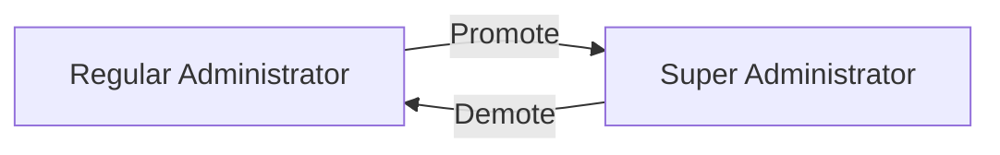
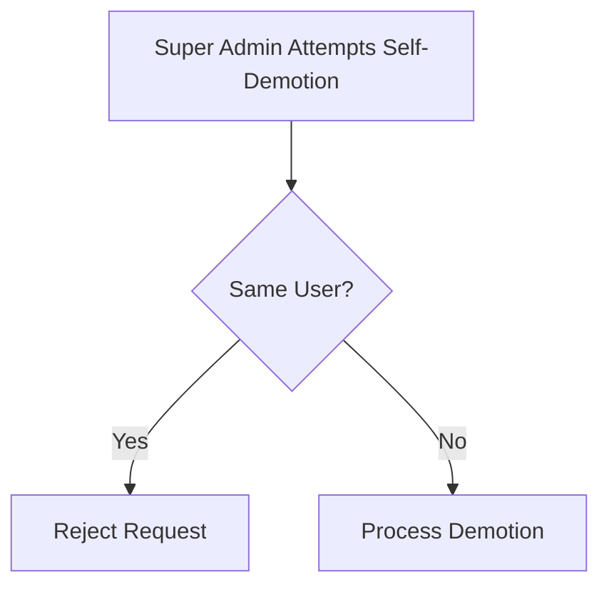
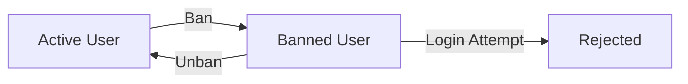
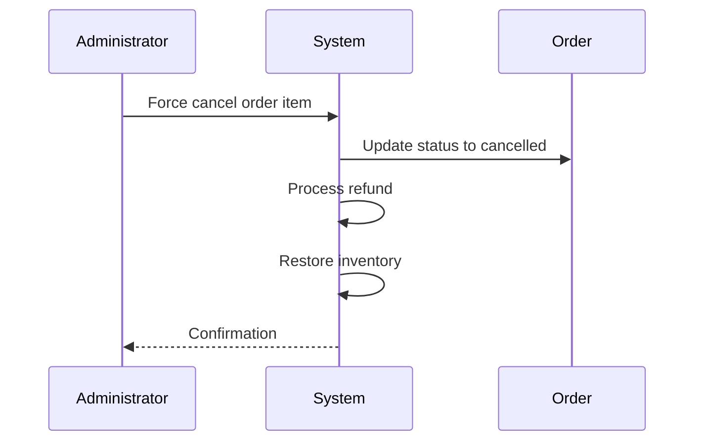
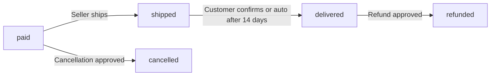
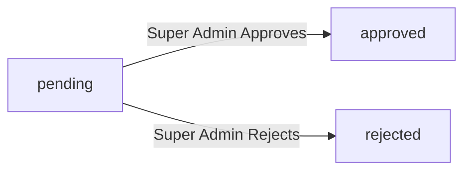
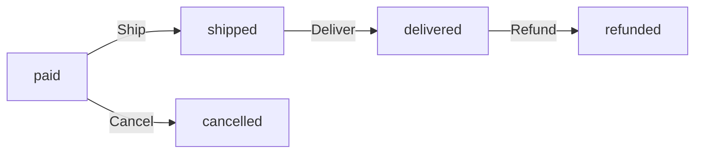
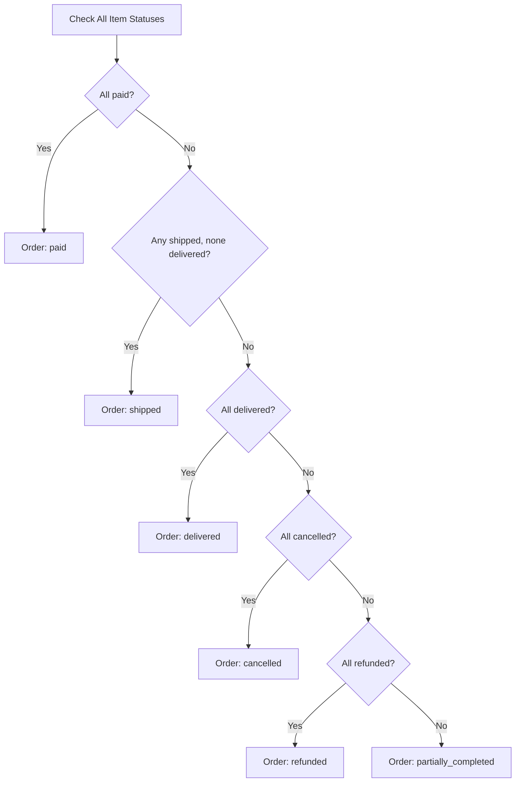
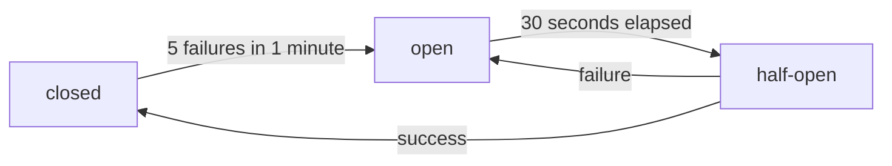

**shoppingMall — Data isolation, business rules, filtering/sorting/pagination, error catalog**

Data isolation, business rules, filtering/sorting/pagination, error catalog

# Data Isolation and Ownership

Data ownership rules and tenant/user-level isolation policies.

## Ownership and Isolation Rules

Define data ownership semantics and isolation boundaries for multi-user access.

### Customer Data Ownership

### Profile Ownership

THE system SHALL associate each Customer profile with exactly one registered customer account.

THE system SHALL restrict profile modification access to the owning customer.

WHEN a customer attempts to modify another customer's profile, THE system SHALL reject the request.

### Address Ownership

THE system SHALL associate each Address with exactly one Customer.

THE system SHALL restrict address management (create, read, update, delete) to the owning customer.

WHEN a customer attempts to access an address they do not own, THE system SHALL reject the request.

THE system SHALL allow only one default shipping address per customer.

### Cart Ownership

THE system SHALL maintain exactly one active Cart per Customer.

THE system SHALL restrict cart access and modification to the owning customer.

WHEN a customer attempts to view or modify another customer's cart, THE system SHALL reject the request.

### Wishlist Ownership

THE system SHALL associate each Wishlist entry with exactly one Customer and one Product.

THE system SHALL restrict wishlist management (add, view, remove) to the owning customer.

WHEN a customer attempts to modify another customer's wishlist, THE system SHALL reject the request.

### Order Ownership

THE system SHALL associate each Order with exactly one Customer.

THE system SHALL restrict order history viewing to the owning customer.

WHEN a customer attempts to view another customer's order, THE system SHALL reject the request.

### Review Ownership

THE system SHALL associate each Review with exactly one Customer, one Product, and one Order.

THE system SHALL restrict review creation to the customer who purchased the product in that order.

THE system SHALL restrict review modification and deletion to the owning customer.

### Seller Data Ownership

### Seller Profile Ownership

THE system SHALL associate each Seller profile with exactly one registered seller account.

THE system SHALL restrict seller profile modification access to the owning seller.

WHEN a seller attempts to modify another seller's profile, THE system SHALL reject the request.

### Product Ownership

THE system SHALL associate each Product with exactly one Seller.

THE system SHALL restrict product creation to authenticated sellers.

THE system SHALL restrict product modification and deletion to the owning seller.

WHEN a seller attempts to modify or delete a product they do not own, THE system SHALL reject the request.

### Product Variant Ownership

THE system SHALL associate each ProductVariant with the Product's owning Seller.

THE system SHALL restrict variant management to the seller who owns the parent product.

WHEN a seller attempts to modify a variant of a product they do not own, THE system SHALL reject the request.

### Inventory Record Ownership

THE system SHALL associate each InventoryRecord with the ProductVariant's owning Seller.

THE system SHALL restrict inventory adjustments to the seller who owns the variant.

WHEN a seller attempts to modify inventory for a variant they do not own, THE system SHALL reject the request.

### Order Item Seller Association

THE system SHALL associate each OrderItem with the Seller who owns the purchased ProductVariant.

THE system SHALL restrict shipment creation and tracking updates to the seller associated with the order item.

THE system SHALL restrict cancellation and refund request responses to the seller associated with the order item.

### Cross-User Data Isolation

### Customer-to-Customer Isolation

THE system SHALL prevent customers from accessing other customers' personal data.

THE system SHALL prevent customers from viewing other customers' carts, wishlists, and orders.

WHEN a customer queries for data owned by another customer, THE system SHALL return no results.

### Seller-to-Seller Isolation

THE system SHALL prevent sellers from viewing or modifying other sellers' products.

THE system SHALL prevent sellers from accessing other sellers' order items unless they are the seller of record.

THE system SHALL prevent sellers from viewing other sellers' inventory records.

WHEN a seller queries for products they do not own, THE system SHALL exclude those products from the results.

### Customer-Seller Isolation

THE system SHALL prevent customers from viewing seller account details beyond publicly visible profile information.

THE system SHALL prevent sellers from viewing customer personal data beyond what is required for order fulfillment.

WHEN a seller views order items for their products, THE system SHALL expose only the shipping address and necessary order information.

### Multi-User Product Visibility

THE system SHALL allow all authenticated customers to view all active products from all sellers.

THE system SHALL allow all authenticated customers to view all seller profiles.

THE system SHALL allow all authenticated customers to view product reviews from all customers.

WHEN a product is deleted or seller is suspended, THE system SHALL remove the product from customer visibility.

### Administrator Data Access Scope

### Platform-Wide Visibility

THE system SHALL grant administrators read access to all customer accounts.

THE system SHALL grant administrators read access to all seller accounts.

THE system SHALL grant administrators read access to all products and product variants.

THE system SHALL grant administrators read access to all orders and order items.

THE system SHALL grant administrators read access to all snapshots across the platform.

### Cross-Ownership Oversight

THE system SHALL allow administrators to modify seller approval status regardless of ownership.

THE system SHALL allow administrators to suspend or unsuspend seller accounts.

THE system SHALL allow administrators to ban or unban customer accounts.

THE system SHALL allow administrators to delete any product for policy violations.

THE system SHALL allow administrators to force-cancel or force-refund any order item.

### Administrator Grade Restrictions

THE system SHALL restrict regular administrators from promoting other administrators.

THE system SHALL restrict regular administrators from demoting super administrators.

THE system SHALL restrict super administrators from demoting themselves.

THE system SHALL allow only super administrators to approve administrator requests.

### Snapshot Access and Isolation

### Product Snapshot Access

THE system SHALL grant product snapshot viewing access to the seller who owns the product.

THE system SHALL grant product snapshot viewing access to all administrators.

THE system SHALL deny product snapshot viewing access to customers (snapshots are for dispute resolution).

WHEN a seller requests snapshots for a product they do not own, THE system SHALL reject the request.

### Order Item Snapshot Access

THE system SHALL associate each OrderItemSnapshot with the OrderItem's owning Customer.

THE system SHALL grant order item snapshot viewing access to the customer who placed the order.

THE system SHALL grant order item snapshot viewing access to administrators.

THE system SHALL deny order item snapshot viewing access to sellers (they receive snapshot data in order items).

### Seller Profile Snapshot Access

THE system SHALL grant seller profile snapshot viewing access to the owning seller.

THE system SHALL grant seller profile snapshot viewing access to administrators.

THE system SHALL deny seller profile snapshot viewing access to customers.

### Request Snapshot Access

THE system SHALL grant CancellationRequestSnapshot viewing access to the customer who created the request.

THE system SHALL grant CancellationRequestSnapshot viewing access to the seller responding to the request.

THE system SHALL grant CancellationRequestSnapshot viewing access to administrators.

THE system SHALL grant RefundRequestSnapshot viewing access to the customer who created the request.

THE system SHALL grant RefundRequestSnapshot viewing access to the seller responding to the request.

THE system SHALL grant RefundRequestSnapshot viewing access to administrators.

### Review Snapshot Access

THE system SHALL grant ReviewSnapshot viewing access to the customer who wrote the review.

THE system SHALL grant ReviewSnapshot viewing access to administrators.

THE system SHALL deny ReviewSnapshot viewing access to sellers.

# Domain Business Rules

Per-concept business rules, validation logic, and domain constraints.

## Customer Rules

Customers must register with an email and password before accessing any platform features. Guest browsing is not permitted on this platform. Email addresses must be unique among all active customer accounts. Customers can change their password at any time while logged in. Customers can delete their own account, which removes their profile information permanently. When a customer deletes their account, their order history is preserved for seller records and legal compliance. Reviews written by deleted customers are preserved but displayed as from a "deleted user". The display name and phone number in a customer profile can be edited at any time. Customers can manage multiple shipping addresses and designate one as the default for checkout.

### Registration and Access Control

THE system SHALL require customer registration before any platform feature can be accessed.

THE system SHALL NOT permit guest browsing of products, categories, or any other platform features.

WHEN an unauthenticated user attempts to access any platform feature, THE system SHALL require authentication.

WHEN a new customer registers, THE system SHALL collect email address and password as mandatory credentials.

IF a user attempts to browse products without logging in, THE system SHALL redirect to the login page.

THE system SHALL prevent access to product details, seller profiles, and search functionality for unauthenticated users.

WHEN a customer completes registration, THE system SHALL create a customer account with the provided credentials.

### Email Uniqueness Rules

THE system SHALL ensure each email address is associated with exactly one active customer account.

IF a registration attempt uses an email address already registered to an active customer account, THE system SHALL reject the registration.

THE system SHALL treat email addresses as case-insensitive for uniqueness validation purposes.

IF a customer attempts to change their email to one already in use by another active customer, THE system SHALL reject the change.

THE system SHALL NOT permit the same email address to be used simultaneously by multiple customer accounts.

### Password Management Rules

WHEN a customer requests a password change, THE system SHALL require the current password for verification.

IF the current password verification fails during a password change request, THE system SHALL reject the change.

WHEN a customer successfully changes their password, THE system SHALL apply the new password immediately for future authentication.

THE system SHALL permit customers to change their password at any time while logged in.

THE system SHALL NOT require administrative approval for customer password changes.

### Account Deletion and Data Retention

WHEN a customer deletes their account, THE system SHALL permanently remove their profile information including display name and phone number.

THE system SHALL preserve all orders and order history belonging to a deleted customer account.

THE system SHALL preserve all reviews written by a deleted customer.

WHEN displaying reviews from a deleted customer, THE system SHALL show the author as "deleted user".

THE system SHALL NOT permit deleted customer accounts to be recovered.

THE system SHALL preserve order history for seller records and legal compliance purposes after customer account deletion.

THE system SHALL remove the deleted customer's email from active account registry.

### Profile Editing Rules

THE system SHALL permit customers to edit their display name at any time.

THE system SHALL permit customers to edit their phone number at any time.

IF a customer updates their display name, THE system SHALL apply the change immediately.

IF a customer updates their phone number, THE system SHALL apply the change immediately.

THE system SHALL NOT require administrative approval for customer profile edits.

THE system SHALL permit profile edits without restriction on frequency or timing.

### Default Address Selection

THE system SHALL permit customers to add multiple shipping addresses.

THE system SHALL allow exactly one shipping address to be designated as the default per customer.

WHEN a customer designates an address as default, THE system SHALL automatically remove the default designation from any previously designated address.

IF a customer has not selected a default address, THE system SHALL NOT automatically select one.

WHEN a customer proceeds to checkout without a default address, THE system SHALL require the customer to select a shipping address.

THE system SHALL permit customers to change their default address selection at any time.

IF a customer deletes their current default address, THE system SHALL leave the default address selection empty until a new address is designated.

## Seller Rules

Sellers sign up with an email and password, and the email must be unique among all seller accounts. New seller accounts require administrator approval before they can list products for sale. Sellers can view their approval status which shows as pending, approved, or rejected. If a seller registration is rejected, they can view the rejection reason provided by the administrator. Rejected sellers may submit a new registration request after receiving a rejection. Sellers can delete their account only when they have no pending orders and no pending cancellation or refund requests. When a seller deletes their account, all their products are removed from the marketplace listings. Order history and order item snapshots are preserved even after seller account deletion. The seller's shop name in past orders is preserved for customer records. Sellers can edit their shop name, description, and logo at any time, and each edit creates a snapshot.

### Seller Registration Approval Workflow

### Approval Requirement

WHEN a seller submits a registration request, THE system SHALL create the seller account with an approval status of "pending".

WHEN a seller account has a status of "pending", THE system SHALL prevent the seller from listing any products for sale.

WHEN a seller account has a status of "pending", THE system SHALL prevent the seller from creating or editing products.

### Administrator Review

WHEN an administrator views pending seller registrations, THE system SHALL display all seller accounts with approval status of "pending".

WHEN an administrator approves a pending seller registration, THE system SHALL change the seller's approval status to "approved".

WHEN an administrator rejects a pending seller registration, THE system SHALL change the seller's approval status to "rejected".

WHEN an administrator rejects a seller registration, THE system SHALL require the administrator to provide a rejection reason.

### Approved Seller Activation

WHEN a seller's approval status changes to "approved", THE system SHALL enable the seller to create and manage products.

WHEN a seller's approval status is "approved", THE system SHALL allow the seller's products to appear in marketplace listings.

### Seller Approval Status Tracking

### Status Visibility

WHEN a seller views their account information, THE system SHALL display their current approval status.

THE system SHALL display the approval status as one of the following values: "pending", "approved", or "rejected".

WHEN a seller's approval status is "pending", THE system SHALL indicate that the registration is awaiting administrator review.

WHEN a seller's approval status is "approved", THE system SHALL indicate that the seller can conduct business on the platform.

WHEN a seller's approval status is "rejected", THE system SHALL indicate that the seller cannot conduct business on the platform.

### Status Change History

WHEN a seller's approval status changes, THE system SHALL record the timestamp of the change.

WHEN a seller's approval status changes to "approved" or "rejected", THE system SHALL record which administrator processed the approval.

WHEN a seller views their approval history, THE system SHALL display all status changes with timestamps.

### Seller Rejection Reason Visibility

### Rejection Reason Display

WHEN a seller's approval status is "rejected", THE system SHALL display the rejection reason provided by the administrator.

WHEN a rejected seller logs in, THE system SHALL prominently display the rejection reason.

IF a rejection reason was not provided during rejection, THE system SHALL display a default message indicating the reason was not specified.

### Rejection Reason Content

THE rejection reason SHALL contain text explaining why the registration was rejected.

WHEN a seller views a rejection reason, THE system SHALL display the complete reason text as entered by the administrator.

THE system SHALL preserve the rejection reason even after the seller submits a new registration request.

### Re-registration After Rejection

WHEN a seller with status "rejected" submits a new registration request, THE system SHALL create a new registration request.

WHEN a seller submits a new registration request after rejection, THE system SHALL change the seller's approval status to "pending".

WHEN a seller submits a new registration request, THE system SHALL preserve the previous rejection history for administrator review.

### Seller Account Deletion Restrictions

### Deletion Eligibility Check

WHEN a seller requests to delete their account, THE system SHALL check for pending order items.

THE system SHALL define pending order items as items with status "paid" or "shipped".

WHEN a seller has any pending order items for their products, THE system SHALL prevent account deletion.

WHEN a seller requests to delete their account, THE system SHALL check for pending cancellation requests.

WHEN a seller has any pending cancellation requests for their products, THE system SHALL prevent account deletion.

WHEN a seller requests to delete their account, THE system SHALL check for pending refund requests.

WHEN a seller has any pending refund requests for their products, THE system SHALL prevent account deletion.

### Deletion Blocking Messages

IF a seller attempts to delete their account while pending orders exist, THE system SHALL display a message explaining the blocking condition.

IF a seller attempts to delete their account while pending cancellation requests exist, THE system SHALL display a message explaining the blocking condition.

IF a seller attempts to delete their account while pending refund requests exist, THE system SHALL display a message explaining the blocking condition.

### Deletion Proceeding

WHEN all blocking conditions are resolved, THE system SHALL allow the seller to delete their account.

IF a seller confirms account deletion, THE system SHALL permanently remove the seller's access to the account.

### Seller Data Handling on Account Deletion

### Product Removal

WHEN a seller account is deleted, THE system SHALL remove all products belonging to that seller from marketplace listings.

WHEN a seller account is deleted, THE system SHALL remove all products belonging to that seller from search results.

WHEN a seller account is deleted, THE system SHALL remove all products belonging to that seller from category listings.

WHEN a seller account is deleted, THE system SHALL remove all product variants belonging to that seller.

WHEN a seller account is deleted, THE system SHALL remove all product images belonging to that seller.

WHEN a seller account is deleted, THE system SHALL remove all wishlist entries containing the seller's products.

### Order History Preservation

WHEN a seller account is deleted, THE system SHALL preserve all order records containing items from that seller.

WHEN a seller account is deleted, THE system SHALL preserve all order item records from that seller.

WHEN a seller account is deleted, THE system SHALL preserve all order item snapshots that captured the seller's product information.

WHEN a seller account is deleted, THE system SHALL preserve the seller's shop name in historical order records.

WHEN a customer views a past order containing items from a deleted seller, THE system SHALL display the preserved shop name.

WHEN a seller account is deleted, THE system SHALL preserve all shipment records for orders from that seller.

### Snapshot Preservation

WHEN a seller account is deleted, THE system SHALL preserve all seller profile snapshots.

WHEN a seller account is deleted, THE system SHALL preserve all product snapshots from that seller.

THE system SHALL maintain snapshot records for legal and dispute resolution purposes even after seller account deletion.

### Seller Profile Editing and Snapshot Rules

### Profile Editable Fields

WHEN a seller edits their profile, THE system SHALL allow changes to the shop name.

WHEN a seller edits their profile, THE system SHALL allow changes to the shop description.

WHEN a seller edits their profile, THE system SHALL allow changes to the logo image.

### Snapshot Creation on Edit

WHEN a seller saves a profile edit, THE system SHALL create a seller profile snapshot.

THE seller profile snapshot SHALL capture the shop name before the change.

THE seller profile snapshot SHALL capture the shop description before the change.

THE seller profile snapshot SHALL capture the logo image before the change.

THE seller profile snapshot SHALL record the timestamp of when the change was made.

THE seller profile snapshot SHALL record what was changed.

THE seller profile snapshot SHALL record the values before and after the change.

### Snapshot Immutability

WHEN a seller profile snapshot is created, THE system SHALL prevent any modification to the snapshot.

WHEN a seller profile snapshot is created, THE system SHALL prevent deletion of the snapshot.

WHEN a seller views their profile snapshots, THE system SHALL display all historical snapshots in chronological order.

WHEN an administrator views a seller's profile snapshots, THE system SHALL display all historical snapshots for dispute resolution purposes.

## Administrator Rules

Administrators have two grades: regular administrator and super administrator. Super administrators can promote regular administrators to super administrator status. Super administrators can demote other super administrators to regular administrator status. A super administrator cannot demote themselves to regular administrator. Regular administrators can perform seller management, category management, product oversight, order oversight, and user management tasks. Only super administrators can manage administrator requests and administrator grade promotions. Administrators can view all customer accounts and ban or unban customers. Banned customers cannot log in to the platform. Administrators can view all seller accounts and ban sellers, which prevents login but preserves existing orders. Administrators can force-cancel or force-refund orders when necessary for dispute resolution.

### Administrator Grade Hierarchy

THE system SHALL maintain two administrator grades: regular administrator and super administrator.

WHEN a user becomes an administrator, THE system SHALL assign the regular administrator grade by default.

THE system SHALL allow only super administrators to change administrator grades.

IF a user attempts to access super administrator functions without the super administrator grade, THE system SHALL reject the request.

THE system SHALL track the grade of each administrator account.

Super administrators SHALL have all privileges of regular administrators, plus additional privileged operations.

Regular administrators SHALL NOT have access to grade promotion, grade demotion, or administrator request review functions.

### Super Administrator Privileges

WHEN a super administrator promotes a regular administrator, THE system SHALL change that administrator's grade to super administrator.

WHEN a super administrator demotes another super administrator, THE system SHALL change that administrator's grade to regular administrator.

IF a super administrator attempts to demote themselves, THE system SHALL reject the request.

THE system SHALL prevent self-demotion by super administrators regardless of any circumstance.

WHEN a super administrator views pending administrator requests, THE system SHALL display all requests with pending status.

WHEN a super administrator approves an administrator request, THE system SHALL:
1. Update the request status to approved
2. Create an administrator account for the requesting user
3. Assign the regular administrator grade to the new administrator

WHEN a super administrator rejects an administrator request, THE system SHALL:
1. Update the request status to rejected
2. Preserve the rejection reason provided by the super administrator
3. Allow the requester to submit a new request

IF there are no other super administrators in the system, THE system SHALL prevent the last super administrator from being demoted.

### Seller Management Permissions

THE system SHALL allow administrators to view the list of pending seller approval requests.

WHEN an administrator approves a seller registration, THE system SHALL:
1. Update the seller's approval status to approved
2. Enable the seller to create and manage products
3. Allow the seller to process orders

WHEN an administrator rejects a seller registration, THE system SHALL:
1. Require a rejection reason
2. Update the seller's approval status to rejected
3. Preserve the rejection reason for seller visibility
4. Allow the seller to submit a new registration request

THE system SHALL allow administrators to suspend seller accounts.

WHEN an administrator suspends a seller, THE system SHALL:
1. Hide the seller's products from search and category listings
2. Prevent new purchases of the seller's products
3. Allow the seller to process existing orders
4. Prevent the seller from creating or editing products

THE system SHALL allow administrators to unsuspend seller accounts.

WHEN an administrator unsuspends a seller, THE system SHALL restore the seller's products to visibility.

IF a suspended seller attempts to create or edit a product, THE system SHALL reject the request.

A suspended seller SHALL retain the ability to respond to cancellation and refund requests for existing orders.

### Category Management Permissions

THE system SHALL allow administrators to create categories and subcategories.

WHEN an administrator creates a category, THE system SHALL require a name and allow an optional description.

WHEN an administrator creates a subcategory, THE system SHALL require a parent category reference.

THE system SHALL restrict subcategory nesting to one level only.

IF an administrator attempts to create a subcategory under another subcategory, THE system SHALL reject the request.

THE system SHALL allow administrators to edit category names and descriptions.

THE system SHALL allow administrators to delete categories.

WHEN an administrator deletes a category, THE system SHALL:
1. Remove the category from the system
2. Set products in the deleted category to uncategorized status
3. Preserve the products themselves

IF a category has subcategories, THE system SHALL prevent deletion until subcategories are removed or reassigned.

THE system SHALL prevent non-administrators from creating, editing, or deleting categories.

### User Banning Authority

THE system SHALL allow administrators to view all customer accounts.

THE system SHALL allow administrators to ban customer accounts.

WHEN an administrator bans a customer, THE system SHALL:
1. Prevent the customer from logging in
2. Preserve the customer's order history and reviews
3. Display "deleted user" on the customer's reviews

THE system SHALL allow administrators to unban customer accounts.

WHEN an administrator unbans a customer, THE system SHALL restore the customer's ability to log in.

THE system SHALL allow administrators to view all seller accounts.

THE system SHALL allow administrators to ban seller accounts.

WHEN an administrator bans a seller, THE system SHALL:
1. Prevent the seller from logging in
2. Preserve the seller's existing orders and order history
3. Hide the seller's products from listings
4. Maintain the seller's shop name in past order records

THE system SHALL allow administrators to unban seller accounts.

IF a banned user attempts to log in, THE system SHALL reject the authentication attempt with an appropriate error.

### Order Oversight Powers

THE system SHALL allow administrators to view all orders on the platform.

THE system SHALL allow administrators to view all order items across all sellers.

THE system SHALL allow administrators to force-cancel individual order items.

WHEN an administrator force-cancels an order item, THE system SHALL:
1. Update the item status to cancelled
2. Process a refund for that item
3. Restore the stock quantity for that variant via inventory record
4. Preserve the order and remaining items

THE system SHALL allow administrators to force-cancel entire orders.

WHEN an administrator force-cancels an entire order, THE system SHALL:
1. Cancel all items in the order
2. Process refunds for all items
3. Restore stock quantities for all affected variants

THE system SHALL allow administrators to force-refund individual order items.

WHEN an administrator force-refunds an order item, THE system SHALL:
1. Update the item status to refunded
2. Process the refund
3. Restore the stock quantity for that variant

THE system SHALL allow administrators to force-refund entire orders.

IF an administrator force-cancels or force-refunds items, THE system SHALL record the action with the administrator's identity and timestamp.

## AdministratorRequest Rules

Any existing user, whether customer or seller, can submit a request to become an administrator. The request must include a reason explaining why the user wants administrator privileges. Administrator requests start with a pending status when submitted. Super administrators can view the list of all pending administrator requests. Super administrators can approve or reject pending requests. When a request is approved, the user immediately gains regular administrator privileges. When a request is rejected, the user remains in their current role. Users whose requests were rejected can submit new administrator requests. Each request records when it was reviewed by a super administrator. The reviewedAt timestamp captures when the approval or rejection decision was made.

### Request Submission Eligibility

### Request Submission Eligibility

WHEN a user submits a request to become an administrator, THE system SHALL accept the request from any existing customer or seller account.

THE system SHALL NOT accept administrator requests from users who are already administrators.

IF the requesting user is already an administrator, THE system SHALL reject the submission with an appropriate error message.

THE system SHALL associate each administrator request with the requesting user's account.

### Multiple Request Handling

WHEN a user submits a new administrator request, THE system SHALL allow the submission regardless of any previous pending or rejected requests.

THE system SHALL NOT limit the number of administrator requests a user can submit over time.

THE system SHALL maintain a complete history of all requests submitted by each user.

### Reason Requirement

### Reason Requirement

WHEN a user submits an administrator request, THE system SHALL require a reason explaining why the user wants administrator privileges.

IF the reason field is empty or missing, THE system SHALL reject the request submission.

THE system SHALL store the reason text with the administrator request record.

THE reason text SHALL be visible to super administrators during the review process.

### Reason Content Guidelines

THE system SHALL accept reason text of any valid length within the configured limits.

THE system SHALL preserve the exact reason text as submitted without modification.

### Pending Status Initialization

### Pending Status Initialization

WHEN a user submits an administrator request, THE system SHALL initialize the request status to "pending".

THE system SHALL maintain the "pending" status until a super administrator approves or rejects the request.

THE system SHALL record the creation timestamp when the request is submitted.

### Status Enumeration

THE system SHALL support the following administrator request statuses:
- pending: awaiting review by a super administrator
- approved: request has been approved by a super administrator
- rejected: request has been rejected by a super administrator

WHEN a request status changes from "pending", THE system SHALL NOT allow it to return to "pending" status.

### Super Administrator Review

### Super Administrator Review Authority

THE system SHALL restrict administrator request review authority to super administrators only.

WHEN a super administrator accesses the administrator request management interface, THE system SHALL display all pending administrator requests.

THE system SHALL allow super administrators to view the reason and submission date for each request.

THE system SHALL allow super administrators to view the requesting user's information.

### Review Actions

WHEN a super administrator reviews a pending request, THE system SHALL provide options to approve or reject the request.

IF a super administrator attempts to review a non-pending request, THE system SHALL prevent the action.

THE system SHALL NOT allow regular administrators to review or approve administrator requests.

THE system SHALL NOT allow the requesting user to review their own request, even if they are a super administrator.

### Approval Outcome

### Approval Process

WHEN a super administrator approves a pending administrator request, THE system SHALL:
1. Change the request status to "approved"
2. Record the reviewer identity
3. Record the approval timestamp
4. Grant regular administrator privileges to the requesting user

### Role Transition

WHEN an administrator request is approved, THE system SHALL immediately transition the user to regular administrator status.

THE user SHALL retain any existing customer or seller privileges in addition to new administrator privileges.

THE system SHALL NOT grant super administrator status through the request approval process.

THE approved user SHALL gain access to administrator functions appropriate for regular administrator grade.

### Post-Approval Handling

IF an approved request is from a user who had previously submitted other rejected requests, THE system SHALL NOT affect those historical records.

THE system SHALL preserve the approved request record for audit purposes.

### Rejection Outcome

### Rejection Process

WHEN a super administrator rejects a pending administrator request, THE system SHALL:
1. Change the request status to "rejected"
2. Record the reviewer identity
3. Record the rejection timestamp
4. Preserve the original reason text

### User Status After Rejection

WHEN an administrator request is rejected, THE system SHALL NOT change the user's current role.

THE user SHALL remain a customer or seller with their existing privileges.

THE user SHALL be notified of the rejection.

THE system SHALL NOT impose any penalties or restrictions on users whose requests are rejected.

### Rejection Record Preservation

THE system SHALL maintain rejected request records for historical purposes.

IF a user submits a new request after rejection, THE system SHALL treat it as a completely new request with no dependency on the rejected request.

### Re-application Permission

### Re-application After Rejection

IF a user's administrator request is rejected, THE system SHALL allow the user to submit a new request.

THE system SHALL NOT impose a waiting period between rejection and new request submission.

THE system SHALL NOT limit the total number of re-applications a user can submit.

### Re-application Handling

WHEN a user submits a new request after rejection, THE system SHALL create a new independent request record.

THE system SHALL initialize the new request with "pending" status regardless of previous request outcomes.

THE previous rejected request SHALL remain in the system as a historical record.

### Re-application After Approval

IF a user already has administrator privileges from a previous approved request, THE system SHALL reject any new administrator request submission.

THE system SHALL NOT allow administrators to submit administrator requests.

### ReviewedAt Timestamp

### Timestamp Recording

WHEN a super administrator approves or rejects an administrator request, THE system SHALL record the reviewedAt timestamp.

THE reviewedAt timestamp SHALL capture the exact date and time when the review decision was made.

THE reviewedAt timestamp SHALL be stored in UTC format.

### Timestamp Association

THE reviewedAt timestamp SHALL be associated with the reviewer's administrator account.

IF a request remains in "pending" status, THE system SHALL leave the reviewedAt timestamp as null.

THE system SHALL NOT allow modification of the reviewedAt timestamp after it has been recorded.

### Audit Trail

THE reviewedAt timestamp SHALL be visible in the request details for audit purposes.

THE system SHALL preserve the reviewedAt timestamp indefinitely as part of the request record.

### Role Transition on Approval

### Immediate Role Assignment

WHEN an administrator request is approved, THE system SHALL immediately assign regular administrator grade to the user.

THE system SHALL NOT require additional confirmation or action from the user to activate administrator privileges.

### Privilege Inheritance

WHEN a customer's request is approved, THE system SHALL grant administrator privileges while preserving customer account functionality.

WHEN a seller's request is approved, THE system SHALL grant administrator privileges while preserving seller account functionality.

THE user SHALL gain all privileges associated with regular administrator grade.

### Grade Limitations

THE system SHALL NOT grant super administrator grade through the request approval process.

Super administrator grade SHALL only be assigned through direct promotion by another super administrator.

### Access Activation

WHEN role transition completes, THE system SHALL enable access to the administrator interface.

THE newly appointed administrator SHALL be able to perform all actions available to regular administrators.

### Request Visibility Scope

### Super Administrator Visibility

THE system SHALL allow super administrators to view all administrator requests regardless of status.

THE system SHALL allow super administrators to filter requests by status (pending, approved, rejected).

THE system SHALL allow super administrators to view the complete details of any administrator request.

### Requester Visibility

THE system SHALL allow users to view their own submitted administrator requests.

THE system SHALL display the current status of each request to the requester.

THE system SHALL allow the requester to view their submitted reason and the submission date.

### Visibility Restrictions

THE system SHALL NOT allow regular administrators to view administrator requests.

THE system SHALL NOT allow customers to view other customers' administrator requests.

THE system SHALL NOT allow sellers to view other sellers' administrator requests.

THE system SHALL NOT display administrator requests to non-authenticated users.

## Category Rules

Categories organize products into logical groups for browsing. Categories can have subcategories, but only one level of nesting is allowed. Each category must have a name and can have an optional description. Categories are created and managed exclusively by administrators. Customers can browse the list of all categories without restriction. Customers can view all products within a specific category. When a category is deleted by an administrator, products that were in that category become uncategorized. Subcategories cannot exist without a parent category. A category cannot be its own parent. Products must belong to exactly one category, which can be either a top-level category or a subcategory.

### Category Hierarchy Structure

THE system SHALL support a two-level category hierarchy consisting of top-level categories and subcategories.

THE system SHALL restrict category nesting to exactly one level of depth, where a subcategory cannot have its own subcategories.

WHEN an administrator attempts to create a subcategory under another subcategory, THE system SHALL reject the request.

THE system SHALL require every subcategory to have exactly one parent category reference.

THE system SHALL allow a top-level category to exist without any subcategories.

THE system SHALL allow a top-level category to have multiple subcategories.

WHEN a parent category is specified for a new category, THE system SHALL verify that the parent is a top-level category.

IF the specified parent category is itself a subcategory, THE system SHALL reject the creation.

A category SHALL NOT be allowed to reference itself as its own parent.

WHEN a category hierarchy is displayed, THE system SHALL present top-level categories with their subcategories nested beneath them.

### Category Creation Authority

THE system SHALL restrict category creation to administrators only.

WHEN a non-administrator user attempts to create a category, THE system SHALL reject the request.

THE system SHALL restrict category editing to administrators only.

WHEN a non-administrator user attempts to edit a category, THE system SHALL reject the request.

THE system SHALL restrict category deletion to administrators only.

WHEN a non-administrator user attempts to delete a category, THE system SHALL reject the request.

THE system SHALL allow both regular administrators and super administrators to create, edit, and delete categories.

WHEN an administrator creates a category, THE system SHALL record the creating administrator's identity and the creation timestamp.

### Category Browsing Access

THE system SHALL allow any customer to browse the list of all categories without restriction.

THE system SHALL allow any customer to view products within any category.

THE system SHALL NOT require authentication for browsing categories.

THE system SHALL display all top-level categories and their subcategories in a hierarchical structure for browsing.

WHEN a customer selects a category, THE system SHALL display all products assigned to that category.

WHEN a customer selects a subcategory, THE system SHALL display all products assigned to that subcategory.

THE system SHALL allow filtering products by category during product search.

THE system SHALL allow filtering products by subcategory during product search.

### Category Deletion Impact

WHEN an administrator deletes a category, THE system SHALL remove the category from all listings and search results.

WHEN an administrator deletes a category that contains products, THE system SHALL reassign those products to an uncategorized state.

THE system SHALL NOT prevent category deletion based on the presence of products in that category.

WHEN an administrator deletes a parent category, THE system SHALL also delete all subcategories under that parent.

WHEN a parent category with subcategories is deleted, THE system SHALL reassign all products from both the parent and subcategories to an uncategorized state.

Products in an uncategorized state SHALL remain visible and purchasable.

THE system SHALL allow products to exist without a category assignment.

WHEN a product becomes uncategorized due to category deletion, THE system SHALL preserve all other product attributes unchanged.

THE system SHALL display uncategorized products when customers browse all products without category filtering.

### Product Category Assignment

THE system SHALL require every product to be assigned to exactly one category at the time of creation.

WHEN a seller creates a product, THE system SHALL require selection of a category from the available categories list.

THE system SHALL allow a product to be assigned to either a top-level category or a subcategory.

WHEN a seller edits a product, THE system SHALL allow changing the product's category assignment.

THE system SHALL NOT allow a product to be assigned to multiple categories simultaneously.

WHEN a product's category is changed, THE system SHALL update the product's category reference to the new category.

IF the assigned category is deleted after a product is created, THE system SHALL mark the product as uncategorized.

THE system SHALL allow sellers to reassign uncategorized products to a new category.

### Category Field Requirements

THE system SHALL require a name for every category at the time of creation.

WHEN an administrator creates a category without a name, THE system SHALL reject the request.

THE system SHALL allow a category name to be edited after creation.

THE system SHALL ensure each category name is unique across all categories.

WHEN an administrator attempts to create a category with a name that already exists, THE system SHALL reject the request.

THE system SHALL allow a category description to be optional.

WHEN an administrator creates a category without a description, THE system SHALL accept the request.

THE system SHALL allow a description to be added or edited after category creation.

THE system SHALL allow a description to be removed (cleared) after category creation.

THE system SHALL allow a parent category reference to be optional for top-level categories.

THE system SHALL require a parent category reference for subcategories.

## Product Rules

Products must have a name, description, category, and base price when created. Products belong exclusively to the seller who created them. Sellers can edit their own products at any time, and every edit creates a snapshot of the previous state. Sellers can delete their products only if no variants have pending order items in paid or shipped status. Sellers cannot delete products if there are pending cancellation or refund requests for any variant. Deleting a product also deletes all its variants and inventory records. Deleted products are removed from search results and category listings immediately. Sellers can view snapshots of their own products at any time. Administrators can view snapshots of any product on the platform. Product snapshots are preserved even after the product is deleted. A product must have at least one variant to be purchasable by customers. Products with no variants are visible in search but displayed as unavailable for purchase.

### Product Creation Rules

### Required Fields

WHEN a seller creates a product, THE system SHALL require the following fields:
1. Name
2. Description
3. Category
4. Base price

IF any required field is missing, THE system SHALL reject the product creation request.

### Seller Ownership

WHEN a seller creates a product, THE system SHALL associate the product exclusively with that seller.

THE system SHALL prevent any seller from creating products on behalf of another seller.

WHEN a product is created, THE system SHALL record the creating seller as the owner.

IF a seller attempts to modify a product they do not own, THE system SHALL reject the request.

### Category Assignment

WHEN a seller selects a category for a product, THE system SHALL allow selection of either a top-level category or a subcategory.

IF a category does not exist, THE system SHALL reject the product creation request.

THE system SHALL allow only one category assignment per product.

### Product Edit and Snapshot Rules

### Edit Permission

THE system SHALL allow only the owning seller to edit their products.

WHEN a seller edits their product, THE system SHALL permit modification of name, description, category, and base price.

### Automatic Snapshot Creation

WHEN a seller edits a product, THE system SHALL automatically create a product snapshot preserving the previous state.

THE product snapshot SHALL capture:
1. Product name
2. Product description
3. Base price
4. All product images
5. All variants with their SKU codes, option values, and prices

THE system SHALL record the timestamp when each snapshot is created.

THE system SHALL ensure snapshots are immutable and cannot be modified or deleted.

### Edit Timing

THE system SHALL allow sellers to edit their products at any time, regardless of existing orders.

WHEN a product is edited, THE system SHALL NOT affect previously placed orders that reference earlier product snapshots.

### Product Deletion Rules

### Deletion Permission

THE system SHALL allow only the owning seller to delete their products.

### Pending Order Blocking

IF any variant of a product has pending order items in paid status, THE system SHALL prevent deletion of the product.

IF any variant of a product has pending order items in shipped status, THE system SHALL prevent deletion of the product.

IF any variant of a product has pending cancellation requests, THE system SHALL prevent deletion of the product.

IF any variant of a product has pending refund requests, THE system SHALL prevent deletion of the product.

WHEN a deletion is blocked due to pending items, THE system SHALL inform the seller of the blocking reason.

### Variant Deletion Cascade

WHEN a product is successfully deleted, THE system SHALL delete all variants associated with the product.

WHEN a product is successfully deleted, THE system SHALL delete all inventory records for each variant.

WHEN a product is successfully deleted, THE system SHALL delete all product images.

### Search Visibility Removal

WHEN a product is deleted, THE system SHALL remove the product from search results immediately.

WHEN a product is deleted, THE system SHALL remove the product from category listings immediately.

THE system SHALL preserve product snapshots even after the product is deleted.

### Snapshot Access Rules

### Seller Snapshot Access

THE system SHALL allow sellers to view snapshots of their own products.

WHEN a seller views their product snapshots, THE system SHALL display all snapshots in chronological order.

THE system SHALL NOT allow sellers to view snapshots of products owned by other sellers.

### Administrator Snapshot Access

THE system SHALL allow administrators to view snapshots of any product on the platform.

WHEN an administrator views product snapshots, THE system SHALL display complete snapshot details including all captured fields.

THE system SHALL allow administrators to view snapshots of deleted products.

### Snapshot Immutability

THE system SHALL ensure all snapshots remain immutable regardless of product status changes.

THE system SHALL prevent any modification or deletion of snapshots.

### Snapshot Purpose

THE system SHALL maintain snapshots for dispute resolution purposes.

WHEN viewing a snapshot, THE system SHALL display what was changed, the values before and after, and when the change was made.

### Product Purchasability Rules

### Variant Requirement for Purchase

IF a product has no variants, THE system SHALL display the product as unavailable for purchase.

IF a product has at least one variant, THE system SHALL allow customers to purchase the product.

### Unavailable Product Display

WHEN a product has no variants, THE system SHALL still display the product in search results.

WHEN a product has no variants, THE system SHALL still display the product in category listings.

WHEN a customer views an unavailable product, THE system SHALL clearly indicate that the product is unavailable for purchase.

THE system SHALL NOT allow customers to add unavailable products to their cart.

### Variant Stock Impact

IF all variants of a product are out of stock, THE system SHALL display the product as unavailable.

IF at least one variant has stock quantity greater than zero, THE system SHALL allow purchase of that variant.

### Search and Display

WHEN displaying products in search results, THE system SHALL include products regardless of variant availability.

WHEN displaying product details, THE system SHALL show the availability status of each variant.

## ProductImage Rules

Sellers can upload multiple images for each product they own. Images have a display order that determines their sequence on the product page. The first image in the display order serves as the main thumbnail shown in listings. Sellers can reorder images to change which one appears as the main image. Sellers can delete images from their products at any time. Image changes are included in product snapshots when the product is edited. If all images are deleted, the product has no thumbnail image in listings. Display order is numerical and determines the sequence customers see. Each image has a creation timestamp recording when it was uploaded. Images remain associated with the product until explicitly deleted by the seller.

### Multiple Image Upload

WHEN a seller uploads images for a product, THE system SHALL associate each image with the seller's product.

WHEN a seller uploads multiple images for a product, THE system SHALL accept and store all valid images.

WHEN a seller uploads the first image for a product, THE system SHALL assign it display order 1.

WHEN a seller uploads additional images for a product with existing images, THE system SHALL assign each new image the next sequential display order number.

THE system SHALL allow a product to have multiple images up to the maximum limit defined in validation rules.

IF a seller attempts to upload an image for a product they do not own, THE system SHALL reject the request.

### Display Order Control

THE system SHALL maintain a numerical display order for each product image.

WHEN images are displayed on a product page, THE system SHALL order them by display order in ascending sequence.

WHEN a seller reorders images, THE system SHALL update the display order value for each affected image.

WHEN display order values are updated, THE system SHALL ensure no two images of the same product have the same display order value.

THE system SHALL persist display order changes immediately upon reordering.

### Main Thumbnail Selection

THE system SHALL designate the image with the lowest display order value as the main thumbnail image.

WHEN a product appears in search results or category listings, THE system SHALL display the main thumbnail image.

WHEN the first image is deleted, THE system SHALL promote the next image in display order to become the main thumbnail.

IF a product has no images, THE system SHALL display no thumbnail image in listings.

WHEN a seller reorders images and a different image becomes first in display order, THE system SHALL update the main thumbnail accordingly.

### Image Reordering Process

WHEN a seller reorders product images, THE system SHALL allow the seller to specify a new position for each image.

WHEN a seller moves an image to a new position, THE system SHALL adjust the display order values of other images to maintain sequential ordering.

WHEN a seller moves an image to the first position, THE system SHALL assign it display order 1 and increment the display order of other images as needed.

IF a seller attempts to reorder images for a product they do not own, THE system SHALL reject the request.

WHEN reordering is completed, THE system SHALL preserve the new sequence until the next reorder or deletion.

### Image Deletion Permission

WHEN a seller deletes an image from their product, THE system SHALL remove the image from the product.

IF a user attempts to delete an image from a product they do not own, THE system SHALL reject the request.

WHEN an image is deleted, THE system SHALL reorder the remaining images to maintain continuous display order values.

THE system SHALL allow deletion of all images from a product.

WHEN an image is deleted, THE system SHALL preserve any product snapshots that contain that image.

### Snapshot Inclusion

WHEN a product is edited and a product snapshot is created, THE system SHALL include all current images and their display order in the snapshot.

THE system SHALL preserve the complete image state at the moment of snapshot creation.

IF images have been deleted since a previous snapshot, THE system SHALL still retain those images in the earlier snapshot.

WHEN viewing a product snapshot, THE system SHALL display the images as they existed at the time of the snapshot.

THE system SHALL include image URLs and display order in each product snapshot.

### Empty Image State

THE system SHALL allow a product to exist with zero images.

WHEN a product has no images, THE system SHALL display no thumbnail image in search results and category listings.

WHEN a customer views a product detail page for a product with no images, THE system SHALL display an empty or placeholder image area.

THE system SHALL not prevent a product from being created or edited based solely on the absence of images.

WHEN all images are deleted from a product, THE system SHALL update the product's visible state to show no images.

### Upload Timestamp Recording

WHEN a seller uploads an image to a product, THE system SHALL record the current timestamp as the image's creation time.

THE system SHALL store the creation timestamp with each image record.

THE system SHALL not allow modification of an image's creation timestamp after upload.

WHEN viewing image details, THE system SHALL provide the upload timestamp to the product owner and administrators.

### Seller Ownership Restriction

THE system SHALL restrict all image operations to the seller who owns the product.

WHEN a seller uploads an image, THE system SHALL verify the seller owns the product before accepting the upload.

WHEN a seller reorders images, THE system SHALL verify the seller owns the product before applying changes.

WHEN a seller deletes an image, THE system SHALL verify the seller owns the product before removing the image.

IF a seller's account is suspended, THE system SHALL prevent the seller from uploading, reordering, or deleting images.

Administrators SHALL have read-only access to view product images for oversight purposes.

### Image Sequence Persistence

THE system SHALL persist the display order sequence of product images across sessions.

WHEN a customer views a product, THE system SHALL display images in the persisted display order.

WHEN the system restarts or undergoes maintenance, THE system SHALL preserve all image display order values.

WHEN an image is added or removed, THE system SHALL immediately persist the updated display order values.

THE system SHALL ensure image sequence consistency when the same product is viewed by multiple users simultaneously.

## ProductVariant Rules

Each product variant represents a specific combination of options such as color and size. Every variant must have a unique SKU code across the entire platform. Variants can specify a price that overrides the product's base price. If a variant does not specify a price, the product's base price is used. Each variant has a stock quantity that starts at zero when created. Sellers can add variants to their products at any time. Sellers can edit variant SKU codes, option values, and prices, creating snapshots on each edit. Sellers can delete variants only if there are no pending order items for that variant. A variant cannot be deleted if there are pending cancellation or refund requests for it. When stock reaches zero, the variant is displayed as out of stock to customers. Out of stock variants cannot be added to customer shopping carts.

### Variant Identity and SKU Uniqueness

### Variant Option Combination

WHEN a seller creates a product variant, THE system SHALL require at least one option value to be specified.

WHEN a seller creates a variant with multiple option values, THE system SHALL store each option as a key-value pair representing the attribute and its value (e.g., color: "Red", size: "Large").

WHEN a customer views a variant, THE system SHALL display the complete option combination as a readable label (e.g., "Red / Large").

THE system SHALL allow multiple variants within the same product to share identical option values for some attributes while differing in others.

### SKU Code Requirements

WHEN a seller creates a product variant, THE system SHALL require a SKU code to be provided.

THE system SHALL ensure that each SKU code is unique across the entire platform.

IF a seller attempts to create a variant with a SKU code that already exists, THE system SHALL reject the request.

IF a seller attempts to edit a variant's SKU code to match an existing SKU code, THE system SHALL reject the request.

WHEN a seller edits a variant's SKU code, THE system SHALL validate the new SKU code for uniqueness before saving the change.

### Variant Pricing Behavior

### Price Override Mechanism

WHEN a seller creates a variant, THE system SHALL allow an optional price to be specified that overrides the product's base price.

IF a variant has a price specified, THE system SHALL use that price for all calculations related to that variant.

IF a variant does not have a price specified, THE system SHALL use the product's base price as the variant's effective price.

WHEN a customer views a variant without a specific price, THE system SHALL display the product's base price.

WHEN a customer views a product with variants that have different prices, THE system SHALL display a price range showing the minimum and maximum variant prices.

### Price Display Rules

WHEN a variant has a price override, THE system SHALL display that specific price instead of the base price.

IF a seller removes a variant's price override, THE system SHALL revert to using the product's base price for that variant.

WHEN a customer adds a variant to their cart, THE system SHALL capture the effective price at that moment (either the variant's override price or the base price).

### Stock Quantity Management

### Initial Stock State

WHEN a seller creates a new product variant, THE system SHALL initialize the stock quantity to zero.

THE system SHALL not allow sellers to specify an initial stock quantity during variant creation.

### Stock Calculation Method

THE system SHALL calculate the current stock quantity by summing all inventory records associated with a variant.

WHEN a positive inventory record is added (restock), THE system SHALL increase the calculated stock quantity.

WHEN a negative inventory record is added (order, adjustment, or loss), THE system SHALL decrease the calculated stock quantity.

THE system SHALL store each inventory change as an immutable record with a quantity change value, reason, and timestamp.

### Stock Tracking via Inventory Records

WHEN a customer places an order containing a variant, THE system SHALL automatically create a negative inventory record for each variant quantity purchased.

WHEN an order item is cancelled or refunded, THE system SHALL automatically create a positive inventory record to restore the stock.

WHEN a seller manually adds inventory (restock), THE system SHALL create a positive inventory record with the specified quantity and reason.

WHEN a seller manually subtracts inventory (adjustment or loss), THE system SHALL create a negative inventory record with the specified quantity and reason.

THE system SHALL allow sellers to view the complete inventory history for each of their variants.

### Variant Lifecycle Operations

### Variant Addition

WHEN a seller adds a variant to their product, THE system SHALL create the variant with the specified SKU code, option values, and optional price override.

THE system SHALL allow sellers to add variants to their products at any time regardless of existing orders.

### Variant Edit and Snapshot Creation

WHEN a seller edits a variant's SKU code, THE system SHALL create a snapshot preserving the previous state before applying the change.

WHEN a seller edits a variant's option values, THE system SHALL create a snapshot preserving the previous state before applying the change.

WHEN a seller edits a variant's price override, THE system SHALL create a snapshot preserving the previous state before applying the change.

THE system SHALL record the timestamp of each snapshot creation.

THE system SHALL make all variant snapshots immutable and viewable by the product's seller and administrators.

### Variant Deletion Restrictions

IF a variant has any pending order items with status "paid" or "shipped", THE system SHALL prevent deletion of that variant.

IF a variant has any pending cancellation requests, THE system SHALL prevent deletion of that variant.

IF a variant has any pending refund requests, THE system SHALL prevent deletion of that variant.

WHEN all pending orders and requests for a variant are resolved, THE system SHALL allow the seller to delete the variant.

WHEN a seller attempts to delete a variant with pending orders or requests, THE system SHALL reject the request and inform the seller of the restriction reason.

WHEN a variant is deleted, THE system SHALL no longer display that variant in product listings or search results.

### Purchase Availability Constraints

### Out of Stock Display

WHEN a variant's calculated stock quantity reaches zero, THE system SHALL display the variant as "out of stock" to customers.

WHEN a variant's calculated stock quantity is greater than zero, THE system SHALL display the variant as available with the current stock count visible to the seller.

THE system SHALL update the out of stock status in real-time based on inventory record changes.

### Cart Addition Blocking

IF a customer attempts to add an out of stock variant to their cart, THE system SHALL reject the request and display an error message.

IF a customer attempts to add a quantity greater than the available stock, THE system SHALL reject the request and inform the customer of the maximum available quantity.

WHEN a variant becomes out of stock after being added to a cart, THE system SHALL mark the item as unavailable in the cart and prevent checkout for that item.

### Product Purchasability

IF a product has no variants, THE system SHALL display the product in search results but mark it as "unavailable" for purchase.

IF a product has only out of stock variants, THE system SHALL display the product but mark it as "unavailable" for purchase.

WHEN a product has at least one in-stock variant, THE system SHALL allow customers to add that variant to their cart.

### Pending Order Protection

THE system SHALL track all order items associated with each variant to enforce deletion restrictions.

THE system SHALL track all cancellation requests and refund requests associated with each variant.

WHEN determining if a variant can be deleted, THE system SHALL check for pending orders before checking for pending requests.

IF a variant is part of any active order workflow (paid, shipped, pending cancellation, or pending refund), THE system SHALL preserve the variant data until all workflows are complete.

## ProductSnapshot Rules

A product snapshot is created automatically whenever a product is edited. The snapshot preserves all product fields including name, description, category, and base price. Each snapshot also includes the complete state of all variants at that moment in time. Snapshots record what was changed, the values before the change, and when the change occurred. Snapshots are immutable and cannot be modified or deleted after creation. Sellers can view snapshots of their own products for historical reference. Administrators can view snapshots of any product for oversight purposes. Snapshots are preserved even after the product itself is deleted. Snapshots support dispute resolution by providing a complete audit trail. The snapshot includes the product images in their state at the time of editing.

### Automatic Snapshot Creation and Timing

### Trigger Conditions

WHEN a seller edits any editable field of a product, THE system SHALL automatically create a product snapshot.

WHEN a seller modifies product name, description, category, or base price, THE system SHALL create a snapshot capturing the change.

WHEN a seller adds, edits, or deletes a product variant, THE system SHALL create a snapshot capturing the complete variant state.

WHEN a seller uploads, reorders, or deletes product images, THE system SHALL create a snapshot capturing the image state.

### Timing and Sequence

WHEN a snapshot is created, THE system SHALL record the exact timestamp of the change.

WHEN multiple fields are edited in a single operation, THE system SHALL create a single snapshot capturing all changes together.

WHEN a snapshot is created, THE system SHALL link it to the product being edited.

### Creation Requirements

THE system SHALL NOT allow a product edit to proceed without creating the corresponding snapshot.

THE system SHALL create the snapshot before persisting the new product state.

### Complete Field Preservation and Variant Capture

### Product Field Preservation

WHEN a product snapshot is created, THE system SHALL preserve the product name at that moment.

WHEN a product snapshot is created, THE system SHALL preserve the product description at that moment.

WHEN a product snapshot is created, THE system SHALL preserve the product category at that moment.

WHEN a product snapshot is created, THE system SHALL preserve the product base price at that moment.

### Image State Inclusion

WHEN a product snapshot is created, THE system SHALL include all product images in their current order.

WHEN a product snapshot is created, THE system SHALL record the main image (first in display order) at that moment.

THE system SHALL preserve image URLs as they existed at the time of editing.

### Variant State Capture

WHEN a product snapshot is created, THE system SHALL capture the complete state of all product variants at that moment.

WHEN variant state is captured, THE system SHALL record each variant's SKU code.

WHEN variant state is captured, THE system SHALL record each variant's option values.

WHEN variant state is captured, THE system SHALL record each variant's price (including overrides of the base price).

WHEN variant state is captured, THE system SHALL record each variant's stock quantity at that moment.

THE system SHALL include all variants in the snapshot, regardless of whether they were directly affected by the edit.

### Change Tracking and Immutability Guarantee

### Change Tracking

WHEN a snapshot is created, THE system SHALL record which specific fields were changed in that edit.

WHEN a snapshot is created, THE system SHALL record the values before the change.

WHEN a snapshot is created, THE system SHALL record the values after the change.

THE system SHALL maintain a chronological sequence of all snapshots for each product.

### Immutability Guarantee

THE system SHALL prevent any modification to a snapshot after it is created.

THE system SHALL prevent deletion of any snapshot.

THE system SHALL ensure snapshot data remains unchanged even if the referenced product, category, or other entities are modified or deleted.

IF an attempt is made to modify or delete a snapshot, THE system SHALL reject the request.

WHILE a snapshot exists, THE system SHALL maintain all its recorded data in its original form.

### Access Rights and Post-Deletion Preservation

### Seller Access Rights

WHEN a seller views their own products, THE system SHALL allow them to view all snapshots of those products.

WHEN a seller views snapshots, THE system SHALL display them in chronological order.

IF a seller attempts to view snapshots of another seller's product, THE system SHALL reject the request.

### Administrator Access Rights

WHEN an administrator views any product, THE system SHALL allow them to view all snapshots of that product.

THE system SHALL provide administrators access to snapshots across all sellers for oversight purposes.

### Post-Deletion Preservation

WHEN a product is deleted, THE system SHALL preserve all snapshots of that product.

WHEN a product is deleted, THE system SHALL maintain the chronological history of all changes made to that product.

WHEN a product is deleted, THE system SHALL continue to allow sellers to view their own product snapshots.

WHEN a product is deleted, THE system SHALL continue to allow administrators to view the product snapshots.

### Dispute Resolution Support

WHEN a dispute requires historical product information, THE system SHALL provide access to snapshots for relevant parties.

WHEN reviewing a dispute, THE system SHALL display the complete product state at any historical point through snapshots.

THE system SHALL provide a complete audit trail through the chronological sequence of snapshots.

THE system SHALL support verification of product details at the time of any transaction through preserved snapshots.

## InventoryRecord Rules

Inventory records track changes to a variant's stock quantity over time. Each record contains a quantity change, which is positive for restocking and negative for orders or adjustments. The current stock is calculated by summing all inventory records for a variant. Sellers can add inventory through restocking with a quantity and reason. Sellers can subtract inventory through adjustments with a quantity and reason for losses or corrections. Order placement automatically creates a negative inventory record to reduce stock. Order cancellations and refunds automatically create positive inventory records to restore stock. Each inventory record includes a reason explaining the change. The timestamp on each record shows when the change occurred. Inventory records are separate from product snapshots and serve a different tracking purpose.

### Quantity Change Tracking

### Quantity Change Tracking

THE system SHALL create an inventory record for every change to a variant's stock quantity.

THE system SHALL store each inventory record as an immutable entry that cannot be modified or deleted.

WHEN an inventory record is created, THE system SHALL associate it with exactly one product variant.

THE system SHALL maintain all inventory records for historical tracking purposes.

THE system SHALL prevent any direct modification to a variant's stock quantity without creating an inventory record.

WHEN a seller views inventory history, THE system SHALL display all inventory records for the selected variant.

IF an inventory record already exists for a variant, THE system SHALL NOT allow the record to be altered.

THE system SHALL preserve inventory records even if the associated variant is deleted.

### Related

- See [Current Stock Calculation](#current-stock-calculation) for how stock is derived from records
- See [Reason Documentation](#reason-documentation) for required fields per record

### Positive and Negative Changes

### Positive and Negative Changes

THE system SHALL support two directions for inventory quantity changes: positive and negative.

WHEN a positive quantity change is recorded, THE system SHALL interpret it as an addition to the variant's stock.

WHEN a negative quantity change is recorded, THE system SHALL interpret it as a reduction from the variant's stock.

THE system SHALL accept only non-zero quantity changes for inventory records.

IF a quantity change is positive, THE system SHALL record it as a stock increase.

IF a quantity change is negative, THE system SHALL record it as a stock decrease.

THE system SHALL NOT accept a quantity change of zero for any inventory record.

WHEN calculating current stock, THE system SHALL sum all positive and negative quantity changes together.

### Related

- See [Restocking Process](#restocking-process) for seller-initiated positive changes
- See [Automatic Order Deduction](#automatic-order-deduction) for system-initiated negative changes

### Current Stock Calculation

### Current Stock Calculation

THE system SHALL calculate a variant's current stock quantity by summing all inventory record quantity changes.

WHEN displaying current stock, THE system SHALL include all inventory records regardless of their creation date.

THE system SHALL NOT store a separate cached stock value for variants.

WHEN the current stock quantity changes, THE system SHALL NOT create an inventory record automatically (records are created only for explicit changes).

IF the calculated stock quantity is zero, THE system SHALL display the variant as "out of stock".

IF the calculated stock quantity is positive, THE system SHALL display the variant as available.

THE system SHALL NOT allow negative calculated stock quantities.

IF inventory records would result in a negative stock calculation, THE system SHALL reject the operation that would cause this.

WHEN a seller views a variant, THE system SHALL display the real-time calculated stock quantity.

### Error Conditions

THE system SHALL reject any stock reduction that would result in a negative calculated stock.

### Related

- See [Quantity Change Tracking](#quantity-change-tracking) for how records are created
- See [CartItem Rules](./cartitem-rules) for stock validation during cart operations

### Restocking Process

### Restocking Process

WHEN a seller restocks a variant, THE system SHALL create a positive inventory record.

WHEN a seller restocks a variant, THE system SHALL require a quantity greater than zero.

WHEN a seller restocks a variant, THE system SHALL require a reason for the restock.

THE system SHALL allow sellers to restock only variants of products they own.

WHEN a restock is completed, THE system SHALL create an inventory record with the positive quantity change.

THE system SHALL NOT impose a maximum limit on restocking quantity.

IF a seller attempts to restock a variant belonging to another seller's product, THE system SHALL reject the request.

IF a seller attempts to restock without providing a reason, THE system SHALL reject the request.

WHEN a restock is successful, THE system SHALL update the variant's calculated stock immediately.

### Error Conditions

THE system SHALL reject the restock request when the seller does not own the product variant.

THE system SHALL reject the restock request when the quantity is not a positive integer.

### Related

- See [Reason Documentation](#reason-documentation) for reason field requirements

### Adjustment Recording

### Adjustment Recording

WHEN a seller records a stock adjustment for loss or correction, THE system SHALL create a negative inventory record.

WHEN a seller records an adjustment, THE system SHALL require a quantity greater than zero (stored as negative).

WHEN a seller records an adjustment, THE system SHALL require a reason for the adjustment.

THE system SHALL allow sellers to adjust stock only for variants of products they own.

WHEN an adjustment is completed, THE system SHALL create an inventory record with a negative quantity change.

IF an adjustment would result in a negative calculated stock, THE system SHALL reject the adjustment.

IF a seller attempts to adjust a variant belonging to another seller's product, THE system SHALL reject the request.

IF a seller attempts to adjust without providing a reason, THE system SHALL reject the request.

WHEN an adjustment is successful, THE system SHALL immediately reflect the reduced stock in the calculated quantity.

THE system SHALL allow adjustments for reasons including but not limited to: damage, loss, theft, inventory count corrections.

### Error Conditions

THE system SHALL reject the adjustment request when the seller does not own the product variant.

THE system SHALL reject the adjustment request when the quantity would result in negative stock.

### Related

- See [Current Stock Calculation](#current-stock-calculation) for stock validation

### Automatic Order Deduction

### Automatic Order Deduction

WHEN an order is successfully placed, THE system SHALL automatically create a negative inventory record for each purchased variant.

WHEN creating an order deduction record, THE system SHALL use a quantity equal to the purchased amount as a negative value.

WHEN creating an order deduction record, THE system SHALL record the reason as "order" or similar system-generated text.

THE system SHALL NOT require seller action to deduct stock when an order is placed.

WHEN creating an order deduction record, THE system SHALL associate it with the variant being purchased.

THE system SHALL NOT create order deduction records until payment is confirmed successful.

IF payment fails, THE system SHALL NOT create any inventory records.

WHEN multiple quantities of the same variant are ordered, THE system SHALL create one inventory record with the combined negative quantity.

THE system SHALL create order deduction records immediately upon order creation.

### Error Conditions

THE system SHALL NOT allow order placement when stock is insufficient for any variant in the cart.

### Related

- See [Order Rules](./order-rules) for order creation workflow
- See [Cart Validation Rules](./cart-validation-rules) for stock validation during checkout

### Automatic Cancellation Restore

### Automatic Cancellation Restore

WHEN an order item is cancelled, THE system SHALL automatically create a positive inventory record for the affected variant.

WHEN an order item is refunded, THE system SHALL automatically create a positive inventory record for the affected variant.

WHEN creating a cancellation restore record, THE system SHALL use a quantity equal to the cancelled amount as a positive value.

WHEN creating a refund restore record, THE system SHALL use a quantity equal to the refunded amount as a positive value.

WHEN creating a cancellation restore record, THE system SHALL record the reason as "cancellation" or similar system-generated text.

WHEN creating a refund restore record, THE system SHALL record the reason as "refund" or similar system-generated text.

THE system SHALL NOT require seller action to restore stock when an item is cancelled or refunded.

WHEN a cancellation is approved by a seller, THE system SHALL create the restore record immediately.

WHEN a refund is approved by a seller, THE system SHALL create the restore record immediately.

WHEN an administrator force-cancels an item, THE system SHALL create a positive inventory record.

WHEN an administrator force-refunds an item, THE system SHALL create a positive inventory record.

### Related

- See [CancellationRequest Rules](./cancellationrequest-rules) for cancellation approval workflow
- See [RefundRequest Rules](./refundrequest-rules) for refund approval workflow

### Reason Documentation

### Reason Documentation

THE system SHALL require a reason for every inventory record created.

WHEN a seller restocks a variant, THE system SHALL require the seller to provide a reason.

WHEN a seller adjusts stock, THE system SHALL require the seller to provide a reason.

WHEN the system creates an automatic order deduction, THE system SHALL generate a system-defined reason.

WHEN the system creates an automatic cancellation restore, THE system SHALL generate a system-defined reason.

WHEN the system creates an automatic refund restore, THE system SHALL generate a system-defined reason.

THE system SHALL store the reason as text in each inventory record.

WHEN a seller views inventory history, THE system SHALL display the reason for each record.

THE system SHALL NOT allow inventory records to be created without a reason.

THE system SHALL NOT allow the reason field to be empty or contain only whitespace.

### Error Conditions

THE system SHALL reject any inventory operation when the reason is not provided.

THE system SHALL reject any inventory operation when the reason contains only whitespace.

### Related

- See [InventoryRecord Validation Rules](./inventoryrecord-validation-rules) for reason field character limits

### Timestamp Tracking

### Timestamp Tracking

THE system SHALL record a timestamp for every inventory record created.

WHEN an inventory record is created, THE system SHALL record the current date and time.

THE system SHALL NOT allow modification of the timestamp after an inventory record is created.

WHEN displaying inventory history, THE system SHALL show records ordered by timestamp with newest first.

THE system SHALL use timestamps to establish the chronological order of stock changes.

WHEN multiple inventory records exist for the same variant, THE system SHALL process them in timestamp order for stock calculation.

THE system SHALL preserve timestamps even after variant deletion.

IF a seller views inventory history with pagination, THE system SHALL maintain chronological ordering across pages.

### Related

- See [Quantity Change Tracking](#quantity-change-tracking) for how records are stored

### Separate from Snapshots

### Separate from Snapshots

THE system SHALL treat inventory records as a distinct mechanism from product snapshots.

THE system SHALL NOT create product snapshots when inventory records are created.

THE system SHALL NOT create inventory records when product snapshots are created.

WHEN a product is edited, THE system SHALL create a product snapshot but NOT automatically create inventory records.

WHEN a seller restocks or adjusts inventory, THE system SHALL create inventory records but NOT product snapshots.

THE system SHALL use inventory records for stock quantity tracking purposes.

THE system SHALL use product snapshots for product information preservation purposes.

WHEN a variant is deleted, THE system SHALL preserve both inventory records and any associated product snapshots separately.

THE system SHALL NOT combine inventory history data into product snapshot structures.

WHEN sellers view product history, THE system SHALL display snapshots for product information.

WHEN sellers view inventory history, THE system SHALL display inventory records for stock tracking.

### Related

- See [ProductSnapshot Rules](./productsnapshot-rules) for snapshot creation rules

## Cart Rules

Each customer has exactly one shopping cart for their session. The cart is created when a customer adds their first item. The cart tracks when it was created and when it was last updated. Items added to the cart are preserved until the customer removes them or completes checkout. The cart displays the total price of all items currently in it. Unavailable items remain in the cart but are marked as unavailable. The cart warns customers when a variant's stock is less than the quantity in the cart. Unavailable items cannot proceed through checkout. Items are removed from the cart automatically when an order is successfully placed. The cart is cleared after successful payment and order creation.

### Cart Lifecycle Rules

### Single Cart Per Customer

THE system SHALL maintain exactly one active shopping cart per customer.

WHEN a customer views their cart, THE system SHALL display the same cart regardless of how many times they access it.

IF a customer attempts to create a new cart while an existing cart exists, THE system SHALL return the existing cart instead.

### Cart Creation Timing

WHEN a customer adds their first item to the cart, THE system SHALL create a new cart for that customer.

IF a customer has no existing cart, THE system SHALL NOT create a cart until the first item is added.

WHEN a cart is created, THE system SHALL record the creation timestamp.

WHEN a customer who has never added items to a cart views their cart, THE system SHALL display an empty cart state.

THE system SHALL NOT create placeholder carts for customers who have not added any items.

### Cart State Tracking

### Update Timestamp Tracking

WHEN a customer adds an item to their cart, THE system SHALL update the cart's last modified timestamp.

WHEN a customer removes an item from their cart, THE system SHALL update the cart's last modified timestamp.

WHEN a customer changes the quantity of an item in their cart, THE system SHALL update the cart's last modified timestamp.

THE system SHALL preserve both the creation timestamp and the last modified timestamp for each cart.

### Item Persistence

THE system SHALL preserve all items in a customer's cart until the customer explicitly removes them or completes checkout.

WHEN a customer logs out and logs back in, THE system SHALL display their cart with all previously added items.

IF a customer has items in their cart from a previous session, THE system SHALL restore those items when they return.

THE system SHALL NOT automatically remove items from the cart based on elapsed time.

THE system SHALL maintain cart items across multiple browsing sessions.

### Cart Pricing Rules

### Total Price Calculation

THE system SHALL calculate the cart total price as the sum of all item subtotals.

WHEN displaying the cart, THE system SHALL show the total price of all items currently in the cart.

WHEN an item's price changes due to a seller edit, THE system SHALL update the item's price in the cart.

WHEN displaying the cart total, THE system SHALL use the current prices of all items at the time of viewing.

IF the cart is empty, THE system SHALL display a total price of zero.

THE system SHALL display each item's subtotal (price multiplied by quantity) alongside the item in the cart.

WHEN a variant has a price override, THE system SHALL use the variant's overridden price instead of the product's base price for cart calculations.

### Cart Availability Rules

### Unavailable Item Marking

IF a variant in the cart has been deleted by the seller, THE system SHALL mark that item as unavailable in the cart.

IF a variant in the cart has zero stock, THE system SHALL mark that item as unavailable in the cart.

THE system SHALL visually distinguish unavailable items from available items in the cart display.

THE system SHALL preserve unavailable items in the cart until the customer removes them.

IF a variant becomes available again (restocked or undeleted), THE system SHALL remove the unavailable marking from that item.

### Stock Warning Display

IF a variant's stock quantity is less than the quantity in the cart, THE system SHALL display a warning to the customer.

WHEN displaying a stock warning, THE system SHALL show the available stock quantity.

THE system SHALL allow customers to keep items in their cart even when stock is insufficient, with a warning displayed.

IF a variant's stock decreases below the cart quantity after the item was added, THE system SHALL display a warning.

### Checkout Blocking

IF any item in the cart is marked as unavailable, THE system SHALL prevent the customer from proceeding to checkout.

WHEN a customer attempts to checkout with unavailable items, THE system SHALL require removal or resolution of unavailable items first.

IF a variant's stock is zero, THE system SHALL prevent that item from being checked out.

IF a variant has insufficient stock for the cart quantity, THE system SHALL prevent checkout until the quantity is reduced to available stock or below.

THE system SHALL allow checkout only when all items in the cart are available and have sufficient stock.

### Cart Clearing Rules

### Post-Order Clearing

WHEN an order is successfully placed, THE system SHALL remove all ordered items from the customer's cart.

IF an order contains only some of the items from the cart (partial checkout is not supported per requirements), THE system SHALL clear the entire cart after successful order placement.

WHEN items are removed from the cart due to order placement, THE system SHALL update the cart's last modified timestamp.

### Payment Success Clearing

IF payment succeeds and the order is created, THE system SHALL clear all items from the customer's cart.

IF payment fails, THE system SHALL NOT remove items from the cart.

WHEN payment succeeds, THE system SHALL leave the cart empty and ready for new items.

IF a customer successfully places an order, THE system SHALL present them with an empty cart for future shopping.

THE system SHALL NOT preserve cart items after successful payment completion.

## CartItem Rules

A cart item represents a specific product variant with a quantity selected by the customer. Customers must select a specific variant to add to cart, not just a product. When adding a variant already in the cart, the quantities are combined into a single item. Each cart item shows the product name, variant options, price, and quantity. The subtotal for each item is calculated as price multiplied by quantity. Customers can change the quantity of any item in their cart. Customers can remove any item from their cart independently. Cart items record when they were added to the cart. The same product with different variants appears as separate cart items. Quantity changes update the cart's last modified timestamp.

### Variant Selection Requirement

WHEN a customer adds an item to the cart, THE system SHALL require selection of a specific product variant.

IF a customer attempts to add a product without selecting a variant, THE system SHALL reject the request with an error indicating variant selection is required.

THE system SHALL NOT allow adding a product to the cart without an associated variant.

WHEN a customer adds a variant to the cart, THE system SHALL record the association between the cart item and the specific product variant.

IF the selected variant does not exist, THE system SHALL reject the request.

IF the selected variant has been deleted, THE system SHALL reject the request.

WHEN a variant is added to the cart, THE system SHALL capture the variant's current price for the cart item.

### Quantity Combination Logic

WHEN a customer adds a variant that already exists in their cart, THE system SHALL combine the new quantity with the existing cart item quantity.

THE system SHALL NOT create separate cart items for the same product variant.

WHEN combining quantities, THE system SHALL calculate the new total quantity as the sum of the existing quantity and the added quantity.

IF the combined quantity would exceed available stock, THE system SHALL allow the addition but display a stock warning.

WHEN quantities are combined, THE system SHALL preserve only one cart item record for that variant.

THE system SHALL update the existing cart item's quantity rather than creating a duplicate entry.

IF a customer adds zero quantity of a variant already in the cart, THE system SHALL NOT modify the existing cart item.

### Duplicate Variant Handling

THE system SHALL treat two cart items as duplicates if they reference the same product variant.

WHEN determining duplicate variants, THE system SHALL compare variant identifiers, not product identifiers.

THE system SHALL allow the same product with different variants to exist as separate cart items.

IF a customer adds a different variant of a product already in the cart, THE system SHALL create a new cart item.

THE system SHALL NOT merge cart items that have different variant selections.

WHEN displaying the cart, THE system SHALL show each unique variant as a separate line item.

THE system SHALL differentiate variants by their option values (e.g., color, size combinations).

### Subtotal Calculation

WHEN displaying a cart item, THE system SHALL calculate the subtotal as the variant price multiplied by the quantity.

THE system SHALL use the variant's price override if one exists, otherwise the product's base price.

WHEN the cart is displayed, THE system SHALL show the subtotal for each cart item.

IF a variant's price changes after being added to the cart, THE system SHALL continue using the price captured at the time of addition.

THE system SHALL display the subtotal in the customer's currency.

WHEN calculating subtotals, THE system SHALL use decimal precision appropriate for currency.

THE system SHALL update all subtotals when quantities are modified.

### Quantity Modification

WHEN a customer modifies the quantity of a cart item, THE system SHALL update the quantity to the specified value.

IF a customer sets the quantity to zero, THE system SHALL remove the item from the cart.

IF a customer sets the quantity to a negative value, THE system SHALL reject the request.

WHEN the quantity is modified, THE system SHALL update the cart's last modified timestamp.

IF the modified quantity exceeds available stock, THE system SHALL display a warning but allow the modification.

THE system SHALL allow quantity modifications at any time before checkout.

WHEN quantity is modified, THE system SHALL recalculate the item's subtotal immediately.

### Item Removal

WHEN a customer removes an item from the cart, THE system SHALL delete the cart item record.

THE system SHALL NOT require confirmation before removing a cart item.

WHEN an item is removed, THE system SHALL update the cart's last modified timestamp.

IF a removed item's variant is later added again, THE system SHALL treat it as a new addition.

THE system SHALL allow removal of any cart item independently of other items.

WHEN the last item is removed from a cart, THE system SHALL retain the empty cart for the customer.

THE system SHALL NOT allow sellers or administrators to remove items from a customer's cart.

### Timestamp Tracking

WHEN a cart item is added, THE system SHALL record the addition timestamp.

THE system SHALL NOT modify the addition timestamp when quantities are combined.

WHEN a cart item is modified, THE system SHALL update the cart's updatedAt timestamp.

THE system SHALL use timestamps to track the age of cart items.

WHEN displaying cart history or logs, THE system SHALL show the addition timestamp for each item.

THE system SHALL record timestamps in the customer's local timezone for display purposes.

THE system SHALL store timestamps in UTC for consistency.

## Wishlist Rules

Each customer has a wishlist for saving products they are interested in. Customers can add products to their wishlist without selecting a specific variant. The wishlist shows products rather than specific variants of those products. Customers can view their wishlist which is paginated for browsing. Customers can remove products from their wishlist at any time. If a product is deleted by the seller, it is automatically removed from all wishlists. Products in the wishlist display their current availability status. The wishlist preserves products until the customer removes them or the product is deleted. Customers can add the same product to their wishlist only once. Adding a product already in the wishlist does not create a duplicate.

### Wishlist Ownership and Structure

### Customer Ownership

THE system SHALL associate each wishlist with exactly one customer.

THE system SHALL ensure each customer has exactly one wishlist.

WHEN a customer account is created, THE system SHALL create an empty wishlist for that customer.

### Product-Level Wishlist Design

WHEN a customer adds an item to their wishlist, THE system SHALL accept only a product reference, not a product variant.

THE system SHALL NOT allow customers to specify variant selections (such as color or size) when adding to wishlist.

THE system SHALL store wishlist entries at the product level without variant specificity.

### Variant Exclusion

IF a customer attempts to add a specific variant to their wishlist, THE system SHALL reject the request and prompt the customer to add the product instead.

WHEN displaying wishlist items, THE system SHALL show the product's base information without variant-specific details such as variant-specific pricing.

THE system SHALL NOT include variant selection in wishlist storage.

### Duplicate Prevention

### Adding Existing Products

WHEN a customer attempts to add a product that is already in their wishlist, THE system SHALL NOT create a duplicate entry.

IF the product already exists in the customer's wishlist, THE system SHALL inform the customer that the product is already wishlisted.

THE system SHALL maintain at most one wishlist entry per product per customer.

### Wishlist Entry Uniqueness

THE system SHALL enforce uniqueness of wishlist entries based on the combination of customer and product.

IF a wishlist already contains a specific product, THE system SHALL NOT allow a second entry for the same product to be created.

WHEN a product is successfully added to a wishlist for the first time, THE system SHALL create exactly one wishlist entry.

### Wishlist Viewing and Pagination

### Paginated Display

WHEN a customer views their wishlist, THE system SHALL display the items in a paginated format.

THE system SHALL allow customers to navigate through wishlist pages.

THE system SHALL display a consistent number of items per page.

WHEN the wishlist contains no items, THE system SHALL display an empty wishlist message.

### Availability Status Display

WHEN displaying wishlist items, THE system SHALL show the current availability status of each product.

IF a product in the wishlist is out of stock (all variants have zero stock), THE system SHALL display an "out of stock" indicator.

IF a product in the wishlist has been deleted, THE system SHALL display a "product no longer available" indicator until automatic removal completes.

IF a product in the wishlist has no variants, THE system SHALL display an "unavailable" status.

THE system SHALL reflect real-time availability changes when the wishlist is viewed.

### Wishlist Item Removal

### Removal Permission

WHEN a customer removes a product from their wishlist, THE system SHALL delete the wishlist entry.

THE system SHALL allow customers to remove any product from their own wishlist.

THE system SHALL NOT allow customers to remove products from other customers' wishlists.

IF a customer attempts to remove a product that is not in their wishlist, THE system SHALL reject the request.

### Persistence Until Removal

THE system SHALL preserve wishlist items until the customer explicitly removes them.

WHEN a product is added to a wishlist, THE system SHALL maintain the entry indefinitely unless removed by the customer or affected by product deletion.

THE system SHALL NOT automatically remove wishlist items based on passage of time.

THE system SHALL persist wishlist entries across customer login sessions.

### Automatic Product Removal

### Seller Product Deletion Impact

WHEN a seller deletes a product, THE system SHALL automatically remove that product from all customers' wishlists.

THE system SHALL perform automatic wishlist cleanup synchronously with product deletion.

WHEN a product is removed from a wishlist due to seller deletion, THE system SHALL NOT notify the customer proactively (the product simply disappears from the wishlist).

### Administrator Product Deletion Impact

WHEN an administrator deletes a product for policy violations, THE system SHALL automatically remove that product from all customers' wishlists.

THE system SHALL ensure that deleted products do not remain visible in any wishlist.

### Cleanup Verification

IF a wishlist entry references a non-existent product, THE system SHALL remove the orphaned entry during wishlist access.

THE system SHALL ensure wishlist integrity by verifying product existence when displaying wishlist contents.

## Order Rules

An order is created when payment is successfully processed after checkout. Each order has a unique order number for identification. Orders contain one or more order items, potentially from different sellers. The total price of an order is the sum of all item prices. The overall order status is derived from the statuses of its items. An order is paid when all items have paid status. An order is shipped when any item is shipped and none are delivered. An order is delivered when all items have been delivered. An order is cancelled when all items are cancelled. An order is refunded when all items are refunded. Orders with mixed item statuses show as partially completed. The shipping address is fixed once the order is placed and cannot be changed. Customers can view their order history sorted by newest first with pagination.

### Order Creation Rules

### Payment-Triggered Creation

WHEN payment is successfully processed, THE system SHALL create an order record.

WHEN an order is created, THE system SHALL generate a unique order number for identification.

WHEN an order is created, THE system SHALL calculate the total price as the sum of all item prices.

WHEN an order is created, THE system SHALL store the shipping address provided during checkout.

WHEN an order is created, THE system SHALL set all order items to status "paid".

IF payment fails, THE system SHALL NOT create an order.

IF payment fails, THE system SHALL allow the customer to retry the payment.

### Unique Order Number

THE system SHALL assign a unique order number to each order upon creation.

THE system SHALL ensure order numbers are never reused across the platform.

THE system SHALL use order numbers for customer order identification and support inquiries.

### Multi-Seller Order Structure

### Multi-Seller Orders

WHEN a customer checks out with items from multiple sellers, THE system SHALL create a single order containing all items.

THE system SHALL allow order items from different sellers within the same order.

THE system SHALL maintain the seller association for each order item.

WHEN viewing order details, THE system SHALL display the seller shop name for each order item.

THE system SHALL enable each seller to manage their own order items independently.

THE system SHALL allow each seller to ship their items separately.

IF an order contains items from multiple sellers, THE system SHALL NOT require coordinated shipping between sellers.

### Order Status Derivation Rules

### Derived Order Status

THE system SHALL derive the overall order status from the individual statuses of its order items.

### Status Calculation Rules

IF all order items have status "paid", THE system SHALL set the order status to "paid".

IF any order item has status "shipped" and no items have status "delivered", THE system SHALL set the order status to "shipped".

IF all order items have status "delivered", THE system SHALL set the order status to "delivered".

IF all order items have status "cancelled", THE system SHALL set the order status to "cancelled".

IF all order items have status "refunded", THE system SHALL set the order status to "refunded".

### Partially Completed Status

IF order items have mixed statuses that do not match any uniform state, THE system SHALL set the order status to "partially completed".

WHEN determining partially completed status, THE system SHALL consider combinations such as:
- Some items delivered and some refunded
- Some items shipped and some cancelled
- Some items paid and some delivered
- Any other non-uniform combination of item statuses

THE system SHALL recalculate order status whenever any order item status changes.

### Shipping Address Immutability

### Address Immutability

WHEN an order is placed, THE system SHALL permanently store the shipping address.

THE system SHALL NOT allow changes to the shipping address after an order is created.

IF a customer requests an address change, THE system SHALL NOT modify the stored shipping address.

THE system SHALL preserve the shipping address exactly as provided during checkout for order records.

THE system SHALL use the stored shipping address for all shipment deliveries associated with the order.

### Order History Access Rules

### Order History Access

THE system SHALL allow customers to view a list of all their orders.

THE system SHALL only show orders belonging to the authenticated customer.

THE system SHALL display each order in the list with: order number, date, total price, and overall order status.

THE system SHALL allow customers to view the full details of any of their orders.

WHEN viewing full order details, THE system SHALL display: list of items with product name, variant, quantity, price, and item status; shipping address; and list of shipments with tracking information.

### Newest First Sorting

THE system SHALL sort the order history list by creation date in descending order (newest first).

THE system SHALL maintain consistent sorting across all pages of order history.

### Pagination Support

THE system SHALL provide paginated display of order history.

THE system SHALL allow customers to navigate between pages of order history.

THE system SHALL display a consistent number of orders per page.

## OrderItem Rules

Each order item represents a purchased product variant with a quantity. If a customer buys multiple of the same variant, it becomes one item with the combined quantity. Each order item has its own independent status. Order item statuses are paid, shipped, delivered, cancelled, or refunded. Items can be cancelled individually while other items in the same order continue processing. Items can be refunded individually without affecting other items. Cancelled items restore stock quantities through inventory records. Refunded items restore stock quantities through inventory records. Items with paid status can have cancellation requests submitted by customers. Items with delivered status can have refund requests submitted within 7 days. The item price is captured at the time of purchase and never changes.

### Variant Quantity Grouping Rules

### Variant Quantity Grouping Rules

WHEN a customer purchases multiple units of the same product variant in a single order, THE system SHALL create one order item with the combined quantity.

WHEN a customer purchases 3 units of the same variant, THE system SHALL create one order item with quantity 3, not three separate order items.

WHEN a customer purchases the same variant multiple times through separate cart additions, THE system SHALL combine the quantities into a single order item upon order creation.

THE system SHALL track the quantity as a single integer value on each order item.

THE system SHALL calculate the item subtotal as the unit price multiplied by the quantity.

IF a customer purchases the same variant from different sellers, THE system SHALL create separate order items for each seller's variant.

WHEN displaying order items, THE system SHALL show each unique variant as a single line item with its total quantity.

### Independent Item Status Rules

### Independent Item Status Rules

THE system SHALL maintain a separate status for each order item within an order.

WHEN an order item's status changes, THE system SHALL NOT automatically change the status of other items in the same order.

THE system SHALL allow different items within the same order to have different statuses simultaneously.

WHEN one item in an order is cancelled, THE system SHALL continue processing other items in the order normally.

WHEN one item in an order is refunded, THE system SHALL NOT affect the status of other items in the order.

THE system SHALL derive the overall order status from the individual statuses of all its items.

WHEN all items in an order have the same status, THE system SHALL set the order status to match that item status.

WHEN items in an order have mixed statuses, THE system SHALL set the order status to "partially completed".

### Order Item Status State Machine

### Order Item Status State Machine

THE system SHALL support the following order item statuses: paid, shipped, delivered, cancelled, and refunded.

WHEN an order is successfully created after payment, THE system SHALL set each order item status to "paid".

WHEN a seller creates a shipment containing an order item, THE system SHALL change that item's status from "paid" to "shipped".

WHEN a customer confirms delivery of a shipment, THE system SHALL change all items in that shipment from "shipped" to "delivered".

WHEN 14 days have passed since an item was shipped and the customer has not confirmed delivery, THE system SHALL automatically change the item status from "shipped" to "delivered".

WHEN a cancellation request for an item is approved by the seller, THE system SHALL change that item's status from "paid" to "cancelled".

WHEN a refund request for an item is approved by the seller, THE system SHALL change that item's status from "delivered" to "refunded".

THE system SHALL NOT allow status transitions that skip intermediate states.

IF an item is in "paid" status, THE system SHALL NOT allow it to transition directly to "delivered", "cancelled" (without approval), or "refunded".

IF an item is in "cancelled" or "refunded" status, THE system SHALL NOT allow any further status changes.

### Individual Item Cancellation Rules

### Individual Item Cancellation Rules

THE system SHALL allow cancellation of individual order items independently of other items in the order.

WHEN a customer requests cancellation for a specific order item, THE system SHALL NOT automatically cancel other items in the same order.

WHEN an order item is cancelled, THE system SHALL preserve the status and processing of all other items in the order.

IF all items in an order are cancelled, THE system SHALL set the overall order status to "cancelled".

IF some but not all items in an order are cancelled, THE system SHALL set the overall order status to "partially completed".

WHEN an item is cancelled, THE system SHALL process a refund for that item only.

THE system SHALL calculate the refund amount based on the cancelled item's price multiplied by its quantity.

### Individual Item Refund Rules

### Individual Item Refund Rules

THE system SHALL allow refund of individual order items independently of other items in the order.

WHEN a customer requests a refund for a specific order item, THE system SHALL NOT automatically refund other items in the same order.

WHEN an order item is refunded, THE system SHALL preserve the status and history of all other items in the order.

IF all items in an order are refunded, THE system SHALL set the overall order status to "refunded".

IF some but not all items in an order are refunded, THE system SHALL set the overall order status to "partially completed".

WHEN an item is refunded, THE system SHALL process the refund for that item's price multiplied by its quantity.

THE system SHALL track refunded items separately from cancelled items in the order history.

### Stock Restoration Trigger Rules

### Stock Restoration Trigger Rules

WHEN an order item is cancelled, THE system SHALL restore the stock quantity for that item's variant through an inventory record.

WHEN an order item is refunded, THE system SHALL restore the stock quantity for that item's variant through an inventory record.

THE system SHALL create a positive inventory record when stock is restored due to cancellation.

THE system SHALL create a positive inventory record when stock is restored due to refund.

WHEN creating a stock restoration inventory record, THE system SHALL record the quantity as the order item's quantity (positive value).

WHEN creating a stock restoration inventory record, THE system SHALL record the reason as "order cancellation" or "order refund" accordingly.

WHEN creating a stock restoration inventory record, THE system SHALL record the timestamp of the restoration.

THE system SHALL NOT restore stock when an order is first placed (stock is decreased at that time).

THE system SHALL restore stock only when cancellation or refund is confirmed, not when requests are pending.

### Cancellation Request Eligibility Rules

### Cancellation Request Eligibility Rules

THE system SHALL allow cancellation requests only for order items with status "paid".

IF an order item has status "shipped", THE system SHALL NOT allow a cancellation request for that item.

IF an order item has status "delivered", THE system SHALL NOT allow a cancellation request for that item.

IF an order item has status "cancelled", THE system SHALL NOT allow a new cancellation request for that item.

IF an order item has status "refunded", THE system SHALL NOT allow a cancellation request for that item.

IF an order item already has a pending cancellation request, THE system SHALL NOT allow another cancellation request for that item.

WHEN a cancellation request is rejected, THE system SHALL allow the customer to submit a new cancellation request for that item.

THE system SHALL determine cancellation eligibility based solely on the item's current status, not the order's overall status.

### Refund Request Eligibility Rules

### Refund Request Eligibility Rules

THE system SHALL allow refund requests only for order items with status "delivered".

IF an order item has status "paid", THE system SHALL NOT allow a refund request for that item.

IF an order item has status "shipped", THE system SHALL NOT allow a refund request for that item.

IF an order item has status "cancelled", THE system SHALL NOT allow a refund request for that item.

IF an order item has status "refunded", THE system SHALL NOT allow a new refund request for that item.

IF an order item already has a pending refund request, THE system SHALL NOT allow another refund request for that item.

WHEN a refund request is rejected, THE system SHALL allow the customer to submit a new refund request for that item.

THE system SHALL determine refund eligibility based solely on the item's current status and the time window, not the order's overall status.

### 7-Day Refund Window Rules

### 7-Day Refund Window Rules

THE system SHALL allow refund requests only within 7 days of the item's delivery.

WHEN calculating the refund window, THE system SHALL use the item's "delivered" status timestamp as the starting point.

IF 7 days have passed since an item was delivered, THE system SHALL NOT allow a refund request for that item.

THE system SHALL calculate the 7-day window based on calendar days, not business days.

WHEN an item is automatically marked as delivered after 14 days from shipping, THE system SHALL use that automatic delivery date as the start of the 7-day refund window.

IF a refund request is submitted on the 7th day after delivery, THE system SHALL accept the request.

IF a refund request is submitted on the 8th day after delivery, THE system SHALL reject the request.

THE system SHALL display the refund eligibility deadline to customers viewing their delivered items.

WHEN displaying order item details, THE system SHALL indicate whether the item is still within the refund window.

### Price Capture at Purchase Rules

### Price Capture at Purchase Rules

WHEN an order is created, THE system SHALL capture the price of each order item at that moment.

THE system SHALL store the captured price as an immutable value on the order item.

THE system SHALL NOT change an order item's price after the order is created, even if the product's price changes.

WHEN capturing the item price, THE system SHALL use the variant's price if specified, otherwise the product's base price.

THE system SHALL preserve the captured price in the order item snapshot along with product and variant information.

WHEN processing refunds, THE system SHALL use the captured price at purchase, not the current product price.

WHEN displaying order history, THE system SHALL always show the price that was captured at the time of purchase.

THE system SHALL NOT recalculate order totals if product prices change after purchase.

WHEN a customer views a past order, THE system SHALL display the historical prices that were captured when the order was placed.

## OrderItemSnapshot Rules

An order item snapshot is created when an order is placed successfully. The snapshot preserves the product name, description, and variant options at the time of purchase. The snapshot captures the price paid for the item at the moment of purchase. Product snapshots and variant snapshots are linked to the order item snapshot. The seller profile snapshot is also saved with the order item. This preserves the shop name and logo as they appeared when the order was placed. Snapshots are immutable and cannot be modified after creation. Snapshots are preserved even if the product or seller profile is later changed or deleted. These snapshots support dispute resolution by showing exactly what was purchased. The snapshot structure ensures historical accuracy of order records.

### Automatic Snapshot Creation

WHEN an order is placed successfully, THE system SHALL create an order item snapshot for each purchased item.

WHEN creating an order item snapshot, THE system SHALL automatically capture the product state without requiring seller or customer action.

WHEN an order item snapshot is created, THE system SHALL record the creation timestamp.

IF payment fails, THE system SHALL NOT create any order item snapshots.

THE system SHALL link each order item snapshot to its corresponding order item.

WHEN multiple items are purchased in a single order, THE system SHALL create a separate snapshot for each order item.

### Product State Preservation

WHEN creating an order item snapshot, THE system SHALL preserve the product name as it existed at the time of purchase.

WHEN creating an order item snapshot, THE system SHALL preserve the product description as it existed at the time of purchase.

THE system SHALL preserve the product category reference in the order item snapshot.

IF the product is deleted after the order is placed, THE system SHALL preserve the order item snapshot unchanged.

IF the product name or description is modified after the order is placed, THE system SHALL NOT update the order item snapshot.

THE system SHALL maintain the link between the order item snapshot and the original product record if the product still exists.

### Variant State Capture

WHEN creating an order item snapshot, THE system SHALL capture the variant options (such as color and size) for the purchased variant.

THE system SHALL preserve the SKU code of the purchased variant in the order item snapshot.

WHEN a product has multiple variants, THE system SHALL capture only the specific variant purchased in each order item snapshot.

IF the variant is deleted after the order is placed, THE system SHALL preserve the variant information in the order item snapshot unchanged.

IF the variant options or SKU code are modified after the order is placed, THE system SHALL NOT update the order item snapshot.

### Price Locking

WHEN creating an order item snapshot, THE system SHALL capture the price paid for the item at the moment of purchase.

THE system SHALL preserve the exact price in the order item snapshot regardless of any subsequent price changes to the product or variant.

THE system SHALL use the variant price if a price override exists, otherwise THE system SHALL use the product base price.

IF the product price or variant price changes after the order is placed, THE system SHALL NOT update the order item snapshot.

WHEN displaying historical order information, THE system SHALL show the price preserved in the order item snapshot, not the current product price.

### Seller Profile Capture

WHEN creating an order item snapshot, THE system SHALL capture the seller shop name as it existed at the time of purchase.

WHEN creating an order item snapshot, THE system SHALL capture the seller shop description as it existed at the time of purchase.

WHEN creating an order item snapshot, THE system SHALL capture the seller logo image as it existed at the time of purchase.

IF the seller profile is modified after the order is placed, THE system SHALL NOT update the order item snapshot.

IF the seller account is deleted after the order is placed, THE system SHALL preserve the seller shop name in the order item snapshot.

IF the seller account is deleted, THE system SHALL preserve the seller logo image in the order item snapshot for historical reference.

### Immutability and Dispute Resolution

THE system SHALL prevent any modification to order item snapshots after creation.

THE system SHALL prevent deletion of order item snapshots.

WHEN an order item snapshot is created, THE system SHALL ensure the snapshot remains unchanged for the lifetime of the order record.

WHEN a dispute arises regarding an order, THE system SHALL allow administrators to view the order item snapshot to verify what was actually purchased.

WHEN a customer questions the product details of a past order, THE system SHALL display the preserved product name, description, variant options, and price from the order item snapshot.

WHEN a customer questions the seller information of a past order, THE system SHALL display the preserved shop name and logo from the order item snapshot.

THE system SHALL maintain historical accuracy of order records through immutable order item snapshots regardless of subsequent changes to products, variants, or seller profiles.

## SellerProfileSnapshot Rules

A seller profile snapshot is created whenever a seller edits their shop information. The snapshot preserves the shop name, shop description, and logo image at that point in time. Snapshots record when the change was made and what values changed. These snapshots are immutable and cannot be modified or deleted. Seller profile snapshots are also created and attached to order items at the time of purchase. This ensures customers can see the seller's shop information as it appeared when they made the purchase. Sellers can view the history of their profile changes through snapshots. Snapshots support dispute resolution by providing a complete audit trail of seller profile changes. Even if a seller deletes their account, their profile snapshots attached to orders are preserved.

### Snapshot Creation Triggers

WHEN a seller edits their shop name, shop description, or logo image, THE system SHALL create a new seller profile snapshot.

WHEN a seller updates any profile field, THE system SHALL create a snapshot before applying the change.

WHEN an order is placed, THE system SHALL create a seller profile snapshot for each order item containing the seller's shop information at that moment.

IF a seller submits a profile edit with no actual changes to shop name, description, or logo, THE system SHALL NOT create a new snapshot.

THE system SHALL create snapshots automatically without requiring explicit seller action.

THE system SHALL ensure a snapshot exists before any profile modification is persisted.

IF multiple profile fields are edited simultaneously, THE system SHALL create a single snapshot capturing all field values together.

WHEN a snapshot is created for an order item, THE system SHALL associate it with that specific order item record.

### Shop Information Capture

WHEN a seller profile snapshot is created, THE system SHALL capture the shop name value.

WHEN a seller profile snapshot is created, THE system SHALL capture the shop description value.

WHEN a seller profile snapshot is created, THE system SHALL capture the logo image URL.

THE system SHALL capture all three fields (shop name, shop description, logo image) in every snapshot.

THE system SHALL store the captured values exactly as they existed at the moment of snapshot creation.

IF the seller has not uploaded a logo image, THE system SHALL capture a null or empty value for the logo image field.

THE system SHALL NOT modify any captured values during the snapshot creation process.

WHEN a snapshot is attached to an order item, THE system SHALL ensure the captured shop information reflects the seller's profile at the exact time of purchase.

### Timestamp and Change Tracking

WHEN a seller profile snapshot is created, THE system SHALL record the creation timestamp.

THE system SHALL maintain a chronological sequence of all snapshots for each seller.

IF a seller views their profile change history, THE system SHALL display snapshots ordered by creation timestamp in descending order (newest first).

THE system SHALL enable identification of which specific profile fields changed between consecutive snapshots.

IF two consecutive snapshots have identical shop name, description, and logo values, THE system SHALL NOT create the second snapshot.

WHEN displaying snapshot history, THE system SHALL show the timestamp indicating when each change occurred.

THE system SHALL track the relationship between each snapshot and the seller who owned the profile at that time.

IF an administrator views a seller's snapshot history, THE system SHALL display the complete chronological record of all profile states.

### Immutability Guarantee

WHEN a seller profile snapshot is created, THE system SHALL make the snapshot permanently immutable.

IF any attempt is made to modify a snapshot's shop name, shop description, or logo image, THE system SHALL reject the modification.

IF any attempt is made to delete a seller profile snapshot, THE system SHALL reject the deletion.

THE system SHALL preserve all snapshot values unchanged for the lifetime of the platform.

IF a seller deletes their account, THE system SHALL retain all seller profile snapshots without modification.

THE system SHALL prevent any user, including administrators, from altering snapshot content after creation.

IF a database error or system failure occurs, THE system SHALL ensure no snapshot data is corrupted or partially modified.

THE system SHALL guarantee snapshot integrity for legal and dispute resolution purposes.

### Historical Visibility and Audit Trail

WHEN a seller views their profile snapshot history, THE system SHALL display all snapshots associated with their account.

WHEN an administrator views any seller's profile, THE system SHALL provide access to that seller's complete snapshot history.

IF a customer views an order item, THE system SHALL display the seller profile snapshot attached to that order item.

THE system SHALL maintain a complete audit trail of all seller profile modifications through snapshots.

IF a dispute requires verification of seller profile information at a specific time, THE system SHALL provide the snapshot that existed at that timestamp.

WHEN a seller account is deleted, THE system SHALL preserve all seller profile snapshots for audit and dispute resolution purposes.

THE system SHALL ensure snapshots attached to order items remain accessible even after the seller's account no longer exists.

IF a legal inquiry requires seller profile history, THE system SHALL provide the complete snapshot record with timestamps.

THE system SHALL support filtering snapshot history by date range for audit purposes.

IF multiple parties (seller, administrator) have legitimate access rights, THE system SHALL provide the same snapshot data to all authorized viewers.

## Shipment Rules

A shipment is a package sent by a seller containing one or more order items. Each seller ships their items separately, so orders from multiple sellers create multiple shipments. A seller can choose to bundle multiple items into one shipment or ship items individually. All items in a shipment share the same tracking information. Sellers provide the carrier name and tracking number when creating a shipment. When a shipment is created, all items in it change to shipped status. Customers can view tracking information for each of their shipments. Customers confirm delivery per shipment rather than per individual item. When a customer confirms delivery, all items in that shipment become delivered. If a customer does not confirm delivery, items automatically become delivered after 14 days from shipping.

### Seller-Specific Shipping Rules

WHEN an order contains items from multiple sellers, THE system SHALL create separate shipments for each seller's items.

THE system SHALL NOT combine items from different sellers into the same shipment.

WHEN a seller ships items, THE system SHALL only allow that seller to create shipments containing their own order items.

IF a seller attempts to create a shipment containing order items from another seller, THE system SHALL reject the request.

THE system SHALL ensure each shipment is associated with exactly one seller.

WHEN a customer views order details, THE system SHALL display each shipment with its associated seller information.

### Multi-Item Bundling Rules

WHEN a seller creates a shipment, THE system SHALL allow the seller to select multiple of their own order items to include in that shipment.

THE system SHALL permit a seller to ship items individually or bundle multiple items into a single shipment.

WHEN a seller bundles multiple items into one shipment, THE system SHALL associate all selected items with that single shipment record.

IF a seller selects items with status "paid" for a shipment, THE system SHALL accept the selection.

IF a seller selects items with any status other than "paid" for a shipment, THE system SHALL reject those items from being included.

WHEN a seller creates a shipment with multiple items, THE system SHALL require tracking information once for the entire shipment rather than per item.

### Tracking Information Rules

WHEN a seller creates a shipment, THE system SHALL require both carrier name and tracking number.

IF the carrier name is not provided, THE system SHALL reject the shipment creation.

IF the tracking number is not provided, THE system SHALL reject the shipment creation.

THE system SHALL store the carrier name and tracking number as shared information for all items in the shipment.

WHEN a customer views a shipment, THE system SHALL display the carrier name and tracking number.

All order items within the same shipment SHALL share the same tracking information.

THE system SHALL NOT allow different tracking numbers for different items within the same shipment.

### Shipment Creation and Status Update

WHEN a seller successfully creates a shipment, THE system SHALL change the status of all order items in that shipment to "shipped".

THE system SHALL record the shipment creation timestamp as the shipped date for all included items.

WHEN a shipment is created, THE system SHALL associate the shipment with the seller who created it.

THE system SHALL associate the shipment with the order containing the shipped items.

IF a shipment is created with no order items, THE system SHALL reject the shipment creation.

THE system SHALL ensure each order item can only be associated with one shipment.

WHEN an order item is already associated with a shipment, THE system SHALL NOT allow that item to be added to another shipment.

### Customer Delivery Confirmation

WHEN a customer confirms delivery of a shipment, THE system SHALL change the status of all order items in that shipment to "delivered".

THE system SHALL allow customers to confirm delivery on a per-shipment basis, not per individual item.

WHEN a customer confirms delivery, THE system SHALL record the delivery confirmation timestamp.

IF a shipment has not been created yet, THE system SHALL NOT allow delivery confirmation.

IF a shipment is already marked as delivered, THE system SHALL reject duplicate delivery confirmations.

THE system SHALL allow only the customer who placed the order to confirm delivery of that order's shipments.

### Automatic Delivery Confirmation

IF a customer does not confirm delivery within 14 days from the shipment date, THE system SHALL automatically change the status of all order items in that shipment to "delivered".

WHEN the automatic delivery confirmation is triggered, THE system SHALL record the automatic delivery date as the 15th day from the shipment date.

THE system SHALL apply automatic delivery confirmation to each shipment independently based on its own shipment date.

WHEN automatic delivery confirmation is applied, THE system SHALL treat the items as delivered for all purposes including refund eligibility.

THE system SHALL NOT retroactively change the delivered date once the 14-day period has elapsed and automatic confirmation has been applied.

## CancellationRequest Rules

Customers can request cancellation for order items that have paid status only. Items that have already been shipped cannot have cancellation requests submitted. Each cancellation request must include a reason provided by the customer. The seller of the item can approve or reject the cancellation request. When a seller responds, a snapshot of the request state is created. If approved, the item status changes to cancelled and the customer receives a refund. Cancelled items restore their stock quantities through an inventory record. Other items in the same order that were not cancelled continue processing normally. If all items in an order are cancelled, the entire order status becomes cancelled. Pending cancellation requests block a seller from deleting their account or the product.

### Cancellation Request Submission Requirements

### Eligibility Based on Order Item Status

WHEN a customer requests cancellation for an order item, THE system SHALL verify that the item status is "paid".

IF the order item status is not "paid", THE system SHALL reject the cancellation request.

IF the order item status is "shipped", THE system SHALL reject the cancellation request with an explanation that shipped items cannot be cancelled.

IF the order item status is "delivered", "cancelled", or "refunded", THE system SHALL reject the cancellation request.

### Reason Requirement

WHEN a customer submits a cancellation request, THE system SHALL require the customer to provide a reason for the cancellation.

IF the reason is not provided, THE system SHALL reject the cancellation request.

THE system SHALL record the provided reason with the cancellation request.

### Request Creation

WHEN a valid cancellation request is submitted, THE system SHALL create a cancellation request record with status "pending".

THE system SHALL associate the cancellation request with the specific order item.

THE system SHALL record the timestamp of the cancellation request creation.

THE system SHALL notify the seller of the item about the pending cancellation request.

### Seller Response Authority

### Seller Approval Authority

WHEN a seller views a pending cancellation request for their item, THE system SHALL allow the seller to approve the request.

THE system SHALL restrict cancellation request approval to the seller who owns the ordered item.

IF a user who is not the item's seller attempts to approve the cancellation request, THE system SHALL reject the action.

WHEN a seller approves a cancellation request, THE system SHALL create a snapshot of the cancellation request state.

THE system SHALL record the timestamp of the seller's response.

### Seller Rejection Authority

WHEN a seller views a pending cancellation request for their item, THE system SHALL allow the seller to reject the request.

THE system SHALL restrict cancellation request rejection to the seller who owns the ordered item.

IF a user who is not the item's seller attempts to reject the cancellation request, THE system SHALL reject the action.

WHEN a seller rejects a cancellation request, THE system SHALL create a snapshot of the cancellation request state.

THE system SHALL record the timestamp of the seller's response.

THE system SHALL notify the customer of the rejection.

### Response State Management

WHEN a seller responds to a cancellation request, THE system SHALL change the request status from "pending" to either "approved" or "rejected".

IF a cancellation request has already been responded to, THE system SHALL prevent additional responses to the same request.

### Approved Cancellation Outcomes

### Order Item Status Change

WHEN a cancellation request is approved, THE system SHALL change the order item status to "cancelled".

THE system SHALL preserve the cancellation request and its approval status for record-keeping.

THE system SHALL notify the customer that their cancellation request has been approved.

### Stock Restoration

WHEN a cancellation request is approved, THE system SHALL restore the stock quantity for the cancelled variant.

THE system SHALL create an inventory record with a positive quantity change equal to the cancelled item quantity.

THE system SHALL record the reason for the inventory change as "order cancellation".

THE system SHALL associate the inventory record with the appropriate product variant.

### Refund Processing

WHEN a cancellation request is approved, THE system SHALL initiate a refund for the cancelled item.

THE system SHALL calculate the refund amount based on the item price and quantity at the time of purchase.

THE system SHALL process the refund through the payment gateway.

### Order Status Impact

WHEN an order item is cancelled, THE system SHALL recalculate the overall order status.

IF all items in an order are cancelled, THE system SHALL set the order status to "cancelled".

IF some items are cancelled while others remain in different statuses, THE system SHALL set the order status to "partially completed".

THE system SHALL preserve the individual item statuses for accurate order tracking.

### Unaffected Order Items

WHEN an order item is cancelled, THE system SHALL continue processing other items in the same order that were not cancelled.

THE system SHALL not modify the status or processing of unaffected order items.

### Deletion Restriction Rules

### Seller Account Deletion Blocking

WHEN a seller attempts to delete their account, THE system SHALL check for pending cancellation requests on their items.

IF the seller has any pending cancellation requests, THE system SHALL reject the account deletion request.

THE system SHALL display a message explaining that pending cancellation requests must be resolved before account deletion.

### Product Deletion Blocking

WHEN a seller attempts to delete a product, THE system SHALL check for pending cancellation requests on any variant of that product.

IF any variant of the product has a pending cancellation request, THE system SHALL reject the product deletion request.

THE system SHALL display a message explaining that pending cancellation requests must be resolved before product deletion.

### Variant Deletion Blocking

WHEN a seller attempts to delete a product variant, THE system SHALL check for pending cancellation requests on that variant.

IF the variant has a pending cancellation request, THE system SHALL reject the variant deletion request.

THE system SHALL display a message explaining that pending cancellation requests must be resolved before variant deletion.

## CancellationRequestSnapshot Rules

A cancellation request snapshot is created when a seller responds to the request. The snapshot captures the reason provided by the customer. The snapshot records the status change from pending to approved or rejected. The timestamp of when the seller responded is preserved in the snapshot. Snapshots are immutable and cannot be modified or deleted. These snapshots support dispute resolution by showing the complete history of cancellation requests. Both the customer and the seller can view snapshots of their cancellation requests. Snapshots are preserved even after the cancellation request is resolved. The snapshot provides an audit trail of the cancellation decision process.

### Snapshot Creation Timing

WHEN a seller responds to a cancellation request by approving or rejecting it, THE system SHALL automatically create a CancellationRequestSnapshot.

WHEN a CancellationRequestSnapshot is created, THE system SHALL capture the complete state of the cancellation request at the moment of response.

THE system SHALL create exactly one snapshot for each seller response to a cancellation request.

IF a seller responds multiple times to the same cancellation request, THE system SHALL create a separate snapshot for each response.

THE system SHALL NOT create a snapshot when a customer initially submits a cancellation request (only upon seller response).

### Reason Preservation

WHEN a CancellationRequestSnapshot is created, THE system SHALL preserve the original reason text provided by the customer when they submitted the cancellation request.

THE system SHALL record the reason exactly as entered by the customer without modification.

IF the customer's reason text exceeds storage limits, THE system SHALL preserve the complete reason text as originally submitted.

THE system SHALL associate the preserved reason with the snapshot for future reference during disputes.

THE system SHALL maintain the link between the snapshot and the original cancellation request throughout the lifecycle of both records.

### Status Change Documentation

WHEN a CancellationRequestSnapshot is created, THE system SHALL record the status assigned by the seller's response (approved or rejected).

THE system SHALL capture the status transition from pending to the final disposition.

THE system SHALL preserve the complete status history if multiple responses occur on the same cancellation request.

IF a cancellation request is approved, THE system SHALL record the approved status in the snapshot along with the timestamp of approval.

IF a cancellation request is rejected, THE system SHALL record the rejected status in the snapshot along with the timestamp of rejection.

### Timestamp Recording

WHEN a CancellationRequestSnapshot is created, THE system SHALL record the exact timestamp when the seller responded to the cancellation request.

THE system SHALL use a consistent timestamp format for all CancellationRequestSnapshots.

THE system SHALL preserve the timestamp even if the system clock is later corrected or adjusted.

THE system SHALL differentiate between the snapshot creation timestamp and the original cancellation request submission timestamp.

IF multiple snapshots exist for the same cancellation request, THE system SHALL maintain chronological ordering based on the recorded timestamps.

### Immutability Enforcement

THE system SHALL prevent any modification to CancellationRequestSnapshot records after creation.

IF any user or process attempts to modify a CancellationRequestSnapshot, THE system SHALL reject the modification request.

THE system SHALL prevent deletion of CancellationRequestSnapshot records.

THE system SHALL ensure that all preserved data in the snapshot remains unchanged regardless of subsequent changes to the original cancellation request or related records.

THE system SHALL maintain snapshot immutability even after the cancellation request reaches its final state.

IF an administrator attempts to override snapshot immutability, THE system SHALL reject the request and preserve the snapshot unchanged.

### Dispute Resolution Support

THE system SHALL make CancellationRequestSnapshots available to both the customer who submitted the cancellation request and the seller who responded.

WHEN a dispute arises regarding a cancellation decision, THE system SHALL provide the snapshot as an authoritative record of the response.

THE system SHALL display the complete snapshot history for any cancellation request that has multiple responses.

THE system SHALL preserve snapshots independently from the resolution status of the cancellation request.

IF a customer or seller requests historical cancellation records for dispute purposes, THE system SHALL provide access to all relevant snapshots.

THE system SHALL ensure snapshots serve as evidence of the exact state of the cancellation request at the time of each seller response.

### Customer Access Rights

THE system SHALL allow customers to view all CancellationRequestSnapshots for cancellation requests they submitted.

WHEN a customer views their cancellation request history, THE system SHALL display the associated snapshots showing the seller's response and the recorded state.

THE system SHALL NOT allow customers to modify or delete their CancellationRequestSnapshots.

THE system SHALL provide customers with read-only access to snapshot content including the preserved reason, status, and timestamp.

IF a customer's account is deleted, THE system SHALL preserve CancellationRequestSnapshots while marking the customer reference as deleted.

### Seller Access Rights

THE system SHALL allow sellers to view CancellationRequestSnapshots for cancellation requests they responded to.

WHEN a seller views their order management interface, THE system SHALL provide access to snapshots of their cancellation request responses.

THE system SHALL NOT allow sellers to modify or delete CancellationRequestSnapshots.

THE system SHALL provide sellers with read-only access to snapshot content including the preserved reason, status, and timestamp.

IF a seller's account is suspended or deleted, THE system SHALL preserve CancellationRequestSnapshots associated with that seller.

### Audit Trail Provision

THE system SHALL maintain CancellationRequestSnapshots as part of the permanent audit trail for all cancellation transactions.

THE system SHALL link each snapshot to the corresponding order item, customer, and seller records.

WHEN generating audit reports for cancellation activities, THE system SHALL include all CancellationRequestSnapshots with their preserved data.

THE system SHALL ensure snapshots remain accessible for the legally required retention period regardless of the status of related records.

IF an administrator performs an audit of cancellation decisions, THE system SHALL provide chronological access to all snapshots showing the complete decision history.

THE system SHALL enable reconstruction of the complete cancellation request lifecycle using the snapshot audit trail.

### Resolution Independence

THE system SHALL preserve CancellationRequestSnapshots independently from the current state of the associated cancellation request.

IF a cancellation request is resolved and closed, THE system SHALL maintain all associated snapshots unchanged.

IF a cancelled order item is later refunded, THE system SHALL preserve the original CancellationRequestSnapshots separately from any RefundRequestSnapshots.

THE system SHALL NOT delete CancellationRequestSnapshots when the original cancellation request record is archived or removed from active views.

THE system SHALL maintain the independence of CancellationRequestSnapshots from subsequent business events on the same order item.

IF a customer reorders the same product after a cancellation, THE system SHALL preserve the original CancellationRequestSnapshots independently from the new order.

## RefundRequest Rules

Customers can request refunds for order items that have delivered status only. Refund requests must be submitted within 7 days of the item being delivered. Each refund request must include a reason provided by the customer. The seller of the item can approve or reject the refund request. When a seller responds, a snapshot of the request state is created. If approved, the item status changes to refunded and the customer receives their money back. Refunded items restore their stock quantities through an inventory record. Other items in the same order that were not refunded are unaffected. If all items in an order are refunded, the entire order status becomes refunded. Pending refund requests block a seller from deleting their account or the product.

### Refund Request Eligibility Rules

### Delivered Status Prerequisite

WHEN a customer requests a refund for an order item, THE system SHALL verify that the item status is "delivered".

IF the order item status is not "delivered", THE system SHALL reject the refund request.

### Seven-Day Request Window

WHEN a customer requests a refund for an order item, THE system SHALL verify that the request is submitted within 7 days of the item's delivery date.

IF the refund request is submitted after 7 days from the delivery date, THE system SHALL reject the request.

### Delivery Date Reference

WHEN validating the 7-day refund window, THE system SHALL use the delivery date of the specific order item, not the order creation date.

IF multiple items in an order were delivered on different dates, THE system SHALL calculate the refund eligibility window independently for each item.

### Refund Request Submission Rules

### Reason Requirement

WHEN a customer submits a refund request, THE system SHALL require the customer to provide a reason for the refund.

IF the reason is not provided, THE system SHALL reject the refund request submission.

### Request Creation

WHEN a valid refund request is submitted, THE system SHALL create a refund request record with the following attributes:
1. Reference to the specific order item
2. Reason provided by the customer
3. Status set to "pending"
4. Creation timestamp

### Pending Status Initialization

WHEN a refund request is created, THE system SHALL set the status to "pending".

THE system SHALL notify the seller associated with the order item about the new refund request.

### Seller Response Authority

### Seller Approval Authority

WHEN a seller responds to a pending refund request for their product, THE system SHALL allow the seller to approve the request.

IF the seller approves the refund request, THE system SHALL:
1. Change the request status to "approved"
2. Record the seller's response timestamp
3. Trigger the approved refund outcome process

### Seller Rejection Authority

WHEN a seller responds to a pending refund request for their product, THE system SHALL allow the seller to reject the request.

IF the seller rejects the refund request, THE system SHALL:
1. Change the request status to "rejected"
2. Record the seller's response timestamp
3. Create a snapshot of the request state

### Seller Authorization

THE system SHALL only permit the seller who sold the order item to approve or reject the refund request.

IF a different seller or any customer attempts to respond to the refund request, THE system SHALL reject the action.

### Response Documentation

WHEN a seller responds to a refund request, THE system SHALL create a snapshot capturing:
1. The reason text
2. The status change
3. The timestamp of the response

### Approved Refund Outcome Rules

### Item Status Change

WHEN a refund request is approved, THE system SHALL change the associated order item status from "delivered" to "refunded".

### Customer Refund Processing

WHEN a refund request is approved, THE system SHALL process a refund of the purchase amount to the customer.

### Stock Restoration Trigger

WHEN a refund request is approved, THE system SHALL create a positive inventory record for the refunded variant.

THE inventory record SHALL contain:
1. Positive quantity equal to the refunded quantity
2. Reason indicating the refund
3. Timestamp of the inventory change

THE system SHALL add this quantity to the current stock of the variant.

### Unaffected Order Items

WHEN a refund request is approved for one item in an order, THE system SHALL NOT change the status of other items in the same order.

THE other items SHALL continue their normal processing regardless of the refund.

### Order Status Impact Rules

### Derived Order Status Calculation

WHEN a refund request is approved, THE system SHALL recalculate the overall order status based on all item statuses.

### Full Refund Status

IF all items in an order have status "refunded", THE system SHALL set the overall order status to "refunded".

### Partial Refund Status

IF some items in an order have status "refunded" while other items have different statuses, THE system SHALL set the overall order status to "partially completed".

### Mixed Status Handling

WHEN calculating order status, THE system SHALL apply the following priority:
1. If all items are refunded → order status is "refunded"
2. If all items are cancelled → order status is "cancelled"
3. If items have mixed statuses → order status is "partially completed"

### Deletion Blocking Rules

### Seller Account Deletion Blocking

WHEN a seller attempts to delete their account, THE system SHALL check for any pending refund requests on their products.

IF there are any refund requests with status "pending" for items sold by the seller, THE system SHALL reject the account deletion request.

THE system SHALL inform the seller that pending refund requests must be resolved before account deletion is allowed.

### Product Deletion Blocking

WHEN a seller attempts to delete a product, THE system SHALL check for any pending refund requests for variants of that product.

IF there are any refund requests with status "pending" for any variant of the product, THE system SHALL reject the product deletion.

THE system SHALL inform the seller that pending refund requests must be resolved before the product can be deleted.

### Variant Deletion Blocking

WHEN a seller attempts to delete a product variant, THE system SHALL check for any pending refund requests for that specific variant.

IF there is any refund request with status "pending" for the variant, THE system SHALL reject the variant deletion.

### Blocking Resolution

WHEN all pending refund requests for a seller's products are resolved (approved or rejected), THE system SHALL allow the seller to proceed with account deletion or product deletion.

## RefundRequestSnapshot Rules

A refund request snapshot is created when a seller responds to the request. The snapshot captures the reason provided by the customer. The snapshot records the status change from pending to approved or rejected. The timestamp of when the seller responded is preserved in the snapshot. Snapshots are immutable and cannot be modified or deleted. These snapshots support dispute resolution by showing the complete history of refund requests. Both the customer and the seller can view snapshots of their refund requests. Snapshots are preserved even after the refund request is resolved. The snapshot provides an audit trail of the refund decision process.

### Snapshot Creation Trigger

### Automatic Creation on Seller Response

WHEN a seller responds to a refund request, THE system SHALL automatically create a RefundRequestSnapshot.

WHEN a seller approves a refund request, THE system SHALL create a snapshot capturing the approval state.

WHEN a seller rejects a refund request, THE system SHALL create a snapshot capturing the rejection state.

IF no seller response exists for a refund request, THE system SHALL NOT create a RefundRequestSnapshot.

### Single Response Single Snapshot

WHEN a seller responds to a refund request, THE system SHALL create exactly one snapshot for that response.

IF a seller modifies their response after submission, THE system SHALL create a new snapshot for the modified response rather than updating the existing snapshot.

### Response Data Capture

WHEN creating a RefundRequestSnapshot, THE system SHALL capture the seller's decision (approved or rejected).

WHEN creating a RefundRequestSnapshot, THE system SHALL capture any additional notes or comments provided by the seller during the response.

### Reason Preservation

### Customer Reason Capture

WHEN a RefundRequestSnapshot is created, THE system SHALL preserve the original reason text submitted by the customer in their refund request.

IF the customer's refund reason is empty or null, THE system SHALL NOT create a snapshot.

### Reason Integrity

WHEN storing the reason in a RefundRequestSnapshot, THE system SHALL preserve the reason text exactly as submitted by the customer without modification.

IF the customer's reason exceeds maximum character limits, THE system SHALL truncate the reason to the maximum allowed length during snapshot creation.

### Historical Reason Access

WHEN viewing a RefundRequestSnapshot, THE system SHALL display the customer's original reason text that was captured at the time of seller response.

THE system SHALL maintain the relationship between the snapshot and the original refund request for reason traceability.

### Status Change Recording

### Status State Capture

WHEN a RefundRequestSnapshot is created, THE system SHALL record the new status of the refund request (approved or rejected).

WHEN a seller approves a refund request, THE system SHALL create a snapshot with status "approved".

WHEN a seller rejects a refund request, THE system SHALL create a snapshot with status "rejected".

### Previous Status Reference

WHEN creating a RefundRequestSnapshot, THE system SHALL record the transition from the previous status (pending) to the new status (approved or rejected).

IF multiple responses occur on the same refund request, THE system SHALL create a separate snapshot for each response capturing the status at that moment.

### Status Verification

WHEN a RefundRequestSnapshot is created, THE system SHALL validate that the status is one of: approved or rejected.

IF an invalid status is detected during snapshot creation, THE system SHALL reject the snapshot creation.

### Timestamp Preservation

### Response Timestamp Recording

WHEN a RefundRequestSnapshot is created, THE system SHALL record the exact timestamp when the seller responded.

WHEN recording the timestamp, THE system SHALL use a consistent timezone for all snapshots.

### Timestamp Accuracy

THE system SHALL record timestamps with precision sufficient to distinguish the order of multiple responses on the same refund request.

WHEN a seller response and snapshot creation occur, THE system SHALL use the timestamp of the seller's response submission, not the system processing time.

### Creation Timestamp

WHEN a RefundRequestSnapshot is created, THE system SHALL store a creation timestamp that cannot be modified after creation.

THE system SHALL use the snapshot creation timestamp for audit trail sequencing and chronological ordering.

### Immutability Constraints

### Immutable Snapshot Records

THE system SHALL prevent any modification to a RefundRequestSnapshot after it has been created.

THE system SHALL prevent deletion of RefundRequestSnapshots.

IF an attempt is made to modify a RefundRequestSnapshot, THE system SHALL reject the modification request.

IF an attempt is made to delete a RefundRequestSnapshot, THE system SHALL reject the deletion request.

### Data Integrity Guarantee

WHEN a RefundRequestSnapshot is accessed at any point after creation, THE system SHALL return the exact same data that was originally captured.

THE system SHALL maintain immutability regardless of subsequent changes to the parent refund request or related entities.

### Administrator Override Restriction

THE system SHALL NOT allow administrators to modify or delete RefundRequestSnapshots.

THE system SHALL NOT allow super administrators to override immutability constraints on RefundRequestSnapshots.

### Dispute Resolution and Audit Trail

### Audit Trail Function

THE system SHALL provide RefundRequestSnapshots as the authoritative audit trail for all seller responses to refund requests.

WHEN a dispute arises regarding a refund decision, THE system SHALL provide access to all snapshots related to that refund request.

### Historical State Reconstruction

WHEN reviewing a refund request's history, THE system SHALL present all snapshots in chronological order to show the complete decision timeline.

THE system SHALL enable reconstruction of the refund request state at any point when a seller response was recorded.

### Evidence Preservation

WHEN a RefundRequestSnapshot is created, THE system SHALL preserve all data necessary to serve as legal evidence for dispute resolution.

THE system SHALL maintain snapshots in a manner that prevents tampering or retroactive alteration for dispute integrity.

### Dispute Resolution Access

WHEN a dispute resolution process is initiated, THE system SHALL provide administrators access to all RefundRequestSnapshots related to the disputed transaction.

### Visibility and Access Control

### Customer Visibility

WHEN a customer views their refund request, THE system SHALL allow them to view all RefundRequestSnapshots associated with that request.

WHEN a customer views a RefundRequestSnapshot, THE system SHALL display the seller's response status, the original reason, and the response timestamp.

THE system SHALL NOT allow customers to modify or delete RefundRequestSnapshots.

### Seller Visibility

WHEN a seller views a refund request for their product, THE system SHALL allow them to view all RefundRequestSnapshots associated with that request.

WHEN a seller views a RefundRequestSnapshot, THE system SHALL display their own response decision, the customer's original reason, and the response timestamp.

THE system SHALL NOT allow sellers to modify or delete RefundRequestSnapshots they created through their response.

### Administrator Visibility

THE system SHALL allow administrators to view all RefundRequestSnapshots across all refund requests on the platform.

WHEN an administrator views RefundRequestSnapshots, THE system SHALL provide complete visibility into all captured data for dispute resolution purposes.

### Resolution Independence

### Snapshot Preservation After Resolution

WHEN a refund request is resolved (approved or rejected), THE system SHALL preserve all associated RefundRequestSnapshots.

WHEN a refund request is closed or archived, THE system SHALL retain all RefundRequestSnapshots indefinitely.

### Independence from Parent Request Lifecycle

IF the parent refund request is deleted or archived, THE system SHALL retain all associated RefundRequestSnapshots.

IF the customer account is deleted, THE system SHALL preserve RefundRequestSnapshots for that customer's historical refund requests.

IF the seller account is deleted, THE system SHALL preserve RefundRequestSnapshots created by that seller's responses.

### Long-term Retention

THE system SHALL maintain RefundRequestSnapshots for a minimum period sufficient for legal and audit requirements.

THE system SHALL NOT automatically purge RefundRequestSnapshots based on age or resolution status.

### Resolution State Independence

WHEN a refund request status changes from approved to rejected or vice versa, THE system SHALL create a new snapshot rather than modifying existing snapshots.

THE system SHALL maintain each snapshot as an independent record regardless of subsequent changes to the refund request resolution state.

## Review Rules

Customers can write reviews for products they have purchased. A review can only be written after the order item status becomes delivered. Each customer can write one review per product per order. Reviews require a rating from 1 to 5 stars. Text content is optional and can be added to elaborate on the rating. Reviews are displayed publicly on the product detail page. Reviews are sorted by newest first when displayed. Customers can edit their own reviews, and each edit creates a snapshot. Customers can delete their own reviews, but the snapshots are preserved. Deleted reviews are removed from the average rating calculation. The product's average rating is calculated from all non-deleted reviews. Reviews can be viewed by any customer browsing the product.

### Review Eligibility

### Purchase Verification

WHEN a customer submits a review for a product, THE system SHALL verify that the customer has purchased that product.

IF the customer has not purchased the product, THE system SHALL reject the review.

### Delivered Status Prerequisite

WHEN a customer attempts to write a review for a product, THE system SHALL verify that at least one order item for that product has status "delivered".

IF no delivered order item exists for that customer and product, THE system SHALL reject the review submission.

### One Review Per Order Limit

WHEN a customer writes a review for a product from a specific order, THE system SHALL check whether a review already exists for that customer, product, and order combination.

IF a review already exists for that customer, product, and order, THE system SHALL reject the duplicate review.

THE system SHALL allow one review per product per order for each customer.

A customer who purchases the same product multiple times across different orders SHALL be able to write one review for each order.

### Review Visibility

### Public Display

WHEN a review is created, THE system SHALL make the review publicly visible on the product detail page.

THE system SHALL display reviews to any visitor browsing the product detail page, regardless of whether they are logged in.

### Review Attribution

WHEN a review is displayed publicly, THE system SHALL show the reviewer's display name.

IF a customer deletes their account, THE system SHALL preserve their reviews and display them with the attribution "deleted user".

### Review Sorting

### Default Sorting Order

WHEN reviews are displayed on a product detail page, THE system SHALL sort them by creation date with newest reviews appearing first.

THE system SHALL apply this sorting order consistently across all product review displays.

### Review Modification Permissions

### Edit Permission

WHEN a customer attempts to edit a review, THE system SHALL verify that the customer is the original author of the review.

IF the customer is not the original author, THE system SHALL reject the edit request.

THE system SHALL allow customers to edit only their own reviews.

### Delete Permission

WHEN a customer attempts to delete a review, THE system SHALL verify that the customer is the original author of the review.

IF the customer is not the original author, THE system SHALL reject the deletion request.

THE system SHALL allow customers to delete only their own reviews.

### Administrator Oversight

THE system SHALL allow administrators to view all reviews on the platform for oversight purposes.

### Review Snapshot Preservation

### Snapshot Creation on Edit

WHEN a customer edits a review, THE system SHALL create a snapshot capturing the rating and content before the edit.

### Snapshot Preservation on Deletion

WHEN a customer deletes a review, THE system SHALL preserve all existing snapshots of that review.

THE system SHALL NOT delete review snapshots when the review itself is deleted.

### Snapshot Immutability

THE system SHALL ensure that review snapshots cannot be modified or deleted by any user, including the original reviewer and administrators.

### Snapshot Access

THE system SHALL allow the original reviewer to view snapshots of their own reviews.

THE system SHALL allow administrators to view snapshots of any review for dispute resolution purposes.

### Average Rating Calculation

### Rating Aggregation

WHEN calculating a product's average rating, THE system SHALL include all non-deleted reviews for that product.

### Deleted Review Exclusion

THE system SHALL exclude deleted reviews from the average rating calculation.

IF a review is deleted, THE system SHALL immediately recalculate the product's average rating without that review.

### Rating Display

WHEN displaying a product's average rating, THE system SHALL show the calculated average rounded to one decimal place.

THE system SHALL display the total count of non-deleted reviews alongside the average rating.

IF a product has no non-deleted reviews, THE system SHALL display that no ratings are available rather than showing a zero or null rating.

## ReviewSnapshot Rules

A review snapshot is created whenever a customer edits their review. The snapshot preserves the rating before the change. The snapshot preserves the text content before the change. The timestamp of when the edit occurred is recorded in the snapshot. Snapshots are immutable and cannot be modified or deleted. These snapshots support dispute resolution by showing how a review evolved over time. The customer who wrote the review can view their review's snapshot history. Snapshots are preserved even after the review is deleted. The snapshot provides an audit trail of review modifications. Multiple snapshots exist if a review has been edited multiple times.

### Snapshot Creation Rules

### Automatic Creation

WHEN a customer edits their review, THE system SHALL create a review snapshot before applying any changes.

WHEN a customer edits their review rating, THE system SHALL create a review snapshot preserving the previous rating value.

WHEN a customer edits their review text content, THE system SHALL create a review snapshot preserving the previous content.

WHEN a customer edits both rating and content simultaneously, THE system SHALL create a single snapshot capturing both previous values.

IF a customer has never edited their review, THE system SHALL NOT create any review snapshots.

### Creation Timing

WHEN creating a review snapshot, THE system SHALL preserve the review state immediately before the edit is applied.

WHEN a review snapshot is created, THE system SHALL record the exact timestamp of when the edit occurred.

### State Preservation Rules

### Rating State Capture

WHEN a review snapshot is created, THE system SHALL capture the rating value from 1 to 5 stars as it existed before the edit.

THE system SHALL preserve the exact numeric rating value in the snapshot without modification.

IF the review had no rating (which is impossible as rating is required), THE system SHALL NOT create the snapshot.

### Content State Capture

WHEN a review snapshot is created, THE system SHALL capture the text content as it existed before the edit.

IF the review had no text content (optional field), THE system SHALL record null or empty content in the snapshot.

THE system SHALL preserve the complete text content without truncation or modification.

### Complete State Recording

WHEN a review snapshot is created, THE system SHALL include all captured fields in a single snapshot record.

THE system SHALL NOT create separate snapshots for individual field changes within the same edit operation.

### Immutability Rules

### Immutability Guarantee

THE system SHALL NOT allow modification of any review snapshot after creation.

THE system SHALL NOT allow deletion of any review snapshot by any actor including administrators.

IF any actor attempts to modify a review snapshot, THE system SHALL reject the request.

IF any actor attempts to delete a review snapshot, THE system SHALL reject the request.

### Data Integrity

WHEN a review snapshot is created, THE system SHALL ensure all captured data is stored in its exact original form.

THE system SHALL preserve snapshot data for the lifetime of the platform.

WHEN storing review snapshots, THE system SHALL ensure data cannot be altered through any direct or indirect means.

### Visibility and Access Rules

### Customer Visibility

WHEN a customer views their own review, THE system SHALL allow them to view all snapshots associated with that review.

THE system SHALL display snapshots in chronological order from oldest to newest.

THE system SHALL NOT allow customers to view snapshots of reviews written by other customers.

### Dispute Resolution Support

WHEN an administrator views any review for dispute resolution purposes, THE system SHALL allow them to view all snapshots associated with that review.

THE system SHALL provide a complete history of all modifications made to a review through its snapshot chain.

WHEN examining a review for dispute resolution, THE system SHALL show the timestamp and content of each modification.

### Retention and Audit Trail Rules

### Post-Deletion Preservation

WHEN a customer deletes their review, THE system SHALL preserve all review snapshots.

WHEN a review is deleted, THE system SHALL retain all associated snapshots without modification.

THE system SHALL NOT cascade delete review snapshots when the parent review is deleted.

### Audit Trail Provision

THE system SHALL maintain review snapshots as a permanent audit trail of all review modifications.

WHEN reconstructing the history of a review, THE system SHALL provide all snapshots in chronological order.

THE system SHALL ensure that snapshot timestamps enable reconstruction of the complete modification timeline.

WHEN a review has multiple edits, THE system SHALL preserve the complete sequence of changes through multiple snapshots.

### Multiple Snapshot Rules

### Sequential Snapshot Creation

WHEN a customer edits a review multiple times, THE system SHALL create a separate snapshot for each edit.

THE system SHALL NOT overwrite or replace previous snapshots when new edits occur.

THE system SHALL maintain a one-to-many relationship between a review and its snapshots.

### Snapshot Ordering

WHEN multiple snapshots exist for a review, THE system SHALL order them chronologically by creation timestamp.

WHEN displaying snapshot history, THE system SHALL show each snapshot with its creation timestamp.

THE system SHALL provide navigation between consecutive snapshots to show the evolution of changes.

### Snapshot Reference Integrity

WHEN a review snapshot is created, THE system SHALL link it to the parent review.

IF the parent review is deleted, THE system SHALL maintain the snapshot with a reference to the deleted review.

## Address Rules

Customers can create multiple shipping addresses for their account. Each address must have a recipient name, phone number, street address, city, state or province, postal code, and country. Customers can edit any of their saved addresses at any time. Customers can delete addresses from their account. Customers can designate one address as their default shipping address. The default address is pre-selected during checkout for convenience. If the default address is deleted, no address is automatically selected as the new default. Addresses belong exclusively to the customer who created them. Other users cannot view or access a customer's addresses. The address used for an order is captured and preserved at the time the order is placed.

### Multiple Address Support

### Address Creation

WHEN a customer creates a new address, THE system SHALL:
1. Associate the address exclusively with the creating customer
2. Allow unlimited addresses per customer
3. Require all mandatory fields before saving
4. Assign a unique identifier to each address

### Address List Access

WHEN a customer views their addresses, THE system SHALL:
1. Display all addresses belonging to that customer
2. Show which address is currently designated as default
3. Allow access from account management interface

THE system SHALL NOT limit the number of addresses a customer can create.

### Required Address Fields

### Field Requirements

WHEN a customer creates or edits an address, THE system SHALL require:
1. Recipient name
2. Phone number
3. Street address
4. City
5. State or province
6. Postal code
7. Country

IF any required field is missing, THE system SHALL reject the address creation or modification.

### Field Validation

WHEN a customer submits an address, THE system SHALL validate:
1. Phone number format (numbers and valid formatting characters only)
2. Postal code format appropriate to the selected country

IF the phone number format is invalid, THE system SHALL reject the submission.
IF the postal code format is invalid for the selected country, THE system SHALL reject the submission.

### Address Ownership and Privacy

### Customer Ownership

THE system SHALL ensure each address belongs to exactly one customer.

WHEN an address is created, THE system SHALL associate it exclusively with the creating customer.

### Privacy Protection

THE system SHALL NOT allow any user to view addresses belonging to another customer.

THE system SHALL NOT allow any user to modify addresses belonging to another customer.

THE system SHALL NOT allow any user to delete addresses belonging to another customer.

IF a user attempts to access an address not belonging to them, THE system SHALL reject the request.

### Administrator Access

WHILE an administrator performs oversight functions, THE system SHALL allow viewing customer addresses for order investigation purposes.

Administrators SHALL NOT modify or delete customer addresses.

### Address Modification Rights

### Edit Permission

WHEN a customer edits their own address, THE system SHALL:
1. Allow modification of all address fields
2. Preserve the address identifier
3. Maintain default designation status if the edited address is the default

THE system SHALL NOT allow customers to edit addresses belonging to other customers.

### Delete Permission

WHEN a customer deletes their own address, THE system SHALL:
1. Remove the address from the customer's address list
2. Disassociate the address from the customer account

THE system SHALL NOT allow customers to delete addresses belonging to other customers.

IF a customer attempts to delete an address not belonging to them, THE system SHALL reject the request.

### Default Address Management

### Default Address Designation

WHEN a customer designates an address as default, THE system SHALL:
1. Set that address as the default for the customer
2. Remove default status from any previously designated default address
3. Allow only one default address per customer at any time

IF a customer has no addresses, THE system SHALL NOT designate any default address.

### Default Address in Checkout

WHEN a customer proceeds to checkout, THE system SHALL:
1. Pre-select the default address as the shipping address if one exists
2. Allow the customer to select a different address from their address list
3. Display the default address prominently in the address selection interface

IF a customer has addresses but no default designated, THE system SHALL require the customer to select an address manually.

### Default Address Clearing

WHEN a customer deletes their default address, THE system SHALL:
1. Remove the address from the customer's account
2. NOT automatically designate another address as default
3. Require the customer to manually designate a new default if desired

WHEN a customer deletes a non-default address, THE system SHALL NOT change the default address designation.

### Address Capture for Orders

### Order Address Capture Timing

WHEN an order is successfully placed, THE system SHALL:
1. Capture the complete shipping address at the moment of order creation
2. Store the captured address as part of the order record
3. Preserve the captured address independently from the customer's address list

### Address Independence After Order

WHEN an order has been placed, THE system SHALL:
1. Preserve the captured shipping address even if the customer modifies or deletes the corresponding address in their address list
2. NOT update the order's shipping address based on subsequent changes to the customer's address list
3. Use the captured address for all shipment and delivery tracking purposes

### Address Modification Post-Order

THE system SHALL NOT allow modification of the shipping address after an order is placed.

IF a customer requests to change the shipping address after order placement, THE system SHALL require cancellation of the existing order and placement of a new order.

# Detailed Validation Rules

Detailed validation rules with boundary values and format requirements.

## Customer Validation Rules

Customer email must be a valid email address format and is required for registration. Email addresses must be unique across all customer accounts in the system. Password must meet security requirements including minimum length and complexity rules. Display name is optional but when provided must not exceed maximum character limits. Display name is sanitized to prevent injection attacks and inappropriate content. Email validation includes checking for proper format with local part and domain. Duplicate email registration attempts are rejected with appropriate error messages. Account deletion does not affect email uniqueness constraints for future registrations.

### Email Validation Rules

### Email Format Requirements

WHEN a customer registers or updates their email, THE system SHALL validate that the email address conforms to standard email format (local-part@domain).

THE system SHALL reject emails that do not contain exactly one @ symbol.

THE system SHALL reject emails where the local part is empty or exceeds 64 characters.

THE system SHALL reject emails where the domain part is empty or exceeds 255 characters.

THE system SHALL reject emails containing invalid characters outside the allowed character set.

THE system SHALL reject emails with consecutive dots in either the local part or domain.

THE system SHALL reject emails where the domain does not contain at least one dot.

THE system SHALL normalize email addresses by converting the domain portion to lowercase before validation and storage.

### Email Uniqueness Constraints

THE system SHALL maintain uniqueness of customer email addresses across all customer accounts.

WHEN a customer attempts to register with an email already registered to another customer, THE system SHALL reject the registration request.

WHEN a customer attempts to update their email to an address already used by another customer, THE system SHALL reject the update request.

IF an email uniqueness violation occurs, THE system SHALL NOT reveal which email addresses are already registered.

THE system SHALL allow a customer to update their email to the same email they currently have registered.

WHEN an email uniqueness check fails, THE system SHALL provide a generic error message indicating the email is unavailable.

THE system SHALL perform email uniqueness validation before any account creation or email update operation is committed.

### Password Security Requirements

### Password Length Requirements

WHEN a customer creates or changes their password, THE system SHALL require a minimum password length of 8 characters.

THE system SHALL reject passwords exceeding 128 characters in length.

THE system SHALL count password length after trimming leading and trailing whitespace.

### Password Complexity Requirements

THE system SHALL require passwords to contain at least one uppercase letter (A-Z).

THE system SHALL require passwords to contain at least one lowercase letter (a-z).

THE system SHALL require passwords to contain at least one digit (0-9).

THE system SHALL require passwords to contain at least one special character from the set: !@#$%^&*()_+-=[]{}|;:',.<>?/~`.

THE system SHALL reject passwords that do not meet all four complexity requirements simultaneously.

### Secure Password Rules

THE system SHALL reject passwords that match the customer's email address.

THE system SHALL reject passwords that contain the customer's display name (if provided) as a substring.

THE system SHALL reject passwords that appear on a known compromised password list.

THE system SHALL reject passwords that are common patterns such as "password", "12345678", "qwerty", or "abcdefgh".

THE system SHALL store passwords using a secure one-way hashing algorithm.

THE system SHALL NOT store passwords in plain text under any circumstances.

WHEN a customer changes their password, THE system SHALL require the current password to be provided for verification.

### Display Name Validation

### Display Name Character Limits

WHEN a customer sets or updates their display name, THE system SHALL enforce a maximum length of 50 characters.

THE system SHALL allow display names with a minimum length of 1 character.

THE system SHALL reject display names that exceed the 50 character limit.

THE system SHALL count display name length after trimming leading and trailing whitespace.

THE system SHALL reject display names that consist only of whitespace characters.

### Display Name Sanitization

THE system SHALL sanitize display names by removing or escaping potentially dangerous HTML tags and attributes.

THE system SHALL reject display names containing script tags or JavaScript code.

THE system SHALL reject display names containing SQL injection patterns.

THE system SHALL reject display names containing control characters (ASCII 0-31).

THE system SHALL allow display names to contain Unicode characters for international names.

THE system SHALL reject display names that contain profanity or inappropriate content as defined by the platform's content policy.

THE system SHALL normalize multiple consecutive whitespace characters in display names to a single space.

### Input Sanitization Rules

### General Input Sanitization

THE system SHALL sanitize all customer-provided input before processing or storage.

WHEN the system receives customer input, THE system SHALL trim leading and trailing whitespace from text fields unless whitespace preservation is explicitly required.

THE system SHALL reject input containing null bytes (\0).

THE system SHALL reject input containing path traversal patterns (../, ..\).

THE system SHALL encode special characters in output to prevent cross-site scripting attacks.

### Registration Input Sanitization

WHEN a customer submits a registration request, THE system SHALL sanitize the email, password, display name, and phone number fields.

THE system SHALL NOT modify the password content during sanitization except for whitespace trimming.

THE system SHALL validate all required fields are present before processing registration.

THE system SHALL reject registration requests containing unexpected or additional fields.

### Profile Update Input Sanitization

WHEN a customer updates their profile, THE system SHALL sanitize the display name and phone number fields.

THE system SHALL reject profile updates that attempt to modify read-only fields such as account creation date.

THE system SHALL validate that at least one field is being modified in a profile update request.

### Account Creation Validation

### Registration Validation Requirements

WHEN a customer submits a registration request, THE system SHALL validate that the email field is provided.

WHEN a customer submits a registration request, THE system SHALL validate that the password field is provided.

THE system SHALL reject registration requests where the email fails format validation.

THE system SHALL reject registration requests where the email is not unique among all customer accounts.

THE system SHALL reject registration requests where the password fails complexity requirements.

THE system SHALL reject registration requests where the password is shorter than the minimum required length.

IF a display name is provided during registration, THE system SHALL validate it meets display name requirements.

IF a phone number is provided during registration, THE system SHALL validate it meets phone number format requirements.

### Account Creation Constraints

THE system SHALL NOT create a customer account if any validation rule fails.

WHEN account creation fails, THE system SHALL NOT store any partial customer data.

THE system SHALL create a default shipping address placeholder only after successful account creation.

THE system SHALL NOT create a cart record until the customer first adds an item.

THE system SHALL log all account creation attempts for security auditing purposes.

IF account creation succeeds, THE system SHALL send a confirmation email to the registered email address.

### Profile Update Validation

### Profile Update Requirements

WHEN a customer updates their profile, THE system SHALL validate that the customer account exists.

WHEN a customer updates their display name, THE system SHALL apply display name validation rules.

WHEN a customer updates their phone number, THE system SHALL validate the phone number format.

THE system SHALL reject profile update requests from banned customers.

THE system SHALL allow partial updates where only some profile fields are modified.

### Password Change Validation

WHEN a customer changes their password, THE system SHALL require the current password for verification.

THE system SHALL reject password change requests where the current password is incorrect.

THE system SHALL validate the new password meets all password security requirements.

THE system SHALL reject password change requests where the new password is identical to the current password.

THE system SHALL NOT reveal whether the current password was incorrect or the account does not exist.

### Email Change Validation

WHEN a customer changes their email, THE system SHALL validate the new email meets email format requirements.

THE system SHALL validate the new email is unique across all customer accounts.

THE system SHALL require re-authentication with the current password before allowing email changes.

THE system SHALL send a notification to the previous email address when the email is changed.

## Seller Validation Rules

Seller email must be a valid email address format and is required for registration. Email addresses must be unique across all seller accounts in the system. Password must meet security requirements consistent with customer password rules. Shop name is required and must be unique among all seller shops. Shop name has minimum and maximum character limits. Shop description is optional but has a maximum character limit when provided. Logo image must meet file size and format requirements. Shop name is validated for inappropriate content and reserved terms. Seller accounts require administrator approval before becoming active. Re-registration after rejection creates a new pending approval request.

### Seller Email Validation

### Email Format Requirements

WHEN a seller registers, THE system SHALL require an email address.

THE system SHALL validate that the email address conforms to standard email format.

IF the email format is invalid, THE system SHALL reject the registration request.

### Email Uniqueness

THE system SHALL ensure each seller email address is unique across all seller accounts.

IF a seller attempts to register with an email already used by another seller account, THE system SHALL reject the registration request.

### Email Normalization

THE system SHALL normalize email addresses by converting to lowercase before validation and storage.

WHEN comparing email addresses for uniqueness, THE system SHALL perform case-insensitive comparison.

### Password Requirements

### Password Complexity

WHEN a seller sets or changes their password, THE system SHALL enforce the same password complexity requirements as customer accounts.

THE system SHALL require a minimum password length consistent with customer password rules.

THE system SHALL require at least one uppercase letter, one lowercase letter, one numeric digit, and one special character.

IF the password does not meet complexity requirements, THE system SHALL reject the password and display specific requirements.

### Password Confirmation

WHEN a seller registers, THE system SHALL require password confirmation.

IF the password and confirmation do not match, THE system SHALL reject the registration request.

### Shop Name Validation

### Shop Name Required

WHEN a seller registers, THE system SHALL require a shop name.

IF the shop name is not provided, THE system SHALL reject the registration request.

### Shop Name Uniqueness

THE system SHALL ensure each shop name is unique across all seller accounts.

IF a seller attempts to register with a shop name already used by another seller, THE system SHALL reject the registration request.

### Shop Name Character Limits

THE system SHALL enforce minimum and maximum character limits for shop names.

IF the shop name is shorter than the minimum character limit, THE system SHALL reject the registration request.

IF the shop name exceeds the maximum character limit, THE system SHALL reject the registration request.

### Shop Name Content Validation

THE system SHALL sanitize shop names by removing leading and trailing whitespace.

THE system SHALL reject shop names containing only whitespace characters.

THE system SHALL validate that shop names do not contain inappropriate or offensive content.

IF a shop name contains inappropriate content, THE system SHALL reject the registration request.

### Reserved Shop Names

THE system SHALL maintain a list of reserved shop names that cannot be used.

Reserved names SHALL include platform-specific terms, administrative terms, and potentially misleading names.

IF a seller attempts to use a reserved shop name, THE system SHALL reject the registration request.

### Shop Description Validation

### Optional Description

THE system SHALL allow shop description to be optional during registration and profile updates.

### Description Character Limits

IF a shop description is provided, THE system SHALL enforce a maximum character limit.

IF the shop description exceeds the maximum character limit, THE system SHALL reject the update request.

### Description Content

THE system SHALL sanitize shop descriptions by removing excessive whitespace.

THE system SHALL validate that shop descriptions do not contain inappropriate content.

IF a shop description contains inappropriate content, THE system SHALL reject the update request.

### Logo Image Validation

### Image File Format

WHEN a seller uploads a logo image, THE system SHALL validate the file format.

THE system SHALL accept only allowed image formats for logo uploads.

IF the uploaded file is not in an allowed image format, THE system SHALL reject the upload request.

### Image File Size

THE system SHALL enforce a maximum file size for logo images.

IF the uploaded logo image exceeds the maximum file size, THE system SHALL reject the upload request.

### Image Processing

THE system SHALL process uploaded logo images to ensure consistent display.

THE system SHALL store logo images with unique identifiers to prevent caching issues.

### Approval Status Validation

### Status Values

THE system SHALL support the following seller approval statuses: pending, approved, and rejected.

THE system SHALL validate that approval status values are one of the defined enum values.

### Initial Status

WHEN a seller registers, THE system SHALL set the approval status to "pending".

### Status Transitions

THE system SHALL allow status transitions only according to defined business rules.

WHEN an administrator approves a seller registration, THE system SHALL change the status from "pending" to "approved".

WHEN an administrator rejects a seller registration, THE system SHALL change the status from "pending" to "rejected".

### Re-registration Status

WHEN a rejected seller submits a new registration request, THE system SHALL create a new pending approval request with status "pending".

### Rejection Reason Validation

### Rejection Reason Required

WHEN an administrator rejects a seller registration, THE system SHALL require a rejection reason to be provided.

IF the rejection reason is not provided, THE system SHALL reject the rejection action.

### Rejection Reason Character Limits

THE system SHALL enforce minimum and maximum character limits for rejection reasons.

IF the rejection reason is shorter than the minimum character limit, THE system SHALL reject the rejection action.

IF the rejection reason exceeds the maximum character limit, THE system SHALL reject the rejection action.

### Rejection Reason Content

THE system SHALL validate that rejection reasons contain meaningful content.

THE system SHALL reject rejection reasons consisting only of whitespace characters.

### Seller Profile Validation

### Profile Update Validation

WHEN a seller updates their profile, THE system SHALL validate all modified fields according to their respective validation rules.

IF any field fails validation, THE system SHALL reject the entire profile update request.

### Snapshot Creation Trigger

WHEN a seller profile update passes all validations and is saved, THE system SHALL create a seller profile snapshot.

### Combined Validation

THE system SHALL validate shop name, shop description, and logo image independently during profile updates.

THE system SHALL allow partial profile updates where only some fields are modified.

Fields not included in the update request SHALL retain their existing values without re-validation.

## Administrator Validation Rules

Administrator email must be a valid email address format and is required for account creation. Email addresses must be unique across all administrator accounts. Password must meet security requirements matching other user types. Grade field must be one of the predefined enum values: regular or super. Only super administrators can promote regular administrators to super grade. Super administrators cannot demote themselves to regular grade. Administrator account creation requires an approved administrator request. Email and password validation follows the same rules as customer and seller accounts. Grade transitions are validated to ensure proper authorization levels.

### Administrator Email Validation

### Format Requirements

WHEN an administrator account is created, THE system SHALL require an email address.

WHEN an email address is submitted for administrator registration, THE system SHALL validate that it conforms to standard email format (local-part@domain).

IF the email address does not contain an "@" symbol, THE system SHALL reject the request.

IF the email address contains invalid characters, THE system SHALL reject the request.

IF the email address has an empty local part or domain, THE system SHALL reject the request.

THE system SHALL apply the same email format validation rules as customer and seller accounts for consistency.

### Uniqueness Constraint

WHEN an administrator account is created, THE system SHALL verify that the email address is unique across all administrator accounts.

IF the submitted email address already exists in the administrator account registry, THE system SHALL reject the registration request.

THE system SHALL maintain email uniqueness within the administrator account scope separately from customer and seller email registries.

### Administrator Password Validation

### Password Security Requirements

WHEN an administrator sets or changes their password, THE system SHALL enforce password complexity requirements.

THE system SHALL require a minimum password length matching the requirements for customer and seller accounts.

THE system SHALL require the password to contain at least one uppercase letter.

THE system SHALL require the password to contain at least one lowercase letter.

THE system SHALL require the password to contain at least one numeric digit.

IF the password does not meet all complexity requirements, THE system SHALL reject the request with a clear error message.

THE system SHALL apply the same password validation rules as customer and seller accounts for consistency.

### Password Change Validation

WHEN an administrator changes their password, THE system SHALL require the current password for verification.

IF the current password provided is incorrect, THE system SHALL reject the password change request.

THE system SHALL validate the new password against all complexity requirements before accepting the change.

### Administrator Grade Enum Validation

### Grade Field Requirements

WHEN an administrator account is created or modified, THE system SHALL require a grade field.

THE system SHALL accept only the following grade values: "regular" or "super".

IF the grade value is not one of the predefined enum values, THE system SHALL reject the request.

IF the grade field is omitted during creation, THE system SHALL assign the default grade of "regular".

### Grade Characterization

THE system SHALL recognize "regular" administrators as standard administrator accounts with baseline administrative privileges.

THE system SHALL recognize "super" administrators as elevated administrator accounts with additional privileges including promotion authority and administrator request approval.

THE system SHALL enforce grade-based authorization checks for all administrative actions requiring elevated privileges.

### Administrator Account Creation Validation

### Administrator Request Approval Requirement

WHEN an administrator account is created, THE system SHALL require an approved administrator request.

IF no approved administrator request exists for the user, THE system SHALL reject the account creation.

THE system SHALL link the administrator account to the approved administrator request record.

### Request Status Validation

WHEN validating administrator account creation eligibility, THE system SHALL check that the administrator request status is "approved".

IF the administrator request status is "pending", THE system SHALL reject the account creation.

IF the administrator request status is "rejected", THE system SHALL reject the account creation.

### Requester Eligibility

THE system SHALL allow administrator account creation for customers who have an approved administrator request.

THE system SHALL allow administrator account creation for sellers who have an approved administrator request.

IF the approved administrator request belongs to a different user, THE system SHALL reject the account creation.

### Grade Transition Validation

### Promotion Authorization

WHEN a grade promotion is requested, THE system SHALL verify that the requesting administrator has "super" grade.

IF a "regular" administrator attempts to promote another administrator, THE system SHALL reject the request.

WHEN a super administrator promotes a regular administrator, THE system SHALL update the target administrator's grade to "super".

### Self-Demotion Prevention

THE system SHALL prevent a super administrator from demoting themselves to "regular" grade.

IF a super administrator attempts to demote themselves, THE system SHALL reject the request with an appropriate error.

### Demotion Authorization

WHEN a grade demotion is requested, THE system SHALL verify that the requesting administrator has "super" grade.

IF a "regular" administrator attempts to demote another administrator, THE system SHALL reject the request.

WHEN a super administrator demotes another super administrator, THE system SHALL update the target administrator's grade to "regular".

### Transition State Validation

WHEN processing a grade transition, THE system SHALL validate that the target administrator account exists.

IF the target administrator account does not exist, THE system SHALL reject the grade transition request.

THE system SHALL record the grade transition with timestamp and authorizing administrator for audit purposes.

### Authorization Level Validation

### Privilege Verification

WHEN an administrator performs any administrative action, THE system SHALL validate their grade against the required authorization level.

THE system SHALL allow "regular" administrators to perform standard administrative tasks including seller approval and category management.

THE system SHALL restrict administrator request approval to "super" administrators only.

THE system SHALL restrict grade promotion and demotion to "super" administrators only.

### Action Authorization Matrix

IF a "regular" administrator attempts an action requiring "super" grade, THE system SHALL reject the request.

THE system SHALL validate authorization level before executing any administrative action.

IF the authorization validation fails, THE system SHALL log the unauthorized access attempt and reject the request.

### Session-Based Grade Validation

WHEN an administrator session is active, THE system SHALL maintain the administrator's current grade in the session context.

THE system SHALL re-validate the administrator's grade from the authoritative source for critical operations.

IF the administrator's grade has been modified by another super administrator during the session, THE system SHALL reflect the updated grade for subsequent authorization checks.

## AdministratorRequest Validation Rules

Reason field is required and must contain text explaining why the user wants to become an administrator. Reason text has a minimum character requirement to ensure meaningful content. Reason text has a maximum character limit to prevent excessive storage. Status field must be one of the predefined enum values: pending, approved, or rejected. New requests default to pending status upon creation. ReviewedAt timestamp is null for pending requests and must be set when status changes to approved or rejected. A user can only have one pending administrator request at a time. Only super administrators can review and approve or reject requests. Rejection does not prevent submitting a new request in the future.

### Reason Field Validation

### Reason Requirement

WHEN a user submits an administrator request, THE system SHALL require a reason field explaining why the user wants to become an administrator.

### Reason Minimum Length

IF the reason text is less than 50 characters, THEN THE system SHALL reject the request with a validation error.

THE system SHALL display an error message indicating that the reason must contain at least 50 characters.

### Reason Maximum Length

IF the reason text exceeds 2000 characters, THEN THE system SHALL reject the request with a validation error.

THE system SHALL display an error message indicating that the reason must not exceed 2000 characters.

### Reason Content Format

THE system SHALL accept reason text containing letters, numbers, punctuation, and common symbols.

THE system SHALL preserve line breaks and paragraph formatting in the reason text.

THE system SHALL trim leading and trailing whitespace from the reason text before validation.

IF the reason text contains only whitespace after trimming, THEN THE system SHALL reject the request.

### Status Field Validation

### Status Enum Values

THE system SHALL support exactly three status values for administrator requests: "pending", "approved", and "rejected".

THE system SHALL store status values as a case-sensitive enumeration.

### Initial Status Assignment

WHEN a new administrator request is created, THE system SHALL automatically set the status to "pending".

### Status Value Validation

IF a status value other than "pending", "approved", or "rejected" is provided, THEN THE system SHALL reject the operation.

THE system SHALL NOT allow manual setting of status to "approved" or "rejected" during request creation.

THE system SHALL only allow status modification through the review process by super administrators.

### ReviewedAt Timestamp Rules

### ReviewedAt Initial Value

WHEN a new administrator request is created, THE system SHALL set the reviewedAt timestamp to null.

### ReviewedAt on Approval

WHEN a super administrator approves a pending request, THE system SHALL set the reviewedAt timestamp to the current date and time.

### ReviewedAt on Rejection

WHEN a super administrator rejects a pending request, THE system SHALL set the reviewedAt timestamp to the current date and time.

### ReviewedAt Immutability

WHEN the reviewedAt timestamp is set, THE system SHALL NOT allow subsequent modification of this value.

IF an attempt is made to modify the reviewedAt timestamp after it has been set, THEN THE system SHALL reject the operation.

### ReviewedAt Query Validation

IF a request with reviewedAt set to null is queried, THE system SHALL indicate that the request has not yet been reviewed.

### Single Pending Request Constraint

### One Pending Request Per User

WHEN a user submits a new administrator request, THE system SHALL check for any existing pending request from that user.

IF the user already has a pending administrator request, THEN THE system SHALL reject the new request submission.

THE system SHALL display an error message indicating that only one pending request is allowed at a time.

### Constraint Scope

THE system SHALL apply the single pending request constraint separately for each user identity.

THE system SHALL NOT prevent users with approved or rejected requests from submitting new requests.

### Constraint After Rejection

WHEN a user's request is rejected, THE system SHALL allow that user to submit a new administrator request.

### Constraint After Approval

WHEN a user's request is approved, THE user becomes an administrator and THE system SHALL NOT allow further administrator request submissions from that account.

### Request Creation Validation

### Requester Eligibility

WHEN a customer or seller submits an administrator request, THE system SHALL accept the submission.

IF the requester is already an administrator, THEN THE system SHALL reject the request.

### Required Fields on Creation

WHEN creating an administrator request, THE system SHALL require the following fields:
1. Reason (text, minimum 50 characters, maximum 2000 characters)

THE system SHALL NOT require the status field to be provided during creation.

THE system SHALL NOT require the reviewedAt field to be provided during creation.

### Automatic Field Assignment

WHEN an administrator request is successfully created, THE system SHALL automatically assign:
1. Status: "pending"
2. ReviewedAt: null
3. CreatedAt: current timestamp
4. Requester: the authenticated user

### Duplicate Request Check

WHEN a user submits an administrator request, THE system SHALL verify that the user does not already have a pending request.

IF a duplicate pending request exists, THEN THE system SHALL reject the submission.

### Super Administrator Review Requirement

### Review Authority

WHEN an administrator request is reviewed, THE system SHALL verify that the reviewer is a super administrator.

IF a regular administrator attempts to review a request, THEN THE system SHALL reject the operation.

IF a non-administrator attempts to review a request, THEN THE system SHALL reject the operation.

### Review Permission Validation

THE system SHALL require super administrator authentication before allowing any status change from "pending" to "approved" or "rejected".

### Self-Review Prevention

IF a super administrator attempts to review their own administrator request, THEN THE system SHALL reject the operation.

### Review Response Requirement

WHEN a super administrator rejects a request, THE system SHALL NOT require a rejection reason (the requester's reason is already captured).

### Request Status Transitions

### Valid Status Transitions

THE system SHALL allow the following status transitions only:
1. "pending" → "approved"
2. "pending" → "rejected"

THE system SHALL NOT allow any other status transitions.

### Transition Authorization

WHEN a status transition occurs, THE system SHALL verify that the operation is performed by a super administrator.

### Transition Finality

WHEN a request status changes to "approved" or "rejected", THE system SHALL NOT allow further status changes.

IF an attempt is made to modify the status of an already approved or rejected request, THEN THE system SHALL reject the operation.

### Transition Audit Trail

WHEN a status transition occurs, THE system SHALL record:
1. The previous status value
2. The new status value
3. The timestamp of the transition
4. The identity of the super administrator who performed the transition

### Approved Request Outcome

WHEN a request is approved, THE system SHALL grant the requester administrator privileges with grade "regular".

THE system SHALL preserve the administrator request record for audit purposes.

### Rejected Request Outcome

WHEN a request is rejected, THE system SHALL preserve the administrator request record for audit purposes.

THE system SHALL NOT prevent the user from submitting a new administrator request in the future.

## Category Validation Rules

Category name is required and must be unique among categories at the same level. Name has minimum and maximum character limits for readability. Description is optional but has a maximum character limit when provided. ParentId is null for top-level categories and references an existing category for subcategories. Only one level of nesting is allowed, so subcategories cannot have their own subcategories. A category cannot be its own parent, preventing circular references. Categories with existing products cannot be deleted without reassigning products. Name and description are sanitized for appropriate content. Empty category names are rejected with validation errors.

### Category Name Validation

### Required Field

WHEN an administrator creates or edits a category, THE system SHALL require a category name to be provided.

IF the category name is not provided, THE system SHALL reject the request with a validation error.

### Empty Name Rejection

IF the category name consists only of whitespace characters, THE system SHALL reject the request.

IF the category name is an empty string, THE system SHALL reject the request.

### Character Limits

WHEN an administrator provides a category name, THE system SHALL accept names between 2 and 100 characters in length.

IF the category name contains fewer than 2 characters, THE system SHALL reject the request.

IF the category name exceeds 100 characters, THE system SHALL reject the request.

### Uniqueness Within Same Level

WHEN an administrator creates a category, THE system SHALL verify that no other category with the same name exists at the same hierarchy level (same parent category).

IF a category with the same name already exists at the same level, THE system SHALL reject the request.

WHEN an administrator edits a category name, THE system SHALL verify name uniqueness against sibling categories.

IF the new name conflicts with an existing sibling category, THE system SHALL reject the request.

### Category Description Validation

### Optional Field

WHEN an administrator creates or edits a category, THE system SHALL allow the description field to be omitted.

### Maximum Length

IF a description is provided, THE system SHALL accept descriptions up to 500 characters in length.

IF the description exceeds 500 characters, THE system SHALL reject the request.

### Empty Description Handling

IF an empty description is provided, THE system SHALL store it as null or an empty string.

WHEN no description is provided, THE system SHALL allow the category to be created without a description.

### Category Hierarchy Validation

### Parent Category Reference

WHEN an administrator creates a top-level category, THE system SHALL allow the parent category reference to be null.

WHEN an administrator creates a subcategory, THE system SHALL require a valid parent category reference.

IF the parent category reference is provided, THE system SHALL verify that the referenced parent category exists.

IF the referenced parent category does not exist, THE system SHALL reject the request.

### One-Level Nesting Limit

WHEN an administrator creates a subcategory, THE system SHALL verify that the parent category is a top-level category (has no parent of its own).

IF the selected parent category is already a subcategory, THE system SHALL reject the request.

THE system SHALL NOT allow more than one level of category nesting.

### Circular Reference Prevention

WHEN an administrator edits a category's parent reference, THE system SHALL verify that the category is not being assigned as its own parent.

IF the parent reference points to the category itself, THE system SHALL reject the request.

THE system SHALL prevent any circular parent-child relationships in the category hierarchy.

### Category Deletion Validation

### Existing Products Check

WHEN an administrator attempts to delete a category, THE system SHALL check whether any products are currently assigned to that category.

IF the category contains products, THE system SHALL reject the deletion request.

### Product Reassignment Alternative

IF an administrator wants to delete a category with existing products, THE system SHALL require all products to be reassigned to another category first.

WHEN all products have been reassigned from a category, THE system SHALL allow the category to be deleted.

### Subcategory Deletion

WHEN an administrator attempts to delete a category that has subcategories, THE system SHALL allow the deletion.

WHEN a parent category is deleted, THE system SHALL convert all its subcategories to top-level categories.

### Category Content Sanitization

### Name Sanitization

WHEN an administrator submits a category name, THE system SHALL sanitize the name to remove leading and trailing whitespace.

IF the sanitized name violates the character limit rules, THE system SHALL reject the request.

### Description Sanitization

WHEN an administrator submits a category description, THE system SHALL sanitize the description to remove potentially harmful content.

THE system SHALL preserve legitimate text formatting in the description.

### Content Appropriateness

IF the category name or description contains inappropriate content, THE system SHALL reject the request.

THE system SHALL apply content validation rules consistently to both name and description fields.

## Product Validation Rules

Product name is required and has minimum and maximum character limits. Name must be unique within the seller's own products to avoid confusion. Description is required and has minimum and maximum character limits for adequate product information. Base price is required and must be a positive decimal value. Base price has precision limits for currency handling with appropriate decimal places. Category is required and must reference an existing category in the system. Products belong exclusively to the seller who created them. Product creation requires at least one variant to be purchasable. Products without variants are visible but marked as unavailable for purchase. Deleted products are removed from search and category listings but snapshots are preserved.

### Product Name Validation

### Required Field

WHEN a seller creates or edits a product, THE system SHALL require a product name.

IF the product name is not provided, THE system SHALL reject the request with an error.

### Character Limits

WHEN a seller provides a product name, THE system SHALL validate that the name is between 2 and 200 characters.

IF the product name is fewer than 2 characters, THE system SHALL reject the request.

IF the product name exceeds 200 characters, THE system SHALL reject the request.

WHEN validating the product name, THE system SHALL count characters including spaces and punctuation.

### Empty Value Handling

IF the product name consists only of whitespace characters, THE system SHALL reject the request.

WHEN a product name is provided, THE system SHALL trim leading and trailing whitespace before validation.

### Product Name Uniqueness

### Seller Scope Uniqueness

WHEN a seller creates a new product, THE system SHALL check that no other product with the same name exists for that seller.

WHEN a seller edits a product name, THE system SHALL check that no other product with the same name exists for that seller, excluding the product being edited.

IF a seller attempts to create or rename a product to a name that already exists among their products, THE system SHALL reject the request.

### Uniqueness Scope

THE system SHALL enforce product name uniqueness only within each seller's product catalog.

THE system SHALL allow different sellers to have products with identical names.

### Case Sensitivity

WHEN comparing product names for uniqueness, THE system SHALL perform case-insensitive comparison.

IF a seller has a product named "Winter Jacket" and attempts to create "WINTER JACKET", THE system SHALL reject the request as a duplicate.

### Product Description Validation

### Required Field

WHEN a seller creates or edits a product, THE system SHALL require a product description.

IF the product description is not provided, THE system SHALL reject the request with an error.

### Character Limits

WHEN a seller provides a product description, THE system SHALL validate that the description is between 10 and 5000 characters.

IF the product description is fewer than 10 characters, THE system SHALL reject the request.

IF the product description exceeds 5000 characters, THE system SHALL reject the request.

### Empty Value Handling

IF the product description consists only of whitespace characters, THE system SHALL reject the request.

WHEN a product description is provided, THE system SHALL preserve all formatting including line breaks and spacing.

### Content Guidelines

WHEN a seller provides a product description, THE system SHALL store the description exactly as provided without modification.

### Base Price Validation

### Required Field

WHEN a seller creates or edits a product, THE system SHALL require a base price.

IF the base price is not provided, THE system SHALL reject the request with an error.

### Positive Value Requirement

WHEN a seller provides a base price, THE system SHALL validate that the price is a positive decimal value.

IF the base price is zero, THE system SHALL reject the request.

IF the base price is a negative value, THE system SHALL reject the request.

### Minimum Price

WHEN a seller provides a base price, THE system SHALL validate that the price is at least 0.01.

IF the base price is less than 0.01, THE system SHALL reject the request.

### Decimal Precision

WHEN a seller provides a base price, THE system SHALL accept decimal values with up to 2 decimal places.

IF the base price has more than 2 decimal places, THE system SHALL reject the request.

WHEN displaying or storing prices, THE system SHALL format all prices to exactly 2 decimal places.

### Maximum Price

WHEN a seller provides a base price, THE system SHALL validate that the price does not exceed 999,999,999.99.

IF the base price exceeds the maximum value, THE system SHALL reject the request.

### Category Reference Validation

### Required Field

WHEN a seller creates or edits a product, THE system SHALL require a category selection.

IF a category is not selected, THE system SHALL reject the request with an error.

### Category Existence

WHEN a seller selects a category for a product, THE system SHALL validate that the category exists in the system.

IF the selected category does not exist in the system, THE system SHALL reject the request.

### Category Status

WHEN a seller selects a category, THE system SHALL allow selection of any existing category, including subcategories.

WHEN a seller selects a subcategory, THE system SHALL associate the product with that subcategory specifically.

WHEN a seller selects a parent category without a subcategory, THE system SHALL accept the parent category as the product's category.

### Deleted Category Handling

WHEN an administrator deletes a category, THE system SHALL update all products in that category to have no category reference.

WHEN a product has no category due to category deletion, THE system SHALL display the product as "uncategorized" in listings.

### Product Variant Requirements

### Variant Requirement for Purchasability

WHEN a seller creates a product, THE system SHALL allow the product to be saved without any variants.

WHEN a product has no variants, THE system SHALL display the product in search results and category listings.

WHEN a product has no variants, THE system SHALL mark the product as "unavailable" for purchase.

IF a customer attempts to add a product with no variants to their cart, THE system SHALL reject the action.

### Minimum Variant for Purchasability

WHEN a product has at least one variant, THE system SHALL allow customers to purchase the product.

THE system SHALL require at least one variant before a product can be purchased.

### Variant Validation at Product Creation

WHEN a seller creates a product, THE system SHALL allow the seller to add variants immediately or at a later time.

WHEN a seller saves a product without variants, THE system SHALL accept and store the product as a draft or incomplete listing.

### Product Creation Rules

### Seller Ownership

WHEN a seller creates a product, THE system SHALL associate the product exclusively with that seller.

THE system SHALL not allow products to be transferred between sellers.

THE system SHALL not allow products to exist without an associated seller.

### Required Fields Summary

WHEN a seller creates a product, THE system SHALL require all of the following fields:
- Product name
- Product description
- Base price
- Category

IF any required field is missing, THE system SHALL reject the product creation request.

### Automatic Timestamps

WHEN a product is successfully created, THE system SHALL automatically record the creation timestamp.

WHEN a product is successfully created, THE system SHALL automatically record the last modified timestamp.

### Product Deletion Rules

### Deletion Restrictions

WHEN a seller attempts to delete a product, THE system SHALL check for pending order items with status "paid" or "shipped" for any variant of that product.

IF pending order items exist for any variant, THE system SHALL reject the deletion request.

WHEN a seller attempts to delete a product, THE system SHALL check for pending cancellation or refund requests for any variant of that product.

IF pending cancellation or refund requests exist for any variant, THE system SHALL reject the deletion request.

### Cascade Deletion

WHEN a product is successfully deleted, THE system SHALL delete all variants associated with that product.

WHEN a product is successfully deleted, THE system SHALL delete all inventory records associated with each variant.

WHEN a product is successfully deleted, THE system SHALL delete all images associated with that product.

### Snapshot Preservation

WHEN a product is deleted, THE system SHALL preserve all product snapshots.

WHEN a product is deleted, THE system SHALL preserve all variant snapshots.

### Listing Visibility After Deletion

WHEN a product is deleted, THE system SHALL remove the product from search results.

WHEN a product is deleted, THE system SHALL remove the product from category listings.

WHEN a product is deleted, THE system SHALL remove the product from all customer wishlists.

THE system SHALL not display deleted products in any customer-facing product lists.

## ProductImage Validation Rules

Image URL is required and must point to a valid image file location. Allowed image formats include common web image types such as JPEG, PNG, and WebP. Each image has a maximum file size limit for storage and performance. Maximum number of images per product is enforced to prevent abuse. Display order is an integer determining image sequence with lower numbers appearing first. First image in display order serves as the main thumbnail image. Images can be reordered by changing display order values. Duplicate display order values are resolved by secondary sorting. Images are deleted when the associated product is deleted. Image URLs are validated for proper format and accessibility.

### Image URL Validation Rules

### Image URL Required

WHEN a seller uploads a product image, THE system SHALL require an image URL.

IF the image URL is not provided, THE system SHALL reject the image upload.

### Image URL Format

WHEN a seller provides an image URL, THE system SHALL validate that the URL uses a valid URL format.

IF the image URL does not use a valid URL format, THE system SHALL reject the image upload.

### Image URL Accessibility

WHEN a seller provides an image URL, THE system SHALL validate that the URL points to an accessible image location.

IF the image URL does not point to an accessible location, THE system SHALL reject the image upload.

### Image URL Security

WHEN a seller provides an image URL, THE system SHALL validate that the URL uses secure protocols.

IF the image URL uses insecure protocols, THE system SHALL reject the image upload.

### Image Format Validation Rules

### Allowed Image Formats

WHEN a seller uploads a product image, THE system SHALL validate that the image format is one of the allowed types: JPEG, PNG, or WebP.

IF the image format is not JPEG, PNG, or WebP, THE system SHALL reject the image upload.

### Format Detection

WHEN a seller uploads a product image, THE system SHALL detect the actual image format from the file content.

IF the detected format does not match the declared format, THE system SHALL reject the image upload.

### Format Error Message

IF an image is rejected due to invalid format, THE system SHALL provide an error message indicating the allowed formats are JPEG, PNG, and WebP.

### Image Size Validation Rules

### Maximum File Size

WHEN a seller uploads a product image, THE system SHALL validate that the file size does not exceed the maximum allowed limit.

IF the image file size exceeds the maximum limit, THE system SHALL reject the image upload.

### Size Error Message

IF an image is rejected due to exceeding size limit, THE system SHALL provide an error message indicating the maximum allowed file size.

### Minimum File Size

WHEN a seller uploads a product image, THE system SHALL validate that the file size is greater than zero.

IF the image file size is zero or negative, THE system SHALL reject the image upload.

### Image Quantity Validation Rules

### Images Per Product Limit

WHEN a seller adds an image to a product, THE system SHALL validate that the total number of images for that product does not exceed the maximum allowed limit.

IF adding the image would exceed the maximum limit, THE system SHALL reject the image addition.

### Quantity Error Message

IF an image addition is rejected due to quantity limit, THE system SHALL provide an error message indicating the maximum number of images allowed per product.

### Minimum Images

THE system SHALL allow a product to have zero images initially.

WHEN a seller creates a product, THE system SHALL not require any images to be uploaded.

### Display Order Validation Rules

### Display Order Data Type

WHEN a seller sets a display order for an image, THE system SHALL require the display order to be an integer value.

IF the display order is not an integer, THE system SHALL reject the operation.

### Display Order Sequence

WHEN displaying product images, THE system SHALL sort images by display order in ascending order (lower numbers appear first).

### Main Thumbnail Image Selection

WHEN displaying a product in a list view, THE system SHALL use the first image (lowest display order) as the main thumbnail image.

### Duplicate Display Order Resolution

WHEN multiple images have the same display order value, THE system SHALL resolve the ordering using a secondary sorting criterion (such as creation timestamp).

### Display Order Range

WHEN a seller sets a display order for an image, THE system SHALL accept any non-negative integer value.

### Image Reordering Rules

### Image Reordering Permission

WHEN a seller changes the display order of an image, THE system SHALL allow the change.

### Reordering Effect

WHEN a seller changes the display order of an image, THE system SHALL immediately update the sorting position of that image relative to other images.

### Thumbnail Change

IF reordering causes a different image to become the first image, THE system SHALL update the main thumbnail image for the product.

### Image Deletion Rules

### Image Deletion Permission

WHEN a seller requests to delete a product image, THE system SHALL allow the deletion.

### Product Deletion Cascade

WHEN a product is deleted, THE system SHALL automatically delete all images associated with that product.

### Single Image Deletion

WHEN a seller deletes a single image from a product, THE system SHALL remove that image and preserve all other images.

### Thumbnail Update After Deletion

IF the deleted image was the main thumbnail (first in display order), THE system SHALL update the main thumbnail to the next image in the display order.

IF the deleted image was the only image for the product, THE system SHALL set the product to have no main thumbnail image.

## ProductVariant Validation Rules

SKU code is required and must be unique across all product variants in the system. SKU code has minimum and maximum character limits and allowed character patterns. Option values are stored as JSON containing attribute combinations like color and size. Price is optional and when provided overrides the product base price. Price must be a positive decimal value when specified. Stock quantity starts at zero and is managed through inventory records. Variant can only be deleted if no pending orders exist for that variant. Variant cannot be deleted if cancellation or refund requests are pending. Products must have at least one variant to be purchasable. Out of stock variants have quantity zero and cannot be added to cart.

### SKU Code Validation

### Required Field

WHEN a seller creates or edits a product variant, THE system SHALL require a SKU code.

IF the SKU code is not provided, THE system SHALL reject the request.

### Uniqueness Constraint

THE system SHALL ensure each SKU code is unique across all product variants in the platform.

IF a seller submits a SKU code that already exists in the system, THE system SHALL reject the request with an indication that the SKU code is already in use.

### Character Limits

WHEN a seller enters a SKU code, THE system SHALL accept codes between 3 and 50 characters in length.

IF the SKU code is fewer than 3 characters, THE system SHALL reject the request.

IF the SKU code exceeds 50 characters, THE system SHALL reject the request.

### Allowed Characters

THE system SHALL allow only alphanumeric characters (A-Z, a-z, 0-9) and hyphens (-) in SKU codes.

IF the SKU code contains characters other than letters, digits, or hyphens, THE system SHALL reject the request.

IF the SKU code contains spaces, THE system SHALL reject the request.

### Format Validation

THE system SHALL allow SKU codes to begin with a letter or digit.

THE system SHALL allow SKU codes to end with a letter or digit.

IF the SKU code begins or ends with a hyphen, THE system SHALL reject the request.

THE system SHALL not allow consecutive hyphens in the SKU code.

IF the SKU code contains consecutive hyphens (--), THE system SHALL reject the request.

### Option Values Validation

### JSON Structure Requirement

WHEN a seller defines variant options, THE system SHALL store option values as a JSON object containing attribute names and values.

THE system SHALL accept option values that represent product attributes such as color, size, material, or other distinguishing characteristics.

### Attribute Requirements

THE system SHALL require at least one option attribute when a seller creates a product variant.

IF no option attributes are provided for a variant, THE system SHALL reject the request.

### Attribute Name Validation

THE system SHALL accept attribute names between 1 and 30 characters.

IF an attribute name exceeds 30 characters, THE system SHALL reject the request.

THE system SHALL allow only letters, digits, spaces, and underscores in attribute names.

IF an attribute name contains prohibited characters, THE system SHALL reject the request.

### Attribute Value Validation

THE system SHALL accept attribute values between 1 and 50 characters.

IF an attribute value exceeds 50 characters, THE system SHALL reject the request.

THE system SHALL allow letters, digits, spaces, hyphens, and parentheses in attribute values.

IF an attribute value contains prohibited characters, THE system SHALL reject the request.

### Maximum Attributes

THE system SHALL allow a maximum of 5 option attributes per variant.

IF a seller attempts to define more than 5 option attributes for a single variant, THE system SHALL reject the request.

### Combination Uniqueness Within Product

THE system SHALL ensure that the combination of option values is unique within each product.

IF a seller attempts to create a variant with the same option values combination as an existing variant of the same product, THE system SHALL reject the request.

### Price Override Validation

### Optional Price Field

WHEN a seller creates or edits a product variant, THE system SHALL accept an optional price value that overrides the product base price.

THE system SHALL allow variants to exist without a custom price, in which case the product base price applies.

### Positive Decimal Requirement

WHEN a seller provides a variant price, THE system SHALL require the price to be a positive decimal value.

IF the variant price is zero, THE system SHALL reject the request.

IF the variant price is a negative number, THE system SHALL reject the request.

### Price Precision

THE system SHALL accept prices with up to 2 decimal places.

IF a seller enters a price with more than 2 decimal places, THE system SHALL reject the request.

### Maximum Price

THE system SHALL accept variant prices up to 999,999.99 in the platform currency.

IF the variant price exceeds 999,999.99, THE system SHALL reject the request.

### Minimum Price

THE system SHALL require variant prices to be at least 0.01 in the platform currency.

IF the variant price is less than 0.01, THE system SHALL reject the request.

### Numeric Format

THE system SHALL accept only numeric values for the variant price field.

IF the variant price contains non-numeric characters (excluding the decimal separator), THE system SHALL reject the request.

### Stock Quantity Validation

### Initial Stock Value

WHEN a seller creates a new product variant, THE system SHALL initialize the stock quantity to zero.

THE system SHALL not allow sellers to set an initial stock quantity during variant creation.

### Stock Calculation

THE system SHALL calculate the current stock quantity as the sum of all inventory records for that variant.

THE system SHALL not allow direct modification of the stock quantity field.

### Inventory Record Quantity Validation

WHEN a seller adds an inventory record, THE system SHALL validate the quantity change value.

THE system SHALL accept positive integers for restocking operations.

THE system SHALL accept negative integers for order fulfillment and adjustments.

IF the quantity change is zero, THE system SHALL reject the request.

IF the quantity change is not an integer, THE system SHALL reject the request.

### Inventory Reason Requirement

WHEN a seller creates an inventory record, THE system SHALL require a reason text.

IF the reason is not provided, THE system SHALL reject the request.

THE system SHALL accept reason text between 1 and 200 characters.

IF the reason exceeds 200 characters, THE system SHALL reject the request.

### Stock Availability Constraint

THE system SHALL ensure that the stock quantity is always calculated as zero or greater.

IF an inventory adjustment would result in a negative stock quantity, THE system SHALL reject the request.

### Out of Stock Definition

THE system SHALL consider a variant as out of stock when the stock quantity equals zero.

THE system SHALL not allow customers to add out of stock variants to their cart.

### Variant Deletion Rules

### Pending Order Restriction

WHEN a seller attempts to delete a product variant, THE system SHALL check for pending order items associated with that variant.

THE system SHALL define pending order items as items with status paid or shipped.

IF the variant has any pending order items, THE system SHALL reject the deletion request.

### Cancellation Request Restriction

WHEN a seller attempts to delete a product variant, THE system SHALL check for pending cancellation requests associated with that variant.

IF a pending cancellation request exists for any order item of that variant, THE system SHALL reject the deletion request.

### Refund Request Restriction

WHEN a seller attempts to delete a product variant, THE system SHALL check for pending refund requests associated with that variant.

IF a pending refund request exists for any order item of that variant, THE system SHALL reject the deletion request.

### Last Variant Protection

WHEN a seller attempts to delete the only remaining variant of a product, THE system SHALL allow the deletion.

THE system SHALL automatically mark the product as unavailable when it has no variants.

### Deletion Effect

WHEN a variant is successfully deleted, THE system SHALL remove the variant from the product.

THE system SHALL preserve all historical data including inventory records and snapshots.

THE system SHALL preserve order item records that reference the deleted variant.

### Purchasability and Cart Rules

### Minimum Variant Requirement

THE system SHALL require a product to have at least one variant to be purchasable.

WHEN a product has zero variants, THE system SHALL display the product as unavailable.

THE system SHALL not allow customers to add products without variants to their cart.

### Variant Visibility

THE system SHALL display all variants of a product on the product detail page.

THE system SHALL show the stock status (in stock or out of stock) for each variant.

### Out of Stock Cart Restriction

WHEN a customer attempts to add an out of stock variant to their cart, THE system SHALL reject the request.

THE system SHALL display an error message indicating the variant is out of stock.

### Quantity Validation for Cart Addition

WHEN a customer adds a variant to their cart, THE system SHALL validate that the requested quantity does not exceed the available stock.

IF the requested quantity exceeds available stock, THE system SHALL reject the request.

### Unavailable Variant Handling

WHEN a variant in a customer's cart becomes deleted or out of stock, THE system SHALL mark the cart item as unavailable.

THE system SHALL display a warning next to unavailable cart items.

THE system SHALL not allow unavailable items to be checked out.

### Stock Warning in Cart

WHEN a cart item's quantity exceeds the current stock level of its variant, THE system SHALL display a stock warning.

THE system SHALL allow the item to remain in the cart with the warning.

THE system SHALL not allow checkout of items with quantity exceeding available stock.

## ProductSnapshot Validation Rules

Product snapshots are created automatically when a product is edited. Name field captures the product name at the time of snapshot creation. Description field preserves the full product description text. Base price field records the price at the moment of the snapshot. Snapshots are immutable and cannot be modified after creation. Each snapshot has an associated timestamp indicating when it was created. Snapshots include all product fields and all variant snapshots at that moment. Product snapshots are preserved even after the original product is deleted. Snapshots can be viewed by sellers for their own products and by administrators for all products. Snapshot creation is mandatory for audit trail and dispute resolution purposes.

### Automatic Snapshot Creation Validation

### Automatic Snapshot Creation Validation

WHEN a seller edits any field of a product, THE system SHALL automatically create a new ProductSnapshot record.

WHEN a snapshot is created, THE system SHALL capture all product fields including name, description, base price, and images.

WHEN a snapshot is created, THE system SHALL capture the complete state of all product variants as ProductSnapshotSKU records.

THE system SHALL NOT create a snapshot if no actual field values have changed.

IF a snapshot creation fails, THE system SHALL prevent the product edit from being saved and notify the seller.

WHEN a snapshot is created, THE system SHALL link it to the parent Product record.

### Product Name Preservation Validation

### Product Name Preservation Validation

WHEN a snapshot is created, THE system SHALL copy the product name from the source Product record.

THE product name in the snapshot SHALL be preserved exactly as it existed at the moment of snapshot creation.

IF the source product name is empty or null, THE system SHALL reject the snapshot creation.

THE snapshot name field SHALL be required and SHALL NOT be nullable.

THE system SHALL preserve the product name character limit as defined in Product validation rules.

### Description Preservation Validation

### Description Preservation Validation

WHEN a snapshot is created, THE system SHALL copy the product description from the source Product record.

THE product description in the snapshot SHALL be preserved exactly as it existed at the moment of snapshot creation.

IF the source product description is empty or null, THE system SHALL reject the snapshot creation.

THE snapshot description field SHALL be required and SHALL NOT be nullable.

THE system SHALL preserve the product description character limit as defined in Product validation rules.

### Base Price Recording Validation

### Base Price Recording Validation

WHEN a snapshot is created, THE system SHALL copy the base price from the source Product record.

THE base price in the snapshot SHALL be preserved as a decimal value with appropriate precision.

IF the source base price is null or negative, THE system SHALL reject the snapshot creation.

THE snapshot base price field SHALL be required and SHALL NOT be nullable.

THE system SHALL preserve the base price with the same decimal precision as defined in Product validation rules.

### Snapshot Immutability Validation

### Snapshot Immutability Validation

THE system SHALL NOT allow modification of any field within a ProductSnapshot record after creation.

THE system SHALL NOT allow modification of any field within a ProductSnapshotSKU record after creation.

THE system SHALL NOT allow deletion of a ProductSnapshot record.

THE system SHALL NOT allow deletion of a ProductSnapshotSKU record.

IF any attempt is made to modify a snapshot, THE system SHALL reject the request with an immutability violation error.

THE system SHALL enforce immutability regardless of user role or permission level.

### Timestamp Recording Validation

### Timestamp Recording Validation

WHEN a snapshot is created, THE system SHALL automatically record the createdAt timestamp.

THE createdAt timestamp SHALL be populated by the system and SHALL NOT accept manual input.

THE timestamp SHALL record the exact date and time of snapshot creation.

THE timestamp SHALL be stored with precision sufficient for chronological ordering.

THE timestamp field SHALL be required and SHALL NOT be nullable.

THE system SHALL NOT allow modification of the timestamp after creation.

### Variant Snapshot Inclusion Validation

### Variant Snapshot Inclusion Validation

WHEN a product snapshot is created, THE system SHALL create a ProductSnapshotSKU record for every active ProductVariant.

EACH ProductSnapshotSKU SHALL include the SKU code, option values, and price at the moment of snapshot creation.

THE system SHALL include all variants regardless of stock quantity or availability status.

IF the product has no variants at the time of snapshot creation, THE system SHALL create the product snapshot without any ProductSnapshotSKU records.

THE system SHALL preserve the complete variant state including variant-specific price overrides.

### Snapshot Preservation After Product Deletion

### Snapshot Preservation After Product Deletion

WHEN a product is deleted, THE system SHALL preserve all associated ProductSnapshot records.

WHEN a product is deleted, THE system SHALL preserve all associated ProductSnapshotSKU records.

THE system SHALL NOT cascade delete snapshots when the parent product is deleted.

THE system SHALL maintain the link between snapshots and the historical product data.

Snapshots of deleted products SHALL remain accessible to authorized viewers for audit purposes.

### Snapshot Viewing Permissions Validation

### Snapshot Viewing Permissions Validation

WHEN a seller requests to view snapshots, THE system SHALL only return snapshots for products owned by that seller.

WHEN an administrator requests to view snapshots, THE system SHALL return snapshots for all products on the platform.

IF a seller attempts to view snapshots of another seller's product, THE system SHALL reject the request with an access denied error.

THE system SHALL NOT allow customers to view product snapshots.

WHEN displaying snapshots, THE system SHALL show the timestamp, field values, and variant states in chronological order.

### Audit Trail and Dispute Resolution Validation

### Audit Trail and Dispute Resolution Validation

THE system SHALL create snapshots for every product modification to maintain a complete audit trail.

WHEN a dispute arises, THE system SHALL provide access to historical product snapshots for verification.

THE system SHALL maintain snapshots in chronological order with timestamps for each modification.

Snapshots SHALL provide evidence of product state at the time of purchase for order-related disputes.

THE system SHALL preserve snapshots indefinitely to support potential future disputes.

WHEN viewing snapshots for dispute resolution, THE system SHALL display the complete product state including all variants and prices at that point in time.

## InventoryRecord Validation Rules

Quantity change is an integer that can be positive for restocking or negative for orders and adjustments. Quantity change cannot exceed available stock when subtracting for orders or adjustments. Reason text is required to document why the inventory change occurred. Reason has minimum and maximum character limits for meaningful documentation. CreatedAt timestamp is automatically set when the record is created. Inventory records are immutable and cannot be modified after creation. Current stock is calculated by summing all quantity change values for a variant. Inventory records are created automatically when orders are placed or cancelled. Manual inventory adjustments require a valid reason text. Negative inventory levels are prevented by validating stock availability before order placement.

### Quantity Change Validation Rules

### Quantity Change Type

THE system SHALL require quantity change to be an integer value.

THE system SHALL reject quantity change values that are not integers.

THE system SHALL reject quantity change values that contain decimal points.

### Positive Quantity Change (Restocking)

WHEN a seller adds inventory through restocking, THE system SHALL require a positive integer for quantity change.

THE system SHALL accept positive quantity change values for restocking operations.

THE system SHALL calculate new stock as current stock plus positive quantity change.

### Negative Quantity Change (Orders and Adjustments)

WHEN inventory is reduced due to order placement, THE system SHALL record a negative integer for quantity change.

WHEN a seller subtracts inventory through manual adjustment, THE system SHALL require a negative integer for quantity change.

THE system SHALL accept negative quantity change values for orders and manual adjustments.

THE system SHALL calculate new stock as current stock plus negative quantity change.

### Zero Value Handling

THE system SHALL reject quantity change values of zero.

IF quantity change is zero, THE system SHALL reject the inventory record creation.

### Maximum Value Constraints

THE system SHALL accept quantity change values up to 1,000,000 units per record.

IF quantity change exceeds the maximum value, THE system SHALL reject the record.

### Stock Availability Validation Rules

### Stock Availability Before Subtraction

WHEN a negative quantity change is submitted, THE system SHALL validate that sufficient stock exists.

THE system SHALL calculate available stock as the sum of all existing inventory records for the variant.

IF the absolute value of a negative quantity change exceeds available stock, THE system SHALL reject the operation.

### Negative Inventory Prevention

THE system SHALL prevent inventory records that would result in negative stock levels.

WHEN processing an order, THE system SHALL verify that stock quantity is sufficient for all variants before creating the order.

IF stock is insufficient for any variant in an order, THE system SHALL reject the order placement.

THE system SHALL NOT create inventory records that would result in stock below zero.

### Stock Validation Timing

WHEN a seller manually adjusts inventory downward, THE system SHALL validate stock availability at the time of submission.

WHEN an order is placed, THE system SHALL validate stock availability before creating negative inventory records.

IF multiple concurrent orders target the same variant, THE system SHALL ensure stock integrity through sequential processing.

### Out of Stock Handling

WHEN stock quantity reaches zero, THE system SHALL mark the variant as out of stock.

THE system SHALL prevent customers from adding out-of-stock variants to their cart.

WHEN stock is replenished above zero, THE system SHALL mark the variant as available.

### Reason Text Requirements

### Reason Text Requirement

THE system SHALL require a reason text for every inventory record.

IF reason text is not provided, THE system SHALL reject the inventory record creation.

THE system SHALL reject inventory records with blank or whitespace-only reason text.

### Reason Text Character Limits

THE system SHALL require reason text to have a minimum of 5 characters.

THE system SHALL require reason text to have a maximum of 500 characters.

IF reason text is shorter than 5 characters, THE system SHALL reject the inventory record.

IF reason text exceeds 500 characters, THE system SHALL reject the inventory record.

### Reason Text Content Validation

THE system SHALL trim leading and trailing whitespace from reason text before validation.

THE system SHALL accept reason text containing letters, numbers, and common punctuation.

### Automatic Reason Recording

WHEN an inventory record is created automatically due to order placement, THE system SHALL set the reason to "Order placement".

WHEN an inventory record is created automatically due to order cancellation, THE system SHALL set the reason to "Order cancellation - stock restored".

WHEN an inventory record is created automatically due to refund approval, THE system SHALL set the reason to "Refund approved - stock restored".

### Timestamp and Immutability Rules

### CreatedAt Timestamp

THE system SHALL automatically set the createdAt timestamp when an inventory record is created.

THE system SHALL set createdAt to the current date and time at the moment of record creation.

THE system SHALL record createdAt in ISO 8601 format.

THE system SHALL record createdAt in the UTC timezone.

### Immutability Guarantee

THE system SHALL prevent modification of inventory records after creation.

THE system SHALL reject any attempt to change the quantity change value of an existing inventory record.

THE system SHALL reject any attempt to change the reason text of an existing inventory record.

THE system SHALL reject any attempt to change the createdAt timestamp of an existing inventory record.

THE system SHALL reject any attempt to delete an inventory record.

### Audit Trail Preservation

THE system SHALL preserve all inventory records permanently for audit purposes.

THE system SHALL NOT allow sellers to remove or modify inventory history.

THE system SHALL maintain a complete chronological record of all inventory changes for each variant.

### Current Stock Calculation Rules

### Stock Calculation Method

THE system SHALL calculate current stock by summing all quantity change values for a variant.

THE system SHALL include all inventory records in the calculation regardless of creation reason.

THE system SHALL treat positive quantity changes as additions to stock.

THE system SHALL treat negative quantity changes as subtractions from stock.

### Calculation Accuracy

THE system SHALL maintain stock quantity as an integer value.

THE system SHALL NOT round or truncate stock quantity values.

THE system SHALL ensure stock calculation is accurate at any point in time.

### Real-time Stock Updates

WHEN a new inventory record is created, THE system SHALL immediately update the calculated stock quantity.

THE system SHALL ensure stock quantity reflects all committed inventory records.

THE system SHALL display the current calculated stock to sellers when viewing inventory.

### Automatic and Manual Record Creation Rules

### Automatic Record Creation

WHEN an order is successfully placed, THE system SHALL automatically create a negative inventory record for each variant in the order.

WHEN an order cancellation is approved, THE system SHALL automatically create a positive inventory record for the cancelled variant.

WHEN a refund is approved, THE system SHALL automatically create a positive inventory record for the refunded variant.

THE system SHALL NOT allow manual editing of automatically created inventory records.

### Manual Adjustment Rules

WHEN a seller manually adds inventory, THE system SHALL require the seller to provide a reason text.

WHEN a seller manually subtracts inventory, THE system SHALL require the seller to provide a reason text.

THE system SHALL allow sellers to create manual inventory adjustments only for their own product variants.

THE system SHALL require manual adjustments to have a meaningful reason text explaining the adjustment.

### Manual Adjustment Validation

IF a seller attempts a manual negative adjustment exceeding available stock, THE system SHALL reject the adjustment.

THE system SHALL allow manual positive adjustments without upper limit validation.

WHEN a seller creates a manual adjustment, THE system SHALL record the adjustment immediately as an immutable inventory record.

## Cart Validation Rules

Each customer can have only one active cart at a time. CreatedAt timestamp is automatically set when the cart is first created. UpdatedAt timestamp is refreshed whenever items are added, removed, or modified. Cart items are validated for availability and stock levels before checkout. Carts belonging to banned or deleted customers may be restricted. Cart total price is calculated by summing all item subtotals. Unavailable items in cart are marked but do not prevent cart viewing. Out of stock items trigger warnings but remain in cart for reference. Cart persists between sessions until items are purchased or manually removed. Empty carts may be retained or cleaned up based on system policies.

### Single Active Cart Ownership

### Single Active Cart Constraint

THE system SHALL ensure each customer has exactly one active cart at any given time.

WHEN a customer adds an item to cart for the first time, THE system SHALL create a single cart associated with that customer.

WHEN a customer attempts to create a new cart while an existing cart exists, THE system SHALL use the existing cart instead of creating a duplicate.

### Customer Cart Ownership

THE system SHALL enforce that each cart belongs to exactly one customer.

IF a customer's account is banned, THE system SHALL prevent the customer from modifying their cart.

IF a customer's account is deleted, THE system SHALL remove the cart associated with that customer.

WHEN a customer is identified as the owner of a cart, THE system SHALL grant that customer exclusive access to view and modify the cart contents.

### Timestamp Validation Rules

### CreatedAt Timestamp

WHEN a cart is first created, THE system SHALL automatically set the createdAt timestamp to the current date and time.

THE system SHALL NOT allow manual modification of the createdAt timestamp.

### UpdatedAt Timestamp

WHEN an item is added to the cart, THE system SHALL refresh the updatedAt timestamp.

WHEN an item is removed from the cart, THE system SHALL refresh the updatedAt timestamp.

WHEN the quantity of an item in the cart is changed, THE system SHALL refresh the updatedAt timestamp.

THE system SHALL NOT update the updatedAt timestamp when the cart is merely viewed without modification.

THE system SHALL NOT allow manual modification of the updatedAt timestamp.

### Item Availability and Stock Validation

### Availability Check

WHEN a customer views their cart, THE system SHALL validate the availability status of each item.

IF a product variant has been deleted, THE system SHALL mark the corresponding cart item as unavailable.

IF a product has been deleted by the seller, THE system SHALL mark all variants of that product in the cart as unavailable.

### Stock Level Validation

WHEN a customer attempts to checkout, THE system SHALL validate that the quantity of each cart item does not exceed the available stock.

IF the quantity in cart exceeds the current stock of a variant, THE system SHALL display a warning indicating the insufficient stock.

WHEN a customer adds an item to cart, THE system SHALL check the current stock level of the variant.

IF the stock level is zero, THE system SHALL display an out of stock warning but allow the item to remain in cart.

IF the requested quantity exceeds available stock, THE system SHALL allow the addition but display a warning message.

### Checkout Availability Requirement

IF any cart item is unavailable or has insufficient stock, THE system SHALL prevent checkout of those items.

### Cart Total Calculation Rules

### Total Price Computation

THE system SHALL calculate the cart total by summing all item subtotals.

WHEN calculating a subtotal for a cart item, THE system SHALL multiply the item quantity by the price of the product variant.

IF a variant has a price override, THE system SHALL use the override price for subtotal calculation.

IF a variant does not have a price override, THE system SHALL use the product base price for subtotal calculation.

### Display Requirements

WHEN displaying the cart total, THE system SHALL show the sum of all item subtotals regardless of item availability status.

THE system SHALL NOT include unavailable items in the checkout total calculation.

### Unavailable Item Marking Rules

### Unavailable Item Identification

WHEN a cart contains a deleted product variant, THE system SHALL mark that item as unavailable.

WHEN a cart contains a variant from a deleted product, THE system SHALL mark that item as unavailable.

WHEN a cart contains a variant from a suspended seller's product, THE system SHALL mark that item as unavailable.

### Warning Display

THE system SHALL display a warning indicator next to each unavailable item in the cart.

THE system SHALL provide a reason for unavailability when possible (deleted product, deleted variant, suspended seller).

### Cart Viewing with Unavailable Items

THE system SHALL allow customers to view their cart even when it contains unavailable items.

THE system SHALL NOT automatically remove unavailable items from the cart.

THE system SHALL allow customers to manually remove unavailable items from their cart.

### Cart Persistence and Cleanup Rules

### Session Persistence

THE system SHALL persist cart contents between customer sessions.

WHEN a customer logs out and logs back in, THE system SHALL restore their cart contents.

WHEN a customer closes and reopens their browser, THE system SHALL restore their cart contents upon next login.

### Post-Purchase Cart Behavior

WHEN an order is successfully placed, THE system SHALL remove the purchased items from the customer's cart.

### Empty Cart Handling

IF a cart becomes empty after item removal or purchase, THE system SHALL retain the empty cart for the customer.

THE system SHALL display an empty cart message when the customer views a cart with no items.

IF an empty cart has not been modified for 30 days, THE system MAY clean up the empty cart record.

WHEN a customer adds an item after their cart was cleaned up, THE system SHALL create a new cart with a fresh createdAt timestamp.

### Out of Stock Item Handling

### Out of Stock Warning Display

WHEN a variant's stock quantity is zero, THE system SHALL display an out of stock warning for that item in the cart.

WHEN a variant's stock quantity is less than the cart quantity, THE system SHALL display an insufficient stock warning with the available quantity.

### Out of Stock Item Retention

THE system SHALL NOT automatically remove out of stock items from the cart.

THE system SHALL allow customers to keep out of stock items in their cart for future reference.

THE system SHALL allow customers to remove out of stock items manually.

### Out of Stock Item Checkout Restriction

IF a cart item has zero stock, THE system SHALL prevent that item from being included in checkout.

IF a cart item has stock less than the cart quantity, THE system SHALL prevent checkout unless the quantity is reduced.

## CartItem Validation Rules

Quantity is required and must be a positive integer. Quantity cannot exceed available stock for the selected variant. Maximum quantity per item is enforced to prevent hoarding or abuse. Quantity is combined if the same variant is added multiple times. CreatedAt timestamp is set when the item is first added to cart. Variant reference must point to an existing product variant. Deleted variants are detected and marked as unavailable in the cart. Subtotal is calculated by multiplying variant price by quantity. Items with zero or negative quantity are rejected or removed. Quantity updates replace the existing quantity rather than adding to it.

### Quantity Validation Requirements

### Quantity Required

WHEN a customer adds a variant to the cart, THE system SHALL require a quantity value.

IF the quantity value is not provided, THE system SHALL reject the add-to-cart request.

### Positive Integer Validation

WHEN a quantity is submitted, THE system SHALL validate that the value is a positive integer.

IF the quantity is zero, THE system SHALL reject the request.

IF the quantity is a negative number, THE system SHALL reject the request.

IF the quantity is a decimal or fractional number, THE system SHALL reject the request.

IF the quantity contains non-numeric characters, THE system SHALL reject the request.

### Minimum Quantity

THE system SHALL enforce a minimum quantity of 1 for any cart item.

WHEN a customer attempts to set quantity to zero, THE system SHALL remove the item from the cart instead of storing it with zero quantity.

### Quantity Type Enforcement

THE system SHALL treat all quantities as whole numbers.

THE system SHALL truncate any decimal portion if submitted (e.g., 2.9 becomes invalid, not rounded to 3).

### Stock Availability Validation

### Stock Limit Enforcement

WHEN a customer adds a variant to the cart, THE system SHALL validate that the requested quantity does not exceed the current stock quantity.

IF the requested quantity exceeds available stock, THE system SHALL reject the add-to-cart request.

IF the requested quantity exactly equals available stock, THE system SHALL allow the addition to cart.

### Stock Check for Quantity Updates

WHEN a customer updates the quantity of an existing cart item, THE system SHALL revalidate against current stock levels.

IF the new quantity exceeds available stock, THE system SHALL reject the update request.

### Out-of-Stock Detection

WHEN a variant's stock reaches zero, THE system SHALL mark any existing cart items for that variant as unavailable.

THE system SHALL prevent adding new cart items for variants with zero stock.

THE system SHALL display a warning to customers viewing cart items that have become out of stock.

### Maximum Quantity Limits

### Hoarding Prevention

THE system SHALL enforce a maximum quantity limit per cart item to prevent hoarding.

THE system SHALL set the maximum quantity per item to 99 units.

IF a customer attempts to add more than 99 units of a single variant, THE system SHALL reject the request.

### Maximum Quantity Display

WHEN a customer views the cart, THE system SHALL display applicable quantity limits if the customer has reached or is approaching the maximum.

### Combined Stock and Maximum Validation

WHEN validating quantity, THE system SHALL apply the more restrictive limit between available stock and the maximum quantity limit.

IF stock is 50 units and maximum limit is 99 units, THE system SHALL enforce a limit of 50 units.

IF stock is 200 units and maximum limit is 99 units, THE system SHALL enforce a limit of 99 units.

### Quantity Combination and Update Rules

### Duplicate Variant Combination

WHEN a customer adds a variant that already exists in their cart, THE system SHALL combine the quantities into a single cart item.

IF a customer adds 3 units of a variant and already has 2 units in the cart, THE system SHALL update the cart item quantity to 5 units.

### Combined Quantity Validation

WHEN combining quantities for a duplicate variant, THE system SHALL validate the combined total against stock limits.

IF combining quantities would exceed available stock, THE system SHALL reject the add-to-cart request.

IF combining quantities would exceed the maximum quantity limit, THE system SHALL reject the add-to-cart request.

### Quantity Update Behavior

WHEN a customer explicitly updates the quantity of an existing cart item, THE system SHALL replace the existing quantity with the new value.

THE system SHALL NOT add the new quantity to the existing quantity during an explicit update.

IF a customer has 3 units and updates to 5 units, THE system SHALL set the quantity to 5 units (not 8 units).

### Variant Reference Validation

### Variant Reference Requirement

WHEN a customer adds an item to the cart, THE system SHALL require a valid product variant reference.

IF the variant reference is missing, THE system SHALL reject the add-to-cart request.

IF the variant reference does not correspond to an existing variant, THE system SHALL reject the add-to-cart request.

### Deleted Variant Detection

IF a variant has been deleted after being added to a cart, THE system SHALL mark the cart item as unavailable.

THE system SHALL preserve the cart item record but prevent checkout of items referencing deleted variants.

THE system SHALL display a clear message indicating the item is no longer available.

### Product Availability Check

WHEN validating a variant for cart addition, THE system SHALL verify the parent product exists and is not deleted.

IF the parent product has been deleted, THE system SHALL treat all its variants as unavailable.

IF the product belongs to a suspended seller, THE system SHALL prevent adding its variants to cart.

### Subtotal Calculation Rules

### Subtotal Computation

WHEN a cart item is created or updated, THE system SHALL calculate the subtotal by multiplying the variant price by the quantity.

THE system SHALL use the variant's price override if one exists, otherwise use the product's base price.

### Subtotal Precision

THE system SHALL calculate subtotals with a precision of two decimal places.

THE system SHALL round subtotals using standard rounding rules (0.005 rounds up to 0.01).

### Subtotal Display

WHEN displaying a cart item, THE system SHALL show the unit price and the calculated subtotal.

IF the variant price has changed since the item was added to cart, THE system SHALL display the current price for reference but use the price at time of cart addition for calculations.

### Subtotal Validation

IF a calculated subtotal is zero or negative due to pricing errors, THE system SHALL flag the item for review.

THE system SHALL prevent checkout of items with invalid subtotal calculations.

## Wishlist Validation Rules

Each customer has one wishlist associated with their account. CreatedAt timestamp records when the wishlist was created. Products are added to wishlist by reference to existing products. Wishlist stores products not specific variants. Duplicate product additions are prevented or silently ignored. Maximum number of wishlist items is enforced to prevent excessive storage. Deleted products are automatically removed from all wishlists. Wishlist items can be removed individually by the customer. Wishlist is paginated when displayed to handle large numbers of items. Empty wishlists are valid and do not require any items to exist.

### Wishlist Uniqueness Validation

THE system SHALL ensure each customer has exactly one wishlist.

WHEN a new customer account is created, THE system SHALL automatically create an associated wishlist.

IF a request attempts to create a second wishlist for an existing customer, THE system SHALL reject the request.

THE system SHALL maintain a one-to-one relationship between customers and wishlists.

### Wishlist Timestamp Validation

WHEN a wishlist is created, THE system SHALL record the createdAt timestamp.

THE createdAt timestamp SHALL represent the date and time when the wishlist was initially created.

THE system SHALL NOT allow modification of the createdAt timestamp after creation.

IF the createdAt timestamp is missing during wishlist initialization, THE system SHALL generate the current timestamp automatically.

### Product Reference Validation

WHEN a customer adds an item to their wishlist, THE system SHALL require a valid product reference.

THE system SHALL accept only product references in the wishlist, not product variant references.

IF a request attempts to add a variant-specific reference to the wishlist, THE system SHALL reject the request.

THE system SHALL store product-level information only, enabling customers to track products of interest regardless of variant availability.

### Duplicate Product Prevention

WHEN a customer attempts to add a product that already exists in their wishlist, THE system SHALL prevent duplicate entries.

IF the same product is already present in the wishlist, THE system SHALL either reject the addition request or silently ignore the duplicate.

THE system SHALL NOT create multiple wishlist entries for the same product.

THE system SHALL maintain wishlist integrity by ensuring each product appears at most once per wishlist.

### Wishlist Size Limits

THE system SHALL enforce a maximum limit of 100 products per wishlist.

IF a customer attempts to add a product that would exceed the 100-product limit, THE system SHALL reject the request.

WHEN a customer reaches the maximum wishlist size, THE system SHALL notify the customer that the wishlist is full.

THE system SHALL allow the customer to remove existing products before adding new ones once the limit is reached.

### Automatic Product Removal

WHEN a seller deletes a product, THE system SHALL automatically remove that product from all wishlists containing it.

WHEN a product is removed from a wishlist due to seller deletion, THE system SHALL NOT notify affected customers.

THE system SHALL process automatic removal immediately upon product deletion.

IF a deleted product existed in a wishlist, THE system SHALL remove the reference without leaving orphaned entries.

### Wishlist Pagination Rules

WHEN a customer views their wishlist, THE system SHALL display products in a paginated format.

THE system SHALL display a maximum of 20 products per page.

IF the wishlist contains more than 20 products, THE system SHALL provide pagination controls to navigate through pages.

THE system SHALL display the total number of products in the wishlist alongside pagination controls.

### Empty Wishlist Handling

THE system SHALL allow a wishlist to exist without any products.

IF a wishlist contains no products, THE system SHALL display an empty wishlist view to the customer.

THE system SHALL NOT delete an empty wishlist.

THE system SHALL treat empty wishlists as valid customer data that can receive new product additions.

### Wishlist Item Removal

WHEN a customer removes a product from their wishlist, THE system SHALL delete only that specific product reference.

IF the product to be removed does not exist in the wishlist, THE system SHALL reject the removal request.

THE system SHALL immediately reflect the removal in the wishlist display.

WHEN a product is removed from the wishlist, THE system SHALL NOT affect any other wishlist items.

### Product Existence Validation

WHEN a customer adds a product to their wishlist, THE system SHALL verify that the product exists in the system.

IF the specified product does not exist, THE system SHALL reject the addition request.

THE system SHALL NOT allow adding deleted or non-existent products to a wishlist.

IF a product identifier is invalid or malformed, THE system SHALL reject the request with an appropriate validation error.

## Order Validation Rules

Order number is required and must be unique across all orders in the system. Order number follows a specific format pattern for identification. Total price is required and must be a positive decimal value. Total price precision is limited to appropriate currency decimal places. Status must be one of the predefined enum values: paid, shipped, delivered, cancelled, refunded, or partially_completed. Order status is derived from the statuses of all order items. Order must contain at least one order item to be valid. Shipping address reference must point to an existing customer address. Order creation requires successful payment completion. CreatedAt timestamp is automatically set when the order is placed. Orders cannot be modified after creation except for status changes.

### Order Number Validation

### Order Number Required

THE system SHALL assign an order number to every order upon creation.

IF an order is created without an order number, THE system SHALL reject the creation.

### Unique Order Number

THE system SHALL ensure each order number is unique across all orders in the system.

IF an order number conflicts with an existing order number, THE system SHALL reject the creation.

### Order Number Format

THE system SHALL generate order numbers following a consistent alphanumeric format.

WHEN generating an order number, THE system SHALL use a format that allows easy identification and uniqueness.

IF a manually provided order number does not conform to the required format, THE system SHALL reject the order.

### Total Price Validation

### Total Price Required

THE system SHALL calculate and record a total price for every order.

IF an order is created without a total price, THE system SHALL reject the creation.

### Positive Decimal Total

THE system SHALL ensure the total price is a positive decimal value greater than zero.

IF the total price is zero or negative, THE system SHALL reject the order.

IF the total price cannot be expressed as a valid decimal number, THE system SHALL reject the order.

### Price Precision Limits

THE system SHALL limit total price precision to two decimal places for currency representation.

WHEN calculating the total price, THE system SHALL round values to two decimal places using standard rounding rules.

IF the total price precision exceeds two decimal places, THE system SHALL truncate or round the value to conform to the precision limit.

### Order Status Validation

### Order Status Enum

THE system SHALL restrict order status to one of the following values: paid, shipped, delivered, cancelled, refunded, or partially_completed.

IF an order status is set to a value outside the defined enum values, THE system SHALL reject the status change.

### Derived Order Status

THE system SHALL derive the overall order status from the statuses of all order items within the order.

WHEN all order items have status "paid", THE system SHALL set the order status to "paid".

WHEN any order item has status "shipped" and no items are "delivered", THE system SHALL set the order status to "shipped".

WHEN all order items have status "delivered", THE system SHALL set the order status to "delivered".

WHEN all order items have status "cancelled", THE system SHALL set the order status to "cancelled".

WHEN all order items have status "refunded", THE system SHALL set the order status to "refunded".

WHEN order items have mixed statuses that do not match any single state, THE system SHALL set the order status to "partially_completed".

IF the derived order status differs from the current order status, THE system SHALL update the order status automatically.

### Order Item Requirements

### Minimum One Item

THE system SHALL require at least one order item for every order.

IF an order is created with no order items, THE system SHALL reject the creation.

WHEN the last order item in an order is cancelled or refunded, THE system SHALL update the order status accordingly.

### Shipping Address Validation

### Shipping Address Reference

THE system SHALL require a shipping address for every order.

IF an order is created without a shipping address, THE system SHALL reject the creation.

THE system SHALL validate that the shipping address reference points to an existing address belonging to the customer placing the order.

IF the shipping address reference is invalid or does not belong to the customer, THE system SHALL reject the order.

WHEN an order is placed, THE system SHALL store a complete copy of the shipping address details.

IF the customer's original address is modified or deleted after order creation, THE system SHALL preserve the shipping address stored with the order.

### Order Creation Prerequisites

### Payment Completion Required

THE system SHALL require successful payment completion before creating an order.

IF payment processing fails, THE system SHALL NOT create an order.

IF payment processing succeeds, THE system SHALL create the order with status "paid".

WHEN payment is processed, THE system SHALL wait for payment confirmation before finalizing the order.

IF payment confirmation is not received within the expected timeframe, THE system SHALL treat the payment as failed and NOT create an order.

### Order Immutability Rules

### Order Immutability

THE system SHALL prevent modification of order data after creation, except for status changes.

IF a user attempts to modify order details such as items, quantities, prices, or shipping address after creation, THE system SHALL reject the modification.

THE system SHALL allow status transitions as defined by the order status state machine.

WHEN an order status changes, THE system SHALL record the timestamp of the change.

THE system SHALL preserve all order item snapshots as immutable records of the product, variant, and seller profile at the time of purchase.

IF an order needs correction after creation, THE system SHALL require cancellation or refund processes rather than direct modification.

## OrderItem Validation Rules

Quantity is required and must be a positive integer representing items purchased. Price is required and captures the price at time of purchase. Price is a positive decimal with currency precision limits. Status must be one of the predefined enum values: paid, shipped, delivered, cancelled, or refunded. Each order item references a specific product variant purchased. Order items can have different statuses within the same order. Items from different sellers are grouped within the same order. Status transitions follow a defined sequence and cannot skip steps. Paid items can transition to shipped or cancelled. Shipped items can transition to delivered. Delivered items can transition to refunded. Cancelled and refunded items are final states.

### Quantity Validation Rules

WHEN an order item is created, THE system SHALL require a quantity value.

THE system SHALL validate that the quantity is a positive integer greater than zero.

IF the quantity is zero or negative, THE system SHALL reject the order item.

IF the quantity is not an integer value, THE system SHALL reject the order item.

IF the quantity contains decimal or fractional values, THE system SHALL reject the order item.

WHEN the quantity is validated, THE system SHALL ensure it represents the actual count of items purchased.

THE system SHALL support quantity values from 1 to 999 per order item.

IF the quantity exceeds 999, THE system SHALL reject the order item.

WHEN an order is placed, THE system SHALL validate that the quantity does not exceed the available stock of the product variant.

### Price at Purchase Validation

WHEN an order item is created, THE system SHALL require a price value representing the price at time of purchase.

THE system SHALL capture the price from the product variant at the moment the order is placed.

THE system SHALL store the captured price as an immutable value within the order item.

THE system SHALL NOT update the order item price when the product variant price changes after purchase.

IF the price is not provided during order creation, THE system SHALL reject the order item.

THE system SHALL validate that the price is a positive decimal value.

IF the price is zero or negative, THE system SHALL reject the order item.

THE system SHALL support currency precision with a maximum of 2 decimal places.

IF the price has more than 2 decimal places, THE system SHALL reject the order item.

THE system SHALL support prices up to 999,999.99 in the platform's base currency.

IF the price exceeds the maximum supported value, THE system SHALL reject the order item.

### Order Item Status Enum Validation

WHEN an order item is created, THE system SHALL assign the status "paid" as the initial status.

THE system SHALL validate that the status is one of the following enum values: paid, shipped, delivered, cancelled, or refunded.

IF the status value does not match one of the defined enum values, THE system SHALL reject the status change.

THE system SHALL preserve the status value as a case-sensitive string.

THE system SHALL NOT allow null or empty status values.

WHEN an order item status changes, THE system SHALL record the timestamp of the status transition.

THE system SHALL maintain a complete history of all status transitions for each order item.

### Status Transition Sequence Rules

THE system SHALL enforce the following status transition sequence for order items:

WHEN an order item has status "paid", THE system SHALL allow transition to "shipped" or "cancelled".

WHEN an order item has status "shipped", THE system SHALL allow transition to "delivered".

WHEN an order item has status "delivered", THE system SHALL allow transition to "refunded".

THE system SHALL NOT allow any status transition from "cancelled" status.

THE system SHALL NOT allow any status transition from "refunded" status.

IF a status transition is attempted that skips a required step, THE system SHALL reject the transition.

IF a status transition is attempted from a final state, THE system SHALL reject the transition.

WHEN a seller ships an order item, THE system SHALL automatically change the status from "paid" to "shipped".

WHEN a customer confirms delivery, THE system SHALL automatically change the status from "shipped" to "delivered".

WHEN 14 days have passed since shipping without customer confirmation, THE system SHALL automatically change the status from "shipped" to "delivered".

WHEN a cancellation request is approved, THE system SHALL automatically change the status from "paid" to "cancelled".

WHEN a refund request is approved, THE system SHALL automatically change the status from "delivered" to "refunded".

### Final Status States

THE system SHALL recognize "cancelled" as a final status state.

THE system SHALL recognize "refunded" as a final status state.

WHEN an order item reaches a final status state, THE system SHALL prevent any further status transitions.

THE system SHALL NOT allow transitioning from "cancelled" to any other status.

THE system SHALL NOT allow transitioning from "refunded" to any other status.

IF a user or system attempts to change the status of a cancelled item, THE system SHALL reject the request.

IF a user or system attempts to change the status of a refunded item, THE system SHALL reject the request.

WHEN an order item is cancelled, THE system SHALL restore the stock quantity of the associated product variant.

WHEN an order item is refunded, THE system SHALL restore the stock quantity of the associated product variant.

### Product Variant Reference Validation

WHEN an order item is created, THE system SHALL require a reference to a specific product variant.

THE system SHALL validate that the referenced product variant exists at the time of order creation.

IF the product variant does not exist, THE system SHALL reject the order item.

THE system SHALL capture the variant's option values (e.g., color, size) in the order item snapshot.

THE system SHALL preserve the variant reference even if the product variant is later deleted or modified.

WHEN the product variant is out of stock at the time of order creation, THE system SHALL reject the order item.

WHEN the product variant stock is insufficient for the requested quantity, THE system SHALL reject the order item.

THE system SHALL link each order item to exactly one product variant.

THE system SHALL NOT allow an order item to reference multiple product variants.

### Multi-Seller Order Grouping Rules

THE system SHALL allow order items from different sellers to exist within the same order.

WHEN a customer places an order containing items from multiple sellers, THE system SHALL create a single order record with multiple order items.

THE system SHALL associate each order item with the seller who owns the product variant.

THE system SHALL allow each seller to manage only their own order items within a multi-seller order.

WHEN an order contains items from multiple sellers, THE system SHALL allow each seller to ship their items independently.

THE system SHALL allow different order items within the same order to have different statuses.

THE system SHALL allow one seller to ship their items while another seller's items remain in "paid" status.

THE system SHALL allow one seller's items to be cancelled while other items in the order proceed normally.

THE system SHALL allow one seller's items to be refunded while other items in the order are delivered.

THE system SHALL NOT require all items in an order to have the same status.

THE system SHALL track the seller reference for each order item independently.

### Order Status Derivation from Items

THE system SHALL derive the overall order status from the statuses of its constituent order items.

WHEN all order items have status "paid", THE system SHALL set the order status to "paid".

WHEN any order item has status "shipped" and no items are delivered, THE system SHALL set the order status to "shipped".

WHEN all order items have status "delivered", THE system SHALL set the order status to "delivered".

WHEN all order items have status "cancelled", THE system SHALL set the order status to "cancelled".

WHEN all order items have status "refunded", THE system SHALL set the order status to "refunded".

WHEN order items have mixed statuses that do not match the above conditions, THE system SHALL set the order status to "partially_completed".

THE system SHALL recalculate the order status whenever any order item status changes.

THE system SHALL NOT allow manual setting of the order status; it SHALL always be derived from item statuses.

WHEN the order status is recalculated, THE system SHALL record the timestamp of the status change.

## OrderItemSnapshot Validation Rules

Product name is preserved from the product at the time of purchase. Product description is preserved in full text format. Variant options are stored as JSON capturing all option values like color and size. Snapshot is created automatically when an order is placed. Snapshot captures the complete product state including all relevant fields. Price in snapshot matches the order item price exactly. Snapshots are immutable and cannot be modified after creation. Each order item has exactly one associated snapshot. Snapshots preserve historical data even if original product is deleted. Snapshots are used for dispute resolution and historical accuracy.

### Automatic Snapshot Creation Rules

### Order Placement Trigger

WHEN an order is placed successfully, THE system SHALL automatically create an OrderItemSnapshot for each order item.

WHEN an OrderItemSnapshot is created, THE system SHALL associate it with exactly one OrderItem.

THE system SHALL ensure each OrderItem has exactly one associated OrderItemSnapshot.

### Creation Timing

WHEN an order is created, THE system SHALL create all OrderItemSnapshots within the same transaction.

IF any OrderItemSnapshot creation fails, THE system SHALL roll back the entire order creation.

THE system SHALL NOT allow manual creation of OrderItemSnapshots by any actor.

### Initialization Requirements

WHEN creating an OrderItemSnapshot, THE system SHALL populate all required fields: productName, productDescription, variantOptions, price, and sellerShopName.

IF any required field cannot be populated, THE system SHALL reject the order creation.

THE system SHALL record the snapshot creation timestamp when the OrderItemSnapshot is created.

### Product Information Preservation Rules

### Product Name Preservation

WHEN an OrderItemSnapshot is created, THE system SHALL copy the product name exactly as it exists at the time of purchase.

THE system SHALL preserve the product name character-for-character without modification or truncation.

IF the original product name exceeds normal length limits, THE system SHALL still preserve the complete name in the snapshot.

THE system SHALL NOT update the productName field if the original product is later modified.

### Product Description Preservation

WHEN an OrderItemSnapshot is created, THE system SHALL copy the complete product description in full text format.

THE system SHALL preserve all formatting and content from the original description.

THE system SHALL NOT truncate or summarize the description in the snapshot.

THE system SHALL preserve the description even if it is empty or null in the original product.

### Seller Shop Name Preservation

WHEN an OrderItemSnapshot is created, THE system SHALL copy the seller's shop name from the SellerProfile at the time of purchase.

IF the seller's shop name has been modified through a SellerProfileSnapshot, THE system SHALL use the current active shop name.

THE system SHALL NOT update the sellerShopName field if the seller later changes their shop name.

### Variant Options and Price Validation

### Variant Options JSON Format

WHEN an OrderItemSnapshot is created, THE system SHALL store variant options as a JSON object.

THE system SHALL capture all option values that define the purchased variant, including but not limited to color, size, and material.

THE system SHALL preserve option names and values as key-value pairs in the JSON structure.

IF the variant has no options defined, THE system SHALL store an empty JSON object.

THE system SHALL validate that variantOptions is valid JSON format before persisting.

### Price Matching Rules

WHEN an OrderItemSnapshot is created, THE system SHALL copy the price exactly as shown on the order item.

THE system SHALL ensure the snapshot price matches the OrderItem price to the same decimal precision.

IF the variant had a price override, THE system SHALL use the override price, not the product base price.

THE system SHALL NOT recalculate or adjust the price after snapshot creation.

### Complete Product State Capture

WHEN an OrderItemSnapshot is created, THE system SHALL capture the complete state of the product and variant at the time of purchase.

THE system SHALL ensure all fields that could affect dispute resolution are preserved.

IF any field is missing or null in the source data, THE system SHALL explicitly store null rather than omitting the field.

### Snapshot Immutability and Independence Rules

### Immutability Enforcement

THE system SHALL NOT allow any modification to an OrderItemSnapshot after creation.

IF any actor attempts to modify an OrderItemSnapshot, THE system SHALL reject the request.

THE system SHALL NOT allow deletion of OrderItemSnapshots by any actor, including administrators.

THE system SHALL prevent all update and delete operations on OrderItemSnapshot records.

### Historical Data Preservation

THE system SHALL preserve OrderItemSnapshots independently of the original product lifecycle.

IF the original product is deleted, THE system SHALL retain all associated OrderItemSnapshots unchanged.

IF the original product variant is deleted, THE system SHALL retain all associated OrderItemSnapshots unchanged.

IF the seller account is deleted, THE system SHALL retain all associated OrderItemSnapshots with the preserved sellerShopName.

### Product Deletion Independence

IF a product is deleted after an order is placed, THE system SHALL ensure all OrderItemSnapshots for that product remain accessible.

THE system SHALL allow customers and administrators to view OrderItemSnapshots even when the source product no longer exists.

THE system SHALL NOT cascade delete OrderItemSnapshots when products or variants are deleted.

### Dispute Resolution Support

WHEN a dispute requires historical product information, THE system SHALL provide access to OrderItemSnapshot data.

THE system SHALL enable customers to view their own OrderItemSnapshots through order history.

THE system SHALL enable sellers to view OrderItemSnapshots for their sold items.

THE system SHALL enable administrators to view any OrderItemSnapshot for dispute investigation purposes.

## SellerProfileSnapshot Validation Rules

Shop name is preserved from the seller profile at time of order or edit. Shop description is preserved in full text format. Logo image URL or reference is captured in the snapshot. Snapshot is created when seller profile is edited or when an order is placed. Every profile edit creates a new snapshot record. Snapshots are immutable and cannot be modified after creation. Shop name in snapshot preserves the name used in past orders. Snapshots allow viewing historical profile states. Sellers can view their own profile snapshots. Administrators can view all seller profile snapshots. Snapshot timestamps record exactly when each change occurred.

### Snapshot Creation Triggers

WHEN a seller edits their shop name, shop description, or logo image, THE system SHALL automatically create a new SellerProfileSnapshot record.

WHEN an order is placed containing items from a seller, THE system SHALL create a SellerProfileSnapshot for that seller at the time of order creation.

THE system SHALL create exactly one snapshot per edit operation, regardless of how many profile fields are changed in a single edit.

IF a seller profile has never been edited and no orders have been placed, THEN no SellerProfileSnapshot SHALL exist for that seller.

WHEN a SellerProfileSnapshot is created, THE system SHALL record the exact timestamp of creation in the createdAt field.

IF multiple orders are placed simultaneously for the same seller, THEN each order SHALL reference the same snapshot created at order time.

### Shop Name and Description Preservation

WHEN a SellerProfileSnapshot is created, THE system SHALL copy the seller's current shop name value into the snapshot's shopName field.

WHEN a SellerProfileSnapshot is created, THE system SHALL copy the seller's current shop description in full text format into the snapshot's shopDescription field.

THE system SHALL preserve the shop name and description exactly as they appear in the seller profile at the moment of snapshot creation.

IF the seller's shop name or description is empty at the time of snapshot creation, THEN the snapshot SHALL preserve that empty state.

THE system SHALL NOT truncate, modify, or transform the shop name or description values during snapshot preservation.

WHEN viewing historical snapshots, THE system SHALL display the preserved shop name exactly as it was captured, even if the current seller profile has a different name.

### Logo Image Capture

WHEN a SellerProfileSnapshot is created, THE system SHALL capture the seller's current logo image URL or reference into the snapshot's logoImage field.

IF the seller has no logo image at the time of snapshot creation, THEN the logoImage field SHALL be set to null or an empty value.

THE system SHALL preserve the logo image reference exactly as stored in the seller profile.

THE system SHALL NOT copy or duplicate the actual image file during snapshot creation—only the reference SHALL be preserved.

WHEN a logo image is updated in the seller profile, THE system SHALL NOT update existing snapshots with the new logo reference.

### Snapshot Immutability

THE system SHALL ensure that once a SellerProfileSnapshot is created, no field values can be modified.

THE system SHALL prevent deletion of any SellerProfileSnapshot record.

IF an attempt is made to modify a snapshot's shopName, shopDescription, logoImage, or createdAt field, THEN THE system SHALL reject the operation.

THE system SHALL preserve all snapshots indefinitely for audit and dispute resolution purposes.

WHEN a seller account is deleted, THE system SHALL preserve all SellerProfileSnapshot records associated with that seller.

THE system SHALL maintain snapshot integrity regardless of changes to the source seller profile.

### Historical Reference and Past Orders

WHEN displaying historical order information, THE system SHALL use the preserved shop name from the order item's associated snapshot.

THE system SHALL allow viewing of historical seller profile states through snapshot records for dispute resolution.

IF a seller changes their shop name, THEN past orders SHALL continue to display the shop name that was captured at the time of the order.

WHEN resolving disputes, THE system SHALL provide access to the exact seller profile state at the time of the relevant transaction.

THE system SHALL maintain the relationship between snapshots and the events that triggered their creation (edits or orders).

### Snapshot Viewing Permissions

WHEN a seller views their own profile snapshots, THE system SHALL grant full read access to all snapshot records for their account.

WHEN an administrator views seller profile snapshots, THE system SHALL grant full read access to all snapshots across all sellers.

IF a user who is neither the snapshot's seller nor an administrator attempts to view a SellerProfileSnapshot, THEN THE system SHALL deny access.

THE system SHALL allow sellers to view the complete history of their profile changes through their snapshot records.

THE system SHALL allow administrators to view snapshots for any seller regardless of the seller's account status (active, suspended, or deleted).

## Shipment Validation Rules

Carrier name is required and must be a valid shipping carrier. Carrier name has minimum and maximum character limits. Tracking number is required and must match carrier format requirements. Tracking number has character and format validation rules. ShippedAt timestamp is required and records when the shipment was created. A shipment contains one or more order items from the same seller. Items from different sellers cannot be in the same shipment. Shipment is created by the seller when shipping items to customer. All items in a shipment share the same tracking information. Delivery confirmation updates status for all items in the shipment. Automatic delivery confirmation occurs 14 days after shipping date.

### Carrier Name Validation

WHEN a seller creates a shipment, THE system SHALL require a carrier name to be provided.

THE system SHALL reject the request IF the carrier name is empty or contains only whitespace.

THE system SHALL accept carrier names between 2 and 100 characters in length.

IF the carrier name is shorter than 2 characters, THE system SHALL reject the request.

IF the carrier name exceeds 100 characters, THE system SHALL reject the request.

WHEN validating the carrier name, THE system SHALL accept alphanumeric characters, spaces, hyphens, and periods.

THE system SHALL reject the request IF the carrier name contains special characters other than hyphens, periods, and spaces.

THE system SHALL trim leading and trailing whitespace from the carrier name before validation.

WHEN a carrier name is provided, THE system SHALL validate that it represents a recognizable shipping carrier.

THE system SHALL preserve the carrier name exactly as provided after trimming whitespace.

### Tracking Number Validation

WHEN a seller creates a shipment, THE system SHALL require a tracking number to be provided.

THE system SHALL reject the request IF the tracking number is empty or contains only whitespace.

THE system SHALL accept tracking numbers between 5 and 50 characters in length.

IF the tracking number is shorter than 5 characters, THE system SHALL reject the request.

IF the tracking number exceeds 50 characters, THE system SHALL reject the request.

WHEN validating the tracking number, THE system SHALL accept alphanumeric characters and hyphens.

THE system SHALL reject the request IF the tracking number contains spaces or special characters other than hyphens.

THE system SHALL convert all alphabetic characters in the tracking number to uppercase for storage.

THE system SHALL trim leading and trailing whitespace from the tracking number before validation.

THE system SHALL allow tracking numbers to match common carrier format patterns including alphanumeric sequences with optional hyphen separators.

### Shipment Timestamp Rules

WHEN a seller creates a shipment, THE system SHALL automatically record the shippedAt timestamp.

THE system SHALL set the shippedAt timestamp to the current date and time at the moment of shipment creation.

THE system SHALL NOT allow modification of the shippedAt timestamp after the shipment is created.

THE shippedAt timestamp SHALL be used to calculate the automatic delivery confirmation date.

WHEN calculating the auto-delivery date, THE system SHALL add exactly 14 calendar days to the shippedAt timestamp.

THE system SHALL preserve the shippedAt timestamp with date and time precision including timezone information.

IF the shipment is created, THE system SHALL ensure the shippedAt timestamp is stored and immutable.

THE shippedAt timestamp SHALL be visible to the customer, the seller, and administrators.

WHEN displaying the shippedAt timestamp, THE system SHALL present it in the viewer's local timezone.

### Shipment Item Grouping Rules

WHEN a seller creates a shipment, THE system SHALL require at least one order item to be included.

THE system SHALL reject the request IF no order items are selected for the shipment.

WHEN a seller selects items for a shipment, THE system SHALL validate that all items belong to the same seller.

IF any selected item belongs to a different seller, THE system SHALL reject the request.

WHEN a seller selects items for a shipment, THE system SHALL validate that all items have a status of "paid".

IF any selected item has a status other than "paid", THE system SHALL reject the request.

THE system SHALL allow a seller to include multiple order items from the same order in a single shipment.

THE system SHALL allow a seller to include order items from different orders in a single shipment IF all items belong to that seller.

WHEN items are grouped into a shipment, THE system SHALL associate all selected items with the same tracking information.

THE system SHALL NOT allow the same order item to be included in multiple shipments.

IF an order item is already associated with an existing shipment, THE system SHALL reject the request to include it in a new shipment.

### Shipment Creation Authorization

WHEN a shipment is created, THE system SHALL verify that the creating user is the seller of all included order items.

IF the creating user is not the seller of any included order item, THE system SHALL reject the request.

THE system SHALL only allow sellers to create shipments for order items with status "paid".

IF any order item has already been shipped, THE system SHALL reject the request to create a new shipment for that item.

WHEN a seller creates a shipment, THE system SHALL allow the seller to select which of their paid order items to include.

THE system SHALL NOT allow customers or administrators to create shipments directly.

THE system SHALL allow a seller to ship order items individually or bundle multiple items together.

WHEN a shipment is successfully created, THE system SHALL update the status of all included order items to "shipped".

### Shared Tracking Information

WHEN a shipment is created with multiple order items, THE system SHALL apply the same carrier name to all items in the shipment.

THE system SHALL apply the same tracking number to all order items in the shipment.

THE system SHALL apply the same shippedAt timestamp to all order items in the shipment.

WHEN a customer views tracking information, THE system SHALL display the same tracking details for all items within the same shipment.

THE system SHALL NOT allow different tracking information for individual items within the same shipment.

IF a seller needs different tracking numbers for different items, THE system SHALL require the seller to create separate shipments.

WHEN tracking information is updated, THE system SHALL NOT allow modification of carrier name or tracking number after shipment creation.

THE system SHALL provide a single tracking view per shipment that applies to all contained items.

### Delivery Confirmation Rules

WHEN a customer confirms delivery of a shipment, THE system SHALL update the status of all order items in that shipment to "delivered".

THE system SHALL record the delivery confirmation timestamp as the deliveredAt date for the shipment.

WHEN 14 calendar days have passed since the shippedAt timestamp, THE system SHALL automatically confirm delivery of the shipment.

THE system SHALL set the deliveredAt timestamp to the date 14 days after shippedAt when auto-confirming delivery.

WHEN auto-confirming delivery, THE system SHALL update all order items in the shipment to status "delivered".

THE system SHALL NOT allow a seller to modify or prevent automatic delivery confirmation.

IF a customer confirms delivery before the 14-day period, THE system SHALL NOT apply automatic confirmation.

THE system SHALL allow only the customer who placed the order to manually confirm delivery.

THE system SHALL NOT allow sellers or administrators to confirm delivery on behalf of the customer.

IF a shipment contains items with different statuses, THE system SHALL NOT allow partial delivery confirmation.

## CancellationRequest Validation Rules

Reason text is required and explains why cancellation is requested. Reason has minimum and maximum character limits for meaningful content. Status must be one of the predefined enum values: pending, approved, or rejected. New requests default to pending status upon creation. CreatedAt timestamp records when the request was submitted. Cancellation can only be requested for items with paid status. Each order item can have only one active cancellation request at a time. Only the seller who owns the product can respond to the request. Status transitions from pending to approved or rejected are final. Approved status triggers automatic refund and stock restoration. Rejected status allows the customer to see the rejection reason.

### Reason Text Validation

### Reason Text Validation

WHEN a customer submits a cancellation request, THE system SHALL require the reason text to be provided.

IF the reason text is empty or null, THE system SHALL reject the cancellation request.

WHEN validating the reason text, THE system SHALL enforce a minimum length of 20 characters.

IF the reason text contains fewer than 20 characters, THE system SHALL reject the request with a minimum length validation error.

WHEN validating the reason text, THE system SHALL enforce a maximum length of 1000 characters.

IF the reason text exceeds 1000 characters, THE system SHALL reject the request with a maximum length validation error.

WHEN the reason text contains only whitespace characters, THE system SHALL treat it as empty and reject the request.

THE system SHALL accept reason text containing letters, numbers, punctuation, and common special characters.

WHEN storing the reason text, THE system SHALL preserve the original formatting including line breaks.

### Request Status Validation

### Request Status Validation

THE system SHALL define the status field as an enumeration with exactly three values: "pending", "approved", and "rejected".

WHEN a new cancellation request is created, THE system SHALL set the status to "pending".

IF any status value other than "pending", "approved", or "rejected" is provided, THE system SHALL reject the operation.

THE system SHALL NOT allow null or empty values for the status field.

WHEN a cancellation request is retrieved, THE system SHALL return one of the three defined status values.

THE system SHALL NOT allow status values to be modified directly by customers.

THE system SHALL NOT allow status values to be modified directly by administrators.

### Timestamp Validation

### Timestamp Validation

WHEN a cancellation request is created, THE system SHALL record the createdAt timestamp.

THE system SHALL generate the createdAt timestamp automatically at the moment of request creation.

THE system SHALL NOT allow customers or administrators to manually set or modify the createdAt timestamp.

THE createdAt timestamp SHALL be stored in UTC timezone.

THE createdAt timestamp SHALL be stored with precision to the second.

WHEN a seller responds to a cancellation request, THE system SHALL record the respondedAt timestamp.

THE system SHALL generate the respondedAt timestamp automatically at the moment of seller response.

IF a cancellation request has not yet received a seller response, THE system SHALL store null for the respondedAt field.

THE respondedAt timestamp SHALL be stored in UTC timezone.

THE system SHALL NOT allow manual modification of the respondedAt timestamp.

### Eligibility Validation

### Eligibility Validation

WHEN a customer attempts to create a cancellation request, THE system SHALL verify the order item status.

IF the order item status is not "paid", THE system SHALL reject the cancellation request creation.

IF the order item status is "shipped", "delivered", "cancelled", or "refunded", THE system SHALL reject the cancellation request creation.

WHEN a customer attempts to create a cancellation request, THE system SHALL verify that no active cancellation request already exists for that order item.

IF an existing cancellation request with status "pending" exists for the same order item, THE system SHALL reject the new request creation.

IF an existing cancellation request with status "approved" exists for the same order item, THE system SHALL reject the new request creation.

THE system SHALL allow a new cancellation request creation only if all previous cancellation requests for that order item have status "rejected".

WHEN validating eligibility, THE system SHALL verify that the requesting customer owns the order containing the item.

IF the customer does not own the order, THE system SHALL reject the cancellation request creation.

### Seller Response Authority Validation

### Seller Response Authority Validation

WHEN a seller attempts to respond to a cancellation request, THE system SHALL verify that the seller owns the product associated with the order item.

IF the seller does not own the product, THE system SHALL reject the response operation.

WHEN a seller attempts to respond to a cancellation request, THE system SHALL verify that the cancellation request status is "pending".

IF the cancellation request status is not "pending", THE system SHALL reject the response operation.

WHEN a seller attempts to respond to a cancellation request, THE system SHALL verify that the seller account is not suspended.

IF the seller account is suspended, THE system SHALL allow the response operation.

IF the seller account is banned, THE system SHALL reject the response operation.

THE system SHALL allow only the specific seller who owns the product to approve or reject the cancellation request.

Administrators SHALL NOT have authority to approve or reject cancellation requests directly.

### Status Finality Validation

### Status Finality Validation

WHEN a cancellation request status transitions from "pending" to "approved" or "rejected", THE system SHALL prevent any further status changes.

IF a seller or administrator attempts to modify the status of an already-approved cancellation request, THE system SHALL reject the operation.

IF a seller or administrator attempts to modify the status of an already-rejected cancellation request, THE system SHALL reject the operation.

THE system SHALL NOT provide any operation to revert an approved cancellation request to pending or rejected status.

THE system SHALL NOT provide any operation to revert a rejected cancellation request to pending or approved status.

THE system SHALL treat "approved" and "rejected" as terminal states.

WHEN a cancellation request reaches a terminal state, THE system SHALL preserve the status value permanently.

IF a customer attempts to create a new cancellation request for an order item with a previously approved cancellation, THE system SHALL reject the creation.

### Approval Consequence Validation

### Approval Consequence Validation

WHEN a cancellation request is approved, THE system SHALL validate that a refund can be processed for the order item.

IF the payment gateway refund validation fails, THE system SHALL NOT change the cancellation request status to approved.

WHEN a cancellation request is approved, THE system SHALL automatically trigger stock restoration for the product variant.

THE system SHALL create a positive inventory record with the quantity equal to the cancelled order item quantity.

THE system SHALL set the reason for the inventory record to indicate cancellation-based restoration.

WHEN stock restoration is triggered, THE system SHALL verify that the product variant still exists.

IF the product variant has been deleted, THE system SHALL still create the inventory record referencing the variant's last known state.

WHEN a cancellation request is approved, THE system SHALL change the order item status to "cancelled".

THE system SHALL recalculate the overall order status based on the new item status.

### Rejection Display Validation

### Rejection Display Validation

WHEN a seller rejects a cancellation request, THE system SHALL allow the seller to optionally provide a rejection reason.

IF a rejection reason is provided, THE system SHALL enforce a maximum length of 500 characters for the rejection reason.

IF the rejection reason exceeds 500 characters, THE system SHALL reject the response operation.

WHEN a customer views a rejected cancellation request, THE system SHALL display the rejection reason if one was provided.

IF no rejection reason was provided, THE system SHALL display a default message indicating the request was rejected.

THE system SHALL NOT allow the seller to modify the rejection reason after the response is submitted.

THE system SHALL NOT allow administrators to modify the rejection reason.

WHEN a cancellation request is rejected, THE system SHALL preserve the rejection information in a snapshot for audit purposes.

## CancellationRequestSnapshot Validation Rules

Snapshot is created when the seller responds to a cancellation request. Reason field preserves the cancellation reason text at time of response. Status field captures the status after seller response. CreatedAt timestamp records exactly when the snapshot was created. Snapshots are immutable and cannot be modified after creation. Multiple snapshots can exist for a single cancellation request showing response history. Snapshots preserve the state transitions for audit purposes. Customers can view snapshots of their own cancellation requests. Sellers can view snapshots of cancellation requests for their products. Administrators can view all cancellation request snapshots.

### Snapshot Creation and Trigger

### Automatic Snapshot Creation

WHEN a seller responds to a cancellation request, THE system SHALL automatically create a CancellationRequestSnapshot.

WHEN a seller approves a cancellation request, THE system SHALL create a snapshot capturing the approval state.

WHEN a seller rejects a cancellation request, THE system SHALL create a snapshot capturing the rejection state.

THE system SHALL create exactly one snapshot per seller response action.

THE system SHALL NOT create snapshots for any action other than seller responses.

### CreatedAt Timestamp Rules

WHEN a snapshot is created, THE system SHALL record the createdAt timestamp with the exact date and time of the seller's response.

THE createdAt timestamp SHALL be set automatically by the system.

THE system SHALL NOT allow manual setting of the createdAt timestamp.

THE createdAt timestamp SHALL be preserved exactly as recorded and SHALL NOT be modified.

IF multiple snapshots exist for a single cancellation request, THE system SHALL record distinct createdAt timestamps for each snapshot reflecting the actual response times.

### Trigger Validation

WHEN creating a snapshot, THE system SHALL validate that the cancellation request exists.

WHEN creating a snapshot, THE system SHALL validate that the responding seller is associated with the order item in the cancellation request.

IF the cancellation request does not have a status of pending, THE system SHALL NOT create a new snapshot for response.

WHEN a snapshot is created, THE system SHALL link it to the parent CancellationRequest record.

### Data Preservation Rules

### Reason Field Preservation

WHEN a snapshot is created, THE system SHALL copy the reason text from the cancellation request at the time of seller response.

THE snapshot reason field SHALL preserve the exact text content submitted by the customer in the original cancellation request.

THE system SHALL NOT modify or truncate the reason text when copying it to the snapshot.

IF the cancellation request reason is empty or null, THE system SHALL still create the snapshot with the reason field reflecting that state.

THE reason field in the snapshot SHALL remain unchanged after the snapshot is created.

### Status Capture Rules

WHEN a snapshot is created, THE system SHALL capture the status value after the seller's response has been applied.

THE status field SHALL contain one of the following values: approved, rejected.

IF the seller approves the cancellation, THE system SHALL set the snapshot status to approved.

IF the seller rejects the cancellation, THE system SHALL set the snapshot status to rejected.

THE snapshot status SHALL NOT be pending as snapshots are only created upon seller response.

THE status value in the snapshot SHALL match the status applied to the cancellation request after the seller's response.

### Data Completeness

WHEN a snapshot is created, THE system SHALL ensure all required fields (reason, status, createdAt) are populated.

THE system SHALL NOT create a partial snapshot with missing required fields.

IF any required field cannot be populated, THE system SHALL abort snapshot creation and raise an error.

### Immutability Rules

### Snapshot Immutability

THE system SHALL prevent any modification to a CancellationRequestSnapshot after it has been created.

THE system SHALL NOT allow updates to the reason field of an existing snapshot.

THE system SHALL NOT allow updates to the status field of an existing snapshot.

THE system SHALL NOT allow updates to the createdAt timestamp of an existing snapshot.

IF a user attempts to modify a snapshot, THE system SHALL reject the operation.

### Deletion Prevention

THE system SHALL NOT allow deletion of CancellationRequestSnapshots.

IF a cancellation request is deleted, THE system SHALL preserve all associated snapshots.

IF the associated order item is deleted, THE system SHALL preserve all cancellation request snapshots.

IF the associated order is deleted, THE system SHALL preserve all cancellation request snapshots.

THE system SHALL maintain snapshots indefinitely for audit purposes.

### Integrity Guarantees

THE system SHALL maintain referential integrity between snapshots and their parent cancellation requests.

IF a snapshot references a deleted cancellation request, THE system SHALL still preserve the snapshot data.

THE system SHALL ensure snapshots cannot be reassigned to a different cancellation request.

WHEN a snapshot is accessed, THE system SHALL verify its data integrity matches the original creation state.

### History and Audit Trail

### Multiple Snapshots History

THE system SHALL allow multiple snapshots to exist for a single cancellation request.

IF a seller responds multiple times to the same cancellation request, THE system SHALL create a new snapshot for each response.

THE system SHALL maintain a chronological history of all snapshots for each cancellation request.

WHEN listing snapshots for a cancellation request, THE system SHALL order them by createdAt timestamp in descending order (newest first).

THE system SHALL NOT impose a limit on the number of snapshots per cancellation request.

### State Transition Recording

WHEN a seller changes a cancellation request from pending to approved, THE system SHALL record the state transition in a snapshot.

WHEN a seller changes a cancellation request from pending to rejected, THE system SHALL record the state transition in a snapshot.

THE snapshot SHALL serve as an immutable record of the cancellation request state at the time of seller response.

WHEN reviewing snapshots, THE system SHALL display the complete state information at the time of each transition.

THE system SHALL enable reconstruction of the complete response history through snapshot records.

### Audit Trail Purpose

THE system SHALL use snapshots to provide an audit trail for dispute resolution.

WHEN a dispute arises regarding a cancellation request, THE system SHALL provide access to all related snapshots.

THE snapshot audit trail SHALL be available for administrators to review the complete history of seller responses.

THE system SHALL ensure snapshots cannot be tampered with to maintain audit trail integrity.

### Response History Tracking

WHEN a customer views their cancellation request, THE system SHALL allow access to all response snapshots.

WHEN a seller views a cancellation request for their product, THE system SHALL allow access to all response snapshots.

THE system SHALL provide a complete response history showing each seller action with timestamps.

IF a seller reconsiders and provides a new response, THE system SHALL create a new snapshot while preserving previous snapshots.

### Access Control

### Customer Snapshot View

WHEN a customer views their own cancellation request, THE system SHALL allow them to view all associated snapshots.

THE system SHALL NOT allow customers to view snapshots of cancellation requests belonging to other customers.

IF a customer attempts to access a snapshot not related to their own order item, THE system SHALL reject the access.

WHEN a customer views snapshots, THE system SHALL display the reason, status, and createdAt timestamp for each snapshot.

Customers SHALL NOT have permission to modify or delete snapshots.

### Seller Snapshot View

WHEN a seller views a cancellation request for their product, THE system SHALL allow them to view all associated snapshots.

THE system SHALL NOT allow sellers to view snapshots of cancellation requests for products belonging to other sellers.

IF a seller attempts to access a snapshot for a cancellation request not associated with their products, THE system SHALL reject the access.

WHEN a seller views snapshots, THE system SHALL display the reason, status, and createdAt timestamp for each snapshot.

Sellers SHALL NOT have permission to modify or delete snapshots.

### Administrator Full Access

Administrators SHALL have access to view all CancellationRequestSnapshots on the platform.

WHEN an administrator views a cancellation request, THE system SHALL allow access to all associated snapshots regardless of which customer or seller is involved.

Administrators SHALL NOT have permission to modify snapshots.

Administrators SHALL NOT have permission to delete snapshots.

THE system SHALL log all administrator access to snapshots for security auditing.

### Access Logging

WHEN any user views a snapshot, THE system SHALL log the access event.

THE access log SHALL record: who accessed the snapshot, when it was accessed, and which snapshot was accessed.

Access logs SHALL be available for security review by administrators.

## RefundRequest Validation Rules

Reason text is required and explains why refund is requested. Reason has minimum and maximum character limits for meaningful content. Status must be one of the predefined enum values: pending, approved, or rejected. New requests default to pending status upon creation. CreatedAt timestamp records when the request was submitted. Refund can only be requested for items with delivered status. Refund must be requested within 7 days of delivery date. Each order item can have only one active refund request at a time. Only the seller who owns the product can respond to the request. Status transitions from pending to approved or rejected are final. Approved status triggers refund processing and stock restoration.

### Refund Reason Validation

### Refund Reason Text Requirements

WHEN a customer submits a refund request, THE system SHALL require the reason field to contain text content.

IF the reason field is empty or contains only whitespace, THE system SHALL reject the refund request submission.

### Reason Character Limits

WHEN a customer submits a refund request, THE system SHALL validate that the reason text contains a minimum of 10 characters.

IF the reason text contains fewer than 10 characters, THE system SHALL reject the refund request submission.

WHEN a customer submits a refund request, THE system SHALL validate that the reason text does not exceed 1000 characters.

IF the reason text exceeds 1000 characters, THE system SHALL reject the refund request submission.

### Reason Content Validation

WHEN a customer submits a refund request, THE system SHALL preserve the reason text exactly as entered, including any formatting or special characters.

THE system SHALL NOT modify, sanitize, or truncate the reason text beyond the character limits.

### Request Status Validation

### Status Enum Values

WHEN a refund request is created, THE system SHALL set the status to "pending" by default.

THE system SHALL accept only the following status values for a refund request: "pending", "approved", or "rejected".

### Initial Status Constraint

WHEN a customer creates a new refund request, THE system SHALL NOT allow the status to be set to "approved" or "rejected" during creation.

IF a refund request creation attempt specifies status as "approved" or "rejected", THE system SHALL reject the creation request.

### Status Transition Rules

WHEN a refund request status is "pending", THE system SHALL allow transition to either "approved" or "rejected".

WHEN a refund request status is "approved" or "rejected", THE system SHALL NOT allow any further status changes.

IF a status change is attempted on a refund request that already has status "approved" or "rejected", THE system SHALL reject the status change.

### Status Finality

THE system SHALL treat the transition from "pending" to "approved" as a final state.

THE system SHALL treat the transition from "pending" to "rejected" as a final state.

IF any modification is attempted on a refund request in final state, THE system SHALL reject the modification.

### Temporal Validation Constraints

### CreatedAt Timestamp

WHEN a refund request is created, THE system SHALL automatically record the current timestamp in the createdAt field.

THE system SHALL NOT allow manual specification or modification of the createdAt timestamp.

### Delivered Status Prerequisite

WHEN a customer attempts to submit a refund request, THE system SHALL validate that the associated order item has status "delivered".

IF the order item status is not "delivered", THE system SHALL reject the refund request submission.

IF the order item status is "paid", "shipped", "cancelled", or "refunded", THE system SHALL reject the refund request submission.

### Seven-Day Request Window

WHEN a customer attempts to submit a refund request, THE system SHALL validate that the request is submitted within 7 days of the order item's delivery date.

IF the time elapsed since the order item's delivery date exceeds 7 days, THE system SHALL reject the refund request submission.

WHEN calculating the 7-day window, THE system SHALL use the deliveredAt timestamp from the shipment containing the order item.

### Window Boundary Calculation

THE system SHALL calculate the 7-day window starting from 00:00:00 of the delivery date.

IF a refund request is submitted on the 8th day or later after delivery, THE system SHALL reject the request.

### Request Uniqueness Constraint

### Single Active Request Per Order Item

WHEN a customer attempts to submit a refund request, THE system SHALL check whether an active refund request already exists for the same order item.

THE system SHALL define an active refund request as one with status "pending".

IF an active refund request already exists for the order item, THE system SHALL reject the new refund request submission.

### Request Deletion and Resubmission

WHEN a refund request has status "rejected", THE system SHALL allow the customer to submit a new refund request for the same order item.

WHEN a refund request has status "approved", THE system SHALL NOT allow submission of a new refund request for the same order item.

### Concurrent Request Prevention

WHEN multiple refund request submissions are received simultaneously for the same order item, THE system SHALL process only one request and reject all others.

THE system SHALL use the createdAt timestamp to determine which request was submitted first when resolving concurrent submissions.

### Seller Authority Validation

### Seller Response Permission

WHEN a refund request response is submitted, THE system SHALL validate that the responder is the seller who owns the product associated with the order item.

IF the responder is not the seller who owns the product for that order item, THE system SHALL reject the response.

### Seller Account Status Validation

WHEN a seller attempts to respond to a refund request, THE system SHALL validate that the seller account is in active status.

IF the seller account is banned, THE system SHALL reject the response attempt.

### Authorization Scope

THE system SHALL NOT allow sellers to respond to refund requests for products they do not own.

THE system SHALL NOT allow customers to respond to their own refund requests.

THE system SHALL NOT allow other sellers to respond to refund requests for products owned by different sellers.

### Customer Request Authority

WHEN a refund request is submitted, THE system SHALL validate that the requester is the customer who placed the order.

IF the requester is not the customer who owns the order, THE system SHALL reject the refund request submission.

### Post-Approval Processing Validation

### Refund Processing Trigger

WHEN a refund request status changes to "approved", THE system SHALL trigger refund processing for that order item.

THE system SHALL process the refund for only the order item associated with the approved refund request.

THE system SHALL NOT automatically process refunds for other items in the same order.

### Stock Restoration Validation

WHEN a refund request status changes to "approved", THE system SHALL create a positive inventory record for the associated product variant.

THE inventory record SHALL have a quantity change equal to the quantity of the refunded order item.

THE inventory record SHALL include a reason indicating the refund-triggered stock restoration.

### Processing Idempotency

THE system SHALL ensure that refund processing and stock restoration occur exactly once per approved refund request.

IF a duplicate processing attempt is detected, THE system SHALL reject the duplicate without creating additional inventory records.

### Order Status Recalculation Trigger

WHEN a refund request is approved, THE system SHALL trigger recalculation of the parent order's overall status.

THE system SHALL apply the status derivation rules defined in Order Validation Rules to determine the new order status.

## RefundRequestSnapshot Validation Rules

Snapshot is created when the seller responds to a refund request. Reason field preserves the refund reason text at time of response. Status field captures the status after seller response. CreatedAt timestamp records exactly when the snapshot was created. Snapshots are immutable and cannot be modified after creation. Multiple snapshots can exist for a single refund request showing response history. Snapshots preserve the state transitions for audit purposes. Customers can view snapshots of their own refund requests. Sellers can view snapshots of refund requests for their products. Administrators can view all refund request snapshots. Snapshots support dispute resolution by providing complete history.

### Snapshot Creation Trigger

WHEN a seller responds to a refund request, THE system SHALL automatically create a RefundRequestSnapshot record.

WHEN a seller approves a refund request, THE system SHALL create a snapshot capturing the approved status.

WHEN a seller rejects a refund request, THE system SHALL create a snapshot capturing the rejected status.

IF the seller response fails to save, THE system SHALL reject the response and SHALL NOT create a snapshot.

THE system SHALL NOT create a snapshot when a customer submits a refund request.

THE system SHALL create exactly one snapshot per seller response action.

### Reason Field Validation

WHEN creating a RefundRequestSnapshot, THE system SHALL copy the reason field value from the RefundRequest at the time of response.

THE system SHALL preserve the reason text exactly as submitted by the customer, without modification.

IF the original refund request reason is null or empty, THE system SHALL preserve an empty reason value in the snapshot.

THE system SHALL NOT validate the reason field during snapshot creation.

THE system SHALL NOT truncate or alter the reason text during preservation.

WHEN a snapshot is created, THE reason field SHALL reflect the customer's stated reason for the refund request at that moment.

### Status Field Validation

WHEN creating a RefundRequestSnapshot, THE system SHALL capture the status value after the seller's response is applied.

THE system SHALL only allow status values of "approved" or "rejected" in RefundRequestSnapshot records.

IF an invalid status is provided, THE system SHALL reject the snapshot creation.

THE system SHALL NOT allow "pending" status in RefundRequestSnapshot records.

THE system SHALL preserve the exact status decision made by the seller at the moment of response.

### CreatedAt Timestamp Validation

WHEN creating a RefundRequestSnapshot, THE system SHALL automatically set the createdAt timestamp to the current server time.

THE system SHALL record the timestamp at the moment the seller's response is successfully saved.

THE createdAt timestamp SHALL NOT be provided manually by any user or external system.

THE system SHALL record timestamps with millisecond precision.

THE system SHALL use UTC timezone for all snapshot timestamps.

IF a snapshot creation is attempted without a valid createdAt timestamp, THE system SHALL automatically generate one.

### Snapshot Immutability Rules

THE system SHALL NOT allow modification of any RefundRequestSnapshot after creation.

THE system SHALL NOT allow deletion of any RefundRequestSnapshot.

IF any attempt is made to modify a snapshot, THE system SHALL reject the request with an immutability violation error.

THE system SHALL NOT allow changes to the reason field after snapshot creation.

THE system SHALL NOT allow changes to the status field after snapshot creation.

THE system SHALL NOT allow changes to the createdAt timestamp after snapshot creation.

EVEN IF an administrator requests modification, THE system SHALL preserve snapshot immutability.

### Multiple Snapshot History

THE system SHALL allow multiple RefundRequestSnapshot records for a single RefundRequest.

WHEN a seller responds to a refund request multiple times, THE system SHALL create a new snapshot for each response.

THE system SHALL maintain snapshots in chronological order based on createdAt timestamps.

THE system SHALL preserve all snapshots even if the refund request status changes.

THE system SHALL NOT overwrite or replace existing snapshots when new ones are created.

WHEN viewing snapshot history, THE system SHALL display all snapshots for the associated refund request.

### State Transition Recording

THE system SHALL record each state transition of a refund request in a separate snapshot.

WHEN a seller approves a refund request, THE system SHALL record the transition from "pending" to "approved" in a snapshot.

WHEN a seller rejects a refund request, THE system SHALL record the transition from "pending" to "rejected" in a snapshot.

THE system SHALL capture the exact moment of each state transition via the createdAt timestamp.

THE system SHALL provide a complete audit trail of all status changes for each refund request.

WHEN a refund request has multiple state changes, THE system SHALL maintain all snapshots showing the progression of status values.

### Audit Trail Requirements

THE system SHALL maintain RefundRequestSnapshot records as permanent audit trail entries.

THE system SHALL NOT delete snapshots even after the associated RefundRequest is resolved.

THE system SHALL NOT delete snapshots when the associated OrderItem or Order is archived.

THE system SHALL preserve snapshots indefinitely for compliance and dispute resolution purposes.

THE system SHALL provide a complete, tamper-proof history of seller responses to refund requests.

WHEN auditing refund request handling, THE system SHALL provide access to all snapshots ordered chronologically.

### Customer Snapshot View Access

WHEN a customer views their own refund request, THE system SHALL allow them to view all associated RefundRequestSnapshot records.

THE system SHALL NOT allow customers to view snapshots of refund requests belonging to other customers.

IF a customer attempts to access snapshots of another customer's refund request, THE system SHALL reject the access with an authorization error.

THE system SHALL display snapshot information including status changes and timestamps to the owning customer.

WHEN a customer views snapshot history, THE system SHALL show all responses from the seller chronologically.

### Seller Snapshot View Access

WHEN a seller views a refund request for their product, THE system SHALL allow them to view all associated RefundRequestSnapshot records.

THE system SHALL NOT allow sellers to view snapshots of refund requests for products belonging to other sellers.

IF a seller attempts to access snapshots of another seller's refund request, THE system SHALL reject the access with an authorization error.

THE system SHALL display all snapshots the seller has created through their responses.

WHEN a seller views snapshot history, THE system SHALL show their own response history for the refund request.

### Administrator Full Access

WHEN an administrator views any refund request, THE system SHALL allow them to view all associated RefundRequestSnapshot records.

THE system SHALL NOT restrict administrator access to snapshots based on seller or customer ownership.

THE system SHALL allow both regular administrators and super administrators to view all RefundRequestSnapshot records.

WHEN an administrator audits refund request handling, THE system SHALL provide full snapshot history for any refund request.

THE system SHALL allow administrators to view snapshots across all sellers and customers.

EVEN THOUGH administrators have full view access, THE system SHALL NOT allow administrators to modify or delete snapshots.

### Dispute Resolution Support

WHEN a dispute arises regarding a refund request, THE system SHALL provide the complete snapshot history for review.

THE system SHALL allow authorized parties to view all snapshots to determine the timeline of seller responses.

THE system SHALL preserve the original reason text submitted by the customer in snapshots for dispute reference.

THE system SHALL preserve the exact status decisions made by sellers in snapshots for dispute reference.

WHEN resolving disputes, THE system SHALL provide evidence of when and how the seller responded to the refund request.

THE system SHALL support dispute resolution by maintaining an immutable, chronological record of all seller actions on refund requests.

IF a customer or seller contests the handling of a refund request, THE system SHALL provide snapshot records as authoritative evidence.

## Review Validation Rules

Rating is required and must be an integer between 1 and 5 inclusive. Rating values outside the 1-5 range are rejected with validation errors. Content text is optional but has a maximum character limit when provided. Content is sanitized for inappropriate language and content. Reviews can only be written for products with delivered order item status. One review is allowed per product per order for each customer. CreatedAt timestamp is automatically set when review is submitted. Reviews can be edited by the original author. Each edit creates a new snapshot preserving the previous content. Reviews can be deleted by the original author but snapshots are preserved. Deleted reviews show as deleted user while preserving review content in snapshots. Average rating is calculated from all non-deleted reviews for a product.

### Rating Validation

### Rating Validation

WHEN a customer submits a review, THE system SHALL require a rating value.

IF the rating value is not provided, THE system SHALL reject the review submission with a validation error.

THE system SHALL validate that the rating is an integer value.

IF the rating is not an integer (e.g., a decimal or non-numeric value), THE system SHALL reject the review submission.

THE system SHALL validate that the rating is within the range of 1 to 5 inclusive.

IF the rating is less than 1, THE system SHALL reject the review submission.

IF the rating is greater than 5, THE system SHALL reject the review submission.

THE system SHALL accept rating values of 1, 2, 3, 4, and 5 as valid.

WHEN a valid rating is provided, THE system SHALL proceed with review processing.

### Content Validation

### Content Validation

WHEN a customer submits a review, THE system SHALL treat the content text field as optional.

IF the customer does not provide content text, THE system SHALL accept the review with only a rating.

WHEN content text is provided, THE system SHALL validate that the content does not exceed the maximum character limit.

IF the content exceeds the maximum character limit, THE system SHALL reject the review submission.

THE system SHALL sanitize the content text for inappropriate language before storage.

WHEN inappropriate content is detected, THE system SHALL either reject the submission or sanitize the content according to platform policy.

WHEN a customer edits a review, THE system SHALL apply the same content validation rules as initial submission.

### Review Creation Prerequisites

### Review Creation Prerequisites

WHEN a customer attempts to create a review, THE system SHALL verify that the customer has purchased the product.

IF the customer has not purchased the product, THE system SHALL reject the review creation.

THE system SHALL verify that the order item status for the purchased product is "delivered".

IF the order item status is not "delivered" (e.g., paid, shipped, cancelled, or refunded), THE system SHALL reject the review creation.

THE system SHALL verify that only one review exists per product per order for each customer.

IF a review already exists for that customer-product-order combination, THE system SHALL reject the creation of a duplicate review.

WHEN a customer attempts to review a product from a cancelled order item, THE system SHALL reject the review creation.

WHEN a customer attempts to review a product from a refunded order item, THE system SHALL reject the review creation.

### Review Timestamp Rules

### Review Timestamp Rules

WHEN a customer submits a new review, THE system SHALL automatically set the createdAt timestamp to the current date and time.

THE system SHALL NOT allow customers to manually specify or modify the createdAt timestamp.

WHEN a customer edits an existing review, THE system SHALL preserve the original createdAt timestamp.

THE system SHALL NOT update the createdAt timestamp when a review is edited.

WHEN a review snapshot is created due to an edit, THE system SHALL record a separate timestamp for the snapshot creation.

THE system SHALL maintain separate timestamps for the review itself and each of its snapshots.

### Review Edit Validation

### Review Edit Validation

WHEN a customer attempts to edit a review, THE system SHALL verify that the customer is the original author of the review.

IF the customer is not the original author, THE system SHALL reject the edit request.

WHEN editing a review, THE system SHALL require a valid rating value following the same validation rules as creation.

WHEN editing a review, THE system SHALL apply the same content validation rules as creation.

IF an edit is submitted with an invalid rating or content, THE system SHALL reject the edit.

WHEN a customer edits a review, THE system SHALL create a snapshot preserving the previous rating and content before applying the change.

THE system SHALL maintain all edit snapshots for audit and dispute resolution purposes.

THE system SHALL NOT allow editing of a deleted review.

### Review Deletion Validation

### Review Deletion Validation

WHEN a customer attempts to delete a review, THE system SHALL verify that the customer is the original author of the review.

IF the customer is not the original author, THE system SHALL reject the deletion request.

WHEN a review is deleted, THE system SHALL perform a soft delete by setting the deletedAt timestamp.

THE system SHALL NOT permanently remove the review record from storage.

THE system SHALL preserve all snapshots associated with the deleted review.

WHEN a deleted review's information is displayed (e.g., in snapshots or historical records), THE system SHALL show the author as "deleted user".

THE system SHALL NOT allow restoration of a deleted review.

THE system SHALL exclude deleted reviews from the product's review list and average rating calculation.

### Average Rating Calculation Rules

### Average Rating Calculation Rules

WHEN calculating a product's average rating, THE system SHALL include only non-deleted reviews.

THE system SHALL exclude deleted reviews from the average rating calculation.

THE system SHALL calculate the average rating as the sum of all eligible review ratings divided by the count of eligible reviews.

IF a product has no non-deleted reviews, THE system SHALL not display an average rating.

WHEN displaying the average rating, THE system SHALL also display the total count of non-deleted reviews.

WHEN a review is created, THE system SHALL recalculate the product's average rating.

WHEN a review is edited, THE system SHALL recalculate the product's average rating if the rating value changed.

WHEN a review is deleted, THE system SHALL recalculate the product's average rating.

THE system SHALL round the average rating to one decimal place for display purposes.

## ReviewSnapshot Validation Rules

Rating field preserves the rating value at time of edit or deletion. Content field captures the review text content in full. CreatedAt timestamp records exactly when the snapshot was created. Snapshots are created when a review is edited or deleted. Snapshots are immutable and cannot be modified after creation. Each edit creates a new snapshot preserving previous state. Multiple snapshots show the complete history of review changes. Original author can view all snapshots of their own reviews. Administrators can view all review snapshots for moderation. Snapshots support dispute resolution and content history tracking. Deleted reviews preserve snapshots showing content before deletion.

### Rating Preservation Validation

### Rating Field Validation

WHEN a review snapshot is created, THE system SHALL capture the rating value exactly as it existed at the moment of the triggering event.

THE system SHALL ensure the captured rating is an integer value.

THE system SHALL validate that the rating value is within the range of 1 to 5 inclusive.

IF the rating value at the time of snapshot creation is less than 1, THE system SHALL reject the snapshot creation.

IF the rating value at the time of snapshot creation is greater than 5, THE system SHALL reject the snapshot creation.

### Rating Preservation Accuracy

WHEN preserving the rating in a snapshot, THE system SHALL store the identical integer value from the source review.

THE system SHALL NOT round, truncate, or modify the rating value during preservation.

THE system SHALL preserve the rating even if the original review's rating is subsequently changed or deleted.

### Content Preservation Validation

### Content Field Validation

WHEN a review snapshot is created, THE system SHALL capture the content text exactly as it existed at the moment of the triggering event.

THE system SHALL allow the content field to be null if the original review had no text content.

IF content is present, THE system SHALL validate that the content does not exceed the maximum character limit of 5000 characters.

### Content Preservation Accuracy

WHEN preserving the content in a snapshot, THE system SHALL store the complete text content without truncation.

THE system SHALL preserve all formatting, whitespace, and special characters exactly as they appeared in the original review.

THE system SHALL preserve the content even if the original review's content is subsequently edited or deleted.

IF the original review content is null at the time of snapshot creation, THE system SHALL store null in the snapshot content field.

### CreatedAt Timestamp Validation

### Timestamp Requirement

WHEN a review snapshot is created, THE system SHALL record the createdAt timestamp at the exact moment of snapshot creation.

THE system SHALL validate that the createdAt timestamp is in ISO 8601 format.

THE system SHALL set the createdAt timestamp automatically during snapshot creation.

THE system SHALL NOT allow manual modification of the createdAt timestamp.

### Timestamp Precision

THE system SHALL record the createdAt timestamp with second-level precision.

THE system SHALL use the server's system time for timestamp generation.

THE system SHALL store the timestamp in UTC timezone.

### Trigger Condition Validation

### Edit Trigger Validation

WHEN a customer edits their review, THE system SHALL automatically create a snapshot before applying any changes.

THE system SHALL validate that the review being edited exists and belongs to the editing customer.

IF the review edit is rejected due to validation failure, THE system SHALL NOT create a snapshot.

### Delete Trigger Validation

WHEN a customer deletes their review, THE system SHALL automatically create a snapshot preserving the final state before deletion.

THE system SHALL validate that the review being deleted exists and belongs to the deleting customer.

THE system SHALL create the snapshot even if the review has no prior edit history.

IF a review is deleted by an administrator, THE system SHALL create a snapshot before deletion.

### Trigger Timing

WHEN a snapshot is triggered, THE system SHALL capture the review state immediately before any modification occurs.

THE system SHALL NOT capture the state after modification for edit-triggered snapshots.

### Snapshot Immutability Validation

### Immutability Enforcement

THE system SHALL prevent any modification to a review snapshot after its creation.

THE system SHALL prevent deletion of review snapshots under any circumstances.

IF an attempt is made to modify a snapshot's rating field, THE system SHALL reject the request.

IF an attempt is made to modify a snapshot's content field, THE system SHALL reject the request.

IF an attempt is made to modify a snapshot's createdAt timestamp, THE system SHALL reject the request.

### Immutability Scope

THE system SHALL enforce immutability regardless of user role, including administrators and super administrators.

THE system SHALL NOT provide any interface or operation for modifying snapshot data.

THE system SHALL preserve snapshots indefinitely for audit and dispute resolution purposes.

### Edit History Tracking Validation

### Sequential Snapshot Creation

WHEN multiple edits are made to a review, THE system SHALL create a new snapshot for each edit.

THE system SHALL maintain snapshots in chronological order based on createdAt timestamps.

THE system SHALL NOT overwrite or replace existing snapshots when new edits occur.

### History Integrity

THE system SHALL ensure each snapshot represents a distinct point in the review's history.

THE system SHALL maintain the complete chain of snapshots from review creation to current state or deletion.

IF a review has been edited 10 times, THE system SHALL have exactly 10 edit-triggered snapshots plus one deletion-triggered snapshot if deleted.

### Content History Validation

WHEN viewing the history of a review, THE system SHALL provide access to all snapshots in chronological order.

THE system SHALL validate that the user viewing the history has appropriate access rights.

THE system SHALL display the differences between consecutive snapshots to show what changed.

### Multiple Snapshot Support Validation

### Snapshot Count Management

THE system SHALL support an unlimited number of snapshots per review.

THE system SHALL NOT impose a maximum limit on the number of snapshots that can be created for a single review.

THE system SHALL efficiently store and retrieve snapshots regardless of quantity.

### Snapshot Uniqueness

WHEN multiple snapshots exist for the same review, THE system SHALL uniquely identify each snapshot.

THE system SHALL distinguish snapshots by their createdAt timestamp.

THE system SHALL ensure no two snapshots for the same review share the same createdAt timestamp.

### Snapshot Ordering

WHEN retrieving multiple snapshots for a review, THE system SHALL order them by createdAt timestamp in ascending chronological order by default.

THE system SHALL allow ordering in descending order (newest first) when requested.

### Author Snapshot View Validation

### Author Access Rights

WHEN the original review author requests to view snapshots, THE system SHALL grant access to all snapshots of that review.

THE system SHALL validate that the requesting user is the original author of the review.

IF a non-author customer attempts to view review snapshots, THE system SHALL deny access.

### Author View Scope

THE system SHALL allow authors to view the complete history of their own reviews including all edit and deletion snapshots.

THE system SHALL display both the previous state and the nature of changes for each snapshot.

THE system SHALL provide timestamps for when each snapshot was created.

### Administrator Moderation Access Validation

### Administrator Access Rights

WHEN an administrator requests to view review snapshots, THE system SHALL grant access to all snapshots of any review.

THE system SHALL validate that the requesting user has administrator or super administrator privileges.

THE system SHALL NOT restrict administrator access based on review ownership.

### Moderation Use Cases

WHEN an administrator views snapshots for moderation purposes, THE system SHALL display the complete content history.

THE system SHALL allow administrators to identify patterns of review manipulation through snapshot history.

THE system SHALL provide administrators with tools to compare consecutive snapshots for content analysis.

### Access Logging

WHEN an administrator accesses review snapshots, THE system SHALL log the access for audit purposes.

THE system SHALL record which administrator accessed which snapshots and when.

### Deletion State Preservation Validation

### Pre-Deletion Capture

WHEN a review is deleted, THE system SHALL create a final snapshot capturing the complete state immediately before deletion.

THE system SHALL preserve the rating value in the deletion snapshot.

THE system SHALL preserve the content text in the deletion snapshot, including null if no content existed.

THE system SHALL record the deletion timestamp in the snapshot's createdAt field.

### Deleted User Attribution

WHEN a review's author deletes their account, THE system SHALL preserve all review snapshots.

THE system SHALL continue to display snapshots with attribution to "deleted user" instead of the original author name.

THE system SHALL maintain the complete snapshot history even after the author's account is deleted.

### Deletion Verification

IF a review is deleted, THE system SHALL ensure at least one snapshot exists capturing its final state.

THE system SHALL NOT allow a review to be deleted without creating a preservation snapshot.

### Dispute Resolution Support Validation

### Evidence Integrity

WHEN a snapshot is used for dispute resolution, THE system SHALL guarantee the snapshot has not been modified since creation.

THE system SHALL provide verifiable evidence that the snapshot accurately reflects the review state at the recorded timestamp.

THE system SHALL support chronological reconstruction of review changes for dispute investigation.

### Dispute Access Control

WHEN a dispute requires review snapshot access, THE system SHALL grant administrators full access to all related snapshots.

THE system SHALL allow sellers to view review snapshots for disputes involving their products.

THE system SHALL provide snapshot history as admissible evidence in dispute resolution processes.

### Historical Evidence Validation

THE system SHALL maintain a complete audit trail linking each snapshot to its triggering event.

THE system SHALL provide the reason for snapshot creation (edit or deletion) in dispute evidence.

THE system SHALL preserve the identity of the user who triggered the snapshot creation for dispute investigation.

## Address Validation Rules

Recipient name is required and has minimum and maximum character limits. Phone number is required and must follow valid phone format for the region. Street address is required and has minimum and maximum character limits. City field is required with character limits. State or province field is required with character limits. Postal code is required and must match the format for the selected country. Country field is required and must be a valid country code or name. One address per customer can be set as the default shipping address. Addresses belong exclusively to the customer who created them. Address deletion is allowed only if not referenced by pending orders. All text fields are sanitized for appropriate content. Address updates do not affect orders already placed with that address.

### Recipient Name Validation

WHEN a customer creates or edits an address, THE system SHALL require a recipient name to be provided.

IF the recipient name is empty or contains only whitespace, THE system SHALL reject the request.

WHEN a customer provides a recipient name, THE system SHALL accept names between 1 and 100 characters in length.

IF the recipient name exceeds 100 characters, THE system SHALL reject the request.

WHEN validating the recipient name, THE system SHALL allow letters, numbers, spaces, hyphens, periods, and apostrophes.

IF the recipient name contains characters outside the allowed set, THE system SHALL reject the request.

THE system SHALL trim leading and trailing whitespace from the recipient name before validation.

THE system SHALL not allow the recipient name to consist solely of numbers.

### Phone Number Validation

WHEN a customer creates or edits an address, THE system SHALL require a phone number to be provided.

IF the phone number is empty or contains only whitespace, THE system SHALL reject the request.

WHEN a customer provides a phone number, THE system SHALL validate the format according to the selected country's standard.

THE system SHALL accept phone numbers containing digits, spaces, hyphens, parentheses, and a leading plus sign.

THE system SHALL require phone numbers to contain at least 7 digits.

THE system SHALL require phone numbers to contain no more than 15 digits.

IF the phone number contains fewer than 7 digits or more than 15 digits, THE system SHALL reject the request.

IF the phone number contains invalid characters, THE system SHALL reject the request.

THE system SHALL strip formatting characters before counting digits.

THE system SHALL allow phone numbers with country code prefixes.

### Street Address Validation

WHEN a customer creates or edits an address, THE system SHALL require a street address to be provided.

IF the street address is empty or contains only whitespace, THE system SHALL reject the request.

WHEN a customer provides a street address, THE system SHALL accept addresses between 1 and 200 characters in length.

IF the street address exceeds 200 characters, THE system SHALL reject the request.

THE system SHALL trim leading and trailing whitespace from the street address before validation.

THE system SHALL allow street addresses to contain letters, numbers, spaces, and common punctuation marks.

IF the street address contains prohibited characters, THE system SHALL reject the request.

THE system SHALL allow multiple lines within the street address field to accommodate apartment numbers and building information.

### City and State/Province Validation

WHEN a customer creates or edits an address, THE system SHALL require a city to be provided.

IF the city is empty or contains only whitespace, THE system SHALL reject the request.

WHEN a customer provides a city name, THE system SHALL accept names between 1 and 100 characters in length.

IF the city name exceeds 100 characters, THE system SHALL reject the request.

WHEN a customer creates or edits an address, THE system SHALL require a state or province to be provided.

IF the state or province is empty or contains only whitespace, THE system SHALL reject the request.

WHEN a customer provides a state or province name, THE system SHALL accept names between 1 and 100 characters in length.

IF the state or province name exceeds 100 characters, THE system SHALL reject the request.

THE system SHALL allow letters, spaces, hyphens, and periods in city and state/province names.

### Postal Code Validation

WHEN a customer creates or edits an address, THE system SHALL require a postal code to be provided.

IF the postal code is empty or contains only whitespace, THE system SHALL reject the request.

WHEN a customer provides a postal code, THE system SHALL validate the format according to the selected country's postal code standard.

THE system SHALL support multiple postal code formats including numeric codes, alphanumeric codes, and codes with spaces or hyphens.

IF the postal code does not match the expected format for the selected country, THE system SHALL reject the request.

THE system SHALL accept postal codes between 3 and 12 characters in length.

IF the postal code exceeds 12 characters, THE system SHALL reject the request.

THE system SHALL allow letters, numbers, spaces, and hyphens in postal codes.

### Country Validation

WHEN a customer creates or edits an address, THE system SHALL require a country to be provided.

IF the country is empty or not selected, THE system SHALL reject the request.

THE system SHALL provide a list of valid countries for the customer to select from.

IF the provided country is not in the list of valid countries, THE system SHALL reject the request.

THE system SHALL store countries using their standardized ISO country codes.

WHEN displaying the address, THE system SHALL show the full country name rather than the code.

THE system SHALL support all internationally recognized countries.

### Default Address Business Rules

THE system SHALL allow exactly one address per customer to be designated as the default shipping address.

WHEN a customer sets an address as the default, THE system SHALL automatically unset any previously designated default address.

WHEN a customer creates their first address, THE system SHALL automatically designate it as the default shipping address.

WHEN a customer deletes their default address, THE system SHALL not automatically assign a new default.

IF a customer has no default address set, THE system SHALL prompt the customer to select or create one during checkout.

WHEN a customer has only one address, THE system SHALL consider it the default regardless of explicit designation.

IF a customer sets an address as default and that address is invalid, THE system SHALL reject the request.

### Address Ownership and Deletion Restrictions

THE system SHALL associate each address exclusively with the customer who created it.

WHEN a customer attempts to access another customer's address, THE system SHALL deny access.

THE system SHALL allow a customer to delete an address only if no pending orders reference that address.

IF an address is referenced by an order with status paid or shipped, THE system SHALL prevent deletion.

WHEN a customer attempts to delete an address referenced by a pending order, THE system SHALL display an error message indicating the address cannot be deleted.

THE system SHALL allow deletion of addresses referenced only by completed orders with status delivered, cancelled, or refunded.

WHEN an address is deleted, THE system SHALL preserve the address information within any orders that previously used it.

### Field Sanitization and Existing Order Independence

WHEN a customer submits address data, THE system SHALL sanitize all text fields to remove potentially harmful content.

THE system SHALL strip HTML tags, script elements, and executable code from all address fields.

THE system SHALL not allow SQL injection patterns in any address field.

THE system SHALL preserve legitimate punctuation and special characters needed for proper address formatting.

WHEN a customer updates an address, THE system SHALL not modify any orders that were previously placed using that address.

THE system SHALL store a snapshot of the address within each order at the time the order is placed.

WHEN an address is updated after an order is placed, THE system SHALL maintain the original address information within that order record.

THE system SHALL display the address as it existed at the time of order placement within order details.

# Filtering, Sorting, and Pagination

List query specifications for filtering, sorting, and pagination.

## List Query Specifications

Define filtering, sorting, and pagination rules for list operations.

### Product Search Filtering

WHEN a customer searches for products, THE system SHALL support the following filters:
1. Category filter: restricts results to products in a specific category or subcategory
2. Price range filter: restricts results to products with prices between a minimum and maximum value
3. In-stock filter: restricts results to products with at least one variant having stock quantity greater than zero

IF a category filter is applied, THE system SHALL return products belonging to that category or any of its subcategories.

IF a price range filter is applied with only a minimum value, THE system SHALL return products with prices at or above the minimum.

IF a price range filter is applied with only a maximum value, THE system SHALL return products with prices at or below the maximum.

IF the in-stock filter is enabled, THE system SHALL exclude products where all variants have zero stock quantity.

IF multiple filters are applied simultaneously, THE system SHALL return products that satisfy ALL filter conditions.

THE system SHALL ignore invalid filter values and apply only valid filters to the search results.

### Order Item Filtering for Sellers

WHEN a seller views order items for their products, THE system SHALL support filtering by order item status.

THE system SHALL provide the following status filter options:
1. Paid: items awaiting shipment
2. Shipped: items in transit
3. Delivered: items confirmed delivered
4. Cancelled: items that were cancelled
5. Refunded: items that were refunded

IF a seller applies a status filter, THE system SHALL return only order items matching the selected status.

IF no status filter is applied, THE system SHALL return order items of all statuses.

THE system SHALL only return order items for products belonging to the authenticated seller.

### Product Search Sorting

WHEN a customer views product search results, THE system SHALL support the following sort options:
1. Newest first: products sorted by creation date in descending order
2. Price low to high: products sorted by price in ascending order
3. Price high to low: products sorted by price in descending order

IF no sort option is specified, THE system SHALL default to newest first.

WHEN sorting by price, THE system SHALL use the lowest available variant price for each product as the sorting value.

IF a product has variants with price overrides, THE system SHALL consider the minimum of base price and variant prices for sorting.

THE system SHALL apply sorting after filtering and before pagination.

### Order History Sorting

WHEN a customer views their order history, THE system SHALL sort orders by creation date in descending order (newest first).

THE system SHALL not provide alternative sort options for order history.

THE system SHALL apply the sort order consistently across all paginated results.

### Review Sorting

WHEN reviews are displayed on a product detail page, THE system SHALL sort reviews by creation date in descending order (newest first).

THE system SHALL not provide alternative sort options for reviews.

THE system SHALL exclude deleted reviews from the sorted list.

### Pagination Parameters

WHEN a list endpoint is requested, THE system SHALL accept the following pagination parameters:
1. Page number: indicates which page of results to return (starting from 1)
2. Page size: indicates the maximum number of items per page

IF no page number is provided, THE system SHALL default to page 1.

IF no page size is provided, THE system SHALL apply a default page size appropriate to the resource type.

THE system SHALL enforce minimum and maximum page size limits:
1. Minimum page size: 1 item
2. Maximum page size: 100 items

IF a requested page size exceeds the maximum, THE system SHALL return the maximum allowed items.

IF a requested page size is less than the minimum, THE system SHALL apply the default page size.

### Pagination Response Structure

WHEN a paginated list is returned, THE system SHALL include the following pagination metadata:
1. Current page number
2. Page size
3. Total number of items matching the query
4. Total number of pages
5. Whether a next page exists
6. Whether a previous page exists

IF the requested page number exceeds the total pages, THE system SHALL return an empty result list with correct pagination metadata.

THE system SHALL calculate the total number of pages as the ceiling of total items divided by page size.

### Pagination Defaults by Resource

THE system SHALL apply the following default page sizes by resource type:
1. Product search results: 20 items per page
2. Order history: 10 items per page
3. Wishlist: 20 items per page
4. Seller order items: 20 items per page
5. Reviews on product page: 10 items per page
6. Category list: 50 items per page

THE system SHALL allow customers to override default page sizes within the allowed limits.

### Query Parameter Validation

WHEN a list query is submitted, THE system SHALL validate all query parameters before processing.

IF a page number parameter is not a positive integer, THE system SHALL treat it as page 1.

IF a page size parameter is not a positive integer, THE system SHALL apply the default page size for that resource.

IF a filter value is invalid or malformed, THE system SHALL ignore that filter and process remaining valid filters.

IF a sort option is not recognized, THE system SHALL apply the default sort order for that resource.

THE system SHALL preserve valid query parameters while correcting or ignoring invalid ones.

### Cursor-Based Pagination

WHEN cursor-based pagination is used for real-time or large dataset queries, THE system SHALL support the following cursor parameters:
1. Cursor: a token representing the position in the result set
2. Limit: the maximum number of items to return

IF a cursor is provided, THE system SHALL return items starting after the position indicated by the cursor.

IF no cursor is provided, THE system SHALL return items from the beginning of the result set.

THE system SHALL include a next cursor in the response when more items are available.

THE system SHALL not include a next cursor when no more items are available.

IF an invalid or expired cursor is provided, THE system SHALL return an error indicating the cursor is no longer valid.

THE system SHALL encode cursor tokens in a format that does not expose internal implementation details.

# Error Conditions

Business error scenarios and how the system should respond.

## Error Scenarios

Describe error conditions and expected system responses in natural language.

### Authentication Error Scenarios

### Login Failures

IF a user provides an email that does not exist in the system, THE system SHALL reject the login attempt.

IF a user provides an incorrect password for an existing email, THE system SHALL reject the login attempt.

IF a customer account has been banned, THE system SHALL reject the login attempt.

IF a seller account has been banned, THE system SHALL reject the login attempt.

### Account Status Errors

IF a seller attempts to log in before their account is approved, THE system SHALL reject the login attempt and display their current approval status.

IF a seller's registration has been rejected, THE system SHALL allow the seller to view the rejection reason and submit a new registration request.

### Password Change Errors

IF a user provides an incorrect current password when changing their password, THE system SHALL reject the password change request.

IF a user provides a new password that does not meet complexity requirements, THE system SHALL reject the password change request.

### Authorization Error Scenarios

### Cross-User Access Prevention

IF a customer attempts to view another customer's order history, THE system SHALL reject the request.

IF a customer attempts to modify another customer's cart or wishlist, THE system SHALL reject the request.

IF a customer attempts to edit another customer's review, THE system SHALL reject the request.

IF a seller attempts to view or edit another seller's products, THE system SHALL reject the request.

IF a seller attempts to modify order items for products they do not own, THE system SHALL reject the request.

### Permission-Based Restrictions

IF a seller with pending approval attempts to create products, THE system SHALL reject the request.

IF a suspended seller attempts to create new products, THE system SHALL reject the request.

IF a suspended seller attempts to edit existing products, THE system SHALL reject the request.

IF a regular administrator attempts to promote another administrator to super administrator, THE system SHALL reject the request.

IF a super administrator attempts to demote themselves to regular administrator, THE system SHALL reject the request.

### Administrator Action Errors

IF a regular administrator attempts to approve or reject seller registrations, THE system SHALL reject the request.

IF a regular administrator attempts to ban or unban users, THE system SHALL reject the request.

### Business Rule Violation Errors

### Product Deletion Restrictions

IF a seller attempts to delete a product that has pending order items (paid or shipped status), THE system SHALL reject the deletion request.

IF a seller attempts to delete a product that has pending cancellation or refund requests, THE system SHALL reject the deletion request.

IF a seller attempts to delete a product variant that has pending order items, THE system SHALL reject the deletion request.

IF a seller attempts to delete a product variant that has pending cancellation or refund requests, THE system SHALL reject the deletion request.

### Seller Account Deletion Restrictions

IF a seller attempts to delete their account while they have pending orders (paid or shipped status), THE system SHALL reject the deletion request.

IF a seller attempts to delete their account while they have pending cancellation requests, THE system SHALL reject the deletion request.

IF a seller attempts to delete their account while they have pending refund requests, THE system SHALL reject the deletion request.

### Review Submission Errors

IF a customer attempts to review a product they have not purchased, THE system SHALL reject the request.

IF a customer attempts to review a product before the order item status is "delivered", THE system SHALL reject the request.

IF a customer attempts to submit a second review for the same product from the same order, THE system SHALL reject the request.

### Refund Request Errors

IF a customer attempts to request a refund for an item that is not in "delivered" status, THE system SHALL reject the request.

IF a customer attempts to request a refund more than 7 days after the item was delivered, THE system SHALL reject the request.

### Cancellation Request Errors

IF a customer attempts to request cancellation for an item that is not in "paid" status, THE system SHALL reject the request.

IF a customer attempts to request cancellation for an item that has already been shipped, THE system SHALL reject the request.

### Resource Access Errors

### Entity Not Found Scenarios

IF a customer attempts to view a product that has been deleted, THE system SHALL display a message indicating the product is no longer available.

IF a customer attempts to view an order that does not belong to them, THE system SHALL reject the request.

IF a seller attempts to view an order item that does not involve their products, THE system SHALL reject the request.

IF an administrator attempts to view a product that does not exist, THE system SHALL display an appropriate error message.

IF a user attempts to access a category that does not exist, THE system SHALL display an appropriate error message.

### Address Access Errors

IF a customer attempts to edit or delete an address that does not belong to them, THE system SHALL reject the request.

IF a customer attempts to set a non-existent address as default, THE system SHALL reject the request.

### Wishlist and Cart Errors

IF a customer attempts to remove a product from their wishlist that is not in their wishlist, THE system SHALL reject the request.

IF a customer attempts to modify a cart item that does not exist in their cart, THE system SHALL reject the request.

### Payment and Checkout Errors

### Payment Processing Failures

IF payment processing fails during order placement, THE system SHALL not create the order and allow the customer to retry payment.

IF payment processing returns an error from the payment gateway, THE system SHALL display an appropriate error message and preserve the cart contents.

### Checkout Validation Errors

IF a customer attempts to checkout with items that are no longer available, THE system SHALL prevent checkout and mark those items as unavailable in the cart.

IF a customer attempts to checkout with items where stock quantity is less than the cart quantity, THE system SHALL display a warning and prevent checkout.

IF a customer attempts to checkout without selecting a shipping address, THE system SHALL reject the checkout request.

IF a customer attempts to checkout with an empty cart, THE system SHALL reject the checkout request.

### Stock Availability Errors

IF a customer attempts to add a variant to the cart that is out of stock, THE system SHALL reject the request.

IF a customer attempts to add a quantity to the cart that exceeds the available stock, THE system SHALL reject the request and display available stock.

### Data State Conflict Errors

### Order State Conflicts

IF a seller attempts to ship an order item that is not in "paid" status, THE system SHALL reject the shipment creation.

IF a customer attempts to confirm delivery for a shipment that has not been shipped, THE system SHALL reject the request.

IF a seller attempts to respond to a cancellation request that has already been processed, THE system SHALL reject the request.

IF a seller attempts to respond to a refund request that has already been processed, THE system SHALL reject the request.

### Product State Errors

IF a seller attempts to edit a product that has been deleted, THE system SHALL reject the request.

IF a seller attempts to add a variant to a product that has been deleted, THE system SHALL reject the request.

IF a seller attempts to restock a variant that has been deleted, THE system SHALL reject the request.

### Duplicate Resource Errors

IF a customer attempts to add a product to their wishlist that is already in their wishlist, THE system SHALL reject the request.

IF a seller attempts to create a variant with an SKU code that already exists, THE system SHALL reject the request.

IF a category with the same name already exists at the same level, THE system SHALL reject the category creation request.

### Administrator Management Errors

### Administrator Request Errors

IF a user submits an administrator request that is already pending review, THE system SHALL reject the duplicate request.

IF a regular administrator attempts to view administrator requests, THE system SHALL reject the request.

IF a regular administrator attempts to approve or reject administrator requests, THE system SHALL reject the request.

### Seller Management Errors

IF an administrator attempts to approve a seller registration that has already been processed, THE system SHALL reject the request.

IF an administrator attempts to suspend a seller that is already suspended, THE system SHALL reject the request.

IF an administrator attempts to unsuspend a seller that is not suspended, THE system SHALL reject the request.

IF an administrator attempts to ban a customer that is already banned, THE system SHALL reject the request.

IF an administrator attempts to unban a customer that is not banned, THE system SHALL reject the request.

### Category Management Errors

IF an administrator attempts to delete a category that does not exist, THE system SHALL reject the request.

IF an administrator attempts to create a subcategory under a non-existent parent category, THE system SHALL reject the request.

# Integration Error Handling

Error handling and retry policies for external integrations.

## Integration Failure Policies

Define retry strategies, circuit breaker policies, fallback behavior, and error escalation for external service failures.

### Payment Gateway Retry Policy

### Retry Trigger Conditions

WHEN the payment gateway returns a transient error response, THE system SHALL automatically retry the payment request.

WHEN the payment gateway connection times out before receiving a response, THE system SHALL automatically retry the payment request.

WHEN the payment gateway returns a service unavailable response, THE system SHALL automatically retry the payment request.

### Retry Limits and Delays

THE system SHALL attempt a maximum of 3 retries for failed payment requests.

THE system SHALL apply exponential backoff between retry attempts with intervals of 1 second, 2 seconds, and 4 seconds.

IF all retry attempts are exhausted without success, THE system SHALL return a payment failure to the customer.

### Non-Retryable Errors

IF the payment gateway returns an authentication failure, THE system SHALL NOT retry and SHALL immediately alert system administrators.

IF the payment gateway returns an invalid request error, THE system SHALL NOT retry and SHALL log the error for investigation.

IF the payment gateway returns an insufficient funds error, THE system SHALL NOT retry and SHALL notify the customer to use a different payment method.

IF the payment gateway returns a card declined error, THE system SHALL NOT retry and SHALL notify the customer to contact their card issuer.

### Retry State Management

WHEN initiating a retry, THE system SHALL preserve the original request details including order information and payment amount.

THE system SHALL ensure each retry attempt is idempotent to prevent duplicate charges.

THE system SHALL log each retry attempt with timestamp, attempt number, and error response received.

### Circuit Breaker Protection

### Circuit Breaker State Transitions

### Circuit Breaker Failure Thresholds

WHEN 5 consecutive payment gateway requests fail within a 1-minute window, THE system SHALL open the circuit breaker.

WHEN the circuit breaker is open, THE system SHALL reject all new payment requests immediately without attempting to contact the payment gateway.

THE system SHALL maintain the circuit breaker in open state for a minimum of 30 seconds before transitioning to half-open state.

### Half-Open State Behavior

WHEN the circuit breaker transitions to half-open state, THE system SHALL allow a single test request to pass through to the payment gateway.

IF the test request succeeds in half-open state, THE system SHALL close the circuit breaker and resume normal payment processing.

IF the test request fails in half-open state, THE system SHALL immediately reopen the circuit breaker.

### Circuit Breaker Monitoring

WHEN the circuit breaker opens, THE system SHALL send an alert to system administrators.

THE system SHALL log all circuit breaker state transitions with timestamps and failure counts.

THE system SHALL expose the current circuit breaker status for operational monitoring.

### Fallback Behavior and Service Degradation

### Payment Gateway Unavailable Fallback

WHEN the circuit breaker is open and payment gateway is unavailable, THE system SHALL display a maintenance message to customers attempting checkout.

THE system SHALL inform customers that payment processing is temporarily unavailable and suggest trying again later.

THE system SHALL preserve customer cart contents during payment gateway outages.

### Graceful Degradation Policy

WHEN the payment gateway is unavailable, THE system SHALL allow customers to save their cart and receive a notification when payment processing resumes.

THE system SHALL continue to allow customers to browse products, view product details, and manage their wishlist during payment gateway outages.

THE system SHALL continue to allow customers to update their cart and shipping address during payment gateway outages.

### Order Processing Fallback

WHEN the payment gateway becomes available after an outage, THE system SHALL process any queued orders in the order they were received.

IF an order cannot be processed after gateway recovery due to price or availability changes, THE system SHALL notify the customer to review their cart.

### Partial Service Availability

WHEN a payment gateway supports multiple payment methods and one method fails, THE system SHALL offer alternative payment methods to the customer.

THE system SHALL not allow checkout to proceed if no payment methods are available.

### Integration Error Classification and Handling

### Error Categories

THE system SHALL classify integration errors into four categories: transient, permanent, timeout, and authentication.

### Transient Error Handling

WHEN a transient error occurs, THE system SHALL retry the operation according to the retry policy.

Transient errors include: service temporarily unavailable, rate limit exceeded, connection reset, and gateway timeout.

### Permanent Error Handling

WHEN a permanent error occurs, THE system SHALL NOT retry and SHALL return an appropriate error message to the user.

Permanent errors include: invalid credentials, malformed request, resource not found, and permission denied.

### Timeout Error Handling

WHEN a request to an external integration exceeds the configured timeout threshold, THE system SHALL cancel the request and treat it as a timeout error.

THE system SHALL apply a 30-second timeout for payment gateway requests.

Timeout errors SHALL be treated as transient errors and subject to retry logic.

### Authentication Error Handling

WHEN an authentication error occurs with an external integration, THE system SHALL NOT retry and SHALL immediately alert system administrators.

THE system SHALL log authentication failures separately from other error types for security review.

### Error Logging and Monitoring

THE system SHALL log all integration errors with: timestamp, error category, error code, request identifier, and response time.

THE system SHALL maintain error rate metrics for each external integration.

WHEN the error rate exceeds 10% of total requests within a 5-minute window, THE system SHALL alert system administrators.

# File Validation Rules

Validation rules and policies for file uploads and storage.

## File Validation and Policies

Define file type restrictions, virus scanning requirements, content validation, and retention policies for uploaded files.

### File Validation Policies

### General Validation Requirements

WHEN a user uploads a file to the platform, THE system SHALL validate the file against size, format, and content constraints.

THE system SHALL reject any file that exceeds the maximum allowed file size.

THE system SHALL reject any file whose format is not in the list of allowed formats.

WHEN validating an image file, THE system SHALL accept only JPEG, PNG, and WebP formats.

THE system SHALL verify that the file content matches the declared file extension.

IF the file content does not match the declared extension, THE system SHALL reject the upload.

THE system SHALL assign a unique identifier to each successfully uploaded file.

THE system SHALL generate a secure URL for accessing the uploaded file.

### Upload Process Validation

WHEN a file upload is initiated, THE system SHALL validate that the user has permission to upload files.

THE system SHALL limit the number of concurrent uploads per user.

IF the upload fails validation, THE system SHALL provide a clear error message indicating the reason for rejection.

THE system SHALL not store partially uploaded files that fail validation.

WHEN a file upload completes successfully, THE system SHALL record the upload timestamp and the uploading user.

### Virus Scanning Requirements

### Mandatory Scanning

WHEN a file is uploaded to the platform, THE system SHALL scan the file for malicious content before making it available.

THE system SHALL reject any file that is detected as containing malware or viruses.

IF a virus is detected, THE system SHALL log the incident without storing the malicious file.

THE system SHALL notify the uploading user that their file was rejected due to security concerns.

### Scanning Process

THE system SHALL complete virus scanning before the file becomes accessible to other users.

WHILE a file is being scanned, THE system SHALL mark the file as pending and prevent public access.

IF virus scanning fails due to a system error, THE system SHALL quarantine the file and alert administrators.

THE system SHALL not allow users to bypass virus scanning.

### Infected File Handling

IF an uploaded file is confirmed as infected, THE system SHALL:
1. Reject the file upload
2. Not store the file in the system
3. Log the security incident
4. Notify the uploading user of the rejection

THE system SHALL track repeated uploads of infected files from the same user.

IF a user repeatedly uploads infected files, THE system SHALL flag the account for administrator review.

### Content-Type Verification

### Content-Type Validation

WHEN a file is uploaded, THE system SHALL verify the actual content-type by inspecting the file header.

THE system SHALL not rely solely on the file extension or user-declared content-type.

IF the detected content-type does not match the allowed types, THE system SHALL reject the upload.

### Image Content Verification

WHEN an image file is uploaded, THE system SHALL verify that the file contains valid image data.

THE system SHALL reject files with corrupted or invalid image data.

THE system SHALL reject files that contain executable code disguised as images.

### MIME Type Enforcement

THE system SHALL maintain a whitelist of allowed MIME types for each upload context.

WHEN uploading a product image, THE system SHALL accept only image/jpeg, image/png, and image/webp MIME types.

WHEN uploading a seller logo, THE system SHALL accept only image/jpeg, image/png, and image/webp MIME types.

IF the file's MIME type is not in the allowed list, THE system SHALL reject the upload with an appropriate error message.

### Embedded Content Restrictions

THE system SHALL reject image files that contain embedded scripts or executable content.

THE system SHALL strip metadata that could pose security risks while preserving essential image metadata.

### File Retention Policies

### Retention Duration

THE system SHALL retain uploaded files as long as they are referenced by active entities in the system.

WHEN a product image is removed from a product, THE system SHALL retain the image file for a defined grace period before deletion.

WHEN a seller logo is replaced, THE system SHALL retain the previous logo file until all references are updated.

### Deletion Triggers

WHEN a product is deleted, THE system SHALL schedule associated image files for deletion.

WHEN a seller account is deleted, THE system SHALL schedule the seller's logo file for deletion.

THE system SHALL not immediately delete files but mark them for deletion after a grace period.

### Snapshot Retention

WHEN a product snapshot is created, THE system SHALL preserve references to the original image files.

THE system SHALL retain image files referenced by product snapshots indefinitely.

THE system SHALL not delete files that are referenced by any snapshot in the system.

### Retention Exceptions

IF a file is flagged as inappropriate or violating policies, THE system SHALL remove the file immediately regardless of retention period.

THE system SHALL maintain a deletion log recording when files are removed and the reason for removal.

### Storage Management

THE system SHALL implement a cleanup process for orphaned files that have no references.

THE system SHALL execute cleanup processes during low-traffic periods.

WHEN cleaning up files, THE system SHALL verify no references exist before deletion.