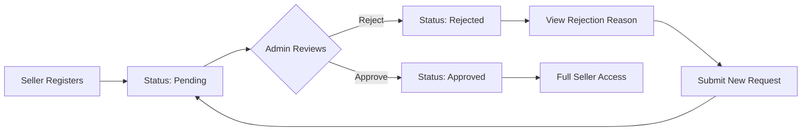
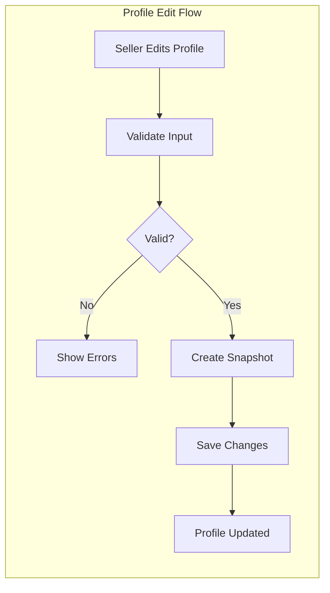
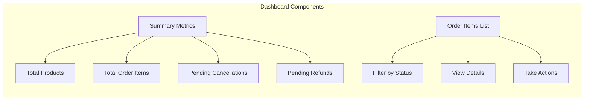
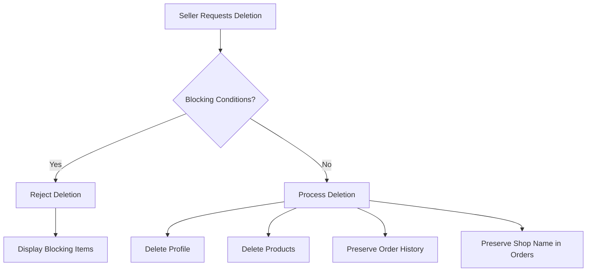
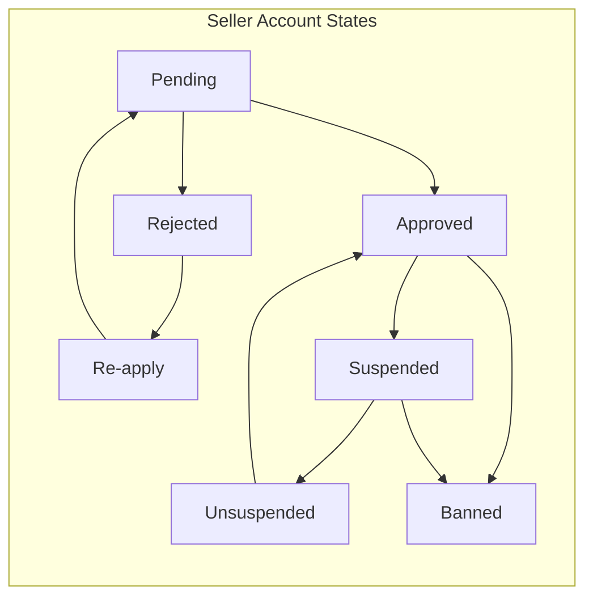

# Seller Features Requirements

## 1. Overview

This document specifies all requirements related to seller account management in the e-commerce shopping mall platform. Sellers are registered merchants who create and manage products, handle inventory, process shipments, and respond to customer requests. Unlike customers, sellers require administrator approval before they can begin selling on the platform.

### 1.1 Seller Actor Definition

THE seller actor SHALL be a registered merchant with the following capabilities:

- Create and manage products with variants and images
- Manage inventory through restocking and adjustments
- Process shipments for paid order items
- Respond to cancellation and refund requests
- View their shop dashboard with metrics
- Manage their shop profile information

### 1.2 Seller Account States

Seller accounts can exist in the following states:

| State | Description | Capabilities |
|-------|-------------|-------------|
| Pending | Awaiting administrator approval | None (cannot sell) |
| Approved | Active seller with full privileges | All seller capabilities |
| Rejected | Registration denied by administrator | Can re-apply with new request |
| Suspended | Account suspended by administrator | Limited to existing order processing |
| Banned | Account banned by administrator | Cannot log in |

---

## 2. Seller Registration and Approval

### 2.1 Registration Process

#### 2.1.1 Initial Registration

WHEN a user attempts to register as a seller, THE system SHALL:

1. Collect email address and password credentials
2. Validate email format and password strength
3. Check for duplicate email addresses in the system
4. Create a seller account with status "pending"
5. Send confirmation of registration submission

THE seller registration SHALL require the following fields:

- Email address (unique, validated format)
- Password (minimum security requirements apply)

#### 2.1.2 Registration Validation

IF a user attempts to register with an email already in use, THEN THE system SHALL reject the registration and display an appropriate error message.

THE system SHALL validate that:

- Email address follows standard email format (e.g., user@domain.com)
- Password meets minimum security requirements
- Email is not already registered as any user type (customer, seller, or administrator)

### 2.2 Administrator Approval Workflow

#### 2.2.1 Approval Queue

THE system SHALL maintain a queue of pending seller registration requests visible to administrators.

Administrators SHALL be able to view:

- Seller email address
- Registration date and time
- Any additional submitted information

#### 2.2.2 Approval Decision

WHEN an administrator reviews a pending seller registration, THE system SHALL allow the administrator to:

1. Approve the registration, changing seller status to "approved"
2. Reject the registration with a required reason

IF an administrator approves a seller registration, THEN THE system SHALL:

- Change the seller account status to "approved"
- Send notification to the seller that they can now sell
- Enable all seller capabilities

IF an administrator rejects a seller registration, THEN THE system SHALL:

- Change the seller account status to "rejected"
- Store the rejection reason provided by the administrator
- Send notification to the seller with the rejection reason
- Preserve the seller account record for re-application tracking

### 2.3 Rejection Handling and Re-application

#### 2.3.1 Viewing Rejection Status

WHEN a seller with rejected status logs in, THE system SHALL display:

- Current registration status (rejected)
- The rejection reason provided by the administrator
- Option to submit a new registration request

#### 2.3.2 Re-application Process

WHEN a rejected seller submits a new registration request, THE system SHALL:

1. Preserve the original account record for audit purposes
2. Create a new pending registration entry
3. Change the seller account status back to "pending"
4. Add the seller to the administrator approval queue

THE system SHALL maintain a history of all registration attempts, including:

- Previous rejection reasons
- Dates of each application and decision
- Administrator who made each decision

---

## 3. Shop Profile Management

### 3.1 Profile Data Structure

#### 3.1.1 Required Profile Information

THE seller profile SHALL contain the following information:

| Field | Type | Required | Description |
|-------|------|----------|-------------|
| Shop Name | String | Yes | Display name of the seller's shop |
| Shop Description | Text | Yes | Description of the shop and products |
| Logo Image | Image URL | Yes | Visual identifier for the shop |

#### 3.1.2 Profile Initialization

WHEN a seller's registration is approved, THE system SHALL create an empty shop profile that the seller must complete before listing products.

THE system SHALL require sellers to complete their shop profile:

- Before creating their first product
- Before appearing in seller listings

### 3.2 Profile Editing

#### 3.2.1 Edit Operations

WHEN a seller edits their shop profile, THE system SHALL:

1. Allow modification of shop name, description, and logo
2. Validate all required fields before saving
3. Create a snapshot of the previous profile state
4. Apply the changes to the current profile
5. Record the timestamp and nature of changes

#### 3.2.2 Edit Validation

THE system SHALL validate profile edits as follows:

- **Shop Name**: Required, minimum 2 characters, maximum 100 characters
- **Shop Description**: Required, minimum 10 characters, maximum 2000 characters
- **Logo Image**: Required, must be a valid image URL or uploaded file

IF a seller attempts to save an incomplete profile, THEN THE system SHALL reject the changes and display validation errors.

### 3.3 Snapshot Creation for Profile Changes

#### 3.3.1 Snapshot Trigger

WHEN a seller saves changes to their shop profile, THE system SHALL automatically create a snapshot containing:

- Previous shop name
- Previous shop description
- Previous logo image URL
- Timestamp of the change
- Seller ID who made the change

#### 3.3.2 Snapshot Storage

THE system SHALL store profile snapshots as immutable records that:

- Cannot be modified after creation
- Cannot be deleted
- Maintain a complete audit trail of all profile changes

#### 3.3.3 Snapshot Access

- Sellers SHALL be able to view snapshots of their own profile history
- Administrators SHALL be able to view snapshots of any seller's profile
- Customers SHALL NOT have access to profile snapshots

### 3.4 Public Profile Visibility

#### 3.4.1 Customer Access

WHEN a customer views a seller's public profile, THE system SHALL display:

- Current shop name
- Current shop description
- Current logo image
- Link to view products by this seller

#### 3.4.2 Profile Linking

THE system SHALL link seller profiles from:

- Product detail pages (seller shop name links to profile)
- Product listings (seller name is clickable)
- Order item details (preserved shop name at time of purchase)

---

## 4. Seller Dashboard

### 4.1 Dashboard Summary Metrics

#### 4.1.1 Overview Statistics

WHEN a seller accesses their dashboard, THE system SHALL display:

| Metric | Description | Update Frequency |
|--------|-------------|------------------|
| Total Products | Count of all products created by the seller | Real-time |
| Total Order Items | Count of all order items for seller's products | Real-time |
| Pending Cancellations | Number of cancellation requests awaiting response | Real-time |
| Pending Refunds | Number of refund requests awaiting response | Real-time |

#### 4.1.2 Metric Calculation

THE system SHALL calculate dashboard metrics as follows:

- **Total Products**: Count of products where seller_id matches, excluding deleted products
- **Total Order Items**: Count of order items containing the seller's products across all orders
- **Pending Cancellations**: Count of cancellation requests with status "pending" for the seller's products
- **Pending Refunds**: Count of refund requests with status "pending" for the seller's products

### 4.2 Order Item Management

#### 4.2.1 Order Item List View

WHEN a seller views their order items, THE system SHALL display:

- Order number
- Product name and variant information
- Quantity ordered
- Price per item and subtotal
- Current item status
- Order date
- Customer shipping address (relevant items only)

#### 4.2.2 Status Filtering

THE system SHALL allow sellers to filter order items by status:

- **Paid**: Items awaiting shipment
- **Shipped**: Items in transit with tracking
- **Delivered**: Items confirmed delivered
- **Cancelled**: Items cancelled before shipping
- **Refunded**: Items refunded after delivery

#### 4.2.3 Action Availability by Status

| Item Status | Available Actions |
|-------------|-------------------|
| Paid | Create shipment, Respond to cancellation request |
| Shipped | None (awaiting delivery confirmation) |
| Delivered | Respond to refund request |
| Cancelled | None |
| Refunded | None |

### 4.3 Pending Request Notifications

#### 4.3.1 Cancellation Requests

WHEN a customer requests cancellation for an item, THE system SHALL:

1. Notify the seller of the pending request
2. Display the request in the seller's dashboard
3. Show the cancellation reason provided by the customer
4. Provide approve/reject action buttons

#### 4.3.2 Refund Requests

WHEN a customer requests a refund for a delivered item, THE system SHALL:

1. Notify the seller of the pending request
2. Display the request in the seller's dashboard
3. Show the refund reason provided by the customer
4. Show the delivery date (must be within 7-day window)
5. Provide approve/reject action buttons

---

## 5. Account Deletion Conditions

### 5.1 Deletion Prerequisites

#### 5.1.1 Blocking Conditions

THE system SHALL NOT allow seller account deletion IF any of the following conditions exist:

- Any order items with status "paid" (awaiting shipment)
- Any order items with status "shipped" (in transit)
- Any pending cancellation requests from customers
- Any pending refund requests from customers

IF a seller attempts to delete their account while blocking conditions exist, THEN THE system SHALL:

1. Reject the deletion request
2. Display a message explaining why deletion is not possible
3. List the specific blocking items (e.g., "3 items awaiting shipment")

#### 5.1.2 Allowed Conditions

THE system SHALL allow seller account deletion only when:

- All order items are in terminal states (delivered, cancelled, or refunded)
- No pending cancellation requests exist
- No pending refund requests exist

### 5.2 Deletion Process

#### 5.2.1 Data Deletion

WHEN a seller successfully deletes their account, THE system SHALL:

1. Delete the seller's profile information
2. Delete all products created by the seller
3. Delete all product variants and inventory records
4. Delete all product images
5. Remove products from all wishlists
6. Remove products from all shopping carts

#### 5.2.2 Data Preservation

THE system SHALL preserve the following data when a seller deletes their account:

| Data Type | Preservation Method | Purpose |
|-----------|---------------------|---------|
| Order history | Maintained with preserved shop name | Seller records and legal compliance |
| Order item snapshots | Maintained with product details at time of purchase | Dispute resolution |
| Shop name in orders | Displayed as preserved at time of purchase | Customer reference |
| Profile snapshots | Maintained for audit trail | Dispute resolution |

#### 5.2.3 Product Visibility After Deletion

WHEN a seller deletes their account, THE system SHALL:

- Remove all products from search results immediately
- Remove all products from category listings immediately
- Mark products as deleted in the database (soft delete)
- Preserve order item snapshots with full product details

### 5.3 Order History Preservation

#### 5.3.1 Display in Order History

WHEN a customer views their order history containing items from a deleted seller, THE system SHALL display:

- The shop name as it existed at the time of purchase
- Product details from the order item snapshot
- All order information remains intact

#### 5.3.2 Link Handling

THE system SHALL handle seller profile links for deleted sellers:

- Links to the deleted seller's profile shall display "Seller no longer active"
- Product links shall not function (product is deleted)
- All snapshot data remains accessible for dispute resolution

---

## 6. Seller-Specific Business Rules

### 6.1 Account Suspension

#### 6.1.1 Suspension by Administrators

WHEN an administrator suspends a seller account, THE system SHALL:

1. Change the seller status to "suspended"
2. Hide all seller's products from search and category listings
3. Prevent new purchases of the seller's products
4. Allow the seller to continue processing existing orders

#### 6.1.2 Suspended Seller Capabilities

WHILE a seller account is in suspended status, THE seller SHALL be able to:

- Log in to their account
- View their dashboard
- Process existing order items (create shipments)
- Respond to cancellation and refund requests
- View their products and inventory

WHILE a seller account is in suspended status, THE seller SHALL NOT be able to:

- Create new products
- Edit existing products
- Edit their shop profile
- Add inventory to variants
- Receive new orders

#### 6.1.3 Unsuspension

WHEN an administrator unsuspends a seller account, THE system SHALL:

1. Change the seller status back to "approved"
2. Make all products visible in search and category listings
3. Allow new purchases of the seller's products
4. Restore full seller capabilities

### 6.2 Account Banning

#### 6.2.1 Ban Process

WHEN an administrator bans a seller account, THE system SHALL:

1. Change the seller status to "banned"
2. Prevent the seller from logging in
3. Hide all products from search and listings
4. Prevent any new activity on the account

#### 6.2.2 Banned Account Data

THE system SHALL handle banned seller data as follows:

- Products remain in the database but are hidden
- Order history is preserved
- Existing orders continue to be processed (customers can receive items)
- Seller cannot access their account

### 6.3 Operational Constraints

#### 6.3.1 Product Creation Constraints

THE system SHALL enforce the following constraints when sellers create products:

- Seller must have approved status
- Seller must have completed their shop profile
- Seller must not be suspended or banned

#### 6.3.2 Inventory Management Constraints

THE system SHALL allow inventory operations only when:

- The product variant belongs to the seller
- The seller has approved status
- The seller is not suspended (for adding inventory)

#### 6.3.3 Shipment Processing Constraints

THE system SHALL allow shipment creation only when:

- The order items belong to the seller's products
- The items are in "paid" status
- The seller has approved or suspended status (suspended sellers can still ship)

### 6.4 Permission Boundaries

#### 6.4.1 Seller Access Scope

THE seller SHALL only have access to:

- Their own products, variants, and inventory
- Their own shop profile and snapshots
- Order items containing their products
- Cancellation and refund requests for their products
- Their own dashboard and metrics

#### 6.4.2 Cross-Seller Restrictions

THE system SHALL prevent sellers from:

- Viewing other sellers' products in edit mode
- Viewing other sellers' order details
- Viewing other sellers' dashboard metrics
- Editing other sellers' profiles
- Responding to requests for other sellers' products

---

## 7. Seller Authentication Requirements

### 7.1 Login Process

#### 7.1.1 Login Credentials

WHEN a seller attempts to log in, THE system SHALL:

1. Validate email and password combination
2. Check the seller account status
3. Grant or deny access based on status

#### 7.1.2 Status-Based Login Behavior

| Account Status | Login Behavior |
|----------------|----------------|
| Pending | Allow login, show pending approval message |
| Approved | Allow login, full access |
| Rejected | Allow login, show rejection reason and re-apply option |
| Suspended | Allow login, limited access with suspension notice |
| Banned | Deny login, show ban message |

### 7.2 Password Management

#### 7.2.1 Password Change

WHEN a seller changes their password, THE system SHALL:

1. Verify the current password
2. Validate the new password meets security requirements
3. Update the password securely
4. Invalidate all existing sessions except the current one
5. Send confirmation notification to the seller's email

#### 7.2.2 Session Management

THE system SHALL manage seller sessions as follows:

- Access tokens expire after 30 minutes of inactivity
- Refresh tokens expire after 7 days
- Sellers can revoke all other sessions from their account settings

---

## 8. Summary

### 8.1 Key Business Requirements

1. **Registration Gate**: All sellers must be approved by administrators before gaining selling privileges
2. **Re-application**: Rejected sellers can submit new registration requests
3. **Profile Snapshots**: All shop profile changes are tracked with immutable snapshots
4. **Dashboard Metrics**: Sellers have real-time visibility into their shop performance
5. **Deletion Safeguards**: Sellers cannot delete accounts with active orders or pending requests
6. **Data Preservation**: Order history and shop names are preserved for legal and business purposes
7. **Suspension Mechanics**: Suspended sellers can process existing orders but cannot create new content
8. **Permission Boundaries**: Sellers can only access and manage their own data

### 8.2 Related Documents

For additional context, refer to:

- [User Actors Document](./02-user-actors.md) - Complete actor definitions and authentication flows
- [Product Management Document](./06-product-management.md) - Product creation and inventory management
- [Order Management Document](./08-order-management.md) - Order processing workflows
- [Shipping and Tracking Document](./09-shipping-tracking.md) - Shipment creation and tracking
- [Cancellation and Refund Document](./10-cancellation-refund.md) - Request handling workflows
- [Administrator System Document](./13-administrator-system.md) - Administrator management capabilities