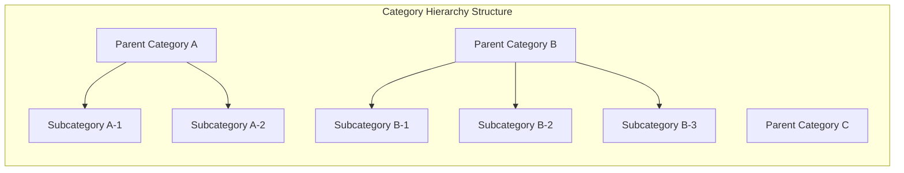
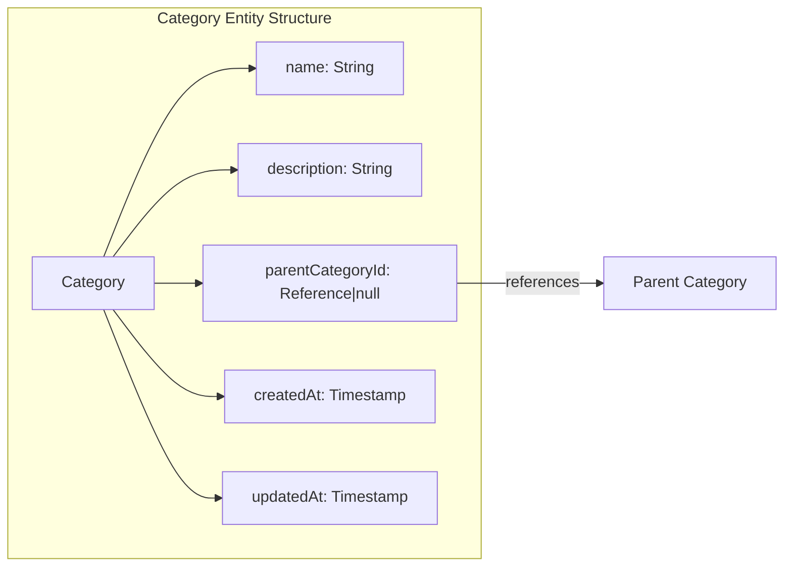
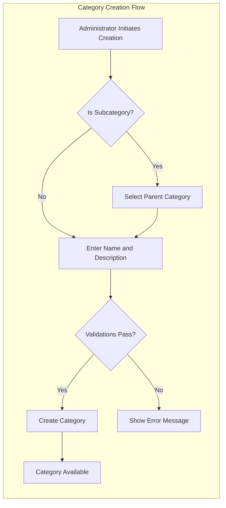
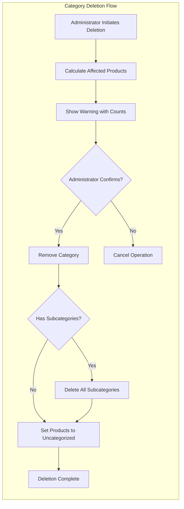
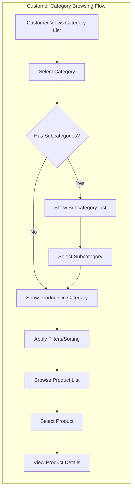

# Category System Requirements

## Overview

The category system provides hierarchical organization for products in the e-commerce shopping mall platform. Categories enable customers to discover products through structured navigation while giving administrators control over the classification taxonomy. The system supports a two-level hierarchy with primary categories and subcategories.

## Category Structure

### Hierarchical Organization

THE category system SHALL organize products into a two-level hierarchy consisting of parent categories and subcategories.

**Category Levels:**

| Level | Type | Description | Parent Requirement |
|-------|------|-------------|-------------------|
| 1 | Parent Category | Top-level classification | None (root level) |
| 2 | Subcategory | Second-level classification | Must have a parent category |

**Nesting Constraints:**

- THE system SHALL support exactly ONE level of nesting (parent category → subcategory)
- THE system SHALL NOT allow subcategories to have their own subcategories
- THE system SHALL allow parent categories to exist without subcategories
- THE system SHALL allow subcategories to exist under any parent category

### Category Attributes

Each category, whether parent or subcategory, SHALL contain the following attributes:

| Attribute | Type | Required | Description |
|-----------|------|----------|-------------|
| Name | String | Yes | Display name of the category |
| Description | String | Yes | Textual description of the category purpose and contents |
| Parent Category | Reference | No | Reference to parent category (null for parent categories, required for subcategories) |

**Attribute Requirements:**

- THE system SHALL require a name for every category
- THE system SHALL require a description for every category
- THE name SHALL be unique across all categories at the same level
- THE description SHALL support rich text content for detailed category explanations
- WHEN a category is created as a subcategory, THE system SHALL require a parent category reference

### Category Data Model

## Category Management by Administrators

### Management Permissions

Categories SHALL be managed exclusively by administrators. The following table defines the management capabilities:

| Action | Administrator | Super Administrator | Customer | Seller |
|--------|---------------|---------------------|----------|--------|
| Create parent category | ✅ | ✅ | ❌ | ❌ |
| Create subcategory | ✅ | ✅ | ❌ | ❌ |
| Edit category name | ✅ | ✅ | ❌ | ❌ |
| Edit category description | ✅ | ✅ | ❌ | ❌ |
| Delete category | ✅ | ✅ | ❌ | ❌ |
| View categories | ✅ | ✅ | ✅ | ✅ |

### Category Creation

**Creating Parent Categories:**

WHEN an administrator creates a new parent category, THE system SHALL:

1. Validate that the category name is unique among all parent categories
2. Require both name and description fields
3. Create the category at the root level (no parent reference)
4. Make the category immediately available for product assignment and subcategory creation

**Creating Subcategories:**

WHEN an administrator creates a new subcategory, THE system SHALL:

1. Require selection of an existing parent category
2. Validate that the subcategory name is unique among siblings (subcategories of the same parent)
3. Require both name and description fields
4. Create the category as a child of the selected parent
5. Make the subcategory immediately available for product assignment

**Creation Validation Rules:**

- IF a category name already exists at the same level with the same parent, THEN THE system SHALL reject the creation and display an appropriate error message
- IF the description field is empty, THEN THE system SHALL reject the creation and require a description
- WHEN creating a subcategory, IF the selected parent does not exist, THEN THE system SHALL reject the creation

### Category Editing

Administrators SHALL have the ability to modify existing categories:

**Editable Fields:**

- Category name
- Category description

**Non-Editable Fields:**

- Category ID (immutable identifier)
- Parent category relationship (cannot be moved between parents)
- Created timestamp

**Editing Rules:**

- WHEN an administrator edits a category name, THE system SHALL validate that the new name is unique among siblings
- IF the new name conflicts with an existing sibling, THEN THE system SHALL reject the edit
- WHEN an administrator edits a category description, THE system SHALL accept any non-empty text
- WHEN a category is edited, THE system SHALL update the updated timestamp

**Important Constraint:**

THE system SHALL NOT allow changing a category's parent. To move a subcategory:

1. The administrator must create a new subcategory under the desired parent
2. Reassign all products from the old subcategory to the new one
3. Delete the old subcategory

### Category Deletion

**Deletion Process:**

WHEN an administrator deletes a category, THE system SHALL:

1. Remove the category from all listings and navigation
2. Set the category reference of all assigned products to null (uncategorized)
3. Delete all subcategories if deleting a parent category
4. Permanently remove the category record

**Deletion Effects on Products:**

| Scenario | Effect on Products |
|----------|-------------------|
| Deleting a parent category | All products in parent and its subcategories become uncategorized. All subcategories are deleted. |
| Deleting a subcategory | Products in that subcategory become uncategorized. Parent category remains intact. |

**Product Uncategorized State:**

- WHEN a product becomes uncategorized due to category deletion, THE product SHALL remain visible and purchasable
- THE product SHALL appear in search results but not in category listings
- THE product SHALL display "Uncategorized" or no category in product details
- Sellers SHALL be able to assign a new category to uncategorized products

**Deletion Warning:**

WHEN an administrator attempts to delete a category, THE system SHALL display a warning showing:

- Number of products currently assigned to the category
- Number of subcategories that will be deleted (if deleting a parent)
- Confirmation that products will become uncategorized

## Category Browsing by Customers

### Category List Viewing

**Access Requirements:**

- Customers SHALL be able to browse the list of all categories without authentication
- THE platform requires registration for most features, but category browsing SHALL be available to all visitors

**Category List Display:**

WHEN a customer views the category list, THE system SHALL display:

- All parent categories in alphabetical order or custom sort order
- Each parent category's name and description
- Visual indicator if subcategories exist

**Navigation to Subcategories:**

WHEN a customer selects a parent category, THE system SHALL:

- Display all subcategories under that parent
- Show the parent category name as context
- Provide navigation back to the main category list

### Category-Based Product Discovery

**Viewing Products in a Category:**

WHEN a customer selects a category, THE system SHALL display:

- Products assigned directly to that category
- For parent categories: products from all subcategories under that parent
- Pagination controls for large product lists

**Product Display in Category View:**

Each product in the category view SHALL show:

| Information | Description |
|-------------|-------------|
| Main image | Primary product thumbnail |
| Product name | Display name of the product |
| Base price | Price or price range for variants |
| Seller shop name | Name of the seller's shop |
| Average rating | Calculated from reviews (if any) |

**Category Filtering:**

WHEN viewing products in a category, customers SHALL be able to:

- Filter by price range (minimum and maximum)
- Filter to show only in-stock products
- Sort by newest, price low-to-high, or price high-to-low

### Empty Category Handling

**Categories Without Products:**

- IF a category has no products assigned, THE system SHALL display an empty state message
- THE system SHALL still show the category in listings even if empty
- THE empty state message SHALL suggest browsing other categories

**Categories Without Subcategories:**

- IF a parent category has no subcategories, THE system SHALL display products assigned directly to the parent
- THE system SHALL NOT display a subcategory list if none exist

## Category Assignment to Products

### Product-Category Relationship

**Assignment Requirements:**

- Each product SHALL be assigned to exactly ONE category
- THE assigned category can be either a parent category or a subcategory
- WHEN a seller creates a product, THE system SHALL require category selection
- THE system SHALL NOT allow products without a category assignment

**Category Selection During Product Creation:**

WHEN a seller creates a product, THE system SHALL:

1. Display all available categories and subcategories
2. Allow selection of any category (parent or subcategory)
3. Require the selection before the product can be saved

**Category Selection Interface:**

- Sellers SHALL see a hierarchical display of categories
- The interface SHALL show parent categories with expandable subcategories
- Sellers SHALL be able to search for categories by name

### Changing Product Category

**Category Reassignment:**

WHEN a seller changes a product's category, THE system SHALL:

1. Validate that the new category exists
2. Update the product's category reference
3. Immediately reflect the change in product listings and search

**Reassignment Effects:**

- THE product SHALL appear in the new category's listings
- THE product SHALL no longer appear in the old category's listings
- THE product's URL and identifier SHALL remain unchanged
- No historical record of category changes is required (unlike product content changes)

### Uncategorized Products

**Definition:**

A product becomes uncategorized when:

1. Its assigned category is deleted
2. Its assigned subcategory is deleted

**Uncategorized Product Behavior:**

| Aspect | Behavior |
|--------|----------|
| Search visibility | Visible in search results |
| Category listing | Not visible in any category |
| Purchase availability | Still purchasable |
| Product detail display | Shows no category or "Uncategorized" |
| Seller dashboard | Flagged for category assignment |

**Seller Responsibility:**

- Sellers SHALL be notified of uncategorized products
- Sellers SHALL be able to assign a new category to uncategorized products
- THE system SHALL display uncategorized products in the seller's product management interface

## Business Rules and Constraints

### Validation Rules

**Category Name Validation:**

- THE name SHALL be required
- THE name SHALL be between 2 and 100 characters
- THE name SHALL be unique among siblings (categories with the same parent)
- THE name SHALL NOT contain special characters that could cause display issues

**Category Description Validation:**

- THE description SHALL be required
- THE description SHALL be between 10 and 1000 characters
- THE description SHALL support plain text and basic formatting

**Parent Category Validation:**

- WHEN creating a subcategory, THE parent category SHALL exist
- WHEN creating a subcategory, THE parent category SHALL not be deleted during creation

### Constraint Rules

**Hierarchy Constraints:**

- Maximum nesting depth: 2 levels (parent → subcategory)
- No circular references: A category cannot be its own parent
- Maximum subcategories per parent: No hard limit, but consider performance

**Product Constraints:**

- Each product must have exactly one category
- Category can have zero or many products
- Category deletion does not delete products

**Management Constraints:**

- Only administrators can create, edit, and delete categories
- Category changes take effect immediately
- No approval workflow for category changes

### Error Scenarios

**Category Creation Errors:**

| Error Condition | System Response |
|----------------|-----------------|
| Duplicate name at same level | Display error: "Category name already exists at this level" |
| Empty name | Display error: "Category name is required" |
| Empty description | Display error: "Category description is required" |
| Invalid parent category | Display error: "Selected parent category does not exist" |

**Category Deletion Errors:**

| Error Condition | System Response |
|----------------|-----------------|
| Category does not exist | Display error: "Category not found" |
| Permission denied | Display error: "You do not have permission to delete categories" |

**Product Assignment Errors:**

| Error Condition | System Response |
|----------------|-----------------|
| Attempting to save product without category | Display error: "Please select a category for the product" |
| Selected category does not exist | Display error: "Selected category no longer exists" |

### Performance Considerations

**Category List Performance:**

- THE category list SHALL load instantly (within 1 second)
- THE system SHALL cache category hierarchies for fast retrieval
- THE system SHALL update cache when categories are modified

**Product Listing in Categories:**

- Products SHALL be paginated (20 items per page)
- Filter and sort operations SHALL complete within 2 seconds
- Category product counts SHALL be displayed accurately

## Summary

The category system provides essential product organization for the e-commerce platform with the following key characteristics:

1. **Two-level hierarchy**: Parent categories and subcategories provide structured navigation
2. **Administrator control**: Only administrators can manage the category taxonomy
3. **Customer accessibility**: All users can browse and filter products by category
4. **Product flexibility**: Products can be assigned to any category level
5. **Safe deletion**: Deleting categories preserves products, setting them to uncategorized status

The category system integrates closely with product management for assignment and search functionality, while administrator management ensures controlled taxonomy evolution.