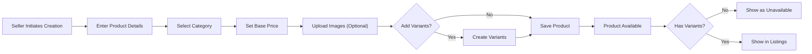
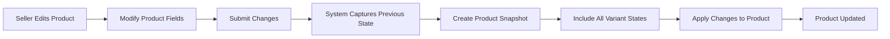
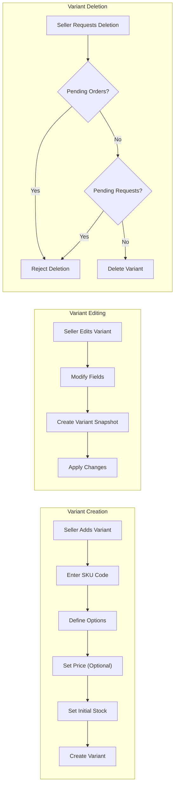
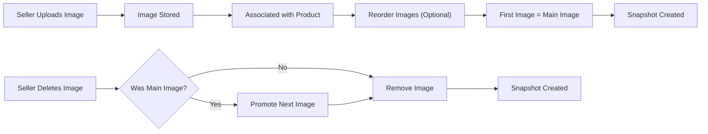
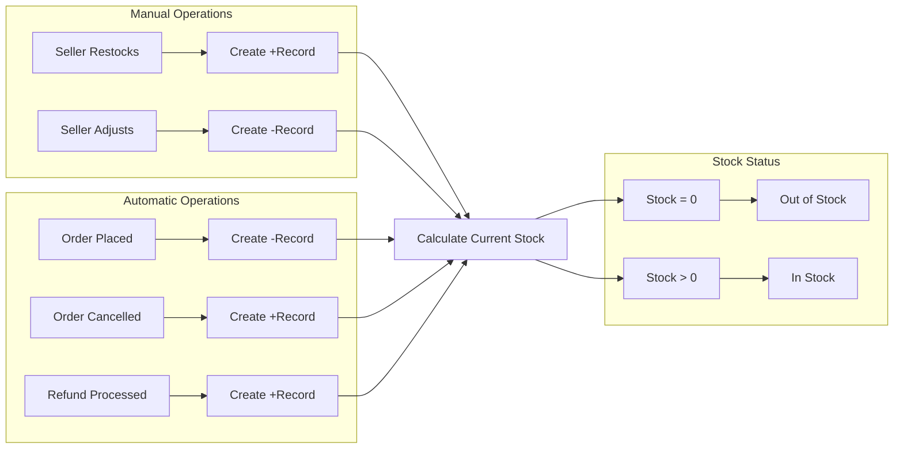
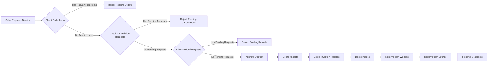
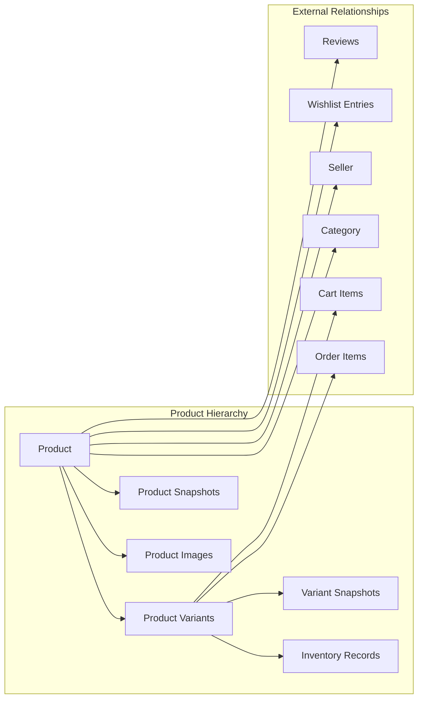

# Product Management Requirements

## Overview

Products are the core entities of the e-commerce platform, representing items that sellers offer to customers. Each product can have multiple variants (SKUs) representing different option combinations, with independent inventory tracking for each variant.

THE product management system SHALL maintain complete audit history through snapshots for all product and variant modifications.

THE inventory tracking system SHALL use history records rather than snapshots to track stock level changes.

---

## Product Creation

### Product Entity Definition

A product represents a sellable item created by a seller on the platform. Each product contains essential information that customers use to make purchasing decisions.

### Required Product Fields

WHEN a seller creates a new product, THE system SHALL require the following fields:

| Field | Type | Requirement | Description |
|-------|------|-------------|-------------|
| Name | String | Required | The display name of the product |
| Description | String | Required | Detailed product description |
| Category | Reference | Required | Must belong to a category (can be subcategory) |
| Base Price | Number | Required | The default price for the product |
| Images | Array | Optional | Product images (can be added after creation) |
| Variants | Array | Optional | Product variants/SKUs (can be added after creation) |

### Product Creation Rules

WHEN a seller creates a product, THE system SHALL:
- Associate the product with the authenticated seller
- Set the product creation timestamp
- Allow creation without variants (product will be "unavailable" until variants are added)
- Allow creation without images

IF a product is created without variants, THEN THE system SHALL display the product in search results with "unavailable" status.

THE product SHALL belong exclusively to the seller who created it.

### Category Assignment

WHEN a seller assigns a category to a product, THE system SHALL:
- Allow selection of any existing category
- Allow selection of subcategories (one level of nesting only)
- Require at least one category assignment
- Validate that the selected category exists in the system

### Product Creation Workflow

---

## Product Editing and Snapshots

### Snapshot Principle for Products

THE system SHALL create an immutable snapshot whenever any editable product field is modified.

### Snapshot Creation Triggers

WHEN a seller modifies any of the following product fields, THE system SHALL create a product snapshot:
- Product name
- Product description
- Category assignment
- Base price
- Product images (addition, deletion, or reordering)

### Snapshot Content Structure

WHEN a product snapshot is created, THE system SHALL record:

| Data | Description |
|------|-------------|
| Timestamp | When the change was made |
| Changed Fields | Which specific fields were modified |
| Previous Values | The values before the change |
| New Values | The values after the change |
| Product State | Complete state of all product fields at that moment |
| Variant Snapshots | Snapshots of all variants at that moment |

### Complete Product Snapshot

WHEN a product snapshot is created, THE system SHALL include:

1. **Product-Level Data**:
   - Product name (previous and new)
   - Product description (previous and new)
   - Category assignment (previous and new)
   - Base price (previous and new)
   - Image URLs and order (previous and new)

2. **Variant-Level Data**:
   - All variants associated with the product at that moment
   - Each variant's SKU code, option values, and price

THE product snapshot SHALL preserve the complete state of the product and all its variants at the point in time when the change occurred.

### Snapshot Immutability

THE system SHALL ensure that all product snapshots are:
- Immutable and cannot be modified after creation
- Cannot be deleted even after product deletion
- Permanently stored for dispute resolution purposes

### Snapshot Access

- Sellers SHALL be able to view snapshots of their own products
- Administrators SHALL be able to view snapshots of any product
- Snapshots SHALL be available for viewing indefinitely

### Product Editing Workflow

---

## Product Variants (SKU)

### Variant Concept

A product variant (SKU) represents a specific combination of options for a product. Each variant has its own price (which can override the base price) and stock quantity.

### Variant Entity Definition

WHEN a seller creates a product variant, THE system SHALL require the following fields:

| Field | Type | Requirement | Description |
|-------|------|-------------|-------------|
| SKU Code | String | Required | Unique identifier for the variant |
| Option Values | Object | Required | Combination of options (e.g., color: "Red", size: "Large") |
| Price | Number | Optional | Overrides base price if specified |
| Stock Quantity | Number | Required | Initial stock quantity (defaults to 0) |

### SKU Code Requirements

THE SKU code SHALL:
- Be unique across all variants in the system
- Serve as a unique identifier for the variant
- Not be empty
- Not be modifiable after creation (creates new variant if different SKU needed)

### Option Values Structure

WHEN a seller defines option values, THE system SHALL allow:
- Multiple option types (e.g., color, size, material)
- Multiple option values per type
- Any combination of option types and values

Example variant combinations:
- "Red / Large" - Color: Red, Size: Large
- "Blue / Small" - Color: Blue, Size: Small
- "Black / Medium" - Color: Black, Size: Medium

### Price Override Behavior

WHEN a variant has a specified price, THE system SHALL:
- Use the variant's price instead of the product's base price
- Display the variant's price on product detail page
- Use the variant's price in cart and checkout

IF a variant does not have a specified price, THEN THE system SHALL use the product's base price.

### Stock Quantity Initialization

WHEN a variant is created, THE system SHALL:
- Set the initial stock quantity to the specified value
- Create an initial inventory record if stock quantity is greater than 0
- Default to 0 if no stock quantity is specified

### Variant Editing

WHEN a seller edits a variant, THE system SHALL:
- Create a variant snapshot for the modification
- Record the previous and new values for all modified fields
- Preserve the complete variant state in the snapshot

### Editable Variant Fields

Sellers can edit the following variant fields:
- SKU code (creates new variant, old variant remains for historical purposes)
- Option values
- Price (or remove price override)

### Variant Snapshot Structure

WHEN a variant snapshot is created, THE system SHALL record:

| Data | Description |
|------|-------------|
| Timestamp | When the change was made |
| SKU Code | The SKU code at that moment |
| Option Values | The option values at that moment |
| Price | The price (or price override) at that moment |
| Stock Quantity | NOT included (tracked separately via inventory history) |

### Variant Deletion Conditions

THE system SHALL allow variant deletion ONLY IF:
- There are no pending order items (paid or shipped status) for that variant
- There are no pending cancellation requests for that variant
- There are no pending refund requests for that variant

IF any pending orders or requests exist for the variant, THEN THE system SHALL reject the deletion with an appropriate error message.

### Variant Deletion Effects

WHEN a variant is deleted, THE system SHALL:
- Remove the variant from the product
- Preserve all historical snapshots of the variant
- Keep the variant data in existing order items (via order item snapshots)

### Product Purchasability

IF a product has at least one variant with stock quantity greater than 0, THEN THE product SHALL be purchasable.

IF a product has no variants, THEN THE system SHALL display the product with "unavailable" status and prevent addition to cart.

### Variant Management Workflow

---

## Product Images

### Image Upload

WHEN a seller uploads images for a product, THE system SHALL:
- Allow multiple images per product
- Store the images in the system
- Associate each image with the specific product
- Maintain the order in which images were uploaded

### Image Ordering

THE system SHALL allow sellers to reorder product images.

WHEN images are reordered, THE system SHALL:
- Update the image position in the product record
- Designate the first image as the main/thumbnail image
- Create a product snapshot to record the image order change

### Main Image

THE first image in the ordered list SHALL be designated as the main image.

THE main image SHALL be used as:
- The thumbnail in product listings
- The preview image in search results
- The featured image on category pages

### Image Deletion

WHEN a seller deletes an image from a product, THE system SHALL:
- Remove the image from the product
- Create a product snapshot recording the deletion
- Automatically promote the next image to main image if the deleted image was the main image

IF all images are deleted from a product, THEN THE system SHALL display a placeholder image in listings.

### Image Inclusion in Snapshots

WHEN a product snapshot is created, THE system SHALL include:
- The complete list of image URLs at that moment
- The order of images at that moment

### Image Management Workflow

---

## Inventory Management

### Inventory Tracking Principle

THE system SHALL track inventory through history records, NOT through snapshots.

Inventory history records track quantity changes over time, allowing calculation of current stock.

### Inventory History Record Structure

WHEN an inventory change occurs, THE system SHALL create an inventory record with:

| Field | Type | Description |
|-------|------|-------------|
| Variant Reference | Reference | The variant whose stock changed |
| Quantity Change | Number | Positive (restock) or negative (sale/adjustment) |
| Reason | String | Why the change occurred |
| Timestamp | DateTime | When the change occurred |

### Inventory Change Reasons

THE system SHALL track the following reasons for inventory changes:

| Reason Type | Quantity Direction | Trigger |
|-------------|-------------------|----------|
| Restock | Positive (+) | Seller manually adds inventory |
| Adjustment (Loss) | Negative (-) | Seller manually subtracts inventory |
| Order Placement | Negative (-) | Customer places order |
| Order Cancellation | Positive (+) | Order item cancelled |
| Refund Processed | Positive (+) | Order item refunded |

### Current Stock Calculation

THE current stock of a variant SHALL be calculated by:
**Current Stock = Sum of all inventory records for that variant**

### Manual Inventory Addition (Restock)

WHEN a seller adds inventory to a variant, THE system SHALL:
- Require a quantity (positive integer)
- Require a reason (text description)
- Create an inventory record with positive quantity change
- Update the variant's available stock

### Manual Inventory Subtraction (Adjustment/Loss)

WHEN a seller subtracts inventory from a variant, THE system SHALL:
- Require a quantity (positive integer)
- Require a reason (text description)
- Verify sufficient stock exists
- Create an inventory record with negative quantity change
- Update the variant's available stock

IF subtraction would result in negative stock, THEN THE system SHALL reject the operation with an error.

### Automatic Inventory Changes

#### Order Placement
WHEN a customer places an order, THE system SHALL:
- Create a negative inventory record for each variant in the order
- Set the reason to "Order placed - Order #[Order Number]"
- Deduct the ordered quantity from available stock

#### Order Cancellation
WHEN an order item is cancelled, THE system SHALL:
- Create a positive inventory record for the variant
- Set the reason to "Order cancelled - Order #[Order Number]"
- Restore the cancelled quantity to available stock

#### Refund Processing
WHEN an order item is refunded, THE system SHALL:
- Create a positive inventory record for the variant
- Set the reason to "Refund processed - Order #[Order Number]"
- Restore the refunded quantity to available stock

### Out of Stock Handling

WHEN a variant's stock reaches 0, THE system SHALL:
- Mark the variant as "out of stock"
- Display "out of stock" status on product detail page
- Prevent customers from adding the variant to cart

WHEN a variant's stock is greater than 0, THE system SHALL:
- Mark the variant as "in stock"
- Allow customers to add the variant to cart

### Inventory History Viewing

Sellers SHALL be able to view the complete inventory history for each variant, including:
- All inventory records in chronological order
- Quantity change for each record
- Reason for each change
- Timestamp of each change

### Inventory Management Workflow

---

## Product Deletion Rules

### Deletion Conditions

THE system SHALL allow product deletion ONLY IF all of the following conditions are met:

1. **No Pending Order Items**: There are no order items with status "paid" or "shipped" for any variant of the product
2. **No Pending Cancellation Requests**: There are no pending (unresolved) cancellation requests for any variant of the product
3. **No Pending Refund Requests**: There are no pending (unresolved) refund requests for any variant of the product

IF any of the above conditions are not met, THEN THE system SHALL reject the deletion with an appropriate error message indicating which condition failed.

### Deletion Cascade Effects

WHEN a product is successfully deleted, THE system SHALL:

| Entity | Action |
|--------|--------|
| Product Record | Remove from active listings |
| Product Variants | Delete all variants associated with the product |
| Inventory Records | Delete all inventory records for all variants |
| Product Images | Delete all images associated with the product |
| Wishlist Entries | Automatically remove from all customer wishlists |
| Product Snapshots | Preserve (NOT deleted) for historical and dispute purposes |
| Variant Snapshots | Preserve (NOT deleted) for historical and dispute purposes |

### Post-Deletion State

WHEN a product is deleted, THE system SHALL:
- Remove the product from search results
- Remove the product from category listings
- Preserve the product data in existing order items (via order item snapshots)
- Preserve the seller's shop name in past order records

### Deletion Verification Workflow

### Deletion Error Messages

WHEN product deletion is rejected, THE system SHALL provide specific error messages:

| Condition | Error Message |
|-----------|--------------|
| Pending order items | "Cannot delete product: [X] order items are currently in paid or shipped status" |
| Pending cancellation requests | "Cannot delete product: [X] cancellation requests are pending" |
| Pending refund requests | "Cannot delete product: [X] refund requests are pending" |

---

## Data Relationships

### Product Relationship Summary

### Entity Dependencies

| Entity | Depends On | Dependency Type |
|--------|------------|-----------------|
| Product | Seller | Belongs to seller |
| Product | Category | Must have category |
| Product Variant | Product | Belongs to product |
| Inventory Record | Variant | Tracks variant stock |
| Product Image | Product | Belongs to product |
| Product Snapshot | Product | Preserves product state |
| Variant Snapshot | Variant | Preserves variant state |

---

## Summary of Key Requirements

### Product Creation
- THE system SHALL require name, description, category, and base price for all products
- THE system SHALL allow products without variants (shown as unavailable)
- THE system SHALL associate products with the creating seller

### Product Editing and Snapshots
- THE system SHALL create snapshots for all product modifications
- THE system SHALL include complete product state and all variant states in each snapshot
- THE system SHALL preserve snapshots permanently, even after product deletion

### Product Variants
- THE system SHALL require unique SKU codes for all variants
- THE system SHALL allow price overrides per variant
- THE system SHALL prevent variant deletion if pending orders or requests exist

### Product Images
- THE system SHALL designate the first image as the main/thumbnail image
- THE system SHALL allow image reordering with snapshot creation
- THE system SHALL preserve image order in snapshots

### Inventory Management
- THE system SHALL track inventory through history records, not snapshots
- THE system SHALL calculate current stock from sum of all records
- THE system SHALL automatically create inventory records for orders, cancellations, and refunds

### Product Deletion
- THE system SHALL require no pending orders, cancellations, or refunds before deletion
- THE system SHALL cascade delete variants, inventory records, and images
- THE system SHALL preserve all snapshots for dispute resolution

---

> *Developer Note: This document defines **business requirements only**. All technical implementations (architecture, APIs, database design, etc.) are at the discretion of the development team.*