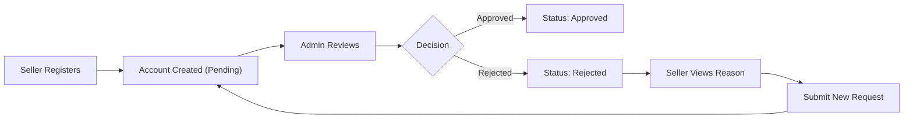
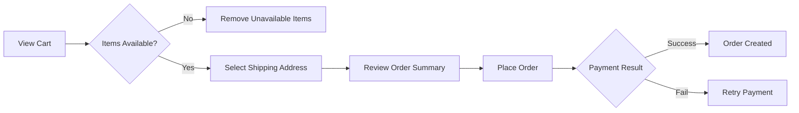
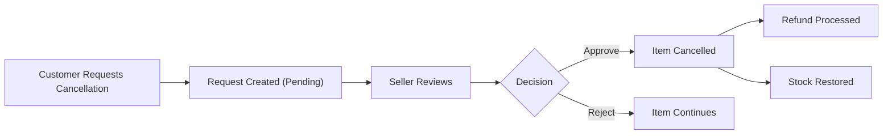

# E-Commerce Shopping Mall Platform Requirements Specification

## Document Overview

This document provides a comprehensive requirements specification for an e-commerce shopping mall platform. The platform enables customers to browse, purchase, and review products from multiple sellers, while providing sellers with tools to manage their products, inventory, and orders. Administrators oversee the platform, managing seller approvals, categories, and ensuring compliance.

### Purpose

The e-commerce platform serves as a marketplace connecting buyers and sellers with the following core objectives:

1. **Multi-Seller Marketplace**: Enable multiple independent sellers to offer products through a unified platform
2. **Complete Purchase Experience**: Provide customers with a seamless shopping experience from product discovery to delivery confirmation
3. **Trust and Accountability**: Maintain comprehensive records of all transactions and modifications through snapshot technology
4. **Dispute Resolution**: Support cancellation and refund processes with clear audit trails

### Business Model

#### Why This Service Exists

The e-commerce shopping mall platform addresses several market needs:

1. **For Customers**: A curated marketplace where verified sellers offer products with buyer protection, transparent reviews, and clear dispute resolution
2. **For Sellers**: An accessible platform to reach customers without building independent e-commerce infrastructure, with clear approval processes and shop management tools
3. **For the Platform**: Revenue through transaction fees (implied monetization model), while maintaining quality control through administrator oversight

#### Revenue Strategy

While not explicitly specified in requirements, the platform architecture supports:

- Transaction fees on completed orders (implied by multi-seller structure)
- Premium seller features (future expansion capability)
- Advertising and promoted listings (architectural support)

#### Success Metrics

- Customer acquisition and retention rates
- Seller satisfaction and success rates
- Order completion rates (from payment to delivery confirmation)
- Refund and cancellation rates (quality indicator)
- Average product ratings and review participation

---

## User Actors and Authentication

### User Actor Definitions

#### Customer

**Description**: A registered buyer who can browse products, manage cart and wishlist, place orders, write reviews, and manage their profile and addresses.

**Key Characteristics**:
- Requires registration to access any platform features (no guest browsing)
- Account deletion preserves orders and reviews for legal and seller record purposes
- Can manage multiple shipping addresses
- Can write reviews only for delivered items

**Permissions**:
- Browse and search products
- Manage wishlist and shopping cart
- Place orders and make payments
- Request cancellations and refunds
- Write, edit, and delete reviews
- Manage own profile and addresses

#### Seller

**Description**: A registered merchant who can create and manage products, handle inventory, process shipments, and respond to cancellation/refund requests.

**Key Characteristics**:
- Requires administrator approval before selling
- Account deletion only permitted when no pending orders or requests exist
- Shop name preserved in order history even after deletion

**Permissions**:
- Create and manage products (after approval)
- Manage product variants and inventory
- Process shipments with tracking information
- Respond to cancellation and refund requests
- View seller dashboard and analytics

#### Administrator

**Description**: A platform administrator with elevated permissions for oversight and management.

**Grades**:
1. **Regular Administrator**: Can approve/reject sellers, manage categories, oversee products and orders, ban users
2. **Super Administrator**: All regular administrator powers PLUS can manage administrator grades and promote/demote other administrators

**Permissions**:
- Approve or reject seller registrations
- Create and manage categories
- View all products and orders
- Force-cancel or force-refund orders
- Ban and unban customers and sellers
- Manage administrator requests (super admin only)

### Authentication Requirements

#### Customer Authentication

| Requirement ID | Description |
|----------------|-------------|
| AUTH-CUST-001 | WHEN a new customer registers, THE system SHALL create an account with email and password |
| AUTH-CUST-002 | WHEN a customer attempts to log in, THE system SHALL validate credentials and create a session |
| AUTH-CUST-003 | WHEN a customer requests a password change, THE system SHALL verify the old password and update to the new password |
| AUTH-CUST-004 | WHEN a customer deletes their account, THE system SHALL remove profile information while preserving orders and reviews |
| AUTH-CUST-005 | THE system SHALL require authentication before accessing any platform features |

#### Seller Authentication

| Requirement ID | Description |
|----------------|-------------|
| AUTH-SELL-001 | WHEN a new seller registers, THE system SHALL create an account with status "pending" |
| AUTH-SELL-002 | WHEN a seller attempts to log in, THE system SHALL validate credentials AND check approval status |
| AUTH-SELL-003 | WHEN a seller requests a password change, THE system SHALL verify the old password and update to the new password |
| AUTH-SELL-004 | WHEN an administrator approves a seller, THE system SHALL update seller status to "approved" |
| AUTH-SELL-005 | IF a seller registration is rejected, THE system SHALL allow the seller to submit a new registration request |
| AUTH-SELL-006 | WHEN a seller deletes their account, THE system SHALL verify no pending orders or requests exist |

#### Administrator Authentication

| Requirement ID | Description |
|----------------|-------------|
| AUTH-ADMIN-001 | WHEN a user requests to become an administrator, THE system SHALL create an admin request with reason |
| AUTH-ADMIN-002 | WHEN a super administrator approves an admin request, THE system SHALL grant administrator privileges |
| AUTH-ADMIN-003 | THE system SHALL distinguish between regular administrator and super administrator grades |
| AUTH-ADMIN-004 | WHILE a user is a super administrator, THE system SHALL allow promotion of regular administrators |
| AUTH-ADMIN-005 | IF a super administrator attempts to demote themselves, THE system SHALL reject the operation |

### Permission Matrix

| Action | Customer | Seller | Admin | Super Admin |
|--------|----------|--------|-------|-------------|
| Browse Products | ✅ | ✅ | ✅ | ✅ |
| Place Orders | ✅ | ✅ | ✅ | ✅ |
| Create Products | ❌ | ✅* | ❌ | ❌ |
| Process Shipments | ❌ | ✅ | ❌ | ❌ |
| Approve Sellers | ❌ | ❌ | ✅ | ✅ |
| Manage Categories | ❌ | ❌ | ✅ | ✅ |
| Force Cancel/Refund | ❌ | ❌ | ✅ | ✅ |
| Ban Users | ❌ | ❌ | ✅ | ✅ |
| Manage Admins | ❌ | ❌ | ❌ | ✅ |
| Promote to Super Admin | ❌ | ❌ | ❌ | ✅ |

*Requires administrator approval

---

## Snapshot Principle

### Overview

The snapshot principle is a foundational concept of this platform. As a financial transaction platform, all data modifications must be recorded to maintain audit trails, support dispute resolution, and preserve historical accuracy.

### Core Principles

| Principle | Description |
|-----------|-------------|
| SP-001 | WHEN any editable data is modified, THE system SHALL create a snapshot preserving the previous state |
| SP-002 | THE system SHALL record: when the change was made, what was changed, and values before and after |
| SP-003 | Snapshots SHALL be immutable and cannot be deleted |
| SP-004 | Snapshots SHALL be viewable by owners and administrators for dispute resolution |

### Snapshot Applicability

The following entities require snapshot creation on modification:

#### Products

```
Product Snapshot Structure:
├── All product fields (name, description, category, base price, images)
└── All variant snapshots at that moment
    └── Each variant: SKU code, option values, price
```

| Requirement ID | Description |
|----------------|-------------|
| SNAP-PROD-001 | WHEN a seller edits a product, THE system SHALL create a product snapshot including all fields |
| SNAP-PROD-002 | WHEN a product is edited, THE system SHALL include snapshots of all variants at that moment |
| SNAP-PROD-003 | WHEN a product variant is edited, THE system SHALL create a variant snapshot |
| SNAP-PROD-004 | THE system SHALL preserve snapshots even after product deletion |

#### Order Items

| Requirement ID | Description |
|----------------|-------------|
| SNAP-ORDER-001 | WHEN an order is placed, THE system SHALL create snapshots of purchased products and variants |
| SNAP-ORDER-002 | WHEN an order is placed, THE system SHALL create snapshots of seller profiles for each item |
| SNAP-ORDER-003 | Order item snapshots SHALL preserve: product name, description, variant options, and price at time of purchase |

#### Other Entities

| Entity | Snapshot Requirement |
|--------|---------------------|
| Seller Profile | Shop name, description, logo on every edit |
| Reviews | Rating and text content on edit |
| Cancellation Requests | Reason and status changes |
| Refund Requests | Reason and status changes |

---

## Customer Features

### Customer Account Management

#### Registration

| Requirement ID | Description |
|----------------|-------------|
| CUST-REG-001 | THE system SHALL require registration to access any platform features |
| CUST-REG-002 | WHEN a customer registers, THE system SHALL collect email and password |
| CUST-REG-003 | WHEN registration is complete, THE system SHALL create a customer account |

#### Password Management

| Requirement ID | Description |
|----------------|-------------|
| CUST-PWD-001 | WHEN a customer requests password change, THE system SHALL validate the old password |
| CUST-PWD-002 | IF the old password is valid, THE system SHALL update to the new password |

#### Account Deletion

| Requirement ID | Description |
|----------------|-------------|
| CUST-DEL-001 | WHEN a customer deletes their account, THE system SHALL remove their profile information |
| CUST-DEL-002 | WHEN a customer deletes their account, THE system SHALL preserve their orders and order history |
| CUST-DEL-003 | WHEN a customer deletes their account, THE system SHALL preserve their reviews with "deleted user" display |

### Customer Profile

| Requirement ID | Description |
|----------------|-------------|
| CUST-PROF-001 | THE system SHALL maintain a customer profile with display name and phone number |
| CUST-PROF-002 | WHEN a customer edits their profile, THE system SHALL update display name and/or phone number |

### Address Management

#### Address Structure

Each address contains:
- Recipient name
- Phone number
- Street address
- City
- State/Province
- Postal code
- Country

#### Address Requirements

| Requirement ID | Description |
|----------------|-------------|
| CUST-ADDR-001 | WHEN a customer adds an address, THE system SHALL store all address fields |
| CUST-ADDR-002 | WHEN a customer edits an address, THE system SHALL update the address information |
| CUST-ADDR-003 | WHEN a customer deletes an address, THE system SHALL remove the address from their list |
| CUST-ADDR-004 | THE system SHALL allow customers to set one address as default shipping address |
| CUST-ADDR-005 | WHEN a default address is set, THE system SHALL unset the previous default |

### Wishlist

| Requirement ID | Description |
|----------------|-------------|
| CUST-WISH-001 | WHEN a customer adds a product to wishlist, THE system SHALL store the wishlist entry |
| CUST-WISH-002 | THE system SHALL display wishlists with pagination |
| CUST-WISH-003 | WHEN a customer views their wishlist, THE system SHALL show products (not specific variants) |
| CUST-WISH-004 | WHEN a customer removes a product from wishlist, THE system SHALL delete the entry |
| CUST-WISH-005 | IF a product is deleted by a seller, THE system SHALL automatically remove it from all wishlists |

### Shopping Cart

#### Cart Operations

| Requirement ID | Description |
|----------------|-------------|
| CART-001 | WHEN a customer adds a variant to cart, THE system SHALL store the variant and quantity |
| CART-002 | IF the same variant is already in the cart, THE system SHALL combine the quantities |
| CART-003 | WHEN a customer views their cart, THE system SHALL show each item with product name, variant options, price, quantity, and subtotal |
| CART-004 | WHEN a customer changes item quantity, THE system SHALL update the cart item |
| CART-005 | WHEN a customer removes an item, THE system SHALL delete the item from cart |
| CART-006 | THE system SHALL display the total price of all cart items |

#### Stock Validation

| Requirement ID | Description |
|----------------|-------------|
| CART-007 | IF a variant's stock is less than the cart quantity, THE system SHALL display a warning |
| CART-008 | IF a variant is deleted or out of stock, THE system SHALL mark the item as unavailable in the cart |
| CART-009 | WHEN an out of stock variant is added to cart, THE system SHALL reject the addition |

---

## Seller Features

### Seller Registration and Approval

#### Registration Process



| Requirement ID | Description |
|----------------|-------------|
| SELL-REG-001 | WHEN a seller registers, THE system SHALL create an account with "pending" status |
| SELL-REG-002 | THE system SHALL allow sellers to view their approval status (pending, approved, rejected) |
| SELL-REG-003 | IF a seller is rejected, THE system SHALL display the rejection reason |
| SELL-REG-004 | IF a seller is rejected, THE system SHALL allow a new registration request submission |

### Seller Profile (Shop)

| Requirement ID | Description |
|----------------|-------------|
| SELL-PROF-001 | THE system SHALL maintain a seller profile with shop name, shop description, and logo image |
| SELL-PROF-002 | WHEN a seller edits their profile, THE system SHALL create a snapshot of the previous state |
| SELL-PROF-003 | WHEN a seller edits their profile, THE system SHALL update shop name, description, and/or logo |
| SELL-PROF-004 | THE system SHALL allow customers to view seller profiles |

### Seller Dashboard

| Requirement ID | Description |
|----------------|-------------|
| SELL-DASH-001 | THE system SHALL display a summary with: total products, total order items, pending cancellation requests, pending refund requests |
| SELL-DASH-002 | THE system SHALL allow sellers to view all order items for their products |
| SELL-DASH-003 | THE system SHALL allow sellers to filter order items by status |

### Seller Account Deletion

#### Deletion Conditions

| Requirement ID | Description |
|----------------|-------------|
| SELL-DEL-001 | WHEN a seller requests account deletion, THE system SHALL verify no pending orders exist (paid or shipped status) |
| SELL-DEL-002 | WHEN a seller requests account deletion, THE system SHALL verify no pending cancellation or refund requests exist |
| SELL-DEL-003 | IF conditions are not met, THE system SHALL reject the deletion request |
| SELL-DEL-004 | WHEN a seller deletes their account, THE system SHALL delete their products from listings |
| SELL-DEL-005 | WHEN a seller deletes their account, THE system SHALL preserve order history and snapshots |
| SELL-DEL-006 | WHEN a seller deletes their account, THE system SHALL preserve shop name in past orders |

---

## Category System

### Category Structure

| Requirement ID | Description |
|----------------|-------------|
| CAT-001 | THE system SHALL support categories with name and description |
| CAT-002 | THE system SHALL support one level of subcategories (nested categories) |
| CAT-003 | WHEN a category is deleted, THE system SHALL uncategorize products in that category |

### Category Management

| Requirement ID | Description |
|----------------|-------------|
| CAT-MGT-001 | WHEN an administrator creates a category, THE system SHALL store name and description |
| CAT-MGT-002 | WHEN an administrator edits a category, THE system SHALL update name and/or description |
| CAT-MGT-003 | WHEN an administrator deletes a category, THE system SHALL remove the category from products |
| CAT-MGT-004 | THE system SHALL restrict category management to administrators only |

### Category Browsing

| Requirement ID | Description |
|----------------|-------------|
| CAT-BROW-001 | THE system SHALL allow customers to browse the list of all categories |
| CAT-BROW-002 | WHEN a customer views a category, THE system SHALL display products within that category |

---

## Product Management

### Product Creation

#### Product Fields

| Field | Required | Description |
|-------|----------|-------------|
| Name | Yes | Product name |
| Description | Yes | Product description |
| Category | Yes | Product category (or subcategory) |
| Base Price | Yes | Default price |
| Images | No | Multiple images, first is thumbnail |

| Requirement ID | Description |
|----------------|-------------|
| PROD-CR-001 | WHEN a seller creates a product, THE system SHALL store all required fields |
| PROD-CR-002 | THE product SHALL belong to the seller who created it |
| PROD-CR-003 | THE system SHALL allow multiple images per product |
| PROD-CR-004 | THE first image SHALL be used as the main/thumbnail image |

### Product Editing

| Requirement ID | Description |
|----------------|-------------|
| PROD-ED-001 | WHEN a seller edits a product, THE system SHALL create a snapshot of the previous state |
| PROD-ED-002 | WHEN a product is edited, THE system SHALL update product fields |
| PROD-ED-003 | Sellers SHALL only edit their own products |
| PROD-ED-004 | THE system SHALL allow sellers to reorder images |
| PROD-ED-005 | THE system SHALL allow sellers to delete images from products |

### Product Variants (SKU)

#### Variant Structure

Each variant has:
- SKU code (unique identifier, required)
- Option values (e.g., color: "Red", size: "Large")
- Price (can override base price, optional)
- Stock quantity (required, starts at 0)

#### Variant Requirements

| Requirement ID | Description |
|----------------|-------------|
| VAR-001 | THE system SHALL allow multiple variants per product |
| VAR-002 | WHEN a seller creates a variant, THE system SHALL store SKU code, option values, price, and stock quantity |
| VAR-003 | WHEN a seller edits a variant, THE system SHALL create a variant snapshot |
| VAR-004 | THE system SHALL allow variant price to override base price |

#### Variant Deletion

| Requirement ID | Description |
|----------------|-------------|
| VAR-DEL-001 | WHEN a seller deletes a variant, THE system SHALL verify no pending order items exist (paid or shipped status) |
| VAR-DEL-002 | WHEN a seller deletes a variant, THE system SHALL verify no pending cancellation or refund requests exist |
| VAR-DEL-003 | IF a product has no variants, THE system SHALL display the product as "unavailable" |
| VAR-DEL-004 | IF a product has no variants, THE product SHALL remain visible in search |

### Inventory Management

#### Inventory Record Structure

Each inventory record contains:
- Quantity change (positive for restocking, negative for orders/adjustments)
- Reason
- Timestamp

| Requirement ID | Description |
|----------------|-------------|
| INV-001 | THE current stock SHALL be calculated by summing all inventory records |
| INV-002 | WHEN a seller adds inventory, THE system SHALL create a positive inventory record with quantity and reason |
| INV-003 | WHEN a seller subtracts inventory, THE system SHALL create a negative inventory record with quantity and reason |
| INV-004 | WHEN an order is placed, THE system SHALL automatically create a negative inventory record |
| INV-005 | WHEN an order is cancelled or refunded, THE system SHALL automatically create a positive inventory record |
| INV-006 | THE system SHALL allow sellers to view full inventory history of each variant |
| INV-007 | WHEN stock reaches 0, THE variant SHALL be shown as "out of stock" |
| INV-008 | WHEN a variant is out of stock, THE system SHALL prevent adding it to cart |

### Product Deletion

| Requirement ID | Description |
|----------------|-------------|
| PROD-DEL-001 | WHEN a seller deletes a product, THE system SHALL verify no pending order items exist for any variant |
| PROD-DEL-002 | WHEN a seller deletes a product, THE system SHALL verify no pending cancellation or refund requests exist for any variant |
| PROD-DEL-003 | WHEN a product is deleted, THE system SHALL delete all variants and inventory records |
| PROD-DEL-004 | WHEN a product is deleted, THE system SHALL remove it from search and category listings |
| PROD-DEL-005 | THE system SHALL preserve product snapshots after deletion |
| PROD-DEL-006 | THE system SHALL allow administrators to delete any product for policy violations |

---

## Product Search and Listing

### Search Functionality

| Requirement ID | Description |
|----------------|-------------|
| SEARCH-001 | THE system SHALL allow customers to search products by name |
| SEARCH-002 | Search results SHALL show products from all sellers |
| SEARCH-003 | Search results SHALL be paginated |

### Search Filters

| Requirement ID | Description |
|----------------|-------------|
| FILTER-001 | THE system SHALL allow filtering by category |
| FILTER-002 | THE system SHALL allow filtering by price range (minimum and maximum) |
| FILTER-003 | THE system SHALL allow filtering to show in-stock products only |

### Search Result Sorting

| Requirement ID | Description |
|----------------|-------------|
| SORT-001 | THE system SHALL allow sorting by newest first |
| SORT-002 | THE system SHALL allow sorting by price (low to high) |
| SORT-003 | THE system SHALL allow sorting by price (high to low) |

### Product Listing Display

When viewing a list of products (search results, category page), each product shows:

- Main image (thumbnail)
- Name
- Base price (or price range if variants have different prices)
- Seller shop name
- Average rating (if reviews exist)

### Product Detail Page

When viewing a single product's full details:

| Requirement ID | Description |
|----------------|-------------|
| DETAIL-001 | THE system SHALL display all product images |
| DETAIL-002 | THE system SHALL display name and description |
| DETAIL-003 | THE system SHALL display category |
| DETAIL-004 | THE system SHALL display seller shop name with link to profile |
| DETAIL-005 | THE system SHALL display all available variants with prices and stock status |
| DETAIL-006 | THE system SHALL display average rating and total review count |
| DETAIL-007 | THE system SHALL display all reviews sorted by newest first |

---

## Order Management

### Checkout Process



| Requirement ID | Description |
|----------------|-------------|
| CHECK-001 | WHEN a customer proceeds to checkout, THE system SHALL verify all items are available |
| CHECK-002 | THE system SHALL prevent checkout of unavailable items |
| CHECK-003 | WHEN a customer selects a shipping address, THE system SHALL use the default or selected address |
| CHECK-004 | WHEN reviewing order, THE system SHALL display item list with prices, shipping address, and total price |
| CHECK-005 | WHEN an order is placed, THE shipping address SHALL NOT be changeable |

### Payment Processing

| Requirement ID | Description |
|----------------|-------------|
| PAY-001 | WHEN a customer confirms the order, THE system SHALL process payment via external payment gateway |
| PAY-002 | IF payment fails, THE system SHALL NOT create the order and allow retry |
| PAY-003 | IF payment succeeds, THE system SHALL create the order |

### Order Creation

| Requirement ID | Description |
|----------------|-------------|
| ORDER-CR-001 | WHEN payment succeeds, THE system SHALL decrease stock quantities for each variant |
| ORDER-CR-002 | WHEN payment succeeds, THE system SHALL remove items from cart |
| ORDER-CR-003 | WHEN payment succeeds, THE system SHALL create an order record |
| ORDER-CR-004 | WHEN payment succeeds, THE system SHALL create order items with status "paid" |
| ORDER-CR-005 | WHEN payment succeeds, THE system SHALL save product and variant snapshots with each order item |
| ORDER-CR-006 | WHEN payment succeeds, THE system SHALL save seller profile snapshots with each order item |

### Order Structure

#### Order Composition

- An order contains one or more order items
- Each order item represents a purchased product variant with quantity
- If a customer buys 3 of the same variant, it becomes one order item with quantity 3
- Order items can be from different sellers
- Each order item has its own status

| Requirement ID | Description |
|----------------|-------------|
| ORDER-STR-001 | Each order item SHALL have its own status |
| ORDER-STR-002 | Each order item SHALL be individually cancellable or refundable |
| ORDER-STR-003 | Order items SHALL be grouped into shipments when shipped |

### Order Status

#### Item Statuses

| Status | Description |
|--------|-------------|
| Paid | Payment completed, waiting for seller to ship |
| Shipped | Seller has shipped the item |
| Delivered | Item has been delivered |
| Cancelled | Item was cancelled |
| Refunded | Item was refunded |

#### Order Status Derivation

| Requirement ID | Description |
|----------------|-------------|
| ORDER-STATUS-001 | IF all items are paid, THE order status SHALL be "paid" |
| ORDER-STATUS-002 | IF any item is shipped and none delivered, THE order status SHALL be "shipped" |
| ORDER-STATUS-003 | IF all items are delivered, THE order status SHALL be "delivered" |
| ORDER-STATUS-004 | IF all items are cancelled, THE order status SHALL be "cancelled" |
| ORDER-STATUS-005 | IF all items are refunded, THE order status SHALL be "refunded" |
| ORDER-STATUS-006 | IF items have mixed states, THE order status SHALL be "partially completed" |

### Order History

| Requirement ID | Description |
|----------------|-------------|
| ORDER-HIST-001 | THE system SHALL allow customers to view all their orders |
| ORDER-HIST-002 | Order list SHALL be paginated and sorted by newest first |
| ORDER-HIST-003 | Each order in list SHALL show: order number, date, total price, overall order status |
| ORDER-HIST-004 | WHEN viewing order details, THE system SHALL show items, shipping address, and shipments |

---

## Shipping and Tracking

### Shipment Concept

- A shipment is a package sent by a seller
- A shipment can contain one or more order items from the same seller
- Different sellers always ship separately (different shipments)
- A seller can bundle multiple items into one shipment or ship individually

### Shipping Process

| Requirement ID | Description |
|----------------|-------------|
| SHIP-001 | THE system SHALL allow sellers to view order items needing shipping |
| SHIP-002 | WHEN shipping, THE system SHALL allow sellers to select one or more items for the shipment |
| SHIP-003 | WHEN creating a shipment, THE seller SHALL enter carrier name and tracking number |
| SHIP-004 | WHEN a shipment is created, THE system SHALL change all items in it to status "shipped" |
| SHIP-005 | All items in the same shipment SHALL share tracking information |

### Delivery Confirmation

| Requirement ID | Description |
|----------------|-------------|
| DELIV-001 | THE system SHALL allow customers to view tracking information for each shipment |
| DELIV-002 | THE system SHALL allow customers to confirm delivery per shipment |
| DELIV-003 | WHEN customer confirms delivery, THE system SHALL change all items in that shipment to "delivered" |
| DELIV-004 | IF customer does not confirm within 14 days from shipping, THE system SHALL automatically change items to "delivered" |

---

## Cancellation and Refund

### Order Item Cancellation



| Requirement ID | Description |
|----------------|-------------|
| CANCEL-001 | THE system SHALL allow customers to request cancellation for items with status "paid" |
| CANCEL-002 | WHEN a customer requests cancellation, THE system SHALL require a reason |
| CANCEL-003 | THE seller of that item SHALL be able to approve or reject the request |
| CANCEL-004 | WHEN seller responds, THE system SHALL create a snapshot of the request state |
| CANCEL-005 | IF approved, THE item SHALL be cancelled and refund processed for that item |
| CANCEL-006 | IF approved, THE stock quantity SHALL be restored via inventory record |
| CANCEL-007 | IF all items in an order are cancelled, THE order status SHALL be "cancelled" |

### Refund Requests

| Requirement ID | Description |
|----------------|-------------|
| REFUND-001 | THE system SHALL allow customers to request refund for items with status "delivered" |
| REFUND-002 | WHEN a customer requests refund, THE system SHALL require a reason |
| REFUND-003 | Refund SHALL only be requestable within 7 days of delivery |
| REFUND-004 | THE seller of that item SHALL be able to approve or reject the request |
| REFUND-005 | WHEN seller responds, THE system SHALL create a snapshot of the request state |
| REFUND-006 | IF approved, THE item SHALL be refunded |
| REFUND-007 | IF approved, THE stock quantity SHALL be restored via inventory record |
| REFUND-008 | IF all items in an order are refunded, THE order status SHALL be "refunded" |

---

## Reviews and Ratings

### Review Creation Rules

| Requirement ID | Description |
|----------------|-------------|
| REVIEW-001 | THE system SHALL allow customers to write reviews for purchased products |
| REVIEW-002 | A review SHALL only be writable after the item status is "delivered" |
| REVIEW-003 | THE system SHALL allow one review per product per order |

### Review Content

| Requirement ID | Description |
|----------------|-------------|
| REVIEW-004 | Each review SHALL have a rating (1 to 5 stars, required) |
| REVIEW-005 | Each review MAY have text content (optional) |
| REVIEW-006 | Reviews SHALL be displayed on the product detail page |
| REVIEW-007 | Reviews SHALL be sorted by newest first |

### Review Management

| Requirement ID | Description |
|----------------|-------------|
| REVIEW-008 | THE system SHALL allow customers to edit their own reviews |
| REVIEW-009 | WHEN a review is edited, THE system SHALL create a snapshot |
| REVIEW-010 | THE system SHALL allow customers to delete their own reviews |
| REVIEW-011 | WHEN a review is deleted, THE snapshots SHALL be preserved |
| REVIEW-012 | THE product's average rating SHALL be calculated from all non-deleted reviews |

---

## Administrator System

### Administrator Grade Hierarchy

```
Super Administrator
├── Can do everything a Regular Administrator can do
├── Can promote Regular Administrators to Super Administrator
├── Can demote Super Administrators to Regular Administrator
└── CANNOT demote themselves

Regular Administrator
├── Approve/reject seller registrations
├── Create and manage categories
├── View all products and orders
├── Force-cancel/refund orders
└── Ban/unban customers and sellers
```

### Becoming an Administrator

| Requirement ID | Description |
|----------------|-------------|
| ADMIN-BEC-001 | THE system SHALL allow any user (customer or seller) to request administrator status |
| ADMIN-BEC-002 | WHEN requesting, THE user SHALL provide a reason |
| ADMIN-BEC-003 | Super administrators SHALL view pending requests |
| ADMIN-BEC-004 | Super administrators SHALL approve or reject requests |
| ADMIN-BEC-005 | WHEN approved, THE user SHALL become a regular administrator |

### Seller Management

| Requirement ID | Description |
|----------------|-------------|
| ADMIN-SELL-001 | Administrators SHALL view pending seller approvals |
| ADMIN-SELL-002 | Administrators SHALL approve or reject seller registrations |
| ADMIN-SELL-003 | WHEN rejecting, THE administrator SHALL provide a reason |
| ADMIN-SELL-004 | Administrators SHALL suspend seller accounts |
| ADMIN-SELL-005 | WHEN suspended, THE seller's products SHALL be hidden from search and listings |
| ADMIN-SELL-006 | WHEN suspended, THE seller's products SHALL not be purchasable |
| ADMIN-SELL-007 | WHEN suspended, THE seller SHALL still process existing orders |
| ADMIN-SELL-008 | WHEN suspended, THE seller SHALL NOT create or edit products |
| ADMIN-SELL-009 | Administrators SHALL unsuspend seller accounts |

### Category Management

| Requirement ID | Description |
|----------------|-------------|
| ADMIN-CAT-001 | Administrators SHALL create categories and subcategories |
| ADMIN-CAT-002 | Administrators SHALL edit category names and descriptions |
| ADMIN-CAT-003 | Administrators SHALL delete categories (products become uncategorized) |

### Product Oversight

| Requirement ID | Description |
|----------------|-------------|
| ADMIN-PROD-001 | Administrators SHALL view all products on the platform |
| ADMIN-PROD-002 | Administrators SHALL view snapshots of any product |
| ADMIN-PROD-003 | Administrators SHALL delete any product for policy violations |

### Order Oversight

| Requirement ID | Description |
|----------------|-------------|
| ADMIN-ORD-001 | Administrators SHALL view all orders on the platform |
| ADMIN-ORD-002 | Administrators SHALL force-cancel individual items or entire orders |
| ADMIN-ORD-003 | WHEN force-cancelling, THE system SHALL refund the customer and restore stock |
| ADMIN-ORD-004 | Administrators SHALL force-refund individual items or entire orders |

### User Management

| Requirement ID | Description |
|----------------|-------------|
| ADMIN-USER-001 | Administrators SHALL view all customer accounts |
| ADMIN-USER-002 | Administrators SHALL ban customers (banned customers cannot log in) |
| ADMIN-USER-003 | Administrators SHALL unban customers |
| ADMIN-USER-004 | Administrators SHALL view all seller accounts |
| ADMIN-USER-005 | Administrators SHALL ban sellers (banned sellers cannot log in, existing orders remain) |

---

## Data Preservation

### Customer Account Deletion Rules

| Data Type | Action on Deletion |
|-----------|-------------------|
| Profile information | DELETED |
| Orders and order history | PRESERVED |
| Reviews | PRESERVED (shown as "deleted user") |

### Seller Account Deletion Rules

| Data Type | Action on Deletion |
|-----------|-------------------|
| Products | DELETED from listings |
| Product variants and inventory | DELETED |
| Order history and snapshots | PRESERVED |
| Shop name in past orders | PRESERVED |

### Legal and Business Justifications

| Requirement ID | Description |
|----------------|-------------|
| PRESERVE-001 | Customer orders SHALL be preserved for seller records and legal purposes |
| PRESERVE-002 | Customer reviews SHALL be preserved but anonymized as "deleted user" |
| PRESERVE-003 | Seller order history SHALL be preserved for financial records |
| PRESERVE-004 | Seller shop name SHALL be preserved in past orders for customer reference |

---

## Business Rules Summary

### Registration Rules

- No guest browsing; registration required for all features
- Seller accounts require administrator approval
- Administrator accounts require super administrator approval

### Product Rules

- Products require at least one variant to be purchasable
- Products with no variants show as "unavailable" in search
- Products can only be deleted if no pending orders or requests

### Inventory Rules

- Stock is calculated from inventory history (not stored directly)
- Out of stock variants cannot be added to cart
- Stock is automatically restored on cancellation/refund

### Order Rules

- Shipping address cannot be changed after order placement
- Order item status is independent per item
- Order status is derived from item statuses

### Cancellation and Refund Rules

- Cancellation: Only for "paid" items (not shipped yet)
- Refund: Only for "delivered" items, within 7 days
- Both are item-level operations, not order-level

### Deletion Rules

- Customers: Can delete anytime; orders/reviews preserved
- Sellers: Can delete only if no pending orders/requests
- Products: Can delete only if no pending orders/requests

---

## Non-Functional Requirements

### Performance Requirements

| Requirement ID | Description |
|----------------|-------------|
| PERF-001 | WHEN a customer searches for products, THE system SHALL return results within 2 seconds for typical queries |
| PERF-002 | WHEN a customer views a product detail page, THE system SHALL load the page within 1 second |
| PERF-003 | WHEN a customer places an order, THE system SHALL complete the transaction within 3 seconds |
| PERF-004 | THE system SHALL support concurrent users during peak shopping periods |

### Security Requirements

| Requirement ID | Description |
|----------------|-------------|
| SEC-001 | THE system SHALL use secure password hashing for all user accounts |
| SEC-002 | THE system SHALL use secure session management |
| SEC-003 | THE system SHALL validate all user inputs to prevent injection attacks |
| SEC-004 | THE system SHALL enforce role-based access control |
| SEC-005 | THE system SHALL log all sensitive operations for audit purposes |

### Data Privacy

| Requirement ID | Description |
|----------------|-------------|
| PRIV-001 | THE system SHALL handle personal data in compliance with applicable data protection regulations |
| PRIV-002 | THE system SHALL allow users to delete their accounts with appropriate data preservation |
| PRIV-003 | THE system SHALL maintain audit trails through snapshots for dispute resolution |

### Availability

| Requirement ID | Description |
|----------------|-------------|
| AVAIL-001 | THE system SHALL be available 99.5% of the time during business hours |
| AVAIL-002 | THE system SHALL handle scheduled maintenance with minimal downtime |

---

## Conclusion

This requirements specification defines a comprehensive e-commerce shopping mall platform with the following key characteristics:

1. **Multi-Actor System**: Customers, sellers, and administrators with distinct roles and permissions
2. **Snapshot-Based Audit Trail**: Complete history of all modifications for financial accountability
3. **Item-Level Order Management**: Fine-grained control over cancellations and refunds
4. **Inventory Transparency**: Real-time stock tracking through inventory history
5. **Data Preservation**: Legal compliance through preserved order history and anonymized user data

The platform prioritizes trust, transparency, and accountability through comprehensive tracking and clear business rules for all transactions.