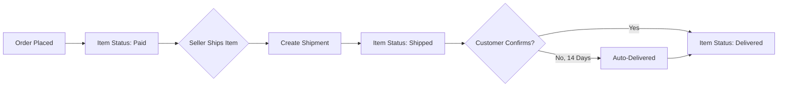

# Order Management Requirements

## 1. Introduction

This document specifies the comprehensive requirements for the order management system in the e-commerce shopping mall platform. It covers the complete order lifecycle from checkout through payment processing, order creation, status management, shipping, delivery confirmation, and order history.

The order management system is designed around an **item-level architecture** where each order item has its own independent status and lifecycle. This enables granular control over cancellations, refunds, and shipping for multi-seller orders.

## 2. Checkout Process

### 2.1 Checkout Initiation

WHEN a customer proceeds to checkout from their cart, THE system SHALL validate all cart items for availability before allowing checkout to continue.

THE system SHALL display a checkout initiation error IF any of the following conditions exist:
- One or more variants in the cart are deleted
- One or more variants in the cart are out of stock (stock quantity is 0)
- One or more variants have insufficient stock (stock quantity less than cart quantity)

### 2.2 Unavailable Item Handling

IF a variant becomes unavailable (deleted or out of stock) during checkout, THE system SHALL mark the item as unavailable and prevent it from being checked out.

THE system SHALL allow the customer to either:
- Remove the unavailable item from cart and continue checkout with remaining items
- Return to cart to adjust quantities or remove items

### 2.3 Shipping Address Selection

WHEN a customer initiates checkout, THE system SHALL require selection of a shipping address.

THE system SHALL display all saved addresses for the customer to choose from.

THE system SHALL highlight the default shipping address if one exists.

THE system SHALL allow the customer to select any saved address or create a new address during checkout.

### 2.4 Order Summary Review

THE system SHALL display an order summary page before order placement containing:
- List of all items with product name, variant options, unit price, quantity, and subtotal
- Selected shipping address with recipient name, phone, street, city, state/province, postal code, and country
- Total price calculation
- Estimated delivery information (if available)

THE system SHALL allow the customer to return to cart from the order summary page to make changes.

### 2.5 Checkout Validation Rules

WHEN a customer attempts to place an order, THE system SHALL validate:
- All items in the cart are available (not deleted, not out of stock)
- Stock quantity is sufficient for all items
- A shipping address has been selected
- Customer account is in good standing (not banned)

THE system SHALL prevent order placement IF any validation fails and SHALL display specific error messages indicating the validation failure reason.

### 2.6 Address Immutability

WHEN an order is successfully placed, THE system SHALL make the shipping address immutable and SHALL not allow any changes to the shipping address.

THE system SHALL preserve a snapshot of the shipping address at the time of order placement for record-keeping purposes.

## 3. Payment Processing

### 3.1 Payment Gateway Integration

THE system SHALL integrate with an external payment gateway for payment processing.

THE system SHALL transmit the following information to the payment gateway:
- Total order amount
- Currency
- Customer payment credentials
- Order reference identifier

### 3.2 Payment Success Handling

WHEN payment is successfully processed, THE system SHALL:
- Create the order record
- Create order item records
- Decrease stock quantities for all purchased variants
- Remove purchased items from the customer's cart
- Generate order confirmation
- Send order confirmation notification to the customer

### 3.3 Payment Failure Handling

IF payment processing fails, THE system SHALL:
- NOT create any order record
- NOT modify any stock quantities
- NOT remove any items from cart
- Display the payment failure reason to the customer
- Allow the customer to retry payment with different payment method
- Allow the customer to return to cart

### 3.4 Payment Retry Mechanism

WHEN a customer retries payment after a failure, THE system SHALL:
- Preserve the cart contents
- Preserve the selected shipping address
- Allow the customer to proceed directly to payment without re-entering information
- Validate stock availability again before processing payment

THE system SHALL notify the customer IF any items in the cart have become unavailable during the payment retry process.

### 3.5 Order Creation Timing

THE system SHALL create order records ONLY AFTER successful payment confirmation.

THE system SHALL NOT create pending or draft orders before payment completion.

## 4. Order Creation and Snapshot

### 4.1 Order Creation Process

WHEN an order is successfully created after payment, THE system SHALL perform the following operations atomically:

1. Create an order record with unique order number
2. Create order item records for each purchased variant
3. Create inventory records to decrease stock for each variant
4. Remove purchased items from customer's cart
5. Create snapshots for each order item

THE system SHALL ensure all operations succeed or fail together to maintain data consistency.

### 4.2 Order Item Snapshot Requirements

WHEN an order item is created, THE system SHALL create and preserve the following snapshots:

**Product Snapshot:**
- Product name at time of purchase
- Product description at time of purchase
- Product category at time of purchase
- Product base price at time of purchase
- Product images at time of purchase

**Variant Snapshot:**
- SKU code at time of purchase
- Option values (e.g., color, size) at time of purchase
- Variant price at time of purchase

**Seller Profile Snapshot:**
- Seller shop name at time of purchase
- Seller shop description at time of purchase
- Seller logo image at time of purchase

### 4.3 Snapshot Purpose and Usage

THE system SHALL preserve snapshots to ensure:
- Historical accuracy of orders even if products are edited or deleted
- Historical accuracy of orders even if seller profiles are changed
- Ability to display accurate order history to customers
- Dispute resolution with verifiable purchase records
- Legal compliance for transaction records

THE system SHALL display snapshot data (not current product/seller data) when showing historical order details.

### 4.4 Stock Reduction on Order Creation

WHEN an order is created, THE system SHALL create negative inventory records for each purchased variant.

Each inventory record SHALL contain:
- Variant reference
- Quantity change (negative value equal to purchased quantity)
- Reason: "Order placed - Order #[order number]"
- Timestamp of creation

THE system SHALL calculate current stock by summing all inventory records for each variant.

### 4.5 Cart Cleanup on Order Creation

WHEN an order is successfully created, THE system SHALL remove all purchased items from the customer's cart.

THE system SHALL NOT remove items that were not included in the order.

THE system SHALL preserve the cart if only some items were purchased (partial checkout).

## 5. Order Structure and Items

### 5.1 Order Entity Structure

THE system SHALL create a single order entity for each successful checkout transaction.

Each order SHALL contain:
- Unique order number (auto-generated)
- Customer reference
- Shipping address (snapshot)
- Order creation timestamp
- Total amount
- Overall order status (derived from items)

### 5.2 Order Item Entity Structure

THE system SHALL create separate order item records for each distinct variant purchased.

**Item Grouping Rule:**

IF a customer purchases multiple quantities of the same variant, THE system SHALL create ONE order item with quantity greater than 1.

IF a customer purchases different variants (even of the same product), THE system SHALL create separate order items for each variant.

Each order item SHALL contain:
- Order reference
- Product snapshot
- Variant snapshot
- Seller profile snapshot
- Seller reference
- Quantity
- Unit price
- Subtotal
- Individual item status

### 5.3 Multi-Seller Orders

THE system SHALL allow a single order to contain items from multiple sellers.

THE system SHALL track the seller for each order item individually.

THE system SHALL enable each seller to manage (ship, respond to cancellation/refund) only their own items within a multi-seller order.

THE system SHALL derive overall order status from all items regardless of seller.

### 5.4 Quantity Handling

THE system SHALL treat an order item with quantity 3 as a single order item that:
- Has one status for the entire line item
- Can be cancelled as a whole (all 3 units)
- Can be refunded as a whole (all 3 units)
- Can be shipped together in one shipment

THE system SHALL NOT allow partial cancellation or partial refund of units within a single order item.

### 5.5 Item-Level vs Order-Level Operations

THE system SHALL perform the following operations at the **item level**:
- Status changes (shipped, delivered, cancelled, refunded)
- Cancellation requests
- Refund requests
- Shipping and tracking

THE system SHALL derive the following at the **order level**:
- Overall order status
- Order history display
- Total price

## 6. Order Status Management

### 6.1 Order Item Status Values

THE system SHALL maintain the following status values for each order item:

| Status | Description |
|--------|-------------|
| **Paid** | Payment completed, waiting for seller to ship |
| **Shipped** | Seller has shipped the item |
| **Delivered** | Item has been delivered to customer |
| **Cancelled** | Item was cancelled (before shipping) |
| **Refunded** | Item was refunded (after delivery) |

### 6.2 Item Status Transitions

THE system SHALL enforce the following status transition rules:

```
Paid → Shipped (when seller creates shipment)
Paid → Cancelled (when cancellation is approved)
Shipped → Delivered (when customer confirms or auto-completes)
Delivered → Refunded (when refund is approved)
```

THE system SHALL NOT allow any other status transitions.

THE system SHALL NOT allow status to change from Cancelled or Refunded to any other status.

### 6.3 Order-Level Status Derivation

THE system SHALL derive the overall order status from its items using the following rules:

| Condition | Order Status |
|-----------|--------------|
| All items are Paid | **Paid** |
| Any item is Shipped (and none Delivered) | **Shipped** |
| All items are Delivered | **Delivered** |
| All items are Cancelled | **Cancelled** |
| All items are Refunded | **Refunded** |
| Mixed states (e.g., some Delivered, some Refunded) | **Partially Completed** |

### 6.4 Mixed Status Handling

THE system SHALL handle mixed status orders according to these principles:

WHEN an order contains items with different statuses, THE system SHALL display the order status as "Partially Completed".

THE system SHALL allow ongoing operations for remaining active items even when some items are cancelled or refunded.

THE system SHALL calculate total refund amounts based only on actually refunded items.

THE system SHALL display individual item statuses clearly in order details to avoid confusion.

### 6.5 Status Display Requirements

THE system SHALL display order status to customers using clear, user-friendly labels.

THE system SHALL display item-level status when viewing order details.

THE system SHALL indicate which items are pending seller action (e.g., waiting for shipment, waiting for cancellation response).

## 7. Order History and Details

### 7.1 Order List View

WHEN a customer views their order history, THE system SHALL display a paginated list of all orders.

THE system SHALL sort orders by creation date, newest first.

THE system SHALL display the following information for each order in the list:
- Order number
- Order date
- Total price
- Overall order status
- Number of items (count)

THE system SHALL provide pagination with a default of 10-20 orders per page.

### 7.2 Order Detail View

WHEN a customer views an order's full details, THE system SHALL display:

**Order Information:**
- Order number
- Order date and time
- Overall order status
- Total amount

**Shipping Address:**
- Recipient name
- Phone number
- Street address
- City
- State/Province
- Postal code
- Country

**Order Items:**
For each item, display:
- Product name (from snapshot)
- Variant options (from snapshot)
- Seller shop name (from snapshot)
- Quantity
- Unit price
- Subtotal
- Item status

**Shipments:**
For each shipment, display:
- Shipment identifier
- List of items in shipment
- Carrier name
- Tracking number
- Shipment status

### 7.3 Snapshot Data Display

THE system SHALL always display snapshot data (not current product data) when showing order details.

WHEN displaying order items, THE system SHALL show:
- Product name as it was at time of purchase
- Variant options as they were at time of purchase
- Seller shop name as it was at time of purchase
- Prices as they were at time of purchase

THE system SHALL NOT update order item display if products or seller profiles are later edited or deleted.

### 7.4 Seller Order View

WHEN a seller views orders containing their products, THE system SHALL display:
- Only items that belong to that seller
- Customer shipping address (for items that need shipping)
- Item status for seller's items only
- Payment information (amount received)

THE system SHALL allow sellers to filter their order items by status.

## 8. Shipping and Tracking Integration

### 8.1 Shipment Concept

THE system SHALL organize shipped items into shipments.

**Shipment Definition:**
- A shipment is a package sent by a seller
- A shipment contains one or more order items from the same seller
- Different sellers always ship separately (different shipments)
- A seller can bundle multiple items into one shipment or ship items individually

### 8.2 Shipment Creation

WHEN a seller ships items, THE system SHALL:
- Allow selection of one or more order items to include in the shipment
- Require carrier name input
- Require tracking number input
- Create a shipment record linking selected items
- Change status of all items in the shipment to "Shipped"
- Record shipment creation timestamp

### 8.3 Tracking Information

THE system SHALL store the following tracking information for each shipment:
- Carrier name
- Tracking number
- Shipment creation timestamp

THE system SHALL display tracking information to customers for each shipment.

THE system SHALL allow customers to click tracking numbers to view external tracking (if carrier provides online tracking).

### 8.4 Delivery Confirmation by Customer

WHEN a customer confirms delivery of a shipment, THE system SHALL:
- Change status of all items in that shipment to "Delivered"
- Record delivery confirmation timestamp
- Record that delivery was customer-confirmed

THE system SHALL allow delivery confirmation per shipment (not per individual item).

### 8.5 Automatic Delivery Completion

IF a customer does not confirm delivery within 14 days of shipment, THE system SHALL automatically change status of all items in that shipment to "Delivered".

THE system SHALL record delivery timestamp as 14 days after shipment date.

THE system SHALL mark the delivery as "auto-confirmed" (not customer-confirmed).



## 9. Cancellation and Refund Integration

### 9.1 Cancellation Overview

THE system SHALL support item-level cancellation for items with status "Paid" (not yet shipped).

Cancellation is handled through a request-response workflow between customers and sellers.

Detailed requirements are specified in the [Cancellation and Refund Requirements Document](./10-cancellation-refund.md).

### 9.2 Refund Overview

THE system SHALL support item-level refund for items with status "Delivered".

Refund can be requested within 7 days of item delivery.

Refund is handled through a request-response workflow between customers and sellers.

Detailed requirements are specified in the [Cancellation and Refund Requirements Document](./10-cancellation-refund.md).

### 9.3 Stock Restoration

WHEN an item is cancelled or refunded, THE system SHALL:
- Create a positive inventory record for that variant
- Restore stock quantity accordingly
- Record reason as "Order cancellation" or "Order refund"

## 10. Business Rules and Constraints

### 10.1 Order Deletion Restrictions

THE system SHALL NOT allow deletion of orders.

THE system SHALL preserve all order records for:
- Legal compliance
- Tax and accounting requirements
- Dispute resolution
- Seller record-keeping

### 10.2 Address Immutability

WHEN an order is placed, THE shipping address SHALL become immutable.

THE system SHALL NOT allow customers or administrators to modify the shipping address after order placement.

THE system SHALL store a snapshot of the shipping address with the order.

### 10.3 Stock Availability Guarantee

THE system SHALL guarantee stock availability at the time of payment processing.

THE system SHALL validate stock again immediately before payment processing.

IF stock becomes insufficient between cart addition and checkout, THE system SHALL notify the customer and prevent checkout.

### 10.4 Price Guarantee

THE system SHALL guarantee prices at the time of payment.

THE system SHALL NOT update order item prices if product prices change after order placement.

THE system SHALL use snapshot prices for all order calculations.

### 10.5 Order Number Generation

THE system SHALL generate unique order numbers for each order.

Order numbers SHALL be:
- Unique across the entire platform
- Sequential or pseudo-sequential for easy reference
- Not easily guessable for security
- Formatted consistently (e.g., ORD-2024-000001)

## 11. Error Handling Scenarios

### 11.1 Payment Failure Scenarios

**Insufficient Funds:**
IF payment fails due to insufficient funds, THE system SHALL display "Payment failed: Insufficient funds. Please try a different payment method."

**Card Declined:**
IF payment is declined by the card issuer, THE system SHALL display "Payment declined by card issuer. Please contact your bank or try a different card."

**Network Error:**
IF payment fails due to network or system error, THE system SHALL display "Payment processing failed. Please try again. Your cart has been preserved."

**Gateway Timeout:**
IF payment gateway times out, THE system SHALL NOT assume success or failure, and SHALL prompt customer to check payment status before retrying.

### 11.2 Stock Unavailability Scenarios

**Item Sold Out During Checkout:**
IF an item becomes sold out while customer is at checkout, THE system SHALL display "Unfortunately, [Product Name] - [Variant] has sold out. Please remove it from your cart to continue."

**Partial Stock Available:**
IF stock quantity decreases below cart quantity during checkout, THE system SHALL display "Only [X] units of [Product Name] - [Variant] are available. Please reduce quantity to [X] or remove from cart."

### 11.3 Address Validation Errors

**Invalid Address Format:**
IF shipping address has invalid format, THE system SHALL display specific validation errors for each field.

**Missing Required Fields:**
IF required address fields are missing, THE system SHALL prevent checkout and highlight missing fields.

### 11.4 Concurrent Order Conflicts

**Race Condition Handling:**
IF two customers attempt to purchase the same variant simultaneously with insufficient total stock, THE system SHALL process only one order successfully.

THE system SHALL notify the second customer that the item is no longer available.

THE system SHALL NOT oversell inventory.

### 11.5 Data Consistency Errors

**Order Creation Failure:**
IF order creation fails after successful payment, THE system SHALL:
- Log the error for investigation
- Automatically refund the customer
- Notify the customer of the failure
- Preserve cart contents for retry

## 12. Performance Requirements

### 12.1 Order Creation Performance

WHEN payment is successful, THE system SHALL create the complete order record within 3 seconds.

THE system SHALL provide immediate feedback to the customer upon successful order creation.

### 12.2 Order History Performance

THE system SHALL load the order history page within 2 seconds.

THE system SHALL load order detail pages within 2 seconds.

### 12.3 Checkout Flow Performance

THE system SHALL validate cart availability within 1 second.

THE system SHALL load the checkout page within 2 seconds.

## 13. Integration Points

### 13.1 Shopping Cart Integration

THE system SHALL integrate with the shopping cart module for:
- Retrieving cart items for checkout
- Validating cart item availability
- Removing purchased items after order creation

Refer to [Customer Features Document](./03-customer-features.md) for cart requirements.

### 13.2 Product Management Integration

THE system SHALL integrate with the product management module for:
- Retrieving product information for snapshots
- Retrieving variant information for snapshots
- Creating inventory records for stock changes

Refer to [Product Management Document](./06-product-management.md) for product snapshot requirements.

### 13.3 Shipping and Tracking Integration

Refer to [Shipping and Tracking Document](./09-shipping-tracking.md) for detailed shipping requirements.

### 13.4 Cancellation and Refund Integration

Refer to [Cancellation and Refund Document](./10-cancellation-refund.md) for detailed cancellation and refund requirements.