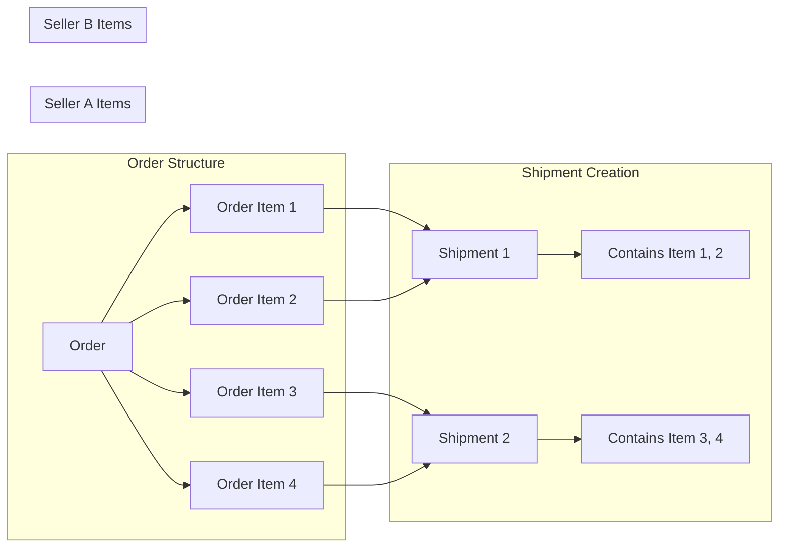
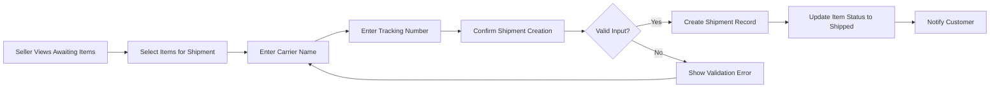
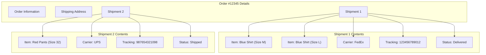
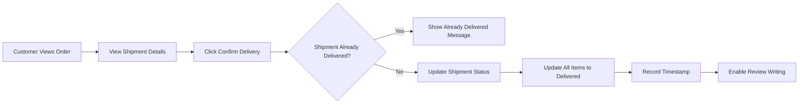
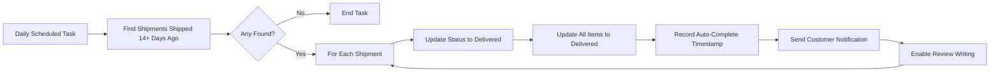

# Shipping and Tracking Requirements

## 1. Shipment Concept and Structure

### 1.1 Shipment Definition

A shipment represents a physical package dispatched by a seller to deliver purchased items to a customer. THE system SHALL treat each shipment as a distinct unit containing one or more order items from the same seller.

### 1.2 Shipment Composition Rules

THE system SHALL enforce the following rules for shipment composition:

1. **Single Seller Constraint**: Each shipment SHALL contain order items from exactly one seller. WHEN a seller creates a shipment, THE system SHALL only allow selection of items from their own products.

2. **Item Selection Flexibility**: Sellers SHALL have the discretion to ship items individually or bundle multiple items into a single shipment. WHEN a seller has multiple order items awaiting shipment, THE system SHALL allow them to select which items to include in each shipment.

3. **Cross-Seller Separation**: THE system SHALL automatically separate items from different sellers into different shipments. WHEN an order contains items from multiple sellers, THE system SHALL create independent shipments for each seller.

### 1.3 Shipment Data Structure

Each shipment record SHALL contain:
- Unique shipment identifier
- Reference to the order
- Reference to the seller
- List of included order items
- Carrier name
- Tracking number
- Shipping timestamp
- Delivery status
- Delivery confirmation timestamp (if applicable)



### 1.4 Shipment and Order Item Status Relationship

THE system SHALL maintain synchronization between shipment status and order item status:

- WHEN a shipment is created, THE system SHALL change the status of all included items to "shipped"
- WHEN a customer confirms delivery, THE system SHALL change the status of all items in that shipment to "delivered"
- WHEN automatic delivery completion occurs, THE system SHALL change the status of all items in that shipment to "delivered"

---

## 2. Shipping Process for Sellers

### 2.1 Items Awaiting Shipment View

WHEN a seller accesses their shipping management interface, THE system SHALL display a list of order items that require shipping. This list SHALL include:
- Order number
- Product name and variant information
- Quantity
- Customer shipping address
- Payment date
- Current item status (must be "paid")

THE system SHALL only display items with status "paid" that belong to the authenticated seller's products.

### 2.2 Shipment Creation Workflow

WHEN a seller creates a shipment, THE system SHALL execute the following workflow:

1. **Item Selection**: The seller SHALL select one or more order items from their awaiting shipment list
2. **Carrier Information**: The seller SHALL enter the carrier name (e.g., "FedEx", "UPS", "DHL")
3. **Tracking Number**: The seller SHALL enter the tracking number provided by the carrier
4. **Confirmation**: The seller SHALL confirm the shipment creation
5. **System Processing**: THE system SHALL create the shipment record and update item statuses



### 2.3 Input Validation Requirements

WHEN a seller submits shipment information, THE system SHALL validate:

| Field | Validation Rules |
|-------|------------------|
| Selected Items | At least one item must be selected; all items must belong to the seller; all items must have "paid" status |
| Carrier Name | Required; minimum 2 characters; maximum 100 characters |
| Tracking Number | Required; minimum 5 characters; maximum 100 characters |

IF validation fails, THE system SHALL display specific error messages indicating which fields need correction.

### 2.4 Bundling Multiple Items

WHEN a seller selects multiple items for a single shipment, THE system SHALL apply the following rules:

- All selected items MUST be from the same seller
- All selected items SHOULD ideally ship to the same customer address (the system SHALL warn if addresses differ within the same order, but allow it)
- One tracking number SHALL apply to all items in the shipment
- All items SHALL share the same shipping timestamp

### 2.5 Shipping Confirmation Notification

WHEN a shipment is successfully created, THE system SHALL send a notification to the customer including:
- Order number
- List of shipped items
- Carrier name
- Tracking number
- Estimated delivery timeframe (if available from carrier)

---

## 3. Tracking Information

### 3.1 Tracking Data Storage

THE system SHALL store the following tracking information for each shipment:

- **Carrier Name**: The shipping company name as entered by the seller
- **Tracking Number**: The unique identifier provided by the carrier
- **Shipping Timestamp**: The date and time when the shipment was created
- **Last Updated**: The timestamp of the most recent tracking update

### 3.2 Customer Tracking Access

WHEN a customer views their order details, THE system SHALL display tracking information for each shipment including:
- Shipment number (sequential within the order)
- Carrier name
- Tracking number
- Shipping date
- Current delivery status
- Items included in the shipment

### 3.3 Tracking Information Display

THE system SHALL organize tracking information by shipment within the order detail view:



### 3.4 Tracking Number Format

THE system SHALL accept tracking numbers in various formats:
- Alphanumeric characters
- Hyphens and spaces allowed
- Case-insensitive storage
- Displayed in original format as entered by seller

---

## 4. Delivery Confirmation

### 4.1 Customer-Initiated Confirmation

WHEN a customer confirms delivery of a shipment, THE system SHALL execute the following process:

1. Verify the shipment belongs to the authenticated customer
2. Verify the shipment status is "shipped" (not already delivered)
3. Update the shipment delivery status to "delivered"
4. Record the delivery confirmation timestamp
5. Update all order items in the shipment to "delivered" status



### 4.2 Confirmation Interface Requirements

THE system SHALL provide delivery confirmation capability:
- On the order detail page for each shipment
- Only for shipments with "shipped" status
- As a clearly labeled button or action (e.g., "Confirm Delivery")
- With optional confirmation dialog to prevent accidental confirmations

### 4.3 Confirmation Prerequisites

WHEN a customer attempts to confirm delivery, THE system SHALL verify:

| Condition | Requirement |
|-----------|-------------|
| Shipment Ownership | Shipment must belong to an order placed by the authenticated customer |
| Current Status | Shipment status must be "shipped" |
| Not Previously Confirmed | Shipment must not already have delivery confirmation recorded |

IF any condition is not met, THE system SHALL prevent confirmation and display an appropriate message.

### 4.4 Post-Confirmation Actions

WHEN delivery is confirmed, THE system SHALL enable additional features for the customer:

- **Review Writing**: THE system SHALL allow the customer to write reviews for delivered items
- **Refund Requests**: THE system SHALL allow the customer to request refunds for delivered items (within 7 days)

---

## 5. Automatic Delivery Completion

### 5.1 Automatic Delivery Logic

WHEN a shipment has been in "shipped" status for 14 days or more without customer confirmation, THE system SHALL automatically change the status to "delivered".

### 5.2 Automatic Processing Requirements

THE system SHALL process automatic delivery completion with the following characteristics:

- **Trigger**: Daily scheduled task checking all shipments with "shipped" status
- **Condition**: Shipping timestamp is 14 or more days in the past
- **Action**: Update shipment and all included items to "delivered" status
- **Timestamp**: Record automatic completion timestamp distinct from manual confirmation

### 5.3 Calculation Method

THE system SHALL calculate the automatic delivery date as follows:

```
Automatic Delivery Date = Shipping Date + 14 Days
```

WHEN the current date equals or exceeds the automatic delivery date, THE system SHALL process the automatic completion.

### 5.4 Customer Notification

WHEN automatic delivery completion occurs, THE system SHALL send a notification to the customer including:
- Order number
- Shipment number
- List of automatically delivered items
- Statement that delivery was automatically confirmed
- Reminder that refund requests can be made within 7 days



### 5.5 Grace Period for Refunds

THE system SHALL ensure the 7-day refund request window starts from the automatic delivery completion date, not the original shipping date. WHEN automatic delivery completion occurs, THE system SHALL calculate the refund eligibility deadline as:

```
Refund Deadline = Automatic Delivery Completion Date + 7 Days
```

### 5.6 System vs Manual Confirmation Distinction

THE system SHALL maintain a clear distinction between delivery confirmation methods:

| Confirmation Type | Recorded As | Timestamp Field |
|-------------------|-------------|----------------|
| Customer Manual | "manual" | delivery_confirmed_at |
| System Automatic | "automatic" | auto_delivered_at |

This distinction SHALL be visible to customer service representatives and administrators for dispute resolution purposes.

---

## 6. Seller Shipping Dashboard

### 6.1 Awaiting Shipment Summary

WHEN a seller views their dashboard, THE system SHALL display a summary of shipping-related items:

- Total items awaiting shipment (status: "paid")
- Items shipped in the last 7 days
- Items pending delivery confirmation
- Items delivered in the last 7 days

### 6.2 Shipment History

THE system SHALL provide sellers with access to their shipment history including:
- Shipment date range filter
- Status filter (shipped, delivered)
- Customer name search
- Tracking number search
- List view showing shipment details

### 6.3 Shipment Details View

WHEN a seller views a specific shipment, THE system SHALL display:
- Shipment identifier
- Order number
- Customer shipping address
- List of items in shipment
- Carrier and tracking information
- Shipping timestamp
- Delivery status
- Delivery confirmation timestamp (if applicable)

---

## 7. Error Handling and Edge Cases

### 7.1 Shipment Creation Errors

IF a seller attempts to ship an item that is not in "paid" status, THE system SHALL reject the action and display: "This item cannot be shipped because its current status is [status]. Only items with 'paid' status can be shipped."

IF a seller attempts to ship items from another seller's order, THE system SHALL reject the action and display: "You can only ship items from your own products."

### 7.2 Tracking Number Duplication

IF a seller enters a tracking number that already exists in the system for a different shipment, THE system SHALL allow it (as tracking numbers may be reused by carriers) but SHALL warn the seller: "This tracking number is already used in another shipment. Please verify the number is correct."

### 7.3 Delivery Confirmation Errors

IF a customer attempts to confirm delivery of a shipment that is already delivered, THE system SHALL display: "This shipment has already been confirmed as delivered on [date]."

IF a customer attempts to confirm delivery of a shipment that is not theirs, THE system SHALL display: "You do not have permission to confirm this delivery."

### 7.4 Status Synchronization

WHEN a shipment status changes, THE system SHALL ensure all included order items are updated atomically. IF any item update fails, THE system SHALL rollback the entire transaction and display an error message to the user.

---

## 8. Performance Requirements

### 8.1 Shipment Creation Performance

WHEN a seller creates a shipment with multiple items, THE system SHALL complete the entire process (including status updates and notification) within 3 seconds.

### 8.2 Tracking Information Retrieval

WHEN a customer requests tracking information, THE system SHALL display the information within 2 seconds.

### 8.3 Automatic Processing Performance

WHEN the daily automatic delivery completion task runs, THE system SHALL process all eligible shipments within a reasonable time frame, even if thousands of shipments require updating.

---

## 9. Data Integrity Requirements

### 9.1 Shipment Immutability

THE system SHALL prevent modification of shipment records after creation. IF a seller needs to correct tracking information, THE system SHALL require creating a support ticket for administrator intervention.

### 9.2 Audit Trail

THE system SHALL maintain a complete audit trail for all shipment-related actions including:
- Shipment creation
- Status changes
- Delivery confirmations (manual and automatic)
- All timestamps and responsible parties

---

## 10. Integration Considerations

### 10.1 Order Status Impact

THE system SHALL update the overall order status based on shipment status changes:

| Condition | Order Status |
|-----------|-------------|
| All items shipped (some delivered) | "shipped" |
| All items delivered | "delivered" |
| Mixed states | "partially completed" |

### 10.2 Review System Integration

WHEN a shipment is marked as delivered (either manually or automatically), THE system SHALL enable the review functionality for all items in that shipment. THE system SHALL NOT allow reviews for items that have not been delivered.

### 10.3 Refund System Integration

WHEN a shipment is marked as delivered, THE system SHALL start the 7-day refund eligibility window for all items in that shipment. THE system SHALL NOT allow refund requests for items that have not been delivered.