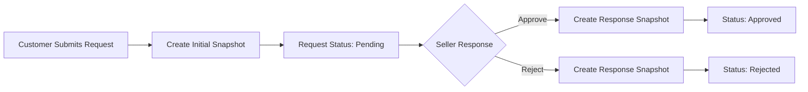

# Cancellation and Refund Requirements

## Overview

The platform provides two distinct mechanisms for customers to receive refunds based on the status of their order items:

- **Cancellation**: Available for items that have not yet been shipped (status: "paid")
- **Refund**: Available for items that have been delivered (status: "delivered")

Both processes operate at the **order item level**, meaning customers can request cancellation or refund for individual items within an order rather than the entire order. This allows for flexible resolution when issues affect only specific items.

### Key Principle: Item-Level Operations

THE system SHALL process cancellation and refund requests at the order item level, not at the order level. WHEN a customer requests cancellation or refund for specific items, THE system SHALL allow remaining items in the order to continue processing normally.

## Order Item Cancellation

### Cancellation Eligibility

Cancellation is available for order items that have not yet been shipped. The following requirements define cancellation eligibility:

**Eligibility Requirements:**

1. WHEN a customer views an order item with status "paid", THE system SHALL display the option to request cancellation for that item.

2. WHEN an order item has status "shipped" or "delivered", THE system SHALL NOT allow cancellation requests for that item.

3. WHEN an order item already has a pending cancellation request, THE system SHALL NOT allow the customer to submit another cancellation request for the same item.

4. WHEN an order item has status "cancelled" or "refunded", THE system SHALL NOT allow cancellation requests for that item.

### Cancellation Request Submission

**Request Process:**

1. WHEN a customer submits a cancellation request for an eligible order item, THE system SHALL require the customer to provide a reason for the cancellation.

2. THE system SHALL accept free-form text input for the cancellation reason.

3. WHEN a cancellation request is submitted, THE system SHALL create a cancellation request record with the following information:
   - Order item reference
   - Customer-provided reason
   - Request creation timestamp
   - Initial status: "pending"

4. WHEN a cancellation request is successfully created, THE system SHALL notify the seller who owns the order item about the pending cancellation request.

### Cancellation Request States

Cancellation requests progress through the following states:

| State | Description |
|-------|-------------|
| pending | Seller has not yet responded to the request |
| approved | Seller has approved the cancellation |
| rejected | Seller has rejected the cancellation |

**State Transition Requirements:**

1. WHILE a cancellation request is in "pending" status, THE seller SHALL be able to approve or reject the request.

2. WHEN a seller approves a cancellation request, THE system SHALL change the request status to "approved".

3. WHEN a seller rejects a cancellation request, THE system SHALL change the request status to "rejected".

4. IF a cancellation request is rejected, THEN THE system SHALL preserve the rejection reason provided by the seller.

5. THE system SHALL NOT allow status changes after a cancellation request has been approved or rejected.

### Cancellation Request Snapshot Requirements

**Snapshot Creation Triggers:**

1. WHEN a cancellation request is first created, THE system SHALL create a snapshot capturing the initial state.

2. WHEN a seller responds to a cancellation request (approves or rejects), THE system SHALL create a snapshot capturing the state change.

**Snapshot Content Requirements:**

1. EACH cancellation request snapshot SHALL include:
   - Cancellation request identifier
   - Order item reference
   - Customer reason
   - Seller response (if applicable)
   - Seller rejection reason (if applicable)
   - Status before the change
   - Status after the change
   - Timestamp of the snapshot creation

2. THE system SHALL preserve all cancellation request snapshots indefinitely for dispute resolution purposes.

3. THE system SHALL NOT allow deletion or modification of cancellation request snapshots.

### Cancellation Approval Effects

**When Cancellation is Approved:**

1. WHEN a seller approves a cancellation request, THE system SHALL change the order item status to "cancelled".

2. WHEN a cancellation is approved, THE system SHALL initiate a refund for the cancelled item's total amount (price × quantity).

3. WHEN a cancellation is approved, THE system SHALL create a positive inventory record to restore stock for the cancelled variant.
   - The inventory record SHALL include:
     - Variant reference
     - Quantity change: +[cancelled quantity]
     - Reason: "Order cancellation approved"
     - Timestamp of the inventory change

4. WHEN a cancellation is approved, THE system SHALL notify the customer that the cancellation has been approved and the refund is being processed.

### Cancellation Rejection Effects

**When Cancellation is Rejected:**

1. WHEN a seller rejects a cancellation request, THE system SHALL NOT change the order item status.

2. WHEN a cancellation is rejected, THE system SHALL notify the customer of the rejection, including the seller's rejection reason.

3. WHEN a cancellation is rejected, THE customer SHALL be able to view the rejection reason in their order details.

4. WHEN a cancellation is rejected, THE system SHALL NOT restore any stock quantities.

5. THE system SHALL NOT allow the customer to submit a new cancellation request for the same item that was previously rejected.

### Cancellation Impact on Order Status

**Order-Level Status Derivation:**

1. WHEN all items in an order are cancelled, THE system SHALL set the overall order status to "cancelled".

2. WHEN some items in an order are cancelled and others remain in non-cancelled status, THE system SHALL set the overall order status to "partially completed".

3. WHEN some items are cancelled and all remaining items are refunded, THE system SHALL set the overall order status to "refunded".

## Refund Request Process

### Refund Eligibility

Refund is available for order items that have been delivered. The following requirements define refund eligibility:

**Eligibility Requirements:**

1. WHEN a customer views an order item with status "delivered", THE system SHALL display the option to request a refund for that item.

2. WHEN the delivery confirmation date for an order item is more than 7 days ago, THE system SHALL NOT allow refund requests for that item.

3. WHEN an order item has status "paid" or "shipped", THE system SHALL NOT allow refund requests for that item.

4. WHEN an order item already has a pending refund request, THE system SHALL NOT allow the customer to submit another refund request for the same item.

5. WHEN an order item has status "cancelled" or "refunded", THE system SHALL NOT allow refund requests for that item.

### Refund Request Submission

**Request Process:**

1. WHEN a customer submits a refund request for an eligible order item, THE system SHALL require the customer to provide a reason for the refund.

2. THE system SHALL accept free-form text input for the refund reason.

3. WHEN a refund request is submitted, THE system SHALL create a refund request record with the following information:
   - Order item reference
   - Customer-provided reason
   - Request creation timestamp
   - Initial status: "pending"

4. WHEN a refund request is successfully created, THE system SHALL notify the seller who owns the order item about the pending refund request.

### 7-Day Refund Window

**Time Window Requirements:**

1. THE system SHALL calculate the refund eligibility window from the delivery confirmation timestamp.

2. IF the delivery was confirmed manually by the customer, THEN THE system SHALL use the customer's confirmation timestamp as the start of the 7-day window.

3. IF the delivery was confirmed automatically (14 days after shipping), THEN THE system SHALL use the automatic confirmation timestamp as the start of the 7-day window.

4. WHEN a customer attempts to submit a refund request beyond the 7-day window, THE system SHALL reject the request and display a message indicating the refund period has expired.

### Refund Request States

Refund requests progress through the following states:

| State | Description |
|-------|-------------|
| pending | Seller has not yet responded to the request |
| approved | Seller has approved the refund |
| rejected | Seller has rejected the refund request |

**State Transition Requirements:**

1. WHILE a refund request is in "pending" status, THE seller SHALL be able to approve or reject the request.

2. WHEN a seller approves a refund request, THE system SHALL change the request status to "approved".

3. WHEN a seller rejects a refund request, THE system SHALL change the request status to "rejected".

4. IF a refund request is rejected, THEN THE system SHALL preserve the rejection reason provided by the seller.

5. THE system SHALL NOT allow status changes after a refund request has been approved or rejected.

### Refund Request Snapshot Requirements

**Snapshot Creation Triggers:**

1. WHEN a refund request is first created, THE system SHALL create a snapshot capturing the initial state.

2. WHEN a seller responds to a refund request (approves or rejects), THE system SHALL create a snapshot capturing the state change.

**Snapshot Content Requirements:**

1. EACH refund request snapshot SHALL include:
   - Refund request identifier
   - Order item reference
   - Customer reason
   - Seller response (if applicable)
   - Seller rejection reason (if applicable)
   - Status before the change
   - Status after the change
   - Timestamp of the snapshot creation

2. THE system SHALL preserve all refund request snapshots indefinitely for dispute resolution purposes.

3. THE system SHALL NOT allow deletion or modification of refund request snapshots.

### Refund Approval Effects

**When Refund is Approved:**

1. WHEN a seller approves a refund request, THE system SHALL change the order item status to "refunded".

2. WHEN a refund is approved, THE system SHALL process the refund for the refunded item's total amount (price × quantity).

3. WHEN a refund is approved, THE system SHALL create a positive inventory record to restore stock for the refunded variant.
   - The inventory record SHALL include:
     - Variant reference
     - Quantity change: +[refunded quantity]
     - Reason: "Order refund approved"
     - Timestamp of the inventory change

4. WHEN a refund is approved, THE system SHALL notify the customer that the refund has been approved and is being processed.

### Refund Rejection Effects

**When Refund is Rejected:**

1. WHEN a seller rejects a refund request, THE system SHALL NOT change the order item status.

2. WHEN a refund is rejected, THE system SHALL notify the customer of the rejection, including the seller's rejection reason.

3. WHEN a refund is rejected, THE customer SHALL be able to view the rejection reason in their order details.

4. WHEN a refund is rejected, THE system SHALL NOT restore any stock quantities.

5. THE system SHALL NOT allow the customer to submit a new refund request for the same item that was previously rejected.

### Refund Impact on Order Status

**Order-Level Status Derivation:**

1. WHEN all items in an order are refunded, THE system SHALL set the overall order status to "refunded".

2. WHEN some items in an order are refunded and others remain in non-refunded status, THE system SHALL set the overall order status to "partially completed".

3. WHEN some items are refunded and all remaining items are cancelled, THE system SHALL set the overall order status to "cancelled".

## Seller Response Workflow

### Seller Notification

**Notification Requirements:**

1. WHEN a customer submits a cancellation or refund request, THE system SHALL send a notification to the seller who owns the order item.

2. THE notification SHALL include:
   - Type of request (cancellation or refund)
   - Order number and item details
   - Customer's reason
   - Link to respond to the request

3. THE system SHALL display pending cancellation and refund requests in the seller dashboard.

### Seller Request Viewing

**Seller Dashboard Requirements:**

1. THE system SHALL provide sellers with a list of all pending cancellation and refund requests for their products.

2. WHEN a seller views the requests list, THE system SHALL display for each request:
   - Request type (cancellation or refund)
   - Order number
   - Product name and variant
   - Quantity
   - Customer reason
   - Request date

3. THE system SHALL allow sellers to filter requests by type (cancellation or refund).

4. THE system SHALL allow sellers to filter requests by status (pending, approved, rejected).

5. THE system SHALL allow sellers to view the complete details of any request, including all snapshots.

### Seller Approval Process

**Approval Requirements:**

1. WHEN a seller chooses to approve a cancellation or refund request, THE system SHALL require the seller to confirm the approval.

2. WHEN a seller confirms approval, THE system SHALL:
   - Create a snapshot of the request state
   - Update the request status to "approved"
   - Update the order item status appropriately
   - Create the necessary inventory record
   - Initiate the refund process
   - Notify the customer

3. THE system SHALL process the approval immediately upon seller confirmation.

### Seller Rejection Process

**Rejection Requirements:**

1. WHEN a seller chooses to reject a cancellation or refund request, THE system SHALL require the seller to provide a rejection reason.

2. THE system SHALL accept free-form text input for the rejection reason.

3. WHEN a seller submits the rejection with a reason, THE system SHALL:
   - Create a snapshot of the request state
   - Update the request status to "rejected"
   - Preserve the rejection reason
   - Notify the customer with the rejection reason

4. THE system SHALL NOT allow rejection without providing a reason.

### Seller Response Timeline

While there is no mandatory timeline for sellers to respond, the following applies:

1. THE system SHALL display to sellers how long each request has been pending.

2. THE system SHALL allow sellers to view pending requests sorted by request date (oldest first).

3. THE system SHALL NOT automatically approve requests after any time period—seller action is always required.

## Snapshot Requirements for Requests

### Snapshot Principle Application

The snapshot principle applies to cancellation and refund requests because these are financial transactions that may be disputed. The following requirements ensure complete audit trails:

### Snapshot Creation Timing

### Snapshot Data Structure

**For Cancellation Requests:**

1. EACH cancellation request snapshot SHALL record:
   - Snapshot ID and creation timestamp
   - Cancellation request ID
   - Order item ID and order ID
   - Product snapshot reference (at time of order)
   - Variant snapshot reference (at time of order)
   - Customer reason
   - Seller response (approve/reject) - if applicable
   - Seller rejection reason - if applicable
   - Previous status
   - New status
   - Actor who triggered the snapshot (customer or seller)

**For Refund Requests:**

1. EACH refund request snapshot SHALL record:
   - Snapshot ID and creation timestamp
   - Refund request ID
   - Order item ID and order ID
   - Product snapshot reference (at time of order)
   - Variant snapshot reference (at time of order)
   - Customer reason
   - Seller response (approve/reject) - if applicable
   - Seller rejection reason - if applicable
   - Previous status
   - New status
   - Actor who triggered the snapshot (customer or seller)

### Snapshot Access Control

**Viewing Permissions:**

1. WHEN a customer views their cancellation or refund request, THE system SHALL display all snapshots for that request.

2. WHEN a seller views a cancellation or refund request for their product, THE system SHALL display all snapshots for that request.

3. WHEN an administrator views any cancellation or refund request, THE system SHALL display all snapshots for that request.

4. THE system SHALL NOT allow any user to modify or delete snapshots.

### Snapshot for Dispute Resolution

1. THE system SHALL preserve all request snapshots indefinitely.

2. WHEN a dispute arises regarding a cancellation or refund, THE system SHALL provide access to all related snapshots.

3. THE snapshots SHALL serve as the authoritative record of all actions taken on the request.

## Stock Restoration Rules

### Stock Restoration Overview

When cancellations or refunds are approved, stock quantities must be restored to allow other customers to purchase those items. Stock restoration follows specific rules:

### Restoration Trigger

1. WHEN a cancellation request is approved, THE system SHALL restore stock for the cancelled variant.

2. WHEN a refund request is approved, THE system SHALL restore stock for the refunded variant.

3. THE system SHALL NOT restore stock when requests are rejected.

### Restoration Quantity

1. THE system SHALL restore the exact quantity from the order item.

2. IF an order item has quantity 3, THEN THE system SHALL restore 3 units to the variant's inventory.

3. THE restoration SHALL be recorded as a single positive inventory record.

### Inventory Record Structure

**For Cancellation Restoration:**

1. WHEN stock is restored after cancellation approval, THE inventory record SHALL include:
   - Variant ID
   - Quantity change: positive value equal to cancelled quantity
   - Reason: "Order cancellation approved - [order number]"
   - Timestamp of the inventory change
   - Reference to the cancellation request

**For Refund Restoration:**

1. WHEN stock is restored after refund approval, THE inventory record SHALL include:
   - Variant ID
   - Quantity change: positive value equal to refunded quantity
   - Reason: "Order refund approved - [order number]"
   - Timestamp of the inventory change
   - Reference to the refund request

### Inventory History Integration

1. THE stock restoration SHALL appear in the inventory history for the variant.

2. WHEN a seller views the inventory history for a variant, THE system SHALL display the restoration record alongside other inventory changes.

3. THE inventory history SHALL show the running balance after each change, including restorations.

### Out-of-Stock Variant Handling

1. WHEN stock is restored for a previously out-of-stock variant, THE system SHALL update the variant's availability status.

2. IF the restored quantity brings the stock above zero, THEN THE variant SHALL become available for purchase.

3. WHEN a variant becomes available after restoration, THE system SHALL NOT automatically add it to existing carts that previously showed it as unavailable.

### Inventory Calculation

1. THE current stock of a variant SHALL be calculated by summing all inventory records, including restorations.

2. THE system SHALL NOT use a separate "available quantity" field—the sum of all inventory records is the authoritative stock count.

## Business Rules and Constraints

### Validation Rules

**For Cancellation Requests:**

1. THE system SHALL validate that the order item exists before allowing a cancellation request.

2. THE system SHALL validate that the order item belongs to the requesting customer.

3. THE system SHALL validate that the order item status is "paid" before allowing a cancellation request.

4. THE system SHALL validate that no pending cancellation request already exists for the order item.

5. THE system SHALL validate that the customer-provided reason is not empty.

**For Refund Requests:**

1. THE system SHALL validate that the order item exists before allowing a refund request.

2. THE system SHALL validate that the order item belongs to the requesting customer.

3. THE system SHALL validate that the order item status is "delivered" before allowing a refund request.

4. THE system SHALL validate that the delivery date is within the 7-day refund window.

5. THE system SHALL validate that no pending refund request already exists for the order item.

6. THE system SHALL validate that the customer-provided reason is not empty.

### Seller Account Constraints

1. WHEN a seller account is suspended, THE seller SHALL still be able to respond to pending cancellation and refund requests.

2. WHEN a seller account is banned, THE system SHALL handle cancellation and refund requests through administrator intervention.

3. WHEN a seller deletes their account while having pending requests, THE system SHALL NOT allow the account deletion until all requests are resolved.

### Partial Order Handling

1. WHEN some items in an order are cancelled or refunded, THE remaining items SHALL continue their normal processing.

2. WHEN items from different sellers are in the same order, THE system SHALL handle cancellation and refund requests independently for each seller's items.

3. THE system SHALL NOT automatically cancel or refund other items in an order when one item is cancelled or refunded.

### Payment Processing Rules

1. WHEN a cancellation or refund is approved, THE system SHALL initiate the payment refund process.

2. THE system SHALL use the original payment method for refunds where possible.

3. THE system SHALL process the full amount for the cancelled or refunded item (price × quantity).

4. THE system SHALL NOT deduct any cancellation or refund fees from the customer's refund.

### Concurrent Request Prevention

1. THE system SHALL prevent multiple pending cancellation or refund requests for the same order item.

2. IF a customer attempts to submit a duplicate request, THEN THE system SHALL reject the submission and display an error message.

3. WHEN a request is rejected, THE customer SHALL be able to view the rejection but not submit a new request for the same item.

### Seller Dashboard Count Requirements

1. THE seller dashboard SHALL display the count of pending cancellation requests.

2. THE seller dashboard SHALL display the count of pending refund requests.

3. THE counts SHALL update in real-time as requests are submitted and resolved.

### Notification Requirements

**Customer Notifications:**

1. WHEN a customer submits a cancellation or refund request, THE system SHALL send a confirmation notification.

2. WHEN a seller approves a request, THE system SHALL notify the customer of the approval and refund processing.

3. WHEN a seller rejects a request, THE system SHALL notify the customer with the rejection reason.

**Seller Notifications:**

1. WHEN a customer submits a cancellation request, THE system SHALL notify the seller.

2. WHEN a customer submits a refund request, THE system SHALL notify the seller.

### Administrator Override Capabilities

1. THE system SHALL allow administrators to view all cancellation and refund requests on the platform.

2. THE system SHALL allow administrators to force-approve cancellation or refund requests.

3. WHEN an administrator force-approves a request, THE system SHALL:
   - Create a snapshot noting administrator intervention
   - Update the request status to "approved"
   - Update the order item status
   - Restore stock quantities
   - Process the refund
   - Notify both customer and seller

4. THE system SHALL allow administrators to force-cancel individual order items without customer request.

5. THE system SHALL allow administrators to force-refund individual order items without customer request.

## Summary

The cancellation and refund system operates at the order item level, providing flexibility for customers to resolve issues with specific items while allowing remaining items to proceed normally. Key aspects include:

- **Status-based eligibility**: Cancellation for "paid" items, refund for "delivered" items within 7 days
- **Seller approval workflow**: Sellers must approve or reject with mandatory reasons for rejection
- **Complete audit trail**: Snapshot creation at every state change for dispute resolution
- **Stock restoration**: Approved cancellations and refunds restore inventory through positive inventory records
- **Partial order handling**: Remaining items continue processing independently

All cancellation and refund actions are permanently recorded through the snapshot system, ensuring financial transparency and enabling fair dispute resolution.