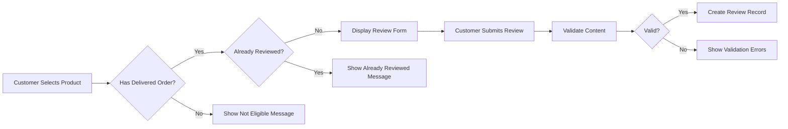
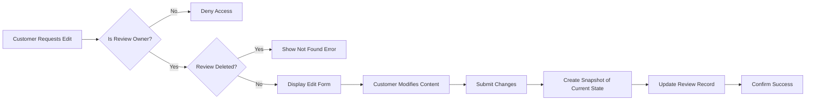
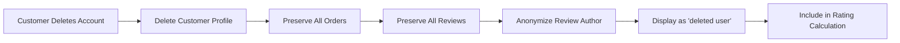

# Product Reviews and Ratings Requirements

## Overview

The review and rating system enables customers who have purchased products to share their experiences and provide ratings. This system is critical for building trust in the e-commerce platform, helping other customers make informed purchase decisions, and providing valuable feedback to sellers. Reviews are subject to strict eligibility requirements to ensure authenticity and are protected by the snapshot principle for dispute resolution.

---

## Review Creation Rules

### Eligibility Requirements

**Verified Purchase Requirement**

THE system SHALL only allow customers to write reviews for products they have purchased through the platform.

**Order Item Status Requirement**

WHEN a customer attempts to write a review, THE system SHALL verify that the corresponding order item status is "delivered".

**One Review Per Product Per Order**

THE system SHALL allow only one review per product per order for each customer.

WHEN a customer has already written a review for a specific product within a specific order, THE system SHALL prevent creation of additional reviews for that same product-order combination.

**Authentication Requirement**

WHEN a customer attempts to create a review, THE system SHALL require the customer to be authenticated.

### Review Creation Process

The review creation process follows these steps:



### Eligibility Verification Details

**Order Item Identification**

THE system SHALL identify all order items where:
- The customer is the purchaser
- The product matches the product being reviewed
- The order item status is "delivered"

**Preventing Duplicate Reviews**

THE system SHALL track which (customer, product, order) combinations have been reviewed to enforce the one-review-per-product-per-order constraint.

IF a customer has multiple delivered orders containing the same product, THEN THE system SHALL allow one review per order.

### Error Handling for Review Creation

**No Eligible Order Items**

IF a customer attempts to review a product without any delivered order items for that product, THEN THE system SHALL display a message indicating the customer must purchase and receive the product before reviewing.

**Already Reviewed**

IF a customer attempts to review a product-order combination already reviewed, THEN THE system SHALL display a message indicating the review already exists and provide a link to edit the existing review.

---

## Review Content Requirements

### Rating Requirements

**Rating Scale**

THE system SHALL use a 1 to 5 star rating scale where:
- 1 star represents the lowest rating
- 5 stars represents the highest rating
- Only integer values are accepted (no fractional ratings)

**Rating Requirement**

THE system SHALL require a rating for every review submission.

WHEN a customer submits a review without a rating, THE system SHALL reject the submission and display an error message.

**Rating Validation**

THE system SHALL validate that the rating is an integer between 1 and 5 inclusive.

IF a rating value outside this range is submitted, THEN THE system SHALL reject the submission.

### Text Content Requirements

**Text Content Optional**

THE system SHALL allow reviews to be submitted without text content (rating-only reviews).

**Text Content Length**

THE system SHALL accept text content up to a maximum of 2,000 characters.

IF text content exceeds 2,000 characters, THEN THE system SHALL reject the submission and display an error message.

**Text Content Formatting**

THE system SHALL preserve the original formatting of text content including line breaks.

THE system SHALL sanitize text content to prevent script injection and malicious content.

### Review Data Structure

Each review record contains the following information:

| Field | Type | Required | Description |
|-------|------|----------|-------------|
| Rating | Integer (1-5) | Yes | Star rating given by customer |
| Text Content | String | No | Written review content |
| Product ID | Reference | Yes | Product being reviewed |
| Customer ID | Reference | Yes | Customer who wrote the review |
| Order ID | Reference | Yes | Order through which product was purchased |
| Created At | Timestamp | Yes | Date and time of review creation |
| Updated At | Timestamp | Yes | Date and time of last modification |
| Deleted At | Timestamp | No | Date and time of soft deletion (if deleted) |

---

## Review Editing and Snapshots

### Edit Permissions

**Owner-Only Editing**

THE system SHALL only allow the customer who created a review to edit that review.

WHEN any other user (including administrators) attempts to edit a customer's review, THE system SHALL deny access.

**Edit Availability**

THE system SHALL allow customers to edit their reviews at any time after creation, regardless of order status or product availability.

**Deleted Reviews**

THE system SHALL not allow editing of deleted reviews.

IF a customer attempts to edit a deleted review, THEN THE system SHALL display an error indicating the review no longer exists.

### Edit Process



### Snapshot Creation on Edit

**Automatic Snapshot Creation**

WHEN a customer submits an edit to their review, THE system SHALL automatically create a snapshot preserving the previous state.

**Snapshot Content**

THE system SHALL include the following information in each review snapshot:

| Snapshot Field | Description |
|----------------|-------------|
| Review ID | Reference to the review being modified |
| Previous Rating | Rating value before modification |
| New Rating | Rating value after modification |
| Previous Text Content | Text content before modification |
| New Text Content | Text content after modification |
| Modified At | Timestamp of when the modification occurred |
| Modified By | Customer who made the modification (always the review owner) |

**Snapshot Immutability**

THE system SHALL make review snapshots immutable once created.

THE system SHALL prevent deletion of review snapshots under any circumstances.

**Snapshot Sequence**

THE system SHALL maintain all snapshots in chronological order to provide a complete edit history.

### Snapshot Access

**Customer Access**

THE system SHALL allow customers to view snapshots of their own reviews.

**Administrator Access**

THE system SHALL allow administrators to view snapshots of any review for dispute resolution purposes.

**Seller Access**

THE system SHALL not allow sellers to view review snapshots, only the current review state.

---

## Review Deletion

### Deletion Permissions

**Owner-Only Deletion**

THE system SHALL only allow the customer who created a review to delete that review.

**Soft Delete Implementation**

WHEN a customer deletes their review, THE system SHALL perform a soft delete by recording a deletion timestamp rather than permanently removing the record.

### Deletion Effects

**Snapshot Preservation**

WHEN a review is deleted, THE system SHALL preserve all snapshots associated with that review.

**Rating Calculation Impact**

WHEN a review is deleted, THE system SHALL exclude it from the product's average rating calculation.

**Display Treatment**

THE system SHALL not display deleted reviews on the product detail page or in any customer-facing interfaces.

### Review Restoration

**No Restoration Option**

THE system SHALL not provide a mechanism for customers or administrators to restore deleted reviews.

IF a customer wishes to review the same product again, THEN the customer must have another delivered order item for that product and create a new review.

### Account Deletion and Reviews

**Customer Account Deletion Impact**

WHEN a customer deletes their account, THE system SHALL preserve all reviews written by that customer.

**Anonymization of Reviews**

WHEN a customer deletes their account, THE system SHALL display their preserved reviews with the author shown as "deleted user".

**Rating Calculation After Account Deletion**

THE system SHALL continue to include reviews from deleted accounts in the product's average rating calculation.



---

## Rating Calculation

### Average Rating Computation

**Calculation Method**

THE system SHALL calculate a product's average rating by dividing the sum of all non-deleted review ratings by the count of non-deleted reviews.

**Formula**

```
Average Rating = Sum of Ratings / Number of Non-Deleted Reviews
```

**Non-Deleted Reviews Only**

THE system SHALL only include non-deleted reviews in the average rating calculation.

IF all reviews for a product are deleted, THEN THE system SHALL display no average rating for that product.

### Rating Display

**Precision**

THE system SHALL display average ratings rounded to one decimal place (e.g., 4.3 stars, 3.7 stars).

**Review Count Display**

THE system SHALL display the total count of non-deleted reviews alongside the average rating.

**No Reviews Scenario**

IF a product has no non-deleted reviews, THEN THE system SHALL display "No reviews yet" or equivalent messaging instead of an average rating.

### Rating Distribution

**Distribution Display**

THE system SHALL calculate and may display the distribution of ratings showing the count and percentage for each star level (1 through 5 stars).

**Distribution Calculation**

THE system SHALL only include non-deleted reviews in rating distribution calculations.

### Rating Updates

**Real-Time Updates**

WHEN a review is created, edited, or deleted, THE system SHALL update the product's average rating immediately.

**Edit Impact**

WHEN a review's rating is edited, THE system SHALL recalculate the average rating using the new rating value.

**Deletion Impact**

WHEN a review is deleted, THE system SHALL recalculate the average rating excluding the deleted review.

---

## Review Display

### Product Detail Page Display

**Review Section Location**

THE system SHALL display reviews on the product detail page below the product information.

**Review Display Order**

THE system SHALL sort reviews by creation date with the newest reviews displayed first (descending chronological order).

### Review Item Display

**Information Shown Per Review**

THE system SHALL display the following information for each review:

| Display Element | Description |
|-----------------|-------------|
| Rating | Star rating (1-5 stars visual) |
| Text Content | Written review (if provided) |
| Author | Customer display name or "deleted user" |
| Created Date | Date the review was created |
| Verified Purchase Badge | Indicator that this is from a verified purchase |

**Verified Purchase Indicator**

THE system SHALL display a "Verified Purchase" badge or indicator for all reviews, indicating the reviewer purchased the product through the platform.

### Pagination

**Review Pagination**

THE system SHALL display reviews in pages of 10 reviews per page.

**Page Navigation**

THE system SHALL provide pagination controls allowing users to navigate through multiple pages of reviews.

### Empty State

**No Reviews Message**

IF a product has no non-deleted reviews, THEN THE system SHALL display a message indicating no reviews are available.

---

## Business Rules Summary

### Creation Rules
| Rule | Requirement |
|------|------------|
| Purchase Required | Customer must have purchased the product |
| Delivery Required | Order item status must be "delivered" |
| One Per Product Per Order | Only one review allowed per product-order combination |
| Authentication Required | Customer must be logged in |

### Content Rules
| Rule | Requirement |
|------|------------|
| Rating Required | 1-5 stars, mandatory |
| Text Optional | Can submit rating-only reviews |
| Text Maximum | 2,000 characters maximum |

### Edit Rules
| Rule | Requirement |
|------|------------|
| Owner Only | Only review creator can edit |
| Snapshot Required | Every edit creates a snapshot |
| Snapshots Immutable | Snapshots cannot be deleted |

### Deletion Rules
| Rule | Requirement |
|------|------------|
| Owner Only | Only review creator can delete |
| Soft Delete | Record marked as deleted, not removed |
| Snapshots Preserved | All edit history maintained |
| Exclude from Rating | Deleted reviews not counted in average |

### Rating Rules
| Rule | Requirement |
|------|------------|
| Non-Deleted Only | Only active reviews counted |
| Real-Time Update | Rating updates on create/edit/delete |
| Account Deletion Preserved | Reviews from deleted accounts still counted |

---

## Error Scenarios

### Review Creation Errors

| Scenario | System Response |
|----------|----------------|
| Not authenticated | Redirect to login page |
| No delivered order for product | Display "You must purchase and receive this product before reviewing" |
| Already reviewed this product-order | Display "You have already reviewed this product from this order" with edit link |
| Rating missing | Display "Please select a star rating" |
| Rating out of range | Display "Rating must be between 1 and 5 stars" |
| Text too long | Display "Review text cannot exceed 2,000 characters" |

### Review Edit Errors

| Scenario | System Response |
|----------|----------------|
| Not review owner | Display "You can only edit your own reviews" |
| Review already deleted | Display "This review no longer exists" |
| Rating missing on edit | Display "Please select a star rating" |
| Rating out of range | Display "Rating must be between 1 and 5 stars" |
| Text too long | Display "Review text cannot exceed 2,000 characters" |

### Review Deletion Errors

| Scenario | System Response |
|----------|----------------|
| Not review owner | Display "You can only delete your own reviews" |
| Review already deleted | Display "This review no longer exists" |

---

## Integration Points

### Order Management Integration

The review system integrates with the order management system to:
- Verify order item delivery status before allowing review creation
- Identify which orders contain products eligible for review
- Track the (customer, product, order) relationships for review eligibility

### Product Management Integration

The review system integrates with the product management system to:
- Display reviews on product detail pages
- Provide average rating information for product listings
- Update rating displays when reviews change

### Customer Account Integration

The review system integrates with customer account management to:
- Authenticate reviewers
- Display customer names on reviews
- Handle account deletion with review anonymization
- Preserve reviews when customers delete their accounts

---

## Success Metrics

The review system should support the following business metrics:

- **Review Rate**: Percentage of delivered orders that result in reviews
- **Average Rating Distribution**: Distribution of ratings across products
- **Review Helpfulness**: Customer engagement with review content
- **Review Freshness**: Age distribution of reviews on products
- **Snapshot Utilization**: Number of snapshots accessed for dispute resolution