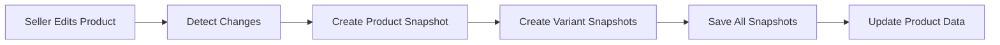
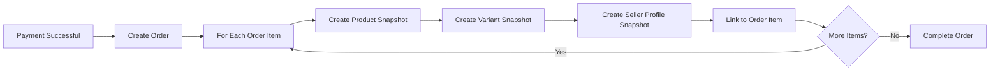
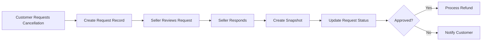

# Snapshot Principle

## 1. Overview

### 1.1 Definition

THE snapshot system SHALL preserve the complete state of data at specific points in time to maintain an immutable historical record of all modifications.

The e-commerce platform handles financial transactions where data accuracy and historical integrity are critical for dispute resolution, legal compliance, and business transparency. THE snapshot principle SHALL ensure that every modification to critical data is recorded with its previous state, enabling accurate reconstruction of historical events.

### 1.2 Business Justification

The snapshot principle exists to:

- **Dispute Resolution**: WHEN a customer or seller disputes an order, THE system SHALL provide accurate historical records of product details, prices, and seller information at the time of transaction.

- **Legal Compliance**: THE system SHALL preserve transaction records and data modification history to meet legal requirements for financial platforms.

- **Business Transparency**: WHEN questions arise about price changes, product modifications, or policy updates, THE system SHALL provide clear audit trails.

- **Trust Building**: THE system SHALL enable customers and sellers to verify that their transactions were processed fairly based on accurate information.

### 1.3 Core Principles

THE snapshot system SHALL adhere to the following core principles:

1. **Immutability**: Once created, a snapshot SHALL never be modified or deleted.
2. **Completeness**: Each snapshot SHALL contain all relevant fields for the entity type.
3. **Traceability**: Each snapshot SHALL record when the change occurred, what changed, and the values before and after.
4. **Accessibility**: Snapshots SHALL be viewable by authorized parties for dispute resolution.

---

## 2. Snapshot Creation Triggers

### 2.1 General Trigger Rules

WHEN editable data is modified, THE system SHALL automatically create a snapshot to preserve the previous state.

THE snapshot SHALL capture:
- **Timestamp**: WHEN the change was made
- **Changed Fields**: WHAT specific fields were modified
- **Previous Values**: THE values BEFORE the change
- **New Values**: THE values AFTER the change

### 2.2 Entity-Specific Triggers

#### Product Snapshots

WHEN a seller edits any of the following product fields, THE system SHALL create a product snapshot:
- Product name
- Product description
- Category assignment
- Base price
- Product images (addition, removal, or reordering)

#### Product Variant Snapshots

WHEN a seller edits any of the following variant fields, THE system SHALL create a variant snapshot:
- SKU code
- Option values (e.g., color, size)
- Price override

THE product snapshot SHALL include snapshots of all variants at that moment, creating a complete product state record.

#### Seller Profile Snapshots

WHEN a seller modifies their shop profile, THE system SHALL create a seller profile snapshot for:
- Shop name
- Shop description
- Logo image

#### Order Item Snapshots

WHEN an order is placed successfully, THE system SHALL create order item snapshots for each purchased item.

THE order item snapshot SHALL capture:
- Product snapshot (name, description, category, images)
- Variant snapshot (SKU code, option values, price at time of purchase)
- Seller profile snapshot (shop name, logo at time of purchase)

#### Review Snapshots

WHEN a customer edits their review, THE system SHALL create a review snapshot for:
- Rating (1-5 stars)
- Text content

#### Cancellation Request Snapshots

WHEN a seller responds to a cancellation request (approve or reject), THE system SHALL create a cancellation request snapshot for:
- Request reason (text)
- Response status
- Response timestamp

#### Refund Request Snapshots

WHEN a seller responds to a refund request (approve or reject), THE system SHALL create a refund request snapshot for:
- Request reason (text)
- Response status
- Response timestamp

---

## 3. Snapshot Data Structure

### 3.1 Common Snapshot Fields

Every snapshot SHALL contain the following common fields:

| Field | Type | Description |
|-------|------|-------------|
| Snapshot ID | UUID | Unique identifier for the snapshot record |
| Entity Type | Enum | Type of entity (product, variant, seller_profile, order_item, review, cancellation_request, refund_request) |
| Entity ID | UUID | Reference to the parent entity |
| Created At | Timestamp | When the snapshot was created |
| Changed By | UUID | User ID who made the change |
| Change Type | Enum | Type of change (create, update, delete) |

### 3.2 Product Snapshot Structure

THE product snapshot SHALL preserve the following data:

```
Product Snapshot
├── Basic Information
│   ├── Product Name
│   ├── Product Description
│   ├── Category ID (and subcategory if applicable)
│   └── Base Price
├── Images
│   └── List of image URLs (ordered, first is main image)
└── Variant Snapshots
    └── For each variant:
        ├── SKU Code
        ├── Option Values (e.g., color: "Red", size: "Large")
        ├── Price Override (if applicable)
        └── Stock Quantity at snapshot time
```

### 3.3 Seller Profile Snapshot Structure

THE seller profile snapshot SHALL preserve:

```
Seller Profile Snapshot
├── Shop Name
├── Shop Description
└── Logo Image URL
```

### 3.4 Order Item Snapshot Structure

THE order item snapshot SHALL preserve the complete purchasing context:

```
Order Item Snapshot
├── Product Snapshot
│   ├── Product Name
│   ├── Product Description
│   ├── Category
│   └── Product Images
├── Variant Snapshot
│   ├── SKU Code
│   ├── Option Values
│   └── Price at Purchase
└── Seller Profile Snapshot
    ├── Shop Name
    └── Logo Image
```

### 3.5 Review Snapshot Structure

THE review snapshot SHALL preserve:

```
Review Snapshot
├── Rating (1-5)
├── Text Content
└── Created/Modified Timestamp
```

### 3.6 Request Snapshot Structure (Cancellation and Refund)

THE request snapshots SHALL preserve:

```
Request Snapshot
├── Request Reason (text)
├── Status (pending, approved, rejected)
├── Response (if applicable)
├── Responded By (seller ID)
└── Response Timestamp
```

---

## 4. Snapshot Applicability by Entity

### 4.1 Products

#### Applicable Fields
THE system SHALL create snapshots for all product fields:
- **Name**: Product title
- **Description**: Full product description text
- **Category**: Category and subcategory assignment
- **Base Price**: Default price before variant overrides
- **Images**: All uploaded images with ordering

#### Variant Inclusion
WHEN a product snapshot is created, THE system SHALL include snapshots of all variants associated with that product at that moment.

This ensures the complete product state is preserved, including all available purchasing options.

#### Deletion Handling
WHEN a product is deleted, THE system SHALL preserve all existing snapshots.

THE snapshots SHALL remain accessible for:
- Historical order references
- Dispute resolution
- Administrative oversight

### 4.2 Product Variants (SKU)

#### Applicable Fields
THE system SHALL create snapshots for variant fields:
- **SKU Code**: Unique identifier for the variant
- **Option Values**: Specific attribute combinations (e.g., "Red / Large")
- **Price Override**: Variant-specific price if different from base price

#### Relationship to Product Snapshots
WHEN a product is edited, THE system SHALL create both a product snapshot AND variant snapshots for all variants.

WHEN only a variant is edited, THE system SHALL create only a variant snapshot.

#### Stock Quantity Notes
Stock quantity is NOT included in snapshots but is tracked separately through inventory history records. This separation exists because:
- Stock changes frequently due to orders and restocking
- Inventory has its own complete audit trail
- Snapshot purpose is to preserve listing details, not inventory levels

### 4.3 Seller Profiles

#### Applicable Fields
THE system SHALL create snapshots for seller profile fields:
- **Shop Name**: Display name of the seller's shop
- **Shop Description**: Text description of the shop
- **Logo Image**: Profile image URL

#### Creation Timing
WHEN a seller edits their shop profile, THE system SHALL create a seller profile snapshot.

Every edit creates a snapshot, ensuring complete history of the shop's presentation.

### 4.4 Order Items

#### Purpose
Order item snapshots serve a unique purpose: preserving the exact state of product and seller information at the time of purchase.

#### Creation Timing
WHEN an order is placed successfully and payment is processed, THE system SHALL create order item snapshots for each item in the order.

#### Snapshot Composition
Each order item snapshot SHALL include:

1. **Product Snapshot**: Preserves product details at purchase time
   - Product name and description as shown to the customer
   - Product images for reference
   - Category for classification

2. **Variant Snapshot**: Preserves specific variant purchased
   - SKU code for identification
   - Option values (color, size, etc.)
   - Price paid for this variant

3. **Seller Profile Snapshot**: Preserves seller information at purchase time
   - Shop name as displayed to customer
   - Logo for visual reference

#### Why This Matters

IF a seller changes their product name, price, or shop name after a purchase, THEN THE order item snapshot SHALL preserve the original information.

Example scenario:
- Customer purchases "Premium Cotton T-Shirt" for $29.99 from "Fashion Store"
- Seller later renames product to "Basic Cotton Shirt" and raises price to $39.99
- Seller rebrands shop to "Premium Fashion Hub"
- Customer's order history SHALL still show: "Premium Cotton T-Shirt" at $29.99 from "Fashion Store"

### 4.5 Reviews

#### Applicable Fields
THE system SHALL create snapshots for review fields:
- **Rating**: Star rating from 1 to 5
- **Text Content**: Written review text

#### Creation Timing
WHEN a customer edits their review, THE system SHALL create a review snapshot preserving the previous content.

#### Deletion Handling
WHEN a customer deletes their review, THE system SHALL preserve all existing snapshots.

THE snapshots SHALL remain accessible for:
- Administrative review of content history
- Dispute resolution regarding review content

### 4.6 Cancellation Requests

#### Applicable Fields
THE system SHALL create snapshots for cancellation request fields:
- **Request Reason**: Customer's explanation for cancellation
- **Status**: Current state (pending, approved, rejected)
- **Response**: Seller's response if provided

#### Creation Timing
WHEN a seller responds to a cancellation request (approves or rejects), THE system SHALL create a snapshot preserving the request state at that moment.

This creates an audit trail showing:
- Original request and reason
- Seller's decision
- When the decision was made

### 4.7 Refund Requests

#### Applicable Fields
THE system SHALL create snapshots for refund request fields:
- **Request Reason**: Customer's explanation for refund request
- **Status**: Current state (pending, approved, rejected)
- **Response**: Seller's response if provided

#### Creation Timing
WHEN a seller responds to a refund request (approves or rejects), THE system SHALL create a snapshot preserving the request state at that moment.

#### 7-Day Window Consideration
WHILE refund requests can only be made within 7 days of delivery, THE snapshot system SHALL preserve the complete history of all refund request interactions regardless of timing.

---

## 5. Snapshot Access and Viewing

### 5.1 Access Control Overview

Snapshot access SHALL be controlled based on user type and relationship to the data.

### 5.2 Seller Access

#### Product Snapshots
Sellers SHALL be able to view snapshots of their own products.

IF a seller attempts to view snapshots of another seller's products, THEN THE system SHALL deny access.

#### Seller Profile Snapshots
Sellers SHALL be able to view snapshots of their own shop profile.

#### Cancellation and Refund Request Snapshots
Sellers SHALL be able to view snapshots of cancellation and refund requests for their products.

### 5.3 Customer Access

#### Order Item Snapshots
Customers SHALL be able to view order item snapshots for their own orders.

This allows customers to see exactly what they purchased, including product details and seller information at the time of purchase.

#### Review Snapshots
Customers SHALL be able to view snapshots of their own reviews.

### 5.4 Administrator Access

#### Full Access
Administrators SHALL be able to view snapshots of ALL entities on the platform.

This includes:
- Product snapshots from any seller
- Seller profile snapshots from any seller
- Order item snapshots from any order
- Review snapshots from any customer
- Cancellation request snapshots
- Refund request snapshots

#### Purpose of Full Access
Administrator access to snapshots enables:
- Dispute resolution between customers and sellers
- Investigation of reported violations
- Verification of historical pricing and product claims
- Legal compliance auditing

### 5.5 Super Administrator Access

Super administrators SHALL have the same snapshot access as regular administrators.

### 5.6 Access Summary Matrix

| Snapshot Type | Customer | Seller (Own) | Seller (Others) | Admin |
|---------------|----------|--------------|-----------------|-------|
| Product | ❌ | ✅ | ❌ | ✅ |
| Variant | ❌ | ✅ | ❌ | ✅ |
| Seller Profile | ❌ | ✅ | ❌ | ✅ |
| Order Item (Own) | ✅ | ❌ | ❌ | ✅ |
| Order Item (Others) | ❌ | ❌ | ❌ | ✅ |
| Review (Own) | ✅ | ❌ | ❌ | ✅ |
| Review (Others) | ❌ | ❌ | ❌ | ✅ |
| Cancellation Request | ❌ | ✅ | ❌ | ✅ |
| Refund Request | ❌ | ✅ | ❌ | ✅ |

---

## 6. Immutability and Preservation

### 6.1 Immutability Principle

THE system SHALL ensure that snapshots are completely immutable.

Once a snapshot is created:
- THE content SHALL never be modified
- THE snapshot SHALL never be deleted
- THE snapshot SHALL remain in the database permanently

### 6.2 Deletion Scenarios

#### Product Deletion
WHEN a product is deleted, THE system SHALL:
- Preserve all product and variant snapshots
- Maintain all order item snapshots referencing this product
- Keep snapshots accessible to administrators and through order history

#### Seller Account Deletion
WHEN a seller deletes their account, THE system SHALL:
- Preserve all product snapshots
- Preserve all seller profile snapshots
- Maintain all order item snapshots referencing this seller
- Keep "deleted seller" designation in order history while preserving snapshot data

#### Customer Account Deletion
WHEN a customer deletes their account, THE system SHALL:
- Preserve all order item snapshots in the customer's orders
- Preserve all review snapshots (shown as "deleted user")
- Maintain complete audit trail for dispute resolution

#### Review Deletion
WHEN a customer deletes their review, THE system SHALL:
- Preserve all review snapshots
- Mark the review as deleted in the main record
- Keep snapshots accessible to administrators

### 6.3 Legal and Compliance Preservation

THE snapshot system SHALL maintain records for legal compliance:

- **Financial Records**: Order item snapshots serve as permanent records of transactions
- **Dispute Evidence**: Cancellation and refund request snapshots provide evidence for dispute resolution
- **Content History**: Review snapshots maintain record of user-generated content
- **Business Records**: Product and seller profile snapshots document the state of listings over time

---

## 7. Snapshot Lifecycle Flow

### 7.1 Product Edit Snapshot Flow



### 7.2 Order Creation Snapshot Flow



### 7.3 Cancellation Request Snapshot Flow



---

## 8. Implementation Considerations

### 8.1 Storage Requirements

THE snapshot system SHALL accumulate data over time. Considerations:

- Product snapshots grow with each product edit
- Order item snapshots grow with each order (permanent storage required)
- Review snapshots grow with each review edit
- Request snapshots grow with each seller response

### 8.2 Query Performance

WHEN viewing snapshots, THE system SHALL provide efficient access:

- Sellers viewing their product history: SHALL load within 2 seconds
- Administrators investigating disputes: SHALL access full snapshot history
- Customers viewing order details: SHALL see embedded snapshots instantly

### 8.3 Data Relationships

THE snapshot system SHALL maintain relationships:

- Product snapshots link to the original product (even if deleted)
- Variant snapshots link to their parent product snapshot
- Order item snapshots link to order items and orders
- All snapshots link to the user who made the change

---

## 9. Summary

### 9.1 Key Takeaways

1. **Automatic Creation**: Snapshots are created automatically when data is modified
2. **Complete Records**: Each snapshot preserves all relevant fields
3. **Permanent Storage**: Snapshots are never deleted, ensuring complete audit trails
4. **Controlled Access**: Access is limited based on user type and data ownership
5. **Dispute Resolution**: The primary purpose is enabling fair dispute resolution

### 9.2 Entity Coverage

THE snapshot system SHALL cover:

| Entity | Trigger | Purpose |
|--------|---------|----------|
| Product | Product edit | Track product listing changes |
| Product Variant | Variant edit or product edit | Track SKU changes |
| Seller Profile | Profile edit | Track shop presentation changes |
| Order Item | Order creation | Preserve purchase context |
| Review | Review edit | Track review content changes |
| Cancellation Request | Seller response | Record request outcomes |
| Refund Request | Seller response | Record request outcomes |

### 9.3 Business Value

The snapshot principle ensures:

- **Trust**: Customers and sellers can verify transaction details
- **Accountability**: All changes are traceable to specific users and times
- **Legal Protection**: Complete records support legal compliance
- **Fair Resolution**: Disputes can be resolved based on accurate historical data

> *Developer Note: This document defines **business requirements only**. All technical implementations (snapshot storage schema, database design, API endpoints, etc.) are at the discretion of the development team.*