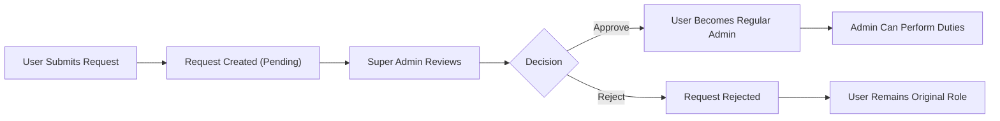
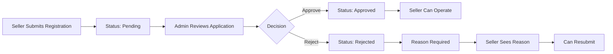

# Administrator System Requirements

## Overview

The administrator system provides platform governance capabilities through a hierarchical administrative structure. This document specifies the complete requirements for administrator management, seller oversight, content moderation, and user management functions.

Administrators serve as platform guardians who ensure marketplace quality, resolve disputes, and maintain operational standards. The system implements a two-tier hierarchy to provide appropriate checks and balances for sensitive administrative actions.

---

## Administrator Grade Hierarchy

### Two-Tier Structure

THE system SHALL maintain two distinct administrator grades: **Regular Administrator** and **Super Administrator**.

### Regular Administrator Capabilities

Regular administrators possess comprehensive platform oversight capabilities with the following permissions:

**Seller Management:**
- THE system SHALL allow regular administrators to view the list of pending seller registration approvals.
- THE system SHALL allow regular administrators to approve pending seller registrations.
- THE system SHALL allow regular administrators to reject pending seller registrations with a mandatory reason.
- THE system SHALL allow regular administrators to suspend active seller accounts.
- THE system SHALL allow regular administrators to unsuspend suspended seller accounts.

**Category Management:**
- THE system SHALL allow regular administrators to create new categories.
- THE system SHALL allow regular administrators to create subcategories under existing categories.
- THE system SHALL allow regular administrators to edit category names and descriptions.
- THE system SHALL allow regular administrators to delete categories.

**Product Oversight:**
- THE system SHALL allow regular administrators to view all products on the platform regardless of seller status.
- THE system SHALL allow regular administrators to view snapshots of any product.
- THE system SHALL allow regular administrators to delete any product for policy violations.

**Order Oversight:**
- THE system SHALL allow regular administrators to view all orders on the platform.
- THE system SHALL allow regular administrators to force-cancel individual order items.
- THE system SHALL allow regular administrators to force-cancel entire orders.
- THE system SHALL allow regular administrators to force-refund individual order items.
- THE system SHALL allow regular administrators to force-refund entire orders.

**User Management:**
- THE system SHALL allow regular administrators to view all customer accounts.
- THE system SHALL allow regular administrators to ban customer accounts.
- THE system SHALL allow regular administrators to unban customer accounts.
- THE system SHALL allow regular administrators to view all seller accounts.
- THE system SHALL allow regular administrators to ban seller accounts.
- THE system SHALL allow regular administrators to unban seller accounts.

### Super Administrator Capabilities

Super administrators possess all regular administrator capabilities plus exclusive administrative management functions:

**Administrator Request Management:**
- THE system SHALL allow super administrators to view the list of pending administrator requests.
- THE system SHALL allow super administrators to approve administrator requests.
- THE system SHALL allow super administrators to reject administrator requests.

**Grade Management:**
- THE system SHALL allow super administrators to promote regular administrators to super administrator grade.
- THE system SHALL allow super administrators to demote other super administrators to regular administrator grade.
- THE system SHALL prevent super administrators from demoting themselves.

### Grade Management Constraints

WHEN a super administrator attempts to demote themselves, THE system SHALL reject the operation and display an appropriate error message.

WHEN a super administrator is demoted to regular administrator grade, THE system SHALL immediately reduce their permissions to regular administrator level.

WHEN a regular administrator is promoted to super administrator grade, THE system SHALL immediately grant them super administrator permissions.

---

## Becoming an Administrator

### Administrator Request Submission

Any registered user may request to become an administrator through the following process:

**Eligibility:**
- THE system SHALL allow any customer to submit a request to become an administrator.
- THE system SHALL allow any seller to submit a request to become an administrator.
- THE system SHALL NOT allow existing administrators to submit administrator requests.

**Request Content:**
- WHEN a user submits an administrator request, THE system SHALL require a reason text explaining why they want to become an administrator.
- THE system SHALL validate that the reason text is provided before accepting the request.

**Request Processing:**
- WHEN a user submits a valid administrator request, THE system SHALL create a pending request record.
- THE system SHALL assign the request a "pending" status.
- THE system SHALL record the requesting user's identity.
- THE system SHALL record the submission timestamp.

### Administrator Request Approval Workflow

Super administrators review and process administrator requests through the following workflow:

**Viewing Pending Requests:**
- THE system SHALL display to super administrators a list of all pending administrator requests.
- THE system SHALL display for each request: the requesting user's information, submission date, and provided reason.

**Approving Requests:**
- WHEN a super administrator approves a request, THE system SHALL change the user's role to regular administrator.
- THE system SHALL update the request status to "approved".
- THE system SHALL record the approving super administrator's identity.
- THE system SHALL record the approval timestamp.

**Rejecting Requests:**
- WHEN a super administrator rejects a request, THE system SHALL update the request status to "rejected".
- THE system SHALL record the rejecting super administrator's identity.
- THE system SHALL record the rejection timestamp.
- THE system SHALL preserve the request record for audit purposes.
- THE user SHALL remain in their original role (customer or seller).

**Request Resubmission:**
- WHEN a user's administrator request is rejected, THE system SHALL allow the user to submit a new administrator request.
- THE system SHALL NOT impose any waiting period before resubmission.

### Request Status Visibility

THE system SHALL allow users who have submitted administrator requests to view their request status (pending, approved, or rejected).

---

## Seller Management

### Seller Registration Approval

Administrators manage seller registration through a structured approval process:

**Pending Seller List:**
- THE system SHALL display to administrators a list of all pending seller registration requests.
- THE system SHALL display for each pending seller: email, shop name, submission date, and any additional registration information.

**Approval Process:**

**Approving Seller Registrations:**
- WHEN an administrator approves a seller registration, THE system SHALL change the seller's status to "approved".
- THE system SHALL record the approving administrator's identity.
- THE system SHALL record the approval timestamp.
- THE approved seller SHALL immediately gain full seller capabilities.

**Rejecting Seller Registrations:**
- WHEN an administrator rejects a seller registration, THE system SHALL require a rejection reason.
- THE system SHALL change the seller's status to "rejected".
- THE system SHALL record the rejection reason.
- THE system SHALL record the rejecting administrator's identity.
- THE system SHALL record the rejection timestamp.
- THE system SHALL display the rejection reason to the rejected seller.

**Resubmission After Rejection:**
- WHEN a seller's registration is rejected, THE system SHALL allow the seller to submit a new registration request.
- THE system SHALL preserve the previous rejection record for reference.

### Seller Account Suspension

Administrators may suspend seller accounts that violate platform policies:

**Suspension Action:**
- WHEN an administrator suspends a seller account, THE system SHALL change the seller's status to "suspended".
- THE system SHALL record the suspending administrator's identity.
- THE system SHALL record the suspension timestamp.

**Effects of Seller Suspension:**

WHILE a seller's account is suspended, THE system SHALL enforce the following restrictions:

| Capability | Suspended Seller Status |
|------------|------------------------|
| Products visible in search | ❌ Hidden |
| Products visible in category listings | ❌ Hidden |
| Products purchasable | ❌ Cannot be purchased |
| Create new products | ❌ Not allowed |
| Edit existing products | ❌ Not allowed |
| View existing orders | ✅ Allowed |
| Ship items | ✅ Allowed |
| Respond to cancellation requests | ✅ Allowed |
| Respond to refund requests | ✅ Allowed |
| View dashboard | ✅ Allowed |
| Edit shop profile | ❌ Not allowed |

**Rationale for Partial Access:**
Suspended sellers retain order processing capabilities to ensure customer orders are not left unfulfilled. Customers with pending orders from suspended sellers must receive their shipments and have their requests processed.

**Unsuspending Seller Accounts:**
- WHEN an administrator unsuspends a seller account, THE system SHALL change the seller's status back to "approved".
- THE system SHALL immediately restore the seller's product visibility in search and category listings.
- THE system SHALL immediately allow the seller's products to be purchased.
- THE system SHALL immediately restore the seller's editing capabilities.
- THE system SHALL record the unsuspending administrator's identity.
- THE system SHALL record the unuspension timestamp.

---

## Category Management

Administrators have full control over the product category structure:

### Category Creation

**Creating Categories:**
- WHEN an administrator creates a category, THE system SHALL require a category name.
- THE system SHALL require a category description.
- THE system SHALL create the category as a top-level category.
- THE system SHALL make the category immediately available for product assignment.

**Creating Subcategories:**
- WHEN an administrator creates a subcategory, THE system SHALL require selection of a parent category.
- THE system SHALL require a subcategory name.
- THE system SHALL require a subcategory description.
- THE system SHALL create the subcategory under the selected parent category.
- THE system SHALL support only one level of nesting (category → subcategory).
- THE system SHALL NOT allow creating subcategories under subcategories.

### Category Editing

- THE system SHALL allow administrators to edit category names.
- THE system SHALL allow administrators to edit category descriptions.
- WHEN an administrator edits a category, THE system SHALL update the category information immediately.
- WHEN a category name is changed, THE system SHALL reflect the new name in all product listings and search results.

### Category Deletion

- THE system SHALL allow administrators to delete any category.
- WHEN an administrator deletes a category that contains products, THE system SHALL remove the category association from those products.
- THE system SHALL mark products from deleted categories as "uncategorized".
- WHEN an administrator deletes a category with subcategories, THE system SHALL also delete all subcategories within that category.
- THE system SHALL preserve products from deleted subcategories, marking them as "uncategorized".

---

## Product Oversight

Administrators have comprehensive oversight over all platform products:

### Product Viewing

- THE system SHALL allow administrators to view all products on the platform.
- THE system SHALL allow administrators to filter products by seller, category, and status.
- THE system SHALL allow administrators to search products by name.
- THE system SHALL allow administrators to view product details including all variants and inventory levels.

### Product Snapshot Access

- THE system SHALL allow administrators to view snapshots of any product.
- THE system SHALL allow administrators to access the complete snapshot history of any product.
- THE system SHALL allow administrators to compare different snapshot versions.
- THE system SHALL provide snapshot viewing capability for dispute resolution purposes.

### Product Deletion for Policy Violations

Administrators may delete products that violate platform policies:

**Deletion Authority:**
- THE system SHALL allow administrators to delete any product regardless of seller consent.
- WHEN an administrator deletes a product, THE system SHALL record the deletion reason.
- THE system SHALL record the deleting administrator's identity.
- THE system SHALL record the deletion timestamp.

**Deletion Effects:**
- WHEN an administrator deletes a product, THE system SHALL remove the product from search results.
- THE system SHALL remove the product from category listings.
- THE system SHALL delete all product variants associated with the product.
- THE system SHALL delete all inventory records for the product's variants.
- THE system SHALL preserve all snapshots of the deleted product.
- THE system SHALL preserve order history containing the deleted product.

**Deletion Constraints:**
- THE system SHALL NOT allow administrators to delete products with pending order items (paid or shipped status).
- THE system SHALL NOT allow administrators to delete products with pending cancellation or refund requests.
- IF an administrator attempts to delete a product with pending orders or requests, THE system SHALL reject the operation and display an appropriate error message.

---

## Order Oversight

Administrators have comprehensive visibility and intervention capabilities for all platform orders:

### Order Viewing

- THE system SHALL allow administrators to view all orders on the platform.
- THE system SHALL allow administrators to filter orders by status, date range, customer, and seller.
- THE system SHALL allow administrators to search orders by order number.
- THE system SHALL allow administrators to view complete order details including all items, shipping information, and payment details.

### Force-Cancel Operations

Administrators may force-cancel orders to resolve disputes or handle exceptional circumstances:

**Item-Level Force-Cancel:**
- THE system SHALL allow administrators to force-cancel individual order items.
- WHEN an administrator force-cancels an order item, THE system SHALL change the item status to "cancelled".
- THE system SHALL process an automatic refund for the cancelled item.
- THE system SHALL restore the stock quantity for the cancelled item's variant.
- THE system SHALL create a positive inventory record for the stock restoration.
- THE system SHALL record the force-cancelling administrator's identity.
- THE system SHALL record the force-cancellation reason.
- THE system SHALL record the timestamp of the force-cancellation.

**Order-Level Force-Cancel:**
- THE system SHALL allow administrators to force-cancel entire orders.
- WHEN an administrator force-cancels an entire order, THE system SHALL cancel all items in the order.
- THE system SHALL process refunds for all cancelled items.
- THE system SHALL restore stock quantities for all cancelled items' variants.
- THE system SHALL create positive inventory records for all stock restorations.
- THE system SHALL update the order status to "cancelled" if all items are cancelled.

**Force-Cancel Eligibility:**
- THE system SHALL allow force-cancellation of items with status "paid".
- THE system SHALL allow force-cancellation of items with status "shipped".
- THE system SHALL allow force-cancellation of items with status "delivered".
- THE system SHALL NOT require seller approval for force-cancellations.

### Force-Refund Operations

Administrators may force-refund orders to resolve disputes or handle exceptional circumstances:

**Item-Level Force-Refund:**
- THE system SHALL allow administrators to force-refund individual order items.
- WHEN an administrator force-refunds an order item, THE system SHALL change the item status to "refunded".
- THE system SHALL process the refund for the refunded item.
- THE system SHALL restore the stock quantity for the refunded item's variant.
- THE system SHALL create a positive inventory record for the stock restoration.
- THE system SHALL record the force-refunding administrator's identity.
- THE system SHALL record the force-refund reason.
- THE system SHALL record the timestamp of the force-refund.

**Order-Level Force-Refund:**
- THE system SHALL allow administrators to force-refund entire orders.
- WHEN an administrator force-refunds an entire order, THE system SHALL refund all items in the order.
- THE system SHALL restore stock quantities for all refunded items' variants.
- THE system SHALL create positive inventory records for all stock restorations.
- THE system SHALL update the order status to "refunded" if all items are refunded.

**Force-Refund Eligibility:**
- THE system SHALL allow force-refunding of items with status "delivered".
- THE system SHALL NOT require seller approval for force-refunds.
- THE system SHALL NOT enforce the 7-day refund window for force-refunds.

---

## User Management

Administrators manage user accounts to enforce platform policies and handle violations:

### Customer Ban Management

**Banning Customers:**
- THE system SHALL allow administrators to ban customer accounts.
- WHEN an administrator bans a customer, THE system SHALL prevent the customer from logging in.
- THE system SHALL immediately invalidate all active sessions for the banned customer.
- THE system SHALL record the banning administrator's identity.
- THE system SHALL record the ban reason.
- THE system SHALL record the ban timestamp.

**Effects of Customer Ban:**

| Capability | Banned Customer Status |
|------------|------------------------|
| Log in | ❌ Blocked |
| Browse products | ❌ Not accessible |
| Place orders | ❌ Not accessible |
| View order history | ❌ Not accessible |
| Manage wishlist | ❌ Not accessible |
| Write reviews | ❌ Not accessible |

**Preserved Data:**
- WHEN a customer is banned, THE system SHALL preserve all customer data.
- THE system SHALL preserve all order history for the banned customer.
- THE system SHALL preserve all reviews written by the banned customer.

**Unbanning Customers:**
- THE system SHALL allow administrators to unban customer accounts.
- WHEN an administrator unbans a customer, THE system SHALL restore the customer's ability to log in.
- THE system SHALL restore full access to all customer features.
- THE system SHALL record the unbanning administrator's identity.
- THE system SHALL record the unban timestamp.

### Seller Ban Management

**Banning Sellers:**
- THE system SHALL allow administrators to ban seller accounts.
- WHEN an administrator bans a seller, THE system SHALL prevent the seller from logging in.
- THE system SHALL immediately invalidate all active sessions for the banned seller.
- THE system SHALL record the banning administrator's identity.
- THE system SHALL record the ban reason.
- THE system SHALL record the ban timestamp.

**Effects of Seller Ban:**

| Capability | Banned Seller Status |
|------------|---------------------|
| Log in | ❌ Blocked |
| Access seller dashboard | ❌ Not accessible |
| Create products | ❌ Not accessible |
| Edit products | ❌ Not accessible |
| Ship orders | ❌ Not accessible |
| Respond to requests | ❌ Not accessible |

**Impact on Existing Orders:**
- WHEN a seller is banned, THE system SHALL preserve all existing orders.
- THE system SHALL preserve all pending order items for the banned seller.
- THE system SHALL NOT automatically cancel orders from banned sellers.
- THE system SHALL hide all products from the banned seller from search and category listings.
- THE system SHALL prevent new purchases from the banned seller's products.

**Unbanning Sellers:**
- THE system SHALL allow administrators to unban seller accounts.
- WHEN an administrator unbans a seller, THE system SHALL restore the seller's ability to log in.
- THE system SHALL restore full access to all seller features.
- THE system SHALL restore product visibility in search and category listings.
- THE system SHALL restore purchasability of the seller's products.
- THE system SHALL record the unbanning administrator's identity.
- THE system SHALL record the unban timestamp.

### Ban vs Suspension Distinction

**Seller Suspension:**
- Temporary restriction with limited order processing capability
- Seller can still log in and fulfill existing orders
- Products are hidden but seller retains some access
- Used for policy violations that require seller cooperation

**Seller Ban:**
- Complete access restriction
- Seller cannot log in at all
- All operations completely blocked
- Used for severe violations or security concerns
- Requires administrator intervention for any order handling

---

## Administrative Audit Trail

### Record Keeping Requirements

THE system SHALL maintain comprehensive audit logs for all administrative actions:

**Records to Capture:**
- Administrator request approvals and rejections
- Grade promotions and demotions
- Seller registration approvals and rejections
- Seller suspensions and unsuspensions
- Product deletions
- Order force-cancellations and force-refunds
- Customer bans and unbans
- Seller bans and unbans
- Category creations, edits, and deletions

**Audit Record Structure:**
- THE system SHALL record the acting administrator's identity for every administrative action.
- THE system SHALL record the target entity (user, product, order, category).
- THE system SHALL record the action type performed.
- THE system SHALL record the reason provided (where applicable).
- THE system SHALL record the precise timestamp of the action.

**Audit Record Access:**
- THE system SHALL allow super administrators to view the complete administrative audit log.
- THE system SHALL allow regular administrators to view their own action history.
- THE system SHALL prevent modification or deletion of audit records.

---

## Business Rules Summary

### Administrator Action Constraints

| Action | Performer | Constraint |
|--------|-----------|------------|
| Promote to Super Admin | Super Admin | Cannot promote self |
| Demote Super Admin | Super Admin | Cannot demote self |
| Ban User | Admin | Must provide reason |
| Force-cancel order | Admin | Must provide reason |
| Force-refund order | Admin | Must provide reason |
| Delete product | Admin | No pending orders/requests |
| Suspend seller | Admin | Seller can still process orders |
| Delete category | Admin | Products become uncategorized |

### Administrative Access Matrix

| Capability | Regular Admin | Super Admin |
|------------|--------------|------------|
| View all products | ✅ | ✅ |
| Delete any product | ✅ | ✅ |
| View all orders | ✅ | ✅ |
| Force-cancel orders | ✅ | ✅ |
| Force-refund orders | ✅ | ✅ |
| Ban/unban customers | ✅ | ✅ |
| Ban/unban sellers | ✅ | ✅ |
| Approve/reject sellers | ✅ | ✅ |
| Suspend/unsuspend sellers | ✅ | ✅ |
| Manage categories | ✅ | ✅ |
| View admin requests | ❌ | ✅ |
| Approve admin requests | ❌ | ✅ |
| Promote admins | ❌ | ✅ |
| Demote super admins | ❌ | ✅ |
| View audit logs | Own actions | All actions |

---

## Related Documents

For complete understanding of the administrator system, refer to:

- [User Actors Specification](./02-user-actors.md) - Complete actor definitions and authentication requirements
- [Seller Features](./04-seller-features.md) - Detailed seller operations and account management
- [Category System](./05-category-system.md) - Category structure and browsing requirements