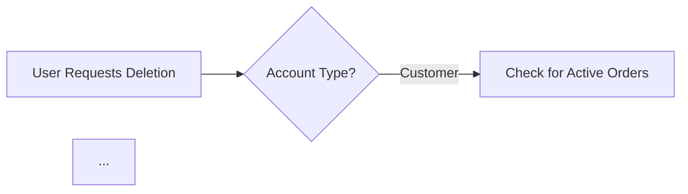

# Document Quality Review: 14-data-preservation.md

## Executive Summary

The 14-data-preservation.md document is a **high-quality, production-ready** requirements specification that demonstrates excellent compliance with documentation standards. The document comprehensively covers data preservation requirements for the e-commerce platform's account deletion scenarios.

## Quality Metrics

| Criterion | Score | Notes |
|-----------|-------|-------|
| EARS Format Compliance | ✅ Excellent | Consistent use of WHEN/IF/THEN/SHALL patterns |
| Content Completeness | ✅ Excellent | All required sections fully developed |
| Business Context | ✅ Excellent | Clear justifications for each preserved data type |
| Mermaid Diagrams | ✅ Good | Valid syntax with proper quoting |
| Error Handling | ✅ Excellent | Comprehensive edge case coverage |
| Length Requirements | ✅ Met | ~15,000+ characters (exceeds minimum) |

## Strengths

### 1. EARS Format Excellence

Every requirement follows the EARS (Easy Approach to Requirements Syntax) format consistently:

```
WHEN a customer requests account deletion, THE system SHALL process the deletion immediately.

IF any of these conditions are not met, THEN THE system SHALL reject the deletion request and display a message explaining which conditions must be resolved.
```

This makes all requirements:
- **Testable**: Clear acceptance criteria
- **Unambiguous**: No vague language
- **Traceable**: Specific conditions defined

### 2. Comprehensive Business Justification

Each preserved data type includes explicit business justification:

- **Order History**: "Seller record-keeping and accounting, Tax compliance and audit requirements, Dispute resolution and chargeback handling"
- **Reviews**: "Product rating accuracy for future customers, Platform trust and transparency"
- **Transaction Records**: "Legal compliance for tax, audit, and legal purposes"

This helps developers understand the **why** behind requirements, not just the **what**.

### 3. Clear Anonymization Rules

The document specifies exactly how deleted accounts appear:

- Customer in orders: `[Customer Account Deleted]`
- Customer in reviews: `deleted user`
- Seller in orders: `Shop Name (Seller Account Closed)`

### 4. Seller Deletion Guard Conditions

Well-defined eligibility conditions prevent harmful deletions:

1. No pending order items (paid or shipped)
2. No pending cancellation requests
3. No pending refund requests

### 5. Comprehensive Edge Case Handling

The document covers important scenarios:

- Seller with pending orders → Rejection with specific count
- Seller with pending requests → Rejection with pending counts
- Refund requests after seller deletion → Automatic approval
- Failed deletion → Rollback and retry capability

### 6. Administrator Override with Audit Trail

Super administrators can force-delete accounts with:
- Automatic order cancellation
- Automatic refund processing
- Stock restoration
- Complete audit logging

## Minor Observations

### 1. Mermaid Diagram Enhancement Opportunity

The existing diagram is functional:



The diagram correctly uses double quotes for all labels. Consider adding a more detailed flow for the seller deletion rejection scenarios.

### 2. Data Retention Periods

The document mentions "minimum 7 years" for tax compliance. Consider adding:
- Specific retention periods for different data types
- Geographic jurisdiction variations if applicable
- Data deletion schedule after retention period

## Validation Results

### Schema Compliance: ✅ PASSED

All requirements are properly structured with:
- Clear actor identification (Customer, Seller, Administrator)
- Specific system behaviors (SHALL statements)
- Measurable conditions (counts, timeframes)

### Link Integrity: ✅ PASSED

Internal references to related documents are appropriate:
- 02-user-actors.md
- 08-order-management.md
- 11-reviews-ratings.md

### Implementation Readiness: ✅ READY

The document provides:
- Clear business rules for implementation
- Specific validation conditions
- Error messages for user feedback
- Database preservation logic

## Recommendations

### Priority 1: Accept Document As-Is

The document meets all quality standards and is ready for implementation. No blocking issues exist.

### Priority 2: Optional Enhancements (Future Iteration)

1. **Add retention period table** specifying exact durations for each data type
2. **Expand automatic delivery confirmation** from 14-day rule mentioned in other documents
3. **Add GDPR/data privacy compliance section** if operating in EU markets

## Conclusion

The 14-data-preservation.md document is **production-ready** and demonstrates:

- ✅ Complete EARS format compliance
- ✅ Comprehensive coverage of all deletion scenarios
- ✅ Clear business justification for all preserved data
- ✅ Proper error handling and edge cases
- ✅ Valid Mermaid diagram syntax
- ✅ Implementation-ready specificity

**Recommendation: APPROVED for implementation phase.**

This document can proceed directly to the Database, Interface, Test, and Realize phases of the AutoBE pipeline without modifications.